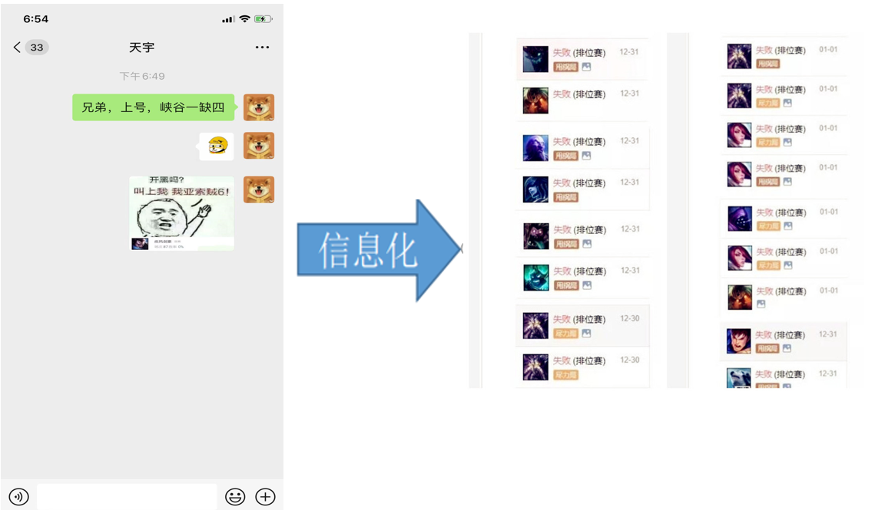

> 本专栏将使用Java语言实现所有数据结构（如有需要，也可以用C++实现）。本专栏将会从基础开始，循序渐进，也请大家多多支持。数据结构虽然难，但只要肯坚持，一定能学好，希望大家都能够从中获益。
>
> > *本专栏的所有代码都将更新在Gitee上，项目地址：*https://gitee.com/codinginn/data-structure-and-algorithm.git

## 什么是数据结构

> 人类社会的发展，迄今经历了和经历着三个浪潮：第一次浪潮为农业阶段，从约1万年前开始；第二次浪潮为工业阶段，从17世纪末开始；第三次浪潮为正在到来的信息化阶段。——《第三次浪潮（1980版)》,阿尔文·托夫勒  

第三次浪潮正在不断影响我们的生活，在日常生活中，人们已经离不开信息化的支持，例如当我们想和朋友沟通约朋友开黑打一局LOL,或者看看朋友最近动态的时候，离不开信息化的支持:

打游戏打累了，准备去海底捞吃一顿，提前在海底捞预约的过程，也需要通过信息化将预约信息提交到海底捞：

那么，数据结构在学什么？简单来说，数据结构就是研究如何用代码把现实世界信息化，并且利用计算机高效地处理这些信息从而创造价值的学科。一般来说，用计算机解决一个具体问题时，你需要先从具体问题中抽象出一个适当的数学模型，然后设计一个解决此模型的算法，最后编出程序，而寻求数学模型的过程就是找出操作对象之间的关系，并用数学语言描述出来。此时，数据结构就诞生了，随着计算机应用的越发广泛，问题越来越复杂，也就产生了对应的数据结构用于解决对应的问题，而这些解决问题的数据结构前辈们都设计好了，我们的任务就是掌握它们。

在人类历史发展的进程中，人们学会了农耕，从动物走向人类，接着蒸汽机的出现，人类生产与制造方式逐渐转为机械化，出现了以机器取代人力、畜力的趋势，人类走向了机器时代，接着计算机的出现，人们进入了高度信息化的世界，那么信息化后之后的趋势是什么，是二次元、元宇宙还是脑电波时代？

## 如何学好数据结构

接触过数据结构的同学常常会觉得数据结构很难，它难在哪呢？概念多、抽象、逻辑性强。那么该如何学好数据结构呢？首先就是要多锻炼自己，多思考，人的脑子长时间不用就会生锈，每天保持大脑的有效思考， 能够使你的思维越来越灵活。然后就是多写代码，这个自然不用多说，编程要的就是多写，学完一个知识点后，自己动手实现一下程序，出问题就设法解决。

