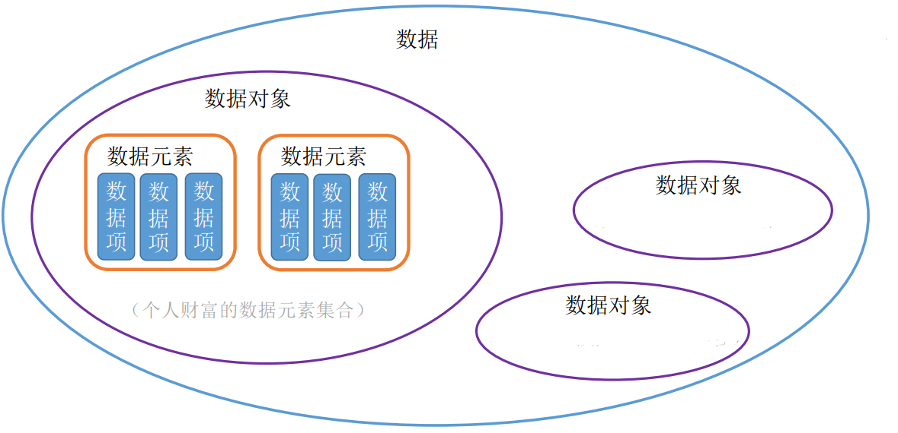

## 数据结构基本概念

### 数据


数据是信息的载体，是描述客观事物属性的数、字符及所有能输入到计算机中并被计算机程序识别和处理的符号的集合。数据是计算机程序加工的原料。  

在早起，计算机只用于处理纯数值型问题，不能用来打游戏，听音乐等:


现代计算机常用语处理非数值型问题，对于非数值型的问题：

1. 我们关心每个个体的具体信息
2. 我们还关心个体之间的关系


### 数据元素，数据项

数据元素是数据的基本单位，通常作为一个整体进行考虑和处理。一个数据元素可由若干数据项组成，数据项是构成数据元素的不可分割的最小单位。  

以一个人的财富信息为例，一个人的财富信息可被认为是数据元素，姓名，财富，财富来源这些具体的项称为数据项:


### 数据对象，数据结构

#### 什么是数据对象？

数据对象是具有相同性质的数据元素的集合，是数据的一个子集。  

数据结构是相互之间存在一种或多种特定关系的数据元素的集合。  



在代码中表现如下：

```java
public class PersonWealth {
    private String name;//姓名
    private Double money;//财富
    private String moneyFromWhere;//财富来源
}
```

#### 什么是数据结构？

顾名思义，数据结构指的是数据的结果，数据对象可能以多种形式存在，比如链表的形式，图的形式等等:


#### 数据结构的三要素


数据结构这门课着重关注的是数据元素之间的关系，和对这些数据元素的操作，而不关心具体的数据项内容。

#### 逻辑结构

逻辑结构有线性结构:


树形结构:


图结构:


这些解构后面都会一一讲解。

##### 数据的运算

针对于某种逻辑结构，结合实际需求，定义基本运算

例如线性表,基本的运算可能有查找第i个元素，在第i个位置插入新的数据元素，删除第i个位置的元素等等:


#### 物理结构

数据的物理结构指的是数据的存储结构，包括顺序存储，链式存储，索引存储和三列存储等。

顺序存储：


链式存储:


索引存储:

索引存储常通过数据的特点直接寻找到数据在内存的相应位置，常用的方法是将数据存放在数组中，根据hash值直接在内存中取得相应的数据项:


#### 数据类型、抽象数据类型

数据类型、抽象数据类型：

数据类型是一个值的集合和定义在此集合上的一组操作的总称，可分为原子类型和结构类型:

1. 原子类型。其值不可再分的数据类型。
2. 结构类型。其值可以再分解为若干成分（分量）的数据类型。

原子类型指不可拆分的类型，例如bool类型，int类型:


结构类型指，在将原子类型或不同的结构组织在一起的类型，例如结构体和类:

