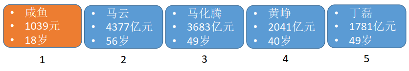
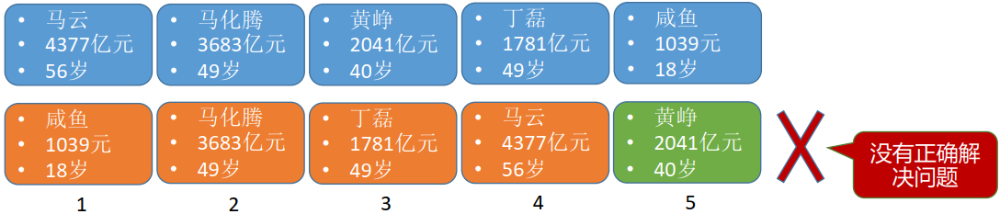
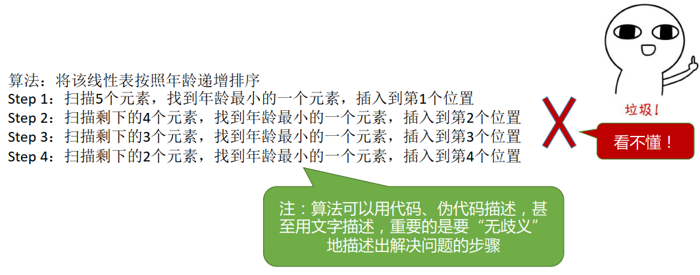

## 算法的基本概念

### 什么是算法

从广义的角度来说，程序=数据结构+算法。数据结构用于正确地描述现实世界的问题，并存入计算机，算法用于高效地处理这些数据，以解决实际问题。

具体来说，算法（Algorithm）是对特定问题求解步骤的一种描述，它是指令的有限序列，其中的每条指令表示一个或多个操作  ，例如现在要做一到番茄炒蛋:

以一个实际问题来解释什么是算法，现在有一个线性表:

那么如何将该线性表安装年龄递增排序?

Step 1：扫描5个元素，找到年龄最小的一个元素，插入到第1个位置

Step 2：扫描剩下的4个元素，找到年龄最小的一个元素，插入到第2个位置

Step 3：扫描剩下的3个元素，找到年龄最小的一个元素，插入到第3个位置

Step 4：扫描剩下的2个元素，找到年龄最小的一个元素，插入到第4个位置

至此，线性表已经按年龄排序好了，这也是插入排序法的过程。

### 算法的五个特性

**有穷性**:一个算法必须总在执行有穷步之后结束，且每一步都可在有穷时间内完成。

**确定性**：算法中每条指令必须有确切的含义，对于相同的输入只能得出相同的输出。

**可行性**：算法中描述的操作都可以通过已经实现的基本运算执行有限次来实现。

**输入**:一个算法有零个或多个输入，这些输入取自于某个特定的对象的集合。

**输出**:一个算法有一个或多个输出，这些输出是与输入有着某种特定关系的量。

### 好算法的特质

1.**正确性**，算法应能够正确地解决求解问题。

2.**可读性**,算法应具有良好的可读性，以帮助人们理解。

3.**健壮性，**输入非法数据时，算法能适当地做出反应或进行处理，而不会产生莫名其妙的输出结果。

4.**高效率**与低**存储量需求**

## 算法的时间复杂度

谈到如何评估算法的时间开销，有人会问，能否让算法先运行起来，运行结束后再统计所用的时间?答案是不行的，应为存在以下问题:

+ 和机器性能有关，如：银河超算  v.s. 小霸王游戏机

+ 和编程语言有关，越高级的语言执行效率越低，同样的算法，C语言编写的程序运行时间小于Java、Python、JS等程序
+  和编译程序产生的机器指令质量有关
+ 有些算法是不能事后再统计的，如：导弹控制算法

所以需要事先评估算法时间开销T(n),其中T表示“time”。

下面以一个例子来描述算法复杂度:

如何用算法来表白---"爱你n遍"。

语句频度：

① ——1次

② ——3001次

③④ ——3000次

⑤ ——1次  

此时：

T(3000) = 1 + 3001 + 2*3000 + 1

时间开销与问题规模 n 的关系：T(n)=3n+3  

那么问题来了，如果有好几千行代码，按这种方法一行一行地数是否太麻烦？

所以可以将T(n)进行简化:

所以可以近似算法的时间复杂度:

常见的算法复杂度比较:

再看爱你3000遍代码:

时间开销与问题规模n的关系为T(n)=3n+3=O(n)。

练习：

计算上述算法的时间复杂度 T(n)：

设最深层循环的语句频度（总共循环的次数）为 x，则由循环条件可知，循环结束时刚好满足 $2^x>n$

$x=log_2n$

$T(n)=O(x)=O(log_2n)$

### 几个常用的算法复杂度指标

**最坏时间复杂度**：最坏情况下算法的时间复杂度

平均时间复杂度：所有输入示例等概率出现的情况下，算法的期望运行时间

**最好时间复杂度**：最好情况下算法的时间复杂度  

### 总结

## 算法的空间复杂度

算法的时间复杂度用于衡量时间开销与问题规模之间的关系，而空间复杂度用于衡量内存开销与问题规模之间的关系。

以如下例子为例:

无论问题规模怎么变，算法运行所需的内存空间都是固定的常量，算法空间复杂度为:

$S(n)=O(1)$,S表示"Space"

再举几个例子:

例1:

例2:

例3：

例4：

例5：

### 总结

