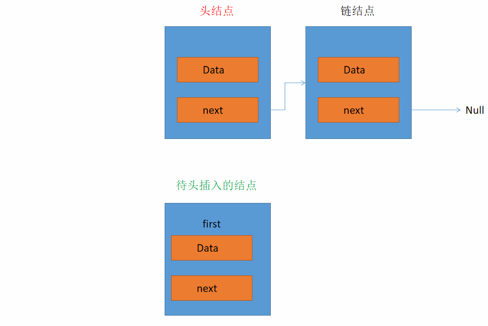
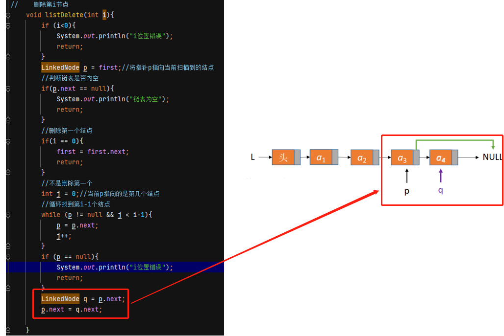
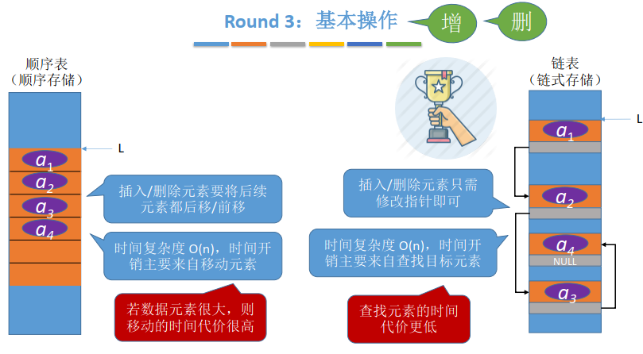

## 线性表的介绍

线性表是具有相同数据类型的n（n≥0）个数据元素的有限 序列，其中n为表长，当n = 0时线性表是一个空表。若用L命名线性表，则其一般表示为:

$L=(a_1,a_2,...,a_i,a_{i+1},...,a_n)$

除第一个元素外，每个元素有且仅有一个直接前驱；除最后一个元素外，每个元素有且仅有一个直接后继:


## 线性表的定义

线性表的英文名字为Linear List:


生活中处处充满了线性表，如学号表，每日代办事项等等:


## 顺序表的基本操作

为什么要实现对数据结构的基本操作？

1. 团队合作编程，你定义的数据结构要让别人能够很方便的使用（封装）
2. 将常用的操作/运算封装成函数，避免重复工作，降低出错风险

顺序表的基本结构由数组组成，即用静态数组或动态数组存放数据元素，接下来将从数组的插入、删除和查找讲解顺序表的基本操作。顺序表的基本结构如下所示:

```java
public class SqList {
    public final int MaxSize = 100000;      //定义最大长度
    public int[] data = new int[MaxSize];   //用静态的数组存放数据元素
    public int length;                      //顺序表的当前长度
}
```

### 顺序表的插入

插入的时候需要检测是否空间足够，在某个位置插入元素需要先将该位置以后包括该位置的所有元素后移，然后再改位置插入新的元素。**动图演示如下**：**以capacity为4，size为3的情况举例，在1的位置插入数据举例:**


添加插入以及显示的代码如下所示:

```java
package _001SqList;


public class SqList {
    public final int MaxSize = 100000;      //定义最大长度
    private int[] data = new int[MaxSize];   //用静态的数组存放数据元素
    private int length=0;                      //顺序表的当前长度

    //在第i处插入元素e，i从0开始
    boolean listInsert(int i,int e){
        //好的算法应该具有健壮性，能处理异常情况，并给使用者反馈
        if(i < 0 || i > length){
            System.out.println("输入的位置i不合理");
            return false;
        }

        if(length >= MaxSize){
            System.out.println("数组长度达到最大，无法继续插入");
            return false;
        }

        //将第i个元素及之后的元素后移
        for(int j = length-1;j>=i;j--){
            data[j+1] = data[j];
        }

        data[i] = e;//在位置i处放入e
        length++;//长度加1
        return true;
    }

    //显示所有的元素
    public void show(){
        for(int i=0;i<length;i++){
            System.out.println(data[i]);
        }
    }
    public static void main(String[] args) {
        SqList sqList = new SqList();;//创建sqList对象
        //向顺序表中插入元素
        for(int num=0;num<10;num++){
            sqList.listInsert(0,num);
        }

        //显示元素
        sqList.show();
    }
}

```

### 顺序表的删除

顺序表的删除和插入的过程相反，在某个位置删除元素需要先将该位置以后所有元素向前移。**动图演示如下**：**以capacity为4，size为3的情况举例，在0的位置删除数据举例:**


添加删除的代码如下所示:

```java
package _001SqList;

import java.lang.reflect.Array;
import java.util.ArrayList;

public class SqList {
    public final int MaxSize = 100000;      //定义最大长度
    private int[] data = new int[MaxSize];   //用静态的数组存放数据元素
    private int length=0;                      //顺序表的当前长度

    //在第i处插入元素e，i从0开始
    boolean listInsert(int i,int e){
        //好的算法应该具有健壮性，能处理异常情况，并给使用者反馈
        if(i < 0 || i > length){
            System.out.println("输入的位置i不合理");
            return false;
        }

        if(length >= MaxSize){
            System.out.println("数组长度达到最大，无法继续插入");
            return false;
        }

        //将第i个元素及之后的元素后移
        for(int j = length-1;j>=i;j--){
            data[j+1] = data[j];
        }

        data[i] = e;//在位置i处放入e
        length++;//长度加1
        return true;
    }

    //删除第i个元素
    boolean listDelete(int i){
        //好的算法应该具有健壮性，能处理异常情况，并给使用者反馈
        if(i < 0 || i >= length){
            System.out.println("删除的位置i不合理");
            return false;
        }

        //将第i个元素后的元素前移
        for(int j = i+1;j<length;j++){
            data[j-1] = data[j];
        }
        length--;//长度加1
        return true;
    }

    //显示所有的元素
    public void show(){
        for(int i=0;i<length;i++){
            System.out.println(data[i]);
        }
    }
    public static void main(String[] args) {
        SqList sqList = new SqList();;//创建sqList对象
        //向顺序表中插入元素
        for(int num=0;num<10;num++){
            sqList.listInsert(0,num);
        }

        if(sqList.listDelete(2)){
            System.out.println("删除下标为2的元素成功");
        }
        else {
            System.out.println("删除下标不合理，删除失败");
        }

        //显示元素
        sqList.show();
    }
}
```

### 顺序表的查找

#### 按位置查找

按位置查找比较简单，直接返回第i个位置的数据即可，需要注意的是，不能忘记判断i位置的合法性。

按位置查找的代码如下所示:

```java
 //按位置查找
    boolean getElem(int i){
        if(i < 0 || i >= length){
            System.out.println("查找的位置i不合理");
            return false;
        }
        System.out.println("第"+i+"个元素是"+data[i]);
        return true;
    }
```

由于顺序表的各个数据元素在内存中连续存放，因此可以根据起始地址和数据元素大小立即找到第 i 个元素——“随机读取取”特性 。

#### 按值查找

本小节的任务是查找第一个元素值等于e的元素，并返回其位置，如果不存在则返回-1。

要想实现该任务，基本思路是遍历数组，依次判断，直到匹配到第一个相等的位置，如果不存在，则返回-1，具体代码如下:

```java
//按值查找
int getElemByData(int e){
    for(int i=0;i<length;i++){
        if(data[i] == e){
            return i;
        }
    }
    return -1;
}
```

本小节的所有代码如下:

```java
package _001SqList;

import java.lang.reflect.Array;
import java.util.ArrayList;

public class SqList {
    public final int MaxSize = 100000;      //定义最大长度
    private int[] data = new int[MaxSize];   //用静态的数组存放数据元素
    private int length=0;                      //顺序表的当前长度

    //在第i处插入元素e，i从0开始
    boolean listInsert(int i,int e){
        //好的算法应该具有健壮性，能处理异常情况，并给使用者反馈
        if(i < 0 || i > length){
            System.out.println("输入的位置i不合理");
            return false;
        }

        if(length >= MaxSize){
            System.out.println("数组长度达到最大，无法继续插入");
            return false;
        }

        //将第i个元素及之后的元素后移
        for(int j = length-1;j>=i;j--){
            data[j+1] = data[j];
        }

        data[i] = e;//在位置i处放入e
        length++;//长度加1
        return true;
    }

    //删除第i个元素
    boolean listDelete(int i){
        //好的算法应该具有健壮性，能处理异常情况，并给使用者反馈
        if(i < 0 || i >= length){
            System.out.println("删除的位置i不合理");
            return false;
        }

        //将第i个元素后的元素前移
        for(int j = i+1;j<length;j++){
            data[j-1] = data[j];
        }
        length--;//长度加1
        return true;
    }

    //按位置查找
    boolean getElem(int i){
        if(i < 0 || i >= length){
            System.out.println("查找的位置i不合理");
            return false;
        }
        System.out.println("第"+i+"个元素是"+data[i]);
        return true;
    }

    //按值查找
    int getElemByData(int e){
        for(int i=0;i<length;i++){
            if(data[i] == e){
                return i;
            }
        }
        return -1;
    }

    //显示所有的元素
    public void show(){
        for(int i=0;i<length;i++){
            System.out.println(data[i]);
        }
    }
    public static void main(String[] args) {
        SqList sqList = new SqList();;//创建sqList对象
        //向顺序表中插入元素
        for(int num=0;num<10;num++){
            sqList.listInsert(sqList.length,num);
        }

        System.out.println(sqList.getElemByData(9));
//        if(sqList.listDelete(2)){
//            System.out.println("删除下标为2的元素成功");
//        }
//        else {
//            System.out.println("删除下标不合理，删除失败");
//        }
//        sqList.getElem(1);
        //显示元素
//        sqList.show();
    }
}
```

## 单链表的定义与操作

在上一节中，我们介绍了顺序表，顺序表的存储结构是顺序的，也就是说所有数据在内存中是连续的，优点是可随机取数据，但是要求大片连续空间，改变容量和插入数据不方便，与顺序存储相对应是链式存储，每个节点不仅存放数据元素，还存放指向下一个节点的指针，如下图所示:


顺序表和单链表的逻辑结构都是线性表，但是存储结构不同，顺序表是顺序存储结构，单链表是链式存储结构。在链表中，每个数据项都被包含在“链结点”(Link)中。一个链结点是某个类的对象，这个类可以叫做Link。因为一个链表中有许多类似的链结点，所以有必要用一个不同于链表的类来表达链结点。每个Link对象中都包含一个对下一个链结点引用的字段〈通常叫做next)。但是链表本身的对象中有一个字段指向对第一个链结点的引用。下图显示了这个关系。


下面是一个Link类定义的一部分。它包含了-一些数据和对下一个链结点的引用。

### 单链表定义

单链表的结点由数据域和指针域构成:

```java
//结点
class LinkedNode<T>{
    public T iData;         //数据域
    public LinkedNode<T> next;    //指向下一个结点

    public LinkedNode(T iData) {
        this.iData = iData;
        this.next = null;
    }
    
    public LinkedNode(T iData, LinkedNode<T> next) {
        this.iData = iData;
        this.next = next;
    }
}
```

单链表LinkList只有一个数据项，即对链表中第一个链结点的引用，叫做first，它是唯一一个链表需要维护的信息，用以定位其他的节点，从first出发，沿着链表通过每个结点的next字段就可以找到其他的节点:

```java
class LinkList<T>{
    private LinkedNode<T> first; //链表的第一个结点
    //构造函数
    public void LinkList(){
        first = null;
    }
    //判断链表是否为空
    public boolean isEmpty(){
        return first == null;
    }
    //...省略其他操作代码
}
```

### 单链表操作

下面从单链表的创建，插入，删除，查找等方面讲解单链表的相关操作。

#### 单链表的创建

如果给你很多个数据元素，要把它们存到一个单链表里边，该咋办呢？  

Step 1：初始化一个单链表

Step 2：每次取一个数据元素，插入到表尾/表头

下面分别讲解头插法和尾插法。

##### 头插法

头插法的演示如下所示:



添加头插法的代码如下:

```java
package _002Link;

//结点
class LinkedNode<T>{
    public T iData;         //数据域
    public LinkedNode<T> next;    //指向下一个结点

    public LinkedNode(T iData) {
        this.iData = iData;
        this.next = null;
    }

    public LinkedNode(T iData, LinkedNode<T> next) {
        this.iData = iData;
        this.next = next;
    }

    //输出用
    @Override
    public String toString() {
        return "LinkedNode{" +
                "iData=" + iData +
                ", next=" + next +
                '}';
    }
}

class LinkList<T>{
    private LinkedNode<T> first; //链表的第一个结点
    //构造函数
    public void LinkList(){
        first = null;
    }
    //判断链表是否为空
    public boolean isEmpty(){
        return first == null;
    }
    //头插
    public void insertFirst(T data){
        LinkedNode newNode = new LinkedNode(data);
        newNode.next = first;
        first = newNode;
    }
    //显示所有的数据
    public void showAll(){
        LinkedNode tmp = first;
        while(tmp != null){
            System.out.println(tmp);
            tmp = tmp.next;
        }
    }

}

public class LinkTest {
    public static void main(String[] args) {
        LinkList<Double> linkTest = new LinkList<Double>();
        linkTest.insertFirst(1.1);
        linkTest.insertFirst(2.2);
        linkTest.showAll();
    }
}
```

代码运行结果:


##### 尾插法

尾插法顾名思义就是每次将节点插入到链表的尾部，所以在插入一个结点时，需要先找到最后一个结点，然后将最后一个结点指向新的结点，相关代码如下:

```java
//尾插
public void insertTail(T data){
    LinkedNode newNode = new LinkedNode(data);
    //如果头结点为空，直接赋值
    if(first == null){
        first = newNode;
        return;
    }
    //找到最后一个结点
    LinkedNode tmp = first;
    while(tmp.next != null){
        tmp = tmp.next;
    }
    tmp.next = newNode;
}
```


### 单链表的插入和删除

前面一小节讲解了单链表的头插法和尾插法，这一节讲解如何在指定位置、指定元素的前后插入元素，以及删除指定结点。

#### 按位序插入

在表的**第i个位置**插入指定元素e，需要先找到新节点，然后将新结点插入其后，如下图所示:


动图如下所示：


相应的代码如下:


具体代码如下:

```java
package _002Link;

//结点
class LinkedNode<T>{
    public T iData;         //数据域
    public LinkedNode<T> next;    //指向下一个结点

    public LinkedNode(T iData) {
        this.iData = iData;
        this.next = null;
    }

    public LinkedNode(T iData, LinkedNode<T> next) {
        this.iData = iData;
        this.next = next;
    }

    //输出用
    @Override
    public String toString() {
        return "LinkedNode{" +
                "iData=" + iData +
                ", next=" + next +
                '}';
    }
}

class LinkList<T>{
    private LinkedNode<T> first; //链表的第一个结点
    //构造函数
    public void LinkList(){
        first = null;
    }
    //判断链表是否为空
    public boolean isEmpty(){
        return first == null;
    }
    //头插
    public void insertFirst(T data){
        LinkedNode newNode = new LinkedNode(data);
        newNode.next = first;
        first = newNode;
    }

    //尾插
    public void insertTail(T data){
        LinkedNode newNode = new LinkedNode(data);
        //如果头结点为空，直接赋值
        if(first == null){
            first = newNode;
            return;
        }
        //找到最后一个结点
        LinkedNode tmp = first;
        while(tmp.next != null){
            tmp = tmp.next;
        }
        tmp.next = newNode;
    }

    //指定位置后操作
    public void insertList(int i,T e){
        if(i < 0){
            System.out.println("i位置错误");
            return;
        }
        int j = 0;
        LinkedNode p = first;
        //找到第i个位置
        while(p != null && j < i){
            p = p.next;
            j++;
        }
        if(p == null){
            System.out.println("i位置错误");
            return;
        }
        LinkedNode s = new LinkedNode(e);
        s.next = p.next;
        p.next = s;
    }

    //显示所有的数据
    public void showAll(){
        LinkedNode tmp = first;
        while(tmp != null){
            System.out.println(tmp);
            tmp = tmp.next;
        }
    }
}

public class LinkTest {
    public static void main(String[] args) {
        LinkList<Double> linkTest = new LinkList<Double>();
//        linkTest.insertFirst(1.1);
//        linkTest.insertFirst(2.2);
        linkTest.insertTail(1.1);
        linkTest.insertTail(2.2);
        linkTest.insertList(0,3.3);
        linkTest.showAll();
    }
}
```

测试结果:


#### 指定结点后插

如果要在指定结点后插入一个元素，如下图所示，则操作和上节类似:


相关代码如下：


#### 指定结点前插

如果要在指定结点p的前面插入一个元素e，如下图所示：


那么问题来了，如何找到p结点的前驱结点?


难道需要循环遍历查找p的前驱结点q，再对q进行后插:


其实是没必要这样的，只需要在p结点的位置进行后插，然后交互p结点和新插入的结点的值即可，相应代码如下:


#### 按位序删除

删除表中第i个位置的元素，只需要找到第i-1个结点，将其指针指向第i+1个结点即可:


动图演示如下:


代码如下（这里删除第i个结点，i从0开始计数）:



#### 指定结点删除

如下图所示，如果要删除p位置的元素，该如何操作:


如果以如下方式:

```java
//删除指定结点p
void DeleteNode(LinkedNode p){
    if (p == null){
        System.out.println("要删除的结点为空");
        return;
    }
    LinkedNode q = p.next;
    p.iData = q.iData;
    p.next = q.next;
}
```

当p为最后一个结点的时候，q=p.next会为null，此时调用q.next时会出空指针异常的错误。所以只能从表头开始依次寻找p的前驱,代码如下:

```java
//删除指定结点p
    void deleteNode(LinkedNode p){
        if (p == null || first == null){
            System.out.println("删除失败");
            return;
        }

        //判断是否是头结点
        if(first == p){
            first = first.next;
            return;
        }

        //如果不是头结点，找到p结点的前一个结点
        LinkedNode tmp = first;
        while(tmp != null && tmp.next != p){
            tmp = tmp.next;
        }
        if(tmp == null){
            System.out.println("查不到该结点");
            return;
        }
        LinkedNode q = tmp.next;
        tmp.next = q.next;
    }//删除指定结点p
    void deleteNode(LinkedNode p){
        if (p == null || first == null){
            System.out.println("删除失败");
            return;
        }

        //判断是否是头结点
        if(first == p){
            first = first.next;
            return;
        }

        //如果不是头结点，找到p结点的前一个结点
        LinkedNode tmp = first;
        while(tmp != null && tmp.next != p){
            tmp = tmp.next;
        }
        if(tmp == null){
            System.out.println("查不到该结点");
            return;
        }
        LinkedNode q = tmp.next;
        tmp.next = q.next;
    }
```

## 双链表的定义与操作

单链表V.S.双链表


### 双链表的定义

双链表的结点定义如下:

```java
//结点
class DLinkedNode<T>{
    public T iData;         //数据域
    public DLinkedNode<T> prior;    //指向前一个结点
    public DLinkedNode<T> next;    //指向下一个结点

    public DLinkedNode(T iData) {
        this.iData = iData;
        this.next = null;
        this.prior = null;
    }

    public DLinkedNode(T iData, DLinkedNode<T> next) {
        this.iData = iData;
        this.next = next;
    }
}
```

双链表的定义如下:

```java
class DLinkList<T>{
    private DLinkedNode<T> first; //链表的第一个结点
    //构造函数
    public void LinkList(){
        first = null;
    }
    //判断链表是否为空
    public boolean isEmpty(){
        return first == null;
    }
    //...省略其他操作代码
}
```

### 双链表的插入

双链表插入节点有二步：

（1）获取插入位置前一个节点的指针；

（2）待插入节点的 next 指针指向下一个节点，下一个节点的 prior 指针指向待插入节点，前一个节点的 next 指针指向待插入节点，待插入节点 prior 指针指向前一个节点；（实现方法不唯一）

双链表的插入动图如下图所示:


如果不考虑查找结点，在给定结点p之后插入结点s，相应的代码如下:


### 双链表的删除

双链表删除节点有二步：

（1）获取删除节点的指针；

（2）删除节点前一个节点的 next 指针指向删除节点的下一个节点，即：node->prior->next = node->next，删除节点下一个节点的 prior 指针指向删除节点的前一个节点，即：node->next->prior = node->prior；

双链表的删除动图如下:


相应的代码如下:

```java
//删除p结点
void deleteNode(DLinkedNode p){
    if (p == null){
        System.out.println("删除失败");
        return;
    }
    //如果p结点的后继为null
    if (p.next == null){
        p.prior.next = null;
        return;
    }
    p.next.prior = p.prior;
    p.prior.next = p.next;
}
```

如果要删除指定结点后的一个结点，则代码如下


通过删除后一个结点的操作可以很方便地完成双链表的销毁,代码如下:

```java
//双链表销毁
void destroyDList(){
    //循环释放各个数据结点
    while(first.next != null){
        deleteNode(first);
    }
    first = null;//释放头结点
}
```

### 双链表的遍历

由于头结点和尾结点的存在，双链表可以很方便地进行前向遍历和后向遍历：


## 循环链表的定义和操作

### 循环单链表

循环单链表和单链表的不同在于单链表的尾结点指向null，而循环单链表的尾结点指向头结点:


循环单链表的定义如下

```java
//结点
class CirLinkedNode<T>{
    public T iData;         //数据域
    public CirLinkedNode<T> next;    //指向下一个结点

    public CirLinkedNode(T iData) {
        this.iData = iData;
        this.next = null;
    }

    public CirLinkedNode(T iData, CirLinkedNode<T> next) {
        this.iData = iData;
        this.next = next;
    }
}

class DLinkList<T>{
    private CirLinkedNode<T> first; //链表的第一个结点
    //构造函数
    public void LinkList(){
        first = null;
    }
    //判断链表是否为空
    public boolean isEmpty(){
        return first == null;
    }

    //尾插
    public void insertTail(T data){
        CirLinkedNode newNode = new CirLinkedNode(data);
        //如果头结点为空，直接赋值
        if(first == null){
            first = newNode;
            //头结点指向自己
            first.next = first;
            return;
        }
        //找到最后一个结点
        CirLinkedNode tmp = first;
        while(tmp.next != null){
            tmp = tmp.next;
        }
        tmp.next = newNode;
        //尾结点指向头结点
        newNode.next = first;
    }
    
    //判断结点p是否为循环单链表的表尾结点
    boolean isTail(CirLinkedNode p){
        return p.next == first;
    }
    
}
```

循环单链表的插入和单链表的插入类似，只是在尾插或删除的时候需要注意，尾插时需要将尾结点指向头结点。

循环单链表插入的演示如下:


循环单链表删除的演示如下:


代码如下:


由于链表是循环的，所以不用考虑为结点为空的情况。

### 循环双链表

双链表和循环双链表的不同在于双链表的表头结点的 prior 指向 NULL；表尾结点的 next 指向 NULL，而循环双链表的表头结点的 prior 指向表尾结点，表尾结点的 next 指向头结点：


循环双链表的定义如下:

```java
package _004CirDList;


//结点
class CirLinkedNode<T>{
    public T iData;         //数据域
    public CirLinkedNode<T> prior;    //指向下一个结点
    public CirLinkedNode<T> next;    //指向下一个结点

    public CirLinkedNode(T iData) {
        this.iData = iData;
        this.prior = null;
        this.next = null;
    }

    public CirLinkedNode(T iData, CirLinkedNode next) {
        this.iData = iData;
        this.next = next;
    }
}

class DLinkList<T>{
    private CirLinkedNode first; //链表的第一个结点
    //构造函数
    public void LinkList(){
        first = null;
    }
    //判断链表是否为空
    public boolean isEmpty(){
        return first == null;
    }

    //尾插
    public void insertTail(T data){
        CirLinkedNode newNode = new CirLinkedNode(data);
        //如果头结点为空，直接赋值
        if(first == null){
            first = newNode;
            //头结点指向自己
            first.next = first;
            first.prior = first;
            return;
        }
        //否则找到最后一个结点
        CirLinkedNode tmp = first;
        while(tmp.next != null){
            tmp = tmp.next;
        }
        tmp.next = newNode;
        //尾结点的前驱指向倒数第二个结点
        newNode.prior = tmp;
        //尾结点的后继指向头结点
        newNode.next = first;
        //头结点的前驱指向尾结点
        first.prior = newNode;
    }

    //判断结点p是否为循环单链表的表尾结点
    boolean isTail(CirLinkedNode p){
        return p.next == first;
    }

}


public class CirDListTest {
}
```

循环双链表插入结点的演示如下:


代码如下:

```java
//在p结点之后插入s结点
void insertNextNode(CirLinkedNode p,CirLinkedNode s){
    s.next = p.next;
    p.next.prior = s;
    s.prior = p;
    p.next = s;
}
```

循环双链表删除结点的演示如下:


代码如下:


## 静态链表的定义与操作

### 什么是静态链表

在单链表中，各个结点在内存中星罗棋布、散落天涯。在静态链表，数据会存放在一整片连续的内存空间，各个结点集中安置，如下图所示:


上图的静态链表对应的链式结构为:


### 如何定义一个静态链表

静态链表的java定义结构为:

```java
class StaticLinkedNode{
    int data;
    int next;

    public StaticLinkedNode() {
        this.data = 0;
        this.next = -2;
    }

    public StaticLinkedNode(int data) {
        this.data = data;
        this.next = -2;
    }

    @Override
    public String toString() {
        return "StaticLinkedNode{" +
                "data=" + data +
                ", next=" + next +
                '}';
    }
}

class StaticLinkList{
    private final int MaxSize = 10000;
    public final StaticLinkedNode[] staticLinkedNodes = new StaticLinkedNode[MaxSize];
    //初始化静态链表

    public StaticLinkList() {
        for(int i=0;i<staticLinkedNodes.length;i++){
            staticLinkedNodes[i] = new StaticLinkedNode();
        }
        staticLinkedNodes[0].next = -1;//注意：staticLinkedNodes[0]作为头结点使用，不存放数据
        //把其他结点的 next 设为一个特殊值用来表示结点空闲，如 -2
        //注意：用next等于-3表示该结点是一个尾结点，用于区分尾结点和空闲结点
        for(int i=1;i>staticLinkedNodes.length;i++){
            staticLinkedNodes[i].next = -2;
        }
    }

    //...后续代码
}
```

### 简述基本操作的实现

#### 在位序为i的结点后插入一个结点

1. 找到一个空的结点，存入数据元素 
2. 从头结点出发找到位序为 i-1 的结点 
3. 修改新结点的 next 
4. 修改 i-1 号结点的 next

代码如下：

```java
package _005SLinkList;

import java.util.LinkedList;

class StaticLinkedNode{
    int data;
    int next;

    public StaticLinkedNode() {
        this.data = 0;
        this.next = -2;
    }

    public StaticLinkedNode(int data) {
        this.data = data;
        this.next = -2;
    }

    @Override
    public String toString() {
        return "StaticLinkedNode{" +
                "data=" + data +
                ", next=" + next +
                '}';
    }
}

class StaticLinkList{
    private final int MaxSize = 10000;
    public final StaticLinkedNode[] staticLinkedNodes = new StaticLinkedNode[MaxSize];
    
    //初始化静态链表
    public StaticLinkList() {
        for(int i=0;i<staticLinkedNodes.length;i++){
            staticLinkedNodes[i] = new StaticLinkedNode();
        }
        staticLinkedNodes[0].next = -1;//注意：staticLinkedNodes[0]作为头结点使用，不存放数据
        //把其他结点的 next 设为一个特殊值用来表示结点空闲，如 -2
        //注意：用next等于-3表示该结点是一个尾结点，用于区分尾结点和空闲结点
        for(int i=1;i>staticLinkedNodes.length;i++){
            staticLinkedNodes[i].next = -2;
        }
    }

    //尾插一个结点
    public void insertData(int data){
        int id=0;
        //找到第一个空的结点
        for(;id<MaxSize;id++){
            if(staticLinkedNodes[id].next == -2){
                staticLinkedNodes[id].data = data;
                staticLinkedNodes[id].next = -3;
                break;
            }
        }

        //如果找不到一个空闲的结点，说明容量已经满了
        if(id == MaxSize){
            System.out.println("插入失败");
            return;
        }

        //如果当前链表为空
        if(staticLinkedNodes[0].next == -1){
            staticLinkedNodes[0].next = id;
            return;
        }

        //从头结点开始，依次找到尾结点
        StaticLinkedNode tmp = staticLinkedNodes[0];
        while(tmp.next != -3){
            tmp = staticLinkedNodes[tmp.next];
        }
        //赋值为新的结点
        tmp.next = id;

    }

    //显示所有结点
    void showAllData(){
        //表示当前链表为空
        if(staticLinkedNodes[0].next == -1){
            return;
        }

        StaticLinkedNode tmp = staticLinkedNodes[0];//从头结点开始，依次找到尾结点
        while(tmp.next > 0){
            System.out.println(tmp);
            tmp = staticLinkedNodes[tmp.next];
        }

    }


}

public class SLinkListTest {
    public static void main(String[] args) {
        StaticLinkList staticLinkList = new StaticLinkList();
        staticLinkList.insertData(1);
        staticLinkList.insertData(2);
        staticLinkList.insertData(3);
        staticLinkList.deleteNodei(3);
        staticLinkList.deleteNodei(1);
        staticLinkList.showAllData();
    }
}

```

#### 删除某个节点

1. 从头结点出发找到前驱结点
2. 修改前驱结点的游标
3. 被删除结点 next 设为 -2

代码如下:

```java
//删除第i个结点
    void deleteNodei(int i){
        //如果当前链表为空
        if(staticLinkedNodes[0].next == -1){
            return;
        }

        //如果当前结点没有使用，返回
        if(staticLinkedNodes[i].next == -2){
            return;
        }

        StaticLinkedNode tmp = staticLinkedNodes[0];//从头结点开始，依次找到第i个结点
        //遍历找到第i个结点的前继
        while( tmp.next != -3 && tmp.next != i){
            tmp = staticLinkedNodes[tmp.next];
        }

        //删除的是尾结点
        if(staticLinkedNodes[i].next == -3){
            tmp.next = -3;
            staticLinkedNodes[i].next = -2;
        }
        //删除的不是尾结点
        else{
            tmp.next = staticLinkedNodes[i].next;
            staticLinkedNodes[i].next = -2;
        }

    }
```

运行截图:


## 顺序表和链表的比较





如何选择:

