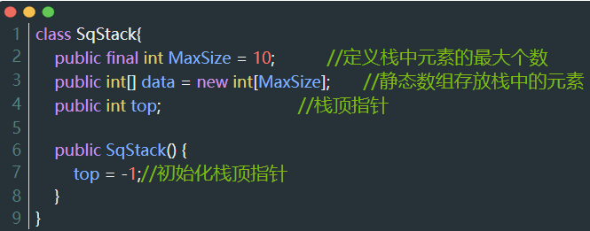

## 1 栈的基本概念

线性表是具有相同数据类型的n（n≥0）个数据元素的有限 序列，其中n为表长，当n = 0时线 性表是一个空表。若用L命名线性表，则其一般表示为

$L=（a_1,a_2,...,a_i,a_{i+1},...,a_n）$

而栈（Stack）是只允许在一端进行插入或删除操作的线性表:


相关定义:

栈是一种特殊的线性结构，先进后出，只能在一段进行操作，我们把允许插入和删除的一端称为栈顶，另一端称为栈底。

- 不含任何数据元素的栈称为空栈。
- 栈的插入操作叫做进栈，也叫做压栈、入栈
- 栈的删除操作，叫做出栈，也叫做弹栈。
- 我们一般吧运行操作的一端叫做top（栈顶），并用一个变量进行标示

入栈和出栈的动图演示如下图所示:


由此可以看出**栈最底部的元素是最先入栈的，而栈顶元素是最后入栈的，但是出栈时则倒了过来，栈顶元素先出栈，栈底元素最后出栈。所以，栈中元素遵循「后进先出」（last-in-first-out，LIFO）的规律。**

在实际应用中通常只会对栈执行以下两种操作:

• 向栈中添加元素，此过程被称为"进栈"（入栈或压栈）

• 栈中提取出指定元素，此过程被称为"出栈"（或弹栈）

**栈的具体实现**

栈是一种 "特殊" 的线性存储结构，因此栈的具体实现有以下两种方式：

• 顺序栈：采用顺序存储结构可以模拟栈存储数据的特点，从而实现栈存储结构；

• 链栈：采用链式存储结构实现栈结构；

下面分别介绍两种栈的实现方式。

## 2 栈的顺序存储实现

顺序栈的定义及内存结构如下图所示:


### 2.1 顺序栈的初始化

顺序栈的初始化只需要将栈顶指针top的值赋值为-1即可:



### 2.2 顺序栈的进栈操作

顺序栈的进栈操作只需要将栈顶加1，将新元素入栈即可，动图如下:


具体代码如下:

```java
public void push(int x){
    if (top == MaxSize-1){ //栈满，报错
        return;
    }
    top += 1;               //栈顶加1
    data[top] = x;          //新元素入栈
}
```

### 2.3 顺序栈的出栈操作

顺序栈的出栈只需要将栈顶减1:


代码如下:

```java
public int pop(int x){
    if (top == -1){ //栈空，报错
        return -1;
    }
    int topValue = data[top];
    top -= 1;               //栈顶减1
    return topValue;
}
```

## 3 栈的链式存储实现

顺序栈的定义及内存结构如下图所示:


### 3.1 链栈的进栈操作

链栈的进栈和出栈，对应的是头结点的变化，如果是入栈，则头结点变为新插入的节点，如果是入栈，则头结点变为头结点的后一个结点，如下图所示:


代码如下:

```java
//push
    public void push(T data){
        LinkedNode newNode = new LinkedNode(data);
        newNode.next = first;
        first = newNode;
    }
```

### 3.2 链栈的出栈操作

```java
//pop
    public T pop(){
        if (first == null){
            System.out.println("链表为空");
            return null;
        }
        T front =  first.iData;
        first = first.next;
        return front;
    }
```

完整代码如下

```java
//链栈

//结点
class LinkedNode<T>{
    public T iData;         //数据域
    public LinkedNode<T> next;    //指向下一个结点

    public LinkedNode(T iData) {
        this.iData = iData;
        this.next = null;
    }

    public LinkedNode(T iData, LinkedNode<T> next) {
        this.iData = iData;
        this.next = next;
    }

    //输出用
    @Override
    public String toString() {
        return "LinkedNode{" +
                "iData=" + iData +
                ", next=" + next +
                '}';
    }
}
//链栈
class LinkedStack<T> {
    public LinkedNode<T> first; //链表的第一个结点

    //构造函数
    public void LinkList() {
        first = null;
    }

    //判断链栈是否为空
    public boolean isEmpty() {
        return first == null;
    }

    //push
    public void push(T data){
        LinkedNode newNode = new LinkedNode(data);
        newNode.next = first;
        first = newNode;
    }

    //pop
    public T pop(){
        if (first == null){
            System.out.println("链表为空");
            return null;
        }
        T front =  first.iData;
        first = first.next;
        return front;
    }

}


public class _002LinkStackTest {

    public static void main(String[] args) {
        LinkedStack<Integer> integerLinkedNode = new LinkedStack<Integer>();

        integerLinkedNode.push(1);
        integerLinkedNode.push(2);
        integerLinkedNode.push(3);

        while(!integerLinkedNode.isEmpty()){
            System.out.println(integerLinkedNode.pop());
        }


    }
}
```

## 4 栈在括号匹配中的应用

所谓括号校验匹配其实质是对多种类型括号正确配对的校验（包括：()、[]、{}）即([])或者[()]为正确的[表达式](https://so.csdn.net/so/search?q=表达式&spm=1001.2101.3001.7020)，如果出现交叉则匹配失败，如[(])或([())则为不正确格式，如下图所示，


从上图可以发现：

:one::每出现一个有括号，就消耗一个左括号

:two::最后出现的左括号最先被匹配

所以可以用栈的特性来解决该问题,算法演示如下：


代码如下:

```java
public static boolean bracketCheck(String str){
    LinkedStack<Character> S = new LinkedStack<Character>(); //初始化一个栈
    for(int i=0;i<str.length();i++){
        //如果扫描到左括号，则入栈
        if(str.charAt(i) == '(' || str.charAt(i) == '[' || str.charAt(i) == '{' ){
            S.push(str.charAt(i));
        }else{
            //扫描到右括号，且当前栈空
            if(S.isEmpty()){
                return false;
            }
            //栈顶元素出栈
            char topElem = S.pop();
            //判断是否匹配
            if(str.charAt(i) == ')' && topElem != '('){
                return false;
            }
            if(str.charAt(i) == ']' && topElem != '['){
                return false;
            }
            if(str.charAt(i) == '}' && topElem != '{'){
                return false;
            }
        }
    }
    //检索完全部括号后，栈空说明匹配成功
    return S.isEmpty();
}
```

完整代码如下:

```java
//链栈

import java.util.Scanner;

//结点
class LinkedNode<T>{
    public T iData;         //数据域
    public LinkedNode<T> next;    //指向下一个结点

    public LinkedNode(T iData) {
        this.iData = iData;
        this.next = null;
    }

    public LinkedNode(T iData, LinkedNode<T> next) {
        this.iData = iData;
        this.next = next;
    }

    //输出用
    @Override
    public String toString() {
        return "LinkedNode{" +
                "iData=" + iData +
                ", next=" + next +
                '}';
    }
}
//链栈
class LinkedStack<T> {
    public LinkedNode<T> first; //链表的第一个结点

    //构造函数
    public void LinkList() {
        first = null;
    }

    //判断链栈是否为空
    public boolean isEmpty() {
        return first == null;
    }

    //push
    public void push(T data){
        LinkedNode newNode = new LinkedNode(data);
        newNode.next = first;
        first = newNode;
    }

    //pop
    public T pop(){
        if (first == null){
            System.out.println("链表为空");
            return null;
        }
        T front =  first.iData;
        first = first.next;
        return front;
    }


}


public class _002LinkStackTest {
    public static boolean bracketCheck(String str){
        LinkedStack<Character> S = new LinkedStack<Character>(); //初始化一个栈
        for(int i=0;i<str.length();i++){
            //如果扫描到左括号，则入栈
            if(str.charAt(i) == '(' || str.charAt(i) == '[' || str.charAt(i) == '{' ){
                S.push(str.charAt(i));
            }else{
                //扫描到右括号，且当前栈空
                if(S.isEmpty()){
                    return false;
                }
                //栈顶元素出栈
                char topElem = S.pop();
                //判断是否匹配
                if(str.charAt(i) == ')' && topElem != '('){
                    return false;
                }
                if(str.charAt(i) == ']' && topElem != '['){
                    return false;
                }
                if(str.charAt(i) == '}' && topElem != '{'){
                    return false;
                }
            }
        }
        //检索完全部括号后，栈空说明匹配成功
        return S.isEmpty();
    }

    public static void main(String[] args) {
//        LinkedStack<Integer> integerLinkedNode = new LinkedStack<Integer>();
//
//        integerLinkedNode.push(1);
//        integerLinkedNode.push(2);
//        integerLinkedNode.push(3);
//
//        while(!integerLinkedNode.isEmpty()){
//            System.out.println(integerLinkedNode.pop());
//        }
        Scanner scanner = new Scanner(System.in);
        String str = scanner.nextLine();  //测试案例:[(())[]]
        System.out.println(bracketCheck(str));


    }
}
```

代码的运行结果如下:


## 5 栈在表达式求值中的应用

下图是我们所熟悉的算术表达式:


该算法表达式由三部分组成:**操作数**、**运算符**、**界限符（界限符指括号，反映了计算的先后顺序）**。忽然有一天，一位来自波兰的数学家有了一个这样的一个灵感:能否可以不用界限符也能无 歧义地表达运算顺序？然后就出现了波兰表达式(前缀表达式)和逆波兰表达式(后缀表达式)。接下来介绍一下中缀表达式、后缀表达式以及前缀表达式分别是什么东西:


### 5.1 中缀表达式

中缀表达式就是我们生活中常见的表达式，如下图所示：


### 5.2 后缀表达式

后缀表达式，又称逆波兰式，不包含括号，运算符放在两个运算对象的后面，所有的计算按运算符出现的顺序，严格从左向右进行（不再考虑运算符的优先规则），非常方便计算机的计算。

后缀表达式计算的具体过程如下：

:one:从左至右扫描表达式，遇到数字时，将数字压入堆栈，遇到运算符时，弹出栈顶的两个数，用运算符对它们做相应的计算，并将结果入栈

:two:重复上述过程直到表达式最右端，最后运算得出的值即为表达式的结果

计算后缀表达式的动态流程如下,以1+2-3*2的后缀表达式为例:


另一个一个案例：

后缀表达式为“2 3 + 4 × 5 -”计算过程如下：
  :one:从左至右扫描，将 2 和 3 压入堆栈；
  :two: 遇到 + 运算符，因此弹出 3 和 2（ 3 为栈顶元素，2 为次顶元素），计算出 3+2 的值，得 5，再将 5 入栈；
  :three: 将 4 入栈；
  :four:接下来是 × 运算符，因此弹出 4 和 5，计算出 4 × 5 = 20，将 20 入栈；
  :five:将 5 入栈；
  :six:最后是-运算符，计算出 20-5 的值，即 15，由此得出最终结果

### 5.3 中缀表达式转后缀表达式过程

中缀转后缀的手算方法（考试时候会用到，这里不做具体讨论，主要讨论算法实现的步骤）： 

:one: 确定中缀表达式中各个运算符的运算顺序 

:two: 选择下一个运算符，按照「左操作数 右操作数 运算符」的方式组合成一个新的操作数 

:three: 如果还有运算符没被处理，就继续 :two:

用代码实现中缀表达式转后缀表达式算法实现的步骤如下：
  :one:初始化两个栈：运算符栈s1和储存中间结果的栈s2；
  :two: 从左至右扫描中缀表达式；
  :three: 遇到操作数时，将其压s2；
  :four: 遇到运算符时，比较其与 s1 栈顶运算符的优先级：
      1)：如果 s1 为空，或栈顶运算符为左括号“(”，则直接将此运算符压入s1；
    2)：否则，若优先级比栈顶运算符的高，也将运算符压入 s1;
    3)：否则，说明优先级小于等于栈顶运算符的优先级，将 s1 栈顶的运算符弹出并压入到 s2 中，再次转到4.1与s1中新的栈顶运算符相比较；
  :five: 遇到括号时：
    1)：如果是左括号“(”，则直接压入 s1；
    2)：如果是右括号“)”，则依次弹出 s1 栈顶的运算符，并压入 s2 ，直到遇到左括号为止，此时将这一对括号丢弃；
  :six: 重复步骤（2）至（5），直到表达式的最右边；
  :seven: 将 s1 中剩余的运算符依次弹出并压入 s2；
  :eight: 依次弹出 s2 中的元素并输出，结果的逆序即为中缀表达式对应的后缀表达式

例如，将中缀表达式“1+((2+3)×4)-5”转换为后缀表达式的过程如下：


表格的形式如下所示:

| 扫描到的元素 | s2(栈底->栈顶)    | s1 (栈底->栈顶) | 说明                               |
| :----------- | :---------------- | :-------------- | :--------------------------------- |
| 1            | 1                 | 空              | 数字，直接入栈                     |
| +            | 1                 | +               | s1为空，运算符直接入栈             |
| (            | 1                 | + (             | 左括号，直接入栈                   |
| (            | 1                 | + ( (           | 同上                               |
| 2            | 1 2               | + ( (           | 数字                               |
| +            | 1 2               | + ( ( +         | s1栈顶为左括号，运算符直接入栈     |
| 3            | 1 2 3             | + ( ( +         | 数字                               |
| )            | 1 2 3 +           | + (             | 右括号，弹出运算符直至遇到左括号   |
| ×            | 1 2 3 +           | + ( ×           | s1栈顶为左括号，运算符直接入栈     |
| 4            | 1 2 3 + 4         | + ( ×           | 数字                               |
| )            | 1 2 3 + 4 ×       | +               | 右括号，弹出运算符直至遇到左括号   |
| –            | 1 2 3 + 4 × +     | –               | -与+优先级相同，因此弹出+，再压入- |
| 5            | 1 2 3 + 4 × + 5   | –               | 数字                               |
| 到达最右端   | 1 2 3 + 4 × + 5 – | 空              | s1中剩余的运算符                   |

代码演示如下:

```java
//中缀转后缀
public static String midTranstoBack(String str){
    LinkedStack<Character> s1 = new LinkedStack<Character>(); //栈s1,用于存储符号
    LinkedStack<Character> s2 = new LinkedStack<Character>(); //栈s2，用于存储数字
    HashMap<Character, Integer> characterHashMap = new HashMap<Character, Integer>();//用于存放优先级，数字越小，优先级越小
    characterHashMap.put('+',0);
    characterHashMap.put('-',0);
    characterHashMap.put('*',1);
    characterHashMap.put('/',1);
    characterHashMap.put('(',2);
    characterHashMap.put(')',2);
    for(int i=0;i<str.length();i++){
        char ch = str.charAt(i);
        //如果是数字,直接放到s2
        if(ch >= '0' && ch <= '9'){
            s2.push(ch);
        }
        else if(ch=='('){ //如果是左括号,直接压入s1
            s1.push(ch);
        }
        else if(ch==')'){ //如果是右括号,则依次弹出 s1 栈顶的运算符，并压入 s2 ，直到遇到左括号为止，此时将这一对括号丢弃
            char tmp = s1.pop();
            while(tmp != '('){
                s2.push(tmp);
                tmp = s1.pop();
            }
        }
        else {//否则为运算符
            {
                // 如果 s1 为空，或栈顶运算符为左括号“(”，则直接将此运算符压入s1
                while (true){
                    if(s1.isEmpty() || s1.top() == '('){
                        s1.push(ch);
                        break;
                    }
                    //get是获取key对应的值,若优先级比栈顶运算符的高，将运算符压入s1
                    else if(characterHashMap.get(ch) > characterHashMap.get(s1.top())){
                        s1.push(ch);
                        break;
                    }
                    //若优先级小于等于栈顶运算符的高，将运算符压入s1
                    else {
                        s2.push(s1.pop());
                    }
                }
            }
        }
    }
    //将 s1 中剩余的运算符依次弹出并压入 s2
    while(!s1.isEmpty()){
        s2.push(s1.pop());
    }
    StringBuffer sb = new StringBuffer();
    //结果的逆序即为中缀表达式对应的后缀表达式
    while (!s2.isEmpty()){
        sb.insert(0,s2.pop());
    }
    return sb.toString();
}
```

关键部分如下图所示:


这里的栈采用的是链式栈，没有使用系统的ArrayList，完整代码如下所示:

```java
//链栈

// symbol match

import java.util.HashMap;
import java.util.Scanner;

//结点
class LinkedNode<T>{
    public T iData;         //数据域
    public LinkedNode<T> next;    //指向下一个结点

    public LinkedNode(T iData) {
        this.iData = iData;
        this.next = null;
    }

    public LinkedNode(T iData, LinkedNode<T> next) {
        this.iData = iData;
        this.next = next;
    }

    //输出用
    @Override
    public String toString() {
        return "LinkedNode{" +
                "iData=" + iData +
                ", next=" + next +
                '}';
    }
}
//链栈
class LinkedStack<T> {
    public LinkedNode<T> first; //链表的第一个结点

    //构造函数
    public void LinkList() {
        first = null;
    }

    //判断链栈是否为空
    public boolean isEmpty() {
        return first == null;
    }

    //push
    public void push(T data){
        LinkedNode newNode = new LinkedNode(data);
        newNode.next = first;
        first = newNode;
    }

    //pop
    public T pop(){
        if (first == null){
            System.out.println("链表为空");
            return null;
        }
        T front =  first.iData;
        first = first.next;
        return front;
    }

    //top 获得栈顶元素
    public T top(){
        if(first == null){
            return null;
        }
        return first.iData;
    }

}


public class _002LinkStackTest {
    
    //中缀转后缀
    public static String midTranstoBack(String str){
        LinkedStack<Character> s1 = new LinkedStack<Character>(); //栈s1,用于存储符号
        LinkedStack<Character> s2 = new LinkedStack<Character>(); //栈s2，用于存储数字
        HashMap<Character, Integer> characterHashMap = new HashMap<Character, Integer>();//用于存放优先级，数字越小，优先级越小
        characterHashMap.put('+',0);
        characterHashMap.put('-',0);
        characterHashMap.put('*',1);
        characterHashMap.put('/',1);
        characterHashMap.put('(',2);
        characterHashMap.put(')',2);
        for(int i=0;i<str.length();i++){
            char ch = str.charAt(i);
            //如果是数字,直接放到s2
            if(ch >= '0' && ch <= '9'){
                s2.push(ch);
            }
            else if(ch=='('){ //如果是左括号,直接压入s1
                s1.push(ch);
            }
            else if(ch==')'){ //如果是右括号,则依次弹出 s1 栈顶的运算符，并压入 s2 ，直到遇到左括号为止，此时将这一对括号丢弃
                char tmp = s1.pop();
                while(tmp != '('){
                    s2.push(tmp);
                    tmp = s1.pop();
                }
            }
            else {//否则为运算符
                {
                    // 如果 s1 为空，或栈顶运算符为左括号“(”，则直接将此运算符压入s1
                    while (true){
                        if(s1.isEmpty() || s1.top() == '('){
                            s1.push(ch);
                            break;
                        }
                        //get是获取key对应的值,若优先级比栈顶运算符的高，将运算符压入s1
                        else if(characterHashMap.get(ch) > characterHashMap.get(s1.top())){
                            s1.push(ch);
                            break;
                        }
                        //若优先级小于等于栈顶运算符的高，将运算符压入s1
                        else {
                            s2.push(s1.pop());
                        }
                    }
                }
            }
        }
        //将 s1 中剩余的运算符依次弹出并压入 s2
        while(!s1.isEmpty()){
            s2.push(s1.pop());
        }
        StringBuffer sb = new StringBuffer();
        //结果的逆序即为中缀表达式对应的后缀表达式
        while (!s2.isEmpty()){
            sb.insert(0,s2.pop());
        }
        return sb.toString();
    }

    public static void main(String[] args) {

        Scanner scanner = new Scanner(System.in);
        String str = scanner.nextLine();  //测试案例1+((2+3)*4)-5
        System.out.println(midTranstoBack(str));

    }
}
```

### 5.4 栈实现后缀表达式的计算

用栈实现后缀表达式的计算流程如下：

:one:从左往右扫描下一个元素，直到处理完所有元素 

:two:若扫描到操作数则压入栈，并回到:one:；否则执行:three: 

:three:若扫描到运算符，则弹出两个栈顶元素，执行相应运算，运算结果压回栈顶，回到:one:

计算后缀表达式的动态流程如下,以1+2-3*2的后缀表达式为例:


对应的代码如下:

```java
public static int calcValue(String str){
    LinkedStack<Integer> s1 = new LinkedStack<Integer>();
    for(int i=0;i<str.length();i++){
        char ch = str.charAt(i);
        if(ch>='0' && ch<='9'){//如果是数字,入栈
            s1.push(ch - '0');
        }
        else {//否则为运算符
            int num1 = s1.pop();
            int num2 = s1.pop();
            //计算完后压栈
            if('+' == ch){
                s1.push(num2+num1);
            }
            else if('-' == ch){
                s1.push(num2-num1);
            }
            else if('*' == ch){
                s1.push(num2*num1);
            }
            else if('/' == ch){
                s1.push(num2/num1);
            }
        }
    }
    //栈顶元素即为计算的结果
    return s1.top();
}
```

测试结果如下:


完整代码如下:

```java
//链栈

// symbol match

import java.util.HashMap;
import java.util.Scanner;

//结点
class LinkedNode<T>{
    public T iData;         //数据域
    public LinkedNode<T> next;    //指向下一个结点

    public LinkedNode(T iData) {
        this.iData = iData;
        this.next = null;
    }

    public LinkedNode(T iData, LinkedNode<T> next) {
        this.iData = iData;
        this.next = next;
    }

    //输出用
    @Override
    public String toString() {
        return "LinkedNode{" +
                "iData=" + iData +
                ", next=" + next +
                '}';
    }
}
//链栈
class LinkedStack<T> {
    public LinkedNode<T> first; //链表的第一个结点

    //构造函数
    public void LinkList() {
        first = null;
    }

    //判断链栈是否为空
    public boolean isEmpty() {
        return first == null;
    }

    //push
    public void push(T data){
        LinkedNode newNode = new LinkedNode(data);
        newNode.next = first;
        first = newNode;
    }

    //pop
    public T pop(){
        if (first == null){
            System.out.println("链表为空");
            return null;
        }
        T front =  first.iData;
        first = first.next;
        return front;
    }

    //top 获得栈顶元素
    public T top(){
        if(first == null){
            return null;
        }
        return first.iData;
    }

}


public class _002LinkStackTest {
    // 括号匹配
    public static boolean bracketCheck(String str){
        LinkedStack<Character> S = new LinkedStack<Character>(); //初始化一个栈
        for(int i=0;i<str.length();i++){
            //如果扫描到左括号，则入栈
            if(str.charAt(i) == '(' || str.charAt(i) == '[' || str.charAt(i) == '{' ){
                S.push(str.charAt(i));
            }else{
                //扫描到右括号，且当前栈空
                if(S.isEmpty()){
                    return false;
                }
                //栈顶元素出栈
                char topElem = S.pop();
                //判断是否匹配
                if(str.charAt(i) == ')' && topElem != '('){
                    return false;
                }
                if(str.charAt(i) == ']' && topElem != '['){
                    return false;
                }
                if(str.charAt(i) == '}' && topElem != '{'){
                    return false;
                }
            }
        }
        //检索完全部括号后，栈空说明匹配成功
        return S.isEmpty();
    }

    //中缀转后缀
    public static String midTranstoBack(String str){
        LinkedStack<Character> s1 = new LinkedStack<Character>(); //栈s1,用于存储符号
        LinkedStack<Character> s2 = new LinkedStack<Character>(); //栈s2，用于存储数字
        HashMap<Character, Integer> characterHashMap = new HashMap<Character, Integer>();//用于存放优先级，数字越小，优先级越小
        characterHashMap.put('+',0);
        characterHashMap.put('-',0);
        characterHashMap.put('*',1);
        characterHashMap.put('/',1);
        characterHashMap.put('(',2);
        characterHashMap.put(')',2);
        for(int i=0;i<str.length();i++){
            char ch = str.charAt(i);
            //如果是数字,直接放到s2
            if(ch >= '0' && ch <= '9'){
                s2.push(ch);
            }
            else if(ch=='('){ //如果是左括号,直接压入s1
                s1.push(ch);
            }
            else if(ch==')'){ //如果是右括号,则依次弹出 s1 栈顶的运算符，并压入 s2 ，直到遇到左括号为止，此时将这一对括号丢弃
                char tmp = s1.pop();
                while(tmp != '('){
                    s2.push(tmp);
                    tmp = s1.pop();
                }
            }
            else {//否则为运算符
                {
                    // 如果 s1 为空，或栈顶运算符为左括号“(”，则直接将此运算符压入s1
                    while (true){
                        if(s1.isEmpty() || s1.top() == '('){
                            s1.push(ch);
                            break;
                        }
                        //get是获取key对应的值,若优先级比栈顶运算符的高，将运算符压入s1
                        else if(characterHashMap.get(ch) > characterHashMap.get(s1.top())){
                            s1.push(ch);
                            break;
                        }
                        //若优先级小于等于栈顶运算符的高，将运算符压入s1
                        else {
                            s2.push(s1.pop());
                        }
                    }
                }
            }
        }
        //将 s1 中剩余的运算符依次弹出并压入 s2
        while(!s1.isEmpty()){
            s2.push(s1.pop());
        }
        StringBuffer sb = new StringBuffer();
        //结果的逆序即为中缀表达式对应的后缀表达式
        while (!s2.isEmpty()){
            sb.insert(0,s2.pop());
        }
        return sb.toString();
    }

    public static int calcValue(String str){
        LinkedStack<Integer> s1 = new LinkedStack<Integer>();
        for(int i=0;i<str.length();i++){
            char ch = str.charAt(i);
            if(ch>='0' && ch<='9'){//如果是数字,入栈
                s1.push(ch - '0');
            }
            else {//否则为运算符
                int num1 = s1.pop();
                int num2 = s1.pop();
                if('+' == ch){
                    s1.push(num2+num1);
                }
                else if('-' == ch){
                    s1.push(num2-num1);
                }
                else if('*' == ch){
                    s1.push(num2*num1);
                }
                else if('/' == ch){
                    s1.push(num2/num1);
                }
            }
        }
        return s1.top();
    }

    public static void main(String[] args) {

        Scanner scanner = new Scanner(System.in);
        String str = scanner.nextLine();  //测试案例1+((2+3)*4)-5,1+2-3*2
        String backStr = midTranstoBack(str);
        System.out.println(backStr);
        System.out.println(calcValue(backStr));


    }
}
```

## 6 栈和递归的关系

什么是递归，举个例子："为了理解递归，必须首先理解递归"。对于初次接触递归的同学，递归可能很难理解，在其最简单的形式中，递归函数是一个可以调用自己的函数，且每一个递归函数都有两个条件：一个是终止条件（终止调用的条件）另一个是递归条件（自己调用自己）。

递归在底层的调用中，会将所有函数调用都先压入调用栈，等到出现终止条件了再从调用栈中依次进行弹出，这也就是所谓的回调（回溯）。

当递归函数没完没了的运行时，将会使得递归函数里面调用栈不断的扩大，但程序中可使用的调用栈空间有限，该程序捡回因栈溢出而终止，出现经典的Stack Overflow错误。

### 6.1 什么时候使用递归？

#### 6.1.1 数学定义是递归的

例如阶乘:

```java
/*阶乘:Fact(n)
(1) 若n=0, 则返回1;
(2) 若n > 1, 则返回n*Fact(n-1);
例子:
*/
 long Fact(int n){
 if(n=0) return -1;
 else return n * Fact(n-1);
}

/*(斐波拉契数列:Fib(n)
(1) 若n=1或n=2, 则返回1;
(2) 若n > 2, 则返回Fib(n-1) + Fib(n-2);
例子:*/
long Fib(int n){ 
 if(n == 1 || n == 2) return 1;
 else return Fib(n-1)+Fib(n-2);
}
```

对于类似这种的复杂问题,若能分解成几个简单且解法类似的子问题来求解,则称为递归求解。

补充:什么时候使用分治法?

(1)能将一个大问题转变为一个小问题,而新问题和原问题解法类似或相同,不同的仅仅是处理的对象,并且这些处理更小且变化是有规律的;(可拆解)

(2)可以通过上述转化而使得问题简单化;(简化问题)

(3)必须有一个明确的递归出口(递归边界);(终止递归的条件)

总结:在递归算法中,如果当递归结束条件成立,只执行Return操作时,分治法求解递归问题算法一般形式可以简化为:

```java
void p(参数表,形参 ){
if(递归结束的条件) Return 结果; //递归边界
else p(参数); //递归的步棸
}
```

#### 6.1.2 数据结构是递归的

其数据结构本身有递归的特性;

 例如:对于链表,其节点LNode的定义有数据域data和指针域dext组成,而指针域next是一种指向LNode类型的指针,即LNode的定义中又用到了其自身,所以链表是一种递归的数据结构;

```java
void TraverseList(LinkList p){
	//递归的终止条件
	if(p == null) return;
	//递归步棸
	else{
		//输出当前节点的数据域
		System.out.println(p->data); 
        	//移动指针,输出下一个节点的数据域
        	TraverseList(p->next);
	}
}
```

#### 6.1.3 问题的解法是递归的

有一类问题,虽然问题本身并没有明显的递归结果,但是采用递归求解比迭代求解更简单,例如:Hanoi塔问题,八皇问题,迷宫问题等。

### 6.2 递归过程与递归函数栈

一个递归函数,在函数的执行过程中,需要多次进行自我调用,那么思考一下,此时的递归函数是如何执行的?

在了解递归函数是如何执行之前,先了解一下任意两个函数之间的调用是如何进行的?在高级语言的程序中，调用函数和被调用函数之间的连接与信息的交换都是通过栈来进行的。通常,当在一个函数的运行期间调用另一个函数时,在运行被调用函数之前,系统要做三件事:

:one: 将所有的实参,返回地址等信息调用传递给被调用函数保存;

:two: 为被调用函数的局部变量分配存储空间;

:three: 将控制权转移到被调用函数入口;

而从被调用函数返回到调用函数之前,系统同样要做三件事情:

:one: 保存被调用函数的计算结果;

:two: 释放被调用函数的数据区;

:three:依照被调用函数保存的返回地址将控制权移动到调用函数;

当多个函数构成嵌套调用时,按照"先调用后返回"的原则,上述函数之间的信息传递和控制传递都必须通过"栈"来实现,即系统程序整个运行时的所需要的数据空间都安排在一个栈中,每当调用一个函数时,就在它的栈顶分配一个存储区,每当这个函数退出时,就释放它的存储区,则当前运行的函数的数据区必须在栈顶。

下图是调用栈的一个案例，先被调用的函数在底部，后调用的函数在上部:


