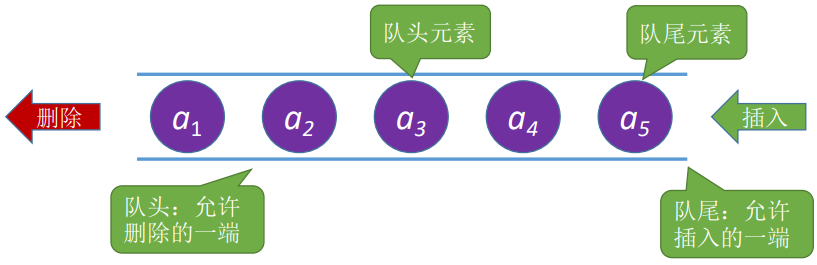
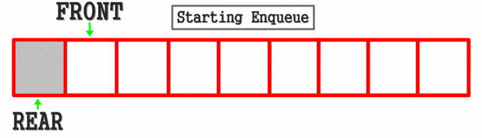
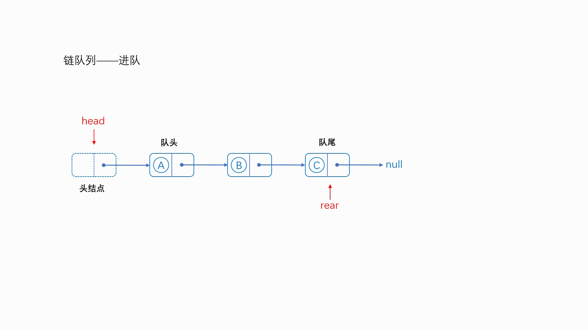
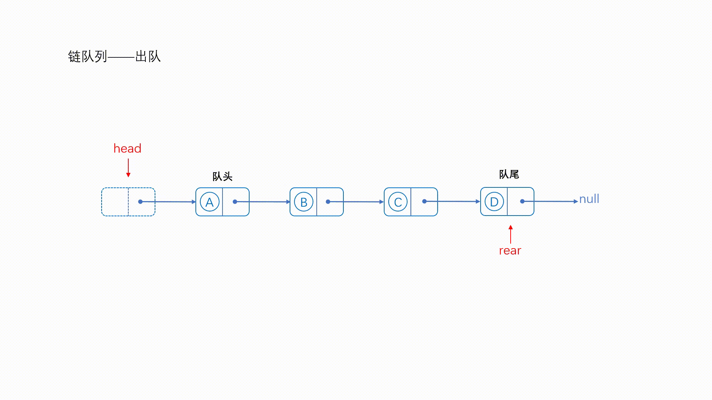
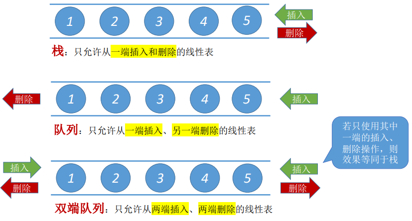
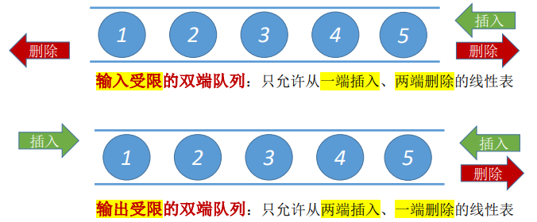

## <span style="color:#ff9900;"><strong>1 队列的基本概念</strong></span>

栈（Stack）是只允许在一端进行插入或删除操作的线性表，与栈相对应的数据结构是队列（Queue），队列是只允许在一端进行插入，在另一端删除的线性表。

队列的特点：先进入队列的元素先出队


队列的相关概念如下:



演示如下:



## <span style="color:#ff9900;"><strong>2 基于数组的队列</strong></span>

### <span style="color:#8064a9;"><strong>2.1数组队列的定义和初始化</strong></span>

数组队列的定义与初始化如下所示:

```java
class SqQueue<T> {
    public final int MaxSize = 100000;      //定义队列中元素的最大个数
    private Object[] data = new Object[MaxSize];   //用静态的数组存放队列元素
    private int front = 0;                      //队头的位置
    private int rear = 0                      //队尾的位置

    public SqQueue() {
        front = 0;
        rear = 0;
    }
}
```

### <span style="color:#8064a9;"><strong>2.2 判断是否为空，或是否满了（进行增/删/查操作前的必要判断条件）</strong></span>

在这里，为了方便判断数组队列是否为空或满了，我们将rear放在最后一个元素的后一个位置，不存放元素，仅表示下一个入队要存放的位置，并且定义如果front当前read，则当前队列没有元素，此时队列为空，如果(rear+1)%MaxSize等于front，则队列已满。相关代码如下:

```java
class SqQueue<T> {
    public final int MaxSize = 4;      //定义队列中元素的最大个数
    private Object[] data = new Object[MaxSize];   //用静态的数组存放队列元素
    private int front = -1;                      //队头的位置
    private int rear = -1;                      //队尾的位置

    //初始化
    public SqQueue() {
        front = -1;
        rear = -1;
    }

    //判断队列是否为空
    public boolean isEmpty(){
        return front == rear;
    }

    //判断队列是否满了
    public boolean isFull(){
        return (rear+1)%MaxSize == front;
    }

    //显示队列所有元素
    public void showAll(){
        int tmp = front;
        if(!isEmpty()){
            do{
                System.out.println(  (T)data[tmp]  );
                tmp += 1;
            }while (tmp != rear);
        }
    }
}
```

### <span style="color:#8064a9;"><strong>2.3 入队</strong></span>

入队操作需要先判断是否满了，如果没满，需要先判断队列是否为空，如果为空，则让第0个元素为待插入数据，rear自增，否则在rear位置插入数据，rear自增，相关代码如下:

```java
//入队
    public boolean enqueue(T x){
        if(isFull()){
            System.out.println("队列已满");
            return false;   //队满则返回false
        }
        if(isEmpty()){
            front = 0;
            data[0] = x;
            rear = 1;
        }
        else {
            data[rear] = x;
            rear = (rear+1)%MaxSize;
        }
        return true;
    }
```

### 2.4 <span style="color:#8064a9;"><strong>出队</strong></span>

队列的出队需要先判断队列是否满了，如果没满，则把front自增，相关代码如下:

```java
//出队
public T dequeue(){
    if(isEmpty()){
        System.out.println("队列为空");
        return null;   //队满则返回false
    }

    T returnValue = (T)data[front];
    front = (front+1)%MaxSize;
    return returnValue;
}
```

### 2.5 <span style="color:#8064a9;"><strong>获取队头元素</strong></span>

获取队头元素只需要将队头的元素返回即可，相关代码如下:

```java
//获取队头元素
public T front(){
    if(isEmpty()){
        System.out.println("队列为空");
        return null;   //队满则返回false
    }

    T returnValue = (T)data[front];
    return returnValue;
}
```

📫以上的全部代码如下:

```java
class SqQueue<T> {
    public final int MaxSize = 4;      //定义队列中元素的最大个数
    private Object[] data = new Object[MaxSize];   //用静态的数组存放队列元素
    private int front = -1;                      //队头的位置
    private int rear = -1;                      //队尾的位置

    //初始化
    public SqQueue() {
        front = -1;
        rear = -1;
    }

    //判断队列是否为空
    public boolean isEmpty(){
        return front == rear;
    }

    //判断队列是否满了
    public boolean isFull(){
        return (rear+1)%MaxSize == front;
    }

    //显示队列所有元素
    public void showAll(){
        int tmp = front;
        if(!isEmpty()){
            do{
                System.out.println(  (T)data[tmp]  );
                tmp += 1;
            }while (tmp != rear);
        }
    }


    //入队
    public boolean enqueue(T x){
        if(isFull()){
            System.out.println("队列已满");
            return false;   //队满则返回false
        }
        if(isEmpty()){
            front = 0;
            data[0] = x;
            rear = 1;
        }
        else {
            data[rear] = x;
            rear = (rear+1)%MaxSize;
        }
        return true;
    }

    //出队
    public T dequeue(){
        if(isEmpty()){
            System.out.println("队列为空");
            return null;   //队满则返回false
        }

        T returnValue = (T)data[front];
        front = (front+1)%MaxSize;
        return returnValue;
    }

    //获取队头元素
    public T front(){
        if(isEmpty()){
            System.out.println("队列为空");
            return null;   //队满则返回false
        }

        T returnValue = (T)data[front];
        return returnValue;
    }


}

public class _01SqQueueTest {
    public static void main(String[] args) {
        SqQueue<Integer> objectSqQueue = new SqQueue<Integer>();
        objectSqQueue.enqueue(1);
        objectSqQueue.enqueue(2);
        objectSqQueue.enqueue(3);
        objectSqQueue.dequeue();
        objectSqQueue.dequeue();
        objectSqQueue.showAll();
    }
}
```

## <span style="color:#ff9900;"><strong>3 基于链表的队列</strong></span>

### <span style="color:#8064a9;"><strong>3.1 链表队列的定义和初始化</strong></span>

链表队列的定义与初始化如下所示:

```java
class LinkNode<T>{
    public T data;
    public LinkNode<T> next;
    
    public LinkNode() {
    }

    public LinkNode(T data) {
        this.data = data;
        next = null;
    }
}

class LinkQueue<T>{
    public LinkNode<T> front = new LinkNode<T>();
    public LinkNode<T> rear = new LinkNode<T>();

    public LinkQueue() {
        front = null;
        rear = null;
    }
}
```

### <span style="color:#8064a9;"><strong>3.2 判断是否为空，或是否满了（进行增/删/查操作前的必要判断条件）</strong></span>

判断是否为空只需要判断头结点是否为null即可:

```java
public boolean isEmpty(){
    return front == null;
}
```

### <span style="color:#8064a9;"><strong><span style="color:#8064a9;"><strong>3.3 入队</strong></span></strong></span>

链队列的入队如下图所示，每次添加在尾部添加，然后将尾部后移到新添加的结点：



代码实现如下：

```java
public void enqueue(T x){
    LinkNode<T> s = new LinkNode<>();
    
    //如果队列为空，则令头结点等于尾结点
    if(isEmpty()){
        front=s;
        rear=s;
    }
    //将新结点插入到尾结点的后面，然后尾结点指向新插入的结点
    else {
        rear.next = s;
        rear = s;
    }

}
```

### <span style="color:#8064a9;"><strong>3.4 出队</strong></span>

链队列的出队如下图所示，每次从图头部出队列，然后将头部后移到下一个结点：



代码实现如下：

```java
//出队,返回的是出队的元素
public T dequeue(){
    //队列为空
    if (front == null){
        return null;
    }
    T returnValue = front.data;
    front = front.next;//头结点指向下一个结点
    //如果front为null，说明所有元素都已经出队，测试令rear等于null
    if(front == null){
        rear = null;
    }
    return returnValue;//将出队的元素返回
}
```

📫以上的全部代码如下:

```java
class LinkNode<T>{
    public T data;
    public LinkNode<T> next;

    public LinkNode() {
    }

    public LinkNode(T data) {
        this.data = data;
        next = null;
    }
}

class LinkQueue<T>{
    public LinkNode<T> front = new LinkNode<T>();
    public LinkNode<T> rear = new LinkNode<T>();

    public LinkQueue() {
        front = null;
        rear = null;
    }

    public boolean isEmpty(){
        return front == null;
    }

    //入队
    public void enqueue(T x){
        LinkNode<T> s = new LinkNode<>(x);

        //如果队列为空，则令头结点等于尾结点
        if(isEmpty()){
            front=s;
            rear=s;
        }
        //将新结点插入到尾结点的后面，然后尾结点指向新插入的结点
        else {
            rear.next = s;
            rear = s;
        }

    }

    //出队,返回的是出队的元素
    public T dequeue(){
        //队列为空
        if (front == null){
            return null;
        }
        T returnValue = front.data;
        front = front.next;//头结点指向下一个结点
        //如果front为null，说明所有元素都已经出队，测试令rear等于null
        if(front == null){
            rear = null;
        }
        return returnValue;//将出队的元素返回
    }

    //显示所有数据
    public void showAll(){
        while(!isEmpty()){
            System.out.println(dequeue());
        }

    }
}

public class _02LinkQueueTest {
    public static void main(String[] args) {
        LinkQueue<Integer> linkQueue = new LinkQueue<>();
        linkQueue.enqueue(1);
        linkQueue.enqueue(2);
        linkQueue.dequeue();
        linkQueue.enqueue(3);
        linkQueue.enqueue(3);
//        linkQueue.dequeue();
        linkQueue.dequeue();
        linkQueue.showAll();
    }
}
```

## <span style="color:#ff9900;"><strong>4 双端队列</strong></span>

双端队列和队列的不同在于队列只能允许从一端插入，另一端删除；而双端队列在两端都可以插入和删除，栈、队列、双端队列的不同如下图所示:



在双端队列的基础上还出现了输入首先的双端队列和输出受限的双端队列：

⭐️输入受限的双端队列：只允许从一端插入、两端删除的线性表

⭐️输出受限的双端队列：只允许从两端插入、一端删除的线性表

如下图所示:



📫以链式队列为例，相应的代码实现如下:

```java
//前面入队
public void push_front(T x){
    LinkNode<T> s = new LinkNode<>(x);

    //如果队列为空，则令头结点等于尾结点
    if(isEmpty()){
        front=s;
        rear=s;
    }
    //将新结点插入到尾结点的后面，然后尾结点指向新插入的结点
    else {
        s.next = front;
        front = s;
    }
}


//后面入队
public void push_back(T x){
    LinkNode<T> s = new LinkNode<>(x);

    //如果队列为空，则令头结点等于尾结点
    if(isEmpty()){
        front=s;
        rear=s;
    }
    //将新结点插入到尾结点的后面，然后尾结点指向新插入的结点
    else {
        rear.next = s;
        rear = s;
    }
}


//前面出队
public T pop_front(){
    //队列为空
    if (front == null){
        return null;
    }
    T returnValue = front.data;
    front = front.next;//头结点指向下一个结点
    //如果front为null，说明所有元素都已经出队，测试令rear等于null
    if(front == null){
        rear = null;
    }
    return returnValue;//将出队的元素返回
}


//后面出队
public T pop_back(){
    //队列为空
    if (front == null){
        return null;
    }
    T returnValue = front.data;
    //队列只有一个元素,则把队列清空，然后返回相应的数据
    if(front == rear){
        front = null;
        rear  = null;
        return returnValue;
    }

    //否则遍历找到尾结点的前一个结点，令其指向null,并返回尾结点对应的数据
    returnValue = rear.data;
    LinkNode<T> tmp = front;
    while(tmp.next != rear){
        tmp = tmp.next;
    }
    tmp.next = null;
    rear = tmp;//尾部等于尾结点的前一个结点，即tmp
    return returnValue;//将出队的元素返回
}
```

注意:以上代码是基于单向链表实现，如果想提高效率可以采用双向链表的形式，这样在两端操作会更高效一点。

📫完整代码如下:

```java
class LinkNode<T>{
    public T data;
    public LinkNode<T> next;

    public LinkNode() {
    }

    public LinkNode(T data) {
        this.data = data;
        next = null;
    }
}

class LinkQueue<T>{
    public LinkNode<T> front = new LinkNode<T>();
    public LinkNode<T> rear = new LinkNode<T>();

    public LinkQueue() {
        front = null;
        rear = null;
    }

    public boolean isEmpty(){
        return front == null;
    }

    //入队
    public void enqueue(T x){
        LinkNode<T> s = new LinkNode<>(x);

        //如果队列为空，则令头结点等于尾结点
        if(isEmpty()){
            front=s;
            rear=s;
        }
        //将新结点插入到尾结点的后面，然后尾结点指向新插入的结点
        else {
            rear.next = s;
            rear = s;
        }

    }

    //出队,返回的是出队的元素
    public T dequeue(){
        //队列为空
        if (front == null){
            return null;
        }
        T returnValue = front.data;
        front = front.next;//头结点指向下一个结点
        //如果front为null，说明所有元素都已经出队，测试令rear等于null
        if(front == null){
            rear = null;
        }
        return returnValue;//将出队的元素返回
    }

    //显示所有数据
    public void showAll(){
        while(!isEmpty()){
            System.out.println(dequeue());
        }

    }

    //前面入队
    public void push_front(T x){
        LinkNode<T> s = new LinkNode<>(x);

        //如果队列为空，则令头结点等于尾结点
        if(isEmpty()){
            front=s;
            rear=s;
        }
        //将新结点插入到尾结点的后面，然后尾结点指向新插入的结点
        else {
            s.next = front;
            front = s;
        }
    }

    //后面入队
    public void push_back(T x){
        LinkNode<T> s = new LinkNode<>(x);

        //如果队列为空，则令头结点等于尾结点
        if(isEmpty()){
            front=s;
            rear=s;
        }
        //将新结点插入到尾结点的后面，然后尾结点指向新插入的结点
        else {
            rear.next = s;
            rear = s;
        }
    }

    //前面出队
    public T pop_front(){
        //队列为空
        if (front == null){
            return null;
        }
        T returnValue = front.data;
        front = front.next;//头结点指向下一个结点
        //如果front为null，说明所有元素都已经出队，测试令rear等于null
        if(front == null){
            rear = null;
        }
        return returnValue;//将出队的元素返回
    }

    //后面出队
    public T pop_back(){
        //队列为空
        if (front == null){
            return null;
        }
        T returnValue = front.data;
        //队列只有一个元素,则把队列清空，然后返回相应的数据
        if(front == rear){
            front = null;
            rear  = null;
            return returnValue;
        }

        //否则遍历找到尾结点的前一个结点，令其指向null,并返回尾结点对应的数据
        returnValue = rear.data;
        LinkNode<T> tmp = front;
        while(tmp.next != rear){
            tmp = tmp.next;
        }
        tmp.next = null;
        rear = tmp;//尾部等于尾结点的前一个结点，即tmp
        return returnValue;//将出队的元素返回
    }
}

public class _02LinkQueueTest {
    public static void main(String[] args) {
        LinkQueue<Integer> linkQueue = new LinkQueue<>();
        linkQueue.enqueue(1);
        linkQueue.enqueue(2);
//        linkQueue.dequeue();
        linkQueue.enqueue(3);
//        linkQueue.enqueue(3);
//        linkQueue.dequeue();
//        linkQueue.dequeue();
        linkQueue.pop_back();
        linkQueue.pop_back();
        linkQueue.pop_back();
        linkQueue.pop_back();
        linkQueue.enqueue(1);
        linkQueue.enqueue(2);
        linkQueue.dequeue();
        linkQueue.enqueue(3);
        linkQueue.push_front(0);
        linkQueue.showAll();
    }
}
```