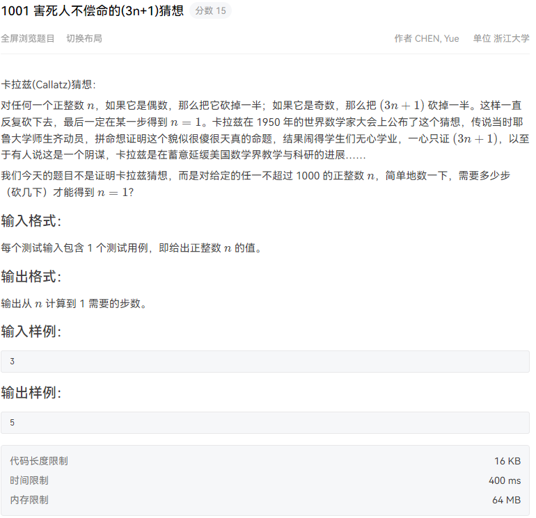

题目来源:[PAT程序设计](https://pintia.cn/problem-sets/994805260223102976/problems/994805325918486528)

## 👀问题描述



## 💬相关知识点介绍

这种题型属于模拟题。模拟题是一类“题目怎么说，你就怎么做”的题目，如果实现起来不太麻烦，就可以称之为“简单模拟”。这类题目不涉及算法，完全只是根据题目描述来进行代码的编写，所以考查的是代码能力。

## :key:思路解析

读入题目给出的n，之后用 while循环语句反复判断n是否为1:

①如果n为1，则退出循环。

②如果n不为1，则判断n是否为偶数，如果是偶数，则令n除以2;否则令n为(3 * n+1)/2。之后令计数器step加1。

这样当退出循环时，step 的值就是需要的答案。

## ✨代码实现

```java
import java.util.Scanner;

//PAT001 https://pintia.cn/problem-sets/994805260223102976/problems/994805325918486528
class Solution{
    public int n,step=0;

    public void calacStep(){
        Scanner scanner = new Scanner(System.in);
        n = scanner.nextInt();
        while( n != 1){
            if (n % 2 == 0){
                n = n/2;
            }
            else {
                n = (3*n + 1) / 2;
            }
            step++;
        }
        System.out.println(step);
    }
}

public class Main {

    public static void main(String[] args) {
        Solution s = new Solution();
        s.calacStep();
    }
}
```