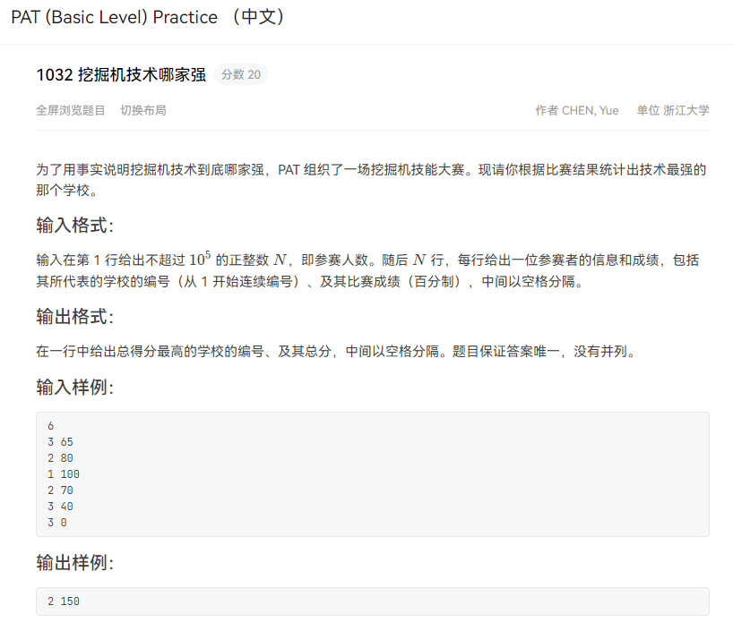

题目来源:[PAT程序设计](https://pintia.cn/problem-sets/994805260223102976/problems/994805289432236032)

## 👀问题描述



## 💬相关知识点介绍

这种题型属于模拟题。模拟题是一类“题目怎么说，你就怎么做”的题目，如果实现起来不太麻烦，就可以称之为“简单模拟”。这类题目不涉及算法，完全只是根据题目描述来进行代码的编写，所以考查的是代码能力。

## :key:思路解析

1. 令数组 school[maxn]记录每个学校的总分，初值为0。对每一个读入的学校schID与其对应的分数score，令school[schID]+=score。
2. 令变量k记录最高总分的学校编号，变量MAX记录最高总分初值为-1。由于学校是连续编号的，因此遍历编号1~N,不断更新k和 MAX 即可。

## ✨参考代码

```java
import java.util.Scanner;

class Solution{
    public int maxn = 100010;
    public int[] school = new int[maxn];    //记录每个学习的总分

    public void solve(){
        int n,schID,score;
        Scanner scanner = new Scanner(System.in);
        n = scanner.nextInt();
        for(int i=0;i<n;i++){
            schID = scanner.nextInt();  //学校ID
            score = scanner.nextInt();  //分数
            school[schID] += score; //学校schID的总分增加score
        }

        int k = 1,MAX=-1;   //最高总分的学校ID以及其总分
        for(int i=1;i<=n;i++){//从所有学校中选出总分最高的一个
            if(school[i] > MAX){
                MAX = school[i];
                k = i;
            }
        }
        System.out.println(k + " " + MAX);
    }

}


public class Main {
    public static void main(String[] args) {
        Solution s = new Solution();
        s.solve();
    }
}
```