十一届蓝桥杯大赛软件类决赛 java a组

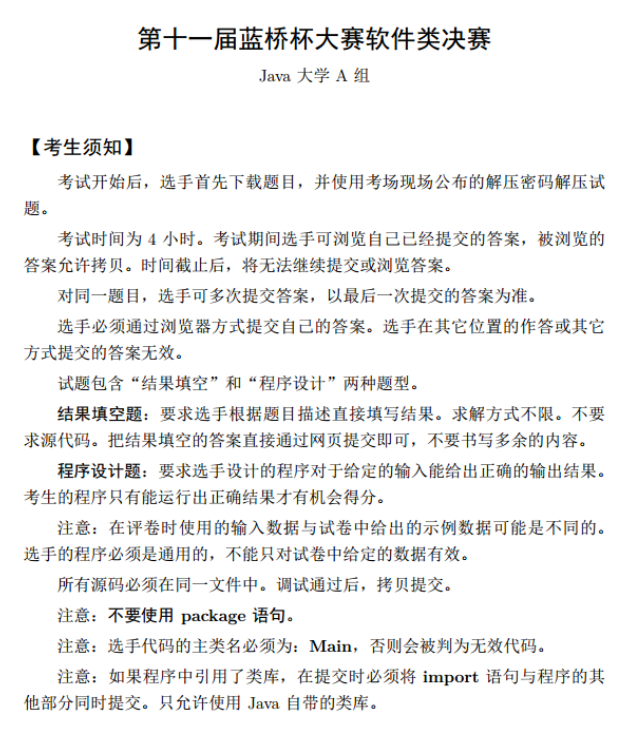

## 试题 **A:** 合数个数

### 👀问题描述

**问题描述**
一个数如果除了 1 和自己还有其他约数，则称为一个合数。

例如：1, 2, 3 不是合数，4, 6 是合数。请问从 1 到 2020 一共有多少个合数。

**答案提交**
这是一道结果填空的题，你只需要算出结果后提交即可。
本题的结果为一个整数，在提交答案时只填写这个整数，填写多余的内容将无法得分。

### ✏️思路解析

在1-2020这些数中，构成有3部分：质数、合数、既非质数亦非合数，既非质数亦非合数只有数字"1"。

### ✨参考代码

```java
// 1:不能有packet
// 2: 类名必须Main, 不可修改
import java.util.Scanner;
 
public class Main { 
    //判断一个数是否为合数
    public static boolean judge(int num){
        for(int i = 2; i <= Math.sqrt(num); i++){
          //有余数，则返回true
          if(num%i == 0){
            return true;
          }
        }
        return false;
    }
    
     public static void main(String[] args) {
      int count = 0;
         //1,2,3都不是合数，所以从4开始
        for(int i = 4; i <= 2020; i++){
          if(judge(i)){
            count++;
          }
        }
        System.out.println(count);
    }
}
```


## 试题 **B:** 含2天数

### 👀问题描述

**问题描述**
小蓝特别喜欢 2，今年是公元 2020 年，他特别高兴，因为每天日历上都可以看到 2。

如果日历中只显示年月日，请问从公元 1900 年 1 月 1 日到公元 9999 年 12月 31 日，一共有多少天日历上包含 2。

即有多少天中年月日的数位中包含数字 2。

答案提交
这是一道结果填空的题，你只需要算出结果后提交即可。
本题的结果为一个整数，在提交答案时只填写这个整数，填写多余的内容将无法得分。


### ✏️思路解析

1. 区分闰年和平年

> <font color="red">闰年的判断：</font>
> ①整百年数除以400，无余为闰，有余为平
> ②非整百年数除以4，无余为闰，有余为平

2. 依次按照判断哪些年份、月份、号数含有2

> 1. 若年份中含有2，则直接加上该年总的天数（注意平年和闰年2月天数不同）
> 2. 若年份中不含有2，实际只需判断2月和12月一共有多少天（注意平年和闰年2月天数不同），其中12月一共有31天。
> 3. 若年份中不含有2，且月份中不含有2，即判断1、3、4、5、6、7、8、9、10、11这10个月中的号数一共有多少天含有2，这10个月的一共含有2的天数是固定的，即10*12天 = 120天。

### ✨参考代码

```java
import java.util.Scanner;


public class Main {
    //判断年份y中是否含有2，如1902、2221都含有2
    public static boolean isInclude2(int year){
        while(year!=0){
            if(year%10 == 2){
                return true;
            }
            year /= 10;
        }
        return false;
    }

    //判断某年是否为闰年
    public static boolean isLeap(int y){

        //整百年数除以400，无余为闰，有余为平
        if((y%100==0) && (y%400==0)){
            return true;
        }
        //非整百年数除以4，无余为闰，有余为平
        if((y%100!=0) && (y%4==0)){
            return true;
        }

        return false;
    }

    public static void main(String[] args) {
        int startYear = 1900;   //起始年份
        int endYear = 9999;     //结束年份
        int numOneYear = 0;     //记录某年中含有2的天数
        int totals = 0;         //记录总的含有2的天数
        int numTenMonths = 120; //1、3、4、5、6、7、8、9、10、11这10个月含有2的天数
        int num12Month = 31;    //12月含有的天数

        for(int y=startYear; y<=endYear; y++){

            //判断该年份是否含有2
            if(isInclude2(y)) {

                //判断是闰年还是平年
                if(isLeap(y)) numOneYear = 366;
                else numOneYear = 365;
            }else {

                if(isLeap(y)){

                    //是闰年则2月份为29天
                    numOneYear = num12Month + numTenMonths + 29;
                }else{

                    //是平年则2月份为28天
                    numOneYear = num12Month + numTenMonths + 28;
                }
            }
            totals += numOneYear;
        }
        System.out.println(totals);
    }
}
```

## 试题C：本质上升序列

### 👀问题描述

问题描述
小蓝特别喜欢单调递增的事物。
在一个字符串中，如果取出若干个字符，将这些字符按照在字符串中的顺序排列后是单调递增的，则成为这个字符串中的一个单调递增子序列。
例如，在字符串 lanqiao 中，如果取出字符 n 和 q，则 nq 组成一个单调递增子序列。类似的单调递增子序列还有 lnq、i、ano 等等。
小蓝发现，有些子序列虽然位置不同，但是字符序列是一样的，例如取第二个字符和最后一个字符可以取到 ao，取最后两个字符也可以取到 ao。小蓝认为他们并没有本质不同。
对于一个字符串，小蓝想知道，本质不同的递增子序列有多少个？
例如，对于字符串 lanqiao，本质不同的递增子序列有 21 个。它们分别
是 l、a、n、q、i、o、ln、an、lq、aq、nq、ai、lo、ao、no、io、lnq、
anq、lno、ano、aio。
请问对于以下字符串

```java
tocyjkdzcieoiodfpbgcncsrjbhmugdnojjddhllnofawllbhfiadgdcdjstemphmnjihecoapdjjrprrqnhgccevdarufmliqijgihhfgdcmxvicfauachlifhafpdccfseflcdgjncadfclvfmadvrnaaahahndsikzssoywakgnfjjaihtniptwoulxbaeqkqhfwl
```


本质不同的递增子序列有多少个？

### ✏️思路解析

设str为题目中的目标字符串，定义dp[i]为以str[i]为结尾时的递增子序列的个数。因为`j<i`，所以遍历j=0~i-1，有如下讨论：

1. str[j] < str[i]，此时dp[i]=dp[i]+dp[j]
2. str[j] == str[i]，此时dp[i]=dp[i]-dp[j]
3. str[j] > str[i]，此时是降序，不考虑

为了观察方便，就以数字2、1、3、8、5、7、4、5为例：

| str  | dp[i] | dp的值 | 递增子序列                                               |
| :--- | :---- | :----- | :------------------------------------------------------- |
| 2    | dp[0] | 1      | 2                                                        |
| 1    | dp[1] | 1      | 1                                                        |
| 3    | dp[2] | 3      | 3, 23, 13                                                |
| 8    | dp[3] | 6      | 8, 28, 18, 38, 238, 138                                  |
| `5`  | dp[4] | 6      | `5, 25, 15, 35, 235, 135`                                |
| 7    | dp[5] | 12     | 7, 27, 17, 37, 237, 137, 57, 257, 157, 357, 2357, 1357   |
| 4    | dp[6] | 6      | 4, 24, 14, 34, 234, 134                                  |
| `5`  | dp[7] | 6      | `5, 25, 15, 35, 235, 135,` 45, 245, 145, 345, 2345, 1345 |

由上面的表格可知，当str[j]=str[i]时，会出现重复的子序列，此时就要减去这一部分，也就是`1. str[j] < str[i]，此时dp[i]=dp[i]+dp[j]`的讨论。

### ✨参考代码

```java
import java.util.Scanner;


public class Main {

    public static void main(String[] args) {
        String str = "tocyjkdzcieoiodfpbgcncsrjbhmugdnojjddhllnofawllbhfiadgdcdjstemphmnjihecoapdjjrprrqnhgccevdarufmliqijgihhfgdcmxvicfauachlifhafpdccfseflcdgjncadfclvfmadvrnaaahahndsikzssoywakgnfjjaihtniptwoulxbaeqkqhfwl";
        int result = 0;
        int[] dp = new int[str.length()];
        for(int i=0; i<str.length(); i++)
            dp[i]=1;

        for(int i=0; i<str.length(); i++){
            for(int j=0; j<i; j++){
                if(str.charAt(j) < str.charAt(i)){
                    dp[i] += dp[j];
                }
                else if(str.charAt(j) == str.charAt(i)){
                    dp[i] -= dp[j];
                }
            }
        }


        for(int i=0; i<str.length(); i++){
            result += dp[i];
        }
        System.out.println(result);
    }
}
```

## 试题D：咫尺天涯

### 👀问题描述

皮亚诺曲线是一条平面内的曲线，下图给出了皮亚诺曲线的 1 阶情形。。。。。

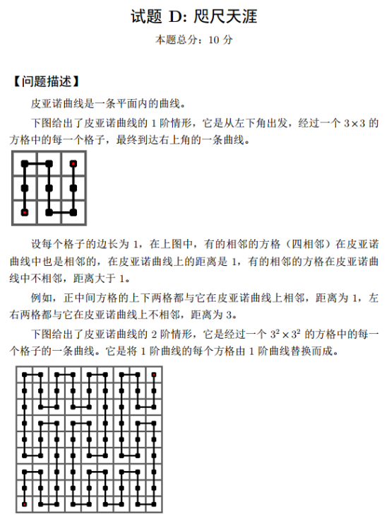

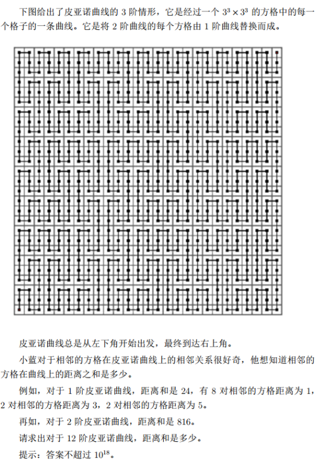

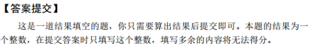

### ✏️思路解析

首先，如果通过暴力打表，然后将所有相邻点差值的和累加起来，当然是不现实的。想想空间复杂度和时间复杂度就明白了。这里我们能够很容易得到空间复杂度是 $O((3^n)^2)$ ，估算一下当$n=14$时，内存至少需要 170445GB，所以用暴力的方式是不现实的。

这里我们将每一个n阶的图都看成一阶的，也就是说把每个n阶的图看成9个n-1阶的图，就转化成了一阶跟二阶的关系，根据二阶的和一阶的x，y之间的关系来逐层降阶。

虽然 n=14我们做不到，但是 n 比较小的时候还是能够处理的嘛。比如：n=1， n=2这样的。先写一个模拟出来，再找找规律看看。

请先看下面两张图，分别为 1 阶皮亚诺曲线和 2 阶皮亚诺曲线大致走向示意图。

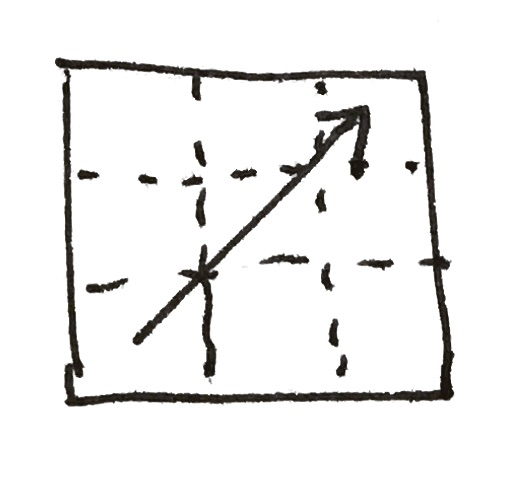

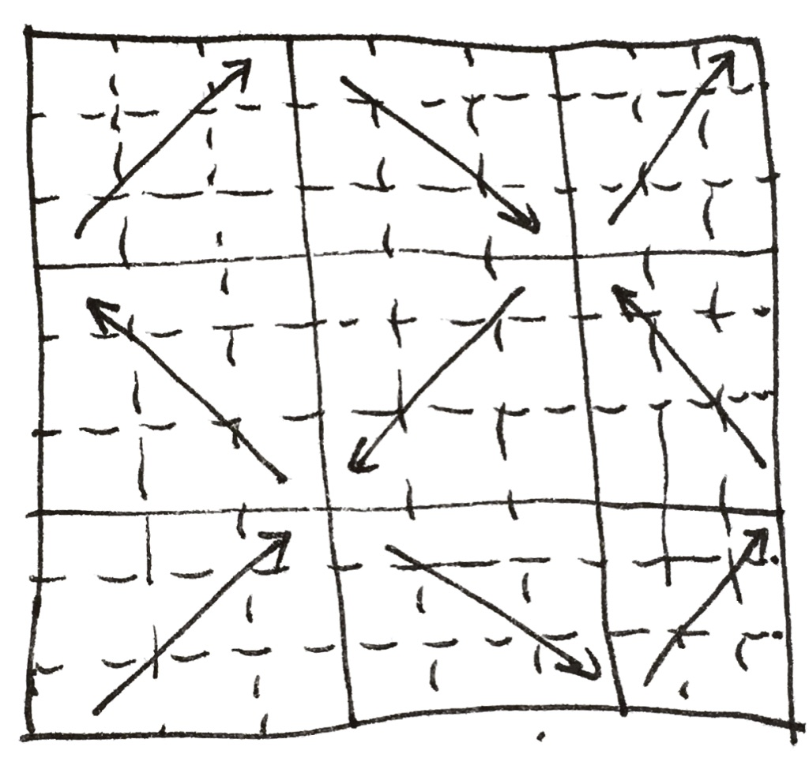

我们发现在所有的皮亚诺曲线中，大致走向只有四个方向：↗️、↖️、↘️、↙️，依次编号为1，2，3，4.

1. ↗️
2. ↖️
3. ↘️
4. ↙️

而皮亚诺曲线升阶（比如1阶变到2阶）过程，就是对基阶皮亚诺曲线进行扩展操作。比如我们看 11 阶升阶为 22 阶就是对↗️走向扩展为 9 个走向↗️↖️↗️ ↘️↙️↘️ ↗️↖️↗️. 到这里如果都能看明白，其他对这个题目解题就很有帮助了。我们接下来要做的就是将四个方向扩展出来的方向列表搞出来，这个可以从二阶扩展到三阶的皮亚诺曲线中得到。

1. ↗️ 扩展为 ↗️↖️↗️ ↘️↙️↘️ ↗️↖️↗️ 对应编号为 `121 343 121`
2. ↖️ 扩展为 ↖️↗️↖️ ↙️↘️↙️ ↖️↗️↖️ 对应编号为 `212 434 212`
3. ↘️ 扩展为 ↘️↙️↘️ ↗️↖️↗️ ↘️↙️↘️ 对应编号为 `343 121 343`
4. ↙️ 扩展为 ↙️↘️↙️ ↖️↗️↖️ ↙️↘️↙️ 对应编号为 `434 212 434`

到这里接下来就变得简单了，当然还有一点需要处理，那就是各个大致行走方向怎么接上的问题，比如：先↗️走，接下来需要↖️走，但是我应该怎样让↗️结束后的那个位置接上↖️开始的位置呢？

那么我们对于所有可能的组合进行的表示（当然并不是所有的方向组合都在这个方向中的，比如↗️接下来就不可能是↙️）：

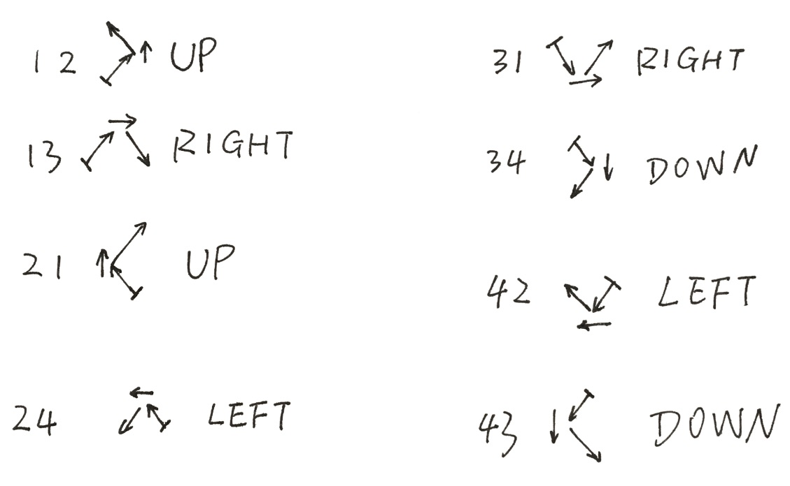

那对于大致方向与大致方向之间的连接关系我们也得到了。

下来就是把大致方向（↗️、↖️、↘️、↙️）表示成详细的行走方向（⬆️、⬇️、⬅️、➡️）即可。

**皮亚诺曲线实现**

`Dir.java` 详细行走方向类，后面需要用到。

```java
public class Dir {
    public int ic;
    public int jc;

    public Dir(int _ic_, int _jc_) {
        this.ic = _ic_;
        this.jc = _jc_;
    }
}
```

`DirUtil.java` 方向处理工具类，**核心部分**，用于升阶扩展操作，以及将大致行走方向表示成详细的行走方向。

```java
import java.util.ArrayList;
import java.util.Arrays;
import java.util.List;

public class DirUtil {
    private static final Dir UP = new Dir(1, 0);
    private static final Dir DOWN = new Dir(-1, 0);
    private static final Dir RIGHT = new Dir(0, 1);
    private static final Dir LEFT = new Dir(0, -1);


    public static Dir[] dir1 = new Dir[]{
            UP, UP, RIGHT, DOWN, DOWN, RIGHT, UP, UP
    };


    public static Dir[] dir2 = new Dir[]{
            UP, UP, LEFT, DOWN, DOWN, LEFT, UP, UP
    };


    public static Dir[] dir3 = new Dir[]{
            DOWN, DOWN, RIGHT, UP, UP, RIGHT, DOWN, DOWN
    };


    public static Dir[] dir4 = new Dir[]{
            DOWN, DOWN, LEFT, UP, UP, LEFT, DOWN, DOWN
    };

    public static Dir[] getDir(DirTester.Point s, DirTester.Point t) {
        if (s.x < t.x && s.y < t.y) return dir1;
        if (s.x < t.x && s.y > t.y) return dir2;
        if (s.x > t.x && s.y < t.y) return dir3;
        return dir4;
    }

    public static Dir[] getDirById(int __id__) {
        switch (__id__) {
            case 1:
                return dir1;
            case 2:
                return dir2;
            case 3:
                return dir3;
            case 4:
                return dir4;
        }
        return null;
    }

    // 升阶扩展操作
    public static List<Integer> expandDirGroup(List<Integer> list) {
        List<Integer> expandedList = new ArrayList<>();

        for (int item : list) {
            switch (item) {
                case 1:
                    expandedList.addAll(Arrays.asList(1, 2, 1, 3, 4, 3, 1, 2, 1));
                    break;
                case 2:
                    expandedList.addAll(Arrays.asList(2, 1, 2, 4, 3, 4, 2, 1, 2));
                    break;
                case 3:
                    expandedList.addAll(Arrays.asList(3, 4, 3, 1, 2, 1, 3, 4, 3));
                    break;
                case 4:
                    expandedList.addAll(Arrays.asList(4, 3, 4, 2, 1, 2, 4, 3, 4));
                    break;
            }
        }

        return expandedList;
    }

    // 将大致行走方向展开为完整的行走方向
    public static List<Dir> expandAsStepList(List<Integer> dirGroupList) {
        List<Dir> dirs = new ArrayList<>();

        int prevDirId = 0;

        for (int dirGroupId : dirGroupList) {
            Dir[] dirsTmp = getDirById(dirGroupId);
            switch (prevDirId * 10 + dirGroupId) {
                case 12:
                case 21:
                    dirs.add(UP);
                    break;
                case 13:
                case 31:
                    dirs.add(RIGHT);
                    break;
                case 24:
                case 42:
                    dirs.add(LEFT);
                    break;
                case 34:
                case 43:
                    dirs.add(DOWN);
                    break;
            }
            assert dirsTmp != null;
            dirs.addAll(Arrays.asList(dirsTmp));
            prevDirId = dirGroupId;
        }

        return dirs;
    }
}
```

`HilbertCurveTester.java` 则是对曲线结果进行测试了。

```java
import java.util.*;

public class HilbertCurveTester {

    static class Point {
        public int x, y;

        public Point() {
        }

        public Point(int x, int y) {
            this.x = x;
            this.y = y;
        }
    }


    public static int[][] genMap(int level) {
        if (level < 1) {
            return null;
        }

        int mapSize = pow(3, level);
        int[][] a = new int[mapSize][mapSize];


        List<Integer> dirGroupList = new ArrayList<>();
        dirGroupList.add(1);
        for (int i = 2; i <= level; i++) {
            dirGroupList = DirUtil.expandDirGroup(dirGroupList);
        }

        List<Dir> dirList = DirUtil.expandAsStepList(dirGroupList);

        int x = 0;
        int y = 0;

        int val = 1;
        a[x][y] = val++;

        for (Dir dir : dirList) {
            x += dir.ic;
            y += dir.jc;
            a[x][y] = val++;
        }

        return a;
    }

    public static int pow(int a, int n) {
        int ans = 1;
        for (int i = 0; i < n; i++) {
            ans *= a;
        }
        return ans;
    }

    public static void display(int[][] a) {
        for (int i = a.length - 1; i >= 0; i--) {
            for (int j = 0; j < a[i].length; j++) {
                System.out.printf("%2d ", a[i][j]);
            }
            System.out.println();
        }
    }

    public static void main(String[] args) {
        System.out.print("[n] > ");
        Scanner in = new Scanner(System.in);
        int n = in.nextInt();
        int[][] a = genMap(n);
        int sum = 0;

        assert a != null;

        display(a);
    }
}
```

输出结果:

```java
[n] > 1
 3  4  9 
 2  5  8 
 1  6  7 
    
[n] > 2
21 22 27 28 33 34 75 76 81 
20 23 26 29 32 35 74 77 80 
19 24 25 30 31 36 73 78 79 
18 13 12 43 42 37 72 67 66 
17 14 11 44 41 38 71 68 65 
16 15 10 45 40 39 70 69 64 
 3  4  9 46 51 52 57 58 63 
 2  5  8 47 50 53 56 59 62 
 1  6  7 48 49 54 55 60 61 
```

接下来我们就可以对生成的皮亚诺曲线进行找规律了，我们可以将所有距离都打了出来，形成一个 (距离，个数)(距离，个数) 表示形式。比如：

```java
[n] > 1
(1, 8)
(5, 2)
(3, 2)
```

与给的样例是一样的 1×8+5×2+3×2=24

```java
[n] > 2
(1, 80)
(3, 20)
(5, 20)
(11, 6)
(13, 6)
(31, 2)
(33, 2)
(35, 2)
(37, 2)
(39, 2)
(41, 2)
```

这里与给的样例计算结果也是一样的。

我发现接下去打表就更长了，规律不好找了。于是我突发奇想，我想着直接把同样个数的数值都给加起来看看。

于是就有了以下关于不同 nn 的计算式子：

```nn
1 (24)        => 1*8      + 8*2
2 (816)       => 1*80     + 8*20     + 24*6     + 216*2
3 (23496)     => 1*728    + 8*182    + 24*60    + 216*20    + 648*6    + 5832*2
4 (647520)    => 1*6560   + 8*1640   + 24*546   + 216*182   + 648*60   + 5832*20   + 17496*6   + 157464*2
5 (17601144)  => 1*59048  + 8*14762  + 24*4920  + 216*1640  + 648*546  + 5832*182  + 17496*60  + 157464*20  + 472392*6  + 4251528*2
6 (476293776) => 1*531440 + 8*132860 + 24*44286 + 216*14762 + 648*4920 + 5832*1640 + 17496*546 + 157464*182 + 472392*60 + 4251528*20  + 12754584*6 + 114791256*2
```

接下来就是快乐的找规律时间了。

我们将乘法左右给拆分出来，分成两个列表 `list1` 和 `list2`

```java
list1
1 (24)        => 1 8
2 (816)       => 1 8 24 216
3 (23496)     => 1 8 24 216 648 5832
4 (647520)    => 1 8 24 216 648 5832 17496 157464
5 (17601144)  => 1 8 24 216 648 5832 17496 157464 472392 4251528
6 (476293776) => 1 8 24 216 648 5832 17496 157464 472392 4251528 12754584 114791256
list2
1 (24)        => 8      2
2 (816)       => 80     20     6     2
3 (23496)     => 728    182    60    20    6    2
4 (647520)    => 6560   1640   546   182   60   20   6   2
5 (17601144)  => 59048  14762  4920  1640  546  182  60  20  6  2
6 (476293776) => 531440 132860 44286 14762 4920 1640 546 182 60 20 6 2
```

至此，规律就变得很容易找了。

这里就不去过多赘述了，见下面的代码吧。

### 参考代码

```java
import java.util.ArrayList;
import java.util.List;
import java.util.Scanner;

public class Main {

    public static long pow(long a, int n) {
        long ans = 1;
        for (int i = 0; i < n; i++) {
            ans *= a;
        }
        return ans;
    }


    public static List<Long> genList1(int n) {
        if (n < 1) {
            return new ArrayList<>();
        }

        if (n == 1) {
            List<Long> result = new ArrayList<>();
            result.add(1L);
            result.add(8L);
            return result;
        }

        List<Long> prev = genList1(n - 1);
        List<Long> result = new ArrayList<>(prev);

        result.add(result.get(result.size() - 1) * 3);
        result.add(result.get(result.size() - 1) * 9);

        return result;
    }

    public static List<Long> genList2(int n) {
        if (n < 1) {
            return new ArrayList<>();
        }

        if (n == 1) {
            List<Long> result = new ArrayList<>();
            result.add(8L);
            result.add(2L);
            return result;
        }

        List<Long> prev = genList2(n - 1);
        List<Long> result = new ArrayList<>();

        result.add(pow(9, n) - 1);
        result.add(result.get(result.size()- 1) / 4L);
        result.add(prev.get(1) * 3);
        for (int i = 1; i < prev.size(); i++) {
            result.add(prev.get(i));
        }

        return result;
    }

    public static void main(String[] args) {
        Scanner in = new Scanner(System.in);
        int n = in.nextInt();
        List<Long> list1 = genList1(n);
        List<Long> list2 = genList2(n);

        long ans = 0;
        for (int i = 0; i < n * 2; i++) {
            ans += list1.get(i) * list2.get(i);
        }

        System.out.println(ans);

    }
}
```

## 试题E：玩具蛇

### 👀问题描述

小蓝有一条玩具蛇，一共有 16 节，上面标着数字 1 至 16。每一节都是一
个正方形的形状。相邻的两节可以成直线或者成 90 度角。
小蓝还有一个 4 × 4 的方格盒子，用于存放玩具蛇，盒子的方格上依次标着
字母 A 到 P 共 16 个字母。
小蓝可以折叠自己的玩具蛇放到盒子里面。他发现，有很多种方案可以将
玩具蛇放进去。
下图给出了两种方案：

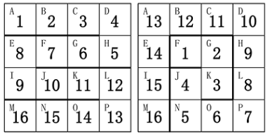

请帮小蓝计算一下，总共有多少种不同的方案。如果两个方案中，存在玩
具蛇的某一节放在了盒子的不同格子里，则认为是不同的方案。

### ✏️思路解析

1、玩具蛇长度16，就假设是1~16，那1放在不同的格子里面就是不同的情况，所以要暴力枚举起始点1在16个格子里面的情况

2、在dfs深度搜索里面，我们先列举不存在的情况 if(r<0 || c<0 || r>3 || c>3)  ($a[r][c]==1$) //位置已经被占

3、(number>=15) 当玩具蛇放满的时候，我们就返回1，也就是满足的情况的一种方法。

4、每一个位置有上下左右四个方向放置蛇sum1= **dfs(r-1,c,a,number+1)** //上+**dfs(r+1,c,a,number+1)** //下+**dfs(r,c-1,a,number+1)** //左+**dfs(r,c+1,a,number+1)**; //右

5、$a[r][c]=0$; //我们尝试走这条路就把TA置为1，我们尝试走其他路的时候，就要把，刚刚置为1的，重新置为0

### ✨参考代码

```java
import java.util.Scanner; 
public class DFS1 {
	static int sum=0;    //结果：sum种方法
	static int number=0; //步数
	static int a[][]=new int[4][4];  //4*4的二维数组
	static int dfs(int r,int c,int a[][],int number) { //r行c列数组a
		if(r<0 || c<0 || r>3 || c>3)
			return 0;
		if(a[r][c]==1)    //位置已经被占
			return 0;
		if(number>=15)    //放满玩具蛇
			return 1;
		a[r][c]=1;        //=1就是被占
		int sum1=0;       //每一个位置有多少种可能性
		sum1= dfs(r-1,c,a,number+1)  //上
		+dfs(r+1,c,a,number+1)  //下
		+dfs(r,c-1,a,number+1)  //左
		+dfs(r,c+1,a,number+1);  //右
		a[r][c]=0;        //置回0
		return sum1;
	}
	public static void main(String[] args) {
		// TODO Auto-generated method stub
		//暴力枚举二维数组所有的位置
		for (int i = 0; i <= 3; i++) {
			for (int j = 0; j <= 3; j++) {
				sum+=dfs(i,j,a,0);
			}
		}	
		System.out.print(sum);
	}
}

```

## 试题F：游园安排

### 👀问题描述

L 星球游乐园非常有趣，吸引着各个星球的游客前来游玩。。。

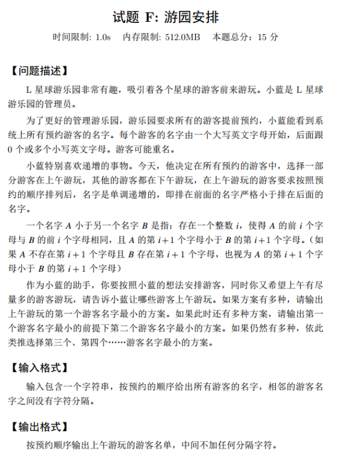

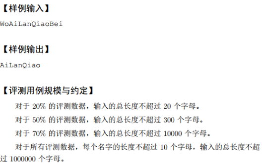

### ✏️思路解析

二分求最长上升子序列板子题,我们可以发现二分求得的最长上升队列中,保存的就是当前长度最小的数字,因此我们只需要每覆盖一个存储它们前面一个,最后递归输出。

### ✨参考代码

```java
import java.util.Scanner;


public class Main {

    public static int N = 1000010;
    public static String[] A = new String[N];
    public static String s = new String();
    public static String ans = new String();
    public static int [] q = new int[N];
    public static int [] pre = new int[N];
    public static int cnt;

    public static void dfs(int u)
    {
        if(u==0){
            return;
        }
        dfs(pre[u]);
        ans+=A[u];
    }

    public static void init()
    {
        int len = s.length();
        for(int i=0,j=0;i<len;i++)
        {
            if(s.charAt(i)>='A'&&s.charAt(i)<='Z')
            {
                j = i;
                while(j+1<len&&s.charAt(j+1)>='a'&&s.charAt(j+1)<='z'){
                    j++;
                }
                if(j-i+1<0){
                    A[++cnt] = s.substring(i);
                }
                else{
                    A[++cnt] = s.substring(i,j+1 );
                }
                i = j;
            }
        }
    }

    public static void solve()
    {
        int len = 0;
        for(int i=1;i<=cnt;i++)
        {
            int l = 0,r = len;
            while(l<r)
            {
                int mid = l+r+1>>1;
                if(A[q[mid]].compareTo(A[i])<0) l = mid;
                else r = mid-1;
            }
            q[r+1] = i;
            pre[i] = q[r];
            len = Math.max(r+1,len);
        }
        int idx = q[len];
        dfs(idx);
        System.out.println(ans);
    }


    public static void main(String[] args) {
        Scanner sc = new Scanner(System.in);//WoAiLanQiaoBei
        s = sc.nextLine();
        init();
        solve();
    }
}
```

## 试题G：画廊

### 👀问题描述

小蓝办了一个画展，在一个画廊左右两边陈列了他自己的作品。。。

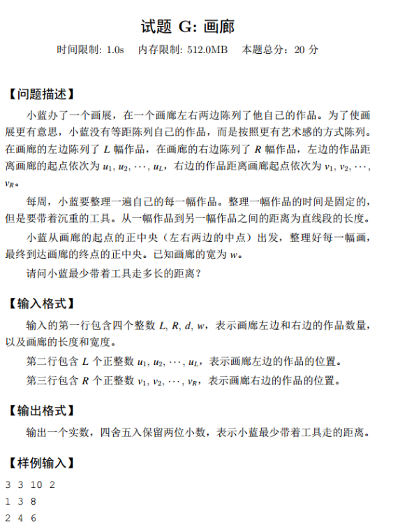

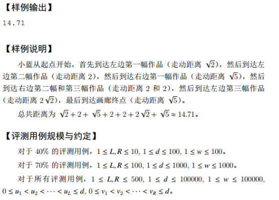

### ✏️思路解析

本题是一个dp的题目,思路其实就是定义一个三维的数组，记录状态

$dp[i][j]$表示处理完左边第1幅画和右边第j幅画所走的最小路程，但是我们无法知道现在到底是在是在左边还是在右边，所以我们还需要增加一维数组代表现在现在到达的是左边还是右边，用0表示在左边，用1表示在右边，这样就可以确定状态

假设我们现在需要到达左边那么现在有两种方法到达,一种是前一个状态在左边，另一种是前一个状态在右边,那么我们就可以写出状态转移方程:

$dp[i][j][0]=Math.min(dp[i][j][0],Math.min(dp[i-1][j][0]+left[i]-left[i-1], dp[i-1][j][1]+js(left[i],right[j],l)));$

为何是i-1而不能是j-1的原因是因为，0表示现在到达点是i也就是说在之前状态i还没有到达，所以用i-1，而不是j-1

到达点在右边同理可以写出状态转移方程

### ✨参考代码

```java
import java.io.BufferedReader;
import java.io.IOException;
import java.io.InputStreamReader;
import java.io.PrintWriter;
import java.io.StreamTokenizer;
import java.util.Arrays;

public class Main画廊 {

	public static void main(String[] args) throws IOException {
		StreamTokenizer x=new StreamTokenizer(new BufferedReader(new InputStreamReader(System.in)));
		PrintWriter out=new PrintWriter(System.out);
		x.nextToken();
		int n=(int)x.nval;
		x.nextToken();
		int m=(int)x.nval;
		x.nextToken();
		int k=(int)x.nval;
		x.nextToken();
		int l=(int)x.nval;
		int INF = 0x3f3f3f3f;
		int left[]=new int[n+1];
		int right[]=new int[m+1];
		for(int i=1;i<=n;i++) {
			x.nextToken();
			left[i]=(int)x.nval;
		}
		for(int i=1;i<=m;i++) {
			x.nextToken();
			right[i]=(int)x.nval;
		}
		double dp[][][]=new double[n+1][m+1][2];
		double pd=(double)l/2;
		double a=js(0,left[1],pd);
		double b=js(0,right[1],pd);
		for(int i=0;i<=n;i++)//初始化，全部置为最大
			for(int j=0;j<=m;j++)
				Arrays.fill(dp[i][j], INF);
		dp[1][0][0]=a;
		dp[0][1][1]=b;
		/*for(int i=1;i<=n;i++) {
			dp[i][0][0]=a+left[i]-left[1];
			dp[i][0][1]=INF;
		}
		for(int i=1;i<=m;i++) {
			dp[0][i][0]=INF;
			dp[0][i][1]=b+right[i]-right[1];
		}*/
		for(int i=0;i<=n;i++) {
			for(int j=0;j<=m;j++) {
				if(i!=0)dp[i][j][0]=Math.min(dp[i][j][0],Math.min(dp[i-1][j][0]+left[i]-left[i-1], dp[i-1][j][1]+js(left[i],right[j],l)));
				if(j!=0)dp[i][j][1]=Math.min(dp[i][j][1],Math.min(dp[i][j-1][0]+js(left[i],right[j],l), dp[i][j-1][1]+right[j]-right[j-1]));
			}
		}
		out.printf("%.2f\n", Math.min(dp[n][m][0]+js(k,left[n],pd), dp[n][m][1]+js(k,right[m],pd)));//最后还要到达画廊中间别忘了
		out.flush();
	}
	public static double js(double a,double b,double h) {
		a=Math.abs(a-b);
		return Math.sqrt(a*a+h*h);
	}
}
```


## 试题：奇偶覆盖

### 👀问题描述

在平面内有一些矩形，它们的两条边都平行于坐标轴。。。

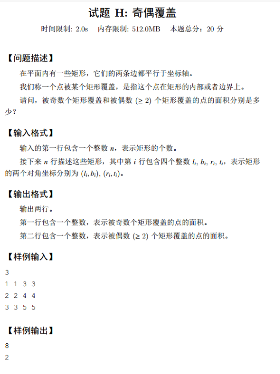

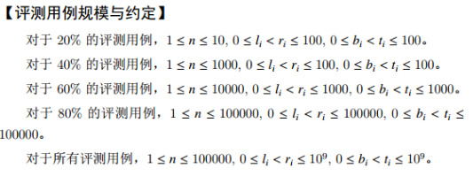

### ✏️思路解析

```java
//待补充
```

### ✨参考代码

```java
//待补充
```

## 试题I：补给

### 👀问题描述

小蓝是一个直升机驾驶员，他负责给。。。


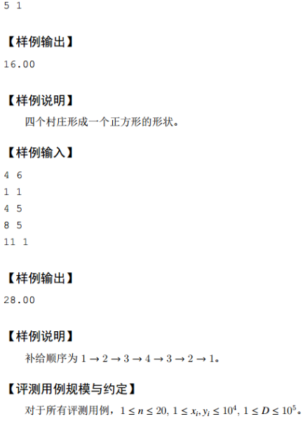

### ✏️思路解析

**状压DP + 最短路径：**

`w[i][j]`：从村庄 `i` 到村庄 `j` 之间的最短距离；
`f[i][j]`：从村庄 `0` 走到村庄 `j` ，且经过经过村庄的状态为 `i` 的最小飞行距离（将 1 映射成 0，以此类推）；

### ✨参考代码

```java
import javafx.util.Pair;

import java.math.BigDecimal;
import java.text.DecimalFormat;
import java.util.Scanner;

class Node{
    int first;
    int second;
}

class Solution{
    int n = 200;
    int INF = 100000000;
    Node[] p = new Node[n];
   double[][] w = new double[n][n];
   double[][] f = new double[n][n];

    public Solution() {
        for(int i=0;i<n;i++){
            p[i] = new Node();
        }
    }

    double get_distance(int i, int j) {

        int x = p[i].first - p[j].first;
        int y = p[i].second - p[j].second;
        return Math.sqrt(x * x + y * y);
    }

    void solve(){
        Scanner sc = new Scanner(System.in);
        int n,d;
        n = sc.nextInt();
        d = sc.nextInt();
        for (int i = 0; i < n; i++) {
            int first = sc.nextInt();
            int second = sc.nextInt();
            p[i].first = first;
            p[i].second = second;
        }

        for (int i = 0; i < n; i ++)
            for (int j = i + 1; j < n; j ++)
            {
                w[i][j] = w[j][i] = get_distance(i, j);
                if(w[i][j] > d) {
                    w[i][j] = w[j][i] = INF;
                }
            }

        for (int k = 0; k < n; k ++){
            for (int i = 0; i < n; i ++){
                for (int j = 0; j < n; j ++){
                    w[i][j] = Math.min(w[i][j], w[i][k] + w[k][j]);
                }
            }

        }


        for (int i = 0; i < 1 << n; i ++){
            for (int j = 0; j < n; j ++){
                f[i][j] = INF;
            }
        }

        f[1][0] = 0;
        for (int i = 0; i < 1 << n; i ++){
            for (int j = 0; j < n; j ++){
                if((i >> j & 1) !=0){
                    for (int k = 0; k < n; k ++){
                        if(((i - (1 << j)) >> k & 1) != 0){
                            f[i][j] = Math.min(f[i][j], f[i - (1 << j)][k] + w[k][j]);
                        }
                    }

                }

            }

        }


        double ans = INF;
        for (int i = 1; i < n; i ++){
            ans = Math.min(ans, f[(1 << n) - 1][i] + w[i][0]);
        }

        DecimalFormat df = new DecimalFormat("0.00");

        System.out.println(df.format((1.0*(ans * 100)/100) ));
        
    }


}

public class Main {


    public static void main(String[] args) {
        Solution solution = new Solution();
        solution.solve();
    }
}
```

## 试题J：蓝跳跳

### 👀问题描述

小蓝只做了一个机器人，取名为蓝跳跳。。。

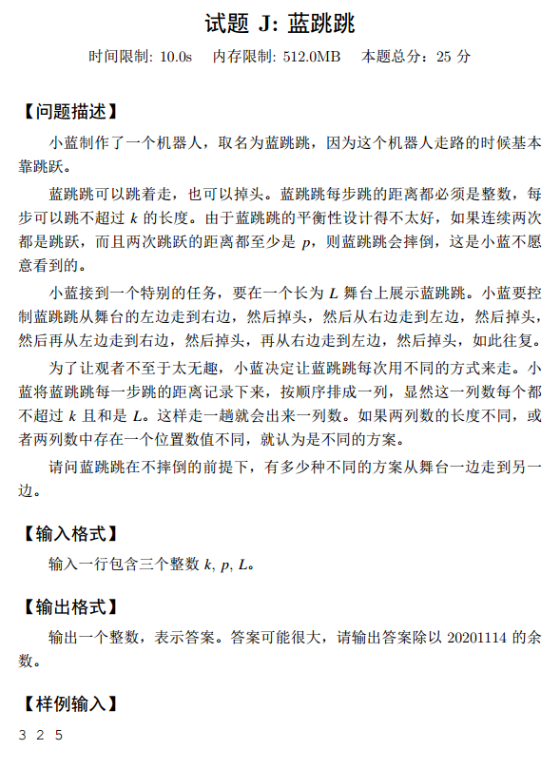

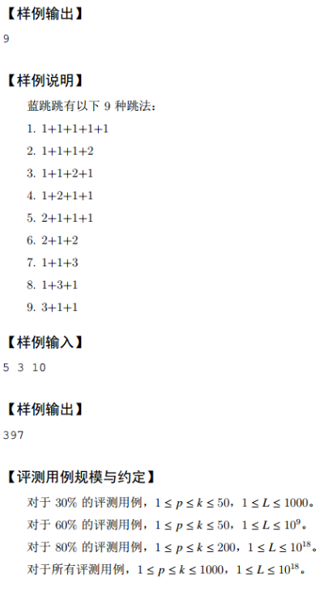

### ✏️思路解析

动态规划+循环数组

### ✨参考代码

```java
import java.util.Scanner;

public class Main {
	static int len;
	static int[][] arr;
	static int k;
	static int p;

	public static void main(String[] args) {
		Scanner sc = new Scanner(System.in);
		k = sc.nextInt();
		p = sc.nextInt();
		long L = sc.nextLong();
		sc.close();
		// 创建一个双层的循环数组，0层存没跳到p几次的方式个数，1层存跳至少p次的方式个数
		len = k + 1;
		arr = new int[len][2];
		int i;
		arr[0][1] = arr[0][0] = 1;
		for (i = 1; L-- > 0; i = (i + 1) % len) {
			int sum = 0;
			for (int j = 1; j < p; j++) {
				// 跳p次以内累加的是之前跳至少p次的方式个数。
				sum = (sum + arr[(len + i - j) % len][1]) % 20201114;
			}
			arr[i][0] = sum;
			for (int j = p; j <= k; j++) {
				// 跳至少p次时累加的是之前跳p次以内的方式个数。
				sum = (sum + arr[(len + i - j) % len][0]) % 20201114;
			}
			arr[i][1] = sum;
		}
		// for循环多移动了一次i，这里把i移回来。
		i = (len + i - 1) % len;
		System.out.println(arr[i][1]);
	}
}
```


