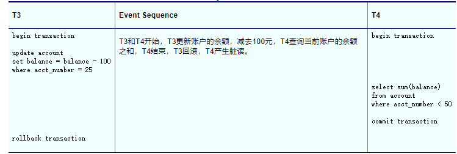
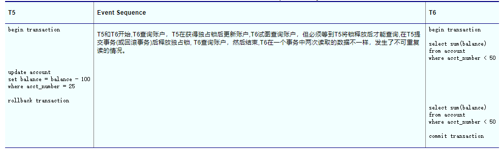
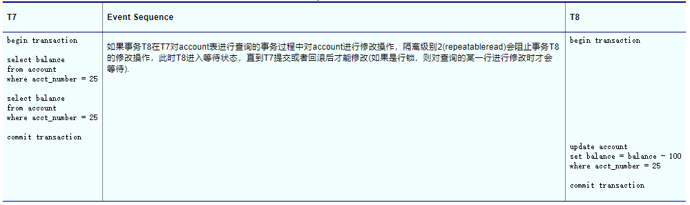
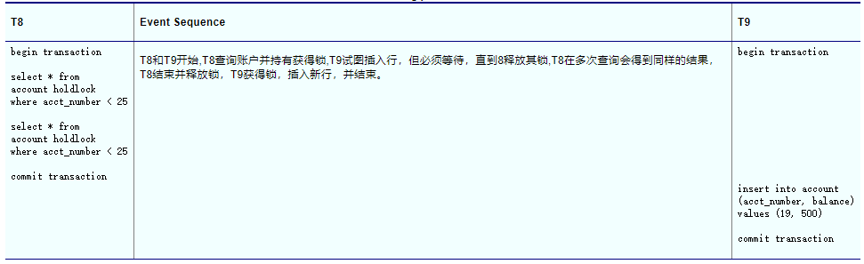

## 隔离级别0 read uncommitted

read uncommitted被称为读未提交，一个事务能读取到其他事务修改过，但是还没有提交的(Uncommitted)的数据。数据被其他事务修改过，但还没有提交，就存在着回滚的可能性，这时候读取这些“未提交”数据的情况就是“脏读”。下图显示了一个执行脏读的选择查询过程。

如果事务T4在T3更新之后回滚之前查询，那么T4就会产生脏读。

使用read uncommitted可能具有更好的并发性，并减少死锁的发生，但是对于需要数据一致性的应用，比如对特定账户的存款和提款进行查询，应避免使用隔离级别0。

## 隔离级别1 read committed

> 一、共享读锁（读锁）
> 若事务T对数据对象A加上共享读锁，则事务T可以读A但不能修改A，比如SELECT语句。其他事务只能再对A加共享读锁，而不能加独占写锁，直到T释放A上的共享读锁，这保证了其他事务可以读A，但在事务T释放A上的共享读锁之前不能对A做任何修改。
>
> 
>
> 二、排他锁（独占写锁）
> 若事务T对数据对象A加上独占写锁，事务T可以读A也可以修改A，例如 INSERT、UPDATE 或 DELETE。其他事务不能再对A加任何锁，直到T释放A上的锁，确保不会同时同一资源进行多重更新，这保证了其他事务在T释放A上的锁之前不能再读取和修改A。

read commit被称为读已提交,一个事务只能读取到其他事务提交(Committed)的数据,未提交的数据不能读，这样做可以防止脏读,但是可能会出现不可重复读的问题，例如一个事务在处理过程中如果重复读取某一个数据，而且这个数据恰好被其他事务修改并提交了，那么当前重复读取数据的事务就会出现同一个数据前后不同的情况,出现"不可重复读"现象。下图显示了"不可重复读"过程：

如果T5持有一个表独占写锁（会阻塞其他用户对同一表的读和写操作），T6就会等待，直到独占锁被释放，如果T5使用的是页锁或行锁，则T6可以开始执行，但是当T6试图获取T5锁定的页或行的共享锁时会被阻塞，这样做使得T6只能在提交或者回滚后获得数据，避免了脏读，但是如果多次提交，会产生不可重复读现象，即每次读取到的数据不一样。

## 隔离级别2 repeatable read

repeatable read被称为可重复读,可以防止不可重复读,在该级别下一个事务一旦开始，事务过程中所读取的所有数据不允许被其他事务修改和删除(但是可以插入)，可重复读的示例如下图所示：

该级别没有办法解决“幻读”的问题，因为该级别只保护了一个事务期间读取的数据不被update和delete，但是仍然可以使用insert，如果其他数据被insert后恰好满足了当前事务的过滤条件（where语句），那么就会发生“幻读”的情况。例如事务T7对一个表中的所有数据项都做了如果是“1”则修改为“2”的操作，此时事务T8向表中插入了一行数据项为“1”的数据，然后T1在修改后再次查询会发现还有一行没有修改，就好像产生幻觉一样，这就是发生了幻读。

## 隔离级别3 serializable reads

serializable reads被称为序列化，系统中所有的事务以串行的方式逐个执行，所以能避免所有数据不一致情况，串行化执行方式会导致事务排队，系统的并发量大幅下降，使用的时候要绝对慎重。序列化的示例如下图所示：

mysql默认的级别是repeatable read，而oracle默认的级别是read committed。