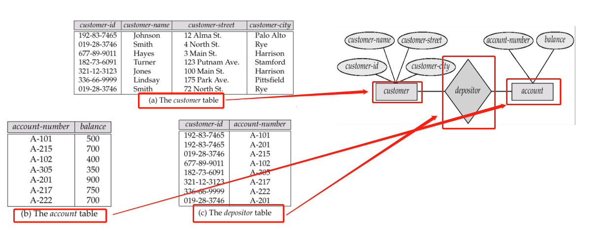

## 学习数据库系统的目的

数据处理和管理是计算机应用最重要的领域，数据库系统的知识对于计算机学者至关重要。

并且数据库涉及社会生活的方方面面：

:one: 银行业：所有交易

:two: 航空公司：预订，时间表

:three: 大学：注册，成绩

:four: 销售：客户，产品，购买

:five: 制造业：生产，库存，订单，供应链

:six: 电子政务，电子商务，… 

最重要的是，现在大厂的面试很多都会问到数据库的相关知识，学好数据库可以让你能够找到一份好工作。

在本专栏中，我将从以下三个方面讲解数据库的相关知识:

**数据库模型与设计**

从现实生活中抽象出数据模型，再将其转换为适合目标DBMS（数据库管理系统）的形式：表、视图。

**编程：使用数据库**

查询、更新数据（SQL）

**数据库管理系统实现**

数据库管理系统的工作机制及设计

## 数据库与数据库管理系统是什么

数据库的英文简写为：DB，简单点来说，具有如下的特点

+ 与企业相关的数据集合

+ 具有完整性和持久性的数据集合。[R. Ramakrishnan, J. Gehrhe]

+ 长期（常常多年）存在的信息集合。 [Ullman]

+ 长期存储在计算机内，有组织的，可共享的数据集合。[萨师煊，王珊]
  

数据库管理系统的英文简称为:DBMS,它是数据库 + 一组用以访问、更新和管理这些数据的程序

### DBMS的主要特点

DBMS主要有以下特点:

1. 数据访问的高效和可扩展性
2. 缩短应用开发时间
3. 数据独立性（物理数据独立性 / 逻辑数据独立性）
4. 数据完整性和安全性
5. 并发访问和鲁棒性（恢复）

## 数据视图

如何使用数据库系统：不同的用法需要不同层次的抽象（如，学生成绩管理系统）

+ 物理层：描述数据实际上是怎样存储的
+ 逻辑层：描述数据库中存储什么数据及这些数据间存在什么关系,如

```java
ID : char(5); 
name : char(20);
dept_name : char(20);
salary : numeric(8,2);
```

+ 视图层：应用程序能够隐藏数据类型的详细信息。视图也可以出于安全目的隐藏数据信息（例如，员工的薪水等）

数据结构的三层结构如下:


## 数据库设计步骤

通常数据库的设计需要经过如下六个步骤:

1. 需求分析
– 需要什么样的数据、应用程序和业务
2. 概念数据库设计
– 使用 E-R 模型或类似的高层次数据模型，描述数据
3. 逻辑数据库设计
– 将概念设计转换为某个DBMS所支持的数据模型
4. 结构优化
– 关系标准化，检查冗余和相关的异常关系结构
5. 物理数据库设计
– 索引，集群和数据库调优
6. 创建并初始化数据库&安全设计
– 加载初始数据，测试
– 识别不同的用户及他们的角色

对应如下图:


## ER图的有关介绍

下面介绍ER图的相关概念，E-R图也称实体-联系图(Entity Relationship Diagram)，提供了表示实体类型、属性和联系的方法，用来描述[现实世界](https://baike.baidu.com/item/现实世界/688877)的[概念模型](https://baike.baidu.com/item/概念模型/3187025)。

它是描述现实世界关系概念[模型](https://baike.baidu.com/item/模型/1741186)的有效方法。是表示概念关系模型的一种方式。用“矩形框”表示[实体型](https://baike.baidu.com/item/实体型/3187353)，矩形框内写明实体名称；用“椭圆图框”或圆角矩形表示实体的属性，并用“实心线段”将其与相应关系的“实体型”连接起来；

用”菱形框“表示实体型之间的[联系](https://baike.baidu.com/item/联系/3187514)成因，在[菱形](https://baike.baidu.com/item/菱形)框内写明联系名，并用”实心线段“分别与有关实体型连接起来，同时在”实心线段“旁标上联系的类型（1:1,1:n或m:n）。

如下图所示:


ER图通常由实体和联系组成，而实体又具有相关属性描述，具体的关系如下:


根据上面的ER图，我们可以设计出如下的数据库实例:



一张数据库表包括属性和相应的数据，所有的属性(Attributes)组成了一张表的规范格式(schema)，里面的一条数据被称为是元组(tuple)，以customer table为例:


## 数据库语言

### 数据库语言有哪些

数据库语言包括：

Data Definition Language（DDL，数据定义语言）

Data Manipulation Language（DML，数据操纵语言）

Data Control Language（DCL，数据控制语言）

### 数据定义语言(DDL)是什么

一言以蔽之，就是例如CREATE TABLE account (account_number char(10),balance integer);的建表语句。该SQL语句创建了表account。

### 数据操作语言(DML)

包括从数据库中检索数据、插入/删除/更新数据的语言，另外DML也称为查询语言。

### 数据控制语言(DCL)

数据控制语言（DCL：Data Control Language）是用来设置或者更改[数据库用户](https://baike.baidu.com/item/数据库用户/3637382)或角色权限的语句，这些语句包括[GRANT](https://baike.baidu.com/item/GRANT/8062974)、DENY、[REVOKE](https://baike.baidu.com/item/REVOKE/9203804)等语句，在默认状态下，只有数据库管理者才有权利执行数据控制语言。

### sql

sql集成了DDL,DML,DCL,目前已被广泛使用，后面会详细介绍sql的使用，大家可以先看两个例子，看不懂也没关系，知道这是sql语言就行,

假如现在有如下三张表:


以下两个例子分别是查询用户id为'192-83-7645'这个人的姓名（对应于customer表的蓝线部分），以及查询客户id为'192-83-7645'这个人的所有账户存款（对应于acctount和depositor表的红线部分）。


## 数据库管理员


## 数据库用户

根据所期望的与系统交互方式的不同，数据库系统的用户可以分为四类：

:one:无经验的用户：他们通过激活事先已经写好的应用程序同系统进行交互（普通用户）

​	– 例如，人们通过网络、银行出纳员、文员访问数据库

:two:应用程序员：通过SQL调用与系统进行交互

:three:富有经验的用户：用数据库查询语言或数据分析软件等工具来表达他们的要求。例如，联机分析处理（OLAP）、数据挖掘。

:four:特殊用户：编写专门的，不适合于传统数据处理框架的数据库应用。例如计算机辅助设计系统(CAD)、知识库系统(KDB)，专家系统(ES)。

## 事务管理

在日常生活中，对数据库的访问经常是并发的，但是高并发的情况会给数据库带来一定的问题，比如一个人访问一条数据的时候，另一个人突然把这数据给改了，这样就会带来数据不一致的问题，要想处理这一类的问题就需要先了解数据库的事务管理。事务是是在数据库应用中完成单一逻辑功能的操作集合，比如一个人访问某条数据并对这条数据处理的一系列过程叫做一个事务，如果要想避免以上出现的不一致情况，我们可以在进行数据访问的时候给当前访问的表上一把锁，不给别人访问，直到自己处理完释放锁，这只是一种解决办法，后面还会介绍更多的解决办法。

除此之外，事务还有以下几个知识点:

:one: 事务的要求: Atomicity (原子性), Consistence (一致性), Isolation (隔离性), Durability (持久性) / ACID

:two: 事务管理组件：确保系统在出现故障（例如断电或操作系统宕机），或事务失败的情况下，数据库都能保持一致性（正确性）

:three: 并发控制管理器：控制并发事务之间的交互

## 数据库体系结构

数据库的体系结构如下图所示:


查询处理器用于接收数据库语言输入，经过解析、优化、执行，输出相应结果给用户

包括：

+ 解析和翻译
+ 优化
+ 执行


存储管理器在底层数据存储与应用程序及查询之间，用于对数据库中的数据进行高效存储，检索与更新。

包括：

+ 事务管理

+ 授权和完整性管理

+ 文件管理 (管理文件系统与数据文件，数据字典，索引文件之间的交互)

+ 缓存管理


对于sql，它的体系结构如下:


应用程序与数据库进行交互的体系结构如下:

