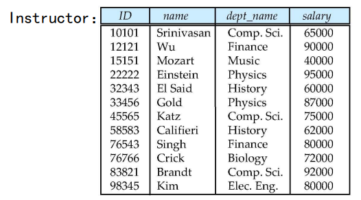
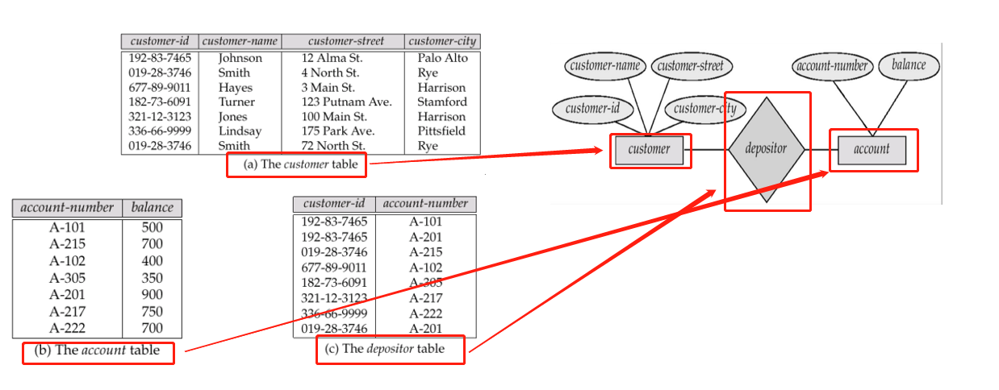
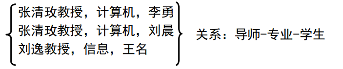
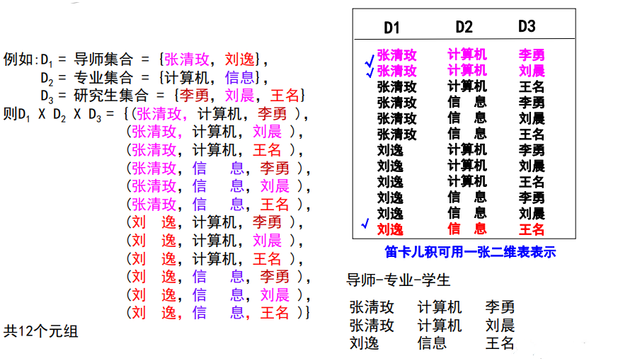

## 关系数据库

> 首先介绍一下什么是关系数据库，关系数据库基于关系模型，是一个或多个关系组成的集合，而关系通俗来讲就是表(由行列构成),关系模型的主要优点是具有简单的数据表示而且能易于表示复杂的查询，到目前为止，SQL语言是最广泛使用的语言，可用于创建，操纵和查询关系数据库， 其基础是关系模型。
>
> 下图是关系的示例:
>
> 
>
> 下面分别介绍一下联系，关系是什么
>
> + 联系表示一些实体之间的关联，由实体集和联系集组成，表示相应实体在真实的世界的关系，如下图所示:
>
> 
>
> + 关系是一种数学概念，指的是表中的所有属性，例如ID,name,dep_name,salary等，关系表示的是机器的世界,如下图所示:
>
> 
>
> 一般地，我们把集合用数学符号$D$表示，数据表的每一列都对应于一个集合$D_i$,如果一张表有n列，该表就有n个集合$D_1,D_2,...,D_n ，(D_i=a_{ij}|_{j=1....k})$ ，其中$k$表示该集合一共有k个元素，而关系$r$就是$D_1\times D_2\times...\times D_n$的子集,其中$\times$表示的是笛卡尔积，因而关系就是一组n元组$(a_{1j},a_{2j},...,a_{nj})$的集合，其中每个$a_{ij}\in D_i$，这么说可能枯燥，下面举一个例子，假设一张表有如下几列:导师、专业、学生，对应结构如下：导师（张清玫教授，刘逸教程）、专业（计算机、信息）、学生（李勇，刘晨、王名），下图则是一个关系r:
>
> 
>
> 

### 接着介绍一下笛卡尔积是什么

> 直接上例子：
>
> 
>
> 从上图可以看出笛卡尔积就是各个集合的排列组合。

## 关系代数

## 拓展的关系代数运算

## 数据库的修改