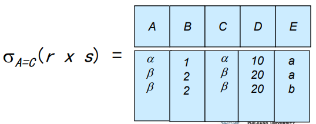
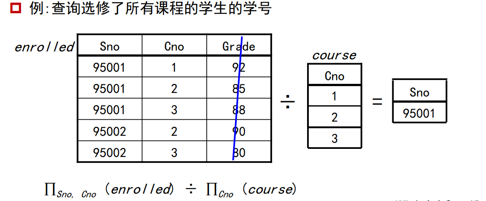
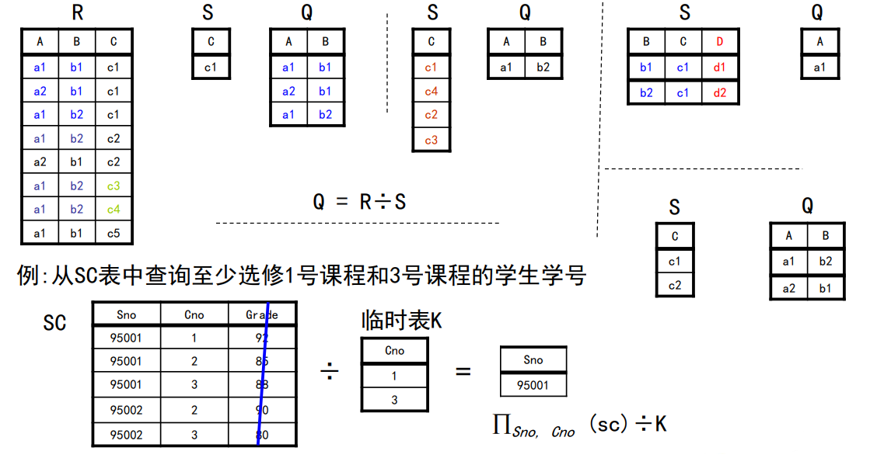

## 关系数据库

> 首先介绍一下什么是关系数据库，关系数据库基于关系模型，是一个或多个关系组成的集合，而关系通俗来讲就是表(由行列构成),关系模型的主要优点是具有简单的数据表示而且能易于表示复杂的查询，到目前为止，SQL语言是最广泛使用的语言，可用于创建，操纵和查询关系数据库， 其基础是关系模型。
>
> 下图是关系的示例:
>
> 
>
> 下面分别介绍一下联系，关系是什么
>
> + 联系表示一些实体之间的关联，由实体集和联系集组成，表示相应实体在真实的世界的关系，如下图所示:
>
> 
>
> + 关系是一种数学概念，指的是表中的所有属性，例如ID,name,dep_name,salary等，关系表示的是机器的世界,如下图所示:
>
> 
>
> 一般地，我们把集合用数学符号$D$表示，数据表的每一列都对应于一个集合$D_i$,如果一张表有n列，该表就有n个集合$D_1,D_2,...,D_n ，(D_i=a_{ij}|_{j=1....k})$ ，其中$k$表示该集合一共有k个元素，而关系$r$就是$D_1\times D_2\times...\times D_n$的子集,其中$\times$表示的是笛卡尔积，因而关系就是一组n元组$(a_{1j},a_{2j},...,a_{nj})$的集合，其中每个$a_{ij}\in D_i$，这么说可能枯燥，下面举一个例子，假设一张表有如下几列:导师、专业、学生，对应结构如下：导师（张清玫教授，刘逸教程）、专业（计算机、信息）、学生（李勇，刘晨、王名），下图则是一个关系r:
>
> 
>
> 

### 笛卡尔积

> 接下来介绍一下笛卡尔积，直接上例子：
>
> 
>
> 从上图可以看出笛卡尔积就是各个集合的排列组合。

### 属性类型

关系的每个属性都有一个名称，每个属性的取值集合称为属性的域，属性的值必须是原子的，即不可分割(1NF,第一范式)，需要注意，空值null是每一个域的成员，空值给数据库访问和更新带来很多困难，因此应尽量避免使用空值。

那关系是什么？关系涉及两个概念：关系模式和关系实例，其中关系模式描述的是关系的结构，例如:

$Instructor-schema=(ID:string,name:string,deptname:string,salary:int)$或$Instructor-schema=(ID,name,deptname,salary)$

关系模式的数学描述如下:

+ $A_1,A_2,...,A_n$是属性
+ 一般地:$R=(A_1,A_2,...,A_n)$是一个关系模式
  + 例:$Instructor-schema=(ID,name,dept_name,salary)$

关系实例则表示一个关系的特定实例，例如('0001','张三','计算机学院',20000)。每一行数据被称为是一个元组，元组的顺序性是无关紧要的，但一个关系中不能有重复的元组

### 码、键的概念

#### 码的概念

+ 定义$K \sube R$
+ 如果K值能够在一个关系中唯一地标志一个元组，则K是R的超码 
  + 例如 $\{instructor-ID,instructor-name\}$和$\{instructor-ID\}$都是$\{instructor\}$的超键，简单点说超键就是一个集合，通过该集合能唯一确定一个元组
+ 如果K是最小超码，则K是候选码
  + 例如$\{instructor-ID\}$是$\{instructor\}$的候选码。因为他是一个超码，并且它的任意子集都不能成为一个超码
+ 如果k是一个候选码，并由用户明确定义，则K是一个`主键`。主键通常用下划线标记

#### 外键的概念

首先以一个例子来说明什么是外键:

学生表中有专业号这一属性，通过专业号这一属性可以在专业表中查询到专业名称，这种在其他表中是主键的属性叫做外码（外键）。

## 关系代数基本运算

关系代数有六个基本的运算和一些附加运算，六个基本运算是:

附加运算是:

下面依次介绍这六个关系

**选择运算**

数据库的表的关系r如下图所示:

需求：选择元组，满足:A=B and D > 5

数学表达为:$\sigma_{A=B and D \gt5}(r)$

对应的结果如下：

详细定义如下：

**投影运算**

数据库的表的关系r如下图所示:

需求：选择A、C

数学表达为:$\pi_{A,C}(r)$

对应的结果如下：

详细定义如下：

**投影运算**

数据库的表的关系r如下图所示:

需求：选择A、C

数学表达为:$\pi_{A,C}(r)$

对应的结果如下：

详细定义如下：

**并运算**

数据库的两张表的关系r、s如下图所示:

需求：将r与s合并

数学表达为:$r\cup s$

对应的结果如下：

详细定义如下：

**差运算**

数据库的两张表的关系r、s如下图所示:

需求：将r与s做差

数学表达为:$r-s$

对应的结果如下：

详细定义如下：

**广义笛卡尔积**

数据库的两张表的关系r、s如下图所示:

需求：计算r与s的广义笛卡尔积

数学表达为:$r\times s$

对应的结果如下：

详细定义如下：

如果有相同的属性，则笛卡尔积的结果如下:

**复合运算**

我们可以使用多种运算符构建表达式，数据库的两张表的关系r、s如下图所示:

需求：选出所有r.A = s.C的元组

$r \times s$如下图所示:

$\sigma_{A=C}(r\times s)$的结果如下图:

所以数学表达为:$\sigma_{A=C}(r\times s)$

**更名运算**

更名运算允许我们使用其他名字指代关系，具体描述看下图：

**查询示例**

假设现在有一个银行的数据库，相应的表关系如下:

例1-例2：

例3-例4：

例5：

例6：

例7：

## 关系代数附加运算

使用关系代数的附加运算，虽不能增加关系代数的表达能力，但却可以简化一些常用的查询，附加运算有:

1. 集合交
2. 自然连接
3. 除
4. 赋值

**交运算**

例:关系r，s如下图所示

交运算$r \cap s$的结果如下:

详细介绍如下:

**自然连接**

自然连接的表示符号为:

需求，将r和s自然连接:

自然连接的结果如下:

详细介绍如下

**theta连接**

**除运算**

$r\div s$适用于包含了"对所有的"此类短语的查询

例2:

例3：

例4：

**赋值运算**

赋值运算(←)可以使复杂的查询表达变得简单，使用赋值运算，可以把查询表达为一个顺序程序，该程序包括：

1. 一系列赋值 
2. 一个其值被作为查询结果显示的表达式 

对关系代数查询而言，赋值必须是赋给一个临时关系变量。

R-S表示从R中删去S中的属性的集合。

在temp2中，$(temp1\times s)$表示的是R-S与S的笛卡尔积，相当于所有的排列组合，$\pi_{R-S,S}(r)$表示的就是r本身的集合，将两者相减留下的就是不能完全覆盖的元组，将其减去就是能完全覆盖的元组，也就是除的结果。

**查询示例**

假设现在有一个银行的数据库，相应的表关系如下:

例1：

例2-例3：

## 拓展关系代数运算

**广义投影**

广义投影允许在投影列表中使用算术函数来对投影操作进行扩展，广义投影运算形式为：

**聚集函数**

聚合函数输入一个值集合，然后返回单一值作为结果

+ avg: 平均值 
+ min: 最小值 
+ max: 最大值 
+ sum: 值的总和 
+ count: 值的数量

$G_1,G_2...$ 是关系E中用于分组的一些属性。

例1：

例2：

注意：

**外连接**

**空值**

## 数据库的修改

数据库的内容可以使用下面的操作来修改：

+ 删除
+ 插入
+ 更新 

所有这些操作都使用赋值操作表示。

**删除**

**删除示例**

**插入**

**插入示例**

**更新**

**更新示例**

