## SQL语言概览

SQL目前已在数据库领域中广泛使用，是Structured Query Language（结构化查询语言）的简写，SQL最早的版本由IBM开发。SQL语言由以下几部分组成：

+ DDL(Date Definition Language) 数据定义语言
  + create table,alter table,drop table
  + create index,drop index
  + create view,drop view
  + create trigger,drop trigger
  + ...
+ DML(Data Manipulation Language) 数据操纵语言
  + select ... from
  + insert,delete,update
+ DCL(Data Control Language) 数据控制语言
  + grant,revoke

## SQL数据定义

数据库中的关系集合必须由数据定义语言(DDL)指定给系统。

例如：

```sql
create table instructor(
	ID char(5),
    name varchar(20) not null,
    dept_name varchar(20),
    salary numeric(8,2),
    primary key(ID)
);
```

SQL的DDL不仅能够定义一组关系，还能够定义每个关系的信息，包括：

+ 每个关系模式
+ 每个属性的取值类型
+ 完整性约束
+ 每个关系维护的索引集合
+ 每个关系的安全性和权限信息
+ 每个关系在磁盘上的物理存储结构

## SQL的基本数据类型

+ char(n)：固定长度字符串，用户指定长度n
+ varchar(n)：可变长度的字符串，用户指定最大长度n
+ int：整数类型（和机器相关的整数类型的子集），等价于全程integer
+ smallint：小整数类型（和机器相关的整数类型的子集）
+ numeric(p, d)：定点数，精度由用户指定。这个数有p位数字，其中d表示小数点右边的位数
+ double：双精度浮点数
+ float(n)：精度至少为n位的浮点数
+ null：每种类型都可以包含一个特殊值，即空值。可以申明属性值不为空，禁止加入空值
+ date：日期，含年、月、日，如 ‘2015-3-20’
+ time：时间，含小时、分钟、秒，如‘ 08:15:30’或‘ 08:15:30.75’
+ timestamp：日期 + 时间，如‘2022-5-21 08:15:30.75’

## SQL基本模式定义

**创建表的语句create table**

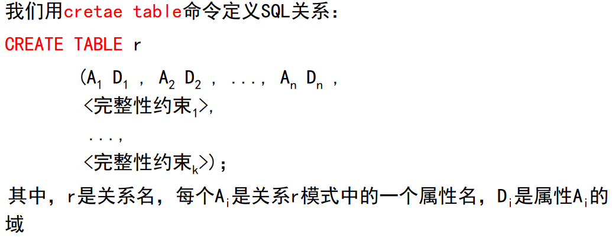

SQL支持许多不同的完整性约束，在这里我们只讨论常用的几个：

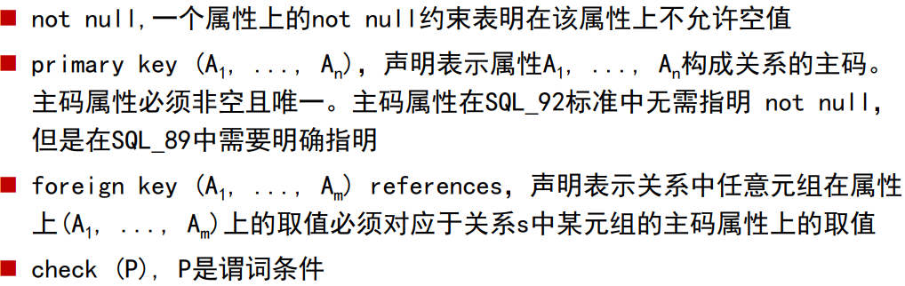

两个关于Create的例子:

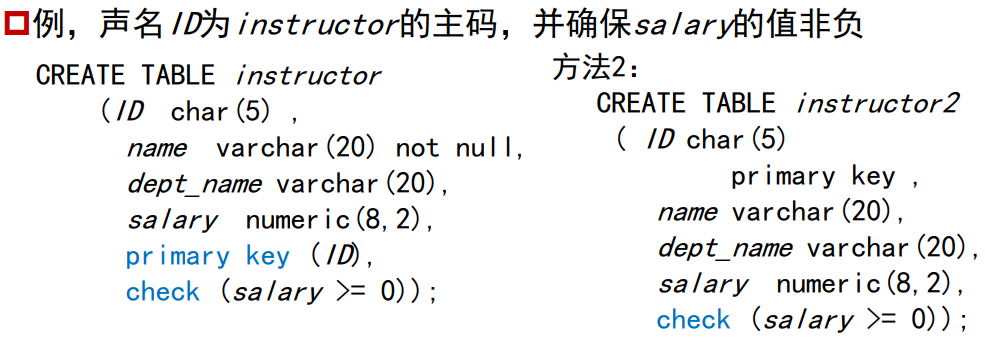

除了Create语句，还有如下常用的语句：

`drop table命令`，从数据库中删除关于被去掉关系的所有信息

例:

```sql
drop table r;
drop table instructor;
```

`alter table命令`可以为已有关系增加属性

例:

```sql
alter table r add A D
```

其中，A是待添加属性的名字，D是待添加属性的域，关系中所有元组在新属性上的取值将被设为null。

如：

```sql
alter table instructor add birthday date;
```

`alter table命令`也可以从关系中去掉属性

```sql
alter table r DROP A;
```

需要注意：很多数据库并不支持此操作

我们还可以使用alter table修改关系中的属性:

```sql
alter table r modify ID char(10)
```

完整案例如下:

```sql
create table testCRUD(
    ID INT PRIMARY KEY ,
    str1 varchar(20),
    str2 varchar(20),
    str3 varchar(20)
);

alter table testCRUD drop str1;

alter table testCRUD add str4 varchar(20);

alter table testCRUD modify str2 int;

select * from testCRUD;
```

## SQL查询与修改语句

### SQL查询的基本结构

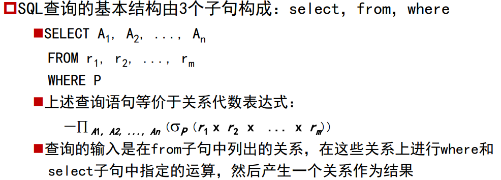

例，找出所有教师的名字

```sql
select name
from instructor;
```

表示成关系代数表达式为:$\pi_{name}{instructor}$,注意，SQL不允许在属性名称中使用字符‘-’，例如用dept_name代替dept-name。SQL不区分字母的大小写，因此可以使用大写字母或小写字母命名表、属性等。

SQL允许在关系以及SQL表达式结果中出现重复的元组，若要强行去除重复，可在select后加入关键词distinct
例，查询instructor关系中的所有系名，并去除重复

```sql
select distinct dept_name
from instructor;
```

SQL也允许我们使用关键词all来显式指明不去除重复(SQL默认就是all)

```sql
select all dept_name
from instructor;
```

星号“*”在select子句中，可以用来表示“所有的属性”

例:

```sql
select *
from instructor;
```

同时select子句还可带含有+、-、*、/运算符的算术表达式，运算对象可以是常数或元组的属性

例：

```sql
select ID,name,salary*1.05 from instructor;
```

where子句允许我们只选出那些在from子句的结果关系中满足特定谓词的元组,例，找出所有在Computer Science系并且工资超过70000美元的教师的姓名:

```sql
select name
from instructor
where dept_name='Computer_Science' and salary > 70000;
```

上述SQL查询语句对应的关系代数表达式为:

$\pi(\sigma_{dept_name='Computer_science' \space and\space salary > 7000}(instructor))$

SQL允许在where子句中使用逻辑连词and，or和not，也可以使用 between指定范围查询。逻辑连词的运算对象可以是包含比较运算符<、 <=、>、>=、= 和<>的表达式

例，找出工资在90 000美元和100 000美元之间的教师的姓名

```sql
select name
from instructor
where salary <= 100000 and salary >= 90000;
```

或者:

```sql
select name
from instructor
where salary between 90000 and 100000;
```

from子句是一个查询求值中需要访问的关系列表，通过from子句定义了一个在该子句中所列出关系上的笛卡尔积。

例1：找出关系instructor和teaches的笛卡尔积

```sql
select * from instructor,teaches;
```

例2：找出Computer Science系的教师名和课程标识

对应的表如下:

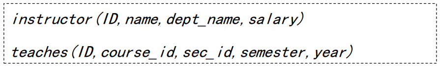

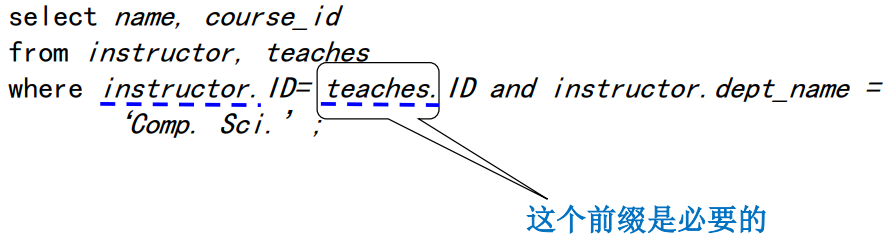

### 更名运算

SQL提供可为关系和属性重新命名的机制，即使用as子句：

```sql
old-name as new-name
```

as子句既可以出现在select子句中，也可以出现在from子句中。

例1：考虑刚刚的查询，将属性name重命名为instructor_name

```sql
select name as instructor_name,course_id
from instructor,teaches
where instructor.ID=teaches.ID and instructor.dept_name='Com. Sci'
```

例2：找出所有教师，以及他们所讲授课程的标识

```sql
select T.name, S.course_id
 from instructor as T, teaches as S
 where T.ID= S.ID;
```

例三：找出所有教师名，他们的工资至少比Biology系某一个教师的工资要高

```sql
select distinct T.name
from instructor as T,instructor as S
where T.salary > S.salary and S.dept_name='Biology';
```

### 字符串运算

对字符串进行的最通常的操作是使用操作符like的模式匹配，使用两个特殊的字符来描述模式：

+ 百分号(%):匹配任意子串
+ 下划线(_):匹配任意一个字符

例：找出所在建筑名称中包含子串‘Watson’的所有系名

```sql
select dept_name
 from department
 where building like‘%Watson%
```

为使模式中能够包含特殊字符（即%和_），SQL允许定义转义字符。我们在like比较运算中使用escape关键词来定义转义字符

例:使用反斜线（\）作为转义字符

```sql
like 'ab\%cd%' # 匹配所有以"ab%cd"开头的字符串
like 'ab\\cd%' # 匹配所有以"ab\cd"开头的字符串
```

### 排列元组的显示次序

SQL为用户提供了一些对关系中元组显示次序的控制。order by子句就可以让查询结果中元组按排列顺序显示

例，按字母顺序列出在Physics系的所有教师

```sql
select name
from instructor
where dept_name = 'Physics'
order by name;
```

order by子句默认使用升序。要说明排序顺序，我们可以用desc表示降序，或者用asc表示升序。

例：按salary的降序列出整个instructor关系，如果有几位教师的工资相同，就将他们按姓名升序排列

```sql
select *
 from instructor
 order by salary desc, name asc; 
```

### 集合运算

SQL作用在关系上的union、intersect和except运算对应于数学集合论中的$\cup$、$\cap$和$-$运算。union、intersect和except运算与select子句不同，它们会自动去除重
复，如果想保留所有重复，必须用union all、intersect all和except all。

**注意**：

> MySql只有union,和union all没有intersect和except。
>
> 在Oracle中，支持union，union ALL，intersect和Minus；但不支持Intersect ALL和Minus ALL

例1：找出在2009年秋季开课，或者在2010年春季开课或两个学习都开课的所有课程

对应的表如下:

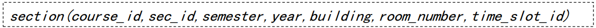

```sql
(select course_id
from section
where semester =‘Fall’and year = 2009)
union
(select course_id
from section
where semester =‘Spring’and year = 2010);

```

例2：找出在2009年秋季和2010年春季同时开课所有课程

```sql
(select course_id
from section
where semester =‘Fall’and year = 2009)
intersect
(select course_id
from section
where semester =‘Spring’and year = 2010);

```

例3：找出在2009年秋季开课，但不在2010年春季开课的所有课程

```sql
(select course_id
from section
where semester =‘Fall’and year = 2009)
except
(select course_id
from section
where semester =‘Spring’and year = 2010);

```

### 聚集函数

聚集函数是以值的一个集合（集或多重集）为输入，返回单个值的函数。 SQL提供了五个固有聚集函数：

+ 平均值：avg 
+ 最小值：min 
+ 最大值：max 
+ 总和：sum 
+ 计数：count 
+ 其中，sum和avg的输入必须是数字集，但其他运算符还可作用在非数字数据 类型的集合上，如字符串

除了上述的五个基本聚集函数外，还有分组聚集（group by）。group by子句中给出的一个或多个属性是用来构造分组的，在group by子句中的所有属性上取值相同的元组将被分在一个组中。having子句类似于where子句，但其是对分组限定条件，而不是对元组限定条件。having子句中的谓词在形成分组后才起作用，因此可以使用聚集
函数。

例1，找出Computer Science系教师的平均工资

```sql
select avg (salary) as avg_salary
from instructor
where dept_name=‘Comp. Sci.’;
```

上述SQL查询等价于关系代数表达式:

$g_{avg(salary)}(\sigma_{dept_name='Comp.Sci'}(instructor))$

例2，找出每个系的平均工资

```sql
select dept_name avg (salary) as avg_salary
from instructor
group by dept_name ;
```

图例如下:

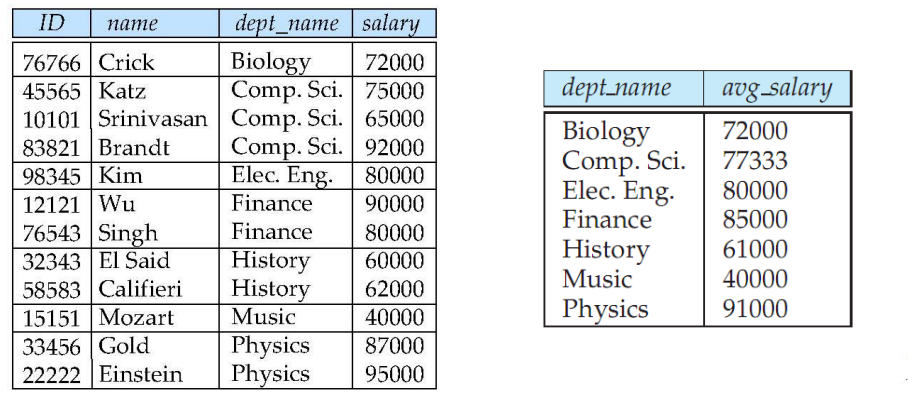

例3，找出教师平均工资超过42 000美元的系

```sql
select dept_name avg (salary) as avg_salary
from instructor
group by dept_name 
having avg(salary)>42000;
```

### 空值

我们在谓词中可以使用特殊的关键词null测试空值,也可以使用is not null测试非空值。

例：找出instructor关系中元组在属性salary上取空值的教师名

```sql
select name
from instructor where salary is null;
```

空值的存在给聚集运算的处理也带来了麻烦。聚集函数根据以下原则处理空值：

+ 除了count（*）外所有的聚集函数都忽略输入集合中的空值
+ 规定：空集的count运算值为0，其他所有聚集运算在输入为空集的情况下返回一个空值

例：计算所有教师工资总和

```sql
select sum(salary)
from instructor;
```

sum运算符会忽略输入中的所有空值,如果instructor关系中所有元组在salary上的取值都为空，则sum运算符返回的结果为null。

### 嵌套子查询

SQL提供嵌套子查询机制。子查询是嵌套在另一个查询中的select-from-where表达式。子查询嵌套在where子句中，通常用于对集合的成员资格、 集合的比较以及集合的基数进行检查。主要用于：

+ 集合成员资格
+ 集合的比较
+ 空关系测试
+ 重复元组存在性测试
+ from子句中的子查询
+ with子句

**集合成员资格**

SQL允许测试元组在关系中的成员资格。连接词in测试元组是否是集合中 的成员，集合是由select子句产生的一组值构成的，对应的还有not in。

例1，找出在2009年秋季和2010年春季学期同时开课的所有课程

```sql
select distinct course_id
from section
where semester =‘Fall’and year= 2009 and
course_id in (select course_id
 from section
 where semester =‘Spring’and year= 2010);

```

考虑查询“找出满足下面条件的所有教师的姓名，他们的工资至少比Biology系某 一个教师的工资要高”，在前面，我们将此查询写作：

```sql
select distinct T.name
 from instructor as T,instructor as S
 where T.salary > S.salary and S.dept_name =‘Biology’;
```

但是SQL提供另外一种方式书写上面的查询。短语“至少比某一个要大”在SQL中用>some表示，则此查询还可写作：

```sql
select name
from instructor
where salary > some (select salary
 from instructor
where dept_name =‘Biology’);
```

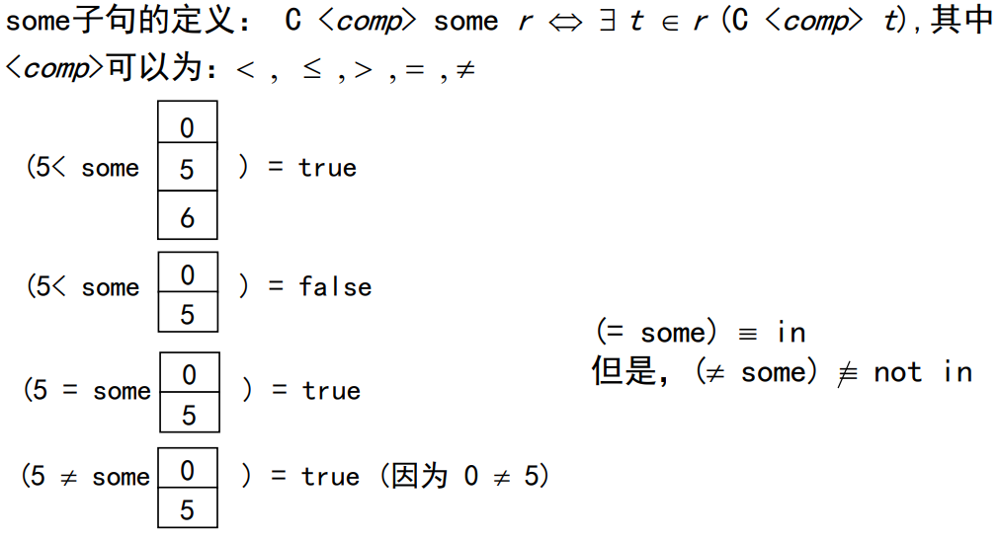

考虑查询“找出满足下面条件的所有教师的姓名，他们的工资比Biology 系每个教师的工资都高” ，在SQL中，结构>all对应于词组“比所有的都 大”，则

```sql
select name
from instructor
where salary > all(select salary
 from instructor
where dept_name =‘Biology’);
```

例：找出平均工资最高的系

```sql
select dept_name
from instructor
group by dept_name
having avg (salary) >= all (select avg (salary)
 from instructor
 group by dept_name);
```

### 空关系测试

SQL还有一个特性可测试一个子查询的结果中是否存在元组，exists结构在集合不为空时返回true值，not exists在集合为空时返回true值。

例，找出既在2009年秋季学期又2010年春季学期开课的所有课程，使用exists结构，重写该查询：

```sql
select course_id
from section as S
where semester =‘Fall’and year = 2009 and
 exists (select *
 from section as T
 where semester =‘Spring’and year= 2010 and
 S.course_id = T.course_id );

```

例，找出选修了Biology系开设的所有课程的学生

使用except结构，写该查询：

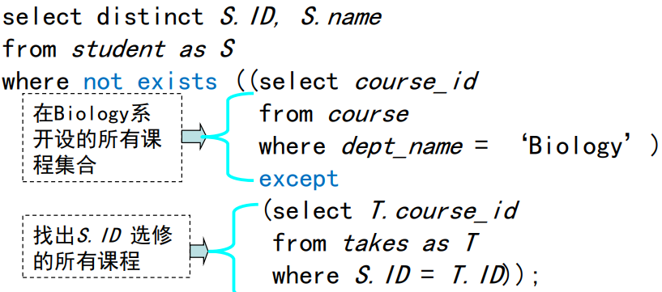

补充：如果$X-Y=0(空集)$，则$X\sube Y$

补充，使用mysql测试在一个子查询的结果中是否存在重复元组。

例1，找出所有在2009年最多开设一次的课程

```sql
select T.course_id
from course as T
where 1 >= (select count(R.course_id)
 from section as R
where T.course_id = R.course_id and
 R.year = 2009)
```

例2，找出所有在2009年最少开设两次的课程

```sql
select distinct T.course_id
from course as T
where 1 < (select count(R.course_id)
 from section as R
where T.course_id = R.course_id and
 R.year = 2009);
```

**from子句中的子查询**

SQL允许在from子句中使用子查询表达式。任何select-from-where表达式返回的结果都是关系，因而可以被插入到另一个select-from-where中任何关系可以出现的位置。

例，找出系平均工资超过42000美元的那些系中教师的平均工资。

在前面的聚集函数中，我们使用了having写此查询。现在，我们用在from子 句中使用子查询重写这个查询：

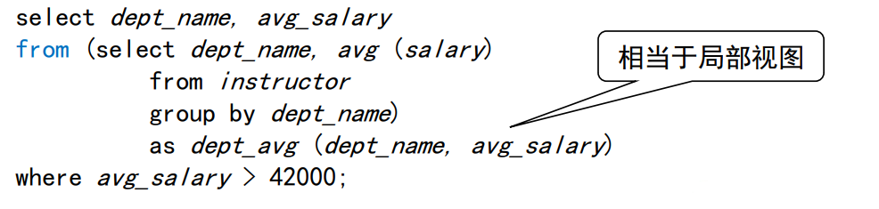

例，找出在所有系中工资总额最大的系

在此，having子句是无能为力的。但我们可以用from子句的子查询轻易地写 出如下查询：

```sql
select max(tot_salary)
from (select dept_name, sum(salary)
from instructor
group by dept_name) as dept_total(dept_name, tot_salary);
```

### with子句

with子句提供定义临时关系的方法，这个定义只对包含with子句的查询有效。

例1，找出具有最大预算值的系

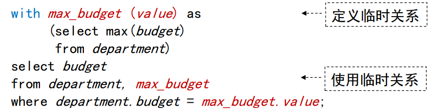

例2，找出工资总额大于平均值的系

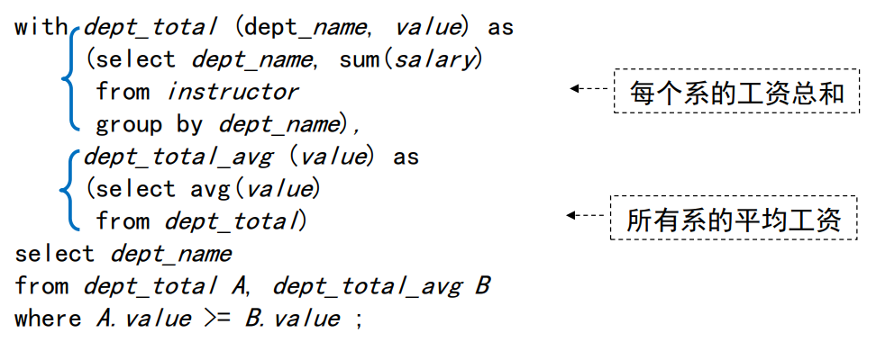

### 数据库的修改

**删除**

除了数据库信息的抽取外，SQL还定义了增加、删除和更新数据库信息的操作删除请求的表达与查询非常类似，我们只能删除整个元组，而不能只删除某些属性上的值，SQL用如下语句表示删除：

```sql
delete from r
where P;
```

其中P代表一个谓词，r代表一个关系。

例1，从instructor关系中删除dept_name为Finance的所有元组

```sql
delete from instructor
where dept_name =‘Finance’;
```

例2，从instructor关系中删除所有位于Watson大楼工作的元组

```sql
delete from instructor
where dept_name in (select dept_name
 from department
 where building =‘Watson’)
```

例3，删除工资低于大学平均工资的教师记录

```sql
delete from instructor
where salary < (select avg (salary)
 from instructor);
```

**插入**

SQL允许使用insert语句，向关系中插入元组，形式如下：

```sql
insert into r(c1,c2,...) values (e1,e2,...)

insert into r(c1,c2,...) select e1,e2,... from ...;
```

例1，假设我们要插入的信息是Computer Science系开设的名为“Database Systems”的课程CS-437，它有4个学分

```sql
insert into course values (‘CS-437’, ‘Database Systems’, ‘Comp. Sci.’, 4);
```

SQL允许在insert语句中指定属性，所以上述语句还可写为：

```sql
insert into course (course_id, title, dept_name, credits) values (‘CS-437’, ‘Database Systems’, ‘Comp. Sci.’, 4);
```

若上例中， Database Systems”课程的学分未知，插入语句还可写为：

```sql
insert into course values (‘CS-437’, ‘Database Systems’, ‘Comp. Sci.’,null);
insert into course (course_id, title, dept_name) values (‘CS-437’, ‘Database Systems’, ‘Comp. Sci.’);
```

假设我们想让Music系每个修满144学分的学生成为Music系的教师，其工资为18000美元

```sql
insert into instructor
 select ID, name, dept_name, 18000
 from student
 where dept_name = ‘Music’ and tot_cred > 144;
```

**更新**

SQL允许使用update语句，在不改变整个元组的情况下改变其部分属性的 值，形式如下：

```sql
update r 
set .....
where <condition>
```

例1，假设给工资超过100000美元的教师涨3%的工资，其余教师涨5% 我们可以写两条update语句

```sql
update instructor
set salary = salary * 1.03
where salary > 100000;
update instructor
set salary = salary * 1.05
where salary <= 100000;
```

**注意：**这两条update语句 的顺序十分重要。如果调 换顺序，可能导致工资略 少于100 000美元的教师 将增长8%的工资

针对上例查询，我们也可以使用SQL提供的case结构，避免更新次序引发 的问题，形式如下：

```sql
case
when pred1 then result1
when pred2 then result2
. . .
when predn then resultn
else result0
end
```

因此上例查询可重新为：

```sql
update instructor
set salary = case
 when salary <= 100000 then salary * 1.05
 else salary * 1.03
end
```

**总结**

 SQL查询语句的通用形式如下：

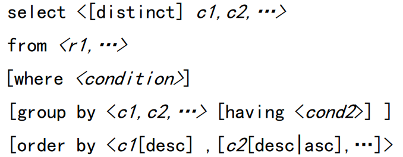

SQL查询语句执行顺序：

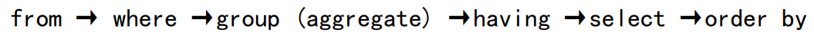