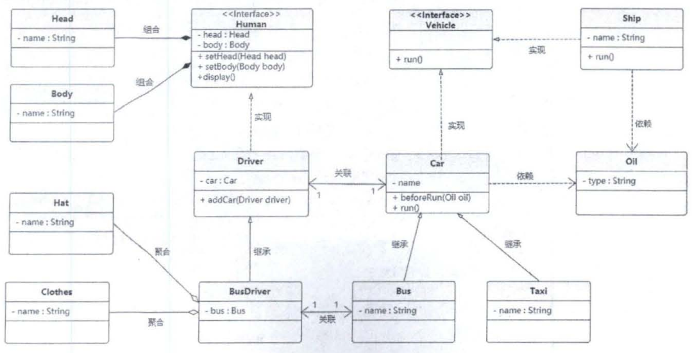

1 设计模式常用的UML图

## 1.1 UML总览


## 1.2 类图 

类图用3个矩形拼接表示，最上面的部分标识类的名称，中间的部分标识类的属性，最下面的部分标识类的方法，抽象类或抽象方法用斜体表示。


### 1.2.1 继承关系


### 1.2.2 实现关系


### 1.2.3 组合关系

组合(Combination)关系表示类之间整体与部分的关系，整体与部分有一致的生存期。一旦整体对象不存在，部分对象也将不存在，整体和部分是同生共死的关系。例如，人由头部和身体组成，两者不可分割，共同存在，其类图如下。


### 1.2.4 聚合关系

聚合（Aggregate）关系也表示类之间整体与部分的关系，成员对象是整体对象的一部分，但是个体可以存在于多个整体。例如，公交车司机和工作服、工作帽是整体与部分的关系，但是可以分开，没有共同的生命周期，工作服、工作帽可以穿戴在别的司机身上，公交车司机也可以换别人的工作服、工作帽，其类图如下。


### 1.2.5 关联关系

关联(Association)关系是类与类之间最常用的一种关系，表示一类对象与另一类对象之间有联系。组合、聚合也属于关联关系，只是关联关系的类间关系比其他两种关系要弱。关联关系有4种:双向关联、单向关联、自关联、多重性关联。例如汽车和司机，一辆汽车对应特定的司机，一个司机也可以开多辆车。其类图如下。


在多重性关联关系中，可以直接在关联直线上增加一个数字，表示与之对应的另一个类的对象的个数，具体含义如下表所示。


### 1.2.6 依赖关系

依赖（Dependency）关系是一种“使用”关系，特定事物的改变有可能会影响到使用该事物的其他事物，当需要表示一个事物使用另一个事物时，使用依赖关系，在大多数情况下，依赖关系体现在**某个类的方法使用另一个类的对象作为参数**。例如，汽车依赖汽油，如果没有汽油，则汽车将无法行驶，其类图如下。


在这6种类关系中，组合、聚合和关联的代码结构一样，可以从关系的强弱来理解，各类关系从强到弱依次是:继承>实现>组合>聚合>关联>依赖。下面用一张完整的类图，将前面描述的所有类与类之间的关系串联起来。



# 2 时序图

## 2.1 时序图总览


## 2.2 时序图组合片段

### 2.2.1 抉择


### 2.2.2 选项


### 2.2.3 循环


### 2.2.4 并行


### 2.2.5 示例


# 3 七大软件架构设计原则

## 3.1 开闭原则(修改关闭)

允许对类进行继承扩展，不允许对源代码进行修改。例如水果工厂类中每增加一个水果，都要对水果工厂类进行修改，重新编译。如果水果工厂类FruitFactory只是定义接口生产水果，苹果applefactory、梨子pearfactory等工厂类单独实现fruitfactory接口类，创建不同的水果对象，各种水果的创建互不影响，新增水果，只要新增一种水果类继承fruitfactory，不会对fruitfactory类进行修改，这就是对扩展开发，对修改关闭。

```java
interface FruitFactory{
    void produceFruit();
}

class AppleFactory implements FruitFactory{

    public void produceFruit() {
        System.out.println("生产苹果");
    }
}

class PearFactory implements FruitFactory{

    public void produceFruit() {
        System.out.println("生产苹果");
    }
}
```

## 3.2 依赖倒置（函数的参数使用抽象）

其核心就是面向接口编程,即当调用的类可能会拓展时用接口代替相应的类。

未使用依赖倒置：

```java
interface BuyGoods{
    void buy();
}

class BuyQingcai implements BuyGoods{

    public void buy() {
        System.out.println("买青菜");
    }
}

class People {
    public void buy(BuyQingcai buyGoods){
        buyGoods.buy();
    }
}

public class Test2 {
    public static void main(String[] args) {
        People p = new People();
        p.buy(new BuyQingcai());
    }
}
```

上述看着没什么问题，但是如果他不想买青菜，想买萝卜怎么办？我们当然可以新建一个萝卜类，再给他弄一个buy方法，但是问题是People并没有操作萝卜类的方法，我们还需要在People添加对萝卜类的依赖。这样代码要修改的代码量太多了，模块与模块之间的耦合性太高，只要需要稍微有点变化，就要大面积重构，所以该设计不合理。

使用依赖倒置：

```java
interface BuyGoods{
    void buy();
}

class BuyQingcai implements BuyGoods{

    public void buy() {
        System.out.println("买青菜");
    }
}

class People {
    public void buy(BuyGoods buyGoods){
        buyGoods.buy();
    }
}

public class Test2 {
    public static void main(String[] args) {
        People p = new People();
        p.buy(new BuyQingcai());
    }
}
```

## 3.3 单一职责（只负责一个功能）

一个类或者一个方法只负责一项职责，尽量做到类的只有一个行为原因引起变化。如A类只负责功能A，B类只负责功能B，不要让A类既负责功能A，又负责功能B，这样会导致代码混乱，容易产生bug。

## 3.4 接口隔离（不实现不需要的接口）

将接口细化**，**类继承接口，类中不需要实现不需要的接口。

## 3.5 迪米特法则（能封装就封装）

最小关系原则，也就是说如果一个代码块能独立封装在一个类的函数中则最好不要放在调用处。

反例如下：

```java
import java.util.ArrayList;
import java.util.List;

class Employee{
    private String id;

    public String getId() {
        return id;
    }

    public void setId(String id) {
        this.id = id;
    }
}

class SubEmployee {
    private String id;

    public String getId() {
        return id;
    }

    public void setId(String id) {
        this.id = id;
    }
}

class SubEmployeeManager {
    public List<SubEmployee> setValue(){
        List<SubEmployee> subEmployees=new ArrayList<SubEmployee>();
        for(int i=0;i<10;i++){
            SubEmployee subEmployee=new SubEmployee();
            subEmployee.setId("分公司"+i);
            subEmployees.add(subEmployee);
        }
        return subEmployees;
    }
}


class EmployeeManager {
    public List<Employee> setValue(){
        List<Employee> employees=new ArrayList<Employee>();
        for(int i=0;i<10;i++){
            Employee employee=new Employee();
            employee.setId("总公司"+i);
            employees.add(employee);
        }
        return  employees;
    }

    public void printAllEmployee(SubEmployeeManager sub){
        List<SubEmployee> list1 = sub.setValue();
        for(SubEmployee e:list1){
            System.out.println(e.getId());
        }

        List<Employee> list2 = this.setValue();
        for(Employee e:list2){
            System.out.println(e.getId());
        }
    }

}
```

EmployeeManager的printAllEmployee函数中，此段代码违背了迪米特法则，应该放在SubEmployee中实现：

```java
 List<SubEmployee> list1 = sub.setValue();
for(SubEmployee e:list1){
	System.out.println(e.getId());
}

```

使用迪米特原则：

```java
import java.util.ArrayList;
import java.util.List;

class Employee{
    private String id;

    public String getId() {
        return id;
    }

    public void setId(String id) {
        this.id = id;
    }
}

class SubEmployee {
    private String id;

    public String getId() {
        return id;
    }

    public void setId(String id) {
        this.id = id;
    }
}

class SubEmployeeManager {
    public List<SubEmployee> setValue(){
        List<SubEmployee> subEmployees=new ArrayList<SubEmployee>();
        for(int i=0;i<10;i++){
            SubEmployee subEmployee=new SubEmployee();
            subEmployee.setId("分公司"+i);
            subEmployees.add(subEmployee);
        }
        return subEmployees;
    }

    public void printAllSubEmployee(){
        List<SubEmployee> list1 = setValue();
        for(SubEmployee e:list1){
            System.out.println(e.getId());
        }
    }
}


class EmployeeManager {
    public List<Employee> setValue(){
        List<Employee> employees=new ArrayList<Employee>();
        for(int i=0;i<10;i++){
            Employee employee=new Employee();
            employee.setId("总公司"+i);
            employees.add(employee);
        }
        return  employees;
    }

    public void printAllEmployee(SubEmployeeManager sub){
        sub.printAllSubEmployee();

        List<Employee> list2 = this.setValue();
        for(Employee e:list2){
            System.out.println(e.getId());
        }
    }

}
```

## 3.6 里氏替换（不改变父类）

1. 子类不允许修改父类接口的功能，如果父类对象被子类替换，软件的功能不变。例如父类接口add是加的作用，子类不能将add变成减法。
2. 当子类覆盖或实现父类的方法时，方法的前置条件（即方法的形参）要比父类方法的输入参数更宽松

## 3.7 合成复用（成员变量使用抽象）

尽量不使用继承，而是通过过定义接口I，类A实现接口，在需要使用A类的B类中定义接口引用I的对象，通过传入A类，可以在B中调用通过接口I对象调用A的实现方法。通过这种方式，可以使系统更加灵活，降低类与类之间的耦合度，一个类的变化对其他类造成的影响相对较少。

```java
import java.util.ArrayList;
import java.util.List;

interface Print{
    void out();
}

class A implements Print{
    public void out() {
        System.out.println("AAAAAA");
    }
}

class B {
    private Print print;

    void setPrint(Print print){
        this.print = print;
    }

    public void output(){
        if(print != null)
            print.out();
    }
}

public class Test2{
    public static void main(String[] args) {
        B b = new B();
        b.setPrint(new A());
        b.output();
    }
}
```

小结：


# 4 一个关于数据库操作的优化实例

## 4.1 原始版本

添加依赖

```xml
<dependencies>
        <!-- https://mvnrepository.com/artifact/mysql/mysql-connector-java -->
        <dependency>
            <groupId>mysql</groupId>
            <artifactId>mysql-connector-java</artifactId>
            <version>8.0.22</version>
        </dependency>
    </dependencies>
```

创建数据库与表：

```sql
create database learnDesignPattern;

use  learnDesignPattern;

create table t_student(
    id int(32) primary key auto_increment,
    name varchar(50),
    age varchar(50)
);

alter table t_student change column age  age int(32);
```

创建学生类Student.java:

```java
public class Student {
    private int age;
    private String name;
    private int id;

    public Student(int age, String name) {
        this.age = age;
        this.name = name;
    }

    public Student(int age, String name, int id) {
        this.age = age;
        this.name = name;
        this.id = id;
    }

    public int getId() {
        return id;
    }

    public void setId(int id) {
        this.id = id;
    }

    public int getAge() {
        return age;
    }

    public void setAge(int age) {
        this.age = age;
    }

    public String getName() {
        return name;
    }

    public void setName(String name) {
        this.name = name;
    }
}
```

创建对学术的增删查改StudentDao.java

```java
import java.sql.Connection;
import java.sql.DriverManager;
import java.sql.PreparedStatement;
import java.sql.Statement;

public class StudentDao {

    //添加学生信息
    public void add(Student stu){
        String sql = "insert into t_student(name,age) values(?,?)";
        Connection conn = null;
        Statement st = null;

        try{
            //1.初始化驱动类，在初始化的时候通过静态代码块中的java.sql.DriverManager.registerDriver(new Driver())注册驱动
            Class.forName("com.mysql.cj.jdbc.Driver");
            //2.获取数据库连接
            conn = DriverManager.getConnection("jdbc:mysql://localhost:3306/learnDesignPattern?useUnicode=true&characterEncoding=utf-8&useSSL=false&serverTimezone=GMT","root","root");
            //3.创建语句对象
            PreparedStatement ps = conn.prepareStatement(sql);
            ps.setObject(1,stu.getName());
            ps.setObject(2,stu.getAge());
            //4.执行sql
            ps.executeUpdate();
        } catch (Exception e) {
            e.printStackTrace();
        }finally {
            //释放资源
            try{
                if (st != null){
                    st.close();
                }

                if(conn!=null){
                    conn.close();
                }
            }catch (Exception e){
                e.printStackTrace();
            }
        }
    }

    //删除学生信息
    public void delete(int id){
        String sql = "delete from t_student where id=?";
        Connection conn = null;
        Statement st = null;

        try{
            //1.初始化驱动类，在初始化的时候通过静态代码块中的java.sql.DriverManager.registerDriver(new Driver())注册驱动
            Class.forName("com.mysql.cj.jdbc.Driver");
            //2.获取数据库连接
            conn = DriverManager.getConnection("jdbc:mysql://localhost:3306/learnDesignPattern?useUnicode=true&characterEncoding=utf-8&useSSL=false&serverTimezone=GMT","root","root");
            //3.创建语句对象
            PreparedStatement ps = conn.prepareStatement(sql);
            ps.setObject(1,id);
            //4.执行sql
            ps.executeUpdate();
        } catch (Exception e) {
            e.printStackTrace();
        }finally {
            //释放资源
            try{
                if (st != null){
                    st.close();
                }

                if(conn!=null){
                    conn.close();
                }
            }catch (Exception e){
                e.printStackTrace();
            }
        }
    }

    //修改学生信息
    public void update(Student stu){
        String sql = "update t_student set name =?,age=? where id=?";
        Connection conn = null;
        Statement st = null;

        try{
            //1.初始化驱动类，在初始化的时候通过静态代码块中的java.sql.DriverManager.registerDriver(new Driver())注册驱动
            Class.forName("com.mysql.cj.jdbc.Driver");
            //2.获取数据库连接
            conn = DriverManager.getConnection("jdbc:mysql://localhost:3306/learnDesignPattern?useUnicode=true&characterEncoding=utf-8&useSSL=false&serverTimezone=GMT","root","root");
            //3.创建语句对象
            PreparedStatement ps = conn.prepareStatement(sql);
            ps.setObject(1,stu.getName());
            ps.setObject(2,stu.getAge());
            ps.setObject(3,stu.getId());
            //4.执行sql
            ps.executeUpdate();
        } catch (Exception e) {
            e.printStackTrace();
        }finally {
            //释放资源
            try{
                if (st != null){
                    st.close();
                }

                if(conn!=null){
                    conn.close();
                }
            }catch (Exception e){
                e.printStackTrace();
            }
        }
    }
}
```

## 4.2 使用JDBCUtil封装代码

可以看到上面代码功能没有问题，但是重复代码太多，因此可以进行抽取，把重复代码放到一个工具类JDBCUtil里。

+ JDBCUtil.java

```java
import java.sql.Connection;
import java.sql.DriverManager;
import java.sql.ResultSet;
import java.sql.Statement;

public class JDBCUtil {
    private JDBCUtil(){}

    static {
        try{
            //1.初始化驱动类，在初始化的时候通过静态代码块中的java.sql.DriverManager.registerDriver(new Driver())注册驱动
            Class.forName("com.mysql.cj.jdbc.Driver");
        }catch (Exception e){
            e.printStackTrace();
        }
    }

    public static Connection getConnection(){
        try{
            //2.获取数据库连接
            return DriverManager.getConnection("jdbc:mysql://localhost:3306/learnDesignPattern?useUnicode=true&characterEncoding=utf-8&useSSL=false&serverTimezone=GMT","root","root");
        }catch (Exception e){
            e.printStackTrace();
        }
        return null;
    }

    public static void close(ResultSet rs, Statement st, Connection conn){
        //释放资源
        try{
            if(rs != null){
                rs.close();
            }

            if (st != null){
                st.close();
            }

            if(conn!=null){
                conn.close();
            }
        }catch (Exception e){
            e.printStackTrace();
        }
    }


}
```

+ StudentDao.java

```java
import java.sql.Connection;
import java.sql.DriverManager;
import java.sql.PreparedStatement;
import java.sql.Statement;

public class StudentDao {

    //添加学生信息
    public void add(Student stu){
        String sql = "insert into t_student(name,age) values(?,?)";
        Connection conn = null;
        Statement st = null;
        PreparedStatement ps = null;
        try{
            conn = JDBCUtil.getConnection();
            ps = conn.prepareStatement(sql);
            ps.setObject(1,stu.getName());
            ps.setObject(2,stu.getAge());
            ps.executeUpdate();
        } catch (Exception e) {
            e.printStackTrace();
        }finally {
            JDBCUtil.close(null,ps,conn);
        }
    }

    //删除学生信息
    public void delete(int id){
        String sql = "delete from t_student where id=?";
        Connection conn = null;
        Statement st = null;
        PreparedStatement ps = null;
        try{
            conn = JDBCUtil.getConnection();
            ps = conn.prepareStatement(sql);
            ps.setObject(1,id);
            ps.executeUpdate();
        } catch (Exception e) {
            e.printStackTrace();
        }finally {
            JDBCUtil.close(null,ps,conn);
        }
    }

    //修改学生信息
    public void update(Student stu){
        String sql = "update t_student set name =?,age=? where id=?";
        Connection conn = null;
        Statement st = null;
        PreparedStatement ps = null;
        try{
            conn = JDBCUtil.getConnection();
            ps = conn.prepareStatement(sql);
            ps.setObject(1,stu.getName());
            ps.setObject(2,stu.getAge());
            ps.setObject(1,stu.getId());
            ps.executeUpdate();
        } catch (Exception e) {
            e.printStackTrace();
        }finally {
            JDBCUtil.close(null,ps,conn);
        }
    }
}
```

## 4.3 使用配置文件，以及查询和修改统一方式

3.2的方法任然有部分冗余，可以把查询和修改的方法进行统一。

+ JDBCUtil.java

```java
import java.io.InputStream;
import java.sql.Connection;
import java.sql.DriverManager;
import java.sql.ResultSet;
import java.sql.Statement;
import java.util.Properties;

public class JDBCUtil {

    private static Properties p = null;

    private JDBCUtil(){}

    static {
        try{
            //1.初始化驱动类，在初始化的时候通过静态代码块中的java.sql.DriverManager.registerDriver(new Driver())注册驱动
            ClassLoader loader = Thread.currentThread().getContextClassLoader();
            InputStream inputStream = loader.getResourceAsStream("db.properties");
            p = new Properties();
            p.load(inputStream);
            Class.forName(p.getProperty("driverClassName"));
        }catch (Exception e){
            e.printStackTrace();
        }
    }

    public static Connection getConnection(){
        try{
            //2.获取数据库连接
            return DriverManager.getConnection(p.getProperty("url"),p.getProperty("username"),p.getProperty("password"));
        }catch (Exception e){
            e.printStackTrace();
        }
        return null;
    }

    public static void close(ResultSet rs, Statement st, Connection conn){
        //释放资源
        try{
            if(rs != null){
                rs.close();
            }

            if (st != null){
                st.close();
            }

            if(conn!=null){
                conn.close();
            }
        }catch (Exception e){
            e.printStackTrace();
        }
    }


}
```

+ JDBCTemplate.java

```java
import java.sql.Connection;
import java.sql.PreparedStatement;
import java.sql.ResultSet;
import java.util.ArrayList;
import java.util.List;

public class JDBCTemplate {

    public static void update(String sql,Object... params){
        Connection conn = null;
        PreparedStatement ps = null;
        ResultSet rs = null;
        try{
            conn = JDBCUtil.getConnection();
            ps = conn.prepareStatement(sql);
            for(int i=0;i<params.length;i++){
                ps.setObject(i+1,params[i]);
            }
            ps.executeUpdate();
        }catch (Exception e){
            e.printStackTrace();
        }finally {
            JDBCUtil.close(rs,ps,conn);
        }

    }

    public static List<Student> query(String sql,Object... params){
        List<Student> list = new ArrayList<Student>();
        Connection conn = null;
        PreparedStatement ps = null;
        ResultSet rs = null;

        try{
            conn = JDBCUtil.getConnection();
            ps = conn.prepareStatement(sql);
            for(int i=0;i<params.length;i++){
                ps.setObject(i+1,params[i]);
            }
            rs = ps.executeQuery();
            while(rs.next()){
                int id = rs.getInt("id");
                String name = rs.getString("name");
                int age = rs.getInt("age");
                Student stu = new Student(id,name,age);
                list.add(stu);
            }
        }catch (Exception e){
            e.printStackTrace();
        }finally {
            JDBCUtil.close(rs,ps,conn);
        }

        return list;
    }
}
```

+ StudentDao.java

```java
import org.slf4j.Logger;
import org.slf4j.LoggerFactory;

import java.sql.*;
import java.util.ArrayList;
import java.util.List;

public class StudentDao {

    private Logger logger = LoggerFactory.getLogger(StudentDao.class);


    //添加学生信息
    public void add(Student stu){
        String sql = "insert into t_student(name,age) values(?,?)";
        Object[] params = new Object[]{stu.getName(),stu.getAge()};
        JDBCTemplate.update(sql,params);
    }

    //删除学生信息
    public void delete(int id){
        String sql = "delete from t_student where id=?";
        JDBCTemplate.update(sql,id);
    }

    //修改学生信息
    public void update(Student stu){
        String sql = "update t_student set name =?,age=? where id=?";
        Object[] params = new Object[]{stu.getName(),stu.getAge(),stu.getId()};
        JDBCTemplate.update(sql,params);
    }

    //查询
    public Student get(int id){
        String sql = "select * from t_student where id=?";
        List<Student> list = JDBCTemplate.query(sql, id);
        return list.size()>0?list.get(0):null;
    }

    //查询
    public List<Student> list(){
        String sql = "select * from t_student";
        return JDBCTemplate.query(sql);
    }
}
```

## 4.4 使用泛型处理多种返回结果

如果不仅要查询学生信息(List类型），还要查询学生数量，这时就要通过泛型来完成。

+ IRowMapper.java

```java
import java.sql.ResultSet;
import java.util.List;

public interface IRowMapper<T> {
    T mapping(ResultSet rs) throws Exception;
}
```

+ StudentRowMapper.java

```java
import java.sql.ResultSet;
import java.util.ArrayList;
import java.util.List;

public class StudentRowMapper implements IRowMapper<List<Student>> {
    public List<Student> mapping(ResultSet rs) throws Exception {
        List<Student> list = new ArrayList<Student>();
        while(rs.next()){
            int id = rs.getInt("id");
            String name = rs.getString("name");
            int age = rs.getInt("age");
            Student stu = new Student(id,name,age);
            list.add(stu);
        }
        return list;
    }
}
```

+ JDBCUtil

```java
import java.io.InputStream;
import java.sql.Connection;
import java.sql.DriverManager;
import java.sql.ResultSet;
import java.sql.Statement;
import java.util.Properties;

public class JDBCUtil {

    private static Properties p = null;

    private JDBCUtil(){}

    static {
        try{
            //1.初始化驱动类，在初始化的时候通过静态代码块中的java.sql.DriverManager.registerDriver(new Driver())注册驱动
            ClassLoader loader = Thread.currentThread().getContextClassLoader();
            InputStream inputStream = loader.getResourceAsStream("db.properties");
            p = new Properties();
            p.load(inputStream);
            Class.forName(p.getProperty("driverClassName"));
        }catch (Exception e){
            e.printStackTrace();
        }
    }

    public static Connection getConnection(){
        try{
            //2.获取数据库连接
            return DriverManager.getConnection(p.getProperty("url"),p.getProperty("username"),p.getProperty("password"));
        }catch (Exception e){
            e.printStackTrace();
        }
        return null;
    }

    public static void close(ResultSet rs, Statement st, Connection conn){
        //释放资源
        try{
            if(rs != null){
                rs.close();
            }

            if (st != null){
                st.close();
            }

            if(conn!=null){
                conn.close();
            }
        }catch (Exception e){
            e.printStackTrace();
        }
    }


}
```

+ StudentDao

```java
import org.slf4j.Logger;
import org.slf4j.LoggerFactory;

import javax.xml.transform.Result;
import java.sql.*;
import java.util.ArrayList;
import java.util.List;

public class StudentDao {

    private Logger logger = LoggerFactory.getLogger(StudentDao.class);


    //添加学生信息
    public void add(Student stu){
        String sql = "insert into t_student(name,age) values(?,?)";
        Object[] params = new Object[]{stu.getName(),stu.getAge()};
        JDBCTemplate.update(sql,params);
    }

    //删除学生信息
    public void delete(int id){
        String sql = "delete from t_student where id=?";
        JDBCTemplate.update(sql,id);
    }

    //修改学生信息
    public void update(Student stu){
        String sql = "update t_student set name =?,age=? where id=?";
        Object[] params = new Object[]{stu.getName(),stu.getAge(),stu.getId()};
        JDBCTemplate.update(sql,params);
    }

    //查询
    public Student get(int id){
        String sql = "select * from t_student where id=?";
        List<Student> list = JDBCTemplate.query(sql, new StudentRowMapper(),id);
        return list.size()>0?list.get(0):null;
    }

    //查询
    public List<Student> list(){
        String sql = "select * from t_student";
        return JDBCTemplate.query(sql,new StudentRowMapper());
    }

    public int getCount(){
         String sql = "select count(*) total from t_student";
         int totalCount = (int)JDBCTemplate.query(sql, new IRowMapper<Integer>() {
             public Integer mapping(ResultSet rs) throws Exception{
                Integer totalCount = null;
                if(rs.next()){
                    totalCount = rs.getInt("total");
                }
                return totalCount;
             }
         });

         return totalCount;
    }
}
```

+ JDBCTemplate.java

```java
import java.sql.Connection;
import java.sql.PreparedStatement;
import java.sql.ResultSet;
import java.util.ArrayList;
import java.util.List;

public class JDBCTemplate {

    public static void update(String sql,Object... params){
        Connection conn = null;
        PreparedStatement ps = null;
        ResultSet rs = null;
        try{
            conn = JDBCUtil.getConnection();
            ps = conn.prepareStatement(sql);
            for(int i=0;i<params.length;i++){
                ps.setObject(i+1,params[i]);
            }
            ps.executeUpdate();
        }catch (Exception e){
            e.printStackTrace();
        }finally {
            JDBCUtil.close(rs,ps,conn);
        }

    }

    public static <T> T query(String sql,IRowMapper<T> rsh,Object... params){
        Connection conn = null;
        PreparedStatement ps = null;
        ResultSet rs = null;

        try{
            conn = JDBCUtil.getConnection();
            ps = conn.prepareStatement(sql);
            for(int i=0;i<params.length;i++){
                ps.setObject(i+1,params[i]);
            }
            rs = ps.executeQuery();
            return rsh.mapping(rs);
        }catch (Exception e){
            e.printStackTrace();
        }finally {
            JDBCUtil.close(rs,ps,conn);
        }

        return null;
    }
}
```

## 4.5 连接池

以上代码每次执行sql都要获取数据库连接，这就导致资源的浪费，所以可以使用数据库连接池来优化代码。

+ Pool.java

```java
package JDBC.Pool;

import org.slf4j.Logger;
import org.slf4j.LoggerFactory;

import java.io.IOException;
import java.io.InputStream;
import java.sql.Connection;
import java.sql.Driver;
import java.sql.DriverManager;
import java.sql.SQLException;
import java.util.Properties;

public abstract class Pool {
//    private Logger logger = LoggerFactory.getLogger(Pool.class);

    public String propertiesName = "db.properties";
    private static Pool instance = null;

    //最大连接数
    protected int maxConnection = 100;

    //保持连接数
    protected int stayConnection = 10;

    //驱动字符串
    protected String driverName = null;

    //驱动类
    protected Driver driver = null;

    protected Pool(){
        try{
            init();
            loadDrivers(driverName);
        } catch (Exception e) {
            e.printStackTrace();
        }
    }

    /**
     * @Author cgw
     * @Description 初始化所有从配置文件中读取的成员变量
     * @return: void
     * @Date  2022/2/18 16:13
     **/
    private void init() throws IOException{
        Properties properties = new Properties();
        InputStream is = Pool.class.getClassLoader().getResourceAsStream(propertiesName);
        try {
            properties.load(is);
        } catch (IOException e) {
            e.printStackTrace();
        }
        this.driverName = properties.getProperty("driverClassName");

        if(properties.getProperty("maxConnection")!=null){
            this.maxConnection = Integer.parseInt(properties.getProperty("maxConnection"));
        }

        if(properties.getProperty("stayConnection")!=null){
            this.stayConnection = Integer.parseInt(properties.getProperty("stayConnection"));
        }
    }

    /**
     * @Author cgw
     * @Description 装载和注册所有JDBC驱动程序
     * @param driverName: 接收驱动字符串
     * @return: void
     * @Date  2022/2/18 16:12
     **/
    private void loadDrivers(String driverName){
        String driverClassName= driverName;
        try {
            driver = (Driver) Class.forName(driverClassName).newInstance();
            DriverManager.registerDriver(driver);
//            logger.info("成功注册JDBC驱动程序:{}",driverClassName);
        } catch (Exception e) {
//            logger.info("无法注册JDBC驱动程序:{}，异常:{}",driverClassName,e);
        }
    }
    
    /**
     * @Author cgw
     * @Description 获得一个可用的连接，如果没有，则创建一个连接，并且小于最大连接限制
     * @return: java.sql.Connection
     * @Date  2022/2/18 16:01
     **/
    public abstract Connection getConnection();

    /**
     * @Author cgw
     * @Description 获得一个连接，有时间限制
     * @param time: 设置该连接的持续时间(以毫秒为单位)
     * @return: java.sql.Connection
     * @Date  2022/2/18 16:02
     **/
    public abstract Connection getConnection(long time);

    /**
     * @Author cgw
     * @Description 将连接对象返回连接池
     * @param connection: 获得连接对象
     * @return: void
     * @Date  2022/2/18 16:03
     **/
    public abstract void freeConnection(Connection connection);

    /**
     * @Author cgw
     * @Description 返回当前空闲的连接数
     * @return: int
     * @Date  2022/2/18 16:04
     **/
    public abstract int getNumFree();

    /**
     * @Author cgw
     * @Description 返回当前工作的连接数
     * @return: int
     * @Date  2022/2/18 16:04
     **/
    public abstract int getNumActive();

    /**
     * @Author cgw
     * @Description 关闭所有连接，撤销驱动注册，此方法为单例方法
     * @return: void
     * @Date  2022/2/18 16:14
     **/
    protected synchronized void release(){
        try{
            DriverManager.deregisterDriver(driver);
//            logger.info("撤销JDBC驱动程序:{}",driver.getClass().getName());
        } catch (SQLException e) {
//            logger.info("无法撤销JDBC驱动程序:{},异常:{}",driver.getClass().getName(),e);
        }

    }
}
```

+ DBConnectionPool.java

```java
package JDBC.Pool;

import org.slf4j.LoggerFactory;
import org.slf4j.Logger;

import java.io.InputStream;
import java.sql.Connection;
import java.sql.DriverManager;
import java.util.Date;
import java.util.Enumeration;
import java.util.Properties;
import java.util.Vector;

//final修饰的类不能被继承
public final class DBConnectionPool extends Pool {
//    private Logger logger = LoggerFactory.getLogger(DBConnectionPool.class);
    private Vector<Connection> freeConnections = new Vector<Connection>();//存放产生的连接对象容器

    private String url = null;//连接字符串
    private String username = null;//用户名
    private String password = null;//密码

    private int numTotal;//连接总数
    private static int numFree = 0;//空闲的连接数, 放入到连接池里的连接数量
    private static int numActive = 0;//在活跃的连接数，默认为0，指的是在使用的线程数量

    private static DBConnectionPool dbConnectionPool = null;//连接池实例对象

    private DBConnectionPool(){
        try{
            init();
            for(int i=0;i<stayConnection;i++){
                Connection c = newConnection();
                if(null != c){
                    freeConnections.addElement(c);
                    numTotal++;
                    numFree++;
                }
            }
        } catch (Exception e) {
            e.printStackTrace();
        }

    }

    // 使用单例模式获取连接池
    public static DBConnectionPool getInstance() {
        if (dbConnectionPool == null){
            synchronized (Pool.class){
                if(dbConnectionPool == null){
                    dbConnectionPool = new DBConnectionPool();
                }
            }
        }
        return dbConnectionPool;
    }

    /**
     * @Author cgw
     * @Description 初始化
     * @return: void
     * @Date  2022/2/18 16:22
     **/
    private void init() throws Exception{
        InputStream is = DBConnectionPool.class.getClassLoader().getResourceAsStream(propertiesName);
        Properties properties = new Properties();
        properties.load(is);
        this.driverName = properties.getProperty("driverClassName");
        this.url = properties.getProperty("url");
        this.username = properties.getProperty("username");
        this.password = properties.getProperty("password");
    }

    /**
     * @Author cgw
     * @Description 创建一个新连接
     * @return: java.sql.Connection
     * @Date  2022/2/18 16:26
     **/
    private Connection newConnection(){
        Connection connection = null;
        try{
            if(username == null || password == null){
                connection = DriverManager.getConnection(url);
            }else {
                connection = DriverManager.getConnection(url,username,password);
            }
//            logger.info("连接池创建一个新的连接");
        } catch (Exception e) {
//            logger.info("无法创建url:{}的连接，错误原因:{}",url,e);
            return null;
        }
        return connection;
    }

    /**
     * @Author cgw
     * @Description 获取一个可用连接
     * @return: java.sql.Connection
     * @Date  2022/2/18 19:14
     **/
    public synchronized  Connection getConnection() {
        Connection connection = null;
        if(freeConnections.size() > 0){
            connection = (Connection)freeConnections.firstElement();
            numFree--;
            freeConnections.removeElementAt(0);
            try{
                if(connection.isClosed()){
//                    logger.info("从连接池删除一个无效连接");
                    numTotal--;
                    connection = getConnection();
                }
            } catch (Exception e) {
//                logger.info("从连接池删除一个无效连接");
            }
            //没有空闲连接且当前连接小于允许最大值，若最大值为0，则不限制
        }else if(maxConnection == 0 || numTotal < maxConnection){
            connection = newConnection();
            numTotal++;
        }

        if(connection != null){
            numActive++;
        }

        return connection;
    }

    //获取一个可用连接,并加上等待时间限制，时间为毫秒
    public Connection getConnection(long timeout) {
        long startTime = new Date().getTime();
        Connection connection = null;
        while((connection = getConnection()) == null){
            try{
                //20毫秒执行一次
                Thread.sleep(20);
            } catch (Exception e) {
                e.printStackTrace();
            }

            if((new Date().getTime() - startTime) >= timeout){
                return null;//如果超时，则返回
            }
        }
        return connection;
    }

    public void freeConnection(Connection con) {
        freeConnections.addElement(con);
        numFree++;
        numActive--;
//        notifyAll();//解锁
    }

    public int getNumFree() {
        return numFree;
    }

    public int getNumActive() {
        return numActive;
    }

    //释放所有连接
    public synchronized void release() {
        try {
            Enumeration allConnections = freeConnections.elements();
            while (allConnections.hasMoreElements()) {
                Connection conn = (Connection) allConnections.nextElement();
                try {
                    conn.close();
                    numFree--;
                } catch (Exception e) {
                    System.out.println("无法关闭连接池中的连接");
                }
            }
            freeConnections.removeAllElements();
            numTotal=0;
        } catch (Exception e) {
            System.out.println("释放失败!");
        } finally {
            //卸载驱动
            super.release();
        }

    }
}
```

+ JDBCUtil.java

```java
package JDBC.Util;

import JDBC.Pool.DBConnectionPool;

import java.io.InputStream;
import java.sql.Connection;
import java.sql.ResultSet;
import java.sql.Statement;
import java.util.Properties;

public class JDBCUtil {

    private static Properties p = null;

    private JDBCUtil(){}

    static {
        try{
            //1.初始化驱动类，在初始化的时候通过静态代码块中的java.sql.DriverManager.registerDriver(new Driver())注册驱动
            ClassLoader loader = Thread.currentThread().getContextClassLoader();
            InputStream inputStream = loader.getResourceAsStream("db.properties");
            p = new Properties();
            p.load(inputStream);
            Class.forName(p.getProperty("driverClassName"));
        }catch (Exception e){
            e.printStackTrace();
        }
    }

    public static Connection getConnection(){
        try{
            //2.获取数据库连接
//            return DriverManager.getConnection(p.getProperty("url"),p.getProperty("username"),p.getProperty("password"));
            return DBConnectionPool.getInstance().getConnection();
        }catch (Exception e){
            e.printStackTrace();
        }
        return null;
    }

    public static void close(ResultSet rs, Statement st, Connection connection){
        //释放资源
        try{
            if(rs != null){
                rs.close();
            }

            if (st != null){
                st.close();
            }

            if(connection!=null){
                DBConnectionPool.getInstance().freeConnection(connection);
            }
        }catch (Exception e){
            e.printStackTrace();
        }
    }


}
```

+ IRowMapper.java

```java
package JDBC.Util;

import java.sql.ResultSet;
import java.util.List;

public interface IRowMapper<T> {
    T mapping(ResultSet rs) throws Exception;
}
```

+ JDBCTemplate.java

```java
package JDBC.Util;

import java.sql.Connection;
import java.sql.PreparedStatement;
import java.sql.ResultSet;

public class JDBCTemplate {

    public static void update(String sql,Object... params){
        Connection connection = null;
        PreparedStatement ps = null;
        ResultSet rs = null;
        try{
            connection = JDBCUtil.getConnection();
            ps = connection.prepareStatement(sql);
            for(int i=0;i<params.length;i++){
                ps.setObject(i+1,params[i]);
            }
            ps.executeUpdate();
        }catch (Exception e){
            e.printStackTrace();
        }finally {
            JDBCUtil.close(rs,ps,connection);
        }

    }

    public static <T> T query(String sql,IRowMapper<T> rsh,Object... params){
        Connection connection = null;
        PreparedStatement ps = null;
        ResultSet rs = null;

        try{
            connection = JDBCUtil.getConnection();
            ps = connection.prepareStatement(sql);
            for(int i=0;i<params.length;i++){
                ps.setObject(i+1,params[i]);
            }
            rs = ps.executeQuery();
            return rsh.mapping(rs);
        }catch (Exception e){
            e.printStackTrace();
        }finally {
            JDBCUtil.close(rs,ps,connection);
        }

        return null;
    }
}
```

+ StudentDao.java

```java
package dao;

import JDBC.Util.IRowMapper;
import JDBC.Util.JDBCTemplate;
import org.slf4j.Logger;
import org.slf4j.LoggerFactory;
import pojo.Student;

import java.sql.*;
import java.util.List;

public class StudentDao {

//    private Logger logger = LoggerFactory.getLogger(StudentDao.class);


    //添加学生信息
    public void add(Student stu){
        String sql = "insert into t_student(name,age) values(?,?)";
        Object[] params = new Object[]{stu.getName(),stu.getAge()};
        JDBCTemplate.update(sql,params);
    }

    //删除学生信息
    public void delete(int id){
        String sql = "delete from t_student where id=?";
        JDBCTemplate.update(sql,id);
    }

    //修改学生信息
    public void update(Student stu){
        String sql = "update t_student set name =?,age=? where id=?";
        Object[] params = new Object[]{stu.getName(),stu.getAge(),stu.getId()};
        JDBCTemplate.update(sql,params);
    }

    //查询
    public Student get(int id){
        String sql = "select * from t_student where id=?";
        List<Student> list = JDBCTemplate.query(sql, new StudentRowMapper(),id);
        return list.size()>0?list.get(0):null;
    }

    //查询
    public List<Student> list(){
        String sql = "select * from t_student";
        return JDBCTemplate.query(sql,new StudentRowMapper());
    }

    public int getCount(){
         String sql = "select count(*) total from t_student";
         int totalCount = (int)JDBCTemplate.query(sql, new IRowMapper<Integer>() {
             public Integer mapping(ResultSet rs) throws Exception{
                Integer totalCount = null;
                if(rs.next()){
                    totalCount = rs.getInt("total");
                }
                return totalCount;
             }
         });

         return totalCount;
    }
}
```

+ StudentRowMapper.java

```java
package dao;

import JDBC.Util.IRowMapper;
import pojo.Student;

import java.sql.ResultSet;
import java.util.ArrayList;
import java.util.List;

public class StudentRowMapper implements IRowMapper<List<Student>> {
    public List<Student> mapping(ResultSet rs) throws Exception {
        List<Student> list = new ArrayList<Student>();
        while(rs.next()){
            int id = rs.getInt("id");
            String name = rs.getString("name");
            int age = rs.getInt("age");
            Student stu = new Student(id,name,age);
            list.add(stu);
        }
        return list;
    }
}
```

+ 测试代码

```java
import dao.StudentDao;

public class ExectorThread extends Thread {

    @Override
    public void run() {
        StudentDao stuDao = new StudentDao();
        System.out.println("线程" + this.getName() + " " + stuDao.list());
    }
}

import dao.StudentDao;

public class TestApi {

    public static void main(String[] args) {
        for(int i = 0;i<200000;i++){
            Thread t = new Thread(new ExectorThread());
            t.setName(""+i);
            t.start();
        }
//        System.out.println("End");
//        StudentDao stuDao = new StudentDao();
//        stuDao.add(new Student(19,"bbb"));
//        System.out.println(stuDao.list());
//        System.out.println(stuDao.getCount());
//        System.out.println(stuDao.get(2).getName());
//        stuDao.add(new Student(18,"aaa"));
//        stuDao.update(new Student(19,"aaa",1));
//        stuDao.delete(1);
    }
}

```

# 5 工厂模式

## 5.1 简单工厂

```java
public class Client {

    public interface IProduct{
        void doSomething();
    }

    //静态类：只能访问类内部的静态成员；
    //非静态类：可访问类内所有成员；
    static class ProductA implements IProduct{
        public void doSomething(){
            System.out.println("I am Produuct A");
        }
    }

    static class ProductB implements IProduct{
        public void doSomething(){
            System.out.println("I am Produuct B");
        }
    }

    static class ProductC implements IProduct{
        public void doSomething(){
            System.out.println("I am Produuct C");
        }
    }

    enum ProductType{
        PRODUCT_A,
        PRODUCT_B,
        PRODUCT_C
    }

    static class SimpleFactory{
        public static IProduct makeProduct(ProductType type){
            switch (type){
                case PRODUCT_A:
                    return new ProductA();
                case PRODUCT_B:
                    return new ProductB();
                case PRODUCT_C:
                    return new ProductC();
            }
            return null;
        }
    }

    public static void main(String[] args) {
        System.out.println(ProductType.PRODUCT_A);
        IProduct product = new SimpleFactory().makeProduct(ProductType.PRODUCT_A);
        product.doSomething();
    }

}
```

## 5.2 抽象工厂

在抽象中，不再由单一的工厂类生产产品，而是由工厂类的实现类创建具体产品。因此，当增加一个产品时，只需增加一个相应的工厂类的子类，实现生产这种产品，便可以解决简单工厂生产太多产品导致其内部代码臃肿(switch ... case分支过多)的问题，也符合开闭原则。

UML类图：


```java
package design;

public class Client {


    public static void main(String[] args) {
        IFactory factory = new FactoryA();
        factory.makeProduct().doSomething();
    }

    private interface IProduct{
        void doSomething();
    }

    private static class ProductA implements IProduct{
        public void doSomething() {
            System.out.println("I am Product A");
        }
    }

    private static class ProductB implements IProduct{
        public void doSomething() {
            System.out.println("I am Product B");
        }
    }

    private static class ProductC implements IProduct{
        public void doSomething() {
            System.out.println("I am Product C");
        }
    }

    private interface IFactory{
        IProduct makeProduct();
    }

    private static class FactoryA implements IFactory{
        public IProduct makeProduct() {
            return new ProductA();
        }
    }

    private static class FactoryB implements IFactory{
        public IProduct makeProduct() {
            return new ProductB();
        }
    }

    private static class FactoryC implements IFactory{
        public IProduct makeProduct() {
            return new ProductC();
        }
    }

}
```

## 5.3 抽象工厂产品族

5.2中的抽象工厂只能产生一个对象，当需要产生一类对象时需要提供一个产品类的库，所有产品以同样的接口出现，从而使客户端不依赖具体实现。


```java
package design;

public class Client {


    public static void main(String[] args) {
        IFactory factory = new FamilyA();
        factory.makeProductA().doA();
        factory.makeProductB().doB();
    }

    private interface IProductA{
        void doA();
    }

    private interface IProductB{
        void doB();
    }

    private static class ProductAInFamilyA implements IProductA{
        public void doA() {
            System.out.println("The productA is part of FamilyA");
        }
    }

    private static class ProductBInFamilyA implements IProductB{
        public void doB() {
            System.out.println("The productB is part of FamilyA");
        }
    }

    private static class ProductAInFamilyB implements IProductA{
        public void doA() {
            System.out.println("The productA is part of FamilyB");
        }
    }

    private static class ProductBInFamilyB implements IProductB{
        public void doB() {
            System.out.println("The productB is part of FamilyB");
        }
    }

    private interface IFactory{
        IProductA makeProductA();
        IProductB makeProductB();
    }

    private static class FamilyA implements IFactory{

        public IProductA makeProductA() {
            return new ProductAInFamilyA();
        }

        public IProductB makeProductB() {
            return new ProductBInFamilyA();
        }
    }

    private static class FamilyB implements IFactory{

        public IProductA makeProductA() {
            return new ProductAInFamilyB();
        }

        public IProductB makeProductB() {
            return new ProductBInFamilyB();
        }
    }


}
```

# 6 单例模式

## 6.1 饿汉模式

```java
package design;

public class HungryStaticSingleton {
    private static final HungryStaticSingleton hungrySingleton;
    static {
        System.out.println("初始化单例");
        hungrySingleton = new HungryStaticSingleton();
    }

    private HungryStaticSingleton(){}

    public static HungryStaticSingleton getInstance(){
        return hungrySingleton;
    }

    public static void main(String[] args) {
        HungryStaticSingleton.getInstance();
    }
}
```

## 6.2 懒汉模式

```java
public class LazySimpleSingleton {
    private LazySimpleSingleton(){}
    //静态块，公共内存区域
    private volatile static LazySimpleSingleton lazySimpleSingleton = null;
    public static LazySimpleSingleton getInstance(){
        if(null == lazySimpleSingleton){
            synchronized (LazySimpleSingleton.class){
                if(null == lazySimpleSingleton){
                    lazySimpleSingleton = new LazySimpleSingleton();
                }
            }
        }
        return lazySimpleSingleton;
    }
}
```

## 6.3 内部类

```java
package design;

//使用内部类的时候，内部类才会加载，否则不会加载，也就是说，当调用getInstance的时候内部类才会加载
public class LazyStaticInnerClassSingleton {

    //不允许构造函数被反射直接调用，否则会抛出异常
    private LazyStaticInnerClassSingleton(){
        if(LazyHolder.INSTANCE != null){
            throw new RuntimeException("不允许通过反射创建实例");
        }
    }

//    //static关键字是为了使单例模式共享空间，保证这个方法不会被重写
    public static LazyStaticInnerClassSingleton getInstance(){
        //在返回结果前，一定会加载内部类
        return LazyHolder.INSTANCE;
    }

    private static class LazyHolder{
        private static final LazyStaticInnerClassSingleton INSTANCE = new LazyStaticInnerClassSingleton();
    }
}
```

+ 测试类

```java
package design;

import java.lang.reflect.Constructor;

public class ReflactUse {
    public static void main(String[] args) {
        try{
//            System.out.println(LazyStaticInnerClassSingleton.getInstance());
//            System.out.println(LazyStaticInnerClassSingleton.getInstance());
//            System.out.println(LazyStaticInnerClassSingleton.getInstance());

//            Class<LazyStaticInnerClassSingleton> clazz = LazyStaticInnerClassSingleton.class;
//            //通过返回获取私有的构造方法
//            Constructor c = clazz.getDeclaredConstructor(null);
//            //强制访问
//            c.setAccessible(true);
//            //暴力初始化
//            Object o1 = c.newInstance();
//            System.out.println(((LazyStaticInnerClassSingleton)o1).getInstance());
        }catch (Exception e){
            e.printStackTrace();
        }
    }
}
```

## 6.4 枚举体

枚举体在对象序列化读写中，也是保持单例。

```java
package design;

public enum EnumSingleton {
    A,B,C,D,INSTANCE;

    public int a = 10;
    public void test(){
        System.out.println("hi");
    }
}
```

+ 测试类

```java
package design;

public class TestApi {
    public static void main(String[] args) {
        EnumSingleton.INSTANCE.test();
        System.out.println(EnumSingleton.INSTANCE.a);
    }
}
```

## 6.5 IOC容器

```java
package design;

import java.util.Map;
import java.util.concurrent.ConcurrentHashMap;

public class ContainerSingleton {
    private ContainerSingleton(){}
    private static Map<String,Object> ioc = new ConcurrentHashMap<String,Object>();

    public static Object getBean(String className){
        synchronized (ioc){
            if(!ioc.containsKey(className)){
                Object obj = null;
                try{
                    obj = Class.forName(className).newInstance();
                    ioc.put(className,obj);
                }catch (Exception e){
                    e.printStackTrace();
                }
                return obj;
            }else{
                return ioc.get(className);
            }
        }
    }

}
```
## 6.6 ThreadLocal单例

```java
//ThreadLocal 不能保证其创建的对象是全局唯一的，但能保证在单个线程中是唯一的，是线程安全的。
public class ThreadLocalSingleton {
    private static final ThreadLocal<ThreadLocalSingleton> threadLocalInstance = new ThreadLocal<ThreadLocalSingleton>(){
        @Override
        protected ThreadLocalSingleton initialValue() {
            return new ThreadLocalSingleton();
        }
    };

    private ThreadLocalSingleton(){}

    public static ThreadLocalSingleton getInstance(){
        return threadLocalInstance.get();
    }
}
```

+ 测试类

```java
public class ExecutorThread extends Thread {
    @Override
    public void run() {
        System.out.println(ThreadLocalSingleton.getInstance());
    }
}
```

```java
public class TestApi {
    public static void main(String[] args) {
        System.out.println(ThreadLocalSingleton.getInstance());
        System.out.println(ThreadLocalSingleton.getInstance());
        System.out.println(ThreadLocalSingleton.getInstance());
        System.out.println(ThreadLocalSingleton.getInstance());
        System.out.println(ThreadLocalSingleton.getInstance());

        Thread t1 = new Thread(new ExecutorThread());
        t1.start();
        Thread t2 = new Thread(new ExecutorThread());
        t2.start();
    }
}
```

# 7 原型模式

## 7.1 使用序列化深拷贝

```java
import lombok.Data;

import java.io.*;
import java.util.ArrayList;
import java.util.List;

//深拷贝对象，super.clone()方法是浅拷贝
@Data
public class ConcretePrototype implements Cloneable, Serializable {
    private int age;
    private String name;
    private List<String> hobbies;

    //浅拷贝
    @Override
    protected ConcretePrototype clone() throws CloneNotSupportedException {
        try{
            return (ConcretePrototype)super.clone();
        }catch (Exception e){
            e.printStackTrace();
            return null;
        }
    }

    //深拷贝
    public ConcretePrototype deepClone(){
        try{
            //字节输出流
            ByteArrayOutputStream byteArrayOutputStream = new ByteArrayOutputStream();
            //对象输出流
            ObjectOutputStream objectOutput = new ObjectOutputStream(byteArrayOutputStream);
            //写入对象
            objectOutput.writeObject(this);

            //字节输入流
            ByteArrayInputStream byteArrayInputStream = new ByteArrayInputStream(byteArrayOutputStream.toByteArray());
            //对象输入流
            ObjectInputStream objectInputStream = new ObjectInputStream(byteArrayInputStream);
            //读入对象
            return (ConcretePrototype)objectInputStream.readObject();
        }catch (Exception e){
            e.printStackTrace();
            return null;
        }
    }

    @Override
    public String toString() {
        return "ConcretePrototype{" +
                "age=" + age +
                ", name='" + name + '\'' +
                ", hobbies=" + hobbies +
                '}';
    }


    public static void main(String[] args) {
        //创建原型对象
        ConcretePrototype concretePrototype = new ConcretePrototype();
        concretePrototype.setAge(18);
        concretePrototype.setName("Tom");
        List<String> hobbies = new ArrayList<String>();
        hobbies.add("书法");
        hobbies.add("美术");
        concretePrototype.setHobbies(hobbies);
        System.out.println(concretePrototype);
        //等号赋值传递的是引用
        hobbies.add("美术");
        System.out.println(concretePrototype);

        try{
            ConcretePrototype concretePrototype1 = concretePrototype.clone();
            concretePrototype1.getHobbies().add("英语");
            System.out.println(concretePrototype);
            System.out.println(concretePrototype1);

            ConcretePrototype concretePrototype2 = concretePrototype.deepClone();
            concretePrototype2.getHobbies().add("数学");
            System.out.println(concretePrototype);
            System.out.println(concretePrototype2);
        }catch (Exception e){
            e.printStackTrace();
        }

    }
}
```

# 8 建造者模式

## 8.1 简单建造者

+ Course.java

```java
import lombok.Data;

@Data
public class Course {
    private String name;
    private String PPT;
    private String video;
    private String note;
    private String homework;
}
```

+ CourseBuilder.java

```java
public class CourseBuilder {
    private Course course = new Course();

    public CourseBuilder addName(String name){
        course.setName(name);
        return this;
    }

    public CourseBuilder addPPT(String PPT){
        course.setPPT(PPT);
        return this;
    }

    public CourseBuilder addVideo(String video){
        course.setVideo(video);
        return this;
    }

    public CourseBuilder addNote(String note){
        course.setNote(note);
        return this;
    }

    public CourseBuilder addHomework(String homework){
        course.setHomework(homework);
        return this;
    }

    public Course build(){
        return course;
    }

    public static void main(String[] args) {
        CourseBuilder builder = new CourseBuilder().addName("设计模式").addPPT("PPT课件").addVideo("回放视频").addNote("课堂笔记").addHomework("课后作业");
        System.out.println(builder.build());
    }
}
```

## 8.2 内部类建造者

```java
import lombok.Data;

@Data
public class CourseInnerBuilder {
    private String name;
    private String PPT;
    private String video;
    private String note;
    private String homework;

    public static class Builder{
        private CourseInnerBuilder course = new CourseInnerBuilder();

        Builder(){

        }

        public Builder addName(String name){
            course.setName(name);
            return this;
        }

        public Builder addPPT(String PPT){
            course.setPPT(PPT);
            return this;
        }

        public Builder addVideo(String video){
            course.setVideo(video);
            return this;
        }

        public Builder addNote(String note){
            course.setNote(note);
            return this;
        }

        public Builder addHomework(String homework){
            course.setHomework(homework);
            return this;
        }

        public CourseInnerBuilder build(){
            return course;
        }
    }

    public static void main(String[] args) {
        CourseInnerBuilder courseInnerBuilder = new CourseInnerBuilder.Builder()
                .addName("设计模式")
                .addPPT("PPT课件")
                .addVideo("回放视频")
                .addNote("课堂笔记")
                .addHomework("课后作业").build();
        System.out.println(courseInnerBuilder);
    }
}
```

# 9 代理模式

当无法或不想直接引用某个对象或访问某个对象存在困难时，可以通过代理对象来间接访使用代理模式主要有两个目的:一是保护目标对象，二是增强目标对象。在代码中，一般代理会被理解为代码增强，实际上就是在原代码逻辑前后增加一些代码逻辑,而使调用者无感知。代理模式分为静态代理和动态代理。

## 9.1 JDK代理（重新实现接口，代理接口中的方法）

```java
import java.lang.reflect.InvocationHandler;
import java.lang.reflect.Method;
import java.lang.reflect.Proxy;

interface IPerson{
    void findLove();
}

class ZhangSan implements IPerson{

    public void findLove() {
        System.out.println("符合要求");
    }
    
    public void say(){
        System.out.println("hello");
    }
}

public class JDKMeipo implements InvocationHandler {
    //被代理的对象
    private IPerson target;

    public IPerson getInstance(IPerson target){
        this.target = target;
        Class<? extends IPerson> clazz = target.getClass();
        /*第一个参数: 用哪个类加载器去加载代理对象
        第二个参数:动态代理类需要代理的方法
        第三个参数:动态代理方法在执行时，会调用h里面的invoke方法去执行*/
        return (IPerson) Proxy.newProxyInstance(clazz.getClassLoader(),clazz.getInterfaces(),this);
    }

    public Object invoke(Object proxy, Method method, Object[] args) throws Throwable {
        before();
        Object result = method.invoke(this.target, args);
        after();
        return result;
    }

    private void before(){
        System.out.println("开始物色");
    }

    private void after(){
        System.out.println("开始交往");
    }

    public static void main(String[] args) {
        JDKMeipo jdkMeipo = new JDKMeipo();

        IPerson zhangsanProxy = jdkMeipo.getInstance(new ZhangSan());
        zhangsanProxy.findLove();
        
        //代理类只能调用接口中的方法
//        zhangsanProxy.say();
    }


}
```

## 9.2 CGLib（通过继承，代理所有方法）

```java
import net.sf.cglib.proxy.Enhancer;
import net.sf.cglib.proxy.MethodInterceptor;
import net.sf.cglib.proxy.MethodProxy;

import java.lang.reflect.Method;

class Zhangsan{
    public void findLove(){
        System.out.println("符合要求");
    }
}

public class CGLibMeipo implements MethodInterceptor {
    public Object getInstance(Class<?> clazz) throws Exception{
        //相当于JDK中的Proxy类，完成代理的工具类，通过继承实现
        Enhancer enhancer = new Enhancer();
        enhancer.setSuperclass(clazz);
        enhancer.setCallback(this);
        return enhancer.create();
    }

    public Object intercept(Object proxy, Method method, Object[] args, MethodProxy methodProxy) throws Throwable {
        before();
        Object res = methodProxy.invokeSuper(proxy, args);
        after();
        return res;
    }

    private void before(){
        System.out.println("开始物色");
    }

    private void after(){
        System.out.println("开始交往");
    }

    public static void main(String[] args) {
        try{
            Zhangsan obj = (Zhangsan)new CGLibMeipo().getInstance(Zhangsan.class);
            obj.findLove();
        }catch (Exception e){
            e.printStackTrace();
        }
    }
}
```

# 10 装饰器模式

```java
package design;

public class client {

    //抽象组件
    static abstract class Component{
        public abstract void operation();
    }

    //具体组件
    static class ConcreteComponent extends Component{
        public void operation() {
            System.out.println("处理业务逻辑");
        }
    }

    static abstract class Decorator extends Component{
        //装饰的组件
        protected Component component;

        //构造方法传入组件对象
        public Decorator(Component component) {
            this.component = component;
        }

        public void operation(){
            //转发请求给组件对象，可以在转发前后执行一些附加动作
            component.operation();
        }
    }

    static class ConcreteDecoratorA extends Decorator{

        public ConcreteDecoratorA(Component component) {
            super(component);
        }

        private void operationFirst(){
            System.out.println("operationFirst");
        }

        private void operationLast(){
            System.out.println("operationLast");
        }

        public void operation() {
            operationFirst();
            super.operation();
            operationLast();
        }
    }

    public static void main(String[] args) {
        Component c1 = new ConcreteComponent();
        Decorator decorator = new ConcreteDecoratorA(c1);
        decorator.operation();
    }
}
```

# 11 享元模式（放在map中避免重复创建）

```java
package design;

import java.util.HashMap;
import java.util.Map;

public class Client {

    interface IFlyweight{
        void operation(String extrinsicState);
    }
    

    //具体享元角色
    static class ConcreteFlyweight implements IFlyweight{
        private String intrinsicState;

        public ConcreteFlyweight(String intrinsicState){
            this.intrinsicState = intrinsicState;
        }

        public void operation(String extrinsicState){
            System.out.println("Object address:" + System.identityHashCode(this));
            System.out.println("IntrinsicState:" + this.intrinsicState);
            System.out.println("ExtrinsicState:" + extrinsicState);
        }
        
        
    }
    
    //享元工厂
    static class FlyweightFactory{
        private static Map<String,IFlyweight> pool = new HashMap<String,IFlyweight>();
        
        public static IFlyweight getFlyweight(String intrinsicState){
            if(!pool.containsKey(intrinsicState)){
                IFlyweight flyweight = new ConcreteFlyweight(intrinsicState);
                pool.put(intrinsicState,flyweight);
                return flyweight;
            }
            return pool.get(intrinsicState);
        }
    }
}
```

# 12 组合模式

组合模式(Composite Pattern）又叫作整体-部分(Part-Whole）模式，它的宗旨是通过将单个对象（叶子节点）和组合对象（树枝节点）用相同的接口进行表示，使得客户对单个对象和组合对象的使用具有一致性，属于结构型设计模式。组合对象和被组合对象都应该有统一的接口实现或者统一的抽象父类。

```java
import java.util.ArrayList;

/**
 * 说明：假如李先生购物，用 1 个红色小袋子装了 2 包婺源特产（单价 7.9 元）、1 张婺源地图（单价 9.9 元）；
 * 用 1 个白色小袋子装了 2 包韶关香藉（单价 68 元）和 3 包韶关红茶（单价 180 元）；用 1 个中袋子装了前面的红色小袋子和 1 个景德镇瓷器（单价 380 元）；
 * 用 1 个大袋子装了前面的中袋子、白色小袋子和 1 双李宁牌运动鞋（单价 198 元）。
 *
 * 最后“大袋子”中的内容有：{ 1 双李宁牌运动鞋（单价 198 元）、
 *　　　　　　　　　　　　　　白色小袋子{ 2 包韶关香菇（单价 68 元）、3 包韶关红茶（单价 180 元）}、
 * 　　　　　　　　　　      中袋子{ 1个景德镇瓷器（单价 380 元）、
 *　　　　　　　　　　　　　　　　　　 红色小袋子{2 包婺源特产（单价 7.9 元）、1 张婺源地图（单价 9.9 元）}}}，
 * 现在要求编程显示李先生放在大袋子中的所有商品信息并计算要支付的总价。
 */
public class CompositeApplying {
    public static void main(String[] args) {
        float s = 0;
        Bags BigBag, mediumBag, smallRedBag, smallWhiteBag;
        Goods sp;
        BigBag = new Bags("大袋子");
        mediumBag = new Bags("中袋子");
        smallRedBag = new Bags("红色小袋子");
        smallWhiteBag = new Bags("白色小袋子");
        sp = new Goods("婺源特产", 2, 7.9f);
        smallRedBag.add(sp);
        sp = new Goods("婺源地图", 1, 9.9f);
        smallRedBag.add(sp);
        sp = new Goods("韶关香菇", 2, 68);
        smallWhiteBag.add(sp);
        sp = new Goods("韶关红茶", 3, 180);
        smallWhiteBag.add(sp);
        sp = new Goods("景德镇瓷器", 1, 380);
        mediumBag.add(sp);
        mediumBag.add(smallRedBag);
        sp = new Goods("李宁牌运动鞋", 1, 198);
        BigBag.add(sp);
        BigBag.add(smallWhiteBag);
        BigBag.add(mediumBag);
        System.out.println("您选购的商品有：");
        BigBag.show();
        s = BigBag.calculation();
        System.out.println("要支付的总价是：" + s + "元");
    }
}

//抽象构件：物品
interface Articles {
    public float calculation(); //计算价钱
    public void show();
}

//树叶构件：商品
class Goods implements Articles {
    private String name;     //名字
    private int quantity;    //数量
    private float unitPrice; //单价

    public Goods(String name, int quantity, float unitPrice) {
        this.name = name;
        this.quantity = quantity;
        this.unitPrice = unitPrice;
    }

    public float calculation() {
        return quantity * unitPrice;
    }

    public void show() {
        System.out.println(name + "(数量：" + quantity + "，单价：" + unitPrice + "元)");
    }
}

//树枝构件：袋子
class Bags implements Articles {
    private String name;     //名字
    //袋子里面装的东西，组合模式要求实现同一个接口
    private ArrayList<Articles> bags = new ArrayList<Articles>();

    public Bags(String name) {
        this.name = name;
    }

    public void add(Articles c) {
        bags.add(c);
    }

    public void remove(Articles c) {
        bags.remove(c);
    }

    public Articles getChild(int i) {
        return bags.get(i);
    }

    public float calculation() {
        float s = 0;
        for (Object obj : bags) {
            s += ((Articles) obj).calculation();
        }
        return s;
    }

    public void show() {
        for (Object obj : bags) {
            ((Articles) obj).show();
        }
    }
}
```

# 13 适配器模式

适配器模式：使用另一个类将接口根据不同类型实例化成不同类，使用一个类进行封装，需要什么类型就适配什么类型，然后执行对应的方法。本章通过以下例子来演示适配器模式的使用，UML图如下：


在这个例子中，AdvancedMediaPlayer接口有两个抽象函数，分别是playVlc()和playMp4。AdvancedMediaPlayer接口有两个实现类VlcPlayer和Mp4Player，VlcPlayer类实现了playVlc函数()，Mp4Player类实现了playMp4()。MediaAdapter类和AudioPlayer类实现了接口MedeiaPlayer的play()函数，MediaAdaper适配器中中含有接口AdvancedMediaPlayer类的对象，该类的构造函数会根据不同类型实例化AdvancedMediaPlayer，在AudioPlayer类中含有适配器对象mediaAdapter,当AudioPlayer调用play方法时会给适配器MediaAdaper传递不同的参数，适配器根据不同的参数调用不同的实例方法。

+ MediaPlayer.java

```java
public interface MediaPlayer {
   public void play(String audioType, String fileName);
}
```

+ AdvancedMediaPlayer.java

```java
public interface AdvancedMediaPlayer {	
   public void playVlc(String fileName);
   public void playMp4(String fileName);
}
```

+ VlcPlayer.java

```java
public class VlcPlayer implements AdvancedMediaPlayer{
   @Override
   public void playVlc(String fileName) {
      System.out.println("Playing vlc file. Name: "+ fileName);		
   }

   @Override
   public void playMp4(String fileName) {
      //do nothing
   }
}
```

+ Mp4Player.java

```java
public class Mp4Player implements AdvancedMediaPlayer{

   @Override
   public void playVlc(String fileName) {
      //do nothing
   }

   @Override
   public void playMp4(String fileName) {
      System.out.println("Playing mp4 file. Name: "+ fileName);		
   }
}
```

+ MediaAdapter.java

```java
public class MediaAdapter implements MediaPlayer {

   AdvancedMediaPlayer advancedMusicPlayer;

   public MediaAdapter(String audioType){
   
      if(audioType.equalsIgnoreCase("vlc") ){
         advancedMusicPlayer = new VlcPlayer();			
         
      }else if (audioType.equalsIgnoreCase("mp4")){
         advancedMusicPlayer = new Mp4Player();
      }	
   }

   @Override
   public void play(String audioType, String fileName) {
   
      if(audioType.equalsIgnoreCase("vlc")){
         advancedMusicPlayer.playVlc(fileName);
      }
      else if(audioType.equalsIgnoreCase("mp4")){
         advancedMusicPlayer.playMp4(fileName);
      }
   }
}
```

+ AudioPlayer.java

```java
public class AudioPlayer implements MediaPlayer {
   MediaAdapter mediaAdapter; 

   @Override
   public void play(String audioType, String fileName) {		

      //inbuilt support to play mp3 music files
      if(audioType.equalsIgnoreCase("mp3")){
         System.out.println("Playing mp3 file. Name: " + fileName);			
      } 
      
      //mediaAdapter is providing support to play other file formats
      else if(audioType.equalsIgnoreCase("vlc") || audioType.equalsIgnoreCase("mp4")){
         mediaAdapter = new MediaAdapter(audioType);
         mediaAdapter.play(audioType, fileName);
      }
      
      else{
         System.out.println("Invalid media. " + audioType + " format not supported");
      }
   }   
}
```

+ AdapterPatternDemo.java

```java
package com.cgw;

public class AdapterPatternDemo {
    public static void main(String[] args) {
        AudioPlayer audioPlayer = new AudioPlayer();

        audioPlayer.play("mp3", "media1.mp3");
        audioPlayer.play("mp4", "media2.mp4");
        audioPlayer.play("vlc", "media3.vlc");
        audioPlayer.play("avi", "media4.avi");
    }
}

```

输出结果：

```bash
Playing mp3 file. Name: beyond the horizon.mp3
Playing mp4 file. Name: alone.mp4
Playing vlc file. Name: far far away.vlc
Invalid media. avi format not supported
```

# 14 桥接模式（以组合代替继承，把需要桥接的对象放入抽象类中）

```java
public class BridgeTest
{
    public static void main(String[] args)
    {
        Implementor imple=new ConcreteImplementorA();
        Abstraction abs=new RefinedAbstraction(imple);
        abs.Operation(); 
    }
}
//实现化角色
interface Implementor
{
    public void OperationImpl();
}
//具体实现化角色
class ConcreteImplementorA implements Implementor
{
    public void OperationImpl()
    {
        System.out.println("具体实现化(Concrete Implementor)角色被访问" );
    }
}
//抽象化角色
abstract class Abstraction
{
    protected Implementor imple;
    protected Abstraction(Implementor imple)
    {
        this.imple=imple;
    }
    public void Operation(){
        imple.OperationImpl();
    }
}
//扩展抽象化角色
class RefinedAbstraction extends Abstraction
{
    protected RefinedAbstraction(Implementor imple)
    {
        super(imple);
    }
    public void Operation()
    {
        System.out.println("扩展抽象化(Refined Abstraction)角色被访问" );
        super.Operation();
    }
}
```

# 15 模板方法

```java
package design;

abstract class AbstractClass{
    protected void step1(){
        System.out.println("AbstractClass:step1");
    }

    protected void step2(){
        System.out.println("AbstractClass:step2");
    }

    protected void step3(){
        System.out.println("AbstractClass:step3");
    }

    public final void templateMethod(){
        this.step1();
        this.step2();
        this.step3();
    }
}

class ConcreteClassA extends AbstractClass{
    @Override
    protected void step1() {
        System.out.println("ConcreteClassA:step1");
    }
}

public class Client {
    public static void main(String[] args) {
        AbstractClass abc = new ConcreteClassA();
        abc.templateMethod();
    }
}
```

# 16 策略模式

## 常用方法(与工厂结合,map存放)

```java
package Design;

import java.util.HashMap;
import java.util.Map;
import java.util.Set;

interface IPromotionStrategy{
    void doPromotion();
}

class CouponStrategy implements IPromotionStrategy{

    public void doPromotion() {
        System.out.println("使用优惠券折扣");
    }
}

class GroupbuyStrategy implements IPromotionStrategy{

    public void doPromotion() {
        System.out.println("返现，直接打款到支付宝账号");
    }
}

class EmptyStrategy implements IPromotionStrategy{

    public void doPromotion() {
        System.out.println("无优惠");
    }
}

class PromotionStrategyFactory{
    private static Map<String,IPromotionStrategy> PROMOTIONS = new HashMap<String,IPromotionStrategy>();
    private static final IPromotionStrategy EMPTY = new EmptyStrategy();
    static {
        PROMOTIONS.put(PromotionKey.COUPON,new CouponStrategy());
        PROMOTIONS.put(PromotionKey.GROUPBUY,new GroupbuyStrategy());
    }

    private interface PromotionKey{
        String COUPON = "COUPON";
        String GROUPBUY = "GROUPBUY";
    }

    public static IPromotionStrategy getPromotionStragy(String promotionKey){
        IPromotionStrategy strategy = PROMOTIONS.get(promotionKey);
        return strategy == null ? EMPTY : strategy;
    }

    public static Set<String> getPromotionKeys(){
        return PROMOTIONS.keySet();
    }
}

public class client {
    public static void main(String[] args) {
        
    }
    
    public static void main2(String[] args) {
        System.out.println(PromotionStrategyFactory.getPromotionKeys());
        IPromotionStrategy promotionStrategy = PromotionStrategyFactory.getPromotionStragy("COUPON");
        promotionStrategy.doPromotion();
    }
}
```

## 使用不同策略初始化内部成员

```java
package Design;

import java.util.HashMap;
import java.util.Map;
import java.util.Set;

interface IPromotionStrategy{
    void doPromotion();
}

class CouponStrategy implements IPromotionStrategy{

    public void doPromotion() {
        System.out.println("使用优惠券折扣");
    }
}

class GroupbuyStrategy implements IPromotionStrategy{

    public void doPromotion() {
        System.out.println("返现，直接打款到支付宝账号");
    }
}

class EmptyStrategy implements IPromotionStrategy{

    public void doPromotion() {
        System.out.println("无优惠");
    }
}


class PromotionActivity{
    private IPromotionStrategy strategy;

    public PromotionActivity(IPromotionStrategy strategy) {
        this.strategy = strategy;
    }

    public void execute(){
        strategy.doPromotion();
    }
}

public class client {
    public static void main(String[] args) {
        PromotionActivity activity = new PromotionActivity(new CouponStrategy());
        activity.execute();
    }


}
```

# 17 状态模式

引入依赖

```java
<dependency>
             <groupId>org.springframework.statemachine</groupId>
             <artifactId>spring-statemachine-core</artifactId>
<!--             <version>3.0.1</version>-->
             <version>2.0.1.RELEASE</version>
         </dependency>
```

```java
package com.example.pattern17_statemachine01_simple;

import org.springframework.boot.SpringApplication;
import org.springframework.boot.autoconfigure.SpringBootApplication;

import lombok.Data;
import org.springframework.beans.factory.annotation.Autowired;
import org.springframework.context.ConfigurableApplicationContext;
import org.springframework.context.annotation.Bean;
import org.springframework.context.annotation.Configuration;
import org.springframework.messaging.Message;
import org.springframework.messaging.support.MessageBuilder;
import org.springframework.statemachine.StateMachine;
import org.springframework.statemachine.StateMachineContext;
import org.springframework.statemachine.StateMachinePersist;
import org.springframework.statemachine.annotation.OnTransition;
import org.springframework.statemachine.annotation.WithStateMachine;
import org.springframework.statemachine.config.EnableStateMachine;
import org.springframework.statemachine.config.StateMachineConfigurerAdapter;
import org.springframework.statemachine.config.builders.StateMachineStateConfigurer;
import org.springframework.statemachine.config.builders.StateMachineTransitionConfigurer;
import org.springframework.statemachine.persist.DefaultStateMachinePersister;
import org.springframework.statemachine.persist.StateMachinePersister;
import org.springframework.statemachine.support.DefaultStateMachineContext;
import org.springframework.stereotype.Component;
import org.springframework.stereotype.Service;

import javax.annotation.Resource;
import java.util.EnumSet;
import java.util.HashMap;
import java.util.Map;

//订单状态
enum OrderStatus{
    //待支付，待发货，待收货，订单结束
    WAIT_PAYMENT,WAIT_DELIVER,WAIT_RECEIVE,FINISH;
}

//订单状态改变事件
enum OrderStatusChangeEvent{
    //支付，发货，确认收货
    PAYED,DELIVERY,RECEIVED
}

/**
 * 订单状态机配置
 */
@Configuration
@EnableStateMachine(name = "orderStateMachine")
class OrderStateMachineConfig extends StateMachineConfigurerAdapter<OrderStatus, OrderStatusChangeEvent> {

    /**
     * 配置状态
     * @param states
     * @throws Exception
     */
    public void configure(StateMachineStateConfigurer<OrderStatus, OrderStatusChangeEvent> states) throws Exception {
        states
                .withStates()
                .initial(OrderStatus.WAIT_PAYMENT)
                .states(EnumSet.allOf(OrderStatus.class));
    }

    /**
     * 配置状态转换事件关系
     * @param transitions
     * @throws Exception
     */
    public void configure(StateMachineTransitionConfigurer<OrderStatus, OrderStatusChangeEvent> transitions) throws Exception {
        transitions
                .withExternal().source(OrderStatus.WAIT_PAYMENT).target(OrderStatus.WAIT_DELIVER).event(OrderStatusChangeEvent.PAYED)
                .and()
                .withExternal().source(OrderStatus.WAIT_DELIVER).target(OrderStatus.WAIT_RECEIVE).event(OrderStatusChangeEvent.DELIVERY)
                .and()
                .withExternal().source(OrderStatus.WAIT_RECEIVE).target(OrderStatus.FINISH).event(OrderStatusChangeEvent.RECEIVED);
    }

    /**
     * 持久化配置
     * 在实际使用中，可以配合Redis等进行持久化操作
     * @return
     */
    @Bean
    public DefaultStateMachinePersister persister(){
        return new DefaultStateMachinePersister<>(new StateMachinePersist<Object, Object, Order>() {
            @Override
            public void write(StateMachineContext<Object, Object> context, Order order) throws           Exception {
                //此处并没有进行持久化操作
            }

            @Override
            public StateMachineContext<Object, Object> read(Order order) throws Exception {
                //表示要使用的状态是order中的哪个属性，这里是status属性
                return new DefaultStateMachineContext(order.getStatus(), null, null, null);
            }
        });
    }
}

@Component("orderStateListener")
@WithStateMachine(name = "orderStateMachine")
class OrderStateListenerImpl{

    //当发生从source到target状态转换时调用
    @OnTransition(source = "WAIT_PAYMENT", target = "WAIT_DELIVER")
    public boolean payTransition(Message<OrderStatusChangeEvent> message) {
        System.out.println("处理付款");
        Order order = (Order) message.getHeaders().get("order");
        order.setStatus(OrderStatus.WAIT_DELIVER);
        System.out.println("支付，状态机反馈信息：" + message.getHeaders().toString());
        return true;
    }

    @OnTransition(source = "WAIT_DELIVER", target = "WAIT_RECEIVE")
    public boolean deliverTransition(Message<OrderStatusChangeEvent> message) {
        Order order = (Order) message.getHeaders().get("order");
        order.setStatus(OrderStatus.WAIT_RECEIVE);
        System.out.println("发货，状态机反馈信息：" + message.getHeaders().toString());
        return true;
    }

    @OnTransition(source = "WAIT_RECEIVE", target = "FINISH")
    public boolean receiveTransition(Message<OrderStatusChangeEvent> message){
        Order order = (Order) message.getHeaders().get("order");
        order.setStatus(OrderStatus.FINISH);
        System.out.println("收货，状态机反馈信息：" + message.getHeaders().toString());
        return true;
    }
}


@Data
class Order{
    private int id;
    private OrderStatus status;
}

interface IOrderService{
    //创建新订单
    Order create();
    //发起支付
    Order pay(int id);
    //订单发货
    Order deliver(int id);
    //订单收货
    Order receive(int id);
    //获取所有订单信息
    Map<Integer,Order> getOrders();
}


@Service("orderService")
class OrderServiceImpl implements IOrderService {

    //    @Autowired
    @Resource
    private StateMachine<OrderStatus, OrderStatusChangeEvent> orderStateMachine;

    @Autowired
    private StateMachinePersister<OrderStatus, OrderStatusChangeEvent, Order> persister;

    private int id = 1;
    private Map<Integer, Order> orders = new HashMap<>();

    public Order create() {
        Order order = new Order();
        order.setStatus(OrderStatus.WAIT_PAYMENT);
        order.setId(id++);
        orders.put(order.getId(), order);
        return order;
    }

    public Order pay(int id) {
        Order order = orders.get(id);
        System.out.println("线程名称：" + Thread.currentThread().getName() + " 尝试支付，订单号：" + id);
        //header中要有对应的状态
        Message message = MessageBuilder.withPayload(OrderStatusChangeEvent.PAYED).
                setHeader("order", order).build();
        if (!sendEvent(message, order)) {
            System.out.println("线程名称：" + Thread.currentThread().getName() + " 支付失败, 状态异常，订单号：" + id);
        }
        return orders.get(id);
    }

    public Order deliver(int id) {
        Order order = orders.get(id);
        System.out.println("线程名称：" + Thread.currentThread().getName() + " 尝试发货，订单号：" + id);
        if (!sendEvent(MessageBuilder.withPayload(OrderStatusChangeEvent.DELIVERY)
                .setHeader("order", order).build(), orders.get(id))) {
            System.out.println("线程名称：" + Thread.currentThread().getName() + " 发货失败，状态异常，订单号：" + id);
        }
        return orders.get(id);
    }

    public Order receive(int id) {
        Order order = orders.get(id);
        System.out.println("线程名称：" + Thread.currentThread().getName() + " 尝试收货，订单号：" + id);
        if (!sendEvent(MessageBuilder.withPayload(OrderStatusChangeEvent.RECEIVED)
                .setHeader("order", order).build(), orders.get(id))) {
            System.out.println("线程名称：" + Thread.currentThread().getName() + " 收货失败，状态异常，订单号：" + id);
        }
        return orders.get(id);
    }


    public Map<Integer, Order> getOrders() {
        return orders;
    }


    /**
     * 发送订单状态转换事件
     *
     * @param message
     * @param order
     * @return
     */
    private synchronized boolean sendEvent(Message<OrderStatusChangeEvent> message, Order order) {
        boolean result = false;
        try {
            orderStateMachine.start();
            //尝试恢复状态机状态
            persister.restore(orderStateMachine, order);
            //添加延迟用于线程安全测试
            Thread.sleep(500);
            result = orderStateMachine.sendEvent(message);
            //持久化状态机状态
            persister.persist(orderStateMachine, order);
        } catch (Exception e) {
            e.printStackTrace();
        } finally {
            orderStateMachine.stop();
        }
        return result;
    }
}


@SpringBootApplication
public class Pattern17Statemachine01SimpleApplication {

    public static void main(String[] args) {
        Thread.currentThread().setName("主线程");
        ConfigurableApplicationContext context = SpringApplication.run(Pattern17Statemachine01SimpleApplication.class, args);

        IOrderService orderService = (IOrderService)context.getBean("orderService");
        orderService.create();
        orderService.create();
        
        orderService.pay(1);
        orderService.pay(1);


//        new Thread("客户线程"){
//            @Override
//            public void run(){
//                orderService.deliver(1);
//                orderService.receive(1);
//            }
//        }.start();
//
//        orderService.pay(2);
//        orderService.deliver(2);
//        orderService.receive(2);
//        System.out.println("全部订单状态:"+orderService.getOrders());
    }

}
```

# 18 中介者模式

```java
package design;

import lombok.AllArgsConstructor;
import lombok.Data;

class ChatRoom{
    public void showMsg(User user,String msg){
        System.out.println("["+user.getName()+"]"+msg);
    }
}

@Data
@AllArgsConstructor
class User{
    private String name;
    private ChatRoom chatRoom;

    public void sendMessage(String msg){
        this.chatRoom.showMsg(this,msg);
    }
}

public class Client {
    public static void main(String[] args) {
        ChatRoom room = new ChatRoom();

        User tom = new User("Tom",room);
        User jerry = new User("Jerry",room);
        tom.sendMessage("AAAAAAAAAAA");
        jerry.sendMessage("BBBBBBBBBBBB");
    }

}
```

# 19 观察者模式（通知模式，观察者是被通知对象）

## 19.1 常用形式

```java
package design;

import java.util.ArrayList;
import java.util.List;

public class Client {
    //抽象观察者(被通知)
    public interface IObserver<E>{
        void update(E event);
    }

    //抽象主题者(通知方)
    public interface ISubject<E>{
        boolean attach(IObserver<E> observer);
        boolean detach(IObserver<E> observer);
        void notify(E event);
    }

    static class ConcreteObserver<E> implements IObserver<E>{
        public void update(E event) {
            System.out.println("receive event "+event);
        }
    }

    //具体主题者
    static class ConcreteSubject<E> implements ISubject<E>{

        private List<IObserver<E>> observers = new ArrayList<IObserver<E>>();

        public boolean attach(IObserver<E> observer) {
            return !this.observers.contains(observer) && this.observers.add(observer);
        }

        public boolean detach(IObserver<E> observer) {
            return this.observers.remove(observer);
        }

        public void notify(E event) {
            for (IObserver<E> observer : this.observers) {
                observer.update(event);
            }
        }
    }

    public static void main(String[] args) {
        //通知方
        ISubject<String> observable = new ConcreteSubject<String>();
        //被通知方
        IObserver<String> observer = new ConcreteObserver<String>();
        //注册
        observable.attach(observer);
        //通知
        observable.notify("hello");
    }

}
```

## 19.2 Guava

1. 引入依赖

```java
<dependencies>
    <dependency>
        <groupId>com.google.guava</groupId>
        <artifactId>guava</artifactId>
        <version>31.0.1-jre</version>
    </dependency>
</dependencies>
```

2. 使用如下

```java
package design;

import com.google.common.eventbus.EventBus;
import com.google.common.eventbus.Subscribe;

class GuavaEnent{
    @Subscribe
    public void subscribe(String str){
        //业务逻辑
        System.out.println("执行subscribe方法，传入的参数是:"+str);
    }
}

public class Client {
    public static void main(String[] args) {
        EventBus eventBus = new EventBus();
        GuavaEnent guavaEnent = new GuavaEnent();
        eventBus.register(guavaEnent);
        eventBus.post("Tom");
    }
}
```

# 20 访问者模式（数据和操作分开）

```java
package design;

//访问者模式，对于不同的访问者，访问的形式不一样，如CTO关注工程师的代码量、经理的新产品数量;CEO 关注工程师的KPI、经理的KPI及新产品数量。

import java.util.LinkedList;
import java.util.List;
import java.util.Random;

interface IVisitor{
    //访问工程师类型
    void visit(Engineer engineer);

    //访问经理类型
    void visit(Manager manager);
}


abstract class Employee{
    public String name;
    public int kpi;

    public Employee(String name) {
        this.name = name;
        this.kpi = new Random().nextInt(10);
    }

    public abstract void accept(IVisitor visitor);
}

class Engineer extends Employee{

    public Engineer(String name) {
        super(name);
    }

    public int getCodeLines(){
        return new Random().nextInt(10*10000);
    }

    @Override
    public void accept(IVisitor visitor) {
        visitor.visit(this);
    }
}

class Manager extends Employee{

    public Manager(String name) {
        super(name);
    }

    public int getProducts(){
        return new Random().nextInt(10);
    }

    public void accept(IVisitor visitor) {
        visitor.visit(this);
    }
}

class BusinessReport{
    private List<Employee> employees = new LinkedList<Employee>();

    public BusinessReport(){
        employees.add(new Manager("经理-A"));
        employees.add(new Engineer("工程师-A"));

    }

    public void showReport(IVisitor visitor){
        for(Employee employee : employees){
            employee.accept(visitor);
        }
    }
}

class CEOVisitor implements IVisitor{

    public void visit(Engineer engineer) {
        System.out.println("工程师:" + engineer.name + ",KPI:" + engineer.kpi);
    }

    public void visit(Manager manager) {
        System.out.println("经理:" + manager.name + ",KPI:" + manager.kpi + ",新产品数量:" + manager.getProducts());
    }
}

class CTOVisitor implements IVisitor{

    public void visit(Engineer engineer) {
        System.out.println("工程师:" + engineer.name + ",代码行数:" + engineer.getCodeLines());
    }

    public void visit(Manager manager) {
        System.out.println("经理:" + manager.name + ",新产品数量:" + manager.getProducts());
    }
}

public class Client
{
    public static void main(String[] args) {
        BusinessReport report = new BusinessReport();
        System.out.println("========CEO看报表=============");
        report.showReport(new CEOVisitor());
        System.out.println("========CTO看报表=============");
        report.showReport(new CTOVisitor());
    }


}
```
