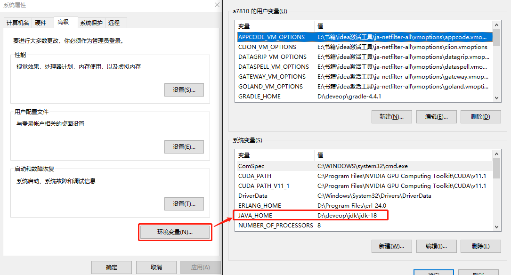
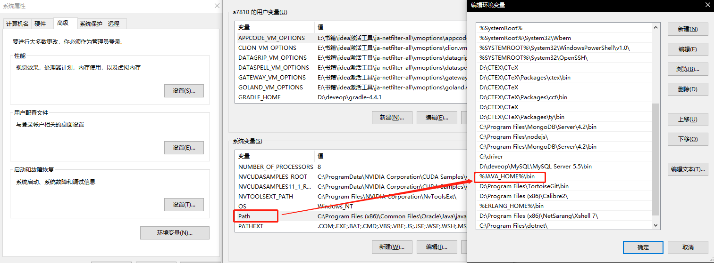

## ✨1. CMD

### 💬1.1 什么是CMD？

​	cmd在windows操作系统中，利用命令行操作计算机的方式。

### 💬1.2 打开CMD的步骤

​	:one: 按win + R

​	:two: 输入cmd

​	:three: 回车

扩展：

​	cmd的默认操作路径：	C：\users\电脑的名称

### 💬1.3 CMD的常见命令

* 切换盘符

  ```cmd
  盘符名称加冒号
  ```

* 查看文件夹下的内容

  ```cmd
  dir
  ```

* 单级进入文件夹

  ```cmd
  cd 文件夹
  ```

* 单级回退

  ```cmd
  cd..
  ```

* 多级进入文件夹

  ```cmd
  cd 文件夹名称1\文件夹名称2....
  ```

* 多级回退

  ```cmd
  cd\
  ```

* 清屏

  ```cmd
  cls
  ```

* 退出cmd

  ```cmd
  exit
  ```

案例：

​	利用cmd命令打开电脑上的QQ

步骤：

​	1，打开CMD窗口

​	2，要先进入到QQ的安装目录

​	3，QQ的启动程序，是在bin文件夹下的。所以要进入bin

​	4，输入qq.exe就可以启动了。

扩展：

​	如果文件夹或者文件的名字过长，不想打全了，可以用tab关联出来了。

​	如果有名字类似的，多按几次tab即可。

### 💬1.4 环境变量

#### 💬1.4.1 为什么配置环境变量

​	如果我们想要在CMD的任意路径下都可以打开任意的软件，那么就需要把软件的路径配置到环境变量当中。

#### 💬1.4.2 查找顺序

​	首先，会在当前路径下找，有没有QQ，如果没有，就会到环境变量中找，找到了就直接打开了。

​	可以把你想要隐藏的很多东西，全都放在一个很深的目录中。

​	以后想要自己一个人欣赏的时候，就用CMD直接打开就可以了。

## ✨2. Java入门

### 💬2.1 JDK的下载和安装

**下载步骤**

* 找到官方网站：

  	www.oracle.com

* 针对于不同的操作系统，要下载不同的版本。

**安装：**

​	傻瓜式安装，直接点击下一步即可。

​    安装成功之后，我们要知道一个文件夹：bin

​	里面存放了跟开发相关的各种工具和命令：javac、java

**安装建议：**

​	1，安装路径不要有中文，不要有空格，不要有特殊字符。

​	2，把所有跟开发相关的软件都放在同一个文件夹当中，方便管理。

细节1：

​	在安装JDK的时候，java，javac，javaw，jshell这四个工具放在了C盘的一个路径中。然后把这个路径配置到了环境变量中，所以我们在其他目录中才能使用java和javac命令。

细节2：

​	现在从oracle官网上下载的最新安装包才会有这个特性，如果你电脑上是以前的安装包，是不会帮我们自动配置环境变量的。

### 💬2.2 手动配置环境变量

1. 如果是最新版的jdk，在安装的时候就会给我们配置环境变量，如果没有配置环境变量，可以通过如下的方式

2. 配置JAVA_HOME

   ​	变量名：JAVA_HOME

   ​	值：JDK的安装路径。

3. 配置Path

   ​	%JAVA_HOME%\bin

**扩展1：**

​	%：表示引用的意思，引用了JAVA_HOME里面的值，跟后面的bin进行了拼接。

**扩展2：**

​	JAVA_HOME配置的目的是为了给以后其他软件服务的。

如下图所示:





## ✨3. 第一个程序HelloWorld

### 💬3.1 书写步骤

1. 新建一个文本文件。把文件名修改为：HelloWorld.java

​       细节：该文件后缀名为java，我们也称之为java文件。

2. 编写代码（固定格式）

```java
public class HelloWorld{
	public static void main(String[] args){
		System.out.println("HelloWorld");
	}
}
```

3. 保存

4. 编译文件

   	利用cmd，先进入到java文件所在的目录。再用javac命令去编译。

   格式：javac HelloWorld.java
   	此时，会产生一个class文件（字节码文件）。

5. 运行代码

   	运行编译之后的文件。

   格式：java HelloWorld

## ✨4. Notepad++

### 💬4.1 为什么用Notepad++

​	有行号，在Java中的一些特殊单词会有高亮显示(不过后面也不会用到Notepad++编写java，一般都是直接用开发工具例如IDEA等进行开发)。

### 💬4.2 下载和安装

#### 💬4.2.1 下载：

相关软件安装链接：[链接](https://pan.baidu.com/s/1bXCZR0yxN2-v6NqDpe4H1g?pwd=1111 ) （在效率文件夹下，文件名为npp）

#### 💬4.2.2 安装：

​	傻瓜式安装，直接点击下一步。

**建议：**

​	把跟开发相关的软件，都放在一起。

​        路径不要有中文，不要有空格，不要有特殊符号

**设置：**

​	点击首选项

​	左边选择：新建

​	中间选择：Java

​	右边选择：ANSI

## ✨5. Java语言的扩展知识

### 💬5.1 Java语言的发展

JDK5：第一个大版本号更新

JDK8：企业中最常用的版本

JDK17：课程中学习的最新版本

特点：兼容性。

​	用8编写的代码，用17可以运行

​	用17编写的代码，用8不一定能运行。

​		如果代码中有新的特性，那么8不能运行。

​		如果代码中没有新的特性，那么8可以运行。

长期支持版本：理解为正式版

​			8，11，17

过渡版本：临时版本

### 💬5.2 Java的三大平台分类

JavaSE：

​	可以用于桌面应用开发。

​	目的：为了后面学习JavaEE打基础。

JavaME：

​	用于嵌入式设备和小型移动设备开发。

JavaEE：

​	企业级的服务器开发。

​	在这个领域Java是当之无愧的No1

### 💬5.3 Java的跨平台

虚拟机：

​	就可以理解为是一台虚拟的电脑。

我们自己编写的Java代码，是运行在虚拟机（JVM）中的。

我们自己编写的代码，不是运行在系统里面的。

针对于不同的操作系统，其虚拟机是不一样的。

### 💬5.4 JDK JRE和JVM

JVM：虚拟机，是代码真正运行的地方。

JRE：包含了JVM和核心类库。

JDK：包含了JRE和开发工具。

程序员：JDK

使用者：JRE

## ✨6. Java基础语法

### 💬6.1 注释

​	注释就是给程序的解释说明。

#### 💬6.1.1 注释的分类

​	单行注释    // 注释的内容

​	多行注释    /* 注释的内容 */	

​	文档注释   /** 注释的内容 */	

#### 💬6.1.2注释的注意事项

1. 注释对程序的运行是没有任何影响的。

       简单理解：注释是不参与程序的运行的。	

2. 注释的嵌套问题

​    不管是单行还是多行，在书写的时候都不要嵌套。

扩展：

​	因为注释是对程序的解释说明，是给程序员看的。对程序的执行没有任何影响。

​	所以，代码在编译之后，class文件里面是没有注释信息的，做了一个注释擦除。

### 💬6.2 关键字

​	关键字就是被Java赋予了特定含义的英文单词。

​	当我们在代码中，写了对应的单词之后，那么程序在执行时，就知道要做什么事情了。

#### 💬6.2.1 关键字的特点

- 全部都是小写
- 在常用的代码编辑器中，关键字都有高亮的颜色显示。

#### 💬6.2.2 class和public

##### 💬class关键字

​	表示新建一个类。

​	class后面跟随的是这个类的名字，简称：类名。

​	类名后面跟随一对大括号，表示类的范围。

代码示例：

```java
//表示新建了一个类
//类名：Demo
//类的范围：Demo后面的这对大括号决定。
public class Demo{
    
}
```

##### 💬public关键字

​	当public写在class前面的时候，**注意:** 文件名和类名一定要保持一致，如下图所示:


​	如果没有一致，代码就会报错。

建议：

​	习惯：一个Java文件中，只写一个Java类。

​	这个是public关键字的第一个作用，第二个作用我们会在面向对象的时候继续学习。

### 💬6.3 常量

​	在程序执行的过程中，像 1、2、、'a',"abc"这些量，称为常量。

#### 💬6.3.1 分类：

* 整数类型

* 小数类型

* 字符串类型

* 字符类型

* 布尔类型

* 空类型

##### 💬整数类型：

​		不带小数点的都是整数类型的字面量

##### 💬小数类型：

​		只要带了小数点都是小数类型的字面量

​	举例：

​		123：不带小数点，整数类型

​		1.1 ：带小数点，小数类型

​		0：不带小数点，整数类型

​		10.0：带小数点：小数类型

##### 💬字符串类型：

​		只要用双引号引起来的，不管里面的内容是什么，不管里面的内容有没有，都是字符串类型的。

##### 💬字符类型：

​		一，需要用单引号引起来。二，里面有且只能有一个。

​	举例：

​		"abc"：用双引号引起来了，字符串类型

​		'a'：用单引号引起来了，内容一个，字符类型

​		" "（里面是一个空格）：用双引号引起来了，字符串类型

​		""（里面连空格都没有）：用双引号引起来了，字符串类型

​		“，”（里面是逗号）：用双引号引起来了，字符串类型

​		“123”：用双引号引起来了，字符串类型	

​		'abc'：语法错误。因为字符里面只能有一个。

##### 💬布尔类型：

​		只有两个值。true，false

​		true：真。false：假。

​		以后在实际开发中，我们会根据真假结果来执行不同的代码。

​		比如：用户登录。如果用户的用户名和密码输入正确了，那么比较结果就是true，此时会让用户登录成功。如果用户的用户名和密码输入错误了，那么比较结果就是false，此时会让用户继续输入。

##### 💬空类型：

​		只有一个值：null

​		在后面的面向对象和数组的时候会再次学习。

##### 💬代码练习：

​	输出Java中的6种字面量

```java
public class HelloWorld{
	public static void main(String[] args){
		System.out.println(17);
		System.out.println(2.18);
		System.out.println("你好");
		System.out.println('男');
		System.out.println(true);
		System.out.println(false);
        //null简单理解：就表示什么东西都不存在。
        //不能直接输出使用的。
		System.out.println(null);
	}
}
```

### 💬6.4 变量

#### 💬概念：

​	在程序的执行过程中，其值有可能发生改变的数据，就是变量

#### 💬在实际开发中的使用场景：

​	突出了变量的变字。

场景一：

​	用户登录的时候，每一个用户的用户名和密码都有可能是不一样的。

​	在程序中，我们就可以定义两个变量，一个存储用户名，一个存储密码。

场景二：

​	微信余额

​	微信的余额，也是经常发生改变的。

​	我们可以定义一个变量，用来记录微信的余额。当余额发生改变的时候，就修改变量记录的值。

场景三：

​	银行卡余额

核心点：

​	经常发生变化的。

#### 💬格式：

​	数据类型 变量名 = 数据值；

​	数据类型：用于限定存储数据的类型。

​			   如果是整数类型，那么表示该变量只能存整数

​	变量名：就是给小空间起的一个名字。

​			方便以后使用。

​	数据值：存在小空间里面的数据。

​	分号：表示语句的结束。

#### 💬整体理解：

​	我们可以把变量理解为一个临时存储数据的小空间（小箱子）。

​	变量名，就是这个小空间的名字。

​	数据类型，限定了以后什么数据能存到这个小空间中。

​	数据值：真实存在小空间中的数据。

#### 💬代码示例：

```java
//1.定义一个变量，用来记录整数
int a = 123;
//2.定义一个变量，用来记录小数（浮点数）
double b = 11.1;
```

### 💬6.5 变量的使用

#### 💬使用方式一：直接打印

代码示例：

```java
//定义一个变量记录10
int a = 10;
//打印的是变量a里面记录的值
System.out.println(a);//10
```

扩展的对比：

```java
//此时小括号中，打印的是字符串a
System.out.println("a");//a 
```

​	如何如果输出HelloWorld的时候，没有加双引号会报错。

​	原因：此时打印的不是字符串HelloWorld，而是变量HelloWorld里面的值，在代码中，我们没有定义一个叫做HelloWorld的变量，所以报错。

```java
System.out.println(HelloWorld); 
```

#### 💬使用方式二：参与计算

代码示例1：

```java
int a = 10;
int b = 20;
//把变量a和变量b里面的值相加，再把结果打印出来
System.out.println(a + b); 
```

代码示例2：

```java
int a = 10;
int b = 20;
//把变量a和变量b里面的值相加，再把结果赋值给左边的变量c
int c = a + b;
//把变量c里面的值进行打印。
System.out.println(c); 
```

#### 💬使用方式三：修改变量的值

​	核心：变量只能记录一个值，修改之后，原来的值就会被覆盖

代码示例：

```java
//定义一个新的变量，变量里面记录为10
int a = 10;
//此时变量a还没有被修改，所以打印的是最初的值10
System.out.println(a); //10
//修改已有的变量a，把里面的值修改为20.原来的值就被覆盖了
a = 20;
//此时变量里面记录的值已经被修改，打印修改之后的值20
System.out.println(a); //20
```

### 💬6.6 变量的注意事项

1. 变量里面只能记录一个值。

   当修改了变量里面的值时，原来的值就会被覆盖。

2. 变量名不允许重复

   代码示例：

   ```java
   int a = 10;
   int a = 20;
   System.out.println(a); //变量名重复了，所以报错
   ```

3. 一条语句可以定义多个变量（了解）

   建议：

   ​	以后在定义变量的时候，一行定义一个。

   ​	如果要定义多个变量，写在多行。

   代码示例：

   ```java
   //表示在一行定义了4个变量，都是int类型的，以后能存整数
   //但是这种写法，不方便阅读。
   int a = 10,b = 20,c = 30,d = 40;
   System.out.println(a);
   System.out.println(b);
   System.out.println(c);
   System.out.println(d);
   ```

4. 变量在使用之前一定要赋值

   代码示例：

   ```java
   int a = 10;
   //以等号为中间界，分为两部分。
   //第一部分：等号的左边，定义变量
   	int a
   //第二部分：等号的右边，给左边的变量赋值
   	= 10；
   ```

   代码示例：

   ```java
   // 只定义不赋值
   int a ;
   //修改值
   a = 10;
   //打印a
   System.out.println(a);
   ```

   建议：

   ​	虽然变量的定义和赋值可以分开写。但是不建议。

   ​	建议，以后写代码的时候，定义变量直接给值。

### 💬6.7 变量的案例

根据情况计算车上乘客的数量

代码示例：

```java
public class Test5{
	public static void main(String[] args){
		//一开始车上没人
		int count = 0;
		//到了第一站：上来一个人，没有人下去
		//先拿着count为0跟1进行相加
		//再把最终的结果赋值给count
		count = count + 1;	
		//到了第二站：上来两个人，下去一个人
		count = count + 2;
		count = count - 1;		
		//到了第三站：上来两个人，下去一个人
		count = count + 2;
		count = count - 1;		
		//到了第四站：下去一个人
		count = count - 1;
		//到了第五站：上来一个人
		count = count + 1;
		//到了终点站，count的值就是车上的乘客数量
		System.out.println(count);
	}
}
```
