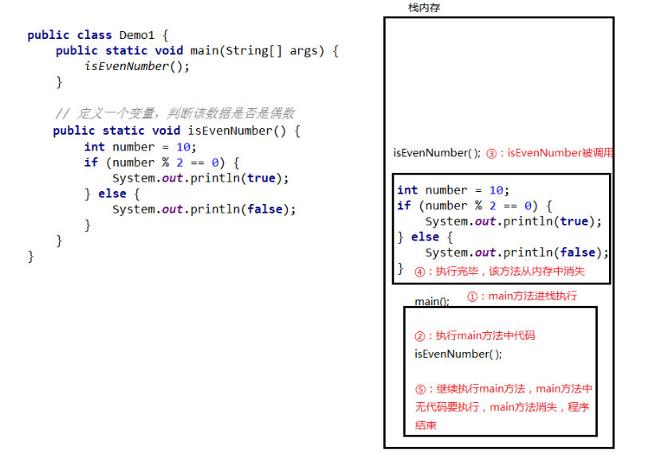
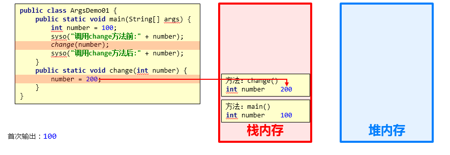
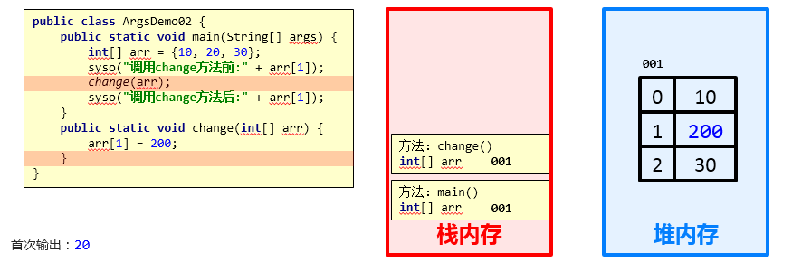

> <strong>本专栏将从基础开始，循序渐进，由浅入深讲解Java的基本使用，希望大家都能够从中有所收获，也请大家多多支持。</strong>
> <strong>专栏地址:[22天掌握Java编程](https://blog.csdn.net/learning_xzj/category_11806176.html) </strong>
> <strong>相关软件地址:[链接地址](https://pan.baidu.com/s/1bXCZR0yxN2-v6NqDpe4H1g?pwd=1111) </strong>
> <strong>所有代码地址:[链接地址](https://gitee.com/codinginn/java-code) </strong>
> <strong> 如果文章知识点有错误的地方，请指正！大家一起学习，一起进步。</strong>
> <font color="red"><strong> 如果感觉博主的文章还不错的话，还请关注、点赞、收藏三连支持一下博主哦</strong></font>

@[toc]


## 1. 方法概述

### 1.1 方法的概念

> ​	方法（method）是将具有独立功能的代码块组织成为一个整体，使其具有特殊功能的代码集
>
> * <font color="red">注意：</font>
>   * <font color = "red">方法必须先创建才可以使用，该过程成为方法定义</font>
>   * <font color="red">方法创建后并不是直接可以运行的，需要手动使用后，才执行，该过程成为方法调用</font>
>

## 2. 方法的定义和调用

### 2.1 无参数方法定义和调用

* 定义格式：

  ```java
  public static void 方法名 (   ) {
  	// 方法体;
  }
  ```

* 范例：

  ```java
  public static void method (    ) {
  	// 方法体;
  }
  ```

* 调用格式：

  ```java
  方法名();
  ```

* 范例：

  ```java
  method();
  ```

* 注意：

  ​	方法必须先定义，后调用，否则程序将报错

### 2.2 方法调用过程图解

> 
>
> * 总结：每个方法在被调用执行的时候，都会进入栈内存，并且拥有自己独立的内存空间，方法内部代码调用完毕之后，会从栈内存中弹栈消失。
>

### 2.3 无参数方法的练习

> * 需求：设计一个方法用于打印两个数中的较大数 
> * 思路：
>   * ①定义一个方法，用于打印两个数字中的较大数，例如getMax() 
>   * ②方法中定义两个变量，用于保存两个数字 
>   * ③使用分支语句分两种情况对两个数字的大小关系进行处理 
>   * ④在main()方法中调用定义好的方法
>

* 代码：

```java
public class MethodTest {
    public static void main(String[] args) {
        //在main()方法中调用定义好的方法
        getMax();
    }

    //定义一个方法，用于打印两个数字中的较大数，例如getMax()
    public static void getMax() {
        //方法中定义两个变量，用于保存两个数字
        int a = 10;
        int b = 20;

        //使用分支语句分两种情况对两个数字的大小关系进行处理
        if(a > b) {
            System.out.println(a);
        } else {
            System.out.println(b);
        }
    }
}
```

## 3. 带参数方法定义和调用

### 3.1 带参数方法定义和调用

* 定义格式：

  参数：由数据类型和变量名组成 -  数据类型 变量名

  参数范例：int a

  ```java
  public static void 方法名 (参数1) {
  	方法体;
  }
  
  public static void 方法名 (参数1, 参数2, 参数3...) {
  	方法体;
  }
  ```

* 范例：

  ```java
  public static void isEvenNumber(int number){
      ...
  }
  public static void getMax(int num1, int num2){
      ...
  }
  ```

  * 注意：

    	方法定义时，参数中的数据类型与变量名都不能缺少，缺少任意一个程序将报错
    	
    	方法定义时，多个参数之间使用逗号( ，)分隔

* 调用格式：

  ```java
  方法名(参数)；
  
  方法名(参数1,参数2);
  ```

* 范例：

  ```java
  isEvenNumber(10);
  
  getMax(10,20);
  ```

  * 方法调用时，参数的数量与类型必须与方法定义中的设置相匹配，否则程序将报错 

### 3.2 形参和实参

> 1. 形参：方法定义中的参数
>
> ​          等同于变量定义格式，例如：int number
>
> 2. 实参：方法调用中的参数
>
> ​          等同于使用变量或常量，例如： 10  number
>

### 3.3 带参数方法练习

> * 需求：设计一个方法用于打印两个数中的较大数，数据来自于方法参数 }
> * 思路：
>   * ①定义一个方法，用于打印两个数字中的较大数，例如getMax() 
>   * ②为方法定义两个参数，用于接收两个数字 
>   * ③使用分支语句分两种情况对两个数字的大小关系进行处理 
>   * ④在main()方法中调用定义好的方法（使用常量）
>   * ⑤在main()方法中调用定义好的方法（使用变量） 
>

* 代码：

```java
public class MethodTest {
    public static void main(String[] args) {
        //在main()方法中调用定义好的方法（使用常量）
        getMax(10,20);
        //调用方法的时候，人家要几个，你就给几个，人家要什么类型的，你就给什么类型的
        //getMax(30);
        //getMax(10.0,20.0);

        //在main()方法中调用定义好的方法（使用变量）
        int a = 10;
        int b = 20;
        getMax(a, b);
    }

    //定义一个方法，用于打印两个数字中的较大数，例如getMax()
    //为方法定义两个参数，用于接收两个数字
    public static void getMax(int a, int b) {
        //使用分支语句分两种情况对两个数字的大小关系进行处理
        if(a > b) {
            System.out.println(a);
        } else {
            System.out.println(b);
        }
    }
}
```

## 4. 带返回值方法的定义和调用

### 4.1 带返回值方法定义和调用

* 定义格式

  ```java
  public static 数据类型 方法名 ( 参数 ) { 
  	return 数据 ;
  }
  ```

* 范例

  ```java
  public static boolean isEvenNumber( int number ) {           
  	return true ;
  }
  public static int getMax( int a, int b ) {
  	return  100 ;
  }
  ```

  * 注意：
    * 方法定义时return后面的返回值与方法定义上的数据类型要匹配，否则程序将报错

* 调用格式

  ```java
  方法名 ( 参数 ) ;
  数据类型 变量名 = 方法名 ( 参数 ) ;
  ```

* 范例

  ```java
  isEvenNumber ( 5 ) ;
  boolean  flag =  isEvenNumber ( 5 ); 
  ```

  * 注意：
    * 方法的返回值通常会使用变量接收，否则该返回值将无意义

### 4.2 带返回值方法练习1

> * 需求：设计一个方法可以获取两个数的较大值，数据来自于参数
>
> * 思路：
>
>   * ①定义一个方法，用于获取两个数字中的较大数 
>   * ②使用分支语句分两种情况对两个数字的大小关系进行处理 
>   * ③根据题设分别设置两种情况下对应的返回结果 
>   * ④在main()方法中调用定义好的方法并使用变量保存 
>   * ⑤在main()方法中调用定义好的方法并直接打印结果 
>
>

* 代码：

  ```java
  public class MethodTest {
      public static void main(String[] args) {
          //在main()方法中调用定义好的方法并使用变量保存
          int result = getMax(10,20);
          System.out.println(result);
  
          //在main()方法中调用定义好的方法并直接打印结果
          System.out.println(getMax(10,20));
      }
  
      //定义一个方法，用于获取两个数字中的较大数
      public static int getMax(int a, int b) {
          //使用分支语句分两种情况对两个数字的大小关系进行处理
          //根据题设分别设置两种情况下对应的返回结果
          if(a > b) {
              return a;
          } else {
              return b;
          }
      }
  }
  ```

### 4.3 带返回值方法练习2

> 需求：
>
> ​	定义一个方法，求一家商场每个季度的营业额。根据方法结果再计算出全年营业额。
>

代码示例：

```java
package com.itheima.demo;

public class MethodDemo9 {
    public static void main(String[] args) {
        /*需求：定义一个方法，求一家商场每个季度的营业额。
        根据方法结果再计算出全年营业额。*/
        int sum1 = getSum(10, 20, 30);
        int sum2 = getSum(10, 20, 30);
        int sum3 = getSum(10, 20, 30);
        int sum4 = getSum(10, 20, 30);

        int sum = sum1 + sum2 + sum3 + sum4;
        System.out.println(sum);

    }

    //心得：
    //1.我要干嘛？  决定了方法体   每个季度的营业额
    //2.我干这件事情，需要什么才能完成？ 决定了形参 需要三个月的营业额 a b c
    //3.我干完这件事情，看调用处是否需要使用方法的结果。   决定了返回值
    //如果需要使用，那么必须返回
    //如果不需要使用，可以返回也可以不返回
    public static int getSum(int month1,int month2,int month3){
        int sum = month1 + month2 + month3;
        //因为方法的调用处，需要继续使用这个结果
        //所以我们必须要把sum返回
        return sum;
    }
}

```

### 4.4 带返回值方法练习3

> 需求：
>
> ​	键盘录入两个圆的半径（整数），比较两个圆的面积。
>

代码示例：

```java
import java.util.Scanner;

public class MethodDemo10 {
    public static void main(String[] args) {
        //需求：键盘录入两个圆的半径（整数），比较两个圆的面积。
        //键盘录入圆的半径
        Scanner sc = new Scanner(System.in);
        System.out.println("请输入圆的半径");
        int radii1 = sc.nextInt();

        System.out.println("请输入第二个圆的半径");
        int radii2 = sc.nextInt();
        double area1 = getArea(radii1);
        double area2 = getArea(radii2);
        if(area1 > area2){
            System.out.println("第一个圆更大");
        }else{
            System.out.println("第二个圆更大");
        }
    }

    //心得：
    //1.我要干嘛？   求圆的面积
    //2.我干这件事情，需要什么才能完成？        半径
    //3.方法的调用处，是否需要继续使用方法的结果    要比较
    public static double getArea(int radii) {
        double area = 3.14 * radii * radii;
        return area;
    }
}
```

## 5. 方法的注意事项

### 5.1 方法的注意事项

* 方法不能嵌套定义

  * 示例代码：

    ```java
    public class MethodDemo {
        public static void main(String[] args) {
    
        }
    
        public static void methodOne() {
    		public static void methodTwo() {
           		// 这里会引发编译错误!!!
        	}
        }
    }
    ```

* void表示无返回值，可以省略return，也可以单独的书写return，后面不加数据

  * 示例代码：

    ```java
    public class MethodDemo {
        public static void main(String[] args) {
    
        }
        public static void methodTwo() {
            //return 100; 编译错误，因为没有具体返回值类型
            return;	
            //System.out.println(100); return语句后面不能跟数据或代码
        }
    }
    ```

### 5.2 方法的通用格式

* 格式：

  ```java
  public static 返回值类型 方法名(参数) {
     方法体; 
     return 数据 ;
  }
  ```

> * 解释：
>
>   * public static 	修饰符，目前先记住这个格式
>
>     返回值类型	方法操作完毕之后返回的数据的数据类型
>
>     ​			如果方法操作完毕，没有数据返回，这里写void，而且方法体中一般不写return
>
>      方法名		调用方法时候使用的标识
>
>      参数		由数据类型和变量名组成，多个参数之间用逗号隔开
>
>      方法体		完成功能的代码块
>
>      return		如果方法操作完毕，有数据返回，用于把数据返回给调用者
>
> * 定义方法时，要做到两个明确
>
>   * 明确返回值类型：主要是明确方法操作完毕之后是否有数据返回，如果没有，写void；如果有，写对应的数据类型
>   * 明确参数：主要是明确参数的类型和数量
>
> * 调用方法时的注意：
>
>   * void类型的方法，直接调用即可
>   * 非void类型的方法，推荐用变量接收调用
>

## 6. 方法重载

### 6.1 方法重载

> * 方法重载概念
>
>   方法重载指同一个类中定义的多个方法之间的关系，满足下列条件的多个方法相互构成重载
>
>   * 多个方法在同一个类中
>   * 多个方法具有相同的方法名
>   * 多个方法的参数不相同，类型不同或者数量不同
>
> * 注意：
>
>   * 重载仅对应方法的定义，与方法的调用无关，调用方式参照标准格式
>   * 重载仅针对同一个类中方法的名称与参数进行识别，与返回值无关，换句话说不能通过返回值来判定两个方法是否相互构成重载
>
>


* 正确范例：

  ```java
  public class MethodDemo {
  	public static void fn(int a) {
      	//方法体
      }
      public static int fn(double a) {
      	//方法体
      }
  }
  
  public class MethodDemo {
  	public static float fn(int a) {
      	//方法体
      }
      public static int fn(int a , int b) {
      	//方法体
      }
  }
  ```

* 错误范例：

  ```java
  public class MethodDemo {
  	public static void fn(int a) {
      	//方法体
      }
      public static int fn(int a) { 	/*错误原因：重载与返回值无关*/
      	//方法体
      }
  }
  
  public class MethodDemo01 {
      public static void fn(int a) {
          //方法体
      }
  } 
  public class MethodDemo02 {
      public static int fn(double a) { /*错误原因：这是两个类的两个fn方法*/
          //方法体
      }
  }
  ```

### 6.2 方法重载练习

> * 需求：使用方法重载的思想，设计比较两个整数是否相同的方法，兼容全整数类型（byte,short,int,long） 
>
> * 思路：
>
>   * ①定义比较两个数字的是否相同的方法compare()方法，参数选择两个int型参数
>   * ②定义对应的重载方法，变更对应的参数类型，参数变更为两个long型参数
>   * ③定义所有的重载方法，两个byte类型与两个short类型参数 
>   * ④完成方法的调用，测试运行结果 
>
>


* 代码：

  ```java
  public class MethodTest {
      public static void main(String[] args) {
          //调用方法
          System.out.println(compare(10, 20));
          System.out.println(compare((byte) 10, (byte) 20));
          System.out.println(compare((short) 10, (short) 20));
          System.out.println(compare(10L, 20L));
      }
  
      //int
      public static boolean compare(int a, int b) {
          System.out.println("int");
          return a == b;
      }
  
      //byte
      public static boolean compare(byte a, byte b) {
          System.out.println("byte");
          return a == b;
      }
  
      //short
      public static boolean compare(short a, short b) {
          System.out.println("short");
          return a == b;
      }
  
      //long
      public static boolean compare(long a, long b) {
          System.out.println("long");
          return a == b;
      }
  
  }
  ```

## 7. 方法的参数传递

### 7.1 方法参数传递基本类型

* 测试代码：

  ```java
  public class ArgsDemo01 {
      public static void main(String[] args) {
          int number = 100;
          System.out.println("调用change方法前：" + number);
          change(number);
          System.out.println("调用change方法后：" + number);
      }
  
      public static void change(int number) {
          number = 200;
      }
  }
  
  ```


> * 结论：
>
>   * 基本数据类型的参数，形式参数的改变，不影响实际参数 
>
> * 结论依据：
>
>   * 每个方法在栈内存中，都会有独立的栈空间，方法运行结束后就会弹栈消失
>
>     
>

### 7.2 方法参数传递引用类型

* 测试代码：

  ```java
  public class ArgsDemo02 {
      public static void main(String[] args) {
          int[] arr = {10, 20, 30};
          System.out.println("调用change方法前：" + arr[1]);
          change(arr);
          System.out.println("调用change方法后：" + arr[1]);
      }
  
      public static void change(int[] arr) {
          arr[1] = 200;
      }
  }
  
  ```


> * 结论：
>
>   * 对于引用类型的参数，形式参数的改变，影响实际参数的值 
>
> * 结论依据：
>
>   * 引用数据类型的传参，传入的是地址值，内存中会造成两个引用指向同一个内存的效果，所以即使方法弹栈，堆内存中的数据也已经是改变后的结果 
>
>     
>

### 7.3 数组遍历

> * 需求：设计一个方法用于数组遍历，要求遍历的结果是在一行上的。例如：[11, 22, 33, 44, 55] 
>
> * 思路：
>
>   * ①因为要求结果在一行上输出，所以这里需要在学习一个新的输出语句System.out.print(“内容”);
>
>     System.out.println(“内容”); 输出内容并换行
>
>     System.out.print(“内容”); 输出内容不换行
>
>     System.out.println(); 起到换行的作用
>
>   * ②定义一个数组，用静态初始化完成数组元素初始化
>
>   * ③定义一个方法，用数组遍历通用格式对数组进行遍历
>
>   * ④用新的输出语句修改遍历操作
>
>   * ⑤调用遍历方法
>
>


* 代码：

  ```java
  public class Test1 {
      public static void main(String[] args) {
        /*  //先打印数据，再进行换行
          System.out.println("aaa");
          //只打印不换行
          System.out.print("bbb");
          System.out.print("ddd");
          //不打印任何内容，只换行
          System.out.println();
          System.out.print("cc");*/
          //设计一个方法用于数组遍历，要求遍历的结果是在一行上的。例如：[11, 22, 33, 44, 55]
          int[] arr = {1,2,3,4,5};
          printArr(arr);
      }
      //1.我要遍历数组
      //2.需要什么？  数组
      //3.调用处是否需要使用方法的结果。
      public static void printArr(int[] arr){
          System.out.print("[");
          for (int i = 0; i < arr.length; i++) {
              if(i == arr.length - 1){
                  System.out.println(arr[i] + "]");
              }else{
                  System.out.print(arr[i] + ", ");
              }
          }
      }
  }
  ```

### 7.4 数组最大值

> * 需求：设计一个方法用于获取数组中元素的最大值 
>
> * 思路：
>
>   * ①定义一个数组，用静态初始化完成数组元素初始化
>   * ②定义一个方法，用来获取数组中的最大值，最值的认知和讲解我们在数组中已经讲解过了
>   * ③调用获取最大值方法，用变量接收返回结果
>   * ④把结果输出在控制台
>
>


* 代码：

  ```java
  public class MethodTest02 {
      public static void main(String[] args) {
          //定义一个数组，用静态初始化完成数组元素初始化
          int[] arr = {12, 45, 98, 73, 60};
  
          //调用获取最大值方法，用变量接收返回结果
          int number = getMax(arr);
  
          //把结果输出在控制台
          System.out.println("number:" + number);
      }
  
      //定义一个方法，用来获取数组中的最大值
      /*
          两个明确：
              返回值类型：int
              参数：int[] arr
       */
      public static int getMax(int[] arr) {
          int max = arr[0];
  
          for(int x=1; x<arr.length; x++) {
              if(arr[x] > max) {
                  max = arr[x];
              }
          }
          return max;
      }
  }
  ```

### 7.5 判断是否存在

>   需求：
>
>   ​	定义一个方法判断数组中的某一个数是否存在，将结果返回给调用处
>

  代码示例：

  ```java
public class Test3 {
    public static void main(String[] args) {
        //定义一个方法判断数组中的某一个数是否存在，将结果返回给调用处

        int[] arr = {1,2,3,4,5};
        boolean result = contains(arr, 3);
        System.out.println(result);
    }

    //1. 我要干嘛？判断数组中的某一个数是否存在
    //2. 需要什么？数组 数字
    //3. 调用处是否需要继续使用？返回
    //判断number在arr中是否存在
    public static boolean contains(int[] arr, int number) {//1 2 3 4 5    6
        //遍历arr得到每一个元素
        for (int i = 0; i < arr.length; i++) {
            //拿着每一个元素跟number比较
            if(arr[i] == number){
                //如果相等，表示存在
                return true;
            }
        }
        //当循环结束之后，如果还不能返回true，表示数组中所有数据都不相等
        //可以返回false
        return false;
    }
}

  ```

### 7.6 获取索引

> 需求：
>
> ​	定义一个方法获取数字，在数组中的索引位置，将结果返回给调用处，如果有重复的，只要获取第一个即可。
>

代码示例：

```java
package com.itheima.demo;

public class Test4 {
    public static void main(String[] args) {
        //定义一个方法获取数字，在数组中的索引位置，将结果返回给调用处
        //如果有重复的，只要获取第一个即可

        int[] arr = {1,2,3,4,5};
        int index = contains(arr, 3);
        System.out.println(index);
    }

    //1. 我要干嘛？判断数组中的某一个数是否存在
    //2. 需要什么？数组 数字
    //3. 调用处是否需要继续使用？返回
    //获取number在arr中的位置
    public static int contains(int[] arr, int number) {
        //遍历arr得到每一个元素
        for (int i = 0; i < arr.length; i++) {
            //拿着每一个元素跟number比较
            if(arr[i] == number){
                //如果相等，表示找到了
                return i;
            }
        }
        //当循环结束之后，如果还不能返回索引，表示数组中不存在该数据
        //可以返回-1
        return -1;
    }
}

```

### 7.7 复制数组

> 需求：
>

 	定义一个方法copyOfRange(int[] arr,int from, int to)

> 功能： 
>
> ​	 将数组arr中从索引from（包含from）开始。
>

 	到索引to结束（不包含to）的元素复制到新数组中，
 	
 	将新数组返回。

代码示例：

```java
package com.itheima.test;

public class Test4 {
    public static void main(String[] args) {
        int[] arr = {1,2,3,4,5,6,7,8,9,10};
        int[] newArr = copyOfRange(arr, 3, 9);// [3索引~ 9索引)

        for (int i = 0; i < newArr.length; i++) {
            System.out.print(newArr[i] + " ");
        }
    }
    //如果方法要返回多个值，那么只能以数组的形式进行返回
    //把arr数组中，从from开始，到to之间的数据进行返回
    //{1,2,3,4,5,6,7,8,9,10}

    //技巧：(伪造索引)
    //在代码中，如果没有一个变量能表示当前的索引
    //就自己新建一个变量表示索引

    public static int[] copyOfRange(int[] arr, int from,int to){
        //1.新建一个新的数组
        int[] newArr = new int[to - from];

        int index = 0;
        //2.获取老数组中，from到to之间所有的元素
        for (int i = from; i < to; i++) {
            //System.out.println(arr[i]);
            //数组名[索引] = 数据值;
            //这是我想要的效果：在赋值的时候从newArr的0索引开始，依次往后赋值
            newArr[index] = arr[i];
            index++;
        }

        //当循环结束之后，表示新数组中已经存满元素了
        return newArr;
    }
}
```

