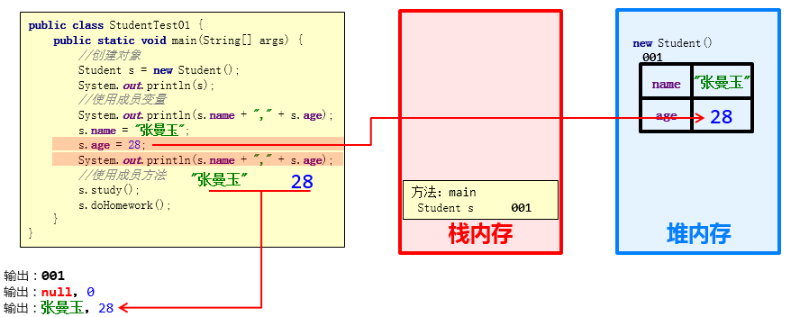
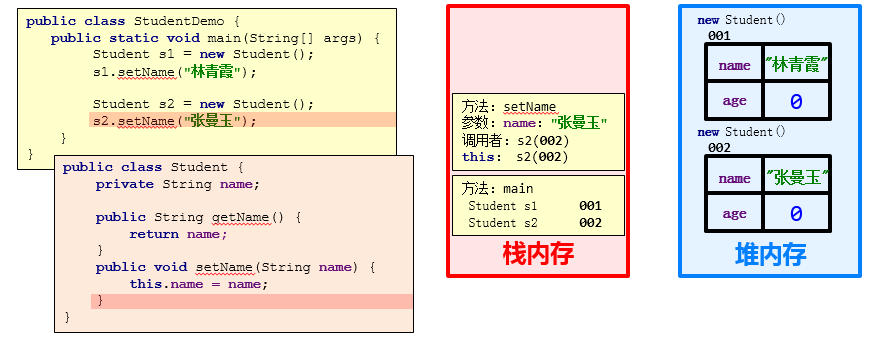
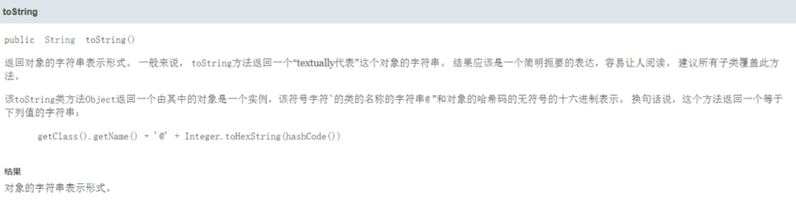

> <strong>本专栏将从基础开始，循序渐进，由浅入深讲解Java的基本使用，希望大家都能够从中有所收获，也请大家多多支持。</strong>
> <strong>专栏地址:[22天掌握Java编程](https://blog.csdn.net/learning_xzj/category_11806176.html) </strong>
> <strong>相关软件地址:[链接地址](https://pan.baidu.com/s/1bXCZR0yxN2-v6NqDpe4H1g?pwd=1111) </strong>
> <strong>所有代码地址:[链接地址](https://gitee.com/codinginn/java-code) </strong>
> <strong> 如果文章知识点有错误的地方，请指正！大家一起学习，一起进步。</strong>
> <font color="red"><strong> 如果感觉博主的文章还不错的话，还请关注、点赞、收藏三连支持一下博主哦</strong></font>

@[toc]


## 1. 类和对象

### 1.1 类和对象的理解

> 客观存在的事物皆为对象 ，所以我们也常常说万物皆对象。
>
> * 类
>   * 类的理解
>     * 类是对现实生活中一类具有共同属性和行为的事物的抽象
>     * 类是对象的数据类型，类是具有相同属性和行为的一组对象的集合
>     * 简单理解：类就是对现实事物的一种描述
>   * 类的组成
>     * 属性：指事物的特征，例如：手机事物（品牌，价格，尺寸）
>     * 行为：指事物能执行的操作，例如：手机事物（打电话，发短信）
> * 类和对象的关系
>   * 类：类是对现实生活中一类具有共同属性和行为的事物的抽象
>   * 对象：是能够看得到摸的着的真实存在的实体
>   * 简单理解：**类是对事物的一种描述，对象则为具体存在的事物**
>

### 1.2 类的定义

> 类的组成是由属性和行为两部分组成
>
> * 属性：在类中通过成员变量来体现（类中方法外的变量）
> * 行为：在类中通过成员方法来体现（和前面的方法相比去掉static关键字即可）
>
> 类的定义步骤：
>
> ①定义类
>
> ②编写类的成员变量
>
> ③编写类的成员方法
>

```java
public class 类名 {
	// 成员变量
	变量1的数据类型 变量1；
	变量2的数据类型 变量2;
	…
	// 成员方法
	方法1;
	方法2;	
}
```

示例代码：

```java
/*
    手机类：
        类名：
        手机(Phone)

        成员变量：
        品牌(brand)
        价格(price)

        成员方法：
        打电话(call)
        发短信(sendMessage)
 */
public class Phone {
    //成员变量
    String brand;
    int price;

    //成员方法
    public void call() {
        System.out.println("打电话");
    }

    public void sendMessage() {
        System.out.println("发短信");
    }
}

```

### 1.3 对象的使用

> * 创建对象的格式：
>   * 类名 对象名 = new 类名();
> * 调用成员的格式：
>   * 对象名.成员变量
>   * 对象名.成员方法();
>


* 示例代码

```java
/*
    创建对象
        格式：类名 对象名 = new 类名();
        范例：Phone p = new Phone();

    使用对象
        1：使用成员变量
            格式：对象名.变量名
            范例：p.brand
        2：使用成员方法
            格式：对象名.方法名()
            范例：p.call()
 */
public class PhoneDemo {
    public static void main(String[] args) {
        //创建对象
        Phone p = new Phone();

        //使用成员变量
        System.out.println(p.brand);
        System.out.println(p.price);

        p.brand = "小米";
        p.price = 2999;

        System.out.println(p.brand);
        System.out.println(p.price);

        //使用成员方法
        p.call();
        p.sendMessage();
    }
}
```

### 1.4 学生对象-练习

> * 需求：首先定义一个学生类，然后定义一个学生测试类，在学生测试类中通过对象完成成员变量和成员方法的使用
> * 分析：
>   * 成员变量：姓名，年龄…
>   * 成员方法：学习，做作业…
>


* 示例代码：

```java
class Student {
    //成员变量
    String name;
    int age;

    //成员方法
    public void study() {
        System.out.println("好好学习，天天向上");
    }

    public void doHomework() {
        System.out.println("键盘敲烂，月薪过万");
    }
}
/*
    学生测试类
 */
public class StudentDemo {
    public static void main(String[] args) {
        //创建对象
        Student s = new Student();

        //使用对象
        System.out.println(s.name + "," + s.age);

        s.name = "林青霞";
        s.age = 30;

        System.out.println(s.name + "," + s.age);

        s.study();
        s.doHomework();
    }
}
```

## 2. 对象内存图

### 2.1 单个对象内存图

> * 成员变量使用过程
>
> 
>
> * 成员方法调用过程
>
> 
>

### 2.2 多个对象内存图

> * 成员变量使用过程
>
> 
>
> * 成员方法调用过程
>
> 
>
> * 总结：
>
>   多个对象在堆内存中，都有不同的内存划分，成员变量存储在各自的内存区域中，成员方法多个对象共用的一份
>

### 2.3 多个对象指向相同内存图

> 
>
> * 总结
>
>   当多个对象的引用指向同一个内存空间（变量所记录的地址值是一样的）
>
>   只要有任何一个对象修改了内存中的数据，随后，无论使用哪一个对象进行数据获取，都是修改后的数据。
>

## 3. 成员变量和局部变量

### 3.1 成员变量和局部变量的区别

> * 类中位置不同：成员变量（类中方法外）局部变量（方法内部或方法声明上）
> * 内存中位置不同：成员变量（堆内存）局部变量（栈内存）
> * 生命周期不同：成员变量（随着对象的存在而存在，随着对象的消失而消失）局部变量（随着方法的调用而存在，醉着方法的调用完毕而消失）
> * 初始化值不同：成员变量（有默认初始化值）局部变量（没有默认初始化值，必须先定义，赋值才能使用）
>

## 4. 封装

### 4.1 private关键字

> private是一个修饰符，可以用来修饰成员（成员变量，成员方法）
>
> * 被private修饰的成员，只能在本类进行访问，针对private修饰的成员变量，如果需要被其他类使用，提供相应的操作
>   * 提供“get变量名()”方法，用于获取成员变量的值，方法用public修饰
>   * 提供“set变量名(参数)”方法，用于设置成员变量的值，方法用public修饰
>
>


* 示例代码：

  ```java
  /*
      学生类
   */
  class Student {
      //成员变量
      String name;
      private int age;
  
      //提供get/set方法
      public void setAge(int a) {
          if(a<0 || a>120) {
              System.out.println("你给的年龄有误");
          } else {
              age = a;
          }
      }
  
      public int getAge() {
          return age;
      }
  
      //成员方法
      public void show() {
          System.out.println(name + "," + age);
      }
  }
  /*
      学生测试类
   */
  public class StudentDemo {
      public static void main(String[] args) {
          //创建对象
          Student s = new Student();
          //给成员变量赋值
          s.name = "林青霞";
          s.setAge(30);
          //调用show方法
          s.show();
      }
  }
  ```

### 4.2 private的使用

* > 需求：定义标准的学生类，要求name和age使用private修饰，并提供set和get方法以及便于显示数据的show方法，测试类中创建对象并使用，最终控制台输出  林青霞，30 


* 示例代码：

  ```java
  /*
      学生类
   */
  class Student {
      //成员变量
      private String name;
      private int age;
  
      //get/set方法
      public void setName(String n) {
          name = n;
      }
  
      public String getName() {
          return name;
      }
  
      public void setAge(int a) {
          age = a;
      }
  
      public int getAge() {
          return age;
      }
  
      public void show() {
          System.out.println(name + "," + age);
      }
  }
  /*
      学生测试类
   */
  public class StudentDemo {
      public static void main(String[] args) {
          //创建对象
          Student s = new Student();
  
          //使用set方法给成员变量赋值
          s.setName("林青霞");
          s.setAge(30);
  
          s.show();
  
          //使用get方法获取成员变量的值
          System.out.println(s.getName() + "---" + s.getAge());
          System.out.println(s.getName() + "," + s.getAge());
  
      }
  }
  ```

### 4.3 this关键字

* > this修饰的变量用于指代成员变量，其主要作用是（区分局部变量和成员变量的重名问题）
  >
  > * 方法的形参如果与成员变量同名，不带this修饰的变量指的是形参，而不是成员变量
  > * 方法的形参没有与成员变量同名，不带this修饰的变量指的是成员变量

  

```java
public class Student {
    private String name;
    private int age;

    public void setName(String name) {
        this.name = name;
    }

    public String getName() {
        return name;
    }

    public void setAge(int age) {
        this.age = age;
    }

    public int getAge() {
        return age;
    }

    public void show() {
        System.out.println(name + "," + age);
    }
}
```

### 4.4 this内存原理

* this代表当前调用方法的引用，哪个对象调用的方法，this就代表哪一个对象

* 示例代码：

  ```java
  public class StudentDemo {
      public static void main(String[] args) {
          Student s1 = new Student();
          s1.setName("林青霞");
          Student s2 = new Student();
          s2.setName("张曼玉");
      }
  }
  ```

* 图解：

  

  

### 4.5 封装思想

> 1. 封装概述
>    是面向对象三大特征之一（封装，继承，多态）
>    是面向对象编程语言对客观世界的模拟，客观世界里成员变量都是隐藏在对象内部的，外界是无法直接操作的
> 2. 封装原则
>    将类的某些信息隐藏在类内部，不允许外部程序直接访问，而是通过该类提供的方法来实现对隐藏信息的操作和访问
>    成员变量private，提供对应的getXxx()/setXxx()方法
> 3. 封装好处
>    通过方法来控制成员变量的操作，提高了代码的安全性
>    把代码用方法进行封装，提高了代码的复用性
>

## 5. 构造方法

### 5.1 构造方法概述

> 构造方法是一种特殊的方法
>
> * 作用：创建对象   Student stu = **new Student();**
>
> * 格式：
>
>   public class 类名{
>
>   ​        修饰符 类名( 参数 ) {
>
>   ​        }
>
>   }
>
> * 功能：主要是完成对象数据的初始化
>


* 示例代码：

```java
class Student {
    private String name;
    private int age;

    //构造方法
    public Student() {
        System.out.println("无参构造方法");
    }

    public void show() {
        System.out.println(name + "," + age);
    }
}
/*
    测试类
 */
public class StudentDemo {
    public static void main(String[] args) {
        //创建对象
        Student s = new Student();
        s.show();
    }
}
```

### 5.2 构造方法的注意事项

> * 构造方法的创建
>
> 如果没有定义构造方法，系统将给出一个默认的无参数构造方法
> 如果定义了构造方法，系统将不再提供默认的构造方法
>
> * 构造方法的重载
>
> 如果自定义了带参构造方法，还要使用无参数构造方法，就必须再写一个无参数构造方法
>
> * 推荐的使用方式
>
> 无论是否使用，都手工书写无参数构造方法
>
> * 重要功能！
>
> 可以使用带参构造，为成员变量进行初始化


* 示例代码

```java
/*
    学生类
 */
class Student {
    private String name;
    private int age;

    public Student() {}

    public Student(String name) {
        this.name = name;
    }

    public Student(int age) {
        this.age = age;
    }

    public Student(String name,int age) {
        this.name = name;
        this.age = age;
    }

    public void show() {
        System.out.println(name + "," + age);
    }
}
/*
    测试类
 */
public class StudentDemo {
    public static void main(String[] args) {
        //创建对象
        Student s1 = new Student();
        s1.show();

        //public Student(String name)
        Student s2 = new Student("林青霞");
        s2.show();

        //public Student(int age)
        Student s3 = new Student(30);
        s3.show();

        //public Student(String name,int age)
        Student s4 = new Student("林青霞",30);
        s4.show();
    }
}
```

### 5.3 标准类制作

> ①类名需要见名知意
>
> ②成员变量使用**private**修饰
>
> ③提供至少两个构造方法 
>
> * **无参构造方法**
>
> * **带全部参数的构造方法**
>
> ④成员方法 
>
> * 提供每一个成员变量对应的setXxx()/getXxx()
>
> * 如果还有其他行为，也需要写上
>

## 6.练习1-定义学生类

> 需求：
>
> ​		定义标准学生类，要求分别使用空参和有参构造方法创建对象，空参创建的对象通过setXxx赋值，有参创建的对象直接赋值，并通过show方法展示数据。 
>

示例代码：

```java
class Student {
    //成员变量
    private String name;
    private int age;

    //构造方法
    public Student() {
    }

    public Student(String name, int age) {
        this.name = name;
        this.age = age;
    }

    //成员方法
    public void setName(String name) {
        this.name = name;
    }

    public String getName() {
        return name;
    }

    public void setAge(int age) {
        this.age = age;
    }

    public int getAge() {
        return age;
    }

    public void show() {
        System.out.println(name + "," + age);
    }
}
/*
    创建对象并为其成员变量赋值的两种方式
        1:无参构造方法创建对象后使用setXxx()赋值
        2:使用带参构造方法直接创建带有属性值的对象
*/
public class StudentDemo {
    public static void main(String[] args) {
        //无参构造方法创建对象后使用setXxx()赋值
        Student s1 = new Student();
        s1.setName("林青霞");
        s1.setAge(30);
        s1.show();

        //使用带参构造方法直接创建带有属性值的对象
        Student s2 = new Student("林青霞",30);
        s2.show();
    }
}
```

## 7.练习2-创建对象并添加到数组

> 需求：
>
> ​	定义一个标准的javabean类
> ​	Student学生类
> ​	属性：name，age
> ​	在测试类中，创建两个学生对象并添加到数组中。

  代码示例：

```java
public class Test {
    public static void main(String[] args) {
        //需求：
        //定义一个标准的javabean类
        //Student学生类
        //属性：name，age
        //在测试类中，创建两个学生对象
        Student s1 = new Student();
        s1.setName("zhangsan");
        s1.setAge(23);

        Student s2 = new Student("lisi", 24);

        //创建一个长度为2的数组，用来存储学生对象
        Student[] arr = new Student[2];

        //把学生对象添加到数组当中
        arr[0] = s1;
        arr[1] = s2;

        //遍历数组，打印两个学生对象的所有信息
        for (int i = 0; i < arr.length; i++) {
            //i 索引   arr[i] 元素（学生对象）
            Student stu = arr[i];
            System.out.println(stu.getName() + ", " + stu.getAge());
        }

    }
}


public class Student {
    private String name;
    private int age;

    //空参构造
    //带全部参数的构造
    //针对于每一个私有化的成员变量都要提供对有的get和set方法
    public Student() {
    }

    public Student(String name, int age) {
        this.name = name;
        this.age = age;
    }

    public String getName() {
        return name;
    }

    public void setName(String name) {
        this.name = name;
    }

    public int getAge() {
        return age;
    }

    public void setAge(int age) {
        this.age = age;
    }
}

```

## 8.练习3-修改年龄

> 需求：
>
> ​	定义javabean类，要求如下：
>
> ​	学生类（属性：姓名、年龄）
>
> ​	在测试类中，创建5个学生对象并添加到数组中
>
> ​	再遍历数组，如果学生的年龄小于18岁，那么就在原有基础上+2岁
>
> ​	最后遍历数组
>

代码示例：

```java
public class Test {
    public static void main(String[] args) {
        //1.需求：
        //定义javabean类(Student)
        //属性：姓名，年龄
        //2.定义五个学生对象，
        Student s1 = new Student("zhangsan",23);
        Student s2 = new Student("lisi",15);
        Student s3 = new Student("wangwu",17);
        Student s4 = new Student("zhaoliu",21);
        Student s5 = new Student("qianqi",22);
        //3.添加到数组当中
        Student[] arr = new Student[5];
        arr[0] = s1;
        arr[1] = s2;
        arr[2] = s3;
        arr[3] = s4;
        arr[4] = s5;
        //4.如果学生的年龄小于18岁，那么就在原有的基础上+2岁。
        for (int i = 0; i < arr.length; i++) {
            //i 索引 arr[i] 元素(学生对象)
            Student stu = arr[i];
            int age = stu.getAge();
            if(age < 18){
                //如果小于18，我们就要在原有的基础上+2
                //age + 2;
                stu.setAge(age + 2);
            }
        }
        //5.遍历数组
        for (int i = 0; i < arr.length; i++) {
            Student stu = arr[i];
            System.out.println(stu.getName() +", " + stu.getAge());
        }
    }
}


package com.itheima.demo9;

public class Student {
    private String name;
    private int age;

    public Student() {
    }

    public Student(String name, int age) {
        this.name = name;
        this.age = age;
    }

    /**
     * 获取
     * @return name
     */
    public String getName() {
        return name;
    }

    /**
     * 设置
     * @param name
     */
    public void setName(String name) {
        this.name = name;
    }

    /**
     * 获取
     * @return age
     */
    public int getAge() {
        return age;
    }

    /**
     * 设置
     * @param age
     */
    public void setAge(int age) {
        this.age = age;
    }

}
```

## 9.快速生成javabean的方式

> 记得一定要先手写，javabean类里面有很多细节需要我们注意的。
>
> 如果手写不出错了，可以用快捷键，使用方式如下：
>
> 1，先定义javabean中的属性
>
> 2，在javabean类的空白处，按快捷键：
>
> ​		alt + Insert 或者 alt + Fn + Insert 
>
> 3，选择第一个，生成构造方法
>
> 4，选择get  and set 生成get和set方法
>
> 如果快捷键练熟了，可以使用PTG插件。
>
> 在setting里面搜索PTG，下载并安装即可
>

​		

## 10.Java常用类

Java的常用类哟如下几种:


下面分别介绍一下这些常用类:

### 10.1 字符串类

> 字符串类常用方法速查表如下：
>
> | 修饰符和返回值的类型 |       方法名       | 解释                                              |
> | :------------------: | :----------------: | :------------------------------------------------ |
> |         char         |      charAt()      | 获取某个位置的字符                                |
> |        String        |      concat()      | 字符串的拼接。一般字符串拼接直接相加就好了        |
> |       boolean        |     contains()     | 判断原字符串是否含有某个字符串，常用于子串的判断  |
> |       boolean        |     endsWith()     | 判断原字符串是否以某个字符串结尾                  |
> |       boolean        |    startsWith()    | 判断原字符串是否以某个字符串开头                  |
> |       boolean        |      equals()      | 判断两边字符串内容是否相同；==判断地址是否相同    |
> |       boolean        | equalsIgnoreCase() | 忽略大小写判断两边字符串的内容是否一样            |
> |         int          |     indexOf()      | 计算给出字符串第一个出现的位置                    |
> |         int          |   LastindexOf()    | 计算给出字符串最后一个出现的位置                  |
> |         int          |      length()      | 计算字符串的长度                                  |
> |        String        |     replace()      | 字符串内容的替换                                  |
> |       String[]       |      split()       | 字符串切割，最终结果是一个字符串数组              |
> |        String        |    substring()     | 字符串截取，左闭右开：[ )                         |
> |        String        |       trim()       | 去掉字符串左右两边的空格，中间的不行              |
> |    static String     |     valueOf()      | 官方：基本数据类型转为字符串操作；直接：变量 + "" |
>
> **注：字符串是一个不可变的类型（final类），几乎所有的字符串操作都会返回一个新字符串而不是在原有基础上进行修改。**

代码演示如下:

```java
public class Test {
    public static void main(String[] args) {
        String s = "我的名字叫每天都要努力的小颓废呀";
        
        s.concat("hhh"); // 在字符串s上拼接，拼接hhh
        System.out.println(s);// 我的名字叫李华
        //字符串是不可变的数据类型
        //几乎所有的字符串操作都会返回一个新字符串
        String s1 = s.concat("hhh"); // 在字符串s上拼接，拼接hhh
        System.out.println(s1);//我的名字叫每天都要努力的小颓废呀hhh
        
       
        s.replace("absdf","卷王");
        System.out.println(str3); //我的名字叫每天都要努力的小颓废呀  并没有替换 字符串是不变的str1还是str1

        String str2 = str1.replace("小颓废","卷王");//几乎所有的字符串操作都会返回一个新字符串 新串要用新变量接
        System.out.println(str2);//我的名字叫卷王呀
         
   }
}

```

```java
package String;

import java.util.Scanner;

public class Test {
    public static void main(String[] args) {
        String s = "我的名字叫小颓废";
        System.out.println(s.charAt(0)); // 获取第0个位置的字符

        s.concat("hhh");
        System.out.println(s);// 我的名字叫小颓废
        //字符串是不可变的数据类型
        //几乎所有的字符串操作都会返回一个新字符串
        String s1 = s.concat("hhh"); // 在字符串s上拼接，拼接hhh
        System.out.println(s1);//我的名字叫小颓废hhh

        System.out.println(s.contains("李华")); //true
        System.out.println(s.contains("牛津")); //false

        System.out.println("邀请小颓废来参加csdn嘉年华活动".endsWith("活动"));//true 判断是否以xxx为结尾
        System.out.println("邀请小颓废来参加csdn嘉年华活动".startsWith("小颓废"));//false 判断是否以xxx开头

        // equals字符串内容是否相同

        // 接受邀请参加活动的李华到现场后要输入验证码
//        String yanZhengMa = "AAkm";
//
//        Scanner sc = new Scanner(System.in);
//
//        System.out.println("请输入验证码("+yanZhengMa+")");
//
//        String userInput = sc.nextLine();
//
//        if(yanZhengMa.equalsIgnoreCase("aakm")){  // 忽略大小写判断两边的内容是否一样
//            System.out.println("欢迎参加csdn嘉年华活动！");
//        }else{
//            System.out.println("您未受到邀请，请现场报名！");
//        }

//        String str = "小颓废玩得很开心！";
//        System.out.println(str.indexOf("开心"));// 5 计算给出字符串第一个出现的位置

        String str2 = "小颓废成绩很好";
        System.out.println(str2.length()); // 7 计算字符串的长度

        String str3 = "小颓废喜欢看罗老师的视频";
        str3.replace("小颓废","张三");
        System.out.println(str3); //小颓废喜欢看罗老师的视频  并没有替换 字符串是不变的str3还是str3

        String str4 = str3.replace("小颓废","张三");//几乎所有的字符串操作都会返回一个新字符串 新串要用新变量接
        System.out.println(str4);//张三喜欢看罗老师的视频

        String str5 = "哈哈_呵呵_嘻嘻_噢no";
        String[] ss = str5.split("_");//切割
        System.out.println(ss[0]);//哈哈
        System.out.println(ss[1]);//哈哈
        System.out.println(ss[2]);//嘻嘻
        System.out.println(ss[3]);//噢no

        String str6 = "今天天气不错";
        System.out.println(str6.substring(2,4));//天气 字符串截取 [ ) 左闭右开，右边取不到

        String str7 ="     哈    哈      ";
        System.out.println(str7.trim());// 去掉左右两边的空格

        int i = 10;
        System.out.println(String.valueOf(i)); // 基本数据类型转为字符串
        System.out.println(i+""); // 把数字转为字符串


    }
}
```

### 10.2 StringBuilder和StringBuffer类

> String 是一个不可变的数据类型，放在常量区，每次拼接都会产生一个新的字符串，那么内存迟早会被这些拼接的字符串塞满。为了解决这个问题，出现了StringBuilder和StringBuffer类。
>
> **String类和StringBuilder和StringBuffer类的区别：**
>
> StringBuilder和StringBuffer：<font color="red">**可变的字符串，不产生新对象，比较省内存**</font>，当进行大量的字符串拼接时建议使用StringBuffer和StringBuilder，但它们两个一些方法的实现几乎跟String一样。
>
> **StringBuffer和StringBuilder类：**
>
> 【相似点】
>
> 两者用法一模一样，可以认为是一个类
>
> 【区别】
>
> 1. StringBuilder非线程安全,StringBuffer线程安全。
> 2. StringBuilder相比于StringBuffer有速度优势，**多数情况下建议使用StringBuilder类，但当被要求线程安全时必须使用StringBuilder类**

```java
//字符串拼接的方式如下：append()方法
//StringBuffer和StringBuilder 转成String类 ：
StringBuilder sb = new StringBuilder("猫喜欢吃鱼");
String s = sb.toString();		
```

参考代码:

```java
package String;

public class TestStringBuilder {
    public static void main(String[] args) {
        StringBuilder sb = new StringBuilder();// 一个空的字符串""

        StringBuilder sb2 = new StringBuilder("猫喜欢吃鱼");
        System.out.println(sb2);// 猫喜欢吃鱼

        sb2.append("，狗也喜欢吃鱼");
        System.out.println(sb2);// 追加  猫喜欢吃鱼，狗也喜欢吃鱼

        sb2.insert(1,"哈哈哈");
        System.out.println(sb2); //猫哈哈哈喜欢吃鱼，狗也喜欢吃鱼

        // 上述的操作huan'c

        // 把StringBuilder转化成String
        String s = sb2.toString();
        System.out.println(s); //猫哈哈哈喜欢吃鱼，狗也喜欢吃鱼

        // 上述操作都可以将StringBuilder换成StringBuffer，结果一样

    }
}

```

### 10.3 Object类

Object的常见方法如下图所示:


下面介绍一下关于Object类面试中常见的问题:

#### ==和equals区别

> ==是一个比较运算符
>
> 1. ==：既可以判断基本类型，又可以判断引用类型
>
> 2. ==：如果判断的是基本类型，判断的是值是否相等。
>
> ```java
> //==： 如果判断的是基本类型，判断的是 值 是否相等
>         int x1 = 10;
>         int x2 = 10;
>         double x3 = 10.0;
>         System.out.println(x1 == x2);//true
>         System.out.println(x1 == x3);//true
> ```
>
> 3. ==：如果判断的是**引用类型**，**判断的是地址是否相等，即判断是不是同一个对象**
>
> ```java
> package Equals;
> 
> public class Test01 {
>     public static void main(String[] args) {
>         //==： 如果判断的是引用类型，判断的是地址是否相等，即判断是不是同一个对象
>         A a = new A();
>         A b = a;
>         A c = b;
>         System.out.println(a==c);// ? true
>         System.out.println(b==c);// true
> 
>         B obj = a;
>         System.out.println(obj==c);// true
> 
>     }
> }
> 
> class B{}
> class A extends B{}
> ```
>
> 
>
> 4. equals方法是Object类中的方法，**只能判断引用类型**。
>
> 5. equals默认判断的是地址是否相等，**子类(Object类是所有类的父类)往往重写该方法，用于判断内容是否相等**。
>
> ```java
> 
> //Object类 equals()方法原码
> 
> //默认判断地址是否一样
>     public boolean equals(Object obj) {
>         return (this == obj);
>     }
>     
> 子类往往重写该方法，用于判断内容是否相等  String类中的equals()方法原码（重写了父类equals()方法）
>   
>     public boolean equals(Object anObject) {
>         if (this == anObject) { // 如果是同一个对象(地址相同)
>             return true; // 返回true
>         }
>         if (anObject instanceof String) { // 判断类型
>             String anotherString = (String)anObject; // 向下转型
>             int n = value.length;
>             if (n == anotherString.value.length) { // 如果长度相同
>                 char v1[] = value;
>                 char v2[] = anotherString.value;
>                 int i = 0;
>                 while (n-- != 0) { // 比较每一个字符
>                     if (v1[i] != v2[i])
>                         return false;
>                     i++;
>                 }
>                 return true; // 如果两个字符串每一个字符都相同，则返回true
>             }
>         }
>         return false;
>     }
> 
>  
> ```
>
> 再看个例子
>
> 


【小练习】

写出输出结果：

```java
package Equals;

public class EqualsTest01 {
    public static void main(String[] args) {
        Person p1 = new Person();
        p1.name = "tom";
        Person p2 = new Person();
        p2.name = "tom";

        System.out.println(p1 == p2);// 引用类型——判断是否为同一个对象（地址）
        System.out.println(p1.name.equals(p2.name));// p.name是String类型，重写了equals()方法——判断内容是否一样
        System.out.println(p1.equals(p2));//p1,p2属于Person类，该类并没有重写equals()方法（继承父类equals()方法，即判断地址）

        String s1 = new String("abc");
        String s2 = new String("abc");

        System.out.println(s1.equals(s2));
        System.out.println(s1 == s2);

    }
}

class Person{
    public String name;
}

```

输出结果：

```cmd
false
true
false
true
false
```

#### hashCode方法


> 小总结：（<font color="red">可以当作地址来看但它本质上不是地址</font>）
>
> 1. 提高具有哈希结构的容器的效率
> 2. 两个引用，如果指向的是同一个对象，则哈希值肯定一样
> 3. 两个引用，如果指向的是不同对象，则哈希值是不一样的
> 4. 哈希值主要根据地址号来！不能将哈希值完全等价于地址
> 5. 在后面的集合中hashCode如果需要的话，也会重写

```java

package hashCode;

public class HashCode {
    public static void main(String[] args) {
        AA aa = new AA();
        AA aa2 = new AA();
        AA aa3 = aa;
        System.out.println("aa.hashCode()="+ aa.hashCode());
        System.out.println("aa2.hashCode()="+ aa2.hashCode());
        System.out.println("aa3.hashCode()="+ aa3.hashCode());
    }
}

class AA{}
```

输出结果:

```cmd
aa.hashCode()=460141958
aa2.hashCode()=1163157884
aa3.hashCode()=460141958
```

#### toString方法

> 
>
> 基本介绍：
>
> 默认返回：全类名 + @ + 哈希值的十六进制
>
> ```java
> /*
>     Object toString()原码
>     //(1)getClass().getName() 类的全类名（包名+类名）
>     //(2)Integer.toHexString(hashCode()) 将hashCode的值转成16进制字符串
>     public String toString() {
>         return getClass().getName() + "@" + Integer.toHexString(hashCode());
>     }
>  */
> ```
>
> 示例如下:
>
> 
>
> **子类往往重写toString方法，用于返回对象的属性信息（`快捷键：alt + insert`），当然我们也可以自己定制。**
>
> 当我们输出一个对象时，toString()方法会被默认调用
>
> 

当我们输出一个对象时，toString()方法会被默认调用


#### finzlize方法（不常用）

> 
>
> finzlize方法：当垃圾收集确定不再有对该对象的引用时，垃圾收集器在对象上调用该对象。
>
> 1. 当对象被回收时，系统自动调用该对象的finzlize方法。子类可以重写该方法，做一些释放资源的操作
> 2. 什么时候被回收：当某个对象没有任何引用时，则jvm就认为这个对象是一个垃圾对象，就会时候垃圾回收机制来销毁该对象，在销毁该对象前，会先调用finzlize方法。
>
> 
>
> 垃圾回收机制的调用，是由系统来决定（即有自己的GC算法），也可以通过System.gc()主动触发垃圾回收机制。
>
> <font color="red">在实际开发中，几乎不会用finzlize方法，更多的是为了应付面试</font>

### 10.4 包装类

> **1.基本数据类型以及对应的包装类对应关系如下：**
> byte -> Byte
>
> short -> Short
>
> int -> Integer
>
> long -> Long
>
> float -> Float
>
> double -> Double
>
> char -> Character
>
> boolean -> Boolean
>
> 这些类都在java.lang包
>
> **2.包装类的意义：**
> 让基本数据类型有面向对象的特征
>
> 封装了字符串转化成基本数据类型的方法（重点）
>
> **3.包装类常用方法：**
> Integer.parseInt()
>
> Long.paseLong()
>
> Double.parseDouble()

代码示例

```java

public class Test {
    public static void main(String[] args) {
        
//        Integer i = new Integer(10);// 创建包装类对象
//        Integer ii = 10; // 自动打包
//        System.out.println(i+10); // 在使用上，int 和Integer 其实没有区别，可以互相使用
//        System.out.println(ii+10);
//        int j = ii;// 自动解包
//        System.out.println(j+100);

        String a = "12";
        String b = "34";
        System.out.println(a+b); // 1234
    // 转型:
        // 字符串转成int的唯一方案
        int c = Integer.parseInt(a);
        int d = Integer.parseInt(b);
        System.out.println(c+d); // 46
        
        // 字符串转成double类型
        String e = "1.25";
        double f = Double.parseDouble(e);
        System.out.println(f*6); // 7.5

        // 转成long类型
        long l = Long.parseLong("1234567");
        System.out.println(l);
    }
}

```

### 10.5 DecimalFormat类

> DecimalFormat：对小数进行格式化，保留几位小数。
>
> . 表示小数点
>
> 0和# 表示数位，保留几位就几个0或者#

参考代码:

```java
import java.text.DecimalFormat;
import java.util.Scanner;

public class Test {
    public static void main(String[] args) {
        double d= 10/3.0;
        System.out.println(d);//3.3333333333333335
        
        // . 表示小数点
        // 0和#表示数字

        // 保留两位小数                        格式
        DecimalFormat df = new DecimalFormat(".00"); // 或者.##
        String s = df.format(d); // 把 d 转成上面设置的格式
        System.out.println(s);//3.33

   }
}

```

### 10.6 数学类

> <font color="red">数学类的方法都是静态方法，可以直接引用——Math.方法();</font>
>
> **常用数学类方法：**
>
> 1. abs()：获取绝对值
> 2. max()：求最大值
> 3. min()：求最小值
> 4. pow()：求次幂
> 5. round()：四舍五入
> 6. sqrt()：求平方根

### 10.7 时间类

> <font color="red"> Java常用时间类：</font>
>
> 1. Date 日期类
>
> 2. Calendar 日历类
>
> 3. SimpleDateFormat 格式化时间类
>
> Date和Calendar类 在java.util包中
>
> SimpleDateFormat类 在java.text包
>

#### Date 日期

> 【1】new Date() 可以获取到系统时间
>
> 【2】getTime() 能获取到时间的long形式，可以用来计算时间差
>
> getTime()——获取计算机底层存储的数字，返回一个数字用来表示时间，这个数字的类型long，单位为毫秒。

代码参考

```java
import java.util.Date;

public class Test {
    public static void main(String[] args) {
        Date d = new Date();
        System.out.println(d); // 系统时间
        //get...()——获取年月日.....
        System.out.println(d.getYear()+1900); // 从1900年开始算的
        System.out.println(d.getMonth()+1); // 月份从0开始计算
        System.out.println(d.getDate()); // 天数
        System.out.println(d.getHours());// 小时

        //getTime()——获取到时间的毫秒形式 返回的是long
        System.out.println(d.getTime());
    }
}
```

#### Calendar 日历

> 【1】get() 获取到时间的某一部分
>
> 【2】set() 设置时间 - -> 计算时间：系统已经帮我们设置好了，不用担心二月有多少天等问题，计算时间十分方便
>
> 注：Calendar 日历类是抽象类，因此不可以去new对象。虽然抽象类不能创建对象，但是jdk官方提供了一个实例对象的操作：
>
> Calendar rightNow = Calendar.getInstance();
>
> 我们通过这条代码就是直接造了一个Calender的对象

**【参考代码】：get() 获取到时间的某一部分：**

```java
package date;

import java.util.Calendar;

public class TestCalendar {
    public static void main(String[] args) {
        Calendar cal = Calendar.getInstance();
//        System.out.println(cal);
        
        /*
 假设当天：
        2022
        5
        10
         */
  cal.set(Calendar.DATE,cal.get(Calendar.DATE)+31); // 计算时间(这里用天数计算的) 
        
        // 获取Calendar创建的对象里的所有内容
        System.out.println(cal.get(Calendar.YEAR)); //  年
        System.out.println(cal.get(Calendar.MONTH)+1); // 月份
        System.out.println(cal.get(Calendar.DATE)); // 日
        System.out.println(cal.get(Calendar.HOUR_OF_DAY));// 小时
        System.out.println(cal.get(Calendar.MINUTE));
        System.out.println(cal.get(Calendar.SECOND));
    }
}

```

**【参考代码】：set() 设置时间 - -> 计算时间：**

<font color="red">注：cal.setTime(d); 把Date转化成Calendar</font>

```java

package date;

import java.util.Calendar;
import java.util.Date;

public class TestCalendar {
    public static void main(String[] args) {

        Date d = new Date();

        Calendar cal = Calendar.getInstance();

        cal.setTime(d);// 把Date转化成Calendar

        System.out.println(cal);
        System.out.println(cal.get(Calendar.YEAR)); //  年
        System.out.println(cal.get(Calendar.MONTH)+1); // 月份：从0开始的
        System.out.println(cal.get(Calendar.DATE)); // 日
        
    }
}


```

#### SimpleDateFormat格式化时间

> Date，Calendar通过引用也可以进行时间的格式化，但比较繁琐，而SimpleDateFormat类是专门帮我们格式化时间的工具类，它在java.text包中。
>
> 【时间格式】：yyyy-MM-dd HH:mm:ss
>
> SimpleDateFormat类有两大常用方法：
>
> **【1】format(Date)：**
>
> format(Date) 帮我们把时间转成字符串，字符串的格式为SimpleDateFormat类定义对象时设置的时间格式

参考代码：

```java
package Simple;

import java.text.SimpleDateFormat;
import java.util.Date;
import java.util.logging.SimpleFormatter;

public class Test {
    public static void main(String[] args) {
        Date d = new Date();
        System.out.println(d); //Thu Aug 12 08:40:08 CST 2021  不美观

  //                  设置格式化时间的模式，我们常用yyyy-MM-dd HH:mm:ss这个模式
        SimpleDateFormat sdf = new SimpleDateFormat("yyyy-MM-dd HH:mm:ss");// 时间格式
        String s = sdf.format(d); // 格式化时间
        System.out.println(s); // 2021-08-12 08:45:09
    }
}
```

> **【2】parse(String)：**
>
> parse(String) 帮我们把字符串转化成时间
>

参考代码:

```JAVA
package Simple;

import java.text.ParseException;
import java.text.SimpleDateFormat;
import java.util.Date;
import java.util.Scanner;

public class Test2 {
    public static void main(String[] args) throws ParseException {
        Scanner sc = new Scanner(System.in);

        System.out.println("请输入一个时间(yyyy-MM-dd HH:mm:ss)：");

        String s = sc.nextLine();

        SimpleDateFormat sdf = new SimpleDateFormat("yyyy-MM-dd HH:mm:ss");

       Date d =  sdf.parse(s); // 把字符串转成时间

        System.out.println(d);
        
    }
}
```

<font color="red">注：由于用户输入的字符串不一定是我们要求的格式，可能是任何东西，想把它们转成时间是不可能的，你不可能把一个人转成时间 对吧，因此存在着很大的风险未处理(异常: java.text.ParseException)，为此我们需要处理异常。</font>

#### 计算时间差

> 计算思路：
>
> 1. 格式化时间
> 2. 先将字符串转化成long类型时间
> 3. 计算毫秒级别时间差，取绝对值
> 4. 毫秒级别时间差转成秒级别
> 5. 秒级别时间差转成分钟级别
> 6. 分钟级别时间差转化显示成xx小时xx分钟

参考代码:

```java
package Simple;

import java.text.ParseException;
import java.text.SimpleDateFormat;
import java.util.Date;

public class TestDiff {
    public static void main(String[] args) throws ParseException {

        String s1 = "2021-05-20 12:00:00"; // 开始时间
        String s2 = "2022-5-10 14:35:00"; // 结束时间

        //格式化时间
        SimpleDateFormat sdf = new SimpleDateFormat("YYYY-MM-dd HH:mm:ss");

        //将字符串转成时间形式
        Date d1 = sdf.parse(s1);
        Date d2 = sdf.parse(s2);

        //计算时间差:先要获取时间毫秒形式（long类型） 再做差
        long long1 = d1.getTime();
        long long2 = d2.getTime();
        long diffTime = Math.abs(long1 - long2);

        // 秒级别时间差
        long diffSec = diffTime / 1000;

        // 分级别时间差
        long diffMin = diffSec / 60;

        //显示 xx小时xx分钟
        long displayHours = diffMin / 60; // 小时
        long displayMin = diffMin % 60; //分钟

        System.out.println("您学习的时长为："+displayHours+"小时"+displayMin+"分钟");

    }
}
```

### 10.8 内部类

> 概念：在一个类内部再定义一个完整的类。
>
> 一般情况下类与类之间是相互独立的，内部类的意思就是打破这种独立思想，让一个类成为另一个类的内部信息，和成员变量、成员方法同等级别。
>
> 内部类的好处：
>
> 把一个类写在外面和写在里面最终达到的结果都一样，那我们为什么还要使用内部类，岂不是多此一举吗？
>
> 采用内部类这种技术，可以隐藏细节和内部结构，封装性更好，让程序的结构更加合理！如果类很多且都暴露在外面，那么类与类之间的调用就会十分繁琐！
>
> 内部类的分类：

**1.成员内部类（非静态内部类）**

参考代码

```java
package NeiBuLei;

public class OuterClass {
    //成员变量
    private String OuterName;
    //成员方法
    public void display(){
        System.out.println("这是外部类方法！");
        System.out.println(OuterName);
    }
    //内部类
    public class InnerClass{
        //成员变量
        private String InnerNme;
        //构造方法
        public InnerClass() {
            InnerNme = "Inner Class";
        }
        //成员方法
        public void display(){
            System.out.println("这是内部类方法！");
            System.out.println(InnerNme);
        }
    }
    // 主方法
    public static void main(String[] args) {
        OuterClass outerClass = new OuterClass();
        outerClass.display();//这是外部类方法！null

        // 这个类是内部类，已经不是独立的类了，因此不能像外部类一样直接创建！
        //InnerClass innerClass = new InnerClass(); 行不通
        OuterClass.InnerClass innerClass = outerClass.new InnerClass();// 同成员方法/变量 只是加了个前缀
        innerClass.display();// 这是内部类方法！
    }

}

```

输出结果

```cmd
这是外部类方法！
null
这是内部类方法！
Inner Class
```

> 总结：成员内部类（非静态内部类）的使用就是将内部类作为外部类的的一个成员变量/成员方法来使用，所以必须依赖于外部类的对象才能调用，用法和成员变量/成员方法一致！

**2.局部内部类**

> 局部内部类：基本的内部类还可以在一个方法体中定义。

```java
package NeiBuLei;

public class OuterClass {
    //成员变量
    private String OuterName;
    //成员方法
    public void display(){
        class InnerClass {
            public void print(){
                System.out.println("这是一个局部内部类方法！");
            }
        }
        InnerClass innerClass = new InnerClass();
        innerClass.print();
    }

    // 主方法
    public static void main(String[] args) {
        OuterClass outerClass = new OuterClass();
        outerClass.display();
    }
}
```

**3.静态内部类**

> 静态内部类的构造不需要依赖于外部类对象，类中的静态组件都不需要依赖于任何对象，可以直接通过**类本身**进行构造。

```java
package NeiBuLei;

public class OuterClass {
    //成员变量
    private String OuterName;
    //成员方法
    public void display(){
        System.out.println("这是外部类方法！");
        System.out.println(OuterName);
    }
    //静态内部类
    public static class InnerClass{
        private String InnerName;

        public InnerClass() {
            InnerName = "Inner Class";
        }

        //成员方法
        public void display(){
            System.out.println("这是静态内部类方法！");
            System.out.println(InnerName);
        }
    }

    // 主方法
    public static void main(String[] args) {
        OuterClass outerClass = new OuterClass();
        outerClass.display();
        // 静态内部类的构造不依赖与外部类，可以直接通过类本身进行构造！
        InnerClass innerClass = new InnerClass();
        innerClass.display();
    }

}
```

> 输出结果:

```cmd
这是外部类方法！
null
这是静态内部类方法！
Inner Class
```

**4.匿名内部类**

> 匿名内部类：没有名字的内部类。
>
> 匿名内部类**主要应用于接口的实现！**

接口：

```java
package NeiBuLei;

public interface MyInterface {
    public void test();
}
```

实现类：

```java
package NeiBuLei;

public class MyImplement implements MyInterface{
    @Override
    public void test() {
        System.out.println("test");
    }
}
```

匿名内部类的使用：

```java
package NeiBuLei;

public class Test {
    public static void main(String[] args) {
        
        //实现类
        MyInterface myInterface = new MyImplement();
        myInterface.test();
        
        //匿名内部类
        MyInterface myInterface1 = new MyInterface() { // 接口是不能new的，这里new的是接口的实现类（和实现类是一样的（同一个东西）,没有实例而已）
            @Override
            public void test() {
                System.out.println("test");
            }
        };
        myInterface.test();
        /**
         * 最终两种实现方式的结果都是一样的！
         */
    }
}
```

> <font color="blue">匿名内部类的好处:</font>：
>
> 我们定义接口之后，它的实现类不需要去单独创建一个文件去写它的实现，我们可以把这个实现类的操作写到我们调用的地方就可以了！写起来更加简洁、方便。
