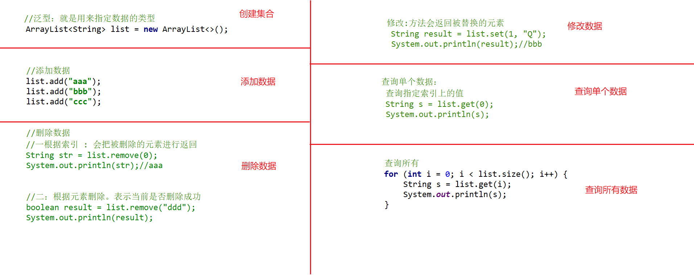
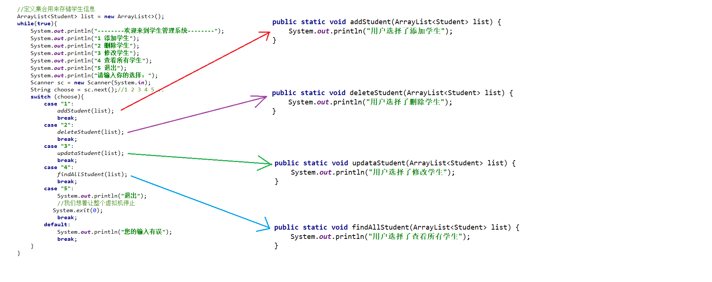

> <strong>本专栏将从基础开始，循序渐进，由浅入深讲解Java的基本使用，希望大家都能够从中有所收获，也请大家多多支持。</strong>
> <strong>专栏地址:[26天高效学习Java编程](https://blog.csdn.net/learning_xzj/category_11806176.html) </strong>
> <strong>相关软件地址:[软件地址](https://pan.baidu.com/s/1bXCZR0yxN2-v6NqDpe4H1g?pwd=1111) </strong>
> <strong>所有代码地址:[代码地址](https://gitee.com/codinginn/java-code) </strong>
> <strong> 如果文章知识点有错误的地方，请指正！大家一起学习，一起进步。</strong>
> <font color="red"><strong> 如果感觉博主的文章还不错的话，还请关注、点赞、收藏三连支持一下博主哦</strong></font>

@[toc]


## 1.ArrayList的介绍

ArrayList是一个基于链表的数组，下面将详细介绍一下ArrayList是什么及其使用。

### 集合和数组的优势对比：

> 1. 长度可变
> 2. 添加数据的时候不需要考虑索引，默认将数据添加到末尾
>

### 1.1ArrayList类概述

> <font color="red">什么是集合</font>
>
> ​	提供一种存储空间可变的存储模型，存储的数据容量可以发生改变
>
> <font color="red">ArrayList集合的特点</font>
>
> ​	底层是数组实现的，长度可以变化
>
> <font color="red">泛型的使用</font>
>
> ​	用于约束集合中存储元素的数据类型

### 1.2ArrayList类常用方法

先大概介绍ArrayList的增删查改:



#### 1.2.1构造方法

| 方法名             | 说明                 |
| ------------------ | -------------------- |
| public ArrayList() | 创建一个空的集合对象 |

#### 1.2.2成员方法

| 方法名                                   | 说明                                   |
| ---------------------------------------- | -------------------------------------- |
| public boolean   remove(Object o)        | 删除指定的元素，返回删除是否成功       |
| public E   remove(int   index)           | 删除指定索引处的元素，返回被删除的元素 |
| public E   set(int index,E   element)    | 修改指定索引处的元素，返回被修改的元素 |
| public E   get(int   index)              | 返回指定索引处的元素                   |
| public int   size()                      | 返回集合中的元素的个数                 |
| public boolean   add(E e)                | 将指定的元素追加到此集合的末尾         |
| public void   add(int index,E   element) | 在此集合中的指定位置插入指定的元素     |

#### 1.2.3示例代码

```java
public class ArrayListDemo02 {
    public static void main(String[] args) {
        //创建集合
        ArrayList<String> array = new ArrayList<String>();

        //添加元素
        array.add("hello");
        array.add("world");
        array.add("java");

        //public boolean remove(Object o)：删除指定的元素，返回删除是否成功
//        System.out.println(array.remove("world"));
//        System.out.println(array.remove("javaee"));

        //public E remove(int index)：删除指定索引处的元素，返回被删除的元素
//        System.out.println(array.remove(1));

        //IndexOutOfBoundsException
//        System.out.println(array.remove(3));

        //public E set(int index,E element)：修改指定索引处的元素，返回被修改的元素
//        System.out.println(array.set(1,"javaee"));

        //IndexOutOfBoundsException
//        System.out.println(array.set(3,"javaee"));

        //public E get(int index)：返回指定索引处的元素
//        System.out.println(array.get(0));
//        System.out.println(array.get(1));
//        System.out.println(array.get(2));
        //System.out.println(array.get(3)); //？？？？？？ 自己测试

        //public int size()：返回集合中的元素的个数
        System.out.println(array.size());

        //输出集合
        System.out.println("array:" + array);
    }
}
```

### 1.3ArrayList存储字符串并遍历

#### 1.3.1案例需求

​	创建一个存储字符串的集合，存储3个字符串元素，使用程序实现在控制台遍历该集合

#### 1.3.2代码实现

```java
/*
    思路：
        1:创建集合对象
        2:往集合中添加字符串对象
        3:遍历集合，首先要能够获取到集合中的每一个元素，这个通过get(int index)方法实现
        4:遍历集合，其次要能够获取到集合的长度，这个通过size()方法实现
        5:遍历集合的通用格式
 */
public class ArrayListTest01 {
    public static void main(String[] args) {
        //创建集合对象
        ArrayList<String> array = new ArrayList<String>();

        //往集合中添加字符串对象
        array.add("刘正风");
        array.add("左冷禅");
        array.add("风清扬");

        //遍历集合，其次要能够获取到集合的长度，这个通过size()方法实现
//        System.out.println(array.size());

        //遍历集合的通用格式
        for(int i=0; i<array.size(); i++) {
            String s = array.get(i);
            System.out.println(s);
        }
    }
}
```

### 1.4ArrayList存储学生对象并遍历

#### 1.4.1案例需求

​	创建一个存储学生对象的集合，存储3个学生对象，使用程序实现在控制台遍历该集合。

学生管理系统的用户主界面的搭建如下:



#### 1.4.2代码实现

```java
/*
    思路：
        1:定义学生类
        2:创建集合对象
        3:创建学生对象
        4:添加学生对象到集合中
        5:遍历集合，采用通用遍历格式实现
 */
public class ArrayListTest02 {
    public static void main(String[] args) {
        //创建集合对象
        ArrayList<Student> array = new ArrayList<>();

        //创建学生对象
        Student s1 = new Student("林青霞", 30);
        Student s2 = new Student("风清扬", 33);
        Student s3 = new Student("张曼玉", 18);

        //添加学生对象到集合中
        array.add(s1);
        array.add(s2);
        array.add(s3);

        //遍历集合，采用通用遍历格式实现
        for (int i = 0; i < array.size(); i++) {
            Student s = array.get(i);
            System.out.println(s.getName() + "," + s.getAge());
        }
    }
}
```

### 1.5ArrayList存储学生对象并遍历升级版

#### 1.5.1案例需求

> ​	创建一个存储学生对象的集合，存储3个学生对象，使用程序实现在控制台遍历该集合
>
> ​        学生的姓名和年龄来自于键盘录入
>

#### 1.5.2代码实现

```java
public class ArrayListTest {
    public static void main(String[] args) {
        //1.创建集合对象
        ArrayList<Student> list = new ArrayList<>();
        //2.键盘录入数据并添加到集合中
        Scanner sc = new Scanner(System.in);
        for (int i = 1; i <= 3; i++) {
            //创建学生对象
            Student s = new Student();
            //键盘录入学生信息
            System.out.println("请输入第" + i + "个学生的姓名");
            String name = sc.next();
            System.out.println("请输入第" + i + "个学生的年龄");
            int age = sc.nextInt();
            //把学生信息赋值给学生对象
            s.setName(name);
            s.setAge(age);
           //把学生对象添加到集合当中
            list.add(s);
        }
        //遍历
        for (int i = 0; i < list.size(); i++) {
            Student stu = list.get(i);
            System.out.println(stu.getName() + ", " + stu.getAge());
        }


    }
}
```

### 1.6 查找用户是否存在

> 需求：
>
> 1，main方法中定义一个集合，存入三个用户对象。 
>
>    用户属性为：id，username，password    
>
> 2，要求：定义一个方法，根据id查找对应的学生信息。
>
>    如果存在，返回true
>
>    如果不存在，返回false
>

代码示例：

```java
package com.itheima.test4;

import java.util.ArrayList;

public class ArrayListTest {
    public static void main(String[] args) {
        //1.创建集合
        ArrayList<User> list = new ArrayList<>();
        //2.添加用户对象
        User u1 = new User("heima001","zhangsan","123456");
        User u2 = new User("heima002","lisi","1234");
        User u3 = new User("heima003","wangwu","12345");
        //3.添加元素
        list.add(u1);
        list.add(u2);
        list.add(u3);
        //3.根据id查找是否存在
        //调方法
        //如果调用本类中的方法,直接写方法名就可以。
        //如果我要调用其他类中的方法，需要用对象去调用。
        boolean flag = contains(list, "heima004");
        System.out.println(flag);
    }

    //1.我要干嘛？ 判断id在集合中是否存在
    //2.需要什么？ 集合  id
    //3.是否需要继续使用？需要
    //写在测试类中的方法，加static
    //写在javabean类中的方法，不加static
    public static boolean contains(ArrayList<User> list, String id){
        for (int i = 0; i < list.size(); i++) {
            User u = list.get(i);
            String uid = u.getId();
            if(uid.equals(id)){
                return true;
            }
        }
        //当集合里面所有的元素全部比较完毕了
        //如果此时还不存在，才能返回false
        return false;
    }
}

```

### 1.7 查找用户的索引

> 需求： 
>
> 1，main方法中定义一个集合，存入三个用户对象。 
>
>    用户属性为：id，username，password    
>
> 2，要求：定义一个方法，根据id查找对应的学生信息。
>
>    如果存在，返回索引
>
>    如果不存在，返回-1
>

代码示例：

```java
package com.itheima.test5;

import com.itheima.test4.User;

import java.util.ArrayList;

public class ArrayListTest {
    public static void main(String[] args) {
        //1.创建集合
        ArrayList<User> list = new ArrayList<>();
        //2.添加用户对象
        User u1 = new User("heima001","zhangsan","123456");
        User u2 = new User("heima002","lisi","1234");
        User u3 = new User("heima003","wangwu","12345");
        //3.添加元素
        list.add(u1);
        list.add(u2);
        list.add(u3);

        //4.查询索引
        int index = findIndex(list, "heima004");
        System.out.println(index);

    }

    //1.我要干嘛？查询索引
    //2.需要什么？集合  id
    //3.是否需要继续使用 需要返回值
    public static int findIndex(ArrayList<User> list, String id){
        for (int i = 0; i < list.size(); i++) {
            User u = list.get(i);
            String uid = u.getId();
            if(uid.equals(id)){
                return i;
            }
        }
        //如果循环结束还没有找到
        return -1;
    }
    public static boolean contains(ArrayList<User> list, String id){
        int index = findIndex(list, id);
        if(index >= 0){
            return true;
        }else{
            return false;
        }
       // return  findIndex(list, id) >= 0;
    }
}

```


