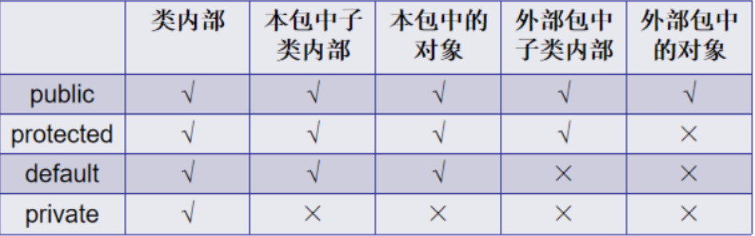

> <strong>本专栏将从基础开始，循序渐进，由浅入深讲解Java的基本使用，希望大家都能够从中有所收获，也请大家多多支持。</strong>
> <strong>专栏地址:[26天高效学习Java编程](https://blog.csdn.net/learning_xzj/category_11806176.html) </strong>
> <strong>相关软件地址:[软件地址](https://pan.baidu.com/s/1bXCZR0yxN2-v6NqDpe4H1g?pwd=1111) </strong>
> <strong>所有代码地址:[代码地址](https://gitee.com/codinginn/java-code) </strong>
> <strong> 如果文章知识点有错误的地方，请指正！大家一起学习，一起进步。</strong>
> <font color="red"><strong> 如果感觉博主的文章还不错的话，还请关注、点赞、收藏三连支持一下博主哦</strong></font>

@[toc]


## 本文将讲解如下内容

- 权限修饰符 (public,protected,default,private等)
- 代码块的优先级
- Object类使用
- 时间日期类
  - Date类
  - DateFormat类
  - Calendar类
- Math类
- System类
- BigInteger类
- BigDecimal类
- 包装类


# 第一章 权限修饰符

## 知识点--权限修饰符

### 目标:

- 权限修饰符的使用

### 讲解:

#### 3.1 概述

在Java中提供了四种访问权限，使用不同的访问权限修饰符修饰时，被修饰的内容会有不同的访问权限，

- public：公共的
- protected：受保护的
- (空的)：默认的
- private：私有的

#### 3.2 不同权限的访问能力



如果是default则只能在本包中使用。

如果是protected则不能在外部包中通过对象访问。

访问权限大小:  public >  protected  >  空   >  private

```java

public class AAA {
    public void method1(){}
    protected void method2(){}
     void method3(){}
    private void method4(){}

    // 同一个类中
    public void method(){
        method1();
        method2();
        method3();
        method4();
    }
}
public class Test {
    public static void main(String[] args) {
        AAA a = new AAA();
        a.method1();
        a.method2();
        a.method3();
        // a.method4(); 私有方法 编译报错
    }
}

包:com.itheima.demo10_权限修饰符
public class Zi extends AAA {
    public void show(){
        method1();
        method2();
        //method3();编译报错
        //method4();编译报错
    }
}
public class Test {
    public static void main(String[] args) {
        AAA a = new AAA();
        a.method1();
        //a.method2();// 编译报错
        //a.method3();// 编译报错
        //a.method4();// 编译报错
    }
}
```

可见，public具有最大权限。private则是最小权限。

编写代码时，如果没有特殊的考虑，建议这样使用权限：

- 成员变量使用`private` ，隐藏细节。

- 构造方法使用` public` ，方便创建对象。

- 成员方法使用`public` ，方便调用方法。


# 第二章 代码块

### 目标:

- 掌握构造代码块和静态代码块的使用

### 讲解:

#### 4.1 构造代码块

```java
格式: {}
位置: 类中,方法外
执行: 每次在调用构造方法的时候,就会执行
使用场景: 统计创建了多少个该类对象

例如:
public class Person{
    {
        构造代码块执行了
    }
}

public class Test {
    public static void main(String[] args) {
        /*
            构造代码块:
                格式: {}
                位置: 类中,方法外
                执行: 每次执行构造方法之前都会执行一次
                使用场景: 例如统计对象的个数 也就是每次执行构造方法之前要执行的代码就可以放在构造代码块中
         */
        Person p1 = new Person();
        Person p2 = new Person();
    }
}
```

#### 4.2 静态代码块

格式：

```java
格式:static{}
位置: 类中,方法外
执行: 当类被加载的时候执行,并只执行一次
使用场景: 例如加载驱动,这种只需要执行一次的代码就可以放在静态代码块中         

public class Person {
    static {
        System.out.println("Person 静态代码块");
    }

    {
        System.out.println("Person 构造代码块");
    }

    public Person(){
        System.out.println("Person 构造方法");
    }
}

public class Test {
    /*
         静态代码块:
            格式: static{}
            位置: 类中,方法外
            执行: 随着类的加载而执行,并且只执行一次
            使用场景: 例如读取配置文件中的数据,加载驱动,也就是说程序中只需要执行一次的代码就可以放在静态代码块中

            执行优先级:  静态代码块 >  构造代码块  >  构造方法
     */
    public static void main(String[] args) {
        Person p1 = new Person();
        Person p2 = new Person();

    }
}

```

#### 4.3 局部代码块

```java
格式:{}
位置: 方法中
执行: 调用方法,执行到局部代码块的时候就执行
使用场景: 节省内存空间,没有多大的意义
例如:
public class Test {
    public static void main(String[] args) {
        /*
            局部代码块:
                格式: {}
                位置: 方法中
                执行: 调用方法,执行到了局部代码块的时候执行
                使用场景: 节省内存空间,没有太多意义
         */
        System.out.println("开始");
        {
            int num1 = 10;
            System.out.println("局部代码块");
        }// 把局部代码块中的变量占用的空间会释放

        System.out.println("结束");
    }
}

```

# 第三章 Object类

## 知识点-- Object类概述

### 目标:

- 了解Object的概述和常用方法

### 讲解:

#### Object类的概述

- `java.lang.Object`类是Java语言中的根类，即所有类的父类。

  如果一个类没有特别指定父类，	那么默认则继承自Object类。例如：

  ```java
  public class MyClass /*extends Object*/ {
    	// ...
  }
  public class Fu{
      
  }
  public class Zi extends Fu{
      // 间接继承Object类: Zi继承Fu,Fu继承Object类
  }
  ```

- 根据JDK源代码及Object类的API文档，Object类当中包含的方法有11个。今天我们主要学习其中的2个：

- `public String toString()`：返回该对象的字符串表示。

- `public boolean equals(Object obj)`：指示其他某个对象是否与此对象“相等”。

### 小结

- Object类是java中的根类
- java中所有的类都是直接或者间接继承Object类,也就意味着,java中所有的类都拥有Object类中的那11个方法

## 知识点-- toString方法

### 目标:

- 能够正确使用toString方法

### 路径:

- toString方法的概述
- 重写toString方法

### 讲解:

#### toString方法的概述

- `public String toString()`：返回该对象的字符串表示，其实该字符串内容就是：对象的类型名+@+内存地址值。

由于toString方法返回的结果是内存地址，而在开发中，经常需要按照对象的属性得到相应的字符串表现形式，因此也需要重写它。

#### 重写toString方法

如果不希望使用toString方法的默认行为，则可以对它进行覆盖重写。例如自定义的Person类：

```java

class Person{
    String name;
    int age;

    public Person(String name, int age) {
        this.name = name;
        this.age = age;
    }

    /*@Override
    public String toString() {
        // 自定义返回的字符串内容格式
        return name+","+age;
    }*/

    @Override
    public String toString() {
        // 使用快捷键生成默认格式(alt+insert)
        return "Person{" +
                "name='" + name + '\'' +
                ", age=" + age +
                '}';
    }
}
public class Test {
    public static void main(String[] args) {
        /*
            Object类的toString方法:
                public String toString()：返回该对象的字符串表示
                特点:
                    1.toString方法返回的字符串内容格式为: 类的全路径+@+十六进制数的地址值
                    2.直接打印对象名,其实就是打印对象调用toString方法返回的字符串内容
                问题: 如果打印对象的时候,不希望打印的是地址值这种形式的字符串,那么应该怎么办?
                解决: 重写toString方法---->可以自定义返回的字符串内容格式,也可以使用快捷键生成默认格式(alt+insert 推荐)
         */
        // 创建Object对象
        Object obj = new Object();
        System.out.println(obj.toString());// java.lang.Object@50cbc42f
        System.out.println(obj);// java.lang.Object@50cbc42f
        // 结论: 直接打印对象名,其实就是打印对象调用toString方法返回的字符串内容

        System.out.println("====================================");
        // Person类没有重写toString方法
       /* // 创建Person对象
        Person p1 = new Person("张三",18);
        System.out.println(p1);// com.itheima.demo4_toString方法.Person@282ba1e
        // p1调用toString方法,因为java中所有的类都继承了Object类
        System.out.println(p1.toString());// com.itheima.demo4_toString方法.Person@282ba1e*/

       // Person类重写toString方法
        // 创建Person对象
        Person p1 = new Person("张三",18);
        System.out.println(p1);// Person{name='张三', age=18}
        // p1调用toString方法,因为java中所有的类都继承了Object类
        System.out.println(p1.toString());// Person{name='张三', age=18}
    }
}

```

在IntelliJ IDEA中，可以点击`Code`菜单中的`Generate...`，也可以使用快捷键`alt+insert`，点击`toString()`选项。选择需要包含的成员变量并确定。

> 小贴士： 在我们直接使用输出语句输出对象名的时候,其实通过该对象调用了其toString()方法。

### 小结

- toString方法默认返回的字符串内容格式: 对象的类型+@+十六进制数的地址值
- 特点:打印对象的时候,其实就是打印该对象调用toString方法返回的字符串内容
- 如果打印对象的时候不希望打印的是地址值的形式,那么就可以去重写toString方法,指定返回的字符串内容格式  ---->一般开发中,重写toString方法---alt+insert--->toString() 回车

## 知识点-- equals方法

### 目标:

- 掌握equals方法的使用

### 讲解:

#### equals方法的概述

- `public boolean equals(Object obj)`：指示其他某个对象是否与此对象“相等”。

#### equals方法的使用

##### 默认地址比较

Object类的equals()方法默认实心是==比较,也就是比较2个对象的地址值,对于我们来说没有用

##### 对象内容比较

如果希望进行对象的内容比较，即所有或指定的部分成员变量相同就判定两个对象相同，则可以覆盖重写equals方法。例如：

```java

class Person {
    String name;
    int age;

    public Person(String name, int age) {
        this.name = name;
        this.age = age;
    }

    /*@Override
    public boolean equals(Object obj) {
        // 自定义比较规则
        Person p = (Person) obj;
        return this.age == p.age && this.name.equals(p.name);
    }*/

    // 快捷键重写equals方法  alt+insert-->equals and hashCode
    @Override
    public boolean equals(Object o) {
        // 如果2个对象的地址值相同,就直接返回true,结束方法
        if (this == o) return true;
        // 如果传入的对象为null,就直接返回false,结束方法
        // 如果2个对象的类型不一致,就直接返回false,结束方法
        if (o == null || this.getClass() != o.getClass()) return false;
        // 来到这里,说明要比较的2个对象地址值不同,并且一定是Person类型
        Person person = (Person) o;// 向下转型
        //  比较所有属性是否相同
        return age == person.age &&
                Objects.equals(name, person.name);
    }

}
public class Test {
    public static void main(String[] args) {
        /*
            Object类的equals方法:
                public boolean equals(Object obj)：指示其他某个对象是否与此对象“相等”。
                源码:
                    public boolean equals(Object obj) {
                        return (this == obj);
                    }
                特点:
                    1.Object类的equals()方法默认比较的是2个对象的地址值是否相等(==比较)
                    2.由于java中所有类都是继承Object类,所以如果类中没有重写equals方法,默认就是地址值比较
                    3.如果希望进行对象的内容比较，即所有或指定的部分成员变量相同就判定两个对象相同，则可以重写equals方法
         */
        // 创建Object类对象
        Object obj1 = new Object();
        Object obj2 = new Object();
        System.out.println(obj1 == obj2);// false
        System.out.println(obj1.equals(obj2));// false  执行代码:obj1 == obj2

        System.out.println("======================");
        Person p1 = new Person("张三",18);
        Person p2 = new Person("张三",18);
        // 在开发中,往往认为p1和p2是2个相同的对象,因为所有的属性值相同

        // Person类没有重写equals方法
        // 比较p1和p2是否相等
        //System.out.println(p1==p2);// false  比较2个对象的地址值
        //System.out.println(p1.equals(p2));// false  执行代码: p1 == p2

        // Person类重写equals方法
        // 比较p1和p2是否相等
        System.out.println(p1==p2);// false  比较2个对象的地址值
        System.out.println(p1.equals(p2));// true

        System.out.println(p1.equals(obj1));// false
        Person p3 = new Person(null,18);
        System.out.println(p3.equals(p1));// false
    }
}

```

这段代码充分考虑了对象为空、类型一致等问题，但方法内容并不唯一。大多数IDE都可以自动生成equals方法的代码内容。在IntelliJ IDEA中，可以使用`Code`菜单中的`Generate…`选项，也可以使用快捷键`alt+insert`，并选择`equals() and hashCode()`进行自动代码生成。

> tips：Object类当中的hashCode等其他方法，今后学习。

### 小结

- 概述: equals方法可以判断两个对象是否相同

- ```java
  1.Object类的equals方法默认比较的是2个对象的地址值是否相同  == 一样的效果
  2.如果在开发中,希望调用equals方法比较的不是2个对象的地址值,那么就需要重写equals方法,指定比较规则
    一般开发中,重写toString方法,使用idea的快捷键alt+insert--->equals and hashCode 回车
  ```

## 知识点-- Objects类

### 目标:

- Objects类

### 讲解:

在刚才IDEA自动重写equals代码中，使用到了`java.util.Objects`类，那么这个类是什么呢？

**JDK7**中新增了一个Objects工具类，它提供了一些方法来操作对象，它由一些静态的实用方法组成，这些方法是null-save（空指针安全的）或null-tolerant（容忍空指针的），用于计算对象的hashCode、返回对象的字符串表示形式、比较两个对象。

在比较两个对象的时候，Object的equals方法容易抛出空指针异常，而Objects类中的equals方法就优化了这个问题。方法如下：

- `public static boolean equals(Object a, Object b)`:判断两个对象是否相等。

我们可以查看一下源码，学习一下：

```java
public static boolean equals(Object a, Object b) {  
    return (a == b) || (a != null && a.equals(b));  
}
```

```java

public class Test {
    public static void main(String[] args) {
        /*
            Objects类: 避免空指针异常(容忍空指针)
                public static boolean equals(Object a, Object b):判断两个对象是否相等。
                源码:
                     public static boolean equals(Object a, Object b) {
                        return (a == b) || (a != null && a.equals(b));
                    }
         */
        String name1 = "张三";
        String name2 = new String("张三");
        String name3 = null;
        System.out.println(name1);// 张三
        System.out.println(name2);// 张三

        // 比较name1和name2字符串内容是否相同
        //System.out.println(name1.equals(name2));// true
        //System.out.println(name3.equals(name1));// 空指针异常NullPointerException,因为null不能调用方法

        System.out.println(Objects.equals(name1, name2));// true
        System.out.println(Objects.equals(name3, name1));// false
    }
}

```

## 知识点-- native方法

### 目标

- 理解什么是native方法,以及native方法的作用

### 讲解

在Object类的源码中定义了 **native** 修饰的方法， native 修饰的方法称为本地方法。这种方法是没有方法体的,我们查看不了它的实现,所以大家不需要关心该方法如何实现的

- 当我们需要访问C或C++的代码时，或者访问操作系统的底层类库时，可以使用本地方法实现。

  也就意味着Java可以和其它的编程语言进行交互。

- 本地方法的作用： 就是当Java调用非[Java](https://baike.baidu.com/item/Java/85979)代码的接口。方法的实现由非Java语言实现，比如C或C++。 

> Object类源码(部分)：

```java
package java.lang;
/**
 * Class {@code Object} is the root of the class hierarchy.
 * Every class has {@code Object} as a superclass. All objects,
 * including arrays, implement the methods of this class.
 *
 * @author  unascribed
 * @see     java.lang.Class
 * @since   JDK1.0
 */
public class Object {
	//本地方法
    private static native void registerNatives();
    //静态代码块
    static {
        registerNatives();
    }
    ......
    ......
}
```

# -第四章 Date类

## 知识点--Date类

### 目标:

- Date类的使用

### 讲解:

#### Date类的概述

` java.util.Date`类 表示一个日期和时间，内部精确到毫秒。

#### Date类中的构造方法

继续查阅Date类的描述，发现Date拥有多个构造函数，只是部分已经过时，我们重点看以下两个构造函数

- `public Date()`：从运行程序的此时此刻到时间原点经历的毫秒值,转换成Date对象，分配Date对象并初始化此对象，以表示分配它的时间（精确到毫秒）。
- `public Date(long date)`：将指定参数的毫秒值date,转换成Date对象，分配Date对象并初始化此对象，以表示自从标准基准时间（称为“历元（epoch）”，即1970年1月1日00:00:00 GMT）以来的指定毫秒数。

> tips: 由于中国处于东八区（GMT+08:00）是比世界协调时间/格林尼治时间（GMT）快8小时的时区，当格林尼治标准时间为0:00时，东八区的标准时间为08:00。

简单来说：使用无参构造，可以自动设置当前系统时间的毫秒时刻；指定long类型的构造参数，可以自定义毫秒时刻。例如：

```java


import java.util.Date;


public class Test {
    public static void main(String[] args) {
        /*
            - Date类的概述: java.util.Date类 表示一个日期和时间，内部精确到毫秒。
            - Date类中的构造方法:
                    public Date() : 创建当前系统时间对应的日期对象
                    public Date(long date): 创建以标准基准时间为基准 指定偏移毫秒数 对应时间的日期对象
                        标准基准时间:
                            0时区: 1970年1月1日00:00:00 GMT
                            东8区: 1970年1月1日08:00:00 CST

         */
        // 创建当前统时间对应的日期对象
        Date date1 = new Date();
        System.out.println(date1);// Fri May 13 07:21:39 CST 2022

        // 创建以标准基准时间为基准 指定偏移1000毫秒
        Date date2 = new Date(1000);
        System.out.println(date2);// Thu Jan 01 08:00:01 CST 1970

        // 创建日期对象,表示1970年1月1日07:59:59
        Date date3 = new Date(-1000);
        System.out.println(date3);// Thu Jan 01 07:59:59 CST 1970

    }
}

```

> tips:在使用println方法时，会自动调用Date类中的toString方法。Date类对Object类中的toString方法进行了覆盖重写，所以结果为指定格式的字符串。

#### Date类中的常用方法

Date类中的多数方法已经过时，常用的方法有：

- ```java
  public long getTime() 获取当前日期对象距离标准基准时间的毫秒值。
  public void setTime(long time) 设置当前日期对象距离标准基准时间的毫秒值.也就意味着改变了当前日期对象
  public boolean after(Date when) 测试此日期是否在指定日期之后。
  public boolean before(Date when) 测试此日期是否在指定日期之前。
  ```

- 

示例代码

```java

import java.util.Date;

public class Test2 {

    public static void main(String[] args) {
        /*
           - Date类中的常用方法
                - public long getTime() 获取当前日期对象距离标准基准时间的毫秒值。
                - public void setTime(long time) 设置当前日期对象距离标准基准时间的毫秒值.也就意味着改变了当前日期对象
                - public boolean after(Date when) 测试此日期是否在指定日期之后。
                - public boolean before(Date when) 测试此日期是否在指定日期之前。
         */
        // 创建当前统时间对应的日期对象
        Date date1 = new Date();
        System.out.println(date1);// Fri May 13 07:24:12 CST 2022

        // 创建以标准基准时间为基准 指定偏移1000毫秒
        Date date2 = new Date(1000);// 设置距离标准基准时间的毫秒值为1000
        System.out.println(date2);// Thu Jan 01 08:00:01 CST 1970

        // 获取当前日期对象距离标准基准时间的毫秒值。
        System.out.println(date1.getTime());// 1652397852478
        System.out.println(date2.getTime());// 1000

        // 修改date1距离标准基准时间的毫秒值为2000
        date1.setTime(2000);
        System.out.println(date1);// Thu Jan 01 08:00:02 CST 1970
        date2.setTime(2000);
        System.out.println(date2);// Thu Jan 01 08:00:02 CST 1970

        // 创建当前统时间对应的日期对象
        Date date3 = new Date();

        System.out.println("date3表示的日期是否在date1之前:"+date3.before(date1));//  false
        System.out.println("date3表示的日期是否在date1之后:"+date3.after(date1));//   true

    }
}

```

### 小结

- Date表示特定的时间瞬间，我们可以使用Date对象对时间进行操作。

- ```java
  - Date类中的构造方法:
     public Date() : 创建当前系统时间对应的日期对象
     public Date(long date): 创建以标准基准时间为基准 指定偏移毫秒数 对应时间的日期对象
                          标准基准时间:
                              0时区: 1970年1月1日00:00:00 GMT
                              东8区: 1970年1月1日08:00:00 CST
  ```

- ```java
  - public long getTime() 获取当前日期对象距离标准基准时间的毫秒值。
  - public void setTime(long time) 设置当前日期对象距离标准基准时间的毫秒值.也就意味着改变了当前日期对象
  - public boolean after(Date when) 测试此日期是否在指定日期之后。
  - public boolean before(Date when) 测试此日期是否在指定日期之前。
  ```

  

# 第五章 DateFormat类

## 知识点--DateFormat类

### 目标:

- 能够掌握DateFormat的使用

### 讲解:

#### DateFormat类的概述

`java.text.DateFormat` 是日期/时间格式化子类的抽象类，我们通过这个类可以帮我们完成日期和文本之间的转换,也就是可以在Date对象与String对象之间进行来回转换。

- **格式化**：按照指定的格式，把Date对象转换为String对象。
- **解析**：按照指定的格式，把String对象转换为Date对象。

由于DateFormat为抽象类，不能直接使用，所以需要常用的子类`java.text.SimpleDateFormat`。这个类需要一个模式（格式）来指定格式化或解析的标准。构造方法为：

- `public SimpleDateFormat(String pattern)`：用给定的模式和默认语言环境的日期格式符号构造SimpleDateFormat。参数pattern是一个字符串，代表日期时间的自定义格式。

#### 格式规则

常用的格式规则为：

| 标识字母（区分大小写） | 含义 |
| ---------------------- | ---- |
| y                      | 年   |
| M                      | 月   |
| d                      | 日   |
| H                      | 时   |
| m                      | 分   |
| s                      | 秒   |

> 备注：更详细的格式规则，可以参考SimpleDateFormat类的API文档。

#### 常用方法

DateFormat类的常用方法有：

- `public String format(Date date)`：将Date对象格式化为字符串。

- `public Date parse(String source)`：将字符串解析为Date对象。

  ```java
  
  import java.text.ParseException;
  import java.text.SimpleDateFormat;
  import java.util.Date;
  
  public class Test {
      public static void main(String[] args) throws ParseException {
          /*
              DateFormat类:
                  概述:java.text.DateFormat 是日期/时间格式化子类的抽象类
                  作用:完成日期和文本之间的转换,也就是可以在Date对象与String对象之间进行来回转换。
                      - 格式化：按照指定的格式，把Date对象转换为String对象。
                      - 解析：  按照指定的格式，把String对象转换为Date对象。
                  特点:由于DateFormat是抽象类无法创建对象,所以只能使用其子类SimpleDateFormat
              SimpleDateFormat类:
                   概述:java.text.SimpleDateFormat 是日期/时间格式化的类
                   作用:可以在Date对象与String对象之间进行来回转换。
                   构造方法:
                      public SimpleDateFormat(String pattern);创建日期格式化类对象,并且通过参数指定日期格式
                          参数: 日期格式,不管是格式化还是解析都是通过参数指定的格式来操作
                          日期格式:
                              y   年
                              M   月
                              d   日
                              H   时
                              m   分
                              s   秒
                              ...
                          常见的日期格式:  yyyy年MM月dd日 HH时mm分ss秒
                          常见的日期格式:  yyyy-MM-dd HH:mm:ss
                          常见的日期格式:  yyyy-MM-dd
                          常见的日期格式:  HH:mm:ss
                    成员方法:
                    父亲过世    
                      - public String format(Date date)：将Date对象格式化为字符串。
                      - public Date parse(String source)：将字符串解析为Date对象。
           */
          // 1.需求: 把Date类型的对象转换为String类型
          // 创建当前日期对象
          Date date1 = new Date();
  
          // 创建日期格式化对象,并且指定日期格式
          SimpleDateFormat sdf1 = new SimpleDateFormat("yyyy-MM-dd HH:mm:ss");// 格式化,日期格式随便指定
  
          // 使用日期格式化对象,把日期对象转换为String对象
          String dateStr = sdf1.format(date1);
          System.out.println(dateStr);// 2022-05-13 07:31:53
  
          System.out.println("===========================================");
  
          // 2.需求: 把String类型的对象转换为Date类型
          // 创建字符串对象
  
          String str = "2022年05月13日 12时00分00秒";
  
          // 创建日期格式化对象,并且指定日期格式
          SimpleDateFormat sdf2 = new SimpleDateFormat("yyyy年MM月dd日 HH时mm分ss秒");// 解析,日期格式要和字符串日期格式一样
  
          // 解析
          Date date = sdf2.parse(str);
          System.out.println(date);// Fri May 13 12:00:00 CST 2022
      }
  }
  
  ```

### 小结：

- ```java
  SimpleDateFormat类:
      概述:java.text.SimpleDateFormat 是日期/时间格式化的类
      作用:可以在Date对象与String对象之间进行来回转换。
      构造方法:
          public SimpleDateFormat(String pattern);创建日期格式化类对象,并且通过参数指定日期格式
                  参数: 日期格式,不管是格式化还是解析都是通过参数指定的格式来操作
                  日期格式:
                             y   年
                             M   月
                             d   日
                             H   时
                             m   分
                             s   秒
                             ...
                         常见的日期格式:  yyyy年MM月dd日 HH时mm分ss秒
                         常见的日期格式:  yyyy-MM-dd HH:mm:ss
                         常见的日期格式:  yyyy-MM-dd
                         常见的日期格式:  HH:mm:ss
    成员方法:
           public String format(Date date)：将Date对象格式化为字符串。
           public Date parse(String source)：将字符串解析为Date对象。
  ```

  

## 实操--日期类练习

### 需求

- 键盘输入一个字符串类型的时间，打印你来到世界多少天?

### 分析

- 从控制台接收用户的生日——String类型，例如："1998-03-18"
- 计算生日距离标准基准时间的毫秒值
- 计算现在时间距离标准基准时间的毫秒值
- 计算出生的天数并打印(2个毫秒值相减---转换为天数)

### 讲解

```java

import java.text.ParseException;
import java.text.SimpleDateFormat;
import java.util.Date;
import java.util.Scanner;

public class Test {
    public static void main(String[] args) throws ParseException {
        /*
            日期类练习:
                - 键盘输入一个字符串类型的时间，打印你来到世界多少天?
         */
        // 1.键盘输入一个字符串类型的时间
        Scanner sc = new Scanner(System.in);
        System.out.println("请输入出生日期,格式为yyyy-MM-dd:");
        String birthdayStr = sc.next();

        // 2.创建日期格式化对象,指定日期格式
        SimpleDateFormat sdf = new SimpleDateFormat("yyyy-MM-dd");

        // 3.把字符串类型的日期转换为Date类型的日期
        Date birthdayDate = sdf.parse(birthdayStr);

        // 4.创建当前时间日期对象
        Date nowDate = new Date();

        // 5.获取当前时间日期对象距离标准基准时间的毫秒值
        long time1 = nowDate.getTime();

        // 6.获取出生时间日期对象距离标准基准时间的毫秒值
        long time2 = birthdayDate.getTime();

        // 7.计算两个毫秒值差,换算为天,打印输出
        System.out.println("你来到世界:"+((time1 - time2)/1000/60/60/24)+"天");
    }
}

```

# 第六章 Calendar类

## 知识点--Calendar类

### 目标:

- Calendar类的概述以及常用方法

### 路径:

- Calendar类的概述
- Calendar类的常用方法

### 讲解:

#### Calendar类的概述

- java.util.Calendar类表示一个“日历类”，可以进行日期运算。它是一个抽象类，不能创建对象，我们可以使用它的子类：java.util.GregorianCalendar类。
- 有两种方式可以获取GregorianCalendar对象：
  - 直接创建GregorianCalendar对象；
  - 通过Calendar的静态方法getInstance()方法获取GregorianCalendar对象【本次使用】

```java
import java.util.Calendar;

public class Test1 {
    public static void main(String[] args) {
        /*
            Calendar类:
                Calendar类的概述:
                    java.util.Calendar类表示一个“日历类”，可以进行日期运算。
                    它是一个抽象类，不能创建对象，我们可以使用它的子类：java.util.GregorianCalendar类。

                有两种方式可以获取GregorianCalendar对象：
                    - 直接创建GregorianCalendar对象；
                    - 通过Calendar的静态方法getInstance()方法获取GregorianCalendar对象【本次使用】
                        public static Calendar getInstance() 获取当前日期的日历对象
                注意:
                    - 1.中国人:一个星期的第一天是星期一,外国人:一个星期的第一天是星期天
                    - 2.日历对象中的月份是: 0-11

         */
        // 创建当前时间的日历对象
        Calendar cal = Calendar.getInstance();
        System.out.println(cal);
    }
}

```


#### Calendar类的常用方法

- `public static Calendar getInstance()` 获取当前日期的日历对象
- `public int get(int field)` 获取某个字段的值。
  - 参数field:表示获取哪个字段的值,可以使用Calender中定义的常量来表示
  - Calendar.YEAR : 年<br />Calendar.MONTH ：月<br />Calendar.DAY_OF_MONTH：月中的日期<br />Calendar.HOUR：小时<br />Calendar.MINUTE：分钟<br />Calendar.SECOND：秒<br />Calendar.DAY_OF_WEEK：星期
- `public void set(int field,int value) `设置某个字段的值
- `public void add(int field,int amount)`为某个字段增加/减少指定的值
- 额外扩展2个方法:
  - `void setTime(Date date)`  使用给定的 Date 设置此 Calendar 的时间。
  - `boolean before(Object when) `判断此 Calendar 表示的时间是否在指定 Object 表示的时间之前，返回判断结果。
    - 调用before方法的日历对象是否在参数时间对象之前,
      -  如果在之前就返回true     例如: 2017年11月11日   2022年5月14日   true
      -  如果不在之前就返回false  例如: 2019年12月18日    2022年5月14日  false

```java


import java.text.ParseException;
import java.text.SimpleDateFormat;
import java.util.Calendar;
import java.util.Date;

public class Test2 {
    public static void main(String[] args) throws ParseException {
        /*
            Calendar类常用方法:
                public int get(int field) 获取某个字段的值。
                参数field:表示获取哪个字段的值,可以使用Calender中定义的常量来表示
                        Calendar.YEAR : 年
                        Calendar.MONTH ：月
                        Calendar.DAY_OF_MONTH：月中的日期
                        Calendar.HOUR：小时
                        Calendar.MINUTE：分钟
                        Calendar.SECOND：秒
                        Calendar.DAY_OF_WEEK：星期

                public void set(int field,int value)设置某个字段的值
                public void add(int field,int amount)为某个字段增加/减少指定的值
                额外增加:
                public void setTime(Date date)  使用给定的 Date 设置此 Calendar 的时间。
                boolean before(Object when) 判断当前日历对象的时间是否在指定日历对象时间之前
                boolean after(Object when) 判断当前日历对象的时间是否在指定日历对象时间之后
         */
        // 创建当前时间的日历对象
        Calendar cal = Calendar.getInstance();

        // 获取cal日历对象年字段的值
        int year = cal.get(Calendar.YEAR);
        System.out.println(year);// 2022

        // 获取cal日历对象月字段的值
        int month = cal.get(Calendar.MONTH);
        System.out.println(month);// 5

        // 设置cal日历对象中年字段的值为2030年
        cal.set(Calendar.YEAR,2030);
        System.out.println(cal.get(Calendar.YEAR));// 2030

        // 为cal日历对象的年字段的值+2
        cal.add(Calendar.YEAR,2);
        System.out.println(cal.get(Calendar.YEAR));// 2032

        // 为cal日历对象的年字段的值-1
        cal.add(Calendar.YEAR,-1);
        System.out.println(cal.get(Calendar.YEAR));// 2031
        System.out.println(cal.get(Calendar.MONTH));// 8

        System.out.println("==========================================");
        // 创建当前时间的日历对象
        Calendar cal1 = Calendar.getInstance();// 2020年09月10日

        // 需求: 获取1998年10月10日对应的日历对象
        String birthdayStr = "1998年10月10日";
        // 把字符串的日期转换为Date类型的日期
        SimpleDateFormat sdf = new SimpleDateFormat("yyyy年MM月dd日");
        Date birthdayDate = sdf.parse(birthdayStr);

        // 调用cal的setTime方法,把日期对象传入
        cal1.setTime(birthdayDate);

        System.out.println("年:"+cal1.get(Calendar.YEAR));// 1998
        System.out.println("月:"+(cal1.get(Calendar.MONTH)+1));// 10
        System.out.println("日:"+cal1.get(Calendar.DAY_OF_MONTH));// 10

        System.out.println("==========================================");
        // 创建当前时间的日历对象
        Calendar cal2 = Calendar.getInstance();// 2020年05月14日
        System.out.println("cal1表示的时间是否在cal2表示的时间之前:"+cal1.before(cal2));// true
        System.out.println("cal1表示的时间是否在cal2表示的时间之后:"+cal1.after(cal2));// false

    }
}

```


#### 注意

- 1.中国人:一个星期的第一天是星期一,外国人:一个星期的第一天是星期天
- 2.日历对象中的月份是: 0-11

### 小结

```java
  Calendar类常用方法:
				public static Calendar getInstance();获取当前时间的日历对象
                public int get(int field) 获取某个字段的值。
                参数field:表示获取哪个字段的值,可以使用Calender中定义的常量来表示
                        Calendar.YEAR : 年
                        Calendar.MONTH ：月
                        Calendar.DAY_OF_MONTH：月中的日期
                        Calendar.HOUR：小时
                        Calendar.MINUTE：分钟
                        Calendar.SECOND：秒
                        Calendar.DAY_OF_WEEK：星期

                public void set(int field,int value)设置某个字段的值
                public void add(int field,int amount)为某个字段增加/减少指定的值
                额外增加:
                public void setTime(Date date)  使用给定的 Date 设置此 Calendar 的时间。
                boolean before(Object when) 判断当前日历对象的时间是否在指定日历对象时间之前
                boolean after(Object when) 判断当前日历对象的时间是否在指定日历对象时间之后
```


# 第七章 Math类

## 知识点-- Math类

### 目标:

- Math工具类的使用

### 步骤:

- Math类的概述
- Math类的常用方法
- 案例代码

### 路径:

#### Math类的概述

- java.lang.Math(类): Math类包含执行基本数字运算的方法。
- 它不能创建对象，它的构造方法被“私有”了。因为他内部都是“静态方法”，通过“类名”直接调用即可。

#### Math类的常用方法

```java
 public static int abs(int a) 获取参数a的绝对值：
 public static double ceil(double a) 向上取整  例如:3.14 向上取整4.0
 public static double floor(double a) 向下取整 例如:3.14 向下取整3.0
 public static double pow(double a, double b)  获取a的b次幂
 public static long round(double a) 四舍五入取整 例如:3.14 取整3  3.56 取整4
 public static int max(int a, int b)  返回两个 int 值中较大的一个。
 public static int min(int a, int b)  返回两个 int 值中较小的一个。
```

#### 案例代码

~~~java
public class Demo {
    public static void main(String[] args) {
        System.out.println("10的绝对值:"+Math.abs(10));// 10
        System.out.println("-10的绝对值:"+Math.abs(-10));// 10

        System.out.println("3.14向上取整:"+Math.ceil(3.14));// 4.0
        System.out.println("3.54向上取整:"+Math.ceil(3.54));// 4.0
        System.out.println("-3.54向上取整:"+Math.ceil(-3.54));// -3.0

        System.out.println("==================================");
        System.out.println("3.14向下取整:"+Math.floor(3.14));// 3.0
        System.out.println("3.54向下取整:"+Math.floor(3.54));// 3.0
        System.out.println("-3.54向下取整:"+Math.floor(-3.54));// -4.0

        System.out.println("==================================");
        System.out.println("2的3次幂:"+Math.pow(2,3));// 8.0

        System.out.println("==================================");
        System.out.println("3.14四舍五入取整:"+Math.round(3.14));// 3
        System.out.println("3.54四舍五入取整:"+Math.round(3.54));// 4
        System.out.println("-3.54四舍五入取整:"+Math.round(-3.54));// -4


        System.out.println("==================================");
        System.out.println("获取10和20的最大值:"+Math.max(10,20));// 20
        System.out.println("获取10和20的最小值:"+Math.min(10,20));// 10

    }
}

~~~

# 第八章 System

## 知识点--System类

### 目标:

- System类的概述和常用方法

### 路径:

- System类的概述
- System类的常用方法
- 案例代码

### 讲解:

#### System类的概述

`java.lang.System`类中提供了大量的静态方法，可以获取与系统相关的信息或系统级操作。

#### System类的常用方法

```java
public static void exit(int status) 终止当前运行的Java虚拟机，非零表示异常终止
public static long currentTimeMillis() 返回当前时间(以毫秒为单位)
static void arraycopy(Object src, int srcPos, Object dest, int destPos, int length) 拷贝数组中的元素到另一个数组
      参数1src: 源数组
      参数2srcPos:源数组要拷贝的元素的起始索引(从哪个索引位置开始拷贝)
      参数3dest: 目标数组
      参数4destPos:目标数组接收拷贝元素的起始索引(从哪个索引位置开始接收)
      参数5length:需要拷贝多少个元素(拷贝多少个)
```

#### 案例代码

```java
import java.util.Date;

public class Test {
    public static void main(String[] args) {
        /*
            System类:
                System类的概述: java.lang.System类中提供了大量的静态方法，可以获取与系统相关的信息或系统级操作。
                System类的方法:
                    public static void exit(int status) 终止当前运行的Java虚拟机，非零表示异常终止
                    public static long currentTimeMillis() 返回当前时间距离标准基准时间的毫秒值(以毫秒为单位)
                    额外增加:
                    public static void arraycopy(Object src, int srcPos, Object dest, int destPos, int length) 拷贝数组中的元素到另一个数组
                          参数1src: 源数组
                          参数2srcPos:源数组要拷贝的元素的起始索引(从哪个索引位置开始拷贝)
                          参数3dest: 目标数组
                          参数4destPos:目标数组接收拷贝元素的起始索引(从哪个索引位置开始接收)
                          参数5length:需要拷贝多少个元素(拷贝多少个)
         */
        System.out.println("开始");
        System.out.println("执行");
        //System.exit(0);// 程序正常退出
        //System.exit(-1);// 程序非正常退出

        // 获取当前时间距离标准基准时间的毫秒值
        Date date = new Date();
        System.out.println(date.getTime());
        System.out.println(System.currentTimeMillis());

        // 拷贝数组元素到另一个数组中
        int[] arr1 = {1,2,3,4,5,6,7,8};
        int[] arr2 = {10,20,30,40,50,60,70,80};
        // 需求:把arr1中的3,4,5,6,7元素拷贝到arr2数组中,使得arr2数组变成{10,3,4,5,6,7,70,80};
        System.arraycopy(arr1,2,arr2,1,5);

        // 遍历arr2数组
        for (int i = 0; i < arr2.length; i++) {
            System.out.print(arr2[i]+" ");
        }
        System.out.println();
        System.out.println("结束");
    }
}

```

## 实操--练习

### 需求

- 在控制台输出1-10000，计算这段代码执行了多少毫秒 

### 分析

- 获取循环开始前的毫秒值
- 循环在控制台输出1-10000
- 获取循环结束后的毫秒值
- 计算时间差

### 讲解

```java
import java.util.Date;
//验证for循环打印数字1-9999所需要使用的时间（毫秒）
public class SystemDemo {
    public static void main(String[] args) {
       	//获取当前时间毫秒值
       long start = System.currentTimeMillis();
        // 循环在控制台输出1-10000
        for (int i = 1; i <= 10000; i++) {
            System.out.println(i);
        }
        // 获取循环结束后的毫秒值
        long end = System.currentTimeMillis();
        // 计算程序运行时间
        System.out.println("共耗时毫秒：" + (end - start));
    }  
}
```

# 第九章 BigInteger类

## 知识点--BigInteger类

### 目标

- 掌握BigInteger类的使用

### 讲解

#### BigInteger类的概述

java.math.BigInteger 类，不可变的任意精度的整数。如果运算中，数据的范围超过了long类型后，可以使用
BigInteger类实现，该类的计算整数是不限制长度的。

#### BigInteger类的构造方法

- BigInteger(String value) 将 BigInteger 的十进制字符串表示形式转换为 BigInteger。超过long类型的范围，已经不能称为数字了，因此构造方法中采用字符串的形式来表示超大整数，将超大整数封装成BigInteger对象。

#### BigInteger类成员方法

BigInteger类提供了对很大的整数进行加add、减subtract、乘multiply、除divide的方法，注意：都是与另一个BigInteger对象进行运算。

| 方法声明                   | 描述                                                         |
| -------------------------- | ------------------------------------------------------------ |
| add(BigInteger value)      | 返回其值为 (this + val) 的 BigInteger，超大整数加法运算      |
| subtract(BigInteger value) | 返回其值为 (this - val) 的 BigInteger，超大整数减法运算      |
| multiply(BigInteger value) | 返回其值为 (this * val) 的 BigInteger，超大整数乘法运算      |
| divide(BigInteger value)   | 返回其值为 (this / val) 的 BigInteger，超大整数除法运算，除不尽取整数部分 |

#### 【示例】

~~~java
public class Test {
    public static void main(String[] args) {
        // 创建一个BigInteger类的对象,表示一个无限大的整数
        BigInteger b1 = new BigInteger("1000000000000000000000");
        BigInteger b2 = new BigInteger("1223435453543654354354");

        // b1 + b2
        BigInteger res1 = b1.add(b2);
        System.out.println("b1 + b2 = "+res1);// 2223435453543654354354

        // b1 - b2
        BigInteger res2 = b1.subtract(b2);
        System.out.println("b1 - b2 = " + res2);// -223435453543654354354

        // b1 * b2
        BigInteger res3 = b1.multiply(b2);
        System.out.println("b1 * b2 = "+res3);// 1223435453543654354354000000000000000000000

        // b1 / b2
        BigInteger res4 = b1.divide(b2);
        System.out.println("b1 / b2 = " + res4);// 0  10/3=3


        // int a = 1000000000000;// 编译报错,因为超出了int类型所能表示的数据范围
        // long l = 1000000000000000000000L;// 编译报错,因为超出了long类型所能表示的数据范围
    }
}

~~~

# 第十章 BigDecimal类

## 知识点-- BigDecimal类

### 目标:

- 浮点数做运算会有精度问题,如何处理呢

### 路径:

- BigDecimal类的概述
- BigDecimal类构造方法
- BigDecimal类常用方法

### 讲解:

#### BigDecimal类的概述

使用基本类型做浮点数运算精度问题；

看程序说结果：

```java
public static void main(String[] args) {
    System.out.println(0.09 + 0.01);//0.09999999999999999
    System.out.println(1.0 - 0.32);//0.6799999999999999
    System.out.println(1.015 * 100);//101.49999999999999
    System.out.println(1.301 / 100);//0.013009999999999999
}

// System.out.println(0.09+0.01);// 期望: 0.10     实际:0.09999999999999999
       // System.out.println(1.0 - 0.32);// 期望; 0.68    实际:0.6799999999999999
       // System.out.println(1.015 * 100);// 期望:101.500 实际:101.49999999999999
       // System.out.println(1.301 / 100);// 期望:0.01301 实际:0.013009999999999999
```

- **对于浮点运算，不要使用基本类型，而使用"BigDecimal类"类型**

- **java.math.BigDecimal(类):提供了更加精准的数据计算方式。** 

#### BigDecimal类构造方法

| 构造方法名             | 描述                                            |
| ---------------------- | ----------------------------------------------- |
| BigDecimal(double val) | 将double类型的数据封装为BigDecimal对象          |
| BigDecimal(String val) | 将 BigDecimal 的字符串表示形式转换为 BigDecimal |

注意：推荐使用第二种方式，第一种存在精度问题；

#### BigDecimal类常用方法

BigDecimal类中使用最多的还是提供的进行四则运算的方法，如下：

| 方法声明                                     | 描述     |
| -------------------------------------------- | -------- |
| public BigDecimal add(BigDecimal value)      | 加法运算 |
| public BigDecimal subtract(BigDecimal value) | 减法运算 |
| public BigDecimal multiply(BigDecimal value) | 乘法运算 |
| public BigDecimal divide(BigDecimal value)   | 除法运算 |

注意：对于divide方法来说，如果除不尽的话，就会出现java.lang.ArithmeticException异常。此时可以使用divide方法的另一个重载方法；

> BigDecimal divide(BigDecimal divisor, int scale, RoundingMode roundingMode): divisor：除数对应的BigDecimal对象；scale:精确的位数；roundingMode取舍模式

RoundingMode枚举: RoundingMode.HALF_UP 四舍五入 

```java


import java.math.BigDecimal;
import java.math.RoundingMode;

public class Test {
    public static void main(String[] args) {
        /*
            BigDecimal类:
                概述:java.math.BigDecimal表示超大的小数,并且可以解决小数运算的精度问题
                构造方法:
                    BigDecimal(double val) 将double类型的数据封装为BigDecimal对象
                    BigDecimal(String val) 将 BigDecimal 的字符串表示形式转换为 BigDecimal  推荐
                    注意：推荐使用第二种方式，第一种存在精度问题；

                成员方法:
                    public BigDecimal add(BigDecimal value) 加法运算
                    public BigDecimal subtract(BigDecimal value)  减法运算
                    public BigDecimal multiply(BigDecimal value) 乘法运算
                    public BigDecimal divide(BigDecimal value)  除法运算

                注意：对于divide方法来说，如果除不尽的话，
                就会出现java.lang.ArithmeticException异常。此时可以使用divide方法的另一个重载方法；

                BigDecimal divide(BigDecimal divisor, int scale, RoundingMode roundingMode):
                                divisor：除数对应的BigDecimal对象；
                                scale:精确的位数；
                                roundingMode取舍模式  RoundingMode枚举: RoundingMode.HALF_UP 四舍五入

         */
        // 加法运算:
        BigDecimal b1 = new BigDecimal("0.09");
        BigDecimal b2 = new BigDecimal("0.01");
        BigDecimal res1 = b1.add(b2);
        System.out.println("res1:"+res1);// 0.10

        // 减法运算:
        BigDecimal b3 = new BigDecimal("1.0");
        BigDecimal b4 = new BigDecimal("0.32");
        BigDecimal res2 = b3.subtract(b4);
        System.out.println("res2:"+res2);// 0.68

        // 乘法运算
        BigDecimal b5 = new BigDecimal("1.015");
        BigDecimal b6 = new BigDecimal("100");
        BigDecimal res3 = b5.multiply(b6);
        System.out.println("res3:"+res3);// 101.500

        // 除法运算
        BigDecimal b7 = new BigDecimal("1.301");
        BigDecimal b8 = new BigDecimal("100");
        BigDecimal res4 = b7.divide(b8);
        System.out.println("res4:"+res4);// 0.01301

        // 加法运算: 有问题的
        BigDecimal b9 = new BigDecimal(0.09);
        BigDecimal b10 = new BigDecimal(0.01);
        BigDecimal res5 = b9.add(b10);
        System.out.println("res5:"+res5);// res5:0.0999999999999999968774977432417472300585359334945678710937

        // 除法运算: 有问题的
        /*BigDecimal b11 = new BigDecimal("10");
        BigDecimal b12 = new BigDecimal("3");
        BigDecimal res6 = b11.divide(b12);// 报异常
        System.out.println("res6:"+res6);*/

        /*BigDecimal b13 = new BigDecimal("20");
        BigDecimal b14 = new BigDecimal("3");
        BigDecimal res7 = b13.divide(b14);// 报异常
        System.out.println("res7:"+res7);*/

        // 注意：对于divide方法来说，如果除不尽的话，
        // 就会出现java.lang.ArithmeticException异常。此时可以使用divide方法的另一个重载方法；
        BigDecimal b11 = new BigDecimal("10");
        BigDecimal b12 = new BigDecimal("3");
        BigDecimal res6 = b11.divide(b12,2, RoundingMode.HALF_UP);
        System.out.println("res6:"+res6);// 3.33

        BigDecimal b13 = new BigDecimal("20");
        BigDecimal b14 = new BigDecimal("3");
        BigDecimal res7 = b13.divide(b14,3,RoundingMode.HALF_UP);
        System.out.println("res7:"+res7);// 6.667
    }
}

```

### 小结:

- Java中小数运算有可能会有精度问题，如果要解决这种精度问题，可以使用BigDecimal

# 第十一章 Arrays类

## 知识点-- Arrays类

### 目标

- 掌握Arrays类的使用

### 讲解

#### 3.1 Arrays类概述

​	java.util.Arrays类：该类包含用于操作数组的各种方法（如排序和搜索）

#### 3.2 Arrays类常用方法

- public static void sort(int[] a)：按照数字顺序排列指定的数组

- public static String toString(int[] a)：返回指定数组的内容的字符串表示形式

- 示例代码：

  ~~~java
  public class Test {
      public static void main(String[] args) {
          /*
              Arrays类:
                  概述:java.util.Arrays类：该类包含用于操作数组的各种方法（如排序和搜索）,包含了很多的静态方法
                  常用方法:
                      - public static void sort(int[] a)：按照数字顺序排列指定的数组
                      - public static String toString(int[] a)：返回指定数组的内容的字符串表示形式
  
           */
        int[] arr = {12,334,53,543,43,32};
          System.out.println("排序之前的数组:"+Arrays.toString(arr));
          // 对arr数组中的元素进行升序排序
          Arrays.sort(arr);
          System.out.println("排序之后的数组:"+Arrays.toString(arr));
  
      }
  }
  
  ~~~

  打印结果：

  ~~~java
  排序之前的数组:[12, 334, 53, 543, 43, 32]
  排序之后的数组:[12, 32, 43, 53, 334, 543]
  ~~~

# 第十二章  包装类

## 知识点-- 包装类的概述

### 目标

- 知道什么是包装类,包装类有哪些

### 路径

- 包装类的概述

### 讲解

#### 包装类的概述

Java提供了两个类型系统，基本类型与引用类型，使用基本类型在于效率，然而很多情况，会创建对象使用，因为对象可以做更多的功能，如果想要我们的基本类型像对象一样操作，就可以使用基本类型对应的包装类，如下：

| 基本类型 | 对应的包装类（位于java.lang包中） |
| -------- | --------------------------------- |
| byte     | Byte                              |
| short    | Short                             |
| int      | **Integer**                       |
| long     | Long                              |
| float    | Float                             |
| double   | Double                            |
| char     | **Character**                     |
| boolean  | Boolean                           |

## 知识点-- Integer类

### 目标

- 了解Integer类的使用

### 路径

- Integer类概述
- Integer类构造方法及静态方法

### 讲解

#### Integer类概述

包装一个对象中的原始类型 int 的值

#### Integer类构造方法及静态方法

| 方法名                                  | 说明                                   |
| --------------------------------------- | -------------------------------------- |
| public Integer(int   value)             | 根据 int 值创建 Integer 对象(过时)     |
| public Integer(String s)                | 根据 String 值创建 Integer 对象(过时)  |
| public static Integer valueOf(int i)    | 返回表示指定的 int 值的 Integer   实例 |
| public static Integer valueOf(String s) | 返回保存指定String值的 Integer 对象    |

#### 示例代码

```java

public class Test {
    public static void main(String[] args) {
        // int--->Integer
        Integer i1 = new Integer(10);// i1对象表示的整数就是10
        Integer i2 = Integer.valueOf(10);//    i2对象表示的整数就是10

        // String--->Integer   
        Integer i3 = new Integer("100");// i3对象表示的整数就是100
        Integer i4 = Integer.valueOf("100");// i4对象表示的整数就是100

        // Integer--->int
        int num1 = i1.intValue();
        int num2 = i2.intValue();
        int num3 = i3.intValue();
        int num4 = i4.intValue();
    }
}

```

## 知识点--装箱与拆箱

### 目标:

- 理解什么是装箱什么是拆箱,掌握自动拆箱和自动装箱

### 讲解:

#### 装箱与拆箱的概述

基本类型与对应的包装类对象之间，来回转换的过程称为”装箱“与”拆箱“：

- **装箱**：从基本类型转换为对应的包装类对象。
- **拆箱**：从包装类对象转换为对应的基本类型。

#### 自动装箱与自动拆箱

由于我们经常要做基本类型与包装类之间的转换，从Java 5（JDK 1.5）开始，基本类型与包装类的装箱、拆箱动作可以自动完成。例如：

```java

public class Test {
    public static void main(String[] args) {
        /*
            装箱与拆箱:
                - 装箱：从基本类型转换为对应的包装类对象。
                - 拆箱：从包装类对象转换为对应的基本类型。
            自动装箱与自动拆箱:
                - 自动装箱：从基本类型自动转换为对应的包装类对象。
                - 自动拆箱：从包装类对象自动转换为对应的基本类型。
         */
        // 装箱
        // int--->Integer
        Integer i1 = new Integer(10);// i1对象表示的整数就是10
        Integer i2 = Integer.valueOf(10);//    i2对象表示的整数就是10

        // 拆箱
        // Integer--->int
        int num1 = i1.intValue();
        int num2 = i2.intValue();

        System.out.println("==========================");

        // 自动装箱
        Integer i3 = 10;

        // 自动拆箱
        int num3 = i3;

    }
}

```

### 小结

- 可以将“包装类”和“基本类型”混合使用，比较方便 

## 知识点--基本类型与字符串之间的转换

### 目标:

- 基本类型与字符串之间的转换

### 讲解:

#### 基本类型转换为String

- 转换方式
- 方式一：直接在数字后加一个空字符串
- 方式二：通过String类静态方法valueOf()
- 示例代码

```java
public class IntegerDemo {
    public static void main(String[] args) {
        //int --- String
        int number = 100;
        //方式1
        String s1 = number + "";
        System.out.println(s1);
        //方式2
        //public static String valueOf(int i)
        String s2 = String.valueOf(number);
        System.out.println(s2);
        System.out.println("--------");
    }
}
```

#### String转换成基本类型 

除了Character类之外，**其他所有包装类都具有parseXxx静态方法可以将字符串参数转换为对应的基本类型**：

- `public static byte parseByte(String s)`：将字符串参数转换为对应的byte基本类型。
- `public static short parseShort(String s)`：将字符串参数转换为对应的short基本类型。
- **`public static int parseInt(String s)`：将字符串参数转换为对应的int基本类型。**
- **`public static long parseLong(String s)`：将字符串参数转换为对应的long基本类型。**
- `public static float parseFloat(String s)`：将字符串参数转换为对应的float基本类型。
- `public static double parseDouble(String s)`：将字符串参数转换为对应的double基本类型。
- `public static boolean parseBoolean(String s)`：将字符串参数转换为对应的boolean基本类型。

代码使用（仅以Integer类的静态方法parseXxx为例）如：

- 示例代码

```java
public class IntegerDemo {
    public static void main(String[] args) {
         // 基本类型--->字符串:
        String str1 = 100 + "";// str1字符串的内容:"100"
        String str2 = String.valueOf(100);// str2字符串的内容: "100"

        // 字符串--->基本类型:
        int num1 = Integer.parseInt(str1);
        int num2 = Integer.parseInt(str2);
        System.out.println(num1+num2);// 200
    }
}
```

> 注意:如果字符串参数的内容无法正确转换为对应的基本类型，则会抛出`java.lang.NumberFormatException`异常。

#### 小结

```java
基本类型与字符串之间的转换:
     基本类型--->字符串:
         直接在数字后加一个空字符串

     字符串--->基本类型:
         除了Character类之外，其他所有包装类都具有parseXxx静态方法可以将字符串参数转换为对应的基本类型：
```


