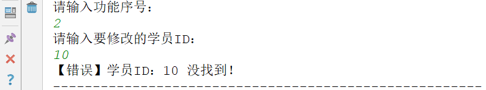
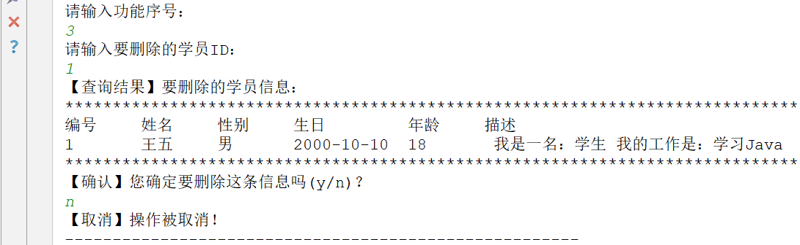
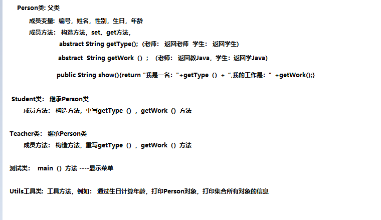

> <strong>本专栏将从基础开始，循序渐进，由浅入深讲解Java的基本使用，希望大家都能够从中有所收获，也请大家多多支持。</strong>
> <strong>专栏地址:[26天高效学习Java编程](https://blog.csdn.net/learning_xzj/category_11806176.html) </strong>
> <strong>相关软件地址:[软件地址](https://pan.baidu.com/s/1bXCZR0yxN2-v6NqDpe4H1g?pwd=1111) </strong>
> <strong>所有代码地址:[代码地址](https://gitee.com/codinginn/java-code) </strong>
> <strong> 如果文章知识点有错误的地方，请指正！大家一起学习，一起进步。</strong>
> <font color="red"><strong> 如果感觉博主的文章还不错的话，还请关注、点赞、收藏三连支持一下博主哦</strong></font>

@[toc]


# day06 【综合练习】

# 第一章 案例演示

### 目标:

- 今天我们要来做一个综合案例,就是学生信息管理系统,接下来我们来演示一下有哪些功能

### 讲解:

#### 1.1 程序启动

 运行MainApp类，启动程序：


#### 1.2 测试学员信息管理模块


#### 1.3 测试【1.查询学员】


#### 1.4 测试【2.添加学员】


#### 1.5 测试【3.修改学员】

- 输入不存在的编号：

  

- 输入存在的编号：

  

#### 1.6 测试【4.删除学员】

- 输入不存在的编号：

  

- 输入存在的编号，但取消操作：

  

- 输入存在的编号，执行删除：

  


业务逻辑分析:


### 小结:

略

# 第二章 类设计



## 2.1 父类Person(抽象)

### 目标:

- 有学生信息管理和教师信息管理 系统,所以可以使用模板设计模式,定义一个父类,把共有的部分放在Person类中

### 讲解:

- 成员属性：

  - id(编号)
  - name(姓名)
  - sex(性别)
  - birthday(生日)
  - age(年龄-由生日计算得出)

- 构造方法：

  - 无参构造
  - 全参构造

- 成员方法：

  - toString()

- 抽象方法：

  - getType()：由各子类实现，返回各自的"类型"字符串。
  - getWork()：由各子类实现，返回各自的"工作"字符串。

## 2.2 子类Student

### 目标:

- 分析子类Student

### 讲解:

- 构造方法
  - 无参构造
  - 全参构造(super调用父类全参构造)
- 重写抽象方法
  - 重写getType()
  - 重写getWork()

## 2.3 子类Teacher

### 目标:

- 分析子类Teacher

### 讲解:

- 构造方法
  - 无参构造
  - 全参构造(super调用父类全参构造)
- 重写抽象方法
  - 重写getType()
  - 重写getWork()

## 2.4 工具类Utils类

### 目标:

- 添加学员或者教师信息时，ID值+1,还有查询的时候需要打印集合信息以及计算年龄的功能,这些都是通用的,所以可以把这些定义在工具类中

### 讲解:

- 全局变量
  - 学员ID值(添加学员信息时，编号由此ID加1生成)
  - 教师ID值(添加教师信息时，编号由此ID加1生成)
- 全局方法
  - 根据生日计算年龄的方法
  - 打印一个Person对象的方法；
  - 打印一个ArrayList<Person>集合的方法；

## 2.5 启动类

### 目标:

- 创建启动类,定义main方法

### 步骤:

- 创建启动类,定义main方法

# 第三章 类制作

### 目标:

- 根据之前的分析,分别制作Person,Student,Teacher,Utils类

### 步骤:

- 制作父类Person(抽象)
- 制作子类Student
- 制作子类Teacher
- 制作工具类Utils类

### 讲解:

#### 3.1 父类Person(抽象)

```java
public abstract class Person {
    // 成员变量
    /**
     * 编号
     */
    private int id;
    /**
     * 姓名
     */
    private String name;
    /**
     * 性别
     */
    private String sex;
    /**
     * 生日
     */
    private String birthday;
    /**
     * 年龄
     */
    private int age;

    // 构造方法
    public Person() {
    }

    public Person(int id, String name, String sex, String birthday, int age) {
        this.id = id;
        this.name = name;
        this.sex = sex;
        this.birthday = birthday;
        this.age = age;
    }

    // set\get方法
    public int getId() {
        return id;
    }

    public void setId(int id) {
        this.id = id;
    }

    public String getName() {
        return name;
    }

    public void setName(String name) {
        this.name = name;
    }

    public String getSex() {
        return sex;
    }

    public void setSex(String sex) {
        this.sex = sex;
    }

    public String getBirthday() {
        return birthday;
    }

    public void setBirthday(String birthday) {
        this.birthday = birthday;
    }

    public int getAge() {
        return age;
    }

    public void setAge(int age) {
        this.age = age;
    }

    // 成员方法
    /**
     * @return  返回类型
     */
    public abstract String getType();

    /**
     * @return 返回工作
     */
    public abstract String getWork();

    /**
     * 按照指定格式,返回数据信息
     * @return
     */
    public String show(){
        return "我是一名:"+getType()+",我的工作是:"+getWork();
    }
}

```


#### 3.2 子类Student

```java
public class Student extends Person {

    public Student() {
    }

    public Student(int id, String name, String sex, String birthday, int age) {
        super(id, name, sex, birthday, age);
    }

    @Override
    public String getType() {
        return "学生";
    }

    @Override
    public String getWork() {
        return "学Java...";
    }
}
```


#### 3.3 子类Teacher

~~~java
public class Teacher extends Person {

    public Teacher() {
    }

    public Teacher(int id, String name, String sex, String birthday, int age) {
        super(id, name, sex, birthday, age);
    }

    @Override
    public String getType() {
        return "老师";
    }

    @Override
    public String getWork() {
        return "教Java...";
    }
}
~~~

#### 3.4 工具类Utils类

```java
public class Utils {

    // 定义一个静态的id变量,用来给学生对象的id赋值
    public static int id ;// 100个对象 id=100 程序停止再启动

    static {
        id = 0;// 以后可以读取文件中记录的id值,赋为初始值
    }


    // 根据生日计算年龄的方法
    public static int birthdayToAge(String birthday){
        // 思路:
        // 1. 获取当前日期对象
        Date nowDate = new Date();

        // 2. 创建日期格式化对象,指定日期格式
        SimpleDateFormat sdf = new SimpleDateFormat("yyyy-MM-dd");

        // 3. 调用parse()解析方法对字符串生日解析为Date类型的生日
        Date birthdayDate = null;
        try {
            birthdayDate = sdf.parse(birthday);
        } catch (ParseException e) {
            e.printStackTrace();
        }

        // 4.比较出生日期是否在当前日期之后,如果是,直接返回 -1;
        if (birthdayDate.after(nowDate)) {
            return -1;
        }
        // 5.获取当前时间的日历对象
        Calendar cal = Calendar.getInstance();

        // 6.获取当前时间的年,月,日
        int nowYear = cal.get(Calendar.YEAR);
        int nowMonth = cal.get(Calendar.MONTH);
        int nowDay = cal.get(Calendar.DAY_OF_MONTH);

        // 7.通过日历对象调用setTime(Date date)方法,设置日历对象的时间为出生日期的时间
        cal.setTime(birthdayDate);

        // 8.通过设置之后的日历对象获取生日的年,月,日
        int birthdayYear = cal.get(Calendar.YEAR);
        int birthdayMonth = cal.get(Calendar.MONTH);
        int birthdayDay = cal.get(Calendar.DAY_OF_MONTH);

        // 9.使用当前时间的年 - 生日的年 得到一个初步的年龄
        int age = nowYear - birthdayYear;

        // 10.如果当前时间的月 小于 生日的月份,那么初步年龄-1
        if (nowMonth < birthdayMonth){
            age--;
        }

        // 11.如果当前时间的月 等于生日的月份,但当前时间的日 小于 生日的日,那么初步年龄-1
        if (nowMonth == birthdayMonth){
            if (nowDay < birthdayDay){
                age--;
            }
        }
        // 10.直接返回年龄
        return age;
    }

    // 打印Person对象
    public static void printPerson(Person p){
        System.out.println(p.getId()+"\t\t"+p.getName()+
                "\t\t"+p.getSex()+"\t\t"+p.getBirthday()+
                "\t\t"+p.getAge()+"\t\t"+p.show());
    }

    // 打印集合所有元素
    public static void printArrayList(ArrayList list){
        System.out.println("**************************************************************************");
        System.out.println("编号\t\t姓名\t\t性别\t\t生日\t\t\t\t年龄\t\t描述");
        // 循环遍历集合
        for (int i = 0; i < list.size(); i++) {
            // 获取集合元素
            Person p = (Person) list.get(i);
            // 打印对象
            printPerson(p);
        }
        System.out.println("**************************************************************************");
    }
}
```

# 第四章 启动类实现

### 目标:

- 启动类实现

### 步骤:

- 主菜单(一级菜单)
- 学员信息管理二级菜单
- 实现学员信息管理二级菜单---查询所有学员
- 实现学员信息管理二级菜单---添加学员
- 实现学员信息管理二级菜单---修改学员
- 实现学员信息管理二级菜单---删除学员

### 讲解:

#### 4.1 主菜单

```java
public class MainApp {
    public static void main(String[] args) {
        Scanner sc = new Scanner(System.in);
        //学生集合
        ArrayList<Student> stuList = new ArrayList<>();
        //教师集合
        ArrayList<Teacher> teaList = new ArrayList<>();
        //主菜单
        while (true) {
            System.out.println("1.学员信息管理   2.教师信息管理   3.退出");
            int op = sc.nextInt();
            switch (op) {
                case 1:
                    studentManage(stuList,sc);
                    break;
                case 2:
                    teacherManage(teaList,sc);
                    break;
                case 3:
                    System.out.println("谢谢使用，拜拜！！");
                    System.exit(0);
                default:
                    System.out.println("你的输入有误，请重新输入！");
                    break;
            }
        }
    }
    //教师信息管理
    private static void teacherManage(ArrayList<Teacher> teaList,Scanner sc) {

    }

    //学员信息管理
    private static void studentManage(ArrayList<Student> stuList,Scanner sc) {

    }
}
```

#### 4.2 学员信息管理二级菜单

```java
public class MainApp {
    public static void main(String[] args) {

        // 创建Scanner对象,用于键盘录入数据
        Scanner sc = new Scanner(System.in);

        // 创建ArrayList集合,用来存储学生对象
        ArrayList<Student> stuList = new ArrayList<>();

        // 创建ArrayList集合,用来存储老师对象
        ArrayList<Teacher> teaList = new ArrayList<>();

        // 循环生成一级菜单
        while (true) {
            System.out.println("1 学员信息管理  2 教师信息管理  3 系统退出");
            int num = sc.nextInt();
            switch (num) {
                case 1:
                    // 进入学员信息管理系统 二级菜单
                    studentManage(stuList, sc);
                    break;
                case 2:
                    // 进入教师信息管理系统 二级菜单
                    teacherManage(teaList, sc);
                    break;
                case 3:
                    // 系统退出
                    System.exit(0);// 程序终止,退出
                    break;
                default:
                    System.out.println("您输入的有误,请重新输入!");
                    break;
            }
        }
    }
    //教师信息管理
    private static void teacherManage(ArrayList<Teacher> teaList,Scanner sc) {

    }

    //学员信息管理
    private static void studentManage(ArrayList<Student> stuList, Scanner sc) {
        while (true) {
            System.out.println("---------------------------------------------");
            System.out.println("【学员信息管理】");
            System.out.println("1.添加学员   2.查询学员  3.修改学员   4.删除学员      5.返回");
            System.out.println();
            System.out.println("请输入功能序号:");

            int num = sc.nextInt();

            // 根据用户输入的序号,进行对应的操作
            switch (num) {
                case 1:
                    // 添加学员
                    addStudent(stuList, sc);
                    break;
                case 2:
                    // 查询学员
                    selectStudent(stuList, sc);
                    break;
                case 3:
                    // 修改学员
                    updateStudent(stuList, sc);
                    break;
                case 4:
                    // 删除学员
                    deleteStudent(stuList, sc);
                    break;
                case 5:
                    // 返回
                    return;// 结束方法
                default:
                    System.out.println("您输入的功能序号有误,请重新输入!");
                    break;
            }
        }
    }
    //添加学员
    private static void v(ArrayList<Student> stuList, Scanner sc) {
        
    }
    //修改学员
    private static void updateStudent(ArrayList<Student> stuList, Scanner sc) {
        
    }
    //删除学员
    private static void deleteStudent(ArrayList<Student> stuList, Scanner sc) {
        
    }
    //查询所有学员
    private static void selectStudent(ArrayList<Student> stuList, Scanner sc) {
        
    }
}

```

#### 4.3 查询所有学员

~~~java
//查询所有学员
private static void selectStudent(ArrayList<Student> stuList, Scanner sc) {
        System.out.println("【查询结果:】");
        // 如果集合中没有数据,就显示没有数据,结束方法
        if (stuList.size() == 0) {
            System.out.println("没有数据...");
            return;
        }

        Utils.printList(stuList);
    }
~~~

#### 4.4 添加学员

~~~java
//添加学员
 private static void addStudent(ArrayList<Student> stuList, Scanner sc) {
        // next()方法不会获取回车或者空格,或者tab键 ,而nextLine会获取
        System.out.println("请输入学员姓名:");
        String name = sc.next();

        System.out.println("请输入学员性别:");
        String sex = sc.next();

        System.out.println("请输入出生日期,格式为yyyy-MM-dd:");
        String birthday = sc.next();

        // 创建一个Student对象
        Student stu = new Student();

        // 给Student对象赋值
        stu.setId(++Utils.sid);
        stu.setName(name);
        stu.setSex(sex);
        stu.setBirthday(birthday);
        // 调用工具类方法根据出生日期计算年龄
        int age = Utils.birthdayToAge(birthday);
        stu.setAge(age);

        // 把该Student对象,添加到stuList集合中
        stuList.add(stu);

        System.out.println("添加元素成功...");
    }

~~~


#### 4.5 修改学员

~~~java
//修改学员
  private static void updateStudent(ArrayList<Student> stuList, Scanner sc) {
        System.out.println("请输入要修改学员的编号:");
        // 获取用户输入的学生编号
        int num = sc.nextInt();

        // 判断stuList集合中是否存在该学员编号
        // 循环遍历stuList集合,获取集合中的元素
        for (int i = 0; i < stuList.size(); i++) {
            Student stu = stuList.get(i);
            // 如果存在该学员编号,就进行修改,修改完了之后保存信息,结束方法
            if (stu.getId() == num) {
                //获取用户输入的修改信息
                System.out.println("请输入学员姓名(保留原值输入0):");
                String name = sc.next();

                System.out.println("请输入学员性别(保留原值输入0):");
                String sex = sc.next();

                System.out.println("请输入学员出生日期,格式为yyyy-MM-dd :");
                String birthday = sc.next();

                // 判断修改
                if (!"0".equals(name)) {
                    // 输入的一定不是0
                    stu.setName(name);
                }

                if (!"0".equals(sex)) {
                    stu.setSex(sex);
                }

                if (!"0".equals(birthday)) {
                    stu.setBirthday(birthday);
                    stu.setAge(Utils.birthdayToAge(birthday));
                }

                System.out.println("修改成功");
                // 结束方法
                return;
            }

        }
        // 如果不存在该学员编号,输出错误信息,结束方法
        System.out.println("【错误】学员ID：" + num + " 未找到！");

    }
~~~


#### 4.6 删除学员

~~~java
//删除学员
private static void deleteStudent(ArrayList<Student> stuList, Scanner sc) {
        System.out.println("请输入要删除学员的编号:");
        // 1.获取用户输入的学员编号
        int num = sc.nextInt();

        // 2.判断stuList集合中是否存在该学员编号
        for (int i = 0; i < stuList.size(); i++) {
            // 获取集合中的元素
            Student stu = stuList.get(i);

            if (stu.getId() == num) {
                // 2.1 如果存在该学员编号,就输出该学员信息,并提示是否删除
                System.out.println("【查询结果】要删除的学员信息:");
                Utils.printPerson(stu);
                System.out.println("【确认】您确定要删除这条信息吗(y/n),y代表删除,n代表取消删除:");
                // 获取用户输入
                String str = sc.next();

                // 2.1.1 如果用户输入的是y,就直接删除,提示删除成功,结束方法
                if("y".equals(str)){
                    stuList.remove(i);// 根据索引删除元素
                    System.out.println("删除成功!");
                }
                // 2.1.2 如果用户输入的是n,就不删除,提示取消删除,结束方法
                if("n".equals(str)){
                    System.out.println("【取消】删除操作被取消!");
                }
                return;
            }

        }

        // 2.2 如果不存在该学员编号,就提示错误信息,结束方法
        System.out.println("【错误】学员ID：" + num + " 未找到！");
    }

~~~

