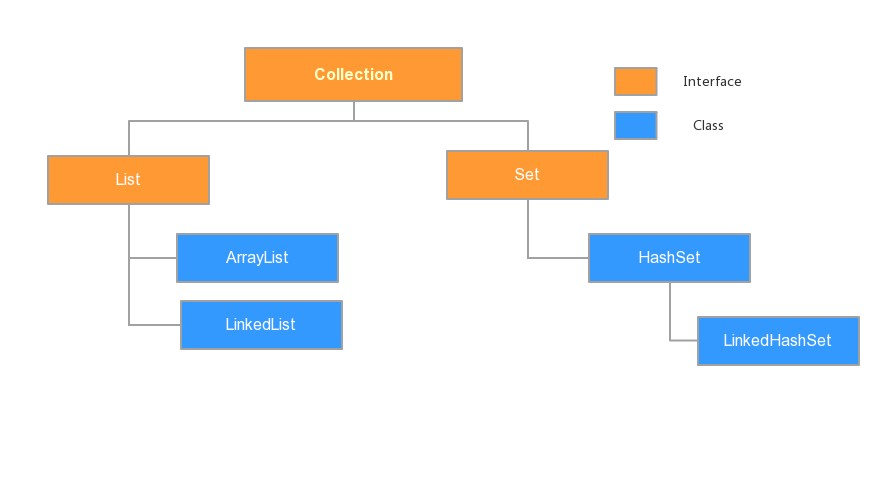

> <strong>本专栏将从基础开始，循序渐进，由浅入深讲解Java的基本使用，希望大家都能够从中有所收获，也请大家多多支持。</strong>
> <strong>专栏地址:[26天高效学习Java编程](https://blog.csdn.net/learning_xzj/category_11806176.html) </strong>
> <strong>相关软件地址:[软件地址](https://pan.baidu.com/s/1bXCZR0yxN2-v6NqDpe4H1g?pwd=1111) </strong>
> <strong>所有代码地址:[代码地址](https://gitee.com/codinginn/java-code) </strong>
> <strong> 如果文章知识点有错误的地方，请指正！大家一起学习，一起进步。</strong>
> <font color="red"><strong> 如果感觉博主的文章还不错的话，还请关注、点赞、收藏三连支持一下博主哦</strong></font>

@[toc]


**本文内容**

- Collection集合
  - 单列集合的继承体系
  - 常用方法
- 迭代器
  - 增强for循环
- 泛型
  - 使用泛型
- List集合
  - List集合的特点
  - 常用方法

# 第一章 Collection集合

## 知识点-- 集合概述

### 目标:

- 在前面我们学习过并使用过集合ArrayList<E> ,那么集合到底是什么呢?

### 讲解:

- **集合**：集合是java中提供的一种容器，可以用来存储多个引用数据类型的数据。

集合和数组既然都是容器，它们有什么区别呢？

- 数组的长度是固定的。集合的长度是可变的。
- 集合存储的都是引用数据类型。如果想存储基本类型数据需要存储对应的包装类类型。

## 知识点-- 单列集合常用类的继承体系

### 目标:

- 单列集合常用类的继承体系

### 讲解:

Collection：是单列集合类的根接口，用于存储一系列符合某种规则的元素，它有两个重要的子接口,分别是

- `java.util.List:` **List的特点是元素有序、元素可重复 ;** 
  - `List`接口的主要实现类有`java.util.ArrayList`和`java.util.LinkedList`，
- `java.util.Set:` **Set的特点是元素不可重复**。
  - `Set`接口的主要实现类有`java.util.HashSet`和`java.util.LinkedHashSet`，`java.util.TreeSet`。

为了便于初学者进行系统地学习，接下来通过一张图来描述集合常用类的继承体系



### 小结

- **注意**:上面这张图只是我们常用的集合有这些，不是说就只有这些集合。

- ```java
  单列集合常用类的继承体系:
  	Collection集合:接口,是所有单列集合的顶层父接口,该集合中的方法可以被所有单列集合共享
      	List集合: 接口,元素可重复,元素有索引,元素存取有序
  		ArrayList集合: 实现类,查询快,增删慢
  		LinkedList集合: 实现类,查询慢,增删快
  
          Set集合: 接口, 元素不可重复(唯一),元素无索引
              HashSet集合: 实现类,元素存取无序
              LinkedHashSet集合:实现类,元素存取有序
              TreeSet集合:实现类,可以对集合中的元素进行排序
  ```

  

## 知识点-- Collection 常用功能

### 目标:

- Collection是所有单列集合的父接口，因此在Collection中定义了单列集合(List和Set)通用的一些方法，这些方法可用于操作所有的单列集合。

### 讲解:

Collection是所有单列集合的父接口，因此在Collection中定义了单列集合(List和Set)通用的一些方法，这些方法可用于操作所有的单列集合。方法如下：

- `public boolean add(E e)`：  把给定的对象添加到当前集合中 。
- `public void clear()` :清空集合中所有的元素。
- `public boolean remove(E e)`: 把给定的对象在当前集合中删除。
- `public boolean contains(Object obj)`: 判断当前集合中是否包含给定的对象。
- `public boolean isEmpty()`: 判断当前集合是否为空。
- `public int size()`: 返回集合中元素的个数。
- `public Object[] toArray()`: 把集合中的元素，存储到数组中

> tips: 有关Collection中的方法可不止上面这些，其他方法可以自行查看API学习。

```java


import java.util.ArrayList;
import java.util.Arrays;
import java.util.Collection;


public class Test {
    public static void main(String[] args) {
        /*
            Collection<E>常用方法:
                - public boolean add(E e)：  把给定的对象添加到当前集合中 。
                - public void clear() :清空集合中所有的元素。
                - public boolean remove(E e): 把给定的对象在当前集合中删除。
                - public boolean contains(Object obj): 判断当前集合中是否包含给定的对象。
                - public boolean isEmpty(): 判断当前集合是否为空。
                - public int size(): 返回集合中元素的个数。
                - public Object[] toArray(): 把集合中的元素，存储到数组中
         */
        // 创建Collection集合对象,限制集合中元素的类型为String
        Collection<String> col = new ArrayList<>();

        // 往col集合中添加元素
        col.add("aaa");
        col.add("bbb");
        col.add("ccc");
        col.add("ddd");

        System.out.println("col集合:"+col);// col集合:[aaa, bbb, ccc, ddd]

        // 清空集合中所有的元素
        //col.clear();
        //System.out.println("col集合:"+col);// col集合:[]

        // 删除aaa这个元素
        col.remove("aaa");
        System.out.println("col集合:"+col);// col集合:[bbb, ccc, ddd]

        // 判断col集合中是否包含aaa这个元素
        boolean res1 = col.contains("aaa");
        System.out.println("res1:"+res1);// false
        // 判断col集合中是否包含bbb这个元素
        boolean res2 = col.contains("bbb");
        System.out.println("res2:"+res2);// true

        //判断当前集合是否为空。(判断集合中是否有元素)
        boolean res3 = col.isEmpty();
        System.out.println("res3:"+res3);// false
        /*col.clear();// 清空元素
        boolean res4 = col.isEmpty();
        System.out.println("res4:"+res4);// true*/

        // 获取集合中元素的个数
        System.out.println("集合中元素的个数:"+col.size());// 3

        // 把集合中的元素，存储到数组中
        Object[] arr = col.toArray();
        System.out.println(Arrays.toString(arr));// [bbb, ccc, ddd]
    }
}

```

# 第二章 Iterator迭代器

## 知识点-- Iterator接口

### 目标:

- 在程序开发中，经常需要遍历单列集合中的所有元素。针对这种需求，JDK专门提供了一个接口`java.util.Iterator`。

#### 迭代的概念

**迭代**：即Collection集合元素的通用获取方式。在取元素之前先要判断集合中有没有元素，如果有，就把这个元素取出来，继续再判断，如果还有就再取出来。一直把集合中的所有元素全部取出。这种取出方式专业术语称为迭代。

#### 获取迭代器对象

Collection集合提供了一个获取迭代器的方法：

- `public Iterator iterator()`: 获取集合对应的迭代器，用来遍历集合中的元素的。

#### Iterator接口的常用方法

- `public E next()`:返回迭代的下一个元素。
- `public boolean hasNext()`:如果仍有元素可以迭代，则返回 true。

##### 案例演示

```java
import java.util.ArrayList;
import java.util.Collection;
import java.util.Iterator;

public class Test {
    public static void main(String[] args) {
        /*
            迭代：即Collection集合元素的通用获取方式。
                  在取元素之前先要判断集合中有没有元素，
                  如果有，就把这个元素取出来，继续再判断，如果还有就再取出来。
                  一直把集合中的所有元素全部取出。这种取出方式专业术语称为迭代。
            获取迭代器对象: 使用Collection集合中的iterator()方法
                    public Iterator<E> iterator();

            判断集合中是否有元素可以迭代: 使用Iterator接口中的方法
                    public boolean hasNext();

            取出集合中可以迭代的元素: 使用Iterator接口中的方法
                    public E next();

         */
        // 创建Collection集合对象,限制集合中元素的类型为String
        Collection<String> col = new ArrayList<>();

        // 往col集合中添加元素
        col.add("aaa");
        col.add("bbb");
        col.add("ccc");
        col.add("ddd");

        // 获取迭代器对象
        Iterator<String> it = col.iterator();

        // 循环判断集合中是否有元素可以迭代
        while (it.hasNext()){
            // 说明有元素可以迭代
            String e = it.next();
            System.out.println(e);
        }
    }
}

```

## 知识点-- 迭代器的常见问题 

### 目标

- 理解迭代器的常见问题

#### 常见问题一

- 在进行集合元素获取时，如果集合中已经没有元素可以迭代了，还继续使用迭代器的next方法，将会抛出java.util.NoSuchElementException没有集合元素异常。

  ```java
  
  
  import java.util.ArrayList;
  import java.util.Collection;
  import java.util.Iterator;
  
  public class Test1 {
      public static void main(String[] args) {
          /*
              迭代器的常见问题 :
                  问题一:在进行集合元素获取时，如果集合中已经没有元素可以迭代了，还继续使用迭代器的next方法，
                         将会抛出java.util.NoSuchElementException没有集合元素异常。
           */
          // 创建Collection集合对象,限制集合中元素的类型为String
          Collection<String> col = new ArrayList<>();
  
          // 往col集合中添加元素
          col.add("aaa");
          col.add("bbb");
          col.add("ccc");
          col.add("ddd");
  
          // 获取集合的迭代器对象
          Iterator<String> it = col.iterator();
  
          // 循环判断集合中是否有元素可以迭代
          while (it.hasNext()) {
              // 获取可以迭代的元素
              String e = it.next();
              System.out.println(e);
          }
  
          System.out.println("====================================");
  
          // 再获取集合中的元素
          //String next = it.next();// 运行异常NoSuchElementException
          // 如果迭代完了,还想继续迭代集合元素,就可以重新再获取一个迭代器
          Iterator<String> it2 = col.iterator();
          while (it2.hasNext()) {
              System.out.println(it2.next());
          }
      }
  }
  
  ```

- 解决办法: 如果还需要重新迭代,那么就重新获取一个新的迭代器对象进行操作

#### 常见问题二

- 在进行集合元素迭代时，如果添加或移除集合中的元素 , 将无法继续迭代 , 将会抛出ConcurrentModificationException并发修改异常.

  ```java
  
  
  import java.util.ArrayList;
  import java.util.Collection;
  import java.util.Iterator;
  
  
  public class Test {
      public static void main(String[] args) {
          /*
              迭代器的常见问题:
               问题二:在进行集合元素迭代时，如果添加或移除集合中的元素 ,
                     将无法继续迭代 , 将会抛出ConcurrentModificationException并发修改异常.
           */
          // 创建Collection集合对象,限制集合中元素的类型为String
          Collection<String> col = new ArrayList<>();
  
          // 往col集合中添加元素
          col.add("aaa");
          col.add("bbb");
          col.add("ccc");
          col.add("ddd");
          col.add("eee");
          col.add("aaa");
          col.add("aaa");
  
          // 获取集合的迭代器对象
          Iterator<String> it = col.iterator();
  
          // 循环判断集合中是否有元素可以迭代
          while (it.hasNext()) {
              // 获取可以迭代的元素
              String e = it.next();
              System.out.println(e);
              // 添加元素到集合中
  //            col.add("eee");// 报异常
              // 删除元素
              //col.remove(e);// 报异常
              // 如果迭代出来的元素是aaa,就删除
              if (e.equals("aaa")){
                  it.remove();
              }
          }
  
          System.out.println("集合:"+col);
      }
  }
  
  ```

## 知识点-- 迭代器的实现原理

### 目标:

- 迭代器的实现原理

### 讲解:

​        我们在之前案例已经完成了Iterator遍历集合的整个过程。当遍历集合时，首先通过调用t集合的iterator()方法获得迭代器对象，然后使用hashNext()方法判断集合中是否存在下一个元素，如果存在，则调用next()方法将元素取出，否则说明已到达了集合末尾，停止遍历元素。

​        Iterator迭代器对象在遍历集合时，内部采用指针的方式来跟踪集合中的元素。在调用Iterator的next方法之前，迭代器的索引位于第一个元素之前，不指向任何元素，当第一次调用迭代器的next方法后，迭代器的索引会向后移动一位，指向第一个元素并将该元素返回，当再次调用next方法时，迭代器的索引会指向第二个元素并将该元素返回，依此类推，直到hasNext方法返回false，表示到达了集合的末尾，终止对元素的遍历。

## 知识点-- 增强for

### 目标:

- 增强for循环

### 讲解:

增强for循环(也称for each循环)是**JDK1.5**以后出来的一个高级for循环，专门用来遍历数组和集合的。它的内部原理其实是个Iterator迭代器，所以在遍历的过程中，不能对集合中的元素进行增删操作。

格式：

```java
for(元素的数据类型  变量 : Collection集合or数组){ 
  	//写操作代码
}
```

它用于遍历Collection和数组。通常只进行遍历元素，不要在遍历的过程中对集合元素进行增删操作。

代码演示

```java


import java.util.ArrayList;
import java.util.Collection;
import java.util.Iterator;


public class Test {
    public static void main(String[] args) {
        /*
            概述:增强for循环(也称for each循环)是JDK1.5以后出来的一个高级for循环，专门用来遍历数组和集合的。
                它的内部原理其实是个Iterator迭代器，所以在遍历的过程中，不能对集合中的元素进行增删操作。
            格式:
                for(元素的数据类型 变量名 :  数组名\集合名){

                }
         */
        // 创建Collection集合对象,限制集合中元素的类型为String
        Collection<String> col = new ArrayList<>();

        // 往col集合中添加元素
        col.add("aaa");
        col.add("bbb");
        col.add("ccc");
        col.add("ddd");

        // 增强for循环遍历
        for (String e : col) {
            System.out.println(e);
        }

        System.out.println("======================================");

        String[] arr = {"aaa",
                "bbb",
                "ccc",
                "ddd"};

        for (String e : arr){
            System.out.println(e);
        }

        System.out.println("======================================");
        // 增强for循环快捷键: 数组名\集合名.for
        for (String s : col) {
            System.out.println(s);
        }
        System.out.println("=======================================");
        for (String s : arr) {
            System.out.println(s);
        }

        System.out.println("=======================================");
        Iterator<String> it = col.iterator();
        // 迭代器快捷键: itit 回车
        while (it.hasNext()) {
            String next = it.next();
            System.out.println(next);
        }

        System.out.println("=======================================");
        // 在遍历的过程中，不能对集合中的元素进行增删操作。
        /*for (String s : col) {
            if (s.equals("aaa")) {
                col.remove(s);
            }
        }*/
    }
}

```

> tips: 
>
> 增强for循环必须有被遍历的目标，目标只能是Collection或者是数组；
>
> 增强for（迭代器）仅仅作为遍历操作出现，不能对集合进行增删元素操作，否则抛出ConcurrentModificationException并发修改异常 

### 小结

- Collection是所有单列集合的根接口，如果要对单列集合进行遍历，通用的遍历方式是迭代器遍历或增强for遍历。

# 第三章 泛型

## 知识点--  泛型的作用

### 目标:

- 理解泛型的作用

### 讲解:

- 集合不使用泛型的时候，存的时候什么类型都能存，但是等取出的时候我们可能不知道当时存的是什么类型了,如下所示:

  ```java
  
  
  import java.util.ArrayList;
  
  
  public class Test1 {
      public static void main(String[] args) {
          /*
              泛型的作用:
                  - 集合不使用泛型: 集合不使用泛型的时候，存的时候什么类型都能存。但是取的时候就懵逼了。取出来啥也不是。
           */
          // 集合不使用泛型
          // 创建ArrayList集合对象
          ArrayList list1 = new ArrayList();
  
          // 往集合中添加元素
          list1.add("aaa");
          list1.add("bbb");
          list1.add(100);
          list1.add(3.14);
          System.out.println(list1);
  
          // 循环遍历集合元素
          for (Object obj : list1) {
              // 在循环中,获取姓名的长度,打印输出
              String name = (String)obj;// 很容易出现类型转换异常
              System.out.println("姓名的长度:"+name.length());
          }
      }
  }
  
  ```

- 使用泛型

  - 使用泛型在编译期直接对类型作出了控制，只能存储泛型定义的数据

  ```java
  
  
  import java.util.ArrayList;
  
  public class Test2 {
      public static void main(String[] args) {
          /*
              泛型的作用:
                  - 集合使用泛型:使用泛型在编译期直接对类型作出了控制，只能存储泛型定义的数据
           */
          // 集合使用泛型
          // 创建ArrayList集合对象,限制集合中元素的类型为String
          ArrayList<String> list1 = new ArrayList<>();
  
          // 往集合中添加元素
          list1.add("杨颖");
          list1.add("迪丽热巴");
          //list1.add(100);// 编译报错
          //list1.add(3.14);// 编译报错
          System.out.println(list1);
  
          // 循环遍历集合元素
          for (String s : list1) {
              System.out.println(s.length());
          }
      }
  }
  
  ```

- **泛型**：定义的时候表示一种未知的数据类型,在使用的时候确定其具体的数据类型。

> tips:泛型的作用是在创建对象时，将未知的类型确定具体的类型。当没有指定泛型时，默认类型为Object类型。

## 知识点--定义和使用含有泛型的类

### 目标

- 定义和使用含有泛型的类

### 讲解

#### 定义含有泛型的类

定义格式：

```
修饰符 class 类名<代表泛型的变量> {  }
代表泛型的变量: 可以是任意字母  例如: T,E...
```

泛型在定义的时候不具体类型，使用的时候才具体类型。在使用的时候确定泛型的具体数据类型。

```java
class ArrayList<E>{ 
    public boolean add(E e){ }

    public E get(int index){ }
   	....
}
```

#### 确定泛型具体类型

**在创建对象的时候确定泛型**

 例如，`ArrayList<String> list = new ArrayList<String>();`

此时，变量E的值就是String类型,那么我们的类型就可以理解为：

```java 
class ArrayList<String>{ 
     public boolean add(String e){ }

     public String get(int index){  }
     ...
}
```

- 定义含有泛型的类

```java

public class MyArrayList<E> {

    E e;

    public E method(E e){
        return e;
    }

}

```

- 使用含有泛型的类

```java

public class Test {
    public static void main(String[] args) {
        /*
            定义含有泛型的类:
                public class 类名<泛型变量>{

                }
                泛型变量的位置: 写任意字母,例如:A,B,C,D,E,...a,b,c,...但为了提高可读性，大家还是用有意义的字母比较好，一般来讲，在不同的情境下使用的字母意义如下：
               E — Element，常用在java Collection里，如：List,Iterator,Set
		K,V — Key，Value，代表Map的键值对
		N — Number，数字
		T — Type，类型，如String，Integer等等
		这里一般用E

            使用含有泛型的类: 创建该类对象的时候,确定该类泛型的具体数据类型

            什么时候定义泛型的类:
                当类中的成员变量或者成员方法的形参类型\返回值类型不确定的时候,就可以把该类定义为含有泛型的类
         */
        MyArrayList<String> list1 = new MyArrayList<>();
        list1.e = "hasnnode";
        String res1 = list1.method("hashnode");
        System.out.println("res1:"+res1);// hashnode

        System.out.println("=======================================");

        MyArrayList<Integer> list2 = new MyArrayList<>();
        list2.e = 100;
        Integer res2 = list2.method(10);
        System.out.println("res2:"+res2);// 10

    }
}

```


## 知识点--定义和使用含有泛型的方法

### 目标

- 定义和使用含有泛型的方法

#### 定义含有泛型的方法

定义格式：

```
修饰符 <代表泛型的变量> 返回值类型 方法名(参数){  }
```

例如，

```java

public class Test {
    // 定义含有泛型的方法
    public static <T> T method1(T t){
        return t;
    }
}

```

#### 确定泛型具体类型

**调用方法时，确定泛型的类型**

```java

public class Test {
    public static void main(String[] args) {
        /*
            泛型变量的位置: 写任意字母,例如:A,B,C,D,E,...a,b,c,...但为了提高可读性，大家还是用有意义的字母比较好，一般来讲，在不同的情境下使用的字母意义如下：
               E — Element，常用在java Collection里，如：List,Iterator,Set
		K,V — Key，Value，代表Map的键值对
		N — Number，数字
		T — Type，类型，如String，Integer等等
		这里一般用T
         */
        Integer i1 = method1(100);// 指定泛型的具体数据类型为Integer
        System.out.println(i1);// 100

        System.out.println("============================");
        String s = method1("hashnode");// 指定泛型的具体数据类型为String
        System.out.println(s);// hashnode
    }

    // 定义含有泛型的方法
    public static <T> T method1(T t){
        return t;
    }
}

```

## 知识点--定义和使用含有泛型的接口

### 目标

- 定义和使用含有泛型的接口

### 路径

- 定义含有泛型的接口
- 确定泛型具体类型

### 讲解

#### 定义含有泛型的接口

定义格式：

```
修饰符 interface接口名<代表泛型的变量> {  }
```

例如，

```java

public interface IA<E> {

    public abstract void method1(E e);

    public default E method2(E e){
        return e;
    }
}

```

#### 确定泛型具体类型

使用格式：

**1、定义实现类时确定泛型的类型**

例如

```java

// 通过实现类的方式确定接口泛型的具体数据类型
public class Imp1 implements IA<String> {
    @Override
    public void method1(String s) {

    }

    @Override
    public String method2(String s) {
        return null;
    }
}

```

此时，泛型E的值就是String类型。

 **2、始终不确定泛型的类型，直到创建对象时，确定泛型的类型**

- 实现类实现接口:

```java

// 实现类实现接口的时候不确定接口泛型的具体数据类型,
// 而是创建实现类对象的时候确定接口泛型的具体数据类型
public class Imp2<E> implements IA<E> {
    @Override
    public void method1(E e) {
        System.out.println("实现类 method1");
    }

    @Override
    public E method2(E e) {
        return e;
    }
}

```

确定泛型：

```java

public class Test {
    public static void main(String[] args) {
        /*
            定义含有泛型的接口:
                public interface 接口名<泛型变量>{

                }

                泛型变量的位置: 写任意字母,例如:A,B,C,D,E,...a,b,c,...但为了提高可读性，大家还是用有意义的字母比较好，一般来讲，在不同的情境下使用的字母意义如下：
               E — Element，常用在java Collection里，如：List,Iterator,Set
		K,V — Key，Value，代表Map的键值对
		N — Number，数字
		T — Type，类型，如String，Integer等等
		这里一般用E

            使用含有泛型的接口: 确定接口泛型的具体数据类型
                1.通过实现类的方式确定接口泛型的具体数据类型
                    public class 类名 implements 接口名<具体的数据类型>{

                    }

                2.实现类实现接口的时候不确定接口泛型的具体数据类型,
                  而是创建实现类对象的时候确定接口泛型的具体数据类型
                   public class 类名<泛型变量> implements 接口名<泛型变量>{

                    }
         */
        // 创建实现类对象的时候确定接口泛型的具体数据类型
        Imp2<String> imp1 = new Imp2<>();
        imp1.method1("hashnode1");
        String s1 = imp1.method2("hashnode2");
        System.out.println(s1);// hashnode2

        System.out.println("==========================");
        Imp2<Integer> imp2 = new Imp2<>();
        imp2.method1(100);
        Integer i = imp2.method2(100);
        System.out.println(i);// 100

    }
}

```

### 小结

- 泛型是一种未知的数据类型，定义在类上的泛型，使用类的时候会确定泛型的类型，定义在方法上的泛型，会在使用方法的时候确定泛型，定义在接口上的泛型，需要使用接口的时候确定泛型。

## 泛型的小结

```java
泛型：定义的时候表示一种未知的数据类型,在使用的时候确定其具体的数据类型。
使用含有泛型的类:  创建该类对象的时候,指定泛型的具体数据类型
使用含有方向的方法: 调用该方法的时候,确定泛型的具体数据类型
使用含有泛型的接口:
        1.创建实现类实现接口的时候,指定泛型的具体数据类型
        2.创建实现类实现接口的时候,不知道泛型的具体数据类型,而是创建实现类对象的时候指定泛型的具体数据类型
```

## 知识点--  泛型通配符

### 目标:

- 能够使用泛型通配符

#### 通配符基本使用

泛型的通配符:**不知道使用什么类型来接收的时候,此时可以使用?,?表示未知通配符。**

此时只能接受数据,不能往该集合中存储数据。

例如:

```java


import java.util.ArrayList;

public class Test {
    public static void main(String[] args) {
        /*
            通配符基本使用:
                泛型的通配符:不知道使用什么类型来接收的时候,此时可以使用?,?表示未知通配符。
                注意: 不能往该集合中存储数据,只能获取数据.
         */
        // 关系:String继承Object,Integer继承Number,Number继承Objec
        ArrayList<Object> list1 = new ArrayList<>();
        ArrayList<String> list2 = new ArrayList<>();
        ArrayList<Integer> list3 = new ArrayList<>();
        ArrayList<Number> list4 = new ArrayList<>();

        list2.add("hashnode");

        //method1(list1);
        method1(list2);
        //method1(list3);
        //method1(list4);

        //method2(list1);
        method2(list2);
        //method2(list3);
        //method2(list4);

        // 泛型没有多态
        //ArrayList<Object> list = new ArrayList<String>();// 编译报错
    }
    // 定义一个方法,可以接收以上4个集合
    public static void method1(ArrayList list){
        Object obj = list.get(0);
        list.add("jack");
        System.out.println("obj:"+obj);// hashnode
        System.out.println("list:"+list);// [hashnode, jack]
    }

    public static void method2(ArrayList<?> list){
        Object obj = list.get(0);
        //list.add("jack");// 如果传入的是 ArrayList<Integer>执行会报错
        System.out.println("obj:"+obj);// hashnode
        System.out.println("list:"+list);// [hashnode]
    }
}

```

#### 通配符高级使用----受限泛型

之前设置泛型的时候，实际上是可以任意设置的，只要是类就可以设置。但是在JAVA的泛型中可以指定一个泛型的**上限**和**下限**。

**泛型的上限**：

- **格式**： `类型名称 <? extends 类 > 对象名称`
- **意义**： `只能接收该类型及其子类`

**泛型的下限**：

- **格式**： `类型名称 <? super 类 > 对象名称`
- **意义**： `只能接收该类型及其父类型`

比如：现已知Object类，String 类，Number类，Integer类，其中Number是Integer的父类

```java


import java.util.ArrayList;

public class Test {
    public static void main(String[] args) {
        /*
            通配符高级使用----受限泛型:
                上限: <? extends 类名>  只能接收该类类型或者其子类类型
                下限: <? super 类名>   只能接收该类类型或者其父类类型
         */
        // 关系:String继承Object,Integer继承Number,Number继承Objec
        ArrayList<Object> list1 = new ArrayList<>();
        ArrayList<String> list2 = new ArrayList<>();
        ArrayList<Integer> list3 = new ArrayList<>();
        ArrayList<Number> list4 = new ArrayList<>();
        
        method1(list1);
        method1(list2);
        method1(list3);
        method1(list4);
        
        //method2(list1);// 编译报错
        //method2(list2);// 编译报错
        method2(list3);
        method2(list4);


        method3(list1);
        //method3(list2);// 编译报错
        method3(list3);
        method3(list4);
    }

    // 定义一个方法,只可以接收以上list3和list4集合
    public static void method2(ArrayList<? extends Number> list){

    }
    
    // 定义一个方法,只可以接收以上list3和list4,list1集合
    public static void method3(ArrayList<? super Integer> list){

    }
    
    // 定义一个方法,可以接收以上4个集合
    public static void method1(ArrayList<?> list){
       
    }
    // 定义一个方法,可以接收以上4个集合
    public static void method(ArrayList list){

    }
}

```

### 小结

- ?表示泛型通配符，如果要对?泛型通配符的取值范围进行限制，可以使用泛型限定

# 第五章 List接口

## 知识点-- List接口介绍

### 目标:

- 我们掌握了Collection接口的使用后，再来看看Collection接口中的子类，他们都具备那些特性呢？

  接下来，我们一起学习Collection中的常用几个子类（`java.util.List`集合、`java.util.Set`集合）。

### 讲解:

#### List接口的概述

`java.util.List`接口继承自`Collection`接口，是单列集合的一个重要分支，习惯性地会将实现了`List`接口的对象称为List集合。

#### List接口特点

1. 它是一个元素存取有序的集合。例如，存元素的顺序是11、22、33。那么集合中，元素的存储就是按照11、22、33的顺序完成的）。
2. 它是一个带有索引的集合，通过索引就可以精确的操作集合中的元素（与数组的索引是一个道理）。
3. 集合中可以有重复的元素。

> tips:我们在基础班的时候已经学习过List接口的子类java.util.ArrayList类，该类中的方法都是来自List中定义。

## 知识点-- List接口中常用方法

### 目标:

- List作为Collection集合的子接口，不但继承了Collection接口中的全部方法，而且还增加了一些根据元素索引来操作集合的特有方法

### 路径:

- List接口新增常用方法
- List接口新增常用方法的使用

### 讲解:

#### List接口新增常用方法

List作为Collection集合的子接口，不但继承了Collection接口中的全部方法，而且还增加了一些根据元素索引来操作集合的特有方法，如下：

- `public void add(int index, E element)`: 将指定的元素，添加到该集合中的指定位置上。
- `public E get(int index)`:返回集合中指定位置的元素。
- `public E remove(int index)`: 移除列表中指定位置的元素, 返回的是被移除的元素。
- `public E set(int index, E element)`:用指定元素替换集合中指定位置的元素,返回值的更新前的元素。

List集合特有的方法都是跟索引相关。

#### List接口新增常用方法的使用

```java


import java.util.ArrayList;
import java.util.List;

public class Test {
    public static void main(String[] args) {
        /*
            List接口新增常用方法:
                - public void add(int index, E element): 将指定的元素，添加到该集合中的指定位置上。
                - public E get(int index):返回集合中指定位置的元素。
                - public E remove(int index): 移除列表中指定位置的元素, 返回的是被移除的元素。
                - public E set(int index, E element):用指定元素替换集合中指定位置的元素,返回值的更新前的元素
         */
        // 创建list集合,限制集合中元素的类型为String类型
        List<String> list = new ArrayList<>();

        // 往集合中添加一些元素
        list.add("aaa");
        list.add("bbb");
        list.add("ccc");
        System.out.println(list);// [aaa, bbb, ccc]

        // 在索引为1的位置添加ddd
        list.add(1, "ddd");
        System.out.println(list);// [aaa, ddd, ccc, ddd]

        // 获取索引为1的元素
        System.out.println("索引为1的元素:"+list.get(1));// ddd

        // 删除索引为1的元素
        String removeE = list.remove(1);
        System.out.println("被删除的元素:"+removeE);// ddd
        System.out.println(list);//  [aaa, bbb, ccc]

        // 把索引为0的元素替换为eee
        String setE = list.set(0, "eee");
        System.out.println("被替换的元素:"+setE);// aaa
        System.out.println(list);// [eee, bbb, ccc]
    }
}

```

## 知识点-- List的子类

### 目标:

- 了解List接口的实现类

### 讲解:

#### ArrayList集合

`java.util.ArrayList`集合数据存储的结构是数组结构。元素增删慢，查找快，由于日常开发中使用最多的功能为查询数据、遍历数据，所以`ArrayList`是最常用的集合。

许多程序员开发时非常随意地使用ArrayList完成任何需求，并不严谨，这种用法是不提倡的。

#### LinkedList集合

`java.util.LinkedList`集合数据存储的结构是链表结构。方便元素添加、删除的集合。

> LinkedList是一个双向链表，那么双向链表是什么样子的呢，我们用个图了解下


实际开发中对一个集合元素的添加与删除经常涉及到首尾操作，而LinkedList提供了大量首尾操作的方法。这些方法我们作为**了解即可**：

- `public void addFirst(E e)`:将指定元素插入此列表的开头。
- `public void addLast(E e)`:将指定元素添加到此列表的结尾。
- `public E getFirst()`:返回此列表的第一个元素。
- `public E getLast()`:返回此列表的最后一个元素。
- `public E removeFirst()`:移除并返回此列表的第一个元素。
- `public E removeLast()`:移除并返回此列表的最后一个元素。
- `public E pop()`:从此列表所表示的堆栈处弹出一个元素。
- `public void push(E e)`:将元素推入此列表所表示的堆栈。

LinkedList是List的子类，List中的方法LinkedList都是可以使用，这里就不做详细介绍，我们只需要了解LinkedList的特有方法即可。在开发时，LinkedList集合也可以作为堆栈，队列的结构使用。

```java


import java.util.LinkedList;


public class Test {
    public static void main(String[] args) {
        /*
            LinkedList集合特有的方法:
                - public void addFirst(E e):将指定元素插入此列表的开头。
                - public void addLast(E e):将指定元素添加到此列表的结尾。
                - public E getFirst():返回此列表的第一个元素。
                - public E getLast():返回此列表的最后一个元素。
                - public E removeFirst():移除并返回此列表的第一个元素。
                - public E removeLast():移除并返回此列表的最后一个元素。
                - public E pop():从此列表所表示的堆栈处弹出一个元素。 removeFirst()
                - public void push(E e):将元素推入此列表所表示的堆栈。addFirst()
         */
        // 创建LinkedList集合,限制集合元素的类型为String类型
        LinkedList<String> list = new LinkedList<>();

        // 往集合中添加元素
        list.add("aaa");
        list.add("bbb");
        list.add("ccc");
        System.out.println(list);// [aaa, bbb, ccc]

        // 在集合的首尾添加一个元素
        list.addFirst("ddd");
        list.addLast("eee");
        System.out.println(list);//  [aaa, bbb, ccc, ddd, eee]

        // 获取集合的首尾元素
        String firstE = list.getFirst();
        String lastE = list.getLast();
        System.out.println("第一个元素是:"+firstE);// aaa
        System.out.println("最后一个元素是:"+lastE);// eee

        // 删除首尾元素
        String removeFirst = list.removeFirst();
        String removeLast = list.removeLast();
        System.out.println("被删除的第一个元素是:"+removeFirst);// aaa
        System.out.println("被删除的最后一个元素是:"+removeLast);// eee
        System.out.println(list);//  [bbb, ccc, ddd]

        // pop  --->删除第一个元素
        String popE = list.pop();
        System.out.println("被删除的第一个元素是:"+popE);// bbb
        System.out.println(list);// [ccc, ddd]

        // push --->添加一个元素在开头
        list.push("eee");
        System.out.println(list); // [eee, ccc, ddd]
    }
}

```

## 案例---集合综合案例

### 需求:

- 按照斗地主的规则，完成造牌洗牌发牌的动作。
  具体规则：

  使用54张牌打乱顺序,三个玩家参与游戏，三人交替摸牌，每人17张牌，最后三张留作底牌。

### 分析:

- 准备牌：

  牌可以设计为一个ArrayList<String>,每个字符串为一张牌。
  每张牌由花色数字两部分组成，我们可以使用花色集合与数字集合嵌套迭代完成每张牌的组装。
  牌由Collections类的shuffle方法进行随机排序。

- 发牌

  将每个人以及底牌设计为ArrayList<String>,将最后3张牌直接存放于底牌，剩余牌通过对3取模依次发牌。

- 看牌

  直接打印每个集合。

### 实现:

```java


import java.util.ArrayList;
import java.util.Collections;


public class Test {
    public static void main(String[] args) {
        // 1.造牌:
        // 1.1 创建一个pokerBox集合,用来存储54张扑克牌
        ArrayList<String> pokerBox = new ArrayList<>();

        // 1.2 创建一个ArrayList牌面值集合,用来存储13个牌面值
        ArrayList<String> numbers = new ArrayList<>();

        // 1.3 创建一个ArrayList花色集合,用来存储4个花色
        ArrayList<String> colors = new ArrayList<>();

        // 1.4 往牌面值集合中添加13个牌面值
        numbers.add("A");
        numbers.add("K");
        numbers.add("Q");
        numbers.add("J");
        for (int i = 2; i <= 10; i++) {
            numbers.add(i + "");
        }

        // 1.5 往花色集合中添加4个花色
        colors.add("♥");
        colors.add("♠");
        colors.add("♣");
        colors.add("♦");

        // 1.6 添加大小王到存储到pokerBox集合中
        pokerBox.add("大王");
        pokerBox.add("小王");

        // 1.7 花色集合和牌面值集合,循环嵌套
        for (String number : numbers) {
            for (String color : colors) {
                // 1.8 在循环里面创建牌,并添加到pokerBox集合中
                String pai = color + number;
                pokerBox.add(pai);
            }
        }
        // 1.9 打印pokerBox集合
        System.out.println(pokerBox);
        System.out.println(pokerBox.size());

        // 2.洗牌:
        // 使用Collections工具类的静态方法
        // public static void shuffle(List<?> list)
        // 打乱集合元素的顺序
        Collections.shuffle(pokerBox);
        System.out.println("打乱顺序后pokerBox:" + pokerBox);
        System.out.println("打乱顺序后pokerBox.size():" + pokerBox.size());

        // 3.发牌
        // 3.1 创建4个ArrayList集合,分别用来存储玩家1,玩家2,玩家3,底牌的牌
        ArrayList<String> play1 = new ArrayList<>();
        ArrayList<String> play2 = new ArrayList<>();
        ArrayList<String> play3 = new ArrayList<>();
        ArrayList<String> diPai = new ArrayList<>();

        // 3.2 循环遍历打乱顺序之后的牌
        for (int i = 0; i < pokerBox.size(); i++) {
            // 3.3 在循环中,获取遍历出来的牌
            String pai = pokerBox.get(i);
            // 3.4 在循环中,判断遍历出来的牌:
            if (i >= 51) {
                // 3.5 如果该牌的索引是51,52,53,给底牌
                diPai.add(pai);
            } else if (i % 3 == 0) {
                // 3.5 如果该牌的索引%3==0,给玩家1
                play1.add(pai);
            } else if (i % 3 == 1) {
                // 3.5 如果该牌的索引%3==1,给玩家2
                play2.add(pai);
            } else if (i % 3 == 2) {
                // 3.5 如果该牌的索引%3==2,给玩家3
                play3.add(pai);
            }
        }
        // 3.6 打印各自的牌
        System.out.println("玩家1:"+play1+",牌数:"+play1.size());
        System.out.println("玩家2:"+play2+",牌数:"+play2.size());
        System.out.println("玩家3:"+play3+",牌数:"+play3.size());
        System.out.println("底牌:"+diPai);
    }
}

```

# 总结

```java


- 集合与数组的区别
    数组长度是固定的,集合的长度是不固定的,并且集合只能存储引用数据类型
    
- Collection集合的常用功能
     - public boolean add(E e)：  把给定的对象添加到当前集合中 。
    - public void clear() :清空集合中所有的元素。
    - public boolean remove(E e): 把给定的对象在当前集合中删除。
    - public boolean contains(Object obj): 判断当前集合中是否包含给定的对象。
    - public boolean isEmpty(): 判断当前集合是否为空。
    - public int size(): 返回集合中元素的个数。
    - public Object[] toArray(): 把集合中的元素，存储到数组中
    
- 迭代器对集合进行取元素
    Collection集合:  public Iterator iterator();
    Iterator迭代器: 
			public boolean hasNext();
			public E next();

- 能够使用增强for循环遍历集合和数组
    for(元素数据类型 变量名 :  数组名\集合名){}

- 泛型上下限
    上限; <? extends 类名>
    下限: <? super 类名>
        
- 泛型通配符的作用
    ?: 泛型通配符,使用泛型通配符就可以接收一切类型
        
        
- 数组结构特点
    查询快,增删慢
        
- 栈结构特点
    先进后出
        
- 队列结构特点
     先进先出
        
- 单向链表结构特点
     查询慢,增删快
        
- List集合特点
     元素可重复,有索引,元素存取有序
```

