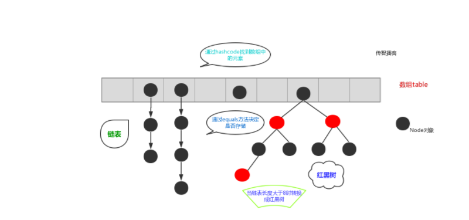

> <strong>本专栏将从基础开始，循序渐进，由浅入深讲解Java的基本使用，希望大家都能够从中有所收获，也请大家多多支持。</strong>
> <strong>专栏地址:[26天高效学习Java编程](https://blog.csdn.net/learning_xzj/category_11806176.html) </strong>
> <strong>相关软件地址:[软件地址](https://pan.baidu.com/s/1bXCZR0yxN2-v6NqDpe4H1g?pwd=1111) </strong>
> <strong>所有代码地址:[代码地址](https://gitee.com/codinginn/java-code) </strong>
> <strong> 如果文章知识点有错误的地方，请指正！大家一起学习，一起进步。</strong>
> <font color="red"><strong> 如果感觉博主的文章还不错的话，还请关注、点赞、收藏三连支持一下博主哦</strong></font>

@[toc]


## 本文内容

- Collections工具类
- Set集合
  - 实现类的使用
- Map集合
  - 常用方法
  - 实现类的使用
- 集合的嵌套
- 综合案例

# 第一章  Collections类

## 知识点-- Collections常用功能

### 目标

- 能够使用集合工具类Collections

### 讲解

- `java.utils.Collections`是集合工具类，用来对集合进行操作。

  常用方法如下：


- `public static void shuffle(List<?> list) `:打乱集合顺序。
- `public static <T> void sort(List<T> list)`:将集合中元素按照默认规则排序。
- `public static <T> void sort(List<T> list，Comparator<? super T> )`:将集合中元素按照指定规则排序。

- shuffle方法代码演示：

```java
import java.util.ArrayList;
import java.util.Collections;
import java.util.List;

public class Test1_shuffle {
    public static void main(String[] args) {
        /*
            Collections常用功能:
                public static void shuffle(List<?> list):打乱集合顺序。
         */
        // 创建List集合,限制集合中元素的类型为Integer类型
        List<Integer> list = new ArrayList<>();

        // 往集合中添加元素
        list.add(300);
        list.add(100);
        list.add(200);
        list.add(500);
        list.add(400);

        System.out.println("打乱顺序之前的集合:"+list);// [300, 100, 200, 500, 400]
        // 打乱顺序
        Collections.shuffle(list); // 随机打乱顺序
        System.out.println("打乱顺序之后的集合:"+list);// [500, 300, 100, 200, 400]

    }
}

```

- sort方法代码演示：按照默认规则排序

```java

public class Student implements Comparable<Student>{
    int age;

    public Student(int age) {
        this.age = age;
    }

    @Override
    public String toString() {
        return "Student{" +
                "age=" + age +
                '}';
    }

    @Override
    public int compareTo(Student o) {
        // 指定排序规则
        // 前减后  升序
        // 后减前  降序
        // 前:this  后: 参数o
        return this.age - o.age;// 升序
    }
}


import java.util.ArrayList;
import java.util.Collections;
import java.util.List;

public class Test2_sort {
    public static void main(String[] args) {
        /*
            Collections常用功能:
                public static <T> void sort(List<T> list):将集合中元素按照默认规则排序。
                默认规则: 事先写好的规则
                排序规则: 集合元素所属的类一定要实现Comparable接口,重写compareTo方法,在compareTo方法中指定排序规则
         */
        // 创建List集合,限制集合中元素的类型为Integer类型
        List<Integer> list = new ArrayList<>();

        // 往集合中添加元素
        list.add(300);
        list.add(100);
        list.add(200);
        list.add(500);
        list.add(400);

        System.out.println("排序之前的集合:"+list); // [300, 100, 200, 500, 400]
        // 将集合中元素按照默认规则排序
        Collections.sort(list);
        System.out.println("排序之后的集合:"+list); // [100, 200, 300, 400, 500]

        System.out.println("=========================================");

        // 创建List集合,限制集合中元素的类型为Student类型
        List<Student> list1 = new ArrayList<>();

        // 往集合中添加元素
        Student stu1 = new Student(19);
        Student stu2 = new Student(18);
        Student stu3 = new Student(20);
        Student stu4 = new Student(17);
        list1.add(stu1);
        list1.add(stu2);
        list1.add(stu3);
        list1.add(stu4);
        System.out.println("排序之前的集合:"+list1);
        // 将集合中元素按照默认规则排序，如果使用的是默认排序，则被排序的类必须实现Comparable<Student>接口
        Collections.sort(list1);
        System.out.println("排序之后的集合:"+list1);


    }
}

```

- sort方法代码块演示: 指定规则排序

```java

import java.util.ArrayList;
import java.util.Collections;
import java.util.Comparator;
import java.util.List;


public class Test3_sort {
    public static void main(String[] args) {
        /*
            Collections常用功能:
             public static <T> void sort(List<T> list，Comparator<? super T> com):将集合中元素按照指定规则排序。
              参数Comparator: 就是用来指定排序规则的
              通过Comparator接口中的compare方法来指定排序规则
         */
        // 创建List集合,限制集合中元素的类型为Integer类型
        List<Integer> list = new ArrayList<>();

        // 往集合中添加元素
        list.add(300);
        list.add(100);
        list.add(200);
        list.add(500);
        list.add(400);

        System.out.println("排序之前的集合:" + list); // [300, 100, 200, 500, 400]
        // 将集合中元素按照指定规则排序---->降序
        Collections.sort(list, new Comparator<Integer>() {
            @Override
            public int compare(Integer o1, Integer o2) {
                // 指定排序规则
                // 前减后  升序
                // 后减前  降序
                // 前: 第一个参数o1  后:第二个参数o2
                return o2 - o1;
            }
        });
        System.out.println("排序之后的集合:" + list); // [500, 400, 300, 200, 100]

        // 将集合中元素按照指定规则排序---->升序
        Collections.sort(list, new Comparator<Integer>() {
            @Override
            public int compare(Integer o1, Integer o2) {
                return o1 - o2;
            }
        });
        System.out.println("排序之后的集合:" + list);// [100, 200, 300, 400, 500]

        System.out.println("=======================================");

        // 创建List集合,限制集合中元素的类型为Student类型
        List<Student> list1 = new ArrayList<>();

        // 往集合中添加元素
        Student stu1 = new Student(19);
        Student stu2 = new Student(18);
        Student stu3 = new Student(20);
        Student stu4 = new Student(17);
        list1.add(stu1);
        list1.add(stu2);
        list1.add(stu3);
        list1.add(stu4);
        System.out.println("排序之前的集合:" + list1);
        // 将集合中元素按照指定规则排序-->按照年龄降序排序
        Collections.sort(list1, new Comparator<Student>() {
            @Override
            public int compare(Student o1, Student o2) {
                // 指定排序规则
                // 前减后  升序
                // 后减前  降序
                // 前: 第一个参数o1  后:第二个参数o2
                return o2.age - o1.age;
            }
        });
        System.out.println("排序之后的集合:" + list1);

        // 将集合中元素按照指定规则排序-->按照年龄升序排序
        Collections.sort(list1, new Comparator<Student>() {
            @Override
            public int compare(Student o1, Student o2) {
                // 指定排序规则
                // 前减后  升序
                // 后减前  降序
                // 前: 第一个参数o1  后:第二个参数o2
                return o1.age - o2.age;
            }
        });
        System.out.println("排序之后的集合:" + list1);
    }
}

```

### 小结

```java
- public static void shuffle(List<?> list):打乱集合顺序。
- public static <T> void sort(List<T> list):将集合中元素按照默认规则排序。
    默认规则: 事先写好的排序规则
    在哪里写好排序规则?---->集合元素所属的类中写好排序规则(通过实现Comparable接口,重写compareTo(T o)方法写好排序规则)
     排序规则: 
		前减后  升序 
    	后减前  降序
    	前: this   后:参数  
            
- public static <T> void sort(List<T> list，Comparator<? super T>  com):将集合中元素按照指定规则排序。
   指定规则排序:  通过Comparator参数来指定
   通过传入Comparator接口的匿名内部类,重写compare(T o1,T o2)方法,在该方法中指定排序规则      
      排序规则: 
		前减后  升序 
    	后减前  降序
    	前: 第一个参数   后:第二个参数    
```

## 知识点-- 可变参数

### 目标

- 能够使用可变参数

### 讲解

#### 可变参数的使用

在**JDK1.5**之后，如果我们定义一个方法需要接受多个参数，并且多个参数类型一致，我们可以对其简化.

**格式：**

```
修饰符 返回值类型 方法名(参数类型... 形参名){  }
```

**代码演示:**

```java

public class Test1 {
    public static void main(String[] args) {
        /*
            可变参数:
                概述:在JDK1.5之后，如果我们定义一个方法需要接受多个参数，并且多个参数类型一致，我们可以对其简化.
                格式:
                    修饰符 返回值类型 方法名(数据类型... 变量名){}

         */
       /* method1(10,20,30,40,50);

        int[] arr = {10,20,30,40,50};
        method2(arr);*/

        /*method3();
        method3(10,20,30,40);*/
        method3(10,20,30,40,50);

       /* int[] arr = {10,20,30,40,50};
        method3(arr);*/
    }

    // 定义一个方法,可以接收5个int类型的数
    public static void method3(int... nums){
        // 使用:把nums可变参数当成数组使用
        for (int i = 0; i < nums.length; i++) {
            System.out.println(nums[i]);
        }
    }

    // 定义一个方法,可以接收5个int类型的数
    public static void method2(int[] arr){// 接收数组
        for (int i = 0; i < arr.length; i++) {
            System.out.println(arr[i]);
        }
    }

    // 定义一个方法,可以接收5个int类型的数
    public static void method1(int num1,int num2,int num3,int num4,int num5){// 接收5个具体的数

    }

}

```

#### 注意事项

​	1.一个方法只能有一个可变参数

​	2.如果方法中有多个参数，可变参数要放到最后。

```java

public class Test2 {
    public static void main(String[] args) {
        /*
            可变注意事项:
                    1.一个方法,只能有一个可变参数
                    2.如果方法有多个参数,可变参数一定要放在末尾
         */
        // method1(10,20,"itheima");
        // method2(10,20,"itheima");
         method3("hashnode",10,20);
    }

    // 编译报错,因为一个方法,只能有一个可变参数
    /*public static void method1(int... nums,String... strs){

    }*/

    // 编译报错,因为如果方法有多个参数,可变参数一定要放在末尾
    /*public static void method2(int... nums,String  str){

    }*/

    public static void method3(String  str,int... nums){

    }
}

```


#### **应用场景: Collections**

​	在Collections中也提供了添加一些元素方法：

​	`public static <T> boolean addAll(Collection<T> c, T... elements)  `:往集合中添加一些元素。

**代码演示:**

```java


import java.util.ArrayList;
import java.util.Collections;


public class Test3 {
    public static void main(String[] args) {
        /*
            应用场景: Collections
                在Collections中也提供了添加一些元素方法：
                public static <T> boolean addAll(Collection<T> c, T... elements):往集合中添加一些元素。
         */
        // 创建ArrayList集合,限制集合元素的类型为String类型
        ArrayList<String> list = new ArrayList<>();

        // 往list集合中添加批量元素
        Collections.addAll(list,"2","A","K","Q","J","10","9","8","7","6","5","4","3");
        System.out.println(list);
    }
}

```

# 第二章 Set接口

## 知识点--Set接口介绍

### 目标

- Set接口介绍

### 讲解

```java
 Set接口:也称Set集合,但凡是实现了Set接口的类都叫做Set集合
	特点: 元素无索引,元素不可重复(唯一)
    HashSet集合: 实现类--元素存取无序
    LinkedHashSet集合:实现类--元素存取有序
    TreeSet集合:实现类--> 对元素进行排序
 注意:
	1.Set集合没有特殊的方法,都是使用Collection接口的方法
    2.Set集合没有索引,所以遍历元素的方式就只有: 增强for循环,或者迭代器
```

## 知识点--HashSet集合

### 目标

- 能够说出HashSet集合的特点

### 讲解

`java.util.HashSet`是`Set`接口的一个实现类，它所存储的元素是不可重复的，并且元素都是无序的(即存取顺序不能保证不一致)。

我们先来使用一下Set集合存储，看下现象，再进行原理的讲解:

```java
public class Test {
    public static void main(String[] args) {
        /*
            HashSet集合: 元素存取无序,元素不可重复,元素无索引
         */
        // 创建HashSet集合对象,限制集合元素的类型为String
        HashSet<String> set = new HashSet<>();

        // 往集合中添加元素
        set.add("nba");
        set.add("cba");
        set.add("bac");
        set.add("abc");
        set.add("nba");

        System.out.println(set);// [cba, abc, bac, nba]
    }
}
```

## 知识点--HashSet集合存储数据的结构（哈希表）

### 目标

- 哈希表底层结构以及HashSet保证元素唯一原理

### 路径

- 哈希表底层结构
- HashSet保证元素唯一原理

### 讲解

##### 哈希表底层结构

在**JDK1.8**之前，哈希表底层采用数组+链表实现，即使用数组处理冲突，同一hash值的链表都存储在一个数组里。但是当位于一个桶中的元素较多，即hash值相等的元素较多时，通过key值依次查找的效率较低。而JDK1.8中，哈希表存储采用数组+链表+红黑树实现，当链表长度超过阈值（8）时，将链表转换为红黑树，这样大大减少了查找时间。

简单的来说，哈希表是由数组+链表+红黑树（JDK1.8增加了红黑树部分）实现的，如下图所示。



##### HashSet保证元素唯一原理

```java
-HashSet集合存储数据的结构---哈希表结构
    哈希表结构:
          jdk8以前: 数组+链表
          jdk8以后: 数组+链表+红黑树
                链表元素个数没有超过8: 数组+链表
                链表元素个数超过8: 数组+链表+红黑树

-HashSet集合保证元素唯一的原理--依赖hashCode()和equals()方法
    1.当存储元素的时候,就会调用该元素的hashCode()方法计算该元素的哈希值
    2.判断该哈希值对应的位置上,是否有元素:
    3.如果该哈希值对应的位置上,没有元素,就直接存储
    4.如果该哈希值对应的位置上,有元素,说明产生了哈希冲突
    5.产生了哈希冲突,就得调用该元素的equals方法,与该位置上的所有元素进行一一比较:
       如果比较的时候,有任意一个元素与该元素相同,那么就不存储
       如果比较完了,没有一个元素与该元素相同,那么就直接存储

补充:
     Object类: hashCode()和equals()方法;
              hashCode():Object类中的hashCode()方法是根据地址值计算哈希值
              equals方法():Object类中的equals()方法是比较地址值
```

```java
public class Demo {
    public static void main(String[] args) {
        // 创建一个HashSet集合,限制集合中元素的类型为String
        HashSet<String> set = new HashSet<>();

        // 往集合中添加一些元素
        set.add("nba");
        set.add("cba");
        set.add("bac");
        set.add("abc");
        set.add("nba");

        // 遍历打印集合
        for (String e : set) {
            System.out.println(e);// cba abc  bac  nba
        }

        System.out.println("nba".hashCode());// nba:108845
        System.out.println("cba".hashCode());// cba:98274
        System.out.println("bac".hashCode());// bac:97284
        System.out.println("abc".hashCode());// abc:96354
    }
}
```


## 扩展 HashSet的源码分析

### 3.4.1 HashSet的成员属性及构造方法

~~~java
public class HashSet<E> extends AbstractSet<E>
    					implements Set<E>, Cloneable, java.io.Serializable{
    
	//内部一个HashMap——HashSet内部实际上是用HashMap实现的
    private transient HashMap<E,Object> map;
    // 用于做map的值
    private static final Object PRESENT = new Object();
    /**
     * 构造一个新的HashSet，
     * 内部实际上是构造了一个HashMap
     */
    public HashSet() {
        map = new HashMap<>();
    }
    
}
~~~

- 通过构造方法可以看出，HashSet构造时，实际上是构造一个HashMap

### 3.4.2 HashSet的add方法源码解析

~~~java
public class HashSet{
    //......
    public boolean add(E e) {
       return map.put(e, PRESENT)==null;//内部实际上添加到map中，键：要添加的对象，值：Object对象
    }
    //......
}
~~~

### 3.4.3 HashMap的put方法源码解析

~~~java
public class HashMap{
    //......
    public V put(K key, V value) {
        return putVal(hash(key), key, value, false, true);
    }
    //......
    static final int hash(Object key) {//根据参数，产生一个哈希值
        int h;
        return (key == null) ? 0 : (h = key.hashCode()) ^ (h >>> 16);
    }
    //......
    final V putVal(int hash, K key, V value, boolean onlyIfAbsent,
                   boolean evict) {
        Node<K,V>[] tab; //临时变量，存储"哈希表"——由此可见，哈希表是一个Node[]数组
        Node<K,V> p;//临时变量，用于存储从"哈希表"中获取的Node
        int n, i;//n存储哈希表长度；i存储哈希表索引
        
        if ((tab = table) == null || (n = tab.length) == 0)//判断当前是否还没有生成哈希表
            n = (tab = resize()).length;//resize()方法用于生成一个哈希表，默认长度：16，赋给n
        if ((p = tab[i = (n - 1) & hash]) == null)//(n-1)&hash等效于hash % n，转换为数组索引
            tab[i] = newNode(hash, key, value, null);//此位置没有元素，直接存储
        else {//否则此位置已经有元素了
            Node<K,V> e; K k;
            if (p.hash == hash &&
                ((k = p.key) == key || (key != null && key.equals(k))))//判断哈希值和equals
                e = p;//将哈希表中的元素存储为e
            else if (p instanceof TreeNode)//判断是否为"树"结构
                e = ((TreeNode<K,V>)p).putTreeVal(this, tab, hash, key, value);
            else {//排除以上两种情况，将其存为新的Node节点
                for (int binCount = 0; ; ++binCount) {//遍历链表
                    if ((e = p.next) == null) {//找到最后一个节点
                        p.next = newNode(hash, key, value, null);//产生一个新节点，赋值到链表
                        if (binCount >= TREEIFY_THRESHOLD - 1) //判断链表长度是否大于了8
                            treeifyBin(tab, hash);//树形化
                        break;
                    }
                    if (e.hash == hash &&
                        ((k = e.key) == key || (key != null && key.equals(k))))//跟当前变量的元素比较，如果hashCode相同，equals也相同
                        break;//结束循环
                    p = e;//将p设为当前遍历的Node节点
                }
            }
            if (e != null) { // 如果存在此键
                V oldValue = e.value;//取出value
                if (!onlyIfAbsent || oldValue == null)
                    e.value = value;//设置为新value
                afterNodeAccess(e);//空方法，什么都不做
                return oldValue;//返回旧值
            }
        }
        ++modCount;
        if (++size > threshold)
            resize();
        afterNodeInsertion(evict);
        return null;
    }
}
~~~


## 知识点--  HashSet存储自定义类型元素

### 1.目标

- 使用HashSet集合存储自定义元素

### 2.讲解

给HashSet中存放自定义类型元素时，需要重写对象中的hashCode和equals方法，建立自己的比较方式，才能保证HashSet集合中的对象唯一.

```java
public class Person{
    /**
     * 姓名
     */
    public String name;
    /**
     * 年龄
     */
    public int age;

    public Person() {
    }

    public Person(String name, int age) {
        this.name = name;
        this.age = age;
    }

    @Override
    public String toString() {
        return "Person{" +
                "name='" + name + '\'' +
                ", age=" + age +
                '}';
    }

    @Override
    public boolean equals(Object o) {
        if (this == o) return true;
        if (o == null || getClass() != o.getClass()) return false;
        Person person = (Person) o;
        return age == person.age &&
                Objects.equals(name, person.name);
    }

    @Override
    public int hashCode() {
        return Objects.hash(name, age);
    }
}

```

创建测试类:

```java
public class Demo {
    public static void main(String[] args) {
        // 创建多个Person对象
        Person p1 = new Person("张三", 18);
        Person p2 = new Person("李四", 38);
        Person p3 = new Person("王五", 28);
        Person p4 = new Person("张三", 18);

        // 创建HashSet集合对象,限制集合中元素的类型为Person
        HashSet<Person> set = new HashSet<>();

        // 往集合中添加Person对象
        set.add(p1);
        set.add(p2);
        set.add(p3);
        set.add(p4);

        // 遍历打印集合中的元素
        for (Person p : set) {
            System.out.println(p);
        }

        System.out.println(p1.hashCode());
        System.out.println(p2.hashCode());
        System.out.println(p3.hashCode());
        System.out.println(p4.hashCode());
    }
}
```


## 知识点-- LinkedHashSet

### 目标

- 使用LinkedHashSet保证元素怎么存就怎么取,即存取有序

### 路径

- 代码演示

### 讲解

我们知道HashSet保证元素唯一，可是元素存放进去是没有顺序的，那么我们要保证有序，怎么办呢？

在HashSet下面有一个子类`java.util.LinkedHashSet`，它是链表和哈希表组合的一个数据存储结构。

演示代码如下:

```java


import java.util.HashSet;
import java.util.LinkedHashSet;


public class Test {
    public static void main(String[] args) {
        /*
            LinkedHashSet集合: 元素存取有序,元素无索引,元素不可重复(唯一)
                采用哈希表+链表结构，由哈希表保证元素唯一，由链表保证元素存取有序
         */
        // 创建LinkedHashSet集合,限制集合中元素的类型为Integer类型
        LinkedHashSet<Integer> set = new LinkedHashSet<>();// 存取有序
        //HashSet<Integer> set = new HashSet<>();// 存取无序

        // 往集合中存储数据
        set.add(300);
        set.add(100);
        set.add(200);
        set.add(500);
        set.add(400);
        set.add(400);

        System.out.println(set);// [300, 100, 200, 500, 400]
    }
}

```

## 知识点-- TreeSet集合

### 目标

- 知道使用TreeSet集合的特点并能够使用TreeSet集合

### 讲解

#### 特点

TreeSet集合是Set接口的一个实现类,底层依赖于TreeMap,是一种基于**红黑树**的实现,其特点为：

1. 元素唯一
2. 元素没有索引
3. 使用元素的[自然顺序](../../java/lang/Comparable.html)对元素进行排序，或者根据创建 TreeSet 时提供的 [`Comparator`](../../java/util/Comparator.html) 比较器
   进行排序，具体取决于使用的构造方法：

```java
public TreeSet()：								根据其元素的自然排序进行排序
public TreeSet(Comparator<E> comparator):    根据指定的比较器进行排序
```

#### 演示

```java


import java.util.Comparator;
import java.util.LinkedHashSet;
import java.util.TreeSet;


public class Test {
    public static void main(String[] args) {
        /*
            TreeSet集合: 元素无索引,元素唯一,对元素进行排序
                通过构造方法实现排序:
                    public TreeSet()：						     根据其元素的自然排序进行排序
                            默认规则排序:集合元素所属的类需要实现Comparable接口,重写compareTo方法,在compareTo方法中指定默认排序规则

                    public TreeSet(Comparator<E> comparator):    根据指定的比较器进行排序
                            指定规则排序: 通过传入Comparator接口的实现类对象,在实现类对象中重写compare方法,在compare方法中指定排序规则
         */
        // 按照默认规则排序---->默认升序
        // 创建TreeSet集合,限制集合中元素的类型为Integer类型
        TreeSet<Integer> set = new TreeSet<>();

        // 往集合中存储数据
        set.add(300);
        set.add(100);
        set.add(200);
        set.add(500);
        set.add(400);
        set.add(400);
        System.out.println(set);// [100, 200, 300, 400, 500]

        System.out.println("===========================================");
        // 按照指定规则排序---->降序
        // 创建TreeSet集合,限制集合中元素的类型为Integer类型
        TreeSet<Integer> set1 = new TreeSet<>(new Comparator<Integer>() {
            @Override
            public int compare(Integer o1, Integer o2) {
                /*
                    指定排序规则:
                    前减后  升序
                    后减前  降序
                    前:第一个参数  后:第二个参数
                 */
                return o2 - o1;
            }
        });

        // 往集合中存储数据
        set1.add(300);
        set1.add(100);
        set1.add(200);
        set1.add(500);
        set1.add(400);
        set1.add(400);
        System.out.println(set1);// [500, 400, 300, 200, 100]

        System.out.println("===========================================");
        // 按照指定规则排序---->升序
        // 创建TreeSet集合,限制集合中元素的类型为Integer类型
        TreeSet<Integer> set2 = new TreeSet<>(new Comparator<Integer>() {
            @Override
            public int compare(Integer o1, Integer o2) {
                /*
                    指定排序规则:
                    前减后  升序
                    后减前  降序
                    前:第一个参数  后:第二个参数
                 */
                return o1 - o2;
            }
        });

        // 往集合中存储数据
        set2.add(300);
        set2.add(100);
        set2.add(200);
        set2.add(500);
        set2.add(400);
        set2.add(400);
        System.out.println(set2);// [100, 200, 300, 400, 500]
    }
}

```

# 第三章 Map集合

## 知识点-- Map概述

```java
Map<K,V>集合的特点: K用来限制键的类型,V用来限制值的类型
         1.Map集合存储元素是以键值对的形式存储,每一个键值对都有键和值
         2.Map集合的键是唯一,值可以重复,如果键重复了,那么值就会被覆盖
         3.根据键取值

Map集合子类:
    - HashMap<K,V>：存储数据采用的哈希表结构，元素的存取顺序不能保证一致。
                    由于要保证键的唯一、不重复，需要重写键的hashCode()方法、equals()方法。

    - LinkedHashMap<K,V>：HashMap下有个子类LinkedHashMap，存储数据采用的哈希表结构+链表结构。
               通过链表结构可以保证键值对的存取顺序一致；
               通过哈希表结构可以保证的键的唯一、不重复，需要重写键的hashCode()方法、equals()方法。

    - TreeMap<K,V>：TreeMap集合和Map相比没有特有的功能，底层的数据结构是红黑树；
                可以对元素的键进行排序，排序方式有两种:自然排序和比较器排序
```

## 知识点-- Map的常用方法

### 讲解

Map接口中定义了很多方法，常用的如下：

- `public V put(K key, V value)`:  把指定的键与指定的值添加到Map集合中。
- `public V remove(Object key)`: 把指定的键 所对应的键值对元素 在Map集合中删除，返回被删除元素的值。
- `public V get(Object key)` 根据指定的键，在Map集合中获取对应的值。
- `public boolean containsKey(Object key)`:判断该集合中是否有此键
- `public Set<K> keySet()`: 获取Map集合中所有的键，存储到Set集合中。
- `public Set<Map.Entry<K,V>> entrySet()`: 获取到Map集合中所有的键值对对象的集合(Set集合)。

Map接口的方法演示

```java


import java.util.*;

//class Student implements Comparable<Student>{
class Person{
    /**
     * 姓名
     */
    public String name;
    /**
     * 年龄
     */
    public int age;

    public Person() {
    }

    public Person(String name, int age) {
        this.name = name;
        this.age = age;
    }

    @Override
    public String toString() {
        return "Person{" +
                "name='" + name + '\'' +
                ", age=" + age +
                '}';
    }

    @Override
    public boolean equals(Object o) {
        if (this == o) return true;
        if (o == null || getClass() != o.getClass()) return false;
        Person person = (Person) o;
        return age == person.age &&
                Objects.equals(name, person.name);
    }

    @Override
    public int hashCode() {
        return Objects.hash(name, age);
    }
}


public class Test {
    public static void main(String[] args) {
        /*
             Map<K,V>的常用方法:
                - public V put(K key, V value):  把指定的键与指定的值添加到Map集合中。
                - public V remove(Object key): 把指定的键 所对应的键值对元素 在Map集合中删除，返回被删除元素的值。
                - public V get(Object key) 根据指定的键，在Map集合中获取对应的值。

                - public boolean containsKey(Object key):判断该集合中是否有此键
                - public boolean containsValue(Object value):判断该集合中是否有此值

                - public Set<K> keySet(): 获取Map集合中所有的键，存储到Set集合中。
                - public Collection<V> values(): 获取Map集合中所有的值，存储到Collection集合中。

                - public Set<Map.Entry<K,V>> entrySet(): 获取到Map集合中所有的键值对对象的集合(Set集合)。
                    Map.Entry<K,V>:表示键值对对象---把键值对包装成一个对象,该对象的类型就是Entry类型
         */
        // 创建Map集合,限制键的类型为String,值的类型为String
        Map<String, String> map = new HashMap<>();

        // 往map集合中添加键值对
        map.put("b", "2");
        map.put("a", "1");
        map.put("c", "3");
        System.out.println(map);// {a=1, b=2, c=3}

        // Map集合键唯一,如果键重复了,值会覆盖
        String v1 = map.put("a", "4");
        System.out.println("v1:"+v1);// 1
        System.out.println(map);// {a=4, b=2, c=3}

        // Map集合值可以重复
        String v2 = map.put("d", "1");
        System.out.println("v2:"+v2);// null
        System.out.println(map);//{a=4, b=2, c=3, d=1}

        // 删除a这个键对应的键值对
        String v3 = map.remove("a");
        System.out.println("被删除键值对的值:"+v3);// 4
        System.out.println(map);// {b=2, c=3, d=1}

        // 获取b这个键对应的值
        String value = map.get("b");
        System.out.println("value:"+value);// 2

        // 判断是否包含指定的键
        System.out.println(map.containsKey("c"));// true
        System.out.println(map.containsKey("a"));// false

        // 判断是否包含指定的值
        System.out.println(map.containsValue("3"));// true
        System.out.println(map.containsValue("100"));// false

        // 获取所有的键
        Set<String> keys = map.keySet();
        System.out.println("keys:"+keys);// [b, c, d]

        // 获取所有的值
        Collection<String> values = map.values();
        System.out.println("values:"+values);// [2, 3, 1]

        // 获取Map集合中所有键值对对象
        Set<Map.Entry<String, String>> set = map.entrySet();
        System.out.println(set);// [b=2, c=3, d=1]
    }

}

```

> tips:
>
> 使用put方法时，若指定的键(key)在集合中没有，则没有这个键对应的值，返回null，并把指定的键值添加到集合中； 
>
> 若指定的键(key)在集合中存在，则返回值为集合中键对应的值（该值为替换前的值），并把指定键所对应的值，替换成指定的新值。 

## 知识点--Map的遍历

### 目标

- 使用Map的遍历

### 讲解

#### 方式1:键找值方式

通过元素中的键，获取键所对应的值

分析步骤：

1. 获取Map中所有的键，由于键是唯一的，所以返回一个Set集合存储所有的键。方法提示:`keyset()`
2. 遍历键的Set集合，得到每一个键。
3. 根据键，获取键所对应的值。方法提示:`get(K key)`

```java
public class Demo {
    public static void main(String[] args) {
        // 创建Map集合对象,限制键的类型为String,值的类型为String
        Map<String, String> map = new HashMap<>();
        // 往map集合中添加键值对
        map.put("a", "1");
        map.put("b", "2");
        map.put("c", "3");

        // 遍历map集合
        // 获取集合中所有的键  Set<K> keySet()方法
        Set<String> keys = map.keySet();
        // 遍历所有的键的集合
        for (String key : keys) {
            // 在循环中,根据键找值 V get(K key)方法
            String value = map.get(key);
            System.out.println("键:"+key+",值:"+value);
        }
    }
}

```

#### 方式2:键值对方式

```
Entry<K,V>接口:简称Entry项,表示键值对对象,用来封装Map集合中的键值对
Entry<K,V>接口:是Map接口中的内部接口,在外部使用的时候是这样表示: Map.Entry<K,V>

Map集合中提供了一个方法来获取所有键值对对象:
            public Set<Map.Entry<K,V>> entrySet()

根据键值对对对象获取键和值:
            - public K getKey()：获取Entry对象中的键。
            - public V getValue()：获取Entry对象中的值。

Map遍历方式二:根据键值对对象的方式
            1.获取集合中所有键值对对象，以Set集合形式返回。  Set<Map.Entry<K,V>> entrySet()
            2.遍历所有键值对对象的集合，得到每一个键值对(Entry)对象。
            3.在循环中,可以使用键值对对对象获取键和值   getKey()和getValue()
```

```java
public class Demo {
    public static void main(String[] args) {
        // 创建Map集合对象,限制键的类型为String,值的类型为String
        Map<String, String> map = new HashMap<>();
        // 往map集合中添加键值对
        map.put("a", "1");
        map.put("b", "2");
        map.put("c", "3");

        // 获取集合中所有键值对对象  Set<Map.Entry<K,V>> entrySet()
        Set<Map.Entry<String, String>> entrySet = map.entrySet();

        // 遍历所有键值对对象的集合
        for (Map.Entry<String, String> entry : entrySet) {
            // 在循环中,可以使用键值对对对象获取键和值   getKey()和getValue()
            String key = entry.getKey();
            String value = entry.getValue();
            System.out.println("键:"+key+",值:"+value);
        }
    }
}
```

## 知识点--  HashMap存储自定义类型

### 目标

- 使用HashMap存储自定义类型

### 讲解

练习：每位学生（姓名，年龄）都有自己的家庭住址。那么，既然有对应关系，则将学生对象和家庭住址存储到map集合中。学生作为键, 家庭住址作为值。

> 注意，学生姓名相同并且年龄相同视为同一名学生。

编写学生类：

```java
public class Student {
    /**
     * 姓名
     */
    public String name;
    /**
     * 年龄
     */
    public int age;

    public Student() {
    }

    public Student(String name, int age) {
        this.name = name;
        this.age = age;
    }

    @Override
    public String toString() {
        return "Student{" +
                "name='" + name + '\'' +
                ", age=" + age +
                '}';
    }

    @Override
    public boolean equals(Object o) {
        if (this == o) return true;
        if (o == null || getClass() != o.getClass()) return false;
        Student student = (Student) o;
        return age == student.age &&
                Objects.equals(name, student.name);
    }

    @Override
    public int hashCode() {
        return Objects.hash(name, age);
    }
}
```

编写测试类：

```java 
public class Demo {
    public static void main(String[] args) {
        // 创建Map集合,指定键的类型为Student,值的类型为String
        HashMap<Student,String> map = new HashMap<>();

        // 创建多个学生对象
        Student stu1 = new Student("张三", 18);
        Student stu2 = new Student("李四", 38);
        Student stu3 = new Student("王五", 28);
        Student stu4 = new Student("张三", 18);

        // 把学生对象作为键,家庭地址作为值,存储到map集合中
        map.put(stu1,"北京");
        map.put(stu2,"上海");
        map.put(stu3,"深圳");
        map.put(stu4,"广州");

        // 打印map集合
        System.out.println(map);
        System.out.println(map.size());// 3
    }
}
```

- 当给HashMap中存放自定义对象时，如果自定义对象作为key存在，这时要保证对象唯一，必须复写对象的hashCode和equals方法。
- 如果要保证map中存放的key和取出的顺序一致，可以使用`java.util.LinkedHashMap`集合来存放。

## 知识点--LinkedHashMap介绍

### 目标

- 我们知道HashMap保证成对元素唯一，并且查询速度很快，可是成对元素存放进去是没有顺序的，那么我们要保证有序，还要速度快怎么办呢？

### 讲解

- 通过链表结构可以保证元素的存取顺序一致；
- 通过哈希表结构可以保证的键的唯一、不重复，需要重写键的hashCode()方法、equals()方法。

```java


import java.util.LinkedHashMap;

public class Test {
    public static void main(String[] args) {
        /*
            LinkedHashMap: 元素存取有序,键唯一,值可重复
                - 通过链表结构可以保证元素的存取顺序一致；
                - 通过哈希表结构可以保证的键的唯一、不重复，需要重写键的hashCode()方法、equals()方法。
         */
        // 创建LinkedHashMap集合,限制键的类型为Integer,值的类型为String
        LinkedHashMap<Integer, String> map = new LinkedHashMap<>();
        
        // 往map集合中添加键值对
        map.put(300, "深圳");
        map.put(100, "北京");
        map.put(200, "广州");
        map.put(500, "上海");
        map.put(400, "武汉");
        map.put(400, "深圳");
        System.out.println(map);
    }
}

```

## 知识点--TreeMap集合

### 目标

- 使用TreeMap集合

### 讲解

#### TreeMap介绍

TreeMap集合和Map相比没有特有的功能，底层的数据结构是红黑树；可以对元素的**键**进行排序，排序方式有两种:**自然排序**和**比较器排序**；到时使用的是哪种排序，取决于我们在创建对象的时候所使用的构造方法；

#### 构造方法

```java
public TreeMap()									使用自然排序
public TreeMap(Comparator<? super K> comparator) 	   通过比较器指定规则排序
```

#### 案例演示

```java


import java.util.Comparator;
import java.util.LinkedHashMap;
import java.util.TreeMap;


public class Test {
    public static void main(String[] args) {
        /*
            TreeMap集合: 键唯一,值可以重复,如果键重复了,值就覆盖,可以根据键对键值对进行排序
                public TreeMap()									根据键按照默认规则进行排序
                public TreeMap(Comparator<? super K> comparator) 	通过比较器指定规则排序
         */
        // 按照键的默认规则排序: ---->升序
        // 创建TreeMap集合,限制键的类型为Integer,值的类型为String
        TreeMap<Integer, String> map = new TreeMap<>();

        // 往map集合中添加键值对
        map.put(300, "深圳");
        map.put(100, "北京");
        map.put(200, "广州");
        map.put(500, "上海");
        map.put(400, "武汉");
        map.put(400, "深圳");
        System.out.println(map);

        System.out.println("+=================================");

        // 按照指定规则排序: ---->降序
        // 创建TreeMap集合,限制键的类型为Integer,值的类型为String
        TreeMap<Integer, String> map1 = new TreeMap<>(new Comparator<Integer>() {
            @Override
            public int compare(Integer o1, Integer o2) {
                /*
                    前减后: 升序
                    后减前: 降序
                    前:第一个参数  后:第二个参数
                 */
                return o2 - o1;
            }
        });

        // 往map集合中添加键值对
        map1.put(300, "深圳");
        map1.put(100, "北京");
        map1.put(200, "广州");
        map1.put(500, "上海");
        map1.put(400, "武汉");
        map1.put(400, "深圳");
        System.out.println(map1);
    }
}

```

## 案例-- Map集合练习

### 需求

- 输入一个字符串统计该字符串中每个字符出现次数。

### 分析

- 获取一个字符串对象
- 创建一个Map集合，键代表字符，值代表次数。
- 遍历字符串得到每个字符。
- 判断Map中是否有该键。
- 如果没有，第一次出现，存储次数为1；如果有，则说明已经出现过，获取到对应的值进行++，再次存储。     
- 打印最终结果

### 实现

**方法介绍**

`public boolean containKey(Object key)`:判断该集合中是否有此键。

**代码：**

```java

import java.util.HashMap;
import java.util.Scanner;

public class Test {
    public static void main(String[] args) {
        /*
            Map集合练习:输入一个字符串,统计该字符串中每个字符出现次数。
         */
        // 0.输入一个字符串
        Scanner sc = new Scanner(System.in);
        System.out.println("请输入一个字符串:");
        String s = sc.nextLine();

        // 1.创建Map集合,键的类型为Character,值的类型为Integer
        HashMap<Character, Integer> map = new HashMap<>();

        // 2.循环遍历字符串
        for (int i = 0; i < s.length(); i++) {
            // 3.在循环中获取遍历出来的字符
            char c = s.charAt(i);
            // 4.判断集合中是否存在该字符的键
            if (map.containsKey(c)) {
                // 6.如果集合中已存在该字符的键,那么就取出该字符键对应的值,然后自增1,作为新的值,重新存储到Map集合中
                Integer value = map.get(c);
                value++;
                map.put(c, value);
            } else {
                // 5.如果集合中不存在该字符的键,那么就该字符作为键,值为1,存储到Map集合中
                map.put(c, 1);
            }
        }
        // 7.循环结束,打印map集合
        System.out.println(map);
    }
}

```

# 第四章 集合的嵌套

- **总述：任何集合内部都可以存储其它任何集合**

## 知识点--集合的嵌套

### 目标

- 理解集合的嵌套

### 讲解

#### List嵌套List

~~~java
public class Test1 {
    public static void main(String[] args) {
        /*
            集合的嵌套:
                - List嵌套List
                - List嵌套Map
                - Map嵌套Map
            结论:任何集合内部都可以存储其它任何集合
         */
        //  List嵌套List
        // 创建一个List集合,限制元素类型为String
        List<String> list1 = new ArrayList<>();

        // 往集合中添加元素
        list1.add("aa");
        list1.add("bb");
        list1.add("cc");

        // 创建一个List集合,限制元素类型为String
        List<String> list2 = new ArrayList<>();

        // 往集合中添加元素
        list2.add("dd");
        list2.add("ee");
        list2.add("ff");

        // 创建一个List集合,限制元素类型为List集合 (List集合中的元素是List集合)
        List<List<String>> list = new ArrayList<>();
        list.add(list1);
        list.add(list2);

        // 遍历
        for (List<String> e : list) {
            for (String name : e) {
                System.out.println(name);
            }
            System.out.println("=============");
        }

        System.out.println(list);
    }
}


~~~

#### List嵌套Map

~~~java
public class Test2 {
    public static void main(String[] args) {
        /*
            List嵌套Map:

         */
        // 创建Map集合对象
        Map<String,String> map1 = new HashMap<>();
        map1.put("a001","aaa");
        map1.put("a002","bbb");

        // 创建Map集合对象
        Map<String,String> map2 = new HashMap<>();
        map2.put("b001","ccc");
        map2.put("b002","ddd");

        // 创建List集合,用来存储以上2个map集合
        List<Map<String,String>> list = new ArrayList<>();
        list.add(map1);
        list.add(map2);

        System.out.println(list.size()); // 2

        for (Map<String, String> map : list) {
            // 遍历获取出来的map集合对象
            Set<String> keys = map.keySet();// 获取map集合所有的键
            // 根据键找值
            for (String key : keys) {
                System.out.println(key + ","+ map.get(key));
            }
        }

    }
}

~~~

#### Map嵌套Map

~~~java
public class Test3 {
    public static void main(String[] args) {
        /*
            Map嵌套Map:

         */
        // 创建Map集合对象
        Map<String,String> map1 = new HashMap<>();
        map1.put("a001","aaa");
        map1.put("a002","bbb");

        // 创建Map集合对象
        Map<String,String> map2 = new HashMap<>();
        map2.put("b001","ccc");
        map2.put("b002","ddd");

        // 创建Map集合,把以上2个Map集合作为值存储到这个map集合中
        Map<String, Map<String, String>> map = new HashMap<>();

        map.put("A",map1);
        map.put("B",map2);

        System.out.println(map.size());// 2

        // 获取map集合中的所有键
        Set<String> keys = map.keySet();
        // 遍历所有的键
        for (String key : keys) {
            // 根据键找值
            Map<String, String> value = map.get(key);
            // 遍历value这个Map集合
            Set<String> keySet = value.keySet();
            for (String k : keySet) {
                String v = value.get(k);
                System.out.println(k+","+v);
            }
        }
    }
}

~~~

# 第五章 模拟斗地主洗牌发牌

## 需求

按照斗地主的规则，完成洗牌发牌的动作。


具体规则：

1. 组装54张扑克牌
2. 54张牌顺序打乱
3. 三个玩家参与游戏，**三人交替摸牌，每人17张牌**，最后三张留作底牌。
4. 查看三人各自手中的牌（按照牌的大小排序）、底牌

> 规则：手中扑克牌从大到小的摆放顺序：大王,小王,2,A,K,Q,J,10,9,8,7,6,5,4,3

## 分析

1.准备牌：

完成数字与纸牌的映射关系：

使用双列Map(HashMap)集合，完成一个数字与字符串纸牌的对应关系(相当于一个字典)。

2.洗牌：

通过数字完成洗牌发牌

3.发牌：

将每个人以及底牌设计为ArrayList<String>,将最后3张牌直接存放于底牌，剩余牌通过对3取模依次发牌。

存放的过程中要求数字大小与斗地主规则的大小对应。

将代表不同纸牌的数字分配给不同的玩家与底牌。

4.看牌：

通过Map集合找到对应字符展示。

通过查询纸牌与数字的对应关系，由数字转成纸牌字符串再进行展示。


## 实现

```java
package com.itheima04;

import java.util.ArrayList;
import java.util.Collections;
import java.util.HashMap;

public class Test {
    public static void main(String[] args) {
        /*
            模拟斗地主洗牌发牌:
            需求
                按照斗地主的规则，完成洗牌发牌的动作。
                具体规则：
                    1. 组装54张扑克牌
                    2. 54张牌顺序打乱
                    3. 三个玩家参与游戏，三人交替摸牌，每人17张牌，最后三张留作底牌。
                    4. 查看三人各自手中的牌（按照牌的大小排序）、底牌
                    规则：手中扑克牌从大到小的摆放顺序：大王,小王,2,A,K,Q,J,10,9,8,7,6,5,4,3
         */
        // 造牌
        // 1.创建Map集合对象,限制键的类型为Integer,值的类型为String
        HashMap<Integer, String> pokeBox = new HashMap<>();
        // 2.创建一个List集合,表示花色集合,
        ArrayList<String> colors = new ArrayList<>();
        // 3.创建一个List集合,表示牌面值集合
        ArrayList<String> numbers = new ArrayList<>();

        // 4.往花色集合中存储4个花色
        Collections.addAll(colors, "♥", "♦", "♠", "♣");
        // 5.往牌面值集合中存储13个牌面值
        Collections.addAll(numbers, "2", "A", "K", "Q", "J", "10", "9", "8", "7", "6", "5", "4", "3");

        // 6.定义一个int类型的变量,表示牌的编号,初始值为0
        int id = 0;
        // 7.往map集合中添加大王,编号为0,添加完后编号自增1
        pokeBox.put(id++, "大王");

        // 8.往map集合中添加小王,编号为1,添加完后编号自增1
        pokeBox.put(id++, "小王");

        // 9.牌面值的集合和花色集合循环嵌套遍历,注意牌面值集合作为外层循环,花色集合作为内层循环
        for (String number : numbers) {
            for (String color : colors) {
                // 10.在循环中,遍历出来的牌面值和花色组成一张扑克牌
                String pai = color + number;
                // 11.在循环中,编号作为键,扑克牌作为值存储到map集合中,每存储一张牌后,编号自增1
                pokeBox.put(id++,pai);
            }
        }

        System.out.println(pokeBox.size());
        System.out.println(pokeBox);

        //2.洗牌 :--->洗牌的编号
        //2.1 获取所有牌的编号,返回的是所有编号的Set集合
        Set<Integer> keySet = pokeBox.keySet();

        //2.2 创建ArrayList集合,用来存储所有的牌编号
        ArrayList<Integer> idList = new ArrayList<>();

        //2.3 把keySet集合中存储的所有牌编号,存储到这个新的ArrayList集合中
        idList.addAll(keySet);

        //2.4 使用Collections.shuffle方法对新的ArrayList集合中的元素打乱顺序
        Collections.shuffle(idList);
        System.out.println("打乱顺序后的牌编号:"+idList.size());// 54
        System.out.println("打乱顺序后的牌编号:"+idList);


        // 3.发牌-->发牌的编号--->对牌的编号进行从小到大排序---->再根据排好序的编号去map集合中获取牌
        // 3.1 创建4个List集合,分别用来存储玩家一,玩家二,玩家三,底牌得到的牌编号
        ArrayList<Integer> play1Id = new ArrayList<>();
        ArrayList<Integer> play2Id = new ArrayList<>();
        ArrayList<Integer> play3Id = new ArrayList<>();
        ArrayList<Integer> diPaiId = new ArrayList<>();

        // 3.2 循环把打乱顺序的牌编号,按照规律依次发给玩家一,玩家二,玩家三,底牌
        for (int i = 0; i < idList.size(); i++) {
            // 获取牌编号
            Integer paiId = idList.get(i);
            // 三人交替摸牌
            if (i >= 51){
                diPaiId.add(paiId);
            }else if (i%3==0){
                play1Id.add(paiId);
            }else if (i%3==1){
                play2Id.add(paiId);
            }else if (i%3==2){
                play3Id.add(paiId);
            }
        }

        // 3.3 对获取到的牌编号进行从小到大排序
        Collections.sort(play1Id);
        Collections.sort(play2Id);
        Collections.sort(play3Id);
        Collections.sort(diPaiId);

        // 3.4 根据排好序的牌编号去map集合中获取牌
        // 遍历玩家一的牌编号
        System.out.print("玩家一的牌:");
        for (Integer paiId : play1Id) {// 1,2,3,4,5
            String pai = pokeBox.get(paiId);
            System.out.print(pai+" ");
        }

        System.out.println();

        // 遍历玩家二的牌编号
        System.out.print("玩家二的牌:");
        for (Integer paiId : play2Id) {
            String pai = pokeBox.get(paiId);
            System.out.print(pai+" ");
        }

        System.out.println();

        // 遍历玩家三的牌编号
        System.out.print("玩家三的牌:");
        for (Integer paiId : play3Id) {
            String pai = pokeBox.get(paiId);
            System.out.print(pai+" ");
        }

        System.out.println();

        // 遍历底牌的牌编号
        System.out.print("底牌的牌:");
        for (Integer paiId : diPaiId) {
            String pai = pokeBox.get(paiId);
            System.out.print(pai+" ");
        }
    }
}

```

