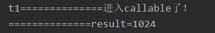
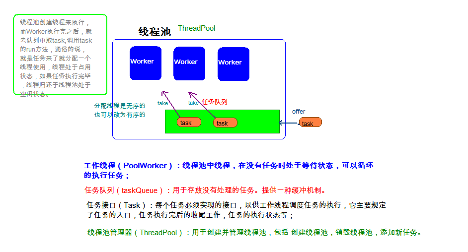

> <strong>本专栏将从基础开始，循序渐进，由浅入深讲解Java的基本使用，希望大家都能够从中有所收获，也请大家多多支持。</strong>
> <strong>专栏地址:[26天高效学习Java编程](https://blog.csdn.net/learning_xzj/category_11806176.html) </strong>
> <strong>相关软件地址:[软件地址](https://pan.baidu.com/s/1bXCZR0yxN2-v6NqDpe4H1g?pwd=1111) </strong>
> <strong>所有代码地址:[代码地址](https://gitee.com/codinginn/java-code) </strong>
> <strong> 如果文章知识点有错误的地方，请指正！大家一起学习，一起进步。</strong>
> <font color="red"><strong> 如果感觉博主的文章还不错的话，还请关注、点赞、收藏三连支持一下博主哦</strong></font>


**JAVA 最难学的部分是哪里？很多朋友都会说：「 java 多线程 」。随着业务量和数据的增加，我们会不可避免地使用多线程的方式处理数据，同时在 Java 职位的面试中，多线程也是必考的高阶知识点之一，可以说，java多线程是衡量一名 Java 程序员是否资深的关键标准之一。今天，我们就来学习一下 Java 多线程的概念吧！本文将详细讲解Java多线程的创建方式、线程状态、高并发、线程安全、Synchronize以及Lock的使用、Volatile关键字、原子类、并发包、线程池的创建以及死锁等。**


@[toc]

# 1 Java多线程创建方式

我们在之前，学习的程序在没有跳转语句的前提下，都是由上至下依次执行，那现在想要设计一个程序，边打游戏边听歌，怎么设计？

要解决上述问题,咱们得使用多进程或者多线程来解决.

## 并发与并行的区别

本节讲解什么是并发和并行

**讲解**

- **并行**：指两个或多个事件在**同一时刻**发生（同时执行）。
- **并发**：指两个或多个事件在**同一个时间段内**发生(交替执行)。


在操作系统中，安装了多个程序，并发指的是在一段时间内宏观上有多个程序同时运行，这在单 CPU 系统中，每一时刻只能有一道程序执行，即微观上这些程序是分时的交替运行，只不过是给人的感觉是同时运行，那是因为分时交替运行的时间是非常短的。

而在多个 CPU 系统中，则这些可以并发执行的程序便可以分配到多个处理器上（CPU），实现多任务并行执行，即利用每个处理器来处理一个可以并发执行的程序，这样多个程序便可以同时执行。目前电脑市场上说的多核 CPU，便是多核处理器，核越多，并行处理的程序越多，能大大的提高电脑运行的效率。

> 注意：单核处理器的计算机肯定是不能并行的处理多个任务的，只能是多个任务在单个CPU上并发运行。同理,线程也是一样的，从宏观角度上理解线程是并行运行的，但是从微观角度上分析却是串行运行的，即一个线程一个线程的去运行，当系统只有一个CPU时，线程会以某种顺序执行多个线程，我们把这种情况称之为线程调度。

## 线程与进程的区别

本节讲解什么是线程与进程

**讲解**

- **进程**：进程是程序的一次执行过程，是系统运行程序的基本单位；系统运行一个程序即是一个进程从创建、运行到消亡的过程。每个进程都有一个独立的内存空间，一个应用程序可以同时运行多个进程；
  -  进程:其实就是应用程序的可执行单元(.exe文件)
  -  每个进程都有一个独立的内存空间，一个应用程序可以同时运行多个进程；
- **线程**：是进程中的一个执行单元，负责当前进程中程序的执行，一个进程中至少有一个线程。一个进程中是可以有多个线程的，这个应用程序也可以称之为多线程程序。
  - 线程:其实就是进程的可执行单元
  - 每条线程都有独立的内存空间,一个进程可以同时运行多个线程；
- 多线程并行: 多条线程在同一时刻同时执行
- **多线程并发:多条线程在同一时间段交替执行**
- **在java中线程的调度是:抢占式调度**
- 在java中只有多线程并发,没有多线程并行(高并发)

**进程**


**线程**


**进程与线程的区别**

- 进程：有独立的内存空间，进程中的数据存放空间（堆空间和栈空间）是独立的，至少有一个线程。
- 线程：堆空间是共享的，栈空间是独立的，线程消耗的资源比进程小的多。

> **注意：**下面内容为了解知识点
>
> 1:因为一个进程中的多个线程是并发运行的，那么从微观角度看也是有先后顺序的，哪个线程执行完全取决于 CPU 的调度，程序员是干涉不了的。而这也就造成的多线程的随机性。
>
> 2:Java 程序的进程里面至少包含两个线程，主进程也就是 main()方法线程，另外一个是垃圾回收机制线程。每当使用 java 命令执行一个类时，实际上都会启动一个 JVM，每一个 JVM 实际上就是在操作系统中启动了一个线程，java 本身具备了垃圾的收集机制，所以在 Java 运行时至少会启动两个线程。
>
> 3:由于创建一个线程的开销比创建一个进程的开销小的多，那么我们在开发多任务运行的时候，通常考虑创建多线程，而不是创建多进程。

**线程调度:**

- 分时调度

  ​	所有线程轮流使用 CPU 的使用权，平均分配每个线程占用 CPU 的时间。

- 抢占式调度

  ​	优先让优先级高的线程使用 CPU，如果线程的优先级相同，那么会随机选择一个(线程随机性)，Java使用的为抢占式调度。

  

##  Thread类构造方法和常用方法

本节讲解Thread类的构造方法和常用方法。

**讲解**

**Thread类的概述**

- 表示线程,也叫做线程类,创建该类的对象,就是创建线程对象(或者说创建线程)
- 线程的任务: 执行一段代码
- Runnable : 接口,线程任务接口

**Thread类的构造方法**

线程开启我们需要用到了`java.lang.Thread`类，API中该类中定义了有关线程的一些方法，具体如下：

- `public Thread()`:分配一个新的线程对象,线程名称是默认生成的。

- `public Thread(String name)`:分配一个指定名字的新的线程对象。

  

- `public Thread(Runnable target)`:分配一个带有指定目标新的线程对象,线程名称是默认生成的。

- `public Thread(Runnable target,String name)`:分配一个带有指定目标新的线程对象并指定名字。


- 创建线程的方式有2种:
  - 一种是通过继承Thread类的方式
  - 一种是通过实现Runnable接口的方法

**Thread类的常用方法**

- `public String getName()`:获取当前线程名称。
- `public void start()`:导致此线程开始执行; Java虚拟机调用此线程的run方法。
- `public void run()`:此线程要执行的任务在此处定义代码。
- `public static void sleep(long millis)`:使当前正在执行的线程以指定的毫秒数暂停（暂时停止执行）。
- `public static Thread currentThread()  `:返回对当前正在执行的线程对象的引用。

翻阅API后得知创建线程的方式总共有两种，一种是继承Thread类方式，一种是实现Runnable接口方式，

## 创建线程方式一_继承Thread

本节讲解如何通过继承Thread创建线程

**讲解**

Java使用`java.lang.Thread`类代表**线程**，所有的线程对象都必须是Thread类或其子类的实例。每个线程的作用是完成一定的任务，实际上就是执行一段程序流即一段顺序执行的代码。Java使用线程执行体来代表这段程序流。Java中通过继承Thread类来**创建**并**启动多线程**的步骤如下：

1. 定义Thread类的子类，并重写该类的run()方法，该run()方法的方法体就代表了线程需要完成的任务,因此把run()方法称为线程执行体。
2. 创建Thread子类的实例，即创建了线程对象
3. 调用线程对象的start()方法来启动该线程

代码如下：

测试类：

```java

public class Test {
    public static void main(String[] args) {
        /*
            补充: java程序至少有2条线程:一条为主线程,一条为垃圾回收线程
            创建线程方式一_继承方式:
                1.创建子类继承Thread类
                2.在子类中重写run方法,把线程需要执行的任务代码放在run方法中
                3.创建子类线程对象
                4.调用start()方法启动线程,执行任务代码
         */
        // 创建子类线程对象
        MyThread mt1 = new MyThread();
        // 调用start()方法启动线程,执行任务代码
        mt1.start();

        for (int j = 0; j < 100; j++) {
            System.out.println("主线程 第"+(j+1)+"次循环");
        }
    }
}

```

自定义线程类：

```java

public class MyThread extends Thread {
    @Override
    public void run() {
        for (int i = 0; i < 100; i++) {
            System.out.println("子线程 第"+(i+1)+"次循环");
        }
    }
}

```

**小结**

```java
创建线程方式一_继承方式:
	1.创建子类继承Thread类
    2.在子类中重写run方法,把线程需要执行的任务代码放在run方法中
    3.创建子类线程对象
    4.调用start()方法启动线程,执行任务代码
```


## 创建线程的方式二_实现Runnable接口

本节讲解如何通过实现Runnable接口的方式创建线程

**讲解**

采用`java.lang.Runnable`也是非常常见的一种，我们只需要重写run方法即可。

步骤如下：

1. 定义Runnable接口的实现类，并重写该接口的run()方法，该run()方法的方法体同样是该线程的线程执行体。
2. 创建Runnable实现类的实例，并以此实例作为Thread的target来创建Thread对象，该Thread对象才是真正的线程对象。
3. 调用线程对象的start()方法来启动线程。

代码如下：

```java

public class MyRunnable implements Runnable {
    @Override
    public void run() {
        // 线程需要执行的任务代码
        for (int i = 0; i < 100; i++) {
            System.out.println("子线程 第"+(i+1)+"次循环");
        }
    }
}

```

```java

public class Test {
    public static void main(String[] args) {
        /*
            创建线程的方式二_实现方式:
                1.创建实现类实现Runnable接口
                2.在实现类中重写run方法,把线程需要执行的任务代码放入run方法中
                3.创建实现类对象
                4.创建Thread线程对象,并传入Runnable接口的实现类对象
                5.调用start()方法启动线程,执行任务
         */
        //创建实现类对象
        MyRunnable mr = new MyRunnable();

        //创建Thread线程对象,并传入Runnable接口的实现类对象
        Thread t1 = new Thread(mr);

        //调用start()方法启动线程,执行任务
        t1.start();


        for (int j = 0; j < 100; j++) {
            System.out.println("主线程 第"+(j+1)+"次循环");
        }
    }
}

```

通过实现Runnable接口，使得该类有了多线程类的特征。run()方法是多线程程序的一个执行目标。所有的多线程代码都在run方法里面。Thread类实际上也是实现了Runnable接口的类。

在启动的多线程的时候，需要先通过Thread类的构造方法Thread(Runnable target) 构造出对象，然后调用Thread对象的start()方法来运行多线程代码。

实际上所有的多线程代码都是通过运行Thread的start()方法来运行的。因此，不管是继承Thread类还是实现Runnable接口来实现多线程，最终还是通过Thread的对象的API来控制线程的，熟悉Thread类的API是进行多线程编程的基础。

> tips:Runnable对象仅仅作为Thread对象的target，Runnable实现类里包含的run()方法仅作为线程执行体。而实际的线程对象依然是Thread实例，只是该Thread线程负责执行其target的run()方法。

## 创建线程的方式三_实现Callable接口

**目标**

+ 学会使用Callable

**讲解**

> **Callable**是一种可以拥有返回值的线程类。 优点： 可以获得任务执行返回值； 通过与Future的结合，可以实现利用Future来跟踪异步计算的结果。

**FutureTask类简介**

> FutureTask是一个可获得返回值的异步计算类！可以调用方法去开始和取消一个计算，可以查询计算是否完成并且获取计算结果，只有当计算完成时才能获取到计算结果，否则就会阻塞！

**Callable接口使用**

1.使用FutureTask的方式

```java
import java.util.concurrent.Callable;
import java.util.concurrent.ExecutionException;
import java.util.concurrent.FutureTask;

class CallableDemo implements Callable<Integer> {

    //和runnable的接口比起来，这是有返回值的接口
    //还可以抛异常
    @Override
    public Integer call() throws Exception {
        System.out.println(Thread.currentThread().getName() + "==============进入callable了！");
        Thread.sleep(3000);
        return 1024;
    }
}

public class Test {

    public static void main(String[] args) throws ExecutionException, InterruptedException {
        //把实现callable的接口当做参数传入futuretask
        FutureTask<Integer> futureTask = new FutureTask<>(new CallableDemo());
        //因为futureTask实现了Runnable接口，像普通的Runnable实现类一样传入Thread就可以了
        Thread t1 = new Thread(futureTask, "t1");
        //正常启动
        t1.start();
        //尝试获取返回结果
        System.out.println("==============result=" + futureTask.get());
    }
}


```

结果如下图所示:



2.使用线程池的方式(理解即可，为了内容连贯性先做介绍，第8节会讲解线程池)

```java


import java.util.concurrent.Callable;

public class MyCallable implements Callable<String> {
    @Override
    public String call() throws Exception {
        System.out.println("任务开始...");
        Thread.sleep(5000);
        System.out.println("任务结束...");
        return "hashnode";
    }
}

//==========================================

import java.util.concurrent.ExecutionException;
import java.util.concurrent.ExecutorService;
import java.util.concurrent.Executors;
import java.util.concurrent.Future;

public class Test2 {
    public static void main(String[] args) throws ExecutionException, InterruptedException {
        // 1.创建线程池,初始化2条线程
        ExecutorService pools = Executors.newFixedThreadPool(2);

        // 2.创建任务
        MyCallable mc = new MyCallable();

        // 3.提交任务,执行任务
        pools.submit(mc);
        pools.submit(mc);
        pools.submit(mc);
        pools.submit(mc);
        pools.submit(mc);
        pools.submit(mc);
        pools.submit(mc);
        Future<String> f = pools.submit(mc);//提交任务并获取callable的返回值
        System.out.println(f.get());

        // 4.销毁线程池(开发中,一般不会)
        pools.shutdown();
    }
}

```


# 2 线程状态

## 线程的6种状态

**目标**

- 理解线程的6种状态

**讲解**

**线程状态概述**

线程由生到死的完整过程：技术素养和面试的要求。

当线程被创建并启动以后，它既不是一启动就进入了执行状态，也不是一直处于执行状态。在线程的生命周期中，有几种状态呢？在API中`java.lang.Thread.State`这个枚举中给出了**六种线程状态**：

这里先列出各个线程状态发生的条件，下面将会对每种状态进行详细解析

| 线程状态                | 导致状态发生条件                                             |
| ----------------------- | ------------------------------------------------------------ |
| NEW(新建)               | 线程刚被创建，但是并未启动。还没调用start方法。MyThread t = new MyThread()只有线程对象，没有线程特征。**创建线程对象时** |
| Runnable(可运行)        | 线程可以在java虚拟机中运行的状态，可能正在运行自己代码，也可能没有，这取决于操作系统处理器。调用了t.start()方法   ：就绪（经典教法）。**调用start方法时** |
| Blocked(锁阻塞)         | 当一个线程试图获取一个对象锁，而该对象锁被其他的线程持有，则该线程进入Blocked状态；当该线程持有锁时，该线程将变成Runnable状态。**等待锁对象时** |
| Waiting(无限等待)       | 一个线程在等待另一个线程执行一个（唤醒）动作时，该线程进入Waiting状态。进入这个状态后是不能自动唤醒的，必须等待另一个线程调用notify或者notifyAll方法才能够唤醒。**调用wait()方法时** |
| Timed Waiting(计时等待) | 同waiting状态，有几个方法有超时参数，调用他们将进入Timed Waiting状态。这一状态将一直保持到超时期满或者接收到唤醒通知。带有超时参数的常用方法有Thread.sleep 、Object.wait。**调用sleep()方法时** |
| Teminated(被终止)       | 因为run方法正常退出而死亡，或者因为没有捕获的异常终止了run方法而死亡。**run方法执行结束时** |

- 无限等待:
  - 进入无限等待: 使用锁对象调用wait()方法
  - 唤醒无限等待线程: 其他线程使用锁对象调用notify()或者notifyAll()方法
  - 特点: 不会霸占cpu,也不会霸占锁对象(释放)

**线程状态的切换**


我们不需要去研究这几种状态的实现原理，我们只需知道在做线程操作中存在这样的状态。那我们怎么去理解这几个状态呢，新建与被终止还是很容易理解的，我们就研究一下线程从Runnable（可运行）状态与非运行状态之间的转换问题。

## 等待唤醒机制介绍

**目标**

- 理解等待唤醒机制

**讲解**

子线程: 打印1000次i循环

主线程:打印1000次j循环

规律: 打印1次i循环,就打印1次j循环,以此类推...

假如子线程先执行,打印1次i循环,让子线程进入无限等待,执行j循环,唤醒子线程,主线程就进入无限等待

值班: 2个人值班

什么是等待唤醒机制

这是多个线程间的一种**协作**机制。就好比在公司里你和你的同事们，你们可能存在在晋升时的竞争，但更多时候你们更多是一起合作以完成某些任务。

就是在一个线程进行了规定操作后，就进入无限等待状态（**wait()**），调用notfiy()方法唤醒其他线程来执行,其他线程执行完后,进入无限等待,唤醒等待线程执行,依次类推....  如果需要，可以使用 notifyAll()来唤醒所有的等待线程。

**wait/notify 就是线程间的一种协作机制。**

- **实现等待唤醒机制程序:**
  - 必须使用锁对象调用wait方法,让当前线程进入无限等待状态
  - 必须使用锁对象调用notify\notifyAll方法唤醒等待线程
  - 调用wait\notfiy\notfiyAll方法的锁对象必须一致
- **分析的等待唤醒机制程序:**
  - 线程的调度依然是抢占式调度
  - 线程进入无限等待状态,就不会霸占cpu和锁对象(释放),也不会抢占cpu和锁对象
  - 如果是在同步锁中\Lock锁中,调用sleep()方法进入计时等待,不会释放cpu和锁对象(依然占用)

**等待唤醒机制相关方法介绍**

- ` public void wait()` : 让当前线程进入到无限等待状态 此方法必须锁对象调用.
- `public void notify()` : 唤醒当前锁对象上等待状态的线程  此方法必须锁对象调用.
- 案例一: 进入无限等待

```java
public class Test {
    static Object obj = new Object();
    public static void main(String[] args)  {
        // 步骤1 : 子线程开启,进入无限等待状态, 没有被唤醒,无法继续运行.
        new Thread(new Runnable() {
            @Override
            public void run() {
                System.out.println("准备进入无限等待状态...");
                synchronized (obj){
                    try {
                        obj.wait();
                    } catch (InterruptedException e) {
                        e.printStackTrace();
                    }
                }
            }
        }).start();
    }
}
```

- 案例二: 等待和唤醒

```java

public class Test1 {
    // 锁对象
    static Object lock = new Object();

    public static void main(String[] args) {
        // 无限等待线程
        new Thread(new Runnable() {
            @Override
            public void run() {
                synchronized (lock){
                    System.out.println("无限等待线程:准备进入无限等待状态...");
                    // 进入无限等待状态
                    try {
                        lock.wait();// 被唤醒-->锁阻塞
                    } catch (InterruptedException e) {
                        e.printStackTrace();
                    }
                    System.out.println("无限等待线程:被其他线程唤醒...");
                }
            }
        }).start();

        // 唤醒线程
        new Thread(new Runnable() {
            @Override
            public void run() {
               synchronized (lock){
                   System.out.println("唤醒线程: 准备唤醒无限等待线程...");
                   lock.notify();
                   try {
                       Thread.sleep(10000);
                   } catch (InterruptedException e) {
                       e.printStackTrace();
                   }
                   System.out.println("唤醒线程: 唤醒完毕");
               }// 释放锁
            }
        }).start();
    }
}

```

- 案例三

```java

public class Test {
    // 锁对象
    static Object lock = new Object();

    public static void main(String[] args) {
        // 无限等待线程
        new Thread(new Runnable() {
            @Override
            public void run() {
                while (true){
                    synchronized (lock){
                        System.out.println("无限等待线程1:准备进入无限等待状态...");
                        // 进入无限等待状态
                        try {
//                            System.out.println("无限等待线程:被其他线程唤醒1=========================================");
                            lock.wait();// 等待被唤醒，如果是notify，则多个wait的线程竞争一个执行机会，如果是notifyAll则每个wait的线程都能执行
                            //注意，只有在notify的互斥代码段执行完才会开始竞争资源，并且没有wait的synchronized互斥块不受其他wait和notify的影响，正常竞争
                            //lock的使用
                            System.out.println("无限等待线程1:被其他线程唤醒=========================================");
                        } catch (InterruptedException e) {
                            e.printStackTrace();
                        }

                    }
                }
            }
        }).start();

        new Thread(new Runnable() {
            @Override
            public void run() {
                while (true){
                    synchronized (lock){
                        System.out.println("无限等待线程2:准备进入无限等待状态...");
                        // 进入无限等待状态
                        try {
                            lock.wait();// 等待被唤醒，如果被唤醒了会再次竞争锁资源，如果是notify，则多个线程竞争一个执行机会，如果是notifyAll则都能执行
                            //注意，只有在notify的互斥代码段执行完才会开始竞争资源
                            System.out.println("无限等待线程2:被其他线程唤醒=========================================");
                        } catch (InterruptedException e) {
                            e.printStackTrace();
                        }

                    }
                }
            }
        }).start();

        // 唤醒线程
        new Thread(new Runnable() {
            @Override
            public void run() {
                synchronized (lock){
                    System.out.println("唤醒线程: 准备唤醒无限等待线程...");
                    //设置延时
                    try {
                        Thread.sleep(5000);
                    } catch (InterruptedException e) {
                        e.printStackTrace();
                    }
                    //该互斥段执行完释放锁后wait的竞争资源
//                    lock.notifyAll();//唤醒全部
                    lock.notify();//唤醒一个
                    System.out.println("唤醒完毕");
                }// 释放锁

            }
        }).start();
    }
}

```

**小结**

```java
- 实现等待唤醒机制程序:
  - 必须使用锁对象调用wait方法,让当前线程进入无限等待状态
  - 必须使用锁对象调用notify\notifyAll方法唤醒等待线程
  - 调用wait\notfiy\notfiyAll方法的锁对象必须一致
      
- 分析的等待唤醒机制程序:
  - 线程的调度依然是抢占式调度
  - 线程进入无限等待状态,就不会霸占cpu和锁对象(释放),也不会抢占cpu和锁对象
  - 如果是在同步锁中\Lock锁中,调用sleep()方法进入计时等待,不会释放cpu和锁对象(依然占用)

```

## 等待唤醒案例

**需求**

- 等待唤醒机制其实就是经典的“生产者与消费者”的问题。

- 就拿生产包子消费包子来说等待唤醒机制如何有效利用资源：

  

**分析**

> 创建一个包子类,并拥有一个状态属性,通过判断包子的状态属性,如果为true,包子铺生产包子,否则吃货吃包子。
> 包子铺线程生产包子，吃货线程消费包子。当包子没有时（包子状态为false），吃货线程等待，包子铺线程生产包子（即包子状态为true），并通知吃货线程（解除吃货的等待状态）,因为已经有包子了，那么包子铺线程进入等待状态。接下来，吃货线程能否进一步执行则取决于锁的获取情况。如果吃货获取到锁，那么就执行吃包子动作，包子吃完（包子状态为false），并通知包子铺线程（解除包子铺的等待状态）,吃货线程进入等待。包子铺线程能否进一步执行则取决于锁的获取情况。

**实现**

包子类:

```java

public class BaoZi {

    boolean flag = false;// 表示的包子的状态,false表示没有,true表示有
    String xianer; // 馅儿

}

```

生成包子类：

```java

//包子铺线程
public class BaoZiPu extends Thread {

    BaoZi bz;

    public BaoZiPu(BaoZi bz) {
        this.bz = bz;
    }

    @Override
    public void run() {
        // 生产包子
        while (true){
            // 1.加锁
            synchronized (bz) {
                // 2.锁中: 判断是否有包子:
                // 如果有包子,就进入无限等待
                if (bz.flag == true){
                    try {
                        bz.wait();// 无限等待-醒了--锁阻塞--可运行
                    } catch (InterruptedException e) {
                        e.printStackTrace();
                    }
                }
                // 如果没有包子,就生产包子,生产完了,唤醒吃货线程来吃包子
                if (bz.flag == false){
                    System.out.println("包子铺线程:开始制作包子...");
                    bz.xianer = "韭菜鸡蛋";
                    bz.flag = true;
                    System.out.println("包子铺线程:包子做好了,吃货快来吃包子...");
                    bz.notify();// 唤醒吃货线程
                }
            }// 释放锁
        }
    }
}

```

消费包子类：

```java

// 吃货线程
public class ChiHuo extends Thread {

    BaoZi bz;

    public ChiHuo(BaoZi bz) {
        this.bz = bz;
    }

    @Override
    public void run() {
        // 吃包子
        while (true){
            // 1.加锁
            synchronized (bz) {
                // 2.锁中: 判断是否有包子:
                // 如果没有包子,就进入无限等待
                if (bz.flag == false){
                    try {
                        bz.wait();// 无限等待--醒了--锁阻塞--可运行
                    } catch (InterruptedException e) {
                        e.printStackTrace();
                    }
                }
                // 如果有包子,就吃包子,吃完了,唤醒包子铺线程来生产包子
                if (bz.flag == true){
                    System.out.println("吃货线程:开始吃包子,包子的馅儿是:"+bz.xianer);
                    bz.flag = false;
                    System.out.println("吃货线程:吃完了包子,包子铺线程快来做包子========================================");
                    bz.notify();// 唤醒包子铺线程
                }
            }// 释放锁
        }
    }
}

```

测试类：

```java
public class Test {
    public static void main(String[] args) {
        // 创建包子对象
        BaoZi bz = new BaoZi();
        // 创建并启动包子铺线程
        new BaoZiPu(bz).start();

        // 创建并启动吃货线程
        new ChiHuo(bz).start();
    }
}

```


# 3 Synchronized以及Lock的使用

本节将讲解什么是线程安全

**讲解**

- 我们通过一个案例，演示线程的安全问题：

  电影院要卖票，我们模拟电影院的卖票过程。假设要播放的电影是 “葫芦娃大战奥特曼”，本次电影的座位共100个(本场电影只能卖100张票)。

  售票窗口: 使用线程来模拟

  共同卖100张票

  窗口卖票的任务是一样的(线程的任务代码是一样的)

  

  我们来模拟电影院的售票窗口，实现多个窗口同时卖 “葫芦娃大战奥特曼”这场电影票(多个窗口一起卖这100张票)需要窗口，采用线程对象来模拟；需要票，Runnable接口子类来模拟。

模拟票：

```java

public class MyRunnable implements Runnable {
    // 共享变量
    int tickets = 100;

    @Override
    public void run() {
        // 线程的任务代码---卖票
        while (true) {
            if (tickets < 1) {
                break;
            }
            // 暂停100ms模拟收钱的操作
            try {
                Thread.sleep(100);
            } catch (InterruptedException e) {
                e.printStackTrace();
            }
            System.out.println(Thread.currentThread().getName() + ":正在出售第" + tickets + "张票");
            tickets--;
        }
    }
}

```

测试类：

```java

public class Test {
    public static void main(String[] args) {
        /*
            需求: 模拟电影院4个窗口卖100张电影票
            分析:
                售票窗口: 使用线程来模拟
                4个窗口共同卖100张票
                4个窗口卖票的任务是一样的(线程的任务代码是一样的)
            问题:
                1.重复票
                2.遗漏票
                3.负数票(最多到-2)
         */
        // 创建任务对象
        MyRunnable mr = new MyRunnable();

        // 创建4个窗口---创建4条线程
        Thread t1 = new Thread(mr, "窗口1");
        Thread t2 = new Thread(mr, "窗口2");
        Thread t3 = new Thread(mr, "窗口3");
        Thread t4 = new Thread(mr, "窗口4");

        // 启动线程,执行任务
        t1.start();
        t2.start();
        t3.start();
        t4.start();
    }
}

```

**程序执行后,结果会出现的问题**


发现程序出现了两个问题：

1. 相同的票数,比如100这张票被卖了四回。
2. 不存在的票，比如0票与-1票,-2票，是不存在的。
3. 遗漏票,例如:99,98,97没有出现

这种问题，几个窗口(线程)票数不同步了，这种问题称为线程不安全。

## synchronized的使用

**目标**

- synchronized关键字概述

**讲解**

- synchronized关键字：表示“同步”的。它可以对“多行代码”进行“同步”——将多行代码当成是一个完整的整体，一个线程如果进入到这个代码块中，会全部执行完毕，执行结束后，其它线程才会执行。这样可以保证这多行的代码作为完整的整体，被一个线程完整的执行完毕。

- synchronized被称为“重量级的锁”方式，也是“悲观锁”——效率比较低。

- synchronized有几种使用方式：
  a).同步代码块【常用】

  b).同步方法【常用】

当我们使用多个线程访问同一资源的时候，且多个线程中对资源有写的操作，就容易出现线程安全问题。

要解决上述多线程并发访问一个资源的安全性问题:也就是解决重复票与不存在票问题，Java中提供了同步机制(**synchronized**)来解决。

根据案例简述：

```
窗口1线程进入操作的时候，窗口2和窗口3线程只能在外等着，窗口1操作结束，窗口1和窗口2和窗口3才有机会进入代码去执行。也就是说在某个线程修改共享资源的时候，其他线程不能修改该资源，等待修改完毕同步之后，才能去抢夺CPU资源，完成对应的操作，保证了数据的同步性，解决了线程不安全的现象。
```

## 同步代码块的使用

**目标**

- 掌握同步代码块的使用

**讲解**

- **同步代码块**：`synchronized`关键字可以用于方法中的某个区块中，表示只对这个区块的资源实行互斥访问。

格式: 

```java
synchronized(同步锁){
     需要同步操作的代码
}
```

**同步锁**:

对象的同步锁只是一个概念,可以想象为在对象上标记了一个锁。

1. 锁对象 可以是任意类型。
2. 多个线程对象  要使用同一把锁。

> 注意:在任何时候,最多允许一个线程拥有同步锁,谁拿到锁就进入代码块,其他的线程只能在外等着(BLOCKED)。

使用同步代码块解决代码：

```java
public class MyRunnable implements Runnable {
    // 共享变量
    int tickets = 100;

    @Override
    public void run() {
        // 线程的任务代码---卖票
        while (true) {
            // 加锁
            synchronized (this) {
                if (tickets < 1) {
                    break;
                }
                // 暂停100ms模拟收钱的操作
                try {
                    Thread.sleep(100);
                } catch (InterruptedException e) {
                    e.printStackTrace();
                }
                System.out.println(Thread.currentThread().getName() +
                        ":正在出售第" + tickets + "张票");

                tickets--;
            }
            // 释放锁
        }
    }
}


public class Test {
    public static void main(String[] args) {
        /*
            同步代码块:
                概述:synchronized关键字可以用于方法中的某个区块中，表示只对这个区块的资源实行互斥访问
                格式:
                    synchronized(锁对象){

                    }
                锁对象:
                    1.语法上,锁对象可以是任意类的对象
                    2.多条线程想要实现同步,必须锁对象一致
         */
        // 创建任务对象
        MyRunnable mr = new MyRunnable();

        // 创建4个窗口---创建4条线程
        Thread t1 = new Thread(mr, "窗口1");
        Thread t2 = new Thread(mr, "窗口2");
        Thread t3 = new Thread(mr, "窗口3");
        Thread t4 = new Thread(mr, "窗口4");

        // 启动线程,执行任务
        t1.start();
        t2.start();
        t3.start();
        t4.start();
    }
}
```

当使用了同步代码块后，上述的线程的安全问题，解决了。

**小结**

```java
格式:
    synchronized(锁对象){

    }
锁对象:
    1.语法上,锁对象可以是任意类的对象
    2.多条线程想要实现同步,必须锁对象一致
```


## 同步方法的使用

**目标**

- 掌握同步方法的使用

**讲解**

- **同步方法**:使用synchronized修饰的方法,就叫做同步方法,保证A线程执行该方法的时候,其他线程只能在方法外等着。

格式：

```java
public synchronized void method(){
   	可能会产生线程安全问题的代码
}
```

> 同步锁是谁?
>
> ​      对于非static方法,同步锁就是this。  
>
> ​      对于static方法,我们使用当前方法所在类的字节码对象(类名.class)。

使用同步方法代码如下：

```java

public class MyRunnable implements Runnable {
    // 共享变量
    int tickets = 100;

    @Override
    public void run() {
        // 线程的任务代码---卖票
        while (true) {
            if (sellTickets()) break;
        }
    }

    private synchronized boolean sellTickets() {
        if (tickets < 1) {
            return true;
        }
        // 暂停100ms模拟收钱的操作
        try {
            Thread.sleep(100);
        } catch (InterruptedException e) {
            e.printStackTrace();
        }
        System.out.println(Thread.currentThread().getName() +
                ":正在出售第" + tickets + "张票");

        tickets--;
        return false;
    }
}


public class Test {
    public static void main(String[] args) {
        /*
            同步方法:
                概述:使用synchronized修饰的方法,就叫做同步方法,保证A线程执行该方法的时候,其他线程只能在方法外等着。
                格式:
                    修饰符 synchronized 返回值类型 方法名(形参列表){

                    }
               锁对象:
                    非静态同步方法: 锁对象是this
                    静态同步方法: 锁对象是该方法所在类的字节码对象(类名.class)
         */
        // 创建任务对象
        MyRunnable mr = new MyRunnable();

        // 创建4个窗口---创建4条线程
        Thread t1 = new Thread(mr, "窗口1");
        Thread t2 = new Thread(mr, "窗口2");
        Thread t3 = new Thread(mr, "窗口3");
        Thread t4 = new Thread(mr, "窗口4");

        // 启动线程,执行任务
        t1.start();
        t2.start();
        t3.start();
        t4.start();
    }
}

```

**小结**

```java
  格式:
    修饰符 synchronized 返回值类型 方法名(形参列表){

    }
  锁对象:
	非静态同步方法: 锁对象是this
    静态同步方法: 锁对象是该方法所在类的字节码对象(类名.class)
```

## 扩展--同步方法的锁对象的使用

```java
开发中,一条线程使用的是同步代码块,一条线程使用的是同步方法,但这2条线程需要实现同步--->实现这个需求,同步代码块和同步方法的锁对象必须一致,而同步方法的锁对象是默认的,所以必须清楚同步方法的锁对象
   

public class Demo {


    // 锁对象: this--d这个对象
    public  synchronized void method1() {
        System.out.println(Thread.currentThread().getName() + "aaa");
        System.out.println(Thread.currentThread().getName() + "bbb");
        System.out.println(Thread.currentThread().getName() + ":ccc");
        System.out.println(Thread.currentThread().getName() + "ddd");
        System.out.println(Thread.currentThread().getName() + "eee");
        try {
            Thread.sleep(3000);
        } catch (InterruptedException e) {
            e.printStackTrace();
        }
        System.out.println(Thread.currentThread().getName() + "fff");
        System.out.println(Thread.currentThread().getName() + "ggg");
        System.out.println(Thread.currentThread().getName() + "hhh");
        System.out.println(Thread.currentThread().getName() + "iii");
    }

    // 锁对象: Demo.class
    public static synchronized void method2() {
        System.out.println(Thread.currentThread().getName() + "aaa");
        System.out.println(Thread.currentThread().getName() + "bbb");
        System.out.println(Thread.currentThread().getName() + "ccc");
        System.out.println(Thread.currentThread().getName() + "ddd");
        System.out.println(Thread.currentThread().getName() + "eee");
        try {
            Thread.sleep(3000);
        } catch (InterruptedException e) {
            e.printStackTrace();
        }
        System.out.println(Thread.currentThread().getName() + "fff");
        System.out.println(Thread.currentThread().getName() + "ggg");
        System.out.println(Thread.currentThread().getName() + "hhh");
        System.out.println(Thread.currentThread().getName() + "iii");
    }
}


public class Test {
    public static void main(String[] args) {

        Demo d = new Demo();

        new Thread(new Runnable() {
            @Override
            public void run() {
                
                synchronized (d) {
                    System.out.println(Thread.currentThread().getName() + "aaa");
                    System.out.println(Thread.currentThread().getName() + "bbb");
                    System.out.println(Thread.currentThread().getName() + "ccc");
                    System.out.println(Thread.currentThread().getName() + "ddd");
                    System.out.println(Thread.currentThread().getName() + "eee");
                    try {
                        Thread.sleep(3000);
                    } catch (InterruptedException e) {
                        e.printStackTrace();
                    }
                    System.out.println(Thread.currentThread().getName() + "fff");
                    System.out.println(Thread.currentThread().getName() + "ggg");
                    System.out.println(Thread.currentThread().getName() + "hhh");
                    System.out.println(Thread.currentThread().getName() + "iii");
                }
            }
        }, "张三").start();


        // 另一个对象调用method1方法
        new Thread(new Runnable() {
            @Override
            public void run() {
                d.method1();
            }
        }, "李四").start();

    }
}

```


## Lock锁的使用

**目标**

掌握Lock锁的使用

**讲解**

`java.util.concurrent.locks.Lock`机制提供了比**synchronized**代码块和**synchronized**方法更广泛的锁定操作,同步代码块/同步方法具有的功能Lock都有,除此之外更强大,更加面向对象。

Lock锁也称同步锁，加锁与释放锁方法化了，如下：

- `public void lock() `:加同步锁。
- `public void unlock()`:释放同步锁。

使用如下：

```java

import java.util.concurrent.locks.Lock;
import java.util.concurrent.locks.ReentrantLock;

public class MyRunnable implements Runnable {
    // 共享变量
    int tickets = 100;
    Lock lock = new ReentrantLock();

    @Override
    public void run() {
        // 线程的任务代码---卖票
        while (true) {
            // 加锁
            lock.lock();
            if (tickets < 1) {
                lock.unlock();
                break;
            }
            // 暂停100ms模拟收钱的操作
            try {
                Thread.sleep(100);
            } catch (InterruptedException e) {
                e.printStackTrace();
            }
            System.out.println(Thread.currentThread().getName() +
                    ":正在出售第" + tickets + "张票");

            tickets--;
            // 释放锁
            lock.unlock();
        }
    }
}


public class Test {

    public static void main(String[] args) {
        /*
            Lock的实现类是ReentrantLock
            Lock锁也称同步锁，加锁与释放锁方法化了，如下：
                - public void lock():加同步锁。
                - public void unlock():释放同步锁。

         */
        // 创建任务对象
        MyRunnable mr = new MyRunnable();

        // 创建4个窗口---创建4条线程
        Thread t1 = new Thread(mr, "窗口1");
        Thread t2 = new Thread(mr, "窗口2");
        Thread t3 = new Thread(mr, "窗口3");
        Thread t4 = new Thread(mr, "窗口4");

        // 启动线程,执行任务
        t1.start();
        t2.start();
        t3.start();
        t4.start();
    }
}

```


# 4 高并发及线程安全性

## 高并发及线程安全介绍

**目标**

- 理解高并发及线程安全的概述

**讲解**

- **高并发**：是指在某个时间点上，有大量的用户(线程)同时访问同一资源。例如：天猫的双11购物节、12306的在线购票在某个时间点上，都会面临大量用户同时抢购同一件商品/车票的情况。
- **线程安全**：在某个时间点上，当大量用户(线程)访问同一资源时，由于多线程运行机制的原因，可能会导致被访问的资源出现"数据污染"的问题。


## 多线程的运行机制介绍

**目标**

- 理解多线程的运行机制

**讲解**

- 当一个线程启动后，JVM会为其分配一个独立的"线程栈区"，这个线程会在这个独立的栈区中运行。

- 看一下简单的线程的代码：

  > 1. 一个线程类：

  ```java
  public class MyThread extends Thread {
      @Override
      public void run() {
          for (int i = 0; i < 20; i++) {
              System.out.println("小强: " + i);
          }
      }
  }
  ```

  > 1. 测试类：

  ```java
  public class Demo {
      public static void main(String[] args) {
          //1.创建线程对象
          MyThread mt = new MyThread();
  
          //2.启动线程
          mt.start();
          for (int i = 0; i < 20; i++) {
              System.out.println("旺财: " + i);
          }
      }
  }
  ```

- 启动后，内存的运行机制：

  

- **多个线程在各自栈区中独立、无序的运行，当访问一些代码，或者同一个变量时，就可能会产生一些问题**

## 多线程的安全性问题之可见性

**目标**

-  多线程的安全性问题-可见性

**讲解**

- 概述: 一个线程没有看见另一个线程对共享变量的修改

- 例如下面的程序，先启动一个线程，在线程中将一个变量的值更改，而主线程却一直无法获得此变量的新值。

  > 1. 线程类：

  ```java
  public class MyThread extends Thread {
  
      boolean flag = false;// 主和子线程共享变量
  
      @Override
      public void run() {
  
          try {
              Thread.sleep(1000);
          } catch (InterruptedException e) {
              e.printStackTrace();
          }
  
          // 把flag的值改为true
          flag = true;
          System.out.println("修改后flag的值为:"+flag);
  
      }
  }
  ```

  > 1. 测试类：

  ```java
  public class Test {
      public static void main(String[] args) {
          /*
              多线程的安全性问题-可见性:
                  一个线程没有看见另一个线程对共享变量的修改
           */
          // 创建子线程并启动
          MyThread mt = new MyThread();
          mt.start();
  
          // 主线程
          while (true){
              if (MyThread.flag == true){
                  System.out.println("死循环结束");
                  break;
              }
          }
          /*
              按照分析结果应该是: 子线程把共享变量flag改为true,然后主线程的死循环就可以结束
              实际结果是: 子线程把共享变量flag改为true,但主线程依然是死循环
              为什么?
                  其实原因就是子线程对共享变量flag修改后的值,对于主线程是不可见的
           */
  
      }
  }
  
  ```

  

  原因: 

- Java内存模型(Java Memory Model)描述了Java程序中各种变量(线程共享变量)的访问规则，以及在JVM中将变量存储到内存和从内存中读取变量这样的底层细节。

- 简而言之: 就是所有共享变量都是存在主内存中的,线程在执行的时候,有单独的工作栈内存,会把共享变量拷贝一份到线程的单独工作内存中,并且对变量所有的操作,都是在单独的工作内存中完成的,不会直接读写主内存中的变量值

## 多线程的安全性问题之原子性

**目标**

- 多线程的安全性问题-原子性

**讲解**

- 概述：所谓的原子性是指在一次操作或者多次操作中，要么所有的操作全部都得到了执行并且不会受到任何因素的干扰而中断，要么所有的操作都不执行，多个操作是一个不可以分割的整体。

- 请看以下示例：

  - 一条子线程和一条主线程都对共享变量a进行++操作,每条线程对a++操作100000次

  > 1.制作线程类

  ```java
  public class MyThread extends Thread {
      // 共享变量
      static int a = 0;
  
      @Override
    public void run() {
          // 任务:对共享变量a自增10万次
        for (int i = 0; i < 100000; i++) {
              a++;
          }
          System.out.println("子线程执行完毕!");
      }
  }
  
  ```

  > 2.制作测试类

  ```java
  public class Test {
  
      public static void main(String[] args) {
          /*
              多线程的安全性问题-原子性:
                  概述:所谓的原子性是指在一次操作或者多次操作中，要么所有的操作全部都得到了执行并且不会受到任何因素的干扰而中断，
                       要么所有的操作都不执行，多个操作是一个不可以分割的整体。
                  演示:一条子线程和一条主线程都对共享变量a进行++操作,每条线程对a++操作100000次
           */
          // 创建线程对象
          MyThread mt = new MyThread();
          // 启动线程
          mt.start();
  
          // 主线程对共享变量a自增10万次
          for (int i = 0; i < 100000; i++) {
              MyThread.a++;
        }
  
          // 暂停,保证主线程和子线程都对共享变量a自增完了10万次,再统计a的结果
          try {
              Thread.sleep(3000);
          } catch (InterruptedException e) {
              e.printStackTrace();
          }
  
          // 打印最终共享变量a的值
          System.out.println("最终:"+MyThread.a);// 最终:162243
          /*
              期望:最终a的值为200000
           */
      }
  }
  
  ```

  **原因：两个线程对共享变量的操作产生覆盖的效果**

## 多线程的安全性问题之有序性（不常用）

**目标**

- 多线程的安全性问题-有序性

**讲解**

- 有些时候“编译器”在编译代码时，会对代码进行“重排”，例如：

  ​             int a = 10;     //1

  ​             int b = 20;     //2

  ​             int c = a + b;   //3

  第一行和第二行可能会被“重排”：可能先编译第二行，再编译第一行，总之在执行第三行之前，会将1,2编译完毕。1和2先编译谁，不影响第三行的结果。

- 但在“多线程”情况下，代码重排，可能会对另一个线程访问的结果产生影响：  

  

  **多线程环境下一般不考虑重排问题，但是出现问题要想到是不是出现了重排。**

# 5 volatile关键字  

## 什么是volatile关键字

**目标**

- volatile关键字概述

**讲解**

- volatile是一个"变量修饰符"，它只能修饰"成员变量"，它能强制线程每次从主内存获取值，并能保证此变量不会被编译器优化。
- volatile能解决变量的可见性、有序性；
- volatile不能解决变量的原子性

## 使用volatile解决可见性  

**目标**

- volatile解决可见性

**讲解**

- 将线程类MyThread做如下修改：

  > 1. 线程类：

  ```java
  
  public class MyThread extends Thread {
      // 共享变量(主和子线程共享)
      volatile static boolean flag = false;
  
      @Override
      public void run() {
          // 暂停5秒
          try {
              Thread.sleep(5000);
          } catch (InterruptedException e) {
            e.printStackTrace();
          }
        // 修改flag的值
          flag = true;
          System.out.println("子线程把flag的值修改为true了");
      }
  }
  
  ```

  > 1. 测试类

  ```java
  
  public class Test {
      public static void main(String[] args) {
          /*
              volatile解决可见性:使用volatile关键字修饰共享变量
           */
          // 创建并启动线程
          MyThread mt = new MyThread();
          mt.start();
  
          // 主线程
          while (true){
              if (MyThread.flag == true){
                  System.out.println("结束死循环");
                  break;
              }
          }
  
      }
  }
  
  ```

  **当变量被修饰为volatile时，会迫使线程每次使用此变量，都会去主内存获取，保证其可见性**

## 使用volatile解决有序性

**目标**

- volatile解决有序性

**讲解**

- 当变量被修饰为volatile时，会禁止代码重排

  


## 使用volatile不能解决原子性  

**目标**

- volatile不能解决原子性

**讲解**

- 注意：volatile关键字并不能解决原子性

  > 1. 线程类：

  ```java
  
  public class MyThread extends Thread {
      // 共享变量
      volatile static int a = 0;
  
      @Override
      public void run() {
          // 任务:对共享变量a自增80万次
          for (int i = 0; i < 800000; i++) {
              a++;
        }
          System.out.println("子线程执行完毕!");
    }
  }
  
  ```

  > 1. 测试类：

  ```java
  
  public class Test {
  
      public static void main(String[] args) {
  
        // 创建线程对象
          MyThread mt = new MyThread();
          // 启动线程
          mt.start();
  
          // 主线程对共享变量a自增80万次
          for (int i = 0; i < 800000; i++) {
              MyThread.a++;
          }
  
          // 暂停,保证主线程和子线程都对共享变量a自增完了80万次,再统计a的结果
          try {
              Thread.sleep(3000);
          } catch (InterruptedException e) {
              e.printStackTrace();
          }
  
          // 打印最终共享变量a的值
          System.out.println("最终:"+ MyThread.a);// 最终:少于160万
  
      }
  }
  
  ```

  **所以，volatile关键字只能解决"变量"的可见性、有序性问题，并不能解决原子性问题**

# 6 原子类  

## 原子类概述

**目标**

- 原子类概述

**讲解**

- 在java.util.concurrent.atomic包下定义了一些对“变量”操作的“原子类”:

  ​    1).java.util.concurrent.atomic.AtomicInteger：对int变量操作的“原子类”;

  ​    2).java.util.concurrent.atomic.AtomicLong：对long变量操作的“原子类”;

  ​    3).java.util.concurrent.atomic.AtomicBoolean：对boolean变量操作的“原子类”;

  **它们可以保证对“变量”操作的：原子性、有序性、可见性。**

## AtomicInteger类示例

**目标**

- AtomicInteger类示例

**讲解**

- 我们可以通过AtomicInteger类，来看看它们是怎样工作的

  > 1. 线程类：

  ```java
  
  import java.util.concurrent.atomic.AtomicInteger;
  
  public class MyThread extends Thread {
      // 共享变量
      //static int a = 0;
      //static AtomicInteger a = new AtomicInteger();// a表示整数0
      static AtomicInteger a = new AtomicInteger(0);// a表示整数0
  
      @Override
      public void run() {
          // 任务:对共享变量a自增10万次
        for (int i = 0; i < 100000; i++) {
              //a++;
            a.getAndIncrement();// 相当于a++
          }
          System.out.println("子线程执行完毕!");
      }
  }
  
  ```

  > 1. 测试类：

  ```java
  
  public class Test {
  
      public static void main(String[] args) {
          /*
              AtomicInteger类:保证原子操作
           */
          // 创建线程对象
          MyThread mt = new MyThread();
          // 启动线程
          mt.start();
  
          // 主线程对共享变量a自增10万次
          for (int i = 0; i < 100000; i++) {
              //MyThread.a++;
              MyThread.a.getAndIncrement();
          }
  
          // 暂停,保证主线程和子线程都对共享变量a自增完了10万次,再统计a的结果
          try {
              Thread.sleep(3000);
          } catch (InterruptedException e) {
              e.printStackTrace();
          }
  
          // 打印最终共享变量a的值
          System.out.println("最终:"+ MyThread.a);
  
      }
  }
  
  ```

  **我们能看到，无论程序运行多少次，其结果总是正确的！**

## AtomicInteger类的工作原理-CAS机制

**目标**

- AtomicInteger类的工作原理-CAS机制

**路径**

- AtomicInteger类的工作原理-CAS机制

**讲解**

>  CAS是 "比较和交换 "的意思,该算法在设计并发算法时较为常用，CAS算法的本质是将变量的实际值与变量的预期值进行比较，如果实际值与预期值相符，则将变量的实际值赋值成传入的新值。例如我知道这个变量应该是3，我想把它改成4，但是由于这是一个多线程环境，我知道其他人可能正在处理同一个变量，所以我首先检查这个变量的值是否和我想的一样是3，如果是，那么我就把它改成4，如果我看到这个变量现在是5，那么这意味着其他人正在处理它，所以让我现在不要碰它。
>
> 当多个线程同时使用CAS操作一个变量时，只有一个线程会成功更新，其余的会更新失败，更新失败的线程不会被暂停,而是继续尝试操作，当然，更新失败的线程也可以提前返回，所以CAS算法是非阻塞的，基于上述原则，CAS操作可以在没有锁的帮助下实现适当的并发处理。

**ABA问题**

>
> ABA问题是CAS算法的一个缺点。实现CAS算法的一个重要前提是在某一时刻取出内存中的数据，并在下一时刻进行比较和替换，在这个时间差中，数据可能发生变化。假设有两个线程需要对内存中的一个变量进行CAS操作，线程一首先从内存中获得变量A的值a，线程二也从内存中获得变量A的值a，并将变量A的值a修改为b，完成一系列操作之后将b再改为a，此时，线程一进行CAS操作，发现内存中变量A的值仍然是a，于是认为与预期值一致，操作成功。虽然线程一的CAS操作是成功的，但这并不意味着这个过程中没有问题。
>
> ABA问题可以通过版本号来解决，每一次数据被修改，都会带来一个版本号。如果版本号与数据版本一致，则数据被修改，版本号为+1，否则执行失败，因为每次操作的版本号都会增加，所以不需要担心ABA问题。


**Java模拟CAS**

```java
 
 
class CompareAndSwap {
 
    private int value;
 
    //获取内存值
    public synchronized int get() {
        return value;
    }
 
    //交换
    public synchronized int compareAndSwap(int expectedValue, int newValue) {
        //获得内存值
        int oldValue = value;
        //比较
        if (oldValue == expectedValue) {
            this.value = newValue;
        }
        return oldValue;
    }
 
    //cas
    public synchronized boolean compareAndSet(int expectedValue, int newValue) {
        return expectedValue == compareAndSwap(expectedValue, newValue);
    }
}
 
public class TestCompareAndSwap {
    private static CompareAndSwap cas = new CompareAndSwap();
 
    public static void main(String[] args) {
        for (int i = 0; i < 10; i++) {
            new Thread(new Runnable() {
                public void run() {
                    int expectedValue = cas.get();
                    boolean b = cas.compareAndSet(expectedValue, (int) (Math.random() * 101));
                    System.out.println(b);
                }
            }).start();
        }
    }
}
```

## AtomicIntegerArray类示例

**目标**

- AtomicIntegerArray类示例

**讲解**

- 常用的数组操作的原子类：
  1).java.util.concurrent.atomic.AtomicIntegetArray:对int数组操作的原子类。  int[]

  ​		2).java.util.concurrent.atomic.AtomicLongArray：对long数组操作的原子类。long[]

  ​		3).java.util.concurrent.atomic.AtomicReferenceArray：对引用类型数组操作的原子类。Object[]

- 数组的多线程并发访问的安全性问题：

  > 1. 线程类：

  ```java
  public class MyThread extends Thread {
      public static int[] arr = new int[1000];
  
      @Override
      public void run() {
          for (int i = 0; i < arr.length(); i++) {
              arr[i]++;
          }
          System.out.println("结束");
      }
  }
  
  ```

  > 1. 测试类：

  ```java
  public class Demo {
      public static void main(String[] args) throws InterruptedException {
          for (int i = 0; i < 1000; i++) {
              new MyThread().start();//创建1000个线程，每个线程为数组的每个元素+1
          }
  
          Thread.sleep(1000 * 5);//让所有线程执行完毕
  
          System.out.println("主线程休息5秒醒来");
          for (int i = 0; i < MyThread.arr.length; i++) {
              System.out.println(MyThread.arr[i]);
          }
      }
  }
  
  ```

  正常情况，数组的每个元素最终结果应为：1000，而实际打印：

  ```java
  1000
  1000
  1000
  1000
  999
  999
  999
  999
  999
  999
  999
  999
  1000
  1000
  1000
  1000
  ```

  可以发现，有些元素并不是1000.

- 为保证数组的多线程安全，改用AtomicIntegerArray类，演示：

  > 1. 线程类：

  ```java
  public class MyThread extends Thread {
   
      //改用原子类，使用数组构造
      public static AtomicIntegerArray arr = new AtomicIntegerArray(1000);
      @Override
      public void run() {
          for (int i = 0; i < arr.length(); i++) {
              arr.addAndGet(i, 1);//将i位置上的元素 + 1
          }
          System.out.println("结束");
      }
  }
  
  ```

```java
  
> 1. 测试类：
  
  ```java
  public class Demo {
      public static void main(String[] args) throws InterruptedException {
          for (int i = 0; i < 1000; i++) {
              new MyThread().start();
          }
          Thread.sleep(1000 * 5);//让所有线程执行完毕
  
          System.out.println("主线程休息5秒醒来");
          for (int i = 0; i < MyThread.arr.length(); i++) {
              System.out.println(MyThread.arr.get(i));
          }
      }
  }
```

  先在能看到，每次运行的结果都是正确的。

# 7 并发包 

在JDK的并发包里提供了几个非常有用的并发容器和并发工具类。供我们在多线程开发中进行使用。

## CopyOnWriteArrayList类介绍（线程安全的数组）

**目标**

- 掌握CopyOnWriteArrayList使用

**讲解**

- ArrayList的线程不安全：

  > 1. 定义线程类：

  ~~~java
  import java.util.ArrayList;
  
  public class MyThread1 extends Thread{
      // 共享变量
      static ArrayList<Integer> list = new ArrayList<>();
  
      @Override
      public void run() {
          // 往集合中添加100000个元素
          for (int i = 0; i < 100000; i++) {
              list.add(i);
          }
      }
  }
  
  ~~~

  > 2. 定义测试类：

  ~~~java
  
  public class Test1 {
      public static void main(String[] args) {
          // 演示ArrayList线程不安全:2条线程都往ArrayList集合中添加100000个元素
          // 创建并启动线程
          new MyThread1().start();
  
          // 主线程往集合中添加100000个元素
          for (int i = 0; i < 100000; i++) {
              MyThread1.list.add(i);
          }
  
          // 为了保证主线程和子线程对list集合都操作完毕
          try {
              Thread.sleep(5000);
          } catch (InterruptedException e) {
              e.printStackTrace();
          }
  
          System.out.println("list集合元素个数:"+ MyThread1.list.size());
          /*
              期望: 200000个元素
              实际: 少于200000个元素
           */
      }
  }
  
  ~~~

  最终结果可能会抛异常，或者最终集合大小是不正确的。

- CopyOnWriteArrayList是线程安全的：

  > 1. 定义线程类：

  ~~~java
  
  
  import java.util.ArrayList;
  import java.util.concurrent.CopyOnWriteArrayList;
  
  public class MyThread2 extends Thread{
      // 共享变量
      //static ArrayList<Integer> list = new ArrayList<>();
      static CopyOnWriteArrayList<Integer> list = new CopyOnWriteArrayList<>();
  
      @Override
    public void run() {
          // 往集合中添加1000个元素
        for (int i = 0; i < 1000; i++) {
              list.add(i);
          }
      }
  }
  
  ~~~

  > 2. 测试类：

  ~~~java
  
  public class Test2 {
      public static void main(String[] args) {
          // 演示CopyOnWriteArrayList线程安全:2条线程都往CopyOnWriteArrayList集合中添加1000个元素
          // 创建并启动线程
          new MyThread2().start();
  
          // 主线程往集合中添加1000个元素
          for (int i = 0; i < 1000; i++) {
              MyThread2.list.add(i);
          }
  
          // 为了保证主线程和子线程对list集合都操作完毕
          try {
              Thread.sleep(5000);
          } catch (InterruptedException e) {
              e.printStackTrace();
          }
  
          System.out.println("list集合元素个数:"+ MyThread2.list.size());
          /*
              实际: 2000个元素
           */
      }
  }
  
  ~~~

  结果始终是正确的。

## CopyOnWriteArraySet类介绍（线程安全的Set）

**目标**

- 掌握-CopyOnWriteArraySet使用

**讲解**

- **HashSet仍然是线程不安全的：**

  > 1. 线程类：

  ~~~java
  public class MyThread extends Thread {
  	public static Set<Integer> set = new HashSet<>();//线程不安全的
      @Override
      public void run() {
          for (int i = 0; i < 10000; i++) {
              set.add(i);
          }
          System.out.println("添加完毕！");
      }
  }
  
  ~~~

  > 2. 测试类：

  ~~~java
  public class Demo {
      public static void main(String[] args) throws InterruptedException {
          MyThread t1 = new MyThread();
          t1.start();
  
          //主线程也添加10000个
          for (int i = 10000; i < 20000; i++) {
              MyThread.set.add(i);
  
          }
          Thread.sleep(1000 * 3);
          System.out.println("最终集合的长度：" + MyThread.set.size());
      }
  }
  
  ~~~

  最终结果可能会抛异常，也可能最终的长度是错误的！！

- **CopyOnWriteArraySet是线程安全的：**

  > 1. 线程类：

  ~~~java
  public class MyThread extends Thread {
  //    public static Set<Integer> set = new HashSet<>();//线程不安全的
      //改用：线程安全的Set集合:
      public static CopyOnWriteArraySet<Integer> set = new CopyOnWriteArraySet<>();
  
      @Override
      public void run() {
          for (int i = 0; i < 10000; i++) {
              set.add(i);
          }
          System.out.println("添加完毕！");
      }
  }
  
  ~~~

  > 2. 测试类：

  ~~~java
  public class Demo {
      public static void main(String[] args) throws InterruptedException {
          MyThread t1 = new MyThread();
          t1.start();
  
          //主线程也添加10000个
          for (int i = 10000; i < 20000; i++) {
              MyThread.set.add(i);
  
          }
          Thread.sleep(1000 * 3);
          System.out.println("最终集合的长度：" + MyThread.set.size());
      }
  }
  
  ~~~

  可以看到结果总是正确的！！

##  ConcurrentHashMap类介绍（线程安全的Map）

**目标**

- 掌握ConcurrentHashMap使用

**讲解**

- **HashMap是线程不安全的。**

  > 1. 线程类：

  ~~~java
  
  
  import java.util.HashMap;
  
  public class MyThread extends Thread {
      // 共享变量
      static HashMap<Integer, Integer> map = new HashMap<>();
  
      @Override
      public void run() {
          // 往集合中添加键值对
          for (int i = 0; i < 300000; i++) {
              map.put(i,i);
          }
      }
  }
  
  ~~~

  > 2. 测试类：

  ~~~java
  
  public class Test1 {
      public static void main(String[] args) throws InterruptedException {
          // 演示HashMap线程不安全:2条线程往集合中添加键值对
          new MyThread().start();
  
          // 往集合中添加键值对
          for (int i = 0; i < 300000; i++) {
              MyThread.map.put(i,i);
          }
  
          Thread.sleep(5000);
  
          System.out.println("集合键值对个数:"+MyThread.map.size());
          /*
              期望: 3万个
              实际: 大于3万个
           */
  
      }
  }
  
  ~~~

  运行结果可能会出现异常、或者结果不准确！！

- **Hashtable是线程安全的，但效率低：**

  我们改用JDK提供的一个早期的线程安全的Hashtable类来改写此例，注意：我们加入了"计时"。

  > 1. 线程类：

  ~~~java
  
  
  import java.util.HashMap;
  import java.util.Hashtable;
  
  public class MyThread2 extends Thread {
      // 共享变量
      //static HashMap<Integer, Integer> map = new HashMap<>();
      static Hashtable<Integer, Integer> map = new Hashtable<>();
  
      @Override
      public void run() {
          // 往集合中添加键值对
          for (int i = 0; i < 400000; i++) {
              map.put(i,i);
          }
      }
  }
  
  ~~~

  > 2. 测试类：

  ~~~java
  package com.itheima.demo15_ConcurrentHashMap;
  
  
  public class Test2 {
      public static void main(String[] args) throws InterruptedException {
          // 演示Hashtable线程不安全:2条线程往集合中添加键值对
          new MyThread2().start();
  
          // 往集合中添加键值对
          for (int i = 0; i < 400000; i++) {
              MyThread2.map.put(i,i);
          }
  
          Thread.sleep(5000);
  
          System.out.println("集合键值对个数:"+ MyThread2.map.size());
          /*
              实际: 30万个
           */
  
      }
  }
  
  ~~~

  能看到结果是正确的，但耗时较长。

- **改用ConcurrentHashMap**

  > 1. 线程类：

  ~~~java
  
  
  import java.util.Hashtable;
  import java.util.concurrent.ConcurrentHashMap;
  
  public class MyThread3 extends Thread {
      // 共享变量
      //static HashMap<Integer, Integer> map = new HashMap<>();
      //static Hashtable<Integer, Integer> map = new Hashtable<>();
      static ConcurrentHashMap<Integer, Integer> map = new ConcurrentHashMap<>();
  
    @Override
      public void run() {
          // 往集合中添加键值对
          for (int i = 0; i < 400000; i++) {
              map.put(i,i);
          }
      }
  }
  
  ~~~

  > 2. 测试类：

~~~java

public class Test3 {
    public static void main(String[] args) throws InterruptedException {
        // 演示ConcurrentHashMap线程不安全:2条线程往集合中添加键值对
        new MyThread3().start();

        // 往集合中添加键值对
        for (int i = 0; i < 400000; i++) {
            MyThread3.map.put(i,i);
        }

        Thread.sleep(5000);

        System.out.println("集合键值对个数:"+ MyThread3.map.size());
        /*
            实际: 40万个
         */

    }
}

~~~

  可以看到效率提高了很多！！！

- **HashTable效率低下原因：**

```java
public synchronized V put(K key, V value) 
public synchronized V get(Object key)
```

HashTable容器使用synchronized来保证线程安全，但在线程竞争激烈的情况下HashTable的效率非常低下。因为当一个线程访问HashTable的同步方法，其他线程也访问HashTable的同步方法时，会进入阻塞状态。如线程1使用put进行元素添加，线程2不但不能使用put方法添加元素，也不能使用get方法来获取元素，所以竞争越激烈效率越低。


**ConcurrentHashMap高效的原因：局部(synchronized)锁定,不锁定表，只锁定hash值对应的桶**


## CountDownLatch类介绍（线程计数，计数器减）

**目标**

- 掌握CountDownLatch使用

**讲解**

CountDownLatch允许一个或多个线程等待其他线程完成操作。

例如：线程1要执行打印：A和C，线程2要执行打印：B，但线程1在打印A后，要线程2打印B之后才能打印C，所以：线程1在打印A后，必须等待线程2打印完B之后才能继续执行。

CountDownLatch构造方法:

```java
public CountDownLatch(int count)// 初始化一个指定计数器的CountDownLatch对象
```

CountDownLatch重要方法:

```java
public void await() throws InterruptedException// 让当前线程等待
public void countDown()	// 计数器进行减1
```

- **示例**
  1). 制作线程1：

~~~java
import java.util.concurrent.CountDownLatch;

public class MyThread1 extends Thread {

    CountDownLatch cdl;

    public MyThread1(CountDownLatch cdl) {
        this.cdl = cdl;
    }

    @Override
    public void run() {
        //打印A
        System.out.println("打印A...");

        //调用await()方法进入等待(线程2打印B)
        try {
            cdl.await();
        } catch (InterruptedException e) {
            e.printStackTrace();
        }

        //打印C
        System.out.println("打印C...");
    }
}

~~~

2). 制作线程2：

~~~java


import java.util.concurrent.CountDownLatch;

public class MyThread2 extends Thread {

    CountDownLatch cdl;

    public MyThread2(CountDownLatch cdl) {
        this.cdl = cdl;
    }

    @Override
    public void run() {
        //  打印B
        System.out.println("打印B...");

        //  调用countDown()方法让计数器-1
        cdl.countDown();
    }
}

~~~

3).制作测试类：

~~~java


import java.util.concurrent.CountDownLatch;


public class Test {
    public static void main(String[] args) throws InterruptedException {
        /*
            CountDownLatch允许一个或多个线程等待其他线程完成操作。
            CountDownLatch的api:
                构造方法:public CountDownLatch(int count)  初始化一个指定计数器的CountDownLatch对象
                成员方法:
                    public void await()     让当前线程等待(当计数器的值为0,那么等待结束)
                    public void countDown()	 计数器进行减1

            例如：线程1要执行打印：A和C，线程2要执行打印：B,但要求线程1打印C之前,一定要打印B
            分析:
                线程1:
                    任务:
                        打印A
                        调用await()方法进入等待(线程2打印B)
                        打印C
                线程2:
                    任务:
                        打印B
                        调用countDown()方法让计数器-1

                注意:
                    1.创建的CountDownLatch对象的计数器初始值为1
                    2.线程1和线程2使用的CountDownLatch对象要一致
         */
        // 创建CountDownLatch对象,指定计数器的值为1
        CountDownLatch cdl = new CountDownLatch(1);
        // 创建并启动线程
        new MyThread1(cdl).start();
        Thread.sleep(5000);
        new MyThread2(cdl).start();
    }
}

~~~

4). 执行结果：
会保证按：A B C的顺序打印。

说明：

CountDownLatch中count down是倒数的意思，整体含义可以理解为倒数的门栓，似乎有一点“三二一，芝麻开门”的感觉。

CountDownLatch是通过一个计数器来实现的，每当一个线程完成了自己的任务后，可以调用countDown()方法让计数器-1，当计数器到达0时，await()方法的线程阻塞状态解除，继续执行。

## CyclicBarrier类介绍（等待其他线程，计数器加）

**目标**

- 掌握CyclicBarrier使用

**讲解**

CyclicBarrier的字面意思是可循环使用（Cyclic）的屏障（Barrier）。它要做的事情是，让一组线程到达一个屏障（也可以叫同步点）时被阻塞，直到最后一个线程到达屏障时，屏障才会开门，所有被屏障拦截的线程才会继续运行。

例如：公司召集5名员工开会，等5名员工都到了，会议开始。

 我们创建5个员工线程，1个开会线程，几乎同时启动，使用CyclicBarrier保证5名员工线程全部执行后，再执行开会线程。

CyclicBarrier构造方法：

```java
public CyclicBarrier(int parties, Runnable barrierAction)
    //parties: 代表要达到屏障的线程数量
    //barrierAction:表示达到屏障后要执行的线程
```

CyclicBarrier重要方法：

```java
public int await()// 每个线程调用await方法告诉CyclicBarrier我已经到达了屏障，然后当前线程被阻塞,相当于计数器加1，计数器从0开始，如果计数器达到parties则执行指定函数
```

- **示例代码：**
  1). 制作员工线程：

~~~java


import java.util.concurrent.BrokenBarrierException;
import java.util.concurrent.CyclicBarrier;


public class MyRunnable implements Runnable {

    CyclicBarrier cb;

    public MyRunnable(CyclicBarrier cb) {
        this.cb = cb;
    }

    @Override
    public void run() {
        //  到达会议室
        System.out.println(Thread.currentThread().getName()+":到达了会议室");

        //调用await()方法告诉CyclicBarrier,当前线程到了屏障,然后当前线程阻塞
        try {
            cb.await();
        } catch (InterruptedException e) {
            e.printStackTrace();
        } catch (BrokenBarrierException e) {
            e.printStackTrace();
        }

        //离开会议室
        System.out.println(Thread.currentThread().getName()+":离开会议室");

    }
}

~~~

2). 制作测试类：

~~~java


import com.itheima.demo12_AtomicIntegerArray类.MyThread;

import java.util.concurrent.CyclicBarrier;

public class Test {
    public static void main(String[] args) {
        /*
            概述:CyclicBarrier的字面意思是可循环使用（Cyclic）的屏障（Barrier）。
            它要做的事情是，让一组线程到达一个屏障（也可以叫同步点）时被阻塞，直到最后一个线程到达屏障时，
            屏障才会开门，所有被屏障拦截的线程才会继续运行。
            api:
                构造方法:
                    public CyclicBarrier(int parties, Runnable barrierAction)
                        参数1parties: 代表要达到屏障的线程数量
                        参数2barrierAction:表示达到屏障后要执行的线程任务

                成员方法:
                    public int await() 每个线程调用await方法告诉CyclicBarrier我已经到达了屏障，然后当前线程被阻塞

            例如：公司召集5名员工开会，等5名员工都到了，会议开始。
            分析:
                1.5名员工就可以使用5条线程来表示
                2.5条线程的任务都一样:
                    到达会议室
                    调用await()方法告诉CyclicBarrier,当前线程到了屏障,然后当前线程阻塞
                    离开会议室
         */
        // 创建CyclicBarrier
        CyclicBarrier cb = new CyclicBarrier(5, new Runnable() {
            @Override
            public void run() {
                System.out.println("好了,人到齐了,咱们开始开会...");
                try {
                    Thread.sleep(10000);
                } catch (InterruptedException e) {
                    e.printStackTrace();
                }
                System.out.println("好了,咱们今天的会议就到这结束,晚上聚餐!");
            }
        });

        // 创建任务
        MyRunnable mr = new MyRunnable(cb);
        // 创建5条线程
        new Thread(mr,"员工1").start();
        new Thread(mr,"员工2").start();
        new Thread(mr,"员工3").start();
        new Thread(mr,"员工4").start();
        new Thread(mr,"员工5").start();

    }
}

~~~

4). 执行结果：


**使用场景**

使用场景：CyclicBarrier可以用于多线程计算数据，最后合并计算结果的场景。

需求：使用两个线程读取2个文件中的数据，当两个文件中的数据都读取完毕以后，进行数据的汇总操作。

## Semaphore类介绍（互斥量）

**目标**

- 掌握Semaphore使用

**讲解**

Semaphore的主要作用是控制线程的并发数量，类似操作系统中的PV操作。

synchronized可以起到"锁"的作用，但某个时间段内，只能有一个或多个线程允许执行。

Semaphore字面意思是信号量的意思，它的作用是控制访问特定资源的线程数目。

Semaphore构造方法：

```java
public Semaphore(int permits)						permits 表示许可线程的数量
```

Semaphore重要方法：

```java
public void acquire() throws InterruptedException	表示获取许可
public void release()								release() 表示释放许可
```

- **示例一：同时允许1个线程执行**

1). 制作一个ClassRoom类：

```java

import java.util.concurrent.Semaphore;

public class ClassRoom {

    Semaphore sp = new Semaphore(3);

    public void comeIn(){
        // 获得许可
        try {
            sp.acquire();
        } catch (InterruptedException e) {
            e.printStackTrace();
        }
        // 在教室
        System.out.println(Thread.currentThread().getName()+":获得许可,进入教室...");
        try {
            Thread.sleep(10000);
        } catch (InterruptedException e) {
            e.printStackTrace();
        }
        System.out.println(Thread.currentThread().getName()+":离开教室,释放许可...");
        // 释放许可
        sp.release();
    }
}

```

2). 测试类：

```java

public class Test {
    public static void main(String[] args) {
        /*
            Semaphore使用:
                概述:Semaphore的主要作用是控制线程的并发数量。
                api:
                    public Semaphore(int permits)   permits 表示许可线程的数量
                    public void acquire()     	表示获取许可
                    public void release()		表示释放许可
               演示:5名同学要进教室,但要设置每次只能2个同学进入教室
         */
        // 创建ClassRoom对象
        ClassRoom cr = new ClassRoom();

        // 创建并启动线程
        new Thread(new Runnable() {
            @Override
            public void run() {
                cr.comeIn();
            }
        }, "张三1").start();

        new Thread(new Runnable() {
            @Override
            public void run() {
                cr.comeIn();
            }
        }, "张三2").start();

        new Thread(new Runnable() {
            @Override
            public void run() {
                cr.comeIn();
            }
        }, "张三3").start();

        new Thread(new Runnable() {
            @Override
            public void run() {
                cr.comeIn();
            }
        }, "张三4").start();

        new Thread(new Runnable() {
            @Override
            public void run() {
                cr.comeIn();
            }
        }, "张三5").start();

    }
}

```

## Exchanger类介绍（线程数据交换）

**目标**

- 掌握Exchanger使用

**讲解**

Exchanger（交换者）是一个用于线程间协作的工具类。Exchanger用于进行线程间的数据交换。

这两个线程通过exchange方法交换数据，如果第一个线程先执行exchange()方法，它会一直等待第二个线程也执行exchange()方法，当两个线程都到达同步点时，这两个线程就可以交换数据，将本线程生产出来的数据传递给对方。

A线程  exchange方法  把数据传递B线程

B线程    exchange方法 把数据传递A线程

Exchanger构造方法：

```java
public Exchanger()
```

Exchanger重要方法：

```java
public V exchange(V x)
```

- 示例一

~~~java


import java.util.concurrent.Exchanger;

public class MyThread1 extends Thread {

    Exchanger<String> ex;

    public MyThread1(Exchanger<String> ex) {
        this.ex = ex;
    }

    @Override
    public void run() {
        System.out.println("线程1:准备把数据传递给线程2...");
        String msg = null;
        try {
            msg = ex.exchange("数据1");//到此进行阻塞，等待另一个ex.exchange执行才执行下一步
        } catch (InterruptedException e) {
            e.printStackTrace();
        }
        System.out.println("线程1: 接收到线程2的数据是"+msg);
    }
}


//=========================================

import java.util.concurrent.Exchanger;

public class MyThread2 extends Thread {

    Exchanger<String> ex;

    public MyThread2(Exchanger<String> ex) {
        this.ex = ex;
    }

    @Override
    public void run() {
        System.out.println("线程2:准备把数据传递给线程1...");
        String msg = null;
        try {
            msg = ex.exchange("数据2");
        } catch (InterruptedException e) {
            e.printStackTrace();
        }
        System.out.println("线程2: 接收到线程1的数据是"+msg);
    }
}

~~~

2). 制作main()方法：

~~~java
package com.itheima.demo19_Exchanger使用;

import java.util.concurrent.Exchanger;

/**
 * @Author：pengzhilin
 * @Date: 2020/9/17 17:37
 */
public class Test {
    public static void main(String[] args) {
        /*
            Exchanger<V>使用:
                概述:Exchanger用于进行线程间的数据交换。
                api:
                    public Exchanger();
                    public V exchange(V x): 传递数据,参数就是你要传递的数据,返回值就是其他线程传递给你的数据
                演示:
                    线程1: 把"数据1"传递给线程2
                    线程2: 把"数据2"传递给线程1
         */
        // 创建Exchanger对象
        Exchanger<String> ex = new Exchanger<>();

        // 创建并启动线程
        new MyThread1(ex).start();
        new MyThread2(ex).start();

    }
}

~~~


使用场景：可以做数据校对工作

需求：比如我们需要将纸制银行流水通过人工的方式录入成电子银行流水。为了避免错误，采用AB岗两人进行录入，录入到两个文件中，系统需要加载这两个文件，

并对两个文件数据进行校对，看看是否录入一致，

## ThreadLocal类介绍（线程值一致性）

**ThreadLocal 介绍**

> java.lang.ThreadLocal 是Java提供用来保存线程变量的机制,是对象为键，任意类型为值的存储结构。那么何为线程变量呢，当我们使用ThreadLocalset函数将一个值与这个线程绑定的时候，在**当前线程**下使用get方法可以获取到之前绑定的值。其他线程的set操作也只对其他当前线程‘有效’。

**ThreadLocal 使用**

> 与synchronized等诸多锁实现变量在多线程的正确性不同,锁机制讲究将共享变量在多线程中进行正确的同步，而ThreadLocal的核心思想是每个线程都有自己的变量，也就是说这些变量其实是‘不共享’的，这样其他线程对这个变量的操作也不会影响当前线程的变量正确性。

**ThreadLocal的核心方法**

```java
//初始化ThreadLocal的值
protected T initialValue() {
      return null;
}
//创建一个ThreadLocal对象并初始化值
public static <S> ThreadLocal<S> withInitial(Supplier<? extends S> supplier) {
      return new SuppliedThreadLocal<>(supplier);
}
//设置一个线程变量
public void set(T value) {
      //获取当前线程
      Thread t = Thread.currentThread();
      //获取当前的threadLocalMap
      ThreadLocalMap map = getMap(t);
      if (map != null)
          //如果map已经初始化，则设置值
          map.set(this, value);
      else
          //初始化map并设置值
          createMap(t, value);
}
//获取线程变量
public T get() {
      Thread t = Thread.currentThread();//currentThread的定义:public static native Thread currentThread(); 返回的是调用处的线程
      ThreadLocalMap map = getMap(t);
      //如果map不为空，则直接获取值
      if (map != null) {
          //获取ThreadLocalMap 的Entry 存储。
          ThreadLocalMap.Entry e = map.getEntry(this);
          if (e != null) {
              @SuppressWarnings("unchecked")
              T result = (T)e.value;
              return result;
          }
      }
      //如果map为空，则在t.threadLocals中添加Thread.currentThread()对应的键，并把值设为初始值，并返回这个初始化值。
      return setInitialValue();
}
//将线程变量从当前线程移除
public void remove() {
       ThreadLocalMap m = getMap(Thread.currentThread());
       if (m != null)
       //将线程变量从当前变线程移除
           m.remove(this);
}

//获取map对象
ThreadLocal.ThreadLocalMap getMap(Thread t) {
        return t.threadLocals;//对应的类型为ThreadLocalMap
    }

//设置初始值
private T setInitialValue() {
        T value = this.initialValue();
        Thread t = Thread.currentThread();
        ThreadLocal.ThreadLocalMap map = this.getMap(t);
        if (map != null) {
            map.set(this, value);
        } else {
            this.createMap(t, value);
        }

        if (this instanceof TerminatingThreadLocal) {
            TerminatingThreadLocal.register((TerminatingThreadLocal)this);
        }

        return value;
    }
```

> 由于篇幅原因，我们就不看所有代码实现，只看核心方法的大致内容，有兴趣的读者可以去阅读源码。我们一般讲ThreadLocal对象声明为静态变量。**initialValue**方法可以在初始化的时候指定初始化值，而静态方法**withInitial**可以初始化值并返回一个已经初始化的ThreadLocal对象。**set**,**get**方法很明显是为当前线程绑定线程变量，和获取当前线程绑定的线程变量。而**remove**方法是将线程变量从当前线程中移除。

**ThreadLocal的简单使用**

```java
public class Test {
    private static ThreadLocal<Integer> threadLocal = new ThreadLocal<Integer>() {
        // 复写initialValue方法为ThreadLocal设置一个初始值，并获取调用了threadLocal的线程id
        @Override
        protected Integer initialValue() {
            System.out.println("当前的线程id：" + Thread.currentThread().getId());
            return 10;
        }
    };
    public static void main(String[] args) {
        // main方法就对应一个线程了，我们在主线程中对threadLocal的值进行修改
        System.out.println("==============主线程==============");
        System.out.println("在主线程中获取threadLocal的值：" + threadLocal.get());
        threadLocal.set(100); // 改变threadLocal的值
        System.out.println("在主线程中再次获取threadLocal的值：" + threadLocal.get());

        System.out.println("==============新线程==============");
        // 新创一个线程，并获取threadLocal的值
        new Thread(new Runnable(){
            @Override
            public void run() {
                System.out.println("在新的线程中获取threadLocal的值：" + threadLocal.get());
            }
        }).start();
    }
}
```

运行结果:


从上图可以看出，即使ThreadLocal在主线程被设置成了100，在子线程中获取的还是初始值10。

# 8 线程池方式

## 线程池的概念 

**目标**

- 能够理解线程池的概念

**讲解**

**线程池的思想**


我们使用线程的时候就去创建一个线程，这样实现起来非常简便，但是就会有一个问题：

如果并发的线程数量很多，并且每个线程都是执行一个时间很短的任务就结束了，这样频繁创建线程就会大大降低系统的效率，因为频繁创建线程和销毁线程需要时间。

那么有没有一种办法使得线程可以复用，就是执行完一个任务，并不被销毁，而是可以继续执行其他的任务？

在Java中可以通过线程池来达到这样的效果。

**线程池概念**

- **线程池：**其实就是一个容纳多个线程的容器，其中的线程可以反复使用，省去了频繁创建线程对象的操作，无需反复创建线程而消耗过多资源。

由于线程池中有很多操作都是与优化资源相关的，我们在这里就不多赘述。我们通过一张图来了解线程池的工作原理：



**线程池的好处**

1. 降低资源消耗。减少了创建和销毁线程的次数，每个工作线程都可以被重复利用，可执行多个任务。
2. 提高响应速度。当任务到达时，任务可以不需要的等到线程创建就能立即执行。
3. 提高线程的可管理性。可以根据系统的承受能力，调整线程池中工作线线程的数目，防止因为消耗过多的内存，而把服务器累趴下(每个线程需要大约1MB内存，线程开的越多，消耗的内存也就越大，最后死机)。

## 线程池的使用

**目标**

- 能够使用线程池执行任务

**讲解**

Java里面线程池的顶级接口是`java.util.concurrent.Executor`，但是严格意义上讲`Executor`并不是一个线程池，而只是一个执行线程的工具。真正的线程池接口是`java.util.concurrent.ExecutorService`。

要配置一个线程池是比较复杂的，尤其是对于线程池的原理不是很清楚的情况下，很有可能配置的线程池不是较优的，因此在`java.util.concurrent.Executors`线程工厂类里面提供了一些静态工厂，生成一些常用的线程池。官方建议使用Executors工厂类来创建线程池对象。

Executors类中有个创建线程池的方法如下：

- `public static ExecutorService newFixedThreadPool(int nThreads)`：返回线程池对象。(创建的是有界线程池,也就是池中的线程个数可以指定最大数量)

获取到了一个线程池ExecutorService 对象，那么怎么使用呢，在这里定义了一个使用线程池对象的方法如下：

- `public Future<?> submit(Runnable task)`:获取线程池中的某一个线程对象，并执行任务

- `public <T> Future<T> submit(Callable<T> task)`:获取线程池中的某一个线程对象，并执行任务

  > Future接口：用来记录线程任务执行完毕后产生的结果。

使用线程池中线程对象的步骤：

1. 创建线程池对象。
2. 创建Runnable接口子类对象。(task)
3. 提交Runnable接口子类对象。(take task)
4. 关闭线程池(一般不做)。

**Runnable实现类代码：**

```java
public class MyRunnable implements Runnable {
    @Override
    public void run() {
        //任务
        System.out.println(Thread.currentThread().getName()+":开始执行实现Runnable方式的任务....");
        try {
            Thread.sleep(3000);
        } catch (InterruptedException e) {
            e.printStackTrace();
        }
        System.out.println(Thread.currentThread().getName()+":执行完毕....");
    }
}

```

线程池测试类：

```java
public class Test1_Runnable {
    public static void main(String[] args) {
        /*
            线程池使用一:任务是通过实现Runnable的方式创建
              1.使用Executors工厂类中的静态方法来创建线程池:
                    public static ExecutorService newFixedThreadPool(int nThreads)：返回线程池对象,通过参数指定线程池中的线程数量
              2..提交并执行任务:
                    - public Future<?> submit(Runnable task):通过参数传入任务,获取线程池中的某一个线程对象，并执行任务
         */
        // 1.创建线程池,初始化线程
        ExecutorService es = Executors.newFixedThreadPool(3);// 创建一个线程池对象,该线程池中有3条线程

        // 2.创建任务
        MyRunnable mr = new MyRunnable();

        // 3.提交并执行任务
        es.submit(mr);
        es.submit(mr);
        es.submit(mr);
        es.submit(mr);

        // 4.销毁线程池(一般不操作)
        //es.shutdown();
    }
}

```

**Callable测试代码:**

- `<T> Future<T> submit(Callable<T> task)` : 获取线程池中的某一个线程对象，并执行.

  Future : 表示计算的结果.

- `V get()  ` : 获取计算完成的结果。

```java


import java.util.concurrent.Callable;

public class MyCallable implements Callable<String> {
    @Override
    public String call() throws Exception {
        System.out.println("任务开始...");
        Thread.sleep(5000);
        System.out.println("任务结束...");
        return "hashnode";
    }
}

//==========================================

import java.util.concurrent.ExecutionException;
import java.util.concurrent.ExecutorService;
import java.util.concurrent.Executors;
import java.util.concurrent.Future;

public class Test2 {
    public static void main(String[] args) throws ExecutionException, InterruptedException {
        // 1.创建线程池,初始化2条线程
        ExecutorService pools = Executors.newFixedThreadPool(2);

        // 2.创建任务
        MyCallable mc = new MyCallable();

        // 3.提交任务,执行任务
        pools.submit(mc);
        pools.submit(mc);
        pools.submit(mc);
        pools.submit(mc);
        pools.submit(mc);
        pools.submit(mc);
        pools.submit(mc);
        Future<String> f = pools.submit(mc);//提交任务并获取callable的返回值
        System.out.println(f.get());

        // 4.销毁线程池(开发中,一般不会)
        pools.shutdown();
    }
}

```

## 线程池的案例

**需求**

- 使用线程池方式执行任务,返回1-n的和

**实现**

```java


import java.util.concurrent.ExecutionException;
import java.util.concurrent.ExecutorService;
import java.util.concurrent.Executors;
import java.util.concurrent.Future;

public class Test {
    public static void main(String[] args) throws ExecutionException, InterruptedException {
        // 线程池的练习: 使用线程池方式执行任务,返回1-n的和
        // 创建线程池
        ExecutorService pools = Executors.newFixedThreadPool(2);

        // 创建任务
        MyCallable mc = new MyCallable(100);

        // 提交任务
        Future<Integer> f = pools.submit(mc);
        System.out.println("n的累加和:"+f.get());// n的累加和:5050

        // 销毁线程池(一般不操作)
        pools.shutdown();
    }
}

```

**SumCallable.java**

```java


import java.util.concurrent.Callable;


public class MyCallable implements Callable<Integer> {
    int n;

    public MyCallable(int n) {
        this.n = n;
    }

    @Override
    public Integer call() throws Exception {
        int sum = 0;
        for (int i = 1; i <= n; i++) {
            sum += i;
        }
        return sum;
    }
}

```

# 8 死锁

**目标**

- 能够理解死锁

**讲解**

**什么是死锁**

在多线程程序中,使用了多把锁,造成线程之间相互等待.程序不往下走了。

**产生死锁的条件**

1.有多把锁
2.有多个线程
3.有同步代码块嵌套

**死锁代码**

```java

/**
 * 以下是伪代码
 */
public class Test {
    public static void main(String[] args) {
        /*
            产生死锁的条件
                1.有多把锁
                2.有多个线程
                3.有同步代码块嵌套
         */
        // 线程1: 锁A,锁B,执行
        new Thread(new Runnable() {
            @Override
            public void run() {
                synchronized ("锁A"){
                    System.out.println("线程1:拿到锁A,准备拿锁B...");
                    synchronized ("锁B"){
                        System.out.println("线程1:拿到了锁A和锁B,开始执行");
                    }
                }
            }
        }, "线程1").start();


        // 线程2:锁B,锁A,执行
        new Thread(new Runnable() {
            @Override
            public void run() {
                synchronized ("锁B"){
                    System.out.println("线程2:拿到锁B,准备拿锁A...");
                    synchronized ("锁A"){
                        System.out.println("线程2:拿到了锁B和锁A,开始执行");
                    }
                }
            }
        }, "线程2").start();
    }
}

```

**小结**

- 注意:**我们应该尽量避免死锁**


