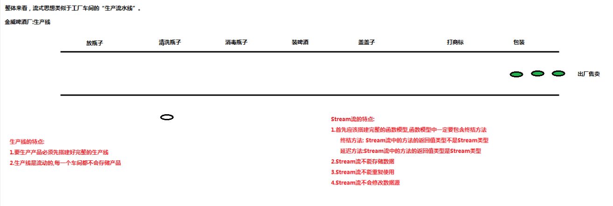

> <strong>本专栏将从基础开始，循序渐进，由浅入深讲解Java的基本使用，希望大家都能够从中有所收获，也请大家多多支持。</strong>
> <strong>专栏地址:[26天高效学习Java编程](https://blog.csdn.net/learning_xzj/category_11806176.html) </strong>
> <strong>相关软件地址:[软件地址](https://pan.baidu.com/s/1bXCZR0yxN2-v6NqDpe4H1g?pwd=1111) </strong>
> <strong>所有代码地址:[代码地址](https://gitee.com/codinginn/java-code) </strong>
> <strong> 如果文章知识点有错误的地方，请指正！大家一起学习，一起进步。</strong>
> <font color="red"><strong> 如果感觉博主的文章还不错的话，还请关注、点赞、收藏三连支持一下博主哦</strong></font>

@[toc]


# 1 Lambda表达式

## 知识点-- 函数式编程思想概述

### 目标

- 理解函数编程思想的概念

### 讲解


#### 面向对象编程思想

面向对象强调的是对象 , “**必须通过对象的形式来做事情**”，相对来讲比较复杂,有时候我们只是为了做某件事情而不得不创建一个对象 , 例如线程执行任务,我们不得不创建一个实现Runnable接口对象,但我们真正希望的是将run方法中的代码传递给线程对象执行

#### 函数编程思想

在数学中，**函数**就是有输入量、输出量的一套计算方案，也就是“拿什么东西做什么事情”。相对而言，面向对象过分强调“必须通过对象的形式来做事情”，而函数式思想则尽量忽略面向对象的复杂语法——**强调做什么，而不是以什么形式做**。例如线程执行任务 , 使用函数式思想 , 我们就可以通过传递一段代码给线程对象执行,而不需要创建任务对象

### 小结

- 函数式编程思想强调做什么,而不是以什么形式做,也就是直接传入一段代码,不需要创建对象

## 知识点-- Lambda表达式的体验

### 目标

- 理解Lambda表达式的作用

### 讲解

#### 实现Runnable接口的方式创建线程执行任务

>  实现Runnable创建线程需要五个步骤:
> 1.创建一个实现类,实现Runnable接口
> 2.在实现类中,重写run()方法,把任务放入run()方法中
> 3.创建实现类对象
> 4.创建Thread线程对象,传入实现类对象
> 5.使用线程对象调用start()方法,启动并执行线程
>  总共需要5个步骤,一步都不能少。

```java

 public class MyRunnable implements Runnable {
    @Override
    public void run() {
        System.out.println("实现的方法创建线程的任务执行了...");
    }
}
public class Demo {
    public static void main(String[] args) {
          // 实现类的方式:
            MyRunnable mr = new MyRunnable();
            Thread t = new Thread(mr);
            t.start();
    }
}
```

#### 匿名内部类方式创建线程执行任务

```java
使用匿名内部类创建线程需要三个步骤:
 1.创建Thread线程对象,传入Runnable接口的匿名内部类
 2.在匿名内部类中重写run()方法,把任务放入run()方法中
 3.使用线程对象调用start()方法,启动并执行线程
总共需要3个步骤,一步都不能少,为什么要创建Runnable的匿名内部类类,为了得到线程的任务
public class Demo {
    public static void main(String[] args) {
          // 匿名内部类的方式:
        Thread t2 = new Thread(new Runnable() {
            @Override
            public void run() {
                System.out.println("匿名内部类的方式创建线程的任务执行了");
            }
        });
        t2.start();
    }
}
```

#### Lambda方式创建线程执行任务

以上2种方式都是通过Runnable接口的实现类对象,来传入线程需要执行的任务(面向对象编程)

思考: 是否能够不通过Runnable接口的实现类对象来传入任务,而是直接把任务传给线程????

##### Lambda表达式的概述:

​    它是从JDK8开始的一个新语法，可以代替我们之前编写的“面向某种接口”编程的情况

```java
public class Demo {
    public static void main(String[] args) {
  		// 体验Lambda表达式的方式:
        Thread t3 = new Thread(()->{System.out.println("Lambda表达式的方式");});
        t3.start();
    }
}

```

### 小结

- Lambda表达式的作用就是简化代码，省略了面向对象中类和方法的书写。

## 知识点-- Lambda表达式的格式

### 目标

- 掌握Lambda表达式的标准格式

### 讲解

#### 作用

- Lambda表达式的作用就是简化代码，省略了面向对象中类和方法,对象的书写。

#### 标准格式

Lambda省去面向对象的条条框框，格式由**3个部分**组成：

- 一些参数
- 一个箭头
- 一段代码

Lambda表达式的**标准格式**为：

```
(参数类型 参数名,参数类型 参数名,...) -> { 代码语句 }
```

#### 格式说明

- 小括号内的语法与传统方法参数列表一致：无参数则留空；多个参数则用逗号分隔。
- `->`是新引入的语法格式，代表指向动作。
- 大括号内的语法与传统方法体要求基本一致。

#### 案例演示

- 线程案例演示

  ```java
  public class Test {
      public static void main(String[] args) {
          /*
              Lambda表达式的标准格式:
                  - 标准格式:  (参数列表)->{ 代码 }
                  - 格式说明:
                      - 小括号内的语法与传统方法参数列表一致：无参数则留空；多个参数则用逗号分隔。
                      - ->是新引入的语法格式，代表指向动作。
                      - 大括号内的语法与传统方法体要求基本一致。
  
                  - 案例演示:
                      线程案例
                      比较器案例
  
                格式解释:
                  1.小括号中书写的内容和接口中的抽象方法的参数列表一致
                  2.大括号中书写的内容和实现接口中的抽象方法的方法体一致
                  3.箭头就是固定的
           */
          //  线程案例
          // 面向对象编程思想:
          // 匿名内部类方式创建线程执行任务
          Thread t1 = new Thread(new Runnable() {
              @Override
              public void run() {
                  System.out.println("线程需要执行的任务代码1...");
              }
          });
          t1.start();
  
          // 函数式编程思想: Lambda表达式
          Thread t2 = new Thread(()->{ System.out.println("线程需要执行的任务代码2...");});
          t2.start();
  
      }
  
  }
  
  ```

- 比较器案例演示

  ```java
  public class Test {
      public static void main(String[] args) {
          /*
              Lambda表达式的标准格式:
                  - 标准格式:  (参数列表)->{ 代码 }
                  - 格式说明:
                      - 小括号内的语法与传统方法参数列表一致：无参数则留空；多个参数则用逗号分隔。
                      - ->是新引入的语法格式，代表指向动作。
                      - 大括号内的语法与传统方法体要求基本一致。
  
                  - 案例演示:
                      线程案例
                      比较器案例
  
                格式解释:
                  1.小括号中书写的内容和接口中的抽象方法的参数列表一致
                  2.大括号中书写的内容和实现接口中的抽象方法的方法体一致
                  3.箭头就是固定的
           */
          //  比较器案例
          // Collections.sort(List<?> list,Comparator<?> comparator);
          List<Integer> list = new ArrayList<>();
          Collections.addAll(list,100,200,500,300,400);
          System.out.println("排序之前的集合:"+list);// [100, 200, 500, 300, 400]
  
          // 面向对象编程思想:
          /*Collections.sort(list, new Comparator<Integer>() {
              @Override
              public int compare(Integer o1, Integer o2) {
                  // 降序: 后减前
                  return o2 - o1;
              }
          });
          System.out.println("排序之后的集合:"+list);// [500, 400, 300, 200, 100]*/
  
          // 函数式编程思想:Lambda表达式
          Collections.sort(list,(Integer o1, Integer o2)->{return o2 - o1;});
          System.out.println("排序之后的集合:"+list);// [500, 400, 300, 200, 100]
  
  
      }
  
  }
  
  ```

### 小结

> Lambda表达式的标准格式:
>                 Lambda表达式的作用: 就是简化代码，省略了面向对象中类和方法,对象的书写。
>                 Lambda表达式的标准格式:
>                     (参数类型 参数名,参数类型 参数名,...) -> { 代码语句 }
>                 Lambda表达式的格式说明:
>                     1.小括号中的参数要和接口中抽象方法的形参列表一致,无参数则留空；多个参数则用逗号分隔。
>                     2.->是新引入的语法格式，代表指向动作。可以理解为把小括号中的参数传递给大括号中使用
>                     3.大括号中的内容其实就是存放以前重写抽象方法的方法体
>                 Lambda表达式的使用条件: 接口中有且仅有一个抽象方法的接口,才可以使用Lambda表达式
>                     1.接口中只有一个抽象方法的接口,叫做函数式接口
>                     2.如果是函数式接口,那么就可以使用@FunctionalInterface注解来标识
>
> 使用Lambda表达式:
>             1.判断接口是否是函数式接口（仅有一个抽象方法的接口）
>             2.如果是函数式接口,那么就直接写()->{}
>             3.然后填充小括号和大括号中的内容        


## 知识点-- Lambda表达式省略格式

### 目标

- 掌握Lambda表达式省略格式

### 讲解

#### 省略规则

在Lambda标准格式的基础上，使用省略写法的规则为：

1. 小括号内参数的类型可以省略（一般不省略）；
2. 如果小括号内**有且仅有一个参数**，则小括号可以省略；
3. 如果大括号内**有且仅有一条语句**，则无论是否有返回值，都可以省略大括号、return关键字及语句分号。

#### 案例演示

- 线程案例演示

  ```java
  public class Demo_线程演示 {
      public static void main(String[] args) {
         
          //Lambda表达式省略规则
          Thread t2 = new Thread(()-> System.out.println("执行了"));
          t2.start();
      }
  }
  ```

- 比较器案例演示

  ```java
  public class Demo_比较器演示 {
      public static void main(String[] args) {
          //比较器
          ArrayList<Integer> list = new ArrayList<>();
          //添加元素
          list.add(324);
          list.add(123);
          list.add(67);
          list.add(987);
          list.add(5);
          System.out.println(list);
  
          //Lambda表达式
          Collections.sort(list, ( o1,  o2)-> o2 - o1);
  
          //打印集合
          System.out.println(list);
      }
  }
  ```

- 综合

  ```java
  
  
  import java.util.ArrayList;
  import java.util.Collections;
  
  @FunctionalInterface
  interface A {
      void method(int num);
  }
  
  public class Test {
  
      public static void show(A a) {
          a.method(10);
      }
  
      public static void main(String[] args) {
          /*
              Lambda表达式省略格式:
                  1.小括号中的形参类型可以省略
                  2.如果小括号中只有一个参数,那么小括号也可以省略
                  3.如果大括号中只有一条语句,那么大括号,分号,return可以一起省略
           */
          // 案例1:创建线程执行任务
          new Thread(() ->
                  System.out.println("任务代码")
          ).start();
  
          // 案例2: 对ArrayList集合元素进行排序
          ArrayList<Integer> list = new ArrayList<>();
          list.add(300);
          list.add(200);
          list.add(100);
          list.add(500);
          list.add(400);
          System.out.println("排序前:" + list);
  
          // 对集合中的元素按照降序排序
  
          // 函数式编程:Lambda表达式
          Collections.sort(list, (i1, i2) -> i2 - i1);
  
          System.out.println("排序后:" + list);
  
          System.out.println("=======================================");
          // Lambda标准格式
          show((int num) -> {
              System.out.println(num);
          });
  
          // Lambda省略格式
          show(num ->
                  System.out.println(num)
          );
      }
  }
  
  ```


## 知识点-- Lambda的前提条件和表现形式

### 目标

- 理解Lambda的前提条件和表现形式

### 讲解

#### Lambda的前提条件

- 使用Lambda必须具有接口，且要求接口中的抽象方法有且仅有一个。(别的方法没有影响)

- 如果一个接口中只有一个抽象方法，那么这个接口叫做是函数式接口。

  ```
  @FunctionalInterface这个注解 就表示这个接口是一个函数式接口
  ```

#### Lambda的表现形式

- 变量形式
- 参数形式
- 返回值形式

```java


import java.util.ArrayList;
import java.util.Collections;
import java.util.Comparator;


public class Test {
    public static void main(String[] args) {
        /*
            Lambda的表现形式:
                1.变量的形式:变量的类型为函数式接口类型,那么可以赋值一个Lambda表达式
                2.参数的形式:方法的形参类型为函数式接口类型,那么就可以传入一个Lambda表达式           常见
                3.返回值的形式:方法的返回值类型为函数式接口类型,那么就可以返回一个Lambda表达式        常见
         */
        // 变量的形式:
        Runnable r = ()->{
            System.out.println("任务代码");
        };
        Comparator<Integer> com = (Integer i1,Integer i2)->{return i2 - i1;};

        // 参数形式:
        ArrayList<Integer> list = new ArrayList<>();
        list.add(300);
        list.add(200);
        list.add(100);
        list.add(500);
        list.add(400);
        System.out.println("排序前:" + list);

        // 对集合中的元素按照降序排序
        Collections.sort(list,(Integer i1,Integer i2)->{return i2 - i1;});
        System.out.println("排序后:" + list);// 降序
        //Collections.sort(list, com);
        Collections.sort(list, getComparator());
        System.out.println("排序后:" + list);// 升序

    }

    // 返回值形式
    public static Comparator<Integer> getComparator(){
        return (Integer i1 , Integer i2)->{return i1 - i2;};
    }
}

```

# 2 Stream

在Java 8中，得益于Lambda所带来的函数式编程，引入了一个**全新的Stream概念**，用于解决已有集合类库的弊端。

## 知识点-- Stream流的引入

### 目标

- 感受一下Stream流的作用

### 讲解

例如: 有一个List集合,要求:

1. 将List集合中姓张的的元素过滤到一个新的集合中
2. 然后将过滤出来的姓张的元素,再过滤出长度为3的元素,存储到一个新的集合中

#### 传统方式操作集合

```java
public class Demo {
    public static void main(String[] args) {
        // 传统方式操作集合:
        List<String> list = new ArrayList<>();
        list.add("aaa");
        list.add("bbbb");
        list.add("abcd");
        list.add("ddd");
        list.add("eee");
        list.add("abc");

        // 1.将List集合中以1开头的的元素过滤到一个新的集合中
        // 1.1 创建一个新的集合,用来存储所有以1开头的元素
        List<String> listB = new ArrayList<>();

        // 1.2 循环遍历list集合,在循环中判断元素是否以1开头
        for (String e : list) {
            // 1.3 如果以1开头,就添加到新的集合中
            if (e.startsWith("1")) {
                listB.add(e);
            }
        }

        // 2.然后对过滤出来的以1开头的元素再次进行过滤，过滤出长度为3的元素,存储到一个新的集合中
        // 2.1 创建一个新的集合,用来存储所有以a开头并且长度为3的元素
        List<String> listC = new ArrayList<>();

        // 2.2 循环遍历listB集合,在循环中判断元素长度是否为3
        for (String e : listB) {
            // 2.3 如果长度为3,就添加到新的集合中
            if(e.length() == 3){
                listC.add(e);
            }
        }

        // 3.打印所有元素---循环遍历
        for (String e : listC) {
            System.out.println(e);
        }
    }
}

```

#### Stream流操作集合

```java
public class Demo {
    public static void main(String[] args) {
        List<String> list = new ArrayList<>();
        list.add("aaa");
        list.add("bbbb");
        list.add("abcd");
        list.add("ddd");
        list.add("eee");
        list.add("abc");
        // 体验Stream流:
        list.stream().filter(e->e.startsWith("a")).filter(e->e.length()==3).forEach(e-> System.out.println(e));
        System.out.println(list);
    }
}

```

直接阅读代码的字面意思即可完美展示无关逻辑方式的语义：**获取流、过滤姓张、过滤长度为3、逐一打印**。代码中并没有体现使用线性循环或是其他任何算法进行遍历，我们真正要做的事情内容被更好地体现在代码中。

## 知识点-- 流式思想概述

### 目标

- 理解流式思想概述

### 讲解

整体来看，流式思想类似于工厂车间的“**生产流水线**”。





### 小结

流式思想:  待会学了常用方法后验证

1. Stream流的操作方式也是流动操作的,也就是说每一个流都不会存储元素
2. 一个Stream流只能操作一次,不能重复使用
3. Stream流操作不会改变数据源

## 知识点-- 获取流方式

### 目标

- 掌握获取流的方式

### 讲解

#### 根据Collection获取流

- Collection接口中有一个stream()方法,可以获取流 , default Stream<E> stream():获取一个Stream流
  1. 通过List集合获取:
  2. 通过Set集合获取

#### 根据Map获取流

- 使用所有键的集合来获取流

- 使用所有值的集合来获取流
- 使用所有键值对的集合来获取流

####  根据数组获取流

-  Stream流中有一个static <T> Stream<T> of(T... values)
   - 通过数组获取:
   - 通过直接给多个数据的方式

#### 案例演示

```java


import java.util.*;
import java.util.stream.Stream;


public class Test {
    public static void main(String[] args) {
        /*
            根据集合来获取:
                 根据Collection获取流:
                    Collection<E>接口中有一个stream()方法,可以获取流 , default Stream<E> stream()
                        1.根据List获取流
                        2.根据Set获取流
                        
                 根据Map获取流:
                      1.根据Map集合的键获取流
                      2.根据Map集合的值获取流
                      3.根据Map集合的键值对对象获取流
                      
            根据数组获取流
                Stream<T>接口中有一个方法,可以获取流, public static <T> Stream<T> of(T... values)
         */
        // 创建List集合
        List<String> list = new ArrayList<>();
        list.add("aaa");
        list.add("bbb");
        list.add("ccc");
        list.add("ddd");
        list.add("eee");
        Stream<String> stream1 = list.stream();

        // 创建Set集合
        Set<String> set = new HashSet<>();
        set.add("aaa");
        set.add("bbb");
        set.add("ccc");
        set.add("ddd");
        set.add("eee");
        Stream<String> stream2 = set.stream();

        // 创建Map集合
        Map<Integer, String> map = new HashMap<>();
        map.put(1, "java");
        map.put(2, "php");
        map.put(3, "c");
        map.put(4, "c++");
        map.put(5, "Python");

        // 1.根据Map集合的键获取流
        Set<Integer> keys = map.keySet();
        Stream<Integer> stream3 = keys.stream();

        // 2.根据Map集合的值获取流
        Collection<String> values = map.values();
        Stream<String> stream4 = values.stream();

        // 3.根据Map集合的键值对对象获取流
        Set<Map.Entry<Integer, String>> entrys = map.entrySet();
        Stream<Map.Entry<Integer, String>> stream5 = entrys.stream();

        // 根据数组获取流
        String[] arr = {"aaa",
                "bbb",
                "ccc",
                "ddd",
                "eee"};
        Stream<String> stream6 = Stream.of(arr);
        
        // 直接获取流
        Stream<String> stream7 = Stream.of("张三", "李四", "王五");
    }
}

```

### 小结

```java
Collection<E>接口中有一个stream()方法,可以获取流 , default Stream<E> stream()
Stream<T>接口中有一个方法,可以获取流, public static <T> Stream<T> of(T... values)    
```


## 知识点-- 常用方法

### 目标

- Stream流常用方法

### 讲解

流模型的操作很丰富，这里介绍一些常用的API。这些方法可以被分成两种：

- **终结方法**：返回值类型不再是`Stream`接口自身类型的方法，因此不再支持类似`StringBuilder`那样的链式调用。本小节中，终结方法包括`count`和`forEach`方法。
- **非终结方法**(延迟方法)：返回值类型仍然是`Stream`接口自身类型的方法，因此支持链式调用。（除了终结方法外，其余方法均为非终结方法。）

#### 函数拼接与终结方法

在上述介绍的各种方法中，凡是返回值仍然为`Stream`接口的为**函数拼接方法**，它们支持链式调用；而返回值不再为`Stream`接口的为**终结方法**，不再支持链式调用。如下表所示：

| 方法名  | 方法作用   | 方法种类 | 是否支持链式调用 |
| ------- | ---------- | -------- | ---------------- |
| count   | 统计个数   | 终结     | 否               |
| forEach | 逐一处理   | 终结     | 否               |
| filter  | 过滤       | 函数拼接 | 是               |
| limit   | 取用前几个 | 函数拼接 | 是               |
| skip    | 跳过前几个 | 函数拼接 | 是               |
| map     | 映射       | 函数拼接 | 是               |
| concat  | 组合       | 函数拼接 | 是               |

> 备注：本小节之外的更多方法，请自行参考API文档。

#### forEach : 逐一处理

虽然方法名字叫`forEach`，但是与for循环中的“for-each”昵称不同，该方法**并不保证元素的逐一消费动作在流中是被有序执行的**。

```java
void forEach(Consumer<? super T> action);
```

该方法接收一个`Consumer`接口函数，会将每一个流元素交给该函数进行处理。例如：

```java


import java.util.ArrayList;
import java.util.List;

public class Test1_forEach {
    public static void main(String[] args) {
        /*
            forEach方法:
                void forEach(Consumer<? super T> action);逐一处理流中的元素
                参数Consumer<T>: 函数式接口,抽象方法void accept(T t);

                注意:
                    1.方法并不保证元素的逐一消费动作在流中是被有序执行的。
                    2.Consumer是一个消费接口
         */
        List<String> list = new ArrayList<>();
        list.add("aaa");
        list.add("bbb");
        list.add("ccc");
        list.add("ddd");
        list.add("eee");
        // 函数模型: 获取流->逐一消费流中的元素
        list.stream().forEach((String e)->{
            System.out.println(e);
        });

        System.out.println("========================================");
        // 并行流: 通过Collection的parallelStream()方法可以得到并行流
        list.parallelStream().forEach((String e)->{
            System.out.println(e);
        });
    }
}

```

#### count：统计个数

正如旧集合`Collection`当中的`size`方法一样，流提供`count`方法来数一数其中的元素个数：

```java
long count();
```

该方法返回一个long值代表元素个数（不再像旧集合那样是int值）。基本使用：

```java


import java.util.ArrayList;
import java.util.List;

public class Test2_count {
    public static void main(String[] args) {
        /*
            count方法:
            long count();统计流中元素的个数
         */
        List<String> list = new ArrayList<>();
        list.add("aaa");
        list.add("bbb");
        list.add("ccc");
        list.add("ddd");
        list.add("eee");

        long count = list.stream().count();
        System.out.println("流中元素的个数:"+count);// 5
    }
}

```

#### filter：过滤

可以通过`filter`方法将一个流转换成另一个子集流。方法声明：

```java
Stream<T> filter(Predicate<? super T> predicate);
```

该接口接收一个`Predicate`函数式接口参数（可以是一个Lambda或方法引用）作为筛选条件。

**基本使用**

Stream流中的`filter`方法基本使用的代码如：

```java


import java.util.stream.Stream;


public class Test3_filter {
    /*
        filter方法:
            Stream<T> filter(Predicate<? super T> predicate);过滤出满足条件的元素
            参数Predicate: 函数式接口, 抽象方法 boolean test(T t);
            Predicate接口:是一个判断接口
     */
    public static void main(String[] args) {
        // 获取Stream流
        Stream<String> stream = Stream.of("aaa", "bbb", "ccc", "ddd", "abc", "abcd");
        // 需求:过滤出姓张的元素
        stream.filter((String s) -> {
            return s.startsWith("a");
        }).forEach((String name)->{
            System.out.println(name);
        });
        
    }
}

```

在这里通过Lambda表达式来指定了筛选的条件：必须姓张。

#### limit：取用前几个

`limit`方法可以对流进行截取，只取用前n个。方法签名：

```java
Stream<T> limit(long maxSize);
```

参数是一个long型，如果流的当前长度大于参数则进行截取；否则不进行操作。基本使用：

```java


import java.util.stream.Stream;

public class Test4_limit {
    public static void main(String[] args) {
        /*
            limit方法:
                Stream<T> limit(long maxSize);取用前几个
                注意:参数是一个long型，如果流的当前长度大于参数则进行截取；否则不进行操作
         */
        // 获取Stream流
        Stream<String> stream = Stream.of("aaa", "bbb", "ccc", "ddd", "eee", "fff");

        // 需求: 保留前3个元素
        stream.limit(3).forEach(name-> System.out.println(name));
        System.out.println("===============================");

        //注意:参数是一个long型，如果流的当前长度大于参数则进行截取；否则不进行操作

        // 获取Stream流
        Stream<String> stream1 = Stream.of("aaa", "bbb", "ccc", "ddd", "eee", "fff");

        stream1.limit(7).forEach(name-> System.out.println(name));

    }
}

```

#### skip：跳过前几个

如果希望跳过前几个元素，可以使用`skip`方法获取一个截取之后的新流：

```java
Stream<T> skip(long n);
```

如果流的当前长度大于n，则跳过前n个；否则将会得到一个长度为0的空流。基本使用：

```java


import java.util.stream.Stream;

public class Test5_skip {
    public static void main(String[] args) {
        /*
            skip方法:
                Stream<T> skip(long n);跳过前几个元素
                如果流的当前长度大于n，则跳过前n个；否则将会得到一个长度为0的空流。
         */
        // 获取Stream流
        Stream<String> stream = Stream.of("aaa", "bbb", "ccc", "ddd", "eee", "fff");

        // 需求: 跳过前3个元素
        stream.skip(3).forEach(name-> System.out.println(name));
    }
}

```

#### map：映射

如果需要将流中的元素映射到另一个流中，可以使用`map`方法。方法签名：

```java
<R> Stream<R> map(Function<? super T, ? extends R> mapper);
```

该接口需要一个`Function`函数式接口参数，可以将当前流中的T类型数据转换为另一种R类型的流。

**基本使用**

Stream流中的`map`方法基本使用的代码如：

```java


import java.util.stream.Stream;

public class Test6_map {
    public static void main(String[] args) {
        /*
            map方法:
                <R> Stream<R> map(Function<? super T, ? extends R> mapper);
                参数Function<T, R>: 函数式接口,抽象方法 R apply(T t);
                Function<T, R>其实就是一个类型转换接口(T和R的类型可以一致,也可以不一致)
         */
        // 获取流
        Stream<String> stream1 = Stream.of("10", "20", "30", "40");
        // 需求:把stream1流中的元素转换为int类型
        stream1.map((String s)->{return Integer.parseInt(s);}).forEach((Integer i)->{
            System.out.println(i+1);
        });

        System.out.println("=========================");
        // 获取流
        Stream<String> stream2 = Stream.of("10", "20", "30", "40");
        // 需求:把stream1流中的元素转换为String类型
        stream2.map((String s)->{return s+"hashnode";}).forEach((String i)->{
            System.out.println(i+1);
        });
    }
}

```

这段代码中，`map`方法的参数通过方法引用，将字符串类型转换成为了int类型（并自动装箱为`Integer`类对象）。

#### concat：组合

如果有两个流，希望合并成为一个流，那么可以使用`Stream`接口的静态方法`concat`：

```java
static <T> Stream<T> concat(Stream<? extends T> a, Stream<? extends T> b)
```

> 备注：这是一个静态方法，与`java.lang.String`当中的`concat`方法是不同的。

该方法的基本使用代码如：

```java


import java.util.stream.Stream;

public class Test7_concat {
    public static void main(String[] args) {
        /*
            concat方法:
                static <T> Stream<T> concat(Stream<? extends T> a, Stream<? extends T> b);合并2个流
         */
        // 获取流
        Stream<String> stream1 = Stream.of("10", "20", "30", "40");

        // 获取Stream流
        Stream<String> stream2 = Stream.of("aaa", "bbb", "ccc", "ddd", "eee", "fff");

        // 需求:合并stream1和stream2
        Stream<String> stream = Stream.concat(stream1, stream2);
        stream.forEach(name-> System.out.println(name));

    }
}

```

## 实操-- Stream综合案例

### 需求

现在有两个`ArrayList`集合存储队伍当中的多个成员姓名，要求使用Stream流,依次进行以下若干操作步骤：

1. 第一个队伍只要名字为3个字的成员姓名；
2. 第一个队伍筛选之后只要前3个人；
3. 第二个队伍只要姓张的成员姓名；
4. 第二个队伍筛选之后不要前2个人；
5. 将两个队伍合并为一个队伍；
6. 根据姓名创建`Person`对象；
7. 打印整个队伍的Person对象信息。

两个队伍（集合）的代码如下：

```java
public class DemoArrayListNames {
    public static void main(String[] args) {
        List<String> one = new ArrayList<>();
        one.add("朱五一");
        one.add("朱一");
        one.add("朱五二");
        one.add("朱五三");
        one.add("朱五四");
        one.add("朱重五");
        one.add("朱二");

        List<String> two = new ArrayList<>();
        two.add("张1");
        two.add("张2");
        two.add("张3");
        two.add("李四");
        two.add("张4");
        two.add("李五");
        two.add("王二");
		// ....
    }
}
```

### 分析

- 可以使用Stream流的操作,来简化代码

### 实现

`Person`类的代码为：

```java
public class Person {
    public String name;

    public Person(String name) {
        this.name = name;
    }

    @Override
    public String toString() {
        return "Person{" +
                "name='" + name + '\'' +
                '}';
    }
}

```


```java
public class Test {
    public static void main(String[] args) {
        /*
            需求
                现在有两个ArrayList集合存储队伍当中的多个成员姓名，要求使用Stream流,依次进行以下若干操作步骤：
                1. 第一个队伍只要名字为3个字的成员姓名；
                2. 第一个队伍筛选之后只要前3个人；
                3. 第二个队伍只要姓张的成员姓名；
                4. 第二个队伍筛选之后不要前2个人；
                5. 将两个队伍合并为一个队伍；
                6. 根据姓名创建Person对象；
                7. 打印整个队伍的Person对象信息。
         */
        List<String> one = new ArrayList<>();
        one.add("朱五一");
        one.add("朱一");
        one.add("朱五二");
        one.add("朱五三");
        one.add("朱五四");
        one.add("朱重五");
        one.add("朱二");

        List<String> two = new ArrayList<>();
        two.add("张1");
        two.add("张2");
        two.add("张3");
        two.add("李四");
        two.add("张4");
        two.add("李五");
        two.add("王二");

        // 1. 第一个队伍只要名字为3个字的成员姓名； filter
        // 2. 第一个队伍筛选之后只要前3个人； limit
        Stream<String> stream1 = one.stream().filter((String name) -> {
            return name.length() == 3;
        }).limit(3);


        // 3. 第二个队伍只要姓张的成员姓名；filter
        // 4. 第二个队伍筛选之后不要前2个人；skip
        Stream<String> stream2 = two.stream().filter((String name) -> {
            return name.startsWith("张");
        }).skip(2);

        // 5. 将两个队伍合并为一个队伍；
        // 6. 根据姓名创建Person对象； map   String-->Person  （每一个String都会被转成Person对象）
        // 7. 打印整个队伍的Person对象信息。
        Stream.concat(stream1,stream2).map((String name)->{
           /* Person p = new Person(name);
            return p;
            */
            return new Person(name);
        }).forEach(p-> System.out.println(p));
    }
}
```

运行效果完全一样：

```
Person{name='朱五一'}
Person{name='朱五二'}
Person{name='朱五三'}
Person{name='张3'}
Person{name='张4'}
```

## 知识点--收集Stream结果

### 目标

- 对流操作完成之后，如果需要将其结果进行收集，例如获取对应的集合、数组等，如何操作？

### 讲解

#### 收集到集合中

-  Stream流中提供了一个方法,可以把流中的数据收集到单列集合中
   - <R,A> R collect(Collector<? super T,A,R> collector): 把流中的数据收集到单列集合中
     - 参数Collector<? super T,A,R>: 决定把流中的元素收集到哪个集合中
     - 返回值类型是R,也就是说R指定为什么类型,就是收集到什么类型的集合
     - 参数Collector如何得到? 使用java.util.stream.Collectors工具类中的静态方法:
       - public static <T> Collector<T, ?, List<T>> toList()：转换为List集合。
       - public static <T> Collector<T, ?, Set<T>> toSet()：转换为Set集合。

下面是这两个方法的基本使用代码：

```java


import java.util.ArrayList;
import java.util.List;
import java.util.Set;
import java.util.stream.Collectors;
import java.util.stream.Stream;

public class Test2_收集到集合中 {
    public static void main(String[] args) {
        /*
            Stream<T>流中提供了一个方法,可以把流中的数据收集到单列集合中:
                <R,A> R collect(Collector<? super T,A,R> collector): 把流中的数据收集到单列集合中
                    返回值类型是R,也就是说R指定为什么类型,就是收集到什么类型的集合
                    参数Collector<? super T,A,R>中的R类型: 决定把流中的元素收集到哪个集合中

                - 参数Collector如何得到? 使用java.util.stream.Collectors工具类中的静态方法:
                    - public static <T> Collector<T, ?, List<T>> toList()：转换为List集合。
                    - public static <T> Collector<T, ?, Set<T>> toSet()：转换为Set集合。


         */
        // 传统方式操作集合:
        List<String> list = new ArrayList<>();
        list.add("aaa");
        list.add("bbb");
        list.add("ccc");
        list.add("abc");
        list.add("abcd");
        // 需求:过滤过滤出姓张的并且长度为3的元素
        Stream<String> stream = list.stream().filter(name -> name.startsWith("a")).filter(name -> name.length() == 3);

        // 收集到List单列集合中
        //List<String> list1 = stream.collect(Collectors.toList());
        //System.out.println(list1);// [aaa, abc]

        // 收集到Set单列集合中
        Set<String> set = stream.collect(Collectors.toSet());
        System.out.println(set);// [aaa, abc]
    }
}

```

#### 收集到数组中

Stream提供`toArray`方法来将结果放到一个数组中，返回值类型是Object[]的：

```java
Object[] toArray();
```

其使用场景如：

```java

import java.util.ArrayList;
import java.util.Arrays;
import java.util.List;
import java.util.stream.Stream;

public class Test1_收集到数组中 {
    public static void main(String[] args) {
        /*
            收集到数组中:
                Stream流的一个方法:
                    Object[] toArray() 返回一个包含此流的元素的数组。
         */
        // 传统方式操作集合:
        List<String> list = new ArrayList<>();
        list.add("aaa");
        list.add("bbb");
        list.add("abc");
        list.add("ddd");
        list.add("abcd");
        // 需求:过滤过滤出以a开头的并且长度为3的元素
        Stream<String> stream = list.stream().filter(name -> name.startsWith("张")).filter(name -> name.length() == 3);

        // 需求:把stream流中的元素收集到数组中
        Object[] arr = stream.toArray();
        System.out.println(Arrays.toString(arr));
    }
}
```
