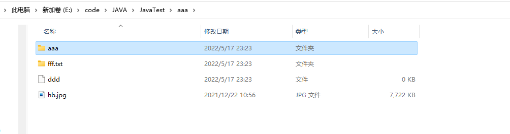
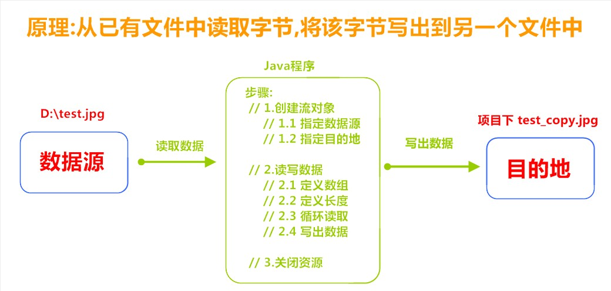

> <strong本专栏将从基础开始，循序渐进，由浅入深讲解Java的基本使用，希望大家都能够从中有所收获，也请大家多多支持。</strong>
> <strong>专栏地址:[26天高效学习Java编程](https://blog.csdn.net/learning_xzj/category_11806176.html) </strong>
> <strong>相关软件地址:[软件地址](https://pan.baidu.com/s/1bXCZR0yxN2-v6NqDpe4H1g?pwd=1111) </strong>
> <strong>所有代码地址:[代码地址](https://gitee.com/codinginn/java-code) </strong>
> <strong> 如果文章知识点有错误的地方，请指正！大家一起学习，一起进步。</strong>
> <font color="red"><strong> 如果感觉博主的文章还不错的话，还请关注、点赞、收藏三连支持一下博主哦</strong></font>

@[toc]


## 本文内容

- File类
- 递归
- IO流
- 字节流 ------->重点\掌握
- 字符流 

# 1 File类

## 知识点-- File类的概述和构造方法

**目标**

- 理解File类的概述和创建File类对象

**讲解**

**File类的概述**

`java.io.File` 类是文件和目录路径名的抽象表示，主要用于文件和目录的创建、查找和删除等操作。

**File类的构造方法**

- `public File(String pathname) ` ：通过将给定的**路径名字符串**转换为抽象路径名来创建新的 File实例。  
- `public File(String parent, String child) ` ：从**父路径名字符串和子路径名字符串**创建新的 File实例。
- `public File(File parent, String child)` ：从**父抽象路径名和子路径名字符串**创建新的 File实例。  


- 构造举例，代码如下：

```java

import java.io.File;

public class Test {
    public static void main(String[] args) {
        // 创建File对象表示‪E:\\code\\JAVA\\JavaTest\\hb.jpg文件路径
        File f1 = new File("E:\\code\\JAVA\\JavaTest\\hb.jpg");
        File f2 = new File("E:\\code\\JAVA\\JavaTest","hb.jpg");
        File parent = new File("E:\\code\\JAVA\\JavaTest");
        File f3 = new File(parent, "hb.jpg");//使用相对路径，IDEA的相对路径是src的同级目录
        System.out.println(f1); //E:\code\JAVA\JavaTest\hb.jpg
        System.out.println(f2); //E:\code\JAVA\JavaTest\hb.jpg
        System.out.println(f3); //E:\code\JAVA\JavaTest\hb.jpg
        System.out.println(f3.length());//7906465

        System.out.println("=========================================");
        File f4 = new File("E:\\code\\JAVA\\JavaTest\\2022");
        File f5 = new File("E:\\code\\JAVA\\JavaTest","2022");
        File f6 = new File(parent,"2022");
        System.out.println(f4); //E:\code\JAVA\JavaTest\2022
        System.out.println(f5); //E:\code\JAVA\JavaTest\2022
        System.out.println(f6); //E:\code\JAVA\JavaTest\2022

        System.out.println("=========================================");
        // 路径不存在的
        File f7 = new File("E:\\code\\JAVA\\JavaTest\\b.txt");// b.txt文件是不存在的
        File f8 = new File("E:\\code\\JAVA\\JavaTest\\2021");// 2021文件夹是不存在的
        System.out.println(f7); //E:\code\JAVA\JavaTest\b.txt
        System.out.println(f8); //E:\code\JAVA\JavaTest\2021
    }
}

```

> 小贴士：
>
> 1. 一个File对象代表硬盘中的一个文件或者目录。
> 2. 无论该路径下是否存在文件或者目录，都不影响File对象的创建。

## 知识点-- File类常用方法

**目标**

- 掌握File类常用方法的使用

**讲解**

**绝对路径和相对路径**

- **绝对路径**：从盘符开始的路径，这是一个完整的路径。
- **相对路径**：相对于项目目录的路径，这是一个便捷的路径，开发中经常使用。

```java

import java.io.File;

public class Test {
    public static void main(String[] args) {
         /*
            绝对路径和相对路径:
                - 绝对路径：从盘符开始的路径，这是一个完整的路径。
                - 相对路径：相对于项目目录的路径，这是一个便捷的路径，开发中经常使用。  掌握

            生活中:你在中粮商务公园2栋605    你对象在中粮商务公园
                你告诉你对象你在哪里?
                绝对路径:中国广东省深圳市宝安区留仙二路中粮商务公园2栋605
                相对路径:2栋605

            程序中:
               绝对路径:E:\\code\\JAVA\\JavaTest\\hb.jpg"
               相对路径:hb.jpg
         */
        // 绝对路径
        File f1 = new File("E:\\code\\JAVA\\JavaTest\\hb.jpg");

        // 相对路径
        File f2 = new File("hb.jpg");

        System.out.println(f1);//E:\code\JAVA\JavaTest\hb.jpg
        System.out.println(f2);//hb.jpg
    }
}

```

**获取功能的方法**

- `public String getAbsolutePath() ` ：返回此File的绝对路径名字符串。

- ` public String getPath() ` ：将此File转换为路径名字符串。 

- `public String getName()`  ：返回由此File表示的文件或目录的名称。  

- `public long length()`  ：返回由此File表示的文件的字节大小。 不能获取目录的字节大小。

  方法演示，代码如下：

  ```java
  import java.io.File;
  
  
  public class Test {
      public static void main(String[] args) {
  
          // 创建File对象,表示aaa\hb.jpg文件的路径
          //hb.jpg
  //        File f1 = new File("E:\\code\\JAVA\\JavaTest\\aaa\\hb.jpg");//使用相对路径
          File f1 = new File("aaa\\hb.jpg");//使用相对路径
          System.out.println(f1.length());
          System.out.println("f1的绝对路径:"+f1.getAbsolutePath());// E:\code\JAVA\JavaTest\aaa\hb.jpg
          System.out.println("f1的相对路径:"+f1.getPath());// aaa\hb.jpg
          System.out.println("f1的文件名:"+f1.getName());// hb.jpg
          System.out.println("f1的字节大小:"+f1.length());// 7906465 字节
  
          // 创建File对象,表示aaa\bbb文件夹的路径
          File f2 = new File("aaa\\bbb");
          System.out.println("f2的绝对路径:"+f2.getAbsolutePath());// E:\code\JAVA\JavaTest\aaa\bbb
          System.out.println("f2的构造路径:"+f2.getPath());// aaa\bbb
          System.out.println("f2的文件名:"+f2.getName());// bbb
          System.out.println("f2的字节大小:"+f2.length());// 0
      }
  }
  
  ```

> API中说明：length()，表示文件的长度。但是File对象表示目录，则返回值未指定。

**判断功能的方法**

- `public boolean exists()` ：此File表示的文件或目录是否实际存在。
- `public boolean isDirectory()` ：此File表示的是否为目录。
- `public boolean isFile()` ：此File表示的是否为文件。

方法演示，代码如下：

```java

import java.io.File;

public class Test {
    public static void main(String[] args) {
        /*
            判断功能的方法:
                - public boolean exists() ：此File表示的文件或目录是否实际存在。
                - public boolean isDirectory() ：此File表示的是否为目录。
                - public boolean isFile() ：此File表示的是否为文件。
         */
        // 路径真实存在
        File f1 = new File("aaa\\hb.jpg");//idea的相对路径的根路径在src的同级目录
        System.out.println("f1表示的文件是否真实存在:"+f1.exists());// true
        System.out.println("f1表示的文件是否是文件夹:"+f1.isDirectory());// false
        System.out.println("f1表示的文件是否是文件:"+f1.isFile());// true

        System.out.println("=====================================================");

        // 路径真实存在
        // 创建File对象,表示aaa\bbb文件夹的路径
        File f2 = new File("aaa\\bbb");
        System.out.println("f2表示的文件夹是否真实存在:"+f2.exists());// true
        System.out.println("f2表示的文件夹是否是文件夹:"+f2.isDirectory());// true
        System.out.println("f2表示的文件夹是否是文件:"+f2.isFile());// false

        System.out.println("=====================================================");
        // 注意:路径不真实存在,结果都是false
        File f3 = new File("aaa\\b.txt");
        System.out.println("f3表示的文件是否真实存在:"+f3.exists());// false
        System.out.println("f3表示的文件是否是文件夹:"+f3.isDirectory());// false
        System.out.println("f3表示的文件是否是文件:"+f3.isFile());// false
        File f4 = new File("aaa\\ccc");
        System.out.println("f4表示的文件夹是否真实存在:"+f4.exists());// false
        System.out.println("f4表示的文件夹是否是文件夹:"+f4.isDirectory());// false
        System.out.println("f4表示的文件夹是否是文件:"+f4.isFile());// false
    }
}

```

**创建删除功能的方法**

- `public boolean createNewFile()` ：当且仅当具有该名称的文件尚不存在时，创建一个新的空文件。 
- `public boolean delete()` ：删除由此File表示的文件或目录。  
- `public boolean mkdir()` ：创建由此File表示的目录。
- `public boolean mkdirs()` ：创建由此File表示的目录，包括任何必需但不存在的父目录。

方法演示，代码如下：

```java

import java.io.File;
import java.io.IOException;

public class Test {
    public static void main(String[] args) throws IOException {
        /*
            创建删除功能的方法:
                - public boolean createNewFile() ：当且仅当具有该名称的文件尚不存在时，创建一个新的空文件。
                - public boolean mkdir() ：创建由此File表示的目录。
                - public boolean mkdirs() ：创建由此File表示的目录，可以创建不存在的父目录。
                - public boolean delete() ：删除由此File表示的文件或目录。只能删除文件或者空文件夹,不能删除非空文件夹
         */
        // 创建文件:
        File f1 = new File("aaa\\a.txt");
        System.out.println("是否创建成功:"+f1.createNewFile());//true

        File f2 = new File("aaa\\ddd");// 创建ddd文件
        System.out.println("是否创建成功:"+f2.createNewFile());//true

        System.out.println("=======================================");

        // 创建文件夹
        File f3 = new File("aaa\\eee");
        System.out.println("是否创建成功:"+f3.mkdir());//true

        File f4 = new File("aaa\\fff.txt");// 创建fff.txt文件夹
        System.out.println("是否创建成功:"+f4.mkdir());//true

        File f5 = new File("aaa\\aaa\\bbb\\ccc\\ddd");
        System.out.println("是否创建成功:"+f5.mkdir());// 一定是false

        System.out.println("=======================================");
        System.out.println("是否创建成功:"+f5.mkdirs());//true

        System.out.println("=======================================");

        // 删除文件
        File f6 = new File("aaa\\a.txt");
        System.out.println("是否删除成功:"+f6.delete());// true

        // 删除空文件夹
        File f7 = new File("aaa\\eee");
        System.out.println("是否删除成功:"+f7.delete());// true

        // 删除非空文件夹
        File f8 = new File("aaa\\bbb");
        System.out.println("是否删除成功:"+f8.delete());// false

    }
}

```

> API中说明：delete方法，如果此File表示目录，则目录必须为空才能删除。

截图如下:



## 知识点-- File类遍历目录方法

**目的**

- 掌握File类遍历目录方法的使用

**讲解**

- `public String[] list()` ：返回一个String数组，表示该File目录中的所有子文件或目录的名称。


- `public File[] listFiles()` ：返回一个File数组，表示该File目录中的所有的子文件或目录的路径。  

```java


import java.io.File;

public class Test {
    public static void main(String[] args) {
        /*
            File类遍历目录方法:
                - public String[] list() ：返回一个String数组，表示该File目录中的所有子文件或子目录的名称。
                - public File[] listFiles() ：返回一个File数组，表示该File目录中的所有的子文件或子目录的路径。
         */
        // 创建File对象,表示src文件夹
        File f = new File("src");
        // 获取f路径下的所有子文件和子文件夹的名称
        String[] arr1 = f.list();
        // 循环遍历
        for (String s : arr1) {
            System.out.println(s);
        }

        System.out.println("==============================");

        // 获取f路径下的所有子文件和子文件夹的路径
        File[] arr2 = f.listFiles();
        // 循环遍历
        for (File file : arr2) {
            System.out.println(file);
        }

        System.out.println("==============================");

        // 注意:如果文件夹没有访问权限,那么返回的就是null,遍历就会报空指针异常
        File f1 = new File("H:\\System Volume Information");
        String[] list = f1.list();
        File[] files = f1.listFiles();
        System.out.println(list+","+files);// null,null
        // 报异常,为了代码的健壮性,所以循环之前加一个非空判断
        if (list != null) {
            for (String s : list) {

            }
        }

    }
}
```

> 小贴士：
>
> 调用listFiles方法的File对象，表示的必须是实际存在的目录，否则返回null，无法进行遍历。

# 2 递归

## 知识点--递归的概述

**目标**

- 理解递归的概述

**讲解**

**递归的概述**

- 生活中的递归: 放羊--赚钱--盖房子--娶媳妇--生娃--放羊--赚钱--盖房子--娶媳妇--生娃--放羊...
- 程序中的递归: 指在当前方法内调用自己的这种现象。
- 递归的注意事项:
  - 递归要有出口(结束方法),否则会报栈内存溢出错误StackOverflowError
  - 递归的出口不能太晚了

**案例演示**

```java

public class Test {
    static int count = 0;
    public static void main(String[] args) {
        /*
            程序中的递归: 指在当前方法内调用自己的这种现象
            注意事项:
                1.递归一定要有出口,否则会报栈内存溢出错误StackOverflowError
                2.递归出口太晚了,还是会报栈内存溢出错误StackOverflowError
            解决办法:合理递归
         */
        method();
    }

    public static void method(){
        count++;
        if (count == 70000){
            return;
        }
        System.out.println("method 方法执行了...");
        method();
    }
}

```

## 实操-- 递归累和

**需求**

- 计算1 ~ n的累加和

**分析**

- num的累加和 = num + (num-1)的累和，所以可以把累加和的操作定义成一个方法，递归调用。

**实现**

**代码实现**

```java
public class Test1 {
    public static void main(String[] args) {
        /*
            练习一:使用递归计算1 ~ n的和
                分析:
                        1 的累加和 = 1                      1的累加和=1
                        2 的累加和 = 1 + 2                  2的累加和=2+1的累加和
                        3 的累加和 = 1 + 2 + 3              3的累加和=3+2的累加和
                        4 的累加和 = 1 + 2 + 3 + 4          4的累加和=4+3的累加和
                        .....
                        n 的累加和                          n的累加和=n+(n-1)的累加和
         */
        // 调用getSum方法计算5的累加和
        int sum = getSum(5);
        System.out.println("5的累加和:"+sum);// 15
    }

    /**
     * 计算一个数的累加和
     * @param n
     * @return
     */
    public static int getSum(int n){
        // 出口
        if(n == 1){
            return 1;
        }
        return n + getSum(n-1);// 规律
    }
}
```

**代码执行图解**


## 实操-- 递归求阶乘

**需求**

- 计算n的阶乘

**分析**

- **阶乘**：所有小于及等于该数的正整数的积。

```java
n的阶乘：n! = n * (n-1) *...* 3 * 2 * 1 
```

n的阶乘 = n * (n1)的阶乘，所以可以把阶乘的操作定义成一个方法，递归调用。

```
推理得出：n! = n * (n-1)!
```

**实现**

**代码实现**：

```java
public class Test2 {
    public static void main(String[] args) {
        /*
            递归求阶乘:
                规律:
                    1! = 1                                      1的阶乘 : 1
                    2! = 2 * 1                                  2的阶乘 : 2 * 1的阶乘
                    3! = 3 * 2 * 1                              3的阶乘 : 3 * 2的阶乘
                    4! = 4 * 3 * 2 * 1                          4的阶乘 : 4 * 3的阶乘
                    5! = 5 * 4 * 3 * 2 * 1                      5的阶乘 : 5 * 4的阶乘
                    ....
                    num! = num * (num-1) * (num-2) *...* 1      num的阶乘 : num * num-1的阶乘
         */
        int res = jieCheng(5);
        System.out.println("5的阶乘:"+res);// 5的阶乘:120
    }

    /**
     * 计算一个数的阶乘
     * @param num
     * @return
     */
    public static int jieCheng(int num){
        // 出口
        if (num == 1){
            return 1;
        }
        return num *  jieCheng(num-1); // 计算阶乘的规律
    }
}

```

## 实操-- 文件搜索

**需求**

-  递归输出src目录中的所有.java文件的绝对路径。

**分析**

1. 目录搜索，无法判断多少级目录，所以使用递归，遍历所有目录。
2. 遍历目录时，获取的子文件，通过文件名称，判断是否符合条件。

**实现**

```java


import java.io.File;

public class Test {
    public static void main(String[] args) {
        /*
            需求:
                输出test\\src目录中的所有.java文件的绝对路径。
            分析:
                1.定义一个方法,用来获取一个目录中所有符合条件的文件(子文件,子子文件,子子子文件...)
                2.在方法中,获取该目录下的所有子文件和子目录
                3.在方法中,循环遍历获取到的所有字文件和子目录
                4.在方法中,遍历的时候,需要判断遍历出来的是文件还是目录
                5.如果是文件,就判断该文件是否以.java结尾,如果是就获取其绝对路径打印输出
                6.如果是文件夹,就递归调用该方法
         */
        File file = new File("src");
        findFile(file);
    }

    /**
     * 定义一个方法,用来获取一个目录中所有符合条件的文件(子文件,子子文件,子子子文件...)
     * @param file
     */
    public static void findFile(File file) {
        // 在方法中,获取该目录下的所有子文件和子目录
        File[] files = file.listFiles();

        // 在方法中,循环遍历获取到的所有字文件和子目录
        if (files != null) {
            // 在方法中,遍历的时候,需要判断遍历出来的是文件还是目录
            for (File file1 : files) {
                // 如果是文件,就判断该文件是否以.java结尾,如果是就获取其绝对路径打印输出
                if (file1.isFile() && file1.getName().endsWith(".java")){
                    System.out.println(file1.getAbsolutePath());
                }
                // 如果是文件夹,就递归调用该方法
                if (file1.isDirectory()){
                    findFile(file1);
                }
            }
        }
    }
}
```

# 3 IO概述

**目标**

- 理解IO的概述以及IO的分类

**讲解**

**IO的概述**

- I : Input  输入   从其他存储设备读数据到内存中就是输入
- O : Output 输出   从内存中写数据到其他存储设备


**IO的分类**

根据数据的流向分为：**输入流**和**输出流**。

- **输入流** ：把数据从`其他设备`上读取到`内存`中的流。 
  -  字节输入流:以字节为基本单位,读数据
  -  字符输入流:以字符为基本单位,读数据
- **输出流** ：把数据从`内存` 中写出到`其他设备`上的流。
  -  字节输出流:以字节为基本单位,写出数据
  -  字符输出流:以字符为基本单位,写出数据

根据数据的类型分为：**字节流**和**字符流**。

- **字节流** ：以字节为单位，读写数据的流。
  - 字节输入流:以字节为基本单位,读数据
  - 字节输出流:以字节为基本单位,写出数据
- **字符流** ：以字符为单位，读写数据的流。
  - 字符输入流:以字符为基本单位,读数据
  - 字符输出流:以字符为基本单位,写出数据

**IO的顶层父类**

- 字节输入流:顶层父类 InputStream      抽象类
- 字节输出流:顶层父类 OutputStream     抽象类
- 字符输入流:顶层父类 Reader           抽象类
- 字符输出流:顶层父类 Writer           抽象类

**注意事项**

- utf8编码一个中文占3个字节,gbk编码一个中文占2个字节
- 如果存储和解析的编码不一致就会乱码
- idea默认编码是utf8

# 4 字节流

## 知识点-- 字节输出流【OutputStream】

**目标**

- 理解OutputStream类的概述以及常用方法

**讲解**

**OutputStream类的概述**

`java.io.OutputStream `抽象类是表示字节输出流的所有类的超类，将指定的字节信息写出到目的地。它定义了字节输出流的基本共性功能方法。

**OutputStream类的常用方法**

- `public void close()` ：关闭此输出流并释放与此流相关联的任何系统资源。    
- `public void write(byte[] b)`：将 b.length字节从指定的字节数组写入此输出流。  
- `public void write(byte[] b, int off, int len)` ：从指定的字节数组写入 len字节，从偏移量 off开始输出到此输出流。  
- `public abstract void write(int b)` ：将指定的字节输出流。

> 小贴士：
>
> close方法，当完成流的操作时，必须调用此方法，释放系统资源。

## 知识点-- FileOutputStream类

**目标**

- 掌握FileOutputStream类的使用

**讲解**

**FileOutputStream类的概述**

`java.io.FileOutputStream `类是OutputStream类的子类,用来表示是文件输出流，用于将数据写出到文件。

**FileOutputStream类的构造方法**

- `public FileOutputStream(File file)`：创建文件输出流以写入由指定的 File对象表示的文件。 
- `public FileOutputStream(String name)`： 创建文件输出流以指定的名称写入文件。  

当你创建一个流对象时，必须传入一个文件路径。该路径下，如果没有这个文件，会创建该文件。如果有这个文件，会清空这个文件的数据。

- 构造举例，代码如下：

```java

import java.io.File;
import java.io.FileOutputStream;

public class Test1_概述和构造方法 {
    public static void main(String[] args) throws Exception{
        /*
            FileOutputStream类:
                概述:java.io.FileOutputStream类是OutputStream类的子类,表示字节输出流,用来写出字节数据
                构造方法:
                    - public FileOutputStream(File file)：创建文件输出流以写入由指定的 File对象表示的文件。
                    - public FileOutputStream(String name)： 创建文件输出流以指定的名称写入文件。
                注意:
                    1.当你创建一个字节输出流对象时，必须传入一个文件路径。
                    2.该路径下，如果没有这个文件，会创建该文件(空的)。
                    3.如果有这个文件，会清空这个文件的数据。
         */
        // 1.创建字节输出流对象,关联bbb\a.txt文件
        FileOutputStream fos1 = new FileOutputStream("bbb\\a.txt");

        // 2.创建字节输出流对象,关联bbb\b.txt文件
        FileOutputStream fos2 = new FileOutputStream("bbb\\b.txt");

        // 3.创建字节输出流对象,关联bbb\c.txt文件
        FileOutputStream fos3 = new FileOutputStream(new File("bbb\\c.txt"));

    }
}

```

**FileOutputStream类的写出数据**

1. **写出字节**：`write(int b)` 方法，每次可以写出一个字节数据，代码使用演示：

```java
public class Test2_写出单个字节数据 {
    public static void main(String[] args) throws Exception{
        /*
            FileOutputStream类的写出数据:
                - public abstract void write(int b) ：将指定的字节写入输出流。
                - public void close() ：关闭此输出流并释放与此流相关联的任何系统资源。
         */
        // 创建字节输出流对象,关联目的地文件路径
        FileOutputStream fos = new FileOutputStream("bbb\\a.txt");

        // 写出单个字节数据
        fos.write(97);
        fos.write(98);
        fos.write(99);

        // 关闭流,释放资源
        fos.close();
    }
}

```

> 小贴士：
>
> 1. 虽然参数为int类型四个字节，但是只会保留一个字节的信息写出。
> 2. 流操作完毕后，必须释放系统资源，调用close方法，千万记得。

1. **写出字节数组**：`write(byte[] b)`，每次可以写出数组中的数据，代码使用演示：

```java
public class Test3_写出字节数组数据 {
    public static void main(String[] args) throws Exception{
        /*
            FileOutputStream类的写出数据:
                - public void write(byte[] b)：将 b.length字节从指定的字节数组写入此输出流。
                - public void close() ：关闭此输出流并释放与此流相关联的任何系统资源。
         */
        // 创建字节输出流,关联目的地文件路径
        FileOutputStream fos = new FileOutputStream("bbb\\b.txt");
        // 创建字节数组,并存储字节数据
        byte[] bys = {97,98,99,100};
        // 写出该字节数组中的字节数据
        fos.write(bys);
        // 关闭流,释放资源
        fos.close();
    }
}
```

2. **写出指定长度字节数组**：`write(byte[] b, int off, int len)` ,每次写出从off索引开始，len个字节，代码使用演示：

```java
public class Test4_写出指定范围字节数组数据 {
    public static void main(String[] args) throws Exception{
        /*
            FileOutputStream类的写出数据:
                - public void write(byte[] b, int off, int len) ：写指定范围的字节数组的字节数据到输出流。
                - public void close() ：关闭此输出流并释放与此流相关联的任何系统资源。
         */
        // 创建字节输出流对象,关联目的地文件路径
        FileOutputStream fos = new FileOutputStream("bbb\\c.txt");

        // 创建字节数组,存储字节数据
        byte[] bys = {97,98,99,100};

        // 写出指定范围字节数组中的字节数据
        fos.write(bys, 1,2 );

        // 关闭流,释放资源
        fos.close();
    }
}

```

**数据追加续写**

经过以上的演示，每次程序运行，创建输出流对象，都会清空目标文件中的数据。如何保留目标文件中数据，还能继续添加新数据呢？

- `public FileOutputStream(File file, boolean append)`： 创建文件输出流以写入由指定的 File对象表示的文件。  
- `public FileOutputStream(String name, boolean append)`： 创建文件输出流以指定的名称写入文件。  

这两个构造方法，参数中都需要传入一个boolean类型的值，`true` 表示追加数据，`false` 表示清空原有数据。这样创建的输出流对象，就可以指定是否追加续写了，代码使用演示：

```java
public class Test5_数据追加续写 {
    public static void main(String[] args) throws Exception{
        /*
            数据追加续写:
                - public FileOutputStream(File file, boolean append)： 创建文件输出流以写入由指定的 File对象表示的文件。
                - public FileOutputStream(String name, boolean append)： 创建文件输出流以指定的名称写入文件。
                参数append: 如果是true,就表示追加续写(不清空),如果是false,就清空原文件中的数据
                注意:
                    1.当你创建一个字节输出流对象时，必须传入一个文件路径。
                    2.该路径下，如果没有这个文件，会创建该文件(空的)。
                    3.如果有这个文件，并且第二个参数为true,就不清空,如果第二个参数为false,就清空
         */
        // 创建字节输出流对象,关联目的地文件路径(bbb\a.txt)
        FileOutputStream fos = new FileOutputStream("bbb\\a.txt",true);
        // 写出数据
        fos.write(97);
        // 关闭流,释放资源
        fos.close();

    }
}

```

**写出换行**

Windows系统里，换行符号是`\r\n` 。把

以指定是否追加续写了，代码使用演示：

```java
public class FOSWrite {
    public static void main(String[] args) throws IOException {
          // 需求: 把这首诗写入aaa\\d.txt文件中
        // String类 byte[] getBytes();把一个字符串转换为一个字节数组
        // 创建字节输出流对象,关联目的地文件路径
        FileOutputStream fos = new FileOutputStream("aaa\\d.txt");
        // 写出数据
        fos.write("吟诗一首".getBytes());
        fos.write("\r\n".getBytes());
        fos.write("看这风景美如画".getBytes());
        fos.write("\r\n".getBytes());
        fos.write("吟诗一首赠天下".getBytes());
        fos.write("\r\n".getBytes());
        fos.write("奈何本人没文化".getBytes());
        fos.write("\r\n".getBytes());

        // 关闭流,释放资源
        fos.close();
    }
}
```

> - 回车符`\r`和换行符`\n` ：
>   - 回车符：回到一行的开头（return）。
>   - 换行符：下一行（newline）。
> - 系统中的换行：
>   - Windows系统里，每行结尾是 `回车+换行` ，即`\r\n`；
>
>   - Unix系统里，每行结尾只有 `换行` ，即`\n`；
>
>   - Mac系统里，每行结尾是 `回车` ，即`\r`。从 Mac OS X开始与Linux统一。

## 知识点-- 字节输入流【InputStream】

**目标**

- 理解InputStream类的概述以及常用方法

**讲解**

**InputStream类的概述**

`java.io.InputStream `抽象类是表示字节输入流的所有类的超类，可以读取字节信息到内存中。它定义了字节输入流的基本共性功能方法。

**InputStream类的常用方法**

- `public void close()` ：关闭此输入流并释放与此流相关联的任何系统资源。    
- `public abstract int read()`： 从输入流读取数据的下一个字节。 
- `public int read(byte[] b)`： 从输入流中读取一些字节数，并将它们存储到字节数组 b中 。

> 小贴士：
>
> close方法，当完成流的操作时，必须调用此方法，释放系统资源。

## 知识点-- FileInputStream类

**目标**

- 掌握FileInputStream类的使用

**讲解**

**FileInputStream类的概述**

`java.io.FileInputStream `类是InputStream类的子类 , 用来表示文件输入流，从文件中读取字节。

**FileInputStream类的构造方法**

- `FileInputStream(File file)`： 通过打开与实际文件的连接来创建一个 FileInputStream ，该文件由文件系统中的文件对象 file命名。 
- `FileInputStream(String name)`： 通过打开与实际文件的连接来创建一个 FileInputStream ，该文件由文件系统中的路径名 name命名。  

当你创建一个输入流对象时，必须传入一个文件路径。该路径下，如果没有该文件,会抛出`FileNotFoundException` 

- 构造举例，代码如下：

```java
public class Test1_概述和构造方法 {
    public static void main(String[] args) throws Exception{
        // 文件存在:
        // 创建字节输入流对象,关联数据源文件路径
        FileInputStream fis1 = new FileInputStream("ccc\\a.txt");
        FileInputStream fis2 = new FileInputStream(new File("ccc\\a.txt"));

        // 文件不存在:
        FileInputStream fis3 = new FileInputStream("ccc\\b.txt");// 运行报文件找不到异常FileNotFoundException

    }
}

```

**FileInputStream类的读取数据**

1. **读取字节**：`read`方法，每次可以读取一个字节的数据，提升为int类型，读取到文件末尾，返回`-1`，代码使用演示：

```java
public class FISRead {
    public static void main(String[] args) throws IOException{
      	// 使用文件名称创建流对象
       	FileInputStream fis = new FileInputStream("read.txt");
      	// 读取数据，返回一个字节
        int read = fis.read();
        System.out.println((char) read);
        read = fis.read();
        System.out.println((char) read);
        read = fis.read();
        System.out.println((char) read);
        read = fis.read();
        System.out.println((char) read);
        read = fis.read();
        System.out.println((char) read);
      	// 读取到末尾,返回-1
       	read = fis.read();
        System.out.println( read);
		// 关闭资源
        fis.close();
    }
}
输出结果：
a
b
c
d
e
-1
```

循环改进读取方式，代码使用演示：

```java
public class FISRead {
    public static void main(String[] args) throws IOException{
      	// 使用文件名称创建流对象
       	FileInputStream fis = new FileInputStream("read.txt");
      	// 定义变量，保存数据
        int b ；
        // 循环读取
        while ((b = fis.read())!=-1) {
            System.out.println((char)b);
        }
		// 关闭资源
        fis.close();
    }
}
输出结果：
a
b
c
d
e
```

> 小贴士：
>
> 1. 虽然读取了一个字节，但是会自动提升为int类型。
> 2. 流操作完毕后，必须释放系统资源，调用close方法，千万记得。

1. **使用字节数组读取**：`read(byte[] b)`，每次读取b的长度个字节到数组中，返回读取到的有效字节个数，读取到末尾时，返回`-1` ，代码使用演示：

```java
public class Test3_读取字节数组长度个字节数据 {
    public static void main(String[] args) throws Exception{
        /*
             FileInputStream类读取数据:
                - public int read(byte[] b)： 从输入流中读取一些字节数据，并将它们存储到字节数组 b中,返回的是读取到的字节个数。
         */
        // 创建字节输入流对象,关联数据源文件路径
        FileInputStream fis = new FileInputStream("bbb\\b.txt");

        // 创建一个长度为2的字节数组,用来存储读取到的字节数据
        byte[] bys = new byte[2];

        // 读取字节数据
        int len1 = fis.read(bys);
        System.out.println("bys数组转换为字符串:"+new String(bys,0,len1));// ab
        System.out.println(len1);// 2

        int len2 = fis.read(bys);
        System.out.println("bys数组转换为字符串:"+new String(bys,0,len2));// cd
        System.out.println(len2);// 2

        int len3 = fis.read(bys);
        System.out.println("bys数组转换为字符串:"+new String(bys,0,len3));// e
        System.out.println(len3);// 1

        int len4 = fis.read(bys);
        //System.out.println("bys数组转换为字符串:"+new String(bys));// ed
        System.out.println(len4);// -1

        // 关闭流,释放资源
        fis.close();
    }
}

```

循环读取代码使用演示：

```java
public class Test3_读取字节数组长度个字节数据 {
    public static void main(String[] args) throws Exception{
        /*
             FileInputStream类读取数据:
                - public int read(byte[] b)： 从输入流中读取一些字节数据，并将它们存储到字节数组 b中,返回的是读取到的字节个数。
         */
        // 创建字节输入流对象,关联数据源文件路径
        FileInputStream fis = new FileInputStream("bbb\\b.txt");

        // 创建一个长度为2的字节数组,用来存储读取到的字节数据
        byte[] bys = new byte[2];

        // 读取字节数据
        // 定义一个int类型的变量,用来存储读取到的有效字节个数
        int len;
        while ((len = fis.read(bys)) != -1){
            System.out.println(new String(bys,0,len));
        }

        // 关闭流,释放资源
        fis.close();
    }
}

```

> 小贴士：
>
> 使用数组读取，每次读取多个字节，减少了系统间的IO操作次数，从而提高了读写的效率，建议开发中使用。

## 实操-- 字节流练习：图片复制

**需求**

- 使用字节流拷贝一张图片

**分析**



> 一次读写一个字节拷贝文件思路:
>                     1.创建字节输入流对象,关联数据源文件路径
>                     2.创建字节输出流对象,关联目的地文件路径
>                     3.定义一个变量,用来存储读取到的字节数据
>                     4.循环读取
>                     5.在循环中,写出数据
>                     6.关闭流,释放资源
> 一次读写一个字节数组拷贝文件
>                     1.创建字节输入流对象,关联数据源文件路径
>                     2.创建字节输出流对象,关联目的地文件路径
>                     3.定义一个字节数组,用来存储读取到的字节数据
>                     3.定义一个变量,用来存储读取到的字节个数
>                     4.循环读取
>                     5.在循环中,写出数据
>                     6.关闭流,释放资源

**实现**

复制图片文件，代码使用演示：

```java


import java.io.FileInputStream;
import java.io.FileOutputStream;

public class Test {
    public static void main(String[] args) throws Exception{
        /*
            练习:字节流练习：图片复制
            一次读写一个字节拷贝文件:
                1.创建字节输入流对象,关联数据源文件路径
                2.创建字节输出流对象,关联目的地文件路径
                3.定义一个变量用来存储读取到的字节数据
                4.循环读取
                5.在循环中,写出数据
                6.关闭流,释放资源

            一次读写一个字节数组拷贝文件:
                1.创建字节输入流对象,关联数据源文件路径
                2.创建字节输出流对象,关联目的地文件路径
                3.定义一个字节数组,用来存储读取到的字节数据
                3.定义一个变量用来存储读取到的字节个数
                4.循环读取
                5.在循环中,写出数据
                6.关闭流,释放资源
         */
        //一次读写一个字节拷贝文件:
       /* // 1.创建字节输入流对象,关联数据源文件路径
        FileInputStream fis = new FileInputStream("aaa\\hb.jpg");
        // 2.创建字节输出流对象,关联目的地文件路径
        FileOutputStream fos = new FileOutputStream("ccc\\hbCopy1.jpg");
        // 3.定义一个变量用来存储读取到的字节数据
        int len;
        // 4.循环读取
        while ((len = fis.read()) != -1) {
            // 5.在循环中,写出数据
            fos.write(len);
        }
        // 6.关闭流,释放资源
        fos.close();
        fis.close();*/

        //  一次读写一个字节数组拷贝文件:
        // 1.创建字节输入流对象,关联数据源文件路径
        FileInputStream fis = new FileInputStream("aaa\\hb.jpg");
        // 2.创建字节输出流对象,关联目的地文件路径
        FileOutputStream fos = new FileOutputStream("ccc\\hbCopy2.jpg");
        // 3.定义一个字节数组,用来存储读取到的字节数据
        byte[] bys = new byte[8192];
        // 3.定义一个int变量,用来存储读取到的字节个数
        int len;
        // 4.循环读取
        while ((len = fis.read(bys)) != -1) {
            // 5.在循环中,写出数据
            fos.write(bys,0,len);
        }
        // 6.关闭流,释放资源
        fos.close();
        fis.close();
    }
}

```

> 小贴士：
>
> 流的关闭原则：先开后关，后开先关。

# 5 字符流

当使用字节流读取文本文件时，可能会有一个小问题。就是遇到中文字符时，可能不会显示完整的字符，那是因为一个中文字符可能占用多个字节存储。所以Java提供一些字符流类，以字符为单位读写数据，`专门用于处理文本文件`。

```java

import java.io.FileInputStream;

public class Test {
    public static void main(String[] args) throws Exception{
        // 需求:使用字节流读取出a.txt文件中的每个字符数据并打印到控制台
        // 1.创建字节输入流对象,关联数据源文件路径
        FileInputStream fis = new FileInputStream("ddd\\a.txt");

        // 2.定义一个int变量,用来存储读取到的字节数据
        int len;

        // 3.循环读取
        while ((len = fis.read()) != -1){
            System.out.println((char)len);
        }

        // 4.释放资源
        fis.close();
    }
}

//如果是中文会出现如下的乱码:
//ä
//½ 
//å
//¥
//½
//...

```

## 知识点-- 字符输入流【Reader】

**目标**

- 字符输入流Reader类的概述和常用方法

**讲解**

**字符输入流Reader类的概述**

`java.io.Reader`抽象类是表示用于读取字符流的所有类的超类，可以读取字符信息到内存中。它定义了字符输入流的基本共性功能方法。

**字符输入流Reader类的常用方法**

- `public void close()` ：关闭此流并释放与此流相关联的任何系统资源。    
- `public int read()`： 从输入流读取一个字符。
- `public int read(char[] cbuf)`： 从输入流中读取一些字符，并将它们存储到字符数组 cbuf中 。

## 知识点-- FileReader类

**目标**

- 掌握FileReader类的使用

**讲解**

**FileReader类的概述**

`java.io.FileReader `类是读取字符文件的便利类。构造时使用系统默认的字符编码和默认字节缓冲区。

**FileReader类的构造方法**

- `FileReader(File file)`： 创建一个新的 FileReader ，给定要读取的File对象。   
- `FileReader(String fileName)`： 创建一个新的 FileReader ，给定要读取的文件的名称。  

当你创建一个流对象时，必须传入一个文件路径。类似于FileInputStream 。

- 构造举例，代码如下：

```java
public class Test1_概述和构造方法 {
    public static void main(String[] args) throws Exception{
        /*
            概述:java.io.FileReader类继承Reader类,表示字符输入流,用来读取字符数据
            构造方法:
                - FileReader(File file)： 创建一个新的 FileReader ，给定要读取的File对象。
                - FileReader(String fileName)： 创建一个新的 FileReader ，给定要读取的文件的名称。
            注意:
                    1.当你创建一个输入流对象时，必须传入一个文件路径。
                    2.该路径下，如果没有该文件,会抛出FileNotFoundException
         */
        // 文件存在:
        // 创建字符输入流对象,关联数据源文件路径
        FileReader fr1 = new FileReader("ddd\\a.txt");
        FileReader fr2 = new FileReader(new File("ddd\\a.txt"));

        // 文件不存在:
        FileReader fr3 = new FileReader("ddd\\b.txt");// 报文件找不到异常
    }
}

```

**FileReader类读取数据**

1. **读取字符**：`read`方法，每次可以读取一个字符的数据，提升为int类型，读取到文件末尾，返回`-1`，循环读取，代码使用演示：

```java
public class FRRead {
    public static void main(String[] args) throws IOException {
      	// 使用文件名称创建流对象
       	FileReader fr = new FileReader("read.txt");
      	// 定义变量，保存数据
        int b ；
        // 循环读取
        while ((b = fr.read())!=-1) {
            System.out.println((char)b);
        }
		// 关闭资源
        fr.close();
    }
}
输出结果：
床
前
明
月
光
```

> 小贴士：虽然读取了一个字符，但是会自动提升为int类型。

2. **使用字符数组读取**：`read(char[] cbuf)`，每次读取多个字符到数组中，返回读取到的有效字符个数，读取到末尾时，返回`-1` ，代码使用演示：

```java
public class FRRead {
    public static void main(String[] args) throws IOException {
      	// 使用文件名称创建流对象
       	FileReader fr = new FileReader("read.txt");
      	// 定义变量，保存有效字符个数
        int len;
        // 定义字符数组，作为装字符数据的容器
         char[] cbuf = new char[2];
        // 循环读取
        while ((len = fr.read(cbuf))!=-1) {
            System.out.println(new String(cbuf));
        }
		// 关闭资源
        fr.close();
    }
}
输出结果：
床前
明月
光月
```

可以看到上面的代码最后输出了“光前”，可以通过以下的方式获取有效的字符改进，代码使用演示：

```java
public class FISRead {
    public static void main(String[] args) throws IOException {
      	// 使用文件名称创建流对象
       	FileReader fr = new FileReader("read.txt");
      	// 定义变量，保存有效字符个数
        int len;
        // 定义字符数组，作为装字符数据的容器
        char[] cbuf = new char[2];
        // 循环读取
        while ((len = fr.read(cbuf))!=-1) {
            System.out.println(new String(cbuf,0,len));
        }
    	// 关闭资源
        fr.close();
    }
}

输出结果：
床前
明月
光
```

## 知识点--字符输出流【Writer】

**目标**

- 字符输出流Writer类的概述和常用方法

**讲解**

**字符输出流Writer类的概述**

`java.io.Writer `抽象类是表示用于写出字符流的所有类的超类，将指定的字符信息写出到目的地。它定义了字节输出流的基本共性功能方法。

**字符输出流Writer类的常用方法**

- `public abstract void close()` ：关闭此输出流并释放与此流相关联的任何系统资源。  
- `public abstract void flush() ` ：刷新此输出流并强制任何缓冲的输出字符被写出。  
- `public void write(int c)` ：写出一个字符。
- `public void write(char[] cbuf)`：将 b.length字符从指定的字符数组写出此输出流。  
- `public abstract void write(char[] b, int off, int len)` ：从指定的字符数组写出 len字符，从偏移量 off开始输出到此输出流。  
- `public void write(String str)` ：写出一个字符串。
- `public void write(String str,int off,int len)` ：写出一个字符串的一部分。

## 知识点--FileWriter类

**目标**

- 掌握FileWriter类的使用

**讲解**

**FileWriter类的概述**

`java.io.FileWriter `类是写出字符到文件的便利类。构造时使用系统默认的字符编码和默认字节缓冲区。

**FileWriter类的构造方法**

- `FileWriter(File file)`： 创建一个新的 FileWriter，给定要读取的File对象。   
- `FileWriter(String fileName)`： 创建一个新的 FileWriter，给定要读取的文件的名称。  
- `FileWriter(File file,boolean append)`： 创建一个新的 FileWriter，给定要读取的File对象，true表示追加写入。   
- `FileWriter(String fileName,boolean append)`： 创建一个新的 FileWriter，给定要读取的文件的名称，true表示追加写入。  

当你创建一个流对象时，必须传入一个文件路径，类似于FileOutputStream。

- 构造举例，代码如下：

```java
public class Test1_概述和构造方法 {
    public static void main(String[] args) throws Exception{
        /*
            概述:java.io.FileWriter是Writer的子类,表示字符输出流,可以用来写出字符数据
            构造方法:
                - FileWriter(File file)： 创建一个新的 FileWriter，给定要读取的File对象。
                - FileWriter(String fileName)： 创建一个新的 FileWriter，给定要读取的文件的名称。
                - FileWriter(File file,boolean append)： 创建一个新的 FileWriter，给定要读取的File对象。
                - FileWriter(String fileName,boolean append)： 创建一个新的 FileWriter，给定要读取的文件的名称。
            注意:
                    1.当你创建一个字符输出流对象时，必须传入一个文件路径。
                    2.前面2个构造方法,传入的路径，如果没有这个文件，会创建该文件(空的),如果有这个文件,就会清空。
                    3.后面2个构造方法,传入的路径, 如果没有这个文件，会创建该文件(空的),如果有这个文件，并且第二个参数为true,就不清空,如果第二个参数为false,就清空
         */
        // 追加写入
        FileWriter fw1 = new FileWriter("ddd\\b.txt",true);

        // 覆盖写入
        FileWriter fw2 = new FileWriter("ddd\\c.txt");

    }
}

```

**FileWriter类写出数据**

**写出字符**：`write(int b)` 方法，每次可以写出一个字符数据，代码使用演示：

```java
public class Test2_写单个字符 {
    public static void main(String[] args) throws Exception{
        /*
            - public void write(int c) ：写出一个字符。
         */
        // 创建字符输出流对象,关联目的地文件路径
        FileWriter fw = new FileWriter("ddd\\d.txt");

        // 写出单个字符
        fw.write('a');
        fw.write('b');

        // 关闭流,释放资源
        fw.close();
    }
}

```

> 小贴士：
>
> 1. 虽然参数为int类型四个字节，但是只会保留一个字符的信息写出。
> 2. 未调用close方法，数据只是保存到了缓冲区，并未写出到文件中。

1. **写出字符数组** ：`write(char[] cbuf)` 和 `write(char[] cbuf, int off, int len)` ，每次可以写出字符数组中的数据，用法类似FileOutputStream，代码使用演示：

```java
public class FWWrite {
    public static void main(String[] args) throws IOException {
        // 使用文件名称创建流对象
        FileWriter fw = new FileWriter("fw.txt");     
      	// 字符串转换为字节数组
      	char[] chars = "床前明月光".toCharArray();
      
      	// 写出字符数组
      	fw.write(chars); // 床前明月光
        
		// 写出从索引2开始，2个字节。索引2是'明'，两个字节，也就是'明月'。
        fw.write(b,2,2); // 明月
      
      	// 关闭资源
        fos.close();
    }
}
```

2. **写出字符串**：`write(String str)` 和 `write(String str, int off, int len)` ，每次可以写出字符串中的数据，更为方便，代码使用演示：

```java
public class FWWrite {
    public static void main(String[] args) throws IOException {
        // 使用文件名称创建流对象
        FileWriter fw = new FileWriter("fw.txt");     
      	// 字符串
      	String msg = "床前明月光";
      
      	// 写出字符数组
      	fw.write(msg); //床前明月光
      
		// 写出从索引2开始，2个字节。索引2是'明'，两个字节，也就是'明月'。
        fw.write(msg,2,2);	// 明月
      	
        // 关闭资源
        fos.close();
    }
}
```

3. **追加写入和换行**：操作类似于FileOutputStream。

```java
public class FWWrite {
    public static void main(String[] args) throws IOException {
        // 使用文件名称创建流对象，可以续写数据
        FileWriter fw = new FileWriter("fw.txt"，true);     
      	// 写出字符串
        fw.write("床前");
      	// 写出换行
      	fw.write("\r\n");
      	// 写出字符串
  		fw.write("明月光");
      	// 关闭资源
        fw.close();
    }
}
输出结果:
床前
明月光
```

> 小贴士：字符流，只能操作文本文件，不能操作图片，视频等非文本文件。
>
> 当我们`单纯读或者写文本文件时`  `使用字符流` `其他情况使用字节流`

**关闭和刷新**

因为内置缓冲区的原因，如果不关闭输出流，无法写出字符到文件中。但是关闭的流对象，是无法继续写出数据的。如果我们既想写出数据，又想继续使用流，就需要`flush` 方法了。

- `flush` ：刷新缓冲区，流对象可以继续使用。
- `close` ：关闭流，释放系统资源。关闭前会刷新缓冲区。

代码使用演示：

```java
public class FWWrite {
    public static void main(String[] args) throws IOException {
        // 使用文件名称创建流对象
        FileWriter fw = new FileWriter("fw.txt");
        // 写出数据，通过flush
        fw.write('刷'); // 写出第1个字符
        fw.flush();
        fw.write('新'); // 继续写出第2个字符，写出成功
        fw.flush();
      
      	// 写出数据，通过close
        fw.write('关'); // 写出第1个字符
        fw.close();
        fw.write('闭'); // 继续写出第2个字符,【报错】java.io.IOException: Stream closed
        fw.close();
    }
}
```

> 小贴士：即便是flush方法写出了数据，操作的最后还是要调用close方法，释放系统资源。

