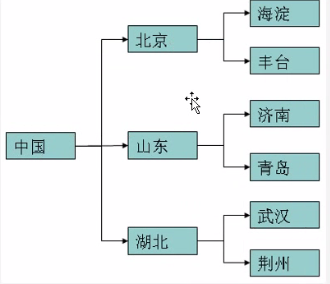
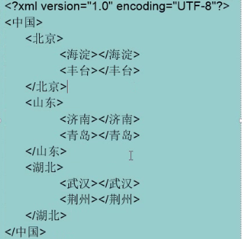
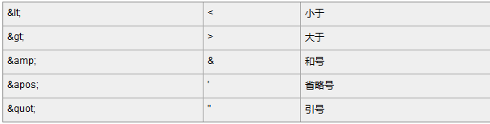
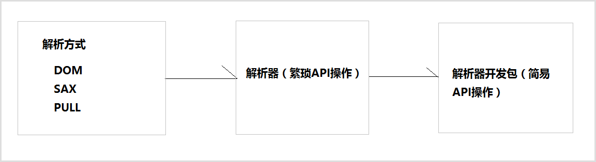
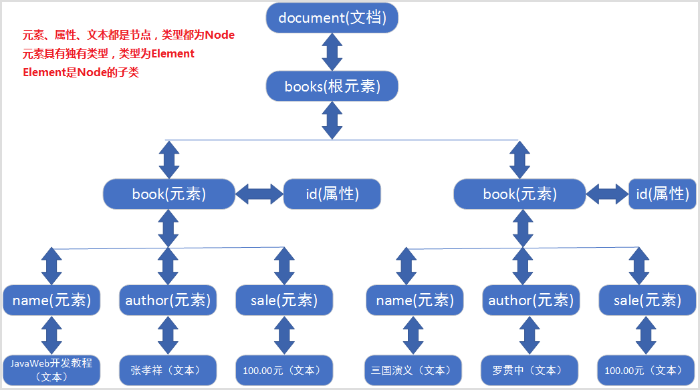

> <strong>本专栏将从基础开始，循序渐进，由浅入深讲解Java的基本使用，希望大家都能够从中有所收获，也请大家多多支持。</strong>
> <strong>专栏地址:[26天高效学习Java编程](https://blog.csdn.net/learning_xzj/category_11806176.html) </strong>
> <strong>相关软件地址:[软件地址](https://pan.baidu.com/s/1bXCZR0yxN2-v6NqDpe4H1g?pwd=1111) </strong>
> <strong>所有代码地址:[代码地址](https://gitee.com/codinginn/java-code) </strong>
> <strong> 如果文章知识点有错误的地方，请指正！大家一起学习，一起进步。</strong>
> <font color="red"><strong> 如果感觉博主的文章还不错的话，还请关注、点赞、收藏三连支持一下博主哦</strong></font>

@[toc]

## 本文内容

- XML
  - 如何编写xml
  - 如何解析xml
- 正则表达式 
  - 掌握正则表达式组成元素


# 1 XML

## 1.1 XML介绍

**目标**

- 了解xml的概述和作用

**讲解**

**1.1 什么是XML**

- XML 指可扩展标记语言（**EXtensible Markup Language**）

- XML是用来传输数据的，不是用来显示数据的。之后学习另外一个HTML是用来显示数据的。

- XML 标签没有被预定义。您需要自行定义标签。

- XML 是 W3C 的推荐标准

  W3C在1988年2月发布1.0版本，2004年2月又发布1.1版本，但因为1.1版本不能向下兼容1.0版本，所以1.1没有人用。同时，在2004年2月W3C又发布了1.0版本的第三版。我们要学习的还是1.0版本。

  

  

**1.2 XML 与 HTML 的主要差异**

- html语法松散,xml语法严格,区分大小写
- html做页面展示,xml传输数据
- html所有标签都是预定义的,xml所有标签都是自定义的

**1.3 xml的作用**

- **作为配置文件。**  javaee框架 ssm大部分都会使用xml作为配置文件

- XML可以存储数据 , 作为数据交换的载体(使用XML格式进行数据的传输)。

## 1.2 XML组成元素-重点

**目标**

- 我们知道了XML是什么, 接下来我们来了解一下XML它是由什么组成的.

**讲解**

一个标准XML文件一般由以下几部分组成:**文档声明、元素、属性、注释、转义字符、字符区。**

**文档声明**

```xml
<?xml version="1.0" encoding="utf-8" ?>
```

1. 文档声明可以不写

2. 文档声明必须为<?xml开头，以？>结束

3. 文档声明必须从文档的0行0列位置开始

4. 文档声明中常见的两个属性：

- version：指定XML文档版本。必须属性，这里一般选择1.0；
- enconding：指定当前文档的编码，可选属性，默认值是utf-8；

**注释**

```xml
<!--注释内容-->
```

- XML的注释，既以``<!--``开始，``-->``结束。
- 注释不能嵌套
- idea上快捷键：` ctrl + /`

**元素\标签**

1. 元素是XML中最重要的组成部分，元素也叫标签

2. 标签分为开始标签和结束标签，开始标签<名字> 结束标签</名字>

3. 开始标签和结束标签中间写的是标签内容，标签的内容可以是文本，也可以是其他标签

4. 如果标签没有任何内容，那么可以定义空标签(比如：<名字/>)

5. 标签可以嵌套,但是不能乱嵌套

6. 一个XML文件只有一个根标签

7. 命名规则：
   ​	不要使用XML  xML xml 写样的单词

   ​	不能使用空格，冒号

   ​	命名区分大小写

      数字不能开头

   

   ```xml
   <?xml version="1.0" encoding="UTF-8" ?>
   <person>
       <name>唐三</name>
       <age>年龄</age>
       <aaa/>
   </person>
   ```

**属性**

1. 位置: 属性是元素的一部分，它必须出现在元素的开始标签中,不能写在结束标签中

2. 格式: 属性的定义格式：属性名=“属性值”，其中属性值必须使用单引或双引号括起来

3. 一个元素可以有0~N个属性，但一个元素中不能出现同名属性

4. 属性名必须符合标识符命名规范和规则

   ```xml
   <?xml version="1.0" encoding="UTF-8" ?>
   <person>
       <name id = "001" level = '98'>唐三</name>
       <age>10</age>
   
       <aaa type = 'aaa' />
   </person>
   ```

   

**转义字符**

​	因为有些特殊的字符在XML中是不会被识别的，所以在元素体或属性值中想使用这些符号就必须使用转义字符（也叫实体字符），例如：">"、"<"、"'"、"""、"&"。



注意：严格地讲，**在 XML 中仅有字符 "<"和"&" 是非法的**。省略号、引号和大于号是合法的，但是把它们替换为实体引用是个好的习惯。

转义字符应用示例：

```xml
<price> 苹果的价格: price > 5 &amp;&amp;  price &lt; 10</price>
```

**字符区**

- CDATA 内部的所有东西都会被解析器忽略,当做文本

```xml
<![CDATA[
	文本数据
]]>
快捷键:CD
<!--写步骤 -->
<>
<!>
<![]>
<![CDATA]>
<![CDATA[ 文本 ]]>

<!-- 案例 -->
 <price>
        <![CDATA[
            苹果的价格: price > 5 &&  price < 10
        ]]>
 </price>
```

## 1.3 XML文件的约束-DTD约束

**目标**

- 能够根据DTD约束正确书写xml

**路径**

- 概念
- 根据DTD约束正确书写XML

**讲解**

**xml约束概述**

- 在XML技术里，可以编写一个文档来约束一个XML文档的书写规范，这称之为XML约束。
- 约束文档定义了在XML中允许出现的元素(标签)名称、属性及元素(标签)出现的顺序等等。
- 两种约束：DTD约束(文件后缀为dtd)，Schema约束(文件后缀为xsd)
 - **注意:**  **约束不是我们要写的东西，我们的工作是根据约束去写XML**

**根据DTD约束写XML**

- DTD约束文档

```xml
<?xml version="1.0" encoding="UTF-8" ?>
<!--
    复制内容如下到XML文件中:
        <!DOCTYPE 书架 SYSTEM "bookdtd.dtd">

-->
<!--
xml文件中引入dtd约束文档:
    方式一:本地DTD,DTD文档在本地,dtd约束文档和xml文档在同一路径下
         <!DOCTYPE 根元素 SYSTEM "文件名">

    方式二:外部DTD,DTD文档在网络上
        <!DOCTYPE 根元素 PUBLIC "DTD名称" "DTD文档的URL">\

    方式三:内部DTD，在XML文档内部嵌入DTD，只对当前XML有效。
        <?xml version="1.0" encoding="UTF-8"?>
        <!DOCTYPE 根元素 [元素声明]>
-->
<!--
对标签层级关系的约束:
    格式:<!ELEMENT 标签名 (子标签,子标签,...)>
数量词:
    * 表示元素可以出现0到多个
    + 表示元素可以出现至少1个
    ? 表示元素可以是0或1个
    , 表示元素需要按照顺序显示
    | 表示元素需要选择其中的某一个
-->
<!--
对标签的约束:
    格式:<!ELEMENT 标签名  标签类型>
    标签类型: EMPTY(即空元素，例如<hr/>)   
			ANY(任意类型)           
			(#PCDATA)  字符串数据
-->


<!--
对属性的约束:
   格式:
        <!ATTLIST 标签名
            属性名 属性类型 属性约束
            属性名 属性类型 属性约束
            ...
         >
   解释:
        属性类型:
            CDATA :表示文本字符串
            ID:表示属性值唯一,不能以数字开头
            ENUMERATED (DTD没有此关键字)：表示枚举，只能从枚举列表中任选其一，如(鸡肉|牛肉|猪肉|鱼肉)

        属性约束:
            REQUIRED：表示该属性必须出现
            IMPLIED：表示该属性可有可无
            FIXED:表示属性的取值为一个固定值。语法：#FIXED "固定值"

-->

<!-- 对标签的约束:-->
<!--根标签名为书架,书架标签下至少有一个书标签  +表示至少出现一次-->
<!ELEMENT 书架 (书+)>
<!--书标签下,包含书名,做做,售价三个子标签,并且必须按照这个顺序出现-->
<!ELEMENT 书 (书名,作者,售价)>
<!--书名标签中的内容是文本数据-->
<!ELEMENT 书名 (#PCDATA)>
<!--作者标签中的内容是文本数据-->
<!ELEMENT 作者 (#PCDATA)>
<!--售价标签中的内容是文本数据-->
<!ELEMENT 售价 (#PCDATA)>

<!-- 对属性的约束:-->
<!--
    对书标签中的属性进行约束:
    书标签中有一个id属性,类型为ID类型,也就是说该属性值要唯一,不能以数字开头,约束是必须出现
    书标签中有一个编号属性,类型是CDATA类型,也就是字符串类型,约束是可有可无
    书标签中有一个出版社属性,类型是枚举类型,也就是说该属性值只能在枚举值中任选一个,默认值为aaa
    书标签中有一个type属性,类型为CDATA类型,也就是字符串类型,固定值为IT
-->
<!ATTLIST 书
        id ID #REQUIRED
        编号 CDATA #IMPLIED
        出版社 (清华|北大|aaa) "aaa" <!--默认值是aaa,aaa必须出现在前面的枚举类型中-->
        type CDATA #FIXED "IT"
        >
```

- XML

  ```xml
  <?xml version="1.0" encoding="UTF-8" ?>
  <!DOCTYPE 书架 SYSTEM "bookdtd.dtd">
  <书架>
      <书 id="a1" 编号="001" 出版社="清华" type="IT">
          <书名>斗罗大陆</书名>
          <作者>唐家三少</作者>
          <售价>99.8</售价>
      </书>
      <书 id="a2">
          <书名>java从入门到放弃</书名>
          <作者>无名氏</作者>
          <售价>9.8</售价>
      </书>
  </书架>
  ```

**语法**

**文档声明**

1. 内部DTD，在XML文档内部嵌入DTD，只对当前XML有效。

   ```xml
   <?xml version="1.0" encoding="UTF-8"?>
   <!DOCTYPE 根元素 [元素声明]>><!--内部DTD-->
   ```

2. 外部DTD—本地DTD，DTD文档在本地系统上，企业内部自己项目使用。

   ```xml
   <?xml version="1.0" encoding="UTF-8"?>
   <!DOCTYPE 根元素 SYSTEM "文件名"><!--外部本地DTD-->
   ```

3. 外部DTD—公共DTD，DTD文档在网络上，一般都有框架提供 , 也是我们使用最多的.

   ```xml
   <?xml version="1.0" encoding="UTF-8"?>
   <!DOCTYPE 根元素 PUBLIC "DTD名称" "DTD文档的URL">
   
   例如: <!DOCTYPE web-app PUBLIC "-//Sun Microsystems, Inc.//DTD Web Application 2.3//EN" "http://java.sun.com/dtd/web-app_2_3.dtd">
   ```

## 1.4 schema约束

**目标**

- 能够根据schema约束写出xml文档

**讲解**

**概念**

schema和DTD一样, 也是一种XML文件的约束.

Schema 语言也可作为 XSD（XML Schema Definition）。

Schema约束的文件的后缀名.xsd

Schema 功能更强大，数据类型约束更完善。

**根据schema约束写出xml文档**

- Schema约束文档:

  ```xml
  <?xml version="1.0" encoding="UTF-8" ?>
  <!--    本约束文档的使用需要在xml中添加如下声明:
  <书架 xmlns="http://www.test.cn"
  xmlns:xsi="http://www.w3.org/2001/XMLSchema-instance"
  xsi:schemaLocation="http://www.test.cn bookSchema.xsd" >
  -->
  <xs:schema
          xmlns:xs="http://www.w3.org/2001/XMLSchema"
          targetNamespace="http://www.test.cn"
          elementFormDefault="qualified">
  
      <!--element表示元素,也就是对元素进行约束-->
      <!--根标签的名称为书架-->
      <xs:element name='书架'>
          <!--complexType:表示标签是一个复杂标签-->
          <!--书架是一个复杂标签-->
          <xs:complexType>
              <!--sequence表示要按照顺序出现,maxOccurs最多出现多少次,unbounded无数次,minOccurs:最少出现多少次-->
              <!--书架标签的子标签必须按照顺序出现,最多出现2次,最少出现1次-->
              <xs:sequence maxOccurs="2" minOccurs="1">
                  <!--书架的子标签的名称为书-->
                  <xs:element name='书'>
                      <!--书标签是一个复杂标签-->
                      <xs:complexType>
                          <!--书标签的子标签必须按照顺序出现-->
                          <xs:sequence>
                             <!--书标签的子标签名为书名,类型为string-->
                             <!--书标签的子标签名为作者,类型为string-->
                             <!--书标签的子标签名为售价,类型为double-->
                              <xs:element name='书名' type='xs:string'/>
                              <xs:element name='作者' type='xs:string'/>
                              <xs:element name='售价' type='xs:double'/>
                          </xs:sequence>
                          <!--attribute表示属性,也就是对属性的元约束,optional:表示可选的,required:表示必须的-->
                          <!--书标签有一个bid属性,类型为int类型,是可选-->
                          <xs:attribute name="bid" type="xs:int" use="optional"/>
                      </xs:complexType>
                  </xs:element>
              </xs:sequence>
          </xs:complexType>
      </xs:element>
  </xs:schema>
  ```

- 为什么需要xmlns

  假设有这种情况一个xml文件中有如下片段：

  ```xml
  <!--桌子-->
  <table>
    <name>African Coffee Table</name>
    <width>80</width>
    <length>120</length>
  </table>
  <!--平板-->
  <table>
    <tr>
      <td>Apples</td>
      <td>Bananas</td>
    </tr>
  </table>
  
  ```

  ​	两个table表达的内容不一样，会被不同的schema文件约束，也就是说此xml文件会引入多个schema文件，具体哪个schema约束哪个table该如何确定，如此一来xmlns就起到了作用，下列代码一看了然：

  ```xml
  <xsd1:table>
    <xsd1:name>African Coffee Table</xsd1:name>
    <xsd1:width>80</xsd1:width>
    <xsd1:length>120</xsd1:length>
  </xsd1:table>
  
  <xsd2:table>
    <xsd2:tr>
      <xsd2:td>Apples</xsd2:td>
      <xsd2:td>Bananas</xsd2:td>
    </xsd2:tr>
  </xsd2:table>
  ```

  具体如下所示：

  ```xml
  <?xml version="1.0" encoding="UTF-8"?>
  <root xmlns="http://www.it315.org/xml/schema" //xmlns指定默认命名空间，一般xml文件都会被一个默认xml约束
  	xmlns:xsd1="http://www.it315.org/table1/schema"
  	xmlns:xsd2="http://www.it315.org/table2/schema"
  	xmlns:xsi="http://www.w3.org/2001/XMLSchema-instance" //xmlns:xsi表示使用xsi作为前缀的Namespace，当然前缀xsi需要在文档中声明，值一般为xsd的目录名
  xsi:schemaLocation="http://www.it315.org/table1/schema 
  					http://www.it315.org/table1/schema /table1.xsd
  					http://www.it315.org/table2/schema 
  					http://www.it315.org/table2/schema /table2.xsd">
      
      <!--
   xsi:schemaLocation属性是命名空间为http://www.w3.org/2001/XMLSchema-instance里的schemaLocation属性，正是因为我们一开始声明了:xmlns:xsi="http://www.w3.org/2001/XMLSchema-instance 这里才写作xsi:schemaLocation（当然一般都使用这个前缀）。 这里才写作xsi:schemaLocation（当然一般都使用这个前缀）。它定义了XML Namespace和对应的XSD（Xml Schema Definition）文档的位置的关系。它的值由一个或多个URI引用对组成，两个URI之间以空白符分隔（空格和换行均可）。第一个URI是定义的XML Namespace的值，第二个URI给出Schema文档的位置，Schema处理器将从这个位置读取Schema文档。
  -->
      
  	<xsd1:table>
  	  <xsd1:name>African Coffee Table</xsd1:name>
  	  <xsd1:width>80</xsd1:width>
  	  <xsd1:length>120</xsd1:length>
  	</xsd1:table>
  	
  	<xsd2:table>
  	  <xsd2:tr>
  	    <xsd2:td>Apples</xsd2:td>
  	    <xsd2:td>Bananas</xsd2:td>
  	  </xsd2:tr>
  	</xsd2:table>
  </root>
  
  ```

  

- 根据上面的Schema约束编写XML

  - 声明方式

    ```java
    <书架 xmlns="http://www.test.cn" 
        xmlns:xsi="http://www.w3.org/2001/XMLSchema-instance"
        xsi:schemaLocation="http://www.test.cn bookSchema.xsd" >
            
    ```

  - 案例1

    ```xml
    <?xml version="1.0" encoding="UTF-8" ?>
    <书架 xmlns="http://www.test.cn"
        xmlns:xsi="http://www.w3.org/2001/XMLSchema-instance" //xmlns:xsi表示使用xsi作为前缀的Namespace，当然前缀xsi需要在文档中声明。
        xsi:schemaLocation="http://www.test.cn bookSchema.xsd" >
        <书 bid="1">
            <书名>斗罗大陆</书名>
            <作者>唐家三少</作者>
            <售价>99.8</售价>
        </书>
    </书架>
    ```

    

  - 案例2

    ```xml
    <?xml version="1.0" encoding="UTF-8" ?>
    <a:书架 xmlns:a="http://www.test.cn"
        xmlns:xsi="http://www.w3.org/2001/XMLSchema-instance"
        xsi:schemaLocation="http://www.test.cn bookSchema.xsd" >
        <a:书 bid="1">
            <a:书名>斗罗大陆</a:书名>
            <a:作者>唐家三少</a:作者>
            <a:售价>99.8</a:售价>
        </a:书>
    </a:书架>
    ```


# 2 Dom4j

## 2.1 XML解析

**目标**

- 了解XML的解析方式和解析包

**讲解**

**解析方式**

- 开发中比较常见的解析方式有三种，如下：

  1. DOM：要求解析器把整个XML文档装载到内存，并解析成一个Document对象

     a）优点：元素与元素之间保留结构关系，故可以进行增删改查操作。

     b）缺点：XML文档过大，可能出现内存溢出

  2. SAX：是一种速度更快，更有效的方法。她逐行扫描文档，一边扫描一边解析。并以事件驱动的方式进行具体解析，每执行一行，都触发对应的事件。

     a）优点：不会出现内存问题，可以处理大文件

     b）缺点：只能读，不能回写。

  3. PULL：Android内置的XML解析方式，类似SAX。

- 解析器，就是根据不同的解析方式提供具体实现。有的解析器操作过于繁琐，为了方便开发人员，有提供易于操作的解析开发包

  

**解析包**

- JAXP：sun公司提供支持DOM和SAX开发包
- **Dom4j:  比较简单的的解析开发包(常用),**
- JDom：与Dom4j类似
- Jsoup：功能强大DOM方式的XML解析开发包，尤其对HTML解析更加方便

## 2.2 Dom4j的基本使用  

**目标**

- 知道了什么是XML的解析, 那么接下来我们来学习一个最为简单常见的解析开发包 - Dom4j

**讲解**

**2.2.1 DOM解析原理及结构模型**

- 解析原理

  XML DOM 和 HTML DOM一样，**XML DOM 将整个XML文档加载到内存，生成一个DOM树，并获得一个Document对象，通过Document对象就可以对DOM进行操作**。以下面books.xml文档为例。

  ```xml
  <?xml version="1.0" encoding="UTF-8"?>
  <books>
      <book id="0001">
          <name>aaa</name>
          <author>bbb</author>
          <sale>100.00元</sale>
      </book>
      <book id="0002">
          <name>三国演义</name>
          <author>罗贯中</author>
          <sale>100.00元</sale>
      </book>
  </books>
  ```

- 结构模型

  

  DOM中的核心概念就是节点，在XML文档中的元素、属性、文本，在DOM中都是节点！所有的节点都封装到了Document对象中。

**2.2.2  使用步骤**

1. 导入jar包  dom4j-1.6.1j.jar
2. 创建解析器
3. 读取xml 获得document对象 
4. 得到根元素
5. 根据根元素获取对于的子元素或者属性

**2.2.3 常用的方法**

```java
创建解析器对象：
	SAXReader sr = new SAXReader();
解析器读取文件方法：
	Document doc = sr.read(String fileName);
Document的方法：
	getRootElement()			: 获取根元素	
	
节点中的方法：	
	elements()     				: 获取当前元素的子元素
	element(String name)		: 根据元素名获取指定子元素(如果有多个就获取到第一个)
	getName()					: 获取元素的元素名
    elementText(String name)	: 获取指定子元素的文本值,参数是子元素名称
	attributeValue(String name)	: 获取当前元素下某个属性的值
	getText()					: 获取当前元素的文本值
```

**2.2.4 方法演示**

- xml

  ```xml
  <?xml version="1.0" encoding="UTF-8"?>
  <books>
      <book id="0001">
          <name>aaa</name>
          <author>bbb</author>
          <sale>100.00元</sale>
      </book>
      <book id="0002">
          <name>三国演义</name>
          <author>罗贯中</author>
          <sale>100.00元</sale>
      </book>
  </books>
  ```

- 解析

```java


import org.dom4j.Document;
import org.dom4j.Element;
import org.dom4j.io.SAXReader;

import java.util.List;

public class Test1 {
    public static void main(String[] args) throws Exception {
        /*
            Dom4j的基本使用:
                使用步骤:
                    1.下载Dom4j的jar包
                    2.把jar包导入到模块的lib文件夹中,并添加到classpath路径下
                    3.创建解析器对象
                    4.使用解析器读取xml文档,生成Document对象
                    5.根据Document对象获取根元素
                    6.根据根元素获取下面的子元素\属性...
                常用的方法:
                   创建解析器对象：
                        SAXReader sr = new SAXReader();
                    解析器读取文件方法：
                        Document doc = sr.read(String fileName);
                    Document的方法：
                        Element getRootElement()			: 获取根元素

                    Element的方法：
                        elements()     				: 获取当前元素的子元素
                        getName()					: 获取元素的元素名
                        attributeValue(String name)	: 获取当前元素下某个属性的值
                        getText()					: 获取当前元素的文本值

                        element(String name)		: 根据元素名获取指定子元素(如果有多个就获取到第一个)
                        elementText(String name)	: 获取指定子元素的文本值,参数是子元素名称
         */
        // 1.创建解析器对象
        SAXReader sr = new SAXReader();
        // 2.使用解析器读取xml文档,生成Document对象
        Document document = sr.read("book.xml");
        // 3.根据Document对象获取根元素
        Element rootE = document.getRootElement();
        System.out.println("根元素的名称:" + rootE.getName());// books

        // 4.获取根元素下的所有子元素
        List<Element> list1 = rootE.elements();
        // 5.循环遍历根元素的所有的子元素
        for (Element e1 : list1) {
            System.out.println("根元素的子元素的名称:" + e1.getName());// book book
            System.out.println("根元素的子元素的id属性值:" + e1.attributeValue("id"));// 0001 0002
            // 获取e1元素下的所有子元素
            List<Element> list2 = e1.elements();
            // 循环遍历list2
            for (Element e2 : list2) {
                System.out.println("book下的子元素名:" + e2.getName());// name  author sale
                System.out.println("book下的子元素中的文本:" + e2.getText());// name  author sale

            }
            System.out.println("==================================");

        }

        // 5.获取根元素下的book子元素(就获取第一个)
        Element bookE = rootE.element("book");
        System.out.println(bookE.getName());// book
        System.out.println(bookE.attributeValue("id"));// 0001

        // 6.获取bookE元素下的author子元素的文本
        String text = bookE.elementText("author");
        System.out.println(text);// 张孝祥

    }
}

```

## 2.3 Dom4J结合XPath解析XML  

**目标**

我们来使用Dom4J和XPath结合的方式来解析XML

**讲解**

**2.3.1 介绍**

​	XPath 使用路径表达式来选取HTML\XML 文档中的元素节点或属性节点。节点是通过沿着路径 (path) 来选取的。XPath在解析HTML\XML文档方面提供了独树一帜的路径思想。

**2.3.2 XPath使用步骤**

步骤1：导入jar包(dom4j和jaxen-1.1-beta-6.jar)

步骤2：通过dom4j的SaxReader解析器对象,获取Document对象

步骤3： 利用Xpath提供的api,结合xpaht的语法完成选取XML文档元素节点进行解析操作。

**document常用的api**

- document.selectSingleNode("xpath语法");   获得一个节点(标签,元素)
- document.selectNodes("xpath语法");      获得多个节点(标签,元素)

**2.3.3 XPath语法**

- XPath表达式，就是用于选取HTML文档中节点的表达式字符串。

  获取XML文档节点元素一共有如下4种XPath语法方式：

  1. 绝对路径表达式方式	     例如: /元素/子元素/子子元素...
  2. 相对路径表达式方式          例如: 子元素/子子元素..  或者 ./子元素/子子元素..
  3. 全文搜索路径表达式方式  例如: //子元素//子子元素
  4. 谓语（条件筛选）方式      例如: //元素[@attr1=value]


- 获取不同节点语法

  | 获取类型     | 语法代码  |
  | ------------ | --------- |
  | 获取元素节点 | 元素名称  |
  | 获取属性节点 | @属性名称 |

**2.3.3.1 绝对路径表达式(了解)**

- 绝对路径介绍 
- 以/开头的路径叫做是绝对路径，绝对路径要从根元素开始写


- ```java
  public class Test {
      public static void main(String[] args)throws Exception {
          /*
              - document.selectSingleNode("xpath语法");   获得一个节点(标签,元素)
              - document.selectNodes("xpath语法");      获得多个节点(标签,元素)
           */
          // 创建解析器
          SAXReader sr = new SAXReader();
          // 读取xml 获得document对象
          Document document = sr.read("tianqi.xml");
          // 得到根元素
          Element rootE = document.getRootElement();
          System.out.println(rootE);
  
          // 绝对路径: 获取深圳 湿度
          Node node = rootE.selectSingleNode("/天气预报/深圳/湿度");
          System.out.println(node.getName());// 湿度
          System.out.println(node.getText());// 50%
  
      }
  }
  	
  ```

tianqi.xml如下:

```xml
<?xml version="1.0" encoding="UTF-8"?>

<天气预报>
    <北京 provide='京' id='1'>
        <温度>
            <最高温度 level="A">18</最高温度>
            <最低温度>6</最低温度>
        </温度>
        <湿度>20%</湿度>
    </北京>


    <深圳>
        <温度>
            <最高温度 level="C">36</最高温度>
            <最低温度>24</最低温度>
        </温度>
        <湿度>50%</湿度>
    </深圳>

	
	 <广州>
	 
		<温度>
            <最高温度 level="C">32</最高温度>
            <最低温度>21</最低温度>
        </温度>
        <湿度>50%</湿度>
		
		<黄浦区>
			<温度>
				<最高温度 level="C">31</最高温度>
				<最低温度>22</最低温度>
			</温度>
			<湿度>50%</湿度>
		</黄浦区>
		
		<天河区>
			<温度>
				<最高温度 level="C">30</最高温度>
				<最低温度>26</最低温度>
			</温度>
			<湿度>50%</湿度>
		</天河区>


    </广州>
</天气预报>
```

**2.3.3.2 相对路径表达式**

- 相对路径介绍

  - 相对路径就是相对当前节点元素位置继续查找节点，不以/开头, ../ 表示上一个元素, ./表示当前元素

    ```java
    public class Test {
        public static void main(String[] args)throws Exception {
          /*
                - document.selectSingleNode("xpath语法");   获得一个节点(标签,元素)
                - document.selectNodes("xpath语法");      获得多个节点(标签,元素)
             */
            // 创建解析器
            SAXReader sr = new SAXReader();
            // 读取xml 获得document对象
            Document document = sr.read("tianqi.xml");
            // 得到根元素
            Element rootE = document.getRootElement();
            System.out.println(rootE);
    
            // 相对路径: 获取深圳 湿度
            Node node = rootE.selectSingleNode("./深圳/湿度");
            System.out.println(node.getName());// 湿度
            System.out.println(node.getText());// 50%
    
    
            //用绝对路径的方式获取“温度”
            Node node2 = document.selectSingleNode("/天气预报/北京/温度");
            // 相对路径: 获取北京 湿度
            Node node3 = node2.selectSingleNode("../湿度");
            System.out.println(node3.getName());// 湿度
            System.out.println(node3.getText());// 20%
    
        }
    }
    ```


**2.3.3.3 全文搜索路径表达式(了解)**

- 全文搜索路径介绍

  - 代表不论中间有多少层,直接获取所有子元素中满足条件的元素

    ```java
    public class Test {
        public static void main(String[] args)throws Exception {
            /*
                - document.selectSingleNode("xpath语法");   获得一个节点(标签,元素)
                - document.selectNodes("xpath语法");      获得多个节点(标签,元素)
             */
            // 创建解析器
            SAXReader sr = new SAXReader();
            // 读取xml 获得document对象
            Document document = sr.read("tianqi.xml");
            // 得到根元素
            Element rootE = document.getRootElement();
            System.out.println(rootE);
    
            // 获取天气预报里的所有湿度，不论有多少层
            List<Element> list = rootE.selectNodes("//湿度");
            for (Element e : list) {
                System.out.println(e.getName()+","+e.getText());
            }
        }
    }
    ```

**2.3.3.4 谓语（条件筛选）**

- 介绍

  谓语，又称为条件筛选方式，就是根据条件过滤判断进行选取节点

  格式：	
  ​	String xpath1="//元素[@attr1=value]";//获取元素属性attr1=value的元素

  ​	String xpath2="//元素[@attr1>value]/@attr1"//获取元素属性attr1>value的d的所有attr1的值

  ​	String xpath3="//元素[@attr1=value]/text()";//获取符合条件元素体的自有文本数据

   	String xpath4="//元素[@attr1=value]/html()";//获取符合条件元素体的自有html代码数据。

  ​	 String xpath3="//元素[@attr1=value]/allText()";//获取符合条件元素体的所有文本数据（包含子元素里面的文本）

**2.3.4 演示**

```java
public class Test {
    public static void main(String[] args)throws Exception {
        /*
            - document.selectSingleNode("xpath语法");   获得一个节点(标签,元素)
            - document.selectNodes("xpath语法");      获得多个节点(标签,元素)
         */
        // 创建解析器
        SAXReader sr = new SAXReader();
        // 读取xml 获得document对象
        Document document = sr.read("tianqi.xml");
        // 得到根元素
        Element rootE = document.getRootElement();
        System.out.println(rootE);

        // 获取最高温度中属性名是level 属性值是A的元素
        List<Element> list = rootE.selectNodes("//最高温度[@level='C']");
        for (Element e : list) {
            System.out.println(e.getName()+","+e.getText());
        }

    }
}

```

# 3 正则表达式

## 正则表达式的概念及演示

**目标**

- 理解正则表达式的概念

**讲解**

- 概述: 正则表达式其实就是一个匹配规则,用来替换之前复杂的if结构判断

- 在Java中，我们经常需要验证一些字符串，是否符合规则, 例如：校验qq号码是否正确,手机号码是否正确,邮箱是否正确等等。那么如果使用if就会很麻烦, 而正则表达式就是用来验证各种字符串的规则。它内部描述了一些规则，我们可以验证用户输入的字符串是否匹配这个规则。
- 先看一个不使用正则表达式验证的例子：下面的程序让用户输入一个QQ号码，我们要验证：
  - QQ号码必须是5--15位长度
  - 而且必须全部是数字
  - 而且首位不能为0

~~~java
public class Demo {
	public static void main(String[] args) {
		Scanner sc = new Scanner(System.in);
		
		System.out.println("请输入你的QQ号码：");
		String qq = sc.next();
		
		System.out.println(checkQQ(qq));
	}
	//我们自己编写代码，验证QQ号码
	private static boolean checkQQ(String qq) {
		//1.验证5--15位
		if(qq.length() < 5 || qq.length() > 15){
			return false;
		}
		//2.必须都是数字；
		for(int i = 0;i < qq.length() ; i++){
			char c = qq.charAt(i);
			if(c < '0' || c > '9'){
				return false;
			}
		}
		//3.首位不能是0；
		char c = qq.charAt(0);
		if(c == '0'){
			return false;
		}
		return true;//验证通过
	}
	
}
~~~

- 使用正则表达式验证：

~~~java
public class Demo {
	public static void main(String[] args) {
		Scanner sc = new Scanner(System.in);
		
		System.out.println("请输入你的QQ号码：");
		String qq = sc.next();
		
		System.out.println(checkQQ2(qq));
	}
	//使用正则表达式验证
	private static boolean checkQQ2(String qq){
		String regex = "[1-9]\\d{4,14}";//正则表达式
		return qq.matches(regex);
	}
}
~~~

上面程序checkQQ2()方法中String类型的变量regex就存储了一个"正则表达式 "，而这个正则表达式就描述了我们需要的三个规则。matches()方法是String类的一个方法，用于接收一个正则表达式，并将"本对象"与参数"正则表达式"进行匹配，如果本对象符合正则表达式的规则，则返回true，否则返回false。

**小结**

- 正则表达式其实就是一个匹配规则,用来替换之前复杂的if结构判断

## 正则表达式的基本使用  

**目标**

- 掌握如何书写正则表达式

**讲解**

**3.2.1 正则表达式-字符类**

- 语法示例：[] 表示匹配单个字符   ^ 取反    - 范围

  1. \[abc\]：代表a或者b，或者c字符中的一个。  

  2. \[^abc\]：代表除a,b,c以外的任何字符。 
  3. [a-z]：代表a-z的所有小写字符中的一个。 左右包含
  4. [A-Z]：代表A-Z的所有大写字符中的一个。
  5. [0-9]：代表0-9之间的某一个数字字符。
  6. [a-zA-Z0-9]：代表a-z或者A-Z或者0-9之间的任意一个字符。
  7. [a-dm-p]：a 到 d 或 m 到 p之间的任意一个字符。 

- 代码示例：

~~~java
public class Test1 {
    public static void main(String[] args) {
        String str = "ead";
        //1.验证str是否以h开头，以d结尾，中间是a,e,i,o,u中某个字符
        System.out.println(str.matches("h[aeiou]d"));// false
        System.out.println("hed".matches("h[aeiou]d"));// true
        System.out.println("heod".matches("h[aeiou]d"));// false
        System.out.println("==========================================");

        //2.验证str是否以h开头，以d结尾，中间不是a,e,i,o,u中的某个字符
        System.out.println(str.matches("h[^aeiou]d"));// false
        System.out.println("hed".matches("h[^aeiou]d"));// false
        System.out.println("hbd".matches("h[^aeiou]d"));// true
        System.out.println("==========================================");

        //3.验证str是否a-z的任何一个小写字符开头，后跟ad
        System.out.println(str.matches("[a-z]ad"));// true
        System.out.println("Aad".matches("[a-z]ad"));// false
        System.out.println("==========================================");

        //4.验证str是否以a-d或者m-p之间某个字符开头，后跟ad
        System.out.println(str.matches("[a-dm-p]ad"));//false
        System.out.println("bad".matches("[a-dm-p]ad"));// true
        System.out.println("nad".matches("[a-dm-p]ad"));// true

    }
}
~~~

**3.2.2 正则表达式-逻辑运算符**

- 语法示例：
  1. &&：并且
  2. |    ：或者

- 代码示例：

~~~java
public class Test2 {
    public static void main(String[] args) {
        /*
            正则表达式-逻辑运算符
                - 语法示例：
                  1. &&：并且
                  2. |    ：或者
         */
        String str = "had";
        //1.要求字符串是小写辅音字符开头，后跟ad  除了a,e,i,o,u之外,其他的都是辅音字母
        System.out.println(str.matches("[a-z&&[^aeiou]]ad"));// true
        System.out.println("aad".matches("[a-z&&[^aeiou]]ad"));// false
        System.out.println("Aad".matches("[a-z&&[^aeiou]]ad"));// false
        System.out.println("========================");

        //2.要求字符串是aeiou中的某个字符开头，后跟ad
        System.out.println(str.matches("[aeiou]ad"));// false
        System.out.println(str.matches("[a|e|i|o|u]ad"));// false

        System.out.println("aad".matches("[aeiou]ad"));// true
        System.out.println("aad".matches("[a|e|i|o|u]ad"));// true
    }
}


~~~

**3.2.3 正则表达式-预定义字符**

- 语法示例：
  1. "." ： 匹配任何字符。如果要表示一个字符点,那么就得使用\\.
  2. "\d"：任何数字[0-9]的简写；
  3. "\D"：任何非数字\[^0-9\]的简写；
  4. "\s"： 空白字符：[ \t\n\x0B\f\r] 的简写
  5. "\S"： 非空白字符：\[^\s\] 的简写
  6. "\w"：单词字符：[a-zA-Z_0-9]的简写
  7. "\W"：非单词字符：\[^\w\]

- 代码示例：

~~~java
public class Test3 {
    public static void main(String[] args) {
        /*
            正则表达式-预定义字符
                - 语法示例：
                  1. "." ： 匹配任何字符。如果要表示一个字符点,那么就得使用\.
                  2. "\d"：任何数字[0-9]的简写；
                  3. "\D"：任何非数字[^0-9]的简写；
                  4. "\s"： 空白字符：[ \t\n\x0B\f\r] 的简写
                  5. "\S"： 非空白字符：[^\s] 的简写
                  6. "\w"：单词字符：[a-zA-Z_0-9]的简写
                  7. "\W"：非单词字符：[^\w]
         */
        String str = "258";
        //1.验证str是否3位数字
        System.out.println(str.matches("\\d\\d\\d"));// true
        System.out.println("25".matches("\\d\\d\\d"));// false
        System.out.println("+===================================");

        //2.验证手机号：1开头，第二位：3/5/8，剩下9位都是0-9的数字
        System.out.println(str.matches("1[358]\\d\\d\\d\\d\\d\\d\\d\\d\\d"));// false
        System.out.println("13838381234".matches("1[358]\\d\\d\\d\\d\\d\\d\\d\\d\\d"));// true
        System.out.println("14838381234".matches("1[358]\\d\\d\\d\\d\\d\\d\\d\\d\\d"));// false
        System.out.println("+===================================");

        //3.验证字符串是否以h开头，以d结尾，中间是任何字符
        System.out.println(str.matches("h.d"));// false
        System.out.println("h%d".matches("h.d"));// true
        System.out.println("h#d".matches("h.d"));// true
        System.out.println("+===================================");

        //4.验证str是否是：h.d
        System.out.println("h.d".matches("h.d"));// true
        System.out.println("had".matches("h.d"));// true

        System.out.println("h.d".matches("h\\.d"));// true
        System.out.println("had".matches("h\\.d"));// false

    }
}

~~~

**3.2.4 正则表达式-数量词**

- 语法示例：
  1. X? : 0次或1次
  2. X* : 0次到多次
  3. X+ : 1次或多次
  4. X{n} : 恰好n次
  5. X{n,} : 至少n次
  6. X{n,m}: n到m次(n和m都是包含的)

- 代码示例：

~~~java
public class Test4 {
    public static void main(String[] args) {
        /*
            正则表达式-数量词
                - 语法示例：
                  1. X? : 0次或1次
                  2. X* : 0次到多次
                  3. X+ : 1次或多次
                  4. X{n} : 恰好n次
                  5. X{n,} : 至少n次  包含n
                  6. X{n,m}: n到m次(n和m都是包含的)

         */
        //1.验证str是否是三位数字
        System.out.println("123".matches("\\d{3}"));// true
        System.out.println("12".matches("\\d{3}"));// false
        System.out.println("1234".matches("\\d{3}"));// false
        System.out.println("===================================");

        //2.验证str是否是多位数字
        System.out.println("12".matches("\\d{2,3}"));// true
        System.out.println("123".matches("\\d{2,3}"));// true
        System.out.println("1223".matches("\\d{2,3}"));// false

        System.out.println("1".matches("\\d+"));// true
        System.out.println("12".matches("\\d+"));// true
        System.out.println("123".matches("\\d+"));// true
        System.out.println("1234".matches("\\d+"));// true
        System.out.println("===================================");

        //3.验证str是否是手机号：1).第一位为1 2).第二位是3,5,8 3).后面9位都是数字
        System.out.println("13838381234".matches("1[358]\\d{9}"));// true
        System.out.println("14838381234".matches("1[358]\\d{9}"));// false
        System.out.println("===================================");

        //4.验证qq号码：1).5--15位；2).全部是数字;3).第一位不是0
        System.out.println("123456".matches("[1-9]\\d{4,14}"));// true
        System.out.println("023456".matches("[1-9]\\d{4,14}"));// false
        System.out.println("123".matches("[1-9]\\d{4,14}"));// false
    }
}

~~~

**3.2.5 正则表达式-分组括号( )**

~~~java
public class Test5 {
    public static void main(String[] args) {
        /*
            正则表达式-分组括号( )
         */
        String str = "DG8FV-B9TKY-FRT9J-99899-XPQ4G";
        // 分成5组: 前面4组的规则是一样的 后面一组单独规则
        System.out.println(str.matches("([A-Z0-9]{5}-){4}[A-Z0-9]{5}"));
        // xxyy
        // 扩展:正则表达式匹配叠词
        // 哈哈,呵呵,嘿嘿,XX  (.)表示第一组,\\1表示第一组
        System.out.println("哈哈".matches("(.)\\1"));//true
        System.out.println("呵呵".matches("(.)\\1"));//true
        System.out.println("嘿嘿".matches("(.)\\1"));//true
        System.out.println("嘿哈".matches("(.)\\1"));// false
        // (.)表示第一组,\\1表示第一组,{3}表示\\1出现3次
        System.out.println("哈哈哈哈".matches("(.)\\1{3}"));//true
        System.out.println("呵呵呵呵".matches("(.)\\1{3}"));//true
        System.out.println("嘿嘿嘿嘿".matches("(.)\\1{3}"));//true
        System.out.println("===================================");

        // 高高兴兴,逼逼赖赖,XXYY
        // \\1表示第一组,\\2表示第二组,\\3表示第三组....
        System.out.println("高高兴兴".matches("(.)\\1(.)\\2"));//true
        System.out.println("逼逼赖赖".matches("(.)\\1(.)\\2"));//true
        System.out.println("===================================");

        // 快乐快乐,哔哩哔哩,XYXY
        System.out.println("快乐快乐".matches("(..)\\1"));//true
        System.out.println("哔哩哔哩".matches("(..)\\1"));//true
    }
}
~~~

## String中正则表达式的使用

**目标**

在String中也有几个方法是可以使用正则表达式来操作的, 下面我们来学习一下

**路径**

- String的split方法中使用正则表达式
- String类的replaceAll方法中使用正则表达式

**讲解**

**3.3.1 String的split方法中使用正则表达式**

- String类的split()方法原型：

  ```java
  public String[] split(String regex)//参数regex就是一个正则表达式。可以将当前字符串中匹配regex正则表达式的符号作为"分隔符"来切割字符串。
  ```

- 代码示例：

~~~java
public class Demo {
	public static void main(String[] args) {
		String str = "18  4 567       99     56";
		String[] strArray = str.split(" +");
		for (int i = 0; i < strArray.length; i++) {
			System.out.println(strArray[i]);
		}
	}
}

~~~

**3.3.2 String类的replaceAll方法中使用正则表达式**

- String类的replaceAll()方法原型：

~~~java
public String replaceAll(String regex,String newStr)//参数regex就是一个正则表达式。可以将当前字符串中匹配regex正则表达式的字符串替换为newStr。
~~~

- 代码示例：

~~~java
public class Demo {
    public static void main(String[] args) {
        //将下面字符串中的"数字"替换为"*"
        String str = "jfdk432jfdk2jk24354j47jk5l31324";
        System.out.println(str.replaceAll("\\d+", "*"));
    }
}
~~~
