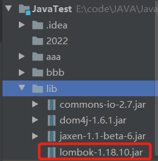
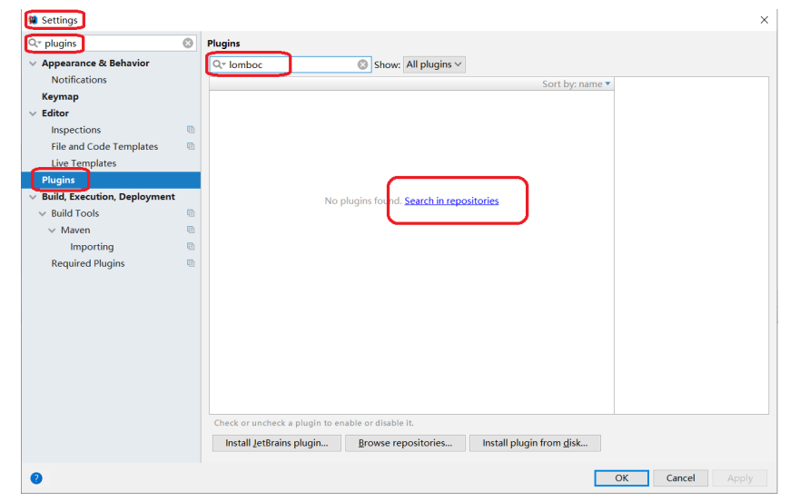
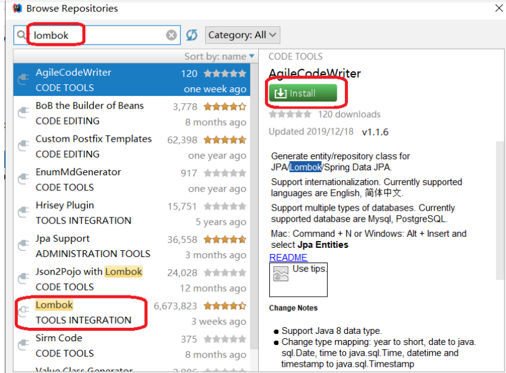
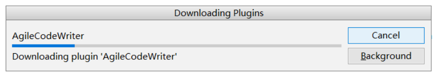
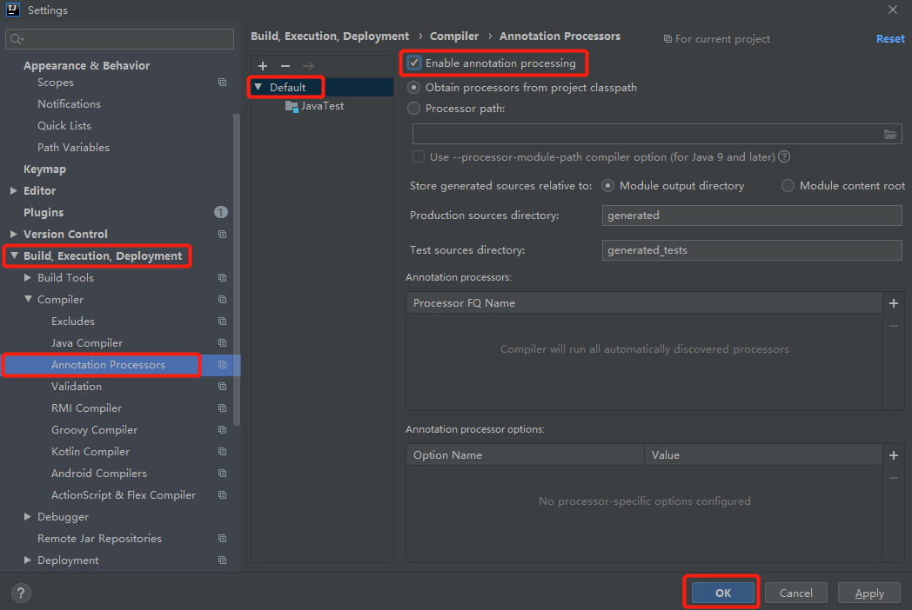
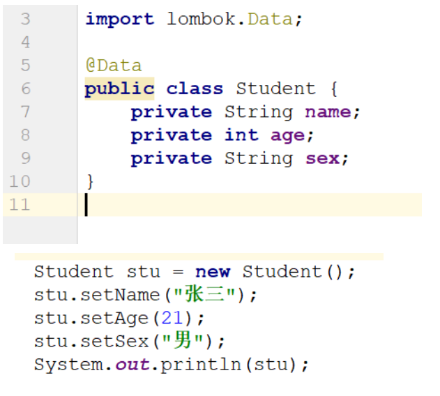

> <strong>本专栏将从基础开始，循序渐进，由浅入深讲解Java的基本使用，希望大家都能够从中有所收获，也请大家多多支持。</strong>
> <strong>专栏地址:[26天高效学习Java编程](https://blog.csdn.net/learning_xzj/category_11806176.html) </strong>
> <strong>相关软件地址:[软件地址](https://pan.baidu.com/s/1bXCZR0yxN2-v6NqDpe4H1g?pwd=1111) </strong>
> <strong>所有代码地址:[代码地址](https://gitee.com/codinginn/java-code) </strong>
> <strong> 如果文章知识点有错误的地方，请指正！大家一起学习，一起进步。</strong>
> <font color="red"><strong> 如果感觉博主的文章还不错的话，还请关注、点赞、收藏三连支持一下博主哦</strong></font>

@[toc]

## 本文内容

- 单例模式	
  - 饿汉式
  - 懒汉式
- 多例模式
- 枚举
  - 定义枚举
  - 使用枚举
- 工厂模式
- Lombok插件

# 1 单例设计模式

## 知识点-- 单例设计模式的概述

### 目标

正常情况下一个类可以创建多个对象

```java
public class Person{
    // 默认生成一个公共的空参构造方法
}
// 测试类
public static void main(String[] args) {
	// 正常情况下一个类可以创建多个对象
	Person p1 = new Person();
	Person p2 = new Person();
	Person p3 = new Person();
    // ...
}
```

但是有些时候的某些类, 我们希望只能创建单一的一个对象, 这时候我们需要使用到单例设计模式, 下面我们来介绍一下单例设计模式.

### 讲解

#### 单例设计模式的作用

单例模式，是一种常用的软件设计模式。**通过单例模式可以保证系统中，应用该模式的这个类只有一个实例**。即一个类只有一个对象实例。

#### 单例设计模式实现步骤

1. 将构造方法私有化，使其不能在类的外部通过new关键字实例化该类对象。
2. 在该类内部产生一个唯一的实例化对象
3. 定义一个静态方法返回这个唯一对象。

#### 例设计模式的类型

根据实例化对象的时机单例设计模式又分为以下两种:

1. 饿汉单例设计模式
2. 懒汉单例设计模式

## 知识点-- 饿汉式单例设计模式

### 目标

- 掌握单例设计模式的书写

### 路径

- 单例设计模式 --- 饿汉式

### 讲解

饿汉单例设计模式就是使用类的时候已经将对象创建完毕，不管以后会不会使用到该实例化对象，先创建了再说。很着急的样子，故被称为“饿汉模式”。

代码如下：

```java
public class Person {
    // 使用饿汉式单例设计模式: 比较着急,不管要不要获取我这个类的对象,先创建了该对象再说
    // 1. 将构造方法私有化，使其不能在类的外部通过new关键字实例化该类对象。
    private Person(){
    }

    // 2. 在该类内部产生一个唯一的实例化对象
    private static final Person p = new Person();

    // 3. 定义一个静态方法返回这个唯一对象。
    public static Person getInstance(){
        return p;
    }

    // ....
}

public class Test {
    public static void main(String[] args) {
        Person p1 = Person.getInstance();
        Person p2 = Person.getInstance();
        Person p3 = Person.getInstance();

        System.out.println(p1);
        System.out.println(p2);
        System.out.println(p3);

    }
}

```

## 知识点-- 懒汉式单例设计模式

### 目标

- 掌握懒汉式单例设计模式的书写

### 路径

- 单例设计模式 --- 懒汉式

### 讲解

懒汉单例设计模式就是调用getInstance()方法时实例才被创建，先不急着实例化出对象，等要用的时候才实例化出对象。不着急，故称为“懒汉模式”。

代码如下：

```java
public class Person {
    // 懒汉式单例: 不着急,只要当你调用了getInstance静态方法获取对象的时候,就创建,其他时候不创建
    // 1. 将构造方法私有化，使其不能在类的外部通过new关键字实例化该类对象。
    private Person(){

    }

    // 2. 在该类内部产生一个唯一的实例化对象
    private static Person p ;// 默认值为null

    // 3. 定义一个静态方法返回这个唯一对象。
    public static synchronized Person getInstance(){
        // 创建Person类的唯一对象
        // 判断一下,如果p这个成语变量的值为null,就创建,不为null,说明该对象已经创建了,直接返回即可
        if (p == null){
            p = new Person();
        }
        return p;
    }

    // ...
}

public class Test {
    public static void main(String[] args) {
        Person p1 = Person.getInstance();
        Person p2 = Person.getInstance();
        Person p3 = Person.getInstance();

        System.out.println(p1);
        System.out.println(p2);
        System.out.println(p3);


    }
}

```

> 注意：懒汉单例设计模式在多线程环境下可能会实例化出多个对象，不能保证单例的状态，所以加上关键字：synchronized，保证其同步安全。

### 小结

单例模式可以保证系统中一个类只有一个对象实例。

实现单例模式的步骤：

1. 将构造方法私有化，使其不能在类的外部通过new关键字实例化该类对象。
2. 在该类内部产生一个唯一的实例化对象，并且将其封装为private static类型的成员变量。
3. 定义一个静态方法返回这个唯一对象。

# 2 多例设计模式

## 知识点--多例设计模式

### 目标

- 掌握多例设计模式的书写

### 路径

- 多例设计模式的作用
- 实现步骤
- 实现代码
- 测试结果

### 讲解

#### 多例设计模式的作用

多例模式，是一种常用的软件设计模式。通过多例模式可以保证系统中，应用该模式的类有**固定数量**的实例。多例类要自我创建并管理自己的实例，还要向外界提供获取本类实例的方法。

#### 实现步骤

​	1.创建一个类,  将构造方法私有化，使其不能在类的外部通过new关键字实例化该类对象。

​	2.在该类内部产生固定数量的实例化对象 ----> 集合

​    3.提供一个静态方法来随机获取一个该类的实例化对象

#### 实现代码

```java
public class Person {
    // 使用多例设计模式: 保证程序运行期间该类只有固定数量的对象产生
    // 1.创建一个类,  将构造方法私有化，使其不能在类的外部通过new关键字实例化该类对象。
    private Person(){
    }

    // 2.在该类内部产生固定数量的实例化对象 ----> 集合  只能产生依次固定数量的对象

    // 2.1 定义一个存放该类对象的集合
    private static ArrayList<Person> list = new ArrayList<>();

    // 2.2 在静态代码块中,创建固定数量的对象,添加到集合中
    static {
        // 创建固定数量的该类对象
        for (int i = 0; i < 3; i++) {
            Person p = new Person();
            list.add(p);
        }
    }

    // 3.提高一个静态方法来随机获取一个该了的实例化对象
    public static Person getInstance(){
        // 创建一个Random对象
        Random r = new Random();
        // 随机产生一个list集合的索引
        int index = r.nextInt(list.size());// [0,3) 0,1,2
        // 根据索引获取对象
        Person p = list.get(index);
        // 返回对象
        return p;
    }
}

```

#### 测试结果

```java
public class Test {
    public static void main(String[] args) {
        for (int i = 0; i < 10; i++) {
            Person p1 = Person.getInstance();
            System.out.println(p1);
        }

    }
}

```


### 小结

多例模式可以保证系统中一个类有固定个数的实例, 在实现需求的基础上, 能够提高实例的复用性.

实现多例模式的步骤：

1. 创建一个类,  将构造方法私有化，使其不能在类的外部通过new关键字实例化该类对象。
2. 在类中定义存放类实例的list集合
3. 在类中提供静态代码块,在静态代码块中创建类的实例
4. 提供获取类实例的静态方法

# 3 枚举

## 知识点--枚举的概述和定义

### 目标

- 掌握枚举的定义和使用

### 讲解

#### 不使用枚举存在的问题

假设我们要定义一个人类，人类中包含姓名和性别。通常会将性别定义成字符串类型，效果如下：

```java
public class Person {
    private String name;
    private String sex;

    public Person() {
    }

    public Person(String name, String sex) {
        this.name = name;
        this.sex = sex;
    }
	
    // 省略get/set/toString方法
}
```

```java
public class Demo01 {
    public static void main(String[] args) {
        Person p1 = new Person("张三", "男");
        Person p2 = new Person("张三", "abc"); // 因为性别是字符串,所以我们可以传入任意字符串
    }
}
```

不使用枚举存在的问题：可以给性别传入任意的字符串，导致性别是非法的数据，不安全。

#### 枚举的概念

   枚举是一种引用数据类型,java中的枚举是有固定个数对象的"特殊类"。如果有些类的对象是固定个数的，就可以定义成枚举。比如性别,季节，方向。

#### 定义枚举的格式

```java
public enum 枚举名 {
    // 第一行都是罗列枚举实例,这些枚举实例直接写大写名字即可。
    实例,实例,实例,...；
}

public enum Sex {
   BOY, GIRL; 
}

public enum Season {
    SPRING, SUMMER, AUTUMN, WINTER;
}

public enum Direction{ 
    UP, RIGHT, DOWN, LEFT;
}
```

#### 枚举的使用

1. 定义枚举：BOY表示男，GIRL表示女

```java
enum Sex {
    BOY, GIRL; // 男，女
}
```

2. Perosn中的性别有String类型改为Sex枚举类型

```java
public class Person {
    private String name;
    private Sex sex;

    public Person() {
    }

    public Person(String name, Sex sex) {
        this.name = name;
        this.sex = sex;
    }
    // 省略get/set/toString方法
}
```

3. 使用是只能传入枚举中的固定值

```java
public class Demo02 {
    public static void main(String[] args) {
        // 使用枚举格式: 枚举类型.枚举值
        Person p1 = new Person("张三", Sex.BOY);
        Person p2 = new Person("张三", Sex.GIRL);
        Person p3 = new Person("张三", "abc");// 编译报错
    }
}
```

### 小结

```java
枚举定义:
	public enum 枚举名{
        枚举值,枚举值,枚举值,...
    }
枚举的使用:
	枚举类型 变量名 = 枚举名.枚举值;
```


## 知识点--枚举的其他内容( 不重要)

### 目标

- 了解枚举的其他内容

### 讲解

枚举的本质是一个使用了多例设计模式的类，所以枚举中还可以有成员变量，成员方法等。

枚举的本质是一个类，我们刚才定义的Sex枚举最终效果如下：

```java
public enum Sex {
    BOY, GIRL; // 男，女
}
```

```java
public enum Sex {
    BOY(18), GIRL(16);

    public int age;

    Sex(int age) {
        this.age = age;
    }

    public void showAge() {
        System.out.println("年龄是: " + age);
    }
}
```

```java
public class Demo03 {
    public static void main(String[] args) {
        Person p1 = new Person("张三", Sex.BOY);
        Person p2 = new Person("张三", Sex.GIRL);

        Sex.BOY.showAge();
        Sex.GIRL.showAge();
    }
}
```

运行效果：


# 4 工厂设计模式

## 知识点-- 工厂模式的概述

### 目标

- 工厂模式其实就是用来帮我们创建对象的, 那么它到底有哪些特点, 我们来学习一下.

### 讲解

#### 工厂模式的介绍

​    工厂模式（Factory Pattern）是 Java 中最常用的设计模式之一。这种类型的设计模式**属于创建型模式**，它提供了一种创建对象的最佳方式。之前我们创建类对象时, 都是使用new 对象的形式创建, 除new 对象方式以外, 工厂模式也可以创建对象.

耦合度: 类与类之间的关系,如果关系比较强,高耦合,  如果关系比较弱,低耦合,而**开发是要尽量低耦合**

10个类:

10个测试类:  每个测试类都要创建这10个类的对象

以前: 直接在测试类中通过new 来创建     这10个测试类和这10个类关系起来

工厂模式: 定义一个类,专门用来创建这10个类的对象, 并提供获取的方法,那这个时候测试类只需要跟工厂类关联  低耦合

#### 工厂模式的作用

将前端代码与要创建的对象分开，前端不需要直接创建对象，也就不需要关心创建对象时需要的数据。只需要通过工厂获取对象即可。 	

- 解决类与类之间的耦合问题

#### 案例演示

##### 需求

1. 编写一个Car接口, 提供run方法
2. 编写一个Falali类实现Car接口,重写run方法
3. 编写一个Benchi类实现Car接口,重写run方法

提供一个工厂类,可以用来生产汽车对象

##### 实现代码

1.编写一个Car接口, 提供run方法

```java
public interface Car {
    public void run();
}
```

2.编写一个Falali类实现Car接口,重写run方法

```java
public class Falali implements Car {
    @Override
    public void run() {
        System.out.println("法拉利以每小时500公里的速度在奔跑.....");
    }
}
```

3.编写一个Benchi类实现Car接口

```java
public class Benchi implements Car {
    @Override
    public void run() {
        System.out.println("奔驰汽车以每秒1米的速度在挪动.....");
    }
}
```

4.提供一个CarFactory(汽车工厂),用于生产汽车对象

```java
public class CarFactory {
    /**
     * @param id : 车的标识
     *           benchi : 代表需要创建Benchi类对象
     *           falali : 代表需要创建Falali类对象
     *           如果传入的车标识不正确,代表当前工厂生成不了当前车对象,则返回null
     * @return
     */
    public Car createCar(String id){
        if("falali".equals(id)){
            return new Falali();
        }else if("benchi".equals(id)){
            return new Benchi();
        }
        return null;
    }
}
```

5.定义CarFactoryTest测试汽车工厂

```java
public class CarFactoryTest {
    public static void main(String[] args) {
        CarFactory carFactory = new CarFactory();
        Car benchi = carFactory.createCar("benchi");
        benchi.run();
        Car falali = carFactory.createCar("falali");
        falali.run();
    }
}
```

### 小结

- 工厂模式的存在可以改变创建类的对象的方式,解决类与类之间的耦合.

# 第六章 Lombok

## 知识点-- Lombok的使用

### 目标

- 能够使用Lombok

### 讲解

 lombok介绍

-  lombok可以使用注解的方式让一些代码变的简洁 方便
-  实体类中有一些固定的代码：构造方法，getter/setter、equals、hashcode、toString方法都是固定的，写出来看着比较麻烦。而Lombok能通过注解的方式，在编译时自动为属性生成这些代码。

 lombok使用

​	1. 添加lombox的jar包：

​		将lombok.jar(本例使用版本：1.18.10)，添加到模块目录下，并添加到ClassPath



​	2. 为IDEA添加lombok插件（**连接网络使用）**

- 第一步




- 第二步：



- 第三步：



- 第四步：



1. **安装完毕后，重启IDEA。**

2. 新建一个类：Student

   

####  lombok常用注解

- @Getter和@Setter

  - 作用：生成成员变量的get和set方法。
  - 写在成员变量上，指对当前成员变量有效。
  - 写在类上，对所有成员变量有效。
  - 注意：静态成员变量无效。

- @ToString：

  - 作用：生成toString()方法。
  - 该注解只能写在类上。

- @NoArgsConstructor和@AllArgsConstructor

  - @NoArgsConstructor：无参数构造方法。
  - @AllArgsConstructor：满参数构造方法。
  - 注解只能写在类上。

- @EqualsAndHashCode

  - 作用：生成hashCode()和equals()方法。
  - 注解只能写在类上。

- @Data

  - 作用： 生成setter/getter、equals、hashCode、toString方法，如为final属性，则不会为该属性生成setter方法。 

  - 注解只能写在类上。

# 扩展-动态代理

```java

import java.lang.reflect.InvocationHandler;
import java.lang.reflect.Method;
import java.lang.reflect.Proxy;
import java.util.ArrayList;
import java.util.Arrays;
import java.util.Collection;
import java.util.Iterator;

//@SuppressWarnings("all")
public class Test {
    public static void main(String[] args) {
        /*
            对Collection接口进行代理，以前的remove(Object obj)方法是删除集合中第一次出现的元素
            (比如集合中有多个“abc”,调用remove(“abc”)后只会删除一个元素)。
            代理后，要求在调用remove(Object obj)方法后，能够删除集合中所有匹配的元素。【动态代理】
         */
        // 创建ArrayList集合
        Collection<String> col = new ArrayList<>();
        // 添加元素
        col.add("abc");
        col.add("abc");
        col.add("bac");
        col.add("abc");
        col.add("abc");
        col.add("abc");
        System.out.println("删除前:" + col);// 删除前:[abc, abc, bac, abc, abc, abc]


//        // 集合对象删除元素
//        boolean res = col.remove("abc");
//        System.out.println(res);// true
//        System.out.println("删除后:"+col);// 删除后:[abc, bac, abc, abc, abc]


        // 动态代理增强remove方法，删除所有的指定元素
        Collection<String> proxy = (Collection<String>) Proxy.newProxyInstance(col.getClass().getClassLoader(), col.getClass().getInterfaces(), new InvocationHandler() {
            @Override
            public Object invoke(Object proxy, Method method, Object[] args) throws Throwable {
                /*
                    invoke方法:
                        参数1proxy:表示生成的代理对象,一般不用
                        参数2method:表示代理对象调用的方法
                        参数3args:表示代理对象调用方法传入的实际参数
                        返回值:表示代理对象调用方法的返回值
                 */
                // 代理对象调用方法就会来到这里,所以增强方法的代码就写在这,就可以了
                // 被代理对象执行一次代理对象调用的方法,来确定返回值  删除一个

                Object res = method.invoke(col, args);

                //在原来的方法上增加一些操作
                if (method.getName().equals("remove")) {
                    // 删除剩余的
                    // 获取col集合对象的迭代器
                    Iterator<String> it = col.iterator();
                    // 使用迭代器进行遍历
                    while (it.hasNext()) {
                        // 在循环中,判断遍历出来的元素是否是要删除的元素
                        String e = it.next();
                        if (e.equals(args[0])) {
                            // 如果是,就删除
                            it.remove();
                        }
                    }
                }

                if (method.getName().equals("toArray")) {
                    System.out.println("增强toArray方法...");

                }

                return res;

            }
        });

        // 代理对象删除元素
        boolean res = proxy.remove("abc");
        System.out.println(res);//true
        System.out.println("删除后:" + col);// 删除后:[bac]


        Object[] arr = proxy.toArray();
        System.out.println(arr);
        System.out.println(Arrays.toString(arr));

    }
}
```

