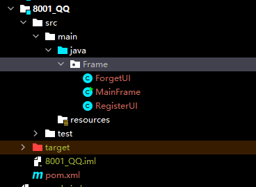
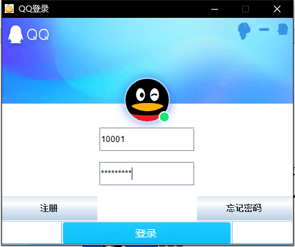
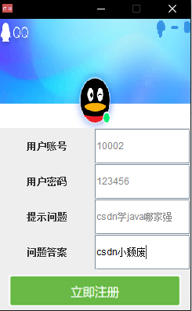
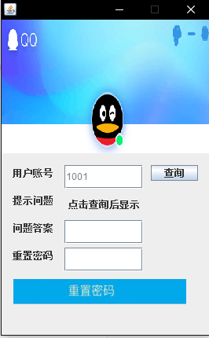
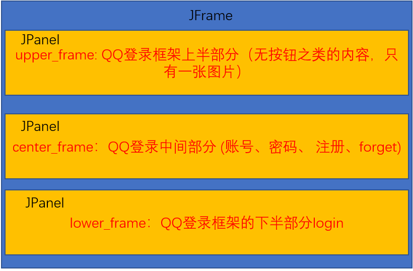
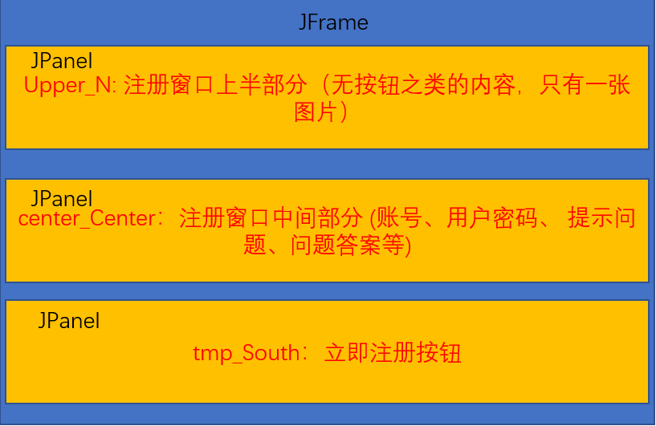
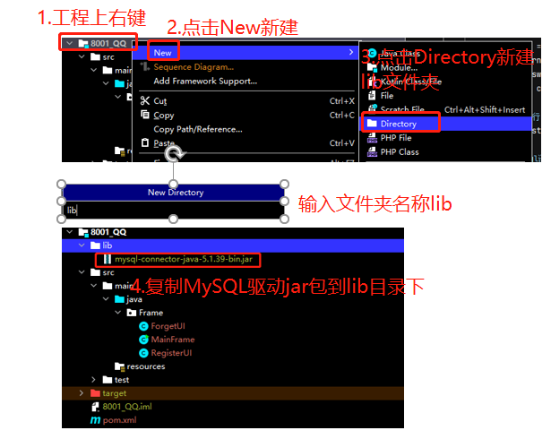
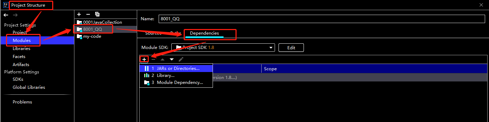
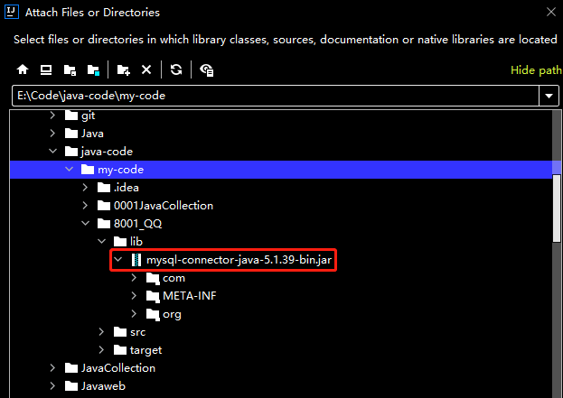

> <strong>本专栏将从基础开始，循序渐进，由浅入深讲解Java的基本使用，希望大家都能够从中有所收获，也请大家多多支持。</strong>
> <strong>专栏地址:[26天高效学习Java编程](https://blog.csdn.net/learning_xzj/category_11806176.html) </strong>
> <strong>相关软件地址:[软件地址](https://pan.baidu.com/s/1bXCZR0yxN2-v6NqDpe4H1g?pwd=1111) </strong>
> <strong>所有代码地址:[代码地址](https://gitee.com/codinginn/java-code) </strong>
> <strong> 如果文章知识点有错误的地方，请指正！大家一起学习，一起进步。</strong>
> <font color="red"><strong> 如果感觉博主的文章还不错的话，还请关注、点赞、收藏三连支持一下博主哦</strong></font>

@[toc]


> 大家好，今天用Java的==awt组件==、==swing组件==以及==JDBC==写了一个==仿QQ登录==的界面，具体演示如下图所示，包括三个页面，分别**是登录窗口（MainFrame）**、**注册窗口（RegisterUI）**和**忘记密码窗口(ForgetUI)**。本文主要应用的技术有:==JAVA-GUI、JAVA的awt组件、swing组件、事件处理、JDBC==等，是初学者学习和练手的好项目。准备好了吗，<font color="red">let's get it!</font>

## 项目结构及结果展示

该项目的结构如下图所示:



主要有三个类:

+ MainFrame是登录窗口的GUI类，效果图如下:



+ RegisterUI是注册窗口的GUI类，效果图如下:



+ ForgetUI是忘记密码窗口的GUI类，效果图如下:



## 代码展示

在进行代码展示前，先对Swing组件常见的控件类进行介绍，Swing组件常见的控件类有以下几种:

> JLabel 标签主要用于展示 ==文本== 或 ==图片==，也可以 ==同时显示文本和图片==
> JButton ==点击事件==
> JTextArea 编辑单行的==文本框==
> JPasswordArea 一个只能==输入数字的密码框== 把输入的内容用其他字符回显
> JTabledPlan ==选项卡面板==。它允许用户通过点击给定标题或图标的选项卡，在一组组件之间进行切换显示
> JCheckBox ==复选框==，是否被选中
> JPanel相当于将整个窗体==划分成几个面板==，然后在面板中使用==布局管理器==（管理按钮的布局）一个窗口==只能有一个JFrame==，能==有多个JPlane==l
> Imagin.SCALE_DEFAULT ==自适应JLabel的大小==
> getScaledInstance 创建此==图像的缩放版本==。返回一个新的 image 对象，默认情况下，该对象按指定的 width 和 height 呈现图像。即使已经完全加载了初始源图像，新的 image 对象也可以被异步加载
> SetIcon==图标将会被自动地放到按钮的上面==,缺省时居中放置
> setborderpainted 如果==进度条==应该绘制边框，则为 true；否则为 false

MainFrame的布局如下图所示:



MainFrame的代码如下:

```java
package Frame;

import java.awt.BorderLayout;
import java.awt.Color;
import java.awt.Cursor;
import java.awt.GridLayout;
import java.awt.Image;
import java.awt.event.ActionEvent;
import java.awt.event.ActionListener;
import java.awt.event.FocusEvent;
import java.awt.event.FocusListener;

import javax.swing.BorderFactory;
import javax.swing.ImageIcon;
import javax.swing.JButton;
import javax.swing.JFrame;
import javax.swing.JLabel;
import javax.swing.JOptionPane;
import javax.swing.JPanel;
import javax.swing.JPasswordField;
import javax.swing.JTextField;


public class MainFrame extends JFrame implements ActionListener, FocusListener {
   private static final long serialVersionUID = 1L;
   private static final String _txt_account = "QQ密码/手机/邮箱";
   private static final String _txt_pwd = "密码";
   private static final String _txt_title = "QQ登录";
   private static final String _txt_registe = "注册";
   private static final String _txt_forget = "忘记密码";
   private static final String _txt_blank = "";
   
   private JTextField account;
   private JPasswordField pwd;

   private JLabel upper_frame;
   private JPanel lower_frame, center_frame;

   private JButton login, register, forget;

   MainFrame() {
      //控件的初始化
      init();

      add(upper_frame, BorderLayout.NORTH);
      add(center_frame, BorderLayout.CENTER);
      add(lower_frame, BorderLayout.SOUTH);
      ImageIcon logo = new ImageIcon("D:/image/logo.jpg"); //左上方小图标
      setIconImage(logo.getImage());
      setBounds(500, 230, 430, 360); //设定大小及位置
      setResizable(false); //登录框大小固定，不允许通过拖、拉改变大小
      setDefaultCloseOperation(JFrame.HIDE_ON_CLOSE); //设置窗口右上角的叉号，点击叉号窗口关闭 注意不能EXIT_ON_CLOSE做参数的，用它时候使用的是System.exit方法退出应用程序。故会关闭所有窗口。
      setTitle(_txt_title);
      setVisible(true); //说明数据模型已经构造好了,允许JVM可以根据数据模型执行paint方法开始画图并显示到屏幕上，一般放在最后一句
   }
    
   public void init() {
      //账号输入块
      account = new JTextField(_txt_account);
      account.setName("account");
      account.setForeground(Color.gray);
      account.addFocusListener(this); //产生事件响应用户行为

      //密码输入块
      pwd = new JPasswordField(_txt_pwd);
      pwd.setName("pwd");
      pwd.setForeground(Color.gray);
      pwd.setEchoChar('\0'); //启动后密码框内一定为 “密码”
      pwd.addFocusListener(this);

      //注册模块
      register = new JButton(_txt_registe);
      register.setBorderPainted(false);
      register.setBorder(BorderFactory.createRaisedBevelBorder()); //斜面边框（凸）
      register.setCursor(Cursor.getPredefinedCursor(Cursor.HAND_CURSOR)); 
      register.addActionListener(this);

      //忘记密码模块
      forget = new JButton(_txt_forget);
      forget.setBorderPainted(false);
      forget.setBorder(BorderFactory.createRaisedBevelBorder());
      forget.setCursor(Cursor.getPredefinedCursor(Cursor.HAND_CURSOR)); 
      forget.addActionListener(this);
            
      //login按钮模块
      login = new JButton();
      ImageIcon login_image = new ImageIcon("D:/image/login_image.png");
      login_image.setImage(login_image.getImage().getScaledInstance(430, 35, Image.SCALE_DEFAULT));
      login.setIcon(login_image);
      login.setBackground(Color.white);
      login.setBorderPainted(false); //如果进度条应该绘制边框，则为 true；否则为 false
      login.setBorder(null); //设置此组件的边框 无
      login.setCursor(Cursor.getPredefinedCursor(Cursor.HAND_CURSOR)); //将光标设为 “小手”形状
      login.addActionListener(this);
                  
      //qq登录框架上半部分（无按钮之类的内容，只有一张图片）
      ImageIcon upper_image = new ImageIcon("D:/image/upper_image.png");
      upper_image.setImage(upper_image.getImage().getScaledInstance(430, 160, Image.SCALE_DEFAULT));
      upper_frame = new JLabel(upper_image);
            
      //qq登录中间部分 (账号、密码、 注册、forget)
      center_frame = new JPanel();
      center_frame.setName("center_frame");
      center_frame.setLayout(null);
      center_frame.setLayout(new GridLayout(3, 3, 3, 15)); //这里用到3行3列的空间, 用空格填充
      center_frame.add(new JLabel(_txt_blank, JLabel.CENTER));
      center_frame.add(account);
      center_frame.add(new JLabel(_txt_blank, JLabel.CENTER));
      center_frame.add(new JLabel(_txt_blank, JLabel.CENTER));
      center_frame.add(pwd);
      center_frame.add(new JLabel(_txt_blank, JLabel.CENTER));
      center_frame.add(register);
      center_frame.add(new JLabel(_txt_blank, JLabel.CENTER));
      center_frame.add(forget);
      center_frame.setBackground(Color.white);
            
      //qq登录框架的下半部分login
      lower_frame = new JPanel();
      lower_frame.setName("lower_frame");
      lower_frame.setLayout(null);
      //lower_frame.setLayout(new GridLayout(1, 3, 3, 15));
      lower_frame.setLayout(new GridLayout(0, 1)); 
      lower_frame.add(login);
   }
   //按钮的点击事件用actionPerformed
   @Override
   public void actionPerformed(ActionEvent e){
      /*
       * 1：如果点击了登录按钮 首先判断帐号或者密码是否为空 
       * 2：如果点击了注册账号就弹出注册页面
       * 3：如果点击了忘记密码弹出找回密码页面
       */
      //处理登录(login)页面
      if(e.getSource() == login){
         String user_name = account.getText().trim();
         String user_pwd = new String(pwd.getPassword()).trim();
         if("".equals(user_name)) {
            JOptionPane.showMessageDialog(null, "请输入帐号！！");
            return;
         }
         if("".equals(user_pwd)) {
            JOptionPane.showMessageDialog(null, "请输入密码！！");
            return;
         }

      }

      //处理注册(register)页面
      if(e.getSource() == register){
         RegisterUI registerUI = new RegisterUI(this);
      }

      //处理找回密码(forget)页面
      if(e.getSource() == forget){
         ForgetUI forgetUI = new ForgetUI(this);
      }
         
   }
   
   //鼠标的点击或移动之类的用focuslistener
   @Override
   public void focusGained(FocusEvent e) {
      //处理账号输入框
       if(e.getSource() == account){
         if(_txt_account.equals(account.getText())){
            account.setText("");
            account.setForeground(Color.BLACK);
         }
      }
       
      //处理密码输入框
      if(e.getSource() == pwd){
         if(_txt_pwd.equals(pwd.getText())){
            pwd.setText("");
            pwd.setEchoChar('*');
            pwd.setForeground(Color.BLACK);
         }
      }
      
   }
   
   @Override
   public void focusLost(FocusEvent e) {
      //处理账号输入框
      if(e.getSource() == account){
         if("".equals(account.getText())){
            account.setForeground(Color.gray);
            account.setText(_txt_account);
         }
      }
       
      //处理密码输入框
      if(e.getSource() == pwd){
         if("".equals(pwd.getText())){
            pwd.setForeground(Color.gray);
            pwd.setText(_txt_pwd);
            pwd.setEchoChar('\0');
         }
      }

   }
   
   
   public static void main(String[] args) {
      MainFrame mainframe = new MainFrame();
   }

}
```

RegisterUI的布局和MainFrame的类似，如下图所示:



RegisterUI的代码如下:

```java
package Frame;

import java.awt.BorderLayout;
import java.awt.Color;
import java.awt.Cursor;
import java.awt.GridLayout;
import java.awt.Image;
import java.awt.event.ActionEvent;
import java.awt.event.ActionListener;
import java.awt.event.FocusEvent;
import java.awt.event.FocusListener;

import javax.swing.ImageIcon;
import javax.swing.JButton;
import javax.swing.JFrame;
import javax.swing.JLabel;
import javax.swing.JOptionPane;
import javax.swing.JPanel;
import javax.swing.JTextField;


public class RegisterUI extends JFrame implements ActionListener, FocusListener {
   private static final long serialVersionUID = 1L;
   private JLabel upper_N, user_name_txt, user_pwd_txt, user_ques_txt, user_ans_txt; //显示文字用
   private JButton register_button_S;
   private JTextField user_name, user_pwd, user_ques, user_ans; //在这里面获取用户输入
   private JPanel tmp_South, center_Center;
   private MainFrame mainFrame; //用于关闭登录页面 如果注册成功则将刚开始的注册页面关闭

   
   public RegisterUI(MainFrame mainFrame) {
      
      this.mainFrame = mainFrame;
      
      //初始化界面
      init();
      
      //合成整体
      add(center_Center, BorderLayout.CENTER);
      add(upper_N, BorderLayout.NORTH);
      add(tmp_South, BorderLayout.SOUTH);
      
      //位置、页面大小设置
      setSize(250, 400);
      setLocation(550, 300);
      ImageIcon logo = new ImageIcon("D:/image/register_image.png"); //左上方小图标
      setIconImage(logo.getImage());
      setDefaultCloseOperation(JFrame.HIDE_ON_CLOSE);
      setResizable(false);
      setVisible(true);
   }
   public void init() {
      
      //上方图片部分构造 上 即为 北
      ImageIcon upper_image = new ImageIcon("D:/image/register_background_image.jpg");
      upper_image.setImage(upper_image.getImage().getScaledInstance(250, 139,
            Image.SCALE_DEFAULT));
      upper_N = new JLabel(upper_image);
      
      //下方注册图片构造 下 即为 南
      tmp_South = new JPanel(); //作为一个容器来放确认注册按钮
      register_button_S = new JButton();
      ImageIcon conform_register_image = new ImageIcon("D:/image/conform_register_image.png");
      conform_register_image.setImage(conform_register_image.getImage().getScaledInstance(220, 40, Image.SCALE_DEFAULT));
      register_button_S.setIcon(conform_register_image);
      // 不绘制边框
      register_button_S.setBorderPainted(false);
      // 设置边框为空
      register_button_S.setBorder(null);
      register_button_S.setCursor(Cursor.getPredefinedCursor(Cursor.HAND_CURSOR));
      register_button_S.addActionListener(this); //产生事件响应用户行为
      tmp_South.add(register_button_S);
      
      //中间部分内容
      center_Center = new JPanel();
      user_name_txt = new JLabel("用户账号", JLabel.CENTER);
      user_pwd_txt = new JLabel("用户密码", JLabel.CENTER);
      user_ques_txt = new JLabel("提示问题", JLabel.CENTER);
      user_ans_txt = new JLabel("问题答案", JLabel.CENTER);
      user_name = new JTextField();
      user_pwd = new JTextField();
      user_ques = new JTextField();
      user_ans = new JTextField();
      user_name.addFocusListener(this);
      user_pwd.addFocusListener(this);
      user_ans.addFocusListener(this);
      user_ques.addFocusListener(this);
      center_Center.setLayout(new GridLayout(4, 2));
      center_Center.add(user_name_txt);
      center_Center.add(user_name);
      center_Center.add(user_pwd_txt);
      center_Center.add(user_pwd);
      center_Center.add(user_ques_txt);
      center_Center.add(user_ques);
      center_Center.add(user_ans_txt);
      center_Center.add(user_ans);
      
   }
   public void actionPerformed(ActionEvent e) {
      /*
       * 如果点击了登录按钮 首先判断帐号或者密码是否为空
       */
      if (e.getSource() == register_button_S) {
         String username = user_name.getText().trim();
         String password =  user_pwd.getText().trim();
         String userques = user_ques.getText().trim();
         String userans = user_ans.getText().trim();
         if ("".equals(username) || username == null) {
            JOptionPane.showMessageDialog(null, "请输入帐号！！");
            return;
         }
         if ("".equals(password) || password == null) {
            JOptionPane.showMessageDialog(null, "请输入密码！！");
            return;
         }
         
         if ("".equals(userques) || userques == null) {
            JOptionPane.showMessageDialog(null, "请输入问题！！");
            return;
         }
         if ("".equals(userans) || userans == null) {
            JOptionPane.showMessageDialog(null, "请输入答案！！");
            return;
         }

      }

   }
   //鼠标的点击或移动之类的用focuslistener
   @Override
   public void focusGained(FocusEvent e) {
      //处理账号输入框
       if(e.getSource() == user_name){
          user_name.setForeground(Color.BLACK);
       }
          
       //处理密码输入框
       if(e.getSource() == user_pwd){
          user_pwd.setForeground(Color.BLACK);
       }
       
     //处理问题输入框
       if(e.getSource() == user_ques){
          user_ques.setForeground(Color.BLACK);
       }
          
       //处理答案输入框
       if(e.getSource() == user_ans){
          user_ans.setForeground(Color.BLACK);
       }
       
   }
   @Override
   public void focusLost(FocusEvent e) {
      //处理账号输入框
       if(e.getSource() == user_name){
          user_name.setForeground(Color.gray);
       }
          
       //处理密码输入框
       if(e.getSource() == user_pwd){
          user_pwd.setForeground(Color.gray);
       }
       
     //处理问题输入框
       if(e.getSource() == user_ques){
          user_ques.setForeground(Color.gray);
       }
          
       //处理答案输入框
       if(e.getSource() == user_ans){
          user_ans.setForeground(Color.gray);
       }
   }

}
```

为了掌握多种布局方式，这里RegisterUI采用的是绝对布局，相关代码如下:

```java
package Frame;

import java.awt.Color;
import java.awt.Cursor;
import java.awt.Image;
import java.awt.event.ActionEvent;
import java.awt.event.ActionListener;
import java.awt.event.FocusEvent;
import java.awt.event.FocusListener;

import javax.swing.ImageIcon;
import javax.swing.JButton;
import javax.swing.JFrame;
import javax.swing.JLabel;
import javax.swing.JOptionPane;
import javax.swing.JTextField;


public class ForgetUI extends JFrame implements ActionListener, FocusListener{
   private static final long serialVersionUID = 1L;
   private JLabel upper_N, user_name_txt, user_pwd_txt, user_ques_txt, user_ans_txt, user_ques; //显示文字用
   private JButton forget_button_S, submit_button;
   private JTextField user_name, user_pwd, user_ans; //在这里面获取用户输入
   private MainFrame mainFrame; //用于关闭登录页面 如果修改密码成功则将刚开始的注册页面关闭
   
   public ForgetUI(MainFrame mainFrame) {
      this.mainFrame = mainFrame;
      //页面构造
      init();
      //合成整体
      add(upper_N);
      add(user_name_txt);
      add(user_name);
      add(submit_button);
      add(user_ques_txt);
      add(user_ques);
      add(user_ans_txt);
      add(user_ans);
      add(user_pwd_txt);
      add(user_pwd);
      add(forget_button_S);
      
      //位置、页面大小设置
      setSize(270, 430);
      setLocation(550, 300);
      setLayout(null); //手工布局 与其他页面不同 
      ImageIcon logo = new ImageIcon("D:/image/register_image.jpg"); //左上方小图标
      setIconImage(logo.getImage());
      setDefaultCloseOperation(JFrame.HIDE_ON_CLOSE);
      setResizable(false);
      setVisible(true);     
   }
   
   public void init() {
      //上方图片部分构造 上 即为 北
      ImageIcon upper_image = new ImageIcon("D:/image/forget_background_image.png");
      upper_image.setImage(upper_image.getImage().getScaledInstance(270, 170,
            Image.SCALE_DEFAULT));
      upper_N = new JLabel(upper_image);
      upper_N.setLocation(0,0); //确定位置
      upper_N.setSize(270, 170); //设置大小
      
      
      //中间部分内容 绝对位置
      user_name_txt = new JLabel("用户账号", JLabel.CENTER);
      user_name_txt.setSize(60, 20);
      user_name_txt.setLocation(10, 185);
      
      submit_button = new JButton();
      submit_button.setText("查询");
      submit_button.setCursor(Cursor.getPredefinedCursor(Cursor.HAND_CURSOR));
      submit_button.setSize(60, 20);
      submit_button.setLocation(190, 185);
      submit_button.addActionListener(this); //产生事件响应用户行为
      
      user_ques_txt = new JLabel("提示问题", JLabel.CENTER);
      user_ques_txt.setSize(60, 20);
      user_ques_txt.setLocation(10, 220);
      
      user_ans_txt = new JLabel("问题答案", JLabel.CENTER);
      user_ans_txt.setSize(60, 20);
      user_ans_txt.setLocation(10, 255);
      
      user_pwd_txt = new JLabel("重置密码", JLabel.CENTER);
      user_pwd_txt.setSize(60, 20);
      user_pwd_txt.setLocation(10, 290);
      
      user_name = new JTextField();
      user_name.setSize(100, 30);
      user_name.setLocation(80, 185);
      
      user_ques = new JLabel("点击查询后显示", JLabel.CENTER);
      user_ques.setSize(100, 30);
      user_ques.setLocation(80, 220);
      
      user_ans = new JTextField();
      user_ans.setSize(100, 30);
      user_ans.setLocation(80, 255);
      
      user_pwd = new JTextField();
      user_pwd.setSize(100, 30);
      user_pwd.setLocation(80, 290);
      
         
      user_name.addFocusListener(this);
      user_pwd.addFocusListener(this);
      user_ans.addFocusListener(this);
      
      
      //下方注册图片构造 下 即为 南
      forget_button_S = new JButton();
      ImageIcon conform_register_image = new ImageIcon("D:/image/conform_forget_image.png");
      conform_register_image.setImage(conform_register_image.getImage().getScaledInstance(220, 32, Image.SCALE_DEFAULT));
      forget_button_S.setIcon(conform_register_image);
      forget_button_S.setBorderPainted(false);
      forget_button_S.setBorder(null);
      forget_button_S.setCursor(Cursor.getPredefinedCursor(Cursor.HAND_CURSOR));
      forget_button_S.setSize(220, 32);
      forget_button_S.setLocation(15, 330);
      forget_button_S.addActionListener(this); //产生事件响应用户行为
         
   }
   
   public void actionPerformed(ActionEvent e) {
      
      if(e.getSource() == submit_button) {
         String username = user_name.getText().trim();
         if("".equals(username) || username == null) {
            JOptionPane.showMessageDialog(null, "请输入帐号！！");
            return;
         } else {

         }
      }
      if (e.getSource() == forget_button_S) {
         if(user_name == null ) {
            JOptionPane.showMessageDialog(null, "请输入正确账号并点击查询"); 
            return;
         } 
         
         String newpwd = user_pwd.getText();
         if(newpwd == null || "".equals(newpwd)) {
            JOptionPane.showMessageDialog(null, "请输入新密码"); 
            return;
         }

         
         String userans = user_ans.getText();
         
         if(userans == null || "".equals(userans)) {
            JOptionPane.showMessageDialog(null, "请输入答案");
            
            return;
         }
         
         
      }
   }
   
   //鼠标的点击或移动之类的用focuslistener 这里不知道为啥没变色 （哭
   @Override
   public void focusGained(FocusEvent e) {
      //处理账号输入框
       if(e.getSource() == user_name){
          user_name.setForeground(Color.BLACK);
       }
          
       //处理密码输入框
       if(e.getSource() == user_pwd){
          user_pwd.setForeground(Color.BLACK);
       }
       
     //处理问题输入框
       if(e.getSource() == user_ques){
          //user_ques.setForeground(Color.BLACK);
       }
          
       //处理答案输入框
       if(e.getSource() == user_ans){
          user_ans.setForeground(Color.BLACK);
       }
       
   }
   @Override
   public void focusLost(FocusEvent e) {
      //处理账号输入框
       if(e.getSource() == user_name){
          user_name.setForeground(Color.gray);
       }
          
       //处理密码输入框
       if(e.getSource() == user_pwd){
          user_pwd.setForeground(Color.gray);
       }
       
     //处理问题输入框
       if(e.getSource() == user_ques){
          //user_ques.setForeground(Color.gray);
       }
          
       //处理答案输入框
       if(e.getSource() == user_ans){
          user_ans.setForeground(Color.gray);
       }
   }

}
```

以上仿QQ实现了QQ的登录功能，但是对于登录只做了简单的是否为空的校验，并没有使用数据库进行查询，可以通过以下方式创建并使用数据库进行增删查改:

**创建数据库,并创建User表**

```mysql
create database MyQQ;

use MyQQ;

create table user(
	id int primary key auto_increment,
	username varchar(20),
	password varchar(20),
       question varchar(100),
       answer varchar(100)
);

INSERT INTO `USER` VALUES(null,'10001','123456','csdnJava哪家强','每天都要努力的小颓废');
```

**将驱动jar包导入项目**（jar包地址在[软件地址](https://pan.baidu.com/s/1bXCZR0yxN2-v6NqDpe4H1g?pwd=1111) 的mysql目录）:






 



 

JDBC操作代码如下:

```java
import com.mysql.jdbc.Driver;

import java.sql.Connection;
import java.sql.DriverManager;
import java.sql.ResultSet;
import java.sql.Statement;

public class Test {
    public static void main(String[] args) throws Exception{
        // 	需求:查询所有的用户, 输出到控制台
        // 分析:
        // 1.创建项目,拷贝驱动jar包到模块下,并添加到classpath路径中
        // 2.注册驱动
        DriverManager.registerDriver(new Driver());

        // 3.获得连接
        String url = "jdbc:mysql://localhost:3306/db_mybatis";
        String username = "root";
        String password = "root";
        Connection connection = DriverManager.getConnection(url,username,password);

        // 4.创建执行sql的对象
        Statement statement = connection.createStatement();

        // 5.执行sql语句,处理结果
        String sql = "select * from user";
        ResultSet resultSet = statement.executeQuery(sql);
        while (resultSet.next()) {
            // 取出来
            //System.out.print(resultSet.getObject("id")+" ");
            //System.out.print(resultSet.getObject("username")+" ");
            //System.out.print(resultSet.getObject("password")+" ");
            //System.out.println(resultSet.getObject("question")+" ");
            //System.out.println(resultSet.getObject("answer"));
            System.out.print(resultSet.getObject(1)+"  ");
            System.out.print(resultSet.getObject(2)+"  ");
            System.out.print(resultSet.getObject(3)+"  ");
            System.out.println(resultSet.getObject(4)+"  ");
            System.out.println(resultSet.getObject(5));
            System.out.println("------------------------------------------------");
        }

        username = "10001";
        password = "1234567";
        // 5.2 判断用户名密码是否正确
        sql = "select * from user where username = " + username + " and password =" + password;
        resultSet = statement.executeQuery(sql);
        //登录失败
        if(resultSet.next()){
            System.out.println("登录成功");
        }
        else{
            System.out.println("登录失败");
        }

        // 6.释放资源
        if (resultSet != null){
            resultSet.close();
        }

        if (statement != null){
            statement.close();
        }

        if (connection != null){
            connection.close();
        }
    }
}

```

以上仅演示了简单的JDBC操作，由于篇幅有限，这里暂不介绍如何防登录注入、JDBC工具类的提取以及数据库连接池，后续再进行介绍。

<font color="red">需要注意以上代码中的图片路径使用的是绝对路径，大家可以根据自己需要进行替换，代码已上传至Gitee，如果文章知识点有错误的地方，请指正！大家一起学习，一起进步，谢谢！</font>

