# 1. Git概述

​	Git 是一个免费的、开源的**分布式版本控制系统**，可以快速高效地处理从小型到大型的各种项目。 

​	Git 易于学习，占地面积小，性能极快。 它具有廉价的本地库，方便的暂存区域和多个工作 流分支等特性。其性能优于 Subversion、CVS、Perforce 和 ClearCase 等版本控制工具。

## 1.1 何为版本控制

​	版本控制是一种记录文件内容变化，以便将来查阅特定版本修订情况的系统。 

​	版本控制其实最重要的是可以记录文件修改历史记录，从而让用户能够查看历史版本， 方便版本切换。

## 1.2 为什么需要版本控制

​	个人开发过渡到团队协作。

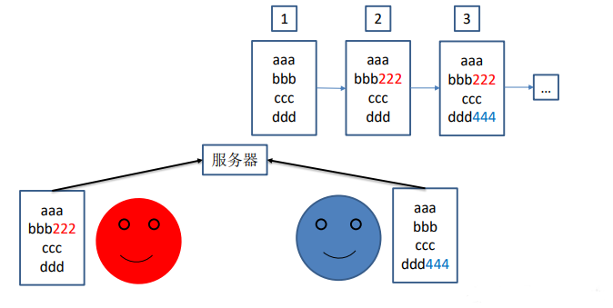

## 1.3 版本控制工具


### 1.3.1 集中式版本控制工具

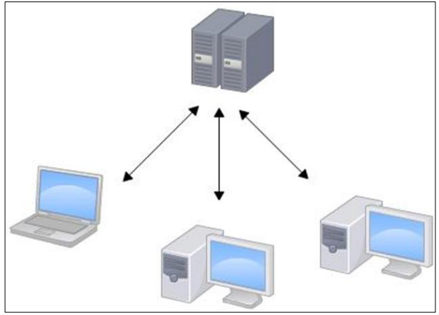

​	集中化的版本控制系统诸如 CVS、SVN 等，都有一个单一的集中管理的服务器，保存所有文件的修订版本，而协同工作的人们都通过客户端连到这台服务器，取出最新的文件或者提交更新。多年以来，这已成为版本控制系统的标准做法。 

​	这种做法带来了许多好处，每个人都可以在一定程度上看到项目中的其他人正在做些什 么。而管理员也可以轻松掌控每个开发者的权限，并且管理一个集中化的版本控制系统。这么做显而易见的缺点是中央服务器的单点故障。如果服务器宕机一小时，那么在这一小时内，谁都无法提交更新，也就无法协同工作。

### 1.3.2 分布式版本控制工具

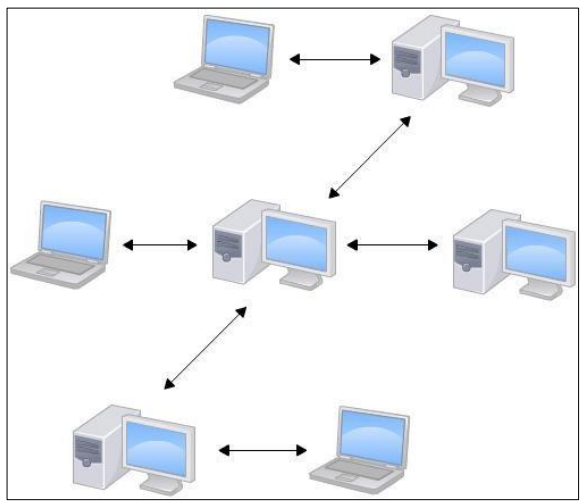

​	像 Git 这种分布式版本控制工具，客户端提取的不是最新版本的文件快照，而是把代码仓库完整地镜像下来（本地库）。这样任何一处协同工作用的文件发生故障，事后都可以用其他客户端的本地仓库进行恢复。因为每个客户端的每一次文件提取操作，实际上都是一次对整个文件仓库的完整备份。 

分布式的版本控制系统出现之后,解决了集中式版本控制系统的缺陷: 

1. 服务器断网的情况下也可以进行开发（因为版本控制是在本地进行的）
2. 每个客户端保存的也都是整个完整的项目（包含历史记录，更加安全）

## 1.4 Git工作机制

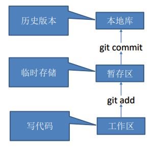

​	代码托管中心是基于网络服务器的远程代码仓库，一般我们简单称为远程库。

- 局域网
  - [ ] GitLab
- 互联网
  - [ ] GitHub
  - [ ] Gitee

# 2. Git安装

下载地址：https://git-scm.com/

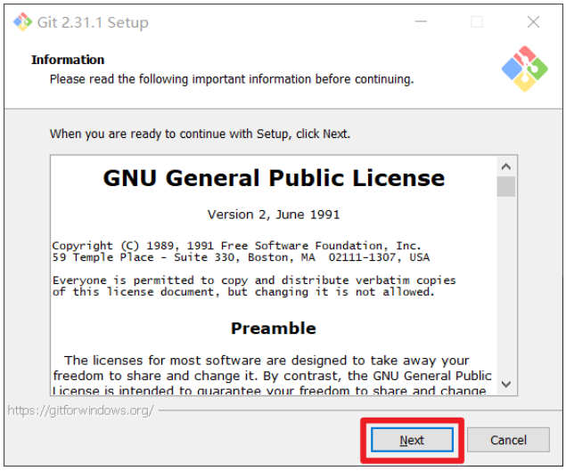

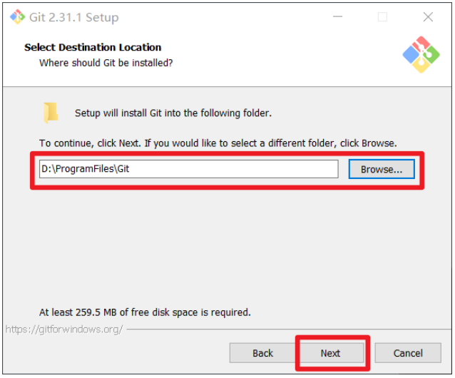

Git 选项配置，推荐默认设置，然后下一步。

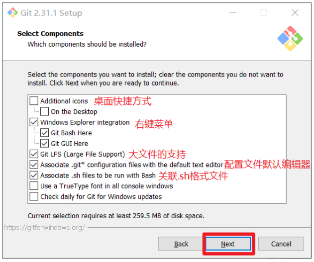

Git 安装目录名，不用修改，直接点击下一步。

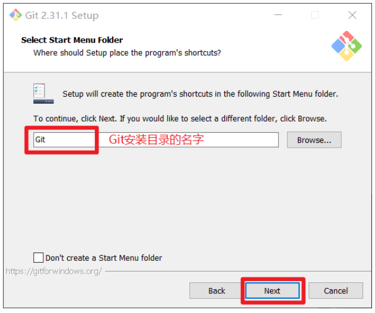

​	Git 的默认编辑器，建议使用默认的 Vim 编辑器，然后点击下一步。

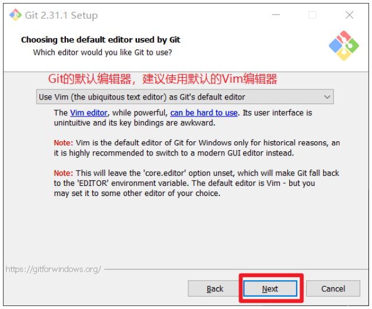

​	默认分支名设置，选择让 Git 决定，分支名默认为 master，下一步。

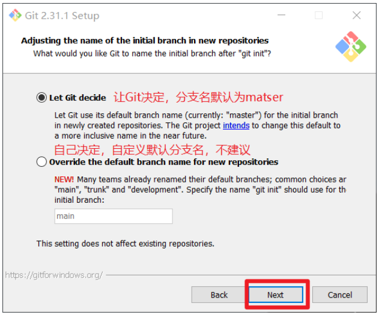

​	修改 Git 的环境变量，选第一个，不修改环境变量，只在 Git Bash 里使用 Git。

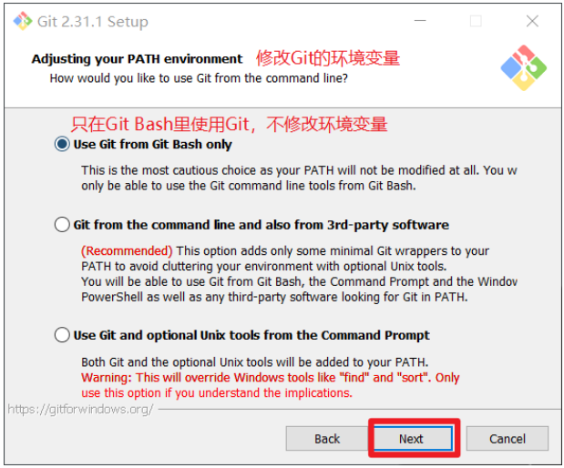

​	选择后台客户端连接协议，选默认值 OpenSSL，然后下一步。

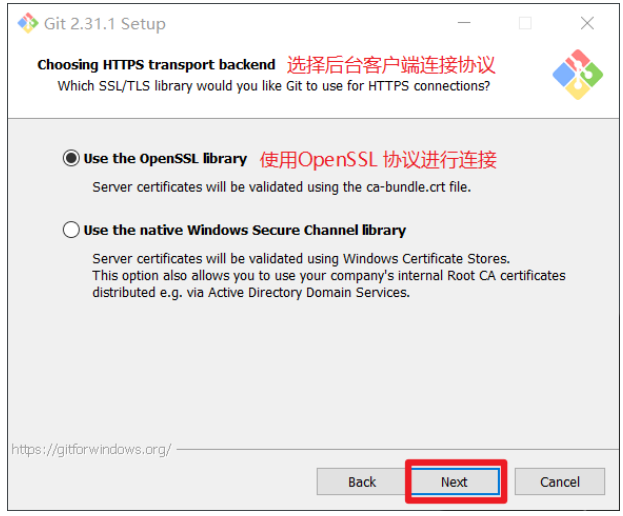

配置 Git 文件的行末换行符，Windows 使用 CRLF，Linux 使用 LF，选择第一个自动 转换，然后继续下一步。

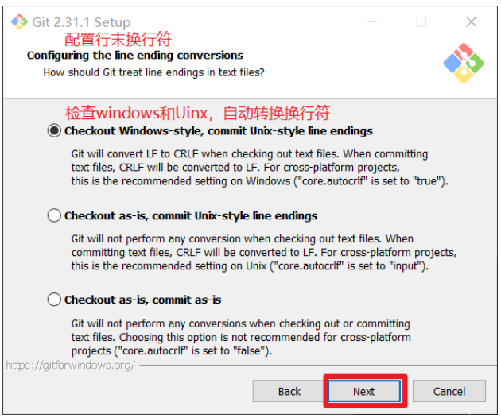

选择 Git 终端类型，选择默认的 Git Bash 终端，然后继续下一步。

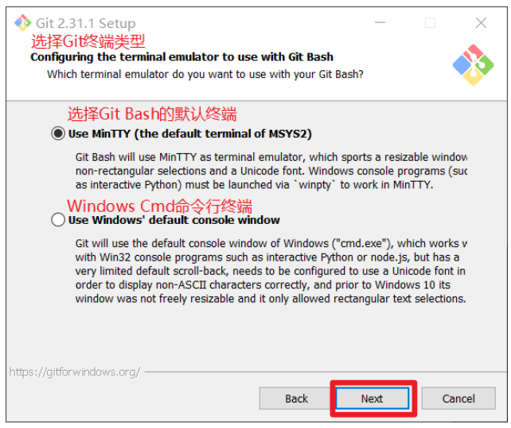

​	选择 Git pull 合并的模式，选择默认，然后下一步。

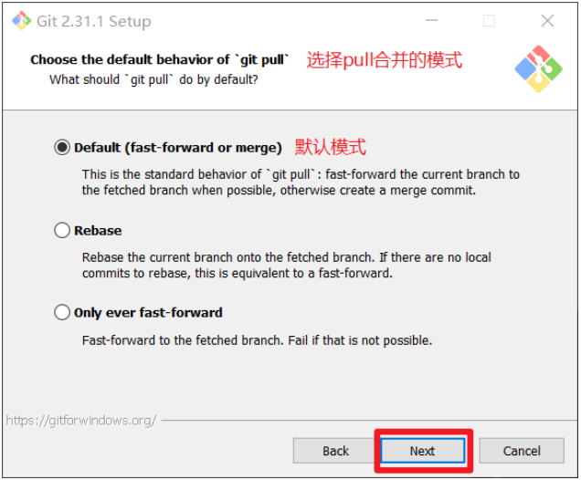

​	选择 Git 的凭据管理器，选择默认的跨平台的凭据管理器，然后下一步。

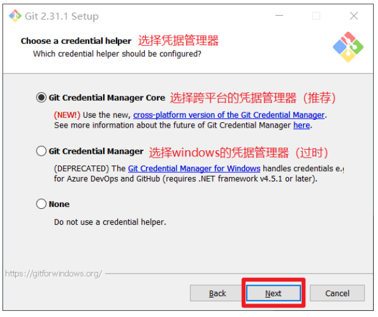

​	其他配置，选择默认设置，然后下一步。

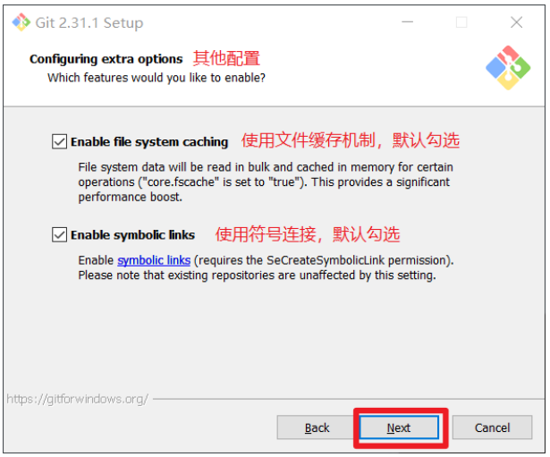

​	实验室功能，技术还不成熟，有已知的 bug，不要勾选，然后点击右下角的 Install 按钮，开始安装 Git。

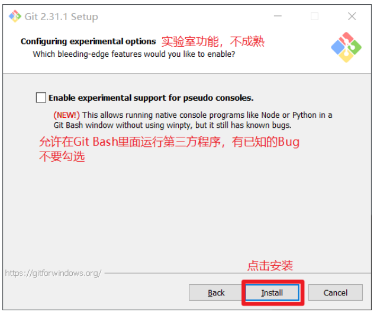

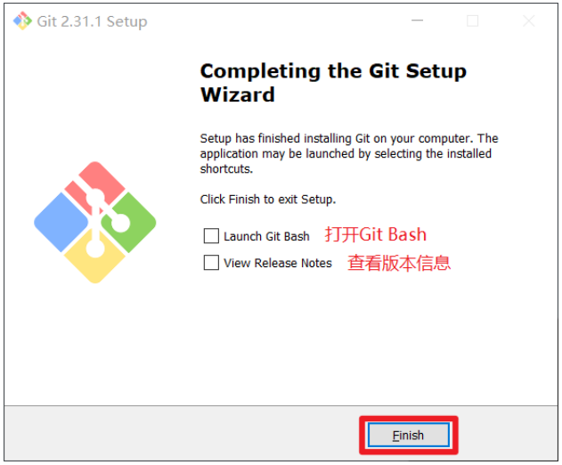

​	右键任意位置，在右键菜单里选择 Git Bash Here 即可打开 Git Bash 命令行终端。

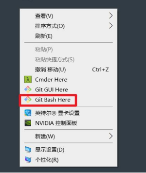

​	在 Git Bash 终端里输入 git --version 查看 git 版本，如图所示，说明 Git 安装成功。

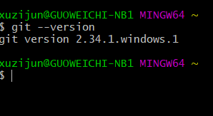

# 3. Git常用命令

|               命令名称               |        作用        |
| :----------------------------------: | :----------------: |
| git config --global user.name 用户名 |    设置用户签名    |
| git config --global user.email 邮箱  |    设置用户签名    |
|             **git init**             |  **初始化本地库**  |
|            **git status**            | **查看本地库状态** |
|          **git add 文件名**          | **查看本地库状态** |
| **git commit -m "日志信息" 文件名**  | **查看本地库状态** |
|            **git reflog**            | **查看本地库状态** |
|     **git reset --hard 版本号**      |    **版本穿梭**    |

## 3.1 设置用户签名

> 首次安装git一定要设置用户名，否则后续提交可能会出错。

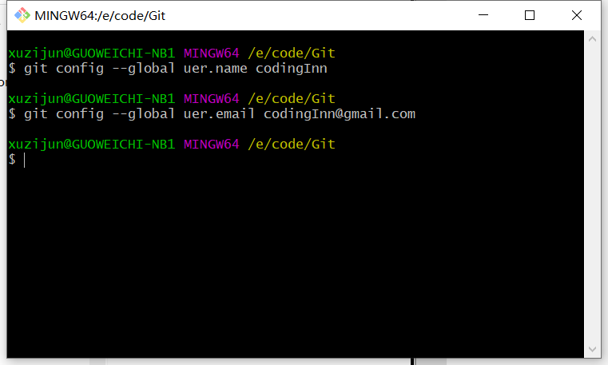

​	说明： 

​	签名的作用是区分不同操作者身份。用户的签名信息在每一个版本的提交信息中能够看到，以此确认本次提交是谁做的。Git 首次安装必须设置一下用户签名，否则无法提交代码。 

**注意**：这里设置用户签名和将来登录 **GitHub**（或其他代码托管中心）的账号**没有任何关系**。

## 3.2 初始化本地库

```git
git init
```

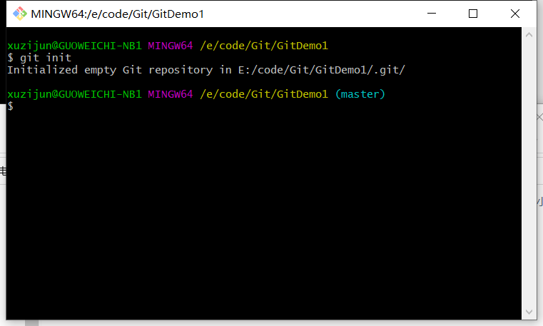

执行完会生成.git的隐藏文件夹

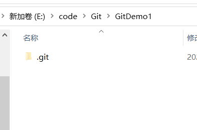

## 3.3 状态查看

```git
git status
```

首次查看(工作区没有任何文件)

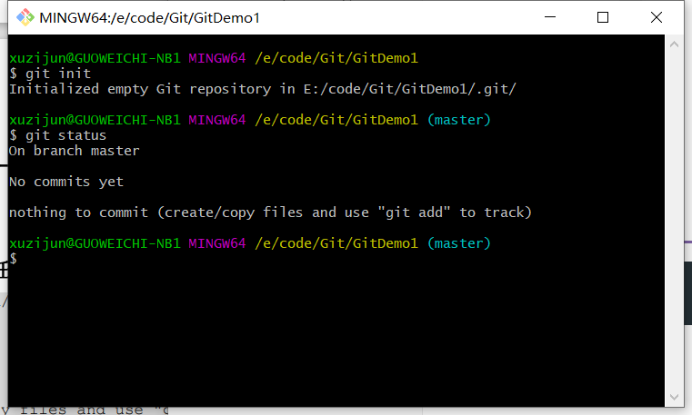

新增文件hello.txt,再查询

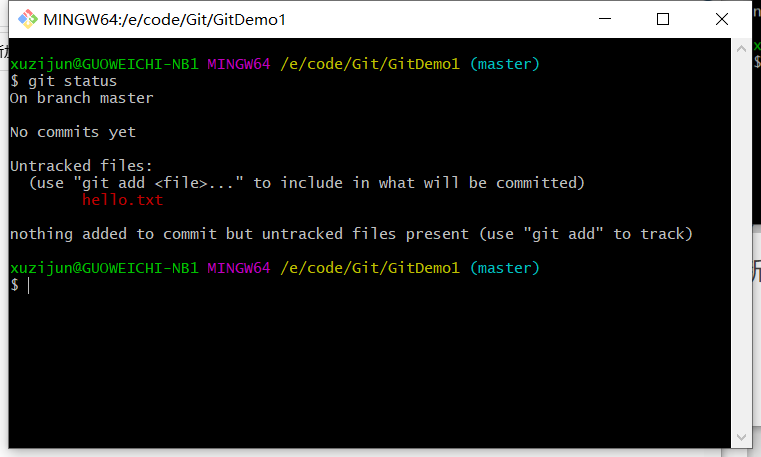

## 3.4 添加到暂存区

```git
git add 文件名
```


查看状态

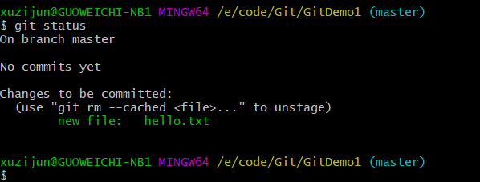

## 3.5 提交本地库

 **将暂存区的文件提交到本地库**

```git
git commit -m "日志信息" 文件名
例：git commit -m "测试first commit" hello.txt
```

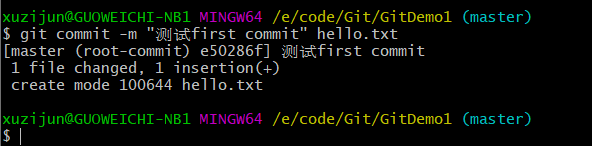

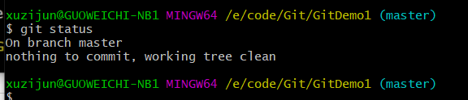

## 3.6 修改文件

首先对hello.txt进行修改，然后查看状态。

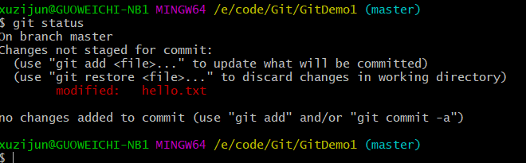

接下来把文件依次提交至暂存区、本地库，并查看状态。

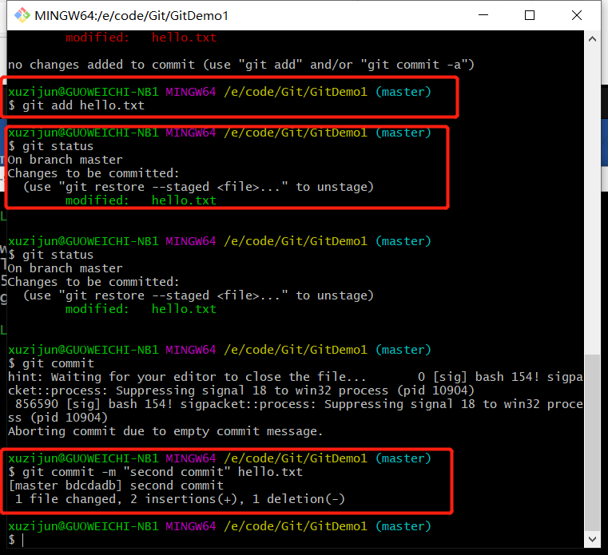

## 3.7 查看日志

```git
git reflog  查看版本信息
或 git log 查看版本详细信息
```

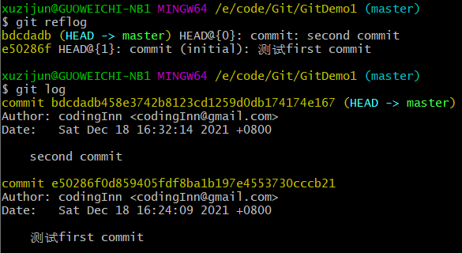

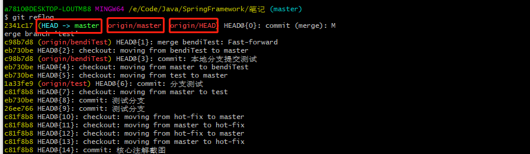

HEAD->master：本地分支指向master

origin/master：远端分支指向master

origin/HEAD：表示远端分支是默认的分支

## 3.8 版本回退

```git
git reset --hard 版本号
```

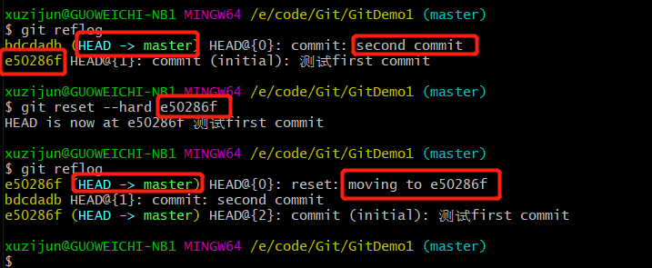

# 4. Git分支操作

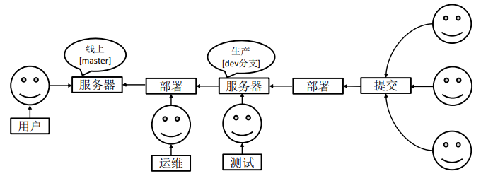

​	在版本控制过程中，同时推进多个任务，为每个任务，可以创建每个任务的单独分支。使用分支意味着程序员可以把自己的工作从开发主线上分离开来，开发自己分支的时候，不会影响主线分支的运行。

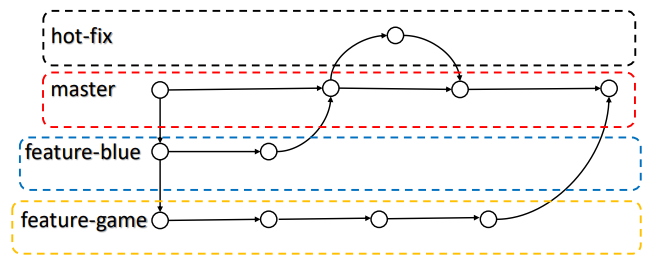

## 4.1 分支的好处

​	同时并行推进多个功能开发，提高开发效率。

​	各个分支在开发过程中，如果某一个分支开发失败，不会对其他分支有任何影响。

## 4.2 分支的操作

|      命令名称       |             作用             |
| :-----------------: | :--------------------------: |
|  git branch 分支名  |           创建分支           |
|    git branch -v    |           查看分支           |
| git checkout 分支名 |           切换分支           |
|  git merge 分支名   | 把指定的分支合并到当前分支上 |

## 4.3 查看分支

```git
git branch -v
```

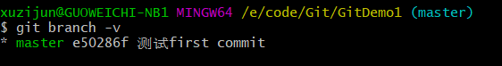

## 4.4 创建分支

```git
git branch hot-fix
```

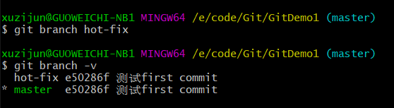

## 4.5 切换分支并修改提交文件

```git
git checkout hot-fix
```

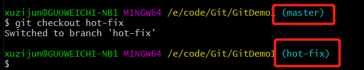

修改分支并提交文件

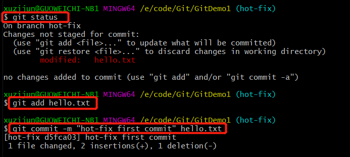

## 4.6 把指定的分支合并到当前分支上

### 4.6.1 正常合并

```git
git checkout master
git merge hot-fix
```

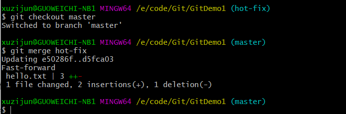

### 4.6.2 冲突合并

产生冲突的原因:

​	合并分支时，两个分支在**同一个文件**的**同一个位置**有两套完全**不同的修改**，**Git 无法替我们决定使用哪一个**。必须人为决定新代码内容。

举例:

+ 在master下修改本地文件

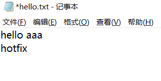

+ 在master下保存并提交：

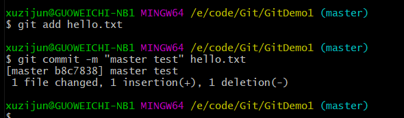

+ 切换到hot-fix对第一行也进行修改

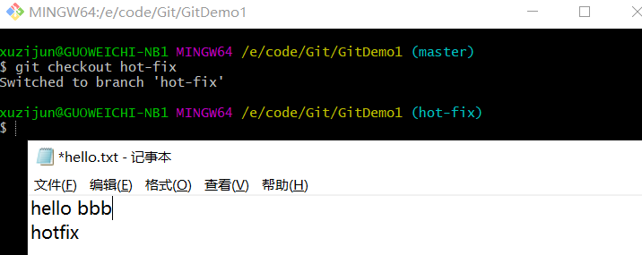

+ 在hot-fix下保存并提交，然后在master下进行合并：

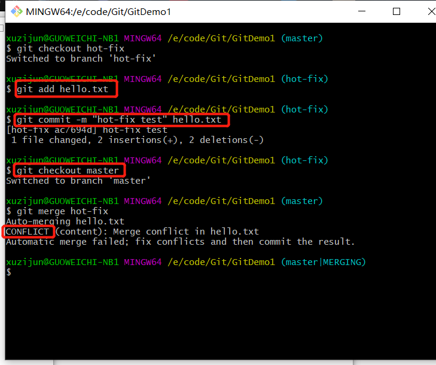

打开hello.txt出现

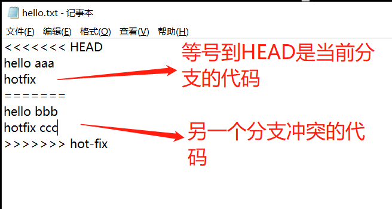

删掉调整后才能提交（相当于人为处理冲突）

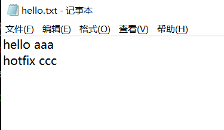

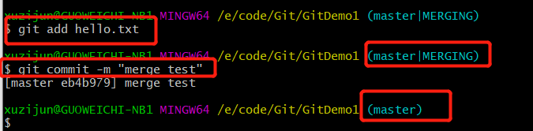

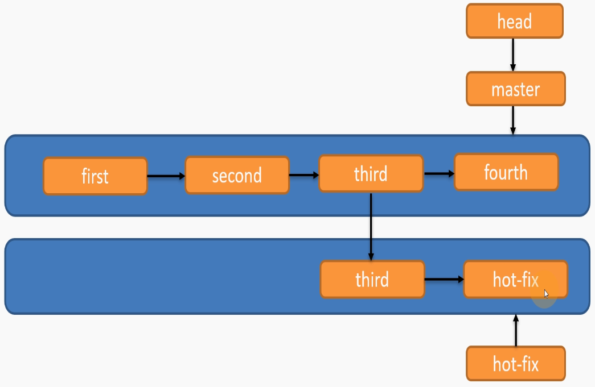

​	需要注意的是合并改变的只是当前的分支，在hot-fix这个分支里面文件还是原来的。

​	master、hot-fix 其实都是指向具体版本记录的指针，当前所在的分支，其实是由 HEAD 决定的。所以创建分支的本质就是多创建一个指针。 

​	HEAD 如果指向 master，那么就在 master 分支上。

​	HEAD 如果执向 hot-fix，那么现在就在 hot-fix 分支上。


## 4.7 删除分支
git branch -d