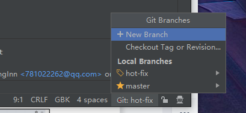
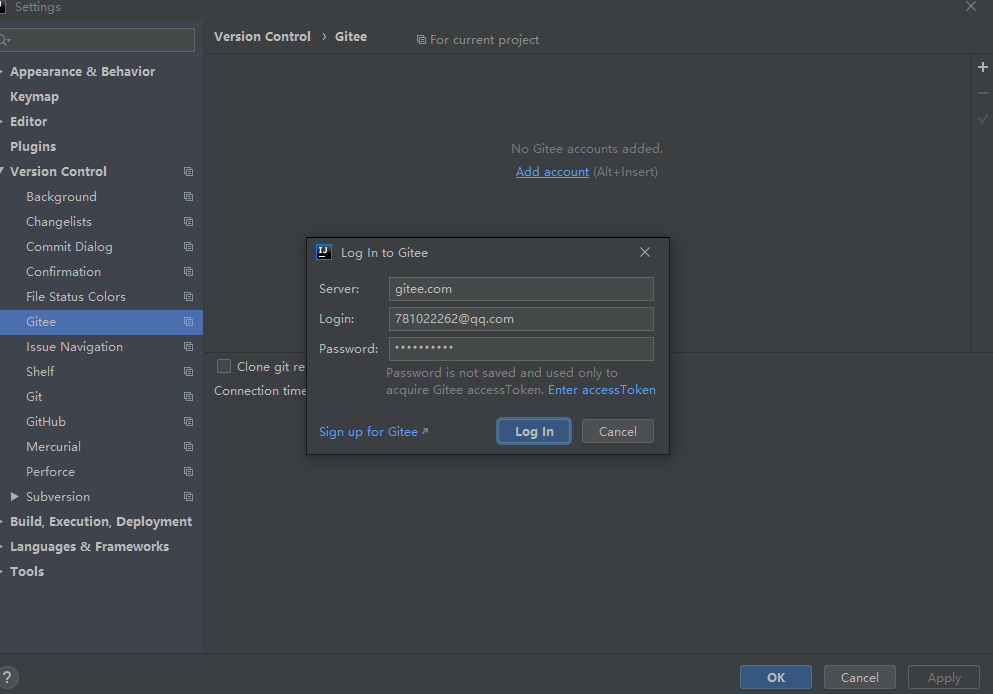
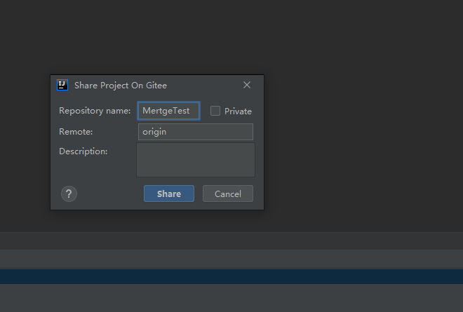

## 1. 配置Git

+ Eclipse特定文件


+ IDEA特定文件


+ Maven工程的target目录


### 1.1 为什么需要忽略

​	与项目的实际功能无关，不参与服务器上部署运行。把它们忽略掉能够屏蔽 IDE 工具之间的差异。

### 1.2 怎么忽略 

#### 1.2.1 局部忽略

创建忽略规则文件.gitignore（不要带文件名），一般存放仓库目录下。.gitignore文件对其所在的目录及所在目录的全部子目录均有效。通过将.gitignore文件添加到仓库，其他开发者更新该文件到本地仓库，以共享同一套忽略规则。


.ignore文件模板如下,根据自己需要修改：

```bash
# Compiled class file
*.class
# Log file
*.log
# BlueJ files
*.ctxt
# Mobile Tools for Java (J2ME)
.mtj.tmp/
# Package Files #
*.jar
*.war
*.nar
*.ear
*.zip
*.tar.gz
*.rar
# virtual machine crash logs, see http://www.java.com/en/download/help/error_hotspot.xml
hs_err_pid*
.classpath
.project
.settings
target
.idea
*.iml
#notepad++ file
*.bak
```

配置语法如下

```bash
以斜杠“/”开头表示目录；
以星号“*”通配多个字符；
以问号“?”通配单个字符
以方括号“[]”包含单个字符的匹配列表；
以叹号“!”表示不忽略(跟踪)匹配到的文件或目录；
常用的规则：
1）/mtk/               过滤整个文件夹
2）*.zip                过滤所有.zip文件
3）/mtk/do.c         过滤某个具体文件
被过滤掉的文件就不会出现在git仓库中（gitlab或github）了，当然本地库中还有，只是push的时候不会上传。
需要注意的是，gitignore还可以指定要将哪些文件添加到版本管理中：
!*.zip
!/mtk/one.txt

需要注意的是，gitignore还可以指定要将哪些文件添加到版本管理中：
1）!*.zip
2）!/mtk/one.txt
唯一的区别就是规则开头多了一个感叹号，Git会将满足这类规则的文件添加到版本管理中。
为什么要有两种规则呢？想象一个场景：假如我们只需要管理/mtk/目录中的one.txt文件，这个目录中的其他文件都不需要管理，可以使用：
1）/mtk/
2）!/mtk/one.txt
```

#### 1.2.2 全局忽略

首先在用户目录（C:\Users\a7810）创建xxx.ignore文件(名字可以随便选)


然后把1.2.1节的配置复制到git.ignore,并对.gitconfig进行配置,如下图所示，需要使用绝对路径

```bash
[user]
	name = CodingInn
	email = 781022262@qq.com
[core]
	excludesfile = C:/Users/a7810/git.ignore
[credential]
	helper = manager-core
[http]
	sslVerify = false
	ssIVerify = false
[credential "https://gitee.com"]
	provider = generic
```


### 1.3 定位Git程序


### 1.4 初始化本地库


选择要创建 Git 本地仓库的工程。


### 1.5 添加.gitignore文件

​	建议添加一份,因为后面换设备,设备中没有设置全局忽略,会上传一些不必要的文件.


### 1.5 添加到暂存区

​	右键点击项目选择 Git -> Add 将项目添加到暂存区。


### 1.6 提交到本地库


### 1.7 切换版本

​	在 IDEA 的左下角，点击 Version Control，然后点击 Log 查看版本


右键选择要切换的版本，然后在菜单里点击 Checkout Revision。


### 1.8 创建分支

​	选择 Git，在 Repository 里面，点击 Branches 按钮。


​	在弹出的 Git Branches 框里，点击 New Branch 按钮。


​	填写分支名称，创建 hot-fix 分支。

​	然后在IDEA 的右下角看到 hot-fix，说明分支创建成功，并且当前已经切换成 hot-fix 分支。


点击如下位置也可以添加或切换分支:



### 1.9 合并分支

#### 1.9.1 没有冲突的合并

​	在 IDEA 窗口的右下角，将 hot-fix 分支合并到当前 master 分支。


如果修改代码,没有提交，然后切换分支,则以提交的分支作为修改的分支。

#### 1.9.2 有冲突的合并

​	当两个分支同一个文件都有编辑,则在切换分支或合并分支的时候会产生冲突.


​	我们现在站在 master 分支上合并 hot-fix 分支，就会发生代码冲突。


​	点击 Conflicts 框里的 Merge 按钮，进行手动合并代码。


​	手动合并完代码以后，点击右下角的 Apply 按钮。


​	代码冲突解决，自动提交本地库。


## 2. IDEA集成Gitee

### 2.1 下载插件以及登录


添加账户密码



或者使用token


### 2.2 分享工程到Gitee




已创建:


### 2.3 推送代码到Gitee

​	在对本地代码进行修改后,需要先把代码提交到本地库,然后再推送到Gitee.	

​	**先提交，然后才能push,否则不能提交当前版本**

​	右键点击项目，可以将当前分支的内容 push 到 Gitee的远程仓库中。


​	注意：push 是将本地库代码推送到远程库，如果本地库代码跟远程库代码版本不一致，push的操作是会被拒绝的。也就是说，要想push成功，一定要保证本地库的版本要比远程库的版本高.因此一定要先检查下远程库跟本地代码的区别,如果本地的代码版本已经落后，切记要先pull拉取一下远程库的代码，将本地代码更新到最新以后，然后再修改，提交，推送.

使用ssh方式(注意,如果使用ssh的方式需要,配置好git的免密登录):


### 2.4 pull拉取远程库到本地库

​	右键点击项目，可以将远程仓库的内容 pull 到本地仓库


​	注意：pull 是拉取远端仓库代码到本地，如果远程库代码和本地库代码不一致，会自动合并，如果自动合并失败，还会涉及到手动解决冲突的问题。

### 2.5 clone远程库到本地


​	为 clone 下来的项目创建一个工程，然后点击 Next。


### 2.6 IDEA拉取单个项目文件

```
1. 新建文件夹
2. git init
3. git config core.sparsecheckout true
4. echo 要下载的目录名 >> .git/info/sparse-checkout
5. git remote add 别名 远程地址
6. git pull 别名 当前分支名 
（如果使用tortoise，只需要在Git Bash中操作3、4两步,然后配置远端下载,如果要下载多个目录，重复第4步,然后使用 git checkout master）
```

然后通过IDEA打开该文件夹即可


**注意:**

​	使用sparsecheckout后,只能拉取和提交sparsecheckout这一个文件夹,在该范围外提交会出错.

