## 1. GitLab简介

​	GitLab 是由 GitLabInc.开发，使用 MIT 许可证的基于网络的 Git 仓库管理工具，且具有wiki 和 issue 跟踪功能。使用 Git 作为代码管理工具，并在此基础上搭建起来的 web 服务。

## 2. GitLab官网地址

官网地址：https://about.gitlab.com/

安装说明：https://about.gitlab.com/installation/

## 3. GitLab安装

### 3.1 服务器准备

​	准备一个系统为 CentOS7 以上版本的服务器，要求内存 4G，磁盘 50G。

​	**关闭防火墙**，并且配置好主机名和 IP，保证服务器可以上网。

​	此教程使用虚拟机：主机名：gitlab-server IP 地址：192.168.6.200

​	修改ip和主机名:

```bash
修改ip地址
vim /etc/sysconfig/network-scripts/ifcfg-ens33
然后修改ip地址

修改hostname
vim /etc/hostsname
然后修改主机名

重启
reboot
```


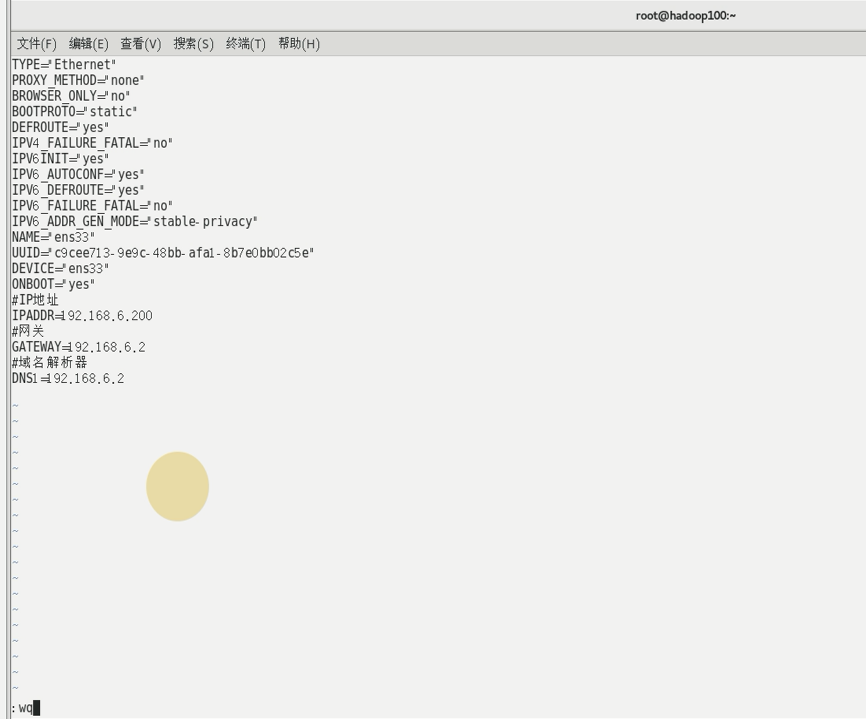


### 3.2 安装包准备

​	Yum 在线安装gitlab-ce时，需要下载几百 M 的安装文件，非常耗时，所以最好提前把所需 RPM 包下载到本地，然后使用离线 rpm 的方式安装。

下载地址：https://packages.gitlab.com/gitlab/gitlab-ce/packages/el/7/gitlab-ce-13.10.2-ce.0.el7.x86_64.rpm

(阿里云盘链接：https://www.aliyundrive.com/s/tAm5o4Nrini)直接将此包上传到服务器/opt/module 目录下。

### 3.3 编写安装脚本

​	安装 gitlab 步骤比较繁琐，因此可以参考官网编写 gitlab 的安装脚本。

1. cd /opt/module   把安裝包放入此文件夹
2. vim gitlab-install.sh 添加脚本文件,并把下面代码放入脚本:

```bash
sudo rpm -ivh /opt/module/gitlab-ce-13.10.2-ce.0.el7.x86_64.rpm
sudo yum install -y curl policycoreutils-python openssh-server cronie
sudo lokkit -s http -s ssh
sudo yum install -y postfix
sudo service postfix start
sudo chkconfig postfix on
curl https://packages.gitlab.com/install/repositories/gitlab/gitlab-ce/script.rpm.sh | sudo bash
sudo EXTERNAL_URL="http://gitlab.example.com" yum -y install gitlab-ce
```

​	给脚本增加执行权限

```bash
chmod +x gitlab-install.sh

查看信息:
ll
```

​	如下图所示,红框变绿,说明具有执行权限。

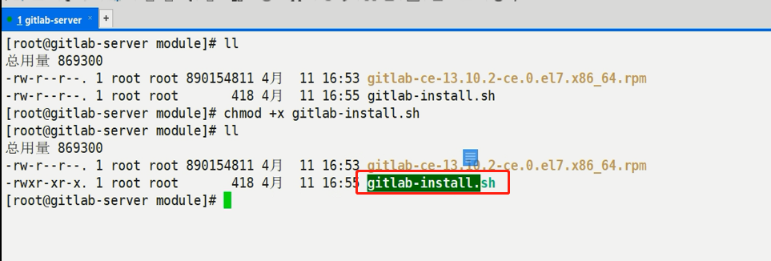	

​	然后执行该脚本，开始安装 gitlab-ce。注意一定要保证服务器可以上网.

```bash
 ./gitlab-install.sh  
```

​	安裝成功:

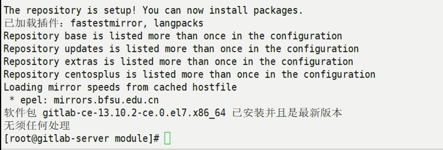

## 4. 初始化GitLab服务

​	执行以下命令初始化 GitLab 服务，过程大概需要几分钟.

```bash
gitlab-ctl reconfigure
```

​	初始化成功：


## 5. 启动GitLab服务

​	执行以下命令启动 GitLab 服务，如需停止，执行 gitlab-ctl stop.

```bash
gitlab-ctl start  
```

​	启动成功:

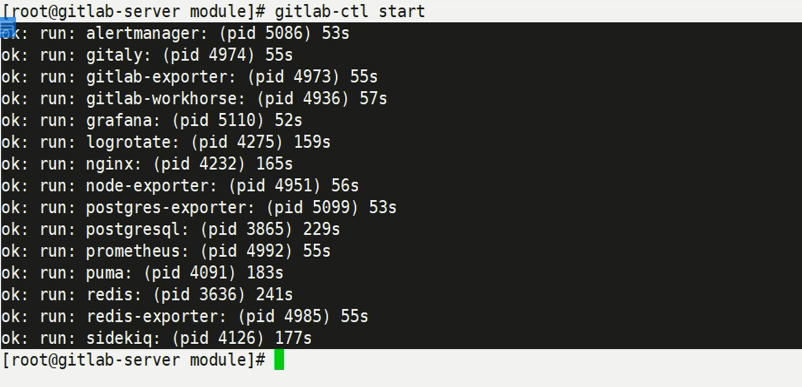

## 6. 使用浏览器访问Gitlab

​	使用主机名或者 IP 地址即可访问 GitLab 服务。如果想使用主机名的方式访问,需要提前配一下 windows 的 hosts 文件。

hosts文件的路径:C:/Windows/System32/drivers/etc/hosts

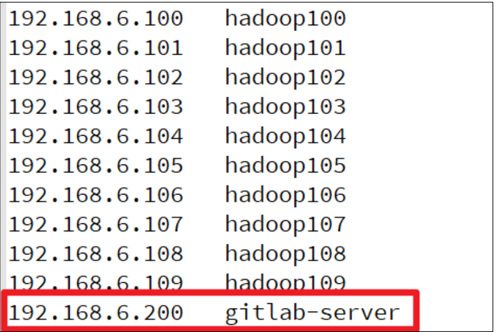


​		首次登陆之前，需要修改下 GitLab 提供的 root 账户的密码，要求 8 位以上，包含大小写子母和特殊符号。

​	然后使用修改后的密码登录 GitLab。

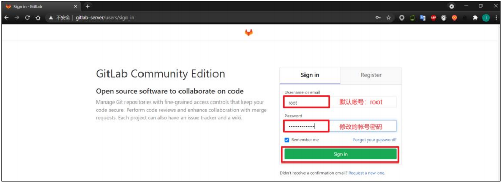

​	GitLab 登录成功。

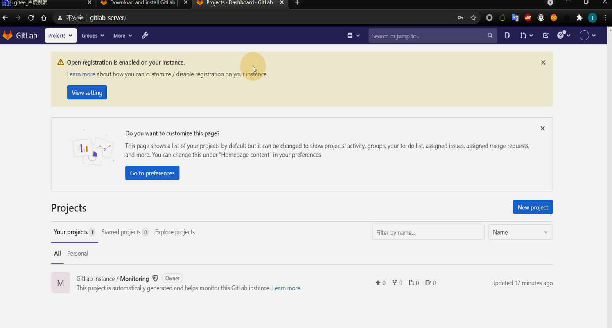

## 7. GitLab创建远程库

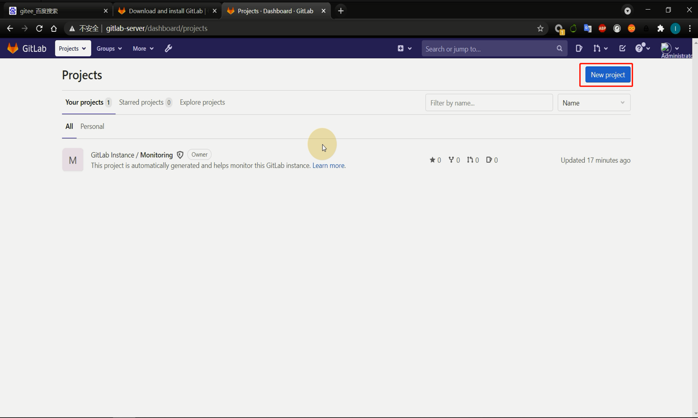

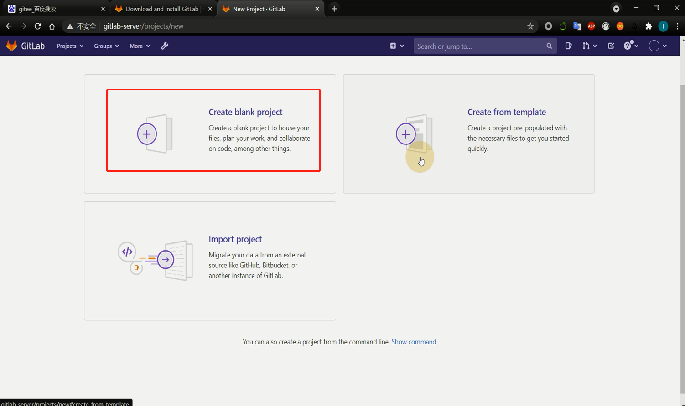

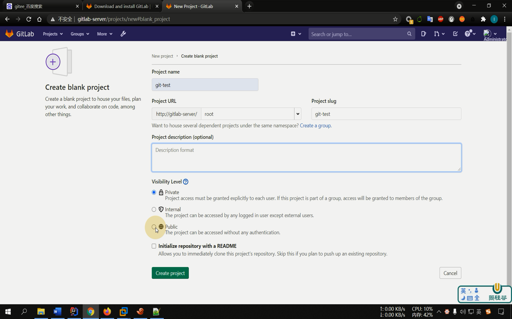

## 8. IDEA集成GitLab

1. 安装 GitLab 插件


2. 设置 GitLab 插件

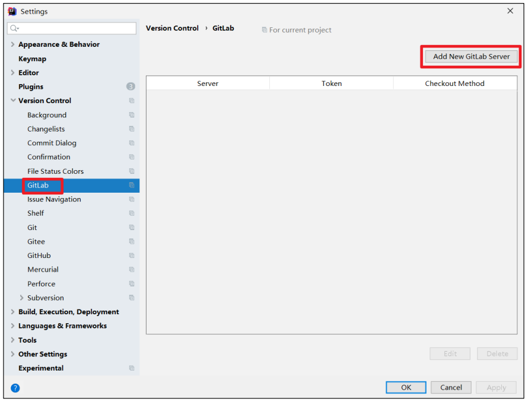

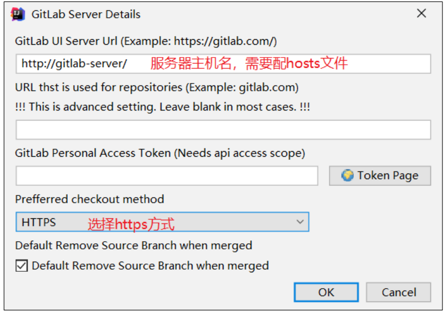

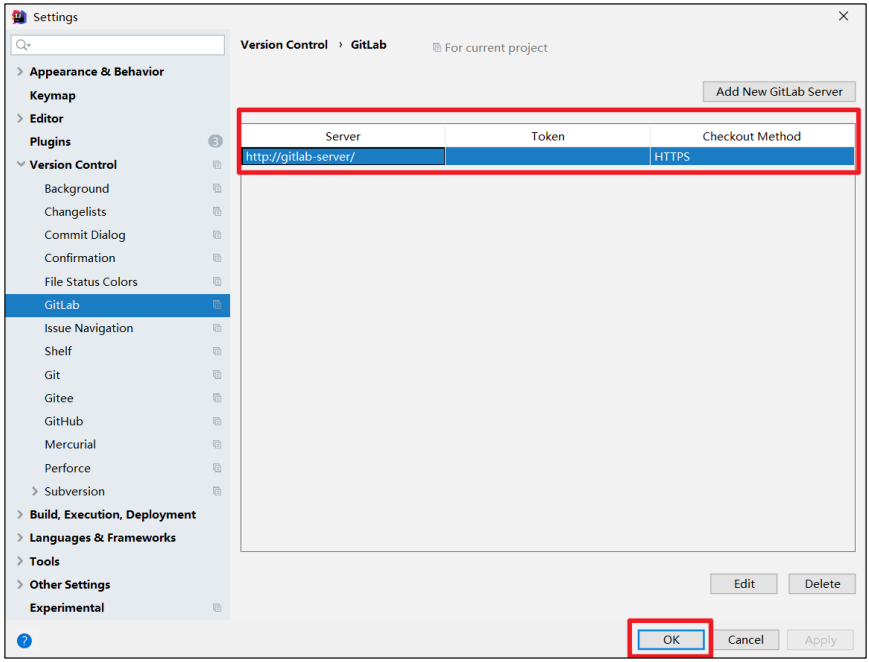

3. push 本地代码到 GitLab 远程库

   获取http地址,需要注意的是默认的地址是gitlab.example.com,需要改成gitlab.gitlab-server.com. (gitlab-server是自己在Windows的hosts文件中配置的主机名)

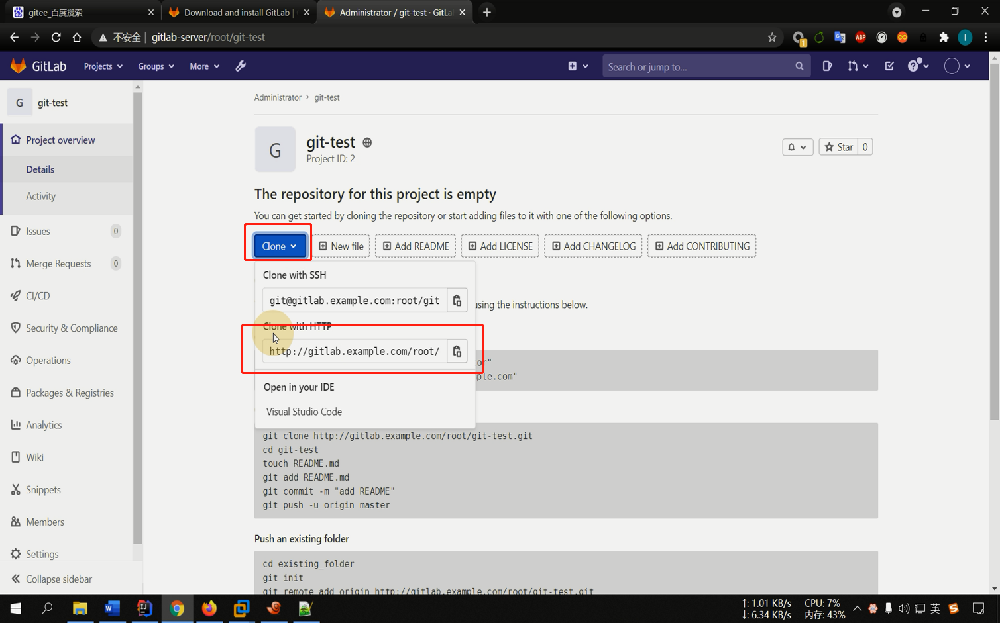

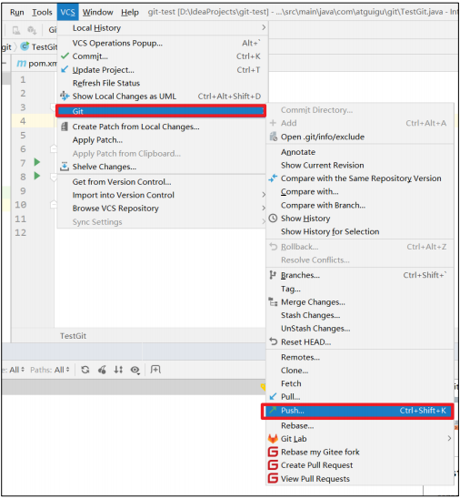

自定义远程连接

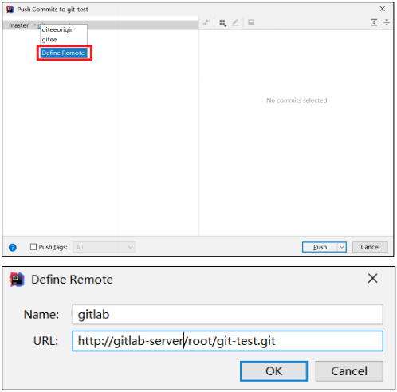

注意：gitlab 网页上复制过来的连接是：http://gitlab.example.com/root/git-test.git，

需要手动修改为：http://gitlab-server/root/git-test.git

选择 gitlab 远程连接，进行 push。

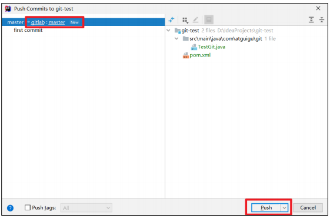

首次向连接 gitlab，需要登录帐号和密码，用 root 帐号和修改的密码登录即可。

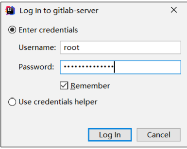

代码 Push 成功。

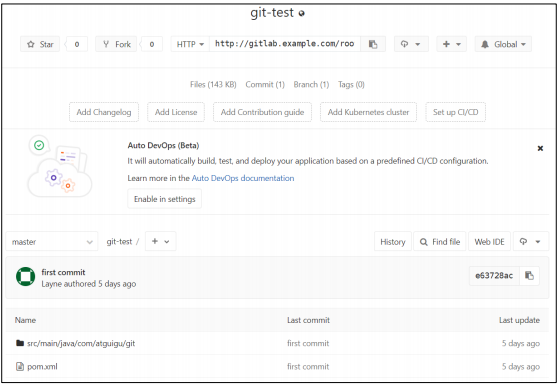

​	只要 GitLab 的远程库连接定义好以后，对GitLab远程库进行 pull 和 clone 的操作和Github、Gitee一致。

