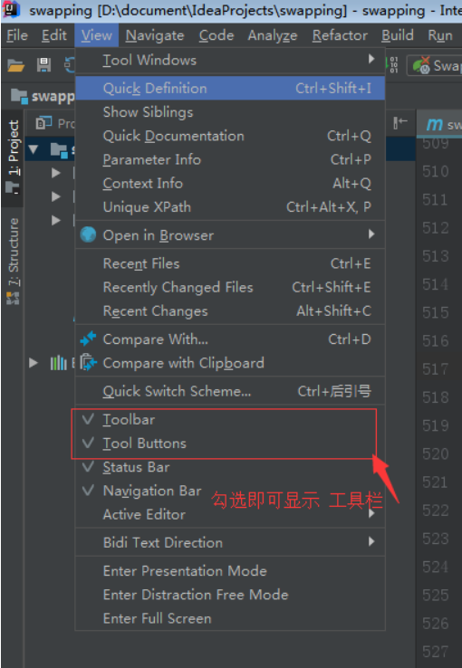

# IDEA设置自定义注释


先添加Template Group然后添加Live Template


设置自定义注释

```java
**
 * @Author cgw
 * @Description $todo$
 $param$
 $return$
 * @Date  $date$ $time$
 **/
```

做如下设置


+ param:

  ```java
  groovyScript("if(\"${_1}\".length() == 2) {return '';} else {def result=''; def params=\"${_1}\".replaceAll('[\\\\[|\\\\]|\\\\s]', '').split(',').toList();for(i = 0; i < params.size(); i++) {if(i==0){result+='* @param ' + params[i] + ': '}else{result+='\\n' + ' * @param ' + params[i] + ': '}}; return result;}", methodParameters()); 
  ```

+ return

```java
groovyScript("def returnType = \"${_1}\"; def result = '* @return: ' + returnType; return result;", methodReturnType()); 
```


然后在代码中输入//再按tab就能自动注释了.

# IDEA设置打开多个文件显示多个tab


# 永久解决 Intellij idea 报错：Error : java 不支持发行版本5


```xml
 <profile>
      <id>development</id>
      <activation>
        <jdk>1.8</jdk>
        <activeByDefault>true</activeByDefault>
      </activation>
      <properties>
        <maven.compiler.source>1.8</maven.compiler.source>
        <maven.compiler.target>1.8</maven.compiler.target>
        <maven.compiler.compilerVersion>1.8</maven.compiler.compilerVersion>
      </properties>
    </profile>
```

# 显示工具栏




# 复制模块


选择


修改模块名字


# 插件

## maven项目转javaweb


