快捷键

使用ctrl+N能查找类

在接口内部使用Ctr+H能查找实现类

ctrl + F12能查看类有啥方法

# 1 环境搭建

为了保持一致，Spring使用的版本是5.0.x,gradle使用的版本是4.4.1，JDK使用的版本是1.8(JDK8),IDEA使用的版本是2021.3。

## 1.1 Gradle安装

GRADLE_HOME,PATH,GRADLE_USER_HOME

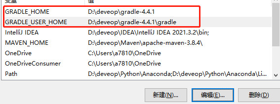

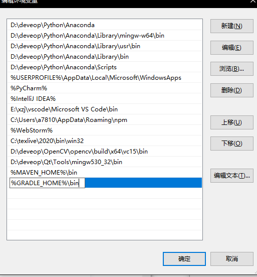

maven本地仓库->所有的jar包，同理，gradle也有本地仓库，在gradle安装目录中新建gradle目录作为仓库：

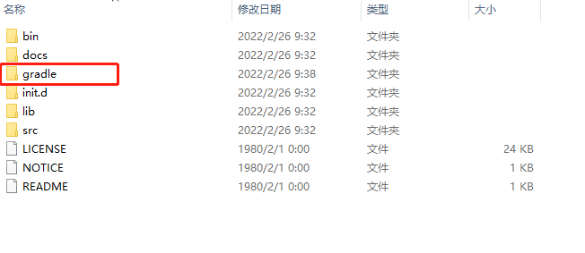

配置下载阿里云镜像：

在gradle安装目录的init.d文件夹中新建init.gradle文件，并添加如下内容:

```bash
gradle.projectsLoaded {
    rootProject.allprojects {
        buildscript {
            repositories {
                def JCENTER_URL = 'https://maven.aliyun.com/repository/jcenter'
                def GOOGLE_URL = 'https://maven.aliyun.com/repository/google'
                def NEXUS_URL = 'http://maven.aliyun.com/nexus/content/repositories/jcenter'
                all { ArtifactRepository repo ->
                    if (repo instanceof MavenArtifactRepository) {
                        def url = repo.url.toString()
                        if (url.startsWith('https://jcenter.bintray.com/')) {
                            project.logger.lifecycle "Repository ${repo.url} replaced by $JCENTER_URL."
                            println("buildscript ${repo.url} replaced by $JCENTER_URL.")
                            remove repo
                        }
                        else if (url.startsWith('https://dl.google.com/dl/android/maven2/')) {
                            project.logger.lifecycle "Repository ${repo.url} replaced by $GOOGLE_URL."
                            println("buildscript ${repo.url} replaced by $GOOGLE_URL.")
                            remove repo
                        }
                        else if (url.startsWith('https://repo1.maven.org/maven2')) {
                            project.logger.lifecycle "Repository ${repo.url} replaced by $REPOSITORY_URL."
                            println("buildscript ${repo.url} replaced by $REPOSITORY_URL.")
                            remove repo
                        }
                    }
                }
                jcenter {
                    url JCENTER_URL
                }
                maven {
                    url NEXUS_URL
                }
            }
        }
        repositories {
            def JCENTER_URL = 'https://maven.aliyun.com/repository/jcenter'
            def GOOGLE_URL = 'https://maven.aliyun.com/repository/google'
            def NEXUS_URL = 'http://maven.aliyun.com/nexus/content/repositories/jcenter'
            all { ArtifactRepository repo ->
                if (repo instanceof MavenArtifactRepository) {
                    def url = repo.url.toString()
                    if (url.startsWith('https://jcenter.bintray.com/')) {
                        project.logger.lifecycle "Repository ${repo.url} replaced by $JCENTER_URL."
                        println("buildscript ${repo.url} replaced by $JCENTER_URL.")
                        remove repo
                    }
                    else if (url.startsWith('https://dl.google.com/dl/android/maven2/')) {
                        project.logger.lifecycle "Repository ${repo.url} replaced by $GOOGLE_URL."
                        println("buildscript ${repo.url} replaced by $GOOGLE_URL.")
                        remove repo
                    }
                    else if (url.startsWith('https://repo1.maven.org/maven2')) {
                        project.logger.lifecycle "Repository ${repo.url} replaced by $REPOSITORY_URL."
                        println("buildscript ${repo.url} replaced by $REPOSITORY_URL.")
                        remove repo
                    }
                }
            }
            jcenter {
                url JCENTER_URL
            }
            maven {
                url NEXUS_URL
            }
        }
    }
}
```

## 1.2 下载并打开项目

打开项目（本项目使用的版本是5.0.x）：

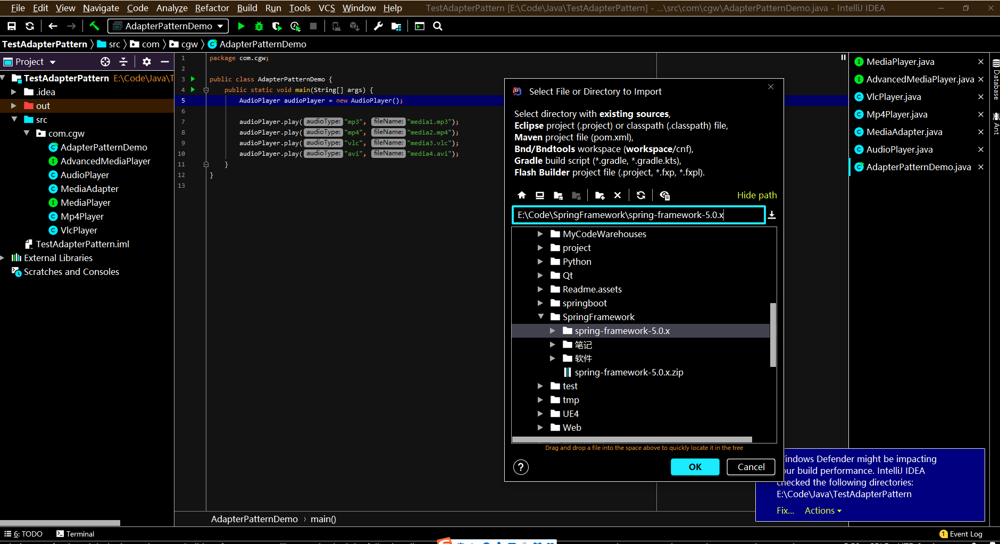

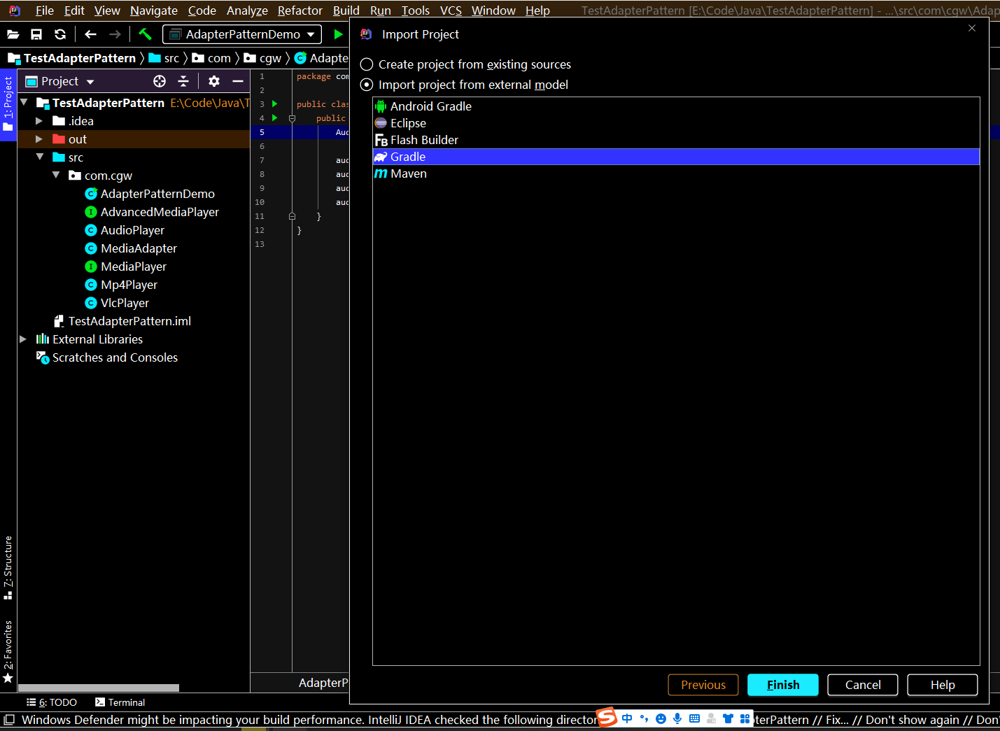

配置Gradle以及JDK:

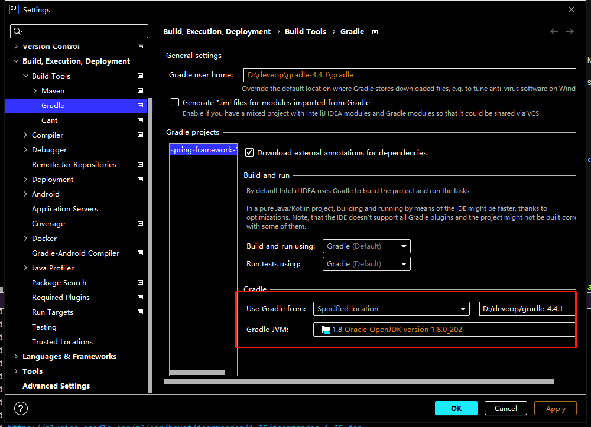


如果速度慢，可以取消自动的下载，直接进行index

## 1.3 可能出现的问题：

1.No such property: values forclass:org.gradle.api.internal.tasks.DefaultTaskDependency Possible solutions: values

打开文件，并注释：

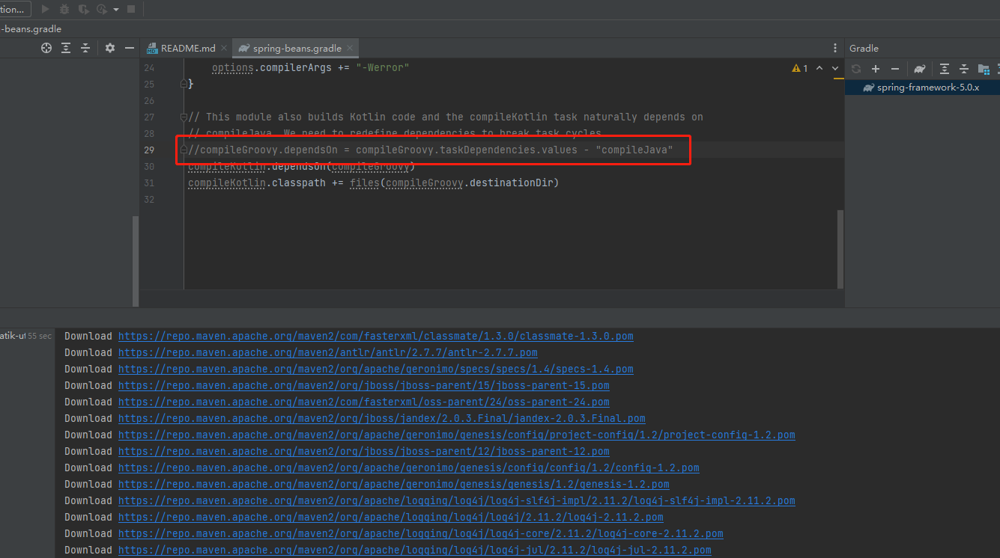

## 1.4 测试是否配置好环境

新建包 ：


配置build.gradle

```java
plugins {
    id 'java'
}

group 'org.springframework'
version '5.0.21.BUILD-SNAPSHOT'

repositories {
    mavenCentral()
}

dependencies {
    testImplementation 'junit:junit:4.12'

    compile(project(":spring-context"))
    // https://mvnrepository.com/artifact/org.projectlombok/lombok
    compileOnly group: 'org.projectlombok', name: 'lombok', version: '1.18.20'
}
```

新建pojo.Person

```java
package com.CodingInn.pojo;

import lombok.Data;

@Data
public class Person {
   private String name;
}
```

新建beans.xml

```xml
<?xml version="1.0" encoding="UTF-8"?>
<beans xmlns="http://www.springframework.org/schema/beans"
      xmlns:xsi="http://www.w3.org/2001/XMLSchema-instance"
      xsi:schemaLocation="http://www.springframework.org/schema/beans http://www.springframework.org/schema/beans/spring-beans.xsd">

   <bean class="com.CodingInn.pojo.Person" id="person">
      <property name="name" value="zhangsan"/>
   </bean>
</beans>
```

测试

```java
package com.CodingInn;

import com.CodingInn.pojo.Person;
import org.springframework.context.support.ClassPathXmlApplicationContext;

public class test {
   public static void main(String[] args) {
      ClassPathXmlApplicationContext context = new ClassPathXmlApplicationContext("beans.xml");

      Person bean = context.getBean(Person.class);
      System.out.println(bean);
   }
}
```

# 2 基本注解

| **注解**         | **功能**                                                     |
| ---------------- | ------------------------------------------------------------ |
| @Bean            | 容器中注册组件                                               |
| @Primary         | 同类组件如果有多个，标注主组件                               |
| @DependsOn       | 组件之间声明依赖关系                                         |
| @Lazy            | 组件懒加载（最后使用的时候才创建）                           |
| @Scope           | 声明组件的作用范围(SCOPE_PROTOTYPE,SCOPE_SINGLETON)          |
| @Configuration   | 声明这是一个配置类，替换以前配置文件                         |
| @Component       | @Controller、@Service、@Repository                           |
| @Indexed         | 加速注解，所有标注了 @Indexed 的组件，直接会启动快速加载     |
| @Order           | 数字越小优先级越高，越先工作                                 |
| @ComponentScan   | 包扫描                                                       |
| @Conditional     | 条件注入                                                     |
| @Import          | 导入第三方jar包中的组件，或定制批量导入组件逻辑              |
| @ImportResource  | 导入以前的xml配置文件，让其生效                              |
| @Profile         | 基于多环境激活                                               |
| @PropertySource  | 外部properties配置文件和JavaBean进行绑定.结合ConfigurationProperties |
| @PropertySources | @PropertySource组合注解                                      |
| @Autowired       | 自动装配                                                     |
| @Qualifier       | 精确指定                                                     |
| @Value           | 取值、计算机环境变量、JVM系统。xxxx。@Value(“${xx}”)         |
| @Lookup          | 单例组件依赖非单例组件，非单例组件获取需要使用方法           |

注：@Indexed 需要引入依赖

```xml
<dependency>
	<groupId>org.springframework</groupId>
	<artifactId>spring-context-indexer</artifactId>
	<optional>true</optional>
</dependency>
```

## @Configuration

@Configuration中可以配置@bean,@import类到容器，配置@ComponentScan路径进行组件扫描

### @bean的使用

```java
package com.CodingInn.C0001基本注解.pojo;

import org.springframework.beans.factory.annotation.Autowired;
import org.springframework.beans.factory.annotation.Lookup;
import org.springframework.stereotype.Component;

public class PersonBean {
	private String name;

	public String getName() {
		return name;
	}

	public void setName(String name) {
		this.name = name;
	}

	@Override
	public String toString() {
		return "Person{" +
				"name='" + name + '\'' +
				'}';
	}
}


@Configuration
public class MainConfig {

   //1 方式1
   @Bean
   public PersonBean person(){
      PersonBean person = new PersonBean();
      person.setName("张三");
      return person;
   }
}

@Test
	public void beanTest(){
		ApplicationContext applicationContext = new AnnotationConfigApplicationContext(MainConfig.class);
		PersonBean bean = applicationContext.getBean(PersonBean.class);
		System.out.println(bean);
	}
```

### @import的使用

#### 方式1 直接import

+ PersonImport.java

```java
package com.CodingInn.C0001基本注解.pojo;

public class PersonImport {
	private String name;

	public String getName() {
		return name;
	}

	public void setName(String name) {
		this.name = name;
	}

	@Override
	public String toString() {
		return "Person{" +
				"name='" + name + '\'' +
				'}';
	}
}

```

+ MainConfig.java

```java

package com.CodingInn.C0001基本注解.config;

import com.CodingInn.C0001基本注解.pojo.Cat;
import com.CodingInn.C0001基本注解.pojo.PersonImport;
import com.CodingInn.C0001基本注解.pojo.PersonBean;
import org.springframework.beans.factory.support.BeanDefinitionRegistry;
import org.springframework.beans.factory.support.RootBeanDefinition;
import org.springframework.context.annotation.*;
import org.springframework.core.type.AnnotationMetadata;
import org.springframework.stereotype.Component;

@Import(PersonImport.class)
//这是一个配置类
@Configuration
public class MainConfig {

}
```

+ Test

```java


@Test
public void importTest(){
   ApplicationContext applicationContext = new AnnotationConfigApplicationContext(MainConfig.class);
   PersonImport bean = applicationContext.getBean(PersonImport.class);
   System.out.println(bean);
}
```

#### 方式2 实现ImportBeanDefinitionRegistrar接口

+ Cat.java

```java
package com.CodingInn.C0001基本注解.pojo;


import org.springframework.context.annotation.Scope;
import org.springframework.stereotype.Component;

@Component
public class Cat {
	private String name;

	public Cat() {
		name = "defaultName";
	}

	public String getName() {
		return name;
	}

	public void setName(String name) {
		this.name = name;
	}

	@Override
	public String toString() {
		return "Cat{" +
				"name='" + name + '\'' +
				'}';
	}
}
```

+ MainConfig.java

```java
package com.CodingInn.C0001基本注解.config;

import com.CodingInn.C0001基本注解.pojo.Cat;
import com.CodingInn.C0001基本注解.pojo.PersonImport;
import com.CodingInn.C0001基本注解.pojo.PersonBean;
import org.springframework.beans.factory.support.BeanDefinitionRegistry;
import org.springframework.beans.factory.support.RootBeanDefinition;
import org.springframework.context.annotation.*;
import org.springframework.core.type.AnnotationMetadata;
import org.springframework.stereotype.Component;

@Import({PersonImport.class, MainConfig.MyImportRegistrar.class})
//这是一个配置类
@Configuration
public class MainConfig {

	//1 方式1
	@Bean
	public PersonBean person(){
		PersonBean person = new PersonBean();
		person.setName("张三");
		return person;
	}


	//3.1 import的配套使用
	//BeanDefinitionRegistry:BeanDefinition的注册中心(图纸中心)
	static class MyImportRegistrar implements ImportBeanDefinitionRegistrar {

		@Override
		public void registerBeanDefinitions(AnnotationMetadata importingClassMetadata, BeanDefinitionRegistry registry) {
			RootBeanDefinition catBeanDefinition = new RootBeanDefinition();
			catBeanDefinition.setBeanClass(Cat.class);
			//可以声明定义信息，包括需要装配的类
			registry.registerBeanDefinition("tomCat",catBeanDefinition);
		}
	}

}
```

+ Test

```java


@Test
public void ImportBeanDefinitionRegistrartTest(){
   ApplicationContext applicationContext = new AnnotationConfigApplicationContext(MainConfig.class);
   Cat bean = (Cat)applicationContext.getBean("tomCat");
   System.out.println(bean);
}
```

### 原型模式@Scope测试

+ Cat.java

```java
package com.CodingInn.C0001基本注解.pojo;


import org.springframework.context.annotation.Scope;
import org.springframework.stereotype.Component;

//原型模式，每次得到的都不一样（使用原型模式不能使用@Bean的形式注解），可以使用@Component和@Import()
@Scope(scopeName = "prototype")
@Component
public class Cat {
	private String name;

	public Cat() {
		name = "defaultName";
	}

	public String getName() {
		return name;
	}

	public void setName(String name) {
		this.name = name;
	}

	@Override
	public String toString() {
		return "Cat{" +
				"name='" + name + '\'' +
				'}';
	}
}
```

+ MainConfig

```java
//也可以使用@Import(Cat.class)
@ComponentScan("com.CodingInn.C0001基本注解")
//这是一个配置类
@Configuration
public class MainConfig {
}
```

+ Test

```java
/**
 * 测试原型模式
 */
@Test
public void scopeTest(){
   ApplicationContext applicationContext = new AnnotationConfigApplicationContext(MainConfig.class);
   Cat bean1 = applicationContext.getBean(Cat.class);
   Cat bean2 = applicationContext.getBean(Cat.class);

   System.out.println(bean1 == bean2);
}
```

### @lookup的使用

+ Cat.java

```java
package com.CodingInn.C0001基本注解.pojo;
import org.springframework.context.annotation.Scope;
import org.springframework.stereotype.Component;
//原型模式，每次从容器中得到的都不一样
@Scope(scopeName = "prototype")
@Component
public class Cat {
	private String name;

	public Cat() {
		name = "defaultName";
	}

	public String getName() {
		return name;
	}

	public void setName(String name) {
		this.name = name;
	}

	@Override
	public String toString() {
		return "Cat{" +
				"name='" + name + '\'' +
				'}';
	}
}
```

+ CatFactory.java

```java
package com.CodingInn.C0001基本注解.pojo;
import org.springframework.beans.factory.annotation.Lookup;
import org.springframework.stereotype.Component;
@Component
public class CatFactory {
	private Cat cat;
	//每次都从容器中获得Cat对象，由于cat使用了原型模式，所以每次得到的对象都不一样
	@Lookup
	public Cat getCat() {
		return cat;
	}

	public void setCat(Cat cat) {
		this.cat = cat;
	}
}
```

+ MainConfig.java

```java
package com.CodingInn.C0001基本注解.config;
import com.CodingInn.C0001基本注解.pojo.Cat;
import com.CodingInn.C0001基本注解.pojo.PersonImport;
import com.CodingInn.C0001基本注解.pojo.PersonBean;
import org.springframework.beans.factory.support.BeanDefinitionRegistry;
import org.springframework.beans.factory.support.RootBeanDefinition;
import org.springframework.context.annotation.*;
import org.springframework.core.type.AnnotationMetadata;
import org.springframework.stereotype.Component;

@ComponentScan("com.CodingInn.C0001基本注解")
//这是一个配置类
@Configuration
public class MainConfig {
}
```

+ Test

```java
@Test
   public void personCatTest(){
      ApplicationContext applicationContext = new AnnotationConfigApplicationContext(MainConfig.class);

      CatFactory bean1 = applicationContext.getBean(CatFactory.class);
      CatFactory bean2 = applicationContext.getBean(CatFactory.class);
      System.out.println(bean1.getCat() == bean2.getCat());

   }
```

# Spring源码概述

# Spring框架的整体流程

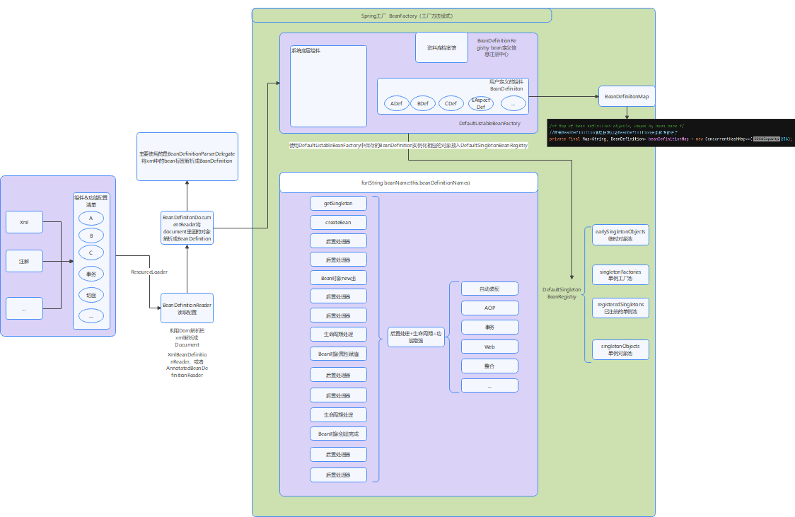

# 资源与资源加载器接口

## Resource

Resource接口如下(IDEA的快捷键为ctrl+F12):

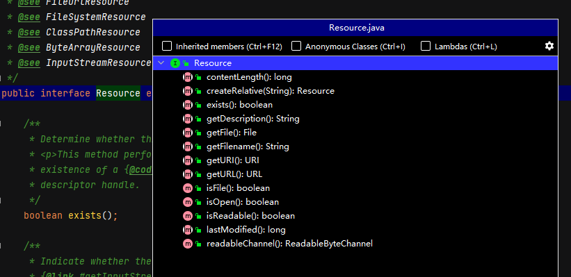

主要作用是定义快速读取资源的方法。

使用（ctrl+H）查看Resource资源的实现类：

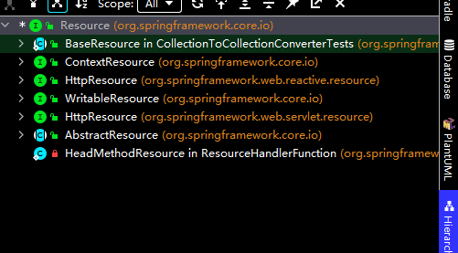

## ResourceLoader

ResourceLoader的主要作用是获得Resource资源：

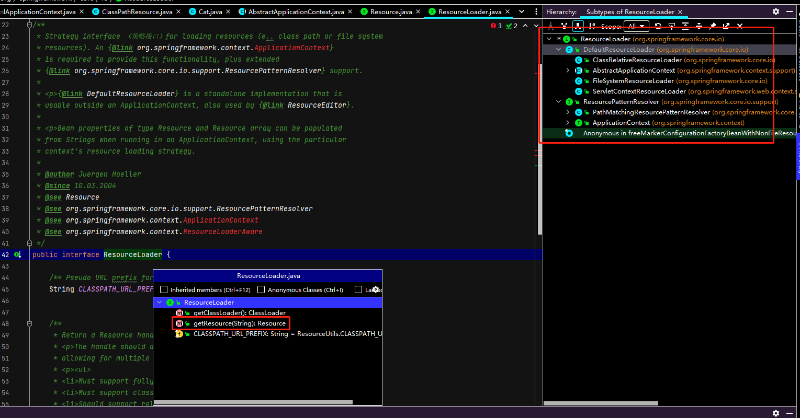

# BeanFactory分析

BeanFactory是Spring的根接口，该接口可以保存很多bean的定义信息（BeanDefinition）,该工厂可以返回对象的原型或单例。

BeanFactory的核心函数如下：

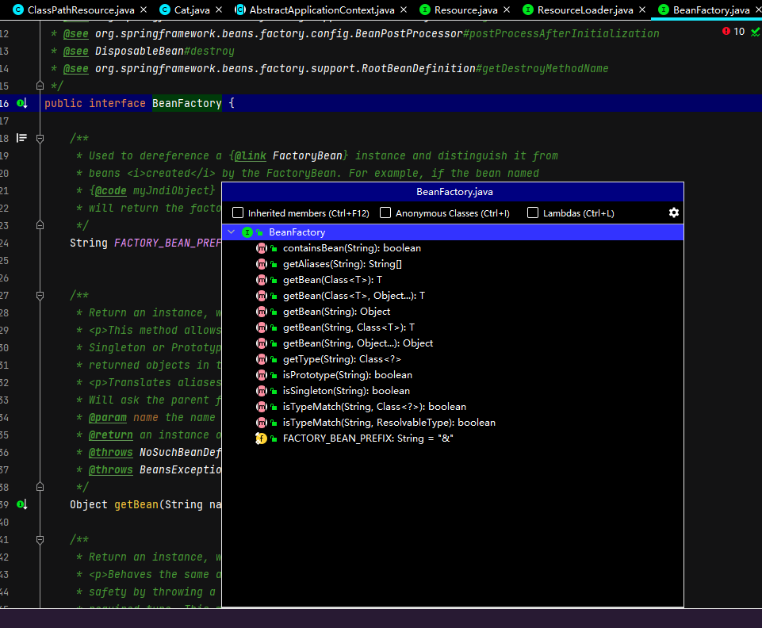

BeanFactory的相关类图如下：

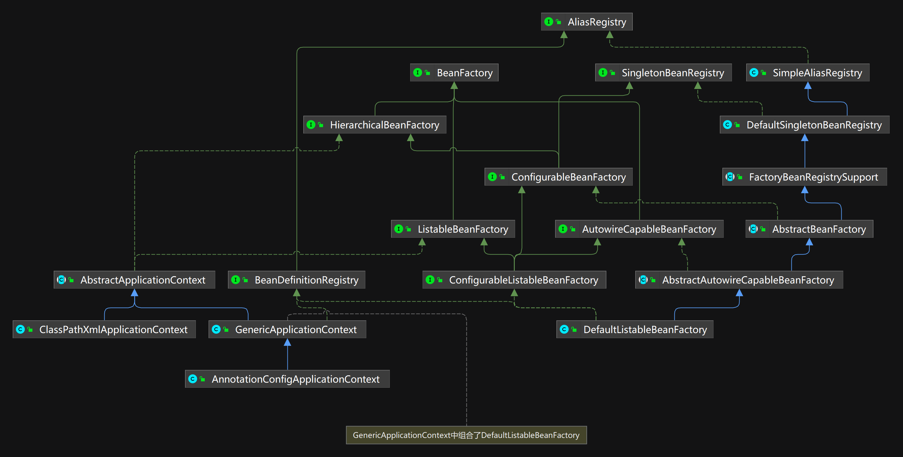

其中：

+ AliasRegistry定义对alias的简单增删改等操作
+ BeanDefiniitonRegistry:定义对BeanDefinition的各种增删改操作
+ SimpleAliasRegistry：主要使用map作为alias的缓存，并对接口AliasRegistry进行实现
+ **BeanFactory**：定义获取bean及bean的各种属性
+ SingletonBeanRegistry:定义对单例的注册及获取
+ **ListableBeanFactory**:根据各种条件获取bean的配置清单
+ **HierarchicalBeanFactory**:继承BeanFactory，也就是在BeanFactory定义的功能的基础上增加对parentFactory的支持（父子容器）
+ DefaultSingletonBeanRegistry:对接口SingletonBeanRegistry个函数的实现
+ ConfigurableBeanFacotry:提供配置Facory的各种方法
+ FactoryBeanRegistrySupport:在DefaultSingletonBeanRegistry基础上增加了对FactoryBean的特殊处理
+ **AutowireCapableBeanFactory**:提供创建bean，自动注入，初始化以及应用bean的**后置处理器**
+ AbstractBeanFactory:综合FactoryBeanRegistrySupport和ConfigurableBeanFactory的功能
+ ConfigurableListableBeanFactory:BeanFactory的配置清单，指定忽略类型及接口等
+ AbstractAutowireCapableBeanFactory:综合AbstractBeanFactory并对接口AutowireCapableBeanFactory进行实现
+ **DefaultListableBeanFactory**:综合上面所有功能，主要是对bean注册后的处理，是spring框架的档案馆（该类非常重要，只保存bean的定义信息）

ListableBeanFactory接口的函数如下：

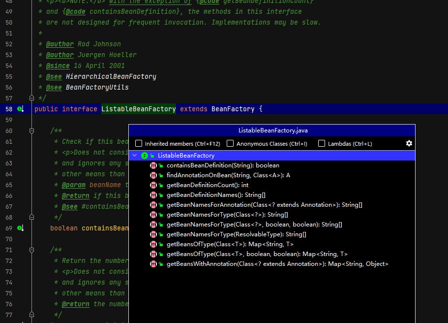

并且AbstractApplicationContext中含有ResourcePatternResolver类，该类继承了接口ResourceLoader，在构造函数中给ResourcePatternResolver赋值：

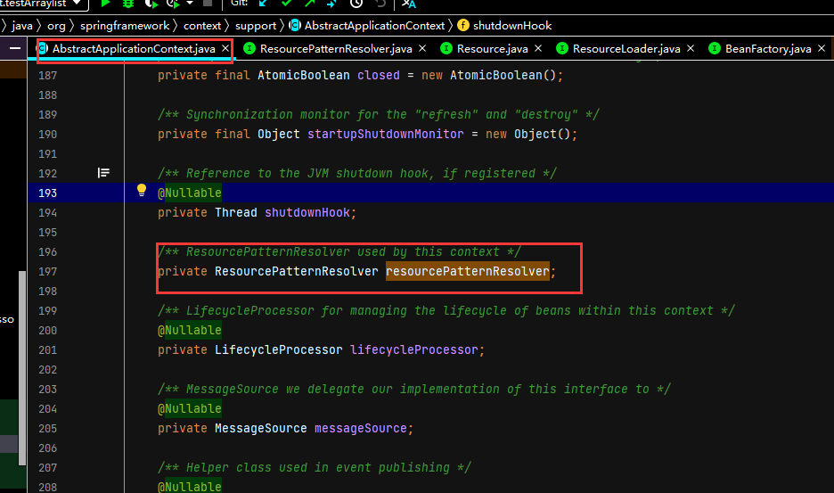

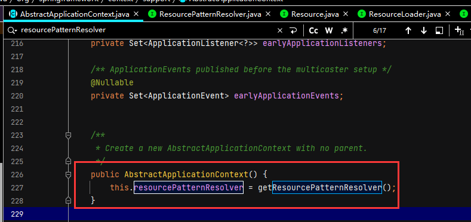

# 什么时候BeanDefinition放入DefaultListableBeanFactory

BeanDefinition存放的是Spring框架从xml中解析得到的bean信息。

## 准备工作

+ 编写java类

```java
package com.CodingInn.code.pojo;

import org.springframework.stereotype.Component;

public class Cat {
   private String catName = "tomcat";

   public String getCatName() {
      return catName;
   }

   public void setCatName(String catName) {
      this.catName = catName;
   }
}
```

+ 编写beans.xml

```xml
<?xml version="1.0" encoding="UTF-8"?>
<beans xmlns="http://www.springframework.org/schema/beans"
      xmlns:xsi="http://www.w3.org/2001/XMLSchema-instance"
      xsi:schemaLocation="http://www.springframework.org/schema/beans http://www.springframework.org/schema/beans/spring-beans.xsd">

   <bean class="com.CodingInn.code.pojo.Cat" id="cat">
      <property name="catName" value="cat"/>
   </bean>

</beans>
```

+ 载入xml并获取bean

```java
@Test
public void testApplicationContext(){
   ApplicationContext applicationContext = new ClassPathXmlApplicationContext("beans.xml");
   Cat bean = applicationContext.getBean(Cat.class);
   System.out.println(bean.getCatName());
}
```

## 开始调试

函数入口：

```java
ApplicationContext applicationContext = new ClassPathXmlApplicationContext("beans.xml");
```

然后对IOC容器进行创建：

+ ClassPathXmlApplicationContext.java

```java
public ClassPathXmlApplicationContext(String configLocation) throws BeansException {
   this(new String[] {configLocation}, true, null);
}


public ClassPathXmlApplicationContext(
			String[] configLocations, boolean refresh, @Nullable ApplicationContext parent)
			throws BeansException {

		super(parent);
		setConfigLocations(configLocations);//设置配置路径
		if (refresh) {
			refresh();//刷新容器,核心步骤
		}
	}
```

+ AbstractApplicationContext.java

```java
@Override
public void refresh() throws BeansException, IllegalStateException {
   synchronized (this.startupShutdownMonitor) {
     ...

      // BeanFactory第一次开始创建的时候,有xml解析逻辑
      // 创建容器对象 ,获得的是DefaultListableBeanFactory
      ConfigurableListableBeanFactory beanFactory = obtainFreshBeanFactory();

      ...
   }
}


    protected ConfigurableListableBeanFactory obtainFreshBeanFactory() {
       refreshBeanFactory();//刷新Bean工厂
       ConfigurableListableBeanFactory beanFactory = getBeanFactory();
       if (logger.isDebugEnabled()) {
          logger.debug("Bean factory for " + getDisplayName() + ": " + beanFactory);
       }
       return beanFactory;
    }


```

+ AbstractRefreshableApplicationContext.java

```java
@Override
protected final void refreshBeanFactory() throws BeansException {
	if (hasBeanFactory()) {
		destroyBeans();
		closeBeanFactory();
	}
	try {
		DefaultListableBeanFactory beanFactory = createBeanFactory();//创建保存所有BeanDefinition的档案馆
		beanFactory.setSerializationId(getId());
		customizeBeanFactory(beanFactory);//定制化beanFactory
		loadBeanDefinitions(beanFactory);//从xml中加载所有bean定义信息
		this.beanFactory = beanFactory;
	}
	catch (IOException ex) {
		throw new ApplicationContextException("I/O error parsing bean definition source for " + getDisplayName(), ex);
	}
}
```

+ AbstractXmlAppliacationContext.java(是ClassPathXmlApplicationContext的父类)

```java
@Override
protected void loadBeanDefinitions(DefaultListableBeanFactory beanFactory) throws BeansException, IOException {
   //准备读取xml内容的读取器
   XmlBeanDefinitionReader beanDefinitionReader = new XmlBeanDefinitionReader(beanFactory);

   beanDefinitionReader.setEnvironment(this.getEnvironment());
   beanDefinitionReader.setResourceLoader(this);//组合资源加载器
   beanDefinitionReader.setEntityResolver(new ResourceEntityResolver(this));

   // Allow a subclass to provide custom initialization of the reader,
   // then proceed with actually loading the bean definitions.
   initBeanDefinitionReader(beanDefinitionReader);
   loadBeanDefinitions(beanDefinitionReader);
}


	protected void loadBeanDefinitions(XmlBeanDefinitionReader reader) throws BeansException, IOException {
		Resource[] configResources = getConfigResources();
		if (configResources != null) {
			reader.loadBeanDefinitions(configResources);
		}
		String[] configLocations = getConfigLocations();//可以一次传入很多配置文件
		if (configLocations != null) {
			reader.loadBeanDefinitions(configLocations);//读取文件
		}
	}
```

+ AbstractBeanDefinitionReader.java

```java
@Override
public int loadBeanDefinitions(String... locations) throws BeanDefinitionStoreException {
   Assert.notNull(locations, "Location array must not be null");
   int counter = 0;
   for (String location : locations) {//加载每一个配置文件里面的内容
      counter += loadBeanDefinitions(location);
   }
   return counter;
}


	@Override //加载指定配置文件的所有内容
	public int loadBeanDefinitions(String location) throws BeanDefinitionStoreException {
		return loadBeanDefinitions(location, null);
	}


	public int loadBeanDefinitions(String location, @Nullable Set<Resource> actualResources) throws BeanDefinitionStoreException {
		ResourceLoader resourceLoader = getResourceLoader();
		...

		if (resourceLoader instanceof ResourcePatternResolver) {
			// Resource pattern matching available.
			try {
				Resource[] resources = ((ResourcePatternResolver) resourceLoader).getResources(location);//使用策略模式把相应的文件转成Resource对象
				int loadCount = loadBeanDefinitions(resources);
				...
			}
			catch (IOException ex) {
				throw new BeanDefinitionStoreException(
						"Could not resolve bean definition resource pattern [" + location + "]", ex);
			}
		}
		else {
			// Can only load single resources by absolute URL.
			Resource resource = resourceLoader.getResource(location);
			int loadCount = loadBeanDefinitions(resource);
			if (actualResources != null) {
				actualResources.add(resource);
			}
			if (logger.isDebugEnabled()) {
				logger.debug("Loaded " + loadCount + " bean definitions from location [" + location + "]");
			}
			return loadCount;
		}
	}


	@Override
	public int loadBeanDefinitions(Resource... resources) throws BeanDefinitionStoreException {
		Assert.notNull(resources, "Resource array must not be null");
		int counter = 0;
		for (Resource resource : resources) {
			counter += loadBeanDefinitions(resource);
		}
		return counter;
	}


```

+ XmlBeanDefinitionReader.java


```java
@Override
public int loadBeanDefinitions(Resource resource) throws BeanDefinitionStoreException {
	return loadBeanDefinitions(new EncodedResource(resource));//包装模式
}

public int loadBeanDefinitions(EncodedResource encodedResource) throws BeanDefinitionStoreException {
	...

	//通过属性来记录已经加载的资源
	Set<EncodedResource> currentResources = this.resourcesCurrentlyBeingLoaded.get();
	if (currentResources == null) {
		currentResources = new HashSet<>(4);
		this.resourcesCurrentlyBeingLoaded.set(currentResources);
	}
	if (!currentResources.add(encodedResource)) {
		throw new BeanDefinitionStoreException(
				"Detected cyclic loading of " + encodedResource + " - check your import definitions!");
	}
	try {
		//从encodedResource中获取已经封装的Resource对象并再次从Resource中获取其中的inputStream
		InputStream inputStream = encodedResource.getResource().getInputStream();
		try {

			InputSource inputSource = new InputSource(inputStream);
			if (encodedResource.getEncoding() != null) {
				inputSource.setEncoding(encodedResource.getEncoding());
			}
			//真正进入了逻辑核心部分
			return doLoadBeanDefinitions(inputSource, encodedResource.getResource());
		}
		finally {
			//关闭输入流
			inputStream.close();
		}
	}
	catch (IOException ex) {
		throw new BeanDefinitionStoreException(
				"IOException parsing XML document from " + encodedResource.getResource(), ex);
	}
	finally {
		currentResources.remove(encodedResource);
		if (currentResources.isEmpty()) {
			this.resourcesCurrentlyBeingLoaded.remove();
		}
	}
}


protected int doLoadBeanDefinitions(InputSource inputSource, Resource resource)
			throws BeanDefinitionStoreException {
		try {
			Document doc = doLoadDocument(inputSource, resource);//利用dom解析工具把xml变成Document
			return registerBeanDefinitions(doc, resource);//注册Bean
		}
		...
	}


public int registerBeanDefinitions(Document doc, Resource resource) throws BeanDefinitionStoreException {
		BeanDefinitionDocumentReader documentReader = createBeanDefinitionDocumentReader();
		int countBefore = getRegistry().getBeanDefinitionCount();
		documentReader.registerBeanDefinitions(doc, createReaderContext(resource));
		return getRegistry().getBeanDefinitionCount() - countBefore;
	}
```

+ DefaultBeanDefinitionDocumentReader.java

```java
@Override
public void registerBeanDefinitions(Document doc, XmlReaderContext readerContext) {
   this.readerContext = readerContext;
   logger.debug("Loading bean definitions");
   Element root = doc.getDocumentElement();//获取Document的根节点
   doRegisterBeanDefinitions(root);//解析并放入框架中
}


protected void doRegisterBeanDefinitions(Element root) {

		BeanDefinitionParserDelegate parent = this.delegate;//xml里的定义标签
		this.delegate = createDelegate(getReaderContext(), root, parent);

		if (this.delegate.isDefaultNamespace(root)) {
			String profileSpec = root.getAttribute(PROFILE_ATTRIBUTE);
			if (StringUtils.hasText(profileSpec)) {
				String[] specifiedProfiles = StringUtils.tokenizeToStringArray(
						profileSpec, BeanDefinitionParserDelegate.MULTI_VALUE_ATTRIBUTE_DELIMITERS);
				if (!getReaderContext().getEnvironment().acceptsProfiles(specifiedProfiles)) {
					if (logger.isInfoEnabled()) {
						logger.info("Skipped XML bean definition file due to specified profiles [" + profileSpec +
								"] not matching: " + getReaderContext().getResource());
					}
					return;
				}
			}
		}

		preProcessXml(root);
		parseBeanDefinitions(root, this.delegate);//解析Document对象
		postProcessXml(root);

		this.delegate = parent;
	}

//遍历文档中的所有结点
protected void parseBeanDefinitions(Element root, BeanDefinitionParserDelegate delegate) {
		if (delegate.isDefaultNamespace(root)) {
			NodeList nl = root.getChildNodes();
			for (int i = 0; i < nl.getLength(); i++) {
				Node node = nl.item(i);
				if (node instanceof Element) {
					Element ele = (Element) node;
					if (delegate.isDefaultNamespace(ele)) {
						parseDefaultElement(ele, delegate);
					}
					else {
						delegate.parseCustomElement(ele);
					}
				}
			}
		}
		else {
			delegate.parseCustomElement(root);
		}
	}


//根据不同的标签类型调用不同的解析方法
	private void parseDefaultElement(Element ele, BeanDefinitionParserDelegate delegate) {
		if (delegate.nodeNameEquals(ele, IMPORT_ELEMENT)) {
			importBeanDefinitionResource(ele);
		}
		else if (delegate.nodeNameEquals(ele, ALIAS_ELEMENT)) {
			processAliasRegistration(ele);
		}
		else if (delegate.nodeNameEquals(ele, BEAN_ELEMENT)) {
			processBeanDefinition(ele, delegate);
		}
		else if (delegate.nodeNameEquals(ele, NESTED_BEANS_ELEMENT)) {
			// recurse
			doRegisterBeanDefinitions(ele);
		}
	}


protected void processBeanDefinition(Element ele, BeanDefinitionParserDelegate delegate) {
		BeanDefinitionHolder bdHolder = delegate.parseBeanDefinitionElement(ele);//BeanDefinitionHolder中存放了Xml中配置的某一个节点的信息,BeanDefinitionHolder中含有BeanDefinition和beanName
		if (bdHolder != null) {
			bdHolder = delegate.decorateBeanDefinitionIfRequired(ele, bdHolder);
			try {
				//注册BeanDefinitionHolder
				BeanDefinitionReaderUtils.registerBeanDefinition(bdHolder, getReaderContext().getRegistry());
			}
			catch (BeanDefinitionStoreException ex) {
				getReaderContext().error("Failed to register bean definition with name '" +
						bdHolder.getBeanName() + "'", ele, ex);
			}
			// Send registration event.发送通知事件
			getReaderContext().fireComponentRegistered(new BeanComponentDefinition(bdHolder));
		}
	}
```

+ BeanDefiniitonReaderUtils

```java
public static void registerBeanDefinition( BeanDefinitionHolder definitionHolder, BeanDefinitionRegistry registry)
      throws BeanDefinitionStoreException {

   // Register bean definition under primary name.
   String beanName = definitionHolder.getBeanName();
   registry.registerBeanDefinition(beanName, definitionHolder.getBeanDefinition());//进行注册

   // Register aliases for bean name, if any.
   String[] aliases = definitionHolder.getAliases();
   if (aliases != null) {
      for (String alias : aliases) {
         registry.registerAlias(beanName, alias);
      }
   }
}
```

+ DefaultListableBeanFactory.java

```java
@Override
public void registerBeanDefinition(String beanName, BeanDefinition beanDefinition)
      throws BeanDefinitionStoreException {

   ...

   BeanDefinition existingDefinition = this.beanDefinitionMap.get(beanName);//先检测是否含有该bean
   if (existingDefinition != null) {
     ...
   }
   else {
      if (hasBeanCreationStarted()) {
         // Cannot modify startup-time collection elements anymore (for stable iteration)
         synchronized (this.beanDefinitionMap) {
            this.beanDefinitionMap.put(beanName, beanDefinition);
            List<String> updatedDefinitions = new ArrayList<>(this.beanDefinitionNames.size() + 1);
            updatedDefinitions.addAll(this.beanDefinitionNames);
            updatedDefinitions.add(beanName);
            this.beanDefinitionNames = updatedDefinitions;
            if (this.manualSingletonNames.contains(beanName)) {
               Set<String> updatedSingletons = new LinkedHashSet<>(this.manualSingletonNames);
               updatedSingletons.remove(beanName);
               this.manualSingletonNames = updatedSingletons;
            }
         }
      }
      else {
         ...
      }
     ...
   }

...
}
```

# 读取bean信息的流程

+ Test

```java
@Test
public void testApplicationContext(){
   ApplicationContext applicationContext = new ClassPathXmlApplicationContext("beans.xml");
   Cat bean = applicationContext.getBean(Cat.class);
   System.out.println(bean.getCatName());
}
```

+ ClassPathXmlApplicationContext

```java
public ClassPathXmlApplicationContext(String configLocation) throws BeansException {
   this(new String[] {configLocation}, true, null);
}

public ClassPathXmlApplicationContext(
			String[] configLocations, boolean refresh, @Nullable ApplicationContext parent)
			throws BeansException {

		super(parent);
		setConfigLocations(configLocations);//设置配置路径
		if (refresh) {
			refresh();//刷新容器,核心步骤
		}
	}
```

函数入口：

```java
ApplicationContext applicationContext = new ClassPathXmlApplicationContext("beans.xml");
```

然后对IOC容器进行创建：

+ ClassPathXmlApplicationContext.java

```java
public ClassPathXmlApplicationContext(String configLocation) throws BeansException {
   this(new String[] {configLocation}, true, null);
}


public ClassPathXmlApplicationContext(
			String[] configLocations, boolean refresh, @Nullable ApplicationContext parent)
			throws BeansException {

		super(parent);
		setConfigLocations(configLocations);//设置配置路径
		if (refresh) {
			refresh();//刷新容器,核心步骤
		}
	}
```

+ AbstractApplicationContext.java

```java
@Override
public void refresh() throws BeansException, IllegalStateException {
   synchronized (this.startupShutdownMonitor) {
     ...

      // BeanFactory第一次开始创建的时候,有xml解析逻辑
      // 创建容器对象 ,获得的是DefaultListableBeanFactory
      ConfigurableListableBeanFactory beanFactory = obtainFreshBeanFactory();

      ...
   }
}


    protected ConfigurableListableBeanFactory obtainFreshBeanFactory() {
       refreshBeanFactory();//刷新Bean工厂
       ConfigurableListableBeanFactory beanFactory = getBeanFactory();
       if (logger.isDebugEnabled()) {
          logger.debug("Bean factory for " + getDisplayName() + ": " + beanFactory);
       }
       return beanFactory;
    }


```

+ AbstractRefreshableApplicationContext.java

```java
@Override
protected final void refreshBeanFactory() throws BeansException {
	if (hasBeanFactory()) {
		destroyBeans();
		closeBeanFactory();
	}
	try {
		DefaultListableBeanFactory beanFactory = createBeanFactory();//创建保存所有BeanDefinition的档案馆
		beanFactory.setSerializationId(getId());
		customizeBeanFactory(beanFactory);//定制化beanFactory
		loadBeanDefinitions(beanFactory);//从xml中加载所有bean定义信息
		this.beanFactory = beanFactory;
	}
	catch (IOException ex) {
		throw new ApplicationContextException("I/O error parsing bean definition source for " + getDisplayName(), ex);
	}
}
```

+ AbstractXmlAppliacationContext.java(是ClassPathXmlApplicationContext的父类)

```java
@Override
protected void loadBeanDefinitions(DefaultListableBeanFactory beanFactory) throws BeansException, IOException {
   //准备读取xml内容的读取器
   XmlBeanDefinitionReader beanDefinitionReader = new XmlBeanDefinitionReader(beanFactory);

   beanDefinitionReader.setEnvironment(this.getEnvironment());
   beanDefinitionReader.setResourceLoader(this);//组合资源加载器
   beanDefinitionReader.setEntityResolver(new ResourceEntityResolver(this));

   // Allow a subclass to provide custom initialization of the reader,
   // then proceed with actually loading the bean definitions.
   initBeanDefinitionReader(beanDefinitionReader);
   loadBeanDefinitions(beanDefinitionReader);
}


	protected void loadBeanDefinitions(XmlBeanDefinitionReader reader) throws BeansException, IOException {
		Resource[] configResources = getConfigResources();
		if (configResources != null) {
			reader.loadBeanDefinitions(configResources);
		}
		String[] configLocations = getConfigLocations();//可以一次传入很多配置文件
		if (configLocations != null) {
			reader.loadBeanDefinitions(configLocations);//读取文件
		}
	}
```

+ AbstractBeanDefinitionReader.java

```java
@Override
public int loadBeanDefinitions(String... locations) throws BeanDefinitionStoreException {
   Assert.notNull(locations, "Location array must not be null");
   int counter = 0;
   for (String location : locations) {//加载每一个配置文件里面的内容
      counter += loadBeanDefinitions(location);
   }
   return counter;
}


	@Override //加载指定配置文件的所有内容
	public int loadBeanDefinitions(String location) throws BeanDefinitionStoreException {
		return loadBeanDefinitions(location, null);
	}


	public int loadBeanDefinitions(String location, @Nullable Set<Resource> actualResources) throws BeanDefinitionStoreException {
		ResourceLoader resourceLoader = getResourceLoader();
		...

		if (resourceLoader instanceof ResourcePatternResolver) {
			// Resource pattern matching available.
			try {
				Resource[] resources = ((ResourcePatternResolver) resourceLoader).getResources(location);//使用策略模式把相应的文件转成Resource对象
				int loadCount = loadBeanDefinitions(resources);
				...
			}
			catch (IOException ex) {
				throw new BeanDefinitionStoreException(
						"Could not resolve bean definition resource pattern [" + location + "]", ex);
			}
		}
		else {
			// Can only load single resources by absolute URL.
			Resource resource = resourceLoader.getResource(location);
			int loadCount = loadBeanDefinitions(resource);
			if (actualResources != null) {
				actualResources.add(resource);
			}
			if (logger.isDebugEnabled()) {
				logger.debug("Loaded " + loadCount + " bean definitions from location [" + location + "]");
			}
			return loadCount;
		}
	}


	@Override
	public int loadBeanDefinitions(Resource... resources) throws BeanDefinitionStoreException {
		Assert.notNull(resources, "Resource array must not be null");
		int counter = 0;
		for (Resource resource : resources) {
			counter += loadBeanDefinitions(resource);
		}
		return counter;
	}


```

+ XmlBeanDefinitionReader.java


```java
@Override
public int loadBeanDefinitions(Resource resource) throws BeanDefinitionStoreException {
	return loadBeanDefinitions(new EncodedResource(resource));//包装模式
}

public int loadBeanDefinitions(EncodedResource encodedResource) throws BeanDefinitionStoreException {
	...

	//通过属性来记录已经加载的资源
	Set<EncodedResource> currentResources = this.resourcesCurrentlyBeingLoaded.get();
	if (currentResources == null) {
		currentResources = new HashSet<>(4);
		this.resourcesCurrentlyBeingLoaded.set(currentResources);
	}
	if (!currentResources.add(encodedResource)) {
		throw new BeanDefinitionStoreException(
				"Detected cyclic loading of " + encodedResource + " - check your import definitions!");
	}
	try {
		//从encodedResource中获取已经封装的Resource对象并再次从Resource中获取其中的inputStream
		InputStream inputStream = encodedResource.getResource().getInputStream();
		try {

			InputSource inputSource = new InputSource(inputStream);
			if (encodedResource.getEncoding() != null) {
				inputSource.setEncoding(encodedResource.getEncoding());
			}
			//真正进入了逻辑核心部分
			return doLoadBeanDefinitions(inputSource, encodedResource.getResource());
		}
		finally {
			//关闭输入流
			inputStream.close();
		}
	}
	catch (IOException ex) {
		throw new BeanDefinitionStoreException(
				"IOException parsing XML document from " + encodedResource.getResource(), ex);
	}
	finally {
		currentResources.remove(encodedResource);
		if (currentResources.isEmpty()) {
			this.resourcesCurrentlyBeingLoaded.remove();
		}
	}
}


protected int doLoadBeanDefinitions(InputSource inputSource, Resource resource)
			throws BeanDefinitionStoreException {
		try {
			Document doc = doLoadDocument(inputSource, resource);//利用dom解析工具把xml变成Document
			return registerBeanDefinitions(doc, resource);//注册Bean
		}
		...
	}


public int registerBeanDefinitions(Document doc, Resource resource) throws BeanDefinitionStoreException {
		BeanDefinitionDocumentReader documentReader = createBeanDefinitionDocumentReader();
		int countBefore = getRegistry().getBeanDefinitionCount();
		documentReader.registerBeanDefinitions(doc, createReaderContext(resource));
		return getRegistry().getBeanDefinitionCount() - countBefore;
	}
```

+ DefaultBeanDefinitionDocumentReader.java

```java
@Override
public void registerBeanDefinitions(Document doc, XmlReaderContext readerContext) {
   this.readerContext = readerContext;
   logger.debug("Loading bean definitions");
   Element root = doc.getDocumentElement();//获取Document的根节点
   doRegisterBeanDefinitions(root);//解析并放入框架中
}


protected void doRegisterBeanDefinitions(Element root) {

		BeanDefinitionParserDelegate parent = this.delegate;//xml里的定义标签
		this.delegate = createDelegate(getReaderContext(), root, parent);

		if (this.delegate.isDefaultNamespace(root)) {
			String profileSpec = root.getAttribute(PROFILE_ATTRIBUTE);
			if (StringUtils.hasText(profileSpec)) {
				String[] specifiedProfiles = StringUtils.tokenizeToStringArray(
						profileSpec, BeanDefinitionParserDelegate.MULTI_VALUE_ATTRIBUTE_DELIMITERS);
				if (!getReaderContext().getEnvironment().acceptsProfiles(specifiedProfiles)) {
					if (logger.isInfoEnabled()) {
						logger.info("Skipped XML bean definition file due to specified profiles [" + profileSpec +
								"] not matching: " + getReaderContext().getResource());
					}
					return;
				}
			}
		}

		preProcessXml(root);
		parseBeanDefinitions(root, this.delegate);//解析Document对象
		postProcessXml(root);

		this.delegate = parent;
	}

//遍历文档中的所有结点
protected void parseBeanDefinitions(Element root, BeanDefinitionParserDelegate delegate) {
		if (delegate.isDefaultNamespace(root)) {
			NodeList nl = root.getChildNodes();
			for (int i = 0; i < nl.getLength(); i++) {
				Node node = nl.item(i);
				if (node instanceof Element) {
					Element ele = (Element) node;
					if (delegate.isDefaultNamespace(ele)) {
						parseDefaultElement(ele, delegate);
					}
					else {
						delegate.parseCustomElement(ele);
					}
				}
			}
		}
		else {
			delegate.parseCustomElement(root);
		}
	}


//根据不同的标签类型调用不同的解析方法
	private void parseDefaultElement(Element ele, BeanDefinitionParserDelegate delegate) {
		if (delegate.nodeNameEquals(ele, IMPORT_ELEMENT)) {
			importBeanDefinitionResource(ele);
		}
		else if (delegate.nodeNameEquals(ele, ALIAS_ELEMENT)) {
			processAliasRegistration(ele);
		}
		else if (delegate.nodeNameEquals(ele, BEAN_ELEMENT)) {
			processBeanDefinition(ele, delegate);
		}
		else if (delegate.nodeNameEquals(ele, NESTED_BEANS_ELEMENT)) {
			// recurse
			doRegisterBeanDefinitions(ele);
		}
	}


protected void processBeanDefinition(Element ele, BeanDefinitionParserDelegate delegate) {
		BeanDefinitionHolder bdHolder = delegate.parseBeanDefinitionElement(ele);//BeanDefinitionHolder中存放了Xml中配置的某一个节点的信息,BeanDefinitionHolder中含有BeanDefinition和beanName
		if (bdHolder != null) {
			bdHolder = delegate.decorateBeanDefinitionIfRequired(ele, bdHolder);
			try {
				//注册BeanDefinitionHolder
				BeanDefinitionReaderUtils.registerBeanDefinition(bdHolder, getReaderContext().getRegistry());
			}
			catch (BeanDefinitionStoreException ex) {
				getReaderContext().error("Failed to register bean definition with name '" +
						bdHolder.getBeanName() + "'", ele, ex);
			}
			// Send registration event.发送通知事件
			getReaderContext().fireComponentRegistered(new BeanComponentDefinition(bdHolder));
		}
	}
```

+ BeanDefinitionParseDelegate

```java
@Nullable
public BeanDefinitionHolder parseBeanDefinitionElement(Element ele) {
   return parseBeanDefinitionElement(ele, null);
}


public BeanDefinitionHolder parseBeanDefinitionElement(Element ele, @Nullable BeanDefinition containingBean) {
		String id = ele.getAttribute(ID_ATTRIBUTE);//Dom解析里的内容
		String nameAttr = ele.getAttribute(NAME_ATTRIBUTE);

		List<String> aliases = new ArrayList<>();
		if (StringUtils.hasLength(nameAttr)) {
			String[] nameArr = StringUtils.tokenizeToStringArray(nameAttr, MULTI_VALUE_ATTRIBUTE_DELIMITERS);
			aliases.addAll(Arrays.asList(nameArr));
		}

		String beanName = id;//id就是bean的名字
		if (!StringUtils.hasText(beanName) && !aliases.isEmpty()) {
			beanName = aliases.remove(0);
			if (logger.isDebugEnabled()) {
				logger.debug("No XML 'id' specified - using '" + beanName +
						"' as bean name and " + aliases + " as aliases");
			}
		}

		if (containingBean == null) {
			checkNameUniqueness(beanName, aliases, ele);
		}

		AbstractBeanDefinition beanDefinition = parseBeanDefinitionElement(ele, beanName, containingBean);
		...

		return null;
	}


@Nullable
	public AbstractBeanDefinition parseBeanDefinitionElement(
			Element ele, String beanName, @Nullable BeanDefinition containingBean) {

		this.parseState.push(new BeanEntry(beanName));

		String className = null;
		if (ele.hasAttribute(CLASS_ATTRIBUTE)) {
			className = ele.getAttribute(CLASS_ATTRIBUTE).trim();
		}
		String parent = null;
		if (ele.hasAttribute(PARENT_ATTRIBUTE)) {
			parent = ele.getAttribute(PARENT_ATTRIBUTE);
		}

		try {
            	//先获取AbstractBeanDefinition，赋予名字，然后再填充信息，bd中包括bean的名字和beanDefinition
			AbstractBeanDefinition bd = createBeanDefinition(className, parent);

			parseBeanDefinitionAttributes(ele, beanName, containingBean, bd);
			bd.setDescription(DomUtils.getChildElementValueByTagName(ele, DESCRIPTION_ELEMENT));

			//以下是解析Bean标签里面的元数据放入bd的BeanDefinition中
			parseMetaElements(ele, bd);
			parseLookupOverrideSubElements(ele, bd.getMethodOverrides());
			parseReplacedMethodSubElements(ele, bd.getMethodOverrides());

			parseConstructorArgElements(ele, bd);
			parsePropertyElements(ele, bd);
			parseQualifierElements(ele, bd);

			bd.setResource(this.readerContext.getResource());
			bd.setSource(extractSource(ele));

			return bd;
		}
		catch (ClassNotFoundException ex) {
			...
		}


		return null;
	}


	protected AbstractBeanDefinition createBeanDefinition(@Nullable String className, @Nullable String parentName)
			throws ClassNotFoundException {

		return BeanDefinitionReaderUtils.createBeanDefinition(
				parentName, className, this.readerContext.getBeanClassLoader());
	}
```

+ BeanDefinitionReaderUtils.java

```java
public static AbstractBeanDefinition createBeanDefinition(
      @Nullable String parentName, @Nullable String className, @Nullable ClassLoader classLoader) throws ClassNotFoundException {

   GenericBeanDefinition bd = new GenericBeanDefinition();//创建了一个GenericBeanDefinition，准备封装Bean的名字和BeanDefinition
   bd.setParentName(parentName);
   if (className != null) {
      if (classLoader != null) {
         bd.setBeanClass(ClassUtils.forName(className, classLoader));
      }
      else {
         bd.setBeanClassName(className);
      }
   }
   return bd;
}
```

# xxxAware接口的方法为什么会自动执行

为什么实现了ApplicationContextAware接口,setApplicationContext方法会被自动调用?

编写测试类

```java
package com.CodingInn.code.pojo;

import org.springframework.beans.BeansException;
import org.springframework.beans.factory.annotation.Autowired;
import org.springframework.context.ApplicationContext;
import org.springframework.context.ApplicationContextAware;
import org.springframework.stereotype.Component;

/**
 * Aware接口:帮我们装配Spring底层的一些组件
 */
@Component
public class Cat2 implements ApplicationContextAware {
   private String catName = "tomcat";

   private ApplicationContext context;

   public Cat2() {
      System.out.println("cat创建");
   }

   public String getCatName() {
      return catName;
   }

   public void setCatName(String catName) {
      this.catName = catName;
   }

   public ApplicationContext getContext() {
      return context;
   }

   public void setContext(ApplicationContext context) {
      this.context = context;
   }

   @Override
   public void setApplicationContext(ApplicationContext applicationContext) throws BeansException {
      //利用回调,把ioc传入
      this.context = applicationContext;
   }
}
```

配置类

```java
package com.CodingInn.code.config;

import org.springframework.context.annotation.ComponentScan;
import org.springframework.context.annotation.Configuration;

@ComponentScan("com.CodingInn")
@Configuration
public class MainConfig {
}
```

测试函数入口

```java
@Test
public void testAutowire() {
   ApplicationContext applicationContext = new AnnotationConfigApplicationContext(MainConfig.class);

   Cat bean = applicationContext.getBean(Cat.class);
   ApplicationContext context = bean.getContext();

   System.out.println(applicationContext == context);
}
```

函数的执行流程如下:

+ AnnotationConfigApplicationContext.java

```java
public AnnotationConfigApplicationContext(Class<?>... annotatedClasses) {
   this();
   register(annotatedClasses);
   refresh();//刷新容器
}
```

+ AbstractApplicationContext.java

```java
@Override
public void refresh() throws BeansException, IllegalStateException {
   synchronized (this.startupShutdownMonitor) {
      ...

      try {
         ...

         // 完成BeanFactory的初始化,(工厂里面所有的组件都初始化好了),在该步骤中完成对象的创建
         finishBeanFactoryInitialization(beanFactory);

         ...
      }

      ...
      }
   }
}


protected void finishBeanFactoryInitialization(ConfigurableListableBeanFactory beanFactory) {
		// Initialize conversion service for this context.
		if (beanFactory.containsBean(CONVERSION_SERVICE_BEAN_NAME) &&
				beanFactory.isTypeMatch(CONVERSION_SERVICE_BEAN_NAME, ConversionService.class)) {
			beanFactory.setConversionService(
					beanFactory.getBean(CONVERSION_SERVICE_BEAN_NAME, ConversionService.class));
		}

		// Register a default embedded value resolver if no bean post-processor
		// (such as a PropertyPlaceholderConfigurer bean) registered any before:
		// at this point, primarily for resolution in annotation attribute values.
		if (!beanFactory.hasEmbeddedValueResolver()) {
			beanFactory.addEmbeddedValueResolver(strVal -> getEnvironment().resolvePlaceholders(strVal));
		}

		// Initialize LoadTimeWeaverAware beans early to allow for registering their transformers early.
		String[] weaverAwareNames = beanFactory.getBeanNamesForType(LoadTimeWeaverAware.class, false, false);
		for (String weaverAwareName : weaverAwareNames) {
			getBean(weaverAwareName);
		}

		// Stop using the temporary ClassLoader for type matching.
		beanFactory.setTempClassLoader(null);

		// Allow for caching all bean definition metadata, not expecting further changes.
		beanFactory.freezeConfiguration();

		//初始化所有的单实例Bean
		beanFactory.preInstantiateSingletons();
	}
```

+ DefaultListableBeanFactory.java

```java
@Override
public void preInstantiateSingletons() throws BeansException {
   if (logger.isDebugEnabled()) {
      logger.debug("Pre-instantiating singletons in " + this);
   }

   //获取所有BeanDefinition的名字
   List<String> beanNames = new ArrayList<>(this.beanDefinitionNames);

   // Trigger initialization of all non-lazy singleton beans...
   for (String beanName : beanNames) {
      RootBeanDefinition bd = getMergedLocalBeanDefinition(beanName);//开始解析文件的时候每一个bean标签被解析封装成一个BeanDefinition
      if (!bd.isAbstract() && bd.isSingleton() && !bd.isLazyInit()) {
         if (isFactoryBean(beanName)) {//如果是FactoryBean则执行以下逻辑
            ....
         }
         else {//非工厂bean
            getBean(beanName);
         }
      }
   }
}
```

+ AbstractBeanFactory.java

```java
@Override
public Object getBean(String name) throws BeansException {
   return doGetBean(name, null, null, false);
}


protected <T> T doGetBean(
			String name, @Nullable Class<T> requiredType, @Nullable Object[] args, boolean typeCheckOnly)
			throws BeansException {

		String beanName = transformedBeanName(name);//提取对应的beanName
		Object bean;

		//检查缓存中是否存在,寻找的是DefaultSingletonBeanRegistry里的singletonObjects map是否含有对应的Object
    	  //DefaultListableBeanFactory是DefaultSingletonBeanRegistry的子类,DefaultSingletonBeanRegistry类中存放了很多map,用于存储bean的信息,IOC容器的单例池存放的地方
		Object sharedInstance = getSingleton(beanName);
		if (sharedInstance != null && args == null) {
			...
		}
		else {
			...

			try {
				RootBeanDefinition mbd = getMergedLocalBeanDefinition(beanName);
				checkMergedBeanDefinition(mbd, beanName, args);

				// Guarantee initialization of beans that the current bean depends on.
				String[] dependsOn = mbd.getDependsOn();
                		//看当前bean是否依赖其他bean,如果有,则先获取其他的那些bean
				if (dependsOn != null) {
					for (String dep : dependsOn) {
						...
						try {
							getBean(dep);
						}
						...
					}
				}

				//创建bean的实例
				if (mbd.isSingleton()) {
                  		  //创建bean对象的实例
					sharedInstance = getSingleton(beanName, () -> {
						try {
							return createBean(beanName, mbd, args);
						}
						...
					});
					bean = getObjectForBeanInstance(sharedInstance, name, beanName, mbd);
				}

				else if (mbd.isPrototype()) {
					// It's a prototype -> create a new instance.
					...
				}

				else {
					...
				}
			}
			catch (BeansException ex) {
				...
			}
		}

		// Check if required type matches the type of the actual bean instance.
		if (requiredType != null && !requiredType.isInstance(bean)) {
			...
		}
		return (T) bean;
	}
```

+ DefaultSingletonBeanRegistry.java

```java
public Object getSingleton(String beanName, ObjectFactory<?> singletonFactory) {
		Assert.notNull(beanName, "Bean name must not be null");
		synchronized (this.singletonObjects) {
			Object singletonObject = this.singletonObjects.get(beanName);
			if (singletonObject == null) {
				...
				try {
					singletonObject = singletonFactory.getObject();////ObjectFactory提供Bean实例,此处的getObect是上一步sharedInstance = getSingleton(...)的lambda表达式 createBean(beanName, mbd, args)
					newSingleton = true;
				}
				...
			}
			return singletonObject;
		}
	}
```

## 支线1:创建bean实例

+ AbstractAutowireCapableBeanFactory.java

```java
@Override
protected Object createBean(String beanName, RootBeanDefinition mbd, @Nullable Object[] args)
      throws BeanCreationException {

  ...

   try {
      Object beanInstance = doCreateBean(beanName, mbdToUse, args);//创建bean实例
      if (logger.isDebugEnabled()) {
         logger.debug("Finished creating instance of bean '" + beanName + "'");
      }
      return beanInstance;
   }
   ...
}


protected Object doCreateBean(String beanName, RootBeanDefinition mbd, @Nullable Object[] args)
			throws BeanCreationException {

		// 创建Bean实例
		BeanWrapper instanceWrapper = null;
		if (mbd.isSingleton()) {
			instanceWrapper = this.factoryBeanInstanceCache.remove(beanName);
		}
		if (instanceWrapper == null) {
			instanceWrapper = createBeanInstance(beanName, mbd, args);//支线1:创建bean实例
		}
		...
            // 初始化bean实例
		Object exposedObject = bean;
		try {
			populateBean(beanName, mbd, instanceWrapper);//给bean的属性赋值
			exposedObject = initializeBean(beanName, exposedObject, mbd);//支线2:应用后置处理器
		}
		...
		}
    	   ...
		return exposedObject;
	}


//支线1:创建bean实例
protected BeanWrapper createBeanInstance(String beanName, RootBeanDefinition mbd, @Nullable Object[] args) {
		...

		// Shortcut when re-creating the same bean...
		boolean resolved = false;
		boolean autowireNecessary = false;
		if (args == null) {
			synchronized (mbd.constructorArgumentLock) {
				if (mbd.resolvedConstructorOrFactoryMethod != null) {
					resolved = true;
					autowireNecessary = mbd.constructorArgumentsResolved;
				}
			}
		}
		if (resolved) {
			if (autowireNecessary) {
				return autowireConstructor(beanName, mbd, null, null);
			}
			else {
				return instantiateBean(beanName, mbd);
			}
		}

		// Candidate constructors for autowiring?
		Constructor<?>[] ctors = determineConstructorsFromBeanPostProcessors(beanClass, beanName);
		if (ctors != null || mbd.getResolvedAutowireMode() == AUTOWIRE_CONSTRUCTOR ||
				mbd.hasConstructorArgumentValues() || !ObjectUtils.isEmpty(args)) {
			return autowireConstructor(beanName, mbd, ctors, args);
		}

		// No special handling: simply use no-arg constructor.
		return instantiateBean(beanName, mbd);
	}


//支线1:创建bean实例
protected BeanWrapper instantiateBean(String beanName, RootBeanDefinition mbd) {
		try {
			Object beanInstance;
			if (System.getSecurityManager() != null) {
				...
			}
			else {
                //获取初始化策略并实例化对象
				beanInstance = getInstantiationStrategy().instantiate(mbd, beanName, this);
			}
			BeanWrapper bw = new BeanWrapperImpl(beanInstance);
			initBeanWrapper(bw);
			return bw;
		}
		catch (Throwable ex) {
			throw new BeanCreationException(
					mbd.getResourceDescription(), beanName, "Instantiation of bean failed", ex);
		}
	}
```

+ SimpleInstantiationStrategy.java

```java
@Override
public Object instantiate(RootBeanDefinition bd, @Nullable String beanName, BeanFactory owner) {
   // Don't override the class with CGLIB if no overrides.
   if (!bd.hasMethodOverrides()) {
      Constructor<?> constructorToUse;
      synchronized (bd.constructorArgumentLock) {
         constructorToUse = (Constructor<?>) bd.resolvedConstructorOrFactoryMethod;
         if (constructorToUse == null) {
            final Class<?> clazz = bd.getBeanClass();
            if (clazz.isInterface()) {
               throw new BeanInstantiationException(clazz, "Specified class is an interface");
            }
            try {
               if (System.getSecurityManager() != null) {
                 ...
            }
         }
      }
      return BeanUtils.instantiateClass(constructorToUse);//创建好bean对象,如果没有注解会用反射创建对象
   }
   else {
      // Must generate CGLIB subclass.
      return instantiateWithMethodInjection(bd, beanName, owner);
   }
}
```

+ BeanUtils.java

```java
public static <T> T instantiateClass(Constructor<T> ctor, Object... args) throws BeanInstantiationException {
   Assert.notNull(ctor, "Constructor must not be null");
   try {
      ReflectionUtils.makeAccessible(ctor);
      return (KotlinDetector.isKotlinType(ctor.getDeclaringClass()) ? KotlinDelegate.instantiateClass(ctor, args) : ctor.newInstance(args));
   }
 ...
}
```

## 支线2:初始化bean

+ AbstractAutowireCapableBeanFactory.java

```java
@Override
protected Object createBean(String beanName, RootBeanDefinition mbd, @Nullable Object[] args)
      throws BeanCreationException {

  ...

   try {
      Object beanInstance = doCreateBean(beanName, mbdToUse, args);//创建bean实例
      if (logger.isDebugEnabled()) {
         logger.debug("Finished creating instance of bean '" + beanName + "'");
      }
      return beanInstance;
   }
   ...
}


protected Object doCreateBean(String beanName, RootBeanDefinition mbd, @Nullable Object[] args)
			throws BeanCreationException {

		// 创建Bean实例
		BeanWrapper instanceWrapper = null;
		if (mbd.isSingleton()) {
			instanceWrapper = this.factoryBeanInstanceCache.remove(beanName);
		}
		if (instanceWrapper == null) {
			instanceWrapper = createBeanInstance(beanName, mbd, args);//支线1:创建bean实例
		}
		...
            // 初始化bean实例
		Object exposedObject = bean;
		try {
			populateBean(beanName, mbd, instanceWrapper);//给bean的属性赋值
			exposedObject = initializeBean(beanName, exposedObject, mbd);//支线2:初始化bean
		}
		...
		}
    	   ...
		return exposedObject;
	}


//支线2:初始化bean实例
protected Object initializeBean(String beanName, Object bean, @Nullable RootBeanDefinition mbd) {
		if (System.getSecurityManager() != null) {
			AccessController.doPrivileged((PrivilegedAction<Object>) () -> {
				invokeAwareMethods(beanName, bean);
				return null;
			}, getAccessControlContext());
		}
		else {
			invokeAwareMethods(beanName, bean);
		}

		Object wrappedBean = bean;
		if (mbd == null || !mbd.isSynthetic()) {
			wrappedBean = applyBeanPostProcessorsBeforeInitialization(wrappedBean, beanName);//初始化前执行后置处理器
		}

		try {
			invokeInitMethods(beanName, wrappedBean, mbd);//初始化bean,需要实现InitializingBean接口,才能调用指定的初始化方法,注意,不是构造函数,在属性赋值后被调用
		}
		catch (Throwable ex) {
			throw new BeanCreationException(
					(mbd != null ? mbd.getResourceDescription() : null),
					beanName, "Invocation of init method failed", ex);
		}
		if (mbd == null || !mbd.isSynthetic()) {
			wrappedBean = applyBeanPostProcessorsAfterInitialization(wrappedBean, beanName);
		}

		return wrappedBean;
	}


//支线2:初始化bean实例
public Object applyBeanPostProcessorsBeforeInitialization(Object existingBean, String beanName)
			throws BeansException {

		Object result = existingBean;
		for (BeanPostProcessor processor : getBeanPostProcessors()) {
			Object current = processor.postProcessBeforeInitialization(result, beanName);
			if (current == null) {
				return result;
			}
			result = current;
		}
		return result;
	}
```

+ ApplicationContextAwareProcessor.java

```java
@Override
	@Nullable
	public Object postProcessBeforeInitialization(final Object bean, String beanName) throws BeansException {
		AccessControlContext acc = null;

        //判断是否是指定的类型,如果是指定的类型,则执行该类型指定的方法
		if (System.getSecurityManager() != null &&
				(bean instanceof EnvironmentAware || bean instanceof EmbeddedValueResolverAware ||
						bean instanceof ResourceLoaderAware || bean instanceof ApplicationEventPublisherAware ||
						bean instanceof MessageSourceAware || bean instanceof ApplicationContextAware)) {
			acc = this.applicationContext.getBeanFactory().getAccessControlContext();
		}

		if (acc != null) {
			AccessController.doPrivileged((PrivilegedAction<Object>) () -> {
				invokeAwareInterfaces(bean);
				return null;
			}, acc);
		}
		else {
			invokeAwareInterfaces(bean);//执行aware接口规定的方法
		}

		return bean;
	}


private void invokeAwareInterfaces(Object bean) {
		if (bean instanceof Aware) {
			if (bean instanceof EnvironmentAware) {
				((EnvironmentAware) bean).setEnvironment(this.applicationContext.getEnvironment());
			}
			if (bean instanceof EmbeddedValueResolverAware) {
				((EmbeddedValueResolverAware) bean).setEmbeddedValueResolver(this.embeddedValueResolver);
			}
			if (bean instanceof ResourceLoaderAware) {
				((ResourceLoaderAware) bean).setResourceLoader(this.applicationContext);
			}
			if (bean instanceof ApplicationEventPublisherAware) {
				((ApplicationEventPublisherAware) bean).setApplicationEventPublisher(this.applicationContext);
			}
			if (bean instanceof MessageSourceAware) {
				((MessageSourceAware) bean).setMessageSource(this.applicationContext);
			}
			if (bean instanceof ApplicationContextAware) {
				((ApplicationContextAware) bean).setApplicationContext(this.applicationContext);
			}
		}
	}
```

+ 调用到Cat2的setApplicationContext方法

```java
@Override
public void setApplicationContext(ApplicationContext applicationContext) throws BeansException {
   //利用回调,把ioc传入
   this.context = applicationContext;
}
```

# xml中配置的bean属性是如何完成自动赋值的

## 准备工作

+ Cat.java

```java
package com.CodingInn.code.pojo;

import org.springframework.stereotype.Component;

@Component
public class Cat {
   private String catName = "tomcat";

   public String getCatName() {
      return catName;
   }

   public void setCatName(String catName) {
      this.catName = catName;
   }


}
```

+ beans.xml

```xml
<?xml version="1.0" encoding="UTF-8"?>
<beans xmlns="http://www.springframework.org/schema/beans"
      xmlns:xsi="http://www.w3.org/2001/XMLSchema-instance"
      xsi:schemaLocation="http://www.springframework.org/schema/beans http://www.springframework.org/schema/beans/spring-beans.xsd">

   <bean class="com.CodingInn.code.pojo.Cat" id="cat">
      <property name="catName" value="cat"/>
   </bean>

</beans>
```

+ 测试类

```java
@Test
public void testXml(){
   ApplicationContext applicationContext = new ClassPathXmlApplicationContext("beans.xml");
   Cat bean = applicationContext.getBean(Cat.class);
   System.out.println(bean.getCatName());
}
```

## 开始调试

+ AnnotationConfigApplication.java

```java
public AnnotationConfigApplicationContext(Class<?>... annotatedClasses) {
   this();
   register(annotatedClasses);
   refresh();//刷新容器
}
```

+ AbstractApplicationContext

```java
@Override
public void refresh() throws BeansException, IllegalStateException {
   synchronized (this.startupShutdownMonitor) {
      // Prepare this context for refreshing. 准备刷新
      prepareRefresh();

      // Tell the subclass to refresh the internal bean factory. BeanFactory第一次开始创建的时候,有xml解析逻辑
      // 创建容器对象 ,获得的是DefaultListableBeanFactory
      ConfigurableListableBeanFactory beanFactory = obtainFreshBeanFactory();

      // Prepare the bean factory for use in this context.
      //完成beanFactory的属性设置功能
      prepareBeanFactory(beanFactory);

      try {
        ...

         // 完成BeanFactory的初始化,(工厂里面所有的组件都初始化好了)
         finishBeanFactoryInitialization(beanFactory);

         // Last step: publish corresponding event.
         finishRefresh();
      }

      catch (BeansException ex) {
       ...
      }

      finally {
       ...
      }
   }
}


protected void finishBeanFactoryInitialization(ConfigurableListableBeanFactory beanFactory) {
		...

		//  初始化所有的非懒加载的单实例Bean
		beanFactory.preInstantiateSingletons();
	}
```

+ DefaultListableBeanFactory

```java
@Override
public void preInstantiateSingletons() throws BeansException {
   if (logger.isDebugEnabled()) {
      logger.debug("Pre-instantiating singletons in " + this);
   }

   // Iterate over a copy to allow for init methods which in turn register new bean definitions.
   // While this may not be part of the regular factory bootstrap, it does otherwise work fine.
   List<String> beanNames = new ArrayList<>(this.beanDefinitionNames);

   // Trigger initialization of all non-lazy singleton beans...
   for (String beanName : beanNames) {
      RootBeanDefinition bd = getMergedLocalBeanDefinition(beanName);//开始解析文件的时候每一个bean标签被解析封装成一个BeanDefinition
      if (!bd.isAbstract() && bd.isSingleton() && !bd.isLazyInit()) {
         if (isFactoryBean(beanName)) {//如果是FactoryBean则执行以下逻辑
           ...
         }
         else {//非工厂bean
            getBean(beanName);
         }
      }
   }
```

+ AbstractBeanFactory.java

```java
@Override
public Object getBean(String name) throws BeansException {
   return doGetBean(name, null, null, false);
}


protected <T> T doGetBean(
			String name, @Nullable Class<T> requiredType, @Nullable Object[] args, boolean typeCheckOnly)
			throws BeansException {

		String beanName = transformedBeanName(name);//提取对应的beanName
		Object bean;

		// Eagerly check singleton cache for manually registered singletons.尝试从缓存获取或者singletonFactories中的ObjectFactory中获取
		////检查缓存中是否存在,寻找的是DefaultSingletonBeanRegistry里的singletonObjects map是否含有对应的Object
		//    	  //DefaultListableBeanFactory是DefaultSingletonBeanRegistry的子类,DefaultSingletonBeanRegistry类中存放了很多map,用于存储bean的信息,IOC容器的单例池存放的地方
		Object sharedInstance = getSingleton(beanName);
		if (sharedInstance != null && args == null) {
			...

			...

			try {
				RootBeanDefinition mbd = getMergedLocalBeanDefinition(beanName);
				checkMergedBeanDefinition(mbd, beanName, args);

				// Guarantee initialization of beans that the current bean depends on.
				String[] dependsOn = mbd.getDependsOn();
				if (dependsOn != null) {
					for (String dep : dependsOn) {
						...
					}
				}

				// Create bean instance.创建bean的实例
				if (mbd.isSingleton()) {
					sharedInstance = getSingleton(beanName, () -> {
						try {
							return createBean(beanName, mbd, args); //创建bean对象的实例
						}
						catch (BeansException ex) {
							...
						}
					});
					bean = getObjectForBeanInstance(sharedInstance, name, beanName, mbd);
				}

				else if (mbd.isPrototype()) {
					...
				}

				else {
					...
				}
			}
			catch (BeansException ex) {
				cleanupAfterBeanCreationFailure(beanName);
				throw ex;
			}
		}

		// Check if required type matches the type of the actual bean instance.
		...
		return (T) bean;
	}
```

+ DefaultSingletonBeanRegistry.java

```java
public Object getSingleton(String beanName, ObjectFactory<?> singletonFactory) {
   Assert.notNull(beanName, "Bean name must not be null");
   synchronized (this.singletonObjects) {
      Object singletonObject = this.singletonObjects.get(beanName);
      if (singletonObject == null) {
         ...
         try {
            singletonObject = singletonFactory.getObject();////ObjectFactory提供Bean实例,此处的getObect是上一步sharedInstance = getSingleton(...)的lambda表达式 createBean(beanName, mbd, args)
            newSingleton = true;
         }
         ...
      }
      return singletonObject;
   }
}
```

+ AbstractAutowireCapableBeanFactory.java

```java
@Override
protected Object createBean(String beanName, RootBeanDefinition mbd, @Nullable Object[] args)
      throws BeanCreationException {

   ...

   try {
      Object beanInstance = doCreateBean(beanName, mbdToUse, args);
    ...
      return beanInstance;
   }
  ...
}


protected Object doCreateBean(String beanName, RootBeanDefinition mbd, @Nullable Object[] args)
			throws BeanCreationException {

		// Instantiate the bean.
		BeanWrapper instanceWrapper = null;
		if (mbd.isSingleton()) {
			instanceWrapper = this.factoryBeanInstanceCache.remove(beanName);
		}
		if (instanceWrapper == null) {
           		 //创建bean实例,默认使用无参构造器
			instanceWrapper = createBeanInstance(beanName, mbd, args);
		}
		...

		...

		// Initialize the bean instance.
		Object exposedObject = bean;
		try {
			populateBean(beanName, mbd, instanceWrapper);//先给bean中的属性赋值
			exposedObject = initializeBean(beanName, exposedObject, mbd);
		}
		catch (Throwable ex) {
			...
		}

		...

		return exposedObject;
	}


protected void populateBean(String beanName, RootBeanDefinition mbd, @Nullable BeanWrapper bw) {
		...

              //从属性中拿到所有的键值对
		PropertyValues pvs = (mbd.hasPropertyValues() ? mbd.getPropertyValues() : null);

		...

		...

		...

		if (pvs != null) {//把以前处理好的PropertyValues进行应用
			applyPropertyValues(beanName, mbd, bw, pvs);//对属性进行赋值
		}
	}


protected void applyPropertyValues(String beanName, BeanDefinition mbd, BeanWrapper bw, PropertyValues pvs) {
		...

		MutablePropertyValues mpvs = null;
		List<PropertyValue> original;

		if (pvs instanceof MutablePropertyValues) {
			mpvs = (MutablePropertyValues) pvs;
			if (mpvs.isConverted()) {
				// Shortcut: use the pre-converted values as-is.
				try {
					bw.setPropertyValues(mpvs);
					return;
				}
				catch (BeansException ex) {
					...
				}
			}
			original = mpvs.getPropertyValueList();
		}
		else {
			original = Arrays.asList(pvs.getPropertyValues());
		}

		TypeConverter converter = getCustomTypeConverter();
		if (converter == null) {
			converter = bw;
		}
		BeanDefinitionValueResolver valueResolver = new BeanDefinitionValueResolver(this, beanName, mbd, converter);

		// Create a deep copy, resolving any references for values.
		List<PropertyValue> deepCopy = new ArrayList<>(original.size());
		boolean resolveNecessary = false;
		for (PropertyValue pv : original) {
			if (pv.isConverted()) {
				deepCopy.add(pv);
			}
			else {
				String propertyName = pv.getName();
				Object originalValue = pv.getValue();
				Object resolvedValue = valueResolver.resolveValueIfNecessary(pv, originalValue);
				Object convertedValue = resolvedValue;
				boolean convertible = bw.isWritableProperty(propertyName) &&
						!PropertyAccessorUtils.isNestedOrIndexedProperty(propertyName);
				if (convertible) {
					convertedValue = convertForProperty(resolvedValue, propertyName, bw, converter);
				}
				// Possibly store converted value in merged bean definition,
				// in order to avoid re-conversion for every created bean instance.
				if (resolvedValue == originalValue) {
					if (convertible) {
						pv.setConvertedValue(convertedValue);
					}
					deepCopy.add(pv);
				}
				else if (convertible && originalValue instanceof TypedStringValue &&
						!((TypedStringValue) originalValue).isDynamic() &&
						!(convertedValue instanceof Collection || ObjectUtils.isArray(convertedValue))) {
					pv.setConvertedValue(convertedValue);
					deepCopy.add(pv);
				}
				else {
					resolveNecessary = true;
					deepCopy.add(new PropertyValue(pv, convertedValue));
				}
			}
		}
		if (mpvs != null && !resolveNecessary) {
			mpvs.setConverted();
		}

		//深拷贝所有PropertyValue对应的属性
		try {
			bw.setPropertyValues(new MutablePropertyValues(deepCopy));
		}
		catch (BeansException ex) {
			...
		}
	}
```

+ AbstractPropertyAccessor.java

```java
@Override
public void setPropertyValues(PropertyValues pvs) throws BeansException {
   setPropertyValues(pvs, false, false);
}


@Override
	public void setPropertyValues(PropertyValues pvs, boolean ignoreUnknown, boolean ignoreInvalid)
			throws BeansException {

		List<PropertyAccessException> propertyAccessExceptions = null;
		List<PropertyValue> propertyValues = (pvs instanceof MutablePropertyValues ?
				((MutablePropertyValues) pvs).getPropertyValueList() : Arrays.asList(pvs.getPropertyValues()));

		if (ignoreUnknown) {
			this.suppressNotWritablePropertyException = true;
		}
		try {
			for (PropertyValue pv : propertyValues) {
				// 遍历所有的属性进行赋值
				try {
					setPropertyValue(pv);
				}
				...
			}
		}
		finally {
			...
		}

		...
	}
```

+ AbstractNestablePropertyAccessor.java

```java
@Override
public void setPropertyValue(PropertyValue pv) throws BeansException {
   PropertyTokenHolder tokens = (PropertyTokenHolder) pv.resolvedTokens;
   if (tokens == null) {
      String propertyName = pv.getName();
      AbstractNestablePropertyAccessor nestedPa;
      try {
         nestedPa = getPropertyAccessorForPropertyPath(propertyName);
      }
      catch (NotReadablePropertyException ex) {
        ...
      }
      tokens = getPropertyNameTokens(getFinalPath(nestedPa, propertyName));
      if (nestedPa == this) {
         pv.getOriginalPropertyValue().resolvedTokens = tokens;
      }
      nestedPa.setPropertyValue(tokens, pv);
   }
   else {
      setPropertyValue(tokens, pv);
   }
}


protected void setPropertyValue(PropertyTokenHolder tokens, PropertyValue pv) throws BeansException {
		if (tokens.keys != null) {
			processKeyedProperty(tokens, pv);
		}
		else {
			processLocalProperty(tokens, pv);
		}
	}


private void processLocalProperty(PropertyTokenHolder tokens, PropertyValue pv) {
		PropertyHandler ph = getLocalPropertyHandler(tokens.actualName);//属性值处理器,通过tokens.actualName获得对应的反射函数,比如tokens.actualName是Cat类中的catName属性,ph会封装Cat类中的setCatName方法,以此来通过反射
		...

		Object oldValue = null;
		try {
			Object originalValue = pv.getValue();
			Object valueToApply = originalValue;
			if (!Boolean.FALSE.equals(pv.conversionNecessary)) {
				if (pv.isConverted()) {
					valueToApply = pv.getConvertedValue();
				}
				else {
					if (isExtractOldValueForEditor() && ph.isReadable()) {
						try {
							oldValue = ph.getValue();
						}
						catch (Exception ex) {
							...
						}
					}
					valueToApply = convertForProperty(
							tokens.canonicalName, oldValue, originalValue, ph.toTypeDescriptor());
				}
				pv.getOriginalPropertyValue().conversionNecessary = (valueToApply != originalValue);
			}
			ph.setValue(valueToApply);
		}
		...
	}
```

+ BeanWrapperImp.java

```java
@Override
   public void setValue(@Nullable Object value) throws Exception {
      Method writeMethod = (this.pd instanceof GenericTypeAwarePropertyDescriptor ?
            ((GenericTypeAwarePropertyDescriptor) this.pd).getWriteMethodForActualAccess() :
            this.pd.getWriteMethod());
      if (System.getSecurityManager() != null) {
         ....
      }
      else {
         ReflectionUtils.makeAccessible(writeMethod);
         writeMethod.invoke(getWrappedInstance(), value);
      }
   }
}
```

+ Cat.java

```java
public void setCatName(String catName) {
   this.catName = catName;
}
```

# @Autowired注解是怎么完成自动注入的

## 准备工作

+ Cat.java

```java
package com.CodingInn.code.pojo;

import org.springframework.stereotype.Component;

@Component
public class Cat {
   private String catName = "tomcat";

   public String getCatName() {
      return catName;
   }

   public void setCatName(String catName) {
      this.catName = catName;
   }


}
```

+ Person.java

```java
package com.CodingInn.code.pojo;

import org.springframework.beans.BeansException;
import org.springframework.beans.factory.annotation.Autowired;
import org.springframework.context.ApplicationContext;
import org.springframework.context.ApplicationContextAware;
import org.springframework.stereotype.Component;


@Component
public class Person {

   private Cat cat;

   public Person() {
      System.out.println("person创建");
   }

   public Cat getCat() {
      return cat;
   }

   @Autowired
   public void setCat(Cat cat) {
      this.cat = cat;
   }
}
```

+ MainConfig.java

```java
package com.CodingInn.code.config;

import org.springframework.context.annotation.ComponentScan;
import org.springframework.context.annotation.Configuration;

@ComponentScan("com.CodingInn")
@Configuration
public class MainConfig {
}
```

## 开始调试

+ 函数入口

```java
    @Test
   public void testAutowire() {
      ApplicationContext applicationContext = new AnnotationConfigApplicationContext(MainConfig.class);

   }
```

+ AnnotationConfigApplication.java

```java
public AnnotationConfigApplicationContext(Class<?>... annotatedClasses) {
   this();
   register(annotatedClasses);
   refresh();//刷新容器
}
```

+ AbstractApplicationContext

```java
@Override
public void refresh() throws BeansException, IllegalStateException {
   synchronized (this.startupShutdownMonitor) {
      // Prepare this context for refreshing. 准备刷新
      prepareRefresh();

      // Tell the subclass to refresh the internal bean factory. BeanFactory第一次开始创建的时候,有xml解析逻辑
      // 创建容器对象 ,获得的是DefaultListableBeanFactory
      ConfigurableListableBeanFactory beanFactory = obtainFreshBeanFactory();

      // Prepare the bean factory for use in this context.
      //完成beanFactory的属性设置功能
      prepareBeanFactory(beanFactory);

      try {
        ...

         // 完成BeanFactory的初始化,(工厂里面所有的组件都初始化好了)
         finishBeanFactoryInitialization(beanFactory);

         // Last step: publish corresponding event.
         finishRefresh();
      }

      catch (BeansException ex) {
       ...
      }

      finally {
       ...
      }
   }
}


protected void finishBeanFactoryInitialization(ConfigurableListableBeanFactory beanFactory) {
		...

		//  初始化所有的非懒加载的单实例Bean
		beanFactory.preInstantiateSingletons();
	}
```

+ DefaultListableBeanFactory

```java
@Override
public void preInstantiateSingletons() throws BeansException {
   if (logger.isDebugEnabled()) {
      logger.debug("Pre-instantiating singletons in " + this);
   }

   // Iterate over a copy to allow for init methods which in turn register new bean definitions.
   // While this may not be part of the regular factory bootstrap, it does otherwise work fine.
   List<String> beanNames = new ArrayList<>(this.beanDefinitionNames);

   // Trigger initialization of all non-lazy singleton beans...
   for (String beanName : beanNames) {
      RootBeanDefinition bd = getMergedLocalBeanDefinition(beanName);//开始解析文件的时候每一个bean标签被解析封装成一个BeanDefinition
      if (!bd.isAbstract() && bd.isSingleton() && !bd.isLazyInit()) {
         if (isFactoryBean(beanName)) {//如果是FactoryBean则执行以下逻辑
           ...
         }
         else {//非工厂bean
            getBean(beanName);
         }
      }
   }
```

+ AbstractBeanFactory.java

```java
@Override
public Object getBean(String name) throws BeansException {
   return doGetBean(name, null, null, false);
}


protected <T> T doGetBean(
			String name, @Nullable Class<T> requiredType, @Nullable Object[] args, boolean typeCheckOnly)
			throws BeansException {

		String beanName = transformedBeanName(name);//提取对应的beanName
		Object bean;

		// Eagerly check singleton cache for manually registered singletons.尝试从缓存获取或者singletonFactories中的ObjectFactory中获取
		////检查缓存中是否存在,寻找的是DefaultSingletonBeanRegistry里的singletonObjects map是否含有对应的Object
		//    	  //DefaultListableBeanFactory是DefaultSingletonBeanRegistry的子类,DefaultSingletonBeanRegistry类中存放了很多map,用于存储bean的信息,IOC容器的单例池存放的地方
		Object sharedInstance = getSingleton(beanName);
		if (sharedInstance != null && args == null) {
			...

			...

			try {
				RootBeanDefinition mbd = getMergedLocalBeanDefinition(beanName);
				checkMergedBeanDefinition(mbd, beanName, args);

				// Guarantee initialization of beans that the current bean depends on.
				String[] dependsOn = mbd.getDependsOn();
				if (dependsOn != null) {
					for (String dep : dependsOn) {
						...
					}
				}

				// Create bean instance.创建bean的实例
				if (mbd.isSingleton()) {
					sharedInstance = getSingleton(beanName, () -> {
						try {
							return createBean(beanName, mbd, args); //创建bean对象的实例
						}
						catch (BeansException ex) {
							...
						}
					});
					bean = getObjectForBeanInstance(sharedInstance, name, beanName, mbd);
				}

				else if (mbd.isPrototype()) {
					...
				}

				else {
					...
				}
			}
			catch (BeansException ex) {
				cleanupAfterBeanCreationFailure(beanName);
				throw ex;
			}
		}

		// Check if required type matches the type of the actual bean instance.
		...
		return (T) bean;
	}
```

+ DefaultSingletonBeanRegistry.java

```java
public Object getSingleton(String beanName, ObjectFactory<?> singletonFactory) {
   Assert.notNull(beanName, "Bean name must not be null");
   synchronized (this.singletonObjects) {
      Object singletonObject = this.singletonObjects.get(beanName);
      if (singletonObject == null) {
         ...
         try {
            singletonObject = singletonFactory.getObject();////ObjectFactory提供Bean实例,此处的getObect是上一步sharedInstance = getSingleton(...)的lambda表达式 createBean(beanName, mbd, args)
            newSingleton = true;
         }
         ...
      }
      return singletonObject;
   }
}
```

+ AbstractAutowireCapableBeanFactory.java

```java
@Override
protected Object createBean(String beanName, RootBeanDefinition mbd, @Nullable Object[] args)
      throws BeanCreationException {

   ...

   try {
      Object beanInstance = doCreateBean(beanName, mbdToUse, args);
    ...
      return beanInstance;
   }
  ...
}


protected Object doCreateBean(String beanName, RootBeanDefinition mbd, @Nullable Object[] args)
			throws BeanCreationException {

		// Instantiate the bean.
		BeanWrapper instanceWrapper = null;
		if (mbd.isSingleton()) {
			instanceWrapper = this.factoryBeanInstanceCache.remove(beanName);
		}
		if (instanceWrapper == null) {
           		 //创建bean实例
			instanceWrapper = createBeanInstance(beanName, mbd, args);
		}
		...

		...

		// Initialize the bean instance.
		Object exposedObject = bean;
		try {
			populateBean(beanName, mbd, instanceWrapper);
			exposedObject = initializeBean(beanName, exposedObject, mbd);
		}
		catch (Throwable ex) {
			...
		}

		...

		return exposedObject;
	}


protected void populateBean(String beanName, RootBeanDefinition mbd, @Nullable BeanWrapper bw) {
		...

		//让任何 InstantiationAwareBeanPostProcessors 有机会在设置属性之前修改 bean 的状态。例如，这可以用于支持字段注入的样式。
		if (!mbd.isSynthetic() && hasInstantiationAwareBeanPostProcessors()) {
			for (BeanPostProcessor bp : getBeanPostProcessors()) {
				if (bp instanceof InstantiationAwareBeanPostProcessor) {
					InstantiationAwareBeanPostProcessor ibp = (InstantiationAwareBeanPostProcessor) bp;
					if (!ibp.postProcessAfterInstantiation(bw.getWrappedInstance(), beanName)) {
						return;
					}
				}
			}
		}

		PropertyValues pvs = (mbd.hasPropertyValues() ? mbd.getPropertyValues() : null);

		...

		boolean hasInstAwareBpps = hasInstantiationAwareBeanPostProcessors();
		boolean needsDepCheck = (mbd.getDependencyCheck() != AbstractBeanDefinition.DEPENDENCY_CHECK_NONE);

		if (hasInstAwareBpps || needsDepCheck) {
			if (pvs == null) {
				pvs = mbd.getPropertyValues();
			}
			PropertyDescriptor[] filteredPds = filterPropertyDescriptorsForDependencyCheck(bw, mbd.allowCaching);
			if (hasInstAwareBpps) {//如果有aware注解,则调用含有aware的后置处理器,对aware的属性进行赋值
				for (BeanPostProcessor bp : getBeanPostProcessors()) {
                    		//此处拿到的bp是AutowiredAnnotationBeanPostProcessor
					if (bp instanceof InstantiationAwareBeanPostProcessor) {
						InstantiationAwareBeanPostProcessor ibp = (InstantiationAwareBeanPostProcessor) bp;
						pvs = ibp.postProcessPropertyValues(pvs, filteredPds, bw.getWrappedInstance(), beanName);//通过后置处理器对属性进行增强,也就是对标注了@Autowire注解的属性进行注入
						if (pvs == null) {
							return;
						}
					}
				}
			}
			if (needsDepCheck) {
				checkDependencies(beanName, mbd, filteredPds, pvs);
			}
		}

		if (pvs != null) {//把以前处理好的PropertyValues进行应用
			applyPropertyValues(beanName, mbd, bw, pvs);//对属性进行赋值
		}
	}
```

+ AutowireAnnotationBeanPostProcessor.java

```java
@Override
public PropertyValues postProcessPropertyValues(
      PropertyValues pvs, PropertyDescriptor[] pds, Object bean, String beanName) throws BeanCreationException {

   //找到自动装配的元信息
   InjectionMetadata metadata = findAutowiringMetadata(beanName, bean.getClass(), pvs);
   try {
      metadata.inject(bean, beanName, pvs);
   }
   catch (BeanCreationException ex) {
      throw ex;
   }
   catch (Throwable ex) {
      throw new BeanCreationException(beanName, "Injection of autowired dependencies failed", ex);
   }
   return pvs;
}
```

findAutowiringMetadata的函数如下:

```java
private InjectionMetadata findAutowiringMetadata(String beanName, Class<?> clazz, @Nullable PropertyValues pvs) {
   // 回退到类名作为缓存键，以便与自定义调用者向后兼容。
   String cacheKey = (StringUtils.hasLength(beanName) ? beanName : clazz.getName());
   //首先快速检查并发映射，锁定最少。
   InjectionMetadata metadata = this.injectionMetadataCache.get(cacheKey);
   if (InjectionMetadata.needsRefresh(metadata, clazz)) {
      synchronized (this.injectionMetadataCache) {
         metadata = this.injectionMetadataCache.get(cacheKey);
         if (InjectionMetadata.needsRefresh(metadata, clazz)) {
            if (metadata != null) {
               metadata.clear(pvs);
            }
            //构建自动装配的基本信息,分析当前类方法或者属性有没有标注@Autowired等自动赋值的注解
            metadata = buildAutowiringMetadata(clazz);
            this.injectionMetadataCache.put(cacheKey, metadata);
         }
      }
   }
   return metadata;
}
```

buildAutowiringMetadata函数如下

```java
private InjectionMetadata buildAutowiringMetadata(final Class<?> clazz) {
   List<InjectionMetadata.InjectedElement> elements = new ArrayList<>();
   Class<?> targetClass = clazz;

   do {
      final List<InjectionMetadata.InjectedElement> currElements = new ArrayList<>();

      //找所有属性中标注了@Autowire的注解
      ReflectionUtils.doWithLocalFields(targetClass, field -> {
         //找autowire注解的属性
         AnnotationAttributes ann = findAutowiredAnnotation(field);
         if (ann != null) {
            if (Modifier.isStatic(field.getModifiers())) {
               if (logger.isWarnEnabled()) {
                  logger.warn("Autowired annotation is not supported on static fields: " + field);
               }
               return;
            }
            boolean required = determineRequiredStatus(ann);
            currElements.add(new AutowiredFieldElement(field, required));
         }
      });

      //找所有方法中标注了@Autowire的注解
      ReflectionUtils.doWithLocalMethods(targetClass, method -> {
         Method bridgedMethod = BridgeMethodResolver.findBridgedMethod(method);
         if (!BridgeMethodResolver.isVisibilityBridgeMethodPair(method, bridgedMethod)) {
            return;
         }
         AnnotationAttributes ann = findAutowiredAnnotation(bridgedMethod);
         if (ann != null && method.equals(ClassUtils.getMostSpecificMethod(method, clazz))) {
            if (Modifier.isStatic(method.getModifiers())) {
               if (logger.isWarnEnabled()) {
                  logger.warn("Autowired annotation is not supported on static methods: " + method);
               }
               return;
            }
            if (method.getParameterCount() == 0) {
               if (logger.isWarnEnabled()) {
                  logger.warn("Autowired annotation should only be used on methods with parameters: " +
                        method);
               }
            }
            boolean required = determineRequiredStatus(ann);
            PropertyDescriptor pd = BeanUtils.findPropertyForMethod(bridgedMethod, clazz);
            currElements.add(new AutowiredMethodElement(method, required, pd));
         }
      });

      elements.addAll(0, currElements);
      targetClass = targetClass.getSuperclass();
   }
   while (targetClass != null && targetClass != Object.class);

   return new InjectionMetadata(clazz, elements);
}
```

findAutowiredAnnotation函数如下

```java
@Nullable
private AnnotationAttributes findAutowiredAnnotation(AccessibleObject ao) {
   if (ao.getAnnotations().length > 0) {  // autowiring annotations have to be local
      for (Class<? extends Annotation> type : this.autowiredAnnotationTypes) {
         AnnotationAttributes attributes = AnnotatedElementUtils.getMergedAnnotationAttributes(ao, type);
         if (attributes != null) {
            return attributes;
         }
      }
   }
   return null;
}
```

其中this.autowiredAnnotationTypes的定义如下:

```java
this.autowiredAnnotationTypes.add(Autowired.class);
this.autowiredAnnotationTypes.add(Value.class);
```

所以findAutowiredAnnotation可以找到标注了Autowired或者Value的属性或方法

+ InjectionMetadata.java

```java
public void inject(Object target, @Nullable String beanName, @Nullable PropertyValues pvs) throws Throwable {
   Collection<InjectedElement> checkedElements = this.checkedElements;
   Collection<InjectedElement> elementsToIterate =
         (checkedElements != null ? checkedElements : this.injectedElements);
   if (!elementsToIterate.isEmpty()) {
      //遍历所有的注入源信息类利用反射赋值,每个element中含有反射需要调用的方法
      for (InjectedElement element : elementsToIterate) {
         if (logger.isDebugEnabled()) {
            logger.debug("Processing injected element of bean '" + beanName + "': " + element);
         }
         element.inject(target, beanName, pvs);
      }
   }
}
```

+ AutowireAnnotationBeanPostProcessor.java

```java
@Override
protected void inject(Object bean, @Nullable String beanName, @Nullable PropertyValues pvs) throws Throwable {
   if (checkPropertySkipping(pvs)) {
      return;
   }
   Method method = (Method) this.member;
   Object[] arguments;
   if (this.cached) {
      // Shortcut for avoiding synchronization...
      arguments = resolveCachedArguments(beanName);
   }
   else {
      ...
   }
   if (arguments != null) {
      try {
         ReflectionUtils.makeAccessible(method);
         method.invoke(bean, arguments);//调用到Person的setCat方法
      }
      catch (InvocationTargetException ex) {
         throw ex.getTargetException();
      }
   }
}
```

+ Person.java

```java
@Autowired
public void setCat(Cat cat) {
   this.cat = cat;
}
```

# 工厂后置处理器的执行流程

> BeanFactoryPostProessor:可以对BeanDefiniiton进行修改和处理。也就是说，Spring IoC容器允许BeanFactoryPostProcessor在容器实际实例化任何其它的bean之前读取BeanDefinition，并有可能修改它。
>
> BeanPostProcessor:可以在Spring容器中完成bean实例化、初始化方法前后添加一些逻辑处理。

本章含有两部分，一部分是MyBeanDefinitionRegistryPostProcessor的创建和执行，另一部分是MyBeanFactoryPostProcessor的创建和执行，MyBeanFactoryPostProcessor发生在MyBeanDefinitionRegistryPostProcessor的创建之后

## 准备工作

+ Cat.java

```java
package com.CodingInn.code.pojo;

import org.springframework.beans.factory.annotation.Value;
import org.springframework.stereotype.Component;

@Component
public class Cat {
   private String catName = "tomcat";

   public Cat() {
      System.out.println("Cat被创建了");
   }

   public String getCatName() {
      return catName;
   }

   @Value("${JAVA_HOME}")
   public void setCatName(String catName) {//自动赋值功能
      System.out.println("cat的setName正在调用");
      this.catName = catName;
   }


}
```

+ MainConfig.java

```java
package com.CodingInn.code.config;

import org.springframework.context.annotation.ComponentScan;
import org.springframework.context.annotation.Configuration;

@ComponentScan("com.CodingInn")
@Configuration
public class MainConfig {
   public MainConfig() {
      System.out.println("MainConfig init");
   }
}
```

+ beans.xml

```xml
<?xml version="1.0" encoding="UTF-8"?>
<beans xmlns="http://www.springframework.org/schema/beans"
      xmlns:xsi="http://www.w3.org/2001/XMLSchema-instance"
      xmlns:context="http://www.springframework.org/schema/context"
      xsi:schemaLocation="http://www.springframework.org/schema/beans http://www.springframework.org/schema/beans/spring-beans.xsd http://www.springframework.org/schema/context https://www.springframework.org/schema/context/spring-context.xsd">

   <context:component-scan base-package="com.CodingInn.code.processor"/>
   <bean class="com.CodingInn.code.pojo.Cat" id="cat"></bean>

</beans>
```

+ MyBeanPostProcessor.java

```java
package com.CodingInn.code.processor.bean;

import org.springframework.beans.BeansException;
import org.springframework.beans.factory.config.BeanPostProcessor;
import org.springframework.stereotype.Component;

@Component
public class MyBeanPostProcessor implements BeanPostProcessor {
   public MyBeanPostProcessor() {
      System.out.println("MyBeanPostProcessor init");
   }

   @Override
   public Object postProcessBeforeInitialization(Object bean, String beanName) throws BeansException {
      System.out.println("MyBeanPostProcessor postProcessBeforeInitialization");
      return BeanPostProcessor.super.postProcessBeforeInitialization(bean, beanName);
   }

   @Override
   public Object postProcessAfterInitialization(Object bean, String beanName) throws BeansException {
      System.out.println("MyBeanPostProcessor postProcessAfterInitialization");
      return BeanPostProcessor.super.postProcessAfterInitialization(bean, beanName);
   }
}
```

+ MyInstantiationAwareBeanPostProcessor.java

```java
package com.CodingInn.code.processor.bean;

import org.springframework.beans.BeansException;
import org.springframework.beans.PropertyValues;
import org.springframework.beans.factory.config.InstantiationAwareBeanPostProcessor;
import org.springframework.stereotype.Component;

import java.beans.PropertyDescriptor;

@Component
public class MyInstantiationAwareBeanPostProcessor implements InstantiationAwareBeanPostProcessor {
   public MyInstantiationAwareBeanPostProcessor() {
      System.out.println("MyInstantiationAwareBeanPostProcessor init");
   }

   @Override
   public Object postProcessBeforeInstantiation(Class<?> beanClass, String beanName) throws BeansException {
      System.out.println("MyInstantiationAwareBeanPostProcessor postProcessBeforeInstantiation");
      return InstantiationAwareBeanPostProcessor.super.postProcessBeforeInstantiation(beanClass, beanName);
   }

   @Override
   public boolean postProcessAfterInstantiation(Object bean, String beanName) throws BeansException {
      System.out.println("MyInstantiationAwareBeanPostProcessor postProcessAfterInstantiation");
      return InstantiationAwareBeanPostProcessor.super.postProcessAfterInstantiation(bean, beanName);
   }

   @Override
   public PropertyValues postProcessPropertyValues(PropertyValues pvs, PropertyDescriptor[] pds, Object bean, String beanName) throws BeansException {
      System.out.println("MyInstantiationAwareBeanPostProcessor postProcessPropertyValues");
      return InstantiationAwareBeanPostProcessor.super.postProcessPropertyValues(pvs, pds, bean, beanName);
   }
}
```

+ MyMergedBeanDefinitionPostProcessor.java

```java
package com.CodingInn.code.processor.bean;

import org.springframework.beans.BeansException;
import org.springframework.beans.factory.support.MergedBeanDefinitionPostProcessor;
import org.springframework.beans.factory.support.RootBeanDefinition;
import org.springframework.stereotype.Component;

@Component
public class MyMergedBeanDefinitionPostProcessor implements MergedBeanDefinitionPostProcessor {
   public MyMergedBeanDefinitionPostProcessor() {
      System.out.println("MyMergedBeanDefinitionPostProcessor init");
   }

   @Override
   public Object postProcessBeforeInitialization(Object bean, String beanName) throws BeansException {
      System.out.println("MyMergedBeanDefinitionPostProcessor postProcessBeforeInitialization");
      return MergedBeanDefinitionPostProcessor.super.postProcessBeforeInitialization(bean, beanName);
   }

   @Override
   public Object postProcessAfterInitialization(Object bean, String beanName) throws BeansException {
      System.out.println("MyMergedBeanDefinitionPostProcessor postProcessAfterInitialization");
      return MergedBeanDefinitionPostProcessor.super.postProcessAfterInitialization(bean, beanName);
   }

   @Override
   public void postProcessMergedBeanDefinition(RootBeanDefinition beanDefinition, Class<?> beanType, String beanName) {
      System.out.println("MyMergedBeanDefinitionPostProcessor postProcessMergedBeanDefinition");
   }
}
```

+ MySmartInstantiationAwareBeanPostProcessor.java

```java
package com.CodingInn.code.processor.bean;

import org.springframework.beans.BeansException;
import org.springframework.beans.factory.config.SmartInstantiationAwareBeanPostProcessor;
import org.springframework.stereotype.Component;

import java.lang.reflect.Constructor;

@Component
public class MySmartInstantiationAwareBeanPostProcessor implements SmartInstantiationAwareBeanPostProcessor {
   public MySmartInstantiationAwareBeanPostProcessor() {
      System.out.println("MyMergedBeanDefinitionPostProcessor init");
   }

   @Override
   public Class<?> predictBeanType(Class<?> beanClass, String beanName) throws BeansException {
      System.out.println("MyMergedBeanDefinitionPostProcessor predictBeanType");
      return SmartInstantiationAwareBeanPostProcessor.super.predictBeanType(beanClass, beanName);
   }

   @Override
   public Constructor<?>[] determineCandidateConstructors(Class<?> beanClass, String beanName) throws BeansException {
      System.out.println("MyMergedBeanDefinitionPostProcessor determineCandidateConstructors");
      return SmartInstantiationAwareBeanPostProcessor.super.determineCandidateConstructors(beanClass, beanName);
   }

   @Override
   public Object getEarlyBeanReference(Object bean, String beanName) throws BeansException {
      System.out.println("MyMergedBeanDefinitionPostProcessor getEarlyBeanReference");
      return SmartInstantiationAwareBeanPostProcessor.super.getEarlyBeanReference(bean, beanName);
   }
}
```

+ MyBeanDefinitionRegistryPostProcessor.java

```java
package com.CodingInn.code.processor.factory;

import org.springframework.beans.BeansException;
import org.springframework.beans.factory.config.ConfigurableListableBeanFactory;
import org.springframework.beans.factory.support.BeanDefinitionRegistry;
import org.springframework.beans.factory.support.BeanDefinitionRegistryPostProcessor;
import org.springframework.stereotype.Component;

@Component
public class MyBeanDefinitionRegistryPostProcessor implements BeanDefinitionRegistryPostProcessor {

   public MyBeanDefinitionRegistryPostProcessor() {
      System.out.println("MyBeanDefinitionRegistryPostProcessor init");
   }

   @Override
   public void postProcessBeanFactory(ConfigurableListableBeanFactory beanFactory) throws BeansException {
      System.out.println(" MyBeanDefinitionRegistryPostProcessor postProcessBeanFactory");
   }

   @Override
   public void postProcessBeanDefinitionRegistry(BeanDefinitionRegistry registry) throws BeansException {
      System.out.println(" MyBeanDefinitionRegistryPostProcessor postProcessBeanDefinitionRegistry");
   }
}
```

+ MyBeanFactoryPostProcessor.java

```java
package com.CodingInn.code.processor.factory;

import org.springframework.beans.BeansException;
import org.springframework.beans.factory.config.BeanFactoryPostProcessor;
import org.springframework.beans.factory.config.ConfigurableListableBeanFactory;
import org.springframework.stereotype.Component;

@Component
public class MyBeanFactoryPostProcessor implements BeanFactoryPostProcessor {
   public MyBeanFactoryPostProcessor() {
      System.out.println("MyBeanFactoryPostProcessor init");
   }

   @Override
   public void postProcessBeanFactory(ConfigurableListableBeanFactory beanFactory) throws BeansException {
      System.out.println("MyBeanFactoryPostProcessor postProcessBeanFactory");
   }
}
```

## 开始调试

### MyBeanDefinitionRegistryPostProcessor的创建和执行

#### 创建

函数入口

```java
    @Test
   public void testXml(){
      ApplicationContext applicationContext = new ClassPathXmlApplicationContext("beans.xml");
   }
```

+ ClassPathXmlApplicationContext.java

```java
public ClassPathXmlApplicationContext(String configLocation) throws BeansException {
   this(new String[] {configLocation}, true, null);
}

public ClassPathXmlApplicationContext(
			String[] configLocations, boolean refresh, @Nullable ApplicationContext parent)
			throws BeansException {

		super(parent);
		setConfigLocations(configLocations);//设置配置路径
		if (refresh) {
			refresh();//刷新容器,核心步骤
		}
	}
```

+ AbstractApplicationContext.java

```java
@Override
public void refresh() throws BeansException, IllegalStateException {
   synchronized (this.startupShutdownMonitor) {
      // Prepare this context for refreshing. 准备刷新
      prepareRefresh();

      // Tell the subclass to refresh the internal bean factory. BeanFactory第一次开始创建的时候,有xml解析逻辑
      // 创建容器对象 ,获得的是DefaultListableBeanFactory
      ConfigurableListableBeanFactory beanFactory = obtainFreshBeanFactory();

      // Prepare the bean factory for use in this context.
      //完成beanFactory的属性设置功能
      prepareBeanFactory(beanFactory);

      try {
        ...

         // 执行所有的BeanFactory后置增强器，利用BeanFactory后置增强器对工厂进行修改
         invokeBeanFactoryPostProcessors(beanFactory);

        ...
      }
	...
   }
}


protected void invokeBeanFactoryPostProcessors(ConfigurableListableBeanFactory beanFactory) {
		PostProcessorRegistrationDelegate.invokeBeanFactoryPostProcessors(beanFactory, getBeanFactoryPostProcessors());//使用代理进行增强

		...
	}


```

+ PostProcessorRegistrationDelegate.java

```java
public static void invokeBeanFactoryPostProcessors(
      ConfigurableListableBeanFactory beanFactory, List<BeanFactoryPostProcessor> beanFactoryPostProcessors) {

   // Invoke BeanDefinitionRegistryPostProcessors first, if any.
   Set<String> processedBeans = new HashSet<>();

   if (beanFactory instanceof BeanDefinitionRegistry) {
      BeanDefinitionRegistry registry = (BeanDefinitionRegistry) beanFactory;
      List<BeanFactoryPostProcessor> regularPostProcessors = new ArrayList<>();
      List<BeanDefinitionRegistryPostProcessor> registryProcessors = new ArrayList<>();

       //先拿到底层默认的postProcessor
      for (BeanFactoryPostProcessor postProcessor : beanFactoryPostProcessors) {
         if (postProcessor instanceof BeanDefinitionRegistryPostProcessor) {
            BeanDefinitionRegistryPostProcessor registryProcessor =
                  (BeanDefinitionRegistryPostProcessor) postProcessor;
            registryProcessor.postProcessBeanDefinitionRegistry(registry);
            registryProcessors.add(registryProcessor);
         }
         else {
            regularPostProcessors.add(postProcessor);
         }
      }

    
      List<BeanDefinitionRegistryPostProcessor> currentRegistryProcessors = new ArrayList<>();

      // 首先，调用实现 PriorityOrdered 的 BeanDefinitionRegistryPostProcessor。
	String[] postProcessorNames = beanFactory.getBeanNamesForType(BeanDefinitionRegistryPostProcessor.class, true, false);
	for (String ppName : postProcessorNames) {
		if (beanFactory.isTypeMatch(ppName, PriorityOrdered.class)) {
			currentRegistryProcessors.add(beanFactory.getBean(ppName, BeanDefinitionRegistryPostProcessor.class));
			processedBeans.add(ppName);
		}
	}
       //下面进行优先级排序
	sortPostProcessors(currentRegistryProcessors, beanFactory);
	registryProcessors.addAll(currentRegistryProcessors);
	invokeBeanDefinitionRegistryPostProcessors(currentRegistryProcessors, registry);//执行这些排序的postProcessor
	currentRegistryProcessors.clear();    

      // 接下来，调用实现 Ordered 的 BeanDefinitionRegistryPostProcessors。
      postProcessorNames = beanFactory.getBeanNamesForType(BeanDefinitionRegistryPostProcessor.class, true, false);
	for (String ppName : postProcessorNames) {
		if (!processedBeans.contains(ppName) && beanFactory.isTypeMatch(ppName, Ordered.class)) {//前面处理过的会放入processedBeans,所以，即使实现了PriorityOrdered和Ordered也是以PriorityOrdered为准
			currentRegistryProcessors.add(beanFactory.getBean(ppName, BeanDefinitionRegistryPostProcessor.class));
			processedBeans.add(ppName);
		}
	}
	sortPostProcessors(currentRegistryProcessors, beanFactory);
	registryProcessors.addAll(currentRegistryProcessors);
	invokeBeanDefinitionRegistryPostProcessors(currentRegistryProcessors, registry);
	currentRegistryProcessors.clear();

      // 最后，调用所有其他 BeanDefinitionRegistryPostProcessors
      boolean reiterate = true;
      while (reiterate) {
         reiterate = false;
          //获取容器中所有类型为BeanDefinitionRegistryPostProcessor的后置处理器
         postProcessorNames = beanFactory.getBeanNamesForType(BeanDefinitionRegistryPostProcessor.class, true, false);
         for (String ppName : postProcessorNames) {
            if (!processedBeans.contains(ppName)) {
               currentRegistryProcessors.add(beanFactory.getBean(ppName, BeanDefinitionRegistryPostProcessor.class));//支线1：所有组件都是getBean,没有则会创建
               processedBeans.add(ppName);
               reiterate = true;
            }
         }
          //根据类名首字母进行排序
         sortPostProcessors(currentRegistryProcessors, beanFactory);
         registryProcessors.addAll(currentRegistryProcessors);
          // 支线2：调用到目前为止所有 postProcessBeanFactory的回调
         invokeBeanDefinitionRegistryPostProcessors(currentRegistryProcessors, registry);
         currentRegistryProcessors.clear();
      }

      invokeBeanFactoryPostProcessors(registryProcessors, beanFactory);
      invokeBeanFactoryPostProcessors(regularPostProcessors, beanFactory);
   }

   else {
     ...
   }

   ...
}
```

+ AbstractBeanFactory.java

```java
@Override
public <T> T getBean(String name, @Nullable Class<T> requiredType) throws BeansException {
   return doGetBean(name, requiredType, null, false);
}


protected <T> T doGetBean(
			String name, @Nullable Class<T> requiredType, @Nullable Object[] args, boolean typeCheckOnly)
			throws BeansException {

		String beanName = transformedBeanName(name);//提取对应的beanName
		Object bean;

		// Eagerly check singleton cache for manually registered singletons.尝试从缓存获取或者singletonFactories中的ObjectFactory中获取
		////检查缓存中是否存在,寻找的是DefaultSingletonBeanRegistry里的singletonObjects map是否含有对应的Object
		//    	  //DefaultListableBeanFactory是DefaultSingletonBeanRegistry的子类,DefaultSingletonBeanRegistry类中存放了很多map,用于存储bean的信息,IOC容器的单例池存放的地方
		Object sharedInstance = getSingleton(beanName);
		if (sharedInstance != null && args == null) {
			...
		}

		else {
			...

			try {
				RootBeanDefinition mbd = getMergedLocalBeanDefinition(beanName);
				checkMergedBeanDefinition(mbd, beanName, args);

				// Guarantee initialization of beans that the current bean depends on.
				String[] dependsOn = mbd.getDependsOn();
				if (dependsOn != null) {
					for (String dep : dependsOn) {
						if (isDependent(beanName, dep)) {
							throw new BeanCreationException(mbd.getResourceDescription(), beanName,
									"Circular depends-on relationship between '" + beanName + "' and '" + dep + "'");
						}
						registerDependentBean(dep, beanName);
						try {
							getBean(dep);
						}
						catch (NoSuchBeanDefinitionException ex) {
							throw new BeanCreationException(mbd.getResourceDescription(), beanName,
									"'" + beanName + "' depends on missing bean '" + dep + "'", ex);
						}
					}
				}

				// Create bean instance.创建bean的实例
				if (mbd.isSingleton()) {
					sharedInstance = getSingleton(beanName, () -> {
						try {
							return createBean(beanName, mbd, args); //创建bean对象的实例
						}
						catch (BeansException ex) {
							// Explicitly remove instance from singleton cache: It might have been put there
							// eagerly by the creation process, to allow for circular reference resolution.
							// Also remove any beans that received a temporary reference to the bean.
							destroySingleton(beanName);
							throw ex;
						}
					});
					bean = getObjectForBeanInstance(sharedInstance, name, beanName, mbd);
				}

				else if (mbd.isPrototype()) {
					...
				}

				else {
					...
					}
					catch (IllegalStateException ex) {
						...
					}
				}
			}
			catch (BeansException ex) {
				...
			}
		}

		...
		return (T) bean;
	}
```

+ DefaultSingletonBeanRegistry.java

```java
public Object getSingleton(String beanName, ObjectFactory<?> singletonFactory) {
   Assert.notNull(beanName, "Bean name must not be null");
   synchronized (this.singletonObjects) {
      Object singletonObject = this.singletonObjects.get(beanName);
      if (singletonObject == null) {
         ...
         try {
            singletonObject = singletonFactory.getObject();////ObjectFactory提供Bean实例,此处的getObect是上一步sharedInstance = getSingleton(...)的lambda表达式 createBean(beanName, mbd, args)
            newSingleton = true;
         }
         catch (IllegalStateException ex) {
           ...
         }
         catch (BeanCreationException ex) {
          ...
         }
         finally {
           ...
      }
      return singletonObject;
   }
}
```

+ AbstractAutowireCapableBeanFactory.java

```java
@Override
protected Object createBean(String beanName, RootBeanDefinition mbd, @Nullable Object[] args)
      throws BeanCreationException {

   ...

   try {
      Object beanInstance = doCreateBean(beanName, mbdToUse, args);
    ...
      return beanInstance;
   }
   catch (BeanCreationException | ImplicitlyAppearedSingletonException ex) {
      ...
   }
   catch (Throwable ex) {
      ...
   }
}


protected Object doCreateBean(String beanName, RootBeanDefinition mbd, @Nullable Object[] args)
			throws BeanCreationException {

		// Instantiate the bean.
		BeanWrapper instanceWrapper = null;
		if (mbd.isSingleton()) {
			instanceWrapper = this.factoryBeanInstanceCache.remove(beanName);
		}
		if (instanceWrapper == null) {
			instanceWrapper = createBeanInstance(beanName, mbd, args);//创建bean实例,,默认使用无参构造器
		}
		Object bean = instanceWrapper.getWrappedInstance();
		Class<?> beanType = instanceWrapper.getWrappedClass();
		if (beanType != NullBean.class) {
			mbd.resolvedTargetType = beanType;
		}

		// Allow post-processors to modify the merged bean definition.
		synchronized (mbd.postProcessingLock) {
			if (!mbd.postProcessed) {
				try {
					applyMergedBeanDefinitionPostProcessors(mbd, beanType, beanName);
				}
				catch (Throwable ex) {
					throw new BeanCreationException(mbd.getResourceDescription(), beanName,
							"Post-processing of merged bean definition failed", ex);
				}
				mbd.postProcessed = true;
			}
		}

		// Eagerly cache singletons to be able to resolve circular references
		// even when triggered by lifecycle interfaces like BeanFactoryAware.
		boolean earlySingletonExposure = (mbd.isSingleton() && this.allowCircularReferences &&
				isSingletonCurrentlyInCreation(beanName));
		if (earlySingletonExposure) {
			if (logger.isDebugEnabled()) {
				logger.debug("Eagerly caching bean '" + beanName +
						"' to allow for resolving potential circular references");
			}
			addSingletonFactory(beanName, () -> getEarlyBeanReference(beanName, mbd, bean));
		}

		// Initialize the bean instance.
		Object exposedObject = bean;
		try {
			populateBean(beanName, mbd, instanceWrapper);//先给bean中的属性赋值
			exposedObject = initializeBean(beanName, exposedObject, mbd);
		}
		catch (Throwable ex) {
			if (ex instanceof BeanCreationException && beanName.equals(((BeanCreationException) ex).getBeanName())) {
				throw (BeanCreationException) ex;
			}
			else {
				throw new BeanCreationException(
						mbd.getResourceDescription(), beanName, "Initialization of bean failed", ex);
			}
		}

		if (earlySingletonExposure) {
			Object earlySingletonReference = getSingleton(beanName, false);
			if (earlySingletonReference != null) {
				if (exposedObject == bean) {
					exposedObject = earlySingletonReference;
				}
				else if (!this.allowRawInjectionDespiteWrapping && hasDependentBean(beanName)) {
					String[] dependentBeans = getDependentBeans(beanName);
					Set<String> actualDependentBeans = new LinkedHashSet<>(dependentBeans.length);
					for (String dependentBean : dependentBeans) {
						if (!removeSingletonIfCreatedForTypeCheckOnly(dependentBean)) {
							actualDependentBeans.add(dependentBean);
						}
					}
					if (!actualDependentBeans.isEmpty()) {
						throw new BeanCurrentlyInCreationException(beanName,
								"Bean with name '" + beanName + "' has been injected into other beans [" +
								StringUtils.collectionToCommaDelimitedString(actualDependentBeans) +
								"] in its raw version as part of a circular reference, but has eventually been " +
								"wrapped. This means that said other beans do not use the final version of the " +
								"bean. This is often the result of over-eager type matching - consider using " +
								"'getBeanNamesForType' with the 'allowEagerInit' flag turned off, for example.");
					}
				}
			}
		}

		// Register bean as disposable.
		try {
			registerDisposableBeanIfNecessary(beanName, bean, mbd);
		}
		catch (BeanDefinitionValidationException ex) {
			throw new BeanCreationException(
					mbd.getResourceDescription(), beanName, "Invalid destruction signature", ex);
		}

		return exposedObject;
	}


protected BeanWrapper createBeanInstance(String beanName, RootBeanDefinition mbd, @Nullable Object[] args) {
		...

		// 没有特殊处理：只需使用无参数构造函数
		return instantiateBean(beanName, mbd);
	}


protected BeanWrapper instantiateBean(String beanName, RootBeanDefinition mbd) {
		try {
			Object beanInstance;
			if (System.getSecurityManager() != null) {
				beanInstance = AccessController.doPrivileged(
						(PrivilegedAction<Object>) () -> getInstantiationStrategy().instantiate(mbd, beanName, this),
						getAccessControlContext());
			}
			else {
				beanInstance = getInstantiationStrategy().instantiate(mbd, beanName, this);
			}
			BeanWrapper bw = new BeanWrapperImpl(beanInstance);
			initBeanWrapper(bw);
			return bw;
		}
		catch (Throwable ex) {
			...
		}
	}
```

+ DefaultSingletonBeanRegistry.java

```java
@Override
public Object instantiate(RootBeanDefinition bd, @Nullable String beanName, BeanFactory owner) {
   // Don't override the class with CGLIB if no overrides.
   if (!bd.hasMethodOverrides()) {
      Constructor<?> constructorToUse;
      synchronized (bd.constructorArgumentLock) {
         constructorToUse = (Constructor<?>) bd.resolvedConstructorOrFactoryMethod;
         ...
      }
      return BeanUtils.instantiateClass(constructorToUse);
   }
   else {
      // Must generate CGLIB subclass.
      return instantiateWithMethodInjection(bd, beanName, owner);
   }
}
```

+ BeanUtils.java

```java
public static <T> T instantiateClass(Constructor<T> ctor, Object... args) throws BeanInstantiationException {
   Assert.notNull(ctor, "Constructor must not be null");
   try {
      ReflectionUtils.makeAccessible(ctor);
      return (KotlinDetector.isKotlinType(ctor.getDeclaringClass()) ?
            KotlinDelegate.instantiateClass(ctor, args) : ctor.newInstance(args));
   }
  ...
}
```

+ MyBeanDefinitionRegistryPostProcessor.java

```java
public MyBeanDefinitionRegistryPostProcessor() {
   System.out.println("MyBeanDefinitionRegistryPostProcessor init");
}
```

#### 执行postProcessBeanDefinitionRegistry方法

+ PostProcessorRegistrationDelegate.java

```java
public static void invokeBeanFactoryPostProcessors(
      ConfigurableListableBeanFactory beanFactory, List<BeanFactoryPostProcessor> beanFactoryPostProcessors) {

   // Invoke BeanDefinitionRegistryPostProcessors first, if any.
   Set<String> processedBeans = new HashSet<>();

   if (beanFactory instanceof BeanDefinitionRegistry) {
      BeanDefinitionRegistry registry = (BeanDefinitionRegistry) beanFactory;
      List<BeanFactoryPostProcessor> regularPostProcessors = new ArrayList<>();
      List<BeanDefinitionRegistryPostProcessor> registryProcessors = new ArrayList<>();

       //先拿到底层默认的postProcessor
      for (BeanFactoryPostProcessor postProcessor : beanFactoryPostProcessors) {
         if (postProcessor instanceof BeanDefinitionRegistryPostProcessor) {
            BeanDefinitionRegistryPostProcessor registryProcessor =
                  (BeanDefinitionRegistryPostProcessor) postProcessor;
            registryProcessor.postProcessBeanDefinitionRegistry(registry);
            registryProcessors.add(registryProcessor);
         }
         else {
            regularPostProcessors.add(postProcessor);
         }
      }

    
      List<BeanDefinitionRegistryPostProcessor> currentRegistryProcessors = new ArrayList<>();

      // 首先，调用实现 PriorityOrdered 的 BeanDefinitionRegistryPostProcessor。
	String[] postProcessorNames = beanFactory.getBeanNamesForType(BeanDefinitionRegistryPostProcessor.class, true, false);
	for (String ppName : postProcessorNames) {
		if (beanFactory.isTypeMatch(ppName, PriorityOrdered.class)) {
			currentRegistryProcessors.add(beanFactory.getBean(ppName, BeanDefinitionRegistryPostProcessor.class));
			processedBeans.add(ppName);
		}
	}
       //下面进行优先级排序
	sortPostProcessors(currentRegistryProcessors, beanFactory);
	registryProcessors.addAll(currentRegistryProcessors);
	invokeBeanDefinitionRegistryPostProcessors(currentRegistryProcessors, registry);//执行这些排序的postProcessor
	currentRegistryProcessors.clear();    

      // 接下来，调用实现 Ordered 的 BeanDefinitionRegistryPostProcessors。
      postProcessorNames = beanFactory.getBeanNamesForType(BeanDefinitionRegistryPostProcessor.class, true, false);
	for (String ppName : postProcessorNames) {
		if (!processedBeans.contains(ppName) && beanFactory.isTypeMatch(ppName, Ordered.class)) {//前面处理过的会放入processedBeans,所以，即使实现了PriorityOrdered和Ordered也是以PriorityOrdered为准
			currentRegistryProcessors.add(beanFactory.getBean(ppName, BeanDefinitionRegistryPostProcessor.class));
			processedBeans.add(ppName);
		}
	}
	sortPostProcessors(currentRegistryProcessors, beanFactory);
	registryProcessors.addAll(currentRegistryProcessors);
	invokeBeanDefinitionRegistryPostProcessors(currentRegistryProcessors, registry);
	currentRegistryProcessors.clear();

      // 最后，调用所有其他 BeanDefinitionRegistryPostProcessors
      boolean reiterate = true;
      while (reiterate) {
         reiterate = false;
          //获取容器中所有类型为BeanDefinitionRegistryPostProcessor的后置处理器
         postProcessorNames = beanFactory.getBeanNamesForType(BeanDefinitionRegistryPostProcessor.class, true, false);
         for (String ppName : postProcessorNames) {
            if (!processedBeans.contains(ppName)) {
               currentRegistryProcessors.add(beanFactory.getBean(ppName, BeanDefinitionRegistryPostProcessor.class));//支线1：所有组件都是getBean,没有则会创建
               processedBeans.add(ppName);
               reiterate = true;
            }
         }
          //根据类名首字母进行排序
         sortPostProcessors(currentRegistryProcessors, beanFactory);
         registryProcessors.addAll(currentRegistryProcessors);
          // 支线2：调用到目前为止所有 postProcessBeanFactory的postProcessBeanDefinitionRegistry回调
         invokeBeanDefinitionRegistryPostProcessors(currentRegistryProcessors, registry);
         currentRegistryProcessors.clear();
      }

      invokeBeanFactoryPostProcessors(registryProcessors, beanFactory);
      invokeBeanFactoryPostProcessors(regularPostProcessors, beanFactory);
   }

   else {
     ...
   }

   ...
}


private static void invokeBeanDefinitionRegistryPostProcessors(
			Collection<? extends BeanDefinitionRegistryPostProcessor> postProcessors, BeanDefinitionRegistry registry) {

		for (BeanDefinitionRegistryPostProcessor postProcessor : postProcessors) {
			postProcessor.postProcessBeanDefinitionRegistry(registry);
		}
	}
```

+ MyBeanDefinitionRegistryPostProcessor.java

```java
@Override
public void postProcessBeanDefinitionRegistry(BeanDefinitionRegistry registry) throws BeansException {
   System.out.println(" MyBeanDefinitionRegistryPostProcessor postProcessBeanDefinitionRegistry");
    //增强BeanDefinition，比如自己注册组件
}
```

#### 执行postProcessBeanFactory方法

+ PostProcessorRegistrationDelegate.java

```java
public static void invokeBeanFactoryPostProcessors(
      ConfigurableListableBeanFactory beanFactory, List<BeanFactoryPostProcessor> beanFactoryPostProcessors) {

   // Invoke BeanDefinitionRegistryPostProcessors first, if any.
   Set<String> processedBeans = new HashSet<>();

   if (beanFactory instanceof BeanDefinitionRegistry) {
      BeanDefinitionRegistry registry = (BeanDefinitionRegistry) beanFactory;
      List<BeanFactoryPostProcessor> regularPostProcessors = new ArrayList<>();
      List<BeanDefinitionRegistryPostProcessor> registryProcessors = new ArrayList<>();

       //先拿到底层默认的postProcessor
      for (BeanFactoryPostProcessor postProcessor : beanFactoryPostProcessors) {
         if (postProcessor instanceof BeanDefinitionRegistryPostProcessor) {
            BeanDefinitionRegistryPostProcessor registryProcessor =
                  (BeanDefinitionRegistryPostProcessor) postProcessor;
            registryProcessor.postProcessBeanDefinitionRegistry(registry);
            registryProcessors.add(registryProcessor);
         }
         else {
            regularPostProcessors.add(postProcessor);
         }
      }

    
      List<BeanDefinitionRegistryPostProcessor> currentRegistryProcessors = new ArrayList<>();

      // 首先，调用实现 PriorityOrdered 的 BeanDefinitionRegistryPostProcessor。
	String[] postProcessorNames = beanFactory.getBeanNamesForType(BeanDefinitionRegistryPostProcessor.class, true, false);
	for (String ppName : postProcessorNames) {
		if (beanFactory.isTypeMatch(ppName, PriorityOrdered.class)) {
			currentRegistryProcessors.add(beanFactory.getBean(ppName, BeanDefinitionRegistryPostProcessor.class));
			processedBeans.add(ppName);
		}
	}
       //下面进行优先级排序
	sortPostProcessors(currentRegistryProcessors, beanFactory);
	registryProcessors.addAll(currentRegistryProcessors);
	invokeBeanDefinitionRegistryPostProcessors(currentRegistryProcessors, registry);//执行这些排序的postProcessor
	currentRegistryProcessors.clear();    

      // 接下来，调用实现 Ordered 的 BeanDefinitionRegistryPostProcessors。
      postProcessorNames = beanFactory.getBeanNamesForType(BeanDefinitionRegistryPostProcessor.class, true, false);
	for (String ppName : postProcessorNames) {
		if (!processedBeans.contains(ppName) && beanFactory.isTypeMatch(ppName, Ordered.class)) {//前面处理过的会放入processedBeans,所以，即使实现了PriorityOrdered和Ordered也是以PriorityOrdered为准
			currentRegistryProcessors.add(beanFactory.getBean(ppName, BeanDefinitionRegistryPostProcessor.class));
			processedBeans.add(ppName);
		}
	}
	sortPostProcessors(currentRegistryProcessors, beanFactory);
	registryProcessors.addAll(currentRegistryProcessors);
	invokeBeanDefinitionRegistryPostProcessors(currentRegistryProcessors, registry);
	currentRegistryProcessors.clear();

      // 最后，调用所有其他 BeanDefinitionRegistryPostProcessors
      boolean reiterate = true;
      while (reiterate) {
         reiterate = false;
          //获取容器中所有类型为BeanDefinitionRegistryPostProcessor的后置处理器
         postProcessorNames = beanFactory.getBeanNamesForType(BeanDefinitionRegistryPostProcessor.class, true, false);
         for (String ppName : postProcessorNames) {
            if (!processedBeans.contains(ppName)) {
               currentRegistryProcessors.add(beanFactory.getBean(ppName, BeanDefinitionRegistryPostProcessor.class));//支线1：所有组件都是getBean,没有则会创建
               processedBeans.add(ppName);
               reiterate = true;
            }
         }
          //根据类名首字母进行排序
         sortPostProcessors(currentRegistryProcessors, beanFactory);
         registryProcessors.addAll(currentRegistryProcessors);
          // 支线2：调用到目前为止所有 postProcessBeanFactory的postProcessBeanDefinitionRegistry回调
         invokeBeanDefinitionRegistryPostProcessors(currentRegistryProcessors, registry);
         currentRegistryProcessors.clear();
      }

       //支线3：调用到目前为止处理的所有处理器的 postProcessBeanFactory 回调。
      invokeBeanFactoryPostProcessors(registryProcessors, beanFactory);
      invokeBeanFactoryPostProcessors(regularPostProcessors, beanFactory);
   }

   else {
     ...
   }

   ...
}


private static void invokeBeanFactoryPostProcessors(
			Collection<? extends BeanFactoryPostProcessor> postProcessors, ConfigurableListableBeanFactory beanFactory) {

		for (BeanFactoryPostProcessor postProcessor : postProcessors) {
			postProcessor.postProcessBeanFactory(beanFactory);
		}
	}
```

+ MyBeanDefinitionRegistryPostProcessor.java

```java
@Override
public void postProcessBeanFactory(ConfigurableListableBeanFactory beanFactory) throws BeansException {
   System.out.println(" MyBeanDefinitionRegistryPostProcessor postProcessBeanFactory");
}
```

### MyBeanFactoryPostProcessor的创建和执行

#### 创建

函数入口

```java
    @Test
   public void testXml(){
      ApplicationContext applicationContext = new ClassPathXmlApplicationContext("beans.xml");
   }
```

+ ClassPathXmlApplicationContext.java

```java
public ClassPathXmlApplicationContext(String configLocation) throws BeansException {
   this(new String[] {configLocation}, true, null);
}

public ClassPathXmlApplicationContext(
			String[] configLocations, boolean refresh, @Nullable ApplicationContext parent)
			throws BeansException {

		super(parent);
		setConfigLocations(configLocations);//设置配置路径
		if (refresh) {
			refresh();//刷新容器,核心步骤
		}
	}
```

+ AbstractApplicationContext.java

```java
@Override
public void refresh() throws BeansException, IllegalStateException {
   synchronized (this.startupShutdownMonitor) {
      // Prepare this context for refreshing. 准备刷新
      prepareRefresh();

      // Tell the subclass to refresh the internal bean factory. BeanFactory第一次开始创建的时候,有xml解析逻辑
      // 创建容器对象 ,获得的是DefaultListableBeanFactory
      ConfigurableListableBeanFactory beanFactory = obtainFreshBeanFactory();

      // Prepare the bean factory for use in this context.
      //完成beanFactory的属性设置功能
      prepareBeanFactory(beanFactory);

      try {
        ...

         // 执行所有的BeanFactory后置增强器，利用BeanFactory后置增强器对工厂进行修改
         invokeBeanFactoryPostProcessors(beanFactory);

        ...
      }
	...
   }
}


protected void invokeBeanFactoryPostProcessors(ConfigurableListableBeanFactory beanFactory) {
		PostProcessorRegistrationDelegate.invokeBeanFactoryPostProcessors(beanFactory, getBeanFactoryPostProcessors());//使用代理进行增强

		...
	}


```

+ PostProcessorRegistrationDelegate.java

```java

public static void invokeBeanFactoryPostProcessors(
      ConfigurableListableBeanFactory beanFactory, List<BeanFactoryPostProcessor> beanFactoryPostProcessors) {

   // Invoke BeanDefinitionRegistryPostProcessors first, if any.
   Set<String> processedBeans = new HashSet<>();

    //1.BeanDefinitionRegistryPostProcessor相关
   if (beanFactory instanceof BeanDefinitionRegistry) {
      BeanDefinitionRegistry registry = (BeanDefinitionRegistry) beanFactory;
      List<BeanFactoryPostProcessor> regularPostProcessors = new ArrayList<>();
      List<BeanDefinitionRegistryPostProcessor> registryProcessors = new ArrayList<>();

       //先拿到底层默认的postProcessor
      for (BeanFactoryPostProcessor postProcessor : beanFactoryPostProcessors) {
         if (postProcessor instanceof BeanDefinitionRegistryPostProcessor) {
            BeanDefinitionRegistryPostProcessor registryProcessor =
                  (BeanDefinitionRegistryPostProcessor) postProcessor;
            registryProcessor.postProcessBeanDefinitionRegistry(registry);
            registryProcessors.add(registryProcessor);
         }
         else {
            regularPostProcessors.add(postProcessor);
         }
      }

    
      List<BeanDefinitionRegistryPostProcessor> currentRegistryProcessors = new ArrayList<>();

      // 首先，调用实现 PriorityOrdered 的 BeanDefinitionRegistryPostProcessor。
	String[] postProcessorNames = beanFactory.getBeanNamesForType(BeanDefinitionRegistryPostProcessor.class, true, false);
	for (String ppName : postProcessorNames) {
		if (beanFactory.isTypeMatch(ppName, PriorityOrdered.class)) {
			currentRegistryProcessors.add(beanFactory.getBean(ppName, BeanDefinitionRegistryPostProcessor.class));
			processedBeans.add(ppName);
		}
	}
       //下面进行优先级排序
	sortPostProcessors(currentRegistryProcessors, beanFactory);
	registryProcessors.addAll(currentRegistryProcessors);
	invokeBeanDefinitionRegistryPostProcessors(currentRegistryProcessors, registry);//执行这些排序的postProcessor
	currentRegistryProcessors.clear();    

      // 接下来，调用实现 Ordered 的 BeanDefinitionRegistryPostProcessors。
      postProcessorNames = beanFactory.getBeanNamesForType(BeanDefinitionRegistryPostProcessor.class, true, false);
	for (String ppName : postProcessorNames) {
		if (!processedBeans.contains(ppName) && beanFactory.isTypeMatch(ppName, Ordered.class)) {//前面处理过的会放入processedBeans,所以，即使实现了PriorityOrdered和Ordered也是以PriorityOrdered为准
			currentRegistryProcessors.add(beanFactory.getBean(ppName, BeanDefinitionRegistryPostProcessor.class));
			processedBeans.add(ppName);
		}
	}
	sortPostProcessors(currentRegistryProcessors, beanFactory);
	registryProcessors.addAll(currentRegistryProcessors);
	invokeBeanDefinitionRegistryPostProcessors(currentRegistryProcessors, registry);
	currentRegistryProcessors.clear();

      // 最后，调用所有其他 BeanDefinitionRegistryPostProcessors
      boolean reiterate = true;
      while (reiterate) {
         reiterate = false;
          //获取容器中所有类型为BeanDefinitionRegistryPostProcessor的后置处理器
         postProcessorNames = beanFactory.getBeanNamesForType(BeanDefinitionRegistryPostProcessor.class, true, false);
         for (String ppName : postProcessorNames) {
            if (!processedBeans.contains(ppName)) {
               currentRegistryProcessors.add(beanFactory.getBean(ppName, BeanDefinitionRegistryPostProcessor.class));//支线1：所有组件都是getBean,没有则会创建
               processedBeans.add(ppName);
               reiterate = true;
            }
         }
          //根据类名首字母进行排序
         sortPostProcessors(currentRegistryProcessors, beanFactory);
         registryProcessors.addAll(currentRegistryProcessors);
          // 支线2：调用到目前为止所有 postProcessBeanFactory的回调
         invokeBeanDefinitionRegistryPostProcessors(currentRegistryProcessors, registry);
         currentRegistryProcessors.clear();
      }

      invokeBeanFactoryPostProcessors(registryProcessors, beanFactory);
      invokeBeanFactoryPostProcessors(regularPostProcessors, beanFactory);
   }

   else {
     ...
   }

    
    //2.BeanFactoryPostProcessor相关
		String[] postProcessorNames =
				beanFactory.getBeanNamesForType(BeanFactoryPostProcessor.class, true, false);

		//将实现 PriorityOrdered、Ordered 和其余部分的 BeanFactoryPostProcessor 分开。
		List<BeanFactoryPostProcessor> priorityOrderedPostProcessors = new ArrayList<>();
		List<String> orderedPostProcessorNames = new ArrayList<>();
		List<String> nonOrderedPostProcessorNames = new ArrayList<>();
     	//先拿到底层默认的postProcessor
		for (String ppName : postProcessorNames) {
			if (processedBeans.contains(ppName)) {
				// skip - already processed in first phase above
			}
			else if (beanFactory.isTypeMatch(ppName, PriorityOrdered.class)) {
				priorityOrderedPostProcessors.add(beanFactory.getBean(ppName, BeanFactoryPostProcessor.class));
			}
			else if (beanFactory.isTypeMatch(ppName, Ordered.class)) {
				orderedPostProcessorNames.add(ppName);
			}
			else {
				nonOrderedPostProcessorNames.add(ppName);
			}
		}

		// 首先，调用实现 PriorityOrdered 的 BeanFactoryPostProcessor。
		sortPostProcessors(priorityOrderedPostProcessors, beanFactory);
		invokeBeanFactoryPostProcessors(priorityOrderedPostProcessors, beanFactory);

		//接下来，调用实现 Ordered 的 BeanFactoryPostProcessors
		List<BeanFactoryPostProcessor> orderedPostProcessors = new ArrayList<>();
		for (String postProcessorName : orderedPostProcessorNames) {
			orderedPostProcessors.add(beanFactory.getBean(postProcessorName, BeanFactoryPostProcessor.class));
		}
		sortPostProcessors(orderedPostProcessors, beanFactory);
		invokeBeanFactoryPostProcessors(orderedPostProcessors, beanFactory);

		//最后，调用所有其他 BeanFactoryPostProcessor。
		List<BeanFactoryPostProcessor> nonOrderedPostProcessors = new ArrayList<>();
		for (String postProcessorName : nonOrderedPostProcessorNames) {
			nonOrderedPostProcessors.add(beanFactory.getBean(postProcessorName, BeanFactoryPostProcessor.class));//使用getBean创建postProcessorName对应的对象
		}
    	//调用BeanFactoryPostProcessor的postProcessBeanDefinitionRegistry方法
		invokeBeanFactoryPostProcessors(nonOrderedPostProcessors, beanFactory);

		...
}
```

#### 执行

+ PostProcessorRegistrationDelegate.java

```java
public static void invokeBeanFactoryPostProcessors(
      ConfigurableListableBeanFactory beanFactory, List<BeanFactoryPostProcessor> beanFactoryPostProcessors) {

   // Invoke BeanDefinitionRegistryPostProcessors first, if any.
   Set<String> processedBeans = new HashSet<>();

    //1.BeanDefinitionRegistryPostProcessor相关
   if (beanFactory instanceof BeanDefinitionRegistry) {
      BeanDefinitionRegistry registry = (BeanDefinitionRegistry) beanFactory;
      List<BeanFactoryPostProcessor> regularPostProcessors = new ArrayList<>();
      List<BeanDefinitionRegistryPostProcessor> registryProcessors = new ArrayList<>();

       //先拿到底层默认的postProcessor
      for (BeanFactoryPostProcessor postProcessor : beanFactoryPostProcessors) {
         if (postProcessor instanceof BeanDefinitionRegistryPostProcessor) {
            BeanDefinitionRegistryPostProcessor registryProcessor =
                  (BeanDefinitionRegistryPostProcessor) postProcessor;
            registryProcessor.postProcessBeanDefinitionRegistry(registry);
            registryProcessors.add(registryProcessor);
         }
         else {
            regularPostProcessors.add(postProcessor);
         }
      }

    
      List<BeanDefinitionRegistryPostProcessor> currentRegistryProcessors = new ArrayList<>();

      // 首先，调用实现 PriorityOrdered 的 BeanDefinitionRegistryPostProcessor。
	String[] postProcessorNames = beanFactory.getBeanNamesForType(BeanDefinitionRegistryPostProcessor.class, true, false);
	for (String ppName : postProcessorNames) {
		if (beanFactory.isTypeMatch(ppName, PriorityOrdered.class)) {
			currentRegistryProcessors.add(beanFactory.getBean(ppName, BeanDefinitionRegistryPostProcessor.class));
			processedBeans.add(ppName);
		}
	}
       //下面进行优先级排序
	sortPostProcessors(currentRegistryProcessors, beanFactory);
	registryProcessors.addAll(currentRegistryProcessors);
	invokeBeanDefinitionRegistryPostProcessors(currentRegistryProcessors, registry);//执行这些排序的postProcessor
	currentRegistryProcessors.clear();    

      // 接下来，调用实现 Ordered 的 BeanDefinitionRegistryPostProcessors。
      postProcessorNames = beanFactory.getBeanNamesForType(BeanDefinitionRegistryPostProcessor.class, true, false);
	for (String ppName : postProcessorNames) {
		if (!processedBeans.contains(ppName) && beanFactory.isTypeMatch(ppName, Ordered.class)) {//前面处理过的会放入processedBeans,所以，即使实现了PriorityOrdered和Ordered也是以PriorityOrdered为准
			currentRegistryProcessors.add(beanFactory.getBean(ppName, BeanDefinitionRegistryPostProcessor.class));
			processedBeans.add(ppName);
		}
	}
	sortPostProcessors(currentRegistryProcessors, beanFactory);
	registryProcessors.addAll(currentRegistryProcessors);
	invokeBeanDefinitionRegistryPostProcessors(currentRegistryProcessors, registry);
	currentRegistryProcessors.clear();

      // 最后，调用所有其他 BeanDefinitionRegistryPostProcessors
      boolean reiterate = true;
      while (reiterate) {
         reiterate = false;
          //获取容器中所有类型为BeanDefinitionRegistryPostProcessor的后置处理器
         postProcessorNames = beanFactory.getBeanNamesForType(BeanDefinitionRegistryPostProcessor.class, true, false);
         for (String ppName : postProcessorNames) {
            if (!processedBeans.contains(ppName)) {
               currentRegistryProcessors.add(beanFactory.getBean(ppName, BeanDefinitionRegistryPostProcessor.class));//支线1：所有组件都是getBean,没有则会创建
               processedBeans.add(ppName);
               reiterate = true;
            }
         }
          //根据类名首字母进行排序
         sortPostProcessors(currentRegistryProcessors, beanFactory);
         registryProcessors.addAll(currentRegistryProcessors);
          // 支线2：调用到目前为止所有 postProcessBeanFactory的回调
         invokeBeanDefinitionRegistryPostProcessors(currentRegistryProcessors, registry);
         currentRegistryProcessors.clear();
      }

      invokeBeanFactoryPostProcessors(registryProcessors, beanFactory);
      invokeBeanFactoryPostProcessors(regularPostProcessors, beanFactory);
   }

   else {
     ...
   }

    
    //2.BeanFactoryPostProcessor相关
		String[] postProcessorNames =
				beanFactory.getBeanNamesForType(BeanFactoryPostProcessor.class, true, false);

		//将实现 PriorityOrdered、Ordered 和其余部分的 BeanFactoryPostProcessor 分开。
		List<BeanFactoryPostProcessor> priorityOrderedPostProcessors = new ArrayList<>();
		List<String> orderedPostProcessorNames = new ArrayList<>();
		List<String> nonOrderedPostProcessorNames = new ArrayList<>();
     	//先拿到底层默认的postProcessor
		for (String ppName : postProcessorNames) {
			if (processedBeans.contains(ppName)) {
				// skip - already processed in first phase above
			}
			else if (beanFactory.isTypeMatch(ppName, PriorityOrdered.class)) {
				priorityOrderedPostProcessors.add(beanFactory.getBean(ppName, BeanFactoryPostProcessor.class));
			}
			else if (beanFactory.isTypeMatch(ppName, Ordered.class)) {
				orderedPostProcessorNames.add(ppName);
			}
			else {
				nonOrderedPostProcessorNames.add(ppName);
			}
		}

		// 首先，调用实现 PriorityOrdered 的 BeanFactoryPostProcessor。
		sortPostProcessors(priorityOrderedPostProcessors, beanFactory);
		invokeBeanFactoryPostProcessors(priorityOrderedPostProcessors, beanFactory);

		//接下来，调用实现 Ordered 的 BeanFactoryPostProcessors
		List<BeanFactoryPostProcessor> orderedPostProcessors = new ArrayList<>();
		for (String postProcessorName : orderedPostProcessorNames) {
			orderedPostProcessors.add(beanFactory.getBean(postProcessorName, BeanFactoryPostProcessor.class));
		}
		sortPostProcessors(orderedPostProcessors, beanFactory);
		invokeBeanFactoryPostProcessors(orderedPostProcessors, beanFactory);

		//最后，调用所有其他 BeanFactoryPostProcessor。
		List<BeanFactoryPostProcessor> nonOrderedPostProcessors = new ArrayList<>();
		for (String postProcessorName : nonOrderedPostProcessorNames) {
			nonOrderedPostProcessors.add(beanFactory.getBean(postProcessorName, BeanFactoryPostProcessor.class));//使用getBean创建postProcessorName对应的对象
		}
    	//调用BeanFactoryPostProcessor的postProcessBeanDefinitionRegistry方法
		invokeBeanFactoryPostProcessors(nonOrderedPostProcessors, beanFactory);

		...
}


private static void invokeBeanFactoryPostProcessors(
			Collection<? extends BeanFactoryPostProcessor> postProcessors, ConfigurableListableBeanFactory beanFactory) {

		for (BeanFactoryPostProcessor postProcessor : postProcessors) {
			postProcessor.postProcessBeanFactory(beanFactory);
		}
	}


```

+ MyBeanFactoryPostProcessor.java

```java
public void postProcessBeanFactory(ConfigurableListableBeanFactory beanFactory) throws BeansException {
   System.out.println("MyBeanFactoryPostProcessor postProcessBeanFactory");
}
```

## BeanFacoty后置增强之@ComponentScan在哪发挥作用

该步骤发生在BeanDefinitionRegistryPostProcessor的后置执行阶段。具体过程如下：

### 准备工作

+ MainConfig.java

```java
package com.CodingInn.code.config;

import org.springframework.context.annotation.ComponentScan;
import org.springframework.context.annotation.Configuration;

@ComponentScan("com.CodingInn")
@Configuration
public class MainConfig {
   public MainConfig() {
      System.out.println("MainConfig init");
   }
}
```

### 开始调试

函数入口

```java
    @Test
   public void testAutowire() {
      ApplicationContext applicationContext = new AnnotationConfigApplicationContext(MainConfig.class);
   }
```

+ AnnotationConfigApplicationContext.java

```java
public AnnotationConfigApplicationContext(Class<?>... annotatedClasses) {
   this();
   register(annotatedClasses);
   refresh();//刷新容器
}


@Override
	public void refresh() throws BeansException, IllegalStateException {
		synchronized (this.startupShutdownMonitor) {
			// Prepare this context for refreshing. 准备刷新
			prepareRefresh();

			// Tell the subclass to refresh the internal bean factory. BeanFactory第一次开始创建的时候,有xml解析逻辑
			// 创建容器对象 ,获得的是DefaultListableBeanFactory,也是创建BeanFactory的过程
			ConfigurableListableBeanFactory beanFactory = obtainFreshBeanFactory();

			// Prepare the bean factory for use in this context.
			//完成beanFactory的属性设置功能
			prepareBeanFactory(beanFactory);

			try {
				...

				// 工厂增强，有工厂的后置处理逻辑 Invoke factory processors registered as beans in the context.
				invokeBeanFactoryPostProcessors(beanFactory);

				...
			}

			catch (BeansException ex) {
				...
			}

			finally {
				...
			}
		}
	}
```

+ PostProcessorRegistrationDelagate.java

```java
public static void invokeBeanFactoryPostProcessors(
      ConfigurableListableBeanFactory beanFactory, List<BeanFactoryPostProcessor> beanFactoryPostProcessors) {

   // Invoke BeanDefinitionRegistryPostProcessors first, if any.
   Set<String> processedBeans = new HashSet<>();

    //1.BeanDefinitionRegistryPostProcessor相关
   if (beanFactory instanceof BeanDefinitionRegistry) {
      BeanDefinitionRegistry registry = (BeanDefinitionRegistry) beanFactory;
      List<BeanFactoryPostProcessor> regularPostProcessors = new ArrayList<>();
      List<BeanDefinitionRegistryPostProcessor> registryProcessors = new ArrayList<>();

       //先拿到底层默认的postProcessor
      for (BeanFactoryPostProcessor postProcessor : beanFactoryPostProcessors) {
         if (postProcessor instanceof BeanDefinitionRegistryPostProcessor) {
            BeanDefinitionRegistryPostProcessor registryProcessor =
                  (BeanDefinitionRegistryPostProcessor) postProcessor;
            registryProcessor.postProcessBeanDefinitionRegistry(registry);
            registryProcessors.add(registryProcessor);
         }
         else {
            regularPostProcessors.add(postProcessor);
         }
      }

    
      List<BeanDefinitionRegistryPostProcessor> currentRegistryProcessors = new ArrayList<>();

      // 首先，调用实现 PriorityOrdered 的 BeanDefinitionRegistryPostProcessor。如果设置了配置类，这里得到的name是org.springframework.context.annotation.internalConfigurationAnnotationProcessor,对应的类是ConfigurationClassPostProcessor
	String[] postProcessorNames = beanFactory.getBeanNamesForType(BeanDefinitionRegistryPostProcessor.class, true, false);
	for (String ppName : postProcessorNames) {
		if (beanFactory.isTypeMatch(ppName, PriorityOrdered.class)) {
			currentRegistryProcessors.add(beanFactory.getBean(ppName, BeanDefinitionRegistryPostProcessor.class));
			processedBeans.add(ppName);
		}
	}
       //下面进行优先级排序
	sortPostProcessors(currentRegistryProcessors, beanFactory);
	registryProcessors.addAll(currentRegistryProcessors);
	invokeBeanDefinitionRegistryPostProcessors(currentRegistryProcessors, registry);//执行这些排序的postProcessor
	currentRegistryProcessors.clear();    

     ...
}


private static void invokeBeanDefinitionRegistryPostProcessors(
			Collection<? extends BeanDefinitionRegistryPostProcessor> postProcessors, BeanDefinitionRegistry registry) {

		for (BeanDefinitionRegistryPostProcessor postProcessor : postProcessors) {
			postProcessor.postProcessBeanDefinitionRegistry(registry);
		}
	}
```

+ ConfigurationClassPostProcessor.java

```java
//解析配置类中的信息
@Override
public void postProcessBeanDefinitionRegistry(BeanDefinitionRegistry registry) {
   ...

   processConfigBeanDefinitions(registry);
}


public void processConfigBeanDefinitions(BeanDefinitionRegistry registry) {
		List<BeanDefinitionHolder> configCandidates = new ArrayList<>();
		String[] candidateNames = registry.getBeanDefinitionNames();//从注册中心中拿到所有bean的定义信息

    //遍历所有BeanDefinition并判断是否是配置类
		for (String beanName : candidateNames) {
			BeanDefinition beanDef = registry.getBeanDefinition(beanName);
			if (ConfigurationClassUtils.isFullConfigurationClass(beanDef) ||
					ConfigurationClassUtils.isLiteConfigurationClass(beanDef)) {
				if (logger.isDebugEnabled()) {
					logger.debug("Bean definition has already been processed as a configuration class: " + beanDef);
				}
			}
			else if (ConfigurationClassUtils.checkConfigurationClassCandidate(beanDef, this.metadataReaderFactory)) {
				configCandidates.add(new BeanDefinitionHolder(beanDef, beanName));//将配置类加入候选集合，等待处理
			}
		}

		// Return immediately if no @Configuration classes were found
		if (configCandidates.isEmpty()) {
			return;
		}

		// 对所有的配置类进行排序
		configCandidates.sort((bd1, bd2) -> {
			int i1 = ConfigurationClassUtils.getOrder(bd1.getBeanDefinition());
			int i2 = ConfigurationClassUtils.getOrder(bd2.getBeanDefinition());
			return Integer.compare(i1, i2);
		});

		// Detect any custom bean name generation strategy supplied through the enclosing application context
		SingletonBeanRegistry sbr = null;
		if (registry instanceof SingletonBeanRegistry) {
			sbr = (SingletonBeanRegistry) registry;
			if (!this.localBeanNameGeneratorSet) {
				BeanNameGenerator generator = (BeanNameGenerator) sbr.getSingleton(CONFIGURATION_BEAN_NAME_GENERATOR);
				if (generator != null) {
					this.componentScanBeanNameGenerator = generator;
					this.importBeanNameGenerator = generator;
				}
			}
		}

		if (this.environment == null) {
			this.environment = new StandardEnvironment();
		}

		// 解析每个 @Configuration 类
		ConfigurationClassParser parser = new ConfigurationClassParser(
				this.metadataReaderFactory, this.problemReporter, this.environment,
				this.resourceLoader, this.componentScanBeanNameGenerator, registry);

		Set<BeanDefinitionHolder> candidates = new LinkedHashSet<>(configCandidates);
		Set<ConfigurationClass> alreadyParsed = new HashSet<>(configCandidates.size());
		do {
			parser.parse(candidates);
			...
		}
		while (!candidates.isEmpty());

		// Register the ImportRegistry as a bean in order to support ImportAware @Configuration classes
		if (sbr != null && !sbr.containsSingleton(IMPORT_REGISTRY_BEAN_NAME)) {
			sbr.registerSingleton(IMPORT_REGISTRY_BEAN_NAME, parser.getImportRegistry());
		}

		if (this.metadataReaderFactory instanceof CachingMetadataReaderFactory) {
			// Clear cache in externally provided MetadataReaderFactory; this is a no-op
			// for a shared cache since it'll be cleared by the ApplicationContext.
			((CachingMetadataReaderFactory) this.metadataReaderFactory).clearCache();
		}
	}
```

+ ConfigurationClassParser.java

```java
public void parse(Set<BeanDefinitionHolder> configCandidates) {
   this.deferredImportSelectors = new LinkedList<>();

   for (BeanDefinitionHolder holder : configCandidates) {
      BeanDefinition bd = holder.getBeanDefinition();
      try {
         if (bd instanceof AnnotatedBeanDefinition) {
            parse(((AnnotatedBeanDefinition) bd).getMetadata(), holder.getBeanName());
         }
         else if (bd instanceof AbstractBeanDefinition && ((AbstractBeanDefinition) bd).hasBeanClass()) {
            parse(((AbstractBeanDefinition) bd).getBeanClass(), holder.getBeanName());
         }
         else {
            parse(bd.getBeanClassName(), holder.getBeanName());
         }
      }
      ...
   }

   processDeferredImportSelectors();
}


	protected final void parse(AnnotationMetadata metadata, String beanName) throws IOException {
		processConfigurationClass(new ConfigurationClass(metadata, beanName));
	}


protected void processConfigurationClass(ConfigurationClass configClass) throws IOException {
		if (this.conditionEvaluator.shouldSkip(configClass.getMetadata(), ConfigurationPhase.PARSE_CONFIGURATION)) {
			return;
		}

		ConfigurationClass existingClass = this.configurationClasses.get(configClass);
		if (existingClass != null) {
			...
		}

		// 递归处理配置类及其超类层次结构。
		SourceClass sourceClass = asSourceClass(configClass);
		do {
			sourceClass = doProcessConfigurationClass(configClass, sourceClass);//解析配置类里的所有注解
		}
		while (sourceClass != null);

		this.configurationClasses.put(configClass, configClass);
	}


protected final SourceClass doProcessConfigurationClass(ConfigurationClass configClass, SourceClass sourceClass)
			throws IOException {

		// 首先递归处理任何成员（嵌套）类
		processMemberClasses(configClass, sourceClass);

		//处理任何 @PropertySource 注解
		for (AnnotationAttributes propertySource : AnnotationConfigUtils.attributesForRepeatable(
				sourceClass.getMetadata(), PropertySources.class,
				org.springframework.context.annotation.PropertySource.class)) {
			if (this.environment instanceof ConfigurableEnvironment) {
				processPropertySource(propertySource);
			}
			else {
				logger.warn("Ignoring @PropertySource annotation on [" + sourceClass.getMetadata().getClassName() +
						"]. Reason: Environment must implement ConfigurableEnvironment");
			}
		}

		// 处理任何@ComponentScan 注解
		Set<AnnotationAttributes> componentScans = AnnotationConfigUtils.attributesForRepeatable(
				sourceClass.getMetadata(), ComponentScans.class, ComponentScan.class);
		if (!componentScans.isEmpty() &&
				!this.conditionEvaluator.shouldSkip(sourceClass.getMetadata(), ConfigurationPhase.REGISTER_BEAN)) {
			for (AnnotationAttributes componentScan : componentScans) {
				// 配置类使用 @ComponentScan 注解 -> 立即执行扫描
				Set<BeanDefinitionHolder> scannedBeanDefinitions =
						this.componentScanParser.parse(componentScan, sourceClass.getMetadata().getClassName());
				//检查扫描的定义集以获取任何进一步的配置类，并在需要时递归解析
				for (BeanDefinitionHolder holder : scannedBeanDefinitions) {
					BeanDefinition bdCand = holder.getBeanDefinition().getOriginatingBeanDefinition();
					if (bdCand == null) {
						bdCand = holder.getBeanDefinition();
					}
					if (ConfigurationClassUtils.checkConfigurationClassCandidate(bdCand, this.metadataReaderFactory)) {
						parse(bdCand.getBeanClassName(), holder.getBeanName());
					}
				}
			}
		}

		// 处理任何@Import 注解
		processImports(configClass, sourceClass, getImports(sourceClass), true);

		// 处理任何@ImportResource 注解
		AnnotationAttributes importResource =
				AnnotationConfigUtils.attributesFor(sourceClass.getMetadata(), ImportResource.class);
		if (importResource != null) {
			String[] resources = importResource.getStringArray("locations");
			Class<? extends BeanDefinitionReader> readerClass = importResource.getClass("reader");
			for (String resource : resources) {
				String resolvedResource = this.environment.resolveRequiredPlaceholders(resource);
				configClass.addImportedResource(resolvedResource, readerClass);
			}
		}

		//处理单个 @Bean 方法
		Set<MethodMetadata> beanMethods = retrieveBeanMethodMetadata(sourceClass);
		for (MethodMetadata methodMetadata : beanMethods) {
			configClass.addBeanMethod(new BeanMethod(methodMetadata, configClass));
		}

		// 处理接口上的默认方法
		processInterfaces(configClass, sourceClass);

		// Process superclass, if any
		if (sourceClass.getMetadata().hasSuperClass()) {
			String superclass = sourceClass.getMetadata().getSuperClassName();
			if (superclass != null && !superclass.startsWith("java") &&
					!this.knownSuperclasses.containsKey(superclass)) {
				this.knownSuperclasses.put(superclass, configClass);
				// Superclass found, return its annotation metadata and recurse
				return sourceClass.getSuperClass();
			}
		}

		// No superclass -> processing is complete
		return null;
	}
```

