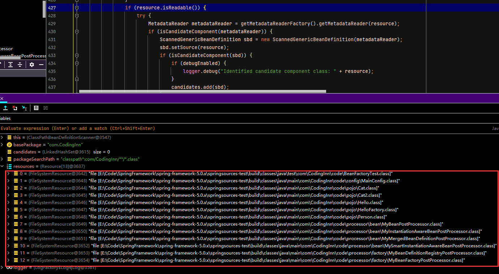

# 工厂Bean独有的初始化方式

## 准备工作

+ Hello.java

```java
package com.CodingInn.code.pojo;

public class Hello {
}
```

+ HelloFactory.java

```java
package com.CodingInn.code.pojo;

import org.springframework.beans.factory.FactoryBean;
import org.springframework.stereotype.Component;

/**
 * 工厂bean和普通bean的区别
 * 1.工厂bean=实现了FactoryBean接口的组件,注册的是这个工厂调用了getObject返回的对象
 */
@Component
public class HelloFactory implements FactoryBean<Hello> {
   @Override
   public Hello getObject() throws Exception {
      return new Hello();
   }

   @Override
   public Class<?> getObjectType() {
      return Hello.class;
   }
}
```

## 开始调试

+ 函数入口

```java
@Test
   public void testAutowire() {
      ApplicationContext applicationContext = new AnnotationConfigApplicationContext(MainConfig.class);
	Hello bean = applicationContext.getBean(Hello.class);//工厂方法，在getBean的时候才会创建对象
   }
```

+ AbstractApplicationContext.java

```java
@Override
public <T> T getBean(Class<T> requiredType) throws BeansException {
   assertBeanFactoryActive();
   return getBeanFactory().getBean(requiredType);
}
```

+ DefaultListbleBeanFactory.java

```java
@Override
public <T> T getBean(Class<T> requiredType) throws BeansException {
   return getBean(requiredType, (Object[]) null);
}


	@Override
	public <T> T getBean(Class<T> requiredType, @Nullable Object... args) throws BeansException {
		NamedBeanHolder<T> namedBean = resolveNamedBean(requiredType, args);
		if (namedBean != null) {
			return namedBean.getBeanInstance();
		}
		BeanFactory parent = getParentBeanFactory();
		if (parent != null) {
			return (args != null ? parent.getBean(requiredType, args) : parent.getBean(requiredType));
		}
		throw new NoSuchBeanDefinitionException(requiredType);
	}


@Nullable
	private <T> NamedBeanHolder<T> resolveNamedBean(Class<T> requiredType, @Nullable Object... args) throws BeansException {
		Assert.notNull(requiredType, "Required type must not be null");
        	//按照类型获取组件，工厂Bean在Spring容器中一开始保存的是工厂本身，第一次获取Hello组件，Spring的getBean会在底层找哪个组件的类型是Hello，Spring会在所有BeanDefinition中遍历找哪个组件的类型是Hello，找到HelloFactory发现他是工厂，类型就被决定成Hello，调用工厂方法（getObject），创建Hello对象
		String[] candidateNames = getBeanNamesForType(requiredType);//此处返回的是HelloFactory

		if (candidateNames.length > 1) {
			...
		}

		if (candidateNames.length == 1) {
			String beanName = candidateNames[0];
			return new NamedBeanHolder<>(beanName, getBean(beanName, requiredType, args));
		}
		else if (candidateNames.length > 1) {
			...
			}
			throw new NoUniqueBeanDefinitionException(requiredType, candidates.keySet());
		}

		return null;
	}
```

+ AbstractBeanFactory.java

```java
public <T> T getBean(String name, @Nullable Class<T> requiredType, @Nullable Object... args)
      throws BeansException {

   return doGetBean(name, requiredType, args, false);
}


protected <T> T doGetBean(
			String name, @Nullable Class<T> requiredType, @Nullable Object[] args, boolean typeCheckOnly)
			throws BeansException {

		String beanName = transformedBeanName(name);//提取对应的beanName
		Object bean;

		// 尝试从缓存获取或者singletonFactories中的ObjectFactory中获取
		////检查缓存中是否存在,寻找的是DefaultSingletonBeanRegistry里的singletonObjects map是否含有对应的Object
		//    	  //DefaultListableBeanFactory是DefaultSingletonBeanRegistry的子类,DefaultSingletonBeanRegistry类中存放了很多map,用于存储bean的信息,IOC容器的单例池存放的地方
		Object sharedInstance = getSingleton(beanName);//此处获取的是BeanFactory对象
		if (sharedInstance != null && args == null) {
			if (logger.isDebugEnabled()) {
				if (isSingletonCurrentlyInCreation(beanName)) {
					logger.debug("Returning eagerly cached instance of singleton bean '" + beanName +
							"' that is not fully initialized yet - a consequence of a circular reference");
				}
				else {
					logger.debug("Returning cached instance of singleton bean '" + beanName + "'");
				}
			}
			bean = getObjectForBeanInstance(sharedInstance, name, beanName, null);
		}

		else {
			...
		}

		...
		return (T) bean;
	}
```

+ AbstractAutowireCapableBeanFactory

```java
@Override
protected Object getObjectForBeanInstance(
      ...

   return super.getObjectForBeanInstance(beanInstance, name, beanName, mbd);
}
```

+ AbstractBeanFactory.java

```java
protected Object getObjectForBeanInstance(
      Object beanInstance, String name, String beanName, @Nullable RootBeanDefinition mbd) {

   ...

   // 现在我们有了 bean 实例，它可能是普通的 bean 或 FactoryBean。如果它是一个 FactoryBean，我们使用它来创建一个 bean 实例，除非调用者实际上想要一个对工厂的引用。
   if (!(beanInstance instanceof FactoryBean) || BeanFactoryUtils.isFactoryDereference(name)) {
      return beanInstance;
   }

   Object object = null;
   if (mbd == null) {
      object = getCachedObjectForFactoryBean(beanName);
   }
   if (object == null) {
      // 从工厂返回 bean 实例。
      FactoryBean<?> factory = (FactoryBean<?>) beanInstance;
      //如果是单例，则缓存从 FactoryBean 获得的对象。
      if (mbd == null && containsBeanDefinition(beanName)) {
         mbd = getMergedLocalBeanDefinition(beanName);
      }
      boolean synthetic = (mbd != null && mbd.isSynthetic());
      object = getObjectFromFactoryBean(factory, beanName, !synthetic);
   }
   return object;
}
```

+ FactoryBeanRegistrySupport.java

```java
protected Object getObjectFromFactoryBean(FactoryBean<?> factory, String beanName, boolean shouldPostProcess) {
   if (factory.isSingleton() && containsSingleton(beanName)) {
      synchronized (getSingletonMutex()) {
         Object object = this.factoryBeanObjectCache.get(beanName);
         if (object == null) {
            object = doGetObjectFromFactoryBean(factory, beanName);
          ...
         }
         return object;
      }
   }
   else {
      ...
   }
}


private Object doGetObjectFromFactoryBean(FactoryBean<?> factory, String beanName) throws BeanCreationException {
		Object object;
		try {
			if (System.getSecurityManager() != null) {
				...
			}
			else {
				object = factory.getObject();
			}
		}
		...
		return object;
	}
```

+ HelloFactory.java

```java
@Override
public Hello getObject() throws Exception {
   return new Hello();
}
```

# Bean创建的前期流程

+ BeanFactory.java

```java
    @Test
   public void testXml(){
      ApplicationContext applicationContext = new ClassPathXmlApplicationContext("beans.xml");
   }
```

+ ClassPathXmlApplicationContext.java

```java
public ClassPathXmlApplicationContext(String configLocation) throws BeansException {
   this(new String[] {configLocation}, true, null);
}


public ClassPathXmlApplicationContext(
			String[] configLocations, boolean refresh, @Nullable ApplicationContext parent)
			throws BeansException {

		super(parent);
		setConfigLocations(configLocations);//设置配置路径
		if (refresh) {
			refresh();//刷新容器,核心步骤
		}
	}
```

+ AbstractApplicationContext.java

```java
@Override
public void refresh() throws BeansException, IllegalStateException {
   synchronized (this.startupShutdownMonitor) {
      // Prepare this context for refreshing. 准备刷新
      prepareRefresh();

      // Tell the subclass to refresh the internal bean factory. BeanFactory第一次开始创建的时候,有xml解析逻辑
      // 创建容器对象 ,获得的是DefaultListableBeanFactory,也是创建BeanFactory的过程
      ConfigurableListableBeanFactory beanFactory = obtainFreshBeanFactory();

      // Prepare the bean factory for use in this context.
      //完成beanFactory的属性设置功能
      prepareBeanFactory(beanFactory);

      try {
         ...

         // Instantiate all remaining (non-lazy-init) singletons.完成BeanFactory的初始化,(在该步骤根据BeanDefinition创建bean对象，这步之后工厂里面所有的组件都初始化好了)
         finishBeanFactoryInitialization(beanFactory);

        ...
      }

      catch (BeansException ex) {
         ...
      }

      finally {
        ...
      }
   }
}


protected void finishBeanFactoryInitialization(ConfigurableListableBeanFactory beanFactory) {
		...

		// Instantiate all remaining (non-lazy-init) singletons. 初始化所有的单实例Bean
		beanFactory.preInstantiateSingletons();
	}
```

+ DefaultListableBeanFactory.java

```java
@Override
public void preInstantiateSingletons() throws BeansException {
   if (logger.isDebugEnabled()) {
      logger.debug("Pre-instantiating singletons in " + this);
   }

   // Iterate over a copy to allow for init methods which in turn register new bean definitions.
   // While this may not be part of the regular factory bootstrap, it does otherwise work fine.
   List<String> beanNames = new ArrayList<>(this.beanDefinitionNames);

   // 创建出所有的单实例Bean。Trigger initialization of all non-lazy singleton beans...
   for (String beanName : beanNames) {
      RootBeanDefinition bd = getMergedLocalBeanDefinition(beanName);//开始解析文件的时候每一个bean标签被解析封装成一个BeanDefinition
      if (!bd.isAbstract() && bd.isSingleton() && !bd.isLazyInit()) {
        ...
         }
         else {//非工厂bean
            getBean(beanName);
         }
      }
   }

 ...
}
```

+ AbstractBeanFactory.java

```java
@Override
public Object getBean(String name) throws BeansException {
   return doGetBean(name, null, null, false);
}


protected <T> T doGetBean(
			String name, @Nullable Class<T> requiredType, @Nullable Object[] args, boolean typeCheckOnly)
			throws BeansException {

		String beanName = transformedBeanName(name);//提取对应的beanName
		Object bean;

		// Eagerly check singleton cache for manually registered singletons.尝试从缓存获取或者singletonFactories中的ObjectFactory中获取
		////检查缓存中是否存在,寻找的是DefaultSingletonBeanRegistry里的singletonObjects map是否含有对应的Object
		//    	  //DefaultListableBeanFactory是DefaultSingletonBeanRegistry的子类,DefaultSingletonBeanRegistry类中存放了很多map,用于存储bean的信息,IOC容器的单例池存放的地方
		Object sharedInstance = getSingleton(beanName);
		if (sharedInstance != null && args == null) {
			if (logger.isDebugEnabled()) {
				if (isSingletonCurrentlyInCreation(beanName)) {
					logger.debug("Returning eagerly cached instance of singleton bean '" + beanName +
							"' that is not fully initialized yet - a consequence of a circular reference");
				}
				else {
					logger.debug("Returning cached instance of singleton bean '" + beanName + "'");
				}
			}
			bean = getObjectForBeanInstance(sharedInstance, name, beanName, null);
		}

		else {//默认第一次获取组件都会进入此环节
			// Fail if we're already creating this bean instance:
			// We're assumably within a circular reference.
			if (isPrototypeCurrentlyInCreation(beanName)) {
				throw new BeanCurrentlyInCreationException(beanName);
			}

			// 检查父工厂中是否存在 bean 定义。
			BeanFactory parentBeanFactory = getParentBeanFactory();
			if (parentBeanFactory != null && !containsBeanDefinition(beanName)) {
				// Not found -> check parent.
				String nameToLookup = originalBeanName(name);
				if (parentBeanFactory instanceof AbstractBeanFactory) {
					return ((AbstractBeanFactory) parentBeanFactory).doGetBean(
							nameToLookup, requiredType, args, typeCheckOnly);
				}
				else if (args != null) {
					// Delegation to parent with explicit args.
					return (T) parentBeanFactory.getBean(nameToLookup, args);
				}
				else {
					// No args -> delegate to standard getBean method.
					return parentBeanFactory.getBean(nameToLookup, requiredType);
				}
			}

			if (!typeCheckOnly) {
				markBeanAsCreated(beanName);//标记bean已经被创建，存放在Set<String> alreadyCreated 中
			}

			try {
				RootBeanDefinition mbd = getMergedLocalBeanDefinition(beanName);
				checkMergedBeanDefinition(mbd, beanName, args);

				// 获取当前bean所依赖的组件
				String[] dependsOn = mbd.getDependsOn();
				if (dependsOn != null) {
					for (String dep : dependsOn) {
						if (isDependent(beanName, dep)) {
							throw new BeanCreationException(mbd.getResourceDescription(), beanName,
									"Circular depends-on relationship between '" + beanName + "' and '" + dep + "'");
						}
						registerDependentBean(dep, beanName);
						try {
							getBean(dep);
						}
						catch (NoSuchBeanDefinitionException ex) {
							throw new BeanCreationException(mbd.getResourceDescription(), beanName,
									"'" + beanName + "' depends on missing bean '" + dep + "'", ex);
						}
					}
				}

				//创建bean的实例
				if (mbd.isSingleton()) {
					sharedInstance = getSingleton(beanName, () -> {
						try {
							return createBean(beanName, mbd, args); //创建bean对象的实例
						}
						catch (BeansException ex) {
							// Explicitly remove instance from singleton cache: It might have been put there
							// eagerly by the creation process, to allow for circular reference resolution.
							// Also remove any beans that received a temporary reference to the bean.
							destroySingleton(beanName);
							throw ex;
						}
					});
					bean = getObjectForBeanInstance(sharedInstance, name, beanName, mbd);
				}

				else if (mbd.isPrototype()) {
					// It's a prototype -> create a new instance.
					Object prototypeInstance = null;
					try {
						beforePrototypeCreation(beanName);
						prototypeInstance = createBean(beanName, mbd, args);
					}
					finally {
						afterPrototypeCreation(beanName);
					}
					bean = getObjectForBeanInstance(prototypeInstance, name, beanName, mbd);
				}

				else {
					String scopeName = mbd.getScope();
					if (!StringUtils.hasLength(scopeName)) {
						throw new IllegalStateException("No scope name defined for bean ´" + beanName + "'");
					}
					Scope scope = this.scopes.get(scopeName);
					if (scope == null) {
						throw new IllegalStateException("No Scope registered for scope name '" + scopeName + "'");
					}
					try {
						Object scopedInstance = scope.get(beanName, () -> {
							beforePrototypeCreation(beanName);
							try {
								return createBean(beanName, mbd, args);
							}
							finally {
								afterPrototypeCreation(beanName);
							}
						});
						bean = getObjectForBeanInstance(scopedInstance, name, beanName, mbd);
					}
					catch (IllegalStateException ex) {
						throw new BeanCreationException(beanName,
								"Scope '" + scopeName + "' is not active for the current thread; consider " +
								"defining a scoped proxy for this bean if you intend to refer to it from a singleton",
								ex);
					}
				}
			}
			catch (BeansException ex) {
				cleanupAfterBeanCreationFailure(beanName);
				throw ex;
			}
		}

		// Check if required type matches the type of the actual bean instance.
		if (requiredType != null && !requiredType.isInstance(bean)) {
			try {
				T convertedBean = getTypeConverter().convertIfNecessary(bean, requiredType);
				if (convertedBean == null) {
					throw new BeanNotOfRequiredTypeException(name, requiredType, bean.getClass());
				}
				return convertedBean;
			}
			catch (TypeMismatchException ex) {
				if (logger.isDebugEnabled()) {
					logger.debug("Failed to convert bean '" + name + "' to required type '" +
							ClassUtils.getQualifiedName(requiredType) + "'", ex);
				}
				throw new BeanNotOfRequiredTypeException(name, requiredType, bean.getClass());
			}
		}
		return (T) bean;
	}
```

+ DefaultSingletonBeanRegistry.java

```java
@Override
@Nullable
public Object getSingleton(String beanName) {
   return getSingleton(beanName, true);
}


@Nullable
	protected Object getSingleton(String beanName, boolean allowEarlyReference) {
		Object singletonObject = this.singletonObjects.get(beanName);//先检查单例缓存池，获取当前对象
		if (singletonObject == null && isSingletonCurrentlyInCreation(beanName)) {//isSingletonCurrentlyInCreation(beanName)用于判断当前组件是否正在创建，如果正在创建，则beanName会存在以下位置：private final Set<String> singletonsCurrentlyInCreation。如果当前bean正在创建过程中给，而且缓存中没有则继续往下
			synchronized (this.singletonObjects) {
				singletonObject = this.earlySingletonObjects.get(beanName);
				if (singletonObject == null && allowEarlyReference) {
					ObjectFactory<?> singletonFactory = this.singletonFactories.get(beanName);
					if (singletonFactory != null) {
						singletonObject = singletonFactory.getObject();
						this.earlySingletonObjects.put(beanName, singletonObject);
						this.singletonFactories.remove(beanName);
					}
				}
			}
		}
        //第一次调用getSingleton(String beanName) 会返回null
		return singletonObject;
	}
```

# Bean创建流程

经过前面的步骤，接下来需要进行Bean的创建。

+ AbstractBeanFactory.java

```java
@Override
public Object getBean(String name) throws BeansException {
   return doGetBean(name, null, null, false);
}


protected <T> T doGetBean(
			String name, @Nullable Class<T> requiredType, @Nullable Object[] args, boolean typeCheckOnly)
			throws BeansException {

		String beanName = transformedBeanName(name);//提取对应的beanName
		Object bean;

		// Eagerly check singleton cache for manually registered singletons.尝试从缓存获取或者singletonFactories中的ObjectFactory中获取
		////检查缓存中是否存在,寻找的是DefaultSingletonBeanRegistry里的singletonObjects map是否含有对应的Object
		//    	  //DefaultListableBeanFactory是DefaultSingletonBeanRegistry的子类,DefaultSingletonBeanRegistry类中存放了很多map,用于存储bean的信息,IOC容器的单例池存放的地方
		Object sharedInstance = getSingleton(beanName);
		if (sharedInstance != null && args == null) {
			if (logger.isDebugEnabled()) {
				if (isSingletonCurrentlyInCreation(beanName)) {
					logger.debug("Returning eagerly cached instance of singleton bean '" + beanName +
							"' that is not fully initialized yet - a consequence of a circular reference");
				}
				else {
					logger.debug("Returning cached instance of singleton bean '" + beanName + "'");
				}
			}
			bean = getObjectForBeanInstance(sharedInstance, name, beanName, null);
		}

		else {//默认第一次获取组件都会进入此环节
			// Fail if we're already creating this bean instance:
			// We're assumably within a circular reference.
			if (isPrototypeCurrentlyInCreation(beanName)) {
				throw new BeanCurrentlyInCreationException(beanName);
			}

			// 检查父工厂中是否存在 bean 定义。
			BeanFactory parentBeanFactory = getParentBeanFactory();
			if (parentBeanFactory != null && !containsBeanDefinition(beanName)) {
				// Not found -> check parent.
				String nameToLookup = originalBeanName(name);
				if (parentBeanFactory instanceof AbstractBeanFactory) {
					return ((AbstractBeanFactory) parentBeanFactory).doGetBean(
							nameToLookup, requiredType, args, typeCheckOnly);
				}
				else if (args != null) {
					// Delegation to parent with explicit args.
					return (T) parentBeanFactory.getBean(nameToLookup, args);
				}
				else {
					// No args -> delegate to standard getBean method.
					return parentBeanFactory.getBean(nameToLookup, requiredType);
				}
			}

			if (!typeCheckOnly) {
				markBeanAsCreated(beanName);//标记bean已经被创建，存放在Set<String> alreadyCreated 中
			}

			try {
				RootBeanDefinition mbd = getMergedLocalBeanDefinition(beanName);
				checkMergedBeanDefinition(mbd, beanName, args);

				// 获取当前bean所依赖的组件
				String[] dependsOn = mbd.getDependsOn();
				if (dependsOn != null) {
					for (String dep : dependsOn) {
						if (isDependent(beanName, dep)) {
							throw new BeanCreationException(mbd.getResourceDescription(), beanName,
									"Circular depends-on relationship between '" + beanName + "' and '" + dep + "'");
						}
						registerDependentBean(dep, beanName);
						try {
							getBean(dep);
						}
						catch (NoSuchBeanDefinitionException ex) {
							throw new BeanCreationException(mbd.getResourceDescription(), beanName,
									"'" + beanName + "' depends on missing bean '" + dep + "'", ex);
						}
					}
				}

				//创建bean的实例
				if (mbd.isSingleton()) {
					sharedInstance = getSingleton(beanName, () -> {
						try {
							return createBean(beanName, mbd, args); //创建bean对象的实例
						}
						catch (BeansException ex) {
							// Explicitly remove instance from singleton cache: It might have been put there
							// eagerly by the creation process, to allow for circular reference resolution.
							// Also remove any beans that received a temporary reference to the bean.
							destroySingleton(beanName);
							throw ex;
						}
					});
					bean = getObjectForBeanInstance(sharedInstance, name, beanName, mbd);
				}

				....
		return (T) bean;
	}
```

+ DefaultSingletonBeanRegistry.java

```java
public Object getSingleton(String beanName, ObjectFactory<?> singletonFactory) {
   Assert.notNull(beanName, "Bean name must not be null");
   synchronized (this.singletonObjects) {
      Object singletonObject = this.singletonObjects.get(beanName);//检查单例池中是否有相应的对象，如果有直接返回，Set<String> singletonsCurrentlyInCreation中加入相应的beanName
      if (singletonObject == null) {//单实例池子里没有当前对象（说明没有创建完成）
         if (this.singletonsCurrentlyInDestruction) {
            throw new BeanCreationNotAllowedException(beanName,
                  "Singleton bean creation not allowed while singletons of this factory are in destruction " +
                  "(Do not request a bean from a BeanFactory in a destroy method implementation!)");
         }
         if (logger.isDebugEnabled()) {
            logger.debug("Creating shared instance of singleton bean '" + beanName + "'");
         }
         beforeSingletonCreation(beanName);//单实例创建之前调用
         boolean newSingleton = false;
         boolean recordSuppressedExceptions = (this.suppressedExceptions == null);
         if (recordSuppressedExceptions) {
            this.suppressedExceptions = new LinkedHashSet<>();
         }
         try {
            singletonObject = singletonFactory.getObject();////ObjectFactory提供Bean实例,此处的getObect是上一步sharedInstance = getSingleton(...)的lambda表达式 createBean(beanName, mbd, args)
            newSingleton = true;
         }
         catch (IllegalStateException ex) {
          ...
         }
         catch (BeanCreationException ex) {
          ...
         }
         finally {
           ...
      }
      return singletonObject;
   }
}
```

+ AbstractAutowireCapableBeanFactory.java

```java
@Override
protected Object createBean(String beanName, RootBeanDefinition mbd, @Nullable Object[] args)
      throws BeanCreationException {

   if (logger.isDebugEnabled()) {
      logger.debug("Creating instance of bean '" + beanName + "'");
   }
   RootBeanDefinition mbdToUse = mbd;

   // Make sure bean class is actually resolved at this point, and
   // clone the bean definition in case of a dynamically resolved Class
   // which cannot be stored in the shared merged bean definition.
   Class<?> resolvedClass = resolveBeanClass(mbd, beanName);
   if (resolvedClass != null && !mbd.hasBeanClass() && mbd.getBeanClassName() != null) {
      mbdToUse = new RootBeanDefinition(mbd);
      mbdToUse.setBeanClass(resolvedClass);
   }

   // Prepare method overrides.
   try {
      mbdToUse.prepareMethodOverrides();
   }
   catch (BeanDefinitionValidationException ex) {
      throw new BeanDefinitionStoreException(mbdToUse.getResourceDescription(),
            beanName, "Validation of method overrides failed", ex);
   }

   try {
       /*提前给一个机会返回相应的代理对象。该步骤会调用applyBeanPostProcessorsBeforeInstantiation(targetType, beanName);
      
       @Nullable
	protected Object applyBeanPostProcessorsBeforeInstantiation(Class<?> beanClass, String beanName) {
		for (BeanPostProcessor bp : getBeanPostProcessors()) {
			if (bp instanceof InstantiationAwareBeanPostProcessor) {
				InstantiationAwareBeanPostProcessor ibp = (InstantiationAwareBeanPostProcessor) bp;
				Object result = ibp.postProcessBeforeInstantiation(beanClass, beanName);
				if (result != null) {
					return result;
				}
			}
		}
		return null;
	}
       */
      Object bean = resolveBeforeInstantiation(beanName, mbdToUse);
      if (bean != null) {
         return bean;
      }
   }
   catch (Throwable ex) {
      throw new BeanCreationException(mbdToUse.getResourceDescription(), beanName,
            "BeanPostProcessor before instantiation of bean failed", ex);
   }

   try {
      Object beanInstance = doCreateBean(beanName, mbdToUse, args);
      if (logger.isDebugEnabled()) {
         logger.debug("Finished creating instance of bean '" + beanName + "'");
      }
      return beanInstance;
   }
   catch (BeanCreationException | ImplicitlyAppearedSingletonException ex) {
    ...
   }
   catch (Throwable ex) {
      ...
   }
}


protected Object doCreateBean(String beanName, RootBeanDefinition mbd, @Nullable Object[] args)
			throws BeanCreationException {

		// Instantiate the bean.
		BeanWrapper instanceWrapper = null;
		if (mbd.isSingleton()) {
			instanceWrapper = this.factoryBeanInstanceCache.remove(beanName);
		}
		if (instanceWrapper == null) {
           		 //创建bean实例,,默认使用无参构造器
			instanceWrapper = createBeanInstance(beanName, mbd, args);
		}
		Object bean = instanceWrapper.getWrappedInstance();
		Class<?> beanType = instanceWrapper.getWrappedClass();
		if (beanType != NullBean.class) {
			mbd.resolvedTargetType = beanType;
		}

		// 应用后置处理器修改RootBeanDefinition,后续会用到RootBeanDefinition对bean的属性进行赋值
		synchronized (mbd.postProcessingLock) {
			if (!mbd.postProcessed) {
				try {
					applyMergedBeanDefinitionPostProcessors(mbd, beanType, beanName);
				}
				catch (Throwable ex) {
					throw new BeanCreationException(mbd.getResourceDescription(), beanName,
							"Post-processing of merged bean definition failed", ex);
				}
				mbd.postProcessed = true;
			}
		}

		// 缓存单例以解析循环引用
		boolean earlySingletonExposure = (mbd.isSingleton() && this.allowCircularReferences &&
				isSingletonCurrentlyInCreation(beanName));
		if (earlySingletonExposure) {
			if (logger.isDebugEnabled()) {
				logger.debug("Eagerly caching bean '" + beanName +
						"' to allow for resolving potential circular references");
			}
			addSingletonFactory(beanName, () -> getEarlyBeanReference(beanName, mbd, bean));
		}

		// Initialize the bean instance.
		Object exposedObject = bean;
		try {
			populateBean(beanName, mbd, instanceWrapper);//先给bean中的属性赋值
			exposedObject = initializeBean(beanName, exposedObject, mbd);
		}
		catch (Throwable ex) {
			if (ex instanceof BeanCreationException && beanName.equals(((BeanCreationException) ex).getBeanName())) {
				throw (BeanCreationException) ex;
			}
			else {
				throw new BeanCreationException(
						mbd.getResourceDescription(), beanName, "Initialization of bean failed", ex);
			}
		}

    	//早期单实例暴露
		if (earlySingletonExposure) {
			Object earlySingletonReference = getSingleton(beanName, false);
			if (earlySingletonReference != null) {
				if (exposedObject == bean) {
					exposedObject = earlySingletonReference;
				}
				else if (!this.allowRawInjectionDespiteWrapping && hasDependentBean(beanName)) {
					String[] dependentBeans = getDependentBeans(beanName);
					Set<String> actualDependentBeans = new LinkedHashSet<>(dependentBeans.length);
					for (String dependentBean : dependentBeans) {
						if (!removeSingletonIfCreatedForTypeCheckOnly(dependentBean)) {
							actualDependentBeans.add(dependentBean);
						}
					}
					if (!actualDependentBeans.isEmpty()) {
						throw new BeanCurrentlyInCreationException(beanName,
								"Bean with name '" + beanName + "' has been injected into other beans [" +
								StringUtils.collectionToCommaDelimitedString(actualDependentBeans) +
								"] in its raw version as part of a circular reference, but has eventually been " +
								"wrapped. This means that said other beans do not use the final version of the " +
								"bean. This is often the result of over-eager type matching - consider using " +
								"'getBeanNamesForType' with the 'allowEagerInit' flag turned off, for example.");
					}
				}
			}
		}

		// Register bean as disposable.
		try {
			registerDisposableBeanIfNecessary(beanName, bean, mbd);
		}
		catch (BeanDefinitionValidationException ex) {
			throw new BeanCreationException(
					mbd.getResourceDescription(), beanName, "Invalid destruction signature", ex);
		}

		return exposedObject;
	}
```

## createBeanInstance的调用

+ AbstractAutowireCapableBeanFactory.java

```java
protected BeanWrapper createBeanInstance(String beanName, RootBeanDefinition mbd, @Nullable Object[] args) {
   // 获取Bean的类型
   Class<?> beanClass = resolveBeanClass(mbd, beanName);

   if (beanClass != null && !Modifier.isPublic(beanClass.getModifiers()) && !mbd.isNonPublicAccessAllowed()) {
      throw new BeanCreationException(mbd.getResourceDescription(), beanName,
            "Bean class isn't public, and non-public access not allowed: " + beanClass.getName());
   }

    //定义Bean的实例提供者
   Supplier<?> instanceSupplier = mbd.getInstanceSupplier();
   if (instanceSupplier != null) {
      return obtainFromSupplier(instanceSupplier, beanName);
   }

   if (mbd.getFactoryMethodName() != null) {
      return instantiateUsingFactoryMethod(beanName, mbd, args);
   }

   // Shortcut when re-creating the same bean...
   boolean resolved = false;
   boolean autowireNecessary = false;
   if (args == null) {
      synchronized (mbd.constructorArgumentLock) {
         if (mbd.resolvedConstructorOrFactoryMethod != null) {
            resolved = true;
            autowireNecessary = mbd.constructorArgumentsResolved;
         }
      }
   }
   if (resolved) {
      if (autowireNecessary) {
         return autowireConstructor(beanName, mbd, null, null);
      }
      else {
         return instantiateBean(beanName, mbd);
      }
   }

   // 后置处理器有机会在这里决定当前bean用哪个构造器
   Constructor<?>[] ctors = determineConstructorsFromBeanPostProcessors(beanClass, beanName);
   if (ctors != null || mbd.getResolvedAutowireMode() == AUTOWIRE_CONSTRUCTOR ||
         mbd.hasConstructorArgumentValues() || !ObjectUtils.isEmpty(args)) {
      return autowireConstructor(beanName, mbd, ctors, args);
   }

   // 使用默认的构造器进行构造（一般是无参构造器），最后封装为BeanWrapper(name,instance)
   return instantiateBean(beanName, mbd);
}
```

## populateBean的调用

+ AbstractAutowireCapableBeanFactory.java

```java
protected void populateBean(String beanName, RootBeanDefinition mbd, @Nullable BeanWrapper bw) {
   if (bw == null) {
      if (mbd.hasPropertyValues()) {
         throw new BeanCreationException(
               mbd.getResourceDescription(), beanName, "Cannot apply property values to null instance");
      }
      else {
         // Skip property population phase for null instance.
         return;
      }
   }

   // Give any InstantiationAwareBeanPostProcessors the opportunity to modify the
   // state of the bean before properties are set. This can be used, for example,
   // to support styles of field injection.
   if (!mbd.isSynthetic() && hasInstantiationAwareBeanPostProcessors()) {
      for (BeanPostProcessor bp : getBeanPostProcessors()) {
         if (bp instanceof InstantiationAwareBeanPostProcessor) {
            InstantiationAwareBeanPostProcessor ibp = (InstantiationAwareBeanPostProcessor) bp;
            if (!ibp.postProcessAfterInstantiation(bw.getWrappedInstance(), beanName)) {
               return;
            }
         }
      }
   }

   PropertyValues pvs = (mbd.hasPropertyValues() ? mbd.getPropertyValues() : null);//从属性中拿到所有的键值对

   int resolvedAutowireMode = mbd.getResolvedAutowireMode();
   if (resolvedAutowireMode == AUTOWIRE_BY_NAME || resolvedAutowireMode == AUTOWIRE_BY_TYPE) {
      MutablePropertyValues newPvs = new MutablePropertyValues(pvs);
      // Add property values based on autowire by name if applicable.
      if (resolvedAutowireMode == AUTOWIRE_BY_NAME) {
         autowireByName(beanName, mbd, bw, newPvs);
      }
      // Add property values based on autowire by type if applicable.
      if (resolvedAutowireMode == AUTOWIRE_BY_TYPE) {
         autowireByType(beanName, mbd, bw, newPvs);
      }
      pvs = newPvs;
   }

   boolean hasInstAwareBpps = hasInstantiationAwareBeanPostProcessors();
   boolean needsDepCheck = (mbd.getDependencyCheck() != AbstractBeanDefinition.DEPENDENCY_CHECK_NONE);

   if (hasInstAwareBpps || needsDepCheck) {
      if (pvs == null) {
         pvs = mbd.getPropertyValues();//xml中property标签指定的PropertyValues
      }
      PropertyDescriptor[] filteredPds = filterPropertyDescriptorsForDependencyCheck(bw, mbd.allowCaching);
      if (hasInstAwareBpps) {//如果有aware注解,则调用含有aware的后置处理器,对aware的属性进行赋值
         for (BeanPostProcessor bp : getBeanPostProcessors()) {
            if (bp instanceof InstantiationAwareBeanPostProcessor) {//此处拿到的bp是AutowiredAnnotationBeanPostProcessor
               InstantiationAwareBeanPostProcessor ibp = (InstantiationAwareBeanPostProcessor) bp;
               pvs = ibp.postProcessPropertyValues(pvs, filteredPds, bw.getWrappedInstance(), beanName);
               if (pvs == null) {
                  return;
               }
            }
         }
      }
      if (needsDepCheck) {
         checkDependencies(beanName, mbd, filteredPds, pvs);
      }
   }

   if (pvs != null) {//把以前处理好的PropertyValues进行应用,根据pvs进行赋值
      applyPropertyValues(beanName, mbd, bw, pvs);//对属性进行赋值
   }
}
```

##  initializeBean的调用

+ AbstractAutowireCapableBeanFactory.java

```java
protected Object initializeBean(String beanName, Object bean, @Nullable RootBeanDefinition mbd) {
   if (System.getSecurityManager() != null) {
      AccessController.doPrivileged((PrivilegedAction<Object>) () -> {
         invokeAwareMethods(beanName, bean);
         return null;
      }, getAccessControlContext());
   }
   else {
      invokeAwareMethods(beanName, bean);
   }

   Object wrappedBean = bean;
   if (mbd == null || !mbd.isSynthetic()) {
      wrappedBean = applyBeanPostProcessorsBeforeInitialization(wrappedBean, beanName);//初始化前执行后置处理器
       /*
       @Override
	public Object applyBeanPostProcessorsBeforeInitialization(Object existingBean, String beanName)
			throws BeansException {

		Object result = existingBean;
		for (BeanPostProcessor processor : getBeanPostProcessors()) {
			Object current = processor.postProcessBeforeInitialization(result, beanName);
			if (current == null) {
				return result;
			}
			result = current;
		}
		return result;
	}
       */
   }

   try {
      invokeInitMethods(beanName, wrappedBean, mbd);//初始化bean,需要实现InitializingBean接口,才能调用指定的初始化方法,注意,不是构造函数
   }
   catch (Throwable ex) {
      throw new BeanCreationException(
            (mbd != null ? mbd.getResourceDescription() : null),
            beanName, "Invocation of init method failed", ex);
   }
   if (mbd == null || !mbd.isSynthetic()) {
      wrappedBean = applyBeanPostProcessorsAfterInitialization(wrappedBean, beanName);//属性初始化完成后进行后置增强
   }

   return wrappedBean;
}
```

## 早期单实例的暴露(创建完对象，赋值和初始化后)

```java
@Override
protected Object createBean(String beanName, RootBeanDefinition mbd, @Nullable Object[] args)
      throws BeanCreationException {

   if (logger.isDebugEnabled()) {
      logger.debug("Creating instance of bean '" + beanName + "'");
   }
   RootBeanDefinition mbdToUse = mbd;

   // Make sure bean class is actually resolved at this point, and
   // clone the bean definition in case of a dynamically resolved Class
   // which cannot be stored in the shared merged bean definition.
   Class<?> resolvedClass = resolveBeanClass(mbd, beanName);
   if (resolvedClass != null && !mbd.hasBeanClass() && mbd.getBeanClassName() != null) {
      mbdToUse = new RootBeanDefinition(mbd);
      mbdToUse.setBeanClass(resolvedClass);
   }

   // Prepare method overrides.
   try {
      mbdToUse.prepareMethodOverrides();
   }
   catch (BeanDefinitionValidationException ex) {
      throw new BeanDefinitionStoreException(mbdToUse.getResourceDescription(),
            beanName, "Validation of method overrides failed", ex);
   }

   try {
       /*提前给一个机会返回相应的代理对象。该步骤会调用applyBeanPostProcessorsBeforeInstantiation(targetType, beanName);
      
       @Nullable
	protected Object applyBeanPostProcessorsBeforeInstantiation(Class<?> beanClass, String beanName) {
		for (BeanPostProcessor bp : getBeanPostProcessors()) {
			if (bp instanceof InstantiationAwareBeanPostProcessor) {
				InstantiationAwareBeanPostProcessor ibp = (InstantiationAwareBeanPostProcessor) bp;
				Object result = ibp.postProcessBeforeInstantiation(beanClass, beanName);
				if (result != null) {
					return result;
				}
			}
		}
		return null;
	}
       */
      Object bean = resolveBeforeInstantiation(beanName, mbdToUse);
      if (bean != null) {
         return bean;
      }
   }
   catch (Throwable ex) {
      throw new BeanCreationException(mbdToUse.getResourceDescription(), beanName,
            "BeanPostProcessor before instantiation of bean failed", ex);
   }

   try {
      Object beanInstance = doCreateBean(beanName, mbdToUse, args);
      if (logger.isDebugEnabled()) {
         logger.debug("Finished creating instance of bean '" + beanName + "'");
      }
      return beanInstance;
   }
   catch (BeanCreationException | ImplicitlyAppearedSingletonException ex) {
    ...
   }
   catch (Throwable ex) {
      ...
   }
}


protected Object doCreateBean(String beanName, RootBeanDefinition mbd, @Nullable Object[] args)
			throws BeanCreationException {

		// Instantiate the bean.
		BeanWrapper instanceWrapper = null;
		if (mbd.isSingleton()) {
			instanceWrapper = this.factoryBeanInstanceCache.remove(beanName);
		}
		if (instanceWrapper == null) {
           		 //创建bean实例,,默认使用无参构造器
			instanceWrapper = createBeanInstance(beanName, mbd, args);
		}
		Object bean = instanceWrapper.getWrappedInstance();
		Class<?> beanType = instanceWrapper.getWrappedClass();
		if (beanType != NullBean.class) {
			mbd.resolvedTargetType = beanType;
		}

		// 应用后置处理器修改RootBeanDefinition,后续会用到RootBeanDefinition对bean的属性进行赋值
		synchronized (mbd.postProcessingLock) {
			if (!mbd.postProcessed) {
				try {
					applyMergedBeanDefinitionPostProcessors(mbd, beanType, beanName);
				}
				catch (Throwable ex) {
					throw new BeanCreationException(mbd.getResourceDescription(), beanName,
							"Post-processing of merged bean definition failed", ex);
				}
				mbd.postProcessed = true;
			}
		}

		// 缓存单例以解析循环引用
		boolean earlySingletonExposure = (mbd.isSingleton() && this.allowCircularReferences &&
				isSingletonCurrentlyInCreation(beanName));
		if (earlySingletonExposure) {
			if (logger.isDebugEnabled()) {
				logger.debug("Eagerly caching bean '" + beanName +
						"' to allow for resolving potential circular references");
			}
			addSingletonFactory(beanName, () -> getEarlyBeanReference(beanName, mbd, bean));
		}

		// Initialize the bean instance.
		Object exposedObject = bean;
		try {
			populateBean(beanName, mbd, instanceWrapper);//先给bean中的属性赋值
			exposedObject = initializeBean(beanName, exposedObject, mbd);
		}
		catch (Throwable ex) {
			if (ex instanceof BeanCreationException && beanName.equals(((BeanCreationException) ex).getBeanName())) {
				throw (BeanCreationException) ex;
			}
			else {
				throw new BeanCreationException(
						mbd.getResourceDescription(), beanName, "Initialization of bean failed", ex);
			}
		}

    	//早期单实例暴露
		if (earlySingletonExposure) {
			Object earlySingletonReference = getSingleton(beanName, false);
			if (earlySingletonReference != null) {
				if (exposedObject == bean) {
					exposedObject = earlySingletonReference;
				}
				else if (!this.allowRawInjectionDespiteWrapping && hasDependentBean(beanName)) {
					String[] dependentBeans = getDependentBeans(beanName);
					Set<String> actualDependentBeans = new LinkedHashSet<>(dependentBeans.length);
					for (String dependentBean : dependentBeans) {
						if (!removeSingletonIfCreatedForTypeCheckOnly(dependentBean)) {
							actualDependentBeans.add(dependentBean);
						}
					}
					if (!actualDependentBeans.isEmpty()) {
						throw new BeanCurrentlyInCreationException(beanName,
								"Bean with name '" + beanName + "' has been injected into other beans [" +
								StringUtils.collectionToCommaDelimitedString(actualDependentBeans) +
								"] in its raw version as part of a circular reference, but has eventually been " +
								"wrapped. This means that said other beans do not use the final version of the " +
								"bean. This is often the result of over-eager type matching - consider using " +
								"'getBeanNamesForType' with the 'allowEagerInit' flag turned off, for example.");
					}
				}
			}
		}

		// Register bean as disposable.
		try {
			registerDisposableBeanIfNecessary(beanName, bean, mbd);
		}
		catch (BeanDefinitionValidationException ex) {
			throw new BeanCreationException(
					mbd.getResourceDescription(), beanName, "Invalid destruction signature", ex);
		}

		return exposedObject;//对象成功创建
	}
```

+ DefaultSingletonBeanRegistry.java

Bean的创建前，以及Bean实例化和赋值后都会调用getSingleton。

```java
@Nullable
protected Object getSingleton(String beanName, boolean allowEarlyReference) {
   Object singletonObject = this.singletonObjects.get(beanName);//一级缓存
   if (singletonObject == null && isSingletonCurrentlyInCreation(beanName)) {
      synchronized (this.singletonObjects) {
         singletonObject = this.earlySingletonObjects.get(beanName);//二级缓存
         if (singletonObject == null && allowEarlyReference) {
            ObjectFactory<?> singletonFactory = this.singletonFactories.get(beanName);//三级缓存
            if (singletonFactory != null) {
               singletonObject = singletonFactory.getObject();
               this.earlySingletonObjects.put(beanName, singletonObject);
               this.singletonFactories.remove(beanName);
            }
         }
      }
   }
   return singletonObject;
}
```


以上Bean的创建流程步骤都是对DefaultSingletonBeanRegistry.java类中getSingleton函数中的singletonObject = singletonFactory.getObject()语句进行分析,singletonFactory.getObject()会调用lambda表达式中的return createBean(beanName, mbd, args)语句创建bean对象的实例。创建完之后的逻辑如下:

+ DefaultSingletonBeanRegistry.java

```java
public Object getSingleton(String beanName, ObjectFactory<?> singletonFactory) {
   Assert.notNull(beanName, "Bean name must not be null");
   synchronized (this.singletonObjects) {
      Object singletonObject = this.singletonObjects.get(beanName);
      if (singletonObject == null) {
         if (this.singletonsCurrentlyInDestruction) {
            throw new BeanCreationNotAllowedException(beanName,
                  "Singleton bean creation not allowed while singletons of this factory are in destruction " +
                  "(Do not request a bean from a BeanFactory in a destroy method implementation!)");
         }
         if (logger.isDebugEnabled()) {
            logger.debug("Creating shared instance of singleton bean '" + beanName + "'");
         }
         beforeSingletonCreation(beanName);
         boolean newSingleton = false;
         boolean recordSuppressedExceptions = (this.suppressedExceptions == null);
         if (recordSuppressedExceptions) {
            this.suppressedExceptions = new LinkedHashSet<>();
         }
         try {
            singletonObject = singletonFactory.getObject();////ObjectFactory提供Bean实例,此处的getObect是上一步sharedInstance = getSingleton(...)的lambda表达式 createBean(beanName, mbd, args)
            newSingleton = true;
         }
         catch (IllegalStateException ex) {
           ...
         }
         catch (BeanCreationException ex) {
           ...
         }
         finally {
           ...
            afterSingletonCreation(beanName);
         }
         if (newSingleton) {
            addSingleton(beanName, singletonObject);
         }
      }
      return singletonObject;
   }
}


protected void afterSingletonCreation(String beanName) {
		if (!this.inCreationCheckExclusions.contains(beanName) && !this.singletonsCurrentlyInCreation.remove(beanName)) {//创建完之后将创建完成的beanName从this.singletonsCurrentlyInCreation移除
			throw new IllegalStateException("Singleton '" + beanName + "' isn't currently in creation");
		}
	}


//把当前实例进行添加
protected void addSingleton(String beanName, Object singletonObject) {
		synchronized (this.singletonObjects) {
			this.singletonObjects.put(beanName, singletonObject);
			this.singletonFactories.remove(beanName);
			this.earlySingletonObjects.remove(beanName);
			this.registeredSingletons.add(beanName);
		}
	}
```

# Bean创建完之后的后续步骤

前面的步骤有getBean引起，在getBean中，所有对象会被初始化并赋值，之后会触发SmartInitializingSingleton后置处理器的afterSingletonsInstantiated方法进行回调。

```java
@Override
public void preInstantiateSingletons() throws BeansException {
   if (logger.isDebugEnabled()) {
      logger.debug("Pre-instantiating singletons in " + this);
   }

   // Iterate over a copy to allow for init methods which in turn register new bean definitions.
   // While this may not be part of the regular factory bootstrap, it does otherwise work fine.
   List<String> beanNames = new ArrayList<>(this.beanDefinitionNames);

   // 创建出所有的单实例Bean。Trigger initialization of all non-lazy singleton beans...
   for (String beanName : beanNames) {
      RootBeanDefinition bd = getMergedLocalBeanDefinition(beanName);//开始解析文件的时候每一个bean标签被解析封装成一个BeanDefinition
      if (!bd.isAbstract() && bd.isSingleton() && !bd.isLazyInit()) {
         if (isFactoryBean(beanName)) {//如果是FactoryBean则执行以下逻辑
            Object bean = getBean(FACTORY_BEAN_PREFIX + beanName);
            if (bean instanceof FactoryBean) {
               FactoryBean<?> factory = (FactoryBean<?>) bean;
               boolean isEagerInit;
               if (System.getSecurityManager() != null && factory instanceof SmartFactoryBean) {
                  isEagerInit = AccessController.doPrivileged(
                        (PrivilegedAction<Boolean>) ((SmartFactoryBean<?>) factory)::isEagerInit,
                        getAccessControlContext());
               }
               else {
                  isEagerInit = (factory instanceof SmartFactoryBean &&
                        ((SmartFactoryBean<?>) factory).isEagerInit());
               }
               if (isEagerInit) {
                  getBean(beanName);
               }
            }
         }
         else {//非工厂bean
            getBean(beanName);
         }
      }
   }

   //触发SmartInitializingSingleton后置处理器的afterSingletonsInstantiated方法进行回调
   for (String beanName : beanNames) {
      Object singletonInstance = getSingleton(beanName);
      if (singletonInstance instanceof SmartInitializingSingleton) {
         SmartInitializingSingleton smartSingleton = (SmartInitializingSingleton) singletonInstance;
         if (System.getSecurityManager() != null) {
            AccessController.doPrivileged((PrivilegedAction<Object>) () -> {
               smartSingleton.afterSingletonsInstantiated();
               return null;
            }, getAccessControlContext());
         }
         else {
            smartSingleton.afterSingletonsInstantiated();
         }
      }
   }
}
```

# 注解模式下refresh的前置步骤

入口函数：

```java
    @Test
   public void testAutowire() {
      ApplicationContext applicationContext = new AnnotationConfigApplicationContext(MainConfig.class);

      Hello bean = applicationContext.getBean(Hello.class);
   }
```

+ AnnotationConfigApplicationContext.java

```java
public AnnotationConfigApplicationContext(Class<?>... annotatedClasses) {
   this();
   register(annotatedClasses);
   refresh();//刷新容器
}

	public AnnotationConfigApplicationContext() {
		this.reader = new AnnotatedBeanDefinitionReader(this);
		this.scanner = new ClassPathBeanDefinitionScanner(this);
	}

```

## this()调用过程

### AnnotatedBeanDefinitionReader(this)函数(加载Spring底层的后置处理器)

+ AnnotatedBeanDefiniitonReader.java

```java
public AnnotatedBeanDefinitionReader(BeanDefinitionRegistry registry) {
		this(registry, getOrCreateEnvironment(registry));
	}


public AnnotatedBeanDefinitionReader(BeanDefinitionRegistry registry, Environment environment) {
		Assert.notNull(registry, "BeanDefinitionRegistry must not be null");
		Assert.notNull(environment, "Environment must not be null");
		this.registry = registry;
		this.conditionEvaluator = new ConditionEvaluator(registry, environment, null);
		AnnotationConfigUtils.registerAnnotationConfigProcessors(this.registry);
	}
```

+ AnnotationConfigUtils.java

```java
public static void registerAnnotationConfigProcessors(BeanDefinitionRegistry registry) {
   registerAnnotationConfigProcessors(registry, null);
}


public static Set<BeanDefinitionHolder> registerAnnotationConfigProcessors(
			BeanDefinitionRegistry registry, @Nullable Object source) {

    	//获取bean工厂
		DefaultListableBeanFactory beanFactory = unwrapDefaultListableBeanFactory(registry);
    		//给工厂准备些基础组件(各种解析器)
		if (beanFactory != null) {
			if (!(beanFactory.getDependencyComparator() instanceof AnnotationAwareOrderComparator)) {
				beanFactory.setDependencyComparator(AnnotationAwareOrderComparator.INSTANCE);
			}
			if (!(beanFactory.getAutowireCandidateResolver() instanceof ContextAnnotationAutowireCandidateResolver)) {
				beanFactory.setAutowireCandidateResolver(new ContextAnnotationAutowireCandidateResolver());
			}
		}

		Set<BeanDefinitionHolder> beanDefs = new LinkedHashSet<>(8);

    		//注册核心组件
		if (!registry.containsBeanDefinition(CONFIGURATION_ANNOTATION_PROCESSOR_BEAN_NAME)) {
			RootBeanDefinition def = new RootBeanDefinition(ConfigurationClassPostProcessor.class);//处理配置类的后置处理器
			def.setSource(source);
			beanDefs.add(registerPostProcessor(registry, def, CONFIGURATION_ANNOTATION_PROCESSOR_BEAN_NAME));
		}

		if (!registry.containsBeanDefinition(AUTOWIRED_ANNOTATION_PROCESSOR_BEAN_NAME)) {
			RootBeanDefinition def = new RootBeanDefinition(AutowiredAnnotationBeanPostProcessor.class);//自动装配的后置处理器
			def.setSource(source);
			beanDefs.add(registerPostProcessor(registry, def, AUTOWIRED_ANNOTATION_PROCESSOR_BEAN_NAME));
		}

		if (!registry.containsBeanDefinition(REQUIRED_ANNOTATION_PROCESSOR_BEAN_NAME)) {
			RootBeanDefinition def = new RootBeanDefinition(RequiredAnnotationBeanPostProcessor.class);
			def.setSource(source);
			beanDefs.add(registerPostProcessor(registry, def, REQUIRED_ANNOTATION_PROCESSOR_BEAN_NAME));
		}

		// Check for JSR-250 support, and if present add the CommonAnnotationBeanPostProcessor.
		if (jsr250Present && !registry.containsBeanDefinition(COMMON_ANNOTATION_PROCESSOR_BEAN_NAME)) {
			RootBeanDefinition def = new RootBeanDefinition(CommonAnnotationBeanPostProcessor.class);
			def.setSource(source);
			beanDefs.add(registerPostProcessor(registry, def, COMMON_ANNOTATION_PROCESSOR_BEAN_NAME));
		}

		// Check for JPA support, and if present add the PersistenceAnnotationBeanPostProcessor.
		if (jpaPresent && !registry.containsBeanDefinition(PERSISTENCE_ANNOTATION_PROCESSOR_BEAN_NAME)) {
			RootBeanDefinition def = new RootBeanDefinition();
			try {
				def.setBeanClass(ClassUtils.forName(PERSISTENCE_ANNOTATION_PROCESSOR_CLASS_NAME,
						AnnotationConfigUtils.class.getClassLoader()));
			}
			catch (ClassNotFoundException ex) {
				throw new IllegalStateException(
						"Cannot load optional framework class: " + PERSISTENCE_ANNOTATION_PROCESSOR_CLASS_NAME, ex);
			}
			def.setSource(source);
			beanDefs.add(registerPostProcessor(registry, def, PERSISTENCE_ANNOTATION_PROCESSOR_BEAN_NAME));
		}

		if (!registry.containsBeanDefinition(EVENT_LISTENER_PROCESSOR_BEAN_NAME)) {
			RootBeanDefinition def = new RootBeanDefinition(EventListenerMethodProcessor.class);//事件功能（事件方法）的后置处理器
			def.setSource(source);
			beanDefs.add(registerPostProcessor(registry, def, EVENT_LISTENER_PROCESSOR_BEAN_NAME));
		}

		if (!registry.containsBeanDefinition(EVENT_LISTENER_FACTORY_BEAN_NAME)) {
			RootBeanDefinition def = new RootBeanDefinition(DefaultEventListenerFactory.class);//事件工厂
			def.setSource(source);
			beanDefs.add(registerPostProcessor(registry, def, EVENT_LISTENER_FACTORY_BEAN_NAME));
		}

		return beanDefs;
	}
```

beanDefs如下：


### ClassPathBeanDefinitionScanner(this)函数(准备环境变量)

+ ClassPathBeanDefinitionScanner.java

```java
public ClassPathBeanDefinitionScanner(BeanDefinitionRegistry registry) {
   this(registry, true);
}

public ClassPathBeanDefinitionScanner(BeanDefinitionRegistry registry, boolean useDefaultFilters) {
		this(registry, useDefaultFilters, getOrCreateEnvironment(registry));
	}


public ClassPathBeanDefinitionScanner(BeanDefinitionRegistry registry, boolean useDefaultFilters,
			Environment environment) {

		this(registry, useDefaultFilters, environment,
				(registry instanceof ResourceLoader ? (ResourceLoader) registry : null));
	}


public ClassPathBeanDefinitionScanner(BeanDefinitionRegistry registry, boolean useDefaultFilters,
			Environment environment, @Nullable ResourceLoader resourceLoader) {

		Assert.notNull(registry, "BeanDefinitionRegistry must not be null");
		this.registry = registry;

		if (useDefaultFilters) {
			registerDefaultFilters();
		}
		setEnvironment(environment);
		setResourceLoader(resourceLoader);
	}
```

## register(annotatedClasses)调用过程(注册所有的主配置类)

+ AnnotationConfigApplicationContext.java

```java
public AnnotationConfigApplicationContext(Class<?>... annotatedClasses) {
   this();
   register(annotatedClasses);
   refresh();//刷新容器
}

public void register(Class<?>... annotatedClasses) {
		Assert.notEmpty(annotatedClasses, "At least one annotated class must be specified");
		this.reader.register(annotatedClasses);
	}

```

+ AnnotatedBeanDefinitionReader.java

```java
public void register(Class<?>... annotatedClasses) {
   for (Class<?> annotatedClass : annotatedClasses) {
      registerBean(annotatedClass);
   }
}


public void registerBean(Class<?> annotatedClass) {
		doRegisterBean(annotatedClass, null, null, null);
	}


//创建配置类的BeanDefinition
<T> void doRegisterBean(Class<T> annotatedClass, @Nullable Supplier<T> instanceSupplier, @Nullable String name,
			@Nullable Class<? extends Annotation>[] qualifiers, BeanDefinitionCustomizer... definitionCustomizers) {

		AnnotatedGenericBeanDefinition abd = new AnnotatedGenericBeanDefinition(annotatedClass);
		if (this.conditionEvaluator.shouldSkip(abd.getMetadata())) {
			return;
		}

		abd.setInstanceSupplier(instanceSupplier);
		ScopeMetadata scopeMetadata = this.scopeMetadataResolver.resolveScopeMetadata(abd);
		abd.setScope(scopeMetadata.getScopeName());
		String beanName = (name != null ? name : this.beanNameGenerator.generateBeanName(abd, this.registry));

    		//完善主配置类的定义信息(解析@Lazy,@Primary,@DependsOn等注解)
		AnnotationConfigUtils.processCommonDefinitionAnnotations(abd);
		if (qualifiers != null) {
			for (Class<? extends Annotation> qualifier : qualifiers) {
				if (Primary.class == qualifier) {
					abd.setPrimary(true);
				}
				else if (Lazy.class == qualifier) {
					abd.setLazyInit(true);
				}
				else {
					abd.addQualifier(new AutowireCandidateQualifier(qualifier));
				}
			}
		}
		for (BeanDefinitionCustomizer customizer : definitionCustomizers) {
			customizer.customize(abd);
		}

		BeanDefinitionHolder definitionHolder = new BeanDefinitionHolder(abd, beanName);
		definitionHolder = AnnotationConfigUtils.applyScopedProxyMode(scopeMetadata, definitionHolder, this.registry);
    		//注册主配置类的定义信息
		BeanDefinitionReaderUtils.registerBeanDefinition(definitionHolder, this.registry);
	}
```


# refresh()的十二大步骤

+ AnnotationConfigApplicationContext.java

```java
public AnnotationConfigApplicationContext(Class<?>... annotatedClasses) {
   this();
   register(annotatedClasses);
   refresh();//刷新容器
}
```

+ AbstractApplicationContext.java

```java
@Override
public void refresh() throws BeansException, IllegalStateException {
   synchronized (this.startupShutdownMonitor) {
      //第一步：容器刷新前的准备，设置上下文状态，获取属性，验证必要的属性等
      prepareRefresh();

        //第二步：获取新的beanFactory，销毁原有beanFactory、为每个bean生成BeanDefinition等,注意此处是获取新的，销毁旧的，这就是刷新的意义(Spring容器里通过BeanDefinition对象来表示Bean，BeanDefinition描述了Bean的配置信息。)
      // BeanFactory第一次开始创建的时候,有xml解析逻辑,如果是自动注解版,则只能获取到@Configuration标注的类,在invokeBeanFactoryPostProcessors(...)函数中会通过后置处理器解析配置类,如果该配置类@ComponentScan("com.CodingInn"),会进行扫描,将相应路径下的类注册到BeanDefinition中
      // 创建容器对象 ,获得的是DefaultListableBeanFactory,也是创建BeanFactory的过程
      ConfigurableListableBeanFactory beanFactory = obtainFreshBeanFactory();

       //第三步：配置标准的beanFactory，设置ClassLoader，设置EL表达式解析器等
      //配置了一些后置处理器(监听,xxxAware功能的后置处理器),所有的PostProcessor都不会放在单例池,放在了beanPostProcessor池里。
      prepareBeanFactory(beanFactory);

      try {
       //第四步：在所有的beanDenifition加载完成之后，bean实例化之前执行。比如在beanfactory加载完成所有的bean后，想修改其中某个bean的定义，或者对beanFactory做一些其他的配置，就可以在子类中对beanFactory进行后置处理。
         postProcessBeanFactory(beanFactory);

          ////第五步：实例化并调用所有注册的beanFactory后置处理器（实现接口BeanFactoryPostProcessor的bean） 
         // 工厂增强，有工厂的后置处理逻辑，配置类会在此解析
         invokeBeanFactoryPostProcessors(beanFactory);

         //第六步：实例化和注册beanFactory中扩展了BeanPostProcessor的bean。
                //例如： AutowiredAnnotationBeanPostProcessor(处理被@Autowired注解修饰的bean并注入)
                //RequiredAnnotationBeanPostProcessor(处理被@Required注解修饰的方法)
                //CommonAnnotationBeanPostProcessor(处理@PreDestroy、@PostConstruct、@Resource等多个注解的作用)等。
         registerBeanPostProcessors(beanFactory);

       //第七步：初始化国际化工具类MessageSource
         initMessageSource();

        //第八步：初始化应用事件广播器。这是观察者模式的典型应用。我们知道观察者模式由主题Subject和Observer组成。广播器相当于主题Subject，其包含多个监听器。当主题发生变化时会通知所有的监听器。初始化应用消息广播器，并放入"ApplicationEventMulticaster" Bean中
         initApplicationEventMulticaster();

          //第九步：这个方法在AnnotationApplicationContex上下文中没有实现，留给子类来初始化其他的Bean，是个模板方法，在容器刷新的时候可以自定义逻辑（子类自己去实现逻辑），不同的Spring容器做不同的事情
         onRefresh();

         //第十步：注册监听器，并且广播early application events,也就是早期的事件
         registerListeners();

           //第十一步：初始化剩下的单例（非懒加载的单例类）（并invoke BeanPostProcessors）
                //实例化所有剩余的（非懒加载）单例Bean。（也就是我们自己定义的那些Bean）
                //比如invokeBeanFactoryPostProcessors方法中根据各种注解解析出来的类，在这个时候都会被初始化，扫描的@Bean之类的，
                //实例化的过程各种BeanPostProcessor开始起作用
         // 完成BeanFactory的初始化,(在该步骤根据BeanDefinition创建bean对象，这步之后工厂里面所有的组件都初始化好了)
         finishBeanFactoryInitialization(beanFactory);

        //第十二步：完成刷新过程，通知生命周期处理器lifecycleProcessor完成刷新过程，同时发出ContextRefreshEvent通知别人
                //refresh做完之后需要做的其他事情
                //清除上下文资源缓存（如扫描中的ASM元数据）
                //初始化上下文的生命周期处理器，并刷新（找出Spring容器中实现了Lifecycle接口的bean并执行start()方法）。
                //发布ContextRefreshedEvent事件告知对应的ApplicationListener进行响应的操作
         finishRefresh();
      }

      catch (BeansException ex) {
         if (logger.isWarnEnabled()) {
            logger.warn("Exception encountered during context initialization - " +
                  "cancelling refresh attempt: " + ex);
         }

         // Destroy already created singletons to avoid dangling resources.
         destroyBeans();

         // Reset 'active' flag.
         cancelRefresh(ex);

         // Propagate exception to caller.
         throw ex;
      }

      finally {
         // Reset common introspection caches in Spring's core, since we
         // might not ever need metadata for singleton beans anymore...
         resetCommonCaches();
      }
   }
}
```

## 第一大步之 prepareRefresh()

+ AbstractApplicationContext.java

```java
protected void prepareRefresh() {
   // Switch to active.  获取创建时间
   this.startupDate = System.currentTimeMillis();
   this.closed.set(false);
   this.active.set(true);

   if (logger.isInfoEnabled()) {
      logger.info("Refreshing " + this);
   }

   // 初始化上下文环境中的任何占位符属性源,其他子容器自行实现
   initPropertySources();

   // 准备环境变量
   getEnvironment().validateRequiredProperties();

   // 存储子容器早期运行的一些监听器
   if (this.earlyApplicationListeners == null) {
      this.earlyApplicationListeners = new LinkedHashSet<>(this.applicationListeners);
   }
   else {
      //早期的一些事件存储在此
      this.applicationListeners.clear();
      this.applicationListeners.addAll(this.earlyApplicationListeners);
   }

   // Allow for the collection of early ApplicationEvents,
   // to be published once the multicaster is available...
   this.earlyApplicationEvents = new LinkedHashSet<>();
}
```

## 第二大步之 ConfigurableListableBeanFactory beanFactory = obtainFreshBeanFactory()

+ AbstractApplicationContext.java

```java
protected ConfigurableListableBeanFactory obtainFreshBeanFactory() {
   refreshBeanFactory();//刷新Bean工厂
   ConfigurableListableBeanFactory beanFactory = getBeanFactory();
   if (logger.isDebugEnabled()) {
      logger.debug("Bean factory for " + getDisplayName() + ": " + beanFactory);
   }
   return beanFactory;
}
```

+ (如果是注解版则调用的refreshBeanFactory()函数如下,如果是注解版,则在AnnotationConfigApplicationContext类构造函数的第一步this()中就创建了beanFactory) GenericApplicationContext.java

```java
protected final void refreshBeanFactory() throws IllegalStateException {
   if (!this.refreshed.compareAndSet(false, true)) {
      throw new IllegalStateException(
            "GenericApplicationContext does not support multiple refresh attempts: just call 'refresh' once");
   }
   this.beanFactory.setSerializationId(getId());
}


@Override
	public final ConfigurableListableBeanFactory getBeanFactory() {
		return this.beanFactory;
	}
```

+ (如果是xml配置版则调用的refreshBeanFactory()函数如下,其中有读取xml配置文件,并加载所有bean定义信息的逻辑) AbstractRefreshableApplicationContext.java

```java
@Override
protected final void refreshBeanFactory() throws BeansException {
   if (hasBeanFactory()) {
      destroyBeans();
      closeBeanFactory();
   }
   try {
      DefaultListableBeanFactory beanFactory = createBeanFactory();//创建保存所有Bean定义信息的档案馆
      beanFactory.setSerializationId(getId());
      customizeBeanFactory(beanFactory);//定制化beanFactory
      loadBeanDefinitions(beanFactory);//从xml中加载所有bean定义信息
      this.beanFactory = beanFactory;
   }
   catch (IOException ex) {
      throw new ApplicationContextException("I/O error parsing bean definition source for " + getDisplayName(), ex);
   }
}
```

## 第三大步之 prepareBeanFactory(beanFactory)

+ AbstractApplicationContext.java

```java
protected void prepareBeanFactory(ConfigurableListableBeanFactory beanFactory) {
   // Tell the internal bean factory to use the context's class loader etc.
   beanFactory.setBeanClassLoader(getClassLoader());
   beanFactory.setBeanExpressionResolver(new StandardBeanExpressionResolver(beanFactory.getBeanClassLoader()));
   beanFactory.addPropertyEditorRegistrar(new ResourceEditorRegistrar(this, getEnvironment()));

   // 添加处理xxxAware接口的后置处理器  ApplicationContextAwareProcessor判断当前bean是否实现了xxxAware接口
   beanFactory.addBeanPostProcessor(new ApplicationContextAwareProcessor(this));
    //告诉Spring先不处理以下xxxAware的回调
   beanFactory.ignoreDependencyInterface(EnvironmentAware.class);
   beanFactory.ignoreDependencyInterface(EmbeddedValueResolverAware.class);
   beanFactory.ignoreDependencyInterface(ResourceLoaderAware.class);
   beanFactory.ignoreDependencyInterface(ApplicationEventPublisherAware.class);
   beanFactory.ignoreDependencyInterface(MessageSourceAware.class);
   beanFactory.ignoreDependencyInterface(ApplicationContextAware.class);

   // 注册可以解析到的依赖
    beanFactory.registerResolvableDependency(BeanFactory.class, beanFactory);
   beanFactory.registerResolvableDependency(ResourceLoader.class, this);
   beanFactory.registerResolvableDependency(ApplicationEventPublisher.class, this);
   beanFactory.registerResolvableDependency(ApplicationContext.class, this);

    //将用于检测内部 bean 的早期后处理器注册为 ApplicationListener
   beanFactory.addBeanPostProcessor(new ApplicationListenerDetector(this));

   // Detect a LoadTimeWeaver and prepare for weaving, if found.
   if (beanFactory.containsBean(LOAD_TIME_WEAVER_BEAN_NAME)) {
      beanFactory.addBeanPostProcessor(new LoadTimeWeaverAwareProcessor(beanFactory));
      // Set a temporary ClassLoader for type matching.
      beanFactory.setTempClassLoader(new ContextTypeMatchClassLoader(beanFactory.getBeanClassLoader()));
   }

   // 注册默认的environment
   if (!beanFactory.containsLocalBean(ENVIRONMENT_BEAN_NAME)) {
      beanFactory.registerSingleton(ENVIRONMENT_BEAN_NAME, getEnvironment());
   }
   if (!beanFactory.containsLocalBean(SYSTEM_PROPERTIES_BEAN_NAME)) {
      beanFactory.registerSingleton(SYSTEM_PROPERTIES_BEAN_NAME, getEnvironment().getSystemProperties());
   }
   if (!beanFactory.containsLocalBean(SYSTEM_ENVIRONMENT_BEAN_NAME)) {
      beanFactory.registerSingleton(SYSTEM_ENVIRONMENT_BEAN_NAME, getEnvironment().getSystemEnvironment());
   }
}
```

## 第四大步之 postProcessBeanFactory(beanFactory)

该方法是留给子类的模板方法，允许子类增强beanFactory

+ AbstractApplicationContext.java

## 第五大步之 invokeBeanFactoryPostProcessors(beanFactory)  (非常重要)

该方法用于执行工厂的增强

+ AbstractApplicationContext.java

```java
protected void invokeBeanFactoryPostProcessors(ConfigurableListableBeanFactory beanFactory) {
    //后置处理器的注册代理，用于管理所有后置处理器的注册
   PostProcessorRegistrationDelegate.invokeBeanFactoryPostProcessors(beanFactory, getBeanFactoryPostProcessors());//执行所有工厂的后置增强

   // Detect a LoadTimeWeaver and prepare for weaving, if found in the meantime
   // (e.g. through an @Bean method registered by ConfigurationClassPostProcessor)
   if (beanFactory.getTempClassLoader() == null && beanFactory.containsBean(LOAD_TIME_WEAVER_BEAN_NAME)) {
      beanFactory.addBeanPostProcessor(new LoadTimeWeaverAwareProcessor(beanFactory));
      beanFactory.setTempClassLoader(new ContextTypeMatchClassLoader(beanFactory.getBeanClassLoader()));
   }
}
```

+ PostProcessorRegistrationDelegate.java

```java
public static void invokeBeanFactoryPostProcessors(
      ConfigurableListableBeanFactory beanFactory, List<BeanFactoryPostProcessor> beanFactoryPostProcessors) {

   // Invoke BeanDefinitionRegistryPostProcessors first, if any.
   Set<String> processedBeans = new HashSet<>();

   if (beanFactory instanceof BeanDefinitionRegistry) {
      BeanDefinitionRegistry registry = (BeanDefinitionRegistry) beanFactory;
      List<BeanFactoryPostProcessor> regularPostProcessors = new ArrayList<>();
      List<BeanDefinitionRegistryPostProcessor> registryProcessors = new ArrayList<>();

       //先拿到底层默认有的BeanFactoryPostProcessor
      for (BeanFactoryPostProcessor postProcessor : beanFactoryPostProcessors) {
         if (postProcessor instanceof BeanDefinitionRegistryPostProcessor) {
            BeanDefinitionRegistryPostProcessor registryProcessor =
                  (BeanDefinitionRegistryPostProcessor) postProcessor;
            registryProcessor.postProcessBeanDefinitionRegistry(registry);
            registryProcessors.add(registryProcessor);
         }
         else {
            regularPostProcessors.add(postProcessor);
         }
      }

      // Do not initialize FactoryBeans here: We need to leave all regular beans
      // uninitialized to let the bean factory post-processors apply to them!
      // Separate between BeanDefinitionRegistryPostProcessors that implement
      // PriorityOrdered, Ordered, and the rest.
      List<BeanDefinitionRegistryPostProcessor> currentRegistryProcessors = new ArrayList<>();

      // 首先从工厂中获取所有实现了PriorityOrdered接口的BeanDefinitionRegistryPostProcessor
      String[] postProcessorNames =
            beanFactory.getBeanNamesForType(BeanDefinitionRegistryPostProcessor.class, true, false);//拿到系统中每一个组件的BeanDefiniton，并进行类型对比，判断是否是指定的类型
      for (String ppName : postProcessorNames) {
         if (beanFactory.isTypeMatch(ppName, PriorityOrdered.class)) {
            currentRegistryProcessors.add(beanFactory.getBean(ppName, BeanDefinitionRegistryPostProcessor.class));
            processedBeans.add(ppName);
         }
      }
      sortPostProcessors(currentRegistryProcessors, beanFactory);
      registryProcessors.addAll(currentRegistryProcessors);
      invokeBeanDefinitionRegistryPostProcessors(currentRegistryProcessors, registry);
      currentRegistryProcessors.clear();

      // Next, invoke the BeanDefinitionRegistryPostProcessors that implement Ordered.
      postProcessorNames = beanFactory.getBeanNamesForType(BeanDefinitionRegistryPostProcessor.class, true, false);
      for (String ppName : postProcessorNames) {
         if (!processedBeans.contains(ppName) && beanFactory.isTypeMatch(ppName, Ordered.class)) {
            currentRegistryProcessors.add(beanFactory.getBean(ppName, BeanDefinitionRegistryPostProcessor.class));
            processedBeans.add(ppName);
         }
      }
      sortPostProcessors(currentRegistryProcessors, beanFactory);
      registryProcessors.addAll(currentRegistryProcessors);
      invokeBeanDefinitionRegistryPostProcessors(currentRegistryProcessors, registry);
      currentRegistryProcessors.clear();

      // Finally, invoke all other BeanDefinitionRegistryPostProcessors until no further ones appear.
      boolean reiterate = true;
      while (reiterate) {
         reiterate = false;
         postProcessorNames = beanFactory.getBeanNamesForType(BeanDefinitionRegistryPostProcessor.class, true, false);
         for (String ppName : postProcessorNames) {
            if (!processedBeans.contains(ppName)) {
               currentRegistryProcessors.add(beanFactory.getBean(ppName, BeanDefinitionRegistryPostProcessor.class));
               processedBeans.add(ppName);
               reiterate = true;
            }
         }
         sortPostProcessors(currentRegistryProcessors, beanFactory);
         registryProcessors.addAll(currentRegistryProcessors);
         invokeBeanDefinitionRegistryPostProcessors(currentRegistryProcessors, registry);
         currentRegistryProcessors.clear();
      }

      // Now, invoke the postProcessBeanFactory callback of all processors handled so far.
      invokeBeanFactoryPostProcessors(registryProcessors, beanFactory);
      invokeBeanFactoryPostProcessors(regularPostProcessors, beanFactory);
   }

   else {
      // Invoke factory processors registered with the context instance.
      invokeBeanFactoryPostProcessors(beanFactoryPostProcessors, beanFactory);
   }

   // Do not initialize FactoryBeans here: We need to leave all regular beans
   // uninitialized to let the bean factory post-processors apply to them!
   String[] postProcessorNames =
         beanFactory.getBeanNamesForType(BeanFactoryPostProcessor.class, true, false);

   // Separate between BeanFactoryPostProcessors that implement PriorityOrdered,
   // Ordered, and the rest.
   List<BeanFactoryPostProcessor> priorityOrderedPostProcessors = new ArrayList<>();
   List<String> orderedPostProcessorNames = new ArrayList<>();
   List<String> nonOrderedPostProcessorNames = new ArrayList<>();
   for (String ppName : postProcessorNames) {
      if (processedBeans.contains(ppName)) {
         // skip - already processed in first phase above
      }
      else if (beanFactory.isTypeMatch(ppName, PriorityOrdered.class)) {
         priorityOrderedPostProcessors.add(beanFactory.getBean(ppName, BeanFactoryPostProcessor.class));
      }
      else if (beanFactory.isTypeMatch(ppName, Ordered.class)) {
         orderedPostProcessorNames.add(ppName);
      }
      else {
         nonOrderedPostProcessorNames.add(ppName);
      }
   }

   // First, invoke the BeanFactoryPostProcessors that implement PriorityOrdered.
   sortPostProcessors(priorityOrderedPostProcessors, beanFactory);
   invokeBeanFactoryPostProcessors(priorityOrderedPostProcessors, beanFactory);

   // Next, invoke the BeanFactoryPostProcessors that implement Ordered.
   List<BeanFactoryPostProcessor> orderedPostProcessors = new ArrayList<>();
   for (String postProcessorName : orderedPostProcessorNames) {
      orderedPostProcessors.add(beanFactory.getBean(postProcessorName, BeanFactoryPostProcessor.class));
   }
   sortPostProcessors(orderedPostProcessors, beanFactory);
   invokeBeanFactoryPostProcessors(orderedPostProcessors, beanFactory);

   // Finally, invoke all other BeanFactoryPostProcessors.
   List<BeanFactoryPostProcessor> nonOrderedPostProcessors = new ArrayList<>();
   for (String postProcessorName : nonOrderedPostProcessorNames) {
      nonOrderedPostProcessors.add(beanFactory.getBean(postProcessorName, BeanFactoryPostProcessor.class));
   }
   invokeBeanFactoryPostProcessors(nonOrderedPostProcessors, beanFactory);

   // Clear cached merged bean definitions since the post-processors might have
   // modified the original metadata, e.g. replacing placeholders in values...
   beanFactory.clearMetadataCache();
}
```

### internalConfigurationAnnotationProcessor后置处理器的执行流程

解析配置类之前工厂很简单，只有在refresh前置步骤中注册的一些组件：


invokeBeanDefinitionRegistryPostProcessors(currentRegistryProcessors, registry);的执行如下:

+ PostProcessorRegistrationDelegate.java

```java
private static void invokeBeanDefinitionRegistryPostProcessors(
      Collection<? extends BeanDefinitionRegistryPostProcessor> postProcessors, BeanDefinitionRegistry registry) {

   for (BeanDefinitionRegistryPostProcessor postProcessor : postProcessors) {
      postProcessor.postProcessBeanDefinitionRegistry(registry);//配置类的后置处理器会在此解析配置类
   }
}
```


+ ConfigurationClassPostProcessor.java

```java
@Override
public void postProcessBeanDefinitionRegistry(BeanDefinitionRegistry registry) {
   int registryId = System.identityHashCode(registry);
   if (this.registriesPostProcessed.contains(registryId)) {
      throw new IllegalStateException(
            "postProcessBeanDefinitionRegistry already called on this post-processor against " + registry);
   }
   if (this.factoriesPostProcessed.contains(registryId)) {
      throw new IllegalStateException(
            "postProcessBeanFactory already called on this post-processor against " + registry);
   }
   this.registriesPostProcessed.add(registryId);

   processConfigBeanDefinitions(registry);//处理配置的BeanDefinition
}


public void processConfigBeanDefinitions(BeanDefinitionRegistry registry) {
		List<BeanDefinitionHolder> configCandidates = new ArrayList<>();
		String[] candidateNames = registry.getBeanDefinitionNames();//先拿到工厂中所有的beanDefinition

		for (String beanName : candidateNames) {
			BeanDefinition beanDef = registry.getBeanDefinition(beanName);
			if (ConfigurationClassUtils.isFullConfigurationClass(beanDef) ||
					ConfigurationClassUtils.isLiteConfigurationClass(beanDef)) {
				if (logger.isDebugEnabled()) {
					logger.debug("Bean definition has already been processed as a configuration class: " + beanDef);
				}
			}
			else if (ConfigurationClassUtils.checkConfigurationClassCandidate(beanDef, this.metadataReaderFactory)) {
				configCandidates.add(new BeanDefinitionHolder(beanDef, beanName));
			}
		}

		// Return immediately if no @Configuration classes were found
		if (configCandidates.isEmpty()) {
			return;
		}

		// Sort by previously determined @Order value, if applicable
		configCandidates.sort((bd1, bd2) -> {
			int i1 = ConfigurationClassUtils.getOrder(bd1.getBeanDefinition());
			int i2 = ConfigurationClassUtils.getOrder(bd2.getBeanDefinition());
			return Integer.compare(i1, i2);
		});

		// Detect any custom bean name generation strategy supplied through the enclosing application context
		SingletonBeanRegistry sbr = null;
		if (registry instanceof SingletonBeanRegistry) {
			sbr = (SingletonBeanRegistry) registry;
			if (!this.localBeanNameGeneratorSet) {
				BeanNameGenerator generator = (BeanNameGenerator) sbr.getSingleton(CONFIGURATION_BEAN_NAME_GENERATOR);
				if (generator != null) {
					this.componentScanBeanNameGenerator = generator;
					this.importBeanNameGenerator = generator;
				}
			}
		}

		if (this.environment == null) {
			this.environment = new StandardEnvironment();
		}

		//由ConfigurationClassParser解析每一个配置类
		ConfigurationClassParser parser = new ConfigurationClassParser(
				this.metadataReaderFactory, this.problemReporter, this.environment,
				this.resourceLoader, this.componentScanBeanNameGenerator, registry);

		Set<BeanDefinitionHolder> candidates = new LinkedHashSet<>(configCandidates);
		Set<ConfigurationClass> alreadyParsed = new HashSet<>(configCandidates.size());
		do {
			parser.parse(candidates);//解析配置类,所有需要扫描进来的组件的BD信息都已经完成
			parser.validate();

			Set<ConfigurationClass> configClasses = new LinkedHashSet<>(parser.getConfigurationClasses());
			configClasses.removeAll(alreadyParsed);

            	
			// Read the model and create bean definitions based on its content
			if (this.reader == null) {
				this.reader = new ConfigurationClassBeanDefinitionReader(
						registry, this.sourceExtractor, this.resourceLoader, this.environment,
						this.importBeanNameGenerator, parser.getImportRegistry());
			}
			this.reader.loadBeanDefinitions(configClasses);
			alreadyParsed.addAll(configClasses);

			candidates.clear();
			if (registry.getBeanDefinitionCount() > candidateNames.length) {
				String[] newCandidateNames = registry.getBeanDefinitionNames();
				Set<String> oldCandidateNames = new HashSet<>(Arrays.asList(candidateNames));
				Set<String> alreadyParsedClasses = new HashSet<>();
				for (ConfigurationClass configurationClass : alreadyParsed) {
					alreadyParsedClasses.add(configurationClass.getMetadata().getClassName());
				}
				for (String candidateName : newCandidateNames) {
					if (!oldCandidateNames.contains(candidateName)) {
						BeanDefinition bd = registry.getBeanDefinition(candidateName);
						if (ConfigurationClassUtils.checkConfigurationClassCandidate(bd, this.metadataReaderFactory) &&
								!alreadyParsedClasses.contains(bd.getBeanClassName())) {
							candidates.add(new BeanDefinitionHolder(bd, candidateName));
						}
					}
				}
				candidateNames = newCandidateNames;
			}
		}
		while (!candidates.isEmpty());

		// Register the ImportRegistry as a bean in order to support ImportAware @Configuration classes
		if (sbr != null && !sbr.containsSingleton(IMPORT_REGISTRY_BEAN_NAME)) {
			sbr.registerSingleton(IMPORT_REGISTRY_BEAN_NAME, parser.getImportRegistry());
		}

		if (this.metadataReaderFactory instanceof CachingMetadataReaderFactory) {
			// Clear cache in externally provided MetadataReaderFactory; this is a no-op
			// for a shared cache since it'll be cleared by the ApplicationContext.
			((CachingMetadataReaderFactory) this.metadataReaderFactory).clearCache();
		}
	}
```

+ ConfigurationClassParser.java

```java
public void parse(Set<BeanDefinitionHolder> configCandidates) {
   this.deferredImportSelectors = new LinkedList<>();

   for (BeanDefinitionHolder holder : configCandidates) {//此处是我们配置的config类
      BeanDefinition bd = holder.getBeanDefinition();
      try {
         if (bd instanceof AnnotatedBeanDefinition) {
            parse(((AnnotatedBeanDefinition) bd).getMetadata(), holder.getBeanName());
         }
         else if (bd instanceof AbstractBeanDefinition && ((AbstractBeanDefinition) bd).hasBeanClass()) {
            parse(((AbstractBeanDefinition) bd).getBeanClass(), holder.getBeanName());
         }
         else {
            parse(bd.getBeanClassName(), holder.getBeanName());
         }
      }
      catch (BeanDefinitionStoreException ex) {
         throw ex;
      }
      catch (Throwable ex) {
         throw new BeanDefinitionStoreException(
               "Failed to parse configuration class [" + bd.getBeanClassName() + "]", ex);
      }
   }

   processDeferredImportSelectors();
}


protected final void parse(AnnotationMetadata metadata, String beanName) throws IOException {
		processConfigurationClass(new ConfigurationClass(metadata, beanName));
	}


protected void processConfigurationClass(ConfigurationClass configClass) throws IOException {
		if (this.conditionEvaluator.shouldSkip(configClass.getMetadata(), ConfigurationPhase.PARSE_CONFIGURATION)) {
			return;
		}

    	//Spring底层大量使用缓存来保证框架的速度
		ConfigurationClass existingClass = this.configurationClasses.get(configClass);
		if (existingClass != null) {
			if (configClass.isImported()) {
				if (existingClass.isImported()) {
					existingClass.mergeImportedBy(configClass);
				}
				// Otherwise ignore new imported config class; existing non-imported class overrides it.
				return;
			}
			else {
				// Explicit bean definition found, probably replacing an import.
				// Let's remove the old one and go with the new one.
				this.configurationClasses.remove(configClass);
				this.knownSuperclasses.values().removeIf(configClass::equals);
			}
		}

		// Recursively process the configuration class and its superclass hierarchy.
		SourceClass sourceClass = asSourceClass(configClass);
		do {//解析配置类里面所有的注解
			sourceClass = doProcessConfigurationClass(configClass, sourceClass);
		}
		while (sourceClass != null);

    		//只要这个配置类解析过,就放在已经解析好的集合中,防止重复解析
		this.configurationClasses.put(configClass, configClass);
	}


 */
	@Nullable
	protected final SourceClass doProcessConfigurationClass(ConfigurationClass configClass, SourceClass sourceClass)
			throws IOException {

		// Recursively process any member (nested) classes first
		processMemberClasses(configClass, sourceClass);

		// Process any @PropertySource annotations
		for (AnnotationAttributes propertySource : AnnotationConfigUtils.attributesForRepeatable(
				sourceClass.getMetadata(), PropertySources.class,
				org.springframework.context.annotation.PropertySource.class)) {
			if (this.environment instanceof ConfigurableEnvironment) {
				processPropertySource(propertySource);
			}
			else {
				logger.warn("Ignoring @PropertySource annotation on [" + sourceClass.getMetadata().getClassName() +
						"]. Reason: Environment must implement ConfigurableEnvironment");
			}
		}

		// Process any @ComponentScan annotations
		Set<AnnotationAttributes> componentScans = AnnotationConfigUtils.attributesForRepeatable(
				sourceClass.getMetadata(), ComponentScans.class, ComponentScan.class);
		if (!componentScans.isEmpty() &&
				!this.conditionEvaluator.shouldSkip(sourceClass.getMetadata(), ConfigurationPhase.REGISTER_BEAN)) {
			for (AnnotationAttributes componentScan : componentScans) {
				// 使用Scanner把ComponentScan指定的包下的所有组件都扫描进来.The config class is annotated with @ComponentScan -> perform the scan immediately
				Set<BeanDefinitionHolder> scannedBeanDefinitions =
						this.componentScanParser.parse(componentScan, sourceClass.getMetadata().getClassName());
				// Check the set of scanned definitions for any further config classes and parse recursively if needed
				for (BeanDefinitionHolder holder : scannedBeanDefinitions) {
					BeanDefinition bdCand = holder.getBeanDefinition().getOriginatingBeanDefinition();
					if (bdCand == null) {
						bdCand = holder.getBeanDefinition();
					}
					if (ConfigurationClassUtils.checkConfigurationClassCandidate(bdCand, this.metadataReaderFactory)) {
						parse(bdCand.getBeanClassName(), holder.getBeanName());
					}
				}
			}
		}

		//处理@Import注解的地方(AOP就是利用这个地方导入一个后置处理) Process any @Import annotations
		processImports(configClass, sourceClass, getImports(sourceClass), true);

		// Process any @ImportResource annotations
		AnnotationAttributes importResource =
				AnnotationConfigUtils.attributesFor(sourceClass.getMetadata(), ImportResource.class);
		if (importResource != null) {
			String[] resources = importResource.getStringArray("locations");
			Class<? extends BeanDefinitionReader> readerClass = importResource.getClass("reader");
			for (String resource : resources) {
				String resolvedResource = this.environment.resolveRequiredPlaceholders(resource);
				configClass.addImportedResource(resolvedResource, readerClass);
			}
		}

		// Process individual @Bean methods
		Set<MethodMetadata> beanMethods = retrieveBeanMethodMetadata(sourceClass);
		for (MethodMetadata methodMetadata : beanMethods) {
			configClass.addBeanMethod(new BeanMethod(methodMetadata, configClass));
		}

		// Process default methods on interfaces
		processInterfaces(configClass, sourceClass);

		// Process superclass, if any
		if (sourceClass.getMetadata().hasSuperClass()) {
			String superclass = sourceClass.getMetadata().getSuperClassName();
			if (superclass != null && !superclass.startsWith("java") &&
					!this.knownSuperclasses.containsKey(superclass)) {
				this.knownSuperclasses.put(superclass, configClass);
				// Superclass found, return its annotation metadata and recurse
				return sourceClass.getSuperClass();
			}
		}

		// No superclass -> processing is complete
		return null;
	}
```

+ ComponentScanAnnotationParser.java

```java
public Set<BeanDefinitionHolder> parse(AnnotationAttributes componentScan, final String declaringClass) {
   ClassPathBeanDefinitionScanner scanner = new ClassPathBeanDefinitionScanner(this.registry,
         componentScan.getBoolean("useDefaultFilters"), this.environment, this.resourceLoader);

   Class<? extends BeanNameGenerator> generatorClass = componentScan.getClass("nameGenerator");
   boolean useInheritedGenerator = (BeanNameGenerator.class == generatorClass);
   scanner.setBeanNameGenerator(useInheritedGenerator ? this.beanNameGenerator :
         BeanUtils.instantiateClass(generatorClass));

   ScopedProxyMode scopedProxyMode = componentScan.getEnum("scopedProxy");
   if (scopedProxyMode != ScopedProxyMode.DEFAULT) {
      scanner.setScopedProxyMode(scopedProxyMode);
   }
   else {
      Class<? extends ScopeMetadataResolver> resolverClass = componentScan.getClass("scopeResolver");
      scanner.setScopeMetadataResolver(BeanUtils.instantiateClass(resolverClass));
   }

   scanner.setResourcePattern(componentScan.getString("resourcePattern"));

   for (AnnotationAttributes filter : componentScan.getAnnotationArray("includeFilters")) {
      for (TypeFilter typeFilter : typeFiltersFor(filter)) {
         scanner.addIncludeFilter(typeFilter);
      }
   }
   for (AnnotationAttributes filter : componentScan.getAnnotationArray("excludeFilters")) {
      for (TypeFilter typeFilter : typeFiltersFor(filter)) {
         scanner.addExcludeFilter(typeFilter);
      }
   }

   boolean lazyInit = componentScan.getBoolean("lazyInit");
   if (lazyInit) {
      scanner.getBeanDefinitionDefaults().setLazyInit(true);
   }

   Set<String> basePackages = new LinkedHashSet<>();
   String[] basePackagesArray = componentScan.getStringArray("basePackages");
   for (String pkg : basePackagesArray) {
      String[] tokenized = StringUtils.tokenizeToStringArray(this.environment.resolvePlaceholders(pkg),
            ConfigurableApplicationContext.CONFIG_LOCATION_DELIMITERS);
      Collections.addAll(basePackages, tokenized);
   }
   for (Class<?> clazz : componentScan.getClassArray("basePackageClasses")) {
      basePackages.add(ClassUtils.getPackageName(clazz));
   }
   if (basePackages.isEmpty()) {
      basePackages.add(ClassUtils.getPackageName(declaringClass));
   }

   scanner.addExcludeFilter(new AbstractTypeHierarchyTraversingFilter(false, false) {
      @Override
      protected boolean matchClassName(String className) {
         return declaringClass.equals(className);
      }
   });
   return scanner.doScan(StringUtils.toStringArray(basePackages));
}
```

+ ClassPathBeanDefinitionScanner.java

```java
protected Set<BeanDefinitionHolder> doScan(String... basePackages) {
   Assert.notEmpty(basePackages, "At least one base package must be specified");
   Set<BeanDefinitionHolder> beanDefinitions = new LinkedHashSet<>();
   for (String basePackage : basePackages) {
      Set<BeanDefinition> candidates = findCandidateComponents(basePackage);//找到所有的候选组件
      for (BeanDefinition candidate : candidates) {
         ScopeMetadata scopeMetadata = this.scopeMetadataResolver.resolveScopeMetadata(candidate);
         candidate.setScope(scopeMetadata.getScopeName());
         String beanName = this.beanNameGenerator.generateBeanName(candidate, this.registry);
         if (candidate instanceof AbstractBeanDefinition) {
            postProcessBeanDefinition((AbstractBeanDefinition) candidate, beanName);
         }
         if (candidate instanceof AnnotatedBeanDefinition) {
             //解读所有Bean定义信息需要感知的注解,并保存到BeanDefinition中
            AnnotationConfigUtils.processCommonDefinitionAnnotations((AnnotatedBeanDefinition) candidate);
         }
         if (checkCandidate(beanName, candidate)) {
            BeanDefinitionHolder definitionHolder = new BeanDefinitionHolder(candidate, beanName);
            definitionHolder =
                  AnnotationConfigUtils.applyScopedProxyMode(scopeMetadata, definitionHolder, this.registry);
            beanDefinitions.add(definitionHolder);
            registerBeanDefinition(definitionHolder, this.registry);
         }
      }
   }
   return beanDefinitions;
}
```

+ ClassPathScanningCandidateComponentProvider.java

```java
public Set<BeanDefinition> findCandidateComponents(String basePackage) {
   if (this.componentsIndex != null && indexSupportsIncludeFilters()) {
      return addCandidateComponentsFromIndex(this.componentsIndex, basePackage);
   }
   else {
      return scanCandidateComponents(basePackage);
   }
}


//包扫描所有组件进来,scanner扫描包路径下的所有类,判断是否扫描范围内,如果是就封装成ScannedGenericBeanDefinition添加到需要返回的组件集合中
	private Set<BeanDefinition> scanCandidateComponents(String basePackage) {
		Set<BeanDefinition> candidates = new LinkedHashSet<>();
		try {
            	//classpath*:com/CodingInn/**/*.class
			String packageSearchPath = ResourcePatternResolver.CLASSPATH_ALL_URL_PREFIX +
					resolveBasePackage(basePackage) + '/' + this.resourcePattern;
			Resource[] resources = getResourcePatternResolver().getResources(packageSearchPath);
			boolean traceEnabled = logger.isTraceEnabled();
			boolean debugEnabled = logger.isDebugEnabled();
			for (Resource resource : resources) {
				if (traceEnabled) {
					...
				}
				if (resource.isReadable()) {
					try {//生成每一个资源的元数据信息
						MetadataReader metadataReader = getMetadataReaderFactory().getMetadataReader(resource);
						if (isCandidateComponent(metadataReader)) {
							ScannedGenericBeanDefinition sbd = new ScannedGenericBeanDefinition(metadataReader);
							sbd.setSource(resource);
							if (isCandidateComponent(sbd)) {
								...
								candidates.add(sbd);
							}
							else {
								...
							}
						}
						else {
							...
						}
					}
					catch (Throwable ex) {
						...
					}
				}
				else {
					...
				}
			}
		}
		catch (IOException ex) {
			...
		}
		return candidates;
	}
```



internalConfigurationAnnotationProcessor后置处理器执行完之后的beanFactory如下,所有Bean的定义信息全部准备完成:


## 第六大步之 registerBeanPostProcessors(beanFactory)

注册所有Bean的后置处理器 

+ AbstractApplicationContext.java

```java
protected void registerBeanPostProcessors(ConfigurableListableBeanFactory beanFactory) {
   PostProcessorRegistrationDelegate.registerBeanPostProcessors(beanFactory, this);
}
```

+ PostProcessorRegistrationDelegate.java

```java
public static void registerBeanPostProcessors(
      ConfigurableListableBeanFactory beanFactory, AbstractApplicationContext applicationContext) {

   String[] postProcessorNames = beanFactory.getBeanNamesForType(BeanPostProcessor.class, true, false); //获取所有的Bean后置处理器名

   // Register BeanPostProcessorChecker that logs an info message when
   // a bean is created during BeanPostProcessor instantiation, i.e. when
   // a bean is not eligible for getting processed by all BeanPostProcessors.
   int beanProcessorTargetCount = beanFactory.getBeanPostProcessorCount() + 1 + postProcessorNames.length;
   beanFactory.addBeanPostProcessor(new BeanPostProcessorChecker(beanFactory, beanProcessorTargetCount));

   // Separate between BeanPostProcessors that implement PriorityOrdered,
   // Ordered, and the rest.
   List<BeanPostProcessor> priorityOrderedPostProcessors = new ArrayList<>();
   List<BeanPostProcessor> internalPostProcessors = new ArrayList<>();
   List<String> orderedPostProcessorNames = new ArrayList<>();
   List<String> nonOrderedPostProcessorNames = new ArrayList<>();
   for (String ppName : postProcessorNames) {
      if (beanFactory.isTypeMatch(ppName, PriorityOrdered.class)) {
         BeanPostProcessor pp = beanFactory.getBean(ppName, BeanPostProcessor.class);
         priorityOrderedPostProcessors.add(pp);
         if (pp instanceof MergedBeanDefinitionPostProcessor) {
            internalPostProcessors.add(pp);
         }
      }
      else if (beanFactory.isTypeMatch(ppName, Ordered.class)) {
         orderedPostProcessorNames.add(ppName);
      }
      else {
         nonOrderedPostProcessorNames.add(ppName);
      }
   }

   // First, register the BeanPostProcessors that implement PriorityOrdered.
   sortPostProcessors(priorityOrderedPostProcessors, beanFactory);
   registerBeanPostProcessors(beanFactory, priorityOrderedPostProcessors);

   // Next, register the BeanPostProcessors that implement Ordered.
   List<BeanPostProcessor> orderedPostProcessors = new ArrayList<>();
   for (String ppName : orderedPostProcessorNames) {
      BeanPostProcessor pp = beanFactory.getBean(ppName, BeanPostProcessor.class);
      orderedPostProcessors.add(pp);
      if (pp instanceof MergedBeanDefinitionPostProcessor) {
         internalPostProcessors.add(pp);
      }
   }
   sortPostProcessors(orderedPostProcessors, beanFactory);
   registerBeanPostProcessors(beanFactory, orderedPostProcessors);

   // Now, register all regular BeanPostProcessors.
   List<BeanPostProcessor> nonOrderedPostProcessors = new ArrayList<>();
   for (String ppName : nonOrderedPostProcessorNames) {
      BeanPostProcessor pp = beanFactory.getBean(ppName, BeanPostProcessor.class);
      nonOrderedPostProcessors.add(pp);
      if (pp instanceof MergedBeanDefinitionPostProcessor) {
         internalPostProcessors.add(pp);
      }
   }
   registerBeanPostProcessors(beanFactory, nonOrderedPostProcessors);

   // Finally, re-register all internal BeanPostProcessors.
   sortPostProcessors(internalPostProcessors, beanFactory);
   registerBeanPostProcessors(beanFactory, internalPostProcessors);

   // 监听器的后置处理器在此.重新注册用于将内部 bean 检测为 ApplicationListeners 的后处理器，将其移动到处理器链的末尾（用于拾取代理等）。
   beanFactory.addBeanPostProcessor(new ApplicationListenerDetector(applicationContext));
}
```

## 第七大步之 initMessageSource()

和国际化有关。把国际化组件(MessageSource)放在单例池中。

+ AbstractApplicationContext.java

```java
protected void initMessageSource() {
   ConfigurableListableBeanFactory beanFactory = getBeanFactory();
   if (beanFactory.containsLocalBean(MESSAGE_SOURCE_BEAN_NAME)) {
      this.messageSource = beanFactory.getBean(MESSAGE_SOURCE_BEAN_NAME, MessageSource.class);
      // Make MessageSource aware of parent MessageSource.
      if (this.parent != null && this.messageSource instanceof HierarchicalMessageSource) {
         HierarchicalMessageSource hms = (HierarchicalMessageSource) this.messageSource;
         if (hms.getParentMessageSource() == null) {
            // Only set parent context as parent MessageSource if no parent MessageSource
            // registered already.
            hms.setParentMessageSource(getInternalParentMessageSource());
         }
      }
      if (logger.isDebugEnabled()) {
         logger.debug("Using MessageSource [" + this.messageSource + "]");
      }
   }
   else {
      // Use empty MessageSource to be able to accept getMessage calls.
      DelegatingMessageSource dms = new DelegatingMessageSource();
      dms.setParentMessageSource(getInternalParentMessageSource());
      this.messageSource = dms;
      beanFactory.registerSingleton(MESSAGE_SOURCE_BEAN_NAME, this.messageSource);
      if (logger.isDebugEnabled()) {
         logger.debug("Unable to locate MessageSource with name '" + MESSAGE_SOURCE_BEAN_NAME +
               "': using default [" + this.messageSource + "]");
      }
   }
}
```

## 第八大步之 initApplicationEventMulticaster()

初始化事件多播功能。

+ AbstractApplicationContext.java

```java
protected void initApplicationEventMulticaster() {
   ConfigurableListableBeanFactory beanFactory = getBeanFactory();
   if (beanFactory.containsLocalBean(APPLICATION_EVENT_MULTICASTER_BEAN_NAME)) {
      this.applicationEventMulticaster =
            beanFactory.getBean(APPLICATION_EVENT_MULTICASTER_BEAN_NAME, ApplicationEventMulticaster.class);
      if (logger.isDebugEnabled()) {
         logger.debug("Using ApplicationEventMulticaster [" + this.applicationEventMulticaster + "]");
      }
   }
   else {
      this.applicationEventMulticaster = new SimpleApplicationEventMulticaster(beanFactory);
      beanFactory.registerSingleton(APPLICATION_EVENT_MULTICASTER_BEAN_NAME, this.applicationEventMulticaster);
      if (logger.isDebugEnabled()) {
         logger.debug("Unable to locate ApplicationEventMulticaster with name '" +
               APPLICATION_EVENT_MULTICASTER_BEAN_NAME +
               "': using default [" + this.applicationEventMulticaster + "]");
      }
   }
}
```

## 第九大步之 onRefresh()

模板模式的实现，留给子类实现。

+ AbstractApplicationContext.java

## 第十大步之 registerListeners()

注册监听器

+ AbstractApplicationContext.java

```java
protected void registerListeners() {
   // Register statically specified listeners first.
    //把所有监听器保存到多播器的集合里
   for (ApplicationListener<?> listener : getApplicationListeners()) {
      getApplicationEventMulticaster().addApplicationListener(listener);
   }

   // Do not initialize FactoryBeans here: We need to leave all regular beans
   // uninitialized to let post-processors apply to them!
   String[] listenerBeanNames = getBeanNamesForType(ApplicationListener.class, true, false);
   for (String listenerBeanName : listenerBeanNames) {
      getApplicationEventMulticaster().addApplicationListenerBean(listenerBeanName);
   }

   // Publish early application events now that we finally have a multicaster...
   Set<ApplicationEvent> earlyEventsToProcess = this.earlyApplicationEvents;
   this.earlyApplicationEvents = null;
   if (earlyEventsToProcess != null) {
      for (ApplicationEvent earlyEvent : earlyEventsToProcess) {
         getApplicationEventMulticaster().multicastEvent(earlyEvent);
      }
   }
}
```

## 第十一大步之 finishBeanFactoryInitialization(beanFactory) （非常重要）

+ AbstractApplicationContext.java

```java
protected void finishBeanFactoryInitialization(ConfigurableListableBeanFactory beanFactory) {
   // Initialize conversion service for this context.
   if (beanFactory.containsBean(CONVERSION_SERVICE_BEAN_NAME) &&
         beanFactory.isTypeMatch(CONVERSION_SERVICE_BEAN_NAME, ConversionService.class)) {
      beanFactory.setConversionService(
            beanFactory.getBean(CONVERSION_SERVICE_BEAN_NAME, ConversionService.class));
   }

   // Register a default embedded value resolver if no bean post-processor
   // (such as a PropertyPlaceholderConfigurer bean) registered any before:
   // at this point, primarily for resolution in annotation attribute values.
   if (!beanFactory.hasEmbeddedValueResolver()) {
      beanFactory.addEmbeddedValueResolver(strVal -> getEnvironment().resolvePlaceholders(strVal));
   }

   // Initialize LoadTimeWeaverAware beans early to allow for registering their transformers early.
   String[] weaverAwareNames = beanFactory.getBeanNamesForType(LoadTimeWeaverAware.class, false, false);
   for (String weaverAwareName : weaverAwareNames) {
      getBean(weaverAwareName);
   }

   // Stop using the temporary ClassLoader for type matching.
   beanFactory.setTempClassLoader(null);

   // Allow for caching all bean definition metadata, not expecting further changes.
   beanFactory.freezeConfiguration();

   // Instantiate all remaining (non-lazy-init) singletons. 初始化所有的单实例Bean
   beanFactory.preInstantiateSingletons();
}
```

+ DefaultListableBeanFactory.java

```java
public void preInstantiateSingletons() throws BeansException {
   if (logger.isDebugEnabled()) {
      logger.debug("Pre-instantiating singletons in " + this);
   }

   // Iterate over a copy to allow for init methods which in turn register new bean definitions.
   // While this may not be part of the regular factory bootstrap, it does otherwise work fine.
   List<String> beanNames = new ArrayList<>(this.beanDefinitionNames);

   // 创建出所有的单实例Bean。Trigger initialization of all non-lazy singleton beans...
   for (String beanName : beanNames) {
      RootBeanDefinition bd = getMergedLocalBeanDefinition(beanName);//开始解析文件的时候每一个bean标签被解析封装成一个BeanDefinition
      if (!bd.isAbstract() && bd.isSingleton() && !bd.isLazyInit()) {
         if (isFactoryBean(beanName)) {//如果是FactoryBean则执行以下逻辑
            Object bean = getBean(FACTORY_BEAN_PREFIX + beanName);
            if (bean instanceof FactoryBean) {
               FactoryBean<?> factory = (FactoryBean<?>) bean;
               boolean isEagerInit;
               if (System.getSecurityManager() != null && factory instanceof SmartFactoryBean) {
                  isEagerInit = AccessController.doPrivileged(
                        (PrivilegedAction<Boolean>) ((SmartFactoryBean<?>) factory)::isEagerInit,
                        getAccessControlContext());
               }
               else {
                  isEagerInit = (factory instanceof SmartFactoryBean &&
                        ((SmartFactoryBean<?>) factory).isEagerInit());
               }
               if (isEagerInit) {
                  getBean(beanName);
               }
            }
         }
         else {//非工厂bean
            getBean(beanName);//该步骤中含有bean的后置处理器
         }
      }
   }

   // 为所有适用的 bean 触发初始化后的回调
   for (String beanName : beanNames) {
      Object singletonInstance = getSingleton(beanName);
      if (singletonInstance instanceof SmartInitializingSingleton) {
         SmartInitializingSingleton smartSingleton = (SmartInitializingSingleton) singletonInstance;
         if (System.getSecurityManager() != null) {
            AccessController.doPrivileged((PrivilegedAction<Object>) () -> {
               smartSingleton.afterSingletonsInstantiated();
               return null;
            }, getAccessControlContext());
         }
         else {
            smartSingleton.afterSingletonsInstantiated();
         }
      }
   }
}
```

## 第十二大步之 finishRefresh()

+ AbstractApplicationContext.java

```java
protected void finishRefresh() {
   // Clear context-level resource caches (such as ASM metadata from scanning).
   clearResourceCaches();

   // Initialize lifecycle processor for this context.
   initLifecycleProcessor();

   // Propagate refresh to lifecycle processor first.
   getLifecycleProcessor().onRefresh();

   // Publish the final event.
   publishEvent(new ContextRefreshedEvent(this));

   // Participate in LiveBeansView MBean, if active.
   LiveBeansView.registerApplicationContext(this);
}
```

 

