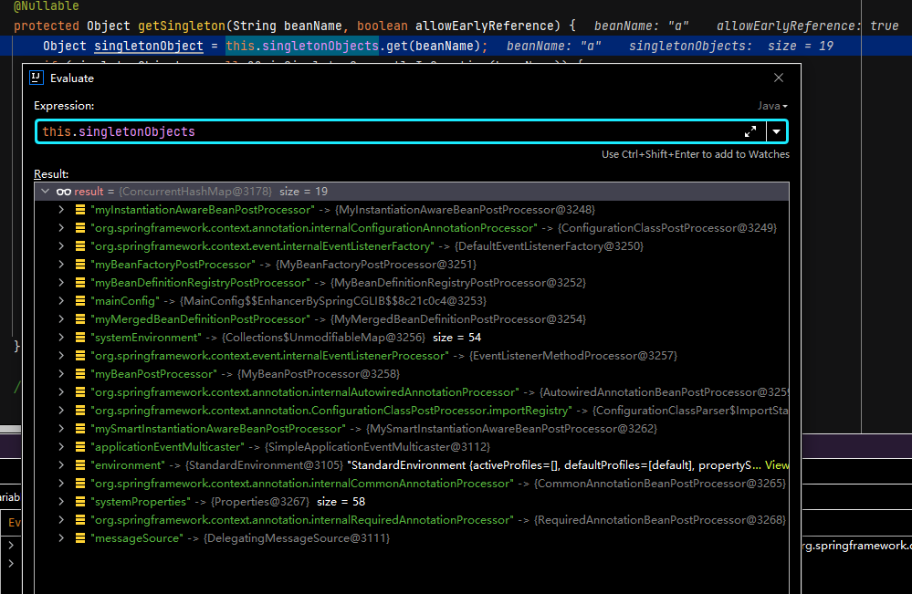
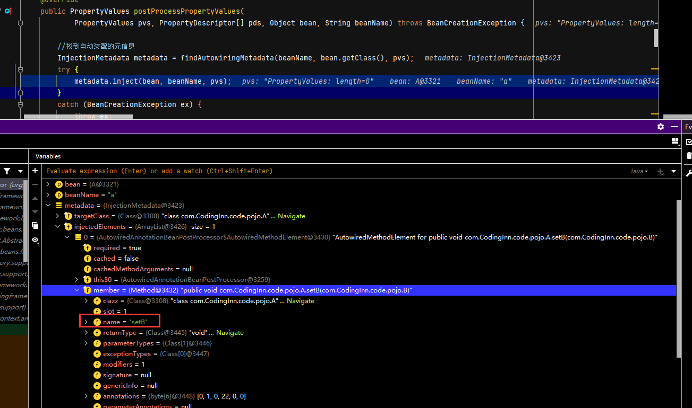

# Spring解决循环依赖

## 准备工作

+ A.java

```java
package com.CodingInn.code.pojo;

import org.springframework.beans.factory.annotation.Autowired;
import org.springframework.stereotype.Component;

@Component
public class A {
   private B b;

   public A() {
      System.out.println("A init");
   }

   public B getB() {
      return b;
   }

   @Autowired
   public void setB(B b) {
      this.b = b;
   }
}
```

+ B.java

```java
package com.CodingInn.code.pojo;

import org.springframework.beans.factory.annotation.Autowired;
import org.springframework.stereotype.Component;

@Component
public class B {
   private A a;

   public B() {
      System.out.println("B init");
   }

   public A getA() {
      return a;
   }

   @Autowired
   public void setA(A a) {
      this.a = a;
   }
}
```

## 开始调试

调试入口：

```java
@Test
   public void testAutowire() {
      ApplicationContext applicationContext = new AnnotationConfigApplicationContext(MainConfig.class);

      Hello bean = applicationContext.getBean(Hello.class);

   }
```

### A的创建

+ AnnotationConfigApplicationContext.java

```java
public AnnotationConfigApplicationContext(Class<?>... annotatedClasses) {
   this();
   register(annotatedClasses);
   refresh();//刷新容器
}
```

+ AbstractApplicationContext.java

```java
@Override
public void refresh() throws BeansException, IllegalStateException {
   synchronized (this.startupShutdownMonitor) {
      //第一步：容器刷新前的准备，设置上下文状态，获取属性，验证必要的属性等
      prepareRefresh();

        //第二步：获取新的beanFactory，销毁原有beanFactory、为每个bean生成BeanDefinition等,注意此处是获取新的，销毁旧的，这就是刷新的意义(Spring容器里通过BeanDefinition对象来表示Bean，BeanDefinition描述了Bean的配置信息。)
      // BeanFactory第一次开始创建的时候,有xml解析逻辑,如果是自动注解版,则只能获取到@Configuration标注的类,在invokeBeanFactoryPostProcessors(...)函数中会通过后置处理器解析配置类,如果该配置类@ComponentScan("com.CodingInn"),会进行扫描,将相应路径下的类注册到BeanDefinition中
      // 创建容器对象 ,获得的是DefaultListableBeanFactory,也是创建BeanFactory的过程
      ConfigurableListableBeanFactory beanFactory = obtainFreshBeanFactory();

       //第三步：配置标准的beanFactory，设置ClassLoader，设置EL表达式解析器等
      //配置了一些后置处理器(监听,xxxAware功能的后置处理器),所有的PostProcessor都不会放在单例池,放在了beanPostProcessor池里。
      prepareBeanFactory(beanFactory);

      try {
       //第四步：在所有的beanDenifition加载完成之后，bean实例化之前执行。比如在beanfactory加载完成所有的bean后，想修改其中某个bean的定义，或者对beanFactory做一些其他的配置，就可以在子类中对beanFactory进行后置处理。
         postProcessBeanFactory(beanFactory);

          第五步：实例化并调用所有注册的beanFactory后置处理器（实现接口BeanFactoryPostProcessor的bean） 
         // 工厂增强，有工厂的后置处理逻辑，配置类会在此解析
         invokeBeanFactoryPostProcessors(beanFactory);

         //第六步：实例化和注册beanFactory中扩展了BeanPostProcessor的bean。
                //例如： AutowiredAnnotationBeanPostProcessor(处理被@Autowired注解修饰的bean并注入)
                //RequiredAnnotationBeanPostProcessor(处理被@Required注解修饰的方法)
                //CommonAnnotationBeanPostProcessor(处理@PreDestroy、@PostConstruct、@Resource等多个注解的作用)等。
         registerBeanPostProcessors(beanFactory);

       //第七步：初始化国际化工具类MessageSource
         initMessageSource();

        //第八步：初始化应用事件广播器。这是观察者模式的典型应用。我们知道观察者模式由主题Subject和Observer组成。广播器相当于主题Subject，其包含多个监听器。当主题发生变化时会通知所有的监听器。初始化应用消息广播器，并放入"ApplicationEventMulticaster" Bean中
         initApplicationEventMulticaster();

          //第九步：这个方法在AnnotationApplicationContex上下文中没有实现，留给子类来初始化其他的Bean，是个模板方法，在容器刷新的时候可以自定义逻辑（子类自己去实现逻辑），不同的Spring容器做不同的事情
         onRefresh();

         //第十步：注册监听器，并且广播early application events,也就是早期的事件
         registerListeners();

           //第十一步：初始化剩下的单例（非懒加载的单例类）（并invoke BeanPostProcessors）
                //实例化所有剩余的（非懒加载）单例Bean。（也就是我们自己定义的那些Bean）
                //比如invokeBeanFactoryPostProcessors方法中根据各种注解解析出来的类，在这个时候都会被初始化，扫描的@Bean之类的，
                //实例化的过程各种BeanPostProcessor开始起作用
         // 完成BeanFactory的初始化,(在该步骤根据BeanDefinition创建bean对象，这步之后工厂里面所有的组件都初始化好了)
         finishBeanFactoryInitialization(beanFactory);

        //第十二步：完成刷新过程，通知生命周期处理器lifecycleProcessor完成刷新过程，同时发出ContextRefreshEvent通知别人
                //refresh做完之后需要做的其他事情
                //清除上下文资源缓存（如扫描中的ASM元数据）
                //初始化上下文的生命周期处理器，并刷新（找出Spring容器中实现了Lifecycle接口的bean并执行start()方法）。
                //发布ContextRefreshedEvent事件告知对应的ApplicationListener进行响应的操作
         finishRefresh();
      }

      catch (BeansException ex) {
         if (logger.isWarnEnabled()) {
            logger.warn("Exception encountered during context initialization - " +
                  "cancelling refresh attempt: " + ex);
         }

         // Destroy already created singletons to avoid dangling resources.
         destroyBeans();

         // Reset 'active' flag.
         cancelRefresh(ex);

         // Propagate exception to caller.
         throw ex;
      }

      finally {
         // Reset common introspection caches in Spring's core, since we
         // might not ever need metadata for singleton beans anymore...
         resetCommonCaches();
      }
   }
}


protected void finishBeanFactoryInitialization(ConfigurableListableBeanFactory beanFactory) {
		// Initialize conversion service for this context.
		if (beanFactory.containsBean(CONVERSION_SERVICE_BEAN_NAME) &&
				beanFactory.isTypeMatch(CONVERSION_SERVICE_BEAN_NAME, ConversionService.class)) {
			beanFactory.setConversionService(
					beanFactory.getBean(CONVERSION_SERVICE_BEAN_NAME, ConversionService.class));
		}

		// Register a default embedded value resolver if no bean post-processor
		// (such as a PropertyPlaceholderConfigurer bean) registered any before:
		// at this point, primarily for resolution in annotation attribute values.
		if (!beanFactory.hasEmbeddedValueResolver()) {
			beanFactory.addEmbeddedValueResolver(strVal -> getEnvironment().resolvePlaceholders(strVal));
		}

		// Initialize LoadTimeWeaverAware beans early to allow for registering their transformers early.
		String[] weaverAwareNames = beanFactory.getBeanNamesForType(LoadTimeWeaverAware.class, false, false);
		for (String weaverAwareName : weaverAwareNames) {
			getBean(weaverAwareName);
		}

		// Stop using the temporary ClassLoader for type matching.
		beanFactory.setTempClassLoader(null);

		// Allow for caching all bean definition metadata, not expecting further changes.
		beanFactory.freezeConfiguration();

		// Instantiate all remaining (non-lazy-init) singletons. 初始化所有的单实例Bean
		beanFactory.preInstantiateSingletons();
	}
```

+ DefaultListableBeanFactory.java

```java
@Override
public void preInstantiateSingletons() throws BeansException {
   if (logger.isDebugEnabled()) {
      logger.debug("Pre-instantiating singletons in " + this);
   }

   // Iterate over a copy to allow for init methods which in turn register new bean definitions.
   // While this may not be part of the regular factory bootstrap, it does otherwise work fine.
   List<String> beanNames = new ArrayList<>(this.beanDefinitionNames);

   // 创建出所有的单实例Bean。Trigger initialization of all non-lazy singleton beans...
   for (String beanName : beanNames) {
      RootBeanDefinition bd = getMergedLocalBeanDefinition(beanName);//开始解析文件的时候每一个bean标签被解析封装成一个BeanDefinition
      if (!bd.isAbstract() && bd.isSingleton() && !bd.isLazyInit()) {
         if (isFactoryBean(beanName)) {//如果是FactoryBean则执行以下逻辑
            Object bean = getBean(FACTORY_BEAN_PREFIX + beanName);
            if (bean instanceof FactoryBean) {
               FactoryBean<?> factory = (FactoryBean<?>) bean;
               boolean isEagerInit;
               if (System.getSecurityManager() != null && factory instanceof SmartFactoryBean) {
                  isEagerInit = AccessController.doPrivileged(
                        (PrivilegedAction<Boolean>) ((SmartFactoryBean<?>) factory)::isEagerInit,
                        getAccessControlContext());
               }
               else {
                  isEagerInit = (factory instanceof SmartFactoryBean &&
                        ((SmartFactoryBean<?>) factory).isEagerInit());
               }
               if (isEagerInit) {
                  getBean(beanName);
               }
            }
         }
         else {//非工厂bean
            getBean(beanName);
         }
      }
   }

   // Trigger post-initialization callback for all applicable beans...
   for (String beanName : beanNames) {
      Object singletonInstance = getSingleton(beanName);
      if (singletonInstance instanceof SmartInitializingSingleton) {
         SmartInitializingSingleton smartSingleton = (SmartInitializingSingleton) singletonInstance;
         if (System.getSecurityManager() != null) {
            AccessController.doPrivileged((PrivilegedAction<Object>) () -> {
               smartSingleton.afterSingletonsInstantiated();
               return null;
            }, getAccessControlContext());
         }
         else {
            smartSingleton.afterSingletonsInstantiated();
         }
      }
   }
}
```

+ AbstractBeanFactory.java

```java
@Override
public Object getBean(String name) throws BeansException {
   return doGetBean(name, null, null, false);
}


protected <T> T doGetBean(
			String name, @Nullable Class<T> requiredType, @Nullable Object[] args, boolean typeCheckOnly)
			throws BeansException {

		String beanName = transformedBeanName(name);//提取对应的beanName
		Object bean;

		// Eagerly check singleton cache for manually registered singletons.尝试从缓存获取或者singletonFactories中的ObjectFactory中获取
		////检查缓存中是否存在,寻找的是DefaultSingletonBeanRegistry里的singletonObjects map是否含有对应的Object
		//    	  //DefaultListableBeanFactory是DefaultSingletonBeanRegistry的子类,DefaultSingletonBeanRegistry类中存放了很多map,用于存储bean的信息,IOC容器的单例池存放的地方
		Object sharedInstance = getSingleton(beanName);
		if (sharedInstance != null && args == null) {
			if (logger.isDebugEnabled()) {
				if (isSingletonCurrentlyInCreation(beanName)) {
					logger.debug("Returning eagerly cached instance of singleton bean '" + beanName +
							"' that is not fully initialized yet - a consequence of a circular reference");
				}
				else {
					logger.debug("Returning cached instance of singleton bean '" + beanName + "'");
				}
			}
            		//如果缓存中有，则直接返回，该步骤中会判断是否是FactoryBean,如果是FactoryBean则会返回FactoryBean对应的对象。
			bean = getObjectForBeanInstance(sharedInstance, name, beanName, null);
		}

		else {//默认第一次获取组件都会进入此环节，因为IoC单例池中没有相应的Bean
			// Fail if we're already creating this bean instance:
			// We're assumably within a circular reference.
			if (isPrototypeCurrentlyInCreation(beanName)) {
				throw new BeanCurrentlyInCreationException(beanName);
			}

			// Check if bean definition exists in this factory.
			BeanFactory parentBeanFactory = getParentBeanFactory();
			if (parentBeanFactory != null && !containsBeanDefinition(beanName)) {
				// Not found -> check parent.
				String nameToLookup = originalBeanName(name);
				if (parentBeanFactory instanceof AbstractBeanFactory) {
					return ((AbstractBeanFactory) parentBeanFactory).doGetBean(
							nameToLookup, requiredType, args, typeCheckOnly);
				}
				else if (args != null) {
					// Delegation to parent with explicit args.
					return (T) parentBeanFactory.getBean(nameToLookup, args);
				}
				else {
					// No args -> delegate to standard getBean method.
					return parentBeanFactory.getBean(nameToLookup, requiredType);
				}
			}

			if (!typeCheckOnly) {
				markBeanAsCreated(beanName);
			}

			try {
				RootBeanDefinition mbd = getMergedLocalBeanDefinition(beanName);
				checkMergedBeanDefinition(mbd, beanName, args);

				// Guarantee initialization of beans that the current bean depends on.
				String[] dependsOn = mbd.getDependsOn();
				if (dependsOn != null) {
					for (String dep : dependsOn) {
						if (isDependent(beanName, dep)) {
							throw new BeanCreationException(mbd.getResourceDescription(), beanName,
									"Circular depends-on relationship between '" + beanName + "' and '" + dep + "'");
						}
						registerDependentBean(dep, beanName);
						try {
							getBean(dep);
						}
						catch (NoSuchBeanDefinitionException ex) {
							throw new BeanCreationException(mbd.getResourceDescription(), beanName,
									"'" + beanName + "' depends on missing bean '" + dep + "'", ex);
						}
					}
				}

				// Create bean instance.创建bean的实例
				if (mbd.isSingleton()) {
					sharedInstance = getSingleton(beanName, () -> {
						try {
							return createBean(beanName, mbd, args); //创建bean对象的实例
						}
						catch (BeansException ex) {
							// Explicitly remove instance from singleton cache: It might have been put there
							// eagerly by the creation process, to allow for circular reference resolution.
							// Also remove any beans that received a temporary reference to the bean.
							destroySingleton(beanName);
							throw ex;
						}
					});
					bean = getObjectForBeanInstance(sharedInstance, name, beanName, mbd);
				}

				else if (mbd.isPrototype()) {
					// It's a prototype -> create a new instance.
					Object prototypeInstance = null;
					try {
						beforePrototypeCreation(beanName);
						prototypeInstance = createBean(beanName, mbd, args);
					}
					finally {
						afterPrototypeCreation(beanName);
					}
					bean = getObjectForBeanInstance(prototypeInstance, name, beanName, mbd);
				}

				else {
					String scopeName = mbd.getScope();
					if (!StringUtils.hasLength(scopeName)) {
						throw new IllegalStateException("No scope name defined for bean ´" + beanName + "'");
					}
					Scope scope = this.scopes.get(scopeName);
					if (scope == null) {
						throw new IllegalStateException("No Scope registered for scope name '" + scopeName + "'");
					}
					try {
						Object scopedInstance = scope.get(beanName, () -> {
							beforePrototypeCreation(beanName);
							try {
								return createBean(beanName, mbd, args);
							}
							finally {
								afterPrototypeCreation(beanName);
							}
						});
						bean = getObjectForBeanInstance(scopedInstance, name, beanName, mbd);
					}
					catch (IllegalStateException ex) {
						throw new BeanCreationException(beanName,
								"Scope '" + scopeName + "' is not active for the current thread; consider " +
								"defining a scoped proxy for this bean if you intend to refer to it from a singleton",
								ex);
					}
				}
			}
			catch (BeansException ex) {
				cleanupAfterBeanCreationFailure(beanName);
				throw ex;
			}
		}

		// Check if required type matches the type of the actual bean instance.
		if (requiredType != null && !requiredType.isInstance(bean)) {
			try {
				T convertedBean = getTypeConverter().convertIfNecessary(bean, requiredType);
				if (convertedBean == null) {
					throw new BeanNotOfRequiredTypeException(name, requiredType, bean.getClass());
				}
				return convertedBean;
			}
			catch (TypeMismatchException ex) {
				if (logger.isDebugEnabled()) {
					logger.debug("Failed to convert bean '" + name + "' to required type '" +
							ClassUtils.getQualifiedName(requiredType) + "'", ex);
				}
				throw new BeanNotOfRequiredTypeException(name, requiredType, bean.getClass());
			}
		}
		return (T) bean;
	}
```

当创建A的时候，会先调用getSingleton。

#### getSingleton(String beanName)的调用

+ DefaultSingletonBeanRegistry.java

```java
public Object getSingleton(String beanName) {
   return getSingleton(beanName, true); //注意，此处的earlyRef为true
}


@Nullable
	protected Object getSingleton(String beanName, boolean allowEarlyReference) {
		Object singletonObject = this.singletonObjects.get(beanName);//一级缓存
		if (singletonObject == null && isSingletonCurrentlyInCreation(beanName)) {//如果当前bean正在创建过程中，而且缓存中没有，则继续，在第一次创建时，isSingletonCurrentlyInCreation(beanName)为false，此时getSingleton()会返回false，在doGetBean函数中，如果getSingleton()返回null,则会进入创建逻辑，在创建时，会把beanName标记为正在创建
            // isSingletonCurrentlyInCreation(beanName) 函数判断的是DefaultSingletonBeanRegistry的singletonsCurrentlyInCreation 集合中是否有该对象，
			synchronized (this.singletonObjects) {
				singletonObject = this.earlySingletonObjects.get(beanName);//二级缓存
				if (singletonObject == null && allowEarlyReference) {
					ObjectFactory<?> singletonFactory = this.singletonFactories.get(beanName);//三级缓存
					if (singletonFactory != null) {
						singletonObject = singletonFactory.getObject();
						this.earlySingletonObjects.put(beanName, singletonObject);
						this.singletonFactories.remove(beanName);
					}
				}
			}
		}
		return singletonObject;
	}
```

this.singletonObjects如下：



#### CreateBean(...)的调用

当getSingleton(...)调用返回false之后，spring会在底层创建对应的bean

+ AbstractBeanFactory.java

```java

protected <T> T doGetBean(
			String name, @Nullable Class<T> requiredType, @Nullable Object[] args, boolean typeCheckOnly)
			throws BeansException {

		String beanName = transformedBeanName(name);//提取对应的beanName
		Object bean;

		// Eagerly check singleton cache for manually registered singletons.尝试从缓存获取或者singletonFactories中的ObjectFactory中获取
		////检查缓存中是否存在,寻找的是DefaultSingletonBeanRegistry里的singletonObjects map是否含有对应的Object
		//    	  //DefaultListableBeanFactory是DefaultSingletonBeanRegistry的子类,DefaultSingletonBeanRegistry类中存放了很多map,用于存储bean的信息,IOC容器的单例池存放的地方
		Object sharedInstance = getSingleton(beanName);
		if (sharedInstance != null && args == null) {
			...
		}

		else {//默认第一次获取组件都会进入此环节，因为IoC单例池中没有相应的Bean
			...

			try {
				RootBeanDefinition mbd = getMergedLocalBeanDefinition(beanName);
				checkMergedBeanDefinition(mbd, beanName, args);

				...

				// Create bean instance.创建bean的实例
				if (mbd.isSingleton()) {
					sharedInstance = getSingleton(beanName, () -> {
						try {
							return createBean(beanName, mbd, args); //创建bean对象的实例
						}
						catch (BeansException ex) {
							...
						}
					});
					bean = getObjectForBeanInstance(sharedInstance, name, beanName, mbd);
				}

				else if (mbd.isPrototype()) {
					...
				}

				else {
					...
				}
			}
			catch (BeansException ex) {
				...
			}
		}

		// Check if required type matches the type of the actual bean instance.
		...
		return (T) bean;
	}
```

####  getSingleton(String beanName, ObjectFactory<?> singletonFactory)的调用

+ DefaultSingletonBeanRegistry.java

```java
public Object getSingleton(String beanName, ObjectFactory<?> singletonFactory) {
   Assert.notNull(beanName, "Bean name must not be null");
   synchronized (this.singletonObjects) {
      Object singletonObject = this.singletonObjects.get(beanName);//再次从缓存中检查
      if (singletonObject == null) {
         if (this.singletonsCurrentlyInDestruction) {
            throw new BeanCreationNotAllowedException(beanName,
                  "Singleton bean creation not allowed while singletons of this factory are in destruction " +
                  "(Do not request a bean from a BeanFactory in a destroy method implementation!)");
         }
         if (logger.isDebugEnabled()) {
            logger.debug("Creating shared instance of singleton bean '" + beanName + "'");
         }
         beforeSingletonCreation(beanName);//在该步骤将beanName加入DefaultSingletonBeanRegistry的singletonsCurrentlyInCreation中，当其他地方调用getSingleton(String beanName) 是，如果在一级缓存(singletonObjects)中找不到，isSingletonCurrentlyInCreation(beanName)会返回true，此时会从二级缓存（earlySingletonObjects）或三级缓存（singletonFactories）中寻找，返回早期未创建完成的Bean实例，以解决循环引用问题
         boolean newSingleton = false;
         boolean recordSuppressedExceptions = (this.suppressedExceptions == null);
         if (recordSuppressedExceptions) {
            this.suppressedExceptions = new LinkedHashSet<>();
         }
         try {
            singletonObject = singletonFactory.getObject();////ObjectFactory提供Bean实例,此处的getObect是上一步sharedInstance = getSingleton(...)的lambda表达式 createBean(beanName, mbd, args)
            newSingleton = true;
         }
         catch (IllegalStateException ex) {
            // Has the singleton object implicitly appeared in the meantime ->
            // if yes, proceed with it since the exception indicates that state.
            singletonObject = this.singletonObjects.get(beanName);
            if (singletonObject == null) {
               throw ex;
            }
         }
         catch (BeanCreationException ex) {
            if (recordSuppressedExceptions) {
               for (Exception suppressedException : this.suppressedExceptions) {
                  ex.addRelatedCause(suppressedException);
               }
            }
            throw ex;
         }
         finally {
            if (recordSuppressedExceptions) {
               this.suppressedExceptions = null;
            }
            afterSingletonCreation(beanName);
         }
         if (newSingleton) {
            addSingleton(beanName, singletonObject);
         }
      }
      return singletonObject;
   }
}
```

+ AbstractAutowireCapableBeanFactory.java

```java
protected Object createBean(String beanName, RootBeanDefinition mbd, @Nullable Object[] args)
      throws BeanCreationException {

   if (logger.isDebugEnabled()) {
      logger.debug("Creating instance of bean '" + beanName + "'");
   }
   RootBeanDefinition mbdToUse = mbd;

   // Make sure bean class is actually resolved at this point, and
   // clone the bean definition in case of a dynamically resolved Class
   // which cannot be stored in the shared merged bean definition.
   Class<?> resolvedClass = resolveBeanClass(mbd, beanName);
   if (resolvedClass != null && !mbd.hasBeanClass() && mbd.getBeanClassName() != null) {
      mbdToUse = new RootBeanDefinition(mbd);
      mbdToUse.setBeanClass(resolvedClass);
   }

   // Prepare method overrides.
   try {
      mbdToUse.prepareMethodOverrides();
   }
   catch (BeanDefinitionValidationException ex) {
      throw new BeanDefinitionStoreException(mbdToUse.getResourceDescription(),
            beanName, "Validation of method overrides failed", ex);
   }

   try {
      // 提前给一个机会返回相应的代理对象。Give BeanPostProcessors a chance to return a proxy instead of the target bean instance.
      Object bean = resolveBeforeInstantiation(beanName, mbdToUse);
      if (bean != null) {
         return bean;
      }
   }
   catch (Throwable ex) {
      throw new BeanCreationException(mbdToUse.getResourceDescription(), beanName,
            "BeanPostProcessor before instantiation of bean failed", ex);
   }

   try {
      Object beanInstance = doCreateBean(beanName, mbdToUse, args);//真正创建对象
      if (logger.isDebugEnabled()) {
         logger.debug("Finished creating instance of bean '" + beanName + "'");
      }
      return beanInstance;
   }
   catch (BeanCreationException | ImplicitlyAppearedSingletonException ex) {
      // A previously detected exception with proper bean creation context already,
      // or illegal singleton state to be communicated up to DefaultSingletonBeanRegistry.
      throw ex;
   }
   catch (Throwable ex) {
      throw new BeanCreationException(
            mbdToUse.getResourceDescription(), beanName, "Unexpected exception during bean creation", ex);
   }
}


protected Object doCreateBean(String beanName, RootBeanDefinition mbd, @Nullable Object[] args)
			throws BeanCreationException {

		// Instantiate the bean.
		BeanWrapper instanceWrapper = null;
		if (mbd.isSingleton()) {
			instanceWrapper = this.factoryBeanInstanceCache.remove(beanName);
		}
		if (instanceWrapper == null) {
			instanceWrapper = createBeanInstance(beanName, mbd, args);//创建bean实例,,默认使用无参构造器
		}
		Object bean = instanceWrapper.getWrappedInstance();
		Class<?> beanType = instanceWrapper.getWrappedClass();
		if (beanType != NullBean.class) {
			mbd.resolvedTargetType = beanType;
		}

		// Allow post-processors to modify the merged bean definition.
		synchronized (mbd.postProcessingLock) {
			if (!mbd.postProcessed) {
				try {
                    		//允许后处理器修改beanDefinition
					applyMergedBeanDefinitionPostProcessors(mbd, beanType, beanName);
				}
				catch (Throwable ex) {
					throw new BeanCreationException(mbd.getResourceDescription(), beanName,
							"Post-processing of merged bean definition failed", ex);
				}
				mbd.postProcessed = true;
			}
		}

		// 提前暴露单实例，以解决循环引用问题
		boolean earlySingletonExposure = (mbd.isSingleton() && this.allowCircularReferences &&
				isSingletonCurrentlyInCreation(beanName));
		if (earlySingletonExposure) {
			if (logger.isDebugEnabled()) {
				logger.debug("Eagerly caching bean '" + beanName +
						"' to allow for resolving potential circular references");
			}
            		//向工厂中添加创建组件的工厂
			addSingletonFactory(beanName, () -> getEarlyBeanReference(beanName, mbd, bean));
		}

		// Initialize the bean instance.
		Object exposedObject = bean;
		try {
			populateBean(beanName, mbd, instanceWrapper);//先给bean中的属性赋值，其中有处理@Autowired的逻辑
			exposedObject = initializeBean(beanName, exposedObject, mbd);
		}
		catch (Throwable ex) {
			if (ex instanceof BeanCreationException && beanName.equals(((BeanCreationException) ex).getBeanName())) {
				throw (BeanCreationException) ex;
			}
			else {
				throw new BeanCreationException(
						mbd.getResourceDescription(), beanName, "Initialization of bean failed", ex);
			}
		}

		if (earlySingletonExposure) {
			Object earlySingletonReference = getSingleton(beanName, false);
            	//如果earlySingletonReference为null说明之前有发生循环依赖,将存在二级缓存中的对象取出,作为返回的对象
			if (earlySingletonReference != null) {
				if (exposedObject == bean) {
					exposedObject = earlySingletonReference;
				}
				else if (!this.allowRawInjectionDespiteWrapping && hasDependentBean(beanName)) {
					String[] dependentBeans = getDependentBeans(beanName);
					Set<String> actualDependentBeans = new LinkedHashSet<>(dependentBeans.length);
					for (String dependentBean : dependentBeans) {
						if (!removeSingletonIfCreatedForTypeCheckOnly(dependentBean)) {
							actualDependentBeans.add(dependentBean);
						}
					}
					if (!actualDependentBeans.isEmpty()) {
						throw new BeanCurrentlyInCreationException(beanName,
								"Bean with name '" + beanName + "' has been injected into other beans [" +
								StringUtils.collectionToCommaDelimitedString(actualDependentBeans) +
								"] in its raw version as part of a circular reference, but has eventually been " +
								"wrapped. This means that said other beans do not use the final version of the " +
								"bean. This is often the result of over-eager type matching - consider using " +
								"'getBeanNamesForType' with the 'allowEagerInit' flag turned off, for example.");
					}
				}
			}
		}

		// Register bean as disposable.
		try {
			registerDisposableBeanIfNecessary(beanName, bean, mbd);
		}
		catch (BeanDefinitionValidationException ex) {
			throw new BeanCreationException(
					mbd.getResourceDescription(), beanName, "Invalid destruction signature", ex);
		}

		return exposedObject;
	}
```

##### addSingletonFactory的调用

```java
//一级缓存(singletonObjects)中找不到，isSingletonCurrentlyInCreation(beanName)会返回true，此时会从二级缓存（earlySingletonObjects）或三级缓存（singletonFactories）
protected void addSingletonFactory(String beanName, ObjectFactory<?> singletonFactory) {
   Assert.notNull(singletonFactory, "Singleton factory must not be null");
   synchronized (this.singletonObjects) {
      if (!this.singletonObjects.containsKey(beanName)) {//注意，此时在正在创建A，所以当前A不在一级缓存(singletonObjects)中
         this.singletonFactories.put(beanName, singletonFactory);//把A放入三级缓存（singletonFactories），其中singletonFactory是lambda表达式，其是一个bean的工厂：, () -> getEarlyBeanReference(beanName, mbd, bean)，完整函数如下:
          /*
          protected Object getEarlyBeanReference(String beanName, RootBeanDefinition mbd, Object bean) {
		Object exposedObject = bean;
		if (!mbd.isSynthetic() && hasInstantiationAwareBeanPostProcessors()) {
			for (BeanPostProcessor bp : getBeanPostProcessors()) {
				if (bp instanceof SmartInstantiationAwareBeanPostProcessor) {
					SmartInstantiationAwareBeanPostProcessor ibp = (SmartInstantiationAwareBeanPostProcessor) bp;
					exposedObject = ibp.getEarlyBeanReference(exposedObject, beanName);
				}
			}
		}
		return exposedObject;
	}
	//该函数就是为什么要使用三级缓存而不是二级缓存的原因，便于使用后置增强器对bean进行增强
          */
         this.earlySingletonObjects.remove(beanName);//把A从二级缓存（earlySingletonObjects）中移除
         this.registeredSingletons.add(beanName);
      }
   }
}
```

##### populateBean的调用

+ AbstractAutowireCapableBeanFactory.java

```java
protected void populateBean(String beanName, RootBeanDefinition mbd, @Nullable BeanWrapper bw) {
   if (bw == null) {
      if (mbd.hasPropertyValues()) {
         throw new BeanCreationException(
               mbd.getResourceDescription(), beanName, "Cannot apply property values to null instance");
      }
      else {
         // Skip property population phase for null instance.
         return;
      }
   }

   // Give any InstantiationAwareBeanPostProcessors the opportunity to modify the
   // state of the bean before properties are set. This can be used, for example,
   // to support styles of field injection.
   if (!mbd.isSynthetic() && hasInstantiationAwareBeanPostProcessors()) {
      for (BeanPostProcessor bp : getBeanPostProcessors()) {
         if (bp instanceof InstantiationAwareBeanPostProcessor) {
            InstantiationAwareBeanPostProcessor ibp = (InstantiationAwareBeanPostProcessor) bp;
            if (!ibp.postProcessAfterInstantiation(bw.getWrappedInstance(), beanName)) {
               return;
            }
         }
      }
   }

   PropertyValues pvs = (mbd.hasPropertyValues() ? mbd.getPropertyValues() : null);//从属性中拿到所有的键值对

   int resolvedAutowireMode = mbd.getResolvedAutowireMode();
   if (resolvedAutowireMode == AUTOWIRE_BY_NAME || resolvedAutowireMode == AUTOWIRE_BY_TYPE) {
      MutablePropertyValues newPvs = new MutablePropertyValues(pvs);
      // Add property values based on autowire by name if applicable.
      if (resolvedAutowireMode == AUTOWIRE_BY_NAME) {
         autowireByName(beanName, mbd, bw, newPvs);
      }
      // Add property values based on autowire by type if applicable.
      if (resolvedAutowireMode == AUTOWIRE_BY_TYPE) {
         autowireByType(beanName, mbd, bw, newPvs);
      }
      pvs = newPvs;
   }

   boolean hasInstAwareBpps = hasInstantiationAwareBeanPostProcessors();
   boolean needsDepCheck = (mbd.getDependencyCheck() != AbstractBeanDefinition.DEPENDENCY_CHECK_NONE);

   if (hasInstAwareBpps || needsDepCheck) {
      if (pvs == null) {
         pvs = mbd.getPropertyValues();//xml中property标签指定的PropertyValues
      }
      PropertyDescriptor[] filteredPds = filterPropertyDescriptorsForDependencyCheck(bw, mbd.allowCaching);
      if (hasInstAwareBpps) {//如果有aware注解,则调用含有aware的后置处理器,先对aware的属性进行赋值
         for (BeanPostProcessor bp : getBeanPostProcessors()) {
            if (bp instanceof InstantiationAwareBeanPostProcessor) {//此处拿到的bp是AutowiredAnnotationBeanPostProcessor
               InstantiationAwareBeanPostProcessor ibp = (InstantiationAwareBeanPostProcessor) bp;
               pvs = ibp.postProcessPropertyValues(pvs, filteredPds, bw.getWrappedInstance(), beanName);
               if (pvs == null) {
                  return;
               }
            }
         }
      }
      if (needsDepCheck) {
         checkDependencies(beanName, mbd, filteredPds, pvs);
      }
   }

   if (pvs != null) {//把以前处理好的PropertyValues进行应用
      applyPropertyValues(beanName, mbd, bw, pvs);//对属性进行赋值
   }
}
```

+ AutowiredAnnotationBeanPostProcessor.java

```java
@Override
public PropertyValues postProcessPropertyValues(
      PropertyValues pvs, PropertyDescriptor[] pds, Object bean, String beanName) throws BeanCreationException {

   //找到自动装配的元信息
   InjectionMetadata metadata = findAutowiringMetadata(beanName, bean.getClass(), pvs);
   try {
      metadata.inject(bean, beanName, pvs);
   }
   catch (BeanCreationException ex) {
      throw ex;
   }
   catch (Throwable ex) {
      throw new BeanCreationException(beanName, "Injection of autowired dependencies failed", ex);
   }
   return pvs;
}
```

在这里感知到要调用setB(..)的方法给B赋值：



+ InjectionMetadata.java

```java
public void inject(Object target, @Nullable String beanName, @Nullable PropertyValues pvs) throws Throwable {
   Collection<InjectedElement> checkedElements = this.checkedElements;
   Collection<InjectedElement> elementsToIterate =
         (checkedElements != null ? checkedElements : this.injectedElements);
   if (!elementsToIterate.isEmpty()) {
      //遍历所有的注入源信息类利用反射赋值,每个element中含有反射需要调用的方法
      for (InjectedElement element : elementsToIterate) {
         if (logger.isDebugEnabled()) {
            logger.debug("Processing injected element of bean '" + beanName + "': " + element);
         }
         element.inject(target, beanName, pvs);
      }
   }
}
```

+ AutowiredAnnotationBeanPostProcessor.java

```java
@Override
protected void inject(Object bean, @Nullable String beanName, @Nullable PropertyValues pvs) throws Throwable {
   if (checkPropertySkipping(pvs)) {
      return;
   }
   Method method = (Method) this.member;
   Object[] arguments;
   if (this.cached) {
      // Shortcut for avoiding synchronization...
      arguments = resolveCachedArguments(beanName);
   }
   else {
      Class<?>[] paramTypes = method.getParameterTypes();
      arguments = new Object[paramTypes.length];
      DependencyDescriptor[] descriptors = new DependencyDescriptor[paramTypes.length];
      Set<String> autowiredBeans = new LinkedHashSet<>(paramTypes.length);
      Assert.state(beanFactory != null, "No BeanFactory available");
      TypeConverter typeConverter = beanFactory.getTypeConverter();
      for (int i = 0; i < arguments.length; i++) {
         MethodParameter methodParam = new MethodParameter(method, i);
         DependencyDescriptor currDesc = new DependencyDescriptor(methodParam, this.required);
         currDesc.setContainingClass(bean.getClass());
         descriptors[i] = currDesc;
         try {
            Object arg = beanFactory.resolveDependency(currDesc, beanName, autowiredBeans, typeConverter);//解决依赖问题
            if (arg == null && !this.required) {
               arguments = null;
               break;
            }
            arguments[i] = arg;
         }
         catch (BeansException ex) {
            throw new UnsatisfiedDependencyException(null, beanName, new InjectionPoint(methodParam), ex);
         }
      }
      synchronized (this) {
         if (!this.cached) {
            if (arguments != null) {
               Object[] cachedMethodArguments = new Object[paramTypes.length];
               System.arraycopy(descriptors, 0, cachedMethodArguments, 0, arguments.length);
               registerDependentBeans(beanName, autowiredBeans);
               if (autowiredBeans.size() == paramTypes.length) {
                  Iterator<String> it = autowiredBeans.iterator();
                  for (int i = 0; i < paramTypes.length; i++) {
                     String autowiredBeanName = it.next();
                     if (beanFactory.containsBean(autowiredBeanName) &&
                           beanFactory.isTypeMatch(autowiredBeanName, paramTypes[i])) {
                        cachedMethodArguments[i] = new ShortcutDependencyDescriptor(
                              descriptors[i], autowiredBeanName, paramTypes[i]);
                     }
                  }
               }
               this.cachedMethodArguments = cachedMethodArguments;
            }
            else {
               this.cachedMethodArguments = null;
            }
            this.cached = true;
         }
      }
   }
   if (arguments != null) {
      try {
         ReflectionUtils.makeAccessible(method);
         method.invoke(bean, arguments);
      }
      catch (InvocationTargetException ex) {
         throw ex.getTargetException();
      }
   }
}
```

+ DefaultListableBeanFactory.java

```java
ublic Object resolveDependency(DependencyDescriptor descriptor, @Nullable String requestingBeanName,
      @Nullable Set<String> autowiredBeanNames, @Nullable TypeConverter typeConverter) throws BeansException {

   descriptor.initParameterNameDiscovery(getParameterNameDiscoverer());
   if (Optional.class == descriptor.getDependencyType()) {
      return createOptionalDependency(descriptor, requestingBeanName);
   }
   else if (ObjectFactory.class == descriptor.getDependencyType() ||
         ObjectProvider.class == descriptor.getDependencyType()) {
      return new DependencyObjectProvider(descriptor, requestingBeanName);
   }
   else if (javaxInjectProviderClass == descriptor.getDependencyType()) {
      return new Jsr330ProviderFactory().createDependencyProvider(descriptor, requestingBeanName);
   }
   else {
      Object result = getAutowireCandidateResolver().getLazyResolutionProxyIfNecessary(
            descriptor, requestingBeanName);
      if (result == null) {
         result = doResolveDependency(descriptor, requestingBeanName, autowiredBeanNames, typeConverter);
      }
      return result;
   }
}


@Nullable
	public Object doResolveDependency(DependencyDescriptor descriptor, @Nullable String beanName,
			@Nullable Set<String> autowiredBeanNames, @Nullable TypeConverter typeConverter) throws BeansException {

		InjectionPoint previousInjectionPoint = ConstructorResolver.setCurrentInjectionPoint(descriptor);
		try {
			...

			Map<String, Object> matchingBeans = findAutowireCandidates(beanName, type, descriptor);
			if (matchingBeans.isEmpty()) {
				if (isRequired(descriptor)) {
					raiseNoMatchingBeanFound(type, descriptor.getResolvableType(), descriptor);
				}
				return null;
			}

			String autowiredBeanName;
			Object instanceCandidate;

			if (matchingBeans.size() > 1) {
				...
			}
			else {
				// We have exactly one match.
				Map.Entry<String, Object> entry = matchingBeans.entrySet().iterator().next();
				autowiredBeanName = entry.getKey();
				instanceCandidate = entry.getValue();
			}

			if (autowiredBeanNames != null) {
				autowiredBeanNames.add(autowiredBeanName);
			}
			if (instanceCandidate instanceof Class) {
				instanceCandidate = descriptor.resolveCandidate(autowiredBeanName, type, this);
			}
			Object result = instanceCandidate;
			if (result instanceof NullBean) {
				if (isRequired(descriptor)) {
					raiseNoMatchingBeanFound(type, descriptor.getResolvableType(), descriptor);
				}
				result = null;
			}
			if (!ClassUtils.isAssignableValue(type, result)) {
				throw new BeanNotOfRequiredTypeException(autowiredBeanName, type, instanceCandidate.getClass());
			}
			return result;
		}
		finally {
			ConstructorResolver.setCurrentInjectionPoint(previousInjectionPoint);
		}
	}
```

+ DependencyDescriptor.java

```java
public Object resolveCandidate(String beanName, Class<?> requiredType, BeanFactory beanFactory)
      throws BeansException {

    //此处的beanName为 b,所有自动注入的属性都是beanFactory.getBean(beanName)的结果
   return beanFactory.getBean(beanName);
}
```

### B的创建

此时会进入获取b的创建流程：

+ AbstractBeanFactory.java

```java
@Override
public Object getBean(String name) throws BeansException {
   return doGetBean(name, null, null, false);
}


protected <T> T doGetBean(
			String name, @Nullable Class<T> requiredType, @Nullable Object[] args, boolean typeCheckOnly)
			throws BeansException {

		String beanName = transformedBeanName(name);//提取对应的beanName
		Object bean;

		// Eagerly check singleton cache for manually registered singletons.尝试从缓存获取或者singletonFactories中的ObjectFactory中获取
		////检查缓存中是否存在,寻找的是DefaultSingletonBeanRegistry里的singletonObjects map是否含有对应的Object
		//    	  //DefaultListableBeanFactory是DefaultSingletonBeanRegistry的子类,DefaultSingletonBeanRegistry类中存放了很多map,用于存储bean的信息,IOC容器的单例池存放的地方
		Object sharedInstance = getSingleton(beanName);
		if (sharedInstance != null && args == null) {
			if (logger.isDebugEnabled()) {
				if (isSingletonCurrentlyInCreation(beanName)) {
					logger.debug("Returning eagerly cached instance of singleton bean '" + beanName +
							"' that is not fully initialized yet - a consequence of a circular reference");
				}
				else {
					logger.debug("Returning cached instance of singleton bean '" + beanName + "'");
				}
			}
			bean = getObjectForBeanInstance(sharedInstance, name, beanName, null);
		}

		else {//默认第一次获取组件都会进入此环节
			// Fail if we're already creating this bean instance:
			// We're assumably within a circular reference.
			if (isPrototypeCurrentlyInCreation(beanName)) {
				throw new BeanCurrentlyInCreationException(beanName);
			}

			// Check if bean definition exists in this factory.
			BeanFactory parentBeanFactory = getParentBeanFactory();
			if (parentBeanFactory != null && !containsBeanDefinition(beanName)) {
				// Not found -> check parent.
				String nameToLookup = originalBeanName(name);
				if (parentBeanFactory instanceof AbstractBeanFactory) {
					return ((AbstractBeanFactory) parentBeanFactory).doGetBean(
							nameToLookup, requiredType, args, typeCheckOnly);
				}
				else if (args != null) {
					// Delegation to parent with explicit args.
					return (T) parentBeanFactory.getBean(nameToLookup, args);
				}
				else {
					// No args -> delegate to standard getBean method.
					return parentBeanFactory.getBean(nameToLookup, requiredType);
				}
			}

			if (!typeCheckOnly) {
				markBeanAsCreated(beanName);
			}

			try {
				RootBeanDefinition mbd = getMergedLocalBeanDefinition(beanName);
				checkMergedBeanDefinition(mbd, beanName, args);

				// Guarantee initialization of beans that the current bean depends on.
				String[] dependsOn = mbd.getDependsOn();
				if (dependsOn != null) {
					for (String dep : dependsOn) {
						if (isDependent(beanName, dep)) {
							throw new BeanCreationException(mbd.getResourceDescription(), beanName,
									"Circular depends-on relationship between '" + beanName + "' and '" + dep + "'");
						}
						registerDependentBean(dep, beanName);
						try {
							getBean(dep);
						}
						catch (NoSuchBeanDefinitionException ex) {
							throw new BeanCreationException(mbd.getResourceDescription(), beanName,
									"'" + beanName + "' depends on missing bean '" + dep + "'", ex);
						}
					}
				}

				// Create bean instance.创建bean的实例
				if (mbd.isSingleton()) {
					sharedInstance = getSingleton(beanName, () -> {
						try {
							return createBean(beanName, mbd, args); //创建bean对象的实例
						}
						catch (BeansException ex) {
							// Explicitly remove instance from singleton cache: It might have been put there
							// eagerly by the creation process, to allow for circular reference resolution.
							// Also remove any beans that received a temporary reference to the bean.
							destroySingleton(beanName);
							throw ex;
						}
					});
					bean = getObjectForBeanInstance(sharedInstance, name, beanName, mbd);
				}

				else if (mbd.isPrototype()) {
					// It's a prototype -> create a new instance.
					Object prototypeInstance = null;
					try {
						beforePrototypeCreation(beanName);
						prototypeInstance = createBean(beanName, mbd, args);
					}
					finally {
						afterPrototypeCreation(beanName);
					}
					bean = getObjectForBeanInstance(prototypeInstance, name, beanName, mbd);
				}

				else {
					String scopeName = mbd.getScope();
					if (!StringUtils.hasLength(scopeName)) {
						throw new IllegalStateException("No scope name defined for bean ´" + beanName + "'");
					}
					Scope scope = this.scopes.get(scopeName);
					if (scope == null) {
						throw new IllegalStateException("No Scope registered for scope name '" + scopeName + "'");
					}
					try {
						Object scopedInstance = scope.get(beanName, () -> {
							beforePrototypeCreation(beanName);
							try {
								return createBean(beanName, mbd, args);
							}
							finally {
								afterPrototypeCreation(beanName);
							}
						});
						bean = getObjectForBeanInstance(scopedInstance, name, beanName, mbd);
					}
					catch (IllegalStateException ex) {
						throw new BeanCreationException(beanName,
								"Scope '" + scopeName + "' is not active for the current thread; consider " +
								"defining a scoped proxy for this bean if you intend to refer to it from a singleton",
								ex);
					}
				}
			}
			catch (BeansException ex) {
				cleanupAfterBeanCreationFailure(beanName);
				throw ex;
			}
		}

		// Check if required type matches the type of the actual bean instance.
		if (requiredType != null && !requiredType.isInstance(bean)) {
			try {
				T convertedBean = getTypeConverter().convertIfNecessary(bean, requiredType);
				if (convertedBean == null) {
					throw new BeanNotOfRequiredTypeException(name, requiredType, bean.getClass());
				}
				return convertedBean;
			}
			catch (TypeMismatchException ex) {
				if (logger.isDebugEnabled()) {
					logger.debug("Failed to convert bean '" + name + "' to required type '" +
							ClassUtils.getQualifiedName(requiredType) + "'", ex);
				}
				throw new BeanNotOfRequiredTypeException(name, requiredType, bean.getClass());
			}
		}
		return (T) bean;
	}
```

使用getSingleton获取b：

+ DefaultSingletonBeanRegistry.java

```java
protected Object getSingleton(String beanName, boolean allowEarlyReference) {
   Object singletonObject = this.singletonObjects.get(beanName);
   if (singletonObject == null && isSingletonCurrentlyInCreation(beanName)) {
      synchronized (this.singletonObjects) {
         singletonObject = this.earlySingletonObjects.get(beanName);
         if (singletonObject == null && allowEarlyReference) {
            ObjectFactory<?> singletonFactory = this.singletonFactories.get(beanName);
            if (singletonFactory != null) {
               singletonObject = singletonFactory.getObject();
               this.earlySingletonObjects.put(beanName, singletonObject);
               this.singletonFactories.remove(beanName);
            }
         }
      }
   }
   return singletonObject;
}
```

因为b刚开始创建，所以此处会返回false。接下来会像之前创建A一样，对B进行一系列的创建流程：

+ AbstractAutowireCapableBeanFactory.java

```java
protected Object createBean(String beanName, RootBeanDefinition mbd, @Nullable Object[] args)
      throws BeanCreationException {

   if (logger.isDebugEnabled()) {
      logger.debug("Creating instance of bean '" + beanName + "'");
   }
   RootBeanDefinition mbdToUse = mbd;

   // Make sure bean class is actually resolved at this point, and
   // clone the bean definition in case of a dynamically resolved Class
   // which cannot be stored in the shared merged bean definition.
   Class<?> resolvedClass = resolveBeanClass(mbd, beanName);
   if (resolvedClass != null && !mbd.hasBeanClass() && mbd.getBeanClassName() != null) {
      mbdToUse = new RootBeanDefinition(mbd);
      mbdToUse.setBeanClass(resolvedClass);
   }

   // Prepare method overrides.
   try {
      mbdToUse.prepareMethodOverrides();
   }
   catch (BeanDefinitionValidationException ex) {
      throw new BeanDefinitionStoreException(mbdToUse.getResourceDescription(),
            beanName, "Validation of method overrides failed", ex);
   }

   try {
      // 提前给一个机会返回相应的代理对象。Give BeanPostProcessors a chance to return a proxy instead of the target bean instance.
      Object bean = resolveBeforeInstantiation(beanName, mbdToUse);
      if (bean != null) {
         return bean;
      }
   }
   catch (Throwable ex) {
      throw new BeanCreationException(mbdToUse.getResourceDescription(), beanName,
            "BeanPostProcessor before instantiation of bean failed", ex);
   }

   try {
      Object beanInstance = doCreateBean(beanName, mbdToUse, args);
      if (logger.isDebugEnabled()) {
         logger.debug("Finished creating instance of bean '" + beanName + "'");
      }
      return beanInstance;
   }
   catch (BeanCreationException | ImplicitlyAppearedSingletonException ex) {
      // A previously detected exception with proper bean creation context already,
      // or illegal singleton state to be communicated up to DefaultSingletonBeanRegistry.
      throw ex;
   }
   catch (Throwable ex) {
      throw new BeanCreationException(
            mbdToUse.getResourceDescription(), beanName, "Unexpected exception during bean creation", ex);
   }
}


protected Object doCreateBean(String beanName, RootBeanDefinition mbd, @Nullable Object[] args)
			throws BeanCreationException {

		// Instantiate the bean.
		BeanWrapper instanceWrapper = null;
		if (mbd.isSingleton()) {
			instanceWrapper = this.factoryBeanInstanceCache.remove(beanName);
		}
		if (instanceWrapper == null) {
			instanceWrapper = createBeanInstance(beanName, mbd, args);//创建bean实例,,默认使用无参构造器
		}
		Object bean = instanceWrapper.getWrappedInstance();
		Class<?> beanType = instanceWrapper.getWrappedClass();
		if (beanType != NullBean.class) {
			mbd.resolvedTargetType = beanType;
		}

		// Allow post-processors to modify the merged bean definition.
		synchronized (mbd.postProcessingLock) {
			if (!mbd.postProcessed) {
				try {
					applyMergedBeanDefinitionPostProcessors(mbd, beanType, beanName);
				}
				catch (Throwable ex) {
					throw new BeanCreationException(mbd.getResourceDescription(), beanName,
							"Post-processing of merged bean definition failed", ex);
				}
				mbd.postProcessed = true;
			}
		}

		// Eagerly cache singletons to be able to resolve circular references
		// even when triggered by lifecycle interfaces like BeanFactoryAware.
		boolean earlySingletonExposure = (mbd.isSingleton() && this.allowCircularReferences &&
				isSingletonCurrentlyInCreation(beanName));
		if (earlySingletonExposure) {
			if (logger.isDebugEnabled()) {
				logger.debug("Eagerly caching bean '" + beanName +
						"' to allow for resolving potential circular references");
			}
			addSingletonFactory(beanName, () -> getEarlyBeanReference(beanName, mbd, bean));
		}

		// Initialize the bean instance.
		Object exposedObject = bean;
		try {
			populateBean(beanName, mbd, instanceWrapper);//先给bean中的属性赋值
			exposedObject = initializeBean(beanName, exposedObject, mbd);
		}
		catch (Throwable ex) {
			if (ex instanceof BeanCreationException && beanName.equals(((BeanCreationException) ex).getBeanName())) {
				throw (BeanCreationException) ex;
			}
			else {
				throw new BeanCreationException(
						mbd.getResourceDescription(), beanName, "Initialization of bean failed", ex);
			}
		}

		if (earlySingletonExposure) {
			Object earlySingletonReference = getSingleton(beanName, false);
			if (earlySingletonReference != null) {
				if (exposedObject == bean) {
					exposedObject = earlySingletonReference;
				}
				else if (!this.allowRawInjectionDespiteWrapping && hasDependentBean(beanName)) {
					String[] dependentBeans = getDependentBeans(beanName);
					Set<String> actualDependentBeans = new LinkedHashSet<>(dependentBeans.length);
					for (String dependentBean : dependentBeans) {
						if (!removeSingletonIfCreatedForTypeCheckOnly(dependentBean)) {
							actualDependentBeans.add(dependentBean);
						}
					}
					if (!actualDependentBeans.isEmpty()) {
						throw new BeanCurrentlyInCreationException(beanName,
								"Bean with name '" + beanName + "' has been injected into other beans [" +
								StringUtils.collectionToCommaDelimitedString(actualDependentBeans) +
								"] in its raw version as part of a circular reference, but has eventually been " +
								"wrapped. This means that said other beans do not use the final version of the " +
								"bean. This is often the result of over-eager type matching - consider using " +
								"'getBeanNamesForType' with the 'allowEagerInit' flag turned off, for example.");
					}
				}
			}
		}

		// Register bean as disposable.
		try {
			registerDisposableBeanIfNecessary(beanName, bean, mbd);
		}
		catch (BeanDefinitionValidationException ex) {
			throw new BeanCreationException(
					mbd.getResourceDescription(), beanName, "Invalid destruction signature", ex);
		}

		return exposedObject;
	}
```

接下来进入给b进行赋值的阶段：populateBean(beanName, mbd, instanceWrapper)

+ AbstractAutowireCapableBeanFactory.java

```java
protected void populateBean(String beanName, RootBeanDefinition mbd, @Nullable BeanWrapper bw) {
   if (bw == null) {
      if (mbd.hasPropertyValues()) {
         throw new BeanCreationException(
               mbd.getResourceDescription(), beanName, "Cannot apply property values to null instance");
      }
      else {
         // Skip property population phase for null instance.
         return;
      }
   }

   // Give any InstantiationAwareBeanPostProcessors the opportunity to modify the
   // state of the bean before properties are set. This can be used, for example,
   // to support styles of field injection.
   if (!mbd.isSynthetic() && hasInstantiationAwareBeanPostProcessors()) {
      for (BeanPostProcessor bp : getBeanPostProcessors()) {
         if (bp instanceof InstantiationAwareBeanPostProcessor) {
            InstantiationAwareBeanPostProcessor ibp = (InstantiationAwareBeanPostProcessor) bp;
            if (!ibp.postProcessAfterInstantiation(bw.getWrappedInstance(), beanName)) {
               return;
            }
         }
      }
   }

   PropertyValues pvs = (mbd.hasPropertyValues() ? mbd.getPropertyValues() : null);//从属性中拿到所有的键值对

   int resolvedAutowireMode = mbd.getResolvedAutowireMode();
   if (resolvedAutowireMode == AUTOWIRE_BY_NAME || resolvedAutowireMode == AUTOWIRE_BY_TYPE) {
      MutablePropertyValues newPvs = new MutablePropertyValues(pvs);
      // Add property values based on autowire by name if applicable.
      if (resolvedAutowireMode == AUTOWIRE_BY_NAME) {
         autowireByName(beanName, mbd, bw, newPvs);
      }
      // Add property values based on autowire by type if applicable.
      if (resolvedAutowireMode == AUTOWIRE_BY_TYPE) {
         autowireByType(beanName, mbd, bw, newPvs);
      }
      pvs = newPvs;
   }

   boolean hasInstAwareBpps = hasInstantiationAwareBeanPostProcessors();
   boolean needsDepCheck = (mbd.getDependencyCheck() != AbstractBeanDefinition.DEPENDENCY_CHECK_NONE);

   if (hasInstAwareBpps || needsDepCheck) {
      if (pvs == null) {
         pvs = mbd.getPropertyValues();//xml中property标签指定的PropertyValues
      }
      PropertyDescriptor[] filteredPds = filterPropertyDescriptorsForDependencyCheck(bw, mbd.allowCaching);
      if (hasInstAwareBpps) {//如果有aware注解,则调用含有aware的后置处理器,先对aware的属性进行赋值
         for (BeanPostProcessor bp : getBeanPostProcessors()) {
            if (bp instanceof InstantiationAwareBeanPostProcessor) {//此处拿到的bp是AutowiredAnnotationBeanPostProcessor
               InstantiationAwareBeanPostProcessor ibp = (InstantiationAwareBeanPostProcessor) bp;
               pvs = ibp.postProcessPropertyValues(pvs, filteredPds, bw.getWrappedInstance(), beanName);
               if (pvs == null) {
                  return;
               }
            }
         }
      }
      if (needsDepCheck) {
         checkDependencies(beanName, mbd, filteredPds, pvs);
      }
   }

   if (pvs != null) {//把以前处理好的PropertyValues进行应用
      applyPropertyValues(beanName, mbd, bw, pvs);//对属性进行赋值
   }
}
```

再次调用AutowiredAnnotationBeanPostProcessor方法的后置处理器，获取要赋值的属性:

+ AutowiredAnnotationBeanPostProcessor.java

```java
	@Override
	public PropertyValues postProcessPropertyValues(
			PropertyValues pvs, PropertyDescriptor[] pds, Object bean, String beanName) throws BeanCreationException {

		//找到自动装配的元信息
		InjectionMetadata metadata = findAutowiringMetadata(beanName, bean.getClass(), pvs);
		try {
			metadata.inject(bean, beanName, pvs);
		}
		catch (BeanCreationException ex) {
			throw ex;
		}
		catch (Throwable ex) {
			throw new BeanCreationException(beanName, "Injection of autowired dependencies failed", ex);
		}
		return pvs;
	}
```

在上述步骤对b进行属性赋值的过程中，发现b中有a的自动注入，相应的调用步骤如下：

+ InjectionMetadata.java

```java
public void inject(Object target, @Nullable String beanName, @Nullable PropertyValues pvs) throws Throwable {
   Collection<InjectedElement> checkedElements = this.checkedElements;
   Collection<InjectedElement> elementsToIterate =
         (checkedElements != null ? checkedElements : this.injectedElements);
   if (!elementsToIterate.isEmpty()) {
      //遍历所有的注入源信息类利用反射赋值,每个element中含有反射需要调用的方法
      for (InjectedElement element : elementsToIterate) {
         if (logger.isDebugEnabled()) {
            logger.debug("Processing injected element of bean '" + beanName + "': " + element);
         }
         element.inject(target, beanName, pvs);
      }
   }
}
```

+ AutowiredAnnotationBeanPostProcessor.java

```java
@Override
protected void inject(Object bean, @Nullable String beanName, @Nullable PropertyValues pvs) throws Throwable {
   if (checkPropertySkipping(pvs)) {
      return;
   }
   Method method = (Method) this.member;
   Object[] arguments;
   if (this.cached) {
      // Shortcut for avoiding synchronization...
      arguments = resolveCachedArguments(beanName);
   }
   else {
      Class<?>[] paramTypes = method.getParameterTypes();
      arguments = new Object[paramTypes.length];
      DependencyDescriptor[] descriptors = new DependencyDescriptor[paramTypes.length];
      Set<String> autowiredBeans = new LinkedHashSet<>(paramTypes.length);
      Assert.state(beanFactory != null, "No BeanFactory available");
      TypeConverter typeConverter = beanFactory.getTypeConverter();
      for (int i = 0; i < arguments.length; i++) {
         MethodParameter methodParam = new MethodParameter(method, i);
         DependencyDescriptor currDesc = new DependencyDescriptor(methodParam, this.required);
         currDesc.setContainingClass(bean.getClass());
         descriptors[i] = currDesc;
         try {
            Object arg = beanFactory.resolveDependency(currDesc, beanName, autowiredBeans, typeConverter);
            if (arg == null && !this.required) {
               arguments = null;
               break;
            }
            arguments[i] = arg;
         }
         catch (BeansException ex) {
            throw new UnsatisfiedDependencyException(null, beanName, new InjectionPoint(methodParam), ex);
         }
      }
      synchronized (this) {
         if (!this.cached) {
            if (arguments != null) {
               Object[] cachedMethodArguments = new Object[paramTypes.length];
               System.arraycopy(descriptors, 0, cachedMethodArguments, 0, arguments.length);
               registerDependentBeans(beanName, autowiredBeans);
               if (autowiredBeans.size() == paramTypes.length) {
                  Iterator<String> it = autowiredBeans.iterator();
                  for (int i = 0; i < paramTypes.length; i++) {
                     String autowiredBeanName = it.next();
                     if (beanFactory.containsBean(autowiredBeanName) &&
                           beanFactory.isTypeMatch(autowiredBeanName, paramTypes[i])) {
                        cachedMethodArguments[i] = new ShortcutDependencyDescriptor(
                              descriptors[i], autowiredBeanName, paramTypes[i]);
                     }
                  }
               }
               this.cachedMethodArguments = cachedMethodArguments;
            }
            else {
               this.cachedMethodArguments = null;
            }
            this.cached = true;
         }
      }
   }
   if (arguments != null) {
      try {
         ReflectionUtils.makeAccessible(method);
         method.invoke(bean, arguments);
      }
      catch (InvocationTargetException ex) {
         throw ex.getTargetException();
      }
   }
}
```

+ DefaultListableBeanFactory.java

```java
@Override
@Nullable
public Object resolveDependency(DependencyDescriptor descriptor, @Nullable String requestingBeanName,
      @Nullable Set<String> autowiredBeanNames, @Nullable TypeConverter typeConverter) throws BeansException {

   descriptor.initParameterNameDiscovery(getParameterNameDiscoverer());
   if (Optional.class == descriptor.getDependencyType()) {
      return createOptionalDependency(descriptor, requestingBeanName);
   }
   else if (ObjectFactory.class == descriptor.getDependencyType() ||
         ObjectProvider.class == descriptor.getDependencyType()) {
      return new DependencyObjectProvider(descriptor, requestingBeanName);
   }
   else if (javaxInjectProviderClass == descriptor.getDependencyType()) {
      return new Jsr330ProviderFactory().createDependencyProvider(descriptor, requestingBeanName);
   }
   else {
      Object result = getAutowireCandidateResolver().getLazyResolutionProxyIfNecessary(
            descriptor, requestingBeanName);
      if (result == null) {
         result = doResolveDependency(descriptor, requestingBeanName, autowiredBeanNames, typeConverter);
      }
      return result;
   }
}


@Nullable
	public Object doResolveDependency(DependencyDescriptor descriptor, @Nullable String beanName,
			@Nullable Set<String> autowiredBeanNames, @Nullable TypeConverter typeConverter) throws BeansException {

		InjectionPoint previousInjectionPoint = ConstructorResolver.setCurrentInjectionPoint(descriptor);
		try {
			Object shortcut = descriptor.resolveShortcut(this);
			if (shortcut != null) {
				return shortcut;
			}

			Class<?> type = descriptor.getDependencyType();
			Object value = getAutowireCandidateResolver().getSuggestedValue(descriptor);
			if (value != null) {
				if (value instanceof String) {
					String strVal = resolveEmbeddedValue((String) value);
					BeanDefinition bd = (beanName != null && containsBean(beanName) ? getMergedBeanDefinition(beanName) : null);
					value = evaluateBeanDefinitionString(strVal, bd);
				}
				TypeConverter converter = (typeConverter != null ? typeConverter : getTypeConverter());
				return (descriptor.getField() != null ?
						converter.convertIfNecessary(value, type, descriptor.getField()) :
						converter.convertIfNecessary(value, type, descriptor.getMethodParameter()));
			}

			Object multipleBeans = resolveMultipleBeans(descriptor, beanName, autowiredBeanNames, typeConverter);
			if (multipleBeans != null) {
				return multipleBeans;
			}

			Map<String, Object> matchingBeans = findAutowireCandidates(beanName, type, descriptor);
			if (matchingBeans.isEmpty()) {
				if (isRequired(descriptor)) {
					raiseNoMatchingBeanFound(type, descriptor.getResolvableType(), descriptor);
				}
				return null;
			}

			String autowiredBeanName;
			Object instanceCandidate;

			if (matchingBeans.size() > 1) {
				autowiredBeanName = determineAutowireCandidate(matchingBeans, descriptor);
				if (autowiredBeanName == null) {
					if (isRequired(descriptor) || !indicatesMultipleBeans(type)) {
						return descriptor.resolveNotUnique(type, matchingBeans);
					}
					else {
						// In case of an optional Collection/Map, silently ignore a non-unique case:
						// possibly it was meant to be an empty collection of multiple regular beans
						// (before 4.3 in particular when we didn't even look for collection beans).
						return null;
					}
				}
				instanceCandidate = matchingBeans.get(autowiredBeanName);
			}
			else {
				// We have exactly one match.
				Map.Entry<String, Object> entry = matchingBeans.entrySet().iterator().next();
				autowiredBeanName = entry.getKey();
				instanceCandidate = entry.getValue();
			}

			if (autowiredBeanNames != null) {
				autowiredBeanNames.add(autowiredBeanName);
			}
			if (instanceCandidate instanceof Class) {
				instanceCandidate = descriptor.resolveCandidate(autowiredBeanName, type, this);
			}
			Object result = instanceCandidate;
			if (result instanceof NullBean) {
				if (isRequired(descriptor)) {
					raiseNoMatchingBeanFound(type, descriptor.getResolvableType(), descriptor);
				}
				result = null;
			}
			if (!ClassUtils.isAssignableValue(type, result)) {
				throw new BeanNotOfRequiredTypeException(autowiredBeanName, type, instanceCandidate.getClass());
			}
			return result;
		}
		finally {
			ConstructorResolver.setCurrentInjectionPoint(previousInjectionPoint);
		}
	}


```

+ DependencyDescriptor.java

```java
public Object resolveCandidate(String beanName, Class<?> requiredType, BeanFactory beanFactory)
			throws BeansException {

		return beanFactory.getBean(beanName);
	}
```

+ AbstractBeanFactory.java

```java
@Override
public Object getBean(String name) throws BeansException {
   return doGetBean(name, null, null, false);
}
```

+ AbstractBeanFactory.java

```java
protected <T> T doGetBean(
      String name, @Nullable Class<T> requiredType, @Nullable Object[] args, boolean typeCheckOnly)
      throws BeansException {

   String beanName = transformedBeanName(name);//提取对应的beanName
   Object bean;

   // Eagerly check singleton cache for manually registered singletons.尝试从缓存获取或者singletonFactories中的ObjectFactory中获取
   ////检查缓存中是否存在,寻找的是DefaultSingletonBeanRegistry里的singletonObjects map是否含有对应的Object
   //       //DefaultListableBeanFactory是DefaultSingletonBeanRegistry的子类,DefaultSingletonBeanRegistry类中存放了很多map,用于存储bean的信息,IOC容器的单例池存放的地方
   Object sharedInstance = getSingleton(beanName);
   if (sharedInstance != null && args == null) {
      if (logger.isDebugEnabled()) {
         if (isSingletonCurrentlyInCreation(beanName)) {
            logger.debug("Returning eagerly cached instance of singleton bean '" + beanName +
                  "' that is not fully initialized yet - a consequence of a circular reference");
         }
         else {
            logger.debug("Returning cached instance of singleton bean '" + beanName + "'");
         }
      }
      bean = getObjectForBeanInstance(sharedInstance, name, beanName, null);
   }

   else {//默认第一次获取组件都会进入此环节
      // Fail if we're already creating this bean instance:
      // We're assumably within a circular reference.
      if (isPrototypeCurrentlyInCreation(beanName)) {
         throw new BeanCurrentlyInCreationException(beanName);
      }

      // Check if bean definition exists in this factory.
      BeanFactory parentBeanFactory = getParentBeanFactory();
      if (parentBeanFactory != null && !containsBeanDefinition(beanName)) {
         // Not found -> check parent.
         String nameToLookup = originalBeanName(name);
         if (parentBeanFactory instanceof AbstractBeanFactory) {
            return ((AbstractBeanFactory) parentBeanFactory).doGetBean(
                  nameToLookup, requiredType, args, typeCheckOnly);
         }
         else if (args != null) {
            // Delegation to parent with explicit args.
            return (T) parentBeanFactory.getBean(nameToLookup, args);
         }
         else {
            // No args -> delegate to standard getBean method.
            return parentBeanFactory.getBean(nameToLookup, requiredType);
         }
      }

      if (!typeCheckOnly) {
         markBeanAsCreated(beanName);
      }

      try {
         RootBeanDefinition mbd = getMergedLocalBeanDefinition(beanName);
         checkMergedBeanDefinition(mbd, beanName, args);

         // Guarantee initialization of beans that the current bean depends on.
         String[] dependsOn = mbd.getDependsOn();
         if (dependsOn != null) {
            for (String dep : dependsOn) {
               if (isDependent(beanName, dep)) {
                  throw new BeanCreationException(mbd.getResourceDescription(), beanName,
                        "Circular depends-on relationship between '" + beanName + "' and '" + dep + "'");
               }
               registerDependentBean(dep, beanName);
               try {
                  getBean(dep);
               }
               catch (NoSuchBeanDefinitionException ex) {
                  throw new BeanCreationException(mbd.getResourceDescription(), beanName,
                        "'" + beanName + "' depends on missing bean '" + dep + "'", ex);
               }
            }
         }

         // Create bean instance.创建bean的实例
         if (mbd.isSingleton()) {
            sharedInstance = getSingleton(beanName, () -> {
               try {
                  return createBean(beanName, mbd, args); //创建bean对象的实例
               }
               catch (BeansException ex) {
                  // Explicitly remove instance from singleton cache: It might have been put there
                  // eagerly by the creation process, to allow for circular reference resolution.
                  // Also remove any beans that received a temporary reference to the bean.
                  destroySingleton(beanName);
                  throw ex;
               }
            });
            bean = getObjectForBeanInstance(sharedInstance, name, beanName, mbd);
         }

         else if (mbd.isPrototype()) {
            // It's a prototype -> create a new instance.
            Object prototypeInstance = null;
            try {
               beforePrototypeCreation(beanName);
               prototypeInstance = createBean(beanName, mbd, args);
            }
            finally {
               afterPrototypeCreation(beanName);
            }
            bean = getObjectForBeanInstance(prototypeInstance, name, beanName, mbd);
         }

         else {
            String scopeName = mbd.getScope();
            if (!StringUtils.hasLength(scopeName)) {
               throw new IllegalStateException("No scope name defined for bean ´" + beanName + "'");
            }
            Scope scope = this.scopes.get(scopeName);
            if (scope == null) {
               throw new IllegalStateException("No Scope registered for scope name '" + scopeName + "'");
            }
            try {
               Object scopedInstance = scope.get(beanName, () -> {
                  beforePrototypeCreation(beanName);
                  try {
                     return createBean(beanName, mbd, args);
                  }
                  finally {
                     afterPrototypeCreation(beanName);
                  }
               });
               bean = getObjectForBeanInstance(scopedInstance, name, beanName, mbd);
            }
            catch (IllegalStateException ex) {
               throw new BeanCreationException(beanName,
                     "Scope '" + scopeName + "' is not active for the current thread; consider " +
                     "defining a scoped proxy for this bean if you intend to refer to it from a singleton",
                     ex);
            }
         }
      }
      catch (BeansException ex) {
         cleanupAfterBeanCreationFailure(beanName);
         throw ex;
      }
   }

   // Check if required type matches the type of the actual bean instance.
   if (requiredType != null && !requiredType.isInstance(bean)) {
      try {
         T convertedBean = getTypeConverter().convertIfNecessary(bean, requiredType);
         if (convertedBean == null) {
            throw new BeanNotOfRequiredTypeException(name, requiredType, bean.getClass());
         }
         return convertedBean;
      }
      catch (TypeMismatchException ex) {
         if (logger.isDebugEnabled()) {
            logger.debug("Failed to convert bean '" + name + "' to required type '" +
                  ClassUtils.getQualifiedName(requiredType) + "'", ex);
         }
         throw new BeanNotOfRequiredTypeException(name, requiredType, bean.getClass());
      }
   }
   return (T) bean;
}
```

#### 解决循环依赖问题

+ DefaultSingletonBeanRegistry.java

```java
public Object getSingleton(String beanName) {
   return getSingleton(beanName, true);
}


protected Object getSingleton(String beanName, boolean allowEarlyReference) {
		Object singletonObject = this.singletonObjects.get(beanName);//一级缓存
    	//此时当b再获取a的时候，会发现a正在创建，所以会从以下逻辑进行获取
		if (singletonObject == null && isSingletonCurrentlyInCreation(beanName)) {
			synchronized (this.singletonObjects) {
				singletonObject = this.earlySingletonObjects.get(beanName);//二级缓存
				if (singletonObject == null && allowEarlyReference) {
					ObjectFactory<?> singletonFactory = this.singletonFactories.get(beanName);//三级缓存
					if (singletonFactory != null) {
						singletonObject = singletonFactory.getObject();
						this.earlySingletonObjects.put(beanName, singletonObject);//将工厂创建的bean放入二级缓存
						this.singletonFactories.remove(beanName);//从工厂中移除
                        			//之所以需要用到三级缓存（singletonFactories）是因为三级缓存中存放的是工厂方法，工厂方法会对原来的bean进行包装，在返回前进行一系列的后置处理
					}
				}
			}
		}
		return singletonObject;
	}
```

当b在获取a的时候就会拿到a的早期对象，因为地址是一样的，b中的a指向容器中的a对象，所以后续赋值的属性，在b中的a也能拿到。

以上的创建步骤都是发生在getBean函数中的doGetBean函数中的getSingleton(String,ObjectFactory<?>)函数的createBean中，再回顾一下getSingleton(String,ObjectFactory<? >)函数:

```java
public Object getSingleton(String beanName, ObjectFactory<?> singletonFactory) {
   Assert.notNull(beanName, "Bean name must not be null");
   synchronized (this.singletonObjects) {
      Object singletonObject = this.singletonObjects.get(beanName);
      if (singletonObject == null) {
         if (this.singletonsCurrentlyInDestruction) {
            throw new BeanCreationNotAllowedException(beanName,
                  "Singleton bean creation not allowed while singletons of this factory are in destruction " +
                  "(Do not request a bean from a BeanFactory in a destroy method implementation!)");
         }
         if (logger.isDebugEnabled()) {
            logger.debug("Creating shared instance of singleton bean '" + beanName + "'");
         }
         beforeSingletonCreation(beanName);
         boolean newSingleton = false;
         boolean recordSuppressedExceptions = (this.suppressedExceptions == null);
         if (recordSuppressedExceptions) {
            this.suppressedExceptions = new LinkedHashSet<>();
         }
         try {
            singletonObject = singletonFactory.getObject();////ObjectFactory提供Bean实例,此处的getObect是上一步sharedInstance = getSingleton(...)的lambda表达式 createBean(beanName, mbd, args),只有在赋值完成后才返回，如果有循环依赖，则递归调用所依赖的getBean，总之，该函数返回的是已经给值赋好属性的类对象，即beanName对应的类已经创建完成，接下来就可以放入缓存中了
            newSingleton = true;
         }
         catch (IllegalStateException ex) {
            // Has the singleton object implicitly appeared in the meantime ->
            // if yes, proceed with it since the exception indicates that state.
            singletonObject = this.singletonObjects.get(beanName);
            if (singletonObject == null) {
               throw ex;
            }
         }
         catch (BeanCreationException ex) {
            if (recordSuppressedExceptions) {
               for (Exception suppressedException : this.suppressedExceptions) {
                  ex.addRelatedCause(suppressedException);
               }
            }
            throw ex;
         }
         finally {
            if (recordSuppressedExceptions) {
               this.suppressedExceptions = null;
            }
            afterSingletonCreation(beanName);
         }
         if (newSingleton) {
            addSingleton(beanName, singletonObject);
         }
      }
      return singletonObject;
   }
}
```

在getSingleton函数执行createBean后的执行步骤如下：

+ DefaultSingletonBeanRegistry.java

```java
protected void afterSingletonCreation(String beanName) {
    //创建完成以后先从singletonsCurrentlyInCreation中移除
   if (!this.inCreationCheckExclusions.contains(beanName) && !this.singletonsCurrentlyInCreation.remove(beanName)) {
      throw new IllegalStateException("Singleton '" + beanName + "' isn't currently in creation");
   }
}


//对象创建完成只会放入一级缓存
protected void addSingleton(String beanName, Object singletonObject) {
		synchronized (this.singletonObjects) {
			this.singletonObjects.put(beanName, singletonObject);//放入一级缓存
			this.singletonFactories.remove(beanName);//从三级缓存中移除
			this.earlySingletonObjects.remove(beanName);//从二级缓存中移除
			this.registeredSingletons.add(beanName);
		}
	}
```

B的创建步骤由创建a的过程中调用的函数inject中的 beanFactory.resolveDependency(currDesc, beanName, autowiredBeans, typeConverter)引发，如下所示

+ AutowiredAnnotationBeanPostProcessor.java

```java
@Override
		protected void inject(Object bean, @Nullable String beanName, @Nullable PropertyValues pvs) throws Throwable {
			if (checkPropertySkipping(pvs)) {
				return;
			}
			Method method = (Method) this.member;
			Object[] arguments;
			if (this.cached) {
				// Shortcut for avoiding synchronization...
				arguments = resolveCachedArguments(beanName);
			}
			else {
				Class<?>[] paramTypes = method.getParameterTypes();
				arguments = new Object[paramTypes.length];
				DependencyDescriptor[] descriptors = new DependencyDescriptor[paramTypes.length];
				Set<String> autowiredBeans = new LinkedHashSet<>(paramTypes.length);
				Assert.state(beanFactory != null, "No BeanFactory available");
				TypeConverter typeConverter = beanFactory.getTypeConverter();
				for (int i = 0; i < arguments.length; i++) {
					MethodParameter methodParam = new MethodParameter(method, i);
					DependencyDescriptor currDesc = new DependencyDescriptor(methodParam, this.required);
					currDesc.setContainingClass(bean.getClass());
					descriptors[i] = currDesc;
					try {
						Object arg = beanFactory.resolveDependency(currDesc, beanName, autowiredBeans, typeConverter);//这一步
						if (arg == null && !this.required) {
							arguments = null;
							break;
						}
						arguments[i] = arg;
					}
					catch (BeansException ex) {
						throw new UnsatisfiedDependencyException(null, beanName, new InjectionPoint(methodParam), ex);
					}
				}
				synchronized (this) {
					if (!this.cached) {
						if (arguments != null) {
							Object[] cachedMethodArguments = new Object[paramTypes.length];
							System.arraycopy(descriptors, 0, cachedMethodArguments, 0, arguments.length);
							registerDependentBeans(beanName, autowiredBeans);
							if (autowiredBeans.size() == paramTypes.length) {
								Iterator<String> it = autowiredBeans.iterator();
								for (int i = 0; i < paramTypes.length; i++) {
									String autowiredBeanName = it.next();
									if (beanFactory.containsBean(autowiredBeanName) &&
											beanFactory.isTypeMatch(autowiredBeanName, paramTypes[i])) {
										cachedMethodArguments[i] = new ShortcutDependencyDescriptor(
												descriptors[i], autowiredBeanName, paramTypes[i]);
									}
								}
							}
							this.cachedMethodArguments = cachedMethodArguments;
						}
						else {
							this.cachedMethodArguments = null;
						}
						this.cached = true;
					}
				}
			}
			if (arguments != null) {
				try {
					ReflectionUtils.makeAccessible(method);
					method.invoke(bean, arguments);//将刚刚创建好的b赋值给a中的对象b，完成循环依赖
				}
				catch (InvocationTargetException ex) {
					throw ex.getTargetException();
				}
			}
		}
```

