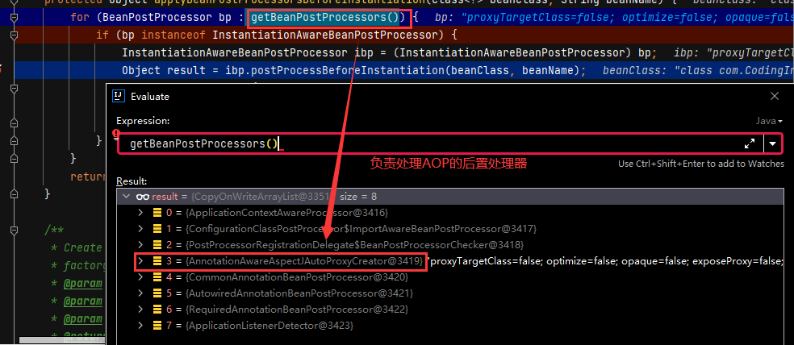

# 负责AOP的后置处理器

## 准备工作

配置gradle:

```groovy
dependencies {
    testImplementation 'junit:junit:4.12'
    compile(project(":spring-context"))
    compile(project(":spring-aspects"))
}
```

+ HelloService.java

```java
package com.CodingInn.code.aop;

import org.springframework.stereotype.Component;

@Component   //切面存在的话就会返回代理对象
public class HelloService {
   public HelloService() {
      System.out.println("HelloService init");
   }

   public String sayHello(String name){
      String result = "hello:" + name;
      System.out.println(result);
      int length = name.length();

      return result + "---" + length;
   }
}
```

+ LogAspect.java

```java
package com.CodingInn.code.aop;

import org.aspectj.lang.JoinPoint;
import org.aspectj.lang.annotation.*;
import org.springframework.stereotype.Component;

import java.util.Arrays;

@Component
@Aspect
public class LogAspect {

	public LogAspect() {
		System.out.println("LogAspect init.....");
	}

	@Before("execution(* com.CodingInn.code.aop.HelloService.sayHello(..))")
	public void logStart(JoinPoint joinPoint){
		String name = joinPoint.getSignature().getName();
		System.out.println("logStart()==>"+name+"...[args: " + Arrays.asList(joinPoint.getArgs()) + "]" );
	}

	@AfterReturning("execution(* com.CodingInn.code.aop.HelloService.sayHello(..))")
	public void logReturn(JoinPoint joinPoint){
		String name = joinPoint.getSignature().getName();
		System.out.println("logReturn()==>"+name+"...[args: " + Arrays.asList(joinPoint.getArgs()) + "]" );
	}

	@After("execution(* com.CodingInn.code.aop.HelloService.sayHello(..))")
	public void logAfter(JoinPoint joinPoint){
		String name = joinPoint.getSignature().getName();
		System.out.println("logAfter()==>"+name+"...[args: " + Arrays.asList(joinPoint.getArgs()) + "]" );
	}

	@AfterThrowing("execution(* com.CodingInn.code.aop.HelloService.sayHello(..))")
	public void AfterThrowing(JoinPoint joinPoint){
		String name = joinPoint.getSignature().getName();
		System.out.println("AfterThrowing()==>"+name+"...[args: " + Arrays.asList(joinPoint.getArgs()) + "]" );
	}
}

```

+ AopOpenConfig.java

```java
package com.CodingInn.code.config;

import org.springframework.context.annotation.ComponentScan;
import org.springframework.context.annotation.Configuration;
import org.springframework.context.annotation.EnableAspectJAutoProxy;

@EnableAspectJAutoProxy //开启基于注解的aop
@ComponentScan("com.CodingInn")
@Configuration
public class AopOpenConfig {
}
```

## 开始调试

入口函数:

```java
@Test
public void testAOP() {
   ApplicationContext applicationContext = new AnnotationConfigApplicationContext(AopOpenConfig.class);

   HelloService bean = applicationContext.getBean(HelloService.class);

   bean.sayHello("haha");

}
```

### AOP给容器中添加了什么组件(AnnotationAwareAspectJAutoProxyCreator后置处理器的注册)

> 分析各种功能的tips:
>
> 1.给AbstractBeanDefinition的构造器打断点,就能知道容器中有哪些bean定义信息,Spring也可能在底层直接new对象注册进去.
>
> 2.在refresh()十二大步的最后一步打断点,在debug控制台看有哪些没有见过的组件,单独分析
>
> 3.每一个功能的开启,要么写配置,要么注解,@EnableXXX开启xxx功能的注解,这个注解很重要

当引入AOP的注解@EnableAspectJAutoProxy时,会@Import(AspectJAutoProxyRegistrar.class):

```java
@Target(ElementType.TYPE)
@Retention(RetentionPolicy.RUNTIME)
@Documented
@Import(AspectJAutoProxyRegistrar.class)
public @interface EnableAspectJAutoProxy {

   boolean proxyTargetClass() default false;

   boolean exposeProxy() default false;

}
```

+ AspectJAutoProxyRegistrar.java如下

```java
/*
 * Copyright 2002-2017 the original author or authors.
 *
 * Licensed under the Apache License, Version 2.0 (the "License");
 * you may not use this file except in compliance with the License.
 * You may obtain a copy of the License at
 *
 *      https://www.apache.org/licenses/LICENSE-2.0
 *
 * Unless required by applicable law or agreed to in writing, software
 * distributed under the License is distributed on an "AS IS" BASIS,
 * WITHOUT WARRANTIES OR CONDITIONS OF ANY KIND, either express or implied.
 * See the License for the specific language governing permissions and
 * limitations under the License.
 */

package org.springframework.context.annotation;

import org.springframework.aop.config.AopConfigUtils;
import org.springframework.beans.factory.support.BeanDefinitionRegistry;
import org.springframework.core.annotation.AnnotationAttributes;
import org.springframework.core.type.AnnotationMetadata;

/**
 * Registers an {@link org.springframework.aop.aspectj.annotation.AnnotationAwareAspectJAutoProxyCreator
 * AnnotationAwareAspectJAutoProxyCreator} against the current {@link BeanDefinitionRegistry}
 * as appropriate based on a given @{@link EnableAspectJAutoProxy} annotation.
 *
 * @author Chris Beams
 * @author Juergen Hoeller
 * @since 3.1
 * @see EnableAspectJAutoProxy
 */
class AspectJAutoProxyRegistrar implements ImportBeanDefinitionRegistrar {

   /**
    * Register, escalate, and configure the AspectJ auto proxy creator based on the value
    * of the @{@link EnableAspectJAutoProxy#proxyTargetClass()} attribute on the importing
    * {@code @Configuration} class.
    */
   @Override
   public void registerBeanDefinitions(
         AnnotationMetadata importingClassMetadata, BeanDefinitionRegistry registry) {

      AopConfigUtils.registerAspectJAnnotationAutoProxyCreatorIfNecessary(registry);//注册BeanDefinitionRegistry

      AnnotationAttributes enableAspectJAutoProxy =
            AnnotationConfigUtils.attributesFor(importingClassMetadata, EnableAspectJAutoProxy.class);
      if (enableAspectJAutoProxy != null) {
         if (enableAspectJAutoProxy.getBoolean("proxyTargetClass")) {
            AopConfigUtils.forceAutoProxyCreatorToUseClassProxying(registry);
         }
         if (enableAspectJAutoProxy.getBoolean("exposeProxy")) {
            AopConfigUtils.forceAutoProxyCreatorToExposeProxy(registry);
         }
      }
   }

}
```

注册AspectJAutoProxyRegistrar的流程如下:

+ AnnotationConfigApplicationContext.java

```java
public AnnotationConfigApplicationContext(Class<?>... annotatedClasses) {
   this();
   register(annotatedClasses);
   refresh();//刷新容器
}
```

+ AbstractApplicationContext.java

```java
@Override
public void refresh() throws BeansException, IllegalStateException {
   synchronized (this.startupShutdownMonitor) {
      //第一步：容器刷新前的准备，设置上下文状态，获取属性，验证必要的属性等
      prepareRefresh();

      //第二步：获取新的beanFactory，销毁原有beanFactory、为每个bean生成BeanDefinition等,注意此处是获取新的，销毁旧的，这就是刷新的意义(Spring容器里通过BeanDefinition对象来表示Bean，BeanDefinition描述了Bean的配置信息。)
      // BeanFactory第一次开始创建的时候,有xml解析逻辑,如果是自动注解版,则只能获取到@Configuration标注的类,在invokeBeanFactoryPostProcessors(...)函数中会通过后置处理器解析配置类,如果该配置类@ComponentScan("com.CodingInn"),会进行扫描,将相应路径下的类注册到BeanDefinition中
      // 创建容器对象 ,获得的是DefaultListableBeanFactory,也是创建BeanFactory的过程
      ConfigurableListableBeanFactory beanFactory = obtainFreshBeanFactory();

      //第三步：配置标准的beanFactory，设置ClassLoader，设置EL表达式解析器等
      //配置了一些后置处理器(监听,xxxAware功能的后置处理器),所有的PostProcessor都不会放在单例池,放在了beanPostProcessor池里。
      prepareBeanFactory(beanFactory);

      try {
         //第四步：在所有的beanDenifition加载完成之后，bean实例化之前执行。比如在beanfactory加载完成所有的bean后，想修改其中某个bean的定义，或者对beanFactory做一些其他的配置，就可以在子类中对beanFactory进行后置处理。
         postProcessBeanFactory(beanFactory);

         ////第五步：实例化并调用所有注册的beanFactory后置处理器（实现接口BeanFactoryPostProcessor的bean）
         // 工厂增强，有工厂的后置处理逻辑，配置类会在此解析
         invokeBeanFactoryPostProcessors(beanFactory);

         //第六步：实例化和注册beanFactory中扩展了BeanPostProcessor的bean。
         //例如： AutowiredAnnotationBeanPostProcessor(处理被@Autowired注解修饰的bean并注入)
         //RequiredAnnotationBeanPostProcessor(处理被@Required注解修饰的方法)
         //CommonAnnotationBeanPostProcessor(处理@PreDestroy、@PostConstruct、@Resource等多个注解的作用)等。
         registerBeanPostProcessors(beanFactory);

         //第七步：初始化国际化工具类MessageSource
         initMessageSource();

         //第八步：初始化应用事件广播器。这是观察者模式的典型应用。我们知道观察者模式由主题Subject和Observer组成。广播器相当于主题Subject，其包含多个监听器。当主题发生变化时会通知所有的监听器。初始化应用消息广播器，并放入"ApplicationEventMulticaster" Bean中
         initApplicationEventMulticaster();

         //第九步：这个方法在AnnotationApplicationContex上下文中没有实现，留给子类来初始化其他的Bean，是个模板方法，在容器刷新的时候可以自定义逻辑（子类自己去实现逻辑），不同的Spring容器做不同的事情
         onRefresh();

         //第十步：注册监听器，并且广播early application events,也就是早期的事件
         registerListeners();

         //第十一步：初始化剩下的单例（非懒加载的单例类）（并invoke BeanPostProcessors）
         //实例化所有剩余的（非懒加载）单例Bean。（也就是我们自己定义的那些Bean）
         //比如invokeBeanFactoryPostProcessors方法中根据各种注解解析出来的类，在这个时候都会被初始化，扫描的@Bean之类的，
         //实例化的过程各种BeanPostProcessor开始起作用
         // 完成BeanFactory的初始化,(在该步骤根据BeanDefinition创建bean对象，这步之后工厂里面所有的组件都初始化好了)
         finishBeanFactoryInitialization(beanFactory);

         //第十二步：完成刷新过程，通知生命周期处理器lifecycleProcessor完成刷新过程，同时发出ContextRefreshEvent通知别人
         //refresh做完之后需要做的其他事情
         //清除上下文资源缓存（如扫描中的ASM元数据）
         //初始化上下文的生命周期处理器，并刷新（找出Spring容器中实现了Lifecycle接口的bean并执行start()方法）。
         //发布ContextRefreshedEvent事件告知对应的ApplicationListener进行响应的操作
         finishRefresh();
      }

      catch (BeansException ex) {
         if (logger.isWarnEnabled()) {
            logger.warn("Exception encountered during context initialization - " +
                  "cancelling refresh attempt: " + ex);
         }

         // Destroy already created singletons to avoid dangling resources.
         destroyBeans();

         // Reset 'active' flag.
         cancelRefresh(ex);

         // Propagate exception to caller.
         throw ex;
      }

      finally {
         // Reset common introspection caches in Spring's core, since we
         // might not ever need metadata for singleton beans anymore...
         resetCommonCaches();
      }
   }
}


protected void invokeBeanFactoryPostProcessors(ConfigurableListableBeanFactory beanFactory) {
		PostProcessorRegistrationDelegate.invokeBeanFactoryPostProcessors(beanFactory, getBeanFactoryPostProcessors());//执行所有的工厂后置增强器

		...
	}
```

+ PostProcessorRegistrationDelegate.java

```java
public static void invokeBeanFactoryPostProcessors(
      ConfigurableListableBeanFactory beanFactory, List<BeanFactoryPostProcessor> beanFactoryPostProcessors) {

   // Invoke BeanDefinitionRegistryPostProcessors first, if any.
   Set<String> processedBeans = new HashSet<>();

   if (beanFactory instanceof BeanDefinitionRegistry) {
      BeanDefinitionRegistry registry = (BeanDefinitionRegistry) beanFactory;
      List<BeanFactoryPostProcessor> regularPostProcessors = new ArrayList<>();
      List<BeanDefinitionRegistryPostProcessor> registryProcessors = new ArrayList<>();

      for (BeanFactoryPostProcessor postProcessor : beanFactoryPostProcessors) {
         if (postProcessor instanceof BeanDefinitionRegistryPostProcessor) {
            BeanDefinitionRegistryPostProcessor registryProcessor =
                  (BeanDefinitionRegistryPostProcessor) postProcessor;
            registryProcessor.postProcessBeanDefinitionRegistry(registry);
            registryProcessors.add(registryProcessor);
         }
         else {
            regularPostProcessors.add(postProcessor);
         }
      }

      // Do not initialize FactoryBeans here: We need to leave all regular beans
      // uninitialized to let the bean factory post-processors apply to them!
      // Separate between BeanDefinitionRegistryPostProcessors that implement
      // PriorityOrdered, Ordered, and the rest.
      List<BeanDefinitionRegistryPostProcessor> currentRegistryProcessors = new ArrayList<>();

      // First, invoke the BeanDefinitionRegistryPostProcessors that implement PriorityOrdered.
      String[] postProcessorNames =
            beanFactory.getBeanNamesForType(BeanDefinitionRegistryPostProcessor.class, true, false);
      for (String ppName : postProcessorNames) {
         if (beanFactory.isTypeMatch(ppName, PriorityOrdered.class)) {
            currentRegistryProcessors.add(beanFactory.getBean(ppName, BeanDefinitionRegistryPostProcessor.class));
            processedBeans.add(ppName);
         }
      }
      sortPostProcessors(currentRegistryProcessors, beanFactory);
      registryProcessors.addAll(currentRegistryProcessors);
      invokeBeanDefinitionRegistryPostProcessors(currentRegistryProcessors, registry);//此处对应的currentRegistryProcessors是ConfigurationClassPostProcessor
      currentRegistryProcessors.clear();

      // Next, invoke the BeanDefinitionRegistryPostProcessors that implement Ordered.
      ...

      // Finally, invoke all other BeanDefinitionRegistryPostProcessors until no further ones appear.
     ...

      // Now, invoke the postProcessBeanFactory callback of all processors handled so far.
     ...
   }

   else {
    ...
   }

  ...
}


private static void invokeBeanDefinitionRegistryPostProcessors(
			Collection<? extends BeanDefinitionRegistryPostProcessor> postProcessors, BeanDefinitionRegistry registry) {

		for (BeanDefinitionRegistryPostProcessor postProcessor : postProcessors) {
			postProcessor.postProcessBeanDefinitionRegistry(registry);
		}
	}

```

+ ConfigurationClassPostProcessor.java

```java
public void postProcessBeanDefinitionRegistry(BeanDefinitionRegistry registry) {
		int registryId = System.identityHashCode(registry);
		if (this.registriesPostProcessed.contains(registryId)) {
			throw new IllegalStateException(
					"postProcessBeanDefinitionRegistry already called on this post-processor against " + registry);
		}
		if (this.factoriesPostProcessed.contains(registryId)) {
			throw new IllegalStateException(
					"postProcessBeanFactory already called on this post-processor against " + registry);
		}
		this.registriesPostProcessed.add(registryId);

		processConfigBeanDefinitions(registry);
	}


public void processConfigBeanDefinitions(BeanDefinitionRegistry registry) {
		List<BeanDefinitionHolder> configCandidates = new ArrayList<>();
		String[] candidateNames = registry.getBeanDefinitionNames();

		for (String beanName : candidateNames) {
			BeanDefinition beanDef = registry.getBeanDefinition(beanName);
			if (ConfigurationClassUtils.isFullConfigurationClass(beanDef) ||
					ConfigurationClassUtils.isLiteConfigurationClass(beanDef)) {
				if (logger.isDebugEnabled()) {
					logger.debug("Bean definition has already been processed as a configuration class: " + beanDef);
				}
			}
			else if (ConfigurationClassUtils.checkConfigurationClassCandidate(beanDef, this.metadataReaderFactory)) {
				configCandidates.add(new BeanDefinitionHolder(beanDef, beanName));
			}
		}

		// Return immediately if no @Configuration classes were found
		if (configCandidates.isEmpty()) {
			return;
		}

		// Sort by previously determined @Order value, if applicable
		configCandidates.sort((bd1, bd2) -> {
			int i1 = ConfigurationClassUtils.getOrder(bd1.getBeanDefinition());
			int i2 = ConfigurationClassUtils.getOrder(bd2.getBeanDefinition());
			return Integer.compare(i1, i2);
		});

		// Detect any custom bean name generation strategy supplied through the enclosing application context
		SingletonBeanRegistry sbr = null;
		if (registry instanceof SingletonBeanRegistry) {
			sbr = (SingletonBeanRegistry) registry;
			if (!this.localBeanNameGeneratorSet) {
				BeanNameGenerator generator = (BeanNameGenerator) sbr.getSingleton(CONFIGURATION_BEAN_NAME_GENERATOR);
				if (generator != null) {
					this.componentScanBeanNameGenerator = generator;
					this.importBeanNameGenerator = generator;
				}
			}
		}

		if (this.environment == null) {
			this.environment = new StandardEnvironment();
		}

		// Parse each @Configuration class
		ConfigurationClassParser parser = new ConfigurationClassParser(
				this.metadataReaderFactory, this.problemReporter, this.environment,
				this.resourceLoader, this.componentScanBeanNameGenerator, registry);

		Set<BeanDefinitionHolder> candidates = new LinkedHashSet<>(configCandidates);
		Set<ConfigurationClass> alreadyParsed = new HashSet<>(configCandidates.size());
		do {
			parser.parse(candidates);
			parser.validate();

			Set<ConfigurationClass> configClasses = new LinkedHashSet<>(parser.getConfigurationClasses());
			configClasses.removeAll(alreadyParsed);

			// Read the model and create bean definitions based on its content
			if (this.reader == null) {
				this.reader = new ConfigurationClassBeanDefinitionReader(
						registry, this.sourceExtractor, this.resourceLoader, this.environment,
						this.importBeanNameGenerator, parser.getImportRegistry());
			}
			this.reader.loadBeanDefinitions(configClasses);//此处的configClasses如下图所示,在该步骤中可以处理@Import对应的类的注册
			alreadyParsed.addAll(configClasses);

			...
		}
		while (!candidates.isEmpty());

		...
	}

```


+ ConfigurationClassBeanDefinitionReader.java

```java
public void loadBeanDefinitions(Set<ConfigurationClass> configurationModel) {
   TrackedConditionEvaluator trackedConditionEvaluator = new TrackedConditionEvaluator();
   for (ConfigurationClass configClass : configurationModel) {
      loadBeanDefinitionsForConfigurationClass(configClass, trackedConditionEvaluator);
   }
}


//此处configClass对应AopOpenConfig
private void loadBeanDefinitionsForConfigurationClass(
			ConfigurationClass configClass, TrackedConditionEvaluator trackedConditionEvaluator) {

		if (trackedConditionEvaluator.shouldSkip(configClass)) {
			String beanName = configClass.getBeanName();
			if (StringUtils.hasLength(beanName) && this.registry.containsBeanDefinition(beanName)) {
				this.registry.removeBeanDefinition(beanName);
			}
			this.importRegistry.removeImportingClass(configClass.getMetadata().getClassName());
			return;
		}

		if (configClass.isImported()) {
			registerBeanDefinitionForImportedConfigurationClass(configClass);
		}
		for (BeanMethod beanMethod : configClass.getBeanMethods()) {
			loadBeanDefinitionsForBeanMethod(beanMethod);
		}

    	//@ImportResource的处理
		loadBeanDefinitionsFromImportedResources(configClass.getImportedResources());
    	//@Import处理
		loadBeanDefinitionsFromRegistrars(configClass.getImportBeanDefinitionRegistrars());//此处configClass.getImportBeanDefinitionRegistrars()对应的是AspectJAutoProxyRegistrar
	}


	private void loadBeanDefinitionsFromRegistrars(Map<ImportBeanDefinitionRegistrar, AnnotationMetadata> registrars) {
		registrars.forEach((registrar, metadata) ->
				registrar.registerBeanDefinitions(metadata, this.registry));
	}

```

+ AspectJAutoProxyRegistrar.java

```java
@Override
public void registerBeanDefinitions(
      AnnotationMetadata importingClassMetadata, BeanDefinitionRegistry registry) {

   AopConfigUtils.registerAspectJAnnotationAutoProxyCreatorIfNecessary(registry);

   ...
}
```

+ AopConfigUtils.java

```java
public static BeanDefinition registerAspectJAnnotationAutoProxyCreatorIfNecessary(BeanDefinitionRegistry registry) {
   return registerAspectJAnnotationAutoProxyCreatorIfNecessary(registry, null);
}


public static BeanDefinition registerAspectJAnnotationAutoProxyCreatorIfNecessary(
			BeanDefinitionRegistry registry, @Nullable Object source) {

		return registerOrEscalateApcAsRequired(AnnotationAwareAspectJAutoProxyCreator.class, registry, source);//AnnotationAwareAspectJAutoProxyCreator是bean的后置处理器,相关UML如下图:
	}


private static BeanDefinition registerOrEscalateApcAsRequired(
			Class<?> cls, BeanDefinitionRegistry registry, @Nullable Object source) {

		Assert.notNull(registry, "BeanDefinitionRegistry must not be null");

    	//其中AUTO_PROXY_CREATOR_BEAN_NAME ="org.springframework.aop.config.internalAutoProxyCreator"
		if (registry.containsBeanDefinition(AUTO_PROXY_CREATOR_BEAN_NAME)) {
			BeanDefinition apcDefinition = registry.getBeanDefinition(AUTO_PROXY_CREATOR_BEAN_NAME);
			if (!cls.getName().equals(apcDefinition.getBeanClassName())) {
				int currentPriority = findPriorityForClass(apcDefinition.getBeanClassName());
				int requiredPriority = findPriorityForClass(cls);
				if (currentPriority < requiredPriority) {
					apcDefinition.setBeanClassName(cls.getName());
				}
			}
			return null;
		}

		RootBeanDefinition beanDefinition = new RootBeanDefinition(cls);
		beanDefinition.setSource(source);
		beanDefinition.getPropertyValues().add("order", Ordered.HIGHEST_PRECEDENCE);
		beanDefinition.setRole(BeanDefinition.ROLE_INFRASTRUCTURE);
		registry.registerBeanDefinition(AUTO_PROXY_CREATOR_BEAN_NAME, beanDefinition);
		return beanDefinition;
	}
```


### AOP的运行流程

#### initBeanFactory的执行时机

+ AbstractApplicationContext.java

```java
@Override
public void refresh() throws BeansException, IllegalStateException {
   synchronized (this.startupShutdownMonitor) {
      //第一步：容器刷新前的准备，设置上下文状态，获取属性，验证必要的属性等
      prepareRefresh();

      //第二步：获取新的beanFactory，销毁原有beanFactory、为每个bean生成BeanDefinition等,注意此处是获取新的，销毁旧的，这就是刷新的意义(Spring容器里通过BeanDefinition对象来表示Bean，BeanDefinition描述了Bean的配置信息。)
      // BeanFactory第一次开始创建的时候,有xml解析逻辑,如果是自动注解版,则只能获取到@Configuration标注的类,在invokeBeanFactoryPostProcessors(...)函数中会通过后置处理器解析配置类,如果该配置类@ComponentScan("com.CodingInn"),会进行扫描,将相应路径下的类注册到BeanDefinition中
      // 创建容器对象 ,获得的是DefaultListableBeanFactory,也是创建BeanFactory的过程
      ConfigurableListableBeanFactory beanFactory = obtainFreshBeanFactory();

      //第三步：配置标准的beanFactory，设置ClassLoader，设置EL表达式解析器等
      //配置了一些后置处理器(监听,xxxAware功能的后置处理器),所有的PostProcessor都不会放在单例池,放在了beanPostProcessor池里。
      prepareBeanFactory(beanFactory);

      try {
         //第四步：在所有的beanDenifition加载完成之后，bean实例化之前执行。比如在beanfactory加载完成所有的bean后，想修改其中某个bean的定义，或者对beanFactory做一些其他的配置，就可以在子类中对beanFactory进行后置处理。
         postProcessBeanFactory(beanFactory);

         ////第五步：实例化并调用所有注册的beanFactory后置处理器（实现接口BeanFactoryPostProcessor的bean）
         // 工厂增强，有工厂的后置处理逻辑，配置类会在此解析
         invokeBeanFactoryPostProcessors(beanFactory);

         //第六步：完成创建所有的BeanPostProcessor
         //例如： AutowiredAnnotationBeanPostProcessor(处理被@Autowired注解修饰的bean并注入)
         //RequiredAnnotationBeanPostProcessor(处理被@Required注解修饰的方法)
         //CommonAnnotationBeanPostProcessor(处理@PreDestroy、@PostConstruct、@Resource等多个注解的作用)等。还有处理AOP等beanPostProcessor...
         registerBeanPostProcessors(beanFactory);

         //第七步：初始化国际化工具类MessageSource
         initMessageSource();

         //第八步：初始化应用事件广播器。这是观察者模式的典型应用。我们知道观察者模式由主题Subject和Observer组成。广播器相当于主题Subject，其包含多个监听器。当主题发生变化时会通知所有的监听器。初始化应用消息广播器，并放入"ApplicationEventMulticaster" Bean中
         initApplicationEventMulticaster();

         //第九步：这个方法在AnnotationApplicationContex上下文中没有实现，留给子类来初始化其他的Bean，是个模板方法，在容器刷新的时候可以自定义逻辑（子类自己去实现逻辑），不同的Spring容器做不同的事情
         onRefresh();

         //第十步：注册监听器，并且广播early application events,也就是早期的事件
         registerListeners();

         //第十一步：初始化剩下的单例（非懒加载的单例类）（并invoke BeanPostProcessors）
         //实例化所有剩余的（非懒加载）单例Bean。（也就是我们自己定义的那些Bean）
         //比如invokeBeanFactoryPostProcessors方法中根据各种注解解析出来的类，在这个时候都会被初始化，
         //实例化的过程中各种BeanPostProcessor开始起作用
         // 完成BeanFactory的初始化,(在该步骤根据BeanDefinition创建bean对象，这步之后工厂里面所有的组件都初始化好了)
         finishBeanFactoryInitialization(beanFactory);

         //第十二步：完成刷新过程，通知生命周期处理器lifecycleProcessor完成刷新过程，同时发出ContextRefreshEvent通知别人
         //refresh做完之后需要做的其他事情
         //清除上下文资源缓存（如扫描中的ASM元数据）
         //初始化上下文的生命周期处理器，并刷新（找出Spring容器中实现了Lifecycle接口的bean并执行start()方法）。
         //发布ContextRefreshedEvent事件告知对应的ApplicationListener进行响应的操作
         finishRefresh();
      }

      catch (BeansException ex) {
         if (logger.isWarnEnabled()) {
            logger.warn("Exception encountered during context initialization - " +
                  "cancelling refresh attempt: " + ex);
         }

         // Destroy already created singletons to avoid dangling resources.
         destroyBeans();

         // Reset 'active' flag.
         cancelRefresh(ex);

         // Propagate exception to caller.
         throw ex;
      }

      finally {
         // Reset common introspection caches in Spring's core, since we
         // might not ever need metadata for singleton beans anymore...
         resetCommonCaches();
      }
   }
}


protected void registerBeanPostProcessors(ConfigurableListableBeanFactory beanFactory) {
		PostProcessorRegistrationDelegate.registerBeanPostProcessors(beanFactory, this);
	}


```

+ PostProcessorRegistrationDelegate.java

```java
public static void registerBeanPostProcessors(
      ConfigurableListableBeanFactory beanFactory, AbstractApplicationContext applicationContext) {

   String[] postProcessorNames = beanFactory.getBeanNamesForType(BeanPostProcessor.class, true, false); //获取所有的Bean后置处理器名

   // Register BeanPostProcessorChecker that logs an info message when
   // a bean is created during BeanPostProcessor instantiation, i.e. when
   // a bean is not eligible for getting processed by all BeanPostProcessors.
   int beanProcessorTargetCount = beanFactory.getBeanPostProcessorCount() + 1 + postProcessorNames.length;
   beanFactory.addBeanPostProcessor(new BeanPostProcessorChecker(beanFactory, beanProcessorTargetCount));

   // Separate between BeanPostProcessors that implement PriorityOrdered,
   // Ordered, and the rest.
  ...

   // First, register the BeanPostProcessors that implement PriorityOrdered.
   ...

   // Next, register the BeanPostProcessors that implement Ordered.
   List<BeanPostProcessor> orderedPostProcessors = new ArrayList<>();
   for (String ppName : orderedPostProcessorNames) {
      BeanPostProcessor pp = beanFactory.getBean(ppName, BeanPostProcessor.class);//此处AOPD对应的ppName是org.springframework.aop.config.internalAutoProxyCreator,与其对应的Object是AnnotationAwareAspectJAutoProxyCreator
      orderedPostProcessors.add(pp);
      if (pp instanceof MergedBeanDefinitionPostProcessor) {
         internalPostProcessors.add(pp);
      }
   }
   sortPostProcessors(orderedPostProcessors, beanFactory);
   registerBeanPostProcessors(beanFactory, orderedPostProcessors);

   // Now, register all regular BeanPostProcessors.
   ...
}
```

+ AbstractBeanFactory.java

```java
@Override
public <T> T getBean(String name, @Nullable Class<T> requiredType) throws BeansException {
   return doGetBean(name, requiredType, null, false);
}


protected <T> T doGetBean(
			String name, @Nullable Class<T> requiredType, @Nullable Object[] args, boolean typeCheckOnly)
			throws BeansException {

		String beanName = transformedBeanName(name);//提取对应的beanName
		Object bean;

		// Eagerly check singleton cache for manually registered singletons.尝试从缓存获取或者singletonFactories中的ObjectFactory中获取
		////检查缓存中是否存在,寻找的是DefaultSingletonBeanRegistry里的singletonObjects map是否含有对应的Object
		//    	  //DefaultListableBeanFactory是DefaultSingletonBeanRegistry的子类,DefaultSingletonBeanRegistry类中存放了很多map,用于存储bean的信息,IOC容器的单例池存放的地方
		Object sharedInstance = getSingleton(beanName);
		if (sharedInstance != null && args == null) {
			if (logger.isDebugEnabled()) {
				if (isSingletonCurrentlyInCreation(beanName)) {
					logger.debug("Returning eagerly cached instance of singleton bean '" + beanName +
							"' that is not fully initialized yet - a consequence of a circular reference");
				}
				else {
					logger.debug("Returning cached instance of singleton bean '" + beanName + "'");
				}
			}
			bean = getObjectForBeanInstance(sharedInstance, name, beanName, null);
		}

		else {//默认第一次获取组件都会进入此环节
			...

			try {
				RootBeanDefinition mbd = getMergedLocalBeanDefinition(beanName);
				checkMergedBeanDefinition(mbd, beanName, args);

				// Guarantee initialization of beans that the current bean depends on.
				...

				// Create bean instance.创建bean的实例
				if (mbd.isSingleton()) {
					sharedInstance = getSingleton(beanName, () -> {
						try {
							return createBean(beanName, mbd, args); //创建bean对象的实例
						}
						catch (BeansException ex) {
							// Explicitly remove instance from singleton cache: It might have been put there
							// eagerly by the creation process, to allow for circular reference resolution.
							// Also remove any beans that received a temporary reference to the bean.
							destroySingleton(beanName);
							throw ex;
						}
					});
					bean = getObjectForBeanInstance(sharedInstance, name, beanName, mbd);
				}

				else if (mbd.isPrototype()) {
					...
				}

				else {
					...
			}
			catch (BeansException ex) {
				...
			}
		}

		...
		return (T) bean;
	}
```

+ DefaultSingletonBeanFactory.java

```java
public Object getSingleton(String beanName, ObjectFactory<?> singletonFactory) {
   Assert.notNull(beanName, "Bean name must not be null");
   synchronized (this.singletonObjects) {
      Object singletonObject = this.singletonObjects.get(beanName);
      if (singletonObject == null) {
         if (this.singletonsCurrentlyInDestruction) {
            throw new BeanCreationNotAllowedException(beanName,
                  "Singleton bean creation not allowed while singletons of this factory are in destruction " +
                  "(Do not request a bean from a BeanFactory in a destroy method implementation!)");
         }
         if (logger.isDebugEnabled()) {
            logger.debug("Creating shared instance of singleton bean '" + beanName + "'");
         }
         beforeSingletonCreation(beanName);
         boolean newSingleton = false;
         boolean recordSuppressedExceptions = (this.suppressedExceptions == null);
         if (recordSuppressedExceptions) {
            this.suppressedExceptions = new LinkedHashSet<>();
         }
         try {
            singletonObject = singletonFactory.getObject();////ObjectFactory提供Bean实例,此处的getObect是上一步sharedInstance = getSingleton(...)的lambda表达式 createBean(beanName, mbd, args)
            newSingleton = true;
         }
         catch (IllegalStateException ex) {
            ..
         }
       ...
      return singletonObject;
   }
}
```

+ AbstractAutowireCapableBeanFactory.java

```java
@Override
protected Object createBean(String beanName, RootBeanDefinition mbd, @Nullable Object[] args)
      throws BeanCreationException {

   if (logger.isDebugEnabled()) {
      logger.debug("Creating instance of bean '" + beanName + "'");
   }
   RootBeanDefinition mbdToUse = mbd;

   // Make sure bean class is actually resolved at this point, and
   // clone the bean definition in case of a dynamically resolved Class
   // which cannot be stored in the shared merged bean definition.
   Class<?> resolvedClass = resolveBeanClass(mbd, beanName);
   if (resolvedClass != null && !mbd.hasBeanClass() && mbd.getBeanClassName() != null) {
      mbdToUse = new RootBeanDefinition(mbd);
      mbdToUse.setBeanClass(resolvedClass);
   }

   // Prepare method overrides.
   try {
      mbdToUse.prepareMethodOverrides();
   }
   catch (BeanDefinitionValidationException ex) {
      throw new BeanDefinitionStoreException(mbdToUse.getResourceDescription(),
            beanName, "Validation of method overrides failed", ex);
   }

   try {
      // 提前给一个机会返回相应的代理对象。Give BeanPostProcessors a chance to return a proxy instead of the target bean instance.
      Object bean = resolveBeforeInstantiation(beanName, mbdToUse);
      if (bean != null) {
         return bean;
      }
   }
   catch (Throwable ex) {
      throw new BeanCreationException(mbdToUse.getResourceDescription(), beanName,
            "BeanPostProcessor before instantiation of bean failed", ex);
   }

   try {
      Object beanInstance = doCreateBean(beanName, mbdToUse, args);
    ...
      return beanInstance;
   }
   catch (BeanCreationException | ImplicitlyAppearedSingletonException ex) {
    ...
   }
   catch (Throwable ex) {
     ...
   }
}
```

+ AbstractAutowireCapableBeanFactory.java

```java
protected Object doCreateBean(String beanName, RootBeanDefinition mbd, @Nullable Object[] args)
         throws BeanCreationException {

      // Instantiate the bean.
      BeanWrapper instanceWrapper = null;
      if (mbd.isSingleton()) {
         instanceWrapper = this.factoryBeanInstanceCache.remove(beanName);
      }
      if (instanceWrapper == null) {
         instanceWrapper = createBeanInstance(beanName, mbd, args);//创建bean实例,,默认使用无参构造器
      }
      Object bean = instanceWrapper.getWrappedInstance();
      Class<?> beanType = instanceWrapper.getWrappedClass();
      if (beanType != NullBean.class) {
         mbd.resolvedTargetType = beanType;
      }

      // Allow post-processors to modify the merged bean definition.
      synchronized (mbd.postProcessingLock) {
         if (!mbd.postProcessed) {
            try {
               applyMergedBeanDefinitionPostProcessors(mbd, beanType, beanName);
            }
            catch (Throwable ex) {
               throw new BeanCreationException(mbd.getResourceDescription(), beanName,
                     "Post-processing of merged bean definition failed", ex);
            }
            mbd.postProcessed = true;
         }
      }

      // Eagerly cache singletons to be able to resolve circular references
      // even when triggered by lifecycle interfaces like BeanFactoryAware.
      boolean earlySingletonExposure = (mbd.isSingleton() && this.allowCircularReferences &&
            isSingletonCurrentlyInCreation(beanName));
      if (earlySingletonExposure) {
         if (logger.isDebugEnabled()) {
            logger.debug("Eagerly caching bean '" + beanName +
                  "' to allow for resolving potential circular references");
         }
         addSingletonFactory(beanName, () -> getEarlyBeanReference(beanName, mbd, bean));
      }

      // Initialize the bean instance.
      Object exposedObject = bean;//此处的exposedObject是AnnotationAwareAspectJAutoProxyCreator
      try {
         populateBean(beanName, mbd, instanceWrapper);//先给bean中的属性赋值
         exposedObject = initializeBean(beanName, exposedObject, mbd);
      }
      ...
      }

     ...

     ...

      return exposedObject;
   }


protected Object initializeBean(String beanName, Object bean, @Nullable RootBeanDefinition mbd) {
		if (System.getSecurityManager() != null) {
			AccessController.doPrivileged((PrivilegedAction<Object>) () -> {
				invokeAwareMethods(beanName, bean);
				return null;
			}, getAccessControlContext());
		}
		else {
			invokeAwareMethods(beanName, bean);
		}

		....

		return wrappedBean;
	}


private void invokeAwareMethods(String beanName, Object bean) {
		if (bean instanceof Aware) {
			if (bean instanceof BeanNameAware) {
				((BeanNameAware) bean).setBeanName(beanName);
			}
			if (bean instanceof BeanClassLoaderAware) {
				ClassLoader bcl = getBeanClassLoader();
				if (bcl != null) {
					((BeanClassLoaderAware) bean).setBeanClassLoader(bcl);
				}
			}
			if (bean instanceof BeanFactoryAware) {
				((BeanFactoryAware) bean).setBeanFactory(AbstractAutowireCapableBeanFactory.this);
			}
		}
	}

```

+ AbstractAdvisorAutoProxyCreator.java

```java

public void setBeanFactory(BeanFactory beanFactory) {
		super.setBeanFactory(beanFactory);
		if (!(beanFactory instanceof ConfigurableListableBeanFactory)) {
			throw new IllegalArgumentException(
					"AdvisorAutoProxyCreator requires a ConfigurableListableBeanFactory: " + beanFactory);
		}
		initBeanFactory((ConfigurableListableBeanFactory) beanFactory);
	}
```

+ AnnotationAwareAspectJAutoProxyCreator.java

```java
@Override
protected void initBeanFactory(ConfigurableListableBeanFactory beanFactory) {
   super.initBeanFactory(beanFactory);
   if (this.aspectJAdvisorFactory == null) {
      this.aspectJAdvisorFactory = new ReflectiveAspectJAdvisorFactory(beanFactory);
   }
   this.aspectJAdvisorsBuilder =
         new BeanFactoryAspectJAdvisorsBuilderAdapter(beanFactory, this.aspectJAdvisorFactory);
    // this.aspectJAdvisorFactory和aspectJAdvisorsBuilder负责保存和产生功能增强器
}
```

#### isInfrastructureClass() (用于判断某一个类是否是切面)的执行时机之createBean的resolveBeforeInstantiation(beanName, mbdToUse)函数

resolveBeforeInstantiation(beanName, mbdToUse)函数在doCreateBean,提前给一个机会返回相应的代理对象,如果某一个类是切面类,则不会调用doCreateBean

+ AbstractApplicationContext.java

```java
@Override
public void refresh() throws BeansException, IllegalStateException {
   synchronized (this.startupShutdownMonitor) {
      //第一步：容器刷新前的准备，设置上下文状态，获取属性，验证必要的属性等
      prepareRefresh();

      //第二步：获取新的beanFactory，销毁原有beanFactory、为每个bean生成BeanDefinition等,注意此处是获取新的，销毁旧的，这就是刷新的意义(Spring容器里通过BeanDefinition对象来表示Bean，BeanDefinition描述了Bean的配置信息。)
      // BeanFactory第一次开始创建的时候,有xml解析逻辑,如果是自动注解版,则只能获取到@Configuration标注的类,在invokeBeanFactoryPostProcessors(...)函数中会通过后置处理器解析配置类,如果该配置类@ComponentScan("com.CodingInn"),会进行扫描,将相应路径下的类注册到BeanDefinition中
      // 创建容器对象 ,获得的是DefaultListableBeanFactory,也是创建BeanFactory的过程
      ConfigurableListableBeanFactory beanFactory = obtainFreshBeanFactory();

      //第三步：配置标准的beanFactory，设置ClassLoader，设置EL表达式解析器等
      //配置了一些后置处理器(监听,xxxAware功能的后置处理器),所有的PostProcessor都不会放在单例池,放在了beanPostProcessor池里。
      prepareBeanFactory(beanFactory);

      try {
         //第四步：在所有的beanDenifition加载完成之后，bean实例化之前执行。比如在beanfactory加载完成所有的bean后，想修改其中某个bean的定义，或者对beanFactory做一些其他的配置，就可以在子类中对beanFactory进行后置处理。
         postProcessBeanFactory(beanFactory);

         ////第五步：实例化并调用所有注册的beanFactory后置处理器（实现接口BeanFactoryPostProcessor的bean）
         // 工厂增强，有工厂的后置处理逻辑，配置类会在此解析
         invokeBeanFactoryPostProcessors(beanFactory);

         //第六步：实例化和注册beanFactory中扩展了BeanPostProcessor的bean。
         //例如： AutowiredAnnotationBeanPostProcessor(处理被@Autowired注解修饰的bean并注入)
         //RequiredAnnotationBeanPostProcessor(处理被@Required注解修饰的方法)
         //CommonAnnotationBeanPostProcessor(处理@PreDestroy、@PostConstruct、@Resource等多个注解的作用)等。
         registerBeanPostProcessors(beanFactory);

         //第七步：初始化国际化工具类MessageSource
         initMessageSource();

         //第八步：初始化应用事件广播器。这是观察者模式的典型应用。我们知道观察者模式由主题Subject和Observer组成。广播器相当于主题Subject，其包含多个监听器。当主题发生变化时会通知所有的监听器。初始化应用消息广播器，并放入"ApplicationEventMulticaster" Bean中
         initApplicationEventMulticaster();

         //第九步：这个方法在AnnotationApplicationContex上下文中没有实现，留给子类来初始化其他的Bean，是个模板方法，在容器刷新的时候可以自定义逻辑（子类自己去实现逻辑），不同的Spring容器做不同的事情
         onRefresh();

         //第十步：注册监听器，并且广播early application events,也就是早期的事件
         registerListeners();

         //第十一步：初始化剩下的单例（非懒加载的单例类）（并invoke BeanPostProcessors）
         //实例化所有剩余的（非懒加载）单例Bean。（也就是我们自己定义的那些Bean）
         //比如invokeBeanFactoryPostProcessors方法中根据各种注解解析出来的类，在这个时候都会被初始化，扫描的@Bean之类的，
         //实例化的过程各种BeanPostProcessor开始起作用
         // 完成BeanFactory的初始化,(在该步骤根据BeanDefinition创建bean对象，这步之后工厂里面所有的组件都初始化好了)
         finishBeanFactoryInitialization(beanFactory);

         //第十二步：完成刷新过程，通知生命周期处理器lifecycleProcessor完成刷新过程，同时发出ContextRefreshEvent通知别人
         //refresh做完之后需要做的其他事情
         //清除上下文资源缓存（如扫描中的ASM元数据）
         //初始化上下文的生命周期处理器，并刷新（找出Spring容器中实现了Lifecycle接口的bean并执行start()方法）。
         //发布ContextRefreshedEvent事件告知对应的ApplicationListener进行响应的操作
         finishRefresh();
      }

      catch (BeansException ex) {
         if (logger.isWarnEnabled()) {
            logger.warn("Exception encountered during context initialization - " +
                  "cancelling refresh attempt: " + ex);
         }

         // Destroy already created singletons to avoid dangling resources.
         destroyBeans();

         // Reset 'active' flag.
         cancelRefresh(ex);

         // Propagate exception to caller.
         throw ex;
      }

      finally {
         // Reset common introspection caches in Spring's core, since we
         // might not ever need metadata for singleton beans anymore...
         resetCommonCaches();
      }
   }
}


protected void finishBeanFactoryInitialization(ConfigurableListableBeanFactory beanFactory) {
		// Initialize conversion service for this context.
		if (beanFactory.containsBean(CONVERSION_SERVICE_BEAN_NAME) &&
				beanFactory.isTypeMatch(CONVERSION_SERVICE_BEAN_NAME, ConversionService.class)) {
			beanFactory.setConversionService(
					beanFactory.getBean(CONVERSION_SERVICE_BEAN_NAME, ConversionService.class));
		}

		// Register a default embedded value resolver if no bean post-processor
		// (such as a PropertyPlaceholderConfigurer bean) registered any before:
		// at this point, primarily for resolution in annotation attribute values.
		if (!beanFactory.hasEmbeddedValueResolver()) {
			beanFactory.addEmbeddedValueResolver(strVal -> getEnvironment().resolvePlaceholders(strVal));
		}

		// Initialize LoadTimeWeaverAware beans early to allow for registering their transformers early.
		String[] weaverAwareNames = beanFactory.getBeanNamesForType(LoadTimeWeaverAware.class, false, false);
		for (String weaverAwareName : weaverAwareNames) {
			getBean(weaverAwareName);
		}

		// Stop using the temporary ClassLoader for type matching.
		beanFactory.setTempClassLoader(null);

		// Allow for caching all bean definition metadata, not expecting further changes.
		beanFactory.freezeConfiguration();

		// Instantiate all remaining (non-lazy-init) singletons. 初始化所有的单实例Bean
		beanFactory.preInstantiateSingletons();
	}
```

+ DefaultListableBeanFactory.java

```java
@Override
public void preInstantiateSingletons() throws BeansException {
   if (logger.isDebugEnabled()) {
      logger.debug("Pre-instantiating singletons in " + this);
   }

   // Iterate over a copy to allow for init methods which in turn register new bean definitions.
   // While this may not be part of the regular factory bootstrap, it does otherwise work fine.
   List<String> beanNames = new ArrayList<>(this.beanDefinitionNames);

   // 创建出所有的单实例Bean。Trigger initialization of all non-lazy singleton beans...
   for (String beanName : beanNames) {
      RootBeanDefinition bd = getMergedLocalBeanDefinition(beanName);//开始解析文件的时候每一个bean标签被解析封装成一个BeanDefinition
      if (!bd.isAbstract() && bd.isSingleton() && !bd.isLazyInit()) {
         if (isFactoryBean(beanName)) {//如果是FactoryBean则执行以下逻辑
           ...
         }
         else {//非工厂bean
            getBean(beanName);//internalEventListenerProcessor
         }
      }
   }
   ...
   
 }
```

接下来会进行一系列创建internalEventListenerProcessor的过程

+ AbstractAutowireCapableBeanFactory.java

```java
@Override
protected Object createBean(String beanName, RootBeanDefinition mbd, @Nullable Object[] args)
      throws BeanCreationException {

   if (logger.isDebugEnabled()) {
      logger.debug("Creating instance of bean '" + beanName + "'");
   }
   RootBeanDefinition mbdToUse = mbd;

   // Make sure bean class is actually resolved at this point, and
   // clone the bean definition in case of a dynamically resolved Class
   // which cannot be stored in the shared merged bean definition.
   Class<?> resolvedClass = resolveBeanClass(mbd, beanName);
   if (resolvedClass != null && !mbd.hasBeanClass() && mbd.getBeanClassName() != null) {
      mbdToUse = new RootBeanDefinition(mbd);
      mbdToUse.setBeanClass(resolvedClass);
   }

   // Prepare method overrides.
   try {
      mbdToUse.prepareMethodOverrides();
   }
   catch (BeanDefinitionValidationException ex) {
      throw new BeanDefinitionStoreException(mbdToUse.getResourceDescription(),
            beanName, "Validation of method overrides failed", ex);
   }

   try {
      // 提前给一个机会返回相应的代理对象。在别人创建对象的时候就进行干预
      Object bean = resolveBeforeInstantiation(beanName, mbdToUse);
      if (bean != null) {
         return bean;
      }
   }
   catch (Throwable ex) {
    ...
   }

 ...
}


@Nullable
	protected Object resolveBeforeInstantiation(String beanName, RootBeanDefinition mbd) {
		Object bean = null;
		if (!Boolean.FALSE.equals(mbd.beforeInstantiationResolved)) {
			// Make sure bean class is actually resolved at this point.
			if (!mbd.isSynthetic() && hasInstantiationAwareBeanPostProcessors()) {
				Class<?> targetType = determineTargetType(beanName, mbd);
				if (targetType != null) {
					bean = applyBeanPostProcessorsBeforeInstantiation(targetType, beanName);
					if (bean != null) {
						bean = applyBeanPostProcessorsAfterInitialization(bean, beanName);
					}
				}
			}
			mbd.beforeInstantiationResolved = (bean != null);
		}
		return bean;
	}


@Nullable
	protected Object applyBeanPostProcessorsBeforeInstantiation(Class<?> beanClass, String beanName) {
		for (BeanPostProcessor bp : getBeanPostProcessors()) {
			if (bp instanceof InstantiationAwareBeanPostProcessor) {
				InstantiationAwareBeanPostProcessor ibp = (InstantiationAwareBeanPostProcessor) bp;
				Object result = ibp.postProcessBeforeInstantiation(beanClass, beanName);
				if (result != null) {
					return result;
				}
			}
		}
		return null;
	}
```

+ AbstractAutoProxyCreator.java

```java
public Object postProcessBeforeInstantiation(Class<?> beanClass, String beanName) throws BeansException {
   Object cacheKey = getCacheKey(beanClass, beanName);

   if (!StringUtils.hasLength(beanName) || !this.targetSourcedBeans.contains(beanName)) {
      if (this.advisedBeans.containsKey(cacheKey)) {
         return null;
      }
       //所有的切面类会被缓存在advisedBeans,切面类不会返回代理对象
      if (isInfrastructureClass(beanClass) || shouldSkip(beanClass, beanName)) {
         this.advisedBeans.put(cacheKey, Boolean.FALSE);
         return null;
      }
   }

   // Create proxy here if we have a custom TargetSource.
   // Suppresses unnecessary default instantiation of the target bean:
   // The TargetSource will handle target instances in a custom fashion.
   TargetSource targetSource = getCustomTargetSource(beanClass, beanName);
   if (targetSource != null) {
      if (StringUtils.hasLength(beanName)) {
         this.targetSourcedBeans.add(beanName);
      }
      Object[] specificInterceptors = getAdvicesAndAdvisorsForBean(beanClass, beanName, targetSource);
      Object proxy = createProxy(beanClass, beanName, specificInterceptors, targetSource);
      this.proxyTypes.put(cacheKey, proxy.getClass());
      return proxy;
   }

   return null;
}
```

+ AnnotationAwareAspectJAutoProxyCreator.java

```java
@Override
protected boolean isInfrastructureClass(Class<?> beanClass) {
    //判断是否是切面,如果是切面,则返回一个代理对象
   return (super.isInfrastructureClass(beanClass) ||
         (this.aspectJAdvisorFactory != null && this.aspectJAdvisorFactory.isAspect(beanClass)));
}
```

AbstractAutoProxyCreator.java中的shouldSkip(beanClass, beanName)如下:

+ AspectJAwareAdviorAutoProxyCreator.java

```java
@Override
protected boolean shouldSkip(Class<?> beanClass, String beanName) {
   // TODO: Consider optimization by caching the list of the aspect names
   List<Advisor> candidateAdvisors = findCandidateAdvisors();
   for (Advisor advisor : candidateAdvisors) {
      if (advisor instanceof AspectJPointcutAdvisor &&
            ((AspectJPointcutAdvisor) advisor).getAspectName().equals(beanName)) {
         return true;
      }
   }
   return super.shouldSkip(beanClass, beanName);
}
```

+ AnnotationAwareAspectJAutoProxyCreator.java

```java
@Override//找到候选的增强器,切面里面的方法
protected List<Advisor> findCandidateAdvisors() {
   //找到的所有 Spring advisor。
   List<Advisor> advisors = super.findCandidateAdvisors();
    //为 bean 工厂中的所有 AspectJ 的aspects构建Advisors
   if (this.aspectJAdvisorsBuilder != null) {
      advisors.addAll(this.aspectJAdvisorsBuilder.buildAspectJAdvisors());
   }
   return advisors;
}
```

+ BeanFactoryAspectJAdvisorBuilder.java

```java
public List<Advisor> buildAspectJAdvisors() {
    //容器中所有的Aspect切面类都会被保存在aspectBeanNames中,private volatile List<String> aspectBeanNames;
   List<String> aspectNames = this.aspectBeanNames;

   if (aspectNames == null) {
      synchronized (this) {
          //aspectNames就是Aspect切面类的缓存
         aspectNames = this.aspectBeanNames;
         if (aspectNames == null) {
            List<Advisor> advisors = new ArrayList<>();
            aspectNames = new ArrayList<>();
             //获取所有的bean名字
            String[] beanNames = BeanFactoryUtils.beanNamesForTypeIncludingAncestors(
                  this.beanFactory, Object.class, true, false);
            for (String beanName : beanNames) {
               if (!isEligibleBean(beanName)) {
                  continue;
               }
               // We must be careful not to instantiate beans eagerly as in this case they
               // would be cached by the Spring container but would not have been weaved.
               Class<?> beanType = this.beanFactory.getType(beanName);
               if (beanType == null) {
                  continue;
               }
                //根据是否有@Aspect注解判断是否是切面
               if (this.advisorFactory.isAspect(beanType)) {
                   //切面类保存到缓存中
                  aspectNames.add(beanName);
                  AspectMetadata amd = new AspectMetadata(beanType, beanName);
                  if (amd.getAjType().getPerClause().getKind() == PerClauseKind.SINGLETON) {
                     MetadataAwareAspectInstanceFactory factory =
                           new BeanFactoryAspectInstanceFactory(this.beanFactory, beanName);
                     List<Advisor> classAdvisors = this.advisorFactory.getAdvisors(factory);
                     if (this.beanFactory.isSingleton(beanName)) {
                        this.advisorsCache.put(beanName, classAdvisors);
                     }
                     else {
                        this.aspectFactoryCache.put(beanName, factory);
                     }
                     advisors.addAll(classAdvisors);
                  }
                  else {
                     // Per target or per this.
                     if (this.beanFactory.isSingleton(beanName)) {
                        throw new IllegalArgumentException("Bean with name '" + beanName +
                              "' is a singleton, but aspect instantiation model is not singleton");
                     }
                     MetadataAwareAspectInstanceFactory factory =
                           new PrototypeAspectInstanceFactory(this.beanFactory, beanName);
                     this.aspectFactoryCache.put(beanName, factory);
                     advisors.addAll(this.advisorFactory.getAdvisors(factory));
                  }
               }
            }
            this.aspectBeanNames = aspectNames;
            return advisors;
         }
      }
   }

   if (aspectNames.isEmpty()) {
      return Collections.emptyList();
   }
   List<Advisor> advisors = new ArrayList<>();
   for (String aspectName : aspectNames) {
      List<Advisor> cachedAdvisors = this.advisorsCache.get(aspectName);
      if (cachedAdvisors != null) {
         advisors.addAll(cachedAdvisors);
      }
      else {
         MetadataAwareAspectInstanceFactory factory = this.aspectFactoryCache.get(aspectName);
         advisors.addAll(this.advisorFactory.getAdvisors(factory));
      }
   }
   return advisors;
}
```


+ AnnotationAwareAspectJAutoProxyCreator.java

```java
@Override
protected void initBeanFactory(ConfigurableListableBeanFactory beanFactory) {
   super.initBeanFactory(beanFactory);
   if (this.aspectJAdvisorFactory == null) {
      this.aspectJAdvisorFactory = new ReflectiveAspectJAdvisorFactory(beanFactory);
   }
   this.aspectJAdvisorsBuilder =
         new BeanFactoryAspectJAdvisorsBuilderAdapter(beanFactory, this.aspectJAdvisorFactory);
    // this.aspectJAdvisorFactory和aspectJAdvisorsBuilder负责保存和产生功能增强器
}
```

#### isInfrastructureClass() (用于判断某一个类是否是切面)的执行时机之doCreateBean()的initializeBean()

+ AbstractAutowireCapableBeanFactory.java

```java
protected Object initializeBean(String beanName, Object bean, @Nullable RootBeanDefinition mbd) {
   if (System.getSecurityManager() != null) {
      AccessController.doPrivileged((PrivilegedAction<Object>) () -> {
         invokeAwareMethods(beanName, bean);
         return null;
      }, getAccessControlContext());
   }
   else {
      invokeAwareMethods(beanName, bean);
   }

   Object wrappedBean = bean;
   if (mbd == null || !mbd.isSynthetic()) {
      wrappedBean = applyBeanPostProcessorsBeforeInitialization(wrappedBean, beanName);//初始化前执行后置处理器
   }

   try {
      invokeInitMethods(beanName, wrappedBean, mbd);//初始化bean,需要实现InitializingBean接口,才能调用指定的初始化方法,注意,不是构造函数
   }
   catch (Throwable ex) {
      throw new BeanCreationException(
            (mbd != null ? mbd.getResourceDescription() : null),
            beanName, "Invocation of init method failed", ex);
   }
   if (mbd == null || !mbd.isSynthetic()) {
      wrappedBean = applyBeanPostProcessorsAfterInitialization(wrappedBean, beanName);
   }

   return wrappedBean;
}


@Override
	public Object applyBeanPostProcessorsAfterInitialization(Object existingBean, String beanName)
			throws BeansException {

		Object result = existingBean;
		for (BeanPostProcessor processor : getBeanPostProcessors()) {
			Object current = processor.postProcessAfterInitialization(result, beanName);
			if (current == null) {
				return result;
			}
			result = current;
		}
		return result;
	}
```

+ AbstractAutoProxyCreator.java

```java
@Override
public Object postProcessAfterInitialization(@Nullable Object bean, String beanName) throws BeansException {
   if (bean != null) {
      Object cacheKey = getCacheKey(bean.getClass(), beanName);
      if (this.earlyProxyReferences.remove(cacheKey) != bean) {
         return wrapIfNecessary(bean, beanName, cacheKey);
      }
   }
   return bean;
}


protected Object wrapIfNecessary(Object bean, String beanName, Object cacheKey) {
		if (StringUtils.hasLength(beanName) && this.targetSourcedBeans.contains(beanName)) {
			return bean;
		}
		if (Boolean.FALSE.equals(this.advisedBeans.get(cacheKey))) {
			return bean;
		}
		if (isInfrastructureClass(bean.getClass()) || shouldSkip(bean.getClass(), beanName)) {
			this.advisedBeans.put(cacheKey, Boolean.FALSE);
			return bean;
		}

		// Create proxy if we have advice.
		Object[] specificInterceptors = getAdvicesAndAdvisorsForBean(bean.getClass(), beanName, null);
		if (specificInterceptors != DO_NOT_PROXY) {
			this.advisedBeans.put(cacheKey, Boolean.TRUE);
			Object proxy = createProxy(
					bean.getClass(), beanName, specificInterceptors, new SingletonTargetSource(bean));
			this.proxyTypes.put(cacheKey, proxy.getClass());
			return proxy;
		}

		this.advisedBeans.put(cacheKey, Boolean.FALSE);
		return bean;
	}
```

+ AnnotationAwareAspectJAutoProxyCreator.java

```java
@Override
protected boolean isInfrastructureClass(Class<?> beanClass) {
   return (super.isInfrastructureClass(beanClass) ||
         (this.aspectJAdvisorFactory != null && this.aspectJAdvisorFactory.isAspect(beanClass)));
}
```

### 根据切面类构造增强器的过程

该步骤发生在refresh()步骤中的finishBeanFactoryInitialization(beanFactory)。由于引入了@AspectJ，所以在每一个组件getBean的过程中都会在createBean(String , RootBeanDefinition , @Nullable Object[] args)函数中进入resolveBeforeInstantiation(beanName, mbdToUse)，该函数如下：

+ AbstractAutowireCapableBeanFactory.java

```java
@Override
protected Object createBean(String beanName, RootBeanDefinition mbd, @Nullable Object[] args)
      throws BeanCreationException {

   if (logger.isDebugEnabled()) {
      logger.debug("Creating instance of bean '" + beanName + "'");
   }
   RootBeanDefinition mbdToUse = mbd;

   // Make sure bean class is actually resolved at this point, and
   // clone the bean definition in case of a dynamically resolved Class
   // which cannot be stored in the shared merged bean definition.
   Class<?> resolvedClass = resolveBeanClass(mbd, beanName);
   if (resolvedClass != null && !mbd.hasBeanClass() && mbd.getBeanClassName() != null) {
      mbdToUse = new RootBeanDefinition(mbd);
      mbdToUse.setBeanClass(resolvedClass);
   }

   // Prepare method overrides.
   try {
      mbdToUse.prepareMethodOverrides();
   }
   catch (BeanDefinitionValidationException ex) {
      throw new BeanDefinitionStoreException(mbdToUse.getResourceDescription(),
            beanName, "Validation of method overrides failed", ex);
   }

   try {
      // 提前给一个机会返回相应的代理对象。Give BeanPostProcessors a chance to return a proxy instead of the target bean instance.
      Object bean = resolveBeforeInstantiation(beanName, mbdToUse);
      if (bean != null) {
         return bean;
      }
   }
   catch (Throwable ex) {
      throw new BeanCreationException(mbdToUse.getResourceDescription(), beanName,
            "BeanPostProcessor before instantiation of bean failed", ex);
   }

   try {
      Object beanInstance = doCreateBean(beanName, mbdToUse, args);
      if (logger.isDebugEnabled()) {
         logger.debug("Finished creating instance of bean '" + beanName + "'");
      }
      return beanInstance;
   }
   catch (BeanCreationException | ImplicitlyAppearedSingletonException ex) {
      // A previously detected exception with proper bean creation context already,
      // or illegal singleton state to be communicated up to DefaultSingletonBeanRegistry.
      throw ex;
   }
   catch (Throwable ex) {
      throw new BeanCreationException(
            mbdToUse.getResourceDescription(), beanName, "Unexpected exception during bean creation", ex);
   }
}


@Nullable
	protected Object resolveBeforeInstantiation(String beanName, RootBeanDefinition mbd) {
		Object bean = null;
		if (!Boolean.FALSE.equals(mbd.beforeInstantiationResolved)) {
			// Make sure bean class is actually resolved at this point.
			if (!mbd.isSynthetic() && hasInstantiationAwareBeanPostProcessors()) {
				Class<?> targetType = determineTargetType(beanName, mbd);
				if (targetType != null) {
					bean = applyBeanPostProcessorsBeforeInstantiation(targetType, beanName);
					if (bean != null) {
						bean = applyBeanPostProcessorsAfterInitialization(bean, beanName);
					}
				}
			}
			mbd.beforeInstantiationResolved = (bean != null);
		}
		return bean;
	}


@Nullable
	protected Object applyBeanPostProcessorsBeforeInstantiation(Class<?> beanClass, String beanName) {
		for (BeanPostProcessor bp : getBeanPostProcessors()) {
			if (bp instanceof InstantiationAwareBeanPostProcessor) {
				InstantiationAwareBeanPostProcessor ibp = (InstantiationAwareBeanPostProcessor) bp;
				Object result = ibp.postProcessBeforeInstantiation(beanClass, beanName);
				if (result != null) {
					return result;
				}
			}
		}
		return null;
	}
```

+ AbstractAutoProxyCreator.java

```java
@Override
public Object postProcessBeforeInstantiation(Class<?> beanClass, String beanName) throws BeansException {
   Object cacheKey = getCacheKey(beanClass, beanName);

   if (!StringUtils.hasLength(beanName) || !this.targetSourcedBeans.contains(beanName)) {
      if (this.advisedBeans.containsKey(cacheKey)) {
         return null;
      }
      if (isInfrastructureClass(beanClass) || shouldSkip(beanClass, beanName)) {
         this.advisedBeans.put(cacheKey, Boolean.FALSE);
         return null;
      }
   }

   // Create proxy here if we have a custom TargetSource.
   // Suppresses unnecessary default instantiation of the target bean:
   // The TargetSource will handle target instances in a custom fashion.
   TargetSource targetSource = getCustomTargetSource(beanClass, beanName);
   if (targetSource != null) {
      if (StringUtils.hasLength(beanName)) {
         this.targetSourcedBeans.add(beanName);
      }
      Object[] specificInterceptors = getAdvicesAndAdvisorsForBean(beanClass, beanName, targetSource);
      Object proxy = createProxy(beanClass, beanName, specificInterceptors, targetSource);
      this.proxyTypes.put(cacheKey, proxy.getClass());
      return proxy;
   }

   return null;
}
```

+ AspectJAwareAdvisorAutoProxyCreator.java

```java
@Override
protected boolean shouldSkip(Class<?> beanClass, String beanName) {
   // TODO: Consider optimization by caching the list of the aspect names
   List<Advisor> candidateAdvisors = findCandidateAdvisors();
   for (Advisor advisor : candidateAdvisors) {
      if (advisor instanceof AspectJPointcutAdvisor &&
            ((AspectJPointcutAdvisor) advisor).getAspectName().equals(beanName)) {
         return true;
      }
   }
   return super.shouldSkip(beanClass, beanName);
}
```

+ AnnotationAwareAspectJAutoProxyCreator.java

```java
@Override//找到切面中的切点
protected List<Advisor> findCandidateAdvisors() {
   // Add all the Spring advisors found according to superclass rules.
   List<Advisor> advisors = super.findCandidateAdvisors();
   // Build Advisors for all AspectJ aspects in the bean factory.
   if (this.aspectJAdvisorsBuilder != null) {
      advisors.addAll(this.aspectJAdvisorsBuilder.buildAspectJAdvisors());
   }
   return advisors;
}
```

+ BeanFactoryAspectJAdvisorsBuilder.java

```java
public List<Advisor> buildAspectJAdvisors() {
   List<String> aspectNames = this.aspectBeanNames;

    //只有第一次构建增强器切点的时候才会寻找所有的切点，此时aspectNames才为null，之后都直接从缓存中取
   if (aspectNames == null) {
      synchronized (this) {
         aspectNames = this.aspectBeanNames;
         if (aspectNames == null) {
            List<Advisor> advisors = new ArrayList<>();
            aspectNames = new ArrayList<>();
            String[] beanNames = BeanFactoryUtils.beanNamesForTypeIncludingAncestors(
                  this.beanFactory, Object.class, true, false);
            for (String beanName : beanNames) {
               if (!isEligibleBean(beanName)) {
                  continue;
               }
               // We must be careful not to instantiate beans eagerly as in this case they
               // would be cached by the Spring container but would not have been weaved.
               Class<?> beanType = this.beanFactory.getType(beanName);
               if (beanType == null) {
                  continue;
               }
               if (this.advisorFactory.isAspect(beanType)) {
                  aspectNames.add(beanName);
                  AspectMetadata amd = new AspectMetadata(beanType, beanName);
                  if (amd.getAjType().getPerClause().getKind() == PerClauseKind.SINGLETON) {
                     MetadataAwareAspectInstanceFactory factory =
                           new BeanFactoryAspectInstanceFactory(this.beanFactory, beanName);
                     List<Advisor> classAdvisors = this.advisorFactory.getAdvisors(factory);//找到切面类里面的所有增强器
                     if (this.beanFactory.isSingleton(beanName)) {
                        this.advisorsCache.put(beanName, classAdvisors);//将所有切点放入缓存中
                     }
                     else {
                        this.aspectFactoryCache.put(beanName, factory);
                     }
                     advisors.addAll(classAdvisors);
                  }
                  else {
                     // Per target or per this.
                     if (this.beanFactory.isSingleton(beanName)) {
                        throw new IllegalArgumentException("Bean with name '" + beanName +
                              "' is a singleton, but aspect instantiation model is not singleton");
                     }
                     MetadataAwareAspectInstanceFactory factory =
                           new PrototypeAspectInstanceFactory(this.beanFactory, beanName);
                     this.aspectFactoryCache.put(beanName, factory);
                     advisors.addAll(this.advisorFactory.getAdvisors(factory));
                  }
               }
            }
            this.aspectBeanNames = aspectNames;
            return advisors;
         }
      }
   }

   if (aspectNames.isEmpty()) {
      return Collections.emptyList();
   }
   List<Advisor> advisors = new ArrayList<>();
   for (String aspectName : aspectNames) {
      List<Advisor> cachedAdvisors = this.advisorsCache.get(aspectName);
      if (cachedAdvisors != null) {
         advisors.addAll(cachedAdvisors);
      }
      else {
         MetadataAwareAspectInstanceFactory factory = this.aspectFactoryCache.get(aspectName);
         advisors.addAll(this.advisorFactory.getAdvisors(factory));
      }
   }
   return advisors;
}
```

+ ReflectiveAspectJAdvisorFactory.java

```java
@Override //找到切面里面定义的所有增强器
public List<Advisor> getAdvisors(MetadataAwareAspectInstanceFactory aspectInstanceFactory) {
   Class<?> aspectClass = aspectInstanceFactory.getAspectMetadata().getAspectClass();
   String aspectName = aspectInstanceFactory.getAspectMetadata().getAspectName();
   validate(aspectClass);

   // We need to wrap the MetadataAwareAspectInstanceFactory with a decorator
   // so that it will only instantiate once.
   MetadataAwareAspectInstanceFactory lazySingletonAspectInstanceFactory =
         new LazySingletonAspectInstanceFactoryDecorator(aspectInstanceFactory);

   List<Advisor> advisors = new ArrayList<>();//准备所有的增强器链表
   for (Method method : getAdvisorMethods(aspectClass)) {//获取切面类里所有的方法
       //遍历每一个方法，并判断是否是增强器，如果是增强器则进行封装
      Advisor advisor = getAdvisor(method, lazySingletonAspectInstanceFactory, advisors.size(), aspectName);
      if (advisor != null) {
         advisors.add(advisor);
      }
   }

   // If it's a per target aspect, emit the dummy instantiating aspect.
   if (!advisors.isEmpty() && lazySingletonAspectInstanceFactory.getAspectMetadata().isLazilyInstantiated()) {
      Advisor instantiationAdvisor = new SyntheticInstantiationAdvisor(lazySingletonAspectInstanceFactory);
      advisors.add(0, instantiationAdvisor);
   }

   // Find introduction fields.
   for (Field field : aspectClass.getDeclaredFields()) {
      Advisor advisor = getDeclareParentsAdvisor(field);
      if (advisor != null) {
         advisors.add(advisor);
      }
   }

   return advisors;
}


private List<Method> getAdvisorMethods(Class<?> aspectClass) {
		final List<Method> methods = new ArrayList<>();
		ReflectionUtils.doWithMethods(aspectClass, method -> {
			// Exclude pointcuts
			if (AnnotationUtils.getAnnotation(method, Pointcut.class) == null) {
				methods.add(method);
			}
		}, ReflectionUtils.USER_DECLARED_METHODS);
		if (methods.size() > 1) {
			methods.sort(METHOD_COMPARATOR);
		}
		return methods;
	}


//判断某一个方法是否是增强器，如果是则封装成advisor
@Override
	@Nullable
	public Advisor getAdvisor(Method candidateAdviceMethod, MetadataAwareAspectInstanceFactory aspectInstanceFactory,
			int declarationOrderInAspect, String aspectName) {

		validate(aspectInstanceFactory.getAspectMetadata().getAspectClass());

		AspectJExpressionPointcut expressionPointcut = getPointcut(
				candidateAdviceMethod, aspectInstanceFactory.getAspectMetadata().getAspectClass());//或取切入点
		if (expressionPointcut == null) {
			return null;
		}

        //如果candidateAdviceMethod是切入点，则封装成Advisor
		return new InstantiationModelAwarePointcutAdvisorImpl(expressionPointcut, candidateAdviceMethod,
				this, aspectInstanceFactory, declarationOrderInAspect, aspectName);
	}


@Nullable
	private AspectJExpressionPointcut getPointcut(Method candidateAdviceMethod, Class<?> candidateAspectClass) {
		AspectJAnnotation<?> aspectJAnnotation =
				AbstractAspectJAdvisorFactory.findAspectJAnnotationOnMethod(candidateAdviceMethod);
		if (aspectJAnnotation == null) {
			return null;
		}

		AspectJExpressionPointcut ajexp =
				new AspectJExpressionPointcut(candidateAspectClass, new String[0], new Class<?>[0]);
		ajexp.setExpression(aspectJAnnotation.getPointcutExpression());
		if (this.beanFactory != null) {
			ajexp.setBeanFactory(this.beanFactory);
		}
		return ajexp;
	}


//AbstractAspectJAdvisorFactory.java
@Nullable
	protected static AspectJAnnotation<?> findAspectJAnnotationOnMethod(Method method) {
        //其中ASPECTJ_ANNOTATION_CLASSES为 ： new Class<?>[] {Pointcut.class, Around.class, Before.class, After.class, AfterReturning.class, AfterThrowing.class};  该方法是判断类上是否有注解
		for (Class<?> clazz : ASPECTJ_ANNOTATION_CLASSES) {
			AspectJAnnotation<?> foundAnnotation = findAnnotation(method, (Class<Annotation>) clazz);
			if (foundAnnotation != null) {
				return foundAnnotation;
			}
		}
		return null;
	}
```

+ ReflectionUtils.java

```java
public static void doWithMethods(Class<?> clazz, MethodCallback mc, @Nullable MethodFilter mf) {
   // Keep backing up the inheritance hierarchy.
   Method[] methods = getDeclaredMethods(clazz);
   for (Method method : methods) {
      if (mf != null && !mf.matches(method)) {
         continue;
      }
      try {
         mc.doWith(method);
      }
      catch (IllegalAccessException ex) {
         throw new IllegalStateException("Not allowed to access method '" + method.getName() + "': " + ex);
      }
   }
   if (clazz.getSuperclass() != null) {
      doWithMethods(clazz.getSuperclass(), mc, mf);
   }
   else if (clazz.isInterface()) {
      for (Class<?> superIfc : clazz.getInterfaces()) {
         doWithMethods(superIfc, mc, mf);
      }
   }
}
```

### 创建代理对象的流程

在refresh()的finishBeanFactoryInitialization(beanFactory)步骤中有如下函数:

```java
@Override//初始化所有的单实例Bean
public void preInstantiateSingletons() throws BeansException {
   if (logger.isDebugEnabled()) {
      logger.debug("Pre-instantiating singletons in " + this);
   }

   // Iterate over a copy to allow for init methods which in turn register new bean definitions.
   // While this may not be part of the regular factory bootstrap, it does otherwise work fine.
   List<String> beanNames = new ArrayList<>(this.beanDefinitionNames);

   // 创建出所有的单实例Bean。Trigger initialization of all non-lazy singleton beans...
   for (String beanName : beanNames) {
      RootBeanDefinition bd = getMergedLocalBeanDefinition(beanName);//开始解析文件的时候每一个bean标签被解析封装成一个BeanDefinition
      if (!bd.isAbstract() && bd.isSingleton() && !bd.isLazyInit()) {
         if (isFactoryBean(beanName)) {//如果是FactoryBean则执行以下逻辑
           ...
         }
         else {//非工厂bean
            getBean(beanName);
         }
      }
   }

   // Trigger post-initialization callback for all applicable beans...
   for (String beanName : beanNames) {
      Object singletonInstance = getSingleton(beanName);
      if (singletonInstance instanceof SmartInitializingSingleton) {
         SmartInitializingSingleton smartSingleton = (SmartInitializingSingleton) singletonInstance;
         if (System.getSecurityManager() != null) {
            AccessController.doPrivileged((PrivilegedAction<Object>) () -> {
               smartSingleton.afterSingletonsInstantiated();
               return null;
            }, getAccessControlContext());
         }
         else {
            smartSingleton.afterSingletonsInstantiated();
         }
      }
   }
}
```

接下来会进入 getBean(beanName) 创建bean的一系列流程.

+ AbstractAutowireCapableBeanFactory.java

```java
@Override
protected Object createBean(String beanName, RootBeanDefinition mbd, @Nullable Object[] args)
      throws BeanCreationException {

   if (logger.isDebugEnabled()) {
      logger.debug("Creating instance of bean '" + beanName + "'");
   }
   RootBeanDefinition mbdToUse = mbd;

   // Make sure bean class is actually resolved at this point, and
   // clone the bean definition in case of a dynamically resolved Class
   // which cannot be stored in the shared merged bean definition.
   Class<?> resolvedClass = resolveBeanClass(mbd, beanName);
   if (resolvedClass != null && !mbd.hasBeanClass() && mbd.getBeanClassName() != null) {
      mbdToUse = new RootBeanDefinition(mbd);
      mbdToUse.setBeanClass(resolvedClass);
   }

   // Prepare method overrides.
   try {
      mbdToUse.prepareMethodOverrides();
   }
   catch (BeanDefinitionValidationException ex) {
      throw new BeanDefinitionStoreException(mbdToUse.getResourceDescription(),
            beanName, "Validation of method overrides failed", ex);
   }

   try {
      // 提前给一个机会返回相应的代理对象。Give BeanPostProcessors a chance to return a proxy instead of the target bean instance.
      Object bean = resolveBeforeInstantiation(beanName, mbdToUse);
      if (bean != null) {
         return bean;
      }
   }
   catch (Throwable ex) {
      throw new BeanCreationException(mbdToUse.getResourceDescription(), beanName,
            "BeanPostProcessor before instantiation of bean failed", ex);
   }

   try {
      Object beanInstance = doCreateBean(beanName, mbdToUse, args);
      if (logger.isDebugEnabled()) {
         logger.debug("Finished creating instance of bean '" + beanName + "'");
      }
      return beanInstance;
   }
   catch (BeanCreationException | ImplicitlyAppearedSingletonException ex) {
      // A previously detected exception with proper bean creation context already,
      // or illegal singleton state to be communicated up to DefaultSingletonBeanRegistry.
      throw ex;
   }
   catch (Throwable ex) {
      throw new BeanCreationException(
            mbdToUse.getResourceDescription(), beanName, "Unexpected exception during bean creation", ex);
   }
}


@Nullable
	protected Object resolveBeforeInstantiation(String beanName, RootBeanDefinition mbd) {
		Object bean = null;
		if (!Boolean.FALSE.equals(mbd.beforeInstantiationResolved)) {
			// Make sure bean class is actually resolved at this point.
			if (!mbd.isSynthetic() && hasInstantiationAwareBeanPostProcessors()) {
				Class<?> targetType = determineTargetType(beanName, mbd);
				if (targetType != null) {
					bean = applyBeanPostProcessorsBeforeInstantiation(targetType, beanName);
					if (bean != null) {
						bean = applyBeanPostProcessorsAfterInitialization(bean, beanName);
					}
				}
			}
			mbd.beforeInstantiationResolved = (bean != null);
		}
		return bean;
	}


@Nullable
	protected Object applyBeanPostProcessorsBeforeInstantiation(Class<?> beanClass, String beanName) {
		for (BeanPostProcessor bp : getBeanPostProcessors()) {
			if (bp instanceof InstantiationAwareBeanPostProcessor) {
				InstantiationAwareBeanPostProcessor ibp = (InstantiationAwareBeanPostProcessor) bp;
				Object result = ibp.postProcessBeforeInstantiation(beanClass, beanName);
				if (result != null) {
					return result;
				}
			}
		}
		return null;
	}
```



+ AbstractAutoProxyCreator.java

```java
@Override
public Object postProcessBeforeInstantiation(Class<?> beanClass, String beanName) throws BeansException {
   Object cacheKey = getCacheKey(beanClass, beanName);

   if (!StringUtils.hasLength(beanName) || !this.targetSourcedBeans.contains(beanName)) {
      if (this.advisedBeans.containsKey(cacheKey)) {
         return null;
      }
      if (isInfrastructureClass(beanClass) || shouldSkip(beanClass, beanName)) {
         this.advisedBeans.put(cacheKey, Boolean.FALSE);
         return null;
      }
   }

   // 如果有自定义的TargetSource，则在此处创建代理,抑制目标 bean 的不必要的默认实例化,TargetSource 将以自定义方式处理目标实例。
   TargetSource targetSource = getCustomTargetSource(beanClass, beanName);
   if (targetSource != null) {
      if (StringUtils.hasLength(beanName)) {
         this.targetSourcedBeans.add(beanName);
      }
      Object[] specificInterceptors = getAdvicesAndAdvisorsForBean(beanClass, beanName, targetSource);
      Object proxy = createProxy(beanClass, beanName, specificInterceptors, targetSource);
      this.proxyTypes.put(cacheKey, proxy.getClass());
      return proxy;
   }

   return null;
}
```


再上一步没有提前返回代理对象,所以接下来会创建对象,并调用后置处理器:

```java
protected Object doCreateBean(String beanName, RootBeanDefinition mbd, @Nullable Object[] args)
         throws BeanCreationException {

      // Instantiate the bean.
      BeanWrapper instanceWrapper = null;
      if (mbd.isSingleton()) {
         instanceWrapper = this.factoryBeanInstanceCache.remove(beanName);
      }
      if (instanceWrapper == null) {
         instanceWrapper = createBeanInstance(beanName, mbd, args);//创建bean实例,,默认使用无参构造器
      }
      Object bean = instanceWrapper.getWrappedInstance();
      Class<?> beanType = instanceWrapper.getWrappedClass();
      if (beanType != NullBean.class) {
         mbd.resolvedTargetType = beanType;
      }

      // Allow post-processors to modify the merged bean definition.
      synchronized (mbd.postProcessingLock) {
         if (!mbd.postProcessed) {
            try {
               applyMergedBeanDefinitionPostProcessors(mbd, beanType, beanName);
            }
            catch (Throwable ex) {
               throw new BeanCreationException(mbd.getResourceDescription(), beanName,
                     "Post-processing of merged bean definition failed", ex);
            }
            mbd.postProcessed = true;
         }
      }

      // Eagerly cache singletons to be able to resolve circular references
      // even when triggered by lifecycle interfaces like BeanFactoryAware.
      boolean earlySingletonExposure = (mbd.isSingleton() && this.allowCircularReferences &&
            isSingletonCurrentlyInCreation(beanName));
      if (earlySingletonExposure) {
         if (logger.isDebugEnabled()) {
            logger.debug("Eagerly caching bean '" + beanName +
                  "' to allow for resolving potential circular references");
         }
         addSingletonFactory(beanName, () -> getEarlyBeanReference(beanName, mbd, bean));
      }

      // Initialize the bean instance.
      Object exposedObject = bean;
      try {
         populateBean(beanName, mbd, instanceWrapper);//先给bean中的属性赋值
         exposedObject = initializeBean(beanName, exposedObject, mbd);
      }
      catch (Throwable ex) {
         if (ex instanceof BeanCreationException && beanName.equals(((BeanCreationException) ex).getBeanName())) {
            throw (BeanCreationException) ex;
         }
         else {
            throw new BeanCreationException(
                  mbd.getResourceDescription(), beanName, "Initialization of bean failed", ex);
         }
      }

      if (earlySingletonExposure) {
         Object earlySingletonReference = getSingleton(beanName, false);
         if (earlySingletonReference != null) {
            if (exposedObject == bean) {
               exposedObject = earlySingletonReference;
//             if(exposedObject == earlySingletonReference){
//                System.out.println("exposedObject == earlySingletonReference");
//             }
            }
            else if (!this.allowRawInjectionDespiteWrapping && hasDependentBean(beanName)) {
               String[] dependentBeans = getDependentBeans(beanName);
               Set<String> actualDependentBeans = new LinkedHashSet<>(dependentBeans.length);
               for (String dependentBean : dependentBeans) {
                  if (!removeSingletonIfCreatedForTypeCheckOnly(dependentBean)) {
                     actualDependentBeans.add(dependentBean);
                  }
               }
               if (!actualDependentBeans.isEmpty()) {
                  throw new BeanCurrentlyInCreationException(beanName,
                        "Bean with name '" + beanName + "' has been injected into other beans [" +
                        StringUtils.collectionToCommaDelimitedString(actualDependentBeans) +
                        "] in its raw version as part of a circular reference, but has eventually been " +
                        "wrapped. This means that said other beans do not use the final version of the " +
                        "bean. This is often the result of over-eager type matching - consider using " +
                        "'getBeanNamesForType' with the 'allowEagerInit' flag turned off, for example.");
               }
            }
         }
      }

      // Register bean as disposable.
      try {
         registerDisposableBeanIfNecessary(beanName, bean, mbd);
      }
      catch (BeanDefinitionValidationException ex) {
         throw new BeanCreationException(
               mbd.getResourceDescription(), beanName, "Invalid destruction signature", ex);
      }

      return exposedObject;
   }


//aop功能的后置处理器不在此工作
protected void applyMergedBeanDefinitionPostProcessors(RootBeanDefinition mbd, Class<?> beanType, String beanName) {
		for (BeanPostProcessor bp : getBeanPostProcessors()) {
			if (bp instanceof MergedBeanDefinitionPostProcessor) {
				MergedBeanDefinitionPostProcessor bdp = (MergedBeanDefinitionPostProcessor) bp;
				bdp.postProcessMergedBeanDefinition(mbd, beanType, beanName);
			}
		}
	}
```

接下来需要给属性进行赋值

+ AbstractAutowireCapableBeanFactory.java

```java
protected void populateBean(String beanName, RootBeanDefinition mbd, @Nullable BeanWrapper bw) {
   if (bw == null) {
      if (mbd.hasPropertyValues()) {
         throw new BeanCreationException(
               mbd.getResourceDescription(), beanName, "Cannot apply property values to null instance");
      }
      else {
         // Skip property population phase for null instance.
         return;
      }
   }

   // Give any InstantiationAwareBeanPostProcessors the opportunity to modify the
   // state of the bean before properties are set. This can be used, for example,
   // to support styles of field injection.
   if (!mbd.isSynthetic() && hasInstantiationAwareBeanPostProcessors()) {
      for (BeanPostProcessor bp : getBeanPostProcessors()) {
         if (bp instanceof InstantiationAwareBeanPostProcessor) {
            InstantiationAwareBeanPostProcessor ibp = (InstantiationAwareBeanPostProcessor) bp;
            if (!ibp.postProcessAfterInstantiation(bw.getWrappedInstance(), beanName)) {
               return;
            }
         }
      }
   }

   PropertyValues pvs = (mbd.hasPropertyValues() ? mbd.getPropertyValues() : null);//从属性中拿到所有的键值对

   int resolvedAutowireMode = mbd.getResolvedAutowireMode();
   if (resolvedAutowireMode == AUTOWIRE_BY_NAME || resolvedAutowireMode == AUTOWIRE_BY_TYPE) {
      MutablePropertyValues newPvs = new MutablePropertyValues(pvs);
      // Add property values based on autowire by name if applicable.
      if (resolvedAutowireMode == AUTOWIRE_BY_NAME) {
         autowireByName(beanName, mbd, bw, newPvs);
      }
      // Add property values based on autowire by type if applicable.
      if (resolvedAutowireMode == AUTOWIRE_BY_TYPE) {
         autowireByType(beanName, mbd, bw, newPvs);
      }
      pvs = newPvs;
   }

   boolean hasInstAwareBpps = hasInstantiationAwareBeanPostProcessors();
   boolean needsDepCheck = (mbd.getDependencyCheck() != AbstractBeanDefinition.DEPENDENCY_CHECK_NONE);

   if (hasInstAwareBpps || needsDepCheck) {
      if (pvs == null) {
         pvs = mbd.getPropertyValues();//xml中property标签指定的PropertyValues
      }
      PropertyDescriptor[] filteredPds = filterPropertyDescriptorsForDependencyCheck(bw, mbd.allowCaching);
      if (hasInstAwareBpps) {//如果有aware注解,则调用含有aware的后置处理器,先对aware的属性进行赋值
         for (BeanPostProcessor bp : getBeanPostProcessors()) {
            if (bp instanceof InstantiationAwareBeanPostProcessor) {//此处拿到的bp是AutowiredAnnotationBeanPostProcessor
               InstantiationAwareBeanPostProcessor ibp = (InstantiationAwareBeanPostProcessor) bp;
               pvs = ibp.postProcessPropertyValues(pvs, filteredPds, bw.getWrappedInstance(), beanName);//此处含有aop的后置处理器,但是没有做出相应的处理
               if (pvs == null) {
                  return;
               }
            }
         }
      }
      if (needsDepCheck) {
         checkDependencies(beanName, mbd, filteredPds, pvs);
      }
   }

   if (pvs != null) {//把以前处理好的PropertyValues进行应用
      applyPropertyValues(beanName, mbd, bw, pvs);//对属性进行赋值
   }
}
```

把对象进行赋值之后接下来会进入初始化环节:

+ AbstractAutowireCapableBeanFactory.java

```java
protected Object initializeBean(String beanName, Object bean, @Nullable RootBeanDefinition mbd) {
   if (System.getSecurityManager() != null) {
      AccessController.doPrivileged((PrivilegedAction<Object>) () -> {
         invokeAwareMethods(beanName, bean);
         return null;
      }, getAccessControlContext());
   }
   else {
      invokeAwareMethods(beanName, bean);
   }

   Object wrappedBean = bean;
   if (mbd == null || !mbd.isSynthetic()) {
      wrappedBean = applyBeanPostProcessorsBeforeInitialization(wrappedBean, beanName);//初始化前执行后置处理器
   }

   try {
      invokeInitMethods(beanName, wrappedBean, mbd);//初始化bean,需要实现InitializingBean接口,才能调用指定的初始化方法,注意,不是构造函数
   }
   catch (Throwable ex) {
      throw new BeanCreationException(
            (mbd != null ? mbd.getResourceDescription() : null),
            beanName, "Invocation of init method failed", ex);
   }
   if (mbd == null || !mbd.isSynthetic()) {
      wrappedBean = applyBeanPostProcessorsAfterInitialization(wrappedBean, beanName);
   }

   return wrappedBean;
}


//初始化前执行后置处理,返回对象的装饰器
@Override
	public Object applyBeanPostProcessorsBeforeInitialization(Object existingBean, String beanName)
			throws BeansException {

		Object result = existingBean;
        //此处含有AnnotationAwareAspectJAutoProxyCreator的后置处理器,但是也不做处理
		for (BeanPostProcessor processor : getBeanPostProcessors()) {
			Object current = processor.postProcessBeforeInitialization(result, beanName);
			if (current == null) {
				return result;
			}
			result = current;
		}
		return result;
	}

```

接下来进入初始化后的后置处理器:

+ AbstractAutowireCapableBeanFactory.java

```java
@Override
public Object applyBeanPostProcessorsAfterInitialization(Object existingBean, String beanName)
      throws BeansException {

   Object result = existingBean;
   for (BeanPostProcessor processor : getBeanPostProcessors()) {
      Object current = processor.postProcessAfterInitialization(result, beanName);
      if (current == null) {
         return result;
      }
      result = current;
   }
   return result;
}

//进入AnnotationAwareAspectJAutoProxyCreator的后置处理器
@Override
	public Object postProcessAfterInitialization(@Nullable Object bean, String beanName) throws BeansException {
		if (bean != null) {
			Object cacheKey = getCacheKey(bean.getClass(), beanName);
			if (this.earlyProxyReferences.remove(cacheKey) != bean) {
				return wrapIfNecessary(bean, beanName, cacheKey);
			}
		}
		return bean;
	}
```

+ AbstractAutoProxyCreator.java

```java
protected Object wrapIfNecessary(Object bean, String beanName, Object cacheKey) {
   if (StringUtils.hasLength(beanName) && this.targetSourcedBeans.contains(beanName)) {
      return bean;
   }
   if (Boolean.FALSE.equals(this.advisedBeans.get(cacheKey))) {
      return bean;
   }
   if (isInfrastructureClass(bean.getClass()) || shouldSkip(bean.getClass(), beanName)) {
      this.advisedBeans.put(cacheKey, Boolean.FALSE);
      return bean;
   }

   // 如果类中有需要拦截(有切面切入)的方法,则创建一个代理对象
   Object[] specificInterceptors = getAdvicesAndAdvisorsForBean(bean.getClass(), beanName, null);
   if (specificInterceptors != DO_NOT_PROXY) {
      this.advisedBeans.put(cacheKey, Boolean.TRUE);
      Object proxy = createProxy(
            bean.getClass(), beanName, specificInterceptors, new SingletonTargetSource(bean));
      this.proxyTypes.put(cacheKey, proxy.getClass());
      return proxy;
   }

   this.advisedBeans.put(cacheKey, Boolean.FALSE);
   return bean;
}
```

+ AbstractAdvisorAutoProxyCreator.java

```java
protected Object[] getAdvicesAndAdvisorsForBean(
      Class<?> beanClass, String beanName, @Nullable TargetSource targetSource) {

    //找到所有适合该类的增强器
   List<Advisor> advisors = findEligibleAdvisors(beanClass, beanName);
   if (advisors.isEmpty()) {
      return DO_NOT_PROXY;
   }
   return advisors.toArray();
}


protected List<Advisor> findEligibleAdvisors(Class<?> beanClass, String beanName) {
		List<Advisor> candidateAdvisors = findCandidateAdvisors();//找到所有的增强器
		List<Advisor> eligibleAdvisors = findAdvisorsThatCanApply(candidateAdvisors, beanClass, beanName);//找到所有匹配该类的增强器
		extendAdvisors(eligibleAdvisors);
		if (!eligibleAdvisors.isEmpty()) {
			eligibleAdvisors = sortAdvisors(eligibleAdvisors);
		}
		return eligibleAdvisors;
	}


protected List<Advisor> findAdvisorsThatCanApply(
			List<Advisor> candidateAdvisors, Class<?> beanClass, String beanName) {

		ProxyCreationContext.setCurrentProxiedBeanName(beanName);
		try {
			return AopUtils.findAdvisorsThatCanApply(candidateAdvisors, beanClass);
		}
		finally {
			ProxyCreationContext.setCurrentProxiedBeanName(null);
		}
	}
```

+ AopUtils.java

```java
public static List<Advisor> findAdvisorsThatCanApply(List<Advisor> candidateAdvisors, Class<?> clazz) {
   if (candidateAdvisors.isEmpty()) {
      return candidateAdvisors;
   }
   List<Advisor> eligibleAdvisors = new ArrayList<>();
   for (Advisor candidate : candidateAdvisors) {
      if (candidate instanceof IntroductionAdvisor && canApply(candidate, clazz)) {
         eligibleAdvisors.add(candidate);
      }
   }
   boolean hasIntroductions = !eligibleAdvisors.isEmpty();
   for (Advisor candidate : candidateAdvisors) {
      if (candidate instanceof IntroductionAdvisor) {
         // already processed
         continue;
      }
      if (canApply(candidate, clazz, hasIntroductions)) {
         eligibleAdvisors.add(candidate);
      }
   }
   return eligibleAdvisors;
}


public static boolean canApply(Advisor advisor, Class<?> targetClass) {
		return canApply(advisor, targetClass, false);
	}


public static boolean canApply(Advisor advisor, Class<?> targetClass, boolean hasIntroductions) {
		if (advisor instanceof IntroductionAdvisor) {
			return ((IntroductionAdvisor) advisor).getClassFilter().matches(targetClass);
		}
		else if (advisor instanceof PointcutAdvisor) {
			PointcutAdvisor pca = (PointcutAdvisor) advisor;
			return canApply(pca.getPointcut(), targetClass, hasIntroductions);
		}
		else {
			// It doesn't have a pointcut so we assume it applies.
			return true;
		}
	}
```

extendAdvisor函数如下:

+ AspectJAwareAdvisorAutoProxyCreator.java

```java
@Override
protected void extendAdvisors(List<Advisor> candidateAdvisors) {
   AspectJProxyUtils.makeAdvisorChainAspectJCapableIfNecessary(candidateAdvisors);
}
```

+ AspectJProxyUtils.java

```java
public static boolean makeAdvisorChainAspectJCapableIfNecessary(List<Advisor> advisors) {
   // Don't add advisors to an empty list; may indicate that proxying is just not required
   if (!advisors.isEmpty()) {
      boolean foundAspectJAdvice = false;
      for (Advisor advisor : advisors) {
         // Be careful not to get the Advice without a guard, as
         // this might eagerly instantiate a non-singleton AspectJ aspect
         if (isAspectJAdvice(advisor)) {
            foundAspectJAdvice = true;
         }
      }
      if (foundAspectJAdvice && !advisors.contains(ExposeInvocationInterceptor.ADVISOR)) {
         advisors.add(0, ExposeInvocationInterceptor.ADVISOR);
         return true;
      }
   }
   return false;
}
```

接下来需要给增强器排序

+ AspectJAwareAdvisorAutoProxyCreator.java

```java
protected List<Advisor> sortAdvisors(List<Advisor> advisors) {
   List<PartiallyComparableAdvisorHolder> partiallyComparableAdvisors = new ArrayList<>(advisors.size());
   for (Advisor element : advisors) {
      partiallyComparableAdvisors.add(
            new PartiallyComparableAdvisorHolder(element, DEFAULT_PRECEDENCE_COMPARATOR));
   }
   List<PartiallyComparableAdvisorHolder> sorted = PartialOrder.sort(partiallyComparableAdvisors);
   if (sorted != null) {
      List<Advisor> result = new ArrayList<>(advisors.size());
      for (PartiallyComparableAdvisorHolder pcAdvisor : sorted) {
         result.add(pcAdvisor.getAdvisor());
      }
      return result;
   }
   else {
      return super.sortAdvisors(advisors);
   }
}
```

找到所有的增强器后,接下来回到AbstractAutoProxyCreator.java的wrapIfNecessary函数中进行代理对象的创建。

+ AbstractAutoProxyCreator.java

```java
protected Object createProxy(Class<?> beanClass, @Nullable String beanName,
      @Nullable Object[] specificInterceptors, TargetSource targetSource) {

   if (this.beanFactory instanceof ConfigurableListableBeanFactory) {
      AutoProxyUtils.exposeTargetClass((ConfigurableListableBeanFactory) this.beanFactory, beanName, beanClass);
   }

   ProxyFactory proxyFactory = new ProxyFactory();
   proxyFactory.copyFrom(this);

   if (!proxyFactory.isProxyTargetClass()) {
      if (shouldProxyTargetClass(beanClass, beanName)) {
         proxyFactory.setProxyTargetClass(true);
      }
      else {
         evaluateProxyInterfaces(beanClass, proxyFactory);
      }
   }

    //构建增强器
   Advisor[] advisors = buildAdvisors(beanName, specificInterceptors);
   proxyFactory.addAdvisors(advisors);
   proxyFactory.setTargetSource(targetSource);
   customizeProxyFactory(proxyFactory);

   proxyFactory.setFrozen(this.freezeProxy);
   if (advisorsPreFiltered()) {
      proxyFactory.setPreFiltered(true);
   }

   return proxyFactory.getProxy(getProxyClassLoader());
}


protected Advisor[] buildAdvisors(@Nullable String beanName, @Nullable Object[] specificInterceptors) {
		// Handle prototypes correctly...
		Advisor[] commonInterceptors = resolveInterceptorNames();

		List<Object> allInterceptors = new ArrayList<>();
		if (specificInterceptors != null) {
			allInterceptors.addAll(Arrays.asList(specificInterceptors));
			if (commonInterceptors.length > 0) {
				if (this.applyCommonInterceptorsFirst) {
					allInterceptors.addAll(0, Arrays.asList(commonInterceptors));
				}
				else {
					allInterceptors.addAll(Arrays.asList(commonInterceptors));
				}
			}
		}
		if (logger.isDebugEnabled()) {
			int nrOfCommonInterceptors = commonInterceptors.length;
			int nrOfSpecificInterceptors = (specificInterceptors != null ? specificInterceptors.length : 0);
			logger.debug("Creating implicit proxy for bean '" + beanName + "' with " + nrOfCommonInterceptors +
					" common interceptors and " + nrOfSpecificInterceptors + " specific interceptors");
		}

		Advisor[] advisors = new Advisor[allInterceptors.size()];
		for (int i = 0; i < allInterceptors.size(); i++) {
			advisors[i] = this.advisorAdapterRegistry.wrap(allInterceptors.get(i));
		}
		return advisors;
	}
```

+ DefaultAdvisorAdapterRegistry.java

```java
@Override
public Advisor wrap(Object adviceObject) throws UnknownAdviceTypeException {
   if (adviceObject instanceof Advisor) {
      return (Advisor) adviceObject;
   }
   if (!(adviceObject instanceof Advice)) {
      throw new UnknownAdviceTypeException(adviceObject);
   }
   Advice advice = (Advice) adviceObject;
   if (advice instanceof MethodInterceptor) {
      // So well-known it doesn't even need an adapter.
      return new DefaultPointcutAdvisor(advice);
   }
   for (AdvisorAdapter adapter : this.adapters) {
      // Check that it is supported.
      if (adapter.supportsAdvice(advice)) {
         return new DefaultPointcutAdvisor(advice);
      }
   }
   throw new UnknownAdviceTypeException(advice);
}
```

最后，使用代理工厂获取代理对象：

+ ProxyFactory.java

```java
public Object getProxy(@Nullable ClassLoader classLoader) {
   return createAopProxy().getProxy(classLoader);
}
```

+ CglibAopProxy.java

```java
@Override
public Object getProxy(@Nullable ClassLoader classLoader) {
   if (logger.isDebugEnabled()) {
      logger.debug("Creating CGLIB proxy: target source is " + this.advised.getTargetSource());
   }

   try {
      Class<?> rootClass = this.advised.getTargetClass();
      Assert.state(rootClass != null, "Target class must be available for creating a CGLIB proxy");

      Class<?> proxySuperClass = rootClass;
      if (ClassUtils.isCglibProxyClass(rootClass)) {
         proxySuperClass = rootClass.getSuperclass();
         Class<?>[] additionalInterfaces = rootClass.getInterfaces();
         for (Class<?> additionalInterface : additionalInterfaces) {
            this.advised.addInterface(additionalInterface);
         }
      }

      // Validate the class, writing log messages as necessary.
      validateClassIfNecessary(proxySuperClass, classLoader);

      // Configure CGLIB Enhancer...
      Enhancer enhancer = createEnhancer();
      if (classLoader != null) {
         enhancer.setClassLoader(classLoader);
         if (classLoader instanceof SmartClassLoader &&
               ((SmartClassLoader) classLoader).isClassReloadable(proxySuperClass)) {
            enhancer.setUseCache(false);
         }
      }
      enhancer.setSuperclass(proxySuperClass);
      enhancer.setInterfaces(AopProxyUtils.completeProxiedInterfaces(this.advised));
      enhancer.setNamingPolicy(SpringNamingPolicy.INSTANCE);
      enhancer.setStrategy(new ClassLoaderAwareUndeclaredThrowableStrategy(classLoader));

      Callback[] callbacks = getCallbacks(rootClass);
      Class<?>[] types = new Class<?>[callbacks.length];
      for (int x = 0; x < types.length; x++) {
         types[x] = callbacks[x].getClass();
      }
      // fixedInterceptorMap only populated at this point, after getCallbacks call above
      enhancer.setCallbackFilter(new ProxyCallbackFilter(
            this.advised.getConfigurationOnlyCopy(), this.fixedInterceptorMap, this.fixedInterceptorOffset));
      enhancer.setCallbackTypes(types);

      // Generate the proxy class and create a proxy instance.
      return createProxyClassAndInstance(enhancer, callbacks);
   }
   catch (CodeGenerationException | IllegalArgumentException ex) {
      throw new AopConfigException("Could not generate CGLIB subclass of " + this.advised.getTargetClass() +
            ": Common causes of this problem include using a final class or a non-visible class",
            ex);
   }
   catch (Throwable ex) {
      // TargetSource.getTarget() failed
      throw new AopConfigException("Unexpected AOP exception", ex);
   }
}
```

## AOP执行的流程

+ 入口函数

```java
@Test
	public void testAOP() {
		ApplicationContext applicationContext = new AnnotationConfigApplicationContext(AopOpenConfig.class);

		HelloService bean = applicationContext.getBean(HelloService.class);//返回的是代理对象，所以会执行代理对象的方法

		bean.sayHello("haha");

	}
```

+ CglibAopProxy.java

```java
@Override
@Nullable
public Object intercept(Object proxy, Method method, Object[] args, MethodProxy methodProxy) throws Throwable {
   Object oldProxy = null;
   boolean setProxyContext = false;
   Object target = null;
   TargetSource targetSource = this.advised.getTargetSource();
   try {
      if (this.advised.exposeProxy) {
         // Make invocation available if necessary.
         oldProxy = AopContext.setCurrentProxy(proxy);
         setProxyContext = true;
      }
      // Get as late as possible to minimize the time we "own" the target, in case it comes from a pool...
      target = targetSource.getTarget();
      Class<?> targetClass = (target != null ? target.getClass() : null);
      List<Object> chain = this.advised.getInterceptorsAndDynamicInterceptionAdvice(method, targetClass);
      Object retVal;
      // Check whether we only have one InvokerInterceptor: that is,
      // no real advice, but just reflective invocation of the target.
      if (chain.isEmpty() && Modifier.isPublic(method.getModifiers())) {
         ...
      }
      else {
         // We need to create a method invocation...
         retVal = new CglibMethodInvocation(proxy, target, method, args, targetClass, chain, methodProxy).proceed();
      }
      retVal = processReturnType(proxy, target, method, retVal);
      return retVal;
   }
   finally {
      if (target != null && !targetSource.isStatic()) {
         targetSource.releaseTarget(target);
      }
      if (setProxyContext) {
         // Restore old proxy.
         AopContext.setCurrentProxy(oldProxy);
      }
   }
}
```

+ ReflectiveMethodInvocation.java

```java
@Override
@Nullable
public Object proceed() throws Throwable {
   // We start with an index of -1 and increment early.
   if (this.currentInterceptorIndex == this.interceptorsAndDynamicMethodMatchers.size() - 1) {
      return invokeJoinpoint();
   }

   Object interceptorOrInterceptionAdvice =
         this.interceptorsAndDynamicMethodMatchers.get(++this.currentInterceptorIndex);//this.currentInterceptorIndex变成0,interceptorOrInterceptionAdvice是ExposeInvocationInterceptor
   if (interceptorOrInterceptionAdvice instanceof InterceptorAndDynamicMethodMatcher) {
      // Evaluate dynamic method matcher here: static part will already have
      // been evaluated and found to match.
      InterceptorAndDynamicMethodMatcher dm =
            (InterceptorAndDynamicMethodMatcher) interceptorOrInterceptionAdvice;
      if (dm.methodMatcher.matches(this.method, this.targetClass, this.arguments)) {
         return dm.interceptor.invoke(this);
      }
      else {
         // Dynamic matching failed.
         // Skip this interceptor and invoke the next in the chain.
         return proceed();
      }
   }
   else {
      // It's an interceptor, so we just invoke it: The pointcut will have
      // been evaluated statically before this object was constructed.
      return ((MethodInterceptor) interceptorOrInterceptionAdvice).invoke(this);//此时interceptorOrInterceptionAdvice是ExposeInvocationInterceptor
   }
}
```


+ ExposeInvocationInterceptor

```java
public Object invoke(MethodInvocation mi) throws Throwable {
   MethodInvocation oldInvocation = invocation.get();
   invocation.set(mi);
   try {
      return mi.proceed();
   }
   finally {
      invocation.set(oldInvocation);
   }
}
```

+ ReflectiveMethodInvocation.java

```java
@Override
@Nullable
public Object proceed() throws Throwable {
   // We start with an index of -1 and increment early.
   if (this.currentInterceptorIndex == this.interceptorsAndDynamicMethodMatchers.size() - 1) {
      return invokeJoinpoint();
   }

   Object interceptorOrInterceptionAdvice =
         this.interceptorsAndDynamicMethodMatchers.get(++this.currentInterceptorIndex);//this.currentInterceptorIndex变成1,interceptorOrInterceptionAdvice是AspectJAfterThrowingAdvice
   if (interceptorOrInterceptionAdvice instanceof InterceptorAndDynamicMethodMatcher) {
      // Evaluate dynamic method matcher here: static part will already have
      // been evaluated and found to match.
      InterceptorAndDynamicMethodMatcher dm =
            (InterceptorAndDynamicMethodMatcher) interceptorOrInterceptionAdvice;
      if (dm.methodMatcher.matches(this.method, this.targetClass, this.arguments)) {
         return dm.interceptor.invoke(this);
      }
      else {
         // Dynamic matching failed.
         // Skip this interceptor and invoke the next in the chain.
         return proceed();
      }
   }
   else {
      // It's an interceptor, so we just invoke it: The pointcut will have
      // been evaluated statically before this object was constructed.
      return ((MethodInterceptor) interceptorOrInterceptionAdvice).invoke(this);
   }
}
```

+ AspectJAfterThrowingAdvice

```java
@Override
public Object invoke(MethodInvocation mi) throws Throwable {
   try {
      return mi.proceed();
   }
   catch (Throwable ex) {
      if (shouldInvokeOnThrowing(ex)) {
         invokeAdviceMethod(getJoinPointMatch(), null, ex);
      }
      throw ex;
   }
}
```

+ ReflectiveMethodInvocation.java

```java
@Override
@Nullable
public Object proceed() throws Throwable {
   // We start with an index of -1 and increment early.
   if (this.currentInterceptorIndex == this.interceptorsAndDynamicMethodMatchers.size() - 1) {
      return invokeJoinpoint();
   }

   Object interceptorOrInterceptionAdvice =
         this.interceptorsAndDynamicMethodMatchers.get(++this.currentInterceptorIndex);//this.currentInterceptorIndex变成2,interceptorOrInterceptionAdvice是AfterReturningAdviceInterceptor
   if (interceptorOrInterceptionAdvice instanceof InterceptorAndDynamicMethodMatcher) {
      // Evaluate dynamic method matcher here: static part will already have
      // been evaluated and found to match.
      InterceptorAndDynamicMethodMatcher dm =
            (InterceptorAndDynamicMethodMatcher) interceptorOrInterceptionAdvice;
      if (dm.methodMatcher.matches(this.method, this.targetClass, this.arguments)) {
         return dm.interceptor.invoke(this);
      }
      else {
         // Dynamic matching failed.
         // Skip this interceptor and invoke the next in the chain.
         return proceed();
      }
   }
   else {
      // It's an interceptor, so we just invoke it: The pointcut will have
      // been evaluated statically before this object was constructed.
      return ((MethodInterceptor) interceptorOrInterceptionAdvice).invoke(this);//此时interceptorOrInterceptionAdvice是ExposeInvocationInterceptor
   }
}
```

+ AfterReturningAdviceInterceptor.java

```java
@Override
public Object invoke(MethodInvocation mi) throws Throwable {
   Object retVal = mi.proceed();
   this.advice.afterReturning(retVal, mi.getMethod(), mi.getArguments(), mi.getThis());
   return retVal;
}
```

+ ReflectiveMethodInvocation.java

```java
@Override
@Nullable
public Object proceed() throws Throwable {
   // We start with an index of -1 and increment early.
   if (this.currentInterceptorIndex == this.interceptorsAndDynamicMethodMatchers.size() - 1) {
      return invokeJoinpoint();
   }

   Object interceptorOrInterceptionAdvice =
         this.interceptorsAndDynamicMethodMatchers.get(++this.currentInterceptorIndex);//this.currentInterceptorIndex变成3,interceptorOrInterceptionAdvice是AspectJAfterAdvice
   if (interceptorOrInterceptionAdvice instanceof InterceptorAndDynamicMethodMatcher) {
      // Evaluate dynamic method matcher here: static part will already have
      // been evaluated and found to match.
      InterceptorAndDynamicMethodMatcher dm =
            (InterceptorAndDynamicMethodMatcher) interceptorOrInterceptionAdvice;
      if (dm.methodMatcher.matches(this.method, this.targetClass, this.arguments)) {
         return dm.interceptor.invoke(this);
      }
      else {
         // Dynamic matching failed.
         // Skip this interceptor and invoke the next in the chain.
         return proceed();
      }
   }
   else {
      // It's an interceptor, so we just invoke it: The pointcut will have
      // been evaluated statically before this object was constructed.
      return ((MethodInterceptor) interceptorOrInterceptionAdvice).invoke(this);//此时interceptorOrInterceptionAdvice是ExposeInvocationInterceptor
   }
}
```

+ AspectJAfterAdvice.java

```java
@Override
public Object invoke(MethodInvocation mi) throws Throwable {
   try {
      return mi.proceed();
   }
   finally {
      invokeAdviceMethod(getJoinPointMatch(), null, null);
   }
}
```

+ ReflectiveMethodInvocation.java

```java
@Override
@Nullable
public Object proceed() throws Throwable {
   // We start with an index of -1 and increment early.
   if (this.currentInterceptorIndex == this.interceptorsAndDynamicMethodMatchers.size() - 1) {
      return invokeJoinpoint();
   }

   Object interceptorOrInterceptionAdvice =
         this.interceptorsAndDynamicMethodMatchers.get(++this.currentInterceptorIndex);//this.currentInterceptorIndex变成4,interceptorOrInterceptionAdvice是MethodBeforeAdviceInterceptor
   if (interceptorOrInterceptionAdvice instanceof InterceptorAndDynamicMethodMatcher) {
      // Evaluate dynamic method matcher here: static part will already have
      // been evaluated and found to match.
      InterceptorAndDynamicMethodMatcher dm =
            (InterceptorAndDynamicMethodMatcher) interceptorOrInterceptionAdvice;
      if (dm.methodMatcher.matches(this.method, this.targetClass, this.arguments)) {
         return dm.interceptor.invoke(this);
      }
      else {
         // Dynamic matching failed.
         // Skip this interceptor and invoke the next in the chain.
         return proceed();
      }
   }
   else {
      // It's an interceptor, so we just invoke it: The pointcut will have
      // been evaluated statically before this object was constructed.
      return ((MethodInterceptor) interceptorOrInterceptionAdvice).invoke(this);//此时interceptorOrInterceptionAdvice是ExposeInvocationInterceptor
   }
}
```

+ MethodBeforeAdviceInterceptor.java

```java
@Override
public Object invoke(MethodInvocation mi) throws Throwable {
   this.advice.before(mi.getMethod(), mi.getArguments(), mi.getThis());
   return mi.proceed();
}
```

### @Before的执行

+ AspectMethodBeforeAdvice.java

```java
@Override
public void before(Method method, Object[] args, @Nullable Object target) throws Throwable {
   invokeAdviceMethod(getJoinPointMatch(), null, null);
}
```

+ AbstractAspectJAdvice.java

```java
protected Object invokeAdviceMethod(
      @Nullable JoinPointMatch jpMatch, @Nullable Object returnValue, @Nullable Throwable ex)
      throws Throwable {

   return invokeAdviceMethodWithGivenArgs(argBinding(getJoinPoint(), jpMatch, returnValue, ex));
}


protected Object invokeAdviceMethodWithGivenArgs(Object[] args) throws Throwable {
		Object[] actualArgs = args;
		if (this.aspectJAdviceMethod.getParameterCount() == 0) {
			actualArgs = null;
		}
		try {
			ReflectionUtils.makeAccessible(this.aspectJAdviceMethod);
			// TODO AopUtils.invokeJoinpointUsingReflection
			return this.aspectJAdviceMethod.invoke(this.aspectInstanceFactory.getAspectInstance(), actualArgs);
		}
		catch (IllegalArgumentException ex) {
			throw new AopInvocationException("Mismatch on arguments to advice method [" +
					this.aspectJAdviceMethod + "]; pointcut expression [" +
					this.pointcut.getPointcutExpression() + "]", ex);
		}
		catch (InvocationTargetException ex) {
			throw ex.getTargetException();
		}
	}
```

+ LogAspect.java

```java
@Before("execution(* com.CodingInn.code.aop.HelloService.sayHello(..))")
public void logStart(JoinPoint joinPoint){
   String name = joinPoint.getSignature().getName();
   System.out.println("logStart()==>"+name+"...[args: " + Arrays.asList(joinPoint.getArgs()) + "]" );
}
```

### 原方法的执行

+ MethodBeforeAdviceInterceptor.java

```java
@Override
public Object invoke(MethodInvocation mi) throws Throwable {
   this.advice.before(mi.getMethod(), mi.getArguments(), mi.getThis());
   return mi.proceed();
}
```

+ ReflectiveMethodInvocation.java

```java
@Override
@Nullable
public Object proceed() throws Throwable {
   // 此时this.currentInterceptorIndex 等于 4，this.currentInterceptorIndex == this.interceptorsAndDynamicMethodMatchers.size() - 1满足条件
   if (this.currentInterceptorIndex == this.interceptorsAndDynamicMethodMatchers.size() - 1) {
      return invokeJoinpoint();//执行切入点的函数
   }

   ....
}
```

+ CglibAopProxy.java

```java
@Override
protected Object invokeJoinpoint() throws Throwable {
   if (this.publicMethod) {
      return this.methodProxy.invoke(this.target, this.arguments);
   }
   else {
      return super.invokeJoinpoint();
   }
}
```

+ HelloService.java

```java
public String sayHello(String name){
   String result = "hello:" + name;
   System.out.println(result);
   int length = name.length();

   return result + "---" + length;
}
```

### @After的执行

+ AspectAfterAdvice.java

```java
@Override
public Object invoke(MethodInvocation mi) throws Throwable {
   try {
      return mi.proceed();
   }
   finally {
      invokeAdviceMethod(getJoinPointMatch(), null, null);
   }
}
```

+ Method.java

```java
@After("execution(* com.CodingInn.code.aop.HelloService.sayHello(..))")
public void logAfter(JoinPoint joinPoint){
   String name = joinPoint.getSignature().getName();
   System.out.println("logAfter()==>"+name+"...[args: " + Arrays.asList(joinPoint.getArgs()) + "]" );
}
```

### @AfterrReturning的执行

+ AfterReturningAdviceInterceptor.java

```java
@Override
public Object invoke(MethodInvocation mi) throws Throwable {
   Object retVal = mi.proceed();
   this.advice.afterReturning(retVal, mi.getMethod(), mi.getArguments(), mi.getThis());
   return retVal;
}
```

+ LogAspect.java

```java
@AfterReturning("execution(* com.CodingInn.code.aop.HelloService.sayHello(..))")
public void logReturn(JoinPoint joinPoint){
   String name = joinPoint.getSignature().getName();
   System.out.println("logReturn()==>"+name+"...[args: " + Arrays.asList(joinPoint.getArgs()) + "]" );
}
```
