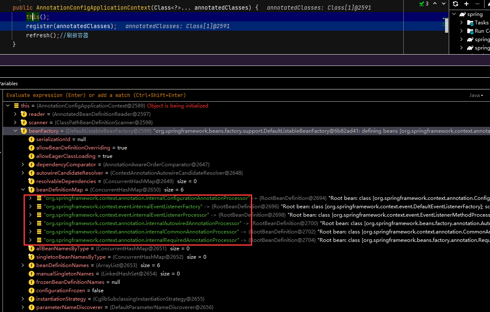
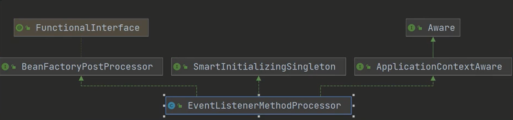

# 事件原理

## 准备工作

+ MessageEvent.java

```java
package com.CodingInn.code.listener;

import org.springframework.context.ApplicationEvent;

import java.io.Serializable;

/**
 * 事件需要实现序列化接口
 */
public class MessageEvent extends ApplicationEvent implements Serializable {
   private static final long serialVersionUID = 0L;

   public MessageEvent(String source) {
      super(source);
   }

   @Override
   public String toString() {
      return "MessageEvent{" +
            ", source=" + source +
            '}';
   }
}
```

+ ChangeEvent.java

```java
package com.CodingInn.code.listener;

import org.springframework.context.ApplicationEvent;

import java.io.Serializable;
/**
 * 事件需要实现序列化接口
 */
public class ChangeEvent extends ApplicationEvent implements Serializable {
   private static final long serialVersionUID = 0L;
   private String state;
   private ChangeEvent(Object source) {
      super(source);
   }

   public ChangeEvent(Object source,String state){
      super(source);
      this.state = state;
   }

   public String getState() {
      return state;
   }

   @Override
   public String toString() {
      return "ChangeEvent{" +
            "state='" + state + '\'' +
            ", source=" + source +
            '}';
   }
}
```

+ AppEventPublisher

```java
package com.CodingInn.code.listener;


import org.springframework.context.ApplicationEvent;
import org.springframework.context.ApplicationEventPublisher;
import org.springframework.context.ApplicationEventPublisherAware;
import org.springframework.stereotype.Component;

/**
 * 事件发布器
 */

@Component
public class AppEventPublisher implements ApplicationEventPublisherAware {

   ApplicationEventPublisher eventPublisher;
   public AppEventPublisher(){
      System.out.println("AppEventPublisher....");
   }

   @Override
   public void setApplicationEventPublisher(ApplicationEventPublisher applicationEventPublisher) {
      this.eventPublisher = applicationEventPublisher;
   }

   public void publish(ApplicationEvent applicationEvent){
      eventPublisher.publishEvent(applicationEvent);
   }

   public void publish(Object o){
      eventPublisher.publishEvent(o);
   }
}
```

+ AppEventListener.java

```java
package com.CodingInn.code.listener;


import com.CodingInn.code.pojo.A;
import org.springframework.context.PayloadApplicationEvent;
import org.springframework.context.event.EventListener;
import org.springframework.stereotype.Component;

/**
 * 事件监听器；为什么一个注解就能监听来事件。。。。。
 * DataSource。TransationManager（切面） === DBService
 * @EnableTransationManager
 *
 *
 */
@Component
public class AppEventListener {

   public AppEventListener(){
      System.out.println("AppEventListener...");
   }

   @EventListener(MessageEvent.class) //监听事件
   public void listenMessage(MessageEvent event){
      System.out.println("Message事件到达..."+event+"；已发送邮件....");
   }


   @EventListener(ChangeEvent.class)
   public void listenChange(ChangeEvent event){
      System.out.println("Change事件到达..."+event+"；已同步状态....");
   }

   @EventListener(PayloadApplicationEvent.class) //感知任意对象事件的
   public void listenPayload(PayloadApplicationEvent<A> event){
      System.out.println("Payload事件到达..."+event.getPayload()+"；已进行处理....");
   }

}
```

+ App.java

```java
package com.CodingInn.code.listener;

import org.springframework.context.ApplicationEvent;
import org.springframework.context.ApplicationListener;
import org.springframework.stereotype.Component;


@Component //容器中会拿到所有的事件监听器，挨个遍历调用 onApplicationEvent
public class App implements ApplicationListener<ApplicationEvent> {
   @Override
   public void onApplicationEvent(ApplicationEvent event) {
      System.out.println("");
   }
}
```

+ A.java

```java
package com.CodingInn.code.pojo;

import org.springframework.beans.factory.annotation.Autowired;
import org.springframework.stereotype.Component;

@Component
public class A {

   public A() {
      System.out.println("A init");
   }

}
```

## 开始调试

入口函数

```java
@Test
public  void testEvent() {
   ApplicationContext applicationContext =
         new AnnotationConfigApplicationContext(AopOpenConfig.class);
   
   //测试事件
   AppEventPublisher eventPublisher = applicationContext.getBean(AppEventPublisher.class);
   eventPublisher.publish(new A());
   eventPublisher.publish(new MessageEvent("hello，你好"));
   eventPublisher.publish(new ChangeEvent(eventPublisher,"sending..."));
}
```

AnnotationConfigApplicationContext的构造函数中会扫描相应的初始化beanDefiniiton:



上图中标注的是Spring在底层默认加入的后置处理器，根据这些后置处理器可以完成很多功能，比如@Autowire的解析，@Import的解析等等。

EventListenerMethodProcessor的UML图如下：



