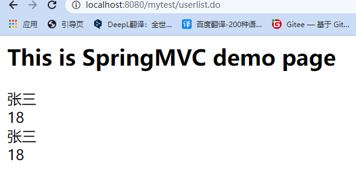
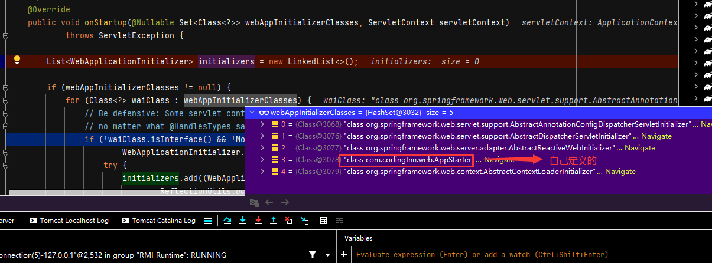

# SpringMVC

## SpringMVC体验(基于注解的方式)

引入依赖

```java
dependencies {
    compile(project(":spring-webmvc"))
    // https://mvnrepository.com/artifact/javax.servlet/javax.servlet-api
    compileOnly group: 'javax.servlet', name: 'javax.servlet-api', version: '3.1.0'

    testImplementation 'junit:junit:4.11'
    testImplementation 'junit:junit:4.12'
}
```

+ AppConfig.java

```java
package com.codingInn.web.config;

import org.springframework.context.annotation.ComponentScan;
import org.springframework.context.annotation.Configuration;

@ComponentScan("com.codingInn.web")
@Configuration
public class AppConfig {
}
```

+ HelloController.java

```java
package com.codingInn.web.controller;

import org.springframework.web.bind.annotation.GetMapping;
import org.springframework.web.bind.annotation.RestController;

@RestController
public class HelloController {

   @GetMapping("/hello")
   public String sayHello(){
      return "Hello,SpringMVC";
   }
}
```

+ AppStarter.java

```java
package com.codingInn.web;

import com.codingInn.web.config.AppConfig;
import org.springframework.web.WebApplicationInitializer;
import org.springframework.web.context.support.AnnotationConfigWebApplicationContext;
import org.springframework.web.servlet.DispatcherServlet;

import javax.servlet.ServletException;
import javax.servlet.ServletRegistration;

/**
 * 只要写了这个,相当于配置了SpringMVC的DispatcherServlet
 * 1.Tomcat一启动就会加载
 * 		1.1 创建了容器,指定了配置类(所有ioc,aop等sping的功能就完成了)
 * 		1.2 注册了一个Servlet;DispatcherServlet
 * 	效果,访问Tomcat部署的这个Web应用下的所有请求都会被DispatcherServlet处理,在此基础上,DispatcherServlet就会进入强大的基于注解的mvc处理流程(@GetMapping等)
 */
public class AppStarter implements WebApplicationInitializer {
	@Override
	public void onStartup(javax.servlet.ServletContext servletContext) throws ServletException {
		//创建ioc容器
		AnnotationConfigWebApplicationContext context = new AnnotationConfigWebApplicationContext();
		context.register(AppConfig.class);//传入配置类

		//配置DispatcherServlet
		DispatcherServlet servlet = new DispatcherServlet(context);
		ServletRegistration.Dynamic registration = servletContext.addServlet("app",servlet);
		registration.setLoadOnStartup(1);
		registration.addMapping("/");
	}
}

```

## SpringMVC体验(基于xml的方式)

+ web.xml

```xml
<?xml version="1.0" encoding="UTF-8"?>
<web-app xmlns:xsi="http://www.w3.org/2001/XMLSchema-instance"
   xmlns="http://java.sun.com/xml/ns/javaee"
   xsi:schemaLocation="http://java.sun.com/xml/ns/javaee http://java.sun.com/xml/ns/javaee/web-app_2_5.xsd"
   version="2.5">
  <display-name>spring-mvc-sourcetest</display-name>

   <context-param>
      <param-name>contextConfigLocation</param-name>
      <param-value>classpath:applicationContext.xml</param-value>
   </context-param>

   <servlet>
      <servlet-name>Springmvc</servlet-name>
      <servlet-class>org.springframework.web.servlet.DispatcherServlet</servlet-class>
      <load-on-startup>1</load-on-startup>
   </servlet>

   <servlet-mapping>
      <servlet-name>Springmvc</servlet-name>
      <url-pattern>*.do</url-pattern>
   </servlet-mapping>


  <welcome-file-list>
    <welcome-file>index.html</welcome-file>
    <welcome-file>index.jsp</welcome-file>
  </welcome-file-list>
   
   <listener>
      <listener-class>org.springframework.web.context.ContextLoaderListener</listener-class>
   </listener>
</web-app>
```

+ applicationContext.xml

```java
<?xml version="1.0" encoding="UTF-8"?>
<beans xmlns="http://www.springframework.org/schema/beans"
      xmlns:xsi="http://www.w3.org/2001/XMLSchema-instance"
      xmlns:tx="http://www.springframework.org/schema/tx"
      xsi:schemaLocation="http://www.springframework.org/schema/beans http://www.springframework.org/schema/beans/spring-beans.xsd
                     http://www.springframework.org/schema/tx http://www.springframework.org/schema/tx/spring-tx-2.5.xsd">

   <bean id="viewResolver" class="org.springframework.web.servlet.view.InternalResourceViewResolver">
      <property name="prefix" value="/jsp/"/>
      <property name="suffix" value=".jsp"/>
   </bean>

</beans>
```

+ Springmvc-servlet.xml

```xml
<?xml version="1.0" encoding="UTF-8"?>
<beans xmlns="http://www.springframework.org/schema/beans"
	   xmlns:xsi="http://www.w3.org/2001/XMLSchema-instance"
	   xmlns:aop="http://www.springframework.org/schema/aop"
	   xmlns:tx="http://www.springframework.org/schema/tx"
	   xmlns:context="http://www.springframework.org/schema/context"
	   xsi:schemaLocation="http://www.springframework.org/schema/beans
             http://www.springframework.org/schema/beans/spring-beans.xsd
             http://www.springframework.org/schema/tx
             http://www.springframework.org/schema/tx/spring-tx.xsd
              http://www.springframework.org/schema/aop
              http://www.springframework.org/schema/aop/spring-aop.xsd
                http://www.springframework.org/schema/context
              http://www.springframework.org/schema/context/spring-context.xsd">

	<!--需要扫描的包-->
	<context:component-scan base-package="com.codingInn"/>

	<bean id="simpleUrlMapping" class="org.springframework.web.servlet.handler.SimpleUrlHandlerMapping">
		<property name="mappings">
			<props>
				<prop key="/userlist.do">userController</prop>
			</props>
		</property>
	</bean>

	<bean class="com.codingInn.web.controller.UserController" id="userController"/>


</beans>
```

+ User.java

```java
package com.codingInn.web.pojo;

public class User {
   private String name;
   private Integer age;

   public String getName() {
      return name;
   }

   public void setName(String name) {
      this.name = name;
   }

   public Integer getAge() {
      return age;
   }

   public void setAge(Integer age) {
      this.age = age;
   }
}
```

+ UserController.java

```java
package com.codingInn.web.controller;

import com.codingInn.web.pojo.User;
import org.springframework.web.servlet.ModelAndView;
import org.springframework.web.servlet.mvc.AbstractController;

import javax.servlet.http.HttpServletRequest;
import javax.servlet.http.HttpServletResponse;
import java.util.ArrayList;
import java.util.List;

public class UserController extends AbstractController {
   @Override
   protected ModelAndView handleRequestInternal(HttpServletRequest request, HttpServletResponse response) throws Exception {


      //ModelAndView对象既能够绑定视图名字，又能够绑定数据(将数据存储到request域对象)
      User userA = new User();
      userA.setName("张三");
      userA.setAge(18);

      User userB = new User();
      userB.setName("张三");
      userB.setAge(18);

      List<User> userList = new ArrayList<>();
      userList.add(userA);
      userList.add(userB);

      ModelAndView mv = new ModelAndView();//数据模型和视图
      mv.addObject("users",userList);
      mv.setViewName("userlist");
      return mv;
   }
}
```

+ MyDataContextListener.java

```java
package com.codingInn.web.listener;

import javax.servlet.ServletContext;
import javax.servlet.ServletContextEvent;
import javax.servlet.ServletContextListener;
import javax.servlet.annotation.WebListener;

@WebListener
public class MyDataContextListener implements ServletContextListener {
   private ServletContext context = null;

   public MyDataContextListener() {
      System.out.println("MyDataContextListener.....");
   }

   @Override
   public void contextInitialized(ServletContextEvent sce) {
      this.context = sce.getServletContext();
   }

   @Override
   public void contextDestroyed(ServletContextEvent sce) {
      this.context = null;
   }
}
```

输入http://localhost:8080/mytest/userlist.do,结果如下:



## 开始调试

在SpringServletContainerInitializer.java的onStartup地方打断点:

+ SpringServletContainerInitializer.java

```java
public void onStartup(@Nullable Set<Class<?>> webAppInitializerClasses, ServletContext servletContext)
      throws ServletException {

   List<WebApplicationInitializer> initializers = new LinkedList<>();

   if (webAppInitializerClasses != null) {
      for (Class<?> waiClass : webAppInitializerClasses) {
         // Be defensive: Some servlet containers provide us with invalid classes,
         // no matter what @HandlesTypes says...
         if (!waiClass.isInterface() && !Modifier.isAbstract(waiClass.getModifiers()) &&
               WebApplicationInitializer.class.isAssignableFrom(waiClass)) {
            try {
               initializers.add((WebApplicationInitializer)
                     ReflectionUtils.accessibleConstructor(waiClass).newInstance());
            }
            catch (Throwable ex) {
               throw new ServletException("Failed to instantiate WebApplicationInitializer class", ex);
            }
         }
      }
   }

   if (initializers.isEmpty()) {
      servletContext.log("No Spring WebApplicationInitializer types detected on classpath");
      return;
   }

   servletContext.log(initializers.size() + " Spring WebApplicationInitializers detected on classpath");
   AnnotationAwareOrderComparator.sort(initializers);
   for (WebApplicationInitializer initializer : initializers) {
      initializer.onStartup(servletContext);
   }
}
```


