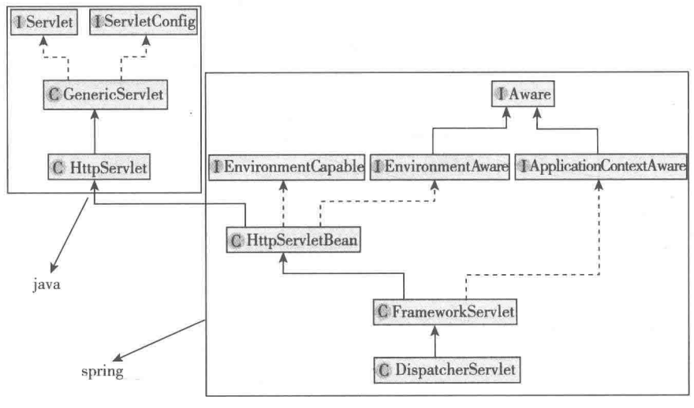
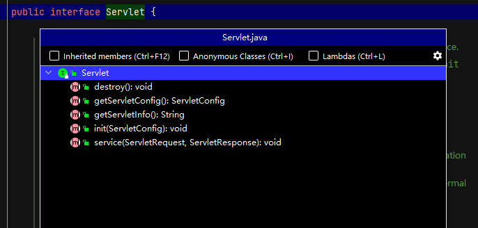

# 10 SpringMVC处理请求的过程

再次看一下DispatcherServlet的uml图：



本文分两步:首先分析HttpServletBean、FrameworkServlet和 DispatcherServlet这三个Servlet的处理过程，分析从 Servlet容器将请求交给Spring MVC一直到 DispatcherServlet具体处理请求之前都做了些什么，最后重点分析Spring MVC中最核心的处理方法doDispatch 的结构。

## 10.1 HttpServletBean

HttpServletBean主要参与了创建工作，并没有涉及请求的处理。

## 10.2 FrameworkServlet


Servlet的接口如下：



在HttpServlet的service方法中，根据请求的类型将请求路由到了doGet,doHead,doPost,doPut,doDelete,doOptions和doTrace方法中,doDelete 七个方法，并且做了doHead , doOptions 和 doTrace 的默认实现，其中 doHead 调用doGet,然后返回只有 header没有body 的 response。

+ HttpServlet.java

```java
protected void service(HttpServletRequest req, HttpServletResponse resp)
    throws ServletException, IOException
{
    String method = req.getMethod();

    if (method.equals(METHOD_GET)) {
        long lastModified = getLastModified(req);
        if (lastModified == -1) {
            doGet(req, resp);
        } else {
            long ifModifiedSince = req.getDateHeader(HEADER_IFMODSINCE);
            if (ifModifiedSince < lastModified) {
                maybeSetLastModified(resp, lastModified);
                doGet(req, resp);
            } else {
                resp.setStatus(HttpServletResponse.SC_NOT_MODIFIED);
            }
        }

    } else if (method.equals(METHOD_HEAD)) {
        long lastModified = getLastModified(req);
        maybeSetLastModified(resp, lastModified);
        doHead(req, resp);

    } else if (method.equals(METHOD_POST)) {
        doPost(req, resp);
        
    } else if (method.equals(METHOD_PUT)) {
        doPut(req, resp);
        
    } else if (method.equals(METHOD_DELETE)) {
        doDelete(req, resp);
        
    } else if (method.equals(METHOD_OPTIONS)) {
        doOptions(req,resp);
        
    } else if (method.equals(METHOD_TRACE)) {
        doTrace(req,resp);
        
    } else {

        String errMsg = lStrings.getString("http.method_not_implemented");
        Object[] errArgs = new Object[1];
        errArgs[0] = method;
        errMsg = MessageFormat.format(errMsg, errArgs);
        
        resp.sendError(HttpServletResponse.SC_NOT_IMPLEMENTED, errMsg);
    }
}
```

FrameworkServlet的service方法如下：

+ FrameworkServlet.java

```java
protected void service(HttpServletRequest request, HttpServletResponse response)
      throws ServletException, IOException {

   HttpMethod httpMethod = HttpMethod.resolve(request.getMethod());
   if (httpMethod == HttpMethod.PATCH || httpMethod == null) {
      processRequest(request, response);
   }
   else {
      super.service(request, response);
   }
}
```

在 FrameworkServlet中重写了service、doGet、doPost、doPut、doDelete、doOptions .doTrace方法(除了doHead 的所有处理请求的方法)。在service方法中增加了对 PATCH类型请求的处理，其他类型的请求直接交给了父类进行处理。

processRequest方法如下：

+ FrameworkServlet.java

```java
protected final void processRequest(HttpServletRequest request, HttpServletResponse response)
      throws ServletException, IOException {

   long startTime = System.currentTimeMillis();
   Throwable failureCause = null;
	//获取LocaleContextHolder中原来保存到的LocaleContext
   LocaleContext previousLocaleContext = LocaleContextHolder.getLocaleContext();
    //获取当前请求的LocaleContext
   LocaleContext localeContext = buildLocaleContext(request);
	//获取RequestContextHodlder中原来保存的RequestAttributes
   RequestAttributes previousAttributes = RequestContextHolder.getRequestAttributes();
    //获取当前请求的ServletRequestAttributes
   ServletRequestAttributes requestAttributes = buildRequestAttributes(request, response, previousAttributes);

   WebAsyncManager asyncManager = WebAsyncUtils.getAsyncManager(request);
   asyncManager.registerCallableInterceptor(FrameworkServlet.class.getName(), new RequestBindingInterceptor());
	//将当前请求的LocaleContext和RequestAttributes设置到LocaleContextHolder和RequestContextHolder
   initContextHolders(request, localeContext, requestAttributes);

   try {
       //实际处理请求入口
      doService(request, response);
   }
   catch (ServletException | IOException ex) {
      failureCause = ex;
      throw ex;
   }
   catch (Throwable ex) {
      failureCause = ex;
      throw new NestedServletException("Request processing failed", ex);
   }

   finally {
       //恢复原来的LocaleContext和ServletRequestAtrributes到LocaleContextHolder和RequestContextHolder中
      resetContextHolders(request, previousLocaleContext, previousAttributes);
      if (requestAttributes != null) {
         requestAttributes.requestCompleted();
      }

     ....
        
        //发布ServletRequestHandledEvent消息
      publishRequestHandledEvent(request, response, startTime, failureCause);
   }
}
```

核心语句是doService(request,response),这是一个模板方法在DispatcherServlet中具体实现，稍后再说。在doService前后还做了一些事情:首先获取了**LocaleContextHolder** 和 **RequestContextHolder**中原来保存的 **LocaleContext**和 **RequestAttributes**并设置到**previousLocaleContext**和 **previousAttributes**临时属性，然后调用**buildLocaleContext**和 **buildRequestAttributes**方法获取到当前请求的**LocaleContext和RequestAttributes**，并通过**initContextHolders**方法将它们设置到**LocaleContextHolder**和**RequestContextHolders**中(处理完请求后再恢复到原来的值)，接着使用**request**拿到异步处理管理器并设置了拦截器，做完这些后执行了doService方法，执行完后,最后（ finally中）通过**resetContextHolders**方法将原来的**previousLocaleContext**和 **previousAttributes**恢复到**LocaleContextHolder**和 **RequestAttributes**。

除了异步请求和调用doService方法具体处理请求，processRequest自己主要做了两件事情:

①对LocaleContext和RequestAttributes的设置及恢复;

②处理完后发布了Servlet-RequestHandledEvent消息。

先来看一下LocaleContext和RequestAttributes是什么，LocaleContext用于存放Locale，也就是本地化信息，如zh-cn等，RequestAttributes是Spring的一个接口，通过它可以get/set/removeAttribute，根据scope参数判断操作request还是session。

ServletRequestAttributes中将request,response和session组合在了一起，后续传递参数只需要传递ServletRequestAttributes即可，并且ServletRequestAttributes类中提供了增强的方法，例如setAttribute函数：

+ ServletRequestAttributes.java

```java
public void setAttribute(String name, Object value, int scope) {
    //操作request
   if (scope == SCOPE_REQUEST) {
      if (!isRequestActive()) {
         throw new IllegalStateException(
               "Cannot set request attribute - request is not active anymore!");
      }
      this.request.setAttribute(name, value);
   }
    //操作session
   else {
      HttpSession session = obtainSession();
      this.sessionAttributesToUpdate.remove(name);
      session.setAttribute(name, value);
   }
}
```

设置属性时可以通过scope判断是对request还是session进行设置，具体的设置方法非常简单，就是直接对request和 session操作。总结起来就是，LocoleContext可以获取Locale，RequestAttributes用于封装request，response,session等属性。这两个分别是LocaleContextHolder和RequestContextHolder获得。

+ LocaleContextHolder如下：

```java
public abstract class LocaleContextHolder {

   private static final ThreadLocal<LocaleContext> localeContextHolder =
         new NamedThreadLocal<>("LocaleContext");

   private static final ThreadLocal<LocaleContext> inheritableLocaleContextHolder =
         new NamedInheritableThreadLocal<>("LocaleContext");
 	...   
}
```

LocaleContextHolder类里面封装了两个属性localeContextHolder和inheritableLocaleContextHolder，它们都是LocaleContext，其中第二个可以被子线程继承。LocaleContextHolder还提供了get/set方法，可以获取和设置LocaleContext，另外还提供了get/setLocale方法，可以直接操作Locale，当然都是 static的。

RequestContextHolder也是一样的道理，而且因为实际封装的是ServletRequestAttributes，所以还可以 getRequest ,getResponse、getSession ,这样就可以在任何地方都能方便地获取这些对象了,另外，因为里面封装的其实是对象的引用，所以即使在doService方法里面设置的Attribute，使用RequestContextHolder也一样可以获取到。

在方法最后的finally中调用resetContextHolders方法将原来的LocaleContext和RequestAttributes又恢复了。这是因为在Sevlet外面可能还有别的操作，如Filter 等，为了不影响那些操作，所以需要进行恢复。

最后就是publishRequestHandledEvent (request,response,startTime,failureCause)发布消息了。在publishRequestHandledEvent 内部发布了一个ServletRequestHandledEvent消息，代码如下:

+ FrameworkServlet.java

```java
private void publishRequestHandledEvent(HttpServletRequest request, HttpServletResponse response,
      long startTime, @Nullable Throwable failureCause) {
	//publishEvents可以在配置Servlet时设置，默认为true
   if (this.publishEvents && this.webApplicationContext != null) {
     //无论请求是否执行成功都会发布消息
      long processingTime = System.currentTimeMillis() - startTime;
      this.webApplicationContext.publishEvent(
            new ServletRequestHandledEvent(this,
                  request.getRequestURI(), request.getRemoteAddr(),
                  request.getMethod(), getServletConfig().getServletName(),
                  WebUtils.getSessionId(request), getUsernameForRequest(request),
                  processingTime, failureCause, response.getStatus()));
   }
}
```

当publishEvents设置为true时，请求处理结束后就会发出这个消息，无论请求处理成功与否都会发布。publishEvents可以在web.xml 文件中配置Spring MVC的 Servlet时配置，默认为true,我们可以通过监听这个事件来做一些事情,如记录日志。

下面写一个记录日志的监听器：

```java
package com.codingInn.web.listener;

import org.springframework.context.ApplicationListener;
import org.springframework.stereotype.Component;
import org.springframework.web.context.support.ServletRequestHandledEvent;
import org.apache.commons.logging.Log;
import org.apache.commons.logging.LogFactory;

@Component
public class ServletRequestEventListener implements ApplicationListener<ServletRequestHandledEvent> {
   final static Log logger = LogFactory.getLog(ServletRequestEventListener.class);
   @Override
   public void onApplicationEvent(ServletRequestHandledEvent event) {
      logger.info(event.getDescription());
   }
}
```

到现在为止 FrameworkServlet就分析完了，我们再简单地回顾一下:首先是在service方法里添加了对 PATCH的处理，并将所有需要自己处理的请求都集中到了processRequest方法进行统一处理，这和HttpServlet里面根据request 的类型将请求分配到各个不同的方法进行处理的过程正好相反。然后就是processRequest方法,在processRequest里面主要的处理逻辑交给了doService,这是一个模板方法，在子类具体实现，另外就是对使用当前request获取到的LocaleContext和 RequestAttributes进行了保存，以及处理完之后的恢复，在最后发布了ServletRequest-HandledEvent事件。

## 10.3 DispatcherServlet


DispatcherServlet的相关UML图如下：


DispatcherServlet是 SpringMVC最核心的类，整个处理过程的顶层设计都在这里面，所以一定要把这个类彻底弄明白。

通过之前的分析我们知道，DispatcherServlet里面执行处理的入口方法是doService,该方法由子类DispatcherServlet实现，doService的代码如下:

+ DispatcherServlet.java

```java
@Override
protected void doService(HttpServletRequest request, HttpServletResponse response) throws Exception {
   if (logger.isDebugEnabled()) {
      String resumed = WebAsyncUtils.getAsyncManager(request).hasConcurrentResult() ? " resumed" : "";
      logger.debug("DispatcherServlet with name '" + getServletName() + "'" + resumed +
            " processing " + request.getMethod() + " request for [" + getRequestUri(request) + "]");
   }


   Map<String, Object> attributesSnapshot = null;
    //当是include请求时对request的Attribute做快照备份，以便能够在include后恢复原始属性
   if (WebUtils.isIncludeRequest(request)) {
      attributesSnapshot = new HashMap<>();
      Enumeration<?> attrNames = request.getAttributeNames();
      while (attrNames.hasMoreElements()) {
         String attrName = (String) attrNames.nextElement();
         if (this.cleanupAfterInclude || attrName.startsWith(DEFAULT_STRATEGIES_PREFIX)) {
            attributesSnapshot.put(attrName, request.getAttribute(attrName));
         }
      }
   }

   // 对request设置一些属性
   request.setAttribute(WEB_APPLICATION_CONTEXT_ATTRIBUTE, getWebApplicationContext());
   request.setAttribute(LOCALE_RESOLVER_ATTRIBUTE, this.localeResolver);
   request.setAttribute(THEME_RESOLVER_ATTRIBUTE, this.themeResolver);
   request.setAttribute(THEME_SOURCE_ATTRIBUTE, getThemeSource());

    //以下三个属性和flashMap有关
   if (this.flashMapManager != null) {
      FlashMap inputFlashMap = this.flashMapManager.retrieveAndUpdate(request, response);//如果是重定向，OUTPUT_FLASH_MAP_ATTRIBUTE会放入session的FLASH_MAPS_SESSION_ATTRIBUTE中，在这一步会从FLASH_MAPS_SESSION_ATTRIBUTE中取数据，如果有数据，代表是重定向传递过来的数据
      if (inputFlashMap != null) {
         request.setAttribute(INPUT_FLASH_MAP_ATTRIBUTE, Collections.unmodifiableMap(inputFlashMap));//把重定向数据放入INPUT_FLASH_MAP_ATTRIBUTE中。
      }
      request.setAttribute(OUTPUT_FLASH_MAP_ATTRIBUTE, new FlashMap());
      request.setAttribute(FLASH_MAP_MANAGER_ATTRIBUTE, this.flashMapManager);
   }

   try {
      doDispatch(request, response);
   }
   finally {
      if (!WebAsyncUtils.getAsyncManager(request).isConcurrentHandlingStarted()) {
         // 还原request快照的属性
         if (attributesSnapshot != null) {
            restoreAttributesAfterInclude(request, attributesSnapshot);
         }
      }
   }
}
```

**INPUT_FLASH_MAP_ATTRIBUTE**，**OUTPUT_FLASH_MAP_ATTRIBUTE**，**FLASH_MAP_MANAGER_ATTRIBUTE**三个属性都和 flashMap相关，主要用于Redirect转发时参数的传递，比如，为了避免重复提交表单，可以在处理完post请求后redirect到一个get的请求，这样即使用户刷新也不会有重复提交的问题。不过这里有个问题，前面的post请求是提交订单，提交完后redirect到一个显示订单的页面，显然在显示订单的页面需要知道订单的一些信息，但redirect本身是没有传递参数的功能的，按普通的模式如果想传递参数，就只能将其写人url中，但是url有长度限制,另外有些场景中我们想传递的参数还不想暴露在url里，这时就可以用flashMap来进行传递，只需要在redirect之前将需要传递的参数写入**OUTPUT_FLASH_MAP**中。示例如下：

+ index.jsp

```jsp
<%--
  Created by IntelliJ IDEA.
  User: a7810
  Date: 2022/3/17
  Time: 10:43
  To change this template use File | Settings | File Templates.
--%>
<%@ page contentType="text/html;charset=UTF-8" language="java" %>
<html>
  <head>
    <title>$Title$</title>
  </head>
  <body>
  <form method="post" action="submit">
    <table border="1px" width="500px" align="center">
      <tr>
        <td>订单id</td>
        <td><input type="text" name="orderId"></td>
      </tr>
      <tr>
        <td colspan="2"><input type="submit"></td>
      </tr>
    </table>
  </form>
  </body>
</html>
```

+ GoController.java

```java
package com.codingInn.web.controller;

import org.apache.commons.logging.Log;
import org.apache.commons.logging.LogFactory;
import org.springframework.context.EnvironmentAware;
import org.springframework.core.env.Environment;
import org.springframework.stereotype.Controller;
import org.springframework.ui.Model;
import org.springframework.web.bind.annotation.RequestMapping;
import org.springframework.web.bind.annotation.RequestMethod;
import org.springframework.web.context.request.RequestContextHolder;
import org.springframework.web.context.request.ServletRequestAttributes;
import org.springframework.web.servlet.DispatcherServlet;
import org.springframework.web.servlet.FlashMap;
import org.springframework.web.servlet.ModelAndView;
import org.springframework.web.servlet.mvc.support.RedirectAttributes;

import javax.servlet.http.HttpServletRequest;
import javax.servlet.http.HttpServletResponse;
import java.io.IOException;

@Controller
public class GoController implements EnvironmentAware {
	private final Log logger = LogFactory.getLog(GoController.class);


	@RequestMapping(value = "/submit",method = RequestMethod.POST)
	public String submit(HttpServletRequest request, RedirectAttributes attr) throws IOException{
		String orderId = request.getParameter("orderId");
		((FlashMap)((ServletRequestAttributes)(RequestContextHolder.getRequestAttributes())).getRequest().getAttribute(DispatcherServlet.OUTPUT_FLASH_MAP_ATTRIBUTE)).put("name","aaa");
		attr.addFlashAttribute("ordersId","xxx");
		attr.addAttribute("local","zh-cn");
		return "redirect:showorders";
	}

	@RequestMapping(value = "/showorders",method = RequestMethod.GET)
	public ModelAndView showOrders(Model modle){
		ModelAndView mv = new ModelAndView();//数据模型和视图
        	mv.addAllObjects(model.asMap());
		mv.setViewName("go");
		return mv;
	}
}

```

这里分别使用了三种方法来传递redirect参数:

+ 使用前面讲过的RequestContextHolder获取到request，并从其属性中拿到OUTPUT_FLASH_MAP_ATTRIBUTE，然后将属性放进去，这里主要是为了让大家看一下使用RequestContextHolder 获取request 的方法。
+ 通过传入的attr参数的addFlashAttribute方法设置，这样也可以保存到outputFlashMap中,和第1种方法效果一样。
+ 通过传入的attr参数的addAtribute方法设置，这样设置的参数不会保存到FlashMap,而是会拼接到url中。

从Request获取outputFlashMap除了直接获取 DispatcherServlet.OUTPUT FLASH_MAP_ATTRIBUTE属性，还可以使用RequestContextUtils来操作:RequestContextUtils.getOutputFlashMap ( request)，这样也可以得到outputFlashMap，其实它内部还是从 Request的属性获取的。

当用户提交 http:/xxx/submit请求后浏览器地址栏会自动跳转到http://xxx/showorders?Local=zh-cn链接，而在showOrders的model里会存在["name ", "张三丰"]和["ordersld","xxx"]两个属性,而且对客户端是透明的,用户并不知道。

这就是flashMap的用法，**INPUT_FLASH_MAP_ATTRIBUTE**用于保存上次请求中转发过来的属性，**OUTPUT_FLASH_MAP_ATTRIBUTE**用于保存本次请求需要转发的属性，使用**FlashMapManager**可以管理它们，后面会详细分析FlashMapManager。

doService就分析完了，在这里主要是对request 设置了一些属性，如果是include请求还会对 request当前的属性做快照备份，并在处理结束后恢复。最后将请求转发给doDispatch方法。

## 10.4 doDispatch结构

先总览一下doDispatch的结构，doDispatcher 的流程图如下图所示，中间是doDispatcher的处理流程图，左边是Interceptor相关处理方法的调用位置，右边是doDispatcher方法处理过程中所涉及的组件。图中上半部分的处理请求对应着MVC中的Controller也就是C层，下半部分的processDispatchResult主要对应了MVC中的View也就是V层，M层也就是Model贯穿于整个过程中。


doDispatch方法如下：

+ DispatcherServlet.java

```java
protected void doDispatch(HttpServletRequest request, HttpServletResponse response) throws Exception {
   HttpServletRequest processedRequest = request;
   HandlerExecutionChain mappedHandler = null;
   boolean multipartRequestParsed = false;

   WebAsyncManager asyncManager = WebAsyncUtils.getAsyncManager(request);

   try {
      ModelAndView mv = null;
      Exception dispatchException = null;

      try {
         processedRequest = checkMultipart(request);
         multipartRequestParsed = (processedRequest != request);

         //①
         mappedHandler = getHandler(processedRequest);
         ...

         //②
         HandlerAdapter ha = getHandlerAdapter(mappedHandler.getHandler());

        ...

         //③
         mv = ha.handle(processedRequest, response, mappedHandler.getHandler());

       ...
       //④
      processDispatchResult(processedRequest, response, mappedHandler, mv, dispatchException);
   }
  ...
}
    
    
    
    //使用HandlerMapping找到干活的Handler
    @Nullable
	protected HandlerExecutionChain getHandler(HttpServletRequest request) throws Exception {
		if (this.handlerMappings != null) {
			for (HandlerMapping hm : this.handlerMappings) {
				if (logger.isTraceEnabled()) {
					logger.trace(
							"Testing handler map [" + hm + "] in DispatcherServlet with name '" + getServletName() + "'");
				}
				HandlerExecutionChain handler = hm.getHandler(request);
				if (handler != null) {
					return handler;
				}
			}
		}
		return null;
	}
```

doDispatch方法也非常简洁，从顶层设计了整个请求处理的过程。doDispatch中最核心的代码只要4句，它们的任务分别是:①根据request 找到Handler ;②根据Handler 找到对应的HandlerAdapter ; ③用HandlerAdapter处理Handler ;④调用processDispatchResult方法处理上面处理之后的结果（包含找到View并渲染输出给用户)。

**Handler**:也就是处理器，它直接对应着MVC中的C也就是Controller层,它的具体表现形式有很多，可以是类，也可以是方法。我们前面例子中标注了		@RequestMapping 的方法可以被看成一个Handler。只要可以实际处理请求就可以是 Handler。

**HandlerMapping** :用来查找Handler，在Spring MVC中会处理很多请求，每个请求都需要一个 Handler 来处理，具体接收到一个请求后使用哪个Handler来处理呢?这就是HandlerMapping要做的事情。

**HandlerAdapter**:从名字上就可以看出它是一个Adapter，也就是适配器。因为Spring MVC 中的 Handler可以是任意的形式，只要能处理请求就OK，但是Servlet需要的处理方法的结构却是固定的,都是以 request和 response等为参数的方法。怎么让固定的Servlet 处理方法调用灵活的Handler 来进行处理呢?这就是HandlerAdapter要做的事情。

通俗点的解释就是Handler是用来干活的工具，HandlerMapping用于根据需要干的活找到相应的工具，HandlerAdapter 是使用工具干活的人。

另外 View和 ViewResolver的原理与Handler和 HandlerMapping的原理类似。View是用来展示数据的，而ViewResolver 用来查找View。通俗地讲就是干完活后需要写报告，写报告乂需要模板，View就是所需要的模板，模板就像公文里边的格式，内容就是Model里边的数据，ViewResolver就是用来选选择使用哪个模板。

现在再回过头去看上面的代码应该就觉得很容易理解了，它们分别是:使用HandlerMapping找到干活的Handler，找到使用Handler 的 HandlerAdapter，让 HandlerAdapter使用Handler干活，干完活后将结果写个报告交上去(通过 View展示给用户)。

接下来来看一下DispatcherServlet的具体代码：

+ DispatcherServlet.java

```java
protected void doDispatch(HttpServletRequest request, HttpServletResponse response) throws Exception {
   HttpServletRequest processedRequest = request;//如果不是上传请求则直接使用接收到的request，否则封装为上传类型的request。
   HandlerExecutionChain mappedHandler = null;//处理请求的处理器链（包含处理器和对应的Interceptor）
   boolean multipartRequestParsed = false; //是不是上传请求的标志

   WebAsyncManager asyncManager = WebAsyncUtils.getAsyncManager(request);

   try {
      ModelAndView mv = null;//封装 Model和 View的容器，此变量在整个Spring MVC处理的过程中承担着非常重要角色，如果使用过Spring MVC就不会对 ModelAndView陌生。
      Exception dispatchException = null;//处理请求过程中抛出的异常。需要注意的是它并不包含渲染过程抛出的异常。

      try {
          //首先检查是不是上传请求，如果是上传请求，则返回值为MultipartHttpServletRequest,并将multipartRequestParsed标志设置为true，其中使用到了MultipartResolver。
         processedRequest = checkMultipart(request);
         multipartRequestParsed = (processedRequest != request);

         // 根据request找到Handler
         mappedHandler = getHandler(processedRequest);
         if (mappedHandler == null) {
            noHandlerFound(processedRequest, response);
            return;
         }

         // 根据Handler找到HandlerAdapter
         HandlerAdapter ha = getHandlerAdapter(mappedHandler.getHandler());

         // 处理GET,HEAD请求的Last-Modified。当浏览器第一次跟服务器请求资源(GET、Head请求)时，服务器在返回的请求头里面会包含一个 LastModified的属性，代表本资源最后是什么时候修改的。在浏览器以后发送请求时会同时发送之前接收到的LastModified，服务器接收到带LastModified的请求后会用其值和自己实际资源的最后修改时间做对比，如果资源过期了则返回新的资源(同时返回新的LastModified)，否则直接返回304状态码表示资源未过期，浏览器直接使用之前缓存的结果。
         String method = request.getMethod();
         boolean isGet = "GET".equals(method);
         if (isGet || "HEAD".equals(method)) {
            long lastModified = ha.getLastModified(request, mappedHandler.getHandler());
            if (logger.isDebugEnabled()) {
               logger.debug("Last-Modified value for [" + getRequestUri(request) + "] is: " + lastModified);
            }
            if (new ServletWebRequest(request, response).checkNotModified(lastModified) && isGet) {
               return;
            }
         }

          //执行相应Interceptor的preHandle
         if (!mappedHandler.applyPreHandle(processedRequest, response)) {
            return;
         }

         // HandlerAdapter使用Handle处理请求,Controller在此工作，主要使用了HandlerAdapter
         mv = ha.handle(processedRequest, response, mappedHandler.getHandler());

          //如果需要异步处理，直接返回
         if (asyncManager.isConcurrentHandlingStarted()) {
            return;
         }

          //当view为空时（比如，Handler返回值是void），根据requesst设置默认view
         applyDefaultViewName(processedRequest, mv);
          //执行相应Interceptor的postHandle
         mappedHandler.applyPostHandle(processedRequest, response, mv);
      }
      catch (Exception ex) {
         dispatchException = ex;
      }
      catch (Throwable err) {
         dispatchException = new NestedServletException("Handler dispatch failed", err);
      }
       //处理返回结果，包括处理异常，渲染页面，发出完成通知，触发Interceptor的afterCompletion等
      processDispatchResult(processedRequest, response, mappedHandler, mv, dispatchException);
   }
   catch (Exception ex) {
      triggerAfterCompletion(processedRequest, response, mappedHandler, ex);
   }
   catch (Throwable err) {
      triggerAfterCompletion(processedRequest, response, mappedHandler,
            new NestedServletException("Handler processing failed", err));
   }
   finally {
      if (asyncManager.isConcurrentHandlingStarted()) {
         // 判断是否执行异步请求
         if (mappedHandler != null) {
            mappedHandler.applyAfterConcurrentHandlingStarted(processedRequest, response);
         }
      }
      else {
         // 删除上传请求的资源
         if (multipartRequestParsed) {
            cleanupMultipart(processedRequest);
         }
      }
   }
}
```

getHandler方法可以获取Handler处理器链，其中使用到了HandlerMapping，返回值为HandlerExecutionChain类型，其中包含着与当前request相匹配的Interceptor和 Handler。getHandler代码如下:

+ DispatcherServlet.java

```java
//使用HandlerMapping找到干活的Handler
@Nullable
protected HandlerExecutionChain getHandler(HttpServletRequest request) throws Exception {
	if (this.handlerMappings != null) {
		for (HandlerMapping hm : this.handlerMappings) {
			if (logger.isTraceEnabled()) {
				logger.trace(
						"Testing handler map [" + hm + "] in DispatcherServlet with name '" + getServletName() + "'");
			}
			HandlerExecutionChain handler = hm.getHandler(request);
			if (handler != null) {
				return handler;
			}
		}
	}
	return null;
}
```

processDispatchResult代码如下:

+ DispatcherServlet.java

```java
private void processDispatchResult(HttpServletRequest request, HttpServletResponse response,
      @Nullable HandlerExecutionChain mappedHandler, @Nullable ModelAndView mv,
      @Nullable Exception exception) throws Exception {

   boolean errorView = false;

    //如果请求处理的过程中有异常抛出，则处理异常
   if (exception != null) {
      if (exception instanceof ModelAndViewDefiningException) {
         logger.debug("ModelAndViewDefiningException encountered", exception);
         mv = ((ModelAndViewDefiningException) exception).getModelAndView();
      }
      else {
         Object handler = (mappedHandler != null ? mappedHandler.getHandler() : null);
           //将相应的错误页面设置到View,在其中用到了HandlerExceptionResolver。
         mv = processHandlerException(request, response, handler, exception);
         errorView = (mv != null);
      }
   }

   // 页面渲染
   if (mv != null && !mv.wasCleared()) {
       //渲染页面具体在render方法中执行，render中首先对 response设置了Local，过程中使用到了LocaleResolver，调用resolveViewName方法使用ViewResolver得到实际的View，最后调用View的 render方法对页面进行具体渲染。
      render(mv, request, response);
      if (errorView) {
         WebUtils.clearErrorRequestAttributes(request);
      }
   }
   else {
      if (logger.isDebugEnabled()) {
         logger.debug("Null ModelAndView returned to DispatcherServlet with name '" + getServletName() +
               "': assuming HandlerAdapter completed request handling");
      }
   }

   if (WebAsyncUtils.getAsyncManager(request).isConcurrentHandlingStarted()) {
      // 如果启动了异步处理则返回
      return;
   }

    //发出请求处理完成的通知，触发Interceptor的afterCompletion
   if (mappedHandler != null) {
      mappedHandler.triggerAfterCompletion(request, response, null);
   }
}
```

mappedHandler是观察者模式，代码如下,回调所有Interceptor的afterCompletion函数：

+ HandleExcutionChain.java

```java
void triggerAfterCompletion(HttpServletRequest request, HttpServletResponse response, @Nullable Exception ex)
      throws Exception {

   HandlerInterceptor[] interceptors = getInterceptors();
   if (!ObjectUtils.isEmpty(interceptors)) {
      for (int i = this.interceptorIndex; i >= 0; i--) {
         HandlerInterceptor interceptor = interceptors[i];
         try {
            interceptor.afterCompletion(request, response, this.handler, ex);
         }
         catch (Throwable ex2) {
            logger.error("HandlerInterceptor.afterCompletion threw exception", ex2);
         }
      }
   }
}
```

至此，doDispatch方法就分析完了。可以看到Spring MVC的处理方式是先在顶层设计好整体结构，然后将具体的处理交给不同的组件具体去实现的。

