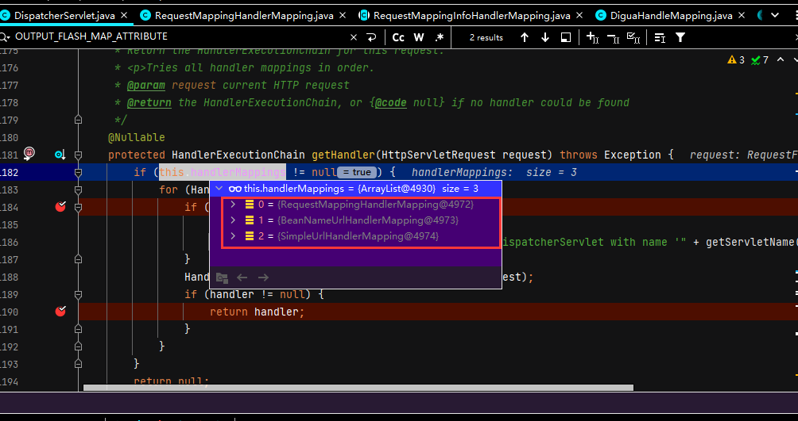
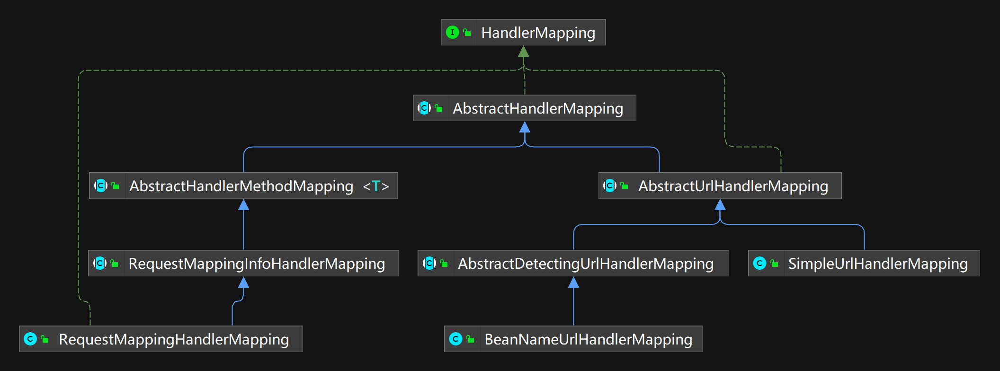
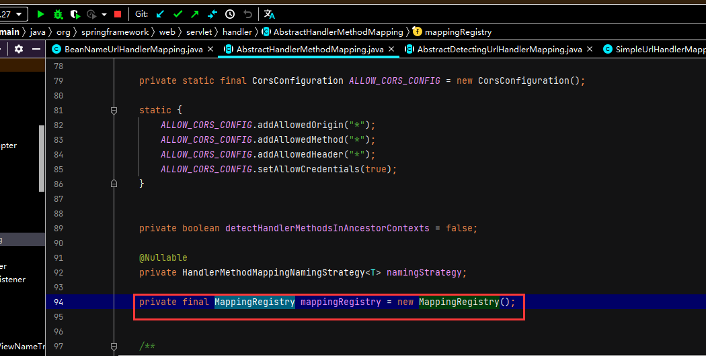

# 12 HandlerMapping详解

SpringMVC中有如下几种默认的handlerMaping:



**RequestMappingHandlerMapping**继承自**AbstractHandlerMethodMapping**，**BeanNameUrlHandlerMapping**和**SimpleUrlHandlerMapping**继承自**AbstractUrlHandlerMapping**，他们都继承自**AbstractHandlerMapping**。

HandlerMapping继承结构如下：



可以看到HandlerMapping 家族的成员可以分为两支，一支继承AbstractUrlHandlerMapping另一支继承AbstractHandlerMethodMapping，而这两个支都继承自抽象类AbstractHandlerMapping.所以本章首先分析AbstractHandlerMapping，然后分别分析AbstractHandlerMethodMapping和AbstractUrlHandlerMapping。

## 12.1 AbstractHandlerMapping

AbstractHandlerMapping是HandlerMapping的抽象实现，所有HandlerMapping都继承自AbstractHandlerMapping。AbstractHandlerMapping采用模板模式设计了HandlerMapping实现的整体结构，子类只需要通过模板方法提供一些初始值或者具体的算法即可。将AbstractHa-ndlerMapping分析透对整个HandlerMapping实现方式的理解至关重要。在Spring MVC中有很多组件都是采用的这种模式——首先使用一个抽象实现采用模板模式进行整体设计，然后在子类通过实现模板方法具体完成业务，所以在分析Spring MVC源码的过程中尤其要重视对组件接口直接实现的抽象实现类的分析。

HandlerMapping的作用是根据request查找Handler 和 Interceptors。获取Handler 的过程通过模板方法getHandlerInternal交给了子类。AbstractHandlerMapping 中保存了Interceptor，在获取到Handler后会自己根据从request提取的 lookupPath将相应的 Interceptors装配上去，当然子类也可以通过getHandlerInternal方法设置自己的Interceptor,getHandlerInternal 的返回值为Object类型。

AbstractHandlerMapping继承了WebApplicationObjectSupport，初始化时会自动调用模板方法 initApplicationContext，AbstractHandlerMapping 的创建就是在 initApplicationContext方法里面实现的,代码如下:

+ AbstractHandlerMapping.java

```java
public abstract class AbstractHandlerMapping extends WebApplicationObjectSupport implements HandlerMapping, Ordered {
    ...
   @Override
	protected void initApplicationContext() throws BeansException {
		extendInterceptors(this.interceptors);//extendInterceptors是模板方法，用于给子类提供一个添加(或者修改) Interceptors 的入口.不过在现有Spring MVC的实现中并没有使用。
		detectMappedInterceptors(this.adaptedInterceptors);//detectMappedInterceptors方法用于将Spring MVC容器及父容器中的所有MappedInter-ceptor类型的 Bean添加到mappedInterceptors属性,代码如下:
        /**
        protected void detectMappedInterceptors(List<HandlerInterceptor> mappedInterceptors) {
		mappedInterceptors.addAll(BeanFactoryUtils.beansOfTypeIncludingAncestors(
				obtainApplicationContext(), MappedInterceptor.class, true, false).values());
	}
        **/

		initInterceptors();//initInterceptors方法的作用是初始化Interceptor，具体内容其实是将interceptors属性里所包含的对象按类型添加到mappedInterceptors或者adaptedInterceptors，代码如下:
        /**
        protected void initInterceptors() {
		if (!this.interceptors.isEmpty()) {
			for (int i = 0; i < this.interceptors.size(); i++) {
				Object interceptor = this.interceptors.get(i);
				if (interceptor == null) {
					throw new IllegalArgumentException("Entry number " + i + " in interceptors array is null");
				}
				this.adaptedInterceptors.add(adaptInterceptor(interceptor));
			}
		}
	}
        **/
	}
    ...
}

```

AbstractHandlerMapping有如下相应属性：

```java
public abstract class AbstractHandlerMapping extends WebApplicationObjectSupport implements HandlerMapping, Ordered {

    ...

   private final List<Object> interceptors = new ArrayList<>();

   private final List<HandlerInterceptor> adaptedInterceptors = new ArrayList<>();

    ...
}
```

Interceptors :用于配置 SpringMVC的拦截器，有两种设置方式:①注册HandlerMapping时通过属性设置;②通过子类的extendInterceptors钩子方法进行设置。Interceptors并不会直接使用，而是通过initInterceptors方法按类型分配到adaptedInterceptors 中进行使用,interceptors只用于配置。

HandlerMapping是通过getHandler方法来获取处理器Handler和拦截器Interceptor的，下面看一下在AbstractHandlerMapping中的实现方法。

+ AbstractHandlerMapping.java

```java
@Override
@Nullable
public final HandlerExecutionChain getHandler(HttpServletRequest request) throws Exception {
   Object handler = getHandlerInternal(request);
   if (handler == null) {
      handler = getDefaultHandler();
   }
   if (handler == null) {
      return null;
   }

   if (handler instanceof String) {
      String handlerName = (String) handler;
      handler = obtainApplicationContext().getBean(handlerName);
   }

   HandlerExecutionChain executionChain = getHandlerExecutionChain(handler, request);
   if (CorsUtils.isCorsRequest(request)) {
      CorsConfiguration globalConfig = this.globalCorsConfigSource.getCorsConfiguration(request);
      CorsConfiguration handlerConfig = getCorsConfiguration(handler, request);
      CorsConfiguration config = (globalConfig != null ? globalConfig.combine(handlerConfig) : handlerConfig);
      executionChain = getCorsHandlerExecutionChain(request, executionChain, config);
   }
   return executionChain;
}
```

可以看到getHandler方法的实现共分两部分，getHandlerExecutionChain方法调用前先找Handler，getHandlerExecutionChain方法用于添加拦截器。

找Handler的过程如下：

1. 通过getHandlerInternal ( request)方法获取，这是个模板方法，留给子类具体实现(这也是其子类主要做的事情)。
2. 如果没有获取到则使用默认的Handler，默认的Handler保存在 AbstractHandlerMapping的defaultHandler中，可以在配置HandlerMapping时进行配置，也可以在子类中进行设置。
3. 如果找到的Handler 是String类型，则以它为名到Spring MVC的容器里查找相应的Bean。

getHandlerExecutionChain的过程如下：

```java
protected HandlerExecutionChain getHandlerExecutionChain(Object handler, HttpServletRequest request) {
   HandlerExecutionChain chain = (handler instanceof HandlerExecutionChain ?
         (HandlerExecutionChain) handler : new HandlerExecutionChain(handler));

   String lookupPath = this.urlPathHelper.getLookupPathForRequest(request);
   for (HandlerInterceptor interceptor : this.adaptedInterceptors) {
      if (interceptor instanceof MappedInterceptor) {
         MappedInterceptor mappedInterceptor = (MappedInterceptor) interceptor;
         if (mappedInterceptor.matches(lookupPath, this.pathMatcher)) {
            chain.addInterceptor(mappedInterceptor.getInterceptor());
         }
      }
      else {
         chain.addInterceptor(interceptor);
      }
   }
   return chain;
}
```

首先使用handler 创建出 HandlerExecutionChain类型的变量，然后将adaptedInterceptors和符合要求的 mappedInterceptors添加进去，最后将其返回。

要想弄明白AbstractHandlerMethodMapping系列，最关键的是要先弄明白AbstractHandlerMethodMapping里三个Map的含义，它们定义如下:

## 12.2 AbstractHandlerMethodMapping系列（重要）

AbstractHandlerMethodMapping系列是将Method作为Handler来使用的，这也是我们现在用得最多的一种 Handler，比如经常使用的@RequestMapping所注释的方法就是这种Handler，它专门有一个类型:HandlerMethod，也就是Method类型的Handler。

要想弄明白AbstractHandlerMethodMapping系列，最关键的是要先弄明白MappingRegistry：



+ AbstractHandlerMethodMapping的内部类

```java
class MappingRegistry {
	...
   private final Map<T, HandlerMethod> mappingLookup = new LinkedHashMap<>();

   private final MultiValueMap<String, T> urlLookup = new LinkedMultiValueMap<>();

   private final Map<String, List<HandlerMethod>> nameLookup = new ConcurrentHashMap<>();
	...
}
```

其中泛型T来自于AbstractHandlerMethodMapping类的定义

```java
public abstract class AbstractHandlerMethodMapping<T> extends AbstractHandlerMapping implements InitializingBean {
    ...
}
```

mappingLookup:保存着匹配条件(也就是RequestCondition)和 HandlerMethod 的对应关系。

urlLookup:保存着url与匹配条件(也就是RequestCondition)的对应关系。

nameLookup：保存着name与HandlerMethod 的对应关系，它使用的也是 MultiValueMap类型的Map，也就是说一个name可以有多个 HandlerMethod。

AbstractHandlerMethodMapping实现了InitializingBean接口，所以spring容器会自动调用其afterPropertiesSet方法，afterPropertiesSet 又交给initHandlerMethods方法完成具体的初始化,代码如下:

```java
public void afterPropertiesSet() {
   initHandlerMethods();
}


protected void initHandlerMethods() {
		if (logger.isDebugEnabled()) {
			logger.debug("Looking for request mappings in application context: " + getApplicationContext());
		}
		String[] beanNames = (this.detectHandlerMethodsInAncestorContexts ?
				BeanFactoryUtils.beanNamesForTypeIncludingAncestors(obtainApplicationContext(), Object.class) :
				obtainApplicationContext().getBeanNamesForType(Object.class));

		for (String beanName : beanNames) {
			if (!beanName.startsWith(SCOPED_TARGET_NAME_PREFIX)) {
				Class<?> beanType = null;
				try {
					beanType = obtainApplicationContext().getType(beanName);
				}
				catch (Throwable ex) {
					if (logger.isDebugEnabled()) {
						logger.debug("Could not resolve target class for bean with name '" + beanName + "'", ex);
					}
				}
				if (beanType != null && isHandler(beanType)) {
					detectHandlerMethods(beanName);
				}
			}
		}
		handlerMethodsInitialized(getHandlerMethods());
	}
```

首先拿到容器里所有的bean，然后根据一定的规则筛选出Handler，然后获取其中的方法并判断是否满足一定的条件，如果满足一定条件保存到Map里。这里的筛选使用的方法是isHandler，这是一个模板方法，具体实现在RequestMappingHandlerMapping里面，筛选的逻辑是检查类前是否有@Controller或者@RequestMapping注释，代码如下:

```java
protected boolean isHandler(Class<?> beanType) {
   return (AnnotatedElementUtils.hasAnnotation(beanType, Controller.class) ||
         AnnotatedElementUtils.hasAnnotation(beanType, RequestMapping.class));
}
```

detectHandlerMethods负责将Handler保存到Map里，handlerMethodsInitialized可以对Handler进行一些初始化，是一个模板方法，但子类并没有实现。下面介绍detectHandlerMethods具体是怎么工作的。

+ handlerMethodsInitialized

```java
protected void detectHandlerMethods(Object handler) {
    //获取Handler的类型
   Class<?> handlerType = (handler instanceof String ?
         obtainApplicationContext().getType((String) handler) : handler.getClass());


   if (handlerType != null) {
          
	
      Class<?> userType = ClassUtils.getUserClass(handlerType);
        //获取当前beanli所有符合Handler要求的method
      Map<Method, T> methods = MethodIntrospector.selectMethods(userType,
            (MethodIntrospector.MetadataLookup<T>) method -> {
               try {
                  return getMappingForMethod(method, userType);
               }
               catch (Throwable ex) {
                  throw new IllegalStateException("Invalid mapping on handler class [" +
                        userType.getName() + "]: " + method, ex);
               }
            });
      if (logger.isDebugEnabled()) {
         logger.debug(methods.size() + " request handler methods found on " + userType + ": " + methods);
      }
      methods.forEach((method, mapping) -> {
         Method invocableMethod = AopUtils.selectInvocableMethod(method, userType);
         registerHandlerMethod(handler, invocableMethod, mapping);
      });
   }
}
```

detectHandlerMethods方法分两步:首先从传入的处理器中找到符合要求的方法，然后使用registerHandlerMethod进行注册(也就是保存到Map中)。

在每个HandlerMapping的getHandler函数中，首先会通过Object handler = getHandlerInternal(request);来获取相应的handler，AbstractHanlerMethodMapping的getHandlerInternal方法代码如下：

+ AbstractHanlerMethodMapping.java

```java
@Override
protected HandlerMethod getHandlerInternal(HttpServletRequest request) throws Exception {
   String lookupPath = getUrlPathHelper().getLookupPathForRequest(request);//"/submit"
  ...
   this.mappingRegistry.acquireReadLock();
   try {
      HandlerMethod handlerMethod = lookupHandlerMethod(lookupPath, request);
     ...
      }
      return (handlerMethod != null ? handlerMethod.createWithResolvedBean() : null);
   }
   finally {
      this.mappingRegistry.releaseReadLock();
   }
}
```

可以看到实际就做了三件事:第一件是根据request 获取lookupPath，可以简单地理解为url;第二件是使用lookupHandlerMethod方法通过lookupPath和 request 找handlerMethod ;第三件是如果可以找到handlerMethod则调用它的createWithResolvedBean方法创建新的HandlerMethod并返回，createWithResolvedBean 的作用是判断handlerMethod里的 handler是不是String类型，如果是则改为将其作为beanName从容器中所取到的bean，不过HandlerMethod里的属性都是final类型的，不可以修改,所以在createWithResolvedBean方法中又用原来的属性和修改后的 handler新建了一个HandlerMethod。下面来看一下具体查找HandlerMethod 的方法 lookupHandlerMethod。

+ AbstractHandlerMethodMapping.java

```java
protected HandlerMethod lookupHandlerMethod(String lookupPath, HttpServletRequest request) throws Exception {
    //Match是内部类，保存匹配条件和Handler
   List<Match> matches = new ArrayList<>();
    //根据lookupPath获取到匹配条件
   List<T> directPathMatches = this.mappingRegistry.getMappingsByUrl(lookupPath);
   if (directPathMatches != null) {
      addMatchingMappings(directPathMatches, matches, request);
   }
   if (matches.isEmpty()) {
      // 将找到的匹配条件添加到matches
      addMatchingMappings(this.mappingRegistry.getMappings().keySet(), matches, request);
   }

    //将包含匹配条件的Handler的matches排序，并取第一个作为bestMatch,如果前面两个排序相同则抛出异常
   if (!matches.isEmpty()) {
      Comparator<Match> comparator = new MatchComparator(getMappingComparator(request));
      matches.sort(comparator);
      if (logger.isTraceEnabled()) {
         logger.trace("Found " + matches.size() + " matching mapping(s) for [" + lookupPath + "] : " + matches);
      }
      Match bestMatch = matches.get(0);
      if (matches.size() > 1) {
         if (CorsUtils.isPreFlightRequest(request)) {
            return PREFLIGHT_AMBIGUOUS_MATCH;
         }
         Match secondBestMatch = matches.get(1);
         if (comparator.compare(bestMatch, secondBestMatch) == 0) {
            Method m1 = bestMatch.handlerMethod.getMethod();
            Method m2 = secondBestMatch.handlerMethod.getMethod();
            throw new IllegalStateException("Ambiguous handler methods mapped for HTTP path '" +
                  request.getRequestURL() + "': {" + m1 + ", " + m2 + "}");
         }
      }
      request.setAttribute(BEST_MATCHING_HANDLER_ATTRIBUTE, bestMatch.handlerMethod);
      handleMatch(bestMatch.mapping, lookupPath, request);
      return bestMatch.handlerMethod;
   }
   else {
      return handleNoMatch(this.mappingRegistry.getMappings().keySet(), lookupPath, request);
   }
}
```

## 12.3 AbstractUrlHandlerMapping

AbstractUrlHandlerMapping继承自AbstractHandlerMapping，从名字就可以看出它是通过url来进行匹配的，当使用xml配置url映射时会调用此方法。此系列大致原理是将url与对应的Handler保存在一个 Map中,在getHandlerInternal方法中使用url 从 Map中获取Handler，AbstractUrlHandlerMapping 中实现了具体用url 从 Map中获取 Handler的过程，而Map的初始化则交给了具体的子孙类去完成。这里的Map就是定义在AbstractUrlHandlerMapping 中的 handlerMap，另外还单独定义了处理“/”请求的处理器rootHandler，定义如下:

+ AbstractUrlHandlerMapping.java

```java
private Object rootHandler;

private final Map<String, Object> handlerMap = new LinkedHashMap<>();
```

下面看一下具体是怎么获取 Handler的，以及这个Map是怎么创建的。

Handler的入口是getHandlerInternal方法，它在 AbstractUrlHandlerMapping 中代码如下:

```java
@Override
@Nullable
protected Object getHandlerInternal(HttpServletRequest request) throws Exception {
   String lookupPath = getUrlPathHelper().getLookupPathForRequest(request);
    //从xml中配置的url请求中拿到相应的handler(Controller)
   Object handler = lookupHandler(lookupPath, request);
    //如果没有获取到，且lookupPath的请求为"/"则使用rootHandler，如果不是则创建默认的handler,如果没有配置默认的handler则返回null
   if (handler == null) {
      Object rawHandler = null;
      if ("/".equals(lookupPath)) {
         rawHandler = getRootHandler();
      }
      if (rawHandler == null) {
         rawHandler = getDefaultHandler();
      }
      if (rawHandler != null) {
         // 如果是String类型则到容器中查找具体的Bean
         if (rawHandler instanceof String) {
            String handlerName = (String) rawHandler;
            rawHandler = obtainApplicationContext().getBean(handlerName);
         }
          // 用来校验找到的Handler和request是否匹配，是模板方法，而且子类也没有使用
         validateHandler(rawHandler, request);
         handler = buildPathExposingHandler(rawHandler, lookupPath, lookupPath, null);
      }
   }
   if (handler != null && logger.isDebugEnabled()) {
      logger.debug("Mapping [" + lookupPath + "] to " + handler);
   }
   else if (handler == null && logger.isTraceEnabled()) {
      logger.trace("No handler mapping found for [" + lookupPath + "]");
   }
   return handler;
}
```

lookupHandler方法用于使用lookupPath 从 Map中查找Handler，不过很多时候并不能直接从Map中 get到，因为很多Handler都是用了Pattern的匹配模式，如“/show/article/*”，这里的星号可以代表任意内容而不是真正匹配url中的星号。另外，一个url还可能跟多个Pattern相匹配，这时还需要选择其中最优的，所以查找过程其实并不是直接简单地从Map里获取，单独写一个方法来做也是应该的。lookupHandler的代码如下:

+ AbstractUrlHandlerMapping.java

```java
//urlPath的形式为:/submit
protected Object lookupHandler(String urlPath, HttpServletRequest request) throws Exception {
   // 直接从Map中获取
   Object handler = this.handlerMap.get(urlPath);
   if (handler != null) {
      // 如果是String类型则从容器中获取
      if (handler instanceof String) {
         String handlerName = (String) handler;
         handler = obtainApplicationContext().getBean(handlerName);
      }
      validateHandler(handler, request);
      return buildPathExposingHandler(handler, urlPath, urlPath, null);
   }

   // 进行匹配
   List<String> matchingPatterns = new ArrayList<>();
   for (String registeredPattern : this.handlerMap.keySet()) {
      if (getPathMatcher().match(registeredPattern, urlPath)) {
         matchingPatterns.add(registeredPattern);
      }
      else if (useTrailingSlashMatch()) {
         if (!registeredPattern.endsWith("/") && getPathMatcher().match(registeredPattern + "/", urlPath)) {
            matchingPatterns.add(registeredPattern + "/");
         }
      }
   }

   String bestMatch = null;
   Comparator<String> patternComparator = getPathMatcher().getPatternComparator(urlPath);
   if (!matchingPatterns.isEmpty()) {
      matchingPatterns.sort(patternComparator);
      if (logger.isDebugEnabled()) {
         logger.debug("Matching patterns for request [" + urlPath + "] are " + matchingPatterns);
      }
      bestMatch = matchingPatterns.get(0);
   }
   if (bestMatch != null) {
      handler = this.handlerMap.get(bestMatch);
      if (handler == null) {
         if (bestMatch.endsWith("/")) {
            handler = this.handlerMap.get(bestMatch.substring(0, bestMatch.length() - 1));
         }
         if (handler == null) {
            throw new IllegalStateException(
                  "Could not find handler for best pattern match [" + bestMatch + "]");
         }
      }
     
      if (handler instanceof String) {
         String handlerName = (String) handler;
         handler = obtainApplicationContext().getBean(handlerName);
      }
      validateHandler(handler, request);
      String pathWithinMapping = getPathMatcher().extractPathWithinPattern(bestMatch, urlPath);

      // 之前是通过sort方法进行排序,然后拿第一个作为bestPatternMatch,不过有可能有很多个Pattern的权重相同,这里就是处理这种情况
      Map<String, String> uriTemplateVariables = new LinkedHashMap<>();
      for (String matchingPattern : matchingPatterns) {
         if (patternComparator.compare(bestMatch, matchingPattern) == 0) {
            Map<String, String> vars = getPathMatcher().extractUriTemplateVariables(matchingPattern, urlPath);
            Map<String, String> decodedVars = getUrlPathHelper().decodePathVariables(request, vars);
            uriTemplateVariables.putAll(decodedVars);
         }
      }
      if (logger.isDebugEnabled()) {
         logger.debug("URI Template variables for request [" + urlPath + "] are " + uriTemplateVariables);
      }
      return buildPathExposingHandler(handler, bestMatch, pathWithinMapping, uriTemplateVariables);
   }

   // 没有找到Handler,返回null
   return null;
}
```

