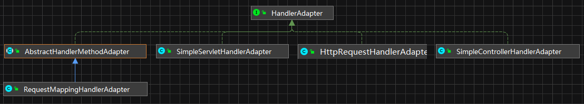

# 13 HandlerAdapter详解

HandlerMapping通过request找到了Handler，HandlerAdapter是具体使用Handler来干活的，每个HandlerAdapter封装了一种Handler的具体使用方法。HandlerAdapter的继承结构下图所示：



HandlerAdapter的接口中有三个方法，一个用来判断是否支持传入的Handler，一个用来使用Handler处理请求，还有一个用来获取资源的LastModifed值。

HttpRequestHandlerAdapter、SimpleServletHandlerAdapter和 SimpleControllerHandlerAdapter分别适配HttpRequestHandler、Servlet和Controller类型的Handler，方法非常简单,都是调用Handler里固定的方法，代码如下:

+ HttpRequestHandlerAdapter.java

```java

package org.springframework.web.servlet.mvc;

import javax.servlet.http.HttpServletRequest;
import javax.servlet.http.HttpServletResponse;

import org.springframework.lang.Nullable;
import org.springframework.web.HttpRequestHandler;
import org.springframework.web.servlet.HandlerAdapter;
import org.springframework.web.servlet.ModelAndView;

public class HttpRequestHandlerAdapter implements HandlerAdapter {

   @Override
   public boolean supports(Object handler) {
      return (handler instanceof HttpRequestHandler);
   }

   @Override
   @Nullable
   public ModelAndView handle(HttpServletRequest request, HttpServletResponse response, Object handler)
         throws Exception {

      ((HttpRequestHandler) handler).handleRequest(request, response);
      return null;
   }

   @Override
   public long getLastModified(HttpServletRequest request, Object handler) {
      if (handler instanceof LastModified) {
         return ((LastModified) handler).getLastModified(request);
      }
      return -1L;
   }

}
```

RequestMappingHandlerAdapter继承自AbstractHandlerMethodAdapter，AbstractHandlerMethodAdapter代码如下：

+ AbstractHandlerMethodAdapter.java

```java

package org.springframework.web.servlet.mvc.method;

import javax.servlet.http.HttpServletRequest;
import javax.servlet.http.HttpServletResponse;

import org.springframework.core.Ordered;
import org.springframework.lang.Nullable;
import org.springframework.web.method.HandlerMethod;
import org.springframework.web.servlet.HandlerAdapter;
import org.springframework.web.servlet.ModelAndView;
import org.springframework.web.servlet.support.WebContentGenerator;

public abstract class AbstractHandlerMethodAdapter extends WebContentGenerator implements HandlerAdapter, Ordered {

   private int order = Ordered.LOWEST_PRECEDENCE;


   public AbstractHandlerMethodAdapter() {
      // no restriction of HTTP methods by default
      super(false);
   }


   public void setOrder(int order) {
      this.order = order;
   }

   @Override
   public int getOrder() {
      return this.order;
   }


   @Override
   public final boolean supports(Object handler) {
      return (handler instanceof HandlerMethod && supportsInternal((HandlerMethod) handler));
   }

   protected abstract boolean supportsInternal(HandlerMethod handlerMethod);

   @Override
   @Nullable
   public final ModelAndView handle(HttpServletRequest request, HttpServletResponse response, Object handler)
         throws Exception {

      return handleInternal(request, response, (HandlerMethod) handler);
   }

   @Nullable
   protected abstract ModelAndView handleInternal(HttpServletRequest request,
         HttpServletResponse response, HandlerMethod handlerMethod) throws Exception;

   @Override
   public final long getLastModified(HttpServletRequest request, Object handler) {
      return getLastModifiedInternal(request, (HandlerMethod) handler);
   }

   protected abstract long getLastModifiedInternal(HttpServletRequest request, HandlerMethod handlerMethod);

}
```

接下来看RequestMappingHandlerAdapter，RequestMappingHandlerAdapter可以说是整个Spring MVC中最复杂的组件,其中最重要就是handleInternal方法，就是这个方法实际使用Handler处理请求。具体处理过程大致可以分为三步:

1. 备好处理器所需要的参数。
2. 使用处理器处理请求。
3. 处理返回值，也就是将不同类型的返回值统一处理成ModelAndView类型。

这三步里面第2步直接使用反射技术调用处理器执行就可以了，最麻烦的是第1步，也就是参数的准备工作，这一步根据处理器的需要设置参数,而参数的类型、个数都是不确定的，所以难度非常大，另外这个过程中使用了大量的组件,这也是这一步的代码不容易理解的重要原因之一。

想要理解参数的绑定需要先明白三个问题：

1. 都有哪些参数需要绑定。
2. 参数的值的来源。
3. 具体进行绑定的方法。

参数来源有6个:

1. request中相关的参数，主要包括url中的参数、post过来的参数以及请求头所包含的值。
2. cookie中的参数。session中的参数。
3. 设置到FlashMap 中的参数，这种参数主要用于redirect的参数传递。
4. SessionAttributes 传递的参数，这类参数通过@SessionAttributes注释传递，后面会详细讲解。
5. 通过相应的注释了@ModelAttribute的方法进行设置的参数。

## 13.1 参数解析器

参数具体解析是使用HandlerMethodArgumentResolver类型的组件完成的，不同类型的参数使用不同的ArgumentResolver来解析。

RequestMappingHandlerAdapter处理请求真正执行的是handleInternal：

+ RequestMappingHandlerAdapter.java

```java
@Nullable
protected ModelAndView invokeHandlerMethod(HttpServletRequest request,
      HttpServletResponse response, HandlerMethod handlerMethod) throws Exception {

   ServletWebRequest webRequest = new ServletWebRequest(request, response);
   try {
      WebDataBinderFactory binderFactory = getDataBinderFactory(handlerMethod);
      ModelFactory modelFactory = getModelFactory(handlerMethod, binderFactory);

      ServletInvocableHandlerMethod invocableMethod = createInvocableHandlerMethod(handlerMethod);
      if (this.argumentResolvers != null) {
         invocableMethod.setHandlerMethodArgumentResolvers(this.argumentResolvers);
      }
      if (this.returnValueHandlers != null) {
         invocableMethod.setHandlerMethodReturnValueHandlers(this.returnValueHandlers);
      }
      invocableMethod.setDataBinderFactory(binderFactory);
      invocableMethod.setParameterNameDiscoverer(this.parameterNameDiscoverer);

      ModelAndViewContainer mavContainer = new ModelAndViewContainer();//存放请求中的参数和返回的视图
      mavContainer.addAllAttributes(RequestContextUtils.getInputFlashMap(request));
      modelFactory.initModel(webRequest, mavContainer, invocableMethod);
      mavContainer.setIgnoreDefaultModelOnRedirect(this.ignoreDefaultModelOnRedirect);

      AsyncWebRequest asyncWebRequest = WebAsyncUtils.createAsyncWebRequest(request, response);
      asyncWebRequest.setTimeout(this.asyncRequestTimeout);

      WebAsyncManager asyncManager = WebAsyncUtils.getAsyncManager(request);
      asyncManager.setTaskExecutor(this.taskExecutor);
      asyncManager.setAsyncWebRequest(asyncWebRequest);
      asyncManager.registerCallableInterceptors(this.callableInterceptors);
      asyncManager.registerDeferredResultInterceptors(this.deferredResultInterceptors);

      if (asyncManager.hasConcurrentResult()) {
         Object result = asyncManager.getConcurrentResult();
         mavContainer = (ModelAndViewContainer) asyncManager.getConcurrentResultContext()[0];
         asyncManager.clearConcurrentResult();
         if (logger.isDebugEnabled()) {
            logger.debug("Found concurrent result value [" + result + "]");
         }
         invocableMethod = invocableMethod.wrapConcurrentResult(result);
      }

      invocableMethod.invokeAndHandle(webRequest, mavContainer);//真正执行的地方
      if (asyncManager.isConcurrentHandlingStarted()) {
         return null;
      }

      return getModelAndView(mavContainer, modelFactory, webRequest);
   }
   finally {
      webRequest.requestCompleted();
   }
}
```

+ ServletInvocableHandlerMethod.java

```java
public void invokeAndHandle(ServletWebRequest webRequest, ModelAndViewContainer mavContainer,
      Object... providedArgs) throws Exception {

   Object returnValue = invokeForRequest(webRequest, mavContainer, providedArgs);
   setResponseStatus(webRequest);

   if (returnValue == null) {
      if (isRequestNotModified(webRequest) || getResponseStatus() != null || mavContainer.isRequestHandled()) {
         mavContainer.setRequestHandled(true);
         return;
      }
   }
   else if (StringUtils.hasText(getResponseStatusReason())) {
      mavContainer.setRequestHandled(true);
      return;
   }

   mavContainer.setRequestHandled(false);
   Assert.state(this.returnValueHandlers != null, "No return value handlers");
   try {
      this.returnValueHandlers.handleReturnValue(
            returnValue, getReturnValueType(returnValue), mavContainer, webRequest);
   }
   catch (Exception ex) {
      if (logger.isTraceEnabled()) {
         logger.trace(getReturnValueHandlingErrorMessage("Error handling return value", returnValue), ex);
      }
      throw ex;
   }
}
```

其中执行相应目标方法的函数是 invokeForRequest(webRequest, mavContainer, providedArgs):

+ InvocableHandlerMethod.java

```java
public Object invokeForRequest(NativeWebRequest request, @Nullable ModelAndViewContainer mavContainer,
			Object... providedArgs) throws Exception {

		Object[] args = getMethodArgumentValues(request, mavContainer, providedArgs);
		if (logger.isTraceEnabled()) {
			logger.trace("Invoking '" + ClassUtils.getQualifiedMethodName(getMethod(), getBeanType()) +
					"' with arguments " + Arrays.toString(args));
		}
		Object returnValue = doInvoke(args);
		if (logger.isTraceEnabled()) {
			logger.trace("Method [" + ClassUtils.getQualifiedMethodName(getMethod(), getBeanType()) +
					"] returned [" + returnValue + "]");
		}
		return returnValue;
	}


private Object[] getMethodArgumentValues(NativeWebRequest request, @Nullable ModelAndViewContainer mavContainer,
      Object... providedArgs) throws Exception {

   MethodParameter[] parameters = getMethodParameters();//直接拿到方法的所有参数
   Object[] args = new Object[parameters.length];//准备args数组
   for (int i = 0; i < parameters.length; i++) {
      MethodParameter parameter = parameters[i];
      parameter.initParameterNameDiscovery(this.parameterNameDiscoverer);
      args[i] = resolveProvidedArgument(parameter, providedArgs);
      if (args[i] != null) {
         continue;
      }
      if (this.resolvers.supportsParameter(parameter)) {
         try {
            args[i] = this.resolvers.resolveArgument(
                  parameter, mavContainer, request, this.dataBinderFactory);
            continue;
         }
         catch (Exception ex) {
          ...
         }
      }
      if (args[i] == null) {
         throw new IllegalStateException(...);
      }
   }
   return args;
}
```

其中supportsParameter(parameter)用于判断当前的参数解析器能否支持当前参数，如果支持，则会调用相应的参数解析器进行参数的解析

+ HandlerMethodArgumentResolverComposite.java

```java
@Nullable
private HandlerMethodArgumentResolver getArgumentResolver(MethodParameter parameter) {
   HandlerMethodArgumentResolver result = this.argumentResolverCache.get(parameter);
   if (result == null) {
      for (HandlerMethodArgumentResolver resolver : this.argumentResolvers) {
         if (resolver.supportsParameter(parameter)) {
            result = resolver;
            this.argumentResolverCache.put(parameter, result);//如果找到，则把处理相应类型的参数解析器放入缓存中
            break;
         }
      }
   }
   return result;
}


public Object resolveArgument(MethodParameter parameter, @Nullable ModelAndViewContainer mavContainer,
			NativeWebRequest webRequest, @Nullable WebDataBinderFactory binderFactory) throws Exception {

		HandlerMethodArgumentResolver resolver = getArgumentResolver(parameter);
		if (resolver == null) {
			throw new IllegalArgumentException(...);
		}
		return resolver.resolveArgument(parameter, mavContainer, webRequest, binderFactory);
	}
```

## 13.2 补充之@SessionAttribute是什么以及怎么用

@SessionAttribute注释用在处理器类上，用于在多个请求之间传递参数，类似于Session 的 Attribute，但不完全一样。一般来说@SessionAttribute设置的参数只用于暂时的传递，而不是长期的保存，像身份验证信息等需要长期保存的参数还是应该使用Session的setAttribute设置到Session中。

通过@SessionAttribute注释设置的参数有3类用法:

①在视图中通过request.getAttribute或 session.getAttribute获取;

②在后面请求返回的视图中通过session.getAttribute或者从 Model中获取;

③自动将参数设置到后面请求所对应处理器的Model类型参数或者有@ModelAttribute注释的参数里面。

将一个参数设置到SessionAttribute中需要满足两个条件:

①在@SessionAttribute注释中设置了参数的名字或者类型;

②在处理器中将参数设置到了model中。

@SessionAttribute用完后可以调用SessionStatus.setComplete来清除。这种方法只清除SessionAttribute里的参数，而不会影响Session中的疹数。SesS1onStaus 以尺入在处理器方法的参数中，RequestMappingHandlerAdapter会自动将其设置进去。

例子如下：

```java
package com.codingInn.web.controller;

import org.apache.commons.logging.Log;
import org.apache.commons.logging.LogFactory;
import org.springframework.stereotype.Controller;
import org.springframework.ui.Model;
import org.springframework.ui.ModelMap;
import org.springframework.web.bind.annotation.ModelAttribute;
import org.springframework.web.bind.annotation.RequestMapping;
import org.springframework.web.bind.annotation.SessionAttributes;
import org.springframework.web.bind.support.SessionStatus;

@Controller
@RequestMapping("/book")
@SessionAttributes(value = {"book","description"},types = {Double.class})
public class BookController {
   private final Log logger = LogFactory.getLog(BookController.class);

   @RequestMapping("/index")
   public String index(Model model) throws Exception{
      model.addAttribute("book","C++ primer");
      model.addAttribute("description","C plus plus");
      model.addAttribute("price",new Double("100"));
      return "redirect:get";
   }

   @RequestMapping("/get")
   public String getBySessionAttributes(@ModelAttribute("book") String book, ModelMap modelMap, SessionStatus sessionStatus) throws Exception{
      logger.info("===============getBySessionAttributes===============");
      logger.info("get by @ModelAttribute:" + book);
      logger.info("get by ModelMap:"+modelMap.get("book")+":"+modelMap.get("description")+","+modelMap.get("price"));
      sessionStatus.setComplete();
      return "redirect:complete";
   }

   @RequestMapping("/complete")
   public String afterComplete(ModelMap modelMap) throws Exception{
      logger.info("===============afterComplete===============");
      logger.info(modelMap.get("book")+":"+modelMap.get("description")+","+modelMap.get("price"));
      return "go";
   }
}
```

输出如下：

```cmd
===============getBySessionAttributes===============
get by @ModelAttribute:C++ primer
get by ModelMap:C++ primer:C plus plus,100.0
===============afterComplete===============
null:null,null
```

这个处理器类注释了@SessionAttributes，它将会对book、description为名称的参数所有Double类型的参数使用SessionAttributes来缓存，所以在/book/index请求中将boodescription和 price三个参数设置到Model 的同时也会自动设置到SessionAttributes中，这样在 redirect后的getBySessionAttributes处理器方法中就可以获取到，获取的方法使用了@ModelAttribute和 ModelMap两种方式，使用完后通过调用sessionStatus.setComplete()通知SessionAttributes已经使用完了，这时参数就从缓存中删除了，所以在再次redirect后的afterComplete处理器方法里面就获取不到了。

@SessionAttribute合适的使用将会带来很大方便，比如，企业业务系统里面常用到的根据查询条件参数查询记录而且结果要分页显示的情况，这时候每翻一页都需要传递一次参数，如果将查询参数保存到SessionAttribute里面就非常方便了。再如，很多查询页面都有下拉列表，而且在业务系统里这些列表的值很多时候都是可变的，是保存在数据库里面的，使用时需要从数据库里获取，如果将它们保存到SessionAttribute里会非常方便，那样不但不需要每次使用时都查询了，而且连处理器里设置到model的过程都不需要了(但@SessionAttribute注释不能少)，直接在View里使用就行。

