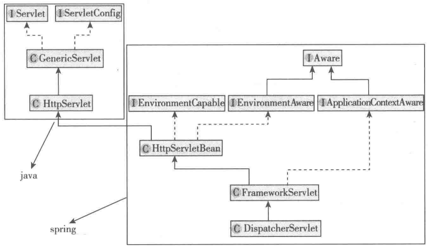
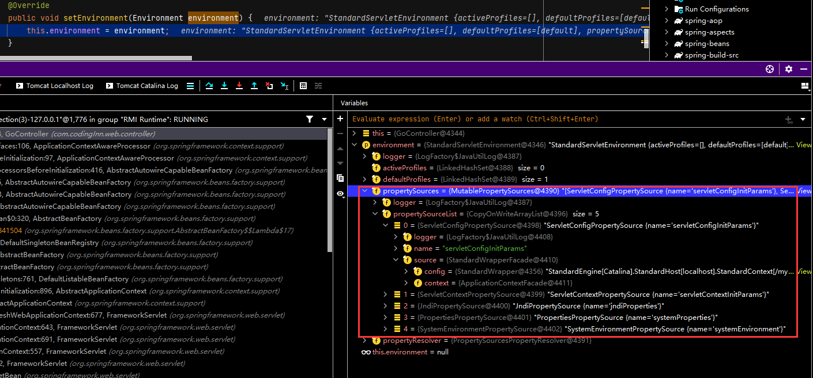
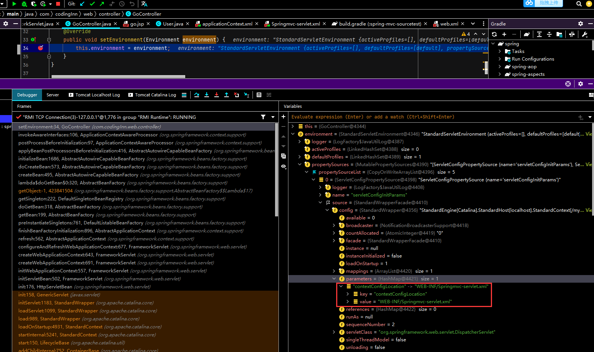
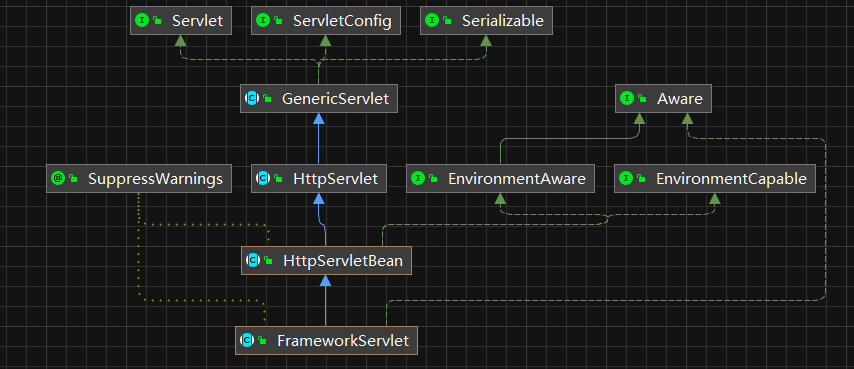
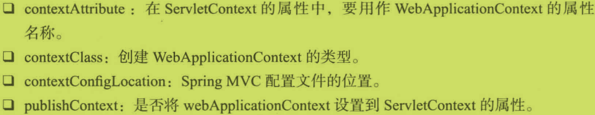
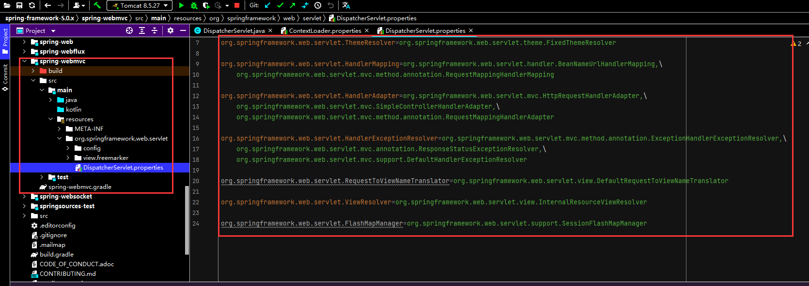

# 9 SpringMVC的创建过程

## 9.1 整体结构介绍

SpringMVC核心Servlet结构图如下：



Spring MVC 中 Servlet一共有三个层次,分别是HttpServletBean、FrameworkServlet和 DispatcherServlet。HttpServletBean直接继承自Java的 HttpServlet，其作用是将Servlet中配置的参数设置到相应的属性;FrameworkServlet初始化了WebApplicationContext，DispatcherServlet初始化了自身的9个组件。

为了便于调试，修改GoController类如下：

+ GoController.java

```java
package com.codingInn.web.controller;

import org.apache.commons.logging.Log;
import org.apache.commons.logging.LogFactory;
import org.springframework.context.EnvironmentAware;
import org.springframework.core.env.Environment;
import org.springframework.stereotype.Controller;
import org.springframework.ui.Model;
import org.springframework.web.bind.annotation.RequestMapping;
import org.springframework.web.bind.annotation.RequestMethod;

@Controller
public class GoController implements EnvironmentAware {
   private final Log logger = LogFactory.getLog(GoController.class);

   private Environment environment = null;

   //处理HEAD类型的"/"请求
   @RequestMapping(value = {"/"},method = {RequestMethod.HEAD})
   public String head(){
      return "go";
   }

   //处理get类型的“index”和"/"请求
   @RequestMapping(value = {"/go","/"},method = {RequestMethod.GET})
   public String index(Model model) throws Exception{
      logger.info("=========processed by index=======");
      model.addAttribute("msg","Go GO GO");
      return "go";
   }

   @Override
   public void setEnvironment(Environment environment) {
      this.environment = environment;
   }
}
```

并对web.xml做出如下修改,设置Servlet定义时的contextConfigLocation属性。

+ web.xml

```xml
<?xml version="1.0" encoding="UTF-8"?>
<web-app xmlns:xsi="http://www.w3.org/2001/XMLSchema-instance"
   xmlns="http://java.sun.com/xml/ns/javaee"
   xsi:schemaLocation="http://java.sun.com/xml/ns/javaee http://java.sun.com/xml/ns/javaee/web-app_2_5.xsd"
   version="2.5">
  <display-name>spring-mvc-sourcetest</display-name>

   <context-param>
      <param-name>contextConfigLocation</param-name>
      <param-value>classpath:applicationContext.xml</param-value>
   </context-param>

<!--   DispatcherServlet是子容器  父容器是Spring配置文件进行包扫描并保存所有组件的容器      子容器是SpringMVC配置文件进行包扫描并保存所有组件的容器-->
   <servlet>
      <servlet-name>Springmvc</servlet-name>
      <servlet-class>org.springframework.web.servlet.DispatcherServlet</servlet-class>
<!--      设置servlet定义时的contextConfigLocation属性-->
      <init-param>
         <param-name>contextConfigLocation</param-name>
         <param-value>WEB-INF/Springmvc-servlet.xml</param-value>
      </init-param>
      
      <load-on-startup>1</load-on-startup>
   </servlet>

   <servlet-mapping>
      <servlet-name>Springmvc</servlet-name>
      <url-pattern>/</url-pattern>
   </servlet-mapping>


  <welcome-file-list>
    <welcome-file>index.html</welcome-file>
    <welcome-file>index.jsp</welcome-file>
  </welcome-file-list>
   
   <listener>
      <listener-class>org.springframework.web.context.ContextLoaderListener</listener-class>
   </listener>

</web-app>
```

environment的细节如下:



ServletConfigPropertySource封装的是ServletConfig,之前设置的属性contextConfigLocation可以在config下的parameters里看到：



## 9.2 HttpServletBean

Servlet在创建时，会调用无参的init方法，HttpServletBean的init方法如下：

+ HttpServletBean.java

```java
@Override
public final void init() throws ServletException {
   if (logger.isDebugEnabled()) {
      logger.debug("Initializing servlet '" + getServletName() + "'");
   }

   // 将Servlet中配置的参数封装到pvs变量中，requiredProperties为必需参数，如果没有配置将报异常
   PropertyValues pvs = new ServletConfigPropertyValues(getServletConfig(), this.requiredProperties);
   if (!pvs.isEmpty()) {
      try {
         //将当前的这个servlet类转化为一个BeanWrapper，从而能够以Spring的方式来对innt-param值进行注入
         BeanWrapper bw = PropertyAccessorFactory.forBeanPropertyAccess(this);
         ResourceLoader resourceLoader = new ServletContextResourceLoader(getServletContext());
         //注册自定义属性编辑器，一旦遇到Resource类型的属性就会使用ResourceEditor进行解析
         bw.registerCustomEditor(Resource.class, new ResourceEditor(resourceLoader, getEnvironment()));
         //空实现，留给子类覆盖
         initBeanWrapper(bw);
         //属性注入，如将contextConfigLocation设置到DispatcherServlet
         bw.setPropertyValues(pvs, true);
      }
      catch (BeansException ex) {
         if (logger.isErrorEnabled()) {
            logger.error("Failed to set bean properties on servlet '" + getServletName() + "'", ex);
         }
         throw ex;
      }
   }

   // 留给子类扩展
   initServletBean();

   if (logger.isDebugEnabled()) {
      logger.debug("Servlet '" + getServletName() + "' configured successfully");
   }
}
```

## 9.3 补充：BeanWrapper

BeanWrapper是bean的包装类，可以直接修改一个对象的属性，示例如下：

```java
public class User {
    String userName;
    public String getUserName () {
        return userName;
    }
    
    public void setUserName (String userName){
        this.userName = userName;
    }
}


public class BeanWrapperTest {
    public static void main(String[] args) {
        User user = new User();
        Beanwrapper bw = PropertyAccessorFactory.forBeanPropertyAccess(user);
        bw.setPropertyvalue("userName", "张三");
        System.out.println(user.getUserName());//输出张三
        Propertyvalue value = new Propertyvalue("userName"，"李四"); bw.setPropertyvalue(value);
        System.out.println(user.getUserName());//输出李四
    }
}
```

## 9.4 FrameworkServlet

FrameworkServlet的类图如下



FrameworkServlet的父类HttpServletBean的init函数提供了模板方法，其中的initServletBean由FrameworkServlet实现，具体实现如下：

+ FrameworkServlet.java

```java
@Override
protected final void initServletBean() throws ServletException {
   getServletContext().log("Initializing Spring FrameworkServlet '" + getServletName() + "'");
   if (logger.isInfoEnabled()) {
      logger.info("FrameworkServlet '" + getServletName() + "': initialization started");
   }
   long startTime = System.currentTimeMillis();

   try {
      this.webApplicationContext = initWebApplicationContext();//初始化WebApplicationContext
      initFrameworkServlet();//初始化FrameworkServlet
   }
   catch (ServletException | RuntimeException ex) {
      logger.error("Context initialization failed", ex);
      throw ex;
   }

   if (logger.isInfoEnabled()) {
      long elapsedTime = System.currentTimeMillis() - startTime;
      logger.info("FrameworkServlet '" + getServletName() + "': initialization completed in " +
            elapsedTime + " ms");
   }
}
```

initWebApplicationContext()方法如下，该方法做了三件事：

1. 获取spring的根容器rootContext。
2. 设置webApplicationContext并根据情况调用onRefresh方法。
3. 将webApplicationContext 设置到 ServletContext中。

+ FrameworkServlet.java

```java
protected WebApplicationContext initWebApplicationContext() {
    //获取rootContext
   WebApplicationContext rootContext =
         WebApplicationContextUtils.getWebApplicationContext(getServletContext());
   WebApplicationContext wac = null;

    //第一种方法
   if (this.webApplicationContext != null) {
      // 如果已经通过构造方法设置了webApplicationContext
      wac = this.webApplicationContext;
      if (wac instanceof ConfigurableWebApplicationContext) {
         ConfigurableWebApplicationContext cwac = (ConfigurableWebApplicationContext) wac;
         if (!cwac.isActive()) {
            if (cwac.getParent() == null) {
               cwac.setParent(rootContext);//父子容器的体现
            }
            configureAndRefreshWebApplicationContext(cwac);//刷新上下文环境
         }
      }
   }
    //第二种方法
   if (wac == null) {
      // 当webApplicationContext已经存在ServletContext中时，通过配置在Servlet中的contextAttribute参数获取
      wac = findWebApplicationContext();
   }
    //第三种方法
   if (wac == null) {
      // 如果webApplicationContext还没有创建，则创建一个
      wac = createWebApplicationContext(rootContext);
   }

   if (!this.refreshEventReceived) {
      // 当ContextRefreshedEvent事件没有触发时调用此方法，模板方法，可以在子类重写
      synchronized (this.onRefreshMonitor) {
         onRefresh(wac);
      }
   }

   if (this.publishContext) {
      // 将ApplicationContext保存到ServletContext中
      String attrName = getServletContextAttributeName();
      getServletContext().setAttribute(attrName, wac);
      if (this.logger.isDebugEnabled()) {
         this.logger.debug("Published WebApplicationContext of servlet '" + getServletName() +
               "' as ServletContext attribute with name [" + attrName + "]");
      }
   }

   return wac;
}
```

### 设置webApplicationContext并根据情况调用onRefresh方法

1. 第一种方法是在构造方法中已经传递webApplicationContext参数，这时只需要对其进行一些设置即可。

2. 第二种方法是webApplicationContext已经在ServletContext 中了。这时只需要在配置Servlet的时候将ServletContext中的webApplicationContext 的 name配置到contextAttribute 属性就可以了。比如，在ServletContext中有一个叫haha的 webApplicationContext，可以这么将它配置到Spring MVC中：

```xml
    <servlet>
      <servlet-name>Springmvc</servlet-name>
      <servlet-class>org.springframework.web.servlet.DispatcherServlet</servlet-class>

      <init-param>
         <param-name>contextAttribute</param-name>
         <param-value>haha</param-value>
      </init-param>
      
      <load-on-startup>1</load-on-startup>
   </servlet>
```

3. 第三种方法是在前面两种方式都无效的情况下自己创建一个。正常情况下就是使用的这种方式。创建过程在createWebApplicationContext方法中，createWebApplicationContext内部又调用了configureAndRefresh WebApplicationContext方法,代码如下:

+ FrameworkServlet.java

```java
protected WebApplicationContext createWebApplicationContext(@Nullable WebApplicationContext parent) {
   return createWebApplicationContext((ApplicationContext) parent);
}


protected WebApplicationContext createWebApplicationContext(@Nullable ApplicationContext parent) {
    		//获取创建类型
		Class<?> contextClass = getContextClass();
		if (this.logger.isDebugEnabled()) {
			this.logger.debug("Servlet with name '" + getServletName() +
					"' will try to create custom WebApplicationContext context of class '" +
					contextClass.getName() + "'" + ", using parent context [" + parent + "]");
		}
    		//检查创建类型
		if (!ConfigurableWebApplicationContext.class.isAssignableFrom(contextClass)) {
			throw new ApplicationContextException(
					"Fatal initialization error in servlet with name '" + getServletName() +
					"': custom WebApplicationContext class [" + contextClass.getName() +
					"] is not of type ConfigurableWebApplicationContext");
		}
    		//具体创建
		ConfigurableWebApplicationContext wac =
				(ConfigurableWebApplicationContext) BeanUtils.instantiateClass(contextClass);//通过反射方式实例化contextClass

		wac.setEnvironment(getEnvironment());
		wac.setParent(parent);
		String configLocation = getContextConfigLocation();
		if (configLocation != null) {
            	//将设置的contextConfigLocation参数传给wac，默认传入的是WEB-INFO/[ServletName]-Servlet.xml
			wac.setConfigLocation(configLocation);
		}
		configureAndRefreshWebApplicationContext(wac);//初始化Spring环境包括加载配置文件等

		return wac;
	}


protected void configureAndRefreshWebApplicationContext(ConfigurableWebApplicationContext wac) {
		if (ObjectUtils.identityToString(wac).equals(wac.getId())) {
			if (this.contextId != null) {
				wac.setId(this.contextId);
			}
			else {
				wac.setId(ConfigurableWebApplicationContext.APPLICATION_CONTEXT_ID_PREFIX +
						ObjectUtils.getDisplayString(getServletContext().getContextPath()) + '/' + getServletName());
			}
		}

		wac.setServletContext(getServletContext());
		wac.setServletConfig(getServletConfig());
		wac.setNamespace(getNamespace());
    		//添加监听ContextRefreshedEvent的监听器
		wac.addApplicationListener(new SourceFilteringListener(wac, new ContextRefreshListener()));

		ConfigurableEnvironment env = wac.getEnvironment();
		if (env instanceof ConfigurableWebEnvironment) {
			((ConfigurableWebEnvironment) env).initPropertySources(getServletContext(), getServletConfig());
		}

		postProcessWebApplicationContext(wac);
		applyInitializers(wac);
		wac.refresh();//加载配置文件以及整合parent到wac
	}
```

SourceFilteringListener可以根据输入的参数进行选择，所以实际监听的是ContextRefreshListener所监听的事件。ContextRefreshListener是FrameworkServlet的内部类，监听ContextRefreshedEvent 事件，当接收到消息时调用FrameworkServlet的onApplicationEvent方法，在onApplicationEvent 中会调用一次onRefresh方法，并将refreshEventReceived标志设置为true,表示已经refresh过，代码如下:

+ FrameworkServlet.java

```java
//内部类
private class ContextRefreshListener implements ApplicationListener<ContextRefreshedEvent> {

   @Override
   public void onApplicationEvent(ContextRefreshedEvent event) {
      FrameworkServlet.this.onApplicationEvent(event);
   }
}


public void onApplicationEvent(ContextRefreshedEvent event) {
		this.refreshEventReceived = true;
		synchronized (this.onRefreshMonitor) {
			onRefresh(event.getApplicationContext());
		}
	}
```

再回到FrameworkServlet.java的initWebApplicationContext中：

```java
protected WebApplicationContext initWebApplicationContext() {
    //获取rootContext
   WebApplicationContext rootContext =
         WebApplicationContextUtils.getWebApplicationContext(getServletContext());
   WebApplicationContext wac = null;

    //第一种方法
   if (this.webApplicationContext != null) {
      // 如果已经通过构造方法设置了webApplicationContext
      wac = this.webApplicationContext;
      if (wac instanceof ConfigurableWebApplicationContext) {
         ConfigurableWebApplicationContext cwac = (ConfigurableWebApplicationContext) wac;
         if (!cwac.isActive()) {
            // The context has not yet been refreshed -> provide services such as
            // setting the parent context, setting the application context id, etc
            if (cwac.getParent() == null) {
               // The context instance was injected without an explicit parent -> set
               // the root application context (if any; may be null) as the parent
               cwac.setParent(rootContext);//父子容器的体现
            }
            configureAndRefreshWebApplicationContext(cwac);//刷新上下文环境
         }
      }
   }
    //第二种方法
   if (wac == null) {
      // 当webApplicationContext已经存在ServletContext中时，通过配置在Servlet中的contextAttribute参数获取
      wac = findWebApplicationContext();
   }
    //第三种方法
   if (wac == null) {
      // 如果webApplicationContext还没有创建，则创建一个
      wac = createWebApplicationContext(rootContext);
   }

   if (!this.refreshEventReceived) {
      // 当ContextRefreshedEvent事件没有触发时调用此方法，模板方法，可以在子类重写
      synchronized (this.onRefreshMonitor) {
         onRefresh(wac);
      }
   }

   if (this.publishContext) {
      // 将ApplicationContext保存到ServletContext中,之所以要将创建出来的webApplicationContext设置到ServletContext的属性中，主要是为了方便获取
      String attrName = getServletContextAttributeName();
      getServletContext().setAttribute(attrName, wac);
      if (this.logger.isDebugEnabled()) {
         this.logger.debug("Published WebApplicationContext of servlet '" + getServletName() +
               "' as ServletContext attribute with name [" + attrName + "]");
      }
   }

   return wac;
}
```

可以看到后面会根据refreshEventReceived标志来判断是否要运行onRefresh。当使用第三种方法初始化时已经refresh，不需要再调用onRefresh。同样在第一种方式中也调用了configureAndRefresh WebApplicationContext方法，也 refresh过，所以只有使用第二种方式初始化 webApplicationContext的时候才会在这里调用onRefresh方法。不过不管用哪种方式调用，onRefresh最终肯定会而且只会调用一次，而且DispatcherServlet正是通过重写这个模板方法来实现初始化的。

在配置Servlet时，可以设置如下一些初始化参数：



## 9.5 DispatcherServlet

HttpServletBean的init()函数中的onRefresh函数时进入DispatcherServlet类的入口方法。

+ DispatcherServlet.java

```java
@Override
protected void onRefresh(ApplicationContext context) {
   initStrategies(context);
}


//调用了九个初始化方法
protected void initStrategies(ApplicationContext context) {
		initMultipartResolver(context);
		initLocaleResolver(context);
		initThemeResolver(context);
		initHandlerMappings(context);
		initHandlerAdapters(context);
		initHandlerExceptionResolvers(context);
		initRequestToViewNameTranslator(context);
		initViewResolvers(context);
		initFlashMapManager(context);
	}
```

以initLocaleResolver(context)为例：

```java
private void initLocaleResolver(ApplicationContext context) {
   try {
       //在context中获取
      this.localeResolver = context.getBean(LOCALE_RESOLVER_BEAN_NAME, LocaleResolver.class);
      if (logger.isDebugEnabled()) {
         logger.debug("Using LocaleResolver [" + this.localeResolver + "]");
      }
   }
   catch (NoSuchBeanDefinitionException ex) {
      // 如果context中没有，则使用默认策略
      this.localeResolver = getDefaultStrategy(context, LocaleResolver.class);
      if (logger.isDebugEnabled()) {
         logger.debug("Unable to locate LocaleResolver with name '" + LOCALE_RESOLVER_BEAN_NAME +
               "': using default [" + this.localeResolver + "]");
      }
   }
}
```

初始化方式分两步:首先通过context.getBean在容器里面按注册时的名称或类型(这里指”localeResolver”名称或者LocaleResolver.class类型)进行查找，所以在Spring MVC的配置文件中只需要配置相应类型的组件，容器就可以自动找到。如果找不到就调用getDefaultStrategy按照类型获取默认的组件。需要注意的是，这里的context指的是FrameworkServlet.java中创建的WebApplicationContext，而不是ServletContext。下面介绍getDefaultStrategy是怎样获取默认组件的。

+ DispatcherServlet.java

```java
protected <T> T getDefaultStrategy(ApplicationContext context, Class<T> strategyInterface) {
   List<T> strategies = getDefaultStrategies(context, strategyInterface);
   if (strategies.size() != 1) {
      throw new BeanInitializationException(
            "DispatcherServlet needs exactly 1 strategy for interface [" + strategyInterface.getName() + "]");
   }
   return strategies.get(0);
}
```

+ StandardWrapper.java

```java
protected <T> List<T> getDefaultStrategies(ApplicationContext context, Class<T> strategyInterface) {
   String key = strategyInterface.getName();
    //从defaultStrategies获取所需策略的类型
   String value = defaultStrategies.getProperty(key);
   if (value != null) {
        //如果由多个默认值，则以逗号分隔为数组
      String[] classNames = StringUtils.commaDelimitedListToStringArray(value);
      List<T> strategies = new ArrayList<>(classNames.length);
        //按获取到的类型初始化策略
      for (String className : classNames) {
         try {
            Class<?> clazz = ClassUtils.forName(className, DispatcherServlet.class.getClassLoader());
            Object strategy = createDefaultStrategy(context, clazz);
            strategies.add((T) strategy);
         }
         catch (ClassNotFoundException ex) {
            throw new BeanInitializationException(
                  "Could not find DispatcherServlet's default strategy class [" + className +
                  "] for interface [" + key + "]", ex);
         }
         catch (LinkageError err) {
            throw new BeanInitializationException(
                  "Unresolvable class definition for DispatcherServlet's default strategy class [" +
                  className + "] for interface [" + key + "]", err);
         }
      }
      return strategies;
   }
   else {
      return new LinkedList<>();
   }
}
```

其中defaultStrategies是一个静态属性，在static块中进行初始化:

+ DisPatcherServlet.java

```java
private static final Properties defaultStrategies;

static {
   try {
      ClassPathResource resource = new ClassPathResource(DEFAULT_STRATEGIES_PATH, DispatcherServlet.class);
      defaultStrategies = PropertiesLoaderUtils.loadProperties(resource);
   }
   catch (IOException ex) {
      throw new IllegalStateException("Could not load '" + DEFAULT_STRATEGIES_PATH + "': " + ex.getMessage());
   }
}
```

可以看到defaultStrategies中存放的是包下的DEFAULT_STRATEGIES_PATH文件里定义的属性：

```java
private static final String DEFAULT_STRATEGIES_PATH = "DispatcherServlet.properties";
```



另外需要注意的一点是，默认配置是在相应类型没有配置的时候才会使用，如当使用<mvc:annotation-driven >后，并不会全部使用默认配置。因为它配置了HandlerMapping、HandlerAdapter和 HandlerExceptionResolver,而且还做了很多别的工作。

