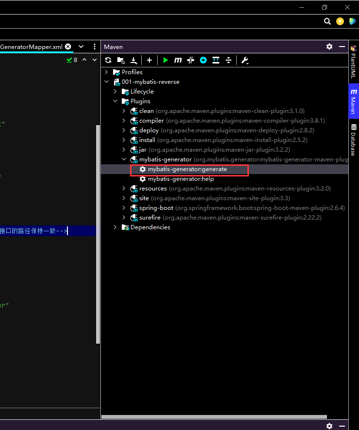

代码地址:https://gitee.com/codinginn/spring-boot-tutorial/tree/master/001-mybatis-reverse

## 1. 准备数据库

```sql
create database springboot;
use springboot;

DROP TABLE IF EXISTS `t_student`;
CREATE TABLE `t_student` (
  `id` int(10) NOT NULL AUTO_INCREMENT,
  `name` varchar(20) DEFAULT NULL,
  `age` int(10) DEFAULT NULL,
  PRIMARY KEY (`id`)
) ENGINE=InnoDB AUTO_INCREMENT=10 DEFAULT CHARSET=utf8;

-- ----------------------------
-- Records of t_student
-- ----------------------------
INSERT INTO `t_student` VALUES ('1', 'jinkesi', '22');
INSERT INTO `t_student` VALUES ('2', 'lisi', '33');
INSERT INTO `t_student` VALUES ('3', 'wwangwu', '21');
INSERT INTO `t_student` VALUES ('4', 'liuneng', '12');
INSERT INTO `t_student` VALUES ('5', 'asan', '34');
INSERT INTO `t_student` VALUES ('6', 'json', '32');
INSERT INTO `t_student` VALUES ('7', 'jack', '21');
INSERT INTO `t_student` VALUES ('8', 'anny', '23');
INSERT INTO `t_student` VALUES ('9', 'tom', '24');
```

## 2. 在pom.xml中引入mybatis和mysql的jar包

```xml
<?xml version="1.0" encoding="UTF-8"?>
<project xmlns="http://maven.apache.org/POM/4.0.0" xmlns:xsi="http://www.w3.org/2001/XMLSchema-instance"
         xsi:schemaLocation="http://maven.apache.org/POM/4.0.0 https://maven.apache.org/xsd/maven-4.0.0.xsd">
    <modelVersion>4.0.0</modelVersion>
    <parent>
        <groupId>org.springframework.boot</groupId>
        <artifactId>spring-boot-starter-parent</artifactId>
        <version>2.6.4</version>
        <relativePath/> <!-- lookup parent from repository -->
    </parent>
    <groupId>com.example</groupId>
    <artifactId>mybatisreverse</artifactId>
    <version>0.0.1-SNAPSHOT</version>
    <name>001-mybatis-reverse</name>
    <description>001-mybatis-reverse</description>
    <properties>
        <java.version>11</java.version>
    </properties>
    <dependencies>
        <dependency>
            <groupId>org.springframework.boot</groupId>
            <artifactId>spring-boot-starter-web</artifactId>
        </dependency>

        <dependency>
            <groupId>org.springframework.boot</groupId>
            <artifactId>spring-boot-starter-test</artifactId>
            <scope>test</scope>
        </dependency>

        <!--Mybatis整合springboot-->
        <dependency>
            <groupId>org.mybatis.spring.boot</groupId>
            <artifactId>mybatis-spring-boot-starter</artifactId>
            <version>2.1.3</version>
        </dependency>

        <!--mysql驱动依赖-->
        <dependency>
            <groupId>mysql</groupId>
            <artifactId>mysql-connector-java</artifactId>
        </dependency>
    </dependencies>

    <build>

<!--  如果把mybatis的xml和mapper的接口放在一起，则用如下方式-->
<!--        <resources>-->
<!--            <resource>-->
<!--                <directory>src/main/java</directory>-->
<!--                <includes>-->
<!--                    <include>**/*.xml</include>-->
<!--                </includes>-->
<!--            </resource>-->
<!--        </resources>-->
        <plugins>
            <plugin>
                <groupId>org.springframework.boot</groupId>
                <artifactId>spring-boot-maven-plugin</artifactId>
            </plugin>


            <!--mybatis逆向工程插件-->
            <plugin>
                <groupId>org.mybatis.generator</groupId>
                <artifactId>mybatis-generator-maven-plugin</artifactId>
                <version>1.3.6</version>
                <configuration>
                    <!--配置文件的位置-->
                    <configurationFile>GeneratorMapper.xml</configurationFile>
                    <verbose>true</verbose>
                    <overwrite>true</overwrite>
                </configuration>
            </plugin>
        </plugins>
    </build>

</project>
```

## 3. 在application.properties中配置数据库资源

```properties
server.port=8080
server.servlet.context-path=/

spring.datasource.driver-class-name=com.mysql.cj.jdbc.Driver
spring.datasource.url=jdbc:mysql://localhost:3306/springboot?useUnicode=true&characterEncoding=UTF-8&useJDBCCompliantTimezoneShift=true&useLegacyDateTimeCode=false&serverTimezone=GMT%2B8
spring.datasource.username=root
spring.datasource.password=root
```

## 4 操作Mybatis逆向工程

1. module根目录下创建GeneratorMapper.xml

   

2. 编辑GeneratorMapper.xml

```xml
<?xml version="1.0" encoding="UTF-8"?>
<!DOCTYPE generatorConfiguration
        PUBLIC "-//mybatis.org//DTD MyBatis Generator Configuration 1.0//EN"
        "http://mybatis.org/dtd/mybatis-generator-config_1_0.dtd">
<generatorConfiguration>
    <!-- 指定连接数据库的 JDBC 驱动包所在位置，此处的路径为maven的存储仓库 -->
    <classPathEntry location="D:\deveop\Maven\apache-maven-3.8.4\maven_repository\mysql\mysql-connector-java\8.0.28\mysql-connector-java-8.0.28.jar"/>
    <!-- 配置 table 表信息内容体，targetRuntime 指定采用 MyBatis3 的版本 -->
    <context id="tables" targetRuntime="MyBatis3">
        <!-- 抑制生成注释，由于生成的注释都是英文的，可以不让它生成 -->
        <commentGenerator>
            <property name="suppressAllComments" value="true" />
        </commentGenerator>
        <!-- 配置数据库连接信息 -->
        <jdbcConnection driverClass="com.mysql.cj.jdbc.Driver"
                        connectionURL="jdbc:mysql://localhost:3306/springboot"
                        userId="root"
                        password="root">
        </jdbcConnection>
        <!-- 生成 model 类-->
        <javaModelGenerator targetPackage="com.hashnode.mybatisreverse.model"
                            targetProject="src/main/java">
            <property name="enableSubPackages" value="false" />
            <property name="trimStrings" value="false" />
        </javaModelGenerator>
        <!-- 生成  Mapper.xml 文件,推荐配置文件存储的路径在resources里面，和对应的Dao接口的路径保持一致-->
        <sqlMapGenerator targetPackage="com.hashnode.mybatisreverse.mapper"
                         targetProject="src/main/resources">
            <property name="enableSubPackages" value="false" />
        </sqlMapGenerator>
        <!-- 生成 Mapper 接口类文件-->
        <javaClientGenerator type="XMLMAPPER"
                             targetPackage="com.hashnode.mybatisreverse.mapper"
                             targetProject="src/main/java">
            <property name="enableSubPackages" value="false" />
        </javaClientGenerator>
        <!-- 数据库表名及对应的 Java 模型类名 -->
        <table tableName="t_student" domainObjectName="Student"
               enableCountByExample="false"
               enableUpdateByExample="false"
               enableDeleteByExample="false"
               enableSelectByExample="false"
               selectByExampleQueryId="false"/>
    </context>
</generatorConfiguration>
```

3. 使用 Mybatis 逆向工程生成接口、映射文件以及实体 bean

双击如下标注的位置




此时项目结构如下图所示：


生成的文件如下

+ Student.java

```java
package com.hashnode.mybatisreverse.model;

public class Student {
    private Integer id;

    private String name;

    private Integer age;

    public Integer getId() {
        return id;
    }

    public void setId(Integer id) {
        this.id = id;
    }

    public String getName() {
        return name;
    }

    public void setName(String name) {
        this.name = name;
    }

    public Integer getAge() {
        return age;
    }

    public void setAge(Integer age) {
        this.age = age;
    }
}
```

+ StudentMapper.java

```java
package com.hashnode.mybatisreverse.mapper;

import com.hashnode.mybatisreverse.model.Student;

//使用@MapperScan或在main函数所在的类使用@MapperScan(basePackages = "com.hashnode.mybatisreverse.mapper")将Mapper类放入容器，这里使用的是后者
public interface StudentMapper {
    int deleteByPrimaryKey(Integer id);

    int insert(Student record);

    int insertSelective(Student record);

    Student selectByPrimaryKey(Integer id);

    int updateByPrimaryKeySelective(Student record);

    int updateByPrimaryKey(Student record);
}
```

+ StudentMapper.xml

```xml
<?xml version="1.0" encoding="UTF-8"?>
<!DOCTYPE mapper PUBLIC "-//mybatis.org//DTD Mapper 3.0//EN" "http://mybatis.org/dtd/mybatis-3-mapper.dtd">
<mapper namespace="com.hashnode.mybatisreverse.mapper.StudentMapper">
    
  <resultMap id="BaseResultMap" type="com.hashnode.mybatisreverse.model.Student">
    <id column="id" jdbcType="INTEGER" property="id" />
    <result column="name" jdbcType="VARCHAR" property="name" />
    <result column="age" jdbcType="INTEGER" property="age" />
  </resultMap>
    
  <sql id="Base_Column_List">
    id, name, age
  </sql>
    
  <select id="selectByPrimaryKey" parameterType="java.lang.Integer" resultMap="BaseResultMap">
    select 
    <include refid="Base_Column_List" />
    from t_student
    where id = #{id,jdbcType=INTEGER}
  </select>
    
  <delete id="deleteByPrimaryKey" parameterType="java.lang.Integer">
    delete from t_student
    where id = #{id,jdbcType=INTEGER}
  </delete>
    
  <insert id="insert" parameterType="com.hashnode.mybatisreverse.model.Student">
    insert into t_student (id, name, age
      )
    values (#{id,jdbcType=INTEGER}, #{name,jdbcType=VARCHAR}, #{age,jdbcType=INTEGER}
      )
  </insert>
    
  <insert id="insertSelective" parameterType="com.hashnode.mybatisreverse.model.Student">
    insert into t_student
    <trim prefix="(" suffix=")" suffixOverrides=",">
      <if test="id != null">
        id,
      </if>
      <if test="name != null">
        name,
      </if>
      <if test="age != null">
        age,
      </if>
    </trim>
    <trim prefix="values (" suffix=")" suffixOverrides=",">
      <if test="id != null">
        #{id,jdbcType=INTEGER},
      </if>
      <if test="name != null">
        #{name,jdbcType=VARCHAR},
      </if>
      <if test="age != null">
        #{age,jdbcType=INTEGER},
      </if>
    </trim>
  </insert>
    
  <update id="updateByPrimaryKeySelective" parameterType="com.hashnode.mybatisreverse.model.Student">
    update t_student
    <set>
      <if test="name != null">
        name = #{name,jdbcType=VARCHAR},
      </if>
      <if test="age != null">
        age = #{age,jdbcType=INTEGER},
      </if>
    </set>
    where id = #{id,jdbcType=INTEGER}
  </update>
  <update id="updateByPrimaryKey" parameterType="com.hashnode.mybatisreverse.model.Student">
    update t_student
    set name = #{name,jdbcType=VARCHAR},
      age = #{age,jdbcType=INTEGER}
    where id = #{id,jdbcType=INTEGER}
  </update>
</mapper>
```

## 5 编写Controller,Service代码

+ StudentService.java

```java
package com.hashnode.mybatisreverse.service;

import com.hashnode.mybatisreverse.mapper.StudentMapper;
import com.hashnode.mybatisreverse.model.Student;
import org.springframework.beans.factory.annotation.Autowired;
import org.springframework.stereotype.Service;

@Service
public class StudentService {
    @Autowired
    private StudentMapper studentMapper;

    public Student queryStudentById(Integer id){
        Student student = studentMapper.selectByPrimaryKey(id);
        return student;
    }
}
```

+ StudentController.java

```java
package com.hashnode.mybatisreverse.controller;

import com.hashnode.mybatisreverse.model.Student;
import com.hashnode.mybatisreverse.service.StudentService;
import org.springframework.beans.factory.annotation.Autowired;
import org.springframework.stereotype.Controller;
import org.springframework.web.bind.annotation.RequestMapping;
import org.springframework.web.bind.annotation.ResponseBody;

@Controller()
@RequestMapping("student")
public class StudentController {
    @Autowired
    private StudentService studentService;

    @RequestMapping(value = "query")
    public @ResponseBody Object query(){
        Student student = studentService.queryStudentById(1);
        return student;
    }
}

```

+ Application.java代码如下

```java
package com.hashnode.mybatisreverse;

import org.mybatis.spring.annotation.MapperScan;
import org.springframework.boot.SpringApplication;
import org.springframework.boot.autoconfigure.SpringBootApplication;

@SpringBootApplication
@MapperScan(basePackages = "com.hashnode.mybatisreverse.mapper")
public class Application {

    public static void main(String[] args) {
        SpringApplication.run(Application.class, args);
    }

}
```

运行结果如下：


## 补充 mybatis生成的xml放在resources下的mapper文件夹怎么映射

在application.properties中配置：

```properties
mybatis.mapper-location=classpath:/mappter/*.xml
```

