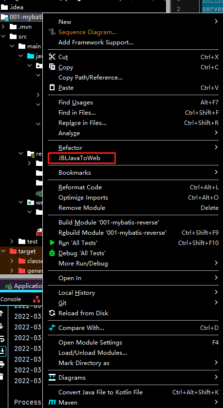

1. 把项目转成web项目(所使用的插件为JBLJavaToWeb)

   

2. 在pom.xml引入依赖

```xml
 <!--引入SpringBoot内嵌的Tomcat对JSP的解析包，不加解析不了jsp页面,如果只是使用JSP页面，可以只添加该依赖-->
    <dependency> 
      <groupId>org.apache.tomcat.embed</groupId>  
      <artifactId>tomcat-embed-jasper</artifactId> 
    </dependency>

    <!--如果要使用servlet必须添加该以下两个依赖-->
    <!-- servlet依赖的jar -->
    <dependency>
      <groupId>javax.servlet</groupId>
      <artifactId>javax.servlet-api</artifactId>
    </dependency>
    <dependency>
      <groupId>javax.servlet.jsp</groupId>
      <artifactId>javax.servlet.jsp-api</artifactId>
      <version>2.3.1</version>
    </dependency>
    <!--如果使用JSTL必须添加该依赖-->
    <!--jstl标签依赖的jar包start-->
    <dependency>
      <groupId>javax.servlet</groupId>
      <artifactId>jstl</artifactId>
    </dependency>
```

3. 在pom.xml的build中配置以下信息

```xml
<!--    SpringBoot项目默认使用thymeleaf,如果要使用jsp,需要手动指定jsp存放的路径,SpringBoot规定的路径是META-INF/resources-->
    <resources>
      <resource>
        <!--源文件位置-->
        <directory>src/main/webapp</directory>
        <!--指定编译到 META-INF/resources，该目录不能随便写-->
        <targetPath>META-INF/resources</targetPath>
        <!--指定要把哪些文件编译进去，**表示webapp目录及子目录，*.*表示所有文件-->
        <includes>
          <include>**/*.*</include>
        </includes>
      </resource>
    </resources>
```

4. 在application.properties文件配置SpingMVC的视图展示为jsp,这里相当于mvc的配置

```properties
server.port=8080

# 配置视图解析器
spring.mvc.view.prefix=/
spring.mvc.view.suffix=.jsp
```

5. 在webapp下新建jsp

+ hello.jsp

```jsp
<%--
  Created by IntelliJ IDEA.
  User: a7810
  Date: 2022/3/23
  Time: 20:38
  To change this template use File | Settings | File Templates.
--%>
<%@ page contentType="text/html;charset=UTF-8" language="java" %>
<html>
<head>
    <title>Title</title>
</head>
<body>
${msg}
</body>
</html>
```

+ Controller.java

```java
package com.hashnode.mybatisreverse.controller;

import com.hashnode.mybatisreverse.model.Student;
import com.hashnode.mybatisreverse.service.StudentService;
import org.springframework.beans.factory.annotation.Autowired;
import org.springframework.stereotype.Controller;
import org.springframework.web.bind.annotation.*;
import org.springframework.web.servlet.ModelAndView;

import java.util.HashMap;
import java.util.Map;

@Controller
public class HelloController {

    @GetMapping(value = "/sayhello")
    public ModelAndView sayHello(){
        ModelAndView mv = new ModelAndView();
        mv.addObject("msg","Hello!");
        mv.setViewName("hello");
        return mv;
    }

}

```

运行结果如下:


