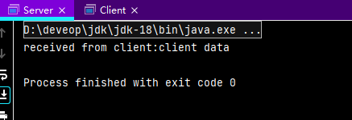
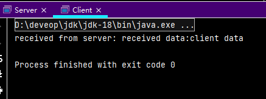
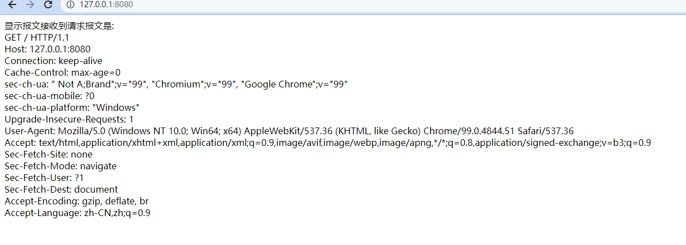

## 1 普通Socket的用法

Java中的网络通信是通过Socket实现的，Socket分为ServerSocket和 Socket两大类，ServerSocket用于服务端，可以通过 accept方法监听请求，监听到请求后返回Socket，Socket用于具体完成数据传输，客户端直接使用Socket发起请求并传输数据。

ServerSocket的使用可以分为三步:

1. 创建 ServerSocket。ServerSocket的构造方法一共有5个，用起来最方便的是ServerSocket (int port)，只需要一个port(端口号)就可以了。
2. 调用创建出来的ServerSocket的 accept方法进行监听。accept方法是阻塞方法，也就是说调用accept方法后程序会停下来等待连接请求，在接收到请求之前程序将不会往下走,当接收到请求后accept方法会返回一个Socket。
3. 使用accept方法返回的 Socket与客户端进行通信。

+ Server.java

```java
package com.hashnode;

import java.io.BufferedReader;
import java.io.InputStreamReader;
import java.io.PrintWriter;
import java.net.ServerSocket;
import java.net.Socket;

public class Server {
    public static void main(String[] args) {
        try {
            //创建一个ServletSocket监听本机的8080端口
            ServerSocket serverSocket = new ServerSocket(8080);
            //等待请求
            Socket socket = serverSocket.accept();
            //接收到请求后使用socet进行通信,创建BufferedReader用于读取数据
            BufferedReader is = new BufferedReader(new InputStreamReader(socket.getInputStream()));
            String line = is.readLine();
            System.out.println("received from client:" + line);
            //创建PrintWriter用于发送数据
            PrintWriter pw = new PrintWriter(socket.getOutputStream());
            pw.println("received data:" + line);
            pw.flush();
            //关闭资源
            pw.close();;
            is.close();
            socket.close();
            serverSocket.close();
        }
        catch (Exception e){
            e.printStackTrace();
        }
    }
}
```

再来看客户端Socket的用法。Socket的使用也一样，首先创建一个Socket,Socket的构造方法非常多，这里用的是Socket(String host, int port)，把目标主机的地址和端口寻传入即可，Socket 创建的过程就会跟服务端建立连接，创建完Socket后，再用其创建Writer和Reader来传输数据，数据传输完成后释放资源关闭连接就可以了。

+ client.java

```java
package com.hashnode;

import java.io.BufferedReader;
import java.io.InputStreamReader;
import java.io.PrintWriter;
import java.net.Socket;

public class Client {
    public static void main(String[] args) {
        String msg = "client data";

        try{
            //创建一个Socket,和本机的8080端口连接
            Socket socket = new Socket("127.0.0.1",8080);
            PrintWriter pw = new PrintWriter(socket.getOutputStream());
            BufferedReader is = new BufferedReader(new InputStreamReader(socket.getInputStream()));
            //发送数据
            pw.println(msg);
            pw.flush();
            String line = is.readLine();
            System.out.println("received from server: " + line);
            //关闭资源
            pw.close();
            is.close();
            socket.close();
        }
        catch (Exception e){
            e.printStackTrace();
        }
    }
}
```

运行结果如下:

服务端:



客户端:



## 2 NioSocet的用法

要想理解 NioSocket 的使用必须先理解三个概念:Buffer、Channel和 Selector。Buffer就是要发送的数据，Channel可以发送数据，Selector就是接收到的数据。

NioSocket 中服务端的处理过程可以分为5步:

1. 创建 ServerSocketChannel并设置相应参数。
2. 创建 Selector 并注册到ServerSocketChannel上。
3. 调用 Selector的 select方法等待请求。
4. Selector接收到请求后使用selectedKeys返回 SelectionKey集合。
5. 使用 SelectionKey获取到Channel、Selector 和操作类型并进行具体操作。

具体代码如下：

```java
package com.hashnode;

import java.io.IOException;
import java.net.InetSocketAddress;
import java.nio.ByteBuffer;
import java.nio.channels.SelectionKey;
import java.nio.channels.Selector;
import java.nio.channels.ServerSocketChannel;
import java.nio.channels.SocketChannel;
import java.nio.charset.Charset;
import java.nio.charset.StandardCharsets;
import java.util.Iterator;

public class NIOServer {
    public static void main(String[] args) throws Exception{
        //创建ServerSocketChannel,监听8080端口。每个 ServerSocketChannel对应一个ServerSocket。
        ServerSocketChannel ssc = ServerSocketChannel.open();
        ssc.socket().bind(new InetSocketAddress(8080));
        //设置为非阻塞模式（阻塞模式不可以使用 Selector）
        ssc.configureBlocking(false);
        //为ssc注册选择器。注册完之后Selector就可以通过select方法来等待请求，select方法有一个long类型的参数，代表最长等待时间，如果在这段时间里接收到了相应操作的请求则返回可以处理的请求的数量，否则在超时后返回0，程序继续往下走，如果传入的参数为0或者调用无参数的重载方法，select方法会采用阻塞模式直到有相应操作的请求出现。
        Selector selector = Selector.open();
        ssc.register(selector, SelectionKey.OP_ACCEPT);
        //创建处理器（内部类）
        Handler handler = new Handler(1024);

        while (true){
            //等待请求，每次等待时间为3s，超过3s向下运行，如果传入0或者不传参将会一直阻塞
            if(selector.select(3000) == 0){
                System.out.println("等待请求超时");
                continue;
            }
            System.out.println("处理请求。。。。。");
            //获取处理器的SelectionKey。SelectionKey保存了处理当前请求的ServerSocketChannel(发送数据使用)和 Selector（包含接收到的数据）， SelectionKey有4种操作定义:
                //1. SelectionKey.OP_ACCEPT 请求操作
		//2. SelectionKey.OP_CONNECT 连接操作
		//3. SelectionKey.OP_READ 读操作
		//4. SelectionKey.OP_WRITE 写操作
            Iterator<SelectionKey> keyIter = selector.selectedKeys().iterator();

            while (keyIter.hasNext()){
                SelectionKey key = keyIter.next();
                try{
                    //接受到连接请求
                    if(key.isAcceptable()){
                        handler.handleAccept(key);
                    }
                    //接收到数据
                    if(key.isReadable()){
                        handler.handleRead(key);
                    }
                }
                catch (IOException ex){
                    ex.printStackTrace();
                }finally {
                    //处理完后从待处理的SelectionKey迭代器中移除当前所使用的SelectionKey
                    keyIter.remove();
                }
            }
        }
    }

    private static class Handler{
        private int bufferSize = 1024;
        private String localCharset = "UTF-8";

        public Handler() {
        }

        public Handler(int bufferSize) {
            this(bufferSize,null);
        }

        public Handler(String localCharset) {
            this(-1,localCharset);
        }

        public Handler(int bufferSize, String localCharset) {
            if(bufferSize > 0){
                this.bufferSize = bufferSize;
            }
            if(localCharset != null){
                this.localCharset = localCharset;
            }
        }

        public void handleAccept(SelectionKey key) throws IOException{
            SocketChannel sc = ((ServerSocketChannel)key.channel()).accept();//创建用于发送数据的channel，其中保存了需要发送到的ip和端口号
            sc.configureBlocking(false);
            sc.register(key.selector(),SelectionKey.OP_READ,ByteBuffer.allocate(bufferSize));//在SelectionKey中注册 SocketChannel(发送数据用)
        }

        public void handleRead(SelectionKey key) throws IOException{
            //获取SocketChannel（发送数据使用）
            SocketChannel sc = (SocketChannel) key.channel();
            //读取buffer并重置
            ByteBuffer buffer = (ByteBuffer)key.attachment();
            buffer.clear();
            //没有读到则关闭
            if(sc.read(buffer) == -1){
                sc.close();
            }else {
                //将buffer转换为读状态
                buffer.flip();
                //将buffer中接收到的值按localCharset格式编码后保存到receivedString
                String receivedString = Charset.forName(localCharset).newDecoder().decode(buffer).toString();
                System.out.println("received from client:" + receivedString);

                //返回数据给客户端
                String sendString = "received data:" + receivedString;
                buffer = ByteBuffer.wrap(sendString.getBytes(localCharset));
                sc.write(buffer);
                //关闭SocketChannel
                sc.close();
            }
        }
    }
}
```

## 3 手写HTTP协议


```java
package com.hashnode;

import java.io.IOException;
import java.net.InetSocketAddress;
import java.nio.ByteBuffer;
import java.nio.channels.SelectionKey;
import java.nio.channels.Selector;
import java.nio.channels.ServerSocketChannel;
import java.nio.channels.SocketChannel;
import java.nio.charset.Charset;
import java.util.Iterator;

public class HttpServer {
    public static void main(String[] args) throws Exception{
        //创建ServerSocketChannel,监听8080端口
        ServerSocketChannel ssc = ServerSocketChannel.open();
        ssc.socket().bind(new InetSocketAddress(8080));
        //设置为非阻塞模式
        ssc.configureBlocking(false);
        //为ssc注册选择器
        Selector selector = Selector.open();
        ssc.register(selector, SelectionKey.OP_ACCEPT);

        while (true){
            //等待请求，每次等待时间为3s，超过3s向下运行，如果传入0或者不传参将会一直阻塞
            if(selector.select(3000) == 0){
                System.out.println("等待请求超时");
                continue;
            }
            System.out.println("处理请求。。。。。");
            //获取处理器的SelectionKey
            Iterator<SelectionKey> keyIter = selector.selectedKeys().iterator();

            while (keyIter.hasNext()){
                SelectionKey key = keyIter.next();
                //启动新线程处理SelectionKey
                new Thread(new HttpHandler(key)).run();
                //处理完后从待处理的SelectionKey迭代器中移除当前所使用的SelectionKey
                keyIter.remove();
            }
        }
    }

    private static class HttpHandler implements Runnable{
        private int bufferSize = 1024;
        private String localCharset = "UTF-8";
        private SelectionKey key;

        public HttpHandler(SelectionKey key) {
            this.key = key;
        }

        public void handleAccept() throws IOException{
            SocketChannel sc = ((ServerSocketChannel)key.channel()).accept();
            sc.configureBlocking(false);
            sc.register(key.selector(),SelectionKey.OP_READ, ByteBuffer.allocate(bufferSize));
        }

        public void handleRead() throws IOException{
            //获取channel
            SocketChannel sc = (SocketChannel) key.channel();
            //读取buffer并重置
            ByteBuffer buffer = (ByteBuffer)key.attachment();
            buffer.clear();
            //没有读到择关闭
            if(sc.read(buffer) == -1){
                sc.close();
            }else {
                //将buffer转换为读状态
                buffer.flip();
                //将buffer中接收到的值按localCharset格式编码后保存到receivedString
                String receivedString = Charset.forName(localCharset).newDecoder().decode(buffer).toString();
                //控制台打印请求报文头
                String[] requestMessage = receivedString.split("\r\n");

                for (String s : requestMessage) {
                    System.out.println(s);
                    if(s.isEmpty()){
                        break;
                    }
                }

                //控制台打印首行信息
                String[] firstLine = requestMessage[0].split(" ");
                System.out.println(requestMessage[0]);
                System.out.println("Method:\t" + firstLine[0]);
                System.out.println("url:\t" + firstLine[1]);
                System.out.println("HTTP Version:\t" + firstLine[2]);
                System.out.println();

                //返回数据给客户端
                StringBuffer sendString = new StringBuffer();
                sendString.append("HTTP/1.1 200 OK\r\n");//响应报文首行，200表示处理成功
                sendString.append("Content-Type:text/html;charset=" + localCharset + "\r\n");
                sendString.append("\r\n");//报文头结束后加一个空行

                sendString.append("<html><head><titile>显示报文</title></head><body>");
                sendString.append("接收到请求报文是:<br/>");
                for (String s : requestMessage) {
                    sendString.append(s+"<br/>");
                }
                sendString.append("</body></html>");
                buffer = ByteBuffer.wrap(sendString.toString().getBytes(localCharset));
                sc.write(buffer);
                //关闭SocketChannel
                sc.close();
            }
        }

        @Override
        public void run() {
            try {
                if(key.isAcceptable()){
                    handleAccept();
                }

                if(key.isReadable()){
                    handleRead();
                }
            }catch (IOException e){
                e.printStackTrace();
            }
        }
    }
}
```

运行结果如下：



