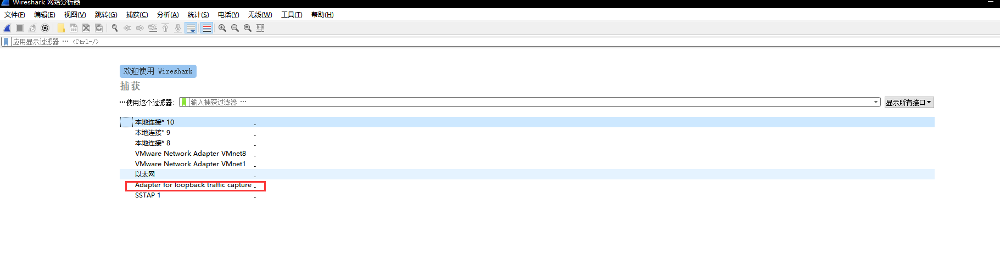
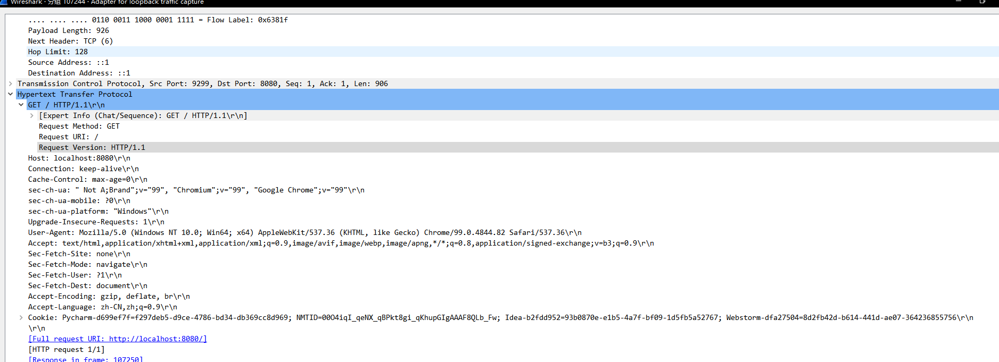
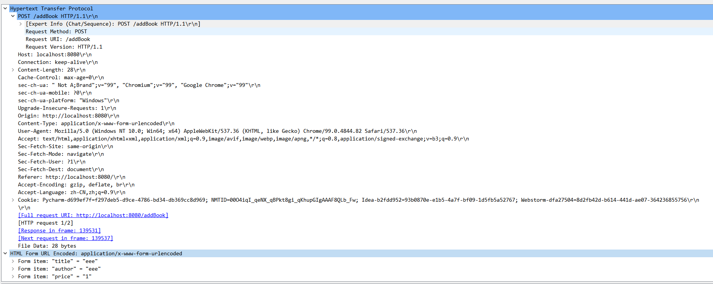
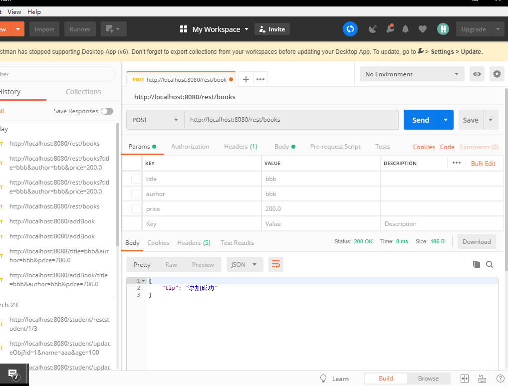
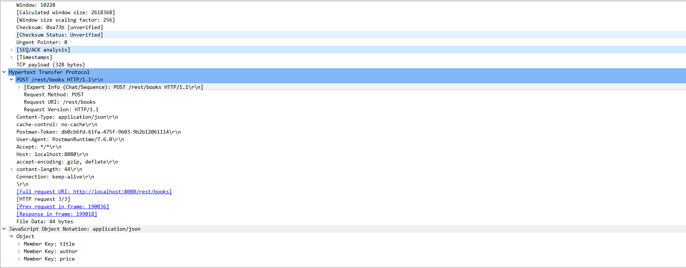
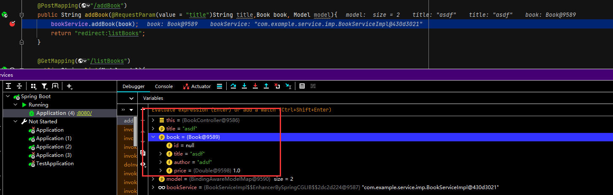
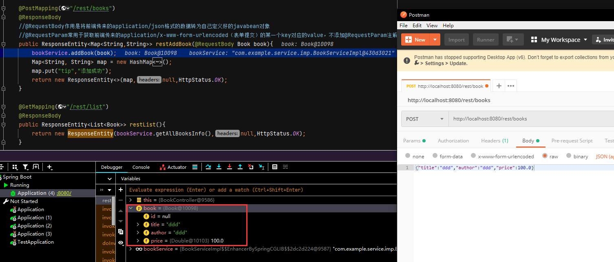

首先说几个最常用的关键字，“eq” 和 “==”等同，可以使用 “and” 表示并且，“or”表示或者。“!" 和 "not” 都表示取反。

## 1 针对wireshark最常用的自然是针对IP地址的过滤

其中有几种情况：

1. 对源地址为192.168.0.1的包的过滤，即抓取源地址满足要求的包。表达式为：ip.src == 192.168.0.1

2. 对目的地址为192.168.0.1的包的过滤，即抓取目的地址满足要求的包。表达式为：ip.dst == 192.168.0.1

3. 对源或者目的地址为192.168.0.1的包的过滤，即抓取满足源或者目的地址的ip地址是192.168.0.1的包。表达式为：ip.addr == 192.168.0.1,或者 ip.src == 192.168.0.1 or ip.dst == 192.168.0.1

4. 要排除以上的数据包，我们只需要将其用括号囊括，然后使用 "!" 即可。表达式为：!(表达式)

 

## 2 针对协议的过滤

1. 仅仅需要捕获某种协议的数据包，表达式很简单仅仅需要把协议的名字输入即可。表达式为：http

2. 需要捕获多种协议的数据包，也只需对协议进行逻辑组合即可。表达式为：http or telnet （多种协议加上逻辑符号的组合即可）

3. 排除某种协议的数据包表达式为：not arp    !tcp

## 3 针对端口的过滤（视协议而定）

1. 捕获某一端口发出的数据包表达式为：tcp.port == 80

2. 捕获某一端口接收到的数据包表达式为：tcp.dstport == 80

## 4 针对长度和内容的过滤

1. 针对长度的过滤（这里的长度指定的是数据段的长度）表达式为：udp.length < 30  http.content_length <=20

2. 针对数据包内容的过滤,表达式为：http.request.uri matches "vipscu"  （匹配http请求中含有vipscu字段的请求信息）

   以下是比较复杂的实例：

> tcp dst port 3128:显示目的TCP端口为3128的封包。
>
> ip src host 10.1.1.1:显示来源IP地址为10.1.1.1的封包。
>
> host 10.1.2.3:显示目的或来源IP地址为10.1.2.3的封包。
>
> src portrange 2000-2500:显示来源为UDP或TCP，并且端口号在2000至2500范围内的封包。
>
> not imcp:显示除了icmp以外的所有封包。（icmp通常被ping工具使用）
>
> src host 10.7.2.12 and not dst net 10.200.0.0/16:显示来源IP地址为10.7.2.12，但目的地不是10.200.0.0/16的封包。
>
> (src host 10.4.1.12 or src net 10.6.0.0/16) and tcp dst portrange 200-10000 and dst net 10.0.0.0/8:显示来源IP为10.4.1.12或者来源网络为10.6.0.0/16，目的地TCP端口号在200至10000之间，并且目的位于网络10.0.0.0/8内的所有封包。

## 5 抓包localhost数据



过滤条件：tcp.port==8080 and http and tcp.dstport==8080

Get请求



表单提交



Postman提交





## 6 RequestParam以及RequestBody的用法

可以对传入参数指定参数名

```java
@RequestParam String inputStr  
// 下面的对传入参数指定为aa，如果前端不传aa参数名，会报错  
@RequestParam(value="aa") String inputStr  
```

2、可以通过required=false或者true来要求@RequestParam配置的前端参数是否一定要传 

```java
// required=false表示不传的话，会给参数赋值为null，required=true就是必须要有  
@RequestMapping("testRequestParam")    
public String filesUpload(@RequestParam(value="aa", required=true) String inputStr, HttpServletRequest request) 
```

3、如果@requestParam注解的参数是int类型，并且required=false，此时如果不传参数的话，会报错。原因是，required=false时，不传参数的话，会给参数赋值null，这样就会把null赋值给了int，因此会报错。（解决此问题可以使用Integer代替int）

@RequestParam常用于获取前端传来的application/x-www-form-urlencoded（表单提交）的某一个key对应的value，不添加@RequestParam注解则通过参数解析器可以将表单请求中的数据转为自己定义好的javabean对象



@RequestBody作用是将前端传来的application/json格式的数据转为自己定义好的javabean对象：

