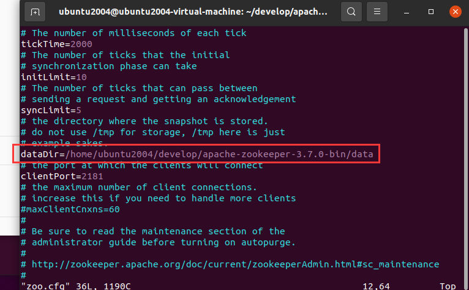
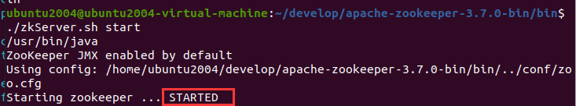
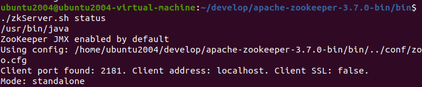
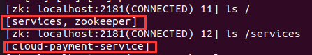
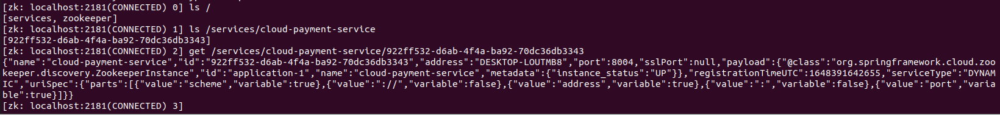

1. 解压

```cmd
tar -zxvf apache-zookeeper-3.7.0-bin.tar.gz
```

2. 修改配置文件

进入解压的文件夹的conf目录：

将 zoo_sample.cfg 复制一份并命名为 zoo.cfg

```cmd
cp zoo_sample.cfg zoo.cfg
```

修改zoo.cfg,设置dataDir对应的位置，data目录为新建的目录:



3. 启动zookeeper

在zookeeper目录下的bin文件夹中，使用以下命令启动zookeeper:

```cmd
./zkServer.sh start
```



4. 检查zookeeper启动情况

```cmd
./zkServer.sh status
```



除此之外，也可以通过查看zookeeper的进程是否存在来判断其是否启动成功:

```cmd
ps -ef | grep zookeeper
```

5. 关闭rookeeper

```cmd
./zkServer.sh stop
```

6. 查看rookeeper中注册的服务

```cmd
在bin目录下使用:
./zkCli.sh
 ls /  可以查看当前目录的节点
 get /zookeeper
 ls /zookeeper 查看节点下的所有服务
```



查看服务注册信息：



json信息如下

```json
{
    "name":"cloud-payment-service",
    "id":"922ff532-d6ab-4f4a-ba92-70dc36db3343",
    "address":"DESKTOP-LOUTMB8",
    "port":8004,
    "sslPort":null,
    "payload":{
        "@class":"org.springframework.cloud.zookeeper.discovery.ZookeeperInstance",
        "id":"application-1",
        "name":"cloud-payment-service",
        "metadata":{
            "instance_status":"UP"
        }
    },
    "registrationTimeUTC":1648391642655,
    "serviceType":"DYNAMIC",
    "uriSpec":{
        "parts":[
            {
                "value":"scheme",
                "variable":true
            },
            {
                "value":"://",
                "variable":false
            },
            {
                "value":"address",
                "variable":true
            },
            {
                "value":":",
                "variable":false
            },
            {
                "value":"port",
                "variable":true
            }
        ]
    }
}
```

