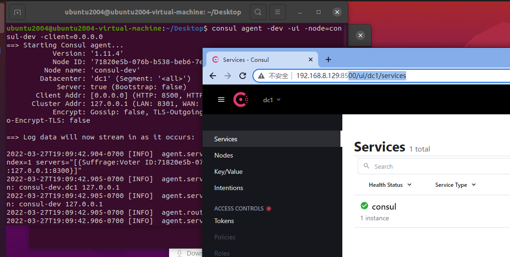

1. 从https://www.consul.io/downloads下载对应版本的consul;

1.1 先下载安装包，然后使用 sudo unzip consul_1.10.1_linux_amd64.zip -d /usr/local/bin/ 将consul解压缩至/usr/local/bin目录;

1.2 命令行安装：

```bash
curl -fsSL https://apt.releases.hashicorp.com/gpg | sudo apt-key add -
sudo apt-add-repository "deb [arch=amd64] https://apt.releases.hashicorp.com $(lsb_release -cs) main"
sudo apt-get update && sudo apt-get install consul
```

2. 使用consul -h 测试consul是否安装成功.如果打印出consul的参数列表.表示安装成功.

3. 使用consul agent -dev可以启动consul

4. 在终端输入 consul members 可以查看集群中有多少个成员

5. consul info 查看当前consul 信息

7. 可以使用http:*//localhost:8500/ui* 进行访问

8. 如果想其他机器可以访问，可以在-client加上指定机器的ip，0.0.0.0表示允许所有ip访问

```bash
consul agent -dev -ui -node=consul-dev -client=0.0.0.0
```



补充：

查看该端口的占用情况 

```css
lsof -i:端口号 
```

关闭进程 

```javascript
kill PID
```

