1. 基础入门

## 1.1 Spring官网结构

网址:https://spring.io/

官方文档可以采用以下方式查看，首先选择：

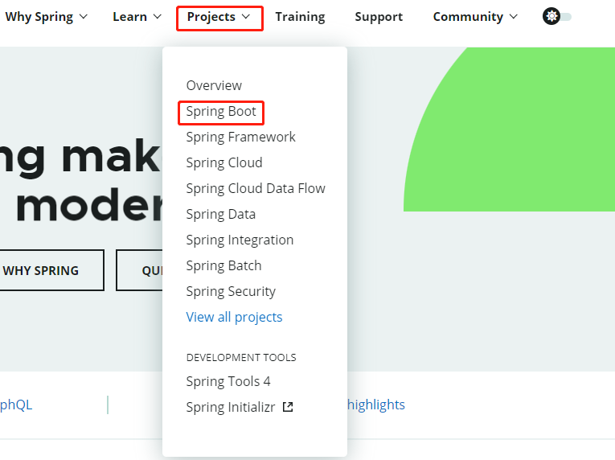

GA表示稳定版，SNAPSHOT为快照版，选第一个：


在以下位置可以查看不同版本的改动：


## 1.2 SpringBoot系统要求

- [Java 8](https://www.java.com/) & 兼容java14 .
- Maven 3.3+

- idea 2019.1.2

## 1.3 HelloWorld项目

Maven配置参考：-------------------

主要参考官网文档：https://docs.spring.io/spring-boot/docs/current/reference/html/getting-started.html

新建Maven项目：


选择如下选项：

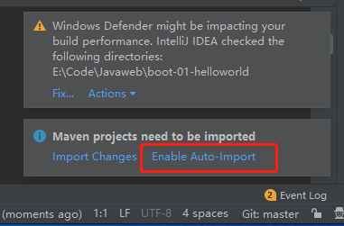

添加父级项目：


```xml
<parent>
    <groupId>org.springframework.boot</groupId>
    <artifactId>spring-boot-starter-parent</artifactId>
    <version>2.6.2</version>
</parent>
```

接下来导入web依赖：

```xml
<dependencies>
    <dependency>
        <groupId>org.springframework.boot</groupId>
        <artifactId>spring-boot-starter-web</artifactId>
    </dependency>
</dependencies>
```

编写主入口程序：

```java
package com.test;

import org.springframework.boot.SpringApplication;
import org.springframework.boot.autoconfigure.SpringBootApplication;

//表明这是一个SpringBoot应用
@SpringBootApplication
public class MainApplication {
    public static void main(String[] args) {
        SpringApplication.run(MainApplication.class,args);
    }
}
```

编写Controller类，

在java目录下新建com.test.controller.HelloController.java程序，代码如下：

```java
package com.test.controller;

import org.springframework.stereotype.Controller;
import org.springframework.web.bind.annotation.RequestBody;
import org.springframework.web.bind.annotation.RequestMapping;
import org.springframework.web.bind.annotation.RestController;

//@RequestBody作用是将前端传来的json格式的数据转为自己定义好的javabean对象，最常用的使用请求体传参方式是POST请求了，
// 所以使用@RequestBody接收数据时，一般都用POST方式进行提交，
// 需要注意的是传入数据的属性名称要和后端Javabean中定义的一致。例如public String test(@RequestBody User user)
//@ResponseBody作用是将方法的返回值以特定的格式写入到response的body区域，进而将数据返回给客户端，定义在类上则表示该类
//所有函数的放回值都写入response的body区域，如果定义在某一个函数上则表示该函数的返回值需要写入response的body区域。
//@Controller表示当前类是一个Controller类

//@RestController相当于@Controlle+@ResponseBody
@RestController
public class HelloController {
    @RequestMapping("/hello")
    public String handle01(){
        return "hello";
    }
}
```

然后运行MainApplication.java即可看到如下结果：


SpringBoot把所有的配置都整合到一个文件，对应resources目录下的application.properties，所以在resources目录下新建application.properties，并测试修改程序的端口号：


重新启动程序，可以看到项目的端口号已经发生变化：


所有可以在application.properties配置的选项详见：https://docs.spring.io/spring-boot/docs/current/reference/html/application-properties.html#application-properties


SpringBoot还可以将程序打包成执行jar包，该jar包含整个运行环境，具体操作如下：

引入依赖：

```xml
<!--    创建可执行jar包，该jar包含整个运行环境，所以直接可运行-->
    <build>
        <plugins>
            <plugin>
                <groupId>org.springframework.boot</groupId>
                <artifactId>spring-boot-maven-plugin</artifactId>
            </plugin>
        </plugins>
    </build>
```

打包：


可以看到成功产生了jar包：


然后在终端运行：


在浏览器中可以看到已经可以成功访问：


## 1.4 依赖管理

​	每一个SpringBoot工程都有一个父项：

```xml
    <parent>
        <groupId>org.springframework.boot</groupId>
        <artifactId>spring-boot-starter-parent</artifactId>
        <version>2.6.2</version>
        <relativePath/> <!-- lookup parent from repository -->
    </parent>
```

在spring-boot-starter-parent中还有一个用来做版本管理的父项：

```xml
<parent>
  <groupId>org.springframework.boot</groupId>
  <artifactId>spring-boot-dependencies</artifactId>
  <version>2.6.2</version>
</parent>
```

spring-boot-starter-parent中配置了开发中常用的组件版本号，如下图所示：


父项目中几乎声明了开发中常用的依赖版本号，里面定义的组件不会自动引入，而是根据本项目的pom.xml的配置引入组件，spring-boot-stater-xxx是一组场景下的依赖，例如spring-boot-starter-web表示web场景下需要用到的依赖，只要引入starter,该场景的所有常规需要的依赖都会自动引入，如果需要修改版本，在本项目的pom.xml中添加properties即可，如下图所示：


需要注意的是，要修改版本号，需要查看父项目中的spring-boot-dependencies里面规定的当前依赖版本用的key，本项目的配置会覆盖默认配置，但是需要保证key的名字和默认的一样，如下图所示：


如果引入非启动器管理的jar需要明确写版本号，如果希望引入不在启动器中的jar包，可以在本项目的pom.xml中通过如下方式引入依赖：

```xml
<!--    开发web应用，导入web场景-->
    <dependencies>
        <!--    启动器会引入一系列依赖-->
        <dependency>
            <groupId>org.springframework.boot</groupId>
            <artifactId>spring-boot-starter-web</artifactId>
        </dependency>
        <!--    引入单个依赖-->
        <dependency>
            <groupId>org.projectlombok</groupId>
            <artifactId>lombok</artifactId>
        </dependency>
    </dependencies>
```

官方提供的starter场景依赖地址：https://docs.spring.io/spring-boot/docs/current/reference/html/using.html#using.build-systems.starters

见到的*-spring-boot-starter,为第三方提供的依赖管理启动器。

鼠标右键可以可视化查看所有依赖：


如下图所示：


每一个场景启动器最底层的依赖都会依赖spring-boot-starter：


spring-boot-starter是SpringBoot自动配置的核心依赖。

## 1.5 自动配置

### 1.5.1 依赖自动配置

spring-boot-starter-web中引入了如下依赖：


再次回到SpringBoot入口函数，编写代码查看自动装配的所有组件：

```java
//表明这是一个SpringBoot应用
@SpringBootApplication
public class MainApplication {
    public static void main(String[] args) {
        //1.返回IOC容器，容器里面包含所有的组件
        ConfigurableApplicationContext run = SpringApplication.run(MainApplication.class, args);
        
        //2.查看所有的组件，SpringBoot自动配置了SpringMVC常用组件（功能）
        String[] names = run.getBeanDefinitionNames();
        for (String name : names) {
            System.out.println(name);
        }
    }
}
```

结果如下图所示：


### 1.5.2 包扫描规则

同时SpringBoot也配置了默认的包扫描规则，主程序及其下面的所有子包的组件都会根据注解扫描进来。也可以指定需要扫描的根目录：

+ 方式1：配置@SpringBootApplication

```java
@SpringBootApplication(scanBasePackages = "com")
```

+ 方式2：通过@ComponnetScan指定扫描路径

复制@SpringBootApplication的元注解：


### 1.5.3 各种配置的默认值

application.properties的配置最终都是映射到某一个类上：


如server.port:


### 1.5.4 按需加载自动配置项

引入了确定场景，该场景中配置的依赖才有对应的对象，否则就没有对应的实例化对象。

SpringBoot的自动配置功能在下图的spring-boot-autoconfigure中，该文件在启动器的spring-boot-starter依赖中：


通过该依赖项可以按需要加载所有的配置项，对应的全场景如下：


# 2. 底层注解

## 2.1 @Configuration

首先新建两个Bean对象，项目结构如下：


+ Pet.java

```java
package com.test.boot.bean;

public class Pet {
    private String name;

    public String getName() {
        return name;
    }

    public void setName(String name) {
        this.name = name;
    }

    @Override
    public String toString() {
        return "Pet{" +
                "name='" + name + '\'' +
                '}';
    }
}
```

+ User.java

```java
package com.test.boot.bean;

public class User {
    private String name;
    private Integer age;

    public User() {
    }

    public User(String name, Integer age) {
        this.name = name;
        this.age = age;
    }

    public String getName() {
        return name;
    }

    public void setName(String name) {
        this.name = name;
    }

    public Integer getAge() {
        return age;
    }

    public void setAge(Integer age) {
        this.age = age;
    }

    @Override
    public String toString() {
        return "User{" +
                "name='" + name + '\'' +
                ", age=" + age +
                '}';
    }
}
```

### 2.1.1 SpringMVC注入对象的方式

在SpringMVC中，将Bean对象注入到容器的方式如下,在resources目录下新建beans.xml，然后配置如下：

```xml
<?xml version="1.0" encoding="UTF-8"?>
<beans xmlns="http://www.springframework.org/schema/beans"
       xmlns:xsi="http://www.w3.org/2001/XMLSchema-instance"
       xsi:schemaLocation="http://www.springframework.org/schema/beans http://www.springframework.org/schema/beans/spring-beans.xsd">

    <bean id="user01" class="com.test.boot.bean.User">
        <property name="name" value="zhangsan"></property>
        <property name="age" value="18"></property>
    </bean>

    <bean id="cat" class="com.test.boot.bean.Pet">
        <property name="name" value="dog"></property>
    </bean>
</beans>
```

### 2.1.2 SpringBoot注入对象的方式

新建com.test.boot.config.MyConfig类，代码如下：

```java
package com.test.boot.config;

import com.test.boot.bean.Pet;
import com.test.boot.bean.User;
import org.springframework.context.annotation.Bean;
import org.springframework.context.annotation.Configuration;

//创建类相当于创建了一个配置文件
//@Configuration告诉SpringBoot这是一个配置类，等于配置文件
//MyConfig配置类本身也是容器中的一个组件
@Configuration
public class MyConfig {

    @Bean //容器中添加组件，以方法名作为组件的id,返回类型就是组件类型，方法返回的值就是组件在容器找那个的实例
    public User User01(){
        return new User("zhangsan",18);
    }

//    如果不想用方法名作为组件名，可以在Bean标签中定义自定义名字
//    @Bean
    @Bean("tom")
    public Pet Pet01(){
        return new Pet("cat");
    }
}
```

可以通过以下方式获取注入到容器中的组件：

```java
package com.test.boot;

import com.test.boot.bean.Pet;
import org.springframework.boot.SpringApplication;
import org.springframework.boot.SpringBootConfiguration;
import org.springframework.boot.autoconfigure.EnableAutoConfiguration;
import org.springframework.boot.autoconfigure.SpringBootApplication;
import org.springframework.context.ConfigurableApplicationContext;
import org.springframework.context.annotation.ComponentScan;

//表明这是一个SpringBoot应用
//@SpringBootApplication
@SpringBootConfiguration
@EnableAutoConfiguration
@ComponentScan("com")
public class MainApplication {
    public static void main(String[] args) {
        //1.返回IOC容器，容器里面包含所有的组件
        ConfigurableApplicationContext run = SpringApplication.run(MainApplication.class, args);
        
//        //2.查看所有的组件
//        String[] names = run.getBeanDefinitionNames();
//        for (String name : names) {
//            System.out.println(name);
//        }

        Pet tom1 = run.getBean("tom", Pet.class);
        Pet tom2 = run.getBean("tom", Pet.class);
        //注册的组件只有一个对象，是单例模式，所以tom1==tom2返回true
        System.out.println(tom1==tom2);
    }
}
```

####  @Configuration的代理模式

SpringBoot默认的@Configuration默认是代理模式，相当于@Configuration(proxyBeanMethods = true)，在该模式下外部无论对配置类中的这个组件注册方法调用多少次获取的都是单实例对象，代码如下：

```java
//        获取到的是代理对象
        MyConfig bean = run.getBean(MyConfig.class);
        System.out.println(bean);

//        如果@Configuration(proxyBeanMethods = true)表明是一个代理对象，SpringBoot总会检查组件是否在组件中有，如果有则不会新创建，如果proxyBeanMethods = false,每次返回的是新的对象
        User user = bean.User01();
        User user2 = bean.User01();
        System.out.println(user == user2);
//注意：使用 run.getBean获得的对象都是单例的，代理只作用在配置类上
	Pet tom1 = run.getBean("tom", Pet.class);
        Pet tom2 = run.getBean("tom", Pet.class);
        //注册的组件只有一个对象，是单例模式，所以tom1==tom2返回true
        System.out.println(tom1==tom2);//true
```

@Configuration(proxyBeanMethods = false)的使用场景如下，当User用户类中含有Pet类的对象，即存在组件依赖：

+ User.java

```java
package com.test.boot.bean;

public class User {
    private String name;
    private Integer age;
    Pet pet;

    public User() {
    }

    public User(String name, Integer age) {
        this.name = name;
        this.age = age;
    }

    public User(String name, Integer age, Pet pet) {
        this.name = name;
        this.age = age;
        this.pet = pet;
    }

    public String getName() {
        return name;
    }

    public void setName(String name) {
        this.name = name;
    }

    public Integer getAge() {
        return age;
    }

    public void setAge(Integer age) {
        this.age = age;
    }

    public Pet getPet() {
        return pet;
    }

    public void setPet(Pet pet) {
        this.pet = pet;
    }

    @Override
    public String toString() {
        return "User{" +
                "name='" + name + '\'' +
                ", age=" + age +
                ", pet=" + pet +
                '}';
    }
}
```

+ MyConfig.java

```java
package com.test.boot.config;

import com.test.boot.bean.Pet;
import com.test.boot.bean.User;
import org.springframework.context.annotation.Bean;
import org.springframework.context.annotation.Configuration;


//proxyBeanMethods:代理Bean的方法,如果设置为false,SpringBoot会跳过对象的检查，每次都返回一个新对象,如果设置为true外部无论对配置类中的这个组件注册方法调用多少次获取的都是单实例对象
@Configuration(proxyBeanMethods = true)
public class MyConfig {

    @Bean 
    public User User01(){
        User zhangsan = new User("zhangsan", 18);
        //user组件依赖了pet组件，如果proxyBeanMethods设置为true,则用户的宠物就是容器中的宠物，如果设置为false，则用户的宠物是新的对象
        zhangsan.setPet(Pet01());
        return zhangsan;
    }

    @Bean("tom")
    public Pet Pet01(){
        return new Pet("cat");
    }
}
```

**如果proxyBeanMethods配置为true，则每次加载SpringBoot都会在容器中寻找是否有某个对象的实例，这样可能会带来速度的损失，所以当明确在其他地方没有相应的组件依赖，一般设置proxyBeanMethods为false，如果一个组件在其他地方要依赖，需要将proxyBeanMethods配置为true，能保证依赖的组件是一个组件，也就是说当配置类组件之间无依赖关系用false以加速容器启动过程，减少判断，如果有依赖管理，设置为true**

## 2.2 @Import

用于在配置类中自动创建组件，默认组件的名字是全类名，使用的是无参构造函数。

```java
package com.test.boot.config;

import com.test.boot.bean.Pet;
import com.test.boot.bean.User;
import org.springframework.context.annotation.Bean;
import org.springframework.context.annotation.Configuration;
import org.springframework.context.annotation.Import;

@Import({User.class,Pet.class})
@Configuration(proxyBeanMethods = false)
public class MyConfig {

    @Bean
    public User User01(){
        User zhangsan = new User("zhangsan", 18);
        zhangsan.setPet(Pet01());
        return zhangsan;
    }
    @Bean("tom")
    public Pet Pet01(){
        return new Pet("cat");
    }
}

```

在主类中测试：

```java
String[] beanNamesForType = run.getBeanNamesForType(User.class);
System.out.println("================");
for (String s : beanNamesForType) {
    System.out.println(s);
}
```

输出如下：


com.test.boot.bean.User是import导入的全路径类名，User01是在配置类中配置的类。

## 2.3 @Conditional

使用如下：

```java
package com.test.boot.config;

import com.test.boot.bean.Pet;
import com.test.boot.bean.User;
import org.springframework.boot.autoconfigure.condition.ConditionalOnBean;
import org.springframework.context.annotation.Bean;
import org.springframework.context.annotation.Conditional;
import org.springframework.context.annotation.Configuration;
import org.springframework.context.annotation.Import;

@Import({User.class,Pet.class})
@Configuration(proxyBeanMethods = false)
//@ConditionalOnBean(name = "tom")//表示容器中有tom才会注入所有对象
public class MyConfig {
    
    @Bean("tom")
    public Pet Pet01(){
        return new Pet("cat");
    }

    //    如果容器中有tom则注入对象User01，这里要注意顺序，如果 @Bean("tom")定义在下方，则不会把下面的类注入容器
    @ConditionalOnBean(name = "tom")
    @Bean
    public User User01(){
        User zhangsan = new User("zhangsan", 18);
        zhangsan.setPet(Pet01());
        return zhangsan;
    }
}
```

查看@Conditionnal的其他条件装配可以使用Ctrl+N进行查看，如下图所示：


## 2.4 @ImportResource  

@ImportResource 可以使用xml文件导入配置：

resources目录下的beans.xml文件：

```xml
<?xml version="1.0" encoding="UTF-8"?>
<beans xmlns="http://www.springframework.org/schema/beans"
       xmlns:xsi="http://www.w3.org/2001/XMLSchema-instance"
       xsi:schemaLocation="http://www.springframework.org/schema/beans http://www.springframework.org/schema/beans/spring-beans.xsd">

    <bean id="xmluser" class="com.test.boot.bean.User">
        <property name="name" value="zhangsan"></property>
        <property name="age" value="18"></property>
    </bean>

    <bean id="xmlcat" class="com.test.boot.bean.Pet">
        <property name="name" value="dog"></property>
    </bean>
</beans>
```

config目录下的MyConfig.java

```java
package com.test.boot.config;
import com.test.boot.bean.Pet;
import com.test.boot.bean.User;
import org.springframework.boot.autoconfigure.condition.ConditionalOnBean;
import org.springframework.context.annotation.*;

@Import({User.class,Pet.class})
@Configuration(proxyBeanMethods = true)
@ImportResource("classpath:beans.xml")
public class MyConfig {

    //    如果容器中有tom则注入对象User01
    @ConditionalOnBean(name = "tom")
    @Bean
    public User User01(){
        User zhangsan = new User("zhangsan", 18);
        zhangsan.setPet(Pet01());
        return zhangsan;
    }

    @Bean("tom")
    public Pet Pet01(){
        return new Pet("cat");
    }
}
```

测试文件

```java
package com.test.boot;

import com.test.boot.bean.Pet;
import com.test.boot.bean.User;
import com.test.boot.config.MyConfig;
import org.springframework.boot.SpringApplication;
import org.springframework.boot.SpringBootConfiguration;
import org.springframework.boot.autoconfigure.EnableAutoConfiguration;
import org.springframework.boot.autoconfigure.SpringBootApplication;
import org.springframework.context.ConfigurableApplicationContext;
import org.springframework.context.annotation.ComponentScan;

//表明这是一个SpringBoot应用
//@SpringBootApplication
@SpringBootConfiguration
@EnableAutoConfiguration
@ComponentScan("com")
public class MainApplication {
    public static void main(String[] args) {
        //1.返回IOC容器，容器里面包含所有的组件
        ConfigurableApplicationContext run = SpringApplication.run(MainApplication.class, args);

//        System.out.println(run.containsBean("User01"));
//        System.out.println(run.containsBean("tom"));
        System.out.println(run.containsBean("xmluser"));
        System.out.println(run.containsBean("xmlcat"));

    }
}
```

## 2.5 @ConfigurationProperties配置绑定

如果使用Java代码读取properties文件的内容,可以使用如下方式：

```java
public class getProperties {
     public static void main(String[] args) throws FileNotFoundException, IOException {
         Properties pps = new Properties();
         pps.load(new FileInputStream("a.properties"));
         Enumeration enum1 = pps.propertyNames();//得到配置文件的名字
         while(enum1.hasMoreElements()) {
             String strKey = (String) enum1.nextElement();
             String strValue = pps.getProperty(strKey);
             System.out.println(strKey + "=" + strValue);
             //封装到JavaBean。
         }
     }
 }
```

但是在springboot中将会非常简单，具体使用如下。

在application.properties中添加配置：

```properties
server.port=8080
mycar.brand=BMW
mycar.price=100000
```

在Car.java类中读取配置：

```java
package com.test.boot.bean;

import org.springframework.boot.context.properties.ConfigurationProperties;
import org.springframework.stereotype.Component;

@Component//只有在容器中的类才可以用以下注解
@ConfigurationProperties(prefix = "mycar")//注意，后面的属性名要和成员变量名一样
public class Car {
    private String brand;
    private Integer price;

    public Car() {
    }

    public Car(String brand, Integer price) {
        this.brand = brand;
        this.price = price;
    }

    public String getBrand() {
        return brand;
    }

    public void setBrand(String brand) {
        this.brand = brand;
    }

    public Integer getPrice() {
        return price;
    }

    public void setPrice(Integer price) {
        this.price = price;
    }

    @Override
    public String toString() {
        return "Car{" +
                "brand='" + brand + '\'' +
                ", price=" + price +
                '}';
    }
}
```

自动注入对象并使用：

```java
package com.test.boot.controller;

import com.test.boot.bean.Car;
import org.springframework.beans.factory.annotation.Autowired;
import org.springframework.web.bind.annotation.RequestMapping;
import org.springframework.web.bind.annotation.RestController;

//@RequestBody作用是将前端传来的json格式的数据转为自己定义好的javabean对象，最常用的使用请求体传参方式是POST请求了，
// 所以使用@RequestBody接收数据时，一般都用POST方式进行提交，
// 需要注意的是传入数据的属性名称要和后端Javabean中定义的一致。例如public String test(@RequestBody User user)
//@ResponseBody作用是将方法的返回值以特定的格式写入到response的body区域，进而将数据返回给客户端，定义在类上则表示该类
//所有函数的放回值都写入response的body区域，如果定义在某一个函数上则表示该函数的返回值需要写入response的body区域。
//@Controller表示当前类是一个Controller类

//@RestController相当于@Controlle+@ResponseBody
@RestController
public class HelloController {

    //自动注入对象
    @Autowired
    Car car;

    @RequestMapping("/hello")
    public String handle01(){
        return "hello";
    }

    @RequestMapping("/car")
    public Car car(){
        return car;
    }
}
```

属性绑定的方式2：在配置类中使用注解绑定，第一步删去@Component注解


第二步：在配置类中做如下配置：


这种方式的好处是即使第三方包没有使用@Component注解，也可以进行配置绑定。

## 2.6 源码分析之自动配置

### 2.6.1 @SpringBootConfiguration

表示当前类是一个配置类

### 2.6.2 @ComponentScan

指定要扫描哪些路径

### 2.6.3 @EnableAutoConfiguration

```java
@AutoConfigurationPackage
@Import({AutoConfigurationImportSelector.class})
public @interface EnableAutoConfiguration {...}
```

+ @AutoConfigurationPackage

该注解用于自动配置包，该注解的接口如下：

```java
...
@Import({Registrar.class})//Import用于给容器中导入一个组件
public @interface AutoConfigurationPackage {
    String[] basePackages() default {};

    Class<?>[] basePackageClasses() default {};
}
```

可以看到该注解使用了Registrar类给容器导入组件，该类有两个实现函数:

```java
static class Registrar implements ImportBeanDefinitionRegistrar, DeterminableImports {
    Registrar() {
    }

    //该函数给容器中导入一系列组件
    //AnnotationMetadata metadata是注解的源信息，代表这个注解标在了哪，该注解的每个属性值是什么
    public void registerBeanDefinitions(AnnotationMetadata metadata, BeanDefinitionRegistry registry) {
        AutoConfigurationPackages.register(registry, (String[])(new AutoConfigurationPackages.PackageImports(metadata)).getPackageNames().toArray(new String[0]));
    }

    public Set<Object> determineImports(AnnotationMetadata metadata) {
        return Collections.singleton(new AutoConfigurationPackages.PackageImports(metadata));
    }
}
```

 metadata的信息如下：


register将该注解所在的包下的所有组件都进行了注册，如下图所示：


在@SpringBootApplication中含有元注解@EnableAutoConfiguration，查看@EnableAutoConfiguration发现SpringBoot使用@Import({AutoConfigurationImportSelector.class})给容器批量导入一些组件，如下图所示：


进入AutoConfigurationImportSelector类，可以看到该类通过getAutoConfigurationEntry函数将组件(配置类)导入到容器：


configurations是由getCandidateConfigurations函数获得，该函数利用loadFactoryNames获取所有要加载的组件，根据this.getSpringFactoriesLoaderFactoryClass()类型获取相应的配置，如下图所示：

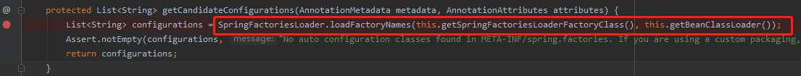

进入loadFactoryNames：


函数通过loadSpringFactories获取属性名为org.springframework.boot.autoconfigure.AutoConfigurationImportListener的所有组件，查看spring-core-5.4.14包中的loadSpringFactories函数：


从上图可以看出，SpringBoot从META-INF/spring.factories位置加载配置，由于是在spring-boot-autoconfigure包中调用的spring-core-5.4.14包中的函数，所以需要在spring-boot-autoconfigure包中查看META-INF/spring.factories配置文件,如下图所示：


spring.factories的配置如下：

```properties
# Initializers
org.springframework.context.ApplicationContextInitializer=\
org.springframework.boot.autoconfigure.SharedMetadataReaderFactoryContextInitializer,\
org.springframework.boot.autoconfigure.logging.ConditionEvaluationReportLoggingListener

# Application Listeners
org.springframework.context.ApplicationListener=\
org.springframework.boot.autoconfigure.BackgroundPreinitializer

# Environment Post Processors
org.springframework.boot.env.EnvironmentPostProcessor=\
org.springframework.boot.autoconfigure.integration.IntegrationPropertiesEnvironmentPostProcessor

# Auto Configuration Import Listeners
org.springframework.boot.autoconfigure.AutoConfigurationImportListener=\
org.springframework.boot.autoconfigure.condition.ConditionEvaluationReportAutoConfigurationImportListener

# Auto Configuration Import Filters
org.springframework.boot.autoconfigure.AutoConfigurationImportFilter=\
org.springframework.boot.autoconfigure.condition.OnBeanCondition,\
org.springframework.boot.autoconfigure.condition.OnClassCondition,\
org.springframework.boot.autoconfigure.condition.OnWebApplicationCondition

# Auto Configure
org.springframework.boot.autoconfigure.EnableAutoConfiguration=\
org.springframework.boot.autoconfigure.admin.SpringApplicationAdminJmxAutoConfiguration,\
org.springframework.boot.autoconfigure.aop.AopAutoConfiguration,\
org.springframework.boot.autoconfigure.amqp.RabbitAutoConfiguration,\
org.springframework.boot.autoconfigure.batch.BatchAutoConfiguration,\
org.springframework.boot.autoconfigure.cache.CacheAutoConfiguration,\
org.springframework.boot.autoconfigure.cassandra.CassandraAutoConfiguration,\
org.springframework.boot.autoconfigure.context.ConfigurationPropertiesAutoConfiguration,\
org.springframework.boot.autoconfigure.context.LifecycleAutoConfiguration,\
org.springframework.boot.autoconfigure.context.MessageSourceAutoConfiguration,\
org.springframework.boot.autoconfigure.context.PropertyPlaceholderAutoConfiguration,\
org.springframework.boot.autoconfigure.couchbase.CouchbaseAutoConfiguration,\
org.springframework.boot.autoconfigure.dao.PersistenceExceptionTranslationAutoConfiguration,\
org.springframework.boot.autoconfigure.data.cassandra.CassandraDataAutoConfiguration,\
org.springframework.boot.autoconfigure.data.cassandra.CassandraReactiveDataAutoConfiguration,\
org.springframework.boot.autoconfigure.data.cassandra.CassandraReactiveRepositoriesAutoConfiguration,\
org.springframework.boot.autoconfigure.data.cassandra.CassandraRepositoriesAutoConfiguration,\
org.springframework.boot.autoconfigure.data.couchbase.CouchbaseDataAutoConfiguration,\
org.springframework.boot.autoconfigure.data.couchbase.CouchbaseReactiveDataAutoConfiguration,\
org.springframework.boot.autoconfigure.data.couchbase.CouchbaseReactiveRepositoriesAutoConfiguration,\
org.springframework.boot.autoconfigure.data.couchbase.CouchbaseRepositoriesAutoConfiguration,\
org.springframework.boot.autoconfigure.data.elasticsearch.ElasticsearchDataAutoConfiguration,\
org.springframework.boot.autoconfigure.data.elasticsearch.ElasticsearchRepositoriesAutoConfiguration,\
org.springframework.boot.autoconfigure.data.elasticsearch.ReactiveElasticsearchRepositoriesAutoConfiguration,\
org.springframework.boot.autoconfigure.data.elasticsearch.ReactiveElasticsearchRestClientAutoConfiguration,\
org.springframework.boot.autoconfigure.data.jdbc.JdbcRepositoriesAutoConfiguration,\
org.springframework.boot.autoconfigure.data.jpa.JpaRepositoriesAutoConfiguration,\
org.springframework.boot.autoconfigure.data.ldap.LdapRepositoriesAutoConfiguration,\
org.springframework.boot.autoconfigure.data.mongo.MongoDataAutoConfiguration,\
org.springframework.boot.autoconfigure.data.mongo.MongoReactiveDataAutoConfiguration,\
org.springframework.boot.autoconfigure.data.mongo.MongoReactiveRepositoriesAutoConfiguration,\
org.springframework.boot.autoconfigure.data.mongo.MongoRepositoriesAutoConfiguration,\
org.springframework.boot.autoconfigure.data.neo4j.Neo4jDataAutoConfiguration,\
org.springframework.boot.autoconfigure.data.neo4j.Neo4jReactiveDataAutoConfiguration,\
org.springframework.boot.autoconfigure.data.neo4j.Neo4jReactiveRepositoriesAutoConfiguration,\
org.springframework.boot.autoconfigure.data.neo4j.Neo4jRepositoriesAutoConfiguration,\
org.springframework.boot.autoconfigure.data.r2dbc.R2dbcDataAutoConfiguration,\
org.springframework.boot.autoconfigure.data.r2dbc.R2dbcRepositoriesAutoConfiguration,\
org.springframework.boot.autoconfigure.data.redis.RedisAutoConfiguration,\
org.springframework.boot.autoconfigure.data.redis.RedisReactiveAutoConfiguration,\
org.springframework.boot.autoconfigure.data.redis.RedisRepositoriesAutoConfiguration,\
org.springframework.boot.autoconfigure.data.rest.RepositoryRestMvcAutoConfiguration,\
org.springframework.boot.autoconfigure.data.web.SpringDataWebAutoConfiguration,\
org.springframework.boot.autoconfigure.elasticsearch.ElasticsearchRestClientAutoConfiguration,\
org.springframework.boot.autoconfigure.flyway.FlywayAutoConfiguration,\
org.springframework.boot.autoconfigure.freemarker.FreeMarkerAutoConfiguration,\
org.springframework.boot.autoconfigure.groovy.template.GroovyTemplateAutoConfiguration,\
org.springframework.boot.autoconfigure.gson.GsonAutoConfiguration,\
org.springframework.boot.autoconfigure.h2.H2ConsoleAutoConfiguration,\
org.springframework.boot.autoconfigure.hateoas.HypermediaAutoConfiguration,\
org.springframework.boot.autoconfigure.hazelcast.HazelcastAutoConfiguration,\
org.springframework.boot.autoconfigure.hazelcast.HazelcastJpaDependencyAutoConfiguration,\
org.springframework.boot.autoconfigure.http.HttpMessageConvertersAutoConfiguration,\
org.springframework.boot.autoconfigure.http.codec.CodecsAutoConfiguration,\
org.springframework.boot.autoconfigure.influx.InfluxDbAutoConfiguration,\
org.springframework.boot.autoconfigure.info.ProjectInfoAutoConfiguration,\
org.springframework.boot.autoconfigure.integration.IntegrationAutoConfiguration,\
org.springframework.boot.autoconfigure.jackson.JacksonAutoConfiguration,\
org.springframework.boot.autoconfigure.jdbc.DataSourceAutoConfiguration,\
org.springframework.boot.autoconfigure.jdbc.JdbcTemplateAutoConfiguration,\
org.springframework.boot.autoconfigure.jdbc.JndiDataSourceAutoConfiguration,\
org.springframework.boot.autoconfigure.jdbc.XADataSourceAutoConfiguration,\
org.springframework.boot.autoconfigure.jdbc.DataSourceTransactionManagerAutoConfiguration,\
org.springframework.boot.autoconfigure.jms.JmsAutoConfiguration,\
org.springframework.boot.autoconfigure.jmx.JmxAutoConfiguration,\
org.springframework.boot.autoconfigure.jms.JndiConnectionFactoryAutoConfiguration,\
org.springframework.boot.autoconfigure.jms.activemq.ActiveMQAutoConfiguration,\
org.springframework.boot.autoconfigure.jms.artemis.ArtemisAutoConfiguration,\
org.springframework.boot.autoconfigure.jersey.JerseyAutoConfiguration,\
org.springframework.boot.autoconfigure.jooq.JooqAutoConfiguration,\
org.springframework.boot.autoconfigure.jsonb.JsonbAutoConfiguration,\
org.springframework.boot.autoconfigure.kafka.KafkaAutoConfiguration,\
org.springframework.boot.autoconfigure.availability.ApplicationAvailabilityAutoConfiguration,\
org.springframework.boot.autoconfigure.ldap.embedded.EmbeddedLdapAutoConfiguration,\
org.springframework.boot.autoconfigure.ldap.LdapAutoConfiguration,\
org.springframework.boot.autoconfigure.liquibase.LiquibaseAutoConfiguration,\
org.springframework.boot.autoconfigure.mail.MailSenderAutoConfiguration,\
org.springframework.boot.autoconfigure.mail.MailSenderValidatorAutoConfiguration,\
org.springframework.boot.autoconfigure.mongo.embedded.EmbeddedMongoAutoConfiguration,\
org.springframework.boot.autoconfigure.mongo.MongoAutoConfiguration,\
org.springframework.boot.autoconfigure.mongo.MongoReactiveAutoConfiguration,\
org.springframework.boot.autoconfigure.mustache.MustacheAutoConfiguration,\
org.springframework.boot.autoconfigure.neo4j.Neo4jAutoConfiguration,\
org.springframework.boot.autoconfigure.netty.NettyAutoConfiguration,\
org.springframework.boot.autoconfigure.orm.jpa.HibernateJpaAutoConfiguration,\
org.springframework.boot.autoconfigure.quartz.QuartzAutoConfiguration,\
org.springframework.boot.autoconfigure.r2dbc.R2dbcAutoConfiguration,\
org.springframework.boot.autoconfigure.r2dbc.R2dbcTransactionManagerAutoConfiguration,\
org.springframework.boot.autoconfigure.rsocket.RSocketMessagingAutoConfiguration,\
org.springframework.boot.autoconfigure.rsocket.RSocketRequesterAutoConfiguration,\
org.springframework.boot.autoconfigure.rsocket.RSocketServerAutoConfiguration,\
org.springframework.boot.autoconfigure.rsocket.RSocketStrategiesAutoConfiguration,\
org.springframework.boot.autoconfigure.security.servlet.SecurityAutoConfiguration,\
org.springframework.boot.autoconfigure.security.servlet.UserDetailsServiceAutoConfiguration,\
org.springframework.boot.autoconfigure.security.servlet.SecurityFilterAutoConfiguration,\
org.springframework.boot.autoconfigure.security.reactive.ReactiveSecurityAutoConfiguration,\
org.springframework.boot.autoconfigure.security.reactive.ReactiveUserDetailsServiceAutoConfiguration,\
org.springframework.boot.autoconfigure.security.rsocket.RSocketSecurityAutoConfiguration,\
org.springframework.boot.autoconfigure.security.saml2.Saml2RelyingPartyAutoConfiguration,\
org.springframework.boot.autoconfigure.sendgrid.SendGridAutoConfiguration,\
org.springframework.boot.autoconfigure.session.SessionAutoConfiguration,\
org.springframework.boot.autoconfigure.security.oauth2.client.servlet.OAuth2ClientAutoConfiguration,\
org.springframework.boot.autoconfigure.security.oauth2.client.reactive.ReactiveOAuth2ClientAutoConfiguration,\
org.springframework.boot.autoconfigure.security.oauth2.resource.servlet.OAuth2ResourceServerAutoConfiguration,\
org.springframework.boot.autoconfigure.security.oauth2.resource.reactive.ReactiveOAuth2ResourceServerAutoConfiguration,\
org.springframework.boot.autoconfigure.solr.SolrAutoConfiguration,\
org.springframework.boot.autoconfigure.sql.init.SqlInitializationAutoConfiguration,\
org.springframework.boot.autoconfigure.task.TaskExecutionAutoConfiguration,\
org.springframework.boot.autoconfigure.task.TaskSchedulingAutoConfiguration,\
org.springframework.boot.autoconfigure.thymeleaf.ThymeleafAutoConfiguration,\
org.springframework.boot.autoconfigure.transaction.TransactionAutoConfiguration,\
org.springframework.boot.autoconfigure.transaction.jta.JtaAutoConfiguration,\
org.springframework.boot.autoconfigure.validation.ValidationAutoConfiguration,\
org.springframework.boot.autoconfigure.web.client.RestTemplateAutoConfiguration,\
org.springframework.boot.autoconfigure.web.embedded.EmbeddedWebServerFactoryCustomizerAutoConfiguration,\
org.springframework.boot.autoconfigure.web.reactive.HttpHandlerAutoConfiguration,\
org.springframework.boot.autoconfigure.web.reactive.ReactiveMultipartAutoConfiguration,\
org.springframework.boot.autoconfigure.web.reactive.ReactiveWebServerFactoryAutoConfiguration,\
org.springframework.boot.autoconfigure.web.reactive.WebFluxAutoConfiguration,\
org.springframework.boot.autoconfigure.web.reactive.WebSessionIdResolverAutoConfiguration,\
org.springframework.boot.autoconfigure.web.reactive.error.ErrorWebFluxAutoConfiguration,\
org.springframework.boot.autoconfigure.web.reactive.function.client.ClientHttpConnectorAutoConfiguration,\
org.springframework.boot.autoconfigure.web.reactive.function.client.WebClientAutoConfiguration,\
org.springframework.boot.autoconfigure.web.servlet.DispatcherServletAutoConfiguration,\
org.springframework.boot.autoconfigure.web.servlet.ServletWebServerFactoryAutoConfiguration,\
org.springframework.boot.autoconfigure.web.servlet.error.ErrorMvcAutoConfiguration,\
org.springframework.boot.autoconfigure.web.servlet.HttpEncodingAutoConfiguration,\
org.springframework.boot.autoconfigure.web.servlet.MultipartAutoConfiguration,\
org.springframework.boot.autoconfigure.web.servlet.WebMvcAutoConfiguration,\
org.springframework.boot.autoconfigure.websocket.reactive.WebSocketReactiveAutoConfiguration,\
org.springframework.boot.autoconfigure.websocket.servlet.WebSocketServletAutoConfiguration,\
org.springframework.boot.autoconfigure.websocket.servlet.WebSocketMessagingAutoConfiguration,\
org.springframework.boot.autoconfigure.webservices.WebServicesAutoConfiguration,\
org.springframework.boot.autoconfigure.webservices.client.WebServiceTemplateAutoConfiguration

# Failure analyzers
org.springframework.boot.diagnostics.FailureAnalyzer=\
org.springframework.boot.autoconfigure.data.redis.RedisUrlSyntaxFailureAnalyzer,\
org.springframework.boot.autoconfigure.diagnostics.analyzer.NoSuchBeanDefinitionFailureAnalyzer,\
org.springframework.boot.autoconfigure.flyway.FlywayMigrationScriptMissingFailureAnalyzer,\
org.springframework.boot.autoconfigure.jdbc.DataSourceBeanCreationFailureAnalyzer,\
org.springframework.boot.autoconfigure.jdbc.HikariDriverConfigurationFailureAnalyzer,\
org.springframework.boot.autoconfigure.jooq.NoDslContextBeanFailureAnalyzer,\
org.springframework.boot.autoconfigure.r2dbc.ConnectionFactoryBeanCreationFailureAnalyzer,\
org.springframework.boot.autoconfigure.r2dbc.MissingR2dbcPoolDependencyFailureAnalyzer,\
org.springframework.boot.autoconfigure.r2dbc.MultipleConnectionPoolConfigurationsFailureAnalzyer,\
org.springframework.boot.autoconfigure.r2dbc.NoConnectionFactoryBeanFailureAnalyzer,\
org.springframework.boot.autoconfigure.session.NonUniqueSessionRepositoryFailureAnalyzer

# Template availability providers
org.springframework.boot.autoconfigure.template.TemplateAvailabilityProvider=\
org.springframework.boot.autoconfigure.freemarker.FreeMarkerTemplateAvailabilityProvider,\
org.springframework.boot.autoconfigure.mustache.MustacheTemplateAvailabilityProvider,\
org.springframework.boot.autoconfigure.groovy.template.GroovyTemplateAvailabilityProvider,\
org.springframework.boot.autoconfigure.thymeleaf.ThymeleafTemplateAvailabilityProvider,\
org.springframework.boot.autoconfigure.web.servlet.JspTemplateAvailabilityProvider

# DataSource initializer detectors
org.springframework.boot.sql.init.dependency.DatabaseInitializerDetector=\
org.springframework.boot.autoconfigure.flyway.FlywayMigrationInitializerDatabaseInitializerDetector

# Depends on database initialization detectors
org.springframework.boot.sql.init.dependency.DependsOnDatabaseInitializationDetector=\
org.springframework.boot.autoconfigure.batch.JobRepositoryDependsOnDatabaseInitializationDetector,\
org.springframework.boot.autoconfigure.quartz.SchedulerDependsOnDatabaseInitializationDetector,\
org.springframework.boot.autoconfigure.session.JdbcIndexedSessionRepositoryDependsOnDatabaseInitializationDetector
```

SpringBoot一启动就要给容器中加载org.springframework.boot.autoconfigure.EnableAutoConfiguration对应的配置类：


### 2.6.4 按需开启自动配置项

虽然自动配置类都默认加载，但最终会按需配置对应组件，如下图所示，@Conditionalxxx是条件加载注解，只有满足一定条件的组件才会被加载，下图是@ConditionalOnClass示例的截图：


表明在该文件中是否能找到Advice类，存在则该类中配置的组件才有可能被注入到容器中，否则全部不注入，如下图所示：


SpringBoot默认会在底层配好所有的组件，默认都会绑定配置文件指定的值，但是如果用户配置了则以用户的优先。

补充：@ConditionalOnBean与@ConditionalOnClass的不同在于，@ConditionalOnClass表示在当前文件能否找到对应的类，@ConditionalOnBean表示容器中是否有对应的类。ConditionalOnBean的示例如下：

```java
package com.test.boot.config;
import com.test.boot.bean.Car;
import com.test.boot.bean.Pet;
import com.test.boot.bean.User;
import org.springframework.beans.factory.annotation.Autowired;
import org.springframework.boot.autoconfigure.condition.ConditionalOnBean;
import org.springframework.boot.context.properties.EnableConfigurationProperties;
import org.springframework.context.annotation.*;

//@Import({User.class,Pet.class})
@Configuration(proxyBeanMethods = true)
@ImportResource("classpath:beans.xml")
@EnableConfigurationProperties(Car.class)//开启Car的属性配置绑定功能，把Car组件自动注册到容器中
public class MyConfig {

    @Bean
    public User User01(){
        User zhangsan = new User("zhangsan", 18);
        zhangsan.setPet(Pet01());
        return zhangsan;
    }

    //@ConditionalOnBean需要注意顺序问题，当前容器中没有对应组件则不会注入，后续加入了对应组件也不会重新注入
    @ConditionalOnBean(name="User01")
    @Bean
    public Pet Pet01(){
        return new Pet("cat");
    }
}
```

测试代码：

```java
package com.test.boot;
//表明这是一个SpringBoot应用
//@SpringBootApplication
@SpringBootConfiguration
@EnableAutoConfiguration
@ComponentScan("com")
public class MainApplication {
    public static void main(String[] args) {
        //1.返回IOC容器，容器里面包含所有的组件,这一步会根据注解配置容器
        ConfigurableApplicationContext run = SpringApplication.run(MainApplication.class, args);
      
        System.out.println(run.containsBean("User01"));//true
        System.out.println(run.containsBean("Pet01"));//true
    }
}
```

ConditionalOnClass的示例如下：

```java
package com.test.boot.config;
import com.test.boot.bean.Car;
import com.test.boot.bean.MyTest;
import com.test.boot.bean.Pet;
import com.test.boot.bean.User;
import org.springframework.beans.factory.annotation.Autowired;
import org.springframework.boot.autoconfigure.condition.ConditionalOnBean;
import org.springframework.boot.autoconfigure.condition.ConditionalOnClass;
import org.springframework.boot.context.properties.EnableConfigurationProperties;
import org.springframework.context.annotation.*;


@Configuration(proxyBeanMethods = true)
@ImportResource("classpath:beans.xml")
@EnableConfigurationProperties(Car.class)//开启Car的属性配置绑定功能，把Car组件自动注册到容器中
public class MyConfig {
    @ConditionalOnClass({MyTest.class})
    @Bean
    public Pet Pet01(){
        return new Pet("cat");
    }


    @Bean
    public User User01(){
        User zhangsan = new User("zhangsan", 18);
        zhangsan.setPet(Pet01());
        return zhangsan;
    }

}
```

测试代码：

```java
package com.test.boot;

import com.test.boot.bean.Pet;
import com.test.boot.bean.User;
import com.test.boot.config.MyConfig;
import org.springframework.boot.SpringApplication;
import org.springframework.boot.SpringBootConfiguration;
import org.springframework.boot.autoconfigure.EnableAutoConfiguration;
import org.springframework.boot.autoconfigure.AutoConfigurationImportListener;
import org.springframework.boot.autoconfigure.AutoConfigurationImportFilter;
import org.springframework.boot.autoconfigure.SpringBootApplication;
import org.springframework.cache.interceptor.CacheAspectSupport;
import org.springframework.context.ConfigurableApplicationContext;
import org.springframework.context.annotation.ComponentScan;

//表明这是一个SpringBoot应用
//@SpringBootApplication
@SpringBootConfiguration
@EnableAutoConfiguration
@ComponentScan("com")
public class MainApplication {
    public static void main(String[] args) {
        //1.返回IOC容器，容器里面包含所有的组件,这一步会根据注解配置容器
        ConfigurableApplicationContext run = SpringApplication.run(MainApplication.class, args);

        System.out.println(run.containsBean("User01"));//true
        System.out.println(run.containsBean("Pet01"));//ture

    }
}
```

注意：虽然SpringBoot默认会在底层配好所有的组件，但是如果用户在配置类中配置了则以用户配置的优先：

```java
@Bean
@ConditionalOnMissingBean
public CharacterEncodingFilter characterEncodingFilter() {
}
```

在SpringBoot源码中格式为xxxxxAutoConfiguration的类为自动配置类，如下图所示：


每一个自动配置类都会按需开启自动配置项，并且会默认绑定一个配置属性类，如下图所示：


自动配置类中的一些属性会根据配置属性类中的默认值进行配置，如下所示：


如果不想使用默认配置，可以在application.properties中配置相应的属性,如下所示：


也可以在配置类中重新注入：

```java
@Bean
	@ConditionalOnMissingBean
	public CharacterEncodingFilter characterEncodingFilter() {
    }
```

**@EnableAutoConfiguration总结**：

- SpringBoot先根据spring-boot-autoconfigure包下的META-INF/spring.factories加载所有的自动配置类。
- 格式为xxxxxAutoConfiguration的类为自动配置类，自动配置类会按需开启自动配置项，默认会绑定配置文件指定的值，容器中配置了相应的组件，则配置的功能就有了。
- 定制化配置

- - 在配置类用@Bean替换底层的组件
  - 看这个组件是获取的配置文件什么值就去修改。

# 3. SpringBoot核心技术

## 3.1 插件介绍

### 3.1.1 Lombok

+ 添加依赖

```java
<dependency>
    <groupId>org.projectlombok</groupId>
    <artifactId>lombok</artifactId>
</dependency>
```

Lombok 提供了一系列的注解帮助我们简化代码，比如：

| **注解名称**             |                           **功能**                           |
| ------------------------ | :----------------------------------------------------------: |
| @Setter                  |             自动添加类中所有属性相关的 set 方法              |
| @Getter                  |             自动添加类中所有属性相关的 get 方法              |
| @Builder                 |        使得该类可以通过 builder (建造者模式)构建对象         |
| @RequiredArgsConstructor |             生成一个该类的构造方法，禁止无参构造             |
| @ToString                |                   重写该类的toString()方法                   |
| @EqualsAndHashCode       |              重写该类的equals()和hashCode()方法              |
| @Data                    | 等价于上面的@Setter、@Getter、@RequiredArgsConstructor、@ToString、@EqualsAndHashCode |
| @Slf4j                   |                      log.info(" test")                       |

### 3.1.2 dev-tools

用于热更新，项目中做出改变，使用快捷键ctrl+F9即可重启项目，或刷新静态页面，也可以使用jrebel。

```xml
<dependency>
        <groupId>org.springframework.boot</groupId>
        <artifactId>spring-boot-devtools</artifactId>
        <optional>true</optional>
</dependency>
```

### 3.1.3 Spring Initailizr

新建项目时使用Spring Initializr:


勾选所需场景，例如使用Spring Web、MyBatis、Redis等：


## 3.2 yaml的用法 

### 3.2.1 基本语法

- key: value；key:与value之间有空格
- 大小写敏感

- 使用缩进表示层级关系
- 缩进不允许使用tab，只允许空格

- 缩进的空格数不重要，只要相同层级的元素左对齐即可
- '#'表示注释

- 字符串无需加引号，如果要加，''与""表示字符串内容 会被 转义/不转义

### 3.2.2 数据类型 

●字面量：单个的、不可再分的值。date、boolean、string、number、null

```yaml
k: v
```

●对象：键值对的集合。map、hash、set、object 

```yaml
行内写法：  k: {k1:v1,k2:v2,k3:v3}
#或
k: 
  k1: v1
  k2: v2
  k3: v3
```

●数组：一组按次序排列的值。array、list、queue

```yaml
行内写法：  k: [v1,v2,v3]
#或者,注意:标号之后有空格
k:
 - v1
 - v2
 - v3
```

使用示例，首先定义两个Bean类：

+ Person.java

```java
package com.test.boot.bean;

import lombok.Data;
import lombok.ToString;
import org.springframework.boot.context.properties.ConfigurationProperties;
import org.springframework.stereotype.Component;

import java.util.Date;
import java.util.List;
import java.util.Map;
import java.util.Set;


@Component//把普通pojo实例化到spring容器中，相当于配置文件中的<bean id="" class=""/>,容器中默认的id为类的首字母小写
@ConfigurationProperties(prefix = "person")//注册到组件前配置
@ToString
@Data
public class Person {
    private String userName;
    private Boolean boss;
    private Date birth;
    private Integer age;
    private PetTest pet;
    private String[] interests;
    private List<String> animal;
    private Map<String, Object> score;
    private Set<Double> salarys;
    private Map<String, List<Pet>> allPets;
}
```

+ PetTest.java

```java
package com.test.boot.bean;

public class PetTest {
    private String name;
    private Double weight;
}
```

在resources下新建application.yaml,注意（springboo会先加载applicaion.yaml,然后加载application.properties，所以pplication.properties中配置的属性会覆盖applicaion.yaml的属性），代码如下：

```yaml
#person是一个对象
person:
#  对应属性名
#  userName: zhangsan
#  ‘’会转义，会将\n作为字符串输出 \n->\\n；""不会转义，会将\n作为换行输出,\n->\n
#  userName: "zhang\nsan"
  userName: 'zhang\nsan'
  boss: false
  birth: 2022/1/8
  age: 18
#  pet是一个对象
  pet:
    name: tomcat
    weight: 23.4
# 数组行内写法
  interests: [篮球,游泳]
#  数组非行内写法
  animal:
    - jerry
    - mario
#  map对象分行写法，前面表示键，后面表示值，值是对象类型
  score:
#    english表示键
    english:
#      first,second,third表示对应的对象的属性
      first: 30
      second: 40
      third: 50
    math: [131,140,148]
#   Map对象的行内写法
    chinese: {first: 128,second: 136}
#    Set集合用数组写法
  salarys: [3999,4999.98,5999.99]
#  Map对象分行写法
  allPets:
#    List对象用数组写法
    sick:
      - {name: tom}
      - {name: jerry,weight: 47}
    health: [{name: mario,weight: 47}]
```

yaml常用在对spring的配置，如下所示：

```yaml
#常用在对spring的配置
spring:
  banner:
    location:...
    image:
      bitdepth: 4
    cache:
      type: redis
      redis:
        time-to-live: 1000
```

测试如下：

```java
package com.test.boot.controller;

import com.test.boot.bean.Car;
import com.test.boot.bean.Person;
import org.springframework.beans.factory.annotation.Autowired;
import org.springframework.web.bind.annotation.RequestMapping;
import org.springframework.web.bind.annotation.RestController;

//@RequestBody作用是将前端传来的json格式的数据转为自己定义好的javabean对象，最常用的使用请求体传参方式是POST请求了，
// 所以使用@RequestBody接收数据时，一般都用POST方式进行提交，
// 需要注意的是传入数据的属性名称要和后端Javabean中定义的一致。例如public String test(@RequestBody User user)
//@ResponseBody作用是将方法的返回值以特定的格式写入到response的body区域，进而将数据返回给客户端，定义在类上则表示该类
//所有函数的放回值都写入response的body区域，如果定义在某一个函数上则表示该函数的返回值需要写入response的body区域。
//@Controller表示当前类是一个Controller类

//@RestController相当于@Controlle+@ResponseBody
@RestController
public class HelloController {

    //自动注入容器中的对象
    @Autowired
    Person person;


    @RequestMapping("/person")
    public Person person(){
        return person;
    }
}
```

设置自定义类绑定的配置提示：

引入如下依赖：

```xml
<dependency>
    <groupId>org.springframework.boot</groupId>
    <artifactId>spring-boot-configuration-processor</artifactId>
    <optional>true</optional>
</dependency>
```

此时在配置的时候就会出现提示，如下图所示：


## 3.3 SpringBoot的Web场景

具体参考官方文档：https://docs.spring.io/spring-boot/docs/current/reference/html/web.html#web

### 3.3.1 SpringMVC自动配置概览

Spring Boot为Spring MVC提供了自动配置功能，并在Spring的默认值基础上增加了以下功能:

- Inclusion of `ContentNegotiatingViewResolver` and `BeanNameViewResolver` beans.**[内容协商视图解析器和BeanName视图解析器]**
- Support for serving static resources, including support for WebJars (covered [later in this document](https://docs.spring.io/spring-boot/docs/current/reference/html/spring-boot-features.html#boot-features-spring-mvc-static-content))).**[静态资源自动配置（包括webjars）]**
- Automatic registration of `Converter`, `GenericConverter`, and `Formatter` beans.**[自动注册 `Converter，GenericConverter，Formatter `]**
- Support for `HttpMessageConverters` (covered [later in this document](https://docs.spring.io/spring-boot/docs/current/reference/html/spring-boot-features.html#boot-features-spring-mvc-message-converters)).**[支持 `HttpMessageConverters`]**
- Automatic registration of `MessageCodesResolver`.**[自动注册 `MessageCodesResolver` （国际化用）]**
- Static `index.html` support.**[静态index.html 页支持]**
- Custom `Favicon` support (covered [later in this document](https://docs.spring.io/spring-boot/docs/current/reference/html/spring-boot-features.html#boot-features-spring-mvc-favicon)).**[自定义 `Favicon网站图标`]**
- Automatic use of a `ConfigurableWebBindingInitializer` bean (covered [later in this document](https://docs.spring.io/spring-boot/docs/current/reference/html/spring-boot-features.html#boot-features-spring-mvc-web-binding-initializer)).**[自动使用 `ConfigurableWebBindingInitializer` ，（DataBinder负责将请求数据绑定到JavaBean上）]**

如果要保留Spring Boot MVC定制封装，并做出更多的[MVC封装](https://docs.spring.io/spring/docs/5.2.9.RELEASE/spring-framework-reference/web.html#mvc)（拦截器、格式化器、视图控制器和其他功能），**不能用@EnableWebMvc注解而是使用** `@Configuration` **+** `WebMvcConfigurer` **来自定义规则**。

如果需要实现`RequestMappingHandlerMapping`、`RequestMappingHandlerAdapter`或`ExceptionHandlerExceptionResolver`的自定义实例，并且仍然保持Spring Boot MVC的自定义，可以声明一个`WebMvcRegistrations`类型的bean来改变默认底层组件。

如果你想完全控制Spring MVC，**使用** `@EnableWebMvc+@Configuration+DelegatingWebMvcConfiguration`**全面接管SpringMVC**。

### 3.3.2 简单功能分析

#### 3.3.2.1 静态资源访问

1.静态资源目录：在resources目录下的`/static` 或`/public` 或`/resources` 或`/META-INF/resources`目录,如下图所示：


只要静态资源放在以上几个目录，就可以通过请求名+静态资源名访问静态资源，如下图所示：


原理：静态映射使用/**,当请求尽量，先找Controller看能不能处理，如果不能处理，则会交给静态资源处理器处理，静态资源处理器会在resources目录下的`/static`或`/public` 或`/resources` 或`/META-INF/resources`目录中寻找，如果没有找到，则返回404。静态资源的请求顺序是`/META-INF/resources`->`/resources`->`/static`->`/public`。**

但是使用/** 的方式会将所有的路径都拦截，对于有些不是访问静态资源的请求，如果Controller没法处理也会交给资源处理器处理，这样就会造成一部分的资源浪费，所以一把对资源拦截器做一定的限制，比如只拦截请求为/resources/** 的请求,在yaml中做如下配置：

```yaml
spring:
  mvc:
    static-path-pattern: resources/**
# 访问方式为当前项目+static-path-pattern+静态资源名
```

访问方式如下图所示：


注意：/* 拦截所有文件，包括子文件，/*  只拦截当前目录。

也可以通过如下的方式改变默认的静态资源路径：

```yaml
staspring:
  web:
    resources:
      static-locations: [classpath:/test/]
```

如下图所示：

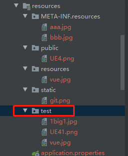

需要注意的是，如果是通过以上方式修改，那只有test以及META-INF.resources目录下的图片可以访问，如果在浏览器中没有访问成功，clean一下Maven工程，然后重新运行项目，如下图所示：


#### 3.3.2.2 webjar的使用

webjar常用来作为静态资源引入，可以引入jquery.js,Bootstrap.js等资源文件

官方地址如下：https://www.webjars.org/，

如引入jquery静态资源：


可以看到，相关包已经引入进来：


如果要访问jquery包下的静态资源，可以通过如下方式：


#### 3.3.2.3 欢迎页支持

配置欢迎页有两种方式，一种是在静态资源路径下使用index.html，另一种是使用controller处理/index请求。

+ 使用静态资源路径的方式


使用这种方式不能配置静态资源的访问前缀，否则会导致/index.html请求不能被SpringBoot拦截处理。

#### 3.3.2.4 订制网页图标

使用如下方式获得想要下载的网站图标，下载即可：


把图标放在静态资源路径中:


### 3.3.3 源码分析之静态配置原理

和web相关的自动配置在如下目录的web目录下：


SpringMvc功能的自动配置类在SpringMvcConfiguration:


一旦WebMvcAutoConfiguration生效，该类会给容器中相应的Bean：

+ hiddenHttpMethodFilter （使SpringMVC兼容Rest风格）

+ formContentFilter （表单内容过滤器）

  ......

WebMvcAutoConfiguration中配置了一个静态类WebMvcAutoConfigurationAdapter


看源码需要先看类上方的@EnableConfigurationProperties(......)，了解容器中配置了什么，可以看到WebMvcAutoConfigurationAdapter的@EnableConfigurationProperties中有WebMvcProperties.class以及WebProperties.class，

WebMvcProperties和配置文件中前缀为spring.mvc的配置进行绑定：


WebProperties和配置文件中前缀为spring.web的配置进行绑定：


扩展：如果配置类只要一个有参构造器，则有参构造器所有参数的值都会从容器中确定，WebMvcAutoConfigurationAdapter的有参构造器如下：

```java
//WebProperties：获取和spring.web配置绑定的所有的值的对象
//WebMvcProperties：获取和spring.mvc配置绑定的所有的值的对象
//ListableBeanFactory：Spring的Bean容器
//HttpMessageConverters：找到所有的HttpMessageConverters
//ResourceHandlerRegistrationCustomizer：找到资源处理器的自定义器
//DispatcherServletPath
//ServletRegistrationBean：给应用注册Servlet、Filter.....
public WebMvcAutoConfigurationAdapter(WebProperties webProperties, WebMvcProperties mvcProperties, ListableBeanFactory beanFactory, ObjectProvider<HttpMessageConverters> messageConvertersProvider, ObjectProvider<WebMvcAutoConfiguration.ResourceHandlerRegistrationCustomizer：> resourceHandlerRegistrationCustomizerProvider, ObjectProvider<DispatcherServletPath> dispatcherServletPath, ObjectProvider<ServletRegistrationBean<?>> servletRegistrations) {
    this.resourceProperties = webProperties.getResources();
    this.mvcProperties = mvcProperties;
    this.beanFactory = beanFactory;
    this.messageConvertersProvider = messageConvertersProvider;
    this.resourceHandlerRegistrationCustomizer = (WebMvcAutoConfiguration.ResourceHandlerRegistrationCustomizer)resourceHandlerRegistrationCustomizerProvider.getIfAvailable();
    this.dispatcherServletPath = dispatcherServletPath;
    this.servletRegistrations = servletRegistrations;
    this.mvcProperties.checkConfiguration();
}
```

资源处理的默认规则由WebMvcAutoConfigurationAdapter类中的addResourceHandlers函数定义：

```java
public void addResourceHandlers(ResourceHandlerRegistry registry) {
    //resourceProperties可以拿到spring.web中配置的属性，
    //isAddMappings（）函数拿到resourceProperties的addMappings属性，
    //addMappings默认是true,如果是false，则下面所有的配置都不生效
    if (!this.resourceProperties.isAddMappings()) {
        logger.debug("Default resource handling disabled");
    } else {
        //以下是webjars/**的请求配置规则，将/webjars/**路径映射到classpath:/META-INF/resources/webjars/中去找
        this.addResourceHandler(registry, "/webjars/**", "classpath:/META-INF/resources/webjars/");
       //以下是静态资源路径的配置
       // this.mvcProperties.getStaticPathPattern()默认的拦截请求是："/**"，如果自定义了拦截请求，那么则会用yaml文件中配置的拦截请求
        this.addResourceHandler(registry, this.mvcProperties.getStaticPathPattern(), (registration) -> {
            //this.staticLocations = CLASSPATH_RESOURCE_LOCATIONS中配置了静态资源的默认路径：CLASSPATH_RESOURCE_LOCATIONS = new String[]{"classpath:/META-INF/resources/", "classpath:/resources/", "classpath:/static/", "classpath:/public/"}，如果改了配置，则只会用配置的路径。
            registration.addResourceLocations(this.resourceProperties.getStaticLocations());
            if (this.servletContext != null) {
                ServletContextResource resource = new  ServletContextResource(this.servletContext, "/");
                registration.addResourceLocations(new Resource[]{resource});
            }

        });
    }
}
```

配置欢迎页的代码位于EnableWebMvcConfiguration类下的welcomePageHandlerMapping函数：

```java
//xxxHandlerMapping是处理器映射，用于配置哪些请求能够被处理
@Bean
public WelcomePageHandlerMapping welcomePageHandlerMapping(ApplicationContext applicationContext, FormattingConversionService mvcConversionService, ResourceUrlProvider mvcResourceUrlProvider) {
    //this.mvcProperties.getStaticPathPattern()表示的是欢迎页请求对应的路径
    WelcomePageHandlerMapping welcomePageHandlerMapping = new WelcomePageHandlerMapping(new TemplateAvailabilityProviders(applicationContext), applicationContext, this.getWelcomePage(), this.mvcProperties.getStaticPathPattern());
    welcomePageHandlerMapping.setInterceptors(this.getInterceptors(mvcConversionService, mvcResourceUrlProvider));
    welcomePageHandlerMapping.setCorsConfigurations(this.getCorsConfigurations());
    return welcomePageHandlerMapping;
}
```

WelcomePageHandlerMapping的构造函数如下：

```java
WelcomePageHandlerMapping(TemplateAvailabilityProviders templateAvailabilityProviders, ApplicationContext applicationContext, Resource welcomePage, String staticPathPattern) {
    //只有配置的请求映射是/**才会寻找默认欢迎页面
    if (welcomePage != null && "/**".equals(staticPathPattern)) {
        logger.info("Adding welcome page: " + welcomePage);
        this.setRootViewName("forward:index.html");
    } else if (this.welcomeTemplateExists(templateAvailabilityProviders, applicationContext)) {
        logger.info("Adding welcome page template: index");
        this.setRootViewName("index");
    }

}
```

可以看到，在访问静态页面时，只有staticPathPattern配置的是"/**"才会进入欢迎页面，那么如果我们在yaml中做如下配置，访问欢迎页就会失效：


所以可以尝试对源码进行修改，对SpringBoot进行源码修改需要在src.main.java中添加对应的包名与类名，比如要修改spring-boot-autoconfigure-2.6.2.jar中org.springframework.boot.autoconfigure.web.servlet包中的WelcomePageHandlerMapping类：


需要在src.main.java做如下的添加：


这样就会用自己写的WelcomePageHandlerMapping类代替SpringBoot中的WelcomePageHandlerMapping类，修改的构造函数如下：

```java
WelcomePageHandlerMapping(TemplateAvailabilityProviders templateAvailabilityProviders,
                          ApplicationContext applicationContext, Resource welcomePage, String staticPathPattern) {
    if (welcomePage != null ) {
        if("/**".equals(staticPathPattern)){
            logger.info("Adding welcome page: " + welcomePage);
            setRootViewName("forward:index.html");
        }else{
            int lastindex =staticPathPattern.lastIndexOf("/");
            setRootViewName("forward:" + staticPathPattern.substring(0,lastindex)+"/index.html");
        }

    }
    else if (welcomeTemplateExists(templateAvailabilityProviders, applicationContext)) {
        logger.info("Adding welcome page template: index");
        setRootViewName("index");
    }
}
```

通过以上修改，即使配置了静态资源拦截路径，也可以访问到index.html。

### 3.3.4 Rest映射的使用及源码解析

#### 3.3.1 Rest映射的使用

- Rest风格支持（*使用**HTTP**请求方式动词来表示对资源的操作*）

- - 以前：/getUser获取用户 /deleteUser删除用户 /editUser修改用户 /saveUser保存用户
  - 现在：/user GET-获取用户 DELETE-删除用户 PUT-修改用户 POST-保存用户

案例如下：

+ index.html

```html
<!DOCTYPE html>
<html lang="en">
<head>
    <meta charset="UTF-8">
    <title>Title</title>
</head>
<body>
<h1>atguigu，欢迎您</h1>
测试REST风格；
<form action="/user" method="get">
    <input value="REST-GET 提交" type="submit"/>
</form>
<form action="/user" method="post">
    <input value="REST-POST 提交" type="submit"/>
</form>
<form action="/user" method="delete">
    <input value="REST-DELETE 提交" type="submit"/>
</form>
<form action="/user" method="put">
    <input value="REST-PUT 提交" type="submit"/>
</form>
</body>
</html>
```

+ UserController.java

```java
package com.test.boot.controller;

import org.springframework.web.bind.annotation.*;
import org.springframework.beans.factory.annotation.Autowired;
import org.springframework.web.bind.annotation.RestController;

@RestController
public class UserController {

//    @RequestMapping(value = "/user",method = RequestMethod.GET)
    @GetMapping("/user")
    public String getUser(){
        return "GET-张三";
    }

//    @RequestMapping(value = "/user",method = RequestMethod.POST)
    @PostMapping("/user")
    public String saveUser(){
        return "POST-张三";
    }


//    @RequestMapping(value = "/user",method = RequestMethod.PUT)
    @PutMapping("/user")
    public String putUser(){
        return "PUT-张三";
    }

//    @RequestMapping(value = "/user",method = RequestMethod.DELETE)
    @DeleteMapping("/user")
    public String deleteUser(){
        return "DELETE-张三";
    }

}

```

如下图所示，可以看到在源码中，SpringBoot已经默认开启了Rest风格的支持。


代码如下：

```java
@Bean
@ConditionalOnMissingBean(HiddenHttpMethodFilter.class)
//所以要想使用Rest风格需要在yaml中配置spring.mvc.hiddenmethod.filter.enabled为true
@ConditionalOnProperty(prefix = "spring.mvc.hiddenmethod.filter", name = "enabled")
public OrderedHiddenHttpMethodFilter hiddenHttpMethodFilter() {
   return new OrderedHiddenHttpMethodFilter();
}
```

但是如果此时用上述的index.html使用delete与put的请求仍然是post的方式，如下所示：


如果需要使用delete与put需要在表单提交的时候使用隐藏参数_method指定类型,并把method设置为"post"：

```html
<!DOCTYPE html>
<html lang="en">
<head>
    <meta charset="UTF-8">
    <title>Title</title>
</head>
<body>
<h1>Welcome!</h1>
测试REST风格；
<form action="/user" method="get">
    <input value="REST-GET 提交" type="submit"/>
</form>
<form action="/user" method="post">
    <input value="REST-POST 提交" type="submit"/>
</form>
<form action="/user" method="post">
    <input name="_method" type="hidden" value="delete"/>
    <input value="REST-DELETE 提交" type="submit"/>
</form>
<form action="/user" method="post">
    <input name="_method" type="hidden" value="PUT"/>
    <input value="REST-PUT 提交" type="submit"/>
</form>
</body>
</html>
```

然后添加spring.mvc.hiddenmethod.filter的配置：

```yaml
spring:
  mvc:
    hiddenmethod:
      filter:
        enabled: true   #开启页面表达的Rest风格
```

#### 3.3.2 Rest原理（表单提交要使用Rest风格的时候）

+ 表单提交会带上_method=PUT
+ 请求过来会被OrderedHiddenHttpMethodFilter拦截，代码如下

```java
@Bean
@ConditionalOnMissingBean(HiddenHttpMethodFilter.class)
@ConditionalOnProperty(prefix = "spring.mvc.hiddenmethod.filter", name = "enabled")
public OrderedHiddenHttpMethodFilter hiddenHttpMethodFilter() {
   return new OrderedHiddenHttpMethodFilter();
}
```

OrderedHiddenHttpMethodFilter里new了一个OrderedHiddenHttpMethodFilter对象，进入OrderedHiddenHttpMethodFilter类的父类HiddenHttpMethodFilter：


然后查看doFilterInternal函数：


代码如下;

```java
protected void doFilterInternal(HttpServletRequest request, HttpServletResponse response, FilterChain filterChain) throws ServletException, IOException {
    HttpServletRequest requestToUse = request;
    //请求时post，并且请求没有错误
    if ("POST".equals(request.getMethod()) && request.getAttribute("javax.servlet.error.exception") == null) {
        //获取methodParam请求参数，请求参数默认值为_method
        String paramValue = request.getParameter(this.methodParam);
        if (StringUtils.hasLength(paramValue)) {
            String method = paramValue.toUpperCase(Locale.ENGLISH);
            if (ALLOWED_METHODS.contains(method)) {
                requestToUse = new HiddenHttpMethodFilter.HttpMethodRequestWrapper(request, method);
            }
        }
    }
```

当有Http请求发来时，会进入拦截器doFilterInternal。以界面上的REST-DELETE提交为例，当使用

```html
<form action="/user" method="post">
    <input name="_method" type="hidden" value="delete"/>
    <input value="REST-DELETE 提交" type="submit"/>
</form>
```

的方式提交请求时，会进入拦截器：


此时判断请求中有没有name为_method的属性，如果有，则进行相应的Rest风格处理：


SpringBoot兼容了put,delete,pathc请求,大小写无关，因为SpringBoot会把属性转成大写后再判断：

```java
ALLOWED_METHODS = Collections.unmodifiableList(Arrays.asList(HttpMethod.PUT.name(), HttpMethod.DELETE.name(), HttpMethod.PATCH.name()));
```

如果含有对应的请求，requestToUse被重新赋值为包装类`HiddenHttpMethodFilter.HttpMethodRequestWrapper(request, method);`作为后续的处理请求类。其中HttpMethodRequestWrapper包装类如下图所示：


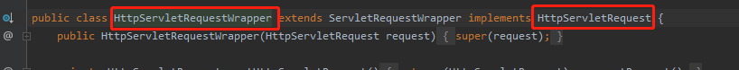


所以HttpMethodRequestWrapper是ServletRequest的实现类，相当于对ServletRequest做了进一步的封装。原生的请求是request(post),包装类HttpMethodRequestWrapper中定义了method属性，过滤器在调用方法时会使用HttpMethodRequestWrapper中设置的method，调用不同的函数，如下图所示：


处理请求多这一层步骤的原因是浏览器只支持get和post请求，所以添加一个参数使得后端可以根据隐藏参数使用不同的映射。如果发送方支持delete与put，则不会走这一步，如PostMan工具直接发delete与put，则不会使用Filter。

+ 改变默认的method


可以看到，如果容器中有HiddenHttpMethodeFilter对象，就不会使用默认的OrderedHiddenHttpMethodFilter对象，默认的OrderedHiddenHttpMethodFilter对象中配置的默认属性名是_method,如下图：


所以如果想修改_method属性名可以在容器中配置HiddenHttpMethodFilter:

```java
package com.example.hellotest.config;

import org.springframework.context.annotation.Bean;
import org.springframework.context.annotation.Configuration;
import org.springframework.web.filter.HiddenHttpMethodFilter;

@Configuration(proxyBeanMethods=false)
public class WebConfig {
    @Bean
    public HiddenHttpMethodFilter hiddenHttpMethodFilter(){
        HiddenHttpMethodFilter hiddenHttpMethodFilter = new HiddenHttpMethodFilter();
        hiddenHttpMethodFilter.setMethodParam("_codingInn");
        return hiddenHttpMethodFilter;
    }
}
```

然后可以通过如下方式进行DELETE和PUT请求：

```html
<!DOCTYPE html>
<html lang="en">
<head>
    <meta charset="UTF-8">
    <title>Title</title>
</head>
<body>
<h1>Welcome!</h1>
测试REST风格；
<form action="/user" method="get">
    <input value="REST-GET 提交" type="submit"/>
</form>
<form action="/user" method="post">
    <input value="REST-POST 提交" type="submit"/>
</form>
<form action="/user" method="post">
    <input name="_codingInn" type="hidden" value="delete"/>
    <input value="REST-DELETE 提交" type="submit"/>
</form>
<form action="/user" method="post">
    <input name="_codingInn" type="hidden" value="PUT"/>
    <input value="REST-PUT 提交" type="submit"/>
</form>
</body>
</html>
```

### 3.3.5 SpringBoot请求处理源码

SpringBoot所有处理请求的开始都在DispatcherServlet，如下所示:


DispatcherServlet类的继承关系如下所示（IDEA使用Ctrl+H可以查看类的关系，使用Ctrl+F12可以查看类中的函数）：


由于是一个Servlet所以必须要重写doGet()以及doPost()函数：


从图中可以看出，doGet和doPost使用的是父类FrameworkServlet中的实现函数。doGet或doPost的实现函数如下：


doGet与doPost都是调用processRequest函数：


其中doService是核心函数：


doService的实现在子类DispatcherServlet中：


该函数中，主要功能在doDispatch函数：


doDispatch函数的代码如下：

```java
protected void doDispatch(HttpServletRequest request, HttpServletResponse response) throws Exception {
    HttpServletRequest processedRequest = request;
    HandlerExecutionChain mappedHandler = null;
    boolean multipartRequestParsed = false;
    WebAsyncManager asyncManager = WebAsyncUtils.getAsyncManager(request);

    try {
        try {
            ModelAndView mv = null;
            Object dispatchException = null;

            try {
                processedRequest = this.checkMultipart(request);
                multipartRequestParsed = processedRequest != request;
                mappedHandler = this.getHandler(processedRequest);
                if (mappedHandler == null) {
                    this.noHandlerFound(processedRequest, response);
                    return;
                }

                HandlerAdapter ha = this.getHandlerAdapter(mappedHandler.getHandler());
                String method = request.getMethod();
                boolean isGet = "GET".equals(method);
                if (isGet || "HEAD".equals(method)) {
                    long lastModified = ha.getLastModified(request, mappedHandler.getHandler());
                    if ((new ServletWebRequest(request, response)).checkNotModified(lastModified) && isGet) {
                        return;
                    }
                }

                if (!mappedHandler.applyPreHandle(processedRequest, response)) {
                    return;
                }

                mv = ha.handle(processedRequest, response, mappedHandler.getHandler());
                if (asyncManager.isConcurrentHandlingStarted()) {
                    return;
                }

                this.applyDefaultViewName(processedRequest, mv);
                mappedHandler.applyPostHandle(processedRequest, response, mv);
            } catch (Exception var20) {
                dispatchException = var20;
            } catch (Throwable var21) {
                dispatchException = new NestedServletException("Handler dispatch failed", var21);
            }

            this.processDispatchResult(processedRequest, response, mappedHandler, mv, (Exception)dispatchException);
        } catch (Exception var22) {
            this.triggerAfterCompletion(processedRequest, response, mappedHandler, var22);
        } catch (Throwable var23) {
            this.triggerAfterCompletion(processedRequest, response, mappedHandler, new NestedServletException("Handler processing failed", var23));
        }

    } finally {
        if (asyncManager.isConcurrentHandlingStarted()) {
            if (mappedHandler != null) {
                mappedHandler.applyAfterConcurrentHandlingStarted(processedRequest, response);
            }
        } else if (multipartRequestParsed) {
            this.cleanupMultipart(processedRequest);
        }

    }
}
```

所以对SpringBoot的访问请求分析都从如下位置开始：


例如当点击REST-GET请求的按钮


可以看到，在request参数中获取到了请求的详细信息，包括请求路径等。


继续往下走：


在这一步SpringBoot找到可以处理该请求的Controller处理器。

getHandler()函数如下：

```java
@Nullable
protected HandlerExecutionChain getHandler(HttpServletRequest request) throws Exception {
    //handlerMappings是处理器映射
    if (this.handlerMappings != null) {
        Iterator var2 = this.handlerMappings.iterator();

        while(var2.hasNext()) {
            HandlerMapping mapping = (HandlerMapping)var2.next();
            HandlerExecutionChain handler = mapping.getHandler(request);
            if (handler != null) {
                return handler;
            }
        }
    }

    return null;
}
```

所有的请求映射都在handlerMappings中，handlerMappings有如下五个handlerMapping:


当请求进来，SpringBoot会尝试遍历所有的HandlerMapping看是否有请求信息，如果有就找到这个请求对应的handler,如果没有就查找下一个HandlerMapping，如果需要一些自定义的映射处理，也可以自己给容器中放入HandlerMapping，自定义HandlerMapping。

其中WelcomePageHandlerMapping处理的是欢迎页请求，匹配的路径为"/",如下图所示：


RequestMappingHandlerMapping是所有的@RequestMapping注解的处理器映射，保存了所有的@RequestMapping注解对应的处理函数信息，如下图所示：


对于每一个handlerMapping，都会调用getHangler去判断是否含有对应的处理函数，如下图所示：


具体会调用如下的函数：


继续运行，可以看到在getHandlerInternal函数中根据请求路径返回对应的处理函数：


### 3.3.6 常用参数传递

+ index.html

```html
<ul>
    <a href="/car/1/owner/aaa">car/{id}/owner/{username}</a>
    <a href="car/3/owner/lisi?age=18&inters=basketball&inters=game">car/{id}/owner/{username}</a>
</ul>
```

#### 3.3.6.1 常用注解

```java
package com.example.hellotest.Controller;

import org.springframework.stereotype.Controller;
import org.springframework.web.bind.annotation.*;

import javax.servlet.http.Cookie;
import java.awt.event.MouseAdapter;
import java.util.Collections;
import java.util.HashMap;
import java.util.List;
import java.util.Map;

@RestController
public class ParameterTestController {
    //如果传递car/1则是获取1号汽车，以此类推。。。
    @GetMapping("/car/{id}")
    public Map<String,Object> getCar(@PathVariable("id") Integer id){
        Map<String,Object> map = new HashMap<>();

        map.put("id", id);
        return map;
    }

    //http://localhost:8080/car/1/owner/aaa->{"pv":{"id":"1","username":"aaa"},"id":1,"username":"aaa"}
    //http://localhost:8080/car/3/owner/lisi?age=18&inters=basketball&inters=game->{"pv":{"id":"3","username":"lisi"},"id":3,"params":{"age":"18","inters":"basketball"},"username":"lisi"}
    @GetMapping("/car/{id}/owner/{username}")
    								//获取Rest风格的请求参数
    public Map<String,Object> getCar2(@PathVariable("id") Integer id,
                                      @PathVariable("username") String username,
                                      //获取所有Rest风格的请求参数
                                      @PathVariable Map<String,String> pv,
                                      //获取请求头中名字为"User-Agent"的属性
                                      @RequestHeader("User-Agent") String userAgent,
                                      //获取请求头所有参数
                                      @RequestHeader Map<String,String> header,
                                      //获取get请求路径中所携带的属性，类型为：?age=18&inters=basketball&inters=game
                                      @RequestParam("age") Integer age,
                                      //get请求路径中所有的inters请求参数转成List
                                      @RequestParam("inters") List<String> inters,
                                      //获取get请求路径中所有携带的属性
                                      @RequestParam Map<String,String> params,
                                      //获取相应cookie的值
                                      @CookieValue("Idea-2cb4cbdc") String IdeaCookie,
                                      //获取相应cookie的对象
                                      @CookieValue("Idea-2cb4cbdc") Cookie cookie
                                      ){
        Map<String,Object> map = new HashMap<>();

        map.put("id", id);
        map.put("username", username);
        map.put("pv", pv);
//        map.put("userAgent", userAgent);
//        map.put("header", header);
        map.put("params", params);
        map.put("IdeaCookie", IdeaCookie);
        map.put("cookieObj", cookie);

        return map;
    }

    //获取post表单的信息
    @PostMapping("/save")
    public Map postMethod(@RequestBody String content){
        Map<String,Object> map = new HashMap<>();
        map.put("content", content);
        return map;
    }
}
```

#### 3.3.6.2 矩阵变量格式

+ index.html

```html
<a href="/cars/sell;low=34;brand=byd,audi,yd">@MatrixVariable（矩阵变量1）</a>
<a href="/cars/sell;low=34;brand=byd;brand=audi;brand=yd">@MatrixVariable（矩阵变量2）</a>
<a href="/boss/1;age=20/2;age=10">@MatrixVariable（矩阵变量）/boss/{bossId}/{empId}</a>
```

```java
package com.example.hellotest.Controller;

import org.springframework.stereotype.Controller;
import org.springframework.web.bind.annotation.*;

import javax.servlet.http.Cookie;
import java.awt.event.MouseAdapter;
import java.util.Collections;
import java.util.HashMap;
import java.util.List;
import java.util.Map;

@RestController
public class ParameterTestController {

    // 请求的格式为： /cars/sell;low=34;brand=byd,audi,bmw
    //sell表示的是请求路径，后面是附带的矩阵变量,需要注意的是要把请求路径和矩阵变量进行封装，
    //比如/cars/sell;low=34;brand=byd,audi,bmw -> /cars/{pathSig}  以pathSig来表示矩阵变量对应的层级，名字可以自己取
    // SpringBoot默认禁用了矩阵变量的功能，所以需要手动开启，对于路径的处理都是经过
    //UrlPathHelper进行解析，removeSemicolonContent表示是否支持矩阵变量
    @GetMapping("/cars/{pathSig}")
    public Map carsSell(@MatrixVariable("low") Integer low,
                        @MatrixVariable("brand") List<String> brand,
                        @PathVariable("pathSig") String path){
        Map<String,Object> map = new HashMap<>();

        map.put("low",low);
        map.put("brand", brand);
        map.put("path", path);
        return map;
    }

    //指定路径获取矩阵变量的值
    // /boss/1;age=20/2;age=10
    @GetMapping("/boss/{bossId}/{empId}")
    public Map boss(@MatrixVariable(value = "age",pathVar = "bossId") Integer bossAge,
                    @MatrixVariable(value = "age",pathVar = "empId") Integer empAge){
        Map<String,Object> map = new HashMap<>();
        map.put("bossAge",bossAge);
        map.put("empAge",empAge);
        return map;
    }
}
```

设置SpringBoot矩阵变量支持的源码如下所示，由WebMvcAutoConfiguration类中的静态类WebMvcAutoConfigurationAdapter类中的的configurePathMatch函数配置：


其中设置矩阵格式的类是：

```java
UrlPathHelper urlPathHelper = new UrlPathHelper();
```

负责矩阵格式的变量如下所示,removeSemicolonContent默认是true,可以看到SpringBoot默认是禁用了矩阵变量的功能:


如果要重载removeSemicolonContent变量，可以采用如下两种方式：

方式1.因为configurePathMatch在WebMvcConfigurer接口中，并且默认实现是不开启矩阵变量模式，如果要使用自己定制的自己的configurePathMatch函数，可以在配置类中重新往容器注入WebMvcConfigurer类的实现类，并在返回的类中重载configurePathMatch函数，此时SpringBoot会使用自己定制的configurePathMatch函数：

```java
@Configuration(proxyBeanMethods=false)
public class WebConfig{
    @Bean
    public HiddenHttpMethodFilter hiddenHttpMethodFilter(){
        HiddenHttpMethodFilter hiddenHttpMethodFilter = new HiddenHttpMethodFilter();
        hiddenHttpMethodFilter.setMethodParam("_codingInn");
        return hiddenHttpMethodFilter;
    }

    @Bean
    public WebMvcConfigurer webMvcConfigurer(){
        return new WebMvcConfigurer() {
            @Override
            public void configurePathMatch(PathMatchConfigurer configurer) {
                UrlPathHelper urlPathHelper = new UrlPathHelper();
                //设置为不移除;后面的内容，矩阵变量功能可以实现
                urlPathHelper.setRemoveSemicolonContent(false);
                configurer.setUrlPathHelper(urlPathHelper);
            }
        };
    }
}

```

方式2.将配置类实现WebMvcConfigurer接口，并重写configurePathMatch函数：

```java
@Configuration(proxyBeanMethods=false)
public class WebConfig implements WebMvcConfigurer {
    @Bean
    public HiddenHttpMethodFilter hiddenHttpMethodFilter(){
        HiddenHttpMethodFilter hiddenHttpMethodFilter = new HiddenHttpMethodFilter();
        hiddenHttpMethodFilter.setMethodParam("_codingInn");
        return hiddenHttpMethodFilter;
    }

//    @Bean  webMvcConfigurer

    @Override
    public void configurePathMatch(PathMatchConfigurer configurer) {
        UrlPathHelper urlPathHelper = new UrlPathHelper();
        //设置为不移除;后面的内容，矩阵变量功能可以实现
        urlPathHelper.setRemoveSemicolonContent(false);
        configurer.setUrlPathHelper(urlPathHelper);
    }
}
```

所以如果以后要实现定制功能，只需要在配置类中重新注入对应接口类的实现类，或将配置类implements相应接口类。

### 3.3.7 请求处理

#### 3.3.7.1 简单参数源码解析

以请求为：localhost:8080/car/3/owner/lisi?age=18&inters=basketball&inters=game,为例，解析SpringBoot如何获得请求域中的参数，其中controller函数如下:

```java
package com.example.hellotest.Controller;

import org.springframework.stereotype.Controller;
import org.springframework.web.bind.annotation.*;

import javax.servlet.http.Cookie;
import java.awt.event.MouseAdapter;
import java.util.Collections;
import java.util.HashMap;
import java.util.List;
import java.util.Map;

@RestController
public class ParameterTestController {
    //http://localhost:8080/car/1/owner/aaa->{"pv":{"id":"1","username":"aaa"},"id":1,"username":"aaa"}
    //http://localhost:8080/car/3/owner/lisi?age=18&inters=basketball&inters=game->{"pv":{"id":"3","username":"lisi"},"id":3,"params":{"age":"18","inters":"basketball"},"username":"lisi"}
    @GetMapping("/car/{id}/owner/{username}")
    public Map<String,Object> getCar2(@PathVariable("id") Integer id,
                                      @PathVariable("username") String username,
                                      @PathVariable Map<String,String> pv,
                                      @RequestHeader("User-Agent") String userAgent,
                                      @RequestHeader Map<String,String> header,
                                      @RequestParam("age") Integer age,
                                      @RequestParam("inters") List<String> inters,
                                      @RequestParam Map<String,String> params,
                                      @CookieValue("Idea-2cb4cbdc") String IdeaCookie,
                                      @CookieValue("Idea-2cb4cbdc") Cookie cookie
                                      ){
        Map<String,Object> map = new HashMap<>();

        map.put("id", id);
        map.put("username", username);
        map.put("pv", pv);
//        map.put("userAgent", userAgent);
//        map.put("header", header);
        map.put("params", params);
        map.put("IdeaCookie", IdeaCookie);
        map.put("cookieObj", cookie);

        return map;
    }
}
```

当浏览器发送请求时，与参数处理有关的代码在DispatcherServlet的函数doDispatch中:


通过getHandler函数，可以找到对应的请求处理函数：


如下所示的位置，显示了SpringBoot中配置的请求映射：


详细信息如下：


通过getHandler函数可以返回请求路径对应的handler,handler中封装了对应方法的信息。

接下来需要决定对应handler的适配器，适配器的作用是使用反射给对应方法的参数进行赋值：


HandlerAdapter是Spring设计的一个接口，其中`boolean supports(Object handler);`表示该适配器能否支持某一个Adapter。

getHandlerAdapter的函数如下：

```java
/**
 * Return the HandlerAdapter for this handler object.
 * @param handler the handler object to find an adapter for
 * @throws ServletException if no HandlerAdapter can be found for the handler. This is a fatal error.
 */
protected HandlerAdapter getHandlerAdapter(Object handler) throws ServletException {
   if (this.handlerAdapters != null) {
      for (HandlerAdapter adapter : this.handlerAdapters) {
         if (adapter.supports(handler)) {
            return adapter;
         }
      }
   }
   throw new ServletException("No adapter for handler [" + handler +
         "]: The DispatcherServlet configuration needs to include a HandlerAdapter that supports this handler");
}
```

其中handlerAdapters有四种：


RequestMappingHandlerAdapter支持方法上标注@RequestMapping;

HandlerFunctonAdapter支持函数式方法。

supports的函数如下：


所以，当发送@RequestMapping注解的请求，会得到RequestMappingHandlerAdapter，如下图所示：


核心点在ha.handle函数：


handle函数会传入request请求，response回复，以及请求对应的函数getHandler。

接下来会依次进入：


该函数通过`mav = invokeHandlerMethod(request, response, handlerMethod);`执行目标方法。invokeHandlerMethod函数中的argumentResolvers是参数解析器，如下图所示：


接下来会设置参数解释器，参数解析器一共有26个，用于确定要执行的目标函数的参数是什么，不同的解析器对应不同的解析器，比如第0个解析器对应@RequestParam注解：


SpringBoot目标方法能写多少种参数类型，取决于有多少参数解析器。this.argumentResolvers对应的类型为HandlerMethodArgumentResolverComposite，该类实现了接口HandlerMethodArgumentResolver：


该接口有两个接口函数：

```java
public interface HandlerMethodArgumentResolver {
    //判断当前解析器是否支持解析该参数
    boolean supportsParameter(MethodParameter var1);

    //如果支持就调用resolveArgument函数
    @Nullable
    Object resolveArgument(MethodParameter var1, @Nullable ModelAndViewContainer var2, NativeWebRequest var3, @Nullable WebDataBinderFactory var4) throws Exception;
}
```

与此对应的还有返回值处理器:


在以上步骤，一些请求，还有对应的处理函数以及处理器已经封装完毕。

真正执行处理的是如下函数：


```java
invocableMethod.invokeAndHandle(webRequest, mavContainer);
```

进入该函数，如果以下函数放行，会进入目标方法：


接下来看一下在进入目标函数之前如何拿到该目标函数的对应参数。单步执行可以看到，SpringBoot会先拿到方法的参数值，例如url为：href="car/3/owner/lisi?age=18&inters=basketball&inters=game"，对应的controller为：

```java
@GetMapping("/car/{id}/owner/{username}")
    public Map<String,Object> getCar2(@PathVariable("id") Integer id,
                                      @PathVariable("username") String username,
                                      @PathVariable Map<String,String> pv,
                                      @RequestHeader("User-Agent") String userAgent,
                                      @RequestHeader Map<String,String> header,
                                      @RequestParam("age") Integer age,
                                      @RequestParam("inters") List<String> inters,
                                      @RequestParam Map<String,String> params,
                                      @CookieValue("Idea-2cb4cbdc") String IdeaCookie,
                                      @CookieValue("Idea-2cb4cbdc") Cookie cookie
                                      ){
        Map<String,Object> map = new HashMap<>();

        map.put("id", id);
        map.put("username", username);
        map.put("pv", pv);
//        map.put("userAgent", userAgent);
//        map.put("header", header);
        map.put("params", params);
        map.put("IdeaCookie", IdeaCookie);
        map.put("cookieObj", cookie);

        return map;
    }
```

接着通过invokeAndHandle函数中的invokeForRequest可以通过反射获取函数的相应参数，解析请求中附带的值并将解析的值给函数的参数赋值。


如下所示的args是对应的函数所含有的变量，以请求http://localhost:8080/car/3/owner/lisi?age=18&inters=basketball&inters=game为例：


那么，SpringBoot如何获请求中的参数绑定到相应的变量中？先进入getMethodArgumentValues函数：


getMethodArgumentValues的核心函数如下：

```java
/**
函数在spring-web-5.2.12.RELEASE-souces.jar的org.spingframework.web.method.support.InvocableHandlerMethod中
 * Get the method argument values for the current request, checking the provided
 * argument values and falling back to the configured argument resolvers.
 * <p>The resulting array will be passed into {@link #doInvoke}.
 * @since 5.1.2
 */
protected Object[] getMethodArgumentValues(NativeWebRequest request, @Nullable ModelAndViewContainer mavContainer,
      Object... providedArgs) throws Exception {

    //先获取方法的所有参数声明
   MethodParameter[] parameters = getMethodParameters();
   if (ObjectUtils.isEmpty(parameters)) {
      return EMPTY_ARGS;
   }

    //返回的args是所有函数参数对应的值
   Object[] args = new Object[parameters.length];
   for (int i = 0; i < parameters.length; i++) {
      MethodParameter parameter = parameters[i];
      parameter.initParameterNameDiscovery(this.parameterNameDiscoverer);
       //获取参数名对应的请求中的值
      args[i] = findProvidedArgument(parameter, providedArgs);
      if (args[i] != null) {
         continue;
      }
       //判断参数解析器是否支持处理当前的参数
      if (!this.resolvers.supportsParameter(parameter)) {
         throw new IllegalStateException(formatArgumentError(parameter, "No suitable resolver"));
      }
      try {
          //解析当前参数的值
         args[i] = this.resolvers.resolveArgument(parameter, mavContainer, request, this.dataBinderFactory);
      }
      catch (Exception ex) {
         // Leave stack trace for later, exception may actually be resolved and handled...
         if (logger.isDebugEnabled()) {
            String exMsg = ex.getMessage();
            if (exMsg != null && !exMsg.contains(parameter.getExecutable().toGenericString())) {
               logger.debug(formatArgumentError(parameter, exMsg));
            }
         }
         throw ex;
      }
   }
   return args;
}
```

该函数的第一步是使用getMethodParameters获得函数中每一个参数的类型以及对应的注解（注意：不包括函数参数的名字，因为在反射的时候只用传递值的数组，而不需要传递名字），截图如下：


`getMethodArgumentValues`函数中`this.resolvers.supportsParameter(parameter)`函数用来判断是否有参数解析器支持传入的parameter，具体代码如下：

```java
@Override
public boolean supportsParameter(MethodParameter parameter) {
   return getArgumentResolver(parameter) != null;
}
```

```java
/**
 * Find a registered {@link HandlerMethodArgumentResolver} that supports
 * the given method parameter.
 */
@Nullable
private HandlerMethodArgumentResolver getArgumentResolver(MethodParameter parameter) {
   HandlerMethodArgumentResolver result = this.argumentResolverCache.get(parameter);
   if (result == null) {
      for (HandlerMethodArgumentResolver resolver : this.argumentResolvers) {
         if (resolver.supportsParameter(parameter)) {
            result = resolver;
             //缓存中放入可以处理的解析器
            this.argumentResolverCache.put(parameter, result);
            break;
         }
      }
   }
   return result;
}
```

以第一个adpter为例:


可以看到第一个处理器是判断请求的参数有没有@RequestParam注解来返回true或者false：


获取参数解析器后，接下来需要使用相应的解析器对参数进行解析参数，遍历每一个参数，然后使用supportsParameter函数判断是否有对应类型的转换器：


getArgumentResolver会遍历所有的参数解析器，如果找到，则把相应的解析器放入缓存中。


解析的函数是：

代码如下：

```java
/**
 * Iterate over registered
 * {@link HandlerMethodArgumentResolver HandlerMethodArgumentResolvers}
 * and invoke the one that supports it.
 * @throws IllegalArgumentException if no suitable argument resolver is found
 */
@Override
@Nullable
public Object resolveArgument(MethodParameter parameter, @Nullable ModelAndViewContainer mavContainer,
      NativeWebRequest webRequest, @Nullable WebDataBinderFactory binderFactory) throws Exception {

    //从缓存中获取解析器
   HandlerMethodArgumentResolver resolver = getArgumentResolver(parameter);
   if (resolver == null) {
      throw new IllegalArgumentException("Unsupported parameter type [" +
            parameter.getParameterType().getName() + "]. supportsParameter should be called first.");
   }
    //解析参数并将解析的结果返回
   return resolver.resolveArgument(parameter, mavContainer, webRequest, binderFactory);
}
```

resolveArgument的解析函数如下

```java
@Override
@Nullable
public final Object resolveArgument(MethodParameter parameter, @Nullable ModelAndViewContainer mavContainer,
      NativeWebRequest webRequest, @Nullable WebDataBinderFactory binderFactory) throws Exception {

    //获取函数参数对应的注解
   NamedValueInfo namedValueInfo = getNamedValueInfo(parameter);
   MethodParameter nestedParameter = parameter.nestedIfOptional();

    //获取函数参数对应的请求体中的字段
   Object resolvedName = resolveEmbeddedValuesAndExpressions(namedValueInfo.name);
   if (resolvedName == null) {
      throw new IllegalArgumentException(
            "Specified name must not resolve to null: [" + namedValueInfo.name + "]");
   }

    //确定对应函数参数的值
   Object arg = resolveName(resolvedName.toString(), nestedParameter, webRequest);
   if (arg == null) {
      if (namedValueInfo.defaultValue != null) {
         arg = resolveEmbeddedValuesAndExpressions(namedValueInfo.defaultValue);
      }
      else if (namedValueInfo.required && !nestedParameter.isOptional()) {
         handleMissingValue(namedValueInfo.name, nestedParameter, webRequest);
      }
      arg = handleNullValue(namedValueInfo.name, arg, nestedParameter.getNestedParameterType());
   }
   else if ("".equals(arg) && namedValueInfo.defaultValue != null) {
      arg = resolveEmbeddedValuesAndExpressions(namedValueInfo.defaultValue);
   }

   if (binderFactory != null) {
      WebDataBinder binder = binderFactory.createBinder(webRequest, null, namedValueInfo.name);
      try {
         arg = binder.convertIfNecessary(arg, parameter.getParameterType(), parameter);
      }
      catch (ConversionNotSupportedException ex) {
         throw new MethodArgumentConversionNotSupportedException(arg, ex.getRequiredType(),
               namedValueInfo.name, parameter, ex.getCause());
      }
      catch (TypeMismatchException ex) {
         throw new MethodArgumentTypeMismatchException(arg, ex.getRequiredType(),
               namedValueInfo.name, parameter, ex.getCause());
      }
   }

   handleResolvedValue(arg, namedValueInfo.name, parameter, mavContainer, webRequest);

   return arg;
}
```

resolveArgument函数中的resolveName的实现函数如下：


获取完参数之后，使用invokeForRequest函数中的doInvoke进行反射调用,args是相应函数参数的值：

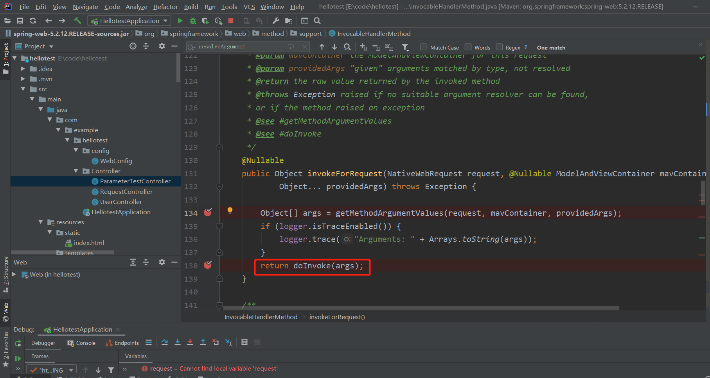


#### 3.3.7.2 forward参数传递源码解析

**Map**、**Model（map、model里面的数据会被放在request的请求域，相当于request.setAttribute）、**Errors/BindingResult、**RedirectAttributes（ 重定向携带数据）**、**ServletResponse（response响应）**、SessionStatus、UriComponentsBuilder、ServletUriComponentsBuilde

+ 测试代码：

```java
package com.example.hellotest.Controller;

import org.springframework.stereotype.Controller;
import org.springframework.ui.Model;
import org.springframework.web.bind.annotation.GetMapping;
import org.springframework.web.bind.annotation.RequestAttribute;
import org.springframework.web.bind.annotation.ResponseBody;
import org.springframework.web.bind.annotation.RestController;

import javax.servlet.http.Cookie;
import javax.servlet.http.HttpServletRequest;
import javax.servlet.http.HttpServletResponse;
import java.util.HashMap;
import java.util.Map;

@Controller
//@RestController//使用@RestController注解会导致该类的每一个函数都有@ResponseBody属性，相当于都是返回给浏览器数据，无法处理forward请求，所以不可以使用
public class RequestController {
    @GetMapping("/params")
    public String testParam(Map<String,Object> map,
                            Model model,
                            HttpServletRequest request,
                            HttpServletResponse response){
        map.put("hello", "hellolll");
        //给model和request添加属性都相当于给request中添加属性
        model.addAttribute("world","worldlll");
        request.setAttribute("message", "HelloWorld");
        Cookie cookie = new Cookie("c1","v1");
        cookie.setDomain("localhost");
        response.addCookie(cookie);
        return "forward:/success";
    }

    @ResponseBody
    @GetMapping("/success")
    public Map success(@RequestAttribute(value = "msg",required = false) String msg,
                          @RequestAttribute(value = "code",required = false) String code,
                          HttpServletRequest request){
        Object msg1 = request.getAttribute("msg");

        Map<String,Object> map = new HashMap<>();
        Object hello = request.getAttribute("hello");
        Object world = request.getAttribute("world");
        Object message = request.getAttribute("message");

        map.put("hello", hello);
        map.put("world", world);
        map.put("message", message);
        return map;
    }
}
```

可以看到请求的返回中附带了设置的Cookie值:


源码如下，首先会进入DispatcherServlet的doDispatch函数：


接下来会通过反射调用相应的函数：


接着通过invokeAndHandle函数中的invokeForRequest可以通过反射获取函数的相应参数。


在getMethodArgumentValues()函数中的两个关键函数如下：


supportsParameter函数如下：


遍历所有的参数解析器获取对应的参数解析器：


所有的参数解析器如下：


对于第一个属性Map,查看对应的参数解析器为MapMethodProcessor:


接下来使用如下函数进行解析：


getModel函数会返回一个ModelMap：


可以看到，如果函数参数是map类型则会返回defaultModel:


通过调试也可以发现，对于Model类型，返回的也是defaultModel。从下图可以看出Map和Model对应的是同一个对象：


return doInvoke会调用目标方法:


调用完之后会获得相应的返回值，并且mavContainer中也有上一步设置的值：


接下来开始处理返回值，上一步的返回结果是一个String（"forward:/success"）：


先找到返回值的处理器:


然后再使用`handler.handleReturnValue(returnValue, returnType, mavContainer, webRequest);`处理返回值。如果返回的是字符串：


目标函数执行完之后，所有的数据都会放在mavContainer中，mavContainer包含要去的页面地址，还包含Model或Map的数据，接下来会在invokeHandlerMethod函数中返回getModelAndView：


updateModel函数如下：

```java
/**
 * Promote model attributes listed as {@code @SessionAttributes} to the session.
 * Add {@link BindingResult} attributes where necessary.
 * @param request the current request
 * @param container contains the model to update
 * @throws Exception if creating BindingResult attributes fails
 */
public void updateModel(NativeWebRequest request, ModelAndViewContainer container) throws Exception {
    //获取Model对象
   ModelMap defaultModel = container.getDefaultModel();
   if (container.getSessionStatus().isComplete()){
      this.sessionAttributesHandler.cleanupAttributes(request);
   }
   else {
      this.sessionAttributesHandler.storeAttributes(request, defaultModel);
   }
   if (!container.isRequestHandled() && container.getModel() == defaultModel) {
       //更新最终的绑定结果
      updateBindingResult(request, defaultModel);
   }
}
```

updateBindingResult函数如下：

```java
/**
 * Add {@link BindingResult} attributes to the model for attributes that require it.
 */
private void updateBindingResult(NativeWebRequest request, ModelMap model) throws Exception {
    //获取model中所有的key
   List<String> keyNames = new ArrayList<>(model.keySet());
   for (String name : keyNames) {
       //拿到每一个key对应的值
      Object value = model.get(name);
      if (value != null && isBindingCandidate(name, value)) {
         String bindingResultKey = BindingResult.MODEL_KEY_PREFIX + name;
         if (!model.containsAttribute(bindingResultKey)) {
            WebDataBinder dataBinder = this.dataBinderFactory.createBinder(request, value, name);
            model.put(bindingResultKey, dataBinder.getBindingResult());
         }
      }
   }
}
```

请求的处理结果会被重新封装成ModelAndView对象：


当ha.handle执行完会进入如下函数:


之后进入processDispatchResult函数，处理请求返回的结果：


processDispathResult会对页面进行渲染：


render函数如下：


之后会进入视图解析器:


获取视图：


渲染视图：


将Model进行合并:


如果model中的数据不为空，会把model中的数据放入mergedModel：


准备响应并渲染合并输出的模型数据:


getRequestToExpose获取原生请求对象:


renderMergedOutputModel的函数如下:

```java
/**
 * Render the internal resource given the specified model.
 * This includes setting the model as request attributes.
 */
@Override
protected void renderMergedOutputModel(
      Map<String, Object> model, HttpServletRequest request, HttpServletResponse response) throws Exception {

   // Expose the model object as request attributes.
    //暴露model作为请求域的属性
   exposeModelAsRequestAttributes(model, request);

   // Expose helpers as request attributes, if any.
   exposeHelpers(request);

   // Determine the path for the request dispatcher.
   String dispatcherPath = prepareForRendering(request, response);

   // Obtain a RequestDispatcher for the target resource (typically a JSP).
   RequestDispatcher rd = getRequestDispatcher(request, dispatcherPath);
   if (rd == null) {
      throw new ServletException("Could not get RequestDispatcher for [" + getUrl() +
            "]: Check that the corresponding file exists within your web application archive!");
   }

   // If already included or response already committed, perform include, else forward.
   if (useInclude(request, response)) {
      response.setContentType(getContentType());
      if (logger.isDebugEnabled()) {
         logger.debug("Including [" + getUrl() + "]");
      }
      rd.include(request, response);
   }

   else {
      // Note: The forwarded resource is supposed to determine the content type itself.
      if (logger.isDebugEnabled()) {
         logger.debug("Forwarding to [" + getUrl() + "]");
      }
      rd.forward(request, response);
   }
}
```

exposeModelAsRequestAttributes的函数如下：

```java
/**
 * Expose the model objects in the given map as request attributes.
 * Names will be taken from the model Map.
 * This method is suitable for all resources reachable by {@link javax.servlet.RequestDispatcher}.
 * @param model a Map of model objects to expose
 * @param request current HTTP request
 */
protected void exposeModelAsRequestAttributes(Map<String, Object> model,
      HttpServletRequest request) throws Exception {

    //遍历model，并把model对应的键和值放入request请求中
    //这就是为什么foward:能携带上一步参数的原因
   model.forEach((name, value) -> {
      if (value != null) {
         request.setAttribute(name, value);
      }
      else {
         request.removeAttribute(name);
      }
   });
}
```

#### 3.3.7.3 POJO对象封装源码解析

表单访问代码:

```html
测试封装POJO；
<form action="/saveuser" method="post">
    姓名： <input name="userName" value="zhangsan"/> <br/>
    年龄： <input name="age" value="18"/> <br/>
    生日： <input name="birth" value="2019/12/10"/> <br/>
    宠物姓名：<input name="pet.name" value="阿猫"/><br/>
    宠物年龄：<input name="pet.age" value="5"/>-->
    <input type="submit" value="保存"/>
</form>
```

pojo类：

+ Pet.java

```java
package com.example.hellotest.pojo;

import lombok.Data;

@Data
public class Pet {
    private String name;
    private String age;
}
```

+ Person.java

```java
package com.example.hellotest.pojo;

import lombok.Data;

import java.util.Date;

@Data
public class Person {
    private String userName;
    private Integer age;
    private Date birth;
    private Pet pet;
}
```

Controller代码：

```java
@RestController
public class ParameterTestController {
    @PostMapping("/saveuser")
    public Person saveuser(Person person){
        return person;
    }

}
```

当页面点击保存，发送post请求：


可以看到SpringBoot完整接收了请求对象：


那么SpringBoot是如何将页面提交的请求数据(GET,POST)进行绑定?

SpringBoot的参数处理流程如下:


对getArgumentResolver函数进行单步调试，可以看到，处理pojo类型的参数处理器为ServletModelAttributeMethodProcessor:


对应的ServletModelAttributeMethodProcessor.supportsParameter函数如下:


isSimpleProperty函数如下：


拿到对应的参数处理器后，使用该参数处理器进行处理：


查看mavContainer中是否有对应的对象:


如果没有则会创建一个新的实例：


该实例对象是一个空的实例对象：


关键的在如下这步，`binderFactory.createBinder(webRequest, attribute, name);`函数将需要反射的类和对应的转换方法进行封装：


binder对象中不仅含有需要绑定的对象，还有对应的string转到相应类型的转换函数（因为HTTP超文本传输协议传输过来的都是文本类型）：


接着在`bindRequestParameters(binder, webRequest);`函数中完成对pojo类型的封装：


bindRequestParameters函数如下：

```java
/**
 * This implementation downcasts {@link WebDataBinder} to
 * {@link ServletRequestDataBinder} before binding.
 * @see ServletRequestDataBinderFactory
 */
@Override
protected void bindRequestParameters(WebDataBinder binder, NativeWebRequest request) {
    //获取原生Servlet请求
   ServletRequest servletRequest = request.getNativeRequest(ServletRequest.class);
   Assert.state(servletRequest != null, "No ServletRequest");
   ServletRequestDataBinder servletBinder = (ServletRequestDataBinder) binder;
    //对pojo类型进行数据绑定
   servletBinder.bind(servletRequest);
}
```

bind函数如下:

```java
/**
 * Bind the parameters of the given request to this binder's target,
 * also binding multipart files in case of a multipart request.
 * <p>This call can create field errors, representing basic binding
 * errors like a required field (code "required"), or type mismatch
 * between value and bean property (code "typeMismatch").
 * <p>Multipart files are bound via their parameter name, just like normal
 * HTTP parameters: i.e. "uploadedFile" to an "uploadedFile" bean property,
 * invoking a "setUploadedFile" setter method.
 * <p>The type of the target property for a multipart file can be MultipartFile,
 * byte[], or String. The latter two receive the contents of the uploaded file;
 * all metadata like original file name, content type, etc are lost in those cases.
 * @param request the request with parameters to bind (can be multipart)
 * @see org.springframework.web.multipart.MultipartHttpServletRequest
 * @see org.springframework.web.multipart.MultipartFile
 * @see #bind(org.springframework.beans.PropertyValues)
 */
public void bind(ServletRequest request) {
    //获取原生request请求中的所有key-value对
   MutablePropertyValues mpvs = new ServletRequestParameterPropertyValues(request);
   MultipartRequest multipartRequest = WebUtils.getNativeRequest(request, MultipartRequest.class);
   if (multipartRequest != null) {
      bindMultipart(multipartRequest.getMultiFileMap(), mpvs);
   }
    //添加额外绑定的值
   addBindValues(mpvs, request);
    //进行数据的绑定
   doBind(mpvs);
}
```

mpvs的截图如下：


doBind函数如下：

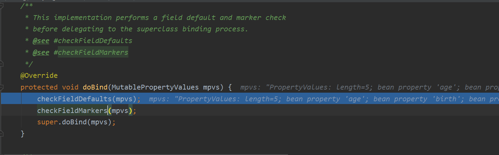

super.doBind函数：


applyPropertyValues函数:

```java
protected void applyPropertyValues(MutablePropertyValues mpvs) {
    try {
        //设置所有的属性值
        this.getPropertyAccessor().setPropertyValues(mpvs, this.isIgnoreUnknownFields(), this.isIgnoreInvalidFields());
    } catch (PropertyBatchUpdateException var7) {
        PropertyAccessException[] var3 = var7.getPropertyAccessExceptions();
        int var4 = var3.length;

        for(int var5 = 0; var5 < var4; ++var5) {
            PropertyAccessException pae = var3[var5];
            this.getBindingErrorProcessor().processPropertyAccessException(pae, this.getInternalBindingResult());
        }
    }

}
```

setPropertyValues函数如下:

```java
public void setPropertyValues(PropertyValues pvs, boolean ignoreUnknown, boolean ignoreInvalid) throws BeansException {
    List<PropertyAccessException> propertyAccessExceptions = null;
    List<PropertyValue> propertyValues = pvs instanceof MutablePropertyValues ? ((MutablePropertyValues)pvs).getPropertyValueList() : Arrays.asList(pvs.getPropertyValues());
    if (ignoreUnknown) {
        this.suppressNotWritablePropertyException = true;
    }

    try {
        Iterator var6 = propertyValues.iterator();

        //拿到所有的属性值
        while(var6.hasNext()) {
            PropertyValue pv = (PropertyValue)var6.next();

            try {
                //设置对应的属性值
                this.setPropertyValue(pv);
            } catch (NotWritablePropertyException var14) {
                if (!ignoreUnknown) {
                    throw var14;
                }
            } catch (NullValueInNestedPathException var15) {
                if (!ignoreInvalid) {
                    throw var15;
                }
            } catch (PropertyAccessException var16) {
                if (propertyAccessExceptions == null) {
                    propertyAccessExceptions = new ArrayList();
                }

                propertyAccessExceptions.add(var16);
            }
        }
    } finally {
        if (ignoreUnknown) {
            this.suppressNotWritablePropertyException = false;
        }

    }

    if (propertyAccessExceptions != null) {
        PropertyAccessException[] paeArray = (PropertyAccessException[])propertyAccessExceptions.toArray(new PropertyAccessException[0]);
        throw new PropertyBatchUpdateException(paeArray);
    }
}
```

对于一个参数age:


查看setPropertyValue函数：

```java
public void setPropertyValue(PropertyValue pv) throws BeansException {
    AbstractNestablePropertyAccessor.PropertyTokenHolder tokens = (AbstractNestablePropertyAccessor.PropertyTokenHolder)pv.resolvedTokens;
    if (tokens == null) {
        String propertyName = pv.getName();

        AbstractNestablePropertyAccessor nestedPa;
        try {
            //获得Person类的包装器
            nestedPa = this.getPropertyAccessorForPropertyPath(propertyName);
        } catch (NotReadablePropertyException var6) {
            throw new NotWritablePropertyException(this.getRootClass(), this.nestedPath + propertyName, "Nested property in path '" + propertyName + "' does not exist", var6);
        }

        //tokens是pojo中对应的变量名
        tokens = this.getPropertyNameTokens(this.getFinalPath(nestedPa, propertyName));
        if (nestedPa == this) {
            pv.getOriginalPropertyValue().resolvedTokens = tokens;
        }

        //使用类包装器对值进行设置
        nestedPa.setPropertyValue(tokens, pv);
    } else {
        this.setPropertyValue(tokens, pv);
    }

}
```

netedPa是person类的包装器：


 nestedPa.setPropertyValue(tokens, pv)代码如下:


processLocalProperty函数的关键函数如下，红框中函数的功能是将String类型转换成对应的数据类型：

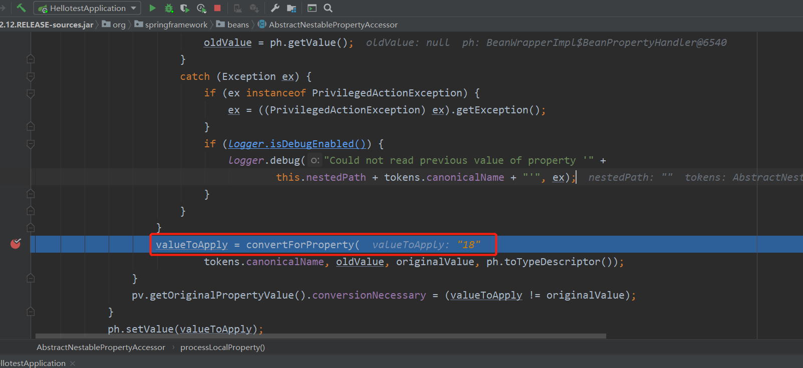

继续执行：


获取所有的转换器：


SpringBoot所有可以支持的参数解析器如下:

```properties
"java.util.Calendar -> java.time.Instant"
"java.time.OffsetDateTime -> java.time.LocalDate"
"java.time.Year -> java.lang.String"
"java.time.OffsetDateTime -> java.time.Instant"
"java.util.Calendar -> java.time.LocalDate"
"java.lang.String -> java.math.BigDecimal"
"java.util.Date -> java.lang.String"
"java.util.Currency -> java.lang.String" 
"java.time.Duration -> java.lang.String" 
"java.lang.Boolean -> java.lang.String" 
"java.lang.Object -> java.nio.ByteBuffer"
"java.lang.Double -> java.lang.String" 
"java.lang.String -> java.time.LocalDate"
"java.lang.String -> java.time.Month" 
"java.lang.Long -> java.util.Date" 
"java.util.Calendar -> java.time.LocalTime" 
"[Ljava.lang.Object; -> java.lang.Object"
"java.lang.String -> java.util.Locale"
"java.lang.Float -> java.lang.String"
"java.lang.Integer -> java.lang.Enum"
"[Ljava.lang.Object; -> java.util.Collection"
"java.time.OffsetDateTime -> java.time.ZonedDateTime"
"java.lang.String -> java.time.Year"
"java.time.OffsetDateTime -> java.lang.String"
"java.lang.Character -> java.lang.String"
"java.util.Calendar -> java.time.ZonedDateTime"
"java.lang.String -> java.time.ZonedDateTime"
"java.lang.String -> java.lang.Character"
"java.util.UUID -> java.lang.String"
"java.lang.Long -> java.util.Calendar"
"java.time.ZonedDateTime -> java.lang.String"
"[Ljava.lang.Object; -> [Ljava.lang.Object;"
"[Ljava.lang.Object; -> java.lang.String"
"java.lang.String -> java.util.UUID"
"java.util.Calendar -> java.lang.String"
"java.time.ZonedDateTime -> java.time.LocalTime" 
"java.time.Instant -> java.lang.String"
"java.lang.String -> java.lang.Integer"
"java.nio.ByteBuffer -> [B"
"java.time.Month -> java.lang.String"
"java.time.OffsetTime -> java.lang.String"
"java.util.Collection -> java.util.Collection"
"java.lang.String -> java.time.Instant"
"java.lang.String -> java.math.BigInteger"
"java.util.Collection -> java.lang.Object"
"java.time.ZonedDateTime -> java.time.OffsetDateT
"java.util.Calendar -> java.util.Date" 
"java.lang.Character -> java.lang.Number"
"java.time.OffsetDateTime -> java.time.LocalTime"
"java.util.Calendar -> java.time.OffsetDateTime" 
"java.lang.Object -> java.lang.String"
"java.lang.String -> java.time.LocalDateTime"
"java.lang.String -> java.time.MonthDay"
"java.util.Date -> java.util.Calendar"
"[B -> java.nio.ByteBuffer"
"java.lang.Byte -> java.lang.String"
"java.lang.String -> java.util.Calendar"
"java.nio.ByteBuffer -> java.lang.Object"
"java.time.LocalDate -> java.lang.String"
"java.util.Collection -> [Ljava.lang.Object;"
"java.lang.Number -> java.lang.String"
"java.time.LocalDateTime -> java.time.LocalDate" 
"java.lang.String -> java.time.OffsetTime"
"java.lang.String -> java.util.Currency"
"java.lang.String -> java.util.Date"
"java.lang.String -> java.time.OffsetDateTime"
"java.lang.String -> java.time.Duration"
"java.util.Calendar -> java.lang.Long"
"java.lang.Object -> java.lang.Object"
"java.lang.String -> java.lang.Boolean"
"java.util.Collection -> java.util.Optional"
"java.time.ZoneId -> java.util.TimeZone"
"java.lang.String -> java.lang.Long"
"java.lang.String -> java.util.TimeZone"
"java.lang.Integer -> java.lang.String"
"java.time.LocalDateTime -> java.time.LocalTime" 
"java.lang.Number -> java.lang.Character"
"java.time.ZonedDateTime -> java.util.Calendar"
"java.lang.Long -> java.lang.String"
"java.lang.String -> java.lang.Enum"
"java.time.Instant -> java.lang.Long"
"java.lang.String -> java.nio.charset.Charset"
"java.time.Period -> java.lang.String"
"java.util.Date -> java.lang.Long"
"java.lang.String -> java.util.Collection"
"java.util.stream.Stream -> [Ljava.lang.Object;" 
"java.lang.String -> [Ljava.lang.Object;"
"java.time.LocalTime -> java.lang.String"
"java.util.stream.Stream -> java.util.Collection"
"java.time.MonthDay -> java.lang.String"
"java.lang.String -> java.time.Period"
"java.lang.String -> java.lang.Float"
"java.lang.String -> java.lang.Number"
"java.time.LocalDateTime -> java.lang.String"
"java.util.Map -> java.util.Map"
"java.util.Collection -> java.lang.String"
"java.lang.Number -> java.lang.Number"
"java.time.YearMonth -> java.lang.String"
"java.util.Locale -> java.lang.String"
"[Ljava.lang.Object; -> java.util.stream.Stream" 
"java.lang.String -> java.lang.Double"
"java.lang.Object -> java.util.Optional"
"java.util.Collection -> java.util.stream.Stream"
"java.time.ZonedDateTime -> java.time.LocalDate" 
"java.lang.String -> java.lang.Short"
"java.lang.String -> java.lang.Byte"
"java.lang.Enum -> java.lang.String"
"java.lang.Long -> java.time.Instant"
"java.time.ZonedDateTime -> java.time.LocalDateTime"
"java.lang.Enum -> java.lang.Integer"
"[Ljava.lang.Object; -> java.util.Optional"
"java.util.Calendar -> java.time.LocalDateTime"
"java.lang.Object -> java.util.Collection"
"java.util.Properties -> java.lang.String"
"java.lang.Short -> java.lang.String"
"java.lang.String -> java.time.LocalTime"
"java.lang.Object -> [Ljava.lang.Object;"
"java.nio.charset.Charset -> java.lang.String"
"java.lang.String -> java.time.YearMonth" 
"java.math.BigDecimal -> java.lang.String"
"java.math.BigInteger -> java.lang.String"
"java.time.OffsetDateTime -> java.time.LocalDateT
"java.lang.String -> java.util.Properties"
"java.time.ZonedDateTime -> java.time.Instant"
```

所以可以给converters中添加自己定义的规则，来将某些类型映射到指定的类，而这些converters属性在WebConversionService类中，由ConfigurableWebBindingInitializer进行配置，具体参考=======。

判断是否支持String到当前类型的转换：


获取对应的转换器：


寻找sourceType到targetType的转换器:


遍历循环所有的转换器，如果找到则放入缓存中:


使用转换器进行转换:


拿到对应的convert:


接下来利用`ConversionUtils.invokeConverter(converter, source, sourceType, targetType);`进行转换:


converter.convert函数如下

```java
@Nullable
public Object convert(@Nullable Object source, TypeDescriptor sourceType, TypeDescriptor targetType) {
    //source对应属性的值
    return source == null ? GenericConversionService.this.convertNullSource(sourceType, targetType) : this.converterFactory.getConverter(targetType.getObjectType()).convert(source);
}
```

以String->Number的转换为例：

this.converterFactory.getConverter(targetType.getObjectType()).convert(source)的函数如下：


可以看到转换器得到的值为18：


接下来调用`return this.handleResult(sourceType, targetType, result);`将结果范回，并调用`ph.setValue(valueToApply);`对pojo中的属性进行赋值,完成POJO数据的一个参数的封装，接下来的参数封装与此类似：


那么这些类型转换器是在哪配置的？查看ConfigurableWebBindingInitializer类：

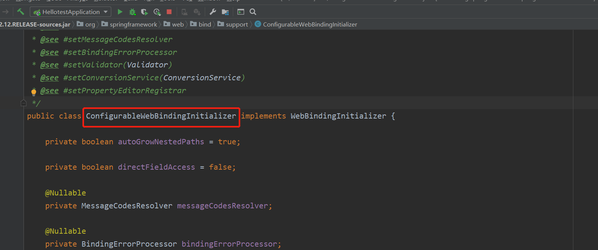

使用ctrl+alt+F7可以查看该类在哪些地方被使用：


在如下位置new了该对象:


该函数在如下位置调用:


initBinder函数在WebMvcConfigurationSupport类中，该函数给WebDataBinder设置了各种参数，其中就有conversionService类型转换器：


ConversionService类的结构如下:


GenericConversionService用于添加convert：


convert接口如下：


#### 3.3.7.4 自定义Convert

如果想自定义convert规则，例如把string（"cat,3"）转成pet:

```html
<form action="/saveuser" method="post">

    姓名： <input name="userName" value="zhangsan"/> <br/>
    年龄： <input name="age" value="18"/> <br/>
    宠物： <input name="pet" value="cat,3"/>
    <input type="submit" value="保存"/>
</form>
```

SpringBoot会在底层寻找是否有从String转成Pet对象的解析器，所以可以自定义Convert规则,一般对SpringBoot自定义规则都在WebMvcConfigurer中实现，在WebMvcConfigurer中自定义Convert对应的接口是：


所以把自定义的Convert规则放在addFormaters中:

```java
package com.example.hellotest.config;

import com.example.hellotest.pojo.Pet;
import org.springframework.context.annotation.Bean;
import org.springframework.context.annotation.Configuration;
import org.springframework.core.convert.converter.Converter;
import org.springframework.format.FormatterRegistry;
import org.springframework.util.StringUtils;
import org.springframework.web.filter.HiddenHttpMethodFilter;
import org.springframework.web.servlet.config.annotation.PathMatchConfigurer;
import org.springframework.web.servlet.config.annotation.WebMvcConfigurer;
import org.springframework.web.util.UrlPathHelper;

//@Configuration(proxyBeanMethods=false)
//public class WebConfig implements WebMvcConfigurer {
//    @Bean
//    public HiddenHttpMethodFilter hiddenHttpMethodFilter(){
//        HiddenHttpMethodFilter hiddenHttpMethodFilter = new HiddenHttpMethodFilter();
//        hiddenHttpMethodFilter.setMethodParam("_codingInn");
//        return hiddenHttpMethodFilter;
//    }
//
////    @Bean  webMvcConfigurer
//
//    @Override
//    public void configurePathMatch(PathMatchConfigurer configurer) {
//        UrlPathHelper urlPathHelper = new UrlPathHelper();
//        //设置为不移除;后面的内容，矩阵变量功能可以实现
//        urlPathHelper.setRemoveSemicolonContent(false);
//        configurer.setUrlPathHelper(urlPathHelper);
//    }
//}


@Configuration(proxyBeanMethods=false)
public class WebConfig implements WebMvcConfigurer {
    @Bean
    public WebMvcConfigurer webMvcConfigurer(){
        return new WebMvcConfigurer() {

            @Override
            public void addFormatters(FormatterRegistry registry) {
                registry.addConverter(new Converter<String, Pet>() {
                    @Override
                    public Pet convert(String s) {
                        String[] split = s.split(",");
                        if(split.length == 2){
                            Pet pet = new Pet();
                            pet.setName(split[0]);
                            pet.setAge(Integer.parseInt(split[1]));
                            System.out.println("return");
                            return pet;
                        }
                        return null;
                    }
                });
            }
        };
    }
}
```

可以看到已经成功解析:


从源码中可以看到，在给pojo中的参数进行赋值时(本例中是String -> Pet)，SpringBoot会寻找相应的convert:


可以看到SpringBoot中已经有从String到Pet的参数解析器：


**总结：请求解析器负责处理Controller函数的参数；参数解析器负责处理当Controller函数的参数为pojo类型时，给pojo中的参数进行类型转换，常见的是String转成pojo的成员变量类型。**

### 3.3.8 数据响应与内容协商

#### 3.3.8.1 响应页面

#### 3.3.8.2 响应数据（前后端分离）

##### 3.3.8.2.1 返回Json格式

引入Web依赖

```xml
<dependency>
    <groupId>org.springframework.boot</groupId>
    <artifactId>spring-boot-starter-web</artifactId>
</dependency>
<!--Web场景自动引入了Json场景-->
<dependency>
      <groupId>org.springframework.boot</groupId>
      <artifactId>spring-boot-starter-json</artifactId>
      <version>2.3.7.RELEASE</version>
      <scope>compile</scope>
    </dependency>
```


引入了依赖之后，如果要返回Json格式的数据，只需要使用注解@ResponseBody

```java
package com.example.hellotest.Controller;

import com.example.hellotest.pojo.Person;
import org.springframework.stereotype.Controller;
import org.springframework.web.bind.annotation.GetMapping;
import org.springframework.web.bind.annotation.ResponseBody;

import java.util.Date;

@Controller
public class ResponseTestController {

    @ResponseBody
    @GetMapping("/test/person")
    public Person getPerson(){
        Person person = new Person();
        person.setAge(18);
        person.setBirth(new Date());
        person.setUserName("aaa");
        return person;
    }
}
```

那么SpringBoot如何在源码中返回Json格式？先在SpringBoot初始化请求并将相关处理器放入mavContainer的地方设置断点：

```java
/**
该函数在spring-webmvc-5.2.12.RELEASE-sources.jar下的org.springframework.web.servlet.mvc.method.annotation.RequestMappingHandlerAdapter中
 * Invoke the {@link RequestMapping} handler method preparing a {@link ModelAndView}
 * if view resolution is required.
 * @since 4.2
 * @see #createInvocableHandlerMethod(HandlerMethod)
 */
@Nullable
protected ModelAndView invokeHandlerMethod(HttpServletRequest request,
      HttpServletResponse response, HandlerMethod handlerMethod) throws Exception {

    //处理请求与返回值初始化begin
   ServletWebRequest webRequest = new ServletWebRequest(request, response);
   try {
      WebDataBinderFactory binderFactory = getDataBinderFactory(handlerMethod);
      ModelFactory modelFactory = getModelFactory(handlerMethod, binderFactory);

      ServletInvocableHandlerMethod invocableMethod = createInvocableHandlerMethod(handlerMethod);
       //设置参数解下器
      if (this.argumentResolvers != null) {
         invocableMethod.setHandlerMethodArgumentResolvers(this.argumentResolvers);
      }
       //设置返回值解析器
      if (this.returnValueHandlers != null) {
         invocableMethod.setHandlerMethodReturnValueHandlers(this.returnValueHandlers);
      }
      invocableMethod.setDataBinderFactory(binderFactory);
      invocableMethod.setParameterNameDiscoverer(this.parameterNameDiscoverer);

      ModelAndViewContainer mavContainer = new ModelAndViewContainer();
      mavContainer.addAllAttributes(RequestContextUtils.getInputFlashMap(request));
      modelFactory.initModel(webRequest, mavContainer, invocableMethod);
      mavContainer.setIgnoreDefaultModelOnRedirect(this.ignoreDefaultModelOnRedirect);

      AsyncWebRequest asyncWebRequest = WebAsyncUtils.createAsyncWebRequest(request, response);
      asyncWebRequest.setTimeout(this.asyncRequestTimeout);

      WebAsyncManager asyncManager = WebAsyncUtils.getAsyncManager(request);
      asyncManager.setTaskExecutor(this.taskExecutor);
      asyncManager.setAsyncWebRequest(asyncWebRequest);
      asyncManager.registerCallableInterceptors(this.callableInterceptors);
      asyncManager.registerDeferredResultInterceptors(this.deferredResultInterceptors);

      if (asyncManager.hasConcurrentResult()) {
         Object result = asyncManager.getConcurrentResult();
         mavContainer = (ModelAndViewContainer) asyncManager.getConcurrentResultContext()[0];
         asyncManager.clearConcurrentResult();
         LogFormatUtils.traceDebug(logger, traceOn -> {
            String formatted = LogFormatUtils.formatValue(result, !traceOn);
            return "Resume with async result [" + formatted + "]";
         });
         invocableMethod = invocableMethod.wrapConcurrentResult(result);
      }
//处理请求与返回值初始化end
       //开始调用
      invocableMethod.invokeAndHandle(webRequest, mavContainer);
      if (asyncManager.isConcurrentHandlingStarted()) {
         return null;
      }

      return getModelAndView(mavContainer, modelFactory, webRequest);
   }
   finally {
      webRequest.requestCompleted();
   }
}
```

返回值解析器如下：


在返回值处设置断点：

```java
/**
该函数在spring-webmvc-5.2.12.RELEASE-sources.jar下的org.springframework.web.servlet.mvc.method.annotation
 * Invoke the method and handle the return value through one of the
 * configured {@link HandlerMethodReturnValueHandler HandlerMethodReturnValueHandlers}.
 * @param webRequest the current request
 * @param mavContainer the ModelAndViewContainer for this request
 * @param providedArgs "given" arguments matched by type (not resolved)
 */
public void invokeAndHandle(ServletWebRequest webRequest, ModelAndViewContainer mavContainer,
      Object... providedArgs) throws Exception {

    //对请求进行处理，并获得返回值
   Object returnValue = invokeForRequest(webRequest, mavContainer, providedArgs);
   setResponseStatus(webRequest);

    //判断是否有返回值
   if (returnValue == null) {
      if (isRequestNotModified(webRequest) || getResponseStatus() != null || mavContainer.isRequestHandled()) {
         disableContentCachingIfNecessary(webRequest);
         mavContainer.setRequestHandled(true);
         return;
      }
   }
    //判断有没有字符串
   else if (StringUtils.hasText(getResponseStatusReason())) {
      mavContainer.setRequestHandled(true);
      return;
   }

   mavContainer.setRequestHandled(false);
   Assert.state(this.returnValueHandlers != null, "No return value handlers");
   try {
       //处理返回值
       //getReturnValueType(returnValue)是获取返回值的类型
      this.returnValueHandlers.handleReturnValue(
            returnValue, getReturnValueType(returnValue), mavContainer, webRequest);
   }
   catch (Exception ex) {
      if (logger.isTraceEnabled()) {
         logger.trace(formatErrorForReturnValue(returnValue), ex);
      }
      throw ex;
   }
}
```

getReturnValueType(returnValue)结果如下:


返回值处理的主要的核心是：

```java
this.returnValueHandlers.handleReturnValue(
      returnValue, getReturnValueType(returnValue), mavContainer, webRequest);
```

进入该函数:


selectHandler函数如下：

```java
@Nullable
private HandlerMethodReturnValueHandler selectHandler(@Nullable Object value, MethodParameter returnType) {
    //判断是否是异步返回值
   boolean isAsyncValue = isAsyncReturnValue(value, returnType);
   for (HandlerMethodReturnValueHandler handler : this.returnValueHandlers) {
      if (isAsyncValue && !(handler instanceof AsyncHandlerMethodReturnValueHandler)) {
         continue;
      }
       //判断是否支持该类型的返回值
      if (handler.supportsReturnType(returnType)) {
         return handler;
      }
   }
   return null;
}
```

可以看到@ResponseBody注解对应的handler如下:


RequestResponseBodyMethodProcessor的supportReturnType函数如下:

```java
@Override
public boolean supportsReturnType(MethodParameter returnType) {
   return (AnnotatedElementUtils.hasAnnotation(returnType.getContainingClass(), ResponseBody.class) ||
           //方法上有@ResponseBody注解
         returnType.hasMethodAnnotation(ResponseBody.class));
}
```

handleReturnValue函数如下：

```java
@Override
public void handleReturnValue(@Nullable Object returnValue, MethodParameter returnType,
      ModelAndViewContainer mavContainer, NativeWebRequest webRequest)
      throws IOException, HttpMediaTypeNotAcceptableException, HttpMessageNotWritableException {

   mavContainer.setRequestHandled(true);
   ServletServerHttpRequest inputMessage = createInputMessage(webRequest);
   ServletServerHttpResponse outputMessage = createOutputMessage(webRequest);

   // Try even with null return value. ResponseBodyAdvice could get involved.
    //使用消息转换器进行写出操作，利用MessageConverters将数据写为json
   writeWithMessageConverters(returnValue, returnType, inputMessage, outputMessage);
}
```

writeWithMessageConverters函数如下

```java
/**
 * Writes the given return type to the given output message.
 * @param value the value to write to the output message
 * @param returnType the type of the value
 * @param inputMessage the input messages. Used to inspect the {@code Accept} header.
 * @param outputMessage the output message to write to
 * @throws IOException thrown in case of I/O errors
 * @throws HttpMediaTypeNotAcceptableException thrown when the conditions indicated
 * by the {@code Accept} header on the request cannot be met by the message converters
 * @throws HttpMessageNotWritableException thrown if a given message cannot
 * be written by a converter, or if the content-type chosen by the server
 * has no compatible converter.
 */
@SuppressWarnings({"rawtypes", "unchecked"})
protected <T> void writeWithMessageConverters(@Nullable T value, MethodParameter returnType,
      ServletServerHttpRequest inputMessage, ServletServerHttpResponse outputMessage)
      throws IOException, HttpMediaTypeNotAcceptableException, HttpMessageNotWritableException {

   Object body;
   Class<?> valueType;
   Type targetType;

    //判断是否是字符串类型
   if (value instanceof CharSequence) {
      body = value.toString();
      valueType = String.class;
      targetType = String.class;
   }
   else {
       //获取对象
      body = value;
       //获取值的类型
      valueType = getReturnValueType(body, returnType);
       //获取要转的目标类型
      targetType = GenericTypeResolver.resolveType(getGenericType(returnType), returnType.getContainingClass());
   }

    //判断是不是资源类型
   if (isResourceType(value, returnType)) {
      outputMessage.getHeaders().set(HttpHeaders.ACCEPT_RANGES, "bytes");
      if (value != null && inputMessage.getHeaders().getFirst(HttpHeaders.RANGE) != null &&
            outputMessage.getServletResponse().getStatus() == 200) {
         Resource resource = (Resource) value;
         try {
            List<HttpRange> httpRanges = inputMessage.getHeaders().getRange();
            outputMessage.getServletResponse().setStatus(HttpStatus.PARTIAL_CONTENT.value());
            body = HttpRange.toResourceRegions(httpRanges, resource);
            valueType = body.getClass();
            targetType = RESOURCE_REGION_LIST_TYPE;
         }
         catch (IllegalArgumentException ex) {
            outputMessage.getHeaders().set(HttpHeaders.CONTENT_RANGE, "bytes */" + resource.contentLength());
            outputMessage.getServletResponse().setStatus(HttpStatus.REQUESTED_RANGE_NOT_SATISFIABLE.value());
         }
      }
   }

    //媒体类型，与内容协商有关，浏览器会以请求头的方式告诉服务器他能接受什么样的内容类型
   MediaType selectedMediaType = null;
  
   MediaType contentType = outputMessage.getHeaders().getContentType();
   
    boolean isContentTypePreset = contentType != null && contentType.isConcrete();
   if (isContentTypePreset) {
      if (logger.isDebugEnabled()) {
         logger.debug("Found 'Content-Type:" + contentType + "' in response");
      }
      selectedMediaType = contentType;
   }
   else {
      HttpServletRequest request = inputMessage.getServletRequest();
        //获取响应头中，浏览器支持的媒体类型
      List<MediaType> acceptableTypes = getAcceptableMediaTypes(request);
       //表示SpringBoot能将返回值的类型targetType转换成的媒体类型
       List<MediaType> producibleTypes = getProducibleMediaTypes(request, valueType, targetType);

      if (body != null && producibleTypes.isEmpty()) {
         throw new HttpMessageNotWritableException(
               "No converter found for return value of type: " + valueType);
      }
      List<MediaType> mediaTypesToUse = new ArrayList<>();
       //匹配浏览器能支持的媒体类型
      for (MediaType requestedType : acceptableTypes) {
         for (MediaType producibleType : producibleTypes) {
            if (requestedType.isCompatibleWith(producibleType)) {
               mediaTypesToUse.add(getMostSpecificMediaType(requestedType, producibleType));
            }
         }
      }
      if (mediaTypesToUse.isEmpty()) {
         if (body != null) {
            throw new HttpMediaTypeNotAcceptableException(producibleTypes);
         }
         if (logger.isDebugEnabled()) {
            logger.debug("No match for " + acceptableTypes + ", supported: " + producibleTypes);
         }
         return;
      }

      MediaType.sortBySpecificityAndQuality(mediaTypesToUse);

      for (MediaType mediaType : mediaTypesToUse) {
         if (mediaType.isConcrete()) {
            selectedMediaType = mediaType;
            break;
         }
         else if (mediaType.isPresentIn(ALL_APPLICATION_MEDIA_TYPES)) {
            selectedMediaType = MediaType.APPLICATION_OCTET_STREAM;
            break;
         }
      }

      if (logger.isDebugEnabled()) {
         logger.debug("Using '" + selectedMediaType + "', given " +
               acceptableTypes + " and supported " + producibleTypes);
      }
   }

    //如果有支持的类型
   if (selectedMediaType != null) {
      selectedMediaType = selectedMediaType.removeQualityValue();
       //获取消息转换器，把对象转成支持的类型，一般是json，消息转换器中包括两个接口函数，一个表示能否把对应Class类型的对象，转为MedaType类型的数据。例如是否支持将Person对象转为JSON，或者JSON转为Person对象
      for (HttpMessageConverter<?> converter : this.messageConverters) {
         GenericHttpMessageConverter genericConverter = (converter instanceof GenericHttpMessageConverter ?
               (GenericHttpMessageConverter<?>) converter : null);
         if (genericConverter != null ?
               ((GenericHttpMessageConverter) converter).canWrite(targetType, valueType, selectedMediaType) :
               converter.canWrite(valueType, selectedMediaType)) {
            body = getAdvice().beforeBodyWrite(body, returnType, selectedMediaType,
                  (Class<? extends HttpMessageConverter<?>>) converter.getClass(),
                  inputMessage, outputMessage);
            if (body != null) {
               Object theBody = body;
               LogFormatUtils.traceDebug(logger, traceOn ->
                     "Writing [" + LogFormatUtils.formatValue(theBody, !traceOn) + "]");
               addContentDispositionHeader(inputMessage, outputMessage);
               if (genericConverter != null) {
                  genericConverter.write(body, targetType, selectedMediaType, outputMessage);
               }
               else {
                  ((HttpMessageConverter) converter).write(body, selectedMediaType, outputMessage);
               }
            }
            else {
               if (logger.isDebugEnabled()) {
                  logger.debug("Nothing to write: null body");
               }
            }
            return;
         }
      }
   }

   if (body != null) {
      Set<MediaType> producibleMediaTypes =
            (Set<MediaType>) inputMessage.getServletRequest()
                  .getAttribute(HandlerMapping.PRODUCIBLE_MEDIA_TYPES_ATTRIBUTE);

      if (isContentTypePreset || !CollectionUtils.isEmpty(producibleMediaTypes)) {
         throw new HttpMessageNotWritableException(
               "No converter for [" + valueType + "] with preset Content-Type '" + contentType + "'");
      }
      throw new HttpMediaTypeNotAcceptableException(this.allSupportedMediaTypes);
   }
}
```

系统里默认的HttpMessageConverter有：

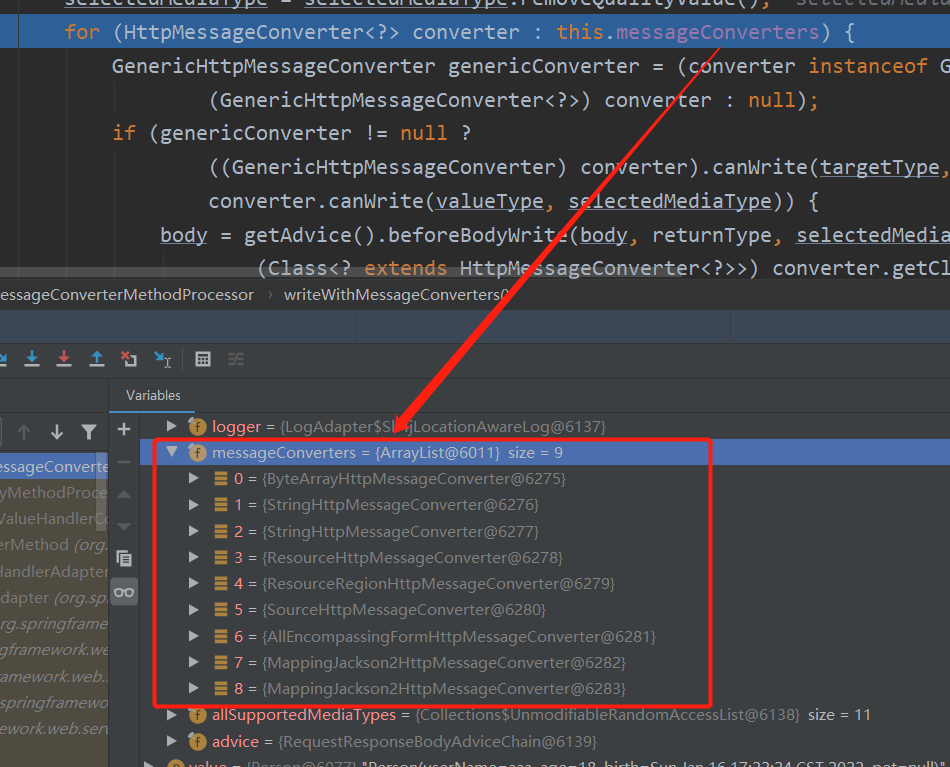

​	如果前面的都不能处理，会使用第7个，MappingJackson2HttpMessageConverter  可以将任意的对象转成JSON类型，最终 MappingJackson2HttpMessageConverter  把对象转为JSON（利用底层的jackson的objectMapper转换：


MappingJackson2HttpMessageConverter  对应的canWrite函数如下：


判断产生的类型浏览器是否能够接收：


在这一步会使用处理器进行处理：


write函数如下：

```java
/**
 * This implementation sets the default headers by calling {@link #addDefaultHeaders},
 * and then calls {@link #writeInternal}.
 */
@Override
public final void write(final T t, @Nullable final Type type, @Nullable MediaType contentType,
      HttpOutputMessage outputMessage) throws IOException, HttpMessageNotWritableException {

   final HttpHeaders headers = outputMessage.getHeaders();
    //添加默认的响应头，具体查看下图
   addDefaultHeaders(headers, t, contentType);

   if (outputMessage instanceof StreamingHttpOutputMessage) {
      StreamingHttpOutputMessage streamingOutputMessage = (StreamingHttpOutputMessage) outputMessage;
      streamingOutputMessage.setBody(outputStream -> writeInternal(t, type, new HttpOutputMessage() {
         @Override
         public OutputStream getBody() {
            return outputStream;
         }
         @Override
         public HttpHeaders getHeaders() {
            return headers;
         }
      }));
   }
   else {
       //把对象转成对应的媒体格式
      writeInternal(t, type, outputMessage);
      outputMessage.getBody().flush();
   }
}
```


在本例中writeInternal负责将对象转成JSON，最终会写给outputMessage：


返回Json的源码总结：

- 1、返回值处理器判断是否支持这种类型返回值 supportsReturnType
- 2、返回值处理器调用 handleReturnValue 进行处理

- 3、RequestResponseBodyMethodProcessor 可以处理返回值标了@ResponseBody 注解的。

- - 利用 MessageConverters 进行处理 将数据写为json

- - - 1、内容协商（浏览器默认会以请求头的方式告诉服务器他能接受什么样的内容类型）
    - 2、服务器最终根据自己自身的能力，决定服务器能生产出什么样内容类型的数据，

- - - 3、SpringMVC会挨个遍历所有容器底层的 HttpMessageConverter ，看谁能处理？

- - - - 1、得到MappingJackson2HttpMessageConverter可以将对象写为json
      - 2、利用MappingJackson2HttpMessageConverter将对象转为json再写出去。

+ 4、只要使用了@ResponseBody注解，就会利用返回值处理器里面的消息转换器进行处理。

##### 3.3.8.2.2 内容协商

根据客户端接收能力不同，返回不同媒体类型的数据。

###### 1、引入xml依赖

```xml
 <dependency>
            <groupId>com.fasterxml.jackson.dataformat</groupId>
            <artifactId>jackson-dataformat-xml</artifactId>
</dependency>
```

###### 2、postman分别测试返回json和xml

只需要改变请求头中Accept字段,告诉服务器本客户端可以接收的数据类型。

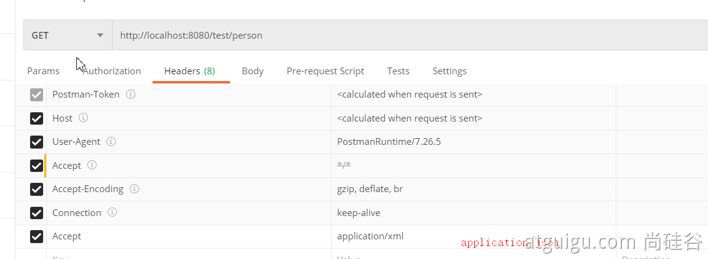

###### 3、开启浏览器参数方式内容协商功能

由于SpringBoot默认不开启内容协商：


所以需要开启基于请求参数的内容协商功能:

```yaml
spring:
    contentnegotiation:
      favor-parameter: true  #开启请求参数内容协商模式
```

发请求：http://localhost:8080/test/person?format=xml


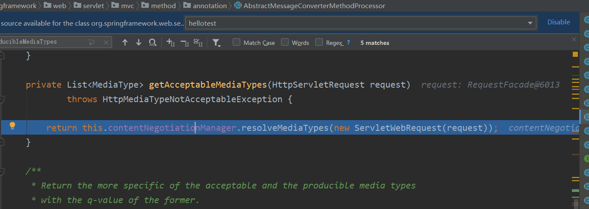

进入resolveMediaTypes方法，该方法会遍历内容协商数组，找到请求要求的返回类型,之所以会有mediaTypes.equals(MEDIA_TYPE_ALL_LIST）,是因为，如果请求参数中设置了format属性，就会直接返回mediaType，否则strategy.resolveMediaTypes(request)方法会返回MEDIA_TYPE_ALL_LIST，if条件判断为true，continue后会找到所有浏览器支持的类型，如下面几张图所示，第一张图的this.strategies有两种策略，第一种是根据参数设置的策略，在第一种策略中，会包含SpringBoot当前可以转成的数据类型，例如本例的xml以及yaml(注意：只有设置了favor-parameter: true才会有第一种策略),第二种是根据请求头的策略:


getMediaTypeKey会获取请求头中的format的值，getMediaTypeKey函数如下：


解析请求是否携带format=xml：


最终使用相应的处理器将内容返回给客户端：


###### 4、内容协商原理

- 1、获取客户端（PostMan、浏览器）支持接收的媒体类型(MediaType)。

- - **contentNegotiationManager 内容协商管理器 默认使用基于请求头的策略**
  - 

- - **HeaderContentNegotiationStrategy  确定客户端可以接收的内容类型** 
  - 

- 3、遍历循环所有当前系统的 **MessageConverter**，看谁支持操作这个对象（Person）
- 4、找到支持操作Person的converter，把converter支持的媒体类型统计出来。

- 5、客户端需要【application/xml】。
-   

- 6、进行内容协商的最佳匹配媒体类型
- 7、用 支持 将对象转为 最佳匹配媒体类型 的converter。调用它进行转化 。

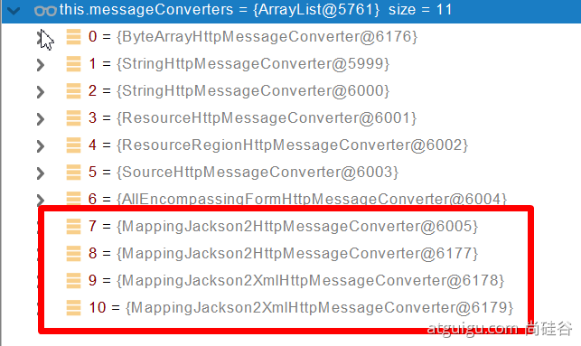

导入了jackson处理xml的包，xml的converter就会自动进来

```java
WebMvcConfigurationSupport
jackson2XmlPresent = ClassUtils.isPresent("com.fasterxml.jackson.dataformat.xml.XmlMapper", classLoader);

if (jackson2XmlPresent) {
			Jackson2ObjectMapperBuilder builder = Jackson2ObjectMapperBuilder.xml();
			if (this.applicationContext != null) {
				builder.applicationContext(this.applicationContext);
			}
			messageConverters.add(new MappingJackson2XmlHttpMessageConverter(builder.build()));
		}
```

总结：SpringBoot先获取浏览器能支持的媒体类型，然后获取框架可以将返回值转化成的媒体类型，接着在返回值支持的媒体类型中选择权重最大的浏览器支持的媒体类型selectedselectedMediaType，最后在messageConverters中寻找第一个能转化的转换器，转成相应的数据类型并返回。第一次遍历this.messageConverters是通过canWrite(targetType, valueClass, null)获取返回值类型能返回的格式，第二次遍历this.messageConverters是通过converter.canWrite(valueType, selectedMediaType)获取能返回selectedselectedMediaType类型的转换器。

##### 3.3.8.2.3 自定义MessageConverter

+ 添加自定义convert

```java
package com.example.hellotest.convert;

import com.example.hellotest.pojo.Person;
import org.springframework.http.HttpInputMessage;
import org.springframework.http.HttpOutputMessage;
import org.springframework.http.MediaType;
import org.springframework.http.converter.HttpMessageConverter;
import org.springframework.http.converter.HttpMessageNotReadableException;
import org.springframework.http.converter.HttpMessageNotWritableException;

import java.io.IOException;
import java.io.OutputStream;
import java.util.List;

/**
 * 自定义Convert
 */
public class MyConvert implements HttpMessageConverter<Person> {


    @Override
    public boolean canRead(Class<?> clazz, MediaType mediaType) {
        return false;
    }

    @Override
    public boolean canWrite(Class<?> clazz, MediaType mediaType) {
        return clazz.isAssignableFrom(Person.class);
    }

    /**
     * 服务器要统计所有MessageConverter都能写出哪些内容类型
     * @return
     */
    @Override
    public List<MediaType> getSupportedMediaTypes() {
        //把字符串解析成媒体类型集合
        return MediaType.parseMediaTypes("application/x-my");
    }


    @Override
    public Person read(Class<? extends Person> clazz, HttpInputMessage inputMessage) throws IOException, HttpMessageNotReadableException {
        return null;
    }

    @Override
    public void write(Person person, MediaType contentType, HttpOutputMessage outputMessage) throws IOException, HttpMessageNotWritableException {
        //自定义协议数据的写出
        String data = person.getUserName()+";" + person.getAge()+";"+person.getBirth();

        //写出
        OutputStream body = outputMessage.getBody();
        body.write(data.getBytes());
    }
}
```

+ 注入自定义的convert

```java
package com.example.hellotest.config;

import com.example.hellotest.convert.MyConvert;
import com.example.hellotest.pojo.Pet;
import org.springframework.context.annotation.Bean;
import org.springframework.context.annotation.Configuration;
import org.springframework.core.convert.converter.Converter;
import org.springframework.format.FormatterRegistry;
import org.springframework.http.converter.HttpMessageConverter;
import org.springframework.util.StringUtils;
import org.springframework.web.filter.HiddenHttpMethodFilter;
import org.springframework.web.servlet.config.annotation.PathMatchConfigurer;
import org.springframework.web.servlet.config.annotation.WebMvcConfigurer;
import org.springframework.web.util.UrlPathHelper;

import java.util.List;


@Configuration(proxyBeanMethods=false)
public class WebConfig implements WebMvcConfigurer {

    @Bean
    public WebMvcConfigurer webMvcConfigurer(){
        return new WebMvcConfigurer() {

            @Override
            public void extendMessageConverters(List<HttpMessageConverter<?>> converters) {
                converters.add(new MyConvert());
            }
            }
        };
    }
}
```

使用postman发送请求：


最终会利用自定义的Convert写入数据:


##### 3.3.8.2.4 使浏览器支持发送解析特定媒体类型的请求

+ WebConfig.java

```java
package com.example.hellotest.config;

import com.example.hellotest.convert.MyConvert;
import com.example.hellotest.pojo.Pet;
import org.springframework.context.annotation.Bean;
import org.springframework.context.annotation.Configuration;
import org.springframework.core.convert.converter.Converter;
import org.springframework.format.FormatterRegistry;
import org.springframework.http.MediaType;
import org.springframework.http.converter.HttpMessageConverter;
import org.springframework.util.StringUtils;
import org.springframework.web.accept.ParameterContentNegotiationStrategy;
import org.springframework.web.filter.HiddenHttpMethodFilter;
import org.springframework.web.servlet.config.annotation.ContentNegotiationConfigurer;
import org.springframework.web.servlet.config.annotation.PathMatchConfigurer;
import org.springframework.web.servlet.config.annotation.WebMvcConfigurer;
import org.springframework.web.util.UrlPathHelper;

import java.util.Arrays;
import java.util.HashMap;
import java.util.List;
import java.util.Map;


@Configuration(proxyBeanMethods=false)
public class WebConfig implements WebMvcConfigurer {

    @Bean
    public WebMvcConfigurer webMvcConfigurer(){
        return new WebMvcConfigurer() {

            /**
             * 自定义内容协商策略
             * @param configurer
             */
            @Override
            public void configureContentNegotiation(ContentNegotiationConfigurer configurer) {
                Map<String, MediaType> mediaTypes = new HashMap<>();
                mediaTypes.put("json", MediaType.APPLICATION_JSON);
                mediaTypes.put("xml", MediaType.APPLICATION_XML);
                mediaTypes.put("x-my", MediaType.parseMediaType("application/x-my"));

                //指定支持解析哪些参数对应的媒体类型
                ParameterContentNegotiationStrategy parameterContentNegotiationStrategy = new ParameterContentNegotiationStrategy(mediaTypes);
                configurer.strategies(Arrays.asList(parameterContentNegotiationStrategy));
            }

            @Override
            public void extendMessageConverters(List<HttpMessageConverter<?>> converters) {
                converters.add(new MyConvert());
            }
            
        };
    }
}
```

+ MyConvert.java

```java
package com.example.hellotest.convert;

import com.example.hellotest.pojo.Person;
import org.springframework.http.HttpInputMessage;
import org.springframework.http.HttpOutputMessage;
import org.springframework.http.MediaType;
import org.springframework.http.converter.HttpMessageConverter;
import org.springframework.http.converter.HttpMessageNotReadableException;
import org.springframework.http.converter.HttpMessageNotWritableException;

import java.io.IOException;
import java.io.OutputStream;
import java.util.List;

/**
 * 自定义Convert
 */
public class MyConvert implements HttpMessageConverter<Person> {


    @Override
    public boolean canRead(Class<?> clazz, MediaType mediaType) {
        return false;
    }

    @Override
    public boolean canWrite(Class<?> clazz, MediaType mediaType) {
        return clazz.isAssignableFrom(Person.class);
    }

    /**
     * 服务器要统计所有MessageConverter都能写出哪些内容类型
     * @return
     */
    @Override
    public List<MediaType> getSupportedMediaTypes() {
        //把字符串解析成媒体类型集合
        return MediaType.parseMediaTypes("application/x-my");
    }


    @Override
    public Person read(Class<? extends Person> clazz, HttpInputMessage inputMessage) throws IOException, HttpMessageNotReadableException {
        return null;
    }

    @Override
    public void write(Person person, MediaType contentType, HttpOutputMessage outputMessage) throws IOException, HttpMessageNotWritableException {
        //自定义协议数据的写出
        String data = person.getUserName()+";" + person.getAge()+";"+person.getBirth();

        //写出
        OutputStream body = outputMessage.getBody();
        body.write(data.getBytes());
    }
}
```

结果如下：


原理如下，进入resolveMediaTypes函数：


从上图可以看出，如果自定义了参数管理器，就会没有基于请求头的参数管理器，所以基于请求头的内容协商会失败，无论请求头的Accept是什么，都只会返回json格式。


如果想让解析器支持请求头类型，可以做如下改变:

```java
package com.example.hellotest.config;

import com.example.hellotest.convert.MyConvert;
import com.example.hellotest.pojo.Pet;
import org.springframework.context.annotation.Bean;
import org.springframework.context.annotation.Configuration;
import org.springframework.core.convert.converter.Converter;
import org.springframework.format.FormatterRegistry;
import org.springframework.http.MediaType;
import org.springframework.http.converter.HttpMessageConverter;
import org.springframework.util.StringUtils;
import org.springframework.web.accept.HeaderContentNegotiationStrategy;
import org.springframework.web.accept.ParameterContentNegotiationStrategy;
import org.springframework.web.filter.HiddenHttpMethodFilter;
import org.springframework.web.servlet.config.annotation.ContentNegotiationConfigurer;
import org.springframework.web.servlet.config.annotation.PathMatchConfigurer;
import org.springframework.web.servlet.config.annotation.WebMvcConfigurer;
import org.springframework.web.util.UrlPathHelper;

import java.util.Arrays;
import java.util.HashMap;
import java.util.List;
import java.util.Map;


@Configuration(proxyBeanMethods=false)
public class WebConfig implements WebMvcConfigurer {
    @Bean
    public WebMvcConfigurer webMvcConfigurer(){
        return new WebMvcConfigurer() {

            /**
             * 自定义内容协商策略
             * @param configurer
             */
            @Override
            public void configureContentNegotiation(ContentNegotiationConfigurer configurer) {
                Map<String, MediaType> mediaTypes = new HashMap<>();
                mediaTypes.put("json", MediaType.APPLICATION_JSON);
                mediaTypes.put("xml", MediaType.APPLICATION_XML);
                mediaTypes.put("x-my", MediaType.parseMediaType("application/x-my"));

                //设置基于请求头的策略
                HeaderContentNegotiationStrategy headerContentNegotiationStrategy = new HeaderContentNegotiationStrategy();


                //指定支持解析哪些参数对应的媒体类型
                ParameterContentNegotiationStrategy parameterContentNegotiationStrategy = new ParameterContentNegotiationStrategy(mediaTypes);
                configurer.strategies(Arrays.asList(parameterContentNegotiationStrategy,headerContentNegotiationStrategy));
            }

            @Override
            public void extendMessageConverters(List<HttpMessageConverter<?>> converters) {
                converters.add(new MyConvert());
            }
        };
    }
}
```

**注意：有可能我们添加的自定义的功能会覆盖默认很多功能，导致一些默认的功能失效**

### 3.3.9 Thymeleaf的基本语法及使用

具体参考：https://www.thymeleaf.org/

#### 基本语法

##### 1.表达式

| 表达式名字 | 语法   | 用途                               |
| ---------- | ------ | ---------------------------------- |
| 变量取值   | ${...} | 获取请求域、session域、对象等值    |
| 选择变量   | *{...} | 获取上下文对象值                   |
| 消息       | #{...} | 获取国际化等值                     |
| 链接       | @{...} | 生成链接                           |
| 片段表达式 | ~{...} | jsp:include 作用，引入公共页面片段 |

##### 2.字面量

文本值: **'one text'** **,** **'Another one!'** **,…**数字: **0** **,** **34** **,** **3.0** **,** **12.3** **,…**布尔值: **true** **,** **false**

空值: **null**

变量： one，two，.... 变量不能有空格

##### 3.文本操作

字符串拼接: **+**

变量替换: **|The name is ${name}|** 

##### 4.数学运算

运算符: + , - , * , / , %

##### 5.布尔运算

运算符:  **and** **,** **or**

一元运算: **!** **,** **not** 

##### 6.比较运算

比较: **>** **,** **<** **,** **>=** **,** **<=** **(** **gt** **,** **lt** **,** **ge** **,** **le** **)**等式: **==** **,** **!=** **(** **eq** **,** **ne** **)** 

##### 7.条件运算

If-then: **(if) ? (then)**

If-then-else: **(if) ? (then) : (else)**

Default: (value) **?: (defaultvalue)** 

##### 8.特殊操作

无操作： _

##### 9.设置属性值-th:attr

设置单个值

```html
<form action="subscribe.html" th:attr="action=@{/subscribe}">
  <fieldset>
    <input type="text" name="email" />
    <input type="submit" value="Subscribe!" th:attr="value=#{subscribe.submit}"/>
  </fieldset>
</form>
```

设置多个值

```html

```

以上两个的代替写法 th:xxxx

```java
<input type="submit" value="Subscribe!" th:value="#{subscribe.submit}"/>
<form action="subscribe.html" th:action="@{/subscribe}">
```

所有h5兼容的标签写法:https://www.thymeleaf.org/doc/tutorials/3.0/usingthymeleaf.html#setting-value-to-specific-attributes

##### 10.迭代

```java
<tr th:each="prod : ${prods}">
        <td th:text="${prod.name}">Onions</td>
        <td th:text="${prod.price}">2.41</td>
        <td th:text="${prod.inStock}? #{true} : #{false}">yes</td>
</tr>
```

```java
<tr th:each="prod,iterStat : ${prods}" th:class="${iterStat.odd}? 'odd'">
  <td th:text="${prod.name}">Onions</td>
  <td th:text="${prod.price}">2.41</td>
  <td th:text="${prod.inStock}? #{true} : #{false}">yes</td>
</tr>
```

##### 11.条件运算

```java
<a href="comments.html"
th:href="@{/product/comments(prodId=${prod.id})}"
th:if="${not #lists.isEmpty(prod.comments)}">view</a>
```

```java
<div th:switch="${user.role}">
  <p th:case="'admin'">User is an administrator</p>
  <p th:case="#{roles.manager}">User is a manager</p>
  <p th:case="*">User is some other thing</p>
</div>
```

##### 12.属性优先级


#### thymeleaf使用

##### 1、引入Starter

```xml
        <dependency>
            <groupId>org.springframework.boot</groupId>
            <artifactId>spring-boot-starter-thymeleaf</artifactId>
        </dependency>
```

##### 2、引入之后，SpringBoot会自动配置thymeleaf


thymeleaf自动配好的策略如下：

1、所有thymeleaf的配置值都在 ThymeleafProperties


其中配置了 **SpringTemplateEngine** **ThymeleafViewResolver** 等：


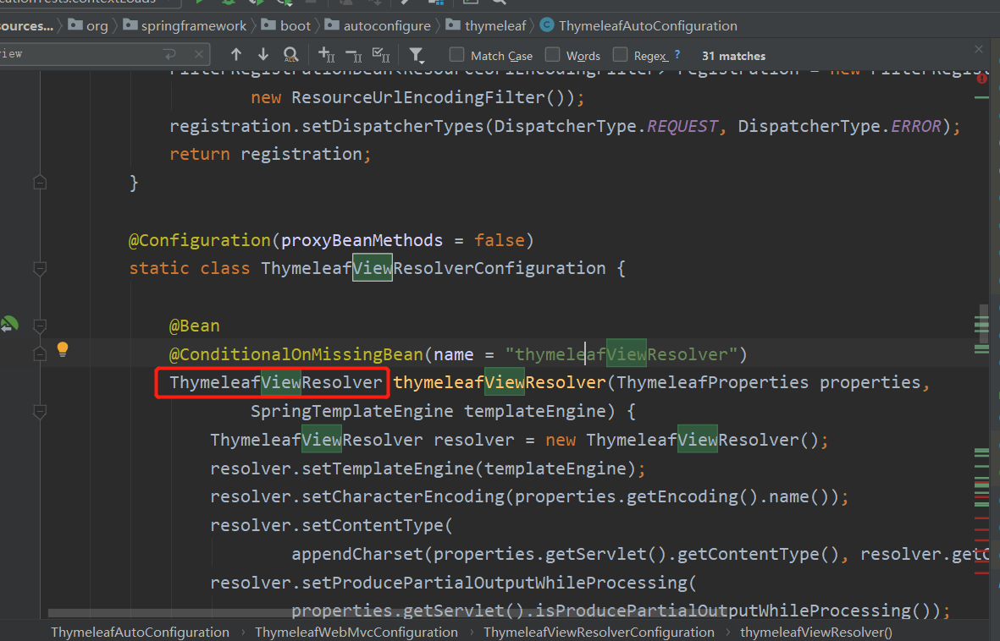

所以引入相关依赖后即可直接开发页面，ThymeleafProperties的默认属性如下：


可以看到默认的页面放在templates目录中。

##### 3、页面开发

在resources目录的templates目录下添加success.html:

```html
<!DOCTYPE html>
<html lang="en" xmlns:th="http://www.thymeleaf.org">
<head>
    <meta charset="UTF-8">
    <title>Title</title>
</head>
<body>
<h1 th:text="${msg}">哈哈</h1>
<h2>
    <a href="www.atguigu.com" th:href="${link}">去百度</a>  <br/>
    <a href="www.atguigu.com" th:href="@{link}">去百度2</a>
</h2>
</body>
</html>
```

添加响应的Controller

```java
package com.example.hellotest.Controller;

import org.springframework.stereotype.Controller;
import org.springframework.ui.Model;
import org.springframework.web.bind.annotation.GetMapping;

@Controller
public class ViewTestController {

    @GetMapping("/myView")
    public String myView(Model model){
        model.addAttribute("msg","hello");
        model.addAttribute("link","http://www.baidu.com");

        return "success";
    }
}
```

也可以给访问路径加上前缀：

```java
server:
  servlet:
    context-path: /test
```

